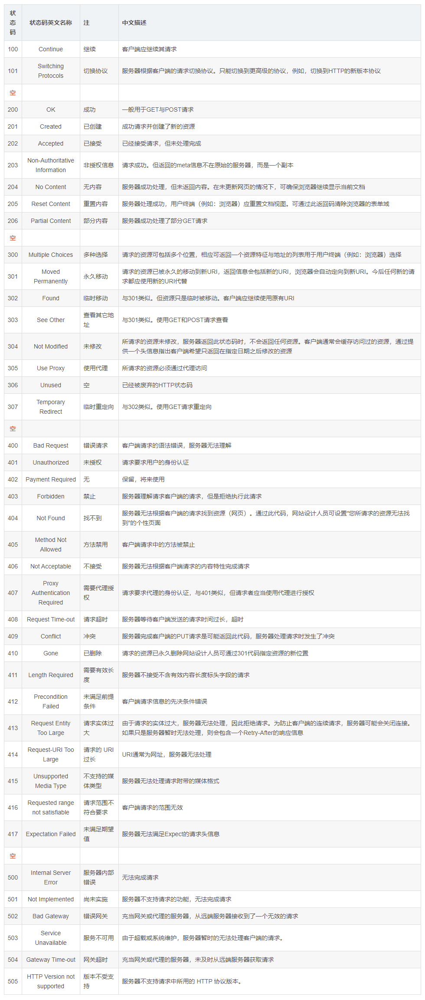

# HTTP 协议

## 1. 概述

- HTTP全称：Hyper Text Transfer Procotol 超文本传输协议
- HTML全称：Hyper Text Markup Language 超文本标记语言

HTTP 就是用来传输 HTML 的。用来规定浏览器与服务器之间网页数据传输的格式。

应用层的协议，基于 TCP/IP 协议。

# 扩展知识

## 1. http GET 和 POST 请求的优缺点和误区

### 1.1. get请求与post请求的区别

1. post更安全（不会作为url的一部分，不会被缓存、保存在服务器日志、以及浏览器浏览记录中）
2. post发送的数据更大（get有url长度限制）
3. post能发送更多的数据类型（get只能发送ASCII字符）
4. post比get慢
5. post用于修改和写入数据，get一般用于搜索排序和筛选之类的操作（淘宝，支付宝的搜索查询都是get提交），目的是资源的获取，读取数据

### 1.2. 为什么get比post更快

1. post请求包含更多的请求头
    - 因为post需要在请求的body部分包含数据，所以会多了几个数据描述部分的首部字段（如：content-type）
2. 最重要的一条，**post在真正接收数据之前会先将请求头发送给服务器进行确认，然后才真正发送数据**
    - post请求的过程：
        1. 浏览器请求tcp连接（第一次握手）
        2. 服务器答应进行tcp连接（第二次握手）
        3. 浏览器确认，并发送post请求头（第三次握手，这个报文比较小，所以http会在此时进行第一次数据发送）
        4. 服务器返回100 Continue响应
        5. 浏览器发送数据
        6. 服务器返回200 OK响应
    - get请求的过程：
        1. 浏览器请求tcp连接（第一次握手）
        2. 服务器答应进行tcp连接（第二次握手）
        3. 浏览器确认，并发送get请求头和数据（第三次握手，这个报文比较小，所以http会在此时进行第一次数据发送）
        4. 服务器返回200 OK响应
3. get会将返回的数据缓存起来，而post不会
    - 测试：使用ajax采用get方式请求静态数据（比如html页面，图片）的时候，如果两次传输的数据相同，第二次以后消耗的时间将会在10ms以内（chrome测试），而post每次消耗的时间都差不多。经测试，chrome和firefox下如果检测到get请求的是静态资源，则会缓存，如果是数据，则不会缓存，但是IE什么都会缓存起来，当然，应该没有人用post去获取静态数据
4. post不能进行管道化传输

### 1.3. get传参最大长度的理解误区

1. 总结
    1. http协议并未规定get和post的长度限制
    2. get的最大长度限制是因为浏览器和web服务器限制了URL的长度
    3. 不同的浏览器和web服务器，限制的最大长度不一样
    4. 要支持IE，则最大长度为2083byte，若支持Chrome，则最大长度8182byte
2. 误解
    1. 首先即使get有长度限制，也是限制的整个URL的长度，而不仅仅是参数值数据长度，http协议从未规定get/post的请求长度限制是多少
    2. 所谓的请求长度限制是由浏览器和web服务器决定和设置的，各种浏览器和web服务器的设定均不一样，这依赖于各个浏览器厂家的规定或者可以根据web服务器的处理能力来设定。IE 和 Safari 浏览器 限制 2k，Opera 限制4k，Firefox 限制 8k（非常老的版本 256byte），如果超出了最大长度，大部分的服务器直接截断，也有一些服务器会报414错误。
3. 各个浏览器和web服务器的最大长度总结
    - 浏览器
        1. IE：IE浏览器（Microsoft Internet Explorer） 对url长度限制是2083（2K+53），超过这个限制，则自动截断（若是form提交则提交按钮不起作用）。
        2. firefox：firefox（火狐浏览器）的url长度限制为 65536字符，但实际上有效的URL最大长度不少于100,000个字符。
        3. chrome：chrome（谷歌）的url长度限制超过8182个字符返回本文开头时列出的错误。
        4. Safari：Safari的url长度限制至少为 80 000 字符。
        5. Opera：Opera 浏览器的url长度限制为190 000 字符。Opera9 地址栏中输入190000字符时依然能正常编辑。
    - 服务器
        1. Apache：Apache能接受url长度限制为8 192 字符
        2. IIS：Microsoft Internet Information Server(IIS)能接受url长度限制为16384个字符。这个是可以通过修改的（IIS7）`configuration/system.webServer/security/requestFiltering/requestLimits@maxQueryStringsetting.`

## 2. HTTP状态码表

### 2.1. HTTP状态码

当浏览者访问一个网页时，浏览者的浏览器会向网页所在服务器发出请求。当浏览器接收并显示网页前，此网页所在的服务器会返回一个包含HTTP状态码的信息头（server header）用以响应浏览器的请求。

HTTP状态码的英文为HTTP Status Code。下面是常见的HTTP状态码：

- 200 - 请求成功
- 301 - 资源（网页等）被永久转移到其它URL
- 404 - 请求的资源（网页等）不存在
- 500 - 内部服务器错误

### 2.2. HTTP状态码的分类

HTTP状态码由三个十进制数字组成，第一个十进制数字定义了状态码的类型，后两个数字没有分类的作用。HTTP状态码共分为5种类型：

| 分类  |                   详解                    |
| :---: | ----------------------------------------- |
| `1**` | 信息，服务器收到请求，需要请求者继续执行操作   |
| `2**` | 成功，操作被成功接收并处理                   |
| `3**` | 重定向，需要进一步的操作以完成请求            |
| `4**` | 客户端错误，请求包含语法错误或无法完成请求     |
| `5**` | 服务器错误，服务器在处理请求的过程中发生了错误 |

### 2.3. HTTP状态码列表

