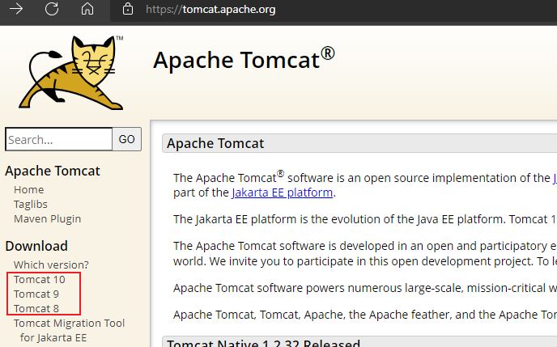
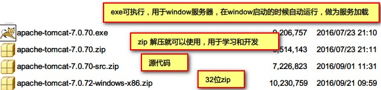
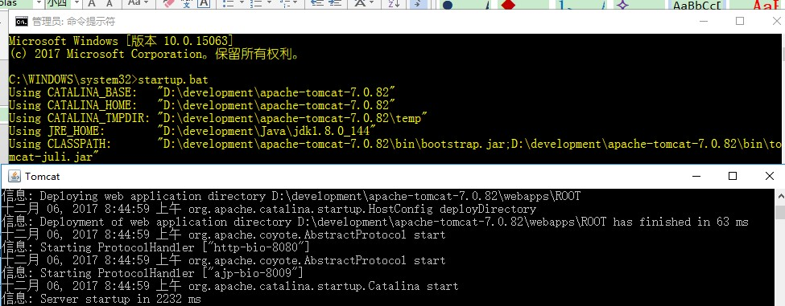
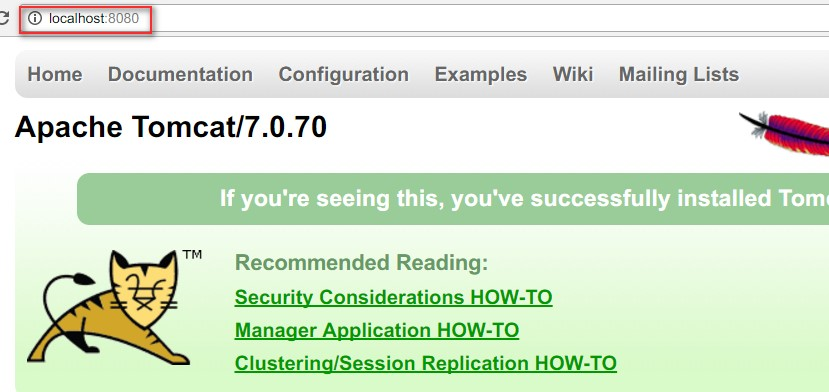
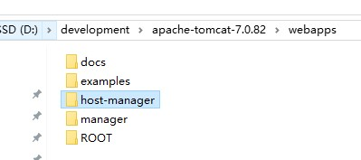
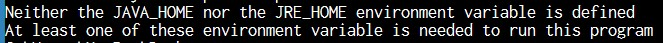
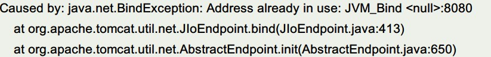
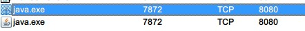
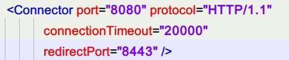
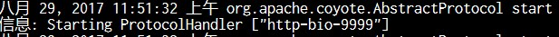

# Web 服务器

## 1. 软件架构

### 1.1. 客户端服务器模式（CS: Client/Server）

CS的特点：

- 客户端安装必须安装软件
- 如果服务器端升级，所有的客户端都必须升级
- 程序员<font color=red>**主要是开发客户端**</font>。如：QQ

CS 的优点：

- 用户体验比较好，界面比较美观。
- 安全控制比较好，本地安全性相对高一些。
- 服务器负荷比较低，本地会处理一些计算功能。

CS 的缺点：

- 占用硬盘空间，软件安装要空间。
- 维护麻烦，如果服务器升级，所有的客户端都要升级
- 安装一些软件依赖其它的环境

### 1.2. 浏览器/服务器模式（BS：Browser/Server）

BS的特点

- 客户端不需要安装，只要有浏览器就可以了，浏览器一般系统都有。
- 如果服务器升级，客户端不用升级，直接可以使用
- 程序员开发<font color=red>**主要是针对服务器端**</font>

BS的优点：

- 维护升级比较方便，无缝升级，服务器升级就可以了。客户端几乎不需要升级
- 客户端无需安装，有浏览器就可以了。

BS的缺点：

- 表示层效果美观没有CS效果漂亮
- 浏览器端的安全控制比较低，要加强安全的话再使用其它工具，银行使用U盾。
- 服务器负载比较重，所有的计算都在服务器端。

### 1.3. 静态网站与动态网站

<font color=red>**程序是否在服务器端运行，是静态网站与动态网站重要标志**</font>

#### 1.3.1. 概述

- **静态网站**：<font color=red>运行于客户端的网页属于静态网页</font>，例如html页、Flash、JavaScript、VBScript等等，只要不是主动去修改，则网页是永远不变的。
- **动态网站**：<font color=red>在服务器端运行的程序属于动态网页</font>，它们会随不同客户、不同时间，返回不同的网页，例如PHP、JSP、ASP.net等。

#### 1.3.2. 两者的区别

- 后缀名

静态网站 HTML 或 HTM，动态网站：jsp、php、asp

- 交互行为

看看浏览器与服务器是否有交互，**程序是否在服务器端运行，是重要标志**。

#### 1.3.3. 静态网站的特点

静态网页是相对于动态网页而言，是指没有后台数据库、不含程序、不可交互的网页。你编的是什么它显示的就是什么、不会有任何改变。

#### 1.3.4. 动态网站的特点

1. 动态网页以数据库技术为基础，可以大大减少降低网站维护的工作量；
2. 采用动态网页技术的网站可以实现更多的功能，如用户注册、用户登录、在线调查、用户管理、订单管理等等；
3. 动态网页实际上并不是独立存在于服务器上的网页文件，只有当用户请求时服务器才返回一个完整的网页，在浏览器端看到的其实是动态程序运行的结果

## 2. Web服务器（重点）

### 2.1. 服务器概述

#### 2.1.1. 什么是服务器

- 硬件：就是一台性能强大的电脑，只是硬盘配置很高。内存大，CPU 数量多。硬盘多，网卡多。
- 软件：安装了不同服务器软件，它就是不同的类型服务器。如：Web 服务器，就是安装了 Web 容器 Tomcat

#### 2.1.2. 服务器分类

- 数据库服务器：MySQL 和 Oracle
- Web服务器，安装 Web 软件，如：Tomcat
- 邮件服务器：收邮件和发送邮件

Web 容器就是指 Web 服务器，容器中存放的就是 Java 代码。后期所有的 Java 代码都是运行在 Tomcat 中。

一个 Java Web 服务器是需要实现部分或全部的 JavaEE 规范。

### 2.2. JavaEE规范

在 Java 中所有的服务器要实现一组 Oracle 公司规定的接口，这些接口称为 JavaEE 规范。不同厂商的 JavaWeb 服务器都实现了这些接口。在 JavaEE 中一共有13种规范。

常见的 JavaEE 规范有：JDBC、XML、JSP、Servlet、EJB 等。

### 2.3. Web服务器概述

<font color=red>**使用 Java 程序编写的 Web 容器**</font>，运行在服务器端，它可以调用 Java 程序 Servlet，对用户的请求做出处理，并且返回响应给浏览器。将服务器的资源发送给浏览器。

Web 服务器：由 Java 语言编写。就是实现了JavaEE 规范的 Java 程序。可以调用放在自己容器内部的 Java 程序，如：Servlet。

### 2.4. 常见的Web服务器

- Weblogic：大型服务器
- WebSphere：大型服务器
- GlassFish：小型服务器
- <font color=red>**Tomcat**</font>：免费的 Web 服务器，属于小型，该服务器支持全部 JSP 以及 Servlet 规范。在小型的应用系统或者有特殊需要的系统中使用

## 3. Tomcat

### 3.1. Tomcat 的下载和安装

官网：https://tomcat.apache.org/



Apache Tomcat Versions 一览表（2022.03.26 更新）

| Servlet Spec | JSP Spec | EL Spec | WebSocket Spec | Authentication (JASPIC) Spec | Apache Tomcat Version | Latest Released Version |         Supported Java Versions         |
| ------------ | -------- | ------- | -------------- | ---------------------------- | --------------------- | ----------------------- | --------------------------------------- |
| 6.0          | 3.1      | 5.0     | 2.1            | 3.0                          | 10.1.x                | 10.1.0-M12 (alpha)      | 11 and later                            |
| 5.0          | 3.0      | 4.0     | 2.0            | 2.0                          | 10.0.x                | 10.0.18                 | 8 and later                             |
| 4.0          | 2.3      | 3.0     | 1.1            | 1.1                          | 9.0.x                 | 9.0.60                  | 8 and later                             |
| 3.1          | 2.3      | 3.0     | 1.1            | 1.1                          | 8.5.x                 | 8.5.77                  | 7 and later                             |
| 3.1          | 2.3      | 3.0     | 1.1            | N/A                          | 8.0.x (superseded)    | 8.0.53 (superseded)     | 7 and later                             |
| 3.0          | 2.2      | 2.2     | 1.1            | N/A                          | 7.0.x (archived)      | 7.0.109 (archived)      | 6 and later (7 and later for WebSocket) |
| 2.5          | 2.1      | 2.1     | N/A            | N/A                          | 6.0.x (archived)      | 6.0.53 (archived)       | 5 and later                             |
| 2.4          | 2.0      | N/A     | N/A            | N/A                          | 5.5.x (archived)      | 5.5.36 (archived)       | 1.4 and later                           |
| 2.3          | 1.2      | N/A     | N/A            | N/A                          | 4.1.x (archived)      | 4.1.40 (archived)       | 1.3 and later                           |
| 2.2          | 1.1      | N/A     | N/A            | N/A                          | 3.3.x (archived)      | 3.3.2 (archived)        | 1.1 and later                           |

### 3.2. 安装包的类别



使用 zip 版本，直接解压到任意的文件夹便可使用。

### 3.3. 启动与关闭 - 命令行方式

#### 3.3.1. 启动

1. 解压 zip 文件到目录，*目录名称最好是没有空格与中文*
2. 在 window 的添加环境变量，即可以直接运行 tomcat\bin 目录下的可执行文件

```
# 新增的环境变量
CATALINA_HOME = %tomcat安装目录%

# 指定运行路径
Path = %CATALINA_HOME%\bin 
```

3. 使用 cmd 命令行，运行 `startup.bat`。*注：前提是配置了tomcat的环境变量，否则需要 `全路径名称\tomcat\bin\startup.bat`*



4. 启动成功，访问默认地址 `http://localhost:8080`，打开欢迎界面



#### 3.3.2. 关闭

启动 cmd 命令行，输入以下命令

```bash
# 配置了环境变量
shutdown.bat

# 直接进入目录路径进行关闭
全路径名称\tomcat\bin\shutdown.bat
```

### 3.4. Tomcat目录结构

|    目录名     |                                                                                              作用                                                                                              |
| :---------: | --------------------------------------------------------------------------------------------------------------------------------------------------------------------------------------------- |
|   **bin**   | tomcat的可执行的程序，bat批处理文件，启动或关闭tomcat                                                                                                                                                 |
|  **conf**   | tomcat服务器的配置文件夹，常用的配置文件都在这里，如：<br/>web.xml：Web服务器的部署描述文件<br/>server.xml：服务器启动读取配置的文件，如果文件有错误，tomcat启动会失败<br/>tomcat-users.xml：用于配置tomcat管理员的配置文件 |
|   **lib**   | tomcat启动的时候必须的jar库，第三方支持库也可以放在这里                                                                                                                                                |
|  **logs**   | 日志记录，服务器启动和关闭或运行过程中记录的信息，扩展名.log，文本文件                                                                                                                                     |
|  **temp**   | 用于存放服务器运行过程中的临时文件，垃圾文件                                                                                                                                                           |
| **webapps** | 开发的Java项目发布文件夹，所有的项目都要复制到这个目录下，才可以给客户端浏览器使用。如：<br/>文件：/webapps/hello/1.html  访问：`http://localhost:8080/hello/1.html`                                             |
|  **work**   | tomcat 的工作目录，存放 jsp 生成的 servlet 代码地方                                                                                                                                                 |

webapps 目录下原有文件



### 3.5. Tomcat 项目的发布方式

#### 3.5.1. 方式一(最常用)

直接将网页复制（或新建）到【webapps\工程名】目录下

- 服务器地址：`c:\apache-tomcat-7.0.70\webapps\javaee\a.html`
- 浏览器上URL：`http://localhost:8080/javaee/a.html`

#### 3.5.2. 方式二

将网页复制到 ROOT 文件夹。

- 将项目复制到 ROOT 下
- 修改 WEB-INF/web.xml

此时 tomcat 欢迎页面，即：http://localhost:8080，其实就是 ROOT\index.jsp

### 3.6. Tomcat的启动常见的问题

#### 3.6.1. 未设置 JAVA_HOME 环境变量

出错信息：



解决办法：安装好 JDK，至少要配置 `JAVA_HOME` 或 `JRE_HOME` 这两环境变量中的一个

#### 3.6.2. 端口被占用

如果占用了 8080 端口，再启动 Tomcat，启动会失败

出错信息不仅在屏幕上显示，同时也会记录到日志文件中。



解决方法一：把占用端口的程序退出，不再占用 8080 端口。*使用软件 cports.exe 可以查看目前电脑端口的使用状态*



解决方法二：找到 conf\server.xml 修改 tomcat 的端口号，并且重新启动web容器





