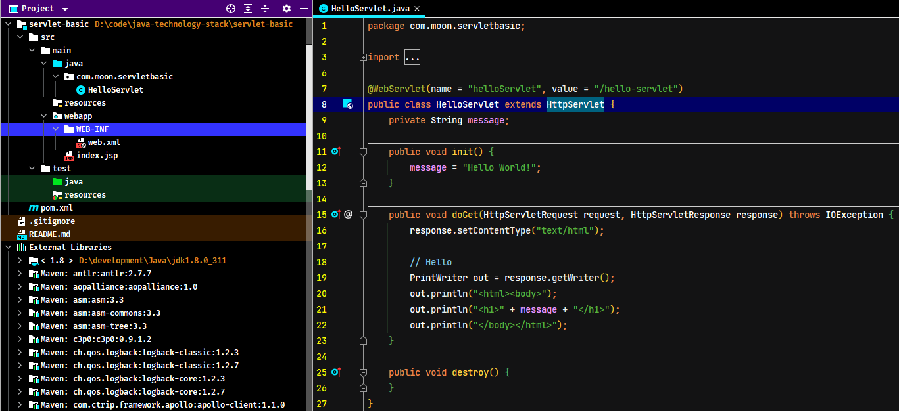

# Servlet

## 1. Servlet概述

javax.servlet.Servlet，是一个接口

Servlet 是运行在 Web 服务器（如：Tomcat）上的 Java 小应用程序，由Tomcat去调用，没有main函数。

每个 Servlet 都要在 web.xml 中进行配置。Servlet 就是一个 Java 类，运行在 Web 容器中，接收并响应用户的请求并且对用户的请求做出响应。通常通过 HTTP 协议实现。

### 1.1. Servlet的生命周期方法

### 1.2. Servlet 的运行过程

每个 Servlet 在 Web 容器中只有一个对象，一个类只有一个对象，称为**单例模式**

一个 Servlet 类在 tomcat 中只创建一个对象，等到服务器关闭才销毁，平时是常驻内存的。 

`ServletRequest` 和 `ServletResponse` 是两个接口，Servlet 是运行在 Tomcat 中，**在 service 方法中两个 request 和 response 对象，是由 tomcat 创建出来，并且实例化，由 tomcat 调用 service 方法并且把这两个参数传递进来**。

1. 解析web.xml文件，使用dom4j之类工具。
2. 得到类全名，通过反射实例化Servlet
3. 创建request和response对象，调用service()方法，传递2个对象给方法。

## 2. JavaWeb 项目开发步骤

### 2.1. 使用 IDEA 开发 JavaEE 项目

1. 在开发环境中准备好 tomcat，在 IDEA 中创建 application serviers，选择本地的 tomcat 目录即可

2. 创建项目（Java Enterprise）：项目命名、项目所在目录、项目的 Java 版本、tomcat 服务器等

3. 选择项目需要的依赖

4. 创建后目录结构

**web.xml 是项目的描述文件，servlet 的配置放在这个文件中**

5. 创建完项目后，可以右键点击项目，选择【Edit Configuration】，修改项目的默认根目录的地址、端口号等

