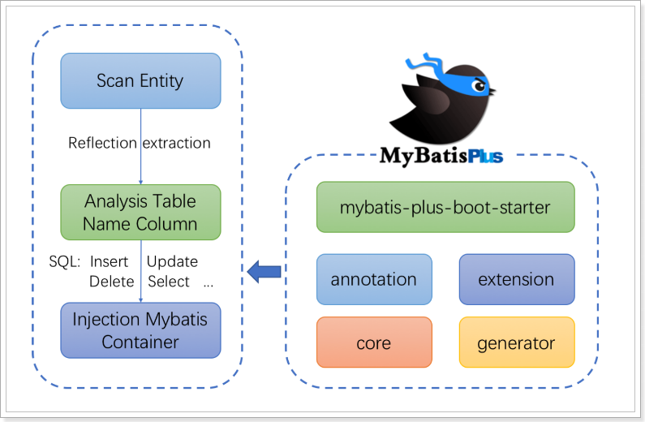
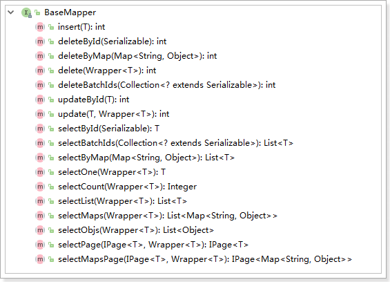
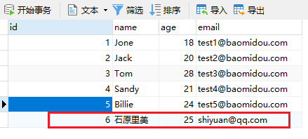
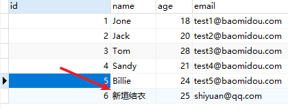
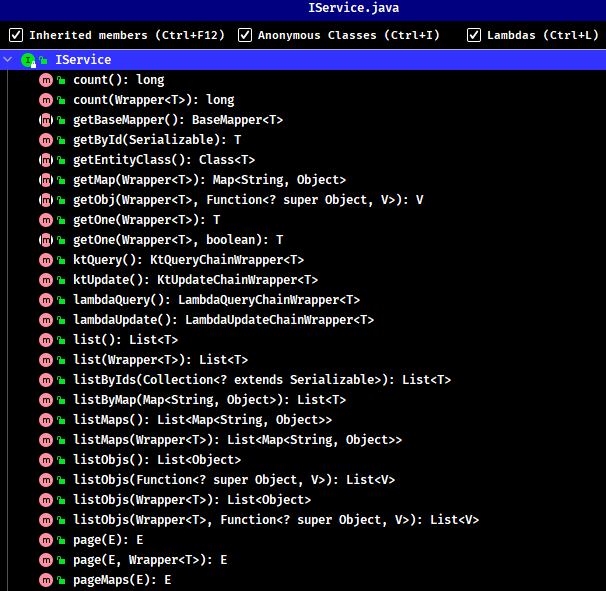
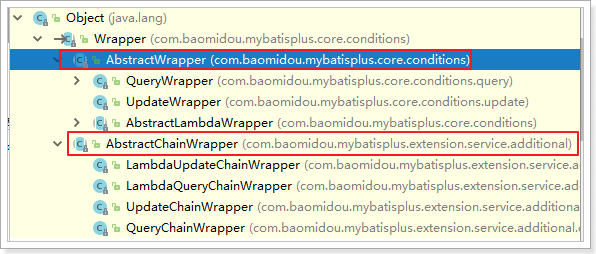
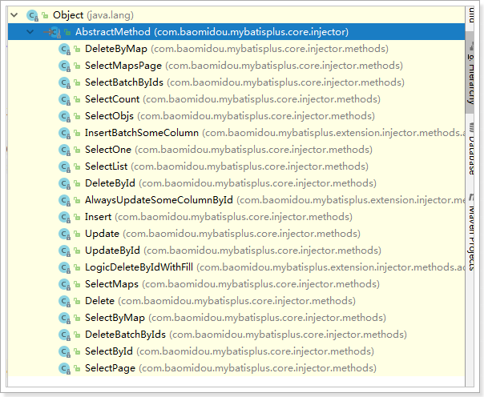
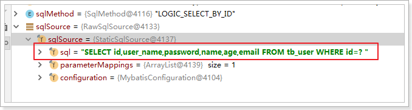

# MyBatisPlus （MyBatis 的增强工具）

## 1. MyBatis-Plus 简介

MyBatis-Plus（简称 MP）是一个 MyBatis 的增强工具，在 MyBatis 的基础上只做增强不做改变，为简化开发、提高效率而生

- 官网：https://baomidou.com/
- 文档地址：https://baomidou.com/guide/
- 源码地址：https://github.com/baomidou/mybatis-plus
- 码云地址：https://gitee.com/baomidou/mybatis-plus

### 1.1. 特性

- **无侵入**：只做增强不做改变，引入它不会对现有工程产生影响，如丝般顺滑
- **损耗小**：启动即会自动注入基本 CURD，性能基本无损耗，直接面向对象操作
- **强大的 CRUD 操作**：内置通用 Mapper、通用 Service，仅仅通过少量配置即可实现单表大部分 CRUD 操作，更有强大的条件构造器，满足各类使用需求
- **支持 Lambda 形式调用**：通过 Lambda 表达式，方便的编写各类查询条件，无需再担心字段写错
- **支持多种数据库**：支持 MySQL、MariaDB、Oracle、DB2、H2、HSQL、SQLite、Postgre、SQLServer2005、SQLServer 等多种数据库
- **支持主键自动生成**：支持多达 4 种主键策略（内含分布式唯一 ID 生成器 - Sequence），可自由配置，完美解决主键问题
- **支持 XML 热加载**：Mapper 对应的 XML 支持热加载，对于简单的 CRUD 操作，甚至可以无 XML 启动
- **支持 ActiveRecord 模式**：支持 ActiveRecord 形式调用，实体类只需继承 Model 类即可进行强大的 CRUD 操作
- **支持自定义全局通用操作**：支持全局通用方法注入（ Write once, use anywhere ）
- **支持关键词自动转义**：支持数据库关键词（order、key......）自动转义，还可自定义关键词
- **内置代码生成器**：采用代码或者 Maven 插件可快速生成 Mapper 、 Model 、 Service 、 Controller 层代码，支持模板引擎，更有超多自定义配置等您来使用
- **内置分页插件**：基于 MyBatis 物理分页，开发者无需关心具体操作，配置好插件之后，写分页等同于普通 List 查询
- **内置性能分析插件**：可输出 Sql 语句以及其执行时间，建议开发测试时启用该功能，能快速揪出慢查询
- **内置全局拦截插件**：提供全表 delete 、 update 操作智能分析阻断，也可自定义拦截规则，预防误操作
- **内置 Sql 注入剥离器**：支持 Sql 注入剥离，有效预防 Sql 注入攻击

### 1.2. 架构



### 1.3. 示例项目说明

示例项目代码位置：`mybatis-note\mybatis-plus-samples\`

github 位置：https://github.com/MooNkirA/mybatis-note/tree/master/mybatis-plus-samples

## 2. MyBatis-Plus 快速入门示例

### 2.1. 创建示例数据库以及表

脚本的位置：`mybatis-note\mybatis-plus-samples\document\sql\mysql-sample.sql`

### 2.2. SpringBoot + Mybatis + MP

#### 2.2.1. 引入依赖

```xml
<dependencies>
    <dependency>
        <groupId>org.springframework.boot</groupId>
        <artifactId>spring-boot-starter</artifactId>
    </dependency>
    <dependency>
        <groupId>mysql</groupId>
        <artifactId>mysql-connector-java</artifactId>
        <version>8.0.26</version>
        <scope>runtime</scope>
    </dependency>
    <dependency>
        <groupId>com.baomidou</groupId>
        <artifactId>mybatis-plus-boot-starter</artifactId>
        <version>3.4.3.4</version>
    </dependency>
    <dependency>
        <groupId>org.springframework.boot</groupId>
        <artifactId>spring-boot-starter-test</artifactId>
        <scope>test</scope>
    </dependency>

    <dependency>
        <groupId>org.assertj</groupId>
        <artifactId>assertj-core</artifactId>
        <scope>test</scope>
    </dependency>
    <dependency>
        <groupId>org.projectlombok</groupId>
        <artifactId>lombok</artifactId>
        <scope>provided</scope>
    </dependency>
</dependencies>
```

#### 2.2.2. 配置

- 在 `application.yml` 配置文件中添加数据库的相关配置：

```yml
spring:
  # DataSource Config
  datasource:
    driver-class-name: com.mysql.cj.jdbc.Driver
    url: jdbc:mysql://127.0.0.1:3306/mybatis_plus_sample_db?useSSL=false&useUnicode=true&characterEncoding=UTF-8
    username: root
    password: ****
```

- 在 Spring Boot 启动类中添加 `@MapperScan` 注解，扫描 Mapper 文件夹：

```java
@SpringBootApplication
@MapperScan("com.moon.mybatisplus.mapper") // 设置mapper接口的扫描包
public class QuickstartApplication {
    public static void main(String[] args) {
        SpringApplication.run(QuickstartApplication.class, args);
    }
}
```

#### 2.2.3. 创建实体类

```java
@Data
public class User {
    private Long id;
    private String name;
    private Integer age;
    private String email;
}
```

#### 2.2.4. 编写 mapper 接口

```java
import com.baomidou.mybatisplus.core.mapper.BaseMapper;
import com.moon.mybatisplus.entity.User;

public interface UserMapper extends BaseMapper<User> {
}
```

#### 2.2.5. 编写测试用例

```java
@SpringBootTest
public class BaseTest {
    @Autowired
    private UserMapper userMapper;

    @Test
    public void testSelect() {
        System.out.println(("----- selectAll method test ------"));
        List<User> userList = userMapper.selectList(null);
        Assertions.assertEquals(5, userList.size());
        userList.forEach(System.out::println);
    }
}
```

### 2.3. 项目入门示例

> 注：此快速入门示例是在好客租房项目开发时的入门示例，代码位置在`haoke-project\haoke-technology-stack-sample\sample-mybatis-plus`

#### 2.3.1. 创建数据库与相关表格

- 创建数据库

```sql
create database haoke default character set utf8;
```

- 创建相关数据库表与测试数据

```sql
SET NAMES utf8mb4;
SET FOREIGN_KEY_CHECKS = 0;

DROP TABLE IF EXISTS `user`;
CREATE TABLE `user`  (
  `id` bigint(20) NOT NULL AUTO_INCREMENT COMMENT '主键ID',
  `name` varchar(30) CHARACTER SET utf8 COLLATE utf8_general_ci NULL DEFAULT NULL COMMENT '姓名',
  `age` int(11) NULL DEFAULT NULL COMMENT '年龄',
  `email` varchar(50) CHARACTER SET utf8 COLLATE utf8_general_ci NULL DEFAULT NULL COMMENT '邮箱',
  PRIMARY KEY (`id`) USING BTREE
) ENGINE = InnoDB CHARACTER SET = utf8 COLLATE = utf8_general_ci ROW_FORMAT = Dynamic;

INSERT INTO `user` VALUES (1, 'Jone', 18, 'test1@baomidou.com');
INSERT INTO `user` VALUES (2, 'Jack', 20, 'test2@baomidou.com');
INSERT INTO `user` VALUES (3, 'Tom', 28, 'test3@baomidou.com');
INSERT INTO `user` VALUES (4, 'Sandy', 21, 'test4@baomidou.com');
INSERT INTO `user` VALUES (5, 'Billie', 24, 'test5@baomidou.com');

SET FOREIGN_KEY_CHECKS = 1;
```

#### 2.3.2. 创建工程以及导入依赖

创建 jar 类型的`sample-mybatis-plus`示例工程，修改`pom.xml`文件引入相关依赖

```xml
<?xml version="1.0" encoding="UTF-8"?>
<project xmlns="http://maven.apache.org/POM/4.0.0"
         xmlns:xsi="http://www.w3.org/2001/XMLSchema-instance"
         xsi:schemaLocation="http://maven.apache.org/POM/4.0.0 http://maven.apache.org/xsd/maven-4.0.0.xsd">
    <!-- 添加SpringBoot parent支持 -->
    <parent>
        <groupId>org.springframework.boot</groupId>
        <artifactId>spring-boot-starter-parent</artifactId>
        <version>2.1.0.RELEASE</version>
    </parent>

    <modelVersion>4.0.0</modelVersion>
    <artifactId>sample-mybatis-plus</artifactId>
    <name>${project.artifactId}</name>
    <packaging>jar</packaging>
    <description>技术栈示例 - MyBatis-Plus快速入门示例</description>

    <dependencies>
        <!-- spring boot 依赖 -->
        <dependency>
            <groupId>org.springframework.boot</groupId>
            <artifactId>spring-boot-starter</artifactId>
        </dependency>
        <dependency>
            <groupId>org.springframework.boot</groupId>
            <artifactId>spring-boot-starter-test</artifactId>
            <scope>test</scope>
        </dependency>

        <!-- mybatis-plus的springboot支持（注：不需要再依赖mybatis，此插件已包含引入mybatis） -->
        <dependency>
            <groupId>com.baomidou</groupId>
            <artifactId>mybatis-plus-boot-starter</artifactId>
            <version>3.0.5</version>
        </dependency>
        <!-- mysql驱动 -->
        <dependency>
            <groupId>mysql</groupId>
            <artifactId>mysql-connector-java</artifactId>
            <version>5.1.47</version>
        </dependency>
        <!-- 实体类工具包 -->
        <dependency>
            <groupId>org.projectlombok</groupId>
            <artifactId>lombok</artifactId>
            <optional>true</optional>
            <version>1.18.4</version>
        </dependency>
    </dependencies>

    <!-- 项目构建 -->
    <build>
        <plugins>
            <plugin>
                <groupId>org.springframework.boot</groupId>
                <artifactId>spring-boot-maven-plugin</artifactId>
            </plugin>
        </plugins>
    </build>
</project>
```

#### 2.3.3. 编写项目的配置文件

编写 spring boot 项目的默认配置文件 `application.properties`

```properties
spring.application.name=sample-mybatis-plus
# 数据库(MySQl)相关配置
spring.datasource.driver-class-name=com.mysql.jdbc.Driver
spring.datasource.url=jdbc:mysql://192.168.12.134:3306/haoke?useUnicode=true&characterEncoding=utf8&autoReconnect=true&allowMultiQueries=true&useSSL=false
spring.datasource.username=root
spring.datasource.password=123456
```

#### 2.3.4. 创建实体类

```java
@Data
public class User {
    private Long id;
    private String name;
    private Integer age;
    private String email;
}
```

#### 2.3.5. 创建持久层 Mapper 接口

使用 MyBatis-Plus 插件，需要继承此工具框架提供的`public interface BaseMapper<T>`接口，泛型为接口操作的数据库表相应的实体类。此`BaseMapper<T>`接口时定义很多基础操作方法

```java
public interface UserMapper extends BaseMapper<User> { }
```

#### 2.3.6. 编写 SpringBoot 启动类

```java
// 设置mybatis框架对mapper接口的扫描包路径
@MapperScan("com.moon.sample.mybatisplus.mapper")
@SpringBootApplication
public class MyBatisPlusApplication {
    public static void main(String[] args) {
        SpringApplication.run(MyBatisPlusApplication.class, args);
    }
}
```

#### 2.3.7. 编写单元测试用例

```java
@RunWith(SpringRunner.class)
@SpringBootTest
public class UserMapperTest {
    // 注入测试的接口
    @Autowired
    private UserMapper userMapper;

    /* 基础的查询测试 */
    @Test
    public void selectTest(){
        List<User> users = this.userMapper.selectList(null);
        for (User user : users) {
            System.out.println(user);
        }
    }
}
```

运行测试用例，查看测试结果

## 3. BaseMapper（CRUD 基础接口）

在 Mybatis Plus 中，`BaseMapper`接口中定义了一些常用的 CRUD 方法，当自定义的`Mapper`接口继承`BaseMapper`后即可以获取到各种各样的单表操作。官方说明如下：



- 通用 CRUD 封装`BaseMapper`接口，为 `Mybatis-Plus` 启动时自动解析实体表关系映射转换为 `Mybatis` 内部对象注入容器
- 泛型 `T` 为任意实体对象
- 参数 `Serializable` 为任意类型主键 `Mybatis-Plus` 不推荐使用复合主键约定每一张表都有自己的唯一 `id` 主键
- 对象 `Wrapper` 为条件构造器

> <font color=red>**注：这些方法仅适合单表操作**</font>
>
> 官方文档地址：[Mapper CRUD 接口](https://baomidou.com/guide/crud-interface.html#mapper-crud-%E6%8E%A5%E5%8F%A3)

### 3.1. 新增操作

```java
@Test
public void testSave(){
    User user = new User();
    user.setAge(25);
    user.setEmail("shiyuan@qq.com");
    user.setName("石原里美");
    int count = this.userMapper.insert(user);
    System.out.println("新增数据成功! count => " + count);
}
```

#### 3.1.1. 设置主键 ID 生成策略

上面示例数据插入结果：


可以看到，数据已经写入到了数据库，但是，id 的值不正确。期望的是数据库自增长，实际是 MP 生成了 id 的值写入到了数据库。

如何设置 id 的生成策略呢？需要修改操作的表相应的实体类，增加 MP 的 id 策略为自增长。_注：数据库表的 id 字段也需要设置为自增长_

```java
@Data
public class User {
    @TableId(value = "id", type = IdType.AUTO)
    private Long id;
    private String name;
    private Integer age;
    private String email;
}
```

> MP 支持的 id 策略详见源码`com.baomidou.mybatisplus.annotation.IdType`

再次运行测试，查看结果



### 3.2. 更新操作

在 MP 中，更新操作有 2 种，一种是根据 id 更新，另一种是根据条件更新。

#### 3.2.1. 根据 ID 更新数据

源码方法定义：

```java
/**
 * 根据 ID 修改
 *
 * @param entity 实体对象
 */
int updateById(@Param(Constants.ENTITY) T entity);
```

根据 id 修改数据，只会修改传的对象的属性不为 null 的相应字段。

```java
@Test
public void testUpdateById() {
    User u1 = new User();
    u1.setId(5L);
    u1.setName("新垣结衣");

    // 返回的result是受影响的行数
    int result = userMapper.updateById(u1);
    System.out.println("根据id更新影响行数：" + result);
}
```



#### 3.2.2. 根据 Wrapper 条件更新

源码方法定义：

```java
/**
 * 根据 whereEntity 条件，更新记录
 *
 * @param entity        实体对象 (set 条件值,可以为 null)
 * @param updateWrapper 实体对象封装操作类（可以为 null,里面的 entity 用于生成 where 语句）
 */
int update(@Param(Constants.ENTITY) T entity, @Param(Constants.WRAPPER) Wrapper<T> updateWrapper);
```

可以有两种方式更新数据

- 方式 1: 通过 QueryWrapper 对象更新
- 方式 2：通过 LambdaUpdateWrapper<T>对象更新

```java
@Test
public void testUpdateByWrapper() {
    // 方式1: 通过QueryWrapper对象更新
    User user = new User();
    user.setEmail("mk@moon.com");
    int result1 = userMapper.update(user, new QueryWrapper<User>().lambda().eq(User::getId, 4L));
    System.out.println("影响行数result1：" + result1);
    assertThat(result1).isGreaterThan(0);

    // 方式2：通过LambdaUpdateWrapper<T>对象更新
    int result2 = userMapper.update(null, Wrappers.<User>lambdaUpdate().set(User::getEmail, null).eq(User::getId, 3L));
    System.out.println("影响行数result1：" + result2);
    assertThat(result2).isGreaterThan(0);
}
```

### 3.3. 删除操作

#### 3.3.1. 根据 ID 删除

源码方法定义：

```java
/**
 * 根据 ID 删除
 *
 * @param id 主键ID
 */
int deleteById(Serializable id);

/**
 * 根据实体(ID)删除
 *
 * @param entity 实体对象
 * @since 3.4.4
 */
int deleteById(T entity);
```

示例：

```java
@Test
public void testDeleteById() {
    // 直接根据id值删除
    int result1 = userMapper.deleteById("1452460873191886851");
    System.out.println("根据id删除影响行数：" + result1);

    // 根据实体对象(ID)主键属性删除
    User user = new User();
    user.setId(1452460873191886852L);
    int result2 = userMapper.deleteById(user);
    System.out.println("根据实体对象(ID)删除影响行数：" + result2);
}
```

#### 3.3.2. 根据 columnMap 条件删除

源码方法定义：

```java
/**
 * 根据 columnMap 条件，删除记录
 *
 * @param columnMap 表字段 map 对象
 */
int deleteByMap(@Param(Constants.COLUMN_MAP) Map<String, Object> columnMap);
```

示例

```java
@Test
public void testDeleteByMap() {
    // 创建 map 条件
    Map<String, Object> columnMap = new HashMap<>();
    columnMap.put("age", 24);
    columnMap.put("name", "石原里美");

    // 根据 columnMap 的元素设置为删除的条件，多个值之间为and关系
    int result = userMapper.deleteByMap(columnMap);
    System.out.println("根据 Map 条件删除影响行数：" + result);
}
```

#### 3.3.3. 根据 Wrapper 对象条件删除

源码方法定义：

```java
/**
 * 根据 entity 条件，删除记录
 *
 * @param queryWrapper 实体对象封装操作类（可以为 null,里面的 entity 用于生成 where 语句）
 */
int delete(@Param(Constants.WRAPPER) Wrapper<T> queryWrapper);
```

示例：

```java
@Test
public void testDeleteByWrapper() {
    // 创建实体对象查询条件
    User user = new User();
    user.setAge(24);
    user.setName("石原里美");

    // 将实体对象进行包装，包装为查询操作条件
    Wrapper<User> wrapper = new QueryWrapper<>(user);
    int result = userMapper.delete(wrapper);
    System.out.println("根据 Wrapper 对象条件删除影响行数：" + result);
}
```

#### 3.3.4. 根据 ID 集合批量删除

源码方法定义：

```java
/**
 * 删除（根据ID 批量删除）
 *
 * @param idList 主键ID列表(不能为 null 以及 empty)
 */
int deleteBatchIds(@Param(Constants.COLLECTION) Collection<? extends Serializable> idList);
```

示例：

```java
@Test
public void testDeleteBatchIds() {
    // 创建ID集合批量删除
    int result = userMapper.deleteBatchIds(Arrays.asList(1L, 2L, 4L, 5L));
    System.out.println("根据id批量删除影响行数：" + result);
}
```

### 3.4. 查询操作

MP 提供了多种查询操作，包括根据 id 查询、批量查询、查询单条数据、查询列表、分页查询、根据条件查询等操作。

#### 3.4.1. selectById - 根据 id 查询

源码方法定义：

```java
/**
 * 查询（根据ID 批量查询）
 *
 * @param idList 主键ID列表(不能为 null 以及 empty)
 */
List<T> selectBatchIds(@Param(Constants.COLLECTION) Collection<? extends Serializable> idList);
```

示例：

```java
@Test
public void testSelectById() {
    // 根据ID查询
    User user = userMapper.selectById(3L);
    System.out.println("根据id查询结果：" + user);
}
```

#### 3.4.2. selectBatchIds - 根据 ID 批量查询

源码方法定义：

```java
/**
 * 查询（根据ID 批量查询）
 *
 * @param idList 主键ID列表(不能为 null 以及 empty)
 */
List<T> selectBatchIds(@Param(Constants.COLLECTION) Collection<? extends Serializable> idList);
```

示例：

```java
@Test
public void testSelectBatchIds() {
    List<TableUser> users = tableUserMapper.selectBatchIds(Arrays.asList(1L, 2L, 4L, 5L));
    System.out.println("根据id批量查询结果：" + users);
}
```

#### 3.4.3. selectOne - 查询单条记录

源码方法定义：

```java
/**
 * 根据 entity 条件，查询一条记录
 * <p>查询一条记录，例如 qw.last("limit 1") 限制取一条记录, 注意：多条数据会报异常</p>
 *
 * @param queryWrapper 实体对象封装操作类（可以为 null）
 */
default T selectOne(@Param(Constants.WRAPPER) Wrapper<T> queryWrapper)
```

示例：

```java
@Test
public void testSelectOne() {
    // 创建查询条件
    QueryWrapper<TableUser> wrapper = new QueryWrapper<>();
    wrapper.eq("name", "Tom");
    // 根据条件查询一条数据，如果结果超过一条会报错
    TableUser user = tableUserMapper.selectOne(wrapper);
    System.out.println("查询结果：" + user);
}
```

#### 3.4.4. selectCount - 查询总记录数

源码方法定义：

```java
/**
 * 根据 Wrapper 条件，查询总记录数
 *
 * @param queryWrapper 实体对象封装操作类（可以为 null）
 */
Long selectCount(@Param(Constants.WRAPPER) Wrapper<T> queryWrapper);
```

示例：

```java
@Test
public void testSelectCount() {
    // 创建查询条件
    QueryWrapper<TableUser> wrapper = new QueryWrapper<>();
    wrapper.ge("age", 21); // 查询年龄大于等于21
    // 根据条件查询数据条数
    Long count = tableUserMapper.selectCount(wrapper);
    System.out.println("查询总记录数：" + count);
}
```

#### 3.4.5. selectList - 条件查询

源码方法定义：

```java
/**
 * 根据 entity 条件，查询全部记录
 *
 * @param queryWrapper 实体对象封装操作类（可以为 null）
 */
List<T> selectList(@Param(Constants.WRAPPER) Wrapper<T> queryWrapper);
```

示例：

```java
/* 条件查询记录 */
@Test
public void testSelectList() {
    // 方式1：创建 QueryWrapper 查询条件
    QueryWrapper<TableUser> wrapper = new QueryWrapper<>();
    wrapper.ge("age", 21); // 查询年龄大于等于21
    // 根据条件查询数据
    List<TableUser> users = tableUserMapper.selectList(wrapper);
    System.out.println("QueryWrapper 查询结果：" + users);

    // 方式1：创建 lambdaQuery 查询条件
    List<User> userList = userMapper.selectList(Wrappers.<User>lambdaQuery().select(User::getId, User::getName));
    // 上面是查询所有记录，但只返回id与name属性
    System.out.println("LambdaQueryWrapper 查询结果：" + userList);
}
```

#### 3.4.6. selectPage - 分页查询

源码方法定义：

```java
/**
 * 根据 entity 条件，查询全部记录（并翻页）
 *
 * @param page         分页查询条件（可以为 RowBounds.DEFAULT）
 * @param queryWrapper 实体对象封装操作类（可以为 null）
 */
<P extends IPage<T>> P selectPage(P page, @Param(Constants.WRAPPER) Wrapper<T> queryWrapper);
```

使用 MyBatis-Plus 进行分页查询操作，需要在项目中启动类（或者配置类）创建分页插件，并注册到 spring 的 ioc 容器中。_更多分页插件详细用法，详见《分页插件》章节_

```java
@Configuration
@MapperScan("com.moon.mybatisplus.mapper")
public class MybatisPlusConfig {
    // 创建MyBatis-Plus的分页插件(旧版)
    /*@Bean
    public PaginationInterceptor paginationInterceptor() {
        PaginationInterceptor paginationInterceptor = new PaginationInterceptor();
        // 设置请求的页面大于最大页后操作， true调回到首页，false 继续请求  默认false
        // paginationInterceptor.setOverflow(false);
        // 设置最大单页限制数量，默认 500 条，-1 不受限制
        // paginationInterceptor.setLimit(500);
        // 开启 count 的 join 优化,只针对部分 left join
        paginationInterceptor.setCountSqlParser(new JsqlParserCountOptimize(true));
        return paginationInterceptor;
    }*/

    /**
     * 创建MyBatis-Plus的分页插件，注册到spring ioc容器中 （最新版）
     *
     * @return
     */
    @Bean
    public MybatisPlusInterceptor mybatisPlusInterceptor() {
        MybatisPlusInterceptor interceptor = new MybatisPlusInterceptor();
        interceptor.addInnerInterceptor(new PaginationInnerInterceptor(DbType.MYSQL));
        return interceptor;
    }
}
```

示例：

```java
@Test
public void testSelectPage() {
    // 创建 QueryWrapper 查询条件
    QueryWrapper<User> wrapper = new QueryWrapper<>();
    wrapper.ge("age", 21); // 查询年龄大于等于21
    // 创建分页对象
    Page<User> page = new Page<>(1, 2);
    // 根据条件分页查询数据
    IPage<User> iPage = userMapper.selectPage(page, wrapper);
    System.out.println("数据总条数：" + iPage.getTotal());
    System.out.println("总页数：" + iPage.getPages());
    List<User> users = iPage.getRecords();
    for (User user : users) {
        System.out.println("user = " + user);
    }
}
```

## 4. 通用 Service CRUD 封装

Mybatis-Plus 为了开发更加快捷，对业务层也进行了封装，直接提供了相关的接口和实现类。在进行业务层开发时，可以继承 MP 提供的接口和实现类，使得编码更加高效。

### 4.1. IService 接口概述

`com.baomidou.mybatisplus.extension.service.IService`，该接口是一个泛型接口，里面提供了很多方法，包括基本的增删改查。



说明:

- 通用 Service CRUD 封装 `IService` 接口，进一步封装 CRUD 采用 `get 查询单行`、`remove 删除`、`list 查询集合`、`page 分页`。**前缀命名方式区分 `Mapper` 层避免混淆**
- 泛型 `T` 为任意实体对象
- 建议如果存在自定义通用 `Service` 方法的可能，请创建自己的 `IBaseService` 继承 Mybatis-Plus 提供的基类
- 对象 `Wrapper` 为条件构造器

#### 4.1.1. ServiceImpl 实现类

`com.baomidou.mybatisplus.extension.service.impl.ServiceImpl` 类是 MP 提供的 `IService` 接口实现类，该类实现了上面接口中的所有方法

### 4.2. 接口方法

#### 4.2.1. 新增操作 （Save）

```java
// 插入一条记录（选择字段，策略插入）
boolean save(T entity);
// 插入（批量）
boolean saveBatch(Collection<T> entityList);
// 插入（批量）
boolean saveBatch(Collection<T> entityList, int batchSize);
```

参数说明：

|      类型       | 参数名     | 参数名       |
| :-------------: | ---------- | ------------ |
|       `T`       | entity     | 实体对象     |
| `Collection<T>` | entityList | 实体对象集合 |
|      `int`      | batchSize  | 插入批次数量 |

#### 4.2.2. 新增或更新操作 （SaveOrUpdate）

```java
// TableId 注解存在更新记录，否插入一条记录
boolean saveOrUpdate(T entity);
// 根据updateWrapper尝试更新，否继续执行saveOrUpdate(T)方法
boolean saveOrUpdate(T entity, Wrapper<T> updateWrapper);
// 批量修改插入
boolean saveOrUpdateBatch(Collection<T> entityList);
// 批量修改插入
boolean saveOrUpdateBatch(Collection<T> entityList, int batchSize);
```

参数说明：

|      类型       | 参数名        | 参数名                             |
| :-------------: | ------------- | ---------------------------------- |
|       `T`       | entity        | 实体对象                           |
|  `Wrapper<T>`   | updateWrapper | 实体对象封装操作类 `UpdateWrapper` |
| `Collection<T>` | entityList    | 实体对象集合                       |
|      `int`      | batchSize     | 插入批次数量                       |

#### 4.2.3. 更新操作 （Update）

```java
// 根据 UpdateWrapper 条件，更新记录 需要设置sqlset
boolean update(Wrapper<T> updateWrapper);
// 根据 whereWrapper 条件，更新记录
boolean update(T updateEntity, Wrapper<T> whereWrapper);
// 根据 ID 选择修改
boolean updateById(T entity);
// 根据ID 批量更新
boolean updateBatchById(Collection<T> entityList);
// 根据ID 批量更新
boolean updateBatchById(Collection<T> entityList, int batchSize);
```

参数说明：

|      类型       | 参数名        | 参数名                             |
| :-------------: | ------------- | ---------------------------------- |
|  `Wrapper<T>`   | updateWrapper | 实体对象封装操作类 `UpdateWrapper` |
|       `T`       | entity        | 实体对象                           |
| `Collection<T>` | entityList    | 实体对象集合                       |
|      `int`      | batchSize     | 插入批次数量                       |

#### 4.2.4. 删除操作 （Remove）

```java
// 根据 entity 条件，删除记录
boolean remove(Wrapper<T> queryWrapper);
// 根据 ID 删除
boolean removeById(Serializable id);
// 根据 columnMap 条件，删除记录
boolean removeByMap(Map<String, Object> columnMap);
// 删除（根据ID 批量删除）
boolean removeByIds(Collection<? extends Serializable> idList);
```

参数说明：

|                 类型                 | 参数名       | 参数名                    |
| :----------------------------------: | ------------ | ------------------------- |
|             `Wrapper<T>`             | queryWrapper | 实体包装类 `QueryWrapper` |
|            `Serializable`            | id           | 主键 ID                   |
|        `Map<String, Object>`         | columnMap    | 表字段 map 对象           |
| `Collection<? extends Serializable>` | idList       | 主键 ID 列表              |

#### 4.2.5. 查询单个操作 （Get）

```java
// 根据 ID 查询
T getById(Serializable id);
// 根据 Wrapper，查询一条记录。结果集，如果是多个会抛出异常，随机取一条加上限制条件 wrapper.last("LIMIT 1")
T getOne(Wrapper<T> queryWrapper);
// 根据 Wrapper，查询一条记录
T getOne(Wrapper<T> queryWrapper, boolean throwEx);
// 根据 Wrapper，查询一条记录
Map<String, Object> getMap(Wrapper<T> queryWrapper);
// 根据 Wrapper，查询一条记录
<V> V getObj(Wrapper<T> queryWrapper, Function<? super Object, V> mapper);
```

参数说明：

|             类型              | 参数名       | 参数名                     |
| :---------------------------: | ------------ | -------------------------- |
|        `Serializable`         | id           | 主键 ID                    |
|         `Wrapper<T>`          | queryWrapper | 实体包装类 `QueryWrapper`  |
|           `boolean`           | throwEx      | 有多个 result 是否抛出异常 |
|              `T`              | entity       | 实体对象                   |
| `Function<? super Object, V>` | mapper       | 转换函数                   |

#### 4.2.6. 查询多个操作 （List）

```java
// 查询所有
List<T> list();
// 查询列表
List<T> list(Wrapper<T> queryWrapper);
// 查询（根据ID 批量查询）
Collection<T> listByIds(Collection<? extends Serializable> idList);
// 查询（根据 columnMap 条件）
Collection<T> listByMap(Map<String, Object> columnMap);
// 查询所有列表
List<Map<String, Object>> listMaps();
// 查询列表
List<Map<String, Object>> listMaps(Wrapper<T> queryWrapper);
// 查询全部记录
List<Object> listObjs();
// 查询全部记录
<V> List<V> listObjs(Function<? super Object, V> mapper);
// 根据 Wrapper 条件，查询全部记录
List<Object> listObjs(Wrapper<T> queryWrapper);
// 根据 Wrapper 条件，查询全部记录
<V> List<V> listObjs(Wrapper<T> queryWrapper, Function<? super Object, V> mapper);
```

参数说明：

|                 类型                 | 参数名       | 参数名                            |
| :----------------------------------: | ------------ | --------------------------------- |
|             `Wrapper<T>`             | queryWrapper | 实体对象封装操作类 `QueryWrapper` |
| `Collection<? extends Serializable>` | idList       | 主键 ID 列表                      |
|        `Map<String, Object>`         | columnMap    | 表字段 map 对象                   |
|    `Function<? super Object, V>`     | mapper       | 转换函数                          |

#### 4.2.7. 分页操作 （Page）

```java
// 无条件分页查询
IPage<T> page(IPage<T> page);
// 条件分页查询
IPage<T> page(IPage<T> page, Wrapper<T> queryWrapper);
// 无条件分页查询
IPage<Map<String, Object>> pageMaps(IPage<T> page);
// 条件分页查询
IPage<Map<String, Object>> pageMaps(IPage<T> page, Wrapper<T> queryWrapper);
```

参数说明：

|     类型     | 参数名       | 参数名                            |
| :----------: | ------------ | --------------------------------- |
|  `IPage<T>`  | page         | 翻页对象                          |
| `Wrapper<T>` | queryWrapper | 实体对象封装操作类 `QueryWrapper` |

#### 4.2.8. 聚合统计操作 （Count）

```java
// 查询总记录数
int count();
// 根据 Wrapper 条件，查询总记录数
int count(Wrapper<T> queryWrapper);
```

参数说明：

|     类型     | 参数名       | 参数名                            |
| :----------: | ------------ | --------------------------------- |
| `Wrapper<T>` | queryWrapper | 实体对象封装操作类 `QueryWrapper` |

#### 4.2.9. 链式操作（Chain）

**query 查询**

```java
// 链式查询 普通
QueryChainWrapper<T> query();
// 链式查询 lambda 式。注意：不支持 Kotlin
LambdaQueryChainWrapper<T> lambdaQuery();
```

示例：

```java
query().eq("column", value).one();
lambdaQuery().eq(Entity::getId, value).list();
```

**update 更新**

```java
// 链式更改 普通
UpdateChainWrapper<T> update();
// 链式更改 lambda 式。注意：不支持 Kotlin
LambdaUpdateChainWrapper<T> lambdaUpdate();
```

示例：

```java
update().eq("column", value).remove();
lambdaUpdate().eq(Entity::getId, value).update(entity);
```

### 4.3. 基础使用测试

> 以用户表为示例

- 创建 mapper 接口，继承 MP 的 `BaseMapper` 接口

```java
public interface UserMapper extends BaseMapper<User> {
}
```

- 自定义业务层接口，继承 `IService<T>` 接口

```java
// 此接口需要继承 IService 接口，否则使用接口注入的时候就无法调用相关基础方法
public interface IUserService extends IService<User> {
    // 此接口中可以自定义相关的业务方法...
}
```

- 创建业务层实现类，继承 `ServiceImpl<M extends BaseMapper<T>, T>` 类

```java
@Service
public class UserServiceImpl extends ServiceImpl<UserMapper, User> implements IUserService {
}
```

- 测试

```java
@SpringBootTest
public class ServiceCrudTest {

    @Autowired
    private IUserService userService;

    /* 新增操作 */
    @Test
    public void testSave() {
        User user = new User();
        user.setName("石原里美");
        user.setAge(24);
        user.setEmail("aaaa@moon.com");
        user.setRoleId(1L);

        // 方法返回是否成功布尔值
        boolean result = userService.save(user);
        System.out.println("是否新增成功：" + result);
    }

    /* 批量新增操作 */
    @Test
    public void testSaveBatch() {
        List<User> list = new ArrayList<>();
        for (int i = 1; i < 11; i++) {
            User user = new User();
            user.setName("石原里美" + i);
            user.setAge(24 + i);
            user.setEmail("aaaa@moon.com");
            user.setRoleId(1L);
            list.add(user);
        }

        // 方法返回是否成功布尔值
        boolean result = userService.saveBatch(list);
        System.out.println("是否批量新增成功：" + result);
    }

    /* 新增或者更新操作 */
    @Test
    public void testSaveOrUpdate() {
        User user = new User();
        user.setId(101L);
        user.setName("天锁斩月");
        user.setAge(25);
        user.setEmail("moon@moon.com");
        user.setRoleId(1L);

        // 方法返回是否成功布尔值
        boolean result = userService.saveOrUpdate(user);
        System.out.println("是否新增/更新成功：" + result);
    }

    /* 根据id更新操作 */
    @Test
    public void testUpdateById() {
        User user = new User();
        user.setId(20L);
        user.setName("香风智乃");
        user.setRoleId(3L);

        // 方法返回是否成功布尔值
        boolean result = userService.updateById(user);
        System.out.println("是否更新成功：" + result);
    }

    /* 根据 id 删除操作 */
    @Test
    public void testRemoveById() {
        User user = new User();
        user.setId(13L);

        // 方法返回是否成功布尔值
        boolean result = userService.removeById(user);
        System.out.println("是否删除成功：" + result);
    }

    /* 根据条件删除操作 */
    @Test
    public void testRemove() {
        QueryWrapper<User> wrapper = new QueryWrapper<>();
        wrapper.ge("age", 27);

        // 方法返回是否成功布尔值
        boolean result = userService.remove(wrapper);
        System.out.println("是否删除成功：" + result);
    }

    /* 查询单个操作 */
    @Test
    public void testGetById() {
        User user = new User();
        user.setId(11L);

        // 方法返回查询对象
        User result = userService.getById(user);
        System.out.println(result);
    }

    /* 根据条件查询单个操作 */
    @Test
    public void testGetOne() {
        QueryWrapper<User> wrapper = new QueryWrapper<>();
        wrapper.eq("id", 102L);

        // 查询一条记录。结果集，如果是多个会抛出异常，随机取一条加上限制条件 wrapper.last("LIMIT 1")
        User result = userService.getOne(wrapper);
        System.out.println(result);
    }

    /* 根据条件查询多个操作 */
    @Test
    public void testList() {
        QueryWrapper<User> wrapper = new QueryWrapper<>();
        wrapper.le("age", 23);

        // 返回多条记录
        List<User> list = userService.list(wrapper);
        if (!CollectionUtils.isEmpty(list)) {
            list.forEach(System.out::println);
        }
    }

    /* 根据条件分页查询多个操作 */
    @Test
    public void testPage() {
        QueryWrapper<User> wrapper = new QueryWrapper<>();
        wrapper.le("age", 23);

        Page<User> page = new Page<>(1, 2);

        // 返回分页多条记录
        IPage<User> list = userService.page(page, wrapper);
        if (!CollectionUtils.isEmpty(list.getRecords())) {
            list.getRecords().forEach(System.out::println);
        }
    }

    /* 聚合统计操作 */
    @Test
    public void testCount() {
        QueryWrapper<User> wrapper = new QueryWrapper<>();
        wrapper.le("age", 23);

        // 返回记录数
        long count = userService.count(wrapper);
        System.out.println("记录数：" + count);
    }

    /* 链式查询操作 */
    @Test
    public void testQuery() {
        List<User> list = userService.query().le("age", 24).list();
        if (!CollectionUtils.isEmpty(list)) {
            list.forEach(System.out::println);
        }
    }
}
```

## 5. 注解(!整理中)

> 此章节介绍 MybatisPlus 注解包相关类详解(注解类包：mybatis-plus-annotation)

### 5.1. @TableName

描述：表名注解，用于实体类上

|        属性        |    类型    | 必须指定 | 默认值  | 描述                                                                                          |
| :----------------: | :--------: | :------: | :-----: | --------------------------------------------------------------------------------------------- |
|      `value`       |  `String`  |    否    |  `""`   | 表名                                                                                          |
|      `schema`      |  `String`  |    否    |  `""`   | schema                                                                                        |
| `keepGlobalPrefix` | `boolean`  |    否    | `false` | 是否保持使用全局的 `tablePrefix` 的值(如果设置了全局 `tablePrefix` 且自行设置了 `value` 的值) |
|    `resultMap`     |  `String`  |    否    |  `""`   | xml 中 `resultMap` 的 `id`                                                                    |
|  `autoResultMap`   | `boolean`  |    否    | `false` | 是否自动构建 `resultMap` 并使用(如果设置 `resultMap` 则不会进行 `resultMap` 的自动构建并注入) |
| `excludeProperty`  | `String[]` |    否    |  `{}`   | 需要排除的属性名(@since 3.3.1)                                                                |

### 5.2. @TableField

描述：实体类字段注解(非主键)

|        属性        |              类型              | 必须指定 |           默认值           |                                                                          描述                                                                          |
| :----------------: | :----------------------------: | :------: | :------------------------: | :----------------------------------------------------------------------------------------------------------------------------------------------------: |
|      `value`       |            `String`            |    否    |            `""`            |                                                                      数据库字段名                                                                      |
|        `el`        |            `String`            |    否    |            `""`            |                                             映射为原生 `#{ ... }` 逻辑,相当于写在 xml 里的 `#{ ... }` 部分                                             |
|      `exist`       |           `boolean`            |    否    |           `true`           |                                                                   是否为数据库表字段                                                                   |
|    `condition`     |            `String`            |    否    |            `""`            |                                  字段 `where` 实体查询比较条件,有值设置则按设置的值为准,没有则为默认全局的 `%s=#{%s}`                                  |
|      `update`      |            `String`            |    否    |            `""`            |                    字段 `update set` 部分注入, 例如`update="%s+1"`：表示更新时会`set version=version+1`(该属性优先级高于 `el` 属性)                    |
|  `insertStrategy`  |             `Enum`             |    否    |         `DEFAULT`          | 举例：NOT_NULL: `insert into table_a(<if test="columnProperty != null">column</if>) values (<if test="columnProperty != null">#{columnProperty}</if>)` |
|  `updateStrategy`  |             `Enum`             |    否    |         `DEFAULT`          |                                              举例：IGNORED: `update table_a set column=#{columnProperty}`                                              |
|  `whereStrategy`   |             `Enum`             |    否    |         `DEFAULT`          |                    举例：NOT_EMPTY: `where <if test="columnProperty != null and columnProperty!=''">column=#{columnProperty}</if>`                     |
|       `fill`       |             `Enum`             |    否    |    `FieldFill.DEFAULT`     |                                                                    字段自动填充策略                                                                    |
|      `select`      |           `boolean`            |    否    |           `true`           |                                                                  是否进行 select 查询                                                                  |
| `keepGlobalFormat` |           `boolean`            |    否    |          `false`           |                                                           是否保持使用全局的 format 进行处理                                                           |
|     `jdbcType`     |           `JdbcType`           |    否    |    `JdbcType.UNDEFINED`    |                                                        JDBC 类型 (该默认值不代表会按照该值生效)                                                        |
|   `typeHandler`    | `Class<? extends TypeHandler>` |    否    | `UnknownTypeHandler.class` |                                                       类型处理器 (该默认值不代表会按照该值生效)                                                        |
|   `numericScale`   |            `String`            |    否    |            `""`            |                                                                 指定小数点后保留的位数                                                                 |

> 关于`jdbcType`和`typeHandler`以及`numericScale`的说明:
>
> `numericScale`只生效于 update 的 sql。`jdbcType`和`typeHandler`如果不配合`@TableName#autoResultMap = true`一起使用，也只生效于 update 的 sql。对于`typeHandler`如果你的字段类型和 set 进去的类型为`equals`关系，则只需要让你的`typeHandler`让 Mybatis 加载到即可，不需要使用注解

### 5.3. @Version(opens new window)

描述：乐观锁注解、标记 `@Verison` 在字段上

### 5.4. @EnumValue(opens new window)

描述：通枚举类注解(注解在枚举字段上)

## 6. 配置

虽然在 MybatisPlus 中可以实现零配置，但是有些时候需要自定义一些配置，就需要使用 Mybatis 原生的一些配置文件方式了。在 MyBatis-Plus 中有大量的配置，其中有一部分是 Mybatis 原生的配置，另一部分是 MyBatis-Plus 的配置。

> 更详细配置参考官方文档：https://baomidou.com/config/

### 6.1. 基本配置

#### 6.1.1. configLocation

MyBatis 配置文件位置，如果您有单独的 MyBatis 配置，请将其路径配置到 configLocation 中。 _MyBatis Configuration 的具体内容请参考 MyBatis 官方文档_

- Spring Boot 配置：

```properties
mybatis-plus.config-location = classpath:mybatis-config.xml
```

- Spring MVC 配置：

```xml
<bean id="sqlSessionFactory" class="com.baomidou.mybatisplus.extension.spring.MybatisSqlSessionFactoryBean">
    <property name="configLocation" value="classpath:mybatis-config.xml"/>
</bean>
```

#### 6.1.2. mapperLocations

- 类型：`String[]`
- 默认值：`["classpath*:/mapper/**/*.xml"]`

MyBatis Mapper 所对应的 XML 文件位置，如果在 Mapper 中有自定义方法（XML 中有自定义实现），需要进行该配置，告诉 Mapper 所对应的 XML 文件位置。

Spring Boot：

```properties
mybatis-plus.mapper-locations = classpath*:mybatis/*.xml
```

Spring MVC：

```xml
<bean id="sqlSessionFactory" class="com.baomidou.mybatisplus.extension.spring.MybatisSqlSessionFactoryBean">
    <property name="mapperLocations" value="classpath*:mybatis/*.xml"/>
</bean>
```

> 注意：**Maven 多模块项目的扫描路径需以 `classpath*:` 开头 （即加载多个 jar 包下的 XML 文件）**

测试：

UserMapper.xml：

```xml
<?xml version="1.0" encoding="UTF-8" ?>
<!DOCTYPE mapper
        PUBLIC "-//mybatis.org//DTD Mapper 3.0//EN"
        "http://mybatis.org/dtd/mybatis-3-mapper.dtd">
<mapper namespace="com.moon.mybatisplus.mapper.UserMapper">

    <select id="findById" resultType="com.moon.mybatisplus.entity.User">
        select * from user where id = #{id}
    </select>

</mapper>
```

```java
package com.moon.mybatisplus.mapper;

import com.moon.mybatisplus.pojo.User;
import com.baomidou.mybatisplus.core.mapper.BaseMapper;

public interface UserMapper extends BaseMapper<User> {
    User findById(Long id);
}
```

测试用例：

```java
@RunWith(SpringRunner.class)
@SpringBootTest
public class UserMapperTest {
    @Autowired
    private UserMapper userMapper;

    @Test
    public void testSelectPage() {
        User user = this.userMapper.findById(2L);
        System.out.println(user);

    }
}
```

#### 6.1.3. typeAliasesPackage

MyBaits 别名包扫描路径，通过该属性可以给包中的类注册别名，注册后在 Mapper 对应的 XML 文件中可以直接使用类名，而不用使用全限定的类名（即 XML 中调用的时候不用包含包名）。

Spring Boot：

```properties
mybatis-plus.type-aliases-package = com.moon.mybatisplus.pojo
```

Spring MVC：

```xml
<bean id="sqlSessionFactory" class="com.baomidou.mybatisplus.extension.spring.MybatisSqlSessionFactoryBean">
    <property name="typeAliasesPackage" value="com.baomidou.mybatisplus.samples.quickstart.entity"/>
</bean>
```

### 6.2. Configuration

本部分（Configuration）的配置大都为 MyBatis 原生支持的配置，这意味着您可以通过 MyBatis XML 配置文件的形式进行配置。

#### 6.2.1. mapUnderscoreToCamelCase

- 类型：`boolean`
- 默认值：`true`

是否开启自动驼峰命名规则（camel case）映射，即从经典数据库列名 `A_COLUMN`（下划线命名） 到经典 Java 属性名 `aColumn`（驼峰命名） 的类似映射。

> 注意
>
> 此属性在 MyBatis 中原默认值为 `false`，在 MyBatis-Plus 中，此属性也将用于生成最终的 SQL 的 select body
>
> 如果数据库命名符合规则无需使用 `@TableField` 注解指定数据库字段名

示例（Spring Boot）：

```properties
#关闭自动驼峰映射，该参数不能和mybatis-plus.config-location同时存在
mybatis-plus.configuration.map-underscore-to-camel-case=false
```

#### 6.2.2. cacheEnabled

- 类型：`boolean`
- 默认值：`true`

全局地开启或关闭配置文件中的所有映射器已经配置的任何缓存(Mybatis 二级缓存)，默认为`true`。

示例（Spring Boot）：

```properties
mybatis-plus.configuration.cache-enabled=false
```

### 6.3. DbConfig（DB 策略配置）

#### 6.3.1. idType

- 类型：`com.baomidou.mybatisplus.annotation.IdType`
- 默认值：`ASSIGN_ID`

全局默认主键类型。设置后，即可省略实体对象中的`@TableId(type = IdType.AUTO)`配置。

示例（SpringBoot）：

```properties
mybatis-plus.global-config.db-config.id-type=auto
```

示例（SpringMVC）：

```xml
<!-- 这里使用MP提供的sqlSessionFactory，完成了Spring与MP的整合 -->
<bean id="sqlSessionFactory" class="com.baomidou.mybatisplus.extension.spring.MybatisSqlSessionFactoryBean">
    <property name="dataSource" ref="dataSource"/>
    <property name="globalConfig">
        <bean class="com.baomidou.mybatisplus.core.config.GlobalConfig">
            <property name="dbConfig">
                <bean class="com.baomidou.mybatisplus.core.config.GlobalConfig$DbConfig">
                    <property name="idType" value="AUTO"/>
                </bean>
            </property>
        </bean>
    </property>
</bean>
```

#### 6.3.2. tablePrefix

- 类型：`String`
- 默认值：`null`

表名前缀。全局配置后可省略`@TableName()`配置。

示例（SpringBoot）：

```properties
mybatis-plus.global-config.db-config.table-prefix=tb_
```

示例（SpringMVC）：

```xml
<bean id="sqlSessionFactory" class="com.baomidou.mybatisplus.extension.spring.MybatisSqlSessionFactoryBean">
    <property name="dataSource" ref="dataSource"/>
    <property name="globalConfig">
        <bean class="com.baomidou.mybatisplus.core.config.GlobalConfig">
            <property name="dbConfig">
                <bean class="com.baomidou.mybatisplus.core.config.GlobalConfig$DbConfig">
                    <property name="idType" value="AUTO"/>
                    <property name="tablePrefix" value="tb_"/>
                </bean>
            </property>
        </bean>
    </property>
</bean>
```

## 7. Wrapper 条件构造器

在 MP 中，`Wrapper`接口的实现类`AbstractWrapper`和`AbstractChainWrapper`，其关系如下：



> 说明:
>
> - 以下出现的第一个入参`boolean condition`表示该条件是否加入最后生成的 sql 中，例如：`query.like(StringUtils.isNotBlank(name), Entity::getName, name).eq(age!=null && age >= 0, Entity::getAge, age)`
> - 以下代码块内的多个方法均为从上往下补全个别`boolean`类型的入参，默认为`true`
> - 以下出现的泛型`Param`均为`Wrapper`的子类实例(均具有`AbstractWrapper`的所有方法)
> - 以下方法在入参中出现的`R`为泛型，在普通 wrapper 中是 String，在`LambdaWrapper`中是函数(例:`Entity::getId`，Entity 为实体类，`getId`为字段 id 的 getMethod)
> - 以下方法入参中的 R column 均表示数据库字段,当 R 具体类型为 String 时则为数据库字段名(字段名是数据库关键字的自己用转义符包裹!)!而不是实体类数据字段名!!!,另当 R 具体类型为 SFunction 时项目 runtime 不支持 eclipse 自家的编译器!!!
> - 以下举例均为使用普通 wrapper，入参为 Map 和 List 的均以 json 形式表现!
> - 使用中如果入参的 Map 或者 List 为空，则不会加入最后生成的 sql 中!!!

### 7.1. AbstractWrapper

**注意：**

- `QueryWrapper`(`LambdaQueryWrapper`) 和 `UpdateWrapper`(`LambdaUpdateWrapper`) 的父类。用于生成 sql 的 `where` 条件，entity 属性也用于生成 sql 的 where 条件。
- 注意: entity 生成的 where 条件与 使用各个 api 生成的 where 条件**没有任何关联行为**

官方文档地址：https://baomidou.com/guide/wrapper.html#abstractwrapper

#### 7.1.1. 全匹配 allEq

`allEq`方法定义：

```java
allEq(Map<R, V> params)
allEq(Map<R, V> params, boolean null2IsNull)
allEq(boolean condition, Map<R, V> params, boolean null2IsNull)
allEq(BiPredicate<R, V> filter, Map<R, V> params)
allEq(BiPredicate<R, V> filter, Map<R, V> params, boolean null2IsNull)
allEq(boolean condition, BiPredicate<R, V> filter, Map<R, V> params, boolean null2IsNull)
```

- 此方法代表，全部条件为`eq`(或个别`isNull`)
- 个别参数说明：
  - `params`：`key`为数据库字段名，`value`为字段值
  - `null2IsNull`：为`true`则在 map 的`value`为`null`时调用`isNull`方法，为`false`时则忽略`value`为`null`的情况
  - `filter`：过滤函数，是否允许字段传入比对条件中
  - `params` 与 `null2IsNull`：同上
- 示例：
  - 例 1: `allEq({id:1, name:"老王", age:null})` ---> `id = 1 and name = '老王' and age is null`
  - 例 2: `allEq({id:1, name:"老王", age:null}, false)` ---> `id = 1 and name = '老王'`
  - 例 3: `allEq((k,v) -> k.indexOf("a") >= 0, {id:1, name:"老王", age:null})` ---> `name = '老王' and age is null`
  - 例 4: `allEq((k,v) -> k.indexOf("a") >= 0, {id:1, name:"老王", age:null}, false)` ---> `name = '老王'`

使用示例：

```java
@Test
public void testAllEq() {
    // 创建QueryWrapper条件查询器
    QueryWrapper<User> wrapper = new QueryWrapper<>();
    // 设置查询条件
    Map<String, Object> params = new HashMap<>();
    params.put("name", "石原里美");
    params.put("age", "24");
    params.put("email", null);

    // allEq(Map<R, V> params)
    // wrapper.allEq(params); // 相当于 name = ? AND age = ? AND email IS NULL

    // allEq(Map<R, V> params, boolean null2IsNull)
    // wrapper.allEq(params, false); // 相当于 name = ? AND age = ?

    // allEq(boolean condition, Map<R, V> params, boolean null2IsNull)
    // wrapper.allEq(false, params, false); // condition设置为false，代表条件都不加入最后生成的sql中，相当于无查询条件

    // allEq(BiPredicate<R, V> filter, Map<R, V> params)
    // allEq(BiPredicate<R, V> filter, Map<R, V> params, boolean null2IsNull)
    // allEq(boolean condition, BiPredicate<R, V> filter, Map<R, V> params, boolean null2IsNull)
    wrapper.allEq((k, v) -> k.equals("age"), params); // 过滤key为age的查询条件，相当于 age = ?

    List<User> users = userMapper.selectList(wrapper);
    for (User user : users) {
        System.out.println(user);
    }
}
```

#### 7.1.2. 基本比较操作

|   方法定义   |             含义              | 示例                                                     |
| :----------: | :---------------------------: | -------------------------------------------------------- |
|     `eq`     |           等于 `=`            | `eq("name", "老王")--->name = '老王'`                    |
|     `ne`     |          不等于 `<>`          | `ne("name", "老王")--->name <> '老王'`                   |
|     `gt`     |           大于 `>`            | `gt("age", 18)--->age > 18`                              |
|     `ge`     |         大于等于 `>=`         | `ge("age", 18)--->age >= 18`                             |
|     `lt`     |           小于 `<`            | `lt("age", 18)--->age < 18`                              |
|     `le`     |         小于等于 `<=`         | `le("age", 18)--->age <= 18`                             |
|  `between`   |     BETWEEN 值 1 AND 值 2     | `between("age", 18, 30)--->age between 18 and 30`        |
| `notBetween` |   NOT BETWEEN 值 1 AND 值 2   | `notBetween("age", 18, 30)--->age not between 18 and 30` |
|     `in`     |   字段 IN (值 1, 值 2, ...)   | `in("age", 1, 2, 3)--->age in (1,2,3)`                   |
|   `notIn`    | 字段 NOT IN (值 1, 值 2, ...) | `notIn("age", 1, 2, 3)--->age not in (1,2,3)`            |

使用示例：

```java
@Test
public void testBasicQuery() {
    // 等于 =
    List<User> users = userMapper.selectList(new QueryWrapper<User>().eq("age", 24));
    forEachPrint(users);

    // 不等于 <>
    List<User> users1 = userMapper.selectList(new QueryWrapper<User>().ne("name", "石原里美"));
    forEachPrint(users1);

    // 大于 >
    List<User> users2 = userMapper.selectList(new QueryWrapper<User>().gt("age", 21));
    forEachPrint(users2);

    // 大于等于 >=
    List<User> users3 = userMapper.selectList(new QueryWrapper<User>().ge("age", 21));
    forEachPrint(users3);

    // 小于 <
    List<User> users4 = userMapper.selectList(new QueryWrapper<User>().lt("age", 21));
    forEachPrint(users4);

    // 小于等于 <=
    List<User> users5 = userMapper.selectList(new QueryWrapper<User>().le("age", 21));
    forEachPrint(users5);

    // BETWEEN 值1 AND 值2
    List<User> users6 = userMapper.selectList(new QueryWrapper<User>().between("age", 20, 28));
    forEachPrint(users6);

    // NOT BETWEEN 值1 AND 值2
    List<User> users7 = userMapper.selectList(new QueryWrapper<User>().notBetween("age", 20, 28));
    forEachPrint(users7);

    // IN (值1, 值2, ...)
    List<User> users8 = userMapper.selectList(new QueryWrapper<User>().in("age", 20, 24));
    forEachPrint(users8);

    // NOT IN (值1, 值2, ...)
    List<User> users9 = userMapper.selectList(new QueryWrapper<User>().notIn("age", 20, 24));
    forEachPrint(users9);

    // 多个基本操作符连接使用
    List<User> users10 = userMapper.selectList(new QueryWrapper<User>()
            .between("role_id", 1, 4)
            .gt("age", 20)
            .ne("name", "Tom")); // sql: SELECT * FROM user WHERE (role_id BETWEEN 1 AND 4 AND age > 20 AND name <> 'Tom'
    forEachPrint(users10);
}
```

#### 7.1.3. 模糊查询

|  方法定义   |      含义       | 示例                                            |
| :---------: | :-------------: | ----------------------------------------------- |
|   `like`    |   LIKE '%值%'   | `like("name", "王")--->name like '%王%'`        |
|  `notLike`  | NOT LIKE '%值%' | `notLike("name", "王")--->name not like '%王%'` |
| `likeLeft`  |   LIKE '%值'    | `likeLeft("name", "王")--->name like '%王'`     |
| `likeRight` |   LIKE '值%'    | `likeRight("name", "王")--->name like '王%'`    |

使用示例：

```java

```

#### 7.1.4. 排序

|   方法定义    |          含义           | 示例                                                            |
| :-----------: | :---------------------: | --------------------------------------------------------------- |
|   `orderBy`   |   ORDER BY 字段, ...    | `orderBy(true, true, "id", "name")--->order by id ASC,name ASC` |
| `orderByAsc`  | ORDER BY 字段, ... ASC  | `orderByAsc("id", "name")--->order by id ASC,name ASC`          |
| `orderByDesc` | ORDER BY 字段, ... DESC | `orderByDesc("id", "name")--->order by id DESC,name DESC`       |

使用示例：

```java
@Test
public void testOrderQuery() {
    // ORDER BY 字段, ...
    List<User> users = userMapper.selectList(new QueryWrapper<User>().orderBy(true, false, Arrays.asList("name", "age")));
    forEachPrint(users);

    // ORDER BY 字段, ... ASC
    List<User> users1 = userMapper.selectList(new QueryWrapper<User>().orderByAsc(Arrays.asList("age", "name")));
    forEachPrint(users1);

    // ORDER BY 字段, ... DESC
    List<User> users2 = userMapper.selectList(new QueryWrapper<User>().orderByDesc(Arrays.asList("name", "age")));
    forEachPrint(users2);
}
```

#### 7.1.5. 逻辑查询

| 方法定义 |        含义         | 示例                                                                                                                                                               |
| :------: | :-----------------: | ------------------------------------------------------------------------------------------------------------------------------------------------------------------ |
|   `or`   | 拼接 OR<br/>OR 嵌套 | `eq("id",1).or().eq("name","老王")--->id = 1 or name = '老王'`<br/>`or(i -> i.eq("name", "李白").ne("status", "活着"))--->or (name = '李白' and status <> '活着')` |
|  `and`   |      AND 嵌套       | `and(i -> i.eq("name", "李白").ne("status", "活着"))--->and (name = '李白' and status <> '活着')`                                                                  |

使用示例：

```java
@Test
public void testOrQuery() {
    // 拼接 OR
    // SELECT * FROM user WHERE (name = 'Sandy' OR age = 24)
    List<User> users = userMapper.selectList(new QueryWrapper<User>().eq("name", "Sandy").or().eq("age", 24));
    forEachPrint(users);

    // OR 嵌套
    // SELECT * FROM user WHERE (age > 21 OR (role_id BETWEEN 1 AND 4 AND name = 'Jack'))
    List<User> users1 = userMapper.selectList(new QueryWrapper<User>()
            .gt("age", 21)
            .or(i -> i.between("role_id", 1, 4).eq("name", "Jack")));
    forEachPrint(users1);
}

@Test
public void testAndQuery() {
    // AND 嵌套
    // SELECT * FROM user WHERE (age > 21 AND (role_id BETWEEN 1 AND 4 AND name = 'Tom'))
    List<User> users = userMapper.selectList(new QueryWrapper<User>()
            .gt("age", 21)
            .and(i -> i.between("role_id", 1, 4).eq("name", "Tom")));
    forEachPrint(users);
}
```

### 7.2. QueryWrapper

说明：继承自`AbstractWrapper`，自身的内部属性 `entity` 也用于生成 `where` 条件及 `LambdaQueryWrapper`，可以通过 `new QueryWrapper().lambda()` 方法获取

#### 7.2.1. select 设置查询字段

```java
select(String... sqlSelect)
select(Predicate<TableFieldInfo> predicate)
select(Class<T> entityClass, Predicate<TableFieldInfo> predicate)
```

在 MP 查询中，默认查询所有的字段，如果有需要也可以通过`select`方法进行指定字段。说明：以上方法分为两类。第二类方法为：过滤查询字段(主键除外)，入参不包含 `class` 的调用前需要`wrapper`内的`entity`属性有值！这两类方法重复调用以最后一次为准

使用示例：

```java
@Test
public void testSelect() {
    // 创建QueryWrapper条件查询器
    QueryWrapper<User> wrapper = new QueryWrapper<>();
    // 设置需查询的字段
    wrapper.select("id", "name").between("age", 20, 29)
            .orderByDesc("age");
    forEachPrint(userMapper.selectList(wrapper));
}
```

## 8. ActiveRecord

### 8.1. 什么是 ActiveRecord

ActiveRecord 也属于 ORM（对象关系映射）层，由 Rails 最早提出，遵循标准的 ORM 模型：表映射到记录，记录映射到对象，字段映射到对象属性。配合遵循的命名和配置惯例，能够很大程度的快速实现模型的操作，而且简洁易懂。

ActiveRecord 的主要思想是：

- 每一个数据库表对应创建一个类，类的每一个对象实例对应于数据库中表的一行记录；通常表的每个字段在类中都有相应的 Field
- ActiveRecord 同时负责把自己持久化，在 ActiveRecord 中封装了对数据库的访问，即 CURD
- ActiveRecord 是一种领域模型(Domain Model)，封装了部分业务逻辑

### 8.2. 开启 ActiveRecord

在 MP 中，使用 ActiveRecord 只需要将相应的表实体类继承 `com.baomidou.mybatisplus.extension.activerecord.Model` 类即可。如：

```java
/*
 *  MybatisPlus 要实现 ActiveRecord 的功能，
 *  需要继承 com.baomidou.mybatisplus.extension.activerecord.Model
 */
@EqualsAndHashCode(callSuper = true)
@Data
@Accessors(chain = true)
public class User extends Model<User> {

    private static final long serialVersionUID = 5734014396574993178L;

    // 配置主键生成策略
    @TableId(value = "id", type = IdType.AUTO)
    private Long id;
    private String name;
    private Integer age;
    private String email;
    private Long roleId;

    /**
     * 主键值。重写此方法
     * AR 模式这个必须有，否则 xxById 的方法都将失效！
     * 另外 UserMapper 也必须 AR 依赖该层注入，有可无 XML
     */
    @Override
    public Serializable pkVal() {
        return id;
    }
}
```

> _值得注意是：官方示例中，AR 模式必须需要有 `pkVal` 方法，否则原 xxById 等方法会失效。_

### 8.3. 使用 ActiveRecord 示例

```java
/**
 * ActiveRecord 新增
 */
@Test
public void testActiveRecordInsert() {
    User user = new User();
    user.setName("sunny")
            .setAge(25)
            .setEmail("miemie@moon.com")
            .setRoleId(1L);

    // 测试使用 ActiveRecord 新增数据
    Assertions.assertTrue(user.insert());
    // 新增成功后，可以直接成实体对象中获取主键 ID
    System.err.println("\n插入成功 ID 为：" + user.getId());
}

/**
 * ActiveRecord 根据 id 删除
 */
@Test
public void testActiveRecordDeleteById() {
    User user = new User();
    user.setId(7L);

    // 测试使用 ActiveRecord 根据id删除数据
    Assertions.assertTrue(user.deleteById());
}

/**
 * ActiveRecord 条件删除
 */
@Test
public void testActiveRecordDeleteByWrapper() {
    // 创建查询条件
    Wrapper<User> wrapper = new QueryWrapper<User>()
            .lambda()
            .eq(User::getName, "sunny");

    // 测试使用 ActiveRecord 根据条件删除数据
    Assertions.assertTrue(new User().delete(wrapper));
}

/**
 * ActiveRecord 根据 id 更新
 */
@Test
public void testActiveRecordUpdateById() {
    User user = new User();
    user.setId(11L).setName("长泽雅美").setRoleId(2L);

    // 测试使用 ActiveRecord 根据id更新数据
    Assertions.assertTrue(user.updateById());
}

/**
 * ActiveRecord 条件更新
 */
@Test
public void testActiveRecordUpdateByWrapper() {
    // 创建查询条件
    Wrapper<User> wrapper = new UpdateWrapper<User>()
            .lambda()
            .set(User::getAge, 18)
            .eq(User::getId, 11L);

    // 测试使用 ActiveRecord 根据条件删除数据
    Assertions.assertTrue(new User().update(wrapper));
}

/**
 * ActiveRecord 查询
 */
@Test
public void testActiveRecordQuery() {
    /* 根据id查询 */
    User user = new User().setId(11L);
    System.out.println(user.selectById());

    /* 根据条件查询 */
    Wrapper<User> wrapper = new QueryWrapper<User>().lambda().gt(User::getAge, 20);
    List<User> users = user.selectList(wrapper);
    users.forEach(System.out::println);
}
```

> 注：测试时可观察控制台中的最终生成的 sql 语句

## 9. Oracle 主键 Sequence

在 Oracle 数据库中，主键不能使用自增长了，需要使用 Sequence 序列生成 id 值

### 9.1. Oracle 数据库环境搭建

#### 9.1.1. 部署 Oracle 测试环境

使用 Docker 环境进行部署安装 Oracle

```bash
#拉取镜像
docker pull sath89/oracle-12c

#创建容器
docker create --name oracle -p 1521:1521 sath89/oracle-12c

#启动
docker start oracle && docker logs -f oracle
```

> _连接 Oracle 数据库图形化客户端推荐使用 navicat12 的 oracle 版本，或者 PLSQL Developer_
>
> 需要注意的是：由于安装的 Oracle 是 64 位版本，所以 navicat 也是需要使用 64 为版本，否则连接不成功。

#### 9.1.2. 创建表以及序列

```sql
--创建表，表名以及字段名都要大写
CREATE TABLE "TB_USER" (
    "ID" NUMBER(20) VISIBLE NOT NULL ,
    "USER_NAME" VARCHAR2(255 BYTE) VISIBLE ,
    "PASSWORD" VARCHAR2(255 BYTE) VISIBLE ,
    "NAME" VARCHAR2(255 BYTE) VISIBLE ,
    "AGE" NUMBER(10) VISIBLE ,
    "EMAIL" VARCHAR2(255 BYTE) VISIBLE
)

--创建序列
CREATE SEQUENCE SEQ_USER START WITH 1 INCREMENT BY 1
```

#### 9.1.3. 安装 Oracle 驱动包到 maven 本地仓库

由于版权原因，不能直接通过 maven 的中央仓库下载 oracle 数据库的 jdbc 驱动包，所以手动需要将驱动包安装到本地仓库。maven 安装命令如下：

```bash
mvn install:install-file -DgroupId=com.oracle -DartifactId=ojdbc8 -Dversion=12.1.0.1 -Dpackaging=jar -Dfile=ojdbc8.jar
```

> _安装包在本地 [数据库驱动-oracle] 目录中_

安装完成后的相应的 maven 坐标：

```xml
<dependency>
    <groupId>com.oracle</groupId>
    <artifactId>ojdbc8</artifactId>
    <version>12.1.0.1</version>
</dependency>
```

### 9.2. 修改数据库连接配置

```yml
spring:
  datasource: # DataSource Config
    driver-class-name: oracle.jdbc.OracleDriver
    url: jdbc:oracle:thin:@192.168.96.111:1521:orcl
    username: root
    password: 123456
```

### 9.3. 修改主键的生成策略

<font color=red>**主键生成策略必须使用`INPUT`**</font>

- 修改全局配置（application.yml），增加主键生成策略

```yml
mybatis-plus:
  # 配置 id 的生成策略
  global-config:
    db-config:
      id-type: input
```

```properties
#id生成策略
mybatis-plus.global-config.db-config.id-type=input
```

- 也可以单独相应的表实体类，通过 `@TableId` 注解指定主键生成策略

```java
@KeySequence(value = "SEQ_ORACLE_STRING_KEY", clazz = String.class)
public class YourEntity {

    @TableId(value = "ID_STR", type = IdType.INPUT)
    private String idStr;

}
```

### 9.4. 配置序列生成器

在项目中，配置 MP 的序列生成器，并添加到 Spring 容器中。MP 内置支持：

- `DB2KeyGenerator`
- `H2KeyGenerator`
- `KingbaseKeyGenerator`
- `OracleKeyGenerator`
- `PostgreKeyGenerator`

如果内置支持不满足你的需求，可实现`IKeyGenerator`接口来进行扩展

#### 9.4.1. 方式 1: Spring xml 配置

```xml
<bean id="globalConfig" class="com.baomidou.mybatisplus.core.config.GlobalConfig">
   <property name="dbConfig" ref="dbConfig"/>
</bean>

<bean id="dbConfig" class="com.baomidou.mybatisplus.core.config.GlobalConfig.DbConfig">
   <property name="keyGenerator" ref="keyGenerator"/>
</bean>

<bean id="keyGenerator" class="com.baomidou.mybatisplus.extension.incrementer.H2KeyGenerator"/>
```

#### 9.4.2. 方式 2: 使用配置类

```java
@Configuration
public class MybatisPlusConfig {
    /**
     * sequence主键，需要配置一个主键生成器
     * 配合实体类注解 {@link KeySequence} + {@link TableId} type=INPUT
     * @return
     */
    @Bean
    public OracleKeyGenerator oracleKeyGenerator(){
        return new OracleKeyGenerator();
    }
}
```

#### 9.4.3. 方式 3: 通过 MybatisPlusPropertiesCustomizer 自定义

```java
@Bean
public MybatisPlusPropertiesCustomizer plusPropertiesCustomizer() {
    return plusProperties -> plusProperties.getGlobalConfig().getDbConfig().setKeyGenerator(new OracleKeyGenerator());
}
```

### 9.5. 配置 @KeySequence 注解指定序列名称

实体类配置主键 Sequence 名称。

```java
@TableName("TB_USER")
@Data
/*
 * @KeySequence 注解用于指定序列的名称
 * 3.1.2 版本后， clazz 属性自动匹配,无需指定，后面也移除了该属性
 *      @KeySequence(value = "SEQ_USER", clazz = String.class)
 */
@KeySequence(value = "SEQ_USER")
public class User {
    // 配置主键生成策略，必须使用 INPUT
    @TableId(value = "id", type = IdType.INPUT)
    private Long id;
    ....
}
```

注意事项：

- 支持父类定义 `@KeySequence`，子类使用，这样就可以几个表共用一个 Sequence。如果主键是`String`类型的，也可以使用
- oracle 的 sequence 返回的是`Long`类型，如果主键类型是`Integer`，可能会引起`ClassCastException`

### 9.6. 测试

```java
@Test
public void testSequenceGenerate() {
    User user = new User();
    user.setAge(18);
    user.setEmail("test@moon.com");
    user.setName("sequence");
    userMapper.insert(user);
    Long id1 = user.getId();
    System.out.println(id1);
    Assertions.assertTrue(id1 >= 1000, "sequence start with 1000");

    user = new User();
    user.setAge(19);
    user.setEmail("test2@moon.com");
    user.setName("sequence2");
    userMapper.insert(user);
    Long id2 = user.getId();
    Assertions.assertTrue(id2 - id1 == 1, "squence increment by 1");
}
```

### 9.7. 底层实现（了解）

mybatis 原生提供了接口。MP 提供的现实类 `com.baomidou.mybatisplus.core.metadata.TableInfoHelper`

```java
/**
 * 自定义 KEY 生成器
 */
public static KeyGenerator genKeyGenerator(TableInfo tableInfo, MapperBuilderAssistant builderAssistant,
                                           String baseStatementId, LanguageDriver languageDriver) {
    IKeyGenerator keyGenerator = GlobalConfigUtils.getKeyGenerator(builderAssistant.getConfiguration());
    if (null == keyGenerator) {
        throw new IllegalArgumentException("not configure IKeyGenerator implementation class.");
    }
    String id = baseStatementId + SelectKeyGenerator.SELECT_KEY_SUFFIX;
    Class<?> resultTypeClass = tableInfo.getKeySequence().clazz();
    StatementType statementType = StatementType.PREPARED;
    String keyProperty = tableInfo.getKeyProperty();
    String keyColumn = tableInfo.getKeyColumn();
    SqlSource sqlSource = languageDriver.createSqlSource(builderAssistant.getConfiguration(),
        keyGenerator.executeSql(tableInfo.getKeySequence().value()), null);
    builderAssistant.addMappedStatement(id, sqlSource, statementType, SqlCommandType.SELECT, null, null, null,
        null, null, resultTypeClass, null, false, false, false,
        new NoKeyGenerator(), keyProperty, keyColumn, null, languageDriver, null);
    id = builderAssistant.applyCurrentNamespace(id, false);
    MappedStatement keyStatement = builderAssistant.getConfiguration().getMappedStatement(id, false);
    SelectKeyGenerator selectKeyGenerator = new SelectKeyGenerator(keyStatement, true);
    builderAssistant.getConfiguration().addKeyGenerator(id, selectKeyGenerator);
    return selectKeyGenerator;
}
```

1. 通过反射获取到实体的`@KeySequence`注解，继而能拿到定义的`Sequence`序列名
2. 然后产生`SelectKeyGenerator`对象，这个对象是 mybatis 原生的主键生成器
3. 将`SelectKeyGenerator`绑定到`insert`/`insertBatch`的`statement`上面
4. 通过上述 3 步，就完成了自动注入主键生成的 SQL

> `SelectKeyGenerator`对象是 mybatis 原生的主键生成器, 会在：执行 sql 之前调用主键生成器的方法获取主键结果，插入到 insert 语句中；在执行成功之后把主键的值回塞到实体对象中，这样我们只需通过对象的 getId()方法就可以获取到主键值

## 10. Sql 注入器

在 MP 中，通过 `AbstractSqlInjector` 将 `BaseMapper` 中的方法注入到了 Mybatis 容器，基础的增删改查方法才可以正常执行。

如果想扩展 `BaseMapper` 中的方法，有以下两个步骤：

1. 编写自定义的`Mapper`接口，继承`BaseMapper`接口，在此自定义接口中新增一些方法，然后其他的`Mapper`接口都继承这个自定义`Mapper`接口即可，这样实现了统一的扩展。
2. 编写自定义方法的逻辑处理类，继承抽象类`AbstractMethod`，实现`injectMappedStatement`方法，此方法就是自定义方法处理逻辑
3. 继承 MP 框架的`ISqlInjector`接口默认实现类`DefaultSqlInjector`，重写`getMethodList`方法，增加扩展自定义的方法。

### 10.1. SQL 自动注入器接口 ISqlInjector

```java
public interface ISqlInjector {
    /**
     * <p>
     * 检查SQL是否注入(已经注入过不再注入)
     * </p>
     *
     * @param builderAssistant mapper 信息
     * @param mapperClass      mapper 接口的 class 对象
     */
    void inspectInject(MapperBuilderAssistant builderAssistant, Class<?> mapperClass);
}
```

自定义自己的通用方法可以实现接口 `ISqlInjector` 也可以继承抽象类 `AbstractSqlInjector` 注入通用方法 SQL 语句，然后继承 `BaseMapper` 添加自定义方法，全局配置 `sqlInjector` 注入 MP 会自动将类所有方法注入到 mybatis 容器中。

### 10.2. 编写接口继承 BaseMapper

编写 `MyBaseMapper` 接口（_名称自取_），此接口继承`BaseMapper`接口，相应扩展的方法都定义在此接口中。其他的 Mapper 接口都可以继承此 Mapper 接口，这样实现了统一的扩展。

```java
/**
 * 扩展 BaseMapper 方法，在此接口中定义相应扩展的方法。
 * 其他 Mapper 继承此接口，也能获取相应的扩展
 */
public interface MyBaseMapper<T> extends BaseMapper<T> {

    List<T> findAll();

    int truncateAll();
}
```

### 10.3. 编写自定义方法实现

自定义的 SQL 处理方法，需要继承 MP 框架的 `AbstractMethod` 抽象类，重写 `injectMappedStatement` 抽象方法，在方法中对 SQL 做自定义的处理。

```java
public class FindAll extends AbstractMethod {
    /**
     * 注入自定义 MappedStatement
     *
     * @param mapperClass mapper 接口
     * @param modelClass  mapper 泛型
     * @param tableInfo   数据库表反射信息
     * @return MappedStatement
     */
    @Override
    public MappedStatement injectMappedStatement(Class<?> mapperClass, Class<?> modelClass, TableInfo tableInfo) {
        /* 组装待执行的 SQL ，动态 SQL 参考类 SqlMethod */
        // 1. 获取表名
        String tableName = tableInfo.getTableName();
        // 2. 拼接 sql
        String sql = "select * from " + tableName;
        // 3. 定义方法名称，与 mapper 接口方法名一致
        String sqlMethod = "findAll";
        // 4. 获取 sql数据源
        SqlSource sqlSource = languageDriver.createSqlSource(configuration, sql, modelClass);

        /*
         * 5. 返回查询的 MappedStatement
         * 方法参数：
         * Class<?> mapperClass : mapper 接口
         * String id : 方法名
         * SqlSource sqlSource : sql数据源
         * TableInfo table : 表信息
         */
        return this.addSelectMappedStatementForTable(mapperClass, sqlMethod, sqlSource, tableInfo);
    }
}
```

### 10.4. 编写 SqlInjector 的实现

自定义通用方法可以实现接口 `ISqlInjector`，也可以继承抽象类 `AbstractSqlInjector` 来注入自定义通用方法。值得注意的是，如果直接继承 `AbstractSqlInjector` 的话，原有的 `BaseMapper` 中的方法将失效，所以一般选择继承 MP 的框架提供的默认实现 `DefaultSqlInjector` 进行扩展。

```java
// 将自定义 SQL 注入器加入 Spring 容器中
@Component
/*
 * 如果自定义Injector是继承 AbstractSqlInjector，原有的 BaseMapper 中的方法将失效。
 * 所以选择继承默认实现 DefaultSqlInjector，在其基础上进行扩展
 */
public class MySqlInjector extends DefaultSqlInjector {
    /**
     * 在此方法中加入扩展的自定义方法
     *
     * @param mapperClass
     * @param tableInfo
     * @return
     */
    @Override
    public List<AbstractMethod> getMethodList(Class<?> mapperClass, TableInfo tableInfo) {
        // 1. 获取原有 BaseMapper 中的所有方法
        List<AbstractMethod> methodList = super.getMethodList(mapperClass, tableInfo);

        // 2. 增加自定义方法
        methodList.add(new FindAll());
        methodList.add(new TruncateAll());

        return methodList;
    }
}
```

> 注：此类需要注册到 spring 容器中

### 10.5. 测试

编写 mapper 接口，继承自定义的 `MyBaseMapper` 接口

```java
public interface UserMapper extends MyBaseMapper<User>
```

测试接口调用自定义方法。

## 11. 自动填充功能

在 MP 中提供了实现自动填充的功能，插入或者更新数据时，自动填充一些字段的数据。

### 11.1. @TableField 注解的 fill 属性

在实体类中，给需要自动填充的字段添加 `@TableField` 注解，`fill` 属性指定生成器的策略

```java
public class User {
    // 注意！这里需要标记为填充字段
    @TableField(.. fill = FieldFill.INSERT)
    private String fillField;
    ....
}
```

`fill` 属性的取值是 `FieldFill` 枚举

```java
public enum FieldFill {
    /**
     * 默认不处理
     */
    DEFAULT,
    /**
     * 插入时填充字段
     */
    INSERT,
    /**
     * 更新时填充字段
     */
    UPDATE,
    /**
     * 插入和更新时填充字段
     */
    INSERT_UPDATE
}
```

### 11.2. 编写 MetaObjectHandler 的实现

自定义元对象处理器接口 `com.baomidou.mybatisplus.core.handlers.MetaObjectHandler` 的实现类。

```java
@Slf4j
@Component
public class MyMetaObjectHandler implements MetaObjectHandler {

    @Override
    public void insertFill(MetaObject metaObject) {
        log.info("start insert fill ....");
        this.strictInsertFill(metaObject, "createTime", LocalDateTime.class, LocalDateTime.now()); // 起始版本 3.3.0(推荐使用)
        // 或者
        this.strictInsertFill(metaObject, "createTime", () -> LocalDateTime.now(), LocalDateTime.class); // 起始版本 3.3.3(推荐)
        // 或者
        this.fillStrategy(metaObject, "createTime", LocalDateTime.now()); // 也可以使用(3.3.0 该方法有bug)
    }

    @Override
    public void updateFill(MetaObject metaObject) {
        log.info("start update fill ....");
        this.strictUpdateFill(metaObject, "updateTime", LocalDateTime.class, LocalDateTime.now()); // 起始版本 3.3.0(推荐)
        // 或者
        this.strictUpdateFill(metaObject, "updateTime", () -> LocalDateTime.now(), LocalDateTime.class); // 起始版本 3.3.3(推荐)
        // 或者
        this.fillStrategy(metaObject, "updateTime", LocalDateTime.now()); // 也可以使用(3.3.0 该方法有bug)
    }
}
```

> 注：自定义处理器需要声明 `@Component` 或 `@Bean` 注入 spring 容器中

### 11.3. 注意事项

- 填充原理是直接给实体对象的属性设置值!!!
- 注解则是指定该属性在对应情况下必有值,如果无值则入库会是 `null`
- `MetaObjectHandler` 提供的默认方法的策略均为：如果属性有值则不覆盖，如果填充值为 `null` 则不填充
- 自动填充的字段必须声明 `@TableField` 注解，属性`fill`选择对应策略，该声明告知 Mybatis-Plus 需要预留注入 SQL 字段
- 填充处理器 `MyMetaObjectHandler` 在 Spring Boot 中需要声明 `@Component` 或 `@Bean` 注入
- 要想根据注解 `FieldFill.xxx` 和字段名以及字段类型来区分必须使用父类的 `strictInsertFill` 或者 `strictUpdateFill` 方法
- 不需要根据任何来区分可以使用父类的 `fillStrategy` 方法

## 12. 逻辑删除

逻辑删除就是将数据标记为删除，而并非真正的物理删除（非`DELETE`操作），查询时需要携带状态条件，确保被标记的数据不被查询到。这样做的目的就是避免数据被真正的删除。

### 12.1. 修改全局配置 DbConfig

修改`com.baomidou.mybatisplus.core.config.GlobalConfig$DbConfig`的配置。例：application.yml

```yml
mybatis-plus:
  global-config:
    db-config:
      logic-delete-field: flag # 全局逻辑删除的实体字段名(since 3.3.0,配置后可以忽略不配置步骤2)
      logic-delete-value: 1 # 逻辑已删除值(默认为 1)
      logic-not-delete-value: 0 # 逻辑未删除值(默认为 0)
```

> 注：MP 的逻辑删除默认值为：1-已删除 0-未删除。如果表的代表逻辑删除的值与默认值一致，则可以不用修改`GlobalConfig$DbConfig`的配置

### 12.2. 添加 @TableLogic 注解

mp 实现逻辑删除，需要实体类相应的字段上加上 `@TableLogic` 注解

```java
@TableLogic
private Integer deleted;
```

> _配置以上后，可以调用 `BaseMapper` 接口的删除方法，测试是否实现逻辑删除。_

### 12.3. 特别说明

<font color=red>**MP 的逻辑删除功能只对自动注入的 sql 起效**</font>，_即原`BaseMapper`的方法与自定义的 SQL 注入器的方法才有效_。

- 插入: 不作限制
- 查找: 追加`where`条件过滤掉已删除数据，且使用 `wrapper.entity` 生成的`where`条件会忽略该字段
- 更新: 追加`where`条件防止更新到已删除数据，且使用 `wrapper.entity` 生成的`where`条件会忽略该字段
- 删除: 转变为 更新操作

例如:

- 删除: `update user set deleted=1 where id = 1 and deleted=0`
- 查找: `select id,name,deleted from user where deleted=0`

字段类型支持说明:

- 支持所有数据类型(推荐使用`Integer`、`Boolean`、`LocalDateTime`)
- 如果数据库字段使用 `datetime`，逻辑未删除值和已删除值支持配置为字符串 `null`，另一个值支持配置为函数来获取值如 `now()`

> 扩展：逻辑删除实质还是代表删除数据，只是为了保存有价值的数据的一种方案。如果经常需要查询这些“已删除”的数据，建议使用一个字段用于表示该记录的状态会更加合理。

## 13. 通用枚举

MP 提供通用枚举的功能，让 sql 的操作（新增、更新、查询）时，自动将转换相应的枚举值。

### 13.1. 声明通用枚举属性

- 方式一：使用 `@EnumValue` 注解枚举属性

```java
@Getter
public enum RoleEnum {
    ADMIN(1L, "管理员"),
    CONSUMER(2L, "用户"),
    PROGRAMMER(3L, "程序猿");

    RoleEnum(Long code, String descp) {
        this.code = code;
        this.descp = descp;
    }

    // 标识此属性是数据库相应要转换的
    @EnumValue
    private final Long code;
    private final String descp;

    /**
     * 重写toString，输出的时显示相应的字段描述
     */
    @Override
    public String toString() {
        return this.descp;
    }
}
```

- 方式二：枚举属性，实现 `IEnum` 接口，需要实现`getValue`抽象方法

```java
@Getter
public enum AgeEnum implements IEnum<Integer> {
    SIXTEEN(16, "十六岁"),
    EIGHTTEEN(18, "十八岁"),
    TWENTY(20, "二十岁");

    private final Integer value;
    private final String desc;

    AgeEnum(final Integer value, final String desc) {
        this.value = value;
        this.desc = desc;
    }

    /**
     * 枚举数据库存储值
     */
    @Override
    public Integer getValue() {
        return this.value;
    }

    /**
     * 重写toString，输出的时显示相应的字段描述
     */
    @Override
    public String toString() {
        return this.desc;
    }
}
```

### 13.2. 实体属性使用枚举类型

将实体类相应需要转换的属性改成使用枚举

```java
@TableName("user")
@Data
public class User {
    @TableId(value = "id", type = IdType.AUTO)
    private Long id;
    private String name;

    /**
     * IEnum接口的枚举处理
     * 数据库字段：age INT(11)
     */
    private AgeEnum age;
    private String email;

    /**
     * 原生枚举（带{@link com.baomidou.mybatisplus.annotation.EnumValue} 注解)
     * 数据库的值对应该注解对应的属性
     * 数据库字段：role_id BIGINT(20)
     */
    private RoleEnum roleId;
}
```

### 13.3. 配置扫描通用枚举

配置`typeEnumsPackage`项，扫描通过枚举包的路径

```yml
mybatis-plus:
  # 配置扫描通过枚举的包路径。支持统配符 * 或者 ; 分割
  type-enums-package: com.moon.mybatisplus.samples.enums.enums
  configuration:
    # 3.0.8之前版本问题默认将枚举注册为EnumOrdinalTypeHandler,这是错误的方式,默认是 org.apache.ibatis.type.EnumTypeHandler
    # 如果项目之中实体统一使用IEnum或注解的方式,可配置成 com.baomidou.mybatisplus.extension.handlers.EnumTypeHandler,也可省略上面的type-enums-package配置
    # 配置type-enums-package只对注解方式的枚举处理能提前加载缓存.
    default-enum-type-handler: org.apache.ibatis.type.EnumOrdinalTypeHandler
```

### 13.4. 测试

```java
/**
 * 测试插入数据时，通用枚举进行替换。
 * 查询数据时，根据值转换成相应枚举。
 */
@Test
public void testInsert() {
    User user = new User();
    user.setName("我是N");
    user.setAge(AgeEnum.EIGHTTEEN);
    user.setRoleId(RoleEnum.PROGRAMMER);

    /*
     * 测试新增，相应的枚举会替换成相应的数值。示例sql如下：
     *   Preparing: INSERT INTO user ( name, age, role_id ) VALUES ( ?, ?, ? )
     *   Parameters: 我是N(String), 18(Integer), 3(Long)
     */
    userMapper.insert(user);
    // 获取新增的记录id，查询刚刚新增的记录
    User userDb = userMapper.selectById(user.getId());
    // 查询时 MP 也会根据数据值替换成相应的枚举
    System.out.println("新增的用户记录：" + userDb);
}

/**
 * 测试查询时，查询条件的通用枚举转换
 */
@Test
public void testQueryWrapper() {
    // 创建查询条件
    LambdaQueryWrapper<User> wrapper = new QueryWrapper<User>()
            .lambda()
            .ge(User::getAge, AgeEnum.EIGHTTEEN)
            .eq(User::getRoleId, RoleEnum.CONSUMER);

    /*
     * 测试查询，查询条件会替换成相应的枚举值。示例sql如下：
     *   Preparing: SELECT id,name,age,email,role_id FROM user WHERE (age >= ? AND role_id = ?)
     *   Parameters: 18(Integer), 2(Long)
     */
    List<User> users = userMapper.selectList(wrapper);
    users.forEach(System.out::println);
}
```

## 14. 代码生成器

### 14.1. 代码生成器（历史版本）-待整理

示例代码位置：`\mybatis-note\mybatis-plus-samples\03-mybatis-plus-generator\mp-generator-previous\`

#### 14.1.1. 添加依赖

```xml
<dependencies>
    <!-- mybatis-plus 代码生成器依赖 -->
    <dependency>
        <groupId>com.baomidou</groupId>
        <artifactId>mybatis-plus-generator</artifactId>
        <version>3.4.1</version>
    </dependency>
    <!--
        添加 模板引擎 依赖，MyBatis-Plus 支持 Velocity（默认）、Freemarker、Beetl，
        用户可以选择自己熟悉的模板引擎，如果都不满足您的要求，可以采用自定义模板引擎。
    -->
    <dependency>
        <groupId>org.freemarker</groupId>
        <artifactId>freemarker</artifactId>
        <version>2.3.31</version>
    </dependency>
    <!-- Velocity（默认）：
    <dependency>
        <groupId>org.apache.velocity</groupId>
        <artifactId>velocity-engine-core</artifactId>
        <version>latest-velocity-version</version>
    </dependency>-->
    <!-- Beetl
    <dependency>
        <groupId>com.ibeetl</groupId>
        <artifactId>beetl</artifactId>
        <version>latest-beetl-version</version>
    </dependency> -->
    <!-- mysql 驱动 -->
    <dependency>
        <groupId>mysql</groupId>
        <artifactId>mysql-connector-java</artifactId>
    </dependency>

    <dependency>
        <groupId>ch.qos.logback</groupId>
        <artifactId>logback-classic</artifactId>
    </dependency>
</dependencies>
```

#### 14.1.2. 编写配置

```java
/**
 * MyBatis-Plus 的代码生成器，通过 AutoGenerator 可以快速生成 Entity、Mapper、Mapper XML、Service、Controller 等各个模块的代码。
 *
 * @author MooNkirA
 * @version 1.0
 * @date 2021-10-25 17:01
 * @description
 */
public class CodeGenerator {
    /**
     * 读取控制台内容
     */
    public static String scanner(String tip) {
        Scanner scanner = new Scanner(System.in);
        StringBuilder help = new StringBuilder();
        help.append("请输入" + tip + "：");
        System.out.println(help.toString());
        if (scanner.hasNext()) {
            String ipt = scanner.next();
            if (StringUtils.isNotBlank(ipt)) {
                return ipt;
            }
        }
        throw new MybatisPlusException("请输入正确的" + tip + "！");
    }

    /* 执行 main 方法控制台输入模块表名回车自动生成对应项目目录中 */
    public static void main(String[] args) {
        // 代码生成器
        AutoGenerator mpg = new AutoGenerator();

        // 全局配置
        GlobalConfig gc = new GlobalConfig();
        // String projectPath = System.getProperty("user.dir");
        String projectPath = "E:\\00-Downloads\\temp_file\\mp-code-generator";
        gc.setOutputDir(projectPath + "/src/main/java");
        gc.setAuthor("MooNkirA");
        gc.setOpen(false);
        // gc.setSwagger2(true); 实体属性 Swagger2 注解
        mpg.setGlobalConfig(gc);

        // 数据源配置
        DataSourceConfig dsc = new DataSourceConfig();
        dsc.setUrl("jdbc:mysql://localhost:3306/mybatis_plus_sample_db?useUnicode=true&useSSL=false&characterEncoding=utf8");
        // dsc.setSchemaName("public");
        // dsc.setDriverName("com.mysql.jdbc.Driver"); // 过时的
        dsc.setDriverName("com.mysql.cj.jdbc.Driver");
        dsc.setUsername("root");
        dsc.setPassword("123456");
        mpg.setDataSource(dsc);

        // 包配置
        PackageConfig pc = new PackageConfig();
        pc.setModuleName(scanner("模块名"));
        pc.setParent("com.moon");
        mpg.setPackageInfo(pc);

        // 自定义配置
        InjectionConfig cfg = new InjectionConfig() {
            @Override
            public void initMap() {
                // to do nothing
            }
        };

        // 如果模板引擎是 freemarker
        String templatePath = "/templates/mapper.xml.ftl";
        // 如果模板引擎是 velocity
        // String templatePath = "/templates/mapper.xml.vm";

        // 自定义输出配置
        List<FileOutConfig> focList = new ArrayList<>();
        // 自定义配置会被优先输出
        focList.add(new FileOutConfig(templatePath) {
            @Override
            public String outputFile(TableInfo tableInfo) {
                // 自定义输出文件名 ， 如果你 Entity 设置了前后缀、此处注意 xml 的名称会跟着发生变化！！
                return projectPath + "/src/main/resources/mapper/" + pc.getModuleName()
                        + "/" + tableInfo.getEntityName() + "Mapper" + StringPool.DOT_XML;
            }
        });
        /*
        cfg.setFileCreate(new IFileCreate() {
            @Override
            public boolean isCreate(ConfigBuilder configBuilder, FileType fileType, String filePath) {
                // 判断自定义文件夹是否需要创建
                checkDir("调用默认方法创建的目录，自定义目录用");
                if (fileType == FileType.MAPPER) {
                    // 已经生成 mapper 文件判断存在，不想重新生成返回 false
                    return !new File(filePath).exists();
                }
                // 允许生成模板文件
                return true;
            }
        });
        */
        cfg.setFileOutConfigList(focList);
        mpg.setCfg(cfg);

        // 配置模板
        TemplateConfig templateConfig = new TemplateConfig();

        // 配置自定义输出模板
        //指定自定义模板路径，注意不要带上.ftl/.vm, 会根据使用的模板引擎自动识别
        // templateConfig.setEntity("templates/entity2.java");
        // templateConfig.setService();
        // templateConfig.setController();

        templateConfig.setXml(null);
        mpg.setTemplate(templateConfig);

        // 策略配置
        StrategyConfig strategy = new StrategyConfig();
        strategy.setNaming(NamingStrategy.underline_to_camel);
        strategy.setColumnNaming(NamingStrategy.underline_to_camel);
        // strategy.setSuperEntityClass("你自己的父类实体,没有就不用设置!");
        strategy.setEntityLombokModel(true);
        strategy.setRestControllerStyle(true);
        // 公共父类
        // strategy.setSuperControllerClass("你自己的父类控制器,没有就不用设置!");
        // 写于父类中的公共字段
        // strategy.setSuperEntityColumns("id");
        strategy.setInclude(scanner("表名，多个英文逗号分割").split(","));
        strategy.setControllerMappingHyphenStyle(true);
        strategy.setTablePrefix(pc.getModuleName() + "_");
        mpg.setStrategy(strategy);
        // 注意！如果您选择了非默认引擎，需要在 AutoGenerator 中 设置模板引擎。
        mpg.setTemplateEngine(new FreemarkerTemplateEngine());
        mpg.execute();
    }
}
```

### 14.2. 代码生成器（3.5.1+版本）

示例代码位置：`\mybatis-note\mybatis-plus-samples\03-mybatis-plus-generator\mp-generator-latest\`

#### 14.2.1. 添加依赖

```xml
<dependencies>
    <!-- mybatis-plus 代码生成器依赖 -->
    <dependency>
        <groupId>com.baomidou</groupId>
        <artifactId>mybatis-plus-generator</artifactId>
        <version>3.5.1</version>
    </dependency>

    <dependency>
        <groupId>com.baomidou</groupId>
        <artifactId>mybatis-plus-core</artifactId>
        <version>3.4.3.4</version>
    </dependency>
    <!--
        添加 模板引擎 依赖，MyBatis-Plus 支持 Velocity（默认）、Freemarker、Beetl，
        用户可以选择自己熟悉的模板引擎，如果都不满足您的要求，可以采用自定义模板引擎。
    -->
    <dependency>
        <groupId>org.freemarker</groupId>
        <artifactId>freemarker</artifactId>
        <version>2.3.31</version>
    </dependency>
    <!-- Velocity（默认）：
    <dependency>
        <groupId>org.apache.velocity</groupId>
        <artifactId>velocity-engine-core</artifactId>
        <version>latest-velocity-version</version>
    </dependency>-->
    <!-- Beetl
    <dependency>
        <groupId>com.ibeetl</groupId>
        <artifactId>beetl</artifactId>
        <version>latest-beetl-version</version>
    </dependency> -->
    <!-- mysql 驱动 -->
    <dependency>
        <groupId>mysql</groupId>
        <artifactId>mysql-connector-java</artifactId>
    </dependency>

    <dependency>
        <groupId>ch.qos.logback</groupId>
        <artifactId>logback-classic</artifactId>
    </dependency>
</dependencies>
```

#### 14.2.2. 编写配置

```java
/**
 * MyBatis-Plus 的代码生成器(3.5.1+版本)，通过 AutoGenerator 可以快速生成 Entity、Mapper、Mapper XML、Service、Controller 等各个模块的代码。
 *
 * @author MooNkirA
 * @version 1.0
 * @date 2021-10-26 13:58
 * @description
 */
public class MpFastAutoGenerator {

    /**
     * 执行初始化数据库脚本
     */
    public static void before() throws SQLException {
        /*Connection conn = DATA_SOURCE_CONFIG.build().getConn();
        InputStream inputStream = H2CodeGeneratorTest.class.getResourceAsStream("/sql/init.sql");
        ScriptRunner scriptRunner = new ScriptRunner(conn);
        scriptRunner.setAutoCommit(true);
        scriptRunner.runScript(new InputStreamReader(inputStream));
        conn.close();*/
    }

    /**
     * 数据源配置
     */
    private static final DataSourceConfig.Builder DATA_SOURCE_CONFIG = new DataSourceConfig
            .Builder("jdbc:mysql://localhost:3306/mybatis_plus_sample_db?useUnicode=true&useSSL=false&characterEncoding=utf8", "root", "123456");

    /**
     * 执行 run
     */
    public static void main(String[] args) throws SQLException {
        before();
        FastAutoGenerator.create(DATA_SOURCE_CONFIG)
                // 全局配置
                .globalConfig((scanner, builder) -> {
                    builder.author(scanner.apply("请输入作者名称？")) // 设置作者
                            // .enableSwagger() // 开启 swagger 模式
                            .fileOverride() // 覆盖已生成文件
                            .outputDir("E://00-Downloads/temp_file/mp-code-generator/src/main/java");
                })
                // 包配置
                .packageConfig((scanner, builder) -> builder.parent(scanner.apply("请输入包名？")))
                // 策略配置
                .strategyConfig(builder -> builder.addInclude("user"))
                /*
                    模板引擎配置，默认 Velocity 可选模板引擎 Beetl 或 Freemarker
                   .templateEngine(new BeetlTemplateEngine())
                 */
                .templateEngine(new FreemarkerTemplateEngine())
                .execute();
    }
}
```

# MyBatis 插件

## 1. mybatis 的插件机制

MyBatis 允许在已映射语句执行过程中的某一点进行拦截调用。默认情况下，MyBatis 允许使用插件来拦截的方法调用包括：

1. Executor (update, query, flushStatements, commit, rollback, getTransaction, close, isClosed)
2. ParameterHandler (getParameterObject, setParameters)
3. ResultSetHandler (handleResultSets, handleOutputParameters)
4. StatementHandler (prepare, parameterize, batch, update, query)

可以拦截`Executor`接口的部分方法，比如`update`，`query`，`commit`，`rollback`等方法，还有其他接口的一些方法等。

总结：

1. 拦截执行器的方法
2. 拦截参数的处理
3. 拦截结果集的处理
4. 拦截 Sql 语法构建的处理

> 详细插件执行机制详见[《MyBatis 源码笔记》](/02-后端框架/02-MyBatis/03-MyBatis源码笔记?id=_8-插件模块源码分析)

## 2. MybatisPlusInterceptor 核心插件

该插件是 MP 核心插件，目前代理了 `Executor#query` 和 `Executor#update` 和 `StatementHandler#prepare` 方法

## 3. 分页插件

### 3.1. PaginationInnerInterceptor

#### 3.1.1. 配置依赖

```xml
<dependencies>
    <dependency>
        <groupId>org.springframework.boot</groupId>
        <artifactId>spring-boot-starter</artifactId>
         <version>latest-version</version>
    </dependency>
    <dependency>
        <groupId>mysql</groupId>
        <artifactId>mysql-connector-java</artifactId>
        <scope>runtime</scope>
        <version>latest-version</version>
    </dependency>
    <dependency>
        <groupId>com.baomidou</groupId>
        <artifactId>mybatis-plus-boot-starter</artifactId>
        <version>latest-version</version>
    </dependency>
</dependencies>
```

#### 3.1.2. 配置分页插件

##### 3.1.2.1. spring xml 方式

```xml
<!-- spring xml 方式 -->
<property name="plugins">
    <array>
        <bean class="com.baomidou.mybatisplus.extension.plugins.PaginationInterceptor">
            <property name="sqlParser" ref="自定义解析类、可以没有"/>
            <property name="dialectClazz" value="自定义方言类、可以没有"/>
            <!-- COUNT SQL 解析.可以没有 -->
            <property name="countSqlParser" ref="countSqlParser"/>
        </bean>
    </array>
</property>

<bean id="countSqlParser" class="com.baomidou.mybatisplus.extension.plugins.pagination.optimize.JsqlParserCountOptimize">
    <!-- 设置为 true 可以优化部分 left join 的sql -->
    <property name="optimizeJoin" value="true"/>
</bean>
```

##### 3.1.2.2. Spring boot 方式

- 通过`@Bean`注解配置新版分页插件加入到 spring 容器

```java
@Configuration
@MapperScan("com.moon.mybatisplus.samples.pagination.mapper")
public class MybatisPlusConfig {
    // MyBatis-Plus的分页插件(旧版)
    /*@Bean
    public PaginationInterceptor paginationInterceptor() {
        PaginationInterceptor paginationInterceptor = new PaginationInterceptor();
        // 设置请求的页面大于最大页后操作， true调回到首页，false 继续请求  默认false
        // paginationInterceptor.setOverflow(false);
        // 设置最大单页限制数量，默认 500 条，-1 不受限制
        // paginationInterceptor.setLimit(500);
        // 开启 count 的 join 优化,只针对部分 left join
        paginationInterceptor.setCountSqlParser(new JsqlParserCountOptimize(true));
        return paginationInterceptor;
    }*/

    /**
     * 新的分页插件，一缓和二缓遵循mybatis的规则，需要设置 MybatisConfiguration#useDeprecatedExecutor = false
     * 避免缓存出现问题(该属性会在旧插件移除后一同移除)
     */
    @Bean
    public MybatisPlusInterceptor mybatisPlusInterceptor() {
        MybatisPlusInterceptor interceptor = new MybatisPlusInterceptor();
        PaginationInnerInterceptor mysqlPaginationInterceptor = new PaginationInnerInterceptor(DbType.MYSQL); // 此示例使用MySQL数据库
        // mysqlPaginationInterceptor.setOverflow(true); // 溢出总页数后是否进行处理(默认为false，不处理，可参考 插件#continuePage 方法)
        // mysqlPaginationInterceptor.setMaxLimit(1024L); // 单页分页条数限制(默认无限制，可参考 插件#handlerLimit 方法)
        // mysqlPaginationInterceptor.setDbType(DbType.MYSQL); // 数据库类型(根据类型获取应使用的分页方言，可参考 插件#findIDialect 方法)
        // mysqlPaginationInterceptor.setDialect(new MySqlDialect()); // 方言实现类(可参考 插件#findIDialect 方法)
        interceptor.addInnerInterceptor(mysqlPaginationInterceptor);
        return interceptor;
    }
}
```

- 如果有配置 mapper 的 xml 映射文件，需要配置映射文件的位置

```yml
spring:
  # DataSource Config
  datasource:
    driver-class-name: com.mysql.cj.jdbc.Driver
    url: jdbc:mysql://127.0.0.1:3306/mybatis_plus_sample_db?useSSL=false&useUnicode=true&characterEncoding=UTF-8
    username: root
    password: 123456

# MyBatis-Plus 配置
logging: # Logger Config
  level:
    com.moon.mybatisplus.samples.pagination.mapper: debug

mybatis-plus:
  mapper-locations: classpath:/mapper/*Mapper.xml
```

#### 3.1.3. 基于 BaseMapper 基础分页示例

```java
/**
 * BaseMapper 自带分页测试
 */
@Test
public void testBaseMapperPagination() {
    // 创建分页对象
    Page<User> page = new Page<>(1, 2);
    printPageInfo(userMapper.selectPage(page, Wrappers.<User>lambdaQuery().gt(User::getAge, 19)));
}

/**
 * 测试分页只查询当前页的记录，不查询总记录数
 */
@Test
public void testPaginationNotSearchCount() {
    // 使用三参数的构造器创建Page对象
    // 第三个参数searchCount：传true则查询总记录数；传false则不查询总记录数（即不进行count查询）
    Page<User> page = new Page<>(1, 2, false);
    // 因为没有进行count查询，getTotal方法返回值为0
    printPageInfo(userMapper.selectPage(page, Wrappers.<User>lambdaQuery().gt(User::getAge, 19)));
}


private <T> void printPageInfo(Page<T> page) {
    if (page == null) {
        return;
    }
    System.out.println("总条数 -----> " + page.getTotal()); // 因为没有进行count查询，getTotal值为0
    System.out.println("当前页数 -----> " + page.getCurrent());
    System.out.println("当前每页显示数 -----> " + page.getSize());
    page.getRecords().forEach(System.out::println);
}
```

#### 3.1.4. PaginationInnerInterceptor 分页插件相关属性介绍

|   属性名   |    类型    | 默认值  | 描述                                                                    |
| :--------: | :--------: | :-----: | ----------------------------------------------------------------------- |
| `overflow` | `boolean`  | `false` | 溢出总页数后是否进行处理(默认不处理，参见 `插件#continuePage` 方法)     |
| `maxLimit` |   `Long`   |         | 单页分页条数限制(默认无限制，参见 `插件#handlerLimit` 方法)             |
|  `dbType`  |  `DbType`  |         | 数据库类型(根据类型获取应使用的分页方言，参见 `插件#findIDialect` 方法) |
| `dialect`  | `IDialect` |         | 方言实现类(参见 `插件#findIDialect` 方法)                               |

> <font color=red>**建议单一数据库类型的均设置 dbType**</font>

#### 3.1.5. 自定义 mapper 接口分页查询

##### 3.1.5.1. 自定义分页方法的入参与出参的说明

- 如果返回类型是 `IPage` 则入参的 `IPage` 不能为`null`，因为`返回的IPage == 入参的IPage`

```java
IPage<User> selectByIPage(IPage<?> page, ...其他参数);
```

- 如果返回类型是 `List` 则入参的 `IPage` 可以为`null`(为`null` 则不分页)，但需要手动入参的`IPage.setRecords(返回的List);`

```java
List<User> selectByIPage(IPage<User> page, ...其他参数);
```

- 自定义分页对象，继承`Page<T>`

```java
MyPage selectByIPage(MyPage page, ...其他参数);
```

> 注：如果 xml 需要从 `page` 里取值，需要 `page.属性` 获取

##### 3.1.5.2. 自定义 mapper 接口分页示例

- 自定义分页类

```java
@Data
@EqualsAndHashCode(callSuper = true)
public class MyPage<T> extends Page<T> {
    private static final long serialVersionUID = -344650460219713271L;

    private String name;

    public MyPage(long current, long size) {
        super(current, size);
    }
}
```

- 在 mapper 接口定义分页查询的相关接口

```java
/**
 * 自定义 mapper 方法分页。
 * 如果返回类型是 IPage 则入参的 IPage 不能为null,因为 返回的IPage == 入参的IPage
 *
 * @param page
 * @return
 */
IPage<User> selectReturnIPage(IPage<User> page, String name);

/**
 * 自定义 mapper 方法分页。
 * 如果返回类型是 List 则入参的 IPage 可以为 null(为 null 则不分页),但需要你手动 入参的IPage.setRecords(返回的 List);
 *
 * @param page
 * @return
 */
List<User> selectByIPage(IPage<User> page);

/**
 * 自定义分页对象
 *
 * @param myPage
 * @return
 */
MyPage<User> selectByMyPage(MyPage<User> myPage);
```

- mapper 接口的映射文件，等同于编写一个普通 list 查询，mybatis-plus 会自动分页

```xml
<select id="selectReturnIPage" resultType="com.moon.mybatisplus.samples.pagination.entity.User">
    select * from user
    <where>
        <if test="name!=null and name!=''">
            name like #{name}
        </if>
    </where>
</select>

<select id="selectByIPage" resultType="com.moon.mybatisplus.samples.pagination.entity.User">
    select * from user
    <where>
        <if test="name!=null and name!=''">
            name like #{name}
        </if>
    </where>
</select>

<select id="selectByMyPage" resultType="com.moon.mybatisplus.samples.pagination.entity.User">
    select * from user
    <where>
        <if test="name!=null and name!=''">
            name like CONCAT('%', #{name}, '%')
        </if>
    </where>
</select>
```

- 测试示例

```java
/**
 * 自定义的 mapper 方法使用分页，入参为IPage，返回IPage
 */
@Test
public void testSelectReturnIPage() {
    IPage<User> page = new Page<>(1, 2);
    // 如果返回类型是 IPage 则入参的 IPage 不能为null,因为 返回的IPage == 入参的IPage
    // 不进行 count sql 优化，解决 MP 无法自动优化 SQL 问题，这时候你需要自己查询 count 部分
    // page.setOptimizeCountSql(false);
    // 当 total 为小于 0 或者设置 setSearchCount(false) 分页插件不会进行 count 查询
    // 要点!! 分页返回的对象与传入的对象是同一个
    IPage<User> users = userMapper.selectReturnIPage(page, "%a%");
    printPageInfo(users);
}

/**
 * 自定义的 mapper 方法使用分页，入参为IPage，返回List
 */
@Test
public void testSelectByIPage() {
    IPage<User> page = new Page<User>(1, 2) {
        private static final long serialVersionUID = 6954054104022283002L;
        private String name = "%a%";

        public String getName() {
            return name;
        }

        public void setName(String name) {
            this.name = name;
        }
    };

    List<User> users = userMapper.selectByIPage(page);
    users.forEach(System.out::println);
    System.out.println("list.size=" + users.size());
    System.out.println("page.total=" + page.getTotal());
}

/**
 * 自定义的 mapper 方法使用分页，入参与返回均使用自定义分页对象
 */
@Test
public void testSelectByMyPage() {
    MyPage<User> page = new MyPage<>(1, 2);
    page.setName("%");

    MyPage<User> users = userMapper.selectByMyPage(page);
    users.getRecords().forEach(System.out::println);
    System.out.println("page.total=" + page.getTotal());
}
```

### 3.2. Pagehelper 分页助手

MP 除了框架自己本身的分页插件之外，也可以引入第三方的 Pagehelper 分页助手

#### 3.2.1. 配置依赖

```xml
<dependencies>
    <dependency>
        <groupId>org.springframework.boot</groupId>
        <artifactId>spring-boot-starter</artifactId>
    </dependency>
    <dependency>
        <groupId>com.baomidou</groupId>
        <artifactId>mybatis-plus-boot-starter</artifactId>
        <!-- pagehelper 包含该依赖存在版本冲突，因此不建议和 mp 一起混用 -->
        <exclusions>
            <exclusion>
                <groupId>com.github.jsqlparser</groupId>
                <artifactId>jsqlparser</artifactId>
            </exclusion>
        </exclusions>
    </dependency>
    <dependency>
        <groupId>com.github.pagehelper</groupId>
        <artifactId>pagehelper</artifactId>
        <version>5.1.11</version>
    </dependency>
    <dependency>
        <groupId>mysql</groupId>
        <artifactId>mysql-connector-java</artifactId>
        <scope>runtime</scope>
    </dependency>
</dependencies>
```

#### 3.2.2. 配置分页插件

```java
@Configuration
public class MybatisPlusConfig {
    /**
     * pagehelper的分页插件。
     * mp 的分页插件（MybatisPlusInterceptor）与 pagehelper 存在依赖 jsqlparser 冲突，不建议混用
     */
    @Bean
    public PageInterceptor pageInterceptor() {
        return new PageInterceptor();
    }
}
```

#### 3.2.3. 测试示例

示例直接使用`BaseMapper`的基础操作测试

```java
@Test
public void testPagehelperBasic() {
    // 开启分页
    PageHelper.startPage(1, 2);
    PageInfo<User> users = new PageInfo<>(userMapper.selectList(new QueryWrapper<User>().gt("age", 20)));
    System.out.println("总页数pages：" + users.getPages());
    System.out.println("总记录数total：" + users.getTotal());
    users.getList().forEach(System.out::println);
}

@Test
public void testDoSelectPageInfo() {
    // 开启分页
    PageInfo<User> users = PageHelper.startPage(1, 2)
            .doSelectPageInfo(() -> userMapper.selectList(new QueryWrapper<User>().gt("age", 20)));
    System.out.println("总页数pages：" + users.getPages());
    System.out.println("总记录数total：" + users.getTotal());
    users.getList().forEach(System.out::println);
}
```

## 4. 执行 SQL 分析插件

在 MP 中提供了对 SQL 执行的分析的插件`SqlExplainInterceptor`，可用作阻断全表更新、删除的操作。

> _注意：该插件仅适用于开发环境，不适用于生产环境_。

在项目配置类中创建相应的插件（拦截器）：

```java
@Bean
public SqlExplainInterceptor sqlExplainInterceptor(){
    SqlExplainInterceptor sqlExplainInterceptor = new SqlExplainInterceptor();
    List<ISqlParser> sqlParserList = new ArrayList<>();
    // 攻击 SQL 阻断解析器、加入解析链
    sqlParserList.add(new BlockAttackSqlParser());
    sqlExplainInterceptor.setSqlParserList(sqlParserList);
    return sqlExplainInterceptor;
}
```

官方示例所配置的插件`BlockAttackInnerInterceptor`，此插件针对 `update` 和 `delete` 语句。作用：阻止恶意的全表更新删除。

```java
/**
 * 增加 MP 内置的执行分析插件 BlockAttackInnerInterceptor（攻击 SQL 阻断解析器），防止全表更新与删除
 *
 * @return
 */
@Bean
public MybatisPlusInterceptor mybatisPlusInterceptor() {
    MybatisPlusInterceptor interceptor = new MybatisPlusInterceptor();
    interceptor.addInnerInterceptor(new BlockAttackInnerInterceptor());
    return interceptor;
}
```

测试时进行一些全表的操作，观察是否被阻断。

## 5. 性能分析插件

性能分析拦截器，用于输出每条 SQL 语句及其执行时间，可以设置最大执行时间，超过时间会抛出异常。

> 该插件只用于开发环境，不建议生产环境使用。

在全局配置文件中配置增加拦截器：

```xml
<?xml version="1.0" encoding="UTF-8" ?>
<!DOCTYPE configuration
    PUBLIC "-//mybatis.org//DTD Config 3.0//EN"
    "http://mybatis.org/dtd/mybatis-3-config.dtd">
<configuration>
    <plugins>
        <!-- SQL 执行性能分析，开发环境使用，线上不推荐。 maxTime 指的是 sql 最大执行时长 -->
        <plugin interceptor="com.baomidou.mybatisplus.extension.plugins.PerformanceInterceptor">
            <property name="maxTime" value="100" />
            <!--SQL是否格式化 默认false-->
            <property name="format" value="true" />
        </plugin>
    </plugins>
</configuration>
```

以上示例中，如果 sql 执行时间为 11ms。那将`maxTime`设置为 1，那么，该操作会抛出异常。

> 注意：以上插件在 3.1.1 版本中生效，3.4.3.4 版本已无此插件

## 6. 乐观锁插件

### 6.1. 乐观锁实现方式

1. 取出记录时，获取当前 version 字段值
2. 执行更新时，使用版本做为条件。 `set version = newVersion where version = oldVersion`
3. 如果 version 不对，就更新失败

### 6.2. 乐观锁插件配置

spring xml 方式:

```xml
<bean class="com.baomidou.mybatisplus.extension.plugins.inner.OptimisticLockerInnerInterceptor" id="optimisticLockerInnerInterceptor"/>

<bean id="mybatisPlusInterceptor" class="com.baomidou.mybatisplus.extension.plugins.MybatisPlusInterceptor">
    <property name="interceptors">
        <list>
            <ref bean="optimisticLockerInnerInterceptor"/>
        </list>
    </property>
</bean>
```

spring boot 注解方式:

```java
@Configuration
public class MybatisPlusConfig {
    /**
     * 旧版配置乐观锁插件 OptimisticLockerInterceptor
     */
    /*@Bean
    public OptimisticLockerInterceptor optimisticLockerInterceptor() {
        return new OptimisticLockerInterceptor();
    }*/

    /**
     * 新版，配置乐观锁插件 OptimisticLockerInnerInterceptor
     */
    @Bean
    public MybatisPlusInterceptor mybatisPlusInterceptor() {
        MybatisPlusInterceptor mybatisPlusInterceptor = new MybatisPlusInterceptor();
        mybatisPlusInterceptor.addInnerInterceptor(new OptimisticLockerInnerInterceptor());
        return mybatisPlusInterceptor;
    }
}
```

### 6.3. 在实体类的字段上加上@Version 注解

给实体类相应版本字段添加 `@Version` 注解

```java
@Version
private Integer version;
```

特别说明:

- 支持的数据类型只有：`int`、`Integer`、`long`、`Long`、`Date`、`Timestamp`、`LocalDateTime`
- 整数类型下 `newVersion = oldVersion + 1`
- `newVersion` 会回写到 `entity` 中
- 仅支持 `updateById(id)` 与 `update(entity, wrapper)` 方法
- 在 `update(entity, wrapper)` 方法下, `wrapper` 不能复用!!!

### 6.4. 测试示例

```java
/**
 * 更新版本号
 */
@Test
public void testUpdateByIdSucc() {
    // 新增记录
    Goods goods = new Goods();
    goods.setName("篮球");
    goods.setVersion(1);
    goodsMapper.insert(goods);
    // 获取新增后 id
    Long id = goods.getId();

    Goods goodsUpdate = new Goods();
    goodsUpdate.setId(id);
    goodsUpdate.setName("衣服");
    goodsUpdate.setVersion(1);

    // 版本号一致，更新成功
    System.out.println("更新操作数：" + goodsMapper.updateById(goodsUpdate));
    // 更新后 newVersion 会回写到 entity 中
    System.out.println("new version：" + goodsUpdate.getVersion());
}

/**
 * 测试更新后，版本号更新写回原对象中。
 */
@Test
public void testUpdateByIdSuccVersion() {
    Goods goods = goodsMapper.selectById(1);
    int oldVersion = goods.getVersion();
    System.out.println("old version: " + oldVersion);
    int i = goodsMapper.updateById(goods);
    // 更新后 newVersion 会回写到 entity 中
    System.out.println("version: " + goods.getVersion());
}

/**
 * 不带版本号更新数据，更新后版本号不会改变
 */
@Test
public void testUpdateByIdSuccWithNoVersion() {
    // 新增记录
    Goods goods = new Goods();
    goods.setName("篮球");
    goods.setVersion(1);
    goodsMapper.insert(goods);
    // 获取新增后 id
    Long id = goods.getId();

    Goods goodsUpdate = new Goods();
    goodsUpdate.setId(id);
    goodsUpdate.setName("衣服");
    goodsUpdate.setVersion(null);
    // Should update success as no version passed in
    System.out.println("更新操作成功数量：" + goodsMapper.updateById(goodsUpdate));
    Goods updated = goodsMapper.selectById(id);
    // Version not changed
    System.out.println("更新后版本号：" + updated.getVersion());
    // Age updated
    System.out.println("商品的名称已经更新为：" + updated.getName());
}

/**
 * 测试不正确版本号，更新失败
 */
@Test
public void testUpdateByIdFail() {
    // 新增记录
    Goods goods = new Goods();
    goods.setName("篮球");
    goods.setVersion(1);
    goodsMapper.insert(goods);
    // 获取新增后 id
    Long id = goods.getId();

    Goods goodsUpdate = new Goods();
    goodsUpdate.setId(id);
    goodsUpdate.setName("排球");
    // 设置不正确的版本号
    goodsUpdate.setVersion(3);
    // 没有更新到数据
    System.out.println("操作的记录数: " + goodsMapper.updateById(goodsUpdate));
}

/**
 * 批量更新带乐观锁
 * <p>
 * update(et,ew) et:必须带上version的值才会触发乐观锁
 */
@Test
public void testUpdateByEntitySucc() {
    QueryWrapper<Goods> ew = new QueryWrapper<>();
    ew.eq("version", 1);
    long count = goodsMapper.selectCount(ew);
    System.out.println("版本号是1的记录数：" + count);

    Goods entity = new Goods();
    entity.setName("篮球");
    entity.setVersion(1);

    // updated records should be same
    Assertions.assertEquals(count, goodsMapper.update(entity, null));

    ew = new QueryWrapper<>();
    ew.eq("version", 1);
    // No records found with version=1
    System.out.println("批量更新后版本号是1的记录数：" + goodsMapper.selectCount(ew));

    ew = new QueryWrapper<>();
    ew.eq("version", 2);
    // All records with version=1 should be updated to version=2
    System.out.println("批量更新后版本号是2的记录数：" + goodsMapper.selectCount(ew));
}
```

# 原理分析

## 1. SQL 注入的原理

MP 在启动后会将`BaseMapper`中的一系列的方法注册到`meppedStatements`中，下面分析是如何注入与流程。

在 MP 中，`ISqlInjector`负责 SQL 的注入工作，它是一个接口，`AbstractSqlInjector`是它的实现类，实现关系如下：


在`AbstractSqlInjector`中，主要是由`inspectInject()`方法进行注入的，如下：

```java
@Override
public void inspectInject(MapperBuilderAssistant builderAssistant, Class<?> mapperClass) {
    Class<?> modelClass = extractModelClass(mapperClass);
    if (modelClass != null) {
        String className = mapperClass.toString();
        Set<String> mapperRegistryCache = GlobalConfigUtils.getMapperRegistryCache(builderAssistant.getConfiguration());
        if (!mapperRegistryCache.contains(className)) {
            List<AbstractMethod> methodList = this.getMethodList();
            if (CollectionUtils.isNotEmpty(methodList)) {
                TableInfo tableInfo = TableInfoHelper.initTableInfo(builderAssistant, modelClass);
                // 循环注入自定义方法
                methodList.forEach(m -> m.inject(builderAssistant, mapperClass, modelClass, tableInfo));
            } else {
                logger.debug(mapperClass.toString() + ", No effective injection method was found.");
            }
            mapperRegistryCache.add(className);
        }
    }
}
```

在实现方法中，`methodList.forEach(m -> m.inject(builderAssistant, mapperClass, modelClass, tableInfo));`是关键，循环遍历方法，进行注入。最终调用抽象方法`injectMappedStatement`进行真正的注入：

```java
/**
 * 注入自定义 MappedStatement
 *
 * @param mapperClass mapper 接口
 * @param modelClass  mapper 泛型
 * @param tableInfo   数据库表反射信息
 * @return MappedStatement
 */
public abstract MappedStatement injectMappedStatement(Class<?> mapperClass, Class<?> modelClass, TableInfo tableInfo);
```

查看该方法的实现：



以`SelectById`为例查看：

```java
public class SelectById extends AbstractMethod {

    @Override
    public MappedStatement injectMappedStatement(Class<?> mapperClass, Class<?> modelClass, TableInfo tableInfo) {
        SqlMethod sqlMethod = SqlMethod.LOGIC_SELECT_BY_ID;
        SqlSource sqlSource = new RawSqlSource(configuration, String.format(sqlMethod.getSql(),
            sqlSelectColumns(tableInfo, false),
            tableInfo.getTableName(), tableInfo.getKeyColumn(), tableInfo.getKeyProperty(),
            tableInfo.getLogicDeleteSql(true, false)), Object.class);
        return this.addSelectMappedStatement(mapperClass, sqlMethod.getMethod(), sqlSource, modelClass, tableInfo);
    }
}
```

可以看到，生成了`SqlSource`对象，再将 SQL 通过`addSelectMappedStatement`方法添加到`meppedStatements`中。


