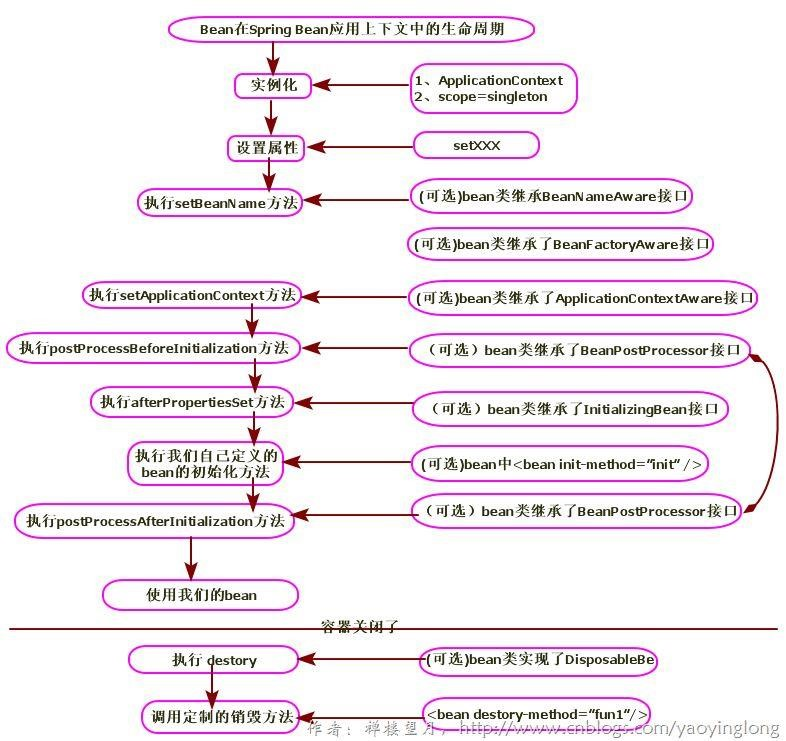

# Spring AOP

## 1. IOC（控制反转）

### 1.1. Spring bean 的作用范围和生命周期

#### 1.1.1. Spring Bean 的作用范围

- **单例对象：`scope="singleton"`**

一个应用只有一个对象的实例。它的作用范围就是整个引用。<font color=red>**该模式在多线程下是不安全的**</font>。Singleton 作用域是Spring 中的缺省作用域

- 生命周期：
    - 对象创建：当应用加载，创建容器时，对象就被创建了。
    - 对象存活：只要容器在，对象一直存活
    - 对象销毁：当应用卸载，销毁容器时，对象就被销毁了。

- **多例对象：`scope="prototype"`**

一般使用在管理struts2/Spring MVC中的action/controller的创建

每次访问对象时，都会重新创建对象实例。每次通过 Spring 容器获取 prototype 定义的 bean 时，容器都将创建一个新的 Bean 实例，每个 Bean 实例都有自己的属性和状态。根据经验，对有状态的bean使用prototype作用域，而对无状态的bean使用singleton 作用域。

- 生命周期：
    - 对象创建：当使用对象时，创建新的对象实例。
    - 对象存活：只要对象在使用中，就一直存活。
    - 对象销毁：当对象长时间不用时，被 java 的垃圾回收器回收了。

- **一次request一个实例：`scope="request"`**

在一次 Http 请求中，容器会返回该 Bean 的同一实例。而对不同的 Http 请求则会产生新的 Bean，而且该 bean 仅在当前 Http Request 内有效,当前 Http 请求结束，该 bean 实例也将会被销毁。

- **`scope="session"`**

在一次 Http Session 中，容器会返回该 Bean 的同一实例。而对不同的 Session 请求则会创建新的实例，该 bean 实例仅在当前 Session 内有效。同 Http 请求相同，每一次 session 请求创建新的实例，而不同的实例之间不共享属性，且实例仅在自己的 session 请求内有效，请求结束，则实例将被销毁。

- **`scope=" global Session"`**

在一个全局的 Http Session 中，容器会返回该 Bean 的同一个实例，仅在使用 portlet context 时有效。

#### 1.1.2. Spring Bean 生命周期

Bean对象在 spring 框架的上下文中的生命周期图（网络资料）



1. 实例化一个 Bean，也就是我们常说的 new。
2. IOC 依赖注入：按照 Spring 上下文对实例化的 Bean 进行配置，也就是 IOC 注入。
3. setBeanName 实现：如果这个 Bean 已经实现了 BeanNameAware 接口，会调用它实现的 setBeanName(String) 方法，此处传递的就是 Spring 配置文件中 Bean 的 id 值
4. BeanFactoryAware 实现：如果这个 Bean 已经实现了 BeanFactoryAware 接口，会调用它实现的 setBeanFactory，setBeanFactory(BeanFactory)传递的是 Spring 工厂自身（可以用这个方式来获取其它 Bean，只需在 Spring 配置文件中配置一个普通的 Bean 就可以）。
5. ApplicationContextAware 实现：如果这个 Bean 已经实现了 ApplicationContextAware 接口，会调用 setApplicationContext(ApplicationContext)方法，传入 Spring 上下文（同样这个方式也可以实现步骤 4 的内容，但比 4 更好，因为 ApplicationContext 是 BeanFactory 的子接口，有更多的实现方法）
6. postProcessBeforeInitialization 接口实现 - 初始化预处理：如果这个 Bean 关联了 BeanPostProcessor 接口，将会调用 postProcessBeforeInitialization(Object obj, String s)方法，BeanPostProcessor 经常被用作是 Bean 内容的更改，并且由于这个是在 Bean 初始化结束时调用那个的方法，也可以被应用于内存或缓存技术。
7. init-method：如果 Bean 在 Spring 配置文件中配置了 init-method 属性会自动调用其配置的初始化方法。
8. postProcessAfterInitialization：如果这个 Bean 关联了 BeanPostProcessor 接口，将会调用 postProcessAfterInitialization(Object obj, String s) 方法。
    - 注：以上工作完成以后就可以应用这个 Bean 了，那这个 Bean 是一个 Singleton 的，所以一般情况下我们调用同一个 id 的 Bean 会是在内容地址相同的实例，当然在 Spring 配置文件中也可以配置非 Singleton。
9. Destroy 过期自动清理阶段：当 Bean 不再需要时，会经过清理阶段，如果 Bean 实现了 DisposableBean 这个接口，会调用那个其实现的 destroy()方法；
10. destroy-method 自配置清理：最后，如果这个 Bean 的 Spring 配置中配置了 destroy-method 属性，会自动调用其配置的销毁方法
11. bean 标签有两个重要的属性（init-method 和 destroy-method）。用它们你可以自己定制初始化和注销方法。它们也有相应的注解（@PostConstruct 和@PreDestroy）。
    - `<bean id="" class="" init-method="初始化方法" destroy-method="销毁方法">`

### 1.2. Bean的初始化和销毁方法

在整个生命周期过程中，可以自定义Bean的初始化和销毁钩子函数，当Bean的生命周期到达相应的阶段的时候，Spring会调用自定义的Bean的初始化和销毁方法。自定义Bean初始化和销毁方法有多种方式

参考代码详见：`spring-note\spring-analysis-note\spring-sample-annotation\19-annotation-lifecycle\`

#### 1.2.1. @Bean 注解方式实现

- 创建自定义Bean

```java
public class CustomBean {
    public CustomBean() {
        System.out.println("CustomBean构造方法执行了...");
    }

    public void init() {
        System.out.println("CustomBean基于@Bean注解initMethod方式实现的初始化方法");
    }

    public void destory() {
        System.out.println("CustomBean基于@Bean注解destroyMethod方式实现的销毁方法");
    }

}
```

- 在配置类里注册该组件，并使用`@Bean`注解指定初始化和销毁方法

```java
@Configuration
// 配置包扫描
@ComponentScan("com.moon.springsample")
public class SpringConfiguration {
    /* 通过@Bean 注解方式创建对象并注册到IOC容器中，实现initMethod与destroyMethod方法 */
    @Bean(value = "customBean", initMethod = "init", destroyMethod = "destory")
    // @Scope("prototype") // 设置多例，用于测试生命周期
    public CustomBean createCustomBean() {
        return new CustomBean();
    }
}
```

*注：其中`initMethod = "init"`和`destroyMethod = "destory"`与CustomBean类里的init，destory方法相对应*

- 测试代码

```java
@Test
public void lifecycleBasicTest() {
    // 1. 创建注解扫描的容器
    AnnotationConfigApplicationContext context = new AnnotationConfigApplicationContext(SpringConfiguration.class);
    System.out.println("************* 容器创建完毕 *************");
    // 2. 获取容器中的bean对象，并输出
    CustomBean customBean = context.getBean("customBean", CustomBean.class);
    System.out.println(customBean);
    // 3. 关闭容器，观察单例对象的销毁前的方法
    context.close();
}
```

启动项目，观察控制台测试结果

1. 单例模式

```
CustomBean构造方法执行了...
CustomBean基于@Bean注解initMethod方式实现的初始化方法
************* 容器创建完毕 *************
com.moon.springsample.bean.CustomBean@7995092a
CustomBean基于@Bean注解destroyMethod方式实现的销毁方法
```

> 分析：此情况是对于单例，在容器启动之前，先调用对象的无参构造器创建对象，然后调用初始化方法，在容器关闭的时候调用销毁方法。

2. 多例模式

```
************* 容器创建完毕 *************
CustomBean构造方法执行了...
CustomBean基于@Bean注解initMethod方式实现的初始化方法
com.moon.springsample.bean.CustomBean@2133814f
```

> 分析：此情况在多例模式下，IOC容器启动的时候并不会去创建对象，而是在每次获取的时候才会去调用方法创建对象，创建完对象后再调用初始化方法。但在容器关闭后，Spring并没有调用相应的销毁方法，这是因为在多例模式下，容器不会管理这个组件（只负责在你需要的时候创建这个组件），所以容器在关闭的时候并不会调用相应的销毁方法。

#### 1.2.2. InitializingBean & DisposableBean 接口实现

除了上面注解方式指定初始化和销毁方法外，Spring还提供了和初始化，销毁相对应的接口

- `InitializingBean`接口包含一个`afterPropertiesSet`方法，可以通过实现该接口，然后在这个方法中编写初始化逻辑。
- `DisposableBean`接口包含一个`destory`方法，可以通过实现该接口，然后再这个方法中编写销毁逻辑。

1. 新建一个UserService类，然后实现这两个接口

```java
@Service
public class UserService implements InitializingBean, DisposableBean {
    public UserService() {
        System.out.println("UserService构造方法执行了");
    }

    @Override
    public void afterPropertiesSet() throws Exception {
        System.out.println("UserService实现InitializingBean接口实现初始化的afterPropertiesSet()方法执行了");
    }

    @Override
    public void destroy() throws Exception {
        System.out.println("UserService实现DisposableBean接口实现销毁的destroy()方法执行了");
    }
}
```

2. 在配置类指定包扫描

```java
@Configuration
@ComponentScan("com.moon.springsample")
public class SpringConfiguration {
}
```

3. 测试代码

```java
@Test
public void lifecycleBasicTest() {
    // 1. 创建注解扫描的容器
    AnnotationConfigApplicationContext context = new AnnotationConfigApplicationContext(SpringConfiguration.class);
    System.out.println("************* 容器创建完毕 *************");
    // 2. 获取容器中的bean对象，并输出
    UserService userService = context.getBean("userService", UserService.class);
    System.out.println(userService);
    // 3. 关闭容器，观察单例对象的销毁前的方法
    context.close();
}
```

测试结果

```
UserService构造方法执行了
UserService实现InitializingBean接口实现初始化的afterPropertiesSet()方法执行了
************* 容器创建完毕 *************
com.moon.springsample.service.UserService@1df82230
UserService实现DisposableBean接口实现销毁的destroy()方法执行了
```

#### 1.2.3. @PostConstruct & @PreDestroy 注解方式实现

还可以使用`@PostConstruct`和`@PreDestroy`注解修饰方法来指定相应的初始化和销毁方法

1. 创建LogUtil类，定义`@PostConstruct`和`@PreDestroy`注解修饰的方法

```java
// @Component
/*
 * 注意：单例的生命周期与容器的生命周期一致，对象随着容器的创建而创建，随容器的销毁而销毁
 *   如果将作用范围设置为多例，则对象的生命周期会脱离容器，当对象被使用时创建，
 *   因为容器不知道对象什么时候会不再使用，所以对象的销毁是GC垃圾回收器决定
 */
// @Scope("prototype")
public class LogUtil {
    /* 构造方法 */
    public LogUtil() {
        System.out.println("LogUtil类的无参构造函数执行了...");
    }

    /* @PostConstruct 注解用于指定bean对象的初始化后执行的方法 */
    @PostConstruct
    public void init() {
        System.out.println("LogUtil基于@PostConstruct注解的初始化后的方法执行了...");
    }

    /* @PreDestroy 用于指定bean对象的销毁前执行的方法 */
    @PreDestroy
    public void destroy() {
        System.out.println("LogUtil基于@PreDestroy注解销毁前的方法执行了...");
    }
}
```

2. 在配置类指定包扫描

```java
@Configuration
@ComponentScan("com.moon.springsample")
public class SpringConfiguration {
}
```

3. 测试代码

```java
@Test
public void lifecycleBasicTest() {
    // 1. 创建注解扫描的容器
    AnnotationConfigApplicationContext context = new AnnotationConfigApplicationContext(SpringConfiguration.class);
    System.out.println("************* 容器创建完毕 *************");
    // 2. 获取容器中的bean对象，并输出
    LogUtil logUtil = context.getBean("logUtil", LogUtil.class);
    System.out.println(logUtil);
    // 3. 关闭容器，观察单例对象的销毁前的方法
    context.close();
}
```

测试结果

```
LogUtil类的无参构造函数执行了...
LogUtil基于@PostConstruct注解的初始化后的方法执行了...
************* 容器创建完毕 *************
com.moon.springsample.utils.LogUtil@27c86f2d
LogUtil基于@PreDestroy注解销毁前的方法执行了...
```

<font color=purple>*注：这两个注解并非Spring提供，而是JSR250规范提供*</font>

#### 1.2.4. BeanPostProcessor 接口实现

Spring提供了一个`BeanPostProcessor`接口，俗称Bean后置通知处理器，它提供了两个方法`postProcessBeforeInitialization`和`postProcessAfterInitialization`。

其中`postProcessBeforeInitialization`在组件的初始化方法调用之前执行，`postProcessAfterInitialization`在组件的初始化方法调用之后执行。它们都包含两个入参：

- `bean`：当前组件对象
- `beanName`：当前组件在容器中的名称。

两个方法都返回一个Object类型，可以直接返回当前组件对象，或者包装后返回。

1. 定义一个BeanPostProcessor接口的实现类MyBeanPostProcessor

```java
@Component
public class MyBeanPostProcessor implements BeanPostProcessor {
    public MyBeanPostProcessor() {
        System.out.println("MyBeanPostProcessor类构造方法执行了");
    }

    @Override
    public Object postProcessBeforeInitialization(Object bean, String beanName) throws BeansException {
        System.out.println("基于实现BeanPostProcessor接口postProcessBeforeInitialization()方法，" + beanName + "初始化之前调用");
        return bean;
    }

    @Override
    public Object postProcessAfterInitialization(Object bean, String beanName) throws BeansException {
        System.out.println("基于实现BeanPostProcessor接口postProcessAfterInitialization()方法" + beanName + "初始化之后调用");
        return bean;
    }
}
```

2. 在配置类指定包扫描

```java
@Configuration
@ComponentScan("com.moon.springsample")
public class SpringConfiguration {
}
```

3. 测试代码

```java
@Test
public void lifecycleBasicTest() {
    // 1. 创建注解扫描的容器
    AnnotationConfigApplicationContext context = new AnnotationConfigApplicationContext(SpringConfiguration.class);
    System.out.println("************* 容器创建完毕 *************");
    // 2. 获取容器中的bean对象，并输出
    MyBeanPostProcessor myBeanPostProcessor = context.getBean("myBeanPostProcessor", MyBeanPostProcessor.class);
    System.out.println(myBeanPostProcessor);
    // 3. 关闭容器，观察单例对象的销毁前的方法
    context.close();
}
```

测试结果

```
MyBeanPostProcessor类构造方法执行了
基于实现BeanPostProcessor接口postProcessBeforeInitialization()方法，springConfiguration初始化之前调用
基于实现BeanPostProcessor接口postProcessAfterInitialization()方法springConfiguration初始化之后调用
UserService构造方法执行了
基于实现BeanPostProcessor接口postProcessBeforeInitialization()方法，userService初始化之前调用
UserService实现InitializingBean接口实现初始化的afterPropertiesSet()方法执行了
基于实现BeanPostProcessor接口postProcessAfterInitialization()方法userService初始化之后调用
LogUtil类的无参构造函数执行了...
基于实现BeanPostProcessor接口postProcessBeforeInitialization()方法，logUtil初始化之前调用
LogUtil基于@PostConstruct注解的初始化后的方法执行了...
基于实现BeanPostProcessor接口postProcessAfterInitialization()方法logUtil初始化之后调用
CustomBean构造方法执行了...
基于实现BeanPostProcessor接口postProcessBeforeInitialization()方法，customBean初始化之前调用
CustomBean基于@Bean注解initMethod方式实现的初始化方法
基于实现BeanPostProcessor接口postProcessAfterInitialization()方法customBean初始化之后调用
************* 容器创建完毕 *************
com.moon.springsample.processor.MyBeanPostProcessor@1a04f701
CustomBean基于@Bean注解destroyMethod方式实现的销毁方法
LogUtil基于@PreDestroy注解销毁前的方法执行了...
UserService实现DisposableBean接口实现销毁的destroy()方法执行了
```

<font color=red>**注：BeanPostProcessor对IOC容器中所有组件都生效**</font>

## 2. AOP（面向切面编程）

### 2.1. AOP概述

AOP：全称是 Aspect Oriented Programming 即：面向切面编程

它就是把程序重复的代码抽取出来，在需要执行的时候，使用**动态代理**的技术，在不修改源码的基础上，对已有方法进行增强

- **AOP的作用**
    - 在程序运行期间，不修改源码对已有方法进行增强
- **AOP的优势**
    - 减少重复代码
    - 提高开发效率
    - 维护方便
- **AOP实现方式**
    - 使用动态代理技术

### 2.2. AOP案例
#### 2.2.1. 动态代理特点

- 字节码随用随创建，随用随加载。
- 它与静态代理的区别也在于此。因为静态代理是字节码一上来就创建好，并完成加载。
- **装饰者模式就是静态代理的一种体现。**

#### 2.2.2. 动态代理常用的有两种方式
##### 2.2.2.1. 基于接口的动态代理【推荐】

- 提供者：JDK官方的Proxy类。
- 方法：newProxyInstance
- 要求：被代理类最少实现一个接口。

```java
/**
 * 使用JDK官方的Proxy类创建代理对象
 */
public class Client_Proxy {
	public static void main(String[] args) {
		// 获取接口实现类
		IActor actor = new ActorImpl();

		System.out.println("=============没有使用动态代理模式前=============");
		actor.basicAct(108.89F);
		actor.wonderfulAct(3000.1F);
		System.out.println("=============没有使用动态代理模式后=============");

		// 获取代理
		IActor proxy = (IActor) Proxy.newProxyInstance(ActorImpl.class.getClassLoader(),
				ActorImpl.class.getInterfaces(), new InvocationHandler() {
					// 重写拦截的方法
					@Override
					public Object invoke(Object proxy, Method method, Object[] args) throws Throwable {
						// 获取调用方法的名字
						String mothodName = method.getName();
						// 获取调用方法的参数
						float money = (float) args[0];

						// 开始判断
						if ("basicAct".equals(mothodName)) {
							// 对象调用了basicAct方法
							if (money > 2000) {
								// 满足条件才执行方法
							  // 注：此处直接引用外面的IActoer对象，如果是在jdk1.7，则前端创建的对象需要使用final关键字修饰
								proxy = method.invoke(actor, money / 2);
							}
						} else if ("wonderfulAct".equals(mothodName)) {
							// 对象调用了wonderfulAct方法
							if (money > 5000) {
								// 满足条件才执行方法
								proxy = method.invoke(actor, money / 2);
							}
						}
						// 真实方法返回值
						return proxy;
					}
				});

		// 使用代理调用方法
		proxy.basicAct(1003F);
		proxy.wonderfulAct(6234F);
	}
}

/**
 * 接口实现类
 */
public class ActorImpl implements IActor {

	@Override
	public void basicAct(float money) {
		System.out.println("拿到 " + money + " 元，开始基本的表演!!");
	}

	@Override
	public void wonderfulAct(float money) {
		System.out.println("拿到 " + money + " 元，开始精彩的表演!!");
	}

}
```

##### 2.2.2.2. 基于子类的动态代理

- 提供者：第三方的 cglib，如果报 asmxxxx 异常，需要导入 asm.jar。
- 要求：被代理类不能用 final 修饰的类（最终类）
- 需要导入jar包：`asm.jar`和`cglib-2.1.3.jar`

- 涉及的类：`Enhancer`
- 涉及的方法：`create(Class arg, Callback arg1)`
    - 参数`Class` :与被代理对像的字节码对象
    - 参数`CallBack`：是接口，里面写的也是策略，要使用一个子接口：`MethodInterceptor`
- 使用内部类创建`MethodInterceptor`对象，重写`intercept()`方法
- 涉及的需要重写的拦截方法：`intercept(Object proxy, Method method, Object[] args, MethodProxy methodProxy)`
    - 此方法也具有拦截功能
    - 前面三个参数与基于接口的动态代理的`InvocationHandler`中的`invoke`方法的参数一模一样
    - `proxy`:代理对象的引用【一般不用】
    - `method`:拦截的方法
    - `args`:拦截的方法中的参数
    - `methodProxy`: 方法代理对象的引用【一般不用】

```java
/**
 * 使用cglib，基于子类的动态代理
 */
public class Client_Cglib {
    public static void main(String[] args) {
        // 获取被代理对象
        Actor actor = new Actor();

        /**
         * 来自cglib 要求： 被代理对象不能是最终类
         * 涉及的类：Enhancer
         * 涉及方法：create
         * 涉及参数：
         *        Class : 与被代理对像的字节码对象
         *        CallBack：接口来的，里面写的也是策略
         *                  要使用一个子接口：MethodInterceptor
         */
        Actor cglibActor = (Actor) Enhancer.create(actor.getClass(), new MethodInterceptor() {
            /**
             * 此方法也具有拦截功能
             *
             * 前面三个参数与基于接口的动态代理的InvocationHandler中的invoke方法的参数一模一样
             *  参数解释：
             *          proxy:代理对象的引用【一般不用】
             *          method:拦截的方法
             *          args: 拦截的方法中的参数
             *          methodProxy : 方法代理对象的引用【一般不用】
             */
            @Override
            public Object intercept(Object proxy, Method method, Object[] args, MethodProxy methodProxy) throws Throwable {
                // 获取执行的方法名
                String methodName = method.getName();
                // 获取调用的方法的参数，知道只有一个参数
                float money = (float) args[0];
                // 定义返回对象
                Object result = null;

                // 判断执行的方法
                if ("basicAct".equals(methodName)) {
                    // 对象调用了basicAct方法
                    if (money > 1000F) {
                        // 满足条件才执行方法
                        result = method.invoke(actor, money / 2);
                    }
                } else if ("wonderfulAct".equals(methodName)) {
                    // 对象调用了wonderfulAct方法
                    if (money > 2000F) {
                        // 满足条件才执行方法
                        result = method.invoke(actor, money / 4);
                    }
                }
                // 返回执行方法后的对象
                return result;
            }
        });

        // 使用代理调用方法
        cglibActor.basicAct(1200F);
        cglibActor.wonderfulAct(4290F);
    }
}

public class Actor {
    public void basicAct(float money) {
        System.out.println("拿到 " + money + " 元，开始基本的表演!!");
    }

    public void wonderfulAct(float money) {
        System.out.println("拿到 " + money + " 元，开始精彩的表演!!");
    }
}
```

### 2.3. Spring 中的 AOP 关于两种代理方式的选择

在spring中，框架会根据目标类是否实现了接口来决定采用哪种动态代理的方式

#### 2.3.1. JDK 动态接口代理

JDK 动态代理主要涉及到 java.lang.reflect 包中的两个类：`Proxy` 和 `InvocationHandler`。**InvocationHandler是一个接口，通过实现该接口定义横切逻辑，并通过反射机制调用目标类的代码，动态将横切逻辑和业务逻辑编制在一起。Proxy 利用 InvocationHandler 动态创建一个符合某一接口的实例，生成目标类的代理对象。**

#### 2.3.2. CGLib 动态代理

CGLib 全称为 Code Generation Library，是一个强大的高性能，高质量的代码生成类库，**可以在运行期扩展 Java 类与实现 Java 接口**，CGLib 封装了 asm，可以再运行期动态生成新的 class。***和 JDK 动态代理相比较：JDK 创建代理有一个限制，就是只能为接口创建代理实例，而对于没有通过接口定义业务方法的类，则可以通过 CGLib 创建动态代理***。

### 2.4. AOP 相关术语

- **Joinpoint(连接点):**
    - 连接点是指那些被拦截到的点，即目标对象中所有的方法或者拦截的具体某个方法。在spring中，这些点指的是方法，因为spring只支持方法类型的连接点。
- **Pointcut(切入点):**
    - 切入点是指我们要对哪些Joinpoint进行拦截的定义。即真正需要增强的方法的集合，也可以理解为连接点（Joinpoint）的集合。
- **Advice(通知/增强):**
    - 通知是指拦截到Joinpoint之后所要做的事情就是通知。**即要增强的功能代码**
    - 通知的类型（**可以理解成拦截到的方法，什么时候进行增强**）：
        - *前置通知：在切入点之前执行*
        - *后置通知：在切入点之后执行*
        - *异常通知：切入点出现异常才执行*
        - *最终通知：切入点不管有无异常都会执行*
        - *环绕通知：在方法之前和之后执行*
- **Introduction(引介):**
    - 引介是一种特殊的通知在不修改类代码的前提下，Introduction可以在运行期为类动态地添加一些方法或Field
- **Target(目标对象):**
    - 代理的目标对象
- **Weaving(织入):**
    - 是指把增强应用到目标对象来创建新的代理对象的过程
    - spring采用动态代理织入，而AspectJ采用编译期织入和类装载期织入
- **Proxy（代理）:**
    - 一个类被AOP织入增强后，就产生一个结果代理类
- **Aspect(切面):**
    - 是切入点(Pointcut)和通知（引介）(Advice)的结合。把增加应用到具体方法上面，这过程称为切面
    - 把增强用到切入点的过程


### 2.5. 学习 spring 中的 AOP 要明确的事

- 开发阶段（我们做的）
    - 编写核心业务代码（开发主线）：大部分程序员来做，要求熟悉业务需求。
    - 把公用代码抽取出来，制作成通知。（开发阶段最后再做）：AOP 编程人员来做。
    - 在配置文件中，声明切入点与通知间的关系，即切面：AOP 编程人员来做。
- 运行阶段（Spring 框架完成的）
    - Spring 框架监控切入点方法的执行。一旦监控到切入点方法被运行，使用代理机制，动态创建目标对象的代理对象，根据通知类别，在代理对象的对应位置，将通知对应的功能织入，完成完整的代码逻辑运行

### 2.6. Spring的AOP操作

- Spring 里面进行AOP操作是使用aspectj实现
    - AspectJ不是spring一部分，和spring一起使用进行aop操作
- 使用AspectJ实现aop的两种方式
	1. 基于aspectj的xml配置
	2. 基于aspectj的注解方式

- Spring的aop操作基本jar包：
    - spring-aop-4.2.4.RELEASE.jar
    - spring-aspects-4.2.4.RELEASE.jar
- aop相关的jar包
    - aopalliance-1.0.jar
    - aspectjweaver-1.8.7.jar

## 3. 基于纯XML的 AOP 配置和使用
### 3.1. 配置步骤
#### 3.1.1. 第1步 添加相关的依赖(或拷贝jar包到lib目录)

```xml
<dependency>
    <groupId>org.springframework</groupId>
    <artifactId>spring-aop</artifactId>
    <version>${spring.version}</version>
</dependency>
<dependency>
    <groupId>org.springframework</groupId>
    <artifactId>spring-aspects</artifactId>
    <version>${spring.version}</version>
</dependency>
```

#### 3.1.2. 第2步 创建 spring 的配置文件并导入约束

- 导入约束时需要多导入一个**aop名称空间下的约束**。
- 导入schema文件：【spring-aop-4.2.xsd】
- 约束文件所在路径：
    - `根目录\schema\aop`
- 约束文件文档：
    - 根目录`\docs\spring-framework-reference\html\xsd-configuration.html`
    - 打开文件在html，约束位置【40.2.7 the aop schema】
- 约束内容（黄字为新增内容）

```xml
<?xml version="1.0" encoding="UTF-8"?>
<beans xmlns="http://www.springframework.org/schema/beans"
		xmlns:aop="http://www.springframework.org/schema/aop"
		xmlns:xsi="http://www.w3.org/2001/XMLSchema-instance"
		xsi:schemaLocation="http://www.springframework.org/schema/beans
					http://www.springframework.org/schema/beans/spring-beans.xsd
					http://www.springframework.org/schema/aop
					http://www.springframework.org/schema/aop/spring-aop.xsd">
</beans>
```

#### 3.1.3. 第3步 将相关需要创建对象资源配置到 spring 容器中
#### 3.1.4. 第4步 制作通知类（增强类）

编写用于增强业务逻辑层核心方法相关功能的类。

#### 3.1.5. 第5步 配置bean.xml文件，设置通知类执行方式

1. 使用`<bean>`标签配置通知(增强)类给spring管理
2. 使用 `aop:config` 声明 aop 配置
3. 使用 `aop:pointcut` 配置切入点表达式（可以写在切面标签内外都可以，但必须在配置通知前）
4. 使用 `aop:aspect` 配置切面
5. 使用 `aop:before/after-returning/after-throwing/after/around` 配置通知方式

注：AOP的约束提醒必需配置两个xsd约束（beans-4.2.xsd和tool-4.2.xsd）


```xml
<?xml version="1.0" encoding="UTF-8"?>
<beans xmlns="http://www.springframework.org/schema/beans"
		xmlns:aop="http://www.springframework.org/schema/aop"
		xmlns:xsi="http://www.w3.org/2001/XMLSchema-instance"
		xsi:schemaLocation="http://www.springframework.org/schema/beans
							http://www.springframework.org/schema/beans/spring-beans.xsd
							http://www.springframework.org/schema/aop
							http://www.springframework.org/schema/aop/spring-aop.xsd ">
	<!-- 配置需要创建对象给spring管理 -->
	<bean id="customerService" class="com.moonzero.service.impl.CustomerServiceImpl"></bean>

	<!-- 配置通知类给spring管理 -->
	<bean id="logger" class="com.moonzero.utils.Logger"></bean>

	<!-- 声明开始aop的配置 -->
	<aop:config>
		<!-- 配置的代码都写在此处 -->

		<!--
			1. 配置切面：此标签要出现在aop:config内部
				id：给切面提供一个唯一标识
				ref：引用的是通知类的 bean 的 id
		 -->
		<aop:aspect id="logActive" ref="logger">
			<!-- 配置通知的类型写在此处 -->

			<!--
				2. 配置切入点 aop:pointcut 配置切入点表达式(写在切面aspect内外都可以)
					expression：用于定义切入点表达式,切入点表达式都写在 execution() 中。
					id：用于给切入点表达式提供一个唯一标识。
				表达式语法：execution([修饰符] 返回值类型 包名.类名.方法名(参数))
			-->
			<!-- 全匹配方式，public可以省略 -->
			<aop:pointcut expression="execution(public void com.moonzero.service.impl.CustomerServiceImpl.saveCustomer())" id="pt1"/>
			<!-- 使用通配方式 -->
			<!-- <aop:pointcut expression="execution(* com.moonzero.service.impl.CustomerServiceImpl.updateCustomer(..))" id="pt2"/> -->
			<!-- <aop:pointcut expression="execution(* *.*.*.*.CustomerServiceImpl.updateCustomer(..))" id="pt2"/> -->
			<!-- <aop:pointcut expression="execution(* *..CustomerServiceImpl.updateCustomer(..))" id="pt2"/> -->
			<!-- <aop:pointcut expression="execution(* *..*Impl.updateCustomer(..))" id="pt2"/> -->
			<!-- <aop:pointcut expression="execution(* *..*.updateCustomer(..))" id="pt2"/> -->
			<!-- <aop:pointcut expression="execution(* *..*.*Customer(..))" id="pt2"/> -->
			<aop:pointcut expression="execution(* *..*.*(..))" id="pt2"/>

			<!--
				用于配置前置通知：指定增强的方法在切入点方法之前执行
					method:用于指定通知类中的增强方法名称
					pointcut-ref：用于指定切入点的表达式的引用
					pointcut:直接写切入点表达式
			-->
			<!-- 前置通知 -->
			<aop:before method="beforePrintLog" pointcut-ref="pt1"/>
			<!-- 后置通知 -->
			<aop:after method="afterReturnningPrintLog" pointcut-ref="pt2"/>
			<!-- 异常通知 -->
			<aop:after-throwing method="afterThrowingPrintLog" pointcut-ref="pt1"/>
			<!-- 最终通知 -->
			<aop:after method="afterPrintLog" pointcut-ref="pt1"/>

			<!-- 环绕通知-->
			<aop:around method="aroundPrintLog" pointcut-ref="pt1"/>

		</aop:aspect>
	</aop:config>
</beans>
```

```java
public class Logger {
	/**
	 * 前置通知 作用：在业务层执行核心方法之前执行此方法记录日志
	 */
	public void beforePrintLog() {
		System.out.println("前置通知：正在记录日志。。。。。。");
	}

	/**
	 * 后置通知 作用：在业务层执行核心方法之后执行此方法记录日志
	 */
	public void afterReturnningPrintLog() {
		System.out.println("后置通知：正在记录日志。。。。。。");
	}

	/**
	 * 异常通知 作用：在业务层执行核心方法出现异常后执行此方法记录日志
	 */
	public void afterThrowingPrintLog() {
		System.out.println("异常通知：正在记录日志。。。。。。");
	}

	/**
	 * 最终通知 作用：在业务层执行核心方法最终执行此方法记录日志
	 */
	public void afterPrintLog() {
		System.out.println("最终通知：正在记录日志。。。。。。");
	}

	/**
	 * 环绕通知:是spring提供给我们的特殊通知，需要我们手动调用目标方法
	 * 		在调用目标方法之前的输出的就是前置通知
	 * 		在调用目标方法之后的输出的就是后置通知
	 * 		在调用目标方法之后有异常的输出的就是异常通知
	 * 		不管有无异常都会执行的代码是最终通知
	 */
	public Object aroundPrintLog(ProceedingJoinPoint pjp) {
		// 获取方法参数列表
		Object[] args = pjp.getArgs();
		// 定义返回变量
		Object result = null;
		try {
			// 前置通知
			System.out.println("前：记录日志。。。");
			// 手动调用目标方法
			result = pjp.proceed(args);
			// 后置通知
			System.out.println("后：记录日志。。。");
		} catch (Throwable e) {
			e.printStackTrace();
			// 异常通知
			System.out.println("异：记录日志。。。");
		} finally {
			// 最终通知
			System.out.println("终：记录日志。。。");
		}
		return result;
	}
}

public class ClientTest {
	public static void main(String[] args) {
		// 获取spring容器操作对象
		ApplicationContext context = new ClassPathXmlApplicationContext("bean.xml");
		// 根据id获取对象
		ICustomerService cs = (ICustomerService) context.getBean("customerService");
		// 打印对象查看是否为代理对象
		System.out.println(cs.getClass().getName());

		// 要使用基于子类的，对象不能实现接口
		// CustomerServiceImpl cs = (CustomerServiceImpl) context.getBean("customerService");

		// 调用方法
		cs.saveCustomer();
		//cs.updateCustomer(10);
	}
}
```

<font color="purple">**注意：如果使用基于子类的方式创建动态代理，对象就不能实现接口，创建的代理需要自己用子类去接收。**</font>

### 3.2. 切入点表达式说明

- execution:
    - 匹配方法的执行(常用)
    - execution(表达式)
- 表达式语法：`execution([修饰符] 返回值类型 包名.类名.方法名(参数))`
- 写法说明：
    1. 全匹配方式（修饰符public可以省略）：`public void com.moon.service.impl.CustomerServiceImpl.saveCustomer()`
	2. 访问修饰符可以省略：`void com.moon.service.impl.CustomerServiceImpl.saveCustomer()`
	3. 返回值可以使用`*`号，表示任意返回值：`* com.moon.service.impl.CustomerServiceImpl.saveCustomer()`
	4. 包名：
    	- 可以使用`*`号，表示任意包，但是有几级包，需要写几个`*`：`* *.*.*.*.CustomerServiceImpl.saveCustomer()`
    	- 使用`..`来表示当前包，及其子包：`* com..CustomerServiceImpl.saveCustomer()`
	5. 类名：
		- 可以使用`*`号，表示任意类：`* com..*.saveCustomer()`
		- 可以使用部分通配的方法：`* com..*Impl.saveCustomer()`
    6. 方法名：
		- 可以使用`*`号，表示任意方法：`* com..*.*()`
		- 可以使用部分通配的方法：`* com..*.*all()`
	7. 参数列表：
		- 参数列表可以使用`*`，表示参数可以是任意数据类型，但是必须有参数：`* com..*.*(*)`
		- 参数列表可以使用..表示有无参数均可，有参数可以是任意类型：`* com..*.*(..)`
	8. **全通配方式：** `* *..*.*(..)`

### 3.3. 常用标签

|              **标签名**              | **属性**                                                                                                                      | **作用**                |
| :---------------------------------------: | :-------------------------------------------------------------------------------------------------------------------------------- | :-------------------------- |
|        **<aop:config>**         | \                                                                                                                                 | 用于声明开始aop的配置 |
|        **<aop:aspect>**         | id：给切面提供一个唯一标识   ref：引用配置好的通知类 bean 的 id                                               | 用于配置切面             |
|    **<aop:pointcut>**     | expression：用于定义切入点表达式   id：用于给切入点表达式提供一个唯一标识                                   | 用于配置切入点表达式  |
|        **<aop:before>**         | method：指定通知中方法的名称。   pointct：定义切入点表达式   pointcut-ref：指定切入点表达式的引用 | 用于配置前置通知      |
| **<aop:after-returning>** | 同上                                                                                                                             | 用于配置后置通知      |
| **<aop:after-throwing>**  | 同上                                                                                                                             | 用于配置异常通知      |
|         **<aop:after>**         | 同上                                                                                                                             | 用于配置最终通知      |
|        **<aop:around>**         | method：指定通知中方法的名称。   pointct：定义切入点表达式   pointcut-ref：指定切入点表达式的引用 | 用于配置环绕通知      |

eg.

```xml
<aop:before method="beforePrintLog" pointcut-ref="pt1"/>
<aop:after-returning method="afterReturningPrintLog" pointcut-ref="pt1"/>
<aop:after-throwing method="afterThrowingPrintLog" pointcut-ref="pt1"/>
<aop:after method="afterPrintLog" pointcut-ref="pt1"/>
<aop:around method="aroundPringLog" pointcut-ref="pt1"/>
```

### 3.4. 通知的类型
#### 3.4.1. 配置通知的类型说明

- `aop:before`：用于配置前置通知。前置通知的执行时间点：切入点方法执行之前执行
- `aop:after-returning`：用于配置后置通知。后置通知的执行时间点：切入点方法正常执行之后。它和异常通知只能有一个执行
- `aop:after-throwing`：用于配置异常通知。异常通知的执行时间点：切入点方法执行产生异常后执行。它和后置通知只能执行一个。
- `aop:after`：用于配置最终通知。最终通知的执行时间点：无论切入点方法执行时是否有异常，它都会在其后面执行。类似try-catch中的finally

#### 3.4.2. 环绕通知的特殊说明(了解)

- **环绕通知aop:around（了解）**
    - 用于配置环绕通知。他和前面四个不一样，他不是用于指定通知方法何时执行的。是Spring提供给我们的特殊通知，需要我们手动调用目标方法
    - 在通知方法的参数中，需要定义一个接口`ProceedingJoinPoint`，此接口的实现类，spring会注入
- 问题:
    - 当我们配置了环绕通知之后，增强的代码执行了，业务核心方法没有执行。
- 分析：
    - 通过动态代理我们知道在invoke方法中，有明确调用业务核心方法：`method.invoke()`。
    - 我们配置的环绕通知中，没有明确调用业务核心方法。
- 解决：
    - spring 框架为我们提供了一个接口：`ProceedingJoinPoint`，它可以作为环绕通知的方法参数
    - 在环绕通知执行时，spring 框架会为我们提供该接口的实现类对象，我们直接使用就行。
    - 该接口中有一个方法`proceed()`，执行目标方法，此方法就相当于`method.invoke()`
    - `getArgs()`方法：获取参数列表
        - 在调用目标方法之前的输出的就是前置通知
        - 在调用目标方法之后的输出的就是后置通知
        - 在调用目标方法之后有异常的输出的就是异常通知
        - 不管有无异常都会执行的代码是最终通知

## 4. 基于纯注解方式的 AOP 配置和使用

Spring支持AspectJ的注解式切面编程，使用的整体步骤

1. 使用@Aspect声明是一个切面
2. 使用@After、@Before、@Around等注解定义建言（advice），可以直接将拦截规则（切点）作为参数
3. 拦截规则为切点(PointCut)，可使用@PointCut定义好拦截规则，然后在@After、@Before、@Around的参数中调用
4. 符合条件的每一个被拦截处为连接点（JoinPoint）

### 4.1. 基于execution表达式拦截的使用步骤
#### 4.1.1. 第1步 添加相关的依赖(或拷贝jar包到lib目录)


```xml
<dependency>
    <groupId>org.springframework</groupId>
    <artifactId>spring-aop</artifactId>
    <version>${spring.version}</version>
</dependency>
<dependency>
    <groupId>org.springframework</groupId>
    <artifactId>spring-aspects</artifactId>
    <version>${spring.version}</version>
</dependency>
```

#### 4.1.2. 第2步 创建 spring 的配置文件并导入约束，指定 spring 要扫描的包

```xml
<?xml version="1.0" encoding="UTF-8"?>
<beans xmlns="http://www.springframework.org/schema/beans"
		xmlns:aop="http://www.springframework.org/schema/aop"
		xmlns:context="http://www.springframework.org/schema/context"
		xmlns:xsi="http://www.w3.org/2001/XMLSchema-instance"
		xsi:schemaLocation="http://www.springframework.org/schema/beans
			http://www.springframework.org/schema/beans/spring-beans.xsd
			http://www.springframework.org/schema/aop
			http://www.springframework.org/schema/aop/spring-aop.xsd
			http://www.springframework.org/schema/context
			http://www.springframework.org/schema/context/spring-context.xsd">
	<!-- 配置创建spring容器需要扫描的基础包 -->
	<context:component-scan base-package="com.moonzero"></context:component-scan>
</beans>
```

#### 4.1.3. 第3步 使用注解配置相关资源和通知类给spring来管理

```java
// 使用注解配置使用spring创建对象
@Service("customerService")
public class CustomerServiceImpl implements ICustomerService {
    ......
}
```

#### 4.1.4. 第4步 在通知类上使用@Aspect 注解声明为切面
#### 4.1.5. 第5步 在增强的方法上使用@Before 注解配置前置通知

```java
// 配置通知类给spring管理
@Component("logger")
// 配置通知类
@Aspect
public class Logger {

	// 定义切入点
	@Pointcut("execution(* *..*.CustomerServiceImpl.saveCustomer())")
	public void pt1() {
	}

	@Pointcut(value="execution(* *..*.*(..))")
	public void pt2() {
	}

	/**
	 * 前置通知 作用：在业务层执行核心方法之前执行此方法记录日志
	 */
	// 指定切入点表达式的引用
	// 注意:在注解因为定义切入是在方法上，所以value值的id需要写上()
	@Before("pt1()")
	public void beforePrintLog(JoinPoint point) {
		System.out.println("前置通知：正在记录日志。。。。。。");
	}

	/**
	 * 后置通知 作用：在业务层执行核心方法之后执行此方法记录日志
	 */
	// 直接指定切入点表达式
	@AfterReturning("execution(* *..*.*(..))")
	public void afterReturnningPrintLog() {
		System.out.println("后置通知：正在记录日志。。。。。。");
	}

	/**
	 * 异常通知 作用：在业务层执行核心方法出现异常后执行此方法记录日志
	 */
	@AfterThrowing("pt1()")
	public void afterThrowingPrintLog() {
		System.out.println("异常通知：正在记录日志。。。。。。");
	}

	/**
	 * 最终通知 作用：在业务层执行核心方法最终执行此方法记录日志
	 */
	@After("pt1()")
	public void afterPrintLog() {
		System.out.println("最终通知：正在记录日志。。。。。。");
	}

	/**
	 * 环绕通知:
	 */
	@Around("pt1()")
	public Object aroundPrintLog(ProceedingJoinPoint pjp) {
		// 获取方法参数列表
		Object[] args = pjp.getArgs();
		// 定义返回变量
		Object result = null;

		try {
			// 前置通知
			System.out.println("前：记录日志。。。");
			// 手动调用目标方法
			result = pjp.proceed(args);
			// 后置通知
			System.out.println("后：记录日志。。。");
		} catch (Throwable e) {
			e.printStackTrace();
			// 异常通知
			System.out.println("异：记录日志。。。");
		} finally {
			// 最终通知
			System.out.println("终：记录日志。。。");
		}

		return result;
	}
}
```

#### 4.1.6. 第6步 在 spring 配置文件中开启 spring 对注解 AOP 的支持

```xml
<!-- 开启spring容器对AOP注解的支持 -->
<aop:aspectj-autoproxy />
```

*注意：为什么切入点表达式是写在通知增加方法上，而不是写在切入点所在的类的方法上？从aop理念就可以理解，如果写在被增强的类上，就是违反原来不修改源代码而得到增强的理念。*

### 4.2. 常用注解

|     **注解名**      |                         **属性**                          |         **作用**         |
| :-----------------: | :-------------------------------------------------------: | :----------------------: |
|     **@Aspect**     |                             \                             |   把当前类声明为切面类   |
|     **@Before**     | value：用于指定切入点表达式，还可以指定切入点表达式的引用 | 把当前方法看成是前置通知 |
| **@AfterReturning** |                             \                             | 把当前方法看成是后置通知 |
| **@AfterThrowing**  |                             \                             | 把当前方法看成是异常通知 |
|     **@After**      |                             \                             | 把当前方法看成是最终通知 |
|     **@Around**     |                             \                             | 把当前方法看成是环绕通知 |
|    **@Pointcut**    |                  value：指定表达式的内容                  |     指定切入点表达式     |

**注意：在注解因为定义切入点`@Pointcut`是在成员方法上，所以通知用于指定切入点表达式的引用的值需要写上“()”！！**

```java
@Pointcut("execution(* *..*.*(..))")
public void pt1() {
}

@Before("pt1()")
public void beforePrintLog() {
    xxx;
}
```

### 4.3. 基于自定义注解拦截的使用步骤

1. 使用注解式拦截首先编写一个注解，如

```java
@Target(ElementType.METHOD)
@Retention(RetentionPolicy.RUNTIME)
@Documented
public @interface DataScope {
    public String name() default "";
}
```

2. 编写切面（类），如：

```java
@Aspect
@Component
public class DataScopeAspect {
    // 配置织入点
    @Pointcut("@annotation(com.moon.common.annotation.DataScope)")
    public void dataScopePointCut() {}

    @Before("dataScopePointCut()")
    public void doBefore(JoinPoint point) throws Throwable {
        MethodSignature signature = (MethodSignature) point.getSignature();
        Method method = signature.getMethod();
        DataScope annotation = method.getAnnotation(DataScope.class);
        System.out.println("注解属性name值：" + method.getName());
    }
}
```

3. 在需要拦截的方法上加上注解，如

```java
// 使用aop拦截方法
@DataScope(name = "u")
public List<SysRole> selectRoleList(SysRole role) {
    return roleMapper.selectRoleList(role);
}
```

**注：注解式拦截与方法规则拦截的用法是一样的，使用方法规则拦截不需要定义注解。区别在于定义切入点（@PointCut）注解时的参数不一样，使用注解式拦截的参数是：`"@annotation(自定义的注解全类名)"`，使用方法规则拦截的参数是：`"execution(* *..*.*(..))"`**

## 5. 基于注解的 AOP 配置（不使用xml）

将xml配置删除，换成SpringConfiguration.java

```java
/**
 * 代替bean.xml文件的配置类
 */
// 用于指定当前类是一个配置类
@Configuration
// 用于指定spring在初始化容器时要扫描的包
@ComponentScan("com.moonzero")
// 开启spring对象注解aop的支持
@EnableAspectJAutoProxy
public class SpringConfiguration {
}

/**
 * 配置测试
 */
public class ClientTest {
	public static void main(String[] args) {
		// 获取spring容器操作对象（纯注解方式）
		ApplicationContext context = new AnnotationConfigApplicationContext(SpringConfiguration.class);
		// 根据id获取对象
		ICustomerService cs = (ICustomerService) context.getBean("customerService");
		// 调用方法
		cs.saveCustomer();
	}
}
```

## 6. Spring AOP 建言的执行顺序
### 6.1. 当方法正常执行时的执行顺序


### 6.2. 当方法出现异常时的执行顺序


### 6.3. 当同一个方法被多个注解`@Aspect`类拦截时

可以通过在为上注解`@Order`指定Aspect类的执行顺序。例如Aspect1上注解了Order(1)，Aspect2上注解了Order(2)，则建言的执行顺序为：


