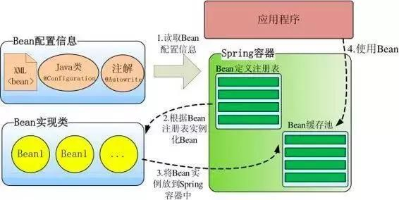

# Spring

> - Spring 官网：https://spring.io/
> - Spring 框架：https://spring.io/projects/spring-framework

~~jar 包下载地址：repo.springsource.org/libs-release-local/org/springframework/spring/~~

## 1. 工厂模式

### 1.1. 程序的耦合与解耦

以往在三层架构中，都使用 `new` 关键字来创建层与层之间的关系。`new` 关系字有很强的耦合性问题。以后在三层架构中创建依赖关系时不使用 `new` 对象。

实际开发中，理想状态应该是：<font color=red>**在编译时不依赖，在运行时才依赖**</font>

原来获取对象都是使得 `new` 方式，是主动；使用工厂为查找或者创建对象，是被动；这种被动接收方式获取对象的思想就是控制反转，是 spring 框架核心之一。它的作用只有一个：削减计算机程序的耦合。

### 1.2. 使用工厂模式解耦

使用工厂模式，是通过反射来解决耦合性的问题。工厂模式的特点：方法返回类型都是 `Object`，调用时按需进行强转。一般将一些参数写到配置文件中：xml和Properties

选择 xml 类型原因是其能够描述类的层级关系

### 1.3. 工厂模式创建对象示例

- 创建实例工厂类，解析 xml 配置，根据配置值通过反射来创建对象实例，并存储到工厂类中一个 `Map` 类型容器中。

```java
public class BeanFactory {
	// 通过一个全局变量接收解析后的xml信息,使用map取值比较方便
	private static Map<String, Object> beans = new HashMap<String, Object>();

	// 使用静态代码块在，在创建类的时候读取xml配置文件
	static {
		// 获取dom4j的SAXReader对象
		SAXReader sax = new SAXReader();
		try {
			// 获取Document对象
			Document document = sax.read(BeanFactory.class.getResourceAsStream("/mySpring.xml"));
			// 获取根标签
			Element root = document.getRootElement();
			// 获取子标签的集合
			List<Element> elements = root.elements();
			// 遍历集合
			for (Element e : elements) {
				String id = e.attributeValue("id");
				String className = e.attributeValue("class");
				// 使用反射创建对象
				Object bean = Class.forName(className).newInstance();
				// 将id和对象放到全局变量map集合中
				beans.put(id, bean);
			}
			System.out.println(beans);
		} catch (Exception e) {
			e.printStackTrace();
		}
	}

	/**
	 * 获取反射创建的对象
	 */
	public static Object getBean(String id) {
		return beans.get(id);
	}
}
```

- 创建 xml 配置文件，配置待实例化的类全限定名称

```xml
<?xml version="1.0" encoding="UTF-8"?>
<beans>
	<!-- 注意解析的顺序 -->
	<bean id="userDao" class="com.moonzero.dao.impl.UserDaoImpl"></bean>
	<bean id="userService" class="com.moonzero.service.impl.UserServiceImpl"></bean>
</beans>
```

- 创建示例业务层与持久层实现，通过对象工厂类获取相应的实例

```java
// =====模拟三层架构=====
public class FactoryTest {
	public static void main(String[] args) {
		// 获取业务逻辑层对象
		IUserService us = (IUserService) BeanFactory.getBean("userService");
		// 调用业务层方法
		us.add("工厂模式解耦~~");
	}
}

public class UserServiceImpl implements IUserService {
	// 获取数据访问层对象
	private IUserDao dao = (IUserDao) BeanFactory.getBean("userDao");
	@Override
	public void add(String name) {
		// 调用数据访问层方法
		dao.add(name);
	}

}

public class UserDaoImpl implements IUserDao {
	@Override
	public void add(String name) {
		System.out.println(name + "===被执行了。");
	}
}
```

#### 1.3.1. 示例编写时注意问题

在编写代码时，出现的错误。具体错误描述：创建一个工厂类去读取自己写的xml配置文件，在view层使用工厂类创建service层对象时，可以创建。但service层使用工厂类获取dao层的对象时却是null

```xml
<?xml version="1.0" encoding="UTF-8"?>
<beans>
	<bean id="userDao" class="com.moonzero.dao.impl.UserDaoImpl"></bean>
	<bean id="userService" class="com.moonzero.service.impl.UserServiceImpl"></bean>
</beans>
```

错误原因分析：当时配置文件顺序错误。

当测试层调用工具类创建 service 层对象时，工厂类开始读取 xml 文件，但当时 xml 文本顺序是 service 标签在 dao 标签上面，<font color=red>xml 的解析是有层级关系的。但 xml 解析第一行时，userService 标签已经读取了，程序就开始创建 userService 对象，创建 service 层对象的同时，也开始创建 dao 层对象，但现在 xml 只是解析第一行，map 集合中没有 userDao 标签的类全名，所有此时 userDao 无法创建，对象为 null。</font>

当 xml 继续解析，但 dao 层对象已经创建，所以在后台使用 debug 查看解析 xml 后的 map 集合是有数据，但 userDao 对象却是 null

所以需要<font color=red>将 userDao 标签放到上面，才确保创建 userService 层时，xml 全部解析完。因为如果工厂类没有读取到 map 集合有对应的 id 时，是不会去创建对象的。</font>

## 2. Spring 概述

Spring 是一个开放源代码的设计层面框架

Spring 是分层的 Java SE/EE 应用 full-stack 轻量级开源框架，<font color=red>**以 IoC（Inverse Of Control：反转控制）和 AOP（Aspect Oriented Programming：面向切面编程）为内核**</font>，提供了展现层 SpringMVC 和持久层 Spring JDBC 以及业务层事务管理等众多的企业级应用技术，还能整合开源世界众多著名的第三方框架和类库，逐渐成为使用最多的 Java EE 企业应用开源框架。

spring 是一站式框架

- Spring 在 javaee 三层结构中，每一层都提供不同的解决技术
- web 层：springMVC
- service 层：spring 的 ioc
- dao 层：spring 的 jdbcTemplate

### 2.1. Spring 核心部分

Spring 核心主要分成两部分：

- **控制反转（IOC）** - 将对象的创建交给 Spring，通过使用配置等方式创建类对象，Spring 通过一种称作控制反转（IoC）的技术促进了低耦合。当应用了 IoC，一个对象依赖的其它对象会通过被动的方式传递进来，而不是这个对象自己创建或者查找依赖对象。可以认为IoC与JNDI相反，不是对象从容器中查找依赖，而是容器在对象初始化时不等对象请求就主动将依赖传递给它。
- **面向切面编程（AOP）** - Spring 提供了面向切面编程的丰富支持，可以不通过修改源代码来实现扩展功能，允许通过分离应用的业务逻辑与系统级服务（例如审计（auditing）和事务（transaction）管理）进行内聚性的开发。应用对象只实现它们应该做的“完成业务逻辑”仅此而已。它们并不负责（甚至是意识）其它的系统级关注点，例如日志或事务支持。

### 2.2. Spring 容器高层视图

Spring 启动时读取应用程序提供的 Bean 配置信息，并在 Spring 容器中生成一份相应的 Bean 配置注册表，然后根据这张注册表实例化 Bean，装配好 Bean 之间的依赖关系，为上层应用提供准备就绪的运行环境。其中 Bean 缓存池为 `HashMap` 实现



### 2.3. Spring 运行环境要求

Minimum requirements

- JDK 8+ for Spring Framework 5.x
- JDK 6+ for Spring Framework 4.x
- JDK 5+ for Spring Framework 3.x

# Spring IOC（控制反转）

## 1. Spring Bean 的加载方式

### 1.1. xml 配置文件的 `<bean />` 标签


## 2. Spring bean 的作用范围和生命周期

### 2.1. Spring Bean 的作用范围

- **单例对象：`scope="singleton"`**

一个应用只有一个对象的实例。它的作用范围就是整个引用。<font color=red>**该模式在多线程下是不安全的**</font>。Singleton 作用域是Spring 中的缺省作用域

- 生命周期：
    - 对象创建：当应用加载，创建容器时，对象就被创建了。
    - 对象存活：只要容器在，对象一直存活
    - 对象销毁：当应用卸载，销毁容器时，对象就被销毁了。

- **多例对象：`scope="prototype"`**

一般使用在管理 struts2/Spring MVC 中的 action/controller 的创建

每次访问对象时，都会重新创建对象实例。每次通过 Spring 容器获取 prototype 定义的 bean 时，容器都将创建一个新的 Bean 实例，每个 Bean 实例都有自己的属性和状态。根据经验，对有状态的bean使用prototype作用域，而对无状态的bean使用singleton 作用域。

- 生命周期：
    - 对象创建：当使用对象时，创建新的对象实例。
    - 对象存活：只要对象在使用中，就一直存活。
    - 对象销毁：当对象长时间不用时，被 java 的垃圾回收器回收了。

- **一次request一个实例：`scope="request"`**

在一次 Http 请求中，容器会返回该 Bean 的同一实例。而对不同的 Http 请求则会产生新的 Bean，而且该 bean 仅在当前 Http Request 内有效,当前 Http 请求结束，该 bean 实例也将会被销毁。

- **`scope="session"`**

在一次 Http Session 中，容器会返回该 Bean 的同一实例。而对不同的 Session 请求则会创建新的实例，该 bean 实例仅在当前 Session 内有效。同 Http 请求相同，每一次 session 请求创建新的实例，而不同的实例之间不共享属性，且实例仅在自己的 session 请求内有效，请求结束，则实例将被销毁。

- **`scope=" global Session"`**

在一个全局的 Http Session 中，容器会返回该 Bean 的同一个实例，仅在使用 portlet context 时有效。

### 2.2. Spring Bean 生命周期

Bean对象在 spring 框架的上下文中的生命周期图（网络资料）


1. 实例化一个 Bean，也就是我们常说的 new。
2. IOC 依赖注入：按照 Spring 上下文对实例化的 Bean 进行配置，也就是 IOC 注入。
3. setBeanName 实现：如果这个 Bean 已经实现了 BeanNameAware 接口，会调用它实现的 setBeanName(String) 方法，此处传递的就是 Spring 配置文件中 Bean 的 id 值
4. BeanFactoryAware 实现：如果这个 Bean 已经实现了 BeanFactoryAware 接口，会调用它实现的 setBeanFactory，setBeanFactory(BeanFactory)传递的是 Spring 工厂自身（可以用这个方式来获取其它 Bean，只需在 Spring 配置文件中配置一个普通的 Bean 就可以）。
5. ApplicationContextAware 实现：如果这个 Bean 已经实现了 ApplicationContextAware 接口，会调用 setApplicationContext(ApplicationContext)方法，传入 Spring 上下文（同样这个方式也可以实现步骤 4 的内容，但比 4 更好，因为 ApplicationContext 是 BeanFactory 的子接口，有更多的实现方法）
6. postProcessBeforeInitialization 接口实现 - 初始化预处理：如果这个 Bean 关联了 BeanPostProcessor 接口，将会调用 postProcessBeforeInitialization(Object obj, String s)方法，BeanPostProcessor 经常被用作是 Bean 内容的更改，并且由于这个是在 Bean 初始化结束时调用那个的方法，也可以被应用于内存或缓存技术。
7. init-method：如果 Bean 在 Spring 配置文件中配置了 init-method 属性会自动调用其配置的初始化方法。
8. postProcessAfterInitialization：如果这个 Bean 关联了 BeanPostProcessor 接口，将会调用 postProcessAfterInitialization(Object obj, String s) 方法。
    - 注：以上工作完成以后就可以应用这个 Bean 了，那这个 Bean 是一个 Singleton 的，所以一般情况下我们调用同一个 id 的 Bean 会是在内容地址相同的实例，当然在 Spring 配置文件中也可以配置非 Singleton。
9. Destroy 过期自动清理阶段：当 Bean 不再需要时，会经过清理阶段，如果 Bean 实现了 DisposableBean 这个接口，会调用那个其实现的 destroy()方法；
10. destroy-method 自配置清理：最后，如果这个 Bean 的 Spring 配置中配置了 destroy-method 属性，会自动调用其配置的销毁方法
11. bean 标签有两个重要的属性（init-method 和 destroy-method）。`<bean id="" class="" init-method="初始化方法" destroy-method="销毁方法">`，用它们你可以自己定制初始化和注销方法。它们也有相应的注解（`@PostConstruct` 和 `@PreDestroy`）。

## 3. Bean的初始化和销毁方法

在整个生命周期过程中，可以自定义Bean的初始化和销毁钩子函数，当Bean的生命周期到达相应的阶段的时候，Spring会调用自定义的Bean的初始化和销毁方法。自定义Bean初始化和销毁方法有多种方式

参考代码详见：`spring-note\spring-analysis-note\spring-sample-annotation\19-annotation-lifecycle\`

### 3.1. @Bean 注解方式实现

- 创建自定义Bean

```java
public class CustomBean {
    public CustomBean() {
        System.out.println("CustomBean构造方法执行了...");
    }

    public void init() {
        System.out.println("CustomBean基于@Bean注解initMethod方式实现的初始化方法");
    }

    public void destory() {
        System.out.println("CustomBean基于@Bean注解destroyMethod方式实现的销毁方法");
    }

}
```

- 在配置类里注册该组件，并使用`@Bean`注解指定初始化和销毁方法

```java
@Configuration
// 配置包扫描
@ComponentScan("com.moon.springsample")
public class SpringConfiguration {
    /* 通过@Bean 注解方式创建对象并注册到IOC容器中，实现initMethod与destroyMethod方法 */
    @Bean(value = "customBean", initMethod = "init", destroyMethod = "destory")
    // @Scope("prototype") // 设置多例，用于测试生命周期
    public CustomBean createCustomBean() {
        return new CustomBean();
    }
}
```

*注：其中`initMethod = "init"`和`destroyMethod = "destory"`与CustomBean类里的init，destory方法相对应*

- 测试代码

```java
@Test
public void lifecycleBasicTest() {
    // 1. 创建注解扫描的容器
    AnnotationConfigApplicationContext context = new AnnotationConfigApplicationContext(SpringConfiguration.class);
    System.out.println("************* 容器创建完毕 *************");
    // 2. 获取容器中的bean对象，并输出
    CustomBean customBean = context.getBean("customBean", CustomBean.class);
    System.out.println(customBean);
    // 3. 关闭容器，观察单例对象的销毁前的方法
    context.close();
}
```

启动项目，观察控制台测试结果

1. 单例模式

```
CustomBean构造方法执行了...
CustomBean基于@Bean注解initMethod方式实现的初始化方法
************* 容器创建完毕 *************
com.moon.springsample.bean.CustomBean@7995092a
CustomBean基于@Bean注解destroyMethod方式实现的销毁方法
```

> 分析：此情况是对于单例，在容器启动之前，先调用对象的无参构造器创建对象，然后调用初始化方法，在容器关闭的时候调用销毁方法。

2. 多例模式

```
************* 容器创建完毕 *************
CustomBean构造方法执行了...
CustomBean基于@Bean注解initMethod方式实现的初始化方法
com.moon.springsample.bean.CustomBean@2133814f
```

> 分析：此情况在多例模式下，IOC容器启动的时候并不会去创建对象，而是在每次获取的时候才会去调用方法创建对象，创建完对象后再调用初始化方法。但在容器关闭后，Spring并没有调用相应的销毁方法，这是因为在多例模式下，容器不会管理这个组件（只负责在你需要的时候创建这个组件），所以容器在关闭的时候并不会调用相应的销毁方法。

### 3.2. InitializingBean & DisposableBean 接口实现

除了上面注解方式指定初始化和销毁方法外，Spring还提供了和初始化，销毁相对应的接口

- `InitializingBean`接口包含一个`afterPropertiesSet`方法，可以通过实现该接口，然后在这个方法中编写初始化逻辑。
- `DisposableBean`接口包含一个`destory`方法，可以通过实现该接口，然后再这个方法中编写销毁逻辑。

1. 新建一个UserService类，然后实现这两个接口

```java
@Service
public class UserService implements InitializingBean, DisposableBean {
    public UserService() {
        System.out.println("UserService构造方法执行了");
    }

    @Override
    public void afterPropertiesSet() throws Exception {
        System.out.println("UserService实现InitializingBean接口实现初始化的afterPropertiesSet()方法执行了");
    }

    @Override
    public void destroy() throws Exception {
        System.out.println("UserService实现DisposableBean接口实现销毁的destroy()方法执行了");
    }
}
```

2. 在配置类指定包扫描

```java
@Configuration
@ComponentScan("com.moon.springsample")
public class SpringConfiguration {
}
```

3. 测试代码

```java
@Test
public void lifecycleBasicTest() {
    // 1. 创建注解扫描的容器
    AnnotationConfigApplicationContext context = new AnnotationConfigApplicationContext(SpringConfiguration.class);
    System.out.println("************* 容器创建完毕 *************");
    // 2. 获取容器中的bean对象，并输出
    UserService userService = context.getBean("userService", UserService.class);
    System.out.println(userService);
    // 3. 关闭容器，观察单例对象的销毁前的方法
    context.close();
}
```

测试结果

```
UserService构造方法执行了
UserService实现InitializingBean接口实现初始化的afterPropertiesSet()方法执行了
************* 容器创建完毕 *************
com.moon.springsample.service.UserService@1df82230
UserService实现DisposableBean接口实现销毁的destroy()方法执行了
```

### 3.3. @PostConstruct & @PreDestroy 注解方式实现

还可以使用`@PostConstruct`和`@PreDestroy`注解修饰方法来指定相应的初始化和销毁方法

1. 创建LogUtil类，定义`@PostConstruct`和`@PreDestroy`注解修饰的方法

```java
// @Component
/*
 * 注意：单例的生命周期与容器的生命周期一致，对象随着容器的创建而创建，随容器的销毁而销毁
 *   如果将作用范围设置为多例，则对象的生命周期会脱离容器，当对象被使用时创建，
 *   因为容器不知道对象什么时候会不再使用，所以对象的销毁是GC垃圾回收器决定
 */
// @Scope("prototype")
public class LogUtil {
    /* 构造方法 */
    public LogUtil() {
        System.out.println("LogUtil类的无参构造函数执行了...");
    }

    /* @PostConstruct 注解用于指定bean对象的初始化后执行的方法 */
    @PostConstruct
    public void init() {
        System.out.println("LogUtil基于@PostConstruct注解的初始化后的方法执行了...");
    }

    /* @PreDestroy 用于指定bean对象的销毁前执行的方法 */
    @PreDestroy
    public void destroy() {
        System.out.println("LogUtil基于@PreDestroy注解销毁前的方法执行了...");
    }
}
```

2. 在配置类指定包扫描

```java
@Configuration
@ComponentScan("com.moon.springsample")
public class SpringConfiguration {
}
```

3. 测试代码

```java
@Test
public void lifecycleBasicTest() {
    // 1. 创建注解扫描的容器
    AnnotationConfigApplicationContext context = new AnnotationConfigApplicationContext(SpringConfiguration.class);
    System.out.println("************* 容器创建完毕 *************");
    // 2. 获取容器中的bean对象，并输出
    LogUtil logUtil = context.getBean("logUtil", LogUtil.class);
    System.out.println(logUtil);
    // 3. 关闭容器，观察单例对象的销毁前的方法
    context.close();
}
```

测试结果

```
LogUtil类的无参构造函数执行了...
LogUtil基于@PostConstruct注解的初始化后的方法执行了...
************* 容器创建完毕 *************
com.moon.springsample.utils.LogUtil@27c86f2d
LogUtil基于@PreDestroy注解销毁前的方法执行了...
```

<font color=purple>*注：这两个注解并非Spring提供，而是JSR250规范提供*</font>

### 3.4. BeanPostProcessor 接口实现

Spring提供了一个`BeanPostProcessor`接口，俗称Bean后置通知处理器，它提供了两个方法`postProcessBeforeInitialization`和`postProcessAfterInitialization`。

其中`postProcessBeforeInitialization`在组件的初始化方法调用之前执行，`postProcessAfterInitialization`在组件的初始化方法调用之后执行。它们都包含两个入参：

- `bean`：当前组件对象
- `beanName`：当前组件在容器中的名称。

两个方法都返回一个Object类型，可以直接返回当前组件对象，或者包装后返回。

1. 定义一个BeanPostProcessor接口的实现类MyBeanPostProcessor

```java
@Component
public class MyBeanPostProcessor implements BeanPostProcessor {
    public MyBeanPostProcessor() {
        System.out.println("MyBeanPostProcessor类构造方法执行了");
    }

    @Override
    public Object postProcessBeforeInitialization(Object bean, String beanName) throws BeansException {
        System.out.println("基于实现BeanPostProcessor接口postProcessBeforeInitialization()方法，" + beanName + "初始化之前调用");
        return bean;
    }

    @Override
    public Object postProcessAfterInitialization(Object bean, String beanName) throws BeansException {
        System.out.println("基于实现BeanPostProcessor接口postProcessAfterInitialization()方法" + beanName + "初始化之后调用");
        return bean;
    }
}
```

2. 在配置类指定包扫描

```java
@Configuration
@ComponentScan("com.moon.springsample")
public class SpringConfiguration {
}
```

3. 测试代码

```java
@Test
public void lifecycleBasicTest() {
    // 1. 创建注解扫描的容器
    AnnotationConfigApplicationContext context = new AnnotationConfigApplicationContext(SpringConfiguration.class);
    System.out.println("************* 容器创建完毕 *************");
    // 2. 获取容器中的bean对象，并输出
    MyBeanPostProcessor myBeanPostProcessor = context.getBean("myBeanPostProcessor", MyBeanPostProcessor.class);
    System.out.println(myBeanPostProcessor);
    // 3. 关闭容器，观察单例对象的销毁前的方法
    context.close();
}
```

测试结果

```
MyBeanPostProcessor类构造方法执行了
基于实现BeanPostProcessor接口postProcessBeforeInitialization()方法，springConfiguration初始化之前调用
基于实现BeanPostProcessor接口postProcessAfterInitialization()方法springConfiguration初始化之后调用
UserService构造方法执行了
基于实现BeanPostProcessor接口postProcessBeforeInitialization()方法，userService初始化之前调用
UserService实现InitializingBean接口实现初始化的afterPropertiesSet()方法执行了
基于实现BeanPostProcessor接口postProcessAfterInitialization()方法userService初始化之后调用
LogUtil类的无参构造函数执行了...
基于实现BeanPostProcessor接口postProcessBeforeInitialization()方法，logUtil初始化之前调用
LogUtil基于@PostConstruct注解的初始化后的方法执行了...
基于实现BeanPostProcessor接口postProcessAfterInitialization()方法logUtil初始化之后调用
CustomBean构造方法执行了...
基于实现BeanPostProcessor接口postProcessBeforeInitialization()方法，customBean初始化之前调用
CustomBean基于@Bean注解initMethod方式实现的初始化方法
基于实现BeanPostProcessor接口postProcessAfterInitialization()方法customBean初始化之后调用
************* 容器创建完毕 *************
com.moon.springsample.processor.MyBeanPostProcessor@1a04f701
CustomBean基于@Bean注解destroyMethod方式实现的销毁方法
LogUtil基于@PreDestroy注解销毁前的方法执行了...
UserService实现DisposableBean接口实现销毁的destroy()方法执行了
```

<font color=red>**注：BeanPostProcessor对IOC容器中所有组件都生效**</font>

