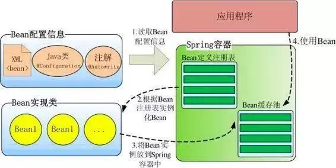
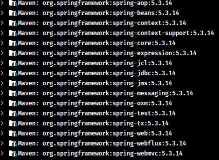
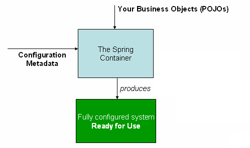
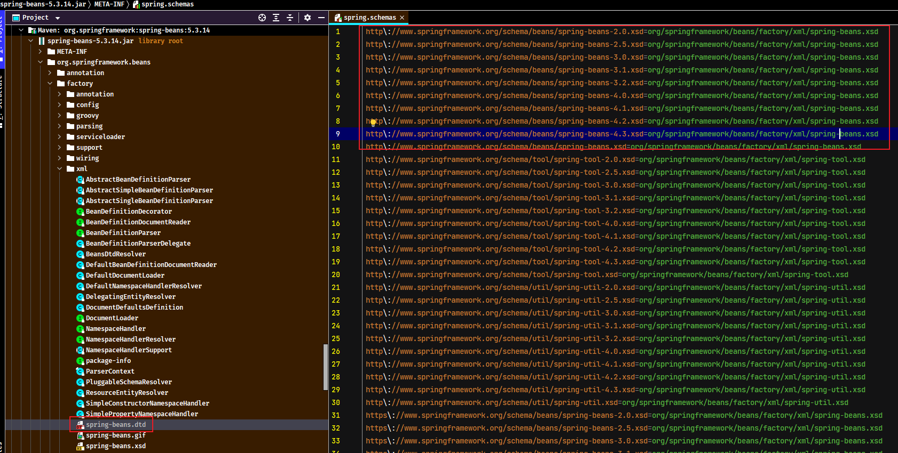
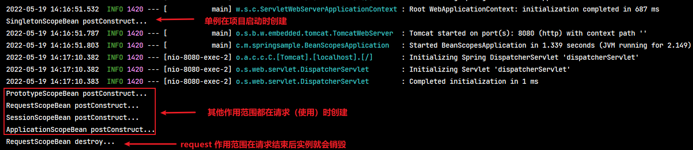
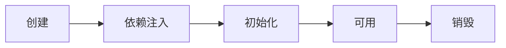
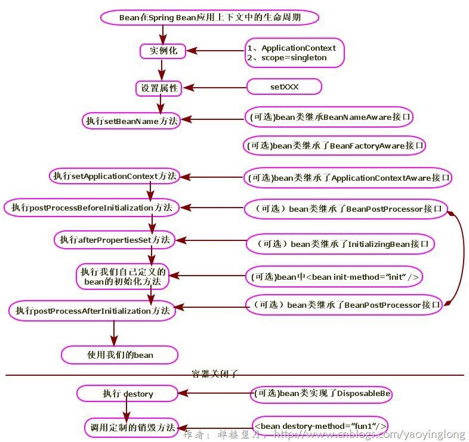
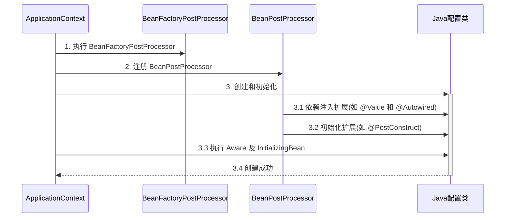
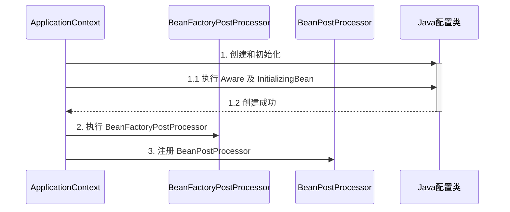

# Spring 核心功能笔记

> - Spring 官网：https://spring.io/
> - Spring 框架：https://spring.io/projects/spring-framework

~~jar 包下载地址：repo.springsource.org/libs-release-local/org/springframework/spring/~~

## 1. Spring 概述

Spring 是一个开放源代码的设计层面框架

Spring 是分层的 Java SE/EE 应用 full-stack 轻量级开源框架，<font color=red>**以 IoC（Inverse Of Control：反转控制）和 AOP（Aspect Oriented Programming：面向切面编程）为内核**</font>，提供了展现层 SpringMVC 和持久层 Spring JDBC 以及业务层事务管理等众多的企业级应用技术，还能整合开源世界众多著名的第三方框架和类库，逐渐成为使用最多的 Java EE 企业应用开源框架。

spring 是一站式框架

- Spring 在 javaee 三层结构中，每一层都提供不同的解决技术
- web 层：springMVC
- service 层：spring 的 ioc
- dao 层：spring 的 jdbcTemplate

### 1.1. 工厂模式

#### 1.1.1. 程序的耦合与解耦

以往在三层架构中，都使用 `new` 关键字来创建层与层之间的关系。`new` 关系字有很强的耦合性问题。以后在三层架构中创建依赖关系时不使用 `new` 对象。

实际开发中，理想状态应该是：<font color=red>**在编译时不依赖，在运行时才依赖**</font>

原来获取对象都是使得 `new` 方式，是主动；使用工厂为查找或者创建对象，是被动；这种被动接收方式获取对象的思想就是控制反转，是 spring 框架核心之一。它的作用只有一个：削减计算机程序的耦合。

#### 1.1.2. 使用工厂模式解耦

使用工厂模式，是通过反射来解决耦合性的问题。工厂模式的特点：方法返回类型都是 `Object`，调用时按需进行强转。一般将一些参数写到配置文件中：xml和Properties

选择 xml 类型原因是其能够描述类的层级关系

#### 1.1.3. 工厂模式创建对象

##### 1.1.3.1. 示例代码

- 创建实例工厂类，解析 xml 配置，根据配置值通过反射来创建对象实例，并存储到工厂类中一个 `Map` 类型容器中。

```java
public class BeanFactory {
	// 通过一个全局变量接收解析后的xml信息,使用map取值比较方便
	private static Map<String, Object> beans = new HashMap<String, Object>();

	// 使用静态代码块在，在创建类的时候读取xml配置文件
	static {
		// 获取dom4j的SAXReader对象
		SAXReader sax = new SAXReader();
		try {
			// 获取Document对象
			Document document = sax.read(BeanFactory.class.getResourceAsStream("/mySpring.xml"));
			// 获取根标签
			Element root = document.getRootElement();
			// 获取子标签的集合
			List<Element> elements = root.elements();
			// 遍历集合
			for (Element e : elements) {
				String id = e.attributeValue("id");
				String className = e.attributeValue("class");
				// 使用反射创建对象
				Object bean = Class.forName(className).newInstance();
				// 将id和对象放到全局变量map集合中
				beans.put(id, bean);
			}
			System.out.println(beans);
		} catch (Exception e) {
			e.printStackTrace();
		}
	}

	/**
	 * 获取反射创建的对象
	 */
	public static Object getBean(String id) {
		return beans.get(id);
	}
}
```

- 创建 xml 配置文件，配置待实例化的类全限定名称

```xml
<?xml version="1.0" encoding="UTF-8"?>
<beans>
	<!-- 注意解析的顺序 -->
	<bean id="userDao" class="com.moonzero.dao.impl.UserDaoImpl"></bean>
	<bean id="userService" class="com.moonzero.service.impl.UserServiceImpl"></bean>
</beans>
```

- 创建示例业务层与持久层实现，通过对象工厂类获取相应的实例

```java
// =====模拟三层架构=====
public class FactoryTest {
	public static void main(String[] args) {
		// 获取业务逻辑层对象
		IUserService us = (IUserService) BeanFactory.getBean("userService");
		// 调用业务层方法
		us.add("工厂模式解耦~~");
	}
}

public class UserServiceImpl implements IUserService {
	// 获取数据访问层对象
	private IUserDao dao = (IUserDao) BeanFactory.getBean("userDao");

	@Override
	public void add(String name) {
		// 调用数据访问层方法
		dao.add(name);
	}
}

public class UserDaoImpl implements IUserDao {
	@Override
	public void add(String name) {
		System.out.println(name + "===被执行了。");
	}
}
```

##### 1.1.3.2. 示例编写时注意问题

在编写代码时，出现的错误。具体错误描述：创建一个工厂类去读取自己写的xml配置文件，在view层使用工厂类创建service层对象时，可以创建。但service层使用工厂类获取dao层的对象时却是null

```xml
<?xml version="1.0" encoding="UTF-8"?>
<beans>
	<bean id="userDao" class="com.moonzero.dao.impl.UserDaoImpl"></bean>
	<bean id="userService" class="com.moonzero.service.impl.UserServiceImpl"></bean>
</beans>
```

错误原因分析：当时配置文件顺序错误。

当测试层调用工具类创建 service 层对象时，工厂类开始读取 xml 文件，但当时 xml 文本顺序是 service 标签在 dao 标签上面，<font color=red>xml 的解析是有层级关系的。但 xml 解析第一行时，userService 标签已经读取了，程序就开始创建 userService 对象，创建 service 层对象的同时，也开始创建 dao 层对象，但现在 xml 只是解析第一行，map 集合中没有 userDao 标签的类全名，所有此时 userDao 无法创建，对象为 null。</font>

当 xml 继续解析，但 dao 层对象已经创建，所以在后台使用 debug 查看解析 xml 后的 map 集合是有数据，但 userDao 对象却是 null

所以需要<font color=red>将 userDao 标签放到上面，才确保创建 userService 层时，xml 全部解析完。因为如果工厂类没有读取到 map 集合有对应的 id 时，是不会去创建对象的。</font>


### 1.2. Spring 核心部分

Spring 核心主要分成两部分：

- **控制反转（IOC）** - 将对象的创建交给 Spring，通过使用配置等方式创建类对象，Spring 通过一种称作控制反转（IoC）的技术促进了低耦合。当应用了 IoC，一个对象依赖的其它对象会通过被动的方式传递进来，而不是这个对象自己创建或者查找依赖对象。可以认为IoC与JNDI相反，不是对象从容器中查找依赖，而是容器在对象初始化时不等对象请求就主动将依赖传递给它。
- **面向切面编程（AOP）** - Spring 提供了面向切面编程的丰富支持，可以不通过修改源代码来实现扩展功能，允许通过分离应用的业务逻辑与系统级服务（例如审计（auditing）和事务（transaction）管理）进行内聚性的开发。应用对象只实现它们应该做的“完成业务逻辑”仅此而已。它们并不负责（甚至是意识）其它的系统级关注点，例如日志或事务支持。

### 1.3. Spring 容器高层视图

Spring 启动时读取应用程序提供的 Bean 配置信息，并在 Spring 容器中生成一份相应的 Bean 配置注册表，然后根据这张注册表实例化 Bean，装配好 Bean 之间的依赖关系，为上层应用提供准备就绪的运行环境。其中 Bean 缓存池为 `HashMap` 实现



### 1.4. Spring 运行环境要求

Minimum requirements

- JDK 8+ for Spring Framework 5.x
- JDK 6+ for Spring Framework 4.x
- JDK 5+ for Spring Framework 3.x

### 1.5. Spring 包结构

Spring 系统的 lib 包中都是以基本 jar 包、文档、源代码三种结构存在，只需要导入基本包



4个核心 jar 包分别是 Beans、Core、Context、ExpressionLanguage

- spring-beans-x.x.x.RELEASE.jar
- spring-context-x.x.x.RELEASE.jar
- spring-core-x.x.x.RELEASE.jar
- spring-expression-x.x.x.RELEASE.jar

2 个支撑 jar 包

- commons-logging-1.2.jar
- dom4j-1.6.1.jar

> <font color=red>**注：要使用 spring，其实只需要导入 spring-context-x.x.x.RELEASE 即可**</font>

## 2. Spring IOC 容器

IoC（Inversion of Control）也被称为依赖性注入（DI）。`org.springframework.beans` 和 `org.springframework.context` 包是 Spring Framework 的 IoC 容器的基础。

`BeanFactory` 接口提供了一种高级配置机制，能够管理任何类型的对象，提供了配置框架和基本功能，是 Spring 容器中的顶层接口（*远古版本时使用？实现类 `XmlBeanFactory`，已过时*）。`ApplicationContext` 是 `BeanFactory` 的一个子接口，完整的超集，它增加了更多的企业级开发的特定功能：

- Spring 的 AOP 功能的集成
- 消息资源处理（用于国际化）
- 事件发布
- 应用层的特定上下文，如 `WebApplicationContext`，用于 Web 应用程序。

在 Spring 构建的应用程序中，Spring IoC 容器管理的对象被称为 Bean。Bean 是一个由 Spring IoC 容器实例化、组装和管理的对象。

### 2.1. 容器概述

通常 Spring IoC 容器是指 `org.springframework.context.ApplicationContext` 接口，该接口负责实例化、配置和组装 bean。容器通过读取**配置元数据**来获得关于要实例化、配置和组装哪些对象。可以通过 XML 文件、Java 注解或 Java 代码配置元数据，告诉容器要实例化的对象及其依赖关系。在 `ApplicationContext` 被创建和初始化后，就有了一个完全配置好的可执行系统或应用程序。



#### 2.1.1. 配置元数据

Spring IoC 容器通过使用者对 bean 配置元数据，从而知道如何实例化、配置和组装对象。

```xml
<?xml version="1.0" encoding="UTF-8"?>
<beans xmlns="http://www.springframework.org/schema/beans"
    xmlns:xsi="http://www.w3.org/2001/XMLSchema-instance"
    xsi:schemaLocation="http://www.springframework.org/schema/beans
        https://www.springframework.org/schema/beans/spring-beans.xsd">

    <!-- 
        id 属性：定义 bean 的唯一标识名称
        class 属性：指定 bean 的全限定类名称            
    -->
    <bean id="..." class="...">  
        <!-- collaborators and configuration for this bean go here -->
    </bean>

    <bean id="..." class="...">
        <!-- collaborators and configuration for this bean go here -->
    </bean>

    <!-- more bean definitions go here -->

</beans>
```

#### 2.1.2. IOC 容器创建（ApplicationContext 接口实现类）

IOC 容器的创建，即创建 `ApplicationContext` 接口实现类实例。如：

```xml
ApplicationContext context = new ClassPathXmlApplicationContext("services.xml", "daos.xml");
```

Spring 提供几个 `ApplicationContext` 接口的实现类。创建一个 `ClassPathXmlApplicationContext` 或 `FileSystemXmlApplicationContext` 实例对象

- `ClassPathXmlApplicationContext` 从类的根路径下加载配置文件（**此方式已过时**）

```java
public class ClassPathXmlApplicationContext extends AbstractXmlApplicationContext {
    // ...省略
    /**
     * Create a new ClassPathXmlApplicationContext, loading the definitions
     * from the given XML file and automatically refreshing the context.
     * @param configLocation resource location 参数为类根目录，可以加“/”也可以不加
     * @throws BeansException if context creation failed
     */
    public ClassPathXmlApplicationContext(String configLocation) throws BeansException {
    }
    // ...省略
}
```

- `FileSystemXmlApplicationContext` 从磁盘路径上加载配置文件，配置文件可以在磁盘的任意位置。构造方法中参数文件使用相对路径或绝对路径。

```java
public class FileSystemXmlApplicationContext extends AbstractXmlApplicationContext {
    // ...省略
	/**
	 * Create a new FileSystemXmlApplicationContext, loading the definitions
	 * from the given XML file and automatically refreshing the context.
	 * @param configLocation file path 文件的相对路径或绝对路径
	 * @throws BeansException if context creation failed
	 */
	public FileSystemXmlApplicationContext(String configLocation) throws BeansException {
	}
	// ...省略
}
```

- `AnnotationConfigApplicationContext` 通过指定包扫描路径或者配置类，创建基于注解的 IOC 容器

```java
public class AnnotationConfigApplicationContext extends GenericApplicationContext implements AnnotationConfigRegistry {
    // ...省略
    /**
     * Create a new AnnotationConfigApplicationContext, deriving bean definitions
     * from the given component classes and automatically refreshing the context.
     * @param componentClasses one or more component classes &mdash; for example,
     * {@link Configuration @Configuration} classes
     */
    public AnnotationConfigApplicationContext(Class<?>... componentClasses) {
    }

    /**
     * Create a new AnnotationConfigApplicationContext, scanning for components
     * in the given packages, registering bean definitions for those components,
     * and automatically refreshing the context.
     * @param basePackages the packages to scan for component classes
     */
    public AnnotationConfigApplicationContext(String... basePackages) {
    }
    // ...省略
}
```

#### 2.1.3. ApplicationContext 常用方法（整理中!）

- 继承于 `BeanFactory`，根据 bean 的名称获取实例对象

```java
Object getBean(String name) throws BeansException;
```

- 继承于 `BeanFactory`，根据 bean 的名称与指定类型，获取实例对象

```java
<T> T getBean(String name, Class<T> requiredType) throws BeansException;
```


### 2.2. Bean 概述

JavaBean：是一种 Java 语言写成的可重用组件。一个 Spring IoC 容器管理着一个或多个 Bean。这些 Bean 都根据使用者提供给容器的配置元数据创建的（例如，以 XML 文件 `<bean/>` 标签定义的形式）。

在容器本身中，这些 Bean 会被封装为 `BeanDefinition` 对象，它包含（除其他信息外）以下元数据：

- Bean 实际实现类的全限定名称
- Bean 在容器中的行为方式（范围、生命周期等）
- Bean 与其他 Bean 的引用（依赖关系）
- 在新创建的对象中设置的其他配置。例如，在管理连接池的 Bean 中，连接池的大小限制或使用的连接数。

传统上，配置元数据是以简单直观的 XML 格式实现，Spring 2.5 引入了对基于注解的配置元数据的支持。从 Spring 3.0 开始，Spring JavaConfig 项目提供的许多功能成为 Spring 框架的核心部分。后面建议使用 Java 注解来配置 Bean 的元数据。（*具体详见后面 `@Configuration`、`@Bean`、`@Import` 和 `@DependsOn` 等相关内容*）

### 2.3. IOC 底层原理（待整理或删除）

1. xml 配置文件（老旧）、注解
2. dom4j 解决 xml（老旧）、解析注解
3. 工厂设计模式
4. 反射创建实例

## 3. Spring Bean 的加载方式

### 3.1. 方式1：基于 xml 配置的 `<bean>` 标签

Spring 核心配置文件名称和位置不是固定的，只要名字不包含中文和空格即可。建议放到 src 根目录，官方建议：applicationContext.xml，也可以简单命名为 bean.xml

#### 3.1.1. 引入 schema 约束

**导入约束需要导入一个 `beans` 名称空间下的约束，因为是第 1 个约束，可以省略前缀**

```xml
<?xml version="1.0" encoding="UTF-8"?>
<beans xmlns="http://www.springframework.org/schema/beans"
		xmlns:xsi="http://www.w3.org/2001/XMLSchema-instance"
		xsi:schemaLocation="http://www.springframework.org/schema/beans
				http://www.springframework.org/schema/beans/spring-beans.xsd">
</beans>
```

引用的 `beans` 名称约束文件所在路径：spring-beans-x.x.x.jar\org\springframework\beans\factory\xml\spring-beans.dtd



#### 3.1.2. 配置 `<bean>` 标签

在配置文件中定义 `<bean />` 标签即可创建对象，其中核心属性如下：

- `id` 属性：根据值来获取相应的类的对象
- `class` 属性：需要创建类的类全名

```xml
<?xml version="1.0" encoding="UTF-8"?>
<beans xmlns="http://www.springframework.org/schema/beans"
	xmlns:xsi="http://www.w3.org/2001/XMLSchema-instance"
	xsi:schemaLocation="
        http://www.springframework.org/schema/beans http://www.springframework.org/schema/beans/spring-beans.xsd">
        
	<!-- 配置资源让 spring 来创建对象 -->
	<bean id="foo" class="com.moon.entity.Foo"></bean>
	
</beans>
```

#### 3.1.3. 获取 bean 实例

在测试用例中，使用实现类 `ClassPathXmlApplicationContext` 创建 spring 容器对象 `ApplicationContext`，读取 xml 文件，通过 `getBean(String id)` 方法获取配置的对象

```java
/**
 * 测试spring配置xml文件创建对象
 */
public class BeanBasicTest {

	@Test
	public void test() {
		// 创建spring容器ApplicationContext
		ApplicationContext context = new ClassPathXmlApplicationContext("bean.xml");
		// 根据bean的id获取对象
		Foo foo = (Foo) context.getBean("foo");
		System.out.println(foo);
	}
}
```

## 4. Spring 的依赖注入(DI) - 整理中

### 4.1. 依赖注入的概念

DI (dependcy injection)：依赖注入，Spring 框架核心 IOC 的具体实现方式。即让框架自动把对象传入，不需要使用者自动去获取。
	
依赖注入（DI）是一个过程，对象仅通过构造方法的形参、类属性、setter 方法来定义当前类依赖的其他对象。然后 Spring 容器在创建 Bean 时自动注入这些依赖关系的对象实例。这个过程本质是 Bean 本身调用构造方法创建实例时，会到 Spring 容器中查找其依赖的对象，找到的将其依赖的对象引用设置到当前实例化中的 Bean

在 java 代码中属性注入（就是给对象的属性设置值），有三种方式：

1. 使用 set 方法注入
2. 使用有参构造注入
3. 使用接口注入

在 spring 框架中，只支持前两种方式

1. set 方法注入
2. 有参构造方法注入

#### 4.1.1. IOC和DI区别

- IOC：控制反转，把对象创建交给spring进行配置
- DI：依赖注入，向类里面的属性中设置值

IOC 和 DI 关系：依赖注入不能单独存在，需要在 IOC 基础之上完成操作

## 5. 基于 XML 的 IOC 配置（已过时）


## 6. 基于注解的 IOC 配置

注解配置和 xml 配置要实现的功能都是一样的，都是要降低程序间的耦合。只是配置的形式不一样。根据不同公司的使用习惯，两种配置方式都有可能使用。


### 6.1. 关于注解和 XML 的配置选择问题

- 注解的优势：配置简单，维护方便（找到类，就相当于找到了对应的配置）
- XML 的优势：修改时，不用改源码。不涉及重新编译和部署 

> **注：目前已经是全注解配置开发的方式，xml 的方式几乎已经被完全弃用**

## 7. Spring Bean 的作用范围

### 7.1. 概述

Spring 创建的 Bean 对象的都有其作用范围。Spring 框架支持6种作用域，其中4种只有在 Web 环境的 `ApplicationContext` 容器中才可用，使用者也可以创建一个自定义作用域。下表是支持的作用域描述：

| 作用范围取值 | 描述                                                                                                                                                                           |
| :---------: | :----------------------------------------------------------------------------------------------------------------------------------------------------------------------------- |
|  singleton  | (默认) Bean 定义的作用域存在整个 Spring IoC 容器                                                                                                                                |
|  prototype  | Bean 定义的作用域存在任何数量的对象实例。                                                                                                                                        |
|   request   | Bean 定义的作用域存在单个 HTTP 请求的生命周期中。即每个 HTTP 请求都有自己的 Bean 实例，这些实例基于单个 Bean 定义的基础上创建的。（只在 Web 环境的 `ApplicationContext` 容器中有效） |
|   session   | Bean 定义的作用域存在一个 HTTP 会话的生命周期。（只在 Web 环境的 `ApplicationContext` 容器中有效）                                                                                |
| application | Bean 定义的作用域存在 `ServletContext` 的生命周期。（只在 Web 环境的 `ApplicationContext` 容器中有效）                                                                           |
|  websocket  | Bean 定义的作用域存在 `WebSocket` 的生命周期。（只在 Web 环境的 `ApplicationContext` 容器中有效）                                                                                |

> 注：有些历史资料中提及有 `globalSession` 这种作用范围，目前 Spring 中已废弃

### 7.2. 各种作用范围说明

#### 7.2.1. singleton 单例对象

```java
@Scope(ConfigurableBeanFactory.SCOPE_SINGLETON) // 直接写 "singleton" 字符或者不写，默认作用范围也是单例
@Component
public class SingletonScopeBean {}
```

一个应用只有一个对象的实例。它的作用范围就是整个引用。<font color=red>**该模式在多线程下是不安全的**</font>。Singleton 作用域是 Spring 中的缺省作用域。**bean 生命周期**如下：

- 对象创建：当应用加载，创建容器时，对象就被创建了。
- 对象存活：只要容器在，对象一直存活
- 对象销毁：当应用卸载，销毁容器时，对象就被销毁了。

#### 7.2.2. prototype 多例对象

```java
@Scope(ConfigurableBeanFactory.SCOPE_PROTOTYPE) // 或 "prototype" 字符串
@Component
public class PrototypeScopeBean {}
```

一般使用在管理 struts2/Spring MVC 中的 action/controller 的创建

每次访问对象时，都会重新创建对象实例。每次通过 Spring 容器获取 prototype 定义的 bean 时，容器都将创建一个新的 Bean 实例，每个 Bean 实例都有自己的属性和状态。根据经验，对有状态的bean 使用 prototype 作用域，而对无状态的 bean 使用 singleton 作用域。**bean 生命周期**如下：

- 对象创建：当使用对象时，创建新的对象实例。
- 对象存活：只要对象在使用中，就一直存活。
- 对象销毁：当对象长时间不用时，被 java 的垃圾回收器回收了。

#### 7.2.3. request 请求域对象

```java
@Scope(WebApplicationContext.SCOPE_REQUEST) // 或 "request" 字符串
@Component
public class RequestScopeBean {}
```

在一次 Http 请求中，容器会返回该 Bean 的同一实例。而对不同的 Http 请求则会产生新的 Bean，而且该 bean 仅在当前 Http Request 内有效，当前 Http 请求结束，该 bean 实例也将会被销毁。

#### 7.2.4. session 会话域对象

```java
@Scope(WebApplicationContext.SCOPE_SESSION) // 或 "session" 字符串
@Component
public class SessionScopeBean {}
```

在一次 Http Session 中，容器会返回该 Bean 的同一实例。而对不同的 Session 请求则会创建新的实例，该 bean 实例仅在当前 Session 内有效。同 Http 请求相同，每一次 session 请求创建新的实例，而不同的实例之间不共享属性，且实例仅在自己的 session 请求内有效，请求结束，则实例将被销毁。

#### 7.2.5. application 应用上下文对象

```java
@Scope(WebApplicationContext.SCOPE_APPLICATION) // 或 "application" 字符串
@Component
public class ApplicationScopeBean {}
```

在一个全局的 Http Session 中，容器会返回该 Bean 的同一个实例，仅在使用 portlet context 时有效。

#### 7.2.6. 作用范围测试

- 按上面创建不同作用范围的类，然后在每个类中都创建初始化后与销毁方法。

```java
@PostConstruct
public void init() {
    System.out.println("xxxScopeBean postConstruct...");
}
@PreDestroy
public void destroy() {
    System.out.println("xxxScopeBean destroy...");
}
```

- 创建请求控制层，注入各种作用范围的实例。值得

```java
@SpringBootApplication
@RestController
public class BeanScopesApplication {

    public static void main(String[] args) {
        SpringApplication.run(BeanScopesApplication.class, args);
    }

    @Autowired
    private SingletonScopeBean singletonScopeBean;

    @Lazy
    @Autowired
    private PrototypeScopeBean prototypeScopeBean;

    @Lazy
    @Autowired
    private RequestScopeBean requestScopeBean;

    @Lazy
    @Autowired
    private SessionScopeBean sessionScopeBean;

    @Lazy
    @Autowired
    private ApplicationScopeBean applicationScopeBean;

    @GetMapping(value = "/test", produces = "text/html")
    public String test(HttpServletRequest request, HttpSession session) {
        ServletContext sc = request.getServletContext();
        return "<ul>" +
                "<li>" + "singleton scope:" + singletonScopeBean + "</li>" +
                "<li>" + "prototype scope:" + prototypeScopeBean + "</li>" +
                "<li>" + "request scope:" + requestScopeBean + "</li>" +
                "<li>" + "session scope:" + sessionScopeBean + "</li>" +
                "<li>" + "application scope:" + applicationScopeBean + "</li>" +
                "</ul>";
    }
}
```

> 注意：**上例中使用 `@Autowired` 注解自动注入非单例作用域的对象时，需要同时使用 `@Lazy` 注解，否则会出现作用域失效问题**。原因与解决方法详见下面章节内容

- 访问 `http://localhost:8080/test`，观察页面返回的对象地址与后端控制台输出日志。刷新请求再观察变化。也可以设置项目配置 `server.servlet.session.timeout=30s` 观察 session bean 的销毁



> 测试时需要注意：如果项目环境的 JDK >= 9，以上示例会涉及反射调用 jdk 中方法，程序会报错。此时需要运行时添加参数 `--add-opens java.base/java.lang=ALL-UNNAMED`

### 7.3. singleton 注入其它 scope 失效问题

#### 7.3.1. 问题分析

下面以单例作用域对象注入多例作用域对象为例（其他类型作用域均一样）

- 创建多例作用域类

```java
@Scope(ConfigurableBeanFactory.SCOPE_PROTOTYPE)
@Component
public class PrototypeScopeBean1 {
}
```

- 创建单例作用域类，并直接自动注入多例对象

```java
@Component
public class SingletonScopeBean {

    @Autowired
    private PrototypeScopeBean1 bean1;
    
    public PrototypeScopeBean1 getBean1() {
        return bean1;
    }
}
```

- 测试代码

```java
@Test
public void basicTest() {
    AnnotationConfigApplicationContext context = new AnnotationConfigApplicationContext(BeanScopesApplication.class);
    SingletonScopeBean bean = context.getBean(SingletonScopeBean.class);
    // 多次获取，观察是否为同一个对象
    System.out.println(bean.getBean1());
    System.out.println(bean.getBean1());
    System.out.println(bean.getBean1());
}
```

- 运行测试结果：

```
com.moon.springsample.bean.PrototypeScopeBean1@1bb1fde8
com.moon.springsample.bean.PrototypeScopeBean1@1bb1fde8
com.moon.springsample.bean.PrototypeScopeBean1@1bb1fde8
```

从测试结果可见，期望的是多例对象，但每次获取都是同一个对象。原因其实很简单，就是单例对象只会被初始化一次，依赖注入也只有一次，所有后续每次获取注入的对象都是初始化时注入的对象。解决作用域失效有以下几种方式，<font color=red>**其原理都是推迟其他作用域 bean 的获取时机**</font>

#### 7.3.2. 解决方式1 - @Lazy 注解

在注入的对象上标识 `@Lazy` 注解，此时单例对象实例化是注入的是代理对象，代理对象虽然还是同一个，但当每次使用代理对象的任意方法时，由代理创建新的多例对象

```java
@Lazy
@Autowired
private PrototypeScopeBean1 bean1;
```

#### 7.3.3. 解决方式2 - 设置 proxyMode 属性

在 `@Scope` 注解中使用 `proxyMode` 属性指定使用代理模式

```java
@Scope(value = ConfigurableBeanFactory.SCOPE_PROTOTYPE, proxyMode = ScopedProxyMode.TARGET_CLASS)
@Component
public class PrototypeScopeBean2 {
}
```

#### 7.3.4. 解决方式3 - ObjectFactory 对象

使用 `ObjectFactory` 将注入的多例对象进行包装，获取对象实例时调用其 `getObject` 方法

```java
@Autowired
private ObjectFactory<PrototypeScopeBean3> bean3;

public PrototypeScopeBean3 getBean3() {
    return bean3.getObject();
}
```

#### 7.3.5. 解决方式4 - 从容器中获取

注入 Spring 容器，直接从容器中获取实例对象

```java
@Autowired
private ApplicationContext bean4;

public PrototypeScopeBean4 getBean4() {
    return bean4.getBean(PrototypeScopeBean4.class);
}
```

## 8. Spring Bean 的生命周期

### 8.1. 概述

一个受 Spring 管理的 bean，生命周期主要阶段有

1. 创建：根据 bean 的构造方法或者工厂方法来创建 bean 实例对象
2. 依赖注入：根据 `@Autowired`，`@Value` 或其它一些手段，为 bean 的成员变量填充值、建立关系
3. 初始化：回调各种 `Aware` 接口，调用对象的各种初始化方法
4. 销毁：在容器关闭时，会销毁所有单例对象（即调用它们的销毁方法）。prototype （多例）对象也能够销毁，不过需要容器主动调用



在整个生命周期过程中，可以自定义 Bean 的初始化和销毁钩子函数，当 Bean 的生命周期到达相应的阶段的时候，Spring 会调用自定义的 Bean 的初始化和销毁方法。Spring 还提供一种 `BeanPostProcessor` 接口（Bean 后处理器），也可以用于在 bean 的初始化的前后，提供一些扩展逻辑，但不单单只对生命周期有作用（*`BeanPostProcessor` 接口详细说明见后面章节*）

自定义 Bean 初始化和销毁方法有多种方式。参考代码详见：`spring-note\spring-sample\39-annotation-lifecycle\`

Bean 对象在 spring 框架的上下文中的生命周期图（网络资料）



1. 实例化一个 Bean，也就是我们常说的 new。
2. IOC 依赖注入：按照 Spring 上下文对实例化的 Bean 进行配置，也就是 IOC 注入。
3. setBeanName 实现：如果这个 Bean 已经实现了 BeanNameAware 接口，会调用它实现的 setBeanName(String) 方法，此处传递的就是 Spring 配置文件中 Bean 的 id 值
4. BeanFactoryAware 实现：如果这个 Bean 已经实现了 BeanFactoryAware 接口，会调用它实现的 setBeanFactory，setBeanFactory(BeanFactory)传递的是 Spring 工厂自身（可以用这个方式来获取其它 Bean，只需在 Spring 配置文件中配置一个普通的 Bean 就可以）。
5. ApplicationContextAware 实现：如果这个 Bean 已经实现了 ApplicationContextAware 接口，会调用 setApplicationContext(ApplicationContext)方法，传入 Spring 上下文（同样这个方式也可以实现步骤 4 的内容，但比 4 更好，因为 ApplicationContext 是 BeanFactory 的子接口，有更多的实现方法）
6. postProcessBeforeInitialization 接口实现 - 初始化预处理：如果这个 Bean 关联了 BeanPostProcessor 接口，将会调用 postProcessBeforeInitialization(Object obj, String s)方法，BeanPostProcessor 经常被用作是 Bean 内容的更改，并且由于这个是在 Bean 初始化结束时调用那个的方法，也可以被应用于内存或缓存技术。
7. init-method：如果 Bean 在 Spring 配置文件中配置了 init-method 属性会自动调用其配置的初始化方法。
8. postProcessAfterInitialization：如果这个 Bean 关联了 BeanPostProcessor 接口，将会调用 postProcessAfterInitialization(Object obj, String s) 方法。
    - 注：以上工作完成以后就可以应用这个 Bean 了，那这个 Bean 是一个 Singleton 的，所以一般情况下我们调用同一个 id 的 Bean 会是在内容地址相同的实例，当然在 Spring 配置文件中也可以配置非 Singleton。
9. Destroy 过期自动清理阶段：当 Bean 不再需要时，会经过清理阶段，如果 Bean 实现了 DisposableBean 这个接口，会调用那个其实现的 destroy()方法；
10. destroy-method 自配置清理：最后，如果这个 Bean 的 Spring 配置中配置了 destroy-method 属性，会自动调用其配置的销毁方法
11. bean 标签有两个重要的属性（init-method 和 destroy-method）。`<bean id="" class="" init-method="初始化方法" destroy-method="销毁方法">`，用它们你可以自己定制初始化和注销方法。它们也有相应的注解（`@PostConstruct` 和 `@PreDestroy`）。

### 8.2. @Bean 注解方式实现生命周期回调

- 创建自定义Bean

```java
public class CustomBean {
    public CustomBean() {
        System.out.println("CustomBean构造方法执行了...");
    }

    public void init() {
        System.out.println("CustomBean基于@Bean注解initMethod方式实现的初始化方法");
    }

    public void destory() {
        System.out.println("CustomBean基于@Bean注解destroyMethod方式实现的销毁方法");
    }

}
```

- 在配置类里注册该组件，并使用`@Bean`注解指定初始化和销毁方法

```java
@Configuration
// 配置包扫描
@ComponentScan("com.moon.springsample")
public class SpringConfiguration {

    public SpringConfiguration() {
        System.out.println("SpringConfiguration 类构造方法执行");
    }

    /* 通过@Bean 注解方式创建对象并注册到IOC容器中，实现initMethod与destroyMethod方法 */
    @Bean(value = "customBean", initMethod = "init", destroyMethod = "destory")
    // @Scope("prototype") // 设置多例，用于测试生命周期
    public CustomBean createCustomBean() {
        return new CustomBean();
    }
}
```

*注：其中`initMethod = "init"`和`destroyMethod = "destory"`与CustomBean类里的init，destory方法相对应*

- 测试代码

```java
@Test
public void lifecycleBasicTest() {
    // 创建容器，观察单例对象的初始化方法
    System.out.println("************* 容器准备创建 *************");
    AnnotationConfigApplicationContext context = new AnnotationConfigApplicationContext(SpringConfiguration.class);
    System.out.println("************* 容器创建完毕 *************");

    System.out.println("************* 容器准备关闭 *************");
    // 关闭容器，观察单例对象的销毁前的方法
    context.close();
    System.out.println("************* 容器关闭完毕 *************");
}
```

启动项目，观察控制台测试结果

1. 单例模式

```
************* 容器准备创建 *************
SpringConfiguration 类构造方法执行
CustomBean 构造方法执行了...
CustomBean 基于 @Bean 注解 initMethod 方式实现的初始化方法
************* 容器创建完毕 *************
************* 容器准备关闭 *************
CustomBean 基于 @Bean 注解 destroyMethod 方式实现的销毁方法
************* 容器关闭完毕 *************
```

> 分析：此情况是对于单例，在容器启动之前，先调用对象的无参构造器创建对象，然后调用初始化方法，在容器关闭的时候调用销毁方法。

2. 多例模式

因为是多例对象，在获取 bean 对象时才会创建，所以在测试方法中增加获取对象的操作

```java
System.out.println(context.getBean(CustomBean.class));
```

```
************* 容器准备创建 *************
SpringConfiguration 类构造方法执行
************* 容器创建完毕 *************
CustomBean 构造方法执行了...
CustomBean 基于 @Bean 注解 initMethod 方式实现的初始化方法
com.moon.springsample.bean.CustomBean@6b4a4e18
************* 容器准备关闭 *************
************* 容器关闭完毕 *************
```

> 分析：此情况在多例模式下，IOC 容器启动的时候并不会去创建对象，而是在每次获取的时候才会去调用方法创建对象，创建完对象后再调用初始化方法。但在容器关闭后，Spring 并没有调用相应的销毁方法，这是因为在多例模式下，容器不会管理这个组件（只负责在你需要的时候创建这个组件），所以容器在关闭的时候并不会调用相应的销毁方法。

### 8.3. InitializingBean & DisposableBean 接口实现生命周期回调

除了上面注解方式指定初始化和销毁方法外，Spring 还提供了和初始化，销毁相对应的接口

- `org.springframework.beans.factory.InitializingBean` 接口包含一个 `afterPropertiesSet` 方法，可以通过实现该接口，然后在这个方法中编写初始化逻辑。
- `org.springframework.beans.factory.DisposableBean` 接口包含一个 `destory` 方法，可以通过实现该接口，然后再这个方法中编写销毁逻辑。

1. 新建一个UserService类，然后实现这两个接口

```java
@Service
public class UserService implements InitializingBean, DisposableBean {
    public UserService() {
        System.out.println("UserService构造方法执行了");
    }

    @Override
    public void afterPropertiesSet() throws Exception {
        System.out.println("UserService实现InitializingBean接口实现初始化的afterPropertiesSet()方法执行了");
    }

    @Override
    public void destroy() throws Exception {
        System.out.println("UserService实现DisposableBean接口实现销毁的destroy()方法执行了");
    }
}
```

2. 在配置类指定包扫描

```java
@Configuration
@ComponentScan("com.moon.springsample")
public class SpringConfiguration {
}
```

3. 测试代码

```java
@Test
public void lifecycleBasicTest() {
    // 创建容器，观察单例对象的初始化方法
    System.out.println("************* 容器准备创建 *************");
    AnnotationConfigApplicationContext context = new AnnotationConfigApplicationContext(SpringConfiguration.class);
    System.out.println("************* 容器创建完毕 *************");

    System.out.println("************* 容器准备关闭 *************");
    // 关闭容器，观察单例对象的销毁前的方法
    context.close();
    System.out.println("************* 容器关闭完毕 *************");
}
```

测试结果

```
************* 容器准备创建 *************
SpringConfiguration 类构造方法执行
UserService 构造方法执行了
UserService 实现 InitializingBean 接口实现初始化的 afterPropertiesSet() 方法执行了
************* 容器创建完毕 *************
************* 容器准备关闭 *************
UserService 实现 DisposableBean 接口实现销毁的 destroy() 方法执行了
************* 容器关闭完毕 *************
```

### 8.4. @PostConstruct & @PreDestroy 注解方式实现生命周期回调

还可以使用 `@PostConstruct` 和 `@PreDestroy` 注解修饰方法来指定相应的初始化和销毁方法

1. 创建 `LogUtil` 类，定义 `@PostConstruct` 和 `@PreDestroy` 注解修饰的方法

```java
// @Component
/*
 * 注意：单例的生命周期与容器的生命周期一致，对象随着容器的创建而创建，随容器的销毁而销毁
 *   如果将作用范围设置为多例，则对象的生命周期会脱离容器，当对象被使用时创建，
 *   因为容器不知道对象什么时候会不再使用，所以对象的销毁是GC垃圾回收器决定
 */
// @Scope("prototype")
public class LogUtil {
    /* 构造方法 */
    public LogUtil() {
        System.out.println("LogUtil 类的无参构造函数执行了...");
    }

    /* @PostConstruct 注解用于指定bean对象的初始化后执行的方法 */
    @PostConstruct
    public void init() {
        System.out.println("LogUtil 基于 @PostConstruct 注解的初始化后的方法执行了...");
    }

    /* @PreDestroy 用于指定bean对象的销毁前执行的方法 */
    @PreDestroy
    public void destroy() {
        System.out.println("LogUtil 基于 @PreDestroy 注解销毁前的方法执行了...");
    }
}
```

2. 在配置类指定包扫描

```java
@Configuration
@ComponentScan("com.moon.springsample")
public class SpringConfiguration {
}
```

3. 测试代码

```java
@Test
public void lifecycleBasicTest() {
    // 创建容器，观察单例对象的初始化方法
    System.out.println("************* 容器准备创建 *************");
    AnnotationConfigApplicationContext context = new AnnotationConfigApplicationContext(SpringConfiguration.class);
    System.out.println("************* 容器创建完毕 *************");

    System.out.println("************* 容器准备关闭 *************");
    // 关闭容器，观察单例对象的销毁前的方法
    context.close();
    System.out.println("************* 容器关闭完毕 *************");
}
```

测试结果

```
************* 容器准备创建 *************
SpringConfiguration 类构造方法执行
LogUtil 类的无参构造函数执行了...
LogUtil 基于 @PostConstruct 注解的初始化后的方法执行了...
************* 容器创建完毕 *************
************* 容器准备关闭 *************
LogUtil 基于 @PreDestroy 注解销毁前的方法执行了...
************* 容器关闭完毕 *************
```

<font color=purple>*注：这两个注解并非Spring提供，而是JSR250规范提供*</font>

### 8.5. 各种初始化与销毁方式的执行顺序

Spring 提供了以上多种初始化与销毁的方式，如果同一个 bean 同时使用了以上方式声明了 3 个初始化方法，那么它们的执行顺序是：

1. `@PostConstruct` 标注的初始化方法
2. `InitializingBean` 接口的初始化方法
3. `@Bean(initMethod=xxx)` 指定的初始化方法

与初始化类似，3 个销毁方式的执行顺序为：

1. `@PreDestroy` 标注的销毁方法
2. `DisposableBean` 接口的销毁方法
3. `@Bean(destroyMethod=xxx)` 指定的销毁方法

### 8.6. BeanPostProcessor 接口实现生命周期回调

Spring 提供了一个 `BeanPostProcessor` 接口，俗称 Bean 后置通知处理器，它提供了两个方法 `postProcessBeforeInitialization` 和 `postProcessAfterInitialization`

其中 `postProcessBeforeInitialization` 在组件的初始化方法调用之前执行，`postProcessAfterInitialization` 在组件的初始化方法调用之后执行。它们都包含两个入参：

- `bean`：当前组件对象
- `beanName`：当前组件在容器中的名称。

两个方法都返回一个 Object 类型，可以直接返回当前组件对象，或者包装后返回。

1. 定义一个 `BeanPostProcessor` 接口的实现类 `MyBeanPostProcessor`

```java
@Component
public class MyBeanPostProcessor implements BeanPostProcessor {
    public MyBeanPostProcessor() {
        System.out.println("MyBeanPostProcessor类构造方法执行了");
    }

    @Override
    public Object postProcessBeforeInitialization(Object bean, String beanName) throws BeansException {
        System.out.println("基于实现BeanPostProcessor接口postProcessBeforeInitialization()方法，" + beanName + "初始化之前调用");
        return bean;
    }

    @Override
    public Object postProcessAfterInitialization(Object bean, String beanName) throws BeansException {
        System.out.println("基于实现BeanPostProcessor接口postProcessAfterInitialization()方法" + beanName + "初始化之后调用");
        return bean;
    }
}
```

2. 在配置类指定包扫描

```java
@Configuration
@ComponentScan("com.moon.springsample")
public class SpringConfiguration {
}
```

3. 测试代码

```java
@Test
public void lifecycleBasicTest() {
    // 创建容器，观察单例对象的初始化方法
    System.out.println("************* 容器准备创建 *************");
    AnnotationConfigApplicationContext context = new AnnotationConfigApplicationContext(SpringConfiguration.class);
    System.out.println("************* 容器创建完毕 *************");

    System.out.println("************* 容器准备关闭 *************");
    // 关闭容器，观察单例对象的销毁前的方法
    context.close();
    System.out.println("************* 容器关闭完毕 *************");
}
```

多准备一个普通的 `OrdinaryBean` 类并注册到容器中，测试结果

```
************* 容器准备创建 *************
MyBeanPostProcessor 类构造方法执行了
SpringConfiguration 类构造方法执行
基于实现 BeanPostProcessor 接口 postProcessBeforeInitialization() 方法，springConfiguration初始化之前调用
基于实现 BeanPostProcessor 接口 postProcessAfterInitialization() 方法，springConfiguration初始化之后调用
OrdinaryBean 构造方法执行了...
基于实现 BeanPostProcessor 接口 postProcessBeforeInitialization() 方法，ordinaryBean初始化之前调用
基于实现 BeanPostProcessor 接口 postProcessAfterInitialization() 方法，ordinaryBean初始化之后调用
************* 容器创建完毕 *************
************* 容器准备关闭 *************
************* 容器关闭完毕 *************
```

<font color=red>**注：`BeanPostProcessor` 对 IOC 容器中所有组件（对象）都生效**</font>

## 9. Spring Bean 的 Aware 接口

Spring 框架提供了一系列的以 Aware 结尾的回调接口，可以让 Bean 注入相关 Spring 框架的功能依赖，一般名称表示依赖关系的类型。下表是 Spring 一些常用比较重要的 Aware 接口清单

| Name                             | Injected Dependency                                                                     |
| :------------------------------- | :-------------------------------------------------------------------------------------- |
| `ApplicationContextAware`        | 注入 `ApplicationContext` 容器                                                           |
| `ApplicationEventPublisherAware` | 注入 `ApplicationContext` 的事件发布者                                                   |
| `BeanClassLoaderAware`           | 获取用于加载 Bean 类的类加载器                                                            |
| `BeanFactoryAware`               | 注入 `BeanFactory` 工厂                                                                  |
| `BeanNameAware`                  | 获取当前 Bean 在容器中的名称                                                              |
| `LoadTimeWeaverAware`            | 用于在加载时处理类定义                                                                    |
| `MessageSourceAware`             | 注入配置了用于解析消息的策略（支持参数化和国际化）                                         |
| `NotificationPublisherAware`     | 注入 Spring JMX 通知发布器                                                               |
| `ResourceLoaderAware`            | 获取低级别的资源访问的加载器                                                              |
| `ServletConfigAware`             | 获取容器运行的当前 `ServletConfig`。仅在 Web 环境的 Spring `ApplicationContext` 中有效    |
| `ServletContextAware`            | 获取容器所运行的当前 `ServletContext`。仅在 Web 环境的 Spring `ApplicationContext` 中有效 |
| `EmbeddedValueResolverAware`     | 注入 `${}` 表达式解析器                                                                  |

以上所有接口的用法都一样，实现相应的接口，在容器某个时间点会执行该接口的回调方法，然后实现类可以在此回调方法中获取到相应的 Spring 框架功能的对象引用，从而进行功能处理

### 9.1. ApplicationContextAware

实现 `org.springframework.context.ApplicationContextAware` 接口的对象实例，该实例可以获取 `ApplicationContext` 容器的引用。

```java
public interface ApplicationContextAware extends Aware {

	void setApplicationContext(ApplicationContext applicationContext) throws BeansException;
}
```

基础使用：

```java
@Component
public class CustomApplicationContextAware implements ApplicationContextAware {

    @Override
    public void setApplicationContext(ApplicationContext applicationContext) throws BeansException {
        System.out.println("ApplicationContextAware 接口，用于获取 ApplicationContext 容器引用");
    }
}
```

### 9.2. BeanNameAware

实现 `org.springframework.beans.factory.BeanNameAware` 接口的对象实例，可以获取当前实例在 Spring 容器中引用的名称。

```java
public interface BeanNameAware {

    void setBeanName(String name) throws BeansException;
}
```

接口的 `setBeanName` 方法回调执行时机是在正常的 Bean 属性依赖注入之后，但会在 `InitializingBean.afterPropertiesSet()` 或自定义 `init-method` 等初始化回调之前。

```java
@Component
public class CustomBeanNameAware implements BeanNameAware, InitializingBean {

    @Override
    public void setBeanName(String name) {
        System.out.println("BeanNameAware 接口用于获取当前 bean 在容器的名称：" + name);
    }

    // 测试与 BeanNameAware 接口的 setBeanName 方法调用顺序
    @Override
    public void afterPropertiesSet() throws Exception {
        System.out.println("CustomBeanNameAware 实现 InitializingBean 接口的 afterPropertiesSet 方法执行...");
    }

    // 测试与 BeanNameAware 接口的 setBeanName 方法调用顺序
    @PostConstruct
    public void init() {
        System.out.println("CustomBeanNameAware 类 @PostConstruct 修饰的方法执行...");
    }
}
```

测试运行结果：

```
BeanNameAware 接口用于获取当前 bean 在容器的名称：customBeanNameAware
CustomBeanNameAware 类 @PostConstruct 修饰的方法执行...
CustomBeanNameAware 实现 InitializingBean 接口的 afterPropertiesSet 方法执行...
```

### 9.3. Aware 功能分析

Aware 接口是 Spring 提供了一种“内置”的注入手段，假如：

- `BeanNameAware` 注入 bean 的名字
- `BeanFactoryAware` 注入 `BeanFactory` 容器
- `ApplicationContextAware` 注入 `ApplicationContext` 容器
- `EmbeddedValueResolverAware` 注入 `${}` 解析器

#### 9.3.1. 内置注入与 @Autowired 注入的区别

Aware 系列接口注入 Spring 框架功能实例对象，同样也可以使用 `@Autowired` 注解方式的注入。但值得注意，使用 `@Autowired` 注解方式的注入是需要 Spring 框架中一些 `BeanPostProcessor` 后置处理器来实现，在某种情况影响下，可以会出现注入功能失效的问题

而 Aware 系列接口与 `InitializingBean` 接口一样，都是编程式的调用，这种内置的注入不会受扩展功能的限制，不存在失效的问题

#### 9.3.2. 配置类 @Autowired 失效分析

下面分析一下什么情况会导致 `@Autowired` 失效。比如在 Spring 项目中，出现以下代码：

```java
@Configuration
@ComponentScan("com.moon.springsample")
public class SpringConfiguration {

    @Autowired
    public void setApplicationContext(ApplicationContext applicationContext) {
        System.out.println("SpringConfiguration 配置类注入 ApplicationContext");
    }

    @PostConstruct
    public void init() {
        System.out.println("SpringConfiguration 使用 @PostConstruct 注解初始化");
    }

    @Bean // 注释或添加 beanFactory 后处理器观察 @Autowired 与 @PostConstruct 注解是否执行
    public BeanFactoryPostProcessor postProcessor() {
        return beanFactory -> {
            System.out.println("SpringConfiguration 配置类注入 BeanFactoryPostProcessor");
        };
    }
}
```

程序运行时，控制台会输出以下日志：

```
org.springframework.context.annotation.ConfigurationClassEnhancer$BeanMethodInterceptor intercept
信息: @Bean method SpringConfiguration.postProcessor is non-static and returns an object assignable to Spring's BeanFactoryPostProcessor interface. This will result in a failure to process annotations such as @Autowired, @Resource and @PostConstruct within the method's declaring @Configuration class. Add the 'static' modifier to this method to avoid these container lifecycle issues; see @Bean javadoc for complete details.
SpringConfiguration 配置类注入 BeanFactoryPostProcessor
```

在 Java 配置类不包含创建 `BeanFactoryPostProcessor` 的情况时，Spring 容器启动的过程如下：



而 Java 配置类包含创建 `BeanFactoryPostProcessor` 的情况，时，Spring 容器启动的过程会变成如下：



因为创建其中的 `BeanFactoryPostProcessor` 必须提前创建 Java 配置类，而此时的 `BeanPostProcessor` 还未准备好，导致 `@Autowired` 等注解失效。解决发生这种问题的方案：

- 改用内置依赖注入（如：Aware 接口）和初始化（如：`InitializingBean` 接口）取代扩展依赖注入和初始化
- 用静态工厂方法代替实例工厂方法，避免工厂对象提前被创建。代码如下：

```java
@Bean
public static BeanFactoryPostProcessor postProcessor() {
    return beanFactory -> {
        System.out.println("SpringConfiguration 配置类注入 BeanFactoryPostProcessor");
    };
}
```

## 10. 容器扩展点

Spring IoC 容器提供了一些特殊的接口，通过实现此类接口可以对功能进行扩展

### 10.1. BeanPostProcessor 接口扩展 Bean 功能

`BeanPostProcessor` 接口定义了回调方法，可以实现这些方法来提供自定义（或覆盖容器的默认）实例化逻辑、依赖性解决逻辑等。如果想在 Spring 容器完成实例化、配置和初始化 Bean 之后实现一些自定义逻辑，也可以创建一个或多个自定义 `BeanPostProcessor` 实现。

#### 10.1.1. 基础使用示例

- 创建 bean 与配置类

```java
@Component
@Data
public class Cat {
    private String name;
    private int age;
    private String color;
}
```

```java
@Configuration
// 配置包扫描
@ComponentScan("com.moon.springsample")
public class SpringConfiguration {
}
```

- 创建 `BeanPostProcessor` 接口实现类，分别在 `postProcessBeforeInitialization` 与 `postProcessAfterInitialization` 对象指定的 bean 对象做增强、修改等等

```java
@Component
public class CustomBeanPostProcessor implements BeanPostProcessor {

    @Override
    public Object postProcessBeforeInitialization(Object bean, String beanName) throws BeansException {
        if (bean instanceof Cat) {
            System.out.println("基于实现 BeanPostProcessor 接口 postProcessBeforeInitialization() 方法，" + beanName + "初始化之前调用");
            Cat cat = (Cat) bean;
            // 模拟功能增强，这里只是设置属性
            cat.setName("在 BeanPostProcessor 接口中设置的名称");
            cat.setAge(1);
            return cat;
        }
        return bean;
    }

    @Override
    public Object postProcessAfterInitialization(Object bean, String beanName) throws BeansException {
        if (bean instanceof Cat) {
            System.out.println("基于实现 BeanPostProcessor 接口 postProcessAfterInitialization() 方法，" + beanName + "初始化之后调用");
            Cat cat = (Cat) bean;
            // 模拟功能增强，这里只是设置属性
            cat.setColor("pink");
            cat.setAge(cat.getAge() + 1);
            return cat;
        }
        return bean;
    }
}
```

- 编写测试用例

```java
@Test
public void TestBasicBeanPostProcessor() {
    AnnotationConfigApplicationContext context = new AnnotationConfigApplicationContext(SpringConfiguration.class);
    System.out.println(context.getBean(Cat.class));
}
```

测试结果

```
基于实现 BeanPostProcessor 接口 postProcessBeforeInitialization() 方法，cat初始化之前调用
基于实现 BeanPostProcessor 接口 postProcessAfterInitialization() 方法，cat初始化之后调用
Cat(name=在 BeanPostProcessor 接口中设置的名称, age=2, color=pink)
```

#### 10.1.2. 增强接口 InstantiationAwareBeanPostProcessor 示例（待整理）

`InstantiationAwareBeanPostProcessor` 继承 `BeanPostProcessor` 接口


#### 10.1.3. 增强接口 DestructionAwareBeanPostProcessor 示例（待整理）

`DestructionAwareBeanPostProcessor` 继承 `BeanPostProcessor` 接口

#### 10.1.4. 内置的 `BeanPostProcessor` 后置处理器实现

Spring 框架通常会将回调接口或注解与自定义 `BeanPostProcessor` 实现结合起来使用，从而扩展 Spring IoC 容器。如 Spring 的内置一些的 `BeanPostProcessor` 实现类，它们会在 Spring 容器创建时初始化，分别具有不同的扩展功能：

- `AutowiredAnnotationBeanPostProcessor` 用于解析 `@Autowired` 与 `@Value`
- `CommonAnnotationBeanPostProcessor` 用于解析 `@Resource`、`@PostConstruct`、`@PreDestroy`
- `ConfigurationPropertiesBindingPostProcessor` 用于解析 `@ConfigurationProperties`。（是 Spring Boot 框架）

另外，ContextAnnotationAutowireCandidateResolver 接口负责获取 `@Value` 的值，解析 `@Qualifier`、泛型、`@Lazy` 等

#### 10.1.5. 后置处理器排序

配置多个 `BeanPostProcessor` 实现时，可以通过以下方式指定后置处理器的排序：

- 实现 `org.springframework.core.Ordered` 接口，在 `getOrder()` 方法返回排序值
- 在后置处理器实现类上标识 `@Order` 注解，并指定排序值
- 实现 `org.springframework.core.PriorityOrdered` 接口，在 `getOrder()` 方法返回排序值

以上几种方式均可控制 `BeanPostProcessor` 实例的加载顺序。总体规则是：<font color=red>**数值越小，优先级越高**</font>。但值得注意的是，实现了 `PriorityOrdered` 接口的优先级最高，`Ordered` 接口与 `@Order` 注解是平级，没有实现排序的排最后。（在源码分析里可以看到原因）

创建多个 `BeanPostProcessor`，使用不同方式指定排序值

```java
@Component
@Order(1)
public class Bpp1 implements BeanPostProcessor {
    @Override
    public Object postProcessBeforeInitialization(Object bean, String beanName) throws BeansException {
        System.out.println("使用 @Order(1) 注解排序的 BeanPostProcessor 实现 Bpp1");
        return bean;
    }
}

@Component
@Order(2)
public class Bpp2 implements BeanPostProcessor {
    @Override
    public Object postProcessBeforeInitialization(Object bean, String beanName) throws BeansException {
        System.out.println("使用 @Order(2) 注解排序的 BeanPostProcessor 实现 Bpp2");
        return bean;
    }
}

@Component
public class Bpp3 implements BeanPostProcessor, PriorityOrdered {
    @Override
    public Object postProcessBeforeInitialization(Object bean, String beanName) throws BeansException {
        System.out.println("使用 PriorityOrdered 接口 getOrder 方法返回 5 排序的 BeanPostProcessor 实现 Bpp3");
        return bean;
    }

    /** 排序 */
    @Override
    public int getOrder() {
        return 5;
    }
}

@Component
public class Bpp4 implements BeanPostProcessor, PriorityOrdered {
    @Override
    public Object postProcessBeforeInitialization(Object bean, String beanName) throws BeansException {
        System.out.println("使用 PriorityOrdered 接口 getOrder 方法返回 2 排序的 BeanPostProcessor 实现 Bpp4");
        return bean;
    }

    /** 排序 */
    @Override
    public int getOrder() {
        return 2;
    }
}

@Component
public class Bpp5 implements BeanPostProcessor, Ordered {
    @Override
    public Object postProcessBeforeInitialization(Object bean, String beanName) throws BeansException {
        System.out.println("使用 Ordered 接口 getOrder 方法返回 1 排序的 BeanPostProcessor 实现 Bpp5");
        return bean;
    }

    /** 排序 */
    @Override
    public int getOrder() {
        return 1;
    }
}

@Component
public class Bpp6 implements BeanPostProcessor {
    @Override
    public Object postProcessBeforeInitialization(Object bean, String beanName) throws BeansException {
        System.out.println("无指定排序的 BeanPostProcessor 实现 Bpp6");
        return bean;
    }
}
```

编写测试用例，不直接启动 Spring 容器来测试，为了不让其他内置处理器影响日志输出

```java
 @Test
public void TestBeanPostProcessorOrder() {
    DefaultListableBeanFactory beanFactory = new DefaultListableBeanFactory();
    AnnotationConfigUtils.registerAnnotationConfigProcessors(beanFactory);

    List<BeanPostProcessor> list = Arrays.asList(new Bpp1(), new Bpp2(), new Bpp3(), new Bpp4(), new Bpp5(), new Bpp6());
    // 使用 Spring 的 dependencyComparator 排序器
    list.sort(beanFactory.getDependencyComparator());

    list.forEach(processor -> processor.postProcessBeforeInitialization(new Object(), ""));
}
```

测试结果：

```
使用 PriorityOrdered 接口 getOrder 方法返回 2 排序的 BeanPostProcessor 实现 Bpp4
使用 PriorityOrdered 接口 getOrder 方法返回 5 排序的 BeanPostProcessor 实现 Bpp3
使用 @Order(1) 注解排序的 BeanPostProcessor 实现 Bpp1
使用 Ordered 接口 getOrder 方法返回 1 排序的 BeanPostProcessor 实现 Bpp5
使用 @Order(2) 注解排序的 BeanPostProcessor 实现 Bpp2
无指定排序的 BeanPostProcessor 实现 Bpp6
```

### 10.2. BeanFactoryPostProcessor 接口

与 `BeanPostProcessor` 一样，`BeanFactoryPostProcessor` 接口也是用于容器功能的扩展，可以创建一个或多个自定义 `BeanFactoryPostProcessor` 实现，并且可以通过 `PriorityOrdered`、`Ordered` 接口与 `@Order` 注解来设置实例的运行顺序（*使用参考 `BeanPostProcessor` 章节*）

`BeanFactoryPostProcessor` 与 `BeanPostProcessor` 很相似，都可以对实例的 bean 进行修改，但主要区别是：`BeanFactoryPostProcessor` 是对 Bean 的配置元数据进行操作。

> TODO: 后面分析源码的时候再详细看看是什么区别

#### 10.2.1. 内置的 BeanFactoryPostProcessor 实现

Spring 提供了一些内置的 BeanFactoryPostProcessor 实现类

- `ConfigurationClassPostProcessor` 用于解析 `@ComponentScan`、`@Bean`、`@Import`、`@ImportResource`
- `MapperScannerConfigurer` 用于解析 Mybatis 的 Mapper 接口

#### 10.2.2. 自定义 BeanFactoryPostProcessor 实现

以下示例自定义 `BeanFactoryPostProcessor` 后置处理器实现，分别模拟 `@ComponentScan` 注解扫描注册实例、`@Bean` 生成实例、解析 Mybatis 的 Mapper 接口生成代理实例等功能

##### 10.2.2.1. 模拟解析 @ComponentScan

- 创建配置类

```java
@Configuration
@ComponentScan("com.moon.springsample.component") // 配置包扫描
public class SpringConfiguration {
}
```

- 在配置类扫描的包路径中创建几个标识 `@Component` 注解或者其衍生注解的类，与没有标识注解的类，用于观察哪些加入到 Spring 容器中

```java
@Component
public class Component1 {
    public Component1() {
        System.out.println("Component1 加载到 Spring 容器中");
    }
}
```

- 创建 `BeanFactoryPostProcessor` 后置处理器实现模拟解析 `@ComponentScan` 包扫描并生成实例功能。以下示例选择实现 `BeanFactoryPostProcessor` 子接口 `BeanDefinitionRegistryPostProcessor`，因为此接口的方法可以获取 `BeanDefinitionRegistry` 对象，此对象有注册 BeanDefinition 的方法
    1. Spring 操作元数据的工具类 `CachingMetadataReaderFactory`
    2. 通过注解元数据（`AnnotationMetadata`）获取直接或间接标注的注解信息
    3. 通过类元数据（`ClassMetadata`）获取类名，`AnnotationBeanNameGenerator` 工具方法生成 bean 名
    4. 解析元数据是基于 ASM 技术

```java
public class ComponentScanPostProcessor implements BeanDefinitionRegistryPostProcessor {

    @Override
    public void postProcessBeanFactory(ConfigurableListableBeanFactory beanFactory) throws BeansException {
    }

    @Override
    public void postProcessBeanDefinitionRegistry(BeanDefinitionRegistry registry) throws BeansException {
        try {
            // 使用 Spring 的工具类 AnnotationUtils 获取指定的类上注解。此处获取配置类上的 @ComponentScan 注解
            // TODO: 这里是写死特定配置类，应该是读取容器中所有配置，日后有时间优化
            ComponentScan componentScan = AnnotationUtils.findAnnotation(SpringConfiguration.class, ComponentScan.class);

            if (componentScan != null) {
                // 获取 @ComponentScan 注解上配置的包路径
                for (String p : componentScan.basePackages()) {
                    // 需要将包形式转换成路径形式，如: com.moon.springsample.component -> classpath*:com/moon/springsample/component/**/*.class
                    String path = "classpath*:" + p.replace(".", "/") + "/**/*.class";
                    System.out.println(p + " --> " + path);

                    // 创建 Spring 操作元数据的工具类 CachingMetadataReaderFactory
                    CachingMetadataReaderFactory factory = new CachingMetadataReaderFactory();
                    // 使用 Spring 的获取资源文件的工具类，解析配置扫描的路径下所有 class 文件，并封装成 Resource 对象
                    Resource[] resources = new PathMatchingResourcePatternResolver().getResources(path);
                    // Bean 名称生成器
                    AnnotationBeanNameGenerator generator = new AnnotationBeanNameGenerator();
                    for (Resource resource : resources) {
                        // 获取被扫描类的元数据，解析元数据是基于 ASM 技术
                        MetadataReader reader = factory.getMetadataReader(resource);
                        // 获取初始扫描类的注解元数据
                        AnnotationMetadata annotationMetadata = reader.getAnnotationMetadata();
                        // 判断类上是否标识了 @Component 及其衍生的注解（如：@Controller、@Serivce 等）
                        if (annotationMetadata.hasAnnotation(Component.class.getName())
                                || annotationMetadata.hasMetaAnnotation(Component.class.getName())) {
                            // 创建 BeanDefinition 实例
                            AbstractBeanDefinition bd = BeanDefinitionBuilder
                                    .genericBeanDefinition(reader.getClassMetadata().getClassName())
                                    .getBeanDefinition();
                            // 生成 bean 名称
                            String name = generator.generateBeanName(bd, registry);
                            // 注册 BeanDefinition
                            registry.registerBeanDefinition(name, bd);
                        }
                    }
                }
            }
        } catch (IOException e) {
            e.printStackTrace();
        }
    }
}
```

##### 10.2.2.2. 模拟解析 @Bean

- 在配置类中创建一些使用 `@Bean` 注解实例化的方法

```java
@Configuration
@ComponentScan("com.moon.springsample.component") // 配置包扫描
public class SpringConfiguration {

    @Bean
    public Component3 component3() {
        return new Component3();
    }

    @Bean
    public Component4 component4(Component5 component5) {
        return new Component4(component5);
    }

    @Bean(initMethod = "init")
    public Component5 component5() {
        return new Component5();
    }
}
```

- 创建 `BeanFactoryPostProcessor` 后置处理器实现模拟解析 `@Bean` 并生成实例功能。

```java
public class AtBeanPostProcessor implements BeanDefinitionRegistryPostProcessor {

    @Override
    public void postProcessBeanDefinitionRegistry(BeanDefinitionRegistry registry) throws BeansException {
        try {
            // 创建 Spring 操作元数据的工具类 CachingMetadataReaderFactory
            CachingMetadataReaderFactory factory = new CachingMetadataReaderFactory();
            // 创建指定文件的元数据信息对象
            // TODO: 这里是写死特定配置类，应该是读取容器中所有配置，日后有时间优化
            MetadataReader reader = factory.getMetadataReader(new ClassPathResource("com/moon/springsample/config/SpringConfiguration.class"));
            // 从元数据信息对象中，获取所有标识了 @Bean 注解的方法
            Set<MethodMetadata> methods = reader.getAnnotationMetadata().getAnnotatedMethods(Bean.class.getName());

            // 循环所有方法
            for (MethodMetadata method : methods) {
                // 创建 bean 定义构造器 BeanDefinitionBuilder
                BeanDefinitionBuilder builder = BeanDefinitionBuilder.genericBeanDefinition();
                // 设置通过工厂方法生成 BeanDefinition，注意不是手动定义 BeanDefinition，还需要指定相应的 @Bean 注解所在的配置类的名称
                // TODO: 这里是写死配置类名称，应该是动态读取日后有时间优化
                builder.setFactoryMethodOnBean(method.getMethodName(), "springConfiguration");
                // 设置方法形参自动注入，默认是 AutowireCapableBeanFactory.AUTOWIRE_NO 不自动注入
                builder.setAutowireMode(AutowireCapableBeanFactory.AUTOWIRE_CONSTRUCTOR);

                // 处理 @Bean 注解中配置的属性值，此示例以 initMethod 属性为例
                Optional.ofNullable(method.getAnnotationAttributes(Bean.class.getName()).get("initMethod"))
                        .ifPresent(initMethod -> builder.setInitMethodName(initMethod.toString()));

                // 生成 BeanDefinition
                AbstractBeanDefinition bd = builder.getBeanDefinition();
                // 注册 BeanDefinition
                registry.registerBeanDefinition(method.getMethodName(), bd);
            }
        } catch (IOException e) {
            e.printStackTrace();
        }
    }

    @Override
    public void postProcessBeanFactory(ConfigurableListableBeanFactory beanFactory) throws BeansException {
    }

}
```

##### 10.2.2.3. 模拟生成 MyBatis Mapper 接口代理

- 增加数据库操作相关依赖

```xml
<!-- 仅用于测试，没有实现具体的数据层交互 -->
<dependency>
    <groupId>org.mybatis</groupId>
    <artifactId>mybatis</artifactId>
</dependency>
<dependency>
    <groupId>org.mybatis</groupId>
    <artifactId>mybatis-spring</artifactId>
</dependency>
<dependency>
    <groupId>org.springframework</groupId>
    <artifactId>spring-jdbc</artifactId>
</dependency>
<dependency>
    <groupId>mysql</groupId>
    <artifactId>mysql-connector-java</artifactId>
</dependency>
```

- 创建几个 Mapper 接口，部分标识 `@Mapper` 注解，部分不标识。
- 在配置类中配置创建数据源实例，并注册到 Spring 容器中

```java
@Bean
public SqlSessionFactoryBean sqlSessionFactoryBean() {
    SqlSessionFactoryBean sqlSessionFactoryBean = new SqlSessionFactoryBean();
    SingleConnectionDataSource dataSource = new SingleConnectionDataSource();
    dataSource.setUrl("jdbc:mysql://localhost:3306/tempdb");
    dataSource.setUsername("root");
    dataSource.setPassword("123456");
    sqlSessionFactoryBean.setDataSource(dataSource);
    return sqlSessionFactoryBean;
}
```

- 创建 `BeanFactoryPostProcessor` 后置处理器模拟实现批量生成 Mapper 代理实例功能。
    1. Mapper 接口被 Spring 管理的本质：实际是将其转换成 `MapperFactoryBean` 注册到容器中
    2. Spring 根据接口生成的 BeanDefinition 仅为根据接口名生成 bean 名

```java
public class MapperScanPostProcessor implements BeanDefinitionRegistryPostProcessor {

    @Override
    public void postProcessBeanDefinitionRegistry(BeanDefinitionRegistry registry) throws BeansException {
        try {
            // 创建 Spring 的获取资源文件的工具类 PathMatchingResourcePatternResolver
            PathMatchingResourcePatternResolver resolver = new PathMatchingResourcePatternResolver();
            // 解析配置扫描的路径下所有 class 文件，并封装成 Resource 对象
            // TODO: 这里是写死路径，应该是动态获取，日后有时间优化
            Resource[] resources = resolver.getResources("classpath:com/moon/springsample/mapper/**/*.class");

            // 创建 Spring 操作元数据的工具类 CachingMetadataReaderFactory
            CachingMetadataReaderFactory factory = new CachingMetadataReaderFactory();
            // Bean 名称生成器
            AnnotationBeanNameGenerator generator = new AnnotationBeanNameGenerator();
            for (Resource resource : resources) {
                // 获取资源元数据
                MetadataReader metadataReader = factory.getMetadataReader(resource);
                // 获取类元数据
                ClassMetadata classMetadata = metadataReader.getClassMetadata();
                // 判断是否为接口
                if (classMetadata.isInterface() && metadataReader.getAnnotationMetadata().hasAnnotation(Mapper.class.getName())) {
                    // 接口名称
                    String className = classMetadata.getClassName();
                    // Mapper 接口被 Spring 管理的本质：实际被创建为 MapperFactoryBean 注册到容器中
                    AbstractBeanDefinition bd = BeanDefinitionBuilder.genericBeanDefinition(MapperFactoryBean.class)
                            .addConstructorArgValue(className)
                            .setAutowireMode(AbstractBeanDefinition.AUTOWIRE_BY_TYPE)
                            .getBeanDefinition();
                    /*
                     * 生成 bean 名称。
                     * 这里需要注意：如果直接使用上面的 MapperFactoryBean 的 BeanDefinition 生成名称，
                     * 此时第个 mapper 接口的名称都是一样，最终多个 mapper 接口只会注册一个到容器中（因为保存 bean 的名称都一样）
                     * 参考 Mybatis 整合到 Spring 的源码，使用当前 mapper 接口来创建一个临时的 BeanDefinition，只用于生成 bean 的名称，并不会去实例化
                     */
                    AbstractBeanDefinition tempBd = BeanDefinitionBuilder.genericBeanDefinition(className).getBeanDefinition();
                    String beanName = generator.generateBeanName(tempBd, registry);
                    // 注册
                    registry.registerBeanDefinition(beanName, bd);
                }
            }
        } catch (IOException e) {
            e.printStackTrace();
        }
    }

    @Override
    public void postProcessBeanFactory(ConfigurableListableBeanFactory beanFactory) throws BeansException {
    }
}
```

## 11. BeanFactory 与 ApplicationContext

### 11.1. BeanFactory

BeanFactory API 为 Spring 的 IoC 功能提供了底层基础。`BeanFactory` 及其相关的接口，例如：`BeanFactoryAware`，`InitializingBean`，`DisposableBean`，仍在 Spring 中保留，目的就是为了让大量的第三方框架和 Spring 集成时保持向后兼容。

`BeanFactory` 表面上只有 getBean 方法，实际上控制反转、基本的依赖注入、直至 Bean 的生命周期的各种功能，都由它的实现类提供。Spring 大量使用了 `BeanPostProcessor` 后置处理器去扩展功能（以便使用代理等）。如果仅仅只使用简单的 `BeanFactory` 接口，很多的支持功能将不会有效

示例如下：

```java
@Test
public void test() {
    // 获取 BeanFactory 实现 DefaultListableBeanFactory
    DefaultListableBeanFactory beanFactory = new DefaultListableBeanFactory();
    // BeanFactory 刚创建后，里面是没有任务实例对象
    for (String bdName : beanFactory.getBeanDefinitionNames()) {
        System.out.println(bdName);
    }
    System.out.println("======================= 分隔线 =====================");

    /*
     * 当使用一个 BeanFactory 的实现 就要明确的注册一些 BeanFactoryPostProcessor，必须编写类似以下的代码：
     * 因此使用 ApplicationContext 的各种实现都优于 BeanFactory 实现
     */
    // 创建 bean 的定义对象 BeanDefinition（用于封装待创建的类实例的 class, scope, 初始化, 销毁等信息）
    AbstractBeanDefinition beanDefinition = BeanDefinitionBuilder
            .genericBeanDefinition(SpringConfiguration.class)
            .setScope("singleton")
            .getBeanDefinition();
    // 注册 bean
    beanFactory.registerBeanDefinition("springConfiguration", beanDefinition);
    for (String bdName : beanFactory.getBeanDefinitionNames()) {
        System.out.println(bdName);
    }
    System.out.println("======================= 分隔线 =====================");

    // 使用 AnnotationConfigUtils 工具类，给 BeanFactory 添加一些常用的后处理器，用于扩展功能
    AnnotationConfigUtils.registerAnnotationConfigProcessors(beanFactory);

    // BeanFactoryPostProcessor 后处理器。主要功能是补充了一些 bean 定义
    beanFactory.getBeansOfType(BeanFactoryPostProcessor.class).values().forEach(beanFactoryPostProcessor -> {
        System.out.println("BeanFactoryPostProcessor 类型实例：" + beanFactoryPostProcessor);
        beanFactoryPostProcessor.postProcessBeanFactory(beanFactory);
    });
    // BeanPostProcessor 后处理器, 针对 bean 的生命周期的各个阶段提供扩展, 例如 @Autowired @Resource ...
    beanFactory.getBeansOfType(BeanPostProcessor.class)
            .values()
            .stream()
            .sorted(beanFactory.getDependencyComparator())
            .forEach(beanPostProcessor -> {
                System.out.println("BeanPostProcessor 类型实例：" + beanPostProcessor);
                beanFactory.addBeanPostProcessor(beanPostProcessor);
            });
    System.out.println("======================= 分隔线 =====================");
    for (String bdName : beanFactory.getBeanDefinitionNames()) {
        System.out.println(bdName);
    }
}
```

上述示例中，新创建的 `BeanFactory` 实例不具备 `BeanPostProcessor` 与 `BeanFactoryPostProcessor` 自动注册的功能，需要手动进行注册。

- `BeanPostProcessor`：解析 `@Bean`、`@ComponentScan` 等注解
- `BeanFactoryPostProcessor`：解析 `@Autowired`、`@Resource` 等注解，并其添加到容器的顺序也影响到解析结果

### 11.2. ApplicationContext 的额外功能

正如前面章节介绍，`ApplicationContext` 接口继承了 `BeanFactory` 接口，它增加了更多特定功能：

#### 11.2.1. MessageSource 国际化

`ApplicationContext` 接口继承了一个叫做 `MessageSource` 的接口，它也提供了国际化(i18n)的功能。接口定义3个常用获取国际化信息的方法

```java
public interface MessageSource {

	/**
	 * 获取国际化信息
	 * @param code 国际化资源中的属性名称
	 * @param args 用于传递格式化串占位符所用的运行参数
	 * @param defaultMessage 当在资源找不到对应的属性时，返回 defaultMessage 参数指定的默认值
	 * @param locale 本地化对象
	 */
	@Nullable
	String getMessage(String code, @Nullable Object[] args, @Nullable String defaultMessage, Locale locale);

	/**
	 * 与上面的方法类似，只不过在找不到资源中对应的属性名时，直接抛出 NoSuchMessageException 异常
	 */
	String getMessage(String code, @Nullable Object[] args, Locale locale) throws NoSuchMessageException;

	/**
	 * 它的功能和第一个方法相同
	 * @param resolvable 将属性名、参数数组以及默认信息封装起来
	 */
	String getMessage(MessageSourceResolvable resolvable, Locale locale) throws NoSuchMessageException;
}
```

##### 11.2.1.1. MessageSource 常见3个实现类

- `ResourceBundleMessageSource`：这个是基于 Java 的 `ResourceBundle` 基础类实现，允许仅通过资源名加载国际化资源
- `ReloadableResourceBundleMessageSource`：这个功能和第一个类的功能类似，多了定时刷新功能，允许在不重启系统的情况下，更新资源的信息
- `StaticMessageSource`：它允许通过编程的方式提供国际化信息

##### 11.2.1.2. 国际化使用步骤

- **步骤一：创建国际化文件**。国际化文件命名格式：`名称_语言_地区.properties`

在 resource 资源目录中分别创建 message.properties（这个文件名称没有指定Local信息，当系统找不到的时候会使用这个默认的）、messages_en.properties、messages_ja.properties、messages_zh.properties

```properties
# messages_en.properties
hi=Hello
# messages_ja.properties
hi=こんにちは
# messages_zh.properties
hi=你好
```

> 注意编码问题：
>
> - 调整 properties 国际化资源文件编码为 UTF-8/GBK，然而 `ResourceBundleMessageSource` 的默认编码 defaultEncoding 是 ISO-8859-1，在配置类创建 `ResourceBundleMessageSource` 实例时，设置 defaultEncoding 属性值为 UTF-8/GBK 即可。
> - 如果想统一国际化资源文件使用 ISO-8859-1 格式，可以将原本用 UTF-8 写好的中文资源文件使用 jdk 自带的工具 native2ascii 将 UTF-8 文件和内容转为 ISO-8859-1 文件，其中的中文内容会使用 16 进制 unicode 编码为 `\u****` 格式。命令如下：
>
> ```bash
> JAVA_HOME\bin\native2ascii -encoding UTF-8 messages_zh_CN.properties messages_zh_C1N.properties
> ```

- **步骤二：向容器中注册一个 `MessageSource` 类型的 bean，bean 名称必须为：`messageSource`**

```java
@Configuration
@ComponentScan("com.moon.springsample") // 配置包扫描
public class SpringConfiguration {
    /**
     * 注册国际化的 bean，MessageSource 实例，bean名称必须为：messageSource
     * @return
     */
    @Bean
    public ResourceBundleMessageSource messageSource(){
        // 创建 MessageSource 的实现类 ResourceBundleMessageSource
        ResourceBundleMessageSource messageSource = new ResourceBundleMessageSource();
        /*
         * 指定国际化配置文件的位置，格式：路径/文件名称，注意文件名称不包含语言后缀这部分。
         * 即：messages_zh.properties 配置的名称为 messages
         */
        messageSource.setBasename("messages");
        messageSource.setDefaultEncoding("UTF-8");
        return messageSource;
    }
}
```

- **步骤三：调用 `ApplicationContext` 接口中的 `getMessage` 方法来获取国际化信息，其内部将交给第二步中注册的 `messageSource` 名称的 bean 进行处理**

```java
@Test
public void testMessageSource() {
    ApplicationContext context = new AnnotationConfigApplicationContext(SpringConfiguration.class);
    /*
     * String getMessage(String code, @Nullable Object[] args, Locale locale)
     * 	获取国际化信息
     *      code 参数：国际化资源中的属性名称
     *      args 参数：用于传递格式化串占位符所用的运行参数
     *      locale 参数：本地化对象
     */
    System.out.println(context.getMessage("hi", null, Locale.CHINA)); // CHINA 对应：messages_zh.properties
    System.out.println(context.getMessage("hi", null, Locale.ENGLISH)); // ENGLISH 对应：messages_en.properties
    System.out.println(context.getMessage("hi", null, Locale.JAPANESE)); // JAPANESE 对应：messages_ja.properties
}
```

#### 11.2.2. 访问资源

`ApplicationContext` 接口继承了 `ResourceLoader` 接口，提供了用来读取资源的功能。

```java
@Test
public void testGetResources() throws IOException {
    ApplicationContext context = new AnnotationConfigApplicationContext(SpringConfiguration.class);
    /*
     * Resource[] getResources(String locationPattern) throws IOException;
     *  获取项目的资源文件，Spring 将其封装成 Resource 对象
     *      locationPattern 参数：资源文件的路径，如果访问依赖的 jar 包的资源目录，使用 classpath*:xxx 即可
     */
    Resource[] resources = context.getResources("classpath*:META-INF/spring.factories");
    for (Resource resource : resources) {
        System.out.println(resource);
    }
}
```

#### 11.2.3. 标准和自定义事件

`ApplicationContext` 继承 `ApplicationEventPublisher` 接口后具有发布事件的功能。而 `ApplicationEvent` 类和 `ApplicationListener` 接口提供了事件处理。如果一个 bean 实现了 `ApplicationListener` 接口并注册到 Spring 容器中，那么每次 `ApplicationEvent` 发布到 `ApplicationContext` 容器中时，bean 都会收到通知。本质上是观察者模型。

##### 11.2.3.1. 内置事件

Spring 提供了一下的标准内置事件：

- `ContextRefreshedEvent`：当 `ApplicationContext` 容器被初始化或者被刷新的时候发布。在 `ConfigurableApplicationContext` 接口上调用 `refresh()` 方法。
- `ContextStartedEvent`：当 `ApplicationContext` 启动时发布，在 `ConfigurableApplicationContext` 接口上调用 `start()` 方法时
- `ContextStoppedEvent`：当 `ApplicationContext` 停止时发布，在 `ConfigurableApplicationContext` 接口上调用 `stop()` 方法。
- `ContextClosedEvent`：当 `ApplicationContext` 关闭时发布，在 `ConfigurableApplicationContext` 接口上调用 `close()` 方法。
- `RequestHandledEvent`：接受一个 HTTP 请求的时候，在请求完成后，会通知所有的 bean
- `ServletRequestHandledEvent`：`RequestHandledEvent` 的一个子类，增加了 Servlet 特定的上下文信息。

##### 11.2.3.2. 自定义事件

- 创建自定义事件类

```java
@Getter
@Setter
@ToString
public class MyEvent extends ApplicationEvent {

    private final String code;
    private final String message;

    /**
     * 创建 ApplicationEvent 对象，后面两个参数是自定义
     */
    public MyEvent(Object source, String code, String message) {
        super(source);
        this.code = code;
        this.message = message;
    }
}
```

##### 11.2.3.3. 发送事件

要发送事件，主要是要获取 `ApplicationEventPublisher` 对象。创建类实现 `ApplicationEventPublisherAware` 接口，在接口的 `setApplicationEventPublisher` 方法中获取 `ApplicationEventPublisher` 实例。然后在类中的其他方法中使用该实例发送事件即可

```java
@Component
public class MyEventPublisher implements ApplicationEventPublisherAware {

    private ApplicationEventPublisher publisher;

    /**
     * 获取 ApplicationEventPublisher 实例
     *
     * @param applicationEventPublisher
     */
    @Override
    public void setApplicationEventPublisher(ApplicationEventPublisher applicationEventPublisher) {
        this.publisher = applicationEventPublisher;
    }

    // 定义方法，发送事件
    public void doEventPublish(String code, String message) {
        publisher.publishEvent(new MyEvent(this, code, message));
    }
}
```

##### 11.2.3.4. 事件监听

创建事件监听器，有如下两种方式：

- 创建类实现 `org.springframework.context.ApplicationListener` 接口，接口的泛型

```java
@Component
public class MyApplicationListener implements ApplicationListener<MyEvent> {

    /**
     * 监听事件，当前有事件发布时，执行此方法
     *
     * @param event 事件发送的信息
     */
    @Override
    public void onApplicationEvent(MyEvent event) {
        System.out.println("基于 ApplicationListener 接口实现的事件监听器。获取事件数据：" + event);
    }
}
```

- 基于注解的事件监听器。从 Spring 4.2 开始，在自定义的类中，使用 `@EventListener` 注解标识的方法（*方法名称随意*），并指定监听的事件类型（可以是多个，使用数组指定）。将类注册到 Spring 容器中，当有该类型的事件发布，该方法则会被执行。

```java
@Component
public class MyEventListener {

    /*
     * 使用 @EventListener 标识的方法，并指定监听的事件类型，可以指定监听多个事件
     * 当有该类型的事件发布，此方法会被执行。（方法的名称随意即可）
     */
    @EventListener({MyEvent.class, ContextRefreshedEvent.class})
    public void listenEvent(Object event) {
        if (event instanceof MyEvent) {
            MyEvent myEvent = (MyEvent) event;
            System.out.println("基于 @EventListener 注解实现的事件监听器。获取事件数据：" + myEvent);
        }
    }
}
```

##### 11.2.3.5. 测试

测试代码：

```java
@Test
public void testEvent() {
    ApplicationContext context = new AnnotationConfigApplicationContext(SpringConfiguration.class);
    // 调用自定义的事件发布业务类，发送
    MyEventPublisher myEventPublisher = context.getBean(MyEventPublisher.class);
    myEventPublisher.doEventPublish("1", "这是一个事件消息");
}
```

输出结果：

```
基于 @EventListener 注解实现的事件监听器。获取事件数据：MyEvent(code=1, message=这是一个事件消息)
基于 ApplicationListener 接口实现的事件监听器。获取事件数据：MyEvent(code=1, message=这是一个事件消息)
```

#### 11.2.4. 异步事件（待整理）

暂未整理，整合 `@EnableAsync`，`@Async` 的用法

### 11.3. BeanFactory 和 ApplicationContext 的区别
  
两者创建对象的时间点不一样

- `ApplicationContext`：只要读取到配置文件，默认情况下就会创建对象
- `BeanFactory`：不会主动创建对象，当使用的时候才创建

## 12. Spring 的类型转换

Spring 3.0 后引入了 core.convert 包，提供了一个通用的类型转换模块。该模块定义了一个用于实现类型转换逻辑的 SPI 和一个用于在运行时执行类型转换的 API。在 Spring 容器中，可以使用这套实现作为JDK 原生的 `PropertyEditor` 类型转换器的替换品，将一些配置中字符串类型的属性值转换为 Bean 对象所需的属性类型。


