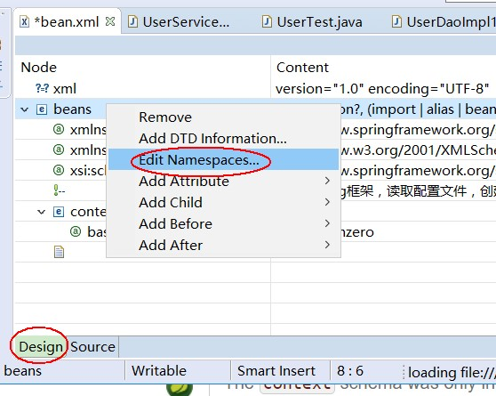
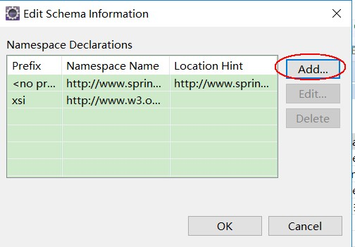
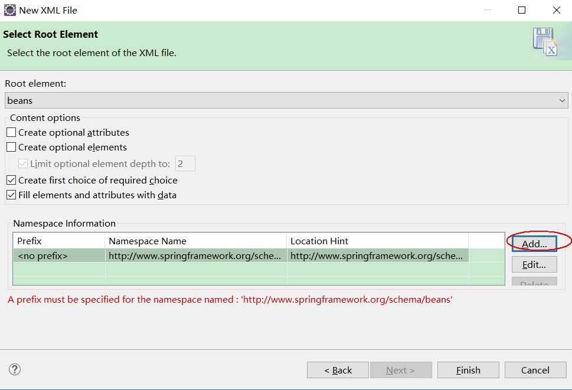
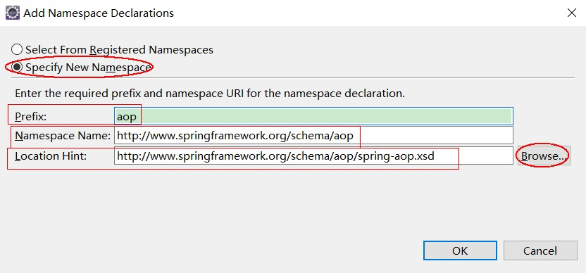

# Spring 其他相关资料

Spring 开发相关资料整理

## 1. eclipse 关于 Spring 相关配置

### 1.1. Spring 配置文件中提示配置信息

> 本小节是针对旧版本 eclipse 对于 spring xml 配置文件无提示的问题。配置跟 hibernate 和 struts2 创建 xml 约束一样的操作

打开【Preferences】 -> 【XML Catalog】 -> 【Add...】

- Location：选择【spring-beans-4.2.xsd】文件所在路径
- Key type：选择Schema location
- Key：填写【http://www.springframework.org/schema/beans/spring-beans.xsd】

> **注：约束文件的路径在【\spring-framework-4.2.4.RELEASE\schema\beans】，如果使用其他类型，就根据类型选择不同的文件夹**

### 1.2. 向 xml 文件中增加约束

1. 切换到Design视图，右键点击 Beans 标签 【Edit Namespaces】

2. 点击 add 新增约束

3. 选择 XML catalog，选自己创建的 xsd 模版
    - Prefix: 填写命名空间
    - Namespacee Name: 将后面文件名字删除

### 1.3. 创建 xml 文件时引入多个约束

1. 先选择导入一个基础的约束
2. 再点击 add 新增一个约束（之后操作与生成文件增加约束操作一样，命名也一致）

