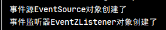

# Spring 基于 IOC 注解汇总

> 注：注解的源码注释参考项目 https://github.com/MooNkirA/spring-note/tree/master/Spring-Framework

## 1. Spring注解驱动开发入门

### 1.1. 简介

Spring在2.5版本引入了注解配置的支持，同时从Spring 3.x版本开始，Spring JavaConfig项目提供的许多特性成为核心Spring框架的一部分。因此，可以使用Java而不是XML文件来定义应用程序类外部的bean。在Spring的官方文档里提供了四个基本注解`@Configuration`，`@Bean`，`@Import`，`@DependsOn`用于驱动开发

### 1.2. 注解驱动入门案例

#### 1.2.1. 案例需求

1. 需求：实现保存一条数据到数据库。
2. 示例使用的表结构：

```sql
create table account(
    id int primary key auto_increment,
    name varchar(50),
    money double(7,2)
);
```

3. 要求：使用spring框架中的JdbcTemplate和DriverManagerDataSource，使用纯注解配置spring的ioc

#### 1.2.2. 代码实现

##### 1.2.2.1. 导入依赖

创建示例项目，pom.xml文件引入相关依赖

```xml
<dependencies>
    <!-- spring核心依赖 -->
    <dependency>
        <groupId>org.springframework</groupId>
        <artifactId>spring-context</artifactId>
        <version>5.1.6.RELEASE</version>
    </dependency>
    <dependency>
        <groupId>org.springframework</groupId>
        <artifactId>spring-jdbc</artifactId>
        <version>5.1.6.RELEASE</version>
    </dependency>
    <!-- mysql驱动 -->
    <dependency>
        <groupId>mysql</groupId>
        <artifactId>mysql-connector-java</artifactId>
        <version>5.1.45</version>
    </dependency>
</dependencies>
```

##### 1.2.2.2. 编写配置类

创建spring的配置类，用于代替xml配置文件

```java
package com.moon.springsample.config;

import org.springframework.context.annotation.Configuration;
import org.springframework.context.annotation.Import;
import org.springframework.context.annotation.PropertySource;

/**
 * spring项目的配置类，用于代替传统的xml配置文件
 */
@Configuration /* 标识当前类为配置类 */
@Import(JdbcConfig.class) /* @Import注解是写在类上的，通常是和注解驱动的配置类一起使用的。其作用是引入其他的配置类 */
@PropertySource("classpath:jdbc.properties") /* 用于指定读取资源文件的位置。不仅支持properties，也支持xml文件 */
public class SpringConfiguration {
}
```

```java
package com.moon.springsample.config;

import org.springframework.beans.factory.annotation.Value;
import org.springframework.context.annotation.Bean;
import org.springframework.jdbc.core.JdbcTemplate;
import org.springframework.jdbc.datasource.DriverManagerDataSource;

import javax.sql.DataSource;

/**
 * 连接数据库的配置类
 */
public class JdbcConfig {
    // @Value注解用于注入基本类型和String类型的数据。它支持spring的EL表达式，可以通过${}的方式获取配置文件中的数据
    @Value("${jdbc.driver}")
    private String driver;
    @Value("${jdbc.url}")
    private String url;
    @Value("${jdbc.username}")
    private String username;
    @Value("${jdbc.password}")
    private String password;

    /* 创建JdbcTemplate对象 */
    @Bean("jdbcTemplate") // @Bean注解用于方法上，表示把当前方法的返回值存入spring的ioc容器
    public JdbcTemplate createJdbcTemplate(DataSource dataSource) {
        return new JdbcTemplate(dataSource);
    }

    /* 创建DataSource对象 */
    @Bean("dataSource")
    public DataSource createDataSource() {
        DriverManagerDataSource dataSource = new DriverManagerDataSource();
        dataSource.setDriverClassName(driver);
        dataSource.setUrl(url);
        dataSource.setUsername(username);
        dataSource.setPassword(password);
        return dataSource;
    }
}
```

##### 1.2.2.3. 编写配置文件

在resources目录下，创建数据库连接参数的配置文件jdbc.properties

```properties
jdbc.driver=com.mysql.jdbc.Driver
jdbc.url=jdbc:mysql://localhost:3306/tempdb?characterEncoding=utf-8
jdbc.username=root
jdbc.password=123456
```

##### 1.2.2.4. 测试

```java
/* 测试spring全注解开发示例 */
public static void main(String[] args) {
    // 1. 获取基于注解的spring容器
    ApplicationContext context = new AnnotationConfigApplicationContext("com.moon.springsample");
    // 2. 测试根据id获取spring容器中的对象
    JdbcTemplate jdbcTemplate = context.getBean("jdbcTemplate", JdbcTemplate.class);
    // 3. 进行数据库操作
    jdbcTemplate.update("insert into account(name,money) values (?,?)","Moon", 1888);
}
```

## 2. IOC常用注解 - 用于注解驱动

### 2.1. @Configuration

#### 2.1.1. 作用

它是在spring3.0版本之后加入的。此注解是Spring支持注解驱动开发的一个标志。表示当前类是Spring的一个配置类，作用是替代传统主Spring的`applicationContext.xml`配置文件。

从它的源码可以看出，其本质就是`@Component`注解，被此注解修饰的类，也会被存入spring的ioc容器。

#### 2.1.2. 相关属性

|  属性名  |              作用               | 取值 |
| ------- | ------------------------------- | --- |
| `value` | 用于存入spring的Ioc容器中Bean的id |     |

#### 2.1.3. 使用场景

在注解驱动开发时，用于编写配置的类，通常可以使用此注解。一般情况下，配置也会分为主从配置，`@Configuration`一般出现在主配置类上。

例如，在上面快递入门案例中的`SpringConfiguration`类上。值得注意的是，构建ioc容器（`AnnotationConfigApplicationContext`）使用的是传入字节码的构造函数，此注解可以省略。

```java
ApplicationContext context = new AnnotationConfigApplicationContext(SpringConfiguration.class);

// @Configuration /* 标识当前类为配置类 */
@Import(JdbcConfig.class)
@PropertySource("classpath:jdbc.properties")
public class SpringConfiguration {
}
```

但是如果使用基础包扫描的构造函数创建`AnnotationConfigApplicationContext`，则配置类中的`@Configuration `注解则不能省略。

```java
ApplicationContext context = new AnnotationConfigApplicationContext("com.moon.springsample");

@Configuration /* 标识当前类为配置类 */
@Import(JdbcConfig.class) /* @Import注解是写在类上的，通常是和注解驱动的配置类一起使用的。其作用是引入其他的配置类 */
@PropertySource("classpath:jdbc.properties") /* 用于指定读取资源文件的位置。不仅支持properties，也支持xml文件 */
public class SpringConfiguration {
}
```

#### 2.1.4. 示例

- 创建配置类

```java
package com.moon.springsample.config;

import org.springframework.context.annotation.ComponentScan;
import org.springframework.context.annotation.Configuration;

/**
 * spring项目的配置类，用于代替传统的xml配置文件
 * <p>没有applicationContext.xml，就没法在xml中配置spring创建容器要扫描的包了。</p>
 * <p>那么可以创建一些类，通过注解配置到ioc容器中也无法实现了。此时就可以使用此注解来代替spring的配置文件。</p>
 */
@Configuration("springConfiguration") /* 标识当前类为配置类 */
@ComponentScan("com.moon.springsample") /* 配置开启包扫描 */
// @Import(Xxxxx.class) /* 通过@Import注解导入其他的配置类 */
// @PropertySource("classpath:xxxx.properties") /* 通过@PropertySource注解导入配置文件，如.properties、.xml等 */
public class SpringConfiguration {
}
```

- 测试

```java
package com.moon.springannotation.test;

import com.moon.springsample.config.SpringConfiguration;
import org.springframework.context.ApplicationContext;
import org.springframework.context.annotation.AnnotationConfigApplicationContext;

/**
 * `@Configuration` 注解使用测试
 *
 * @author MooNkirA
 * @version 1.0
 * @date 2020-7-31 23:40
 * @description
 */
public class ConfigurationTest {
    /* Configuratio注解使用测试 */
    public static void main(String[] args) {
        // 方式一：1. 获取基于注解的spring容器，使用基础包basePackages的构造函数创建=容器，此时SpringConfiguration类上必须加上@Configuration注解
        // ApplicationContext context = new AnnotationConfigApplicationContext("com.moon.springsample");
        // 方式二：1. 获取基于注解的spring容器，使用传入字节码的构造函数创建容器，此时SpringConfiguration类上可以不加@Configuration注解
        ApplicationContext context = new AnnotationConfigApplicationContext(SpringConfiguration.class);
        // 2. 根据id或者类型去获取对应的bean实例
        SpringConfiguration springConfiguration = (SpringConfiguration) context.getBean("springConfiguration");
        System.out.println(springConfiguration);
    }
}
```

### 2.2. @ComponentScan

#### 2.2.1. 作用与使用场景

用于指定创建容器时要扫描的包。该注解在指定扫描的位置时，可以指定包名，也可以指定扫描的类。同时支持定义扫描规则，例如包含哪些或者排除哪些。同时，它还支持自定义Bean的命名规则

在注解驱动开发时，编写的类都使用注解的方式进行配置，但想让加上相关spring注解(如：`@Controller`、`@Service`、`@Repository`、`@Component`)的类添加到spring的ioc容器中，就需要使用`@ComponentScan`注解来实现组件的扫描。

<font color=red>**注意：在spring4.3版本之后还加入了一个`@ComponentScans`的注解，该注解相当于支持配置多个`@ComponentScan`**</font>

#### 2.2.2. 相关属性

|        属性名         |                                                  作用                                                  |                                                                  取值                                                                  |
| :------------------: | ------------------------------------------------------------------------------------------------------ | ------------------------------------------------------------------------------------------------------------------------------------- |
|       `value`        | 用于指定要扫描的包。当指定了包的名称之后，spring会扫描指定的包及其子包下的所有类                               |                                                                                                                                       |
|    `basePackages`    | 与value作用一样                                                                                         |                                                                                                                                       |
| `basePackageClasses` | 指定具体要扫描的类的字节码，spring会扫描指定字节码的类所在的包及其子包下的所有类。                             |                                                                                                                                       |
|    `nameGenrator`    | 指定扫描bean对象存入容器时的命名规则。详情参考《Spring源码分析》的BeanNameGenerator及其实现类。               |                                                                                                                                       |
|   `scopeResolver`    | 用于处理并转换检测到的Bean的作用范围。                                                                    |                                                                                                                                       |
|    `soperdProxy`     | 用于指定bean生成时的代理方式。默认是Default，则不使用代理                                                   | 可选值有4个：`DEFAULT`，`NO`，`INTERFACES`，`TARGET_CLASS`。<br/>详情请可查看spring源码的ScopedProxyMode枚举。                             |
|  `resourcePattern`   | 用于指定符合组件检测条件的类文件，默认是包扫描下的`**/*.class`                                              |                                                                                                                                       |
| `useDefaultFilters`  | 是否对带有`@Component` `@Repository` `@Service` `@Controller`注解的类开启检测，默认是开启的。              |                                                                                                                                       |
|   `includeFilters`   | 自定义组件扫描的过滤规则，用于扫描组件。该注解的值是`Filter`注解数组，`Filter`的`type`属性是`FilterType`的枚举 | `ANNOTATION`：注解类型（默认）<br/>`ASSIGNABLE_TYPE`：指定固定类<br/>`ASPECTJ`：ASPECTJ类型<br/>`REGEX`：正则表达式<br/>`CUSTOM`：自定义类型 |
|   `excludeFilters`   | 自定义组件扫描的排除规则。注解值的类型与`includeFilters`一致                                               |                                                                                                                                       |
|      `lazyInit`      | 组件扫描时是否采用懒加载 ，默认不开启。                                                                    |                                                                                                                                       |

#### 2.2.3. 包扫描配置示例

##### 2.2.3.1. 不指定扫描包的使用

- 创建配置类

```java
@Configuration /* 标识当前类为配置类 */
@ComponentScan /* 配置开启包扫描，不写扫描的包路径，则默认扫描当前@ComponentScan注解的类所在的包及其下的所有子包 */
public class SpringConfiguration {
}
```

- 测试代码

```java
@Test
public void componentScanBaseTest() {
    // 1. 获取基于注解的spring容器，使用传入字节码的构造函数创建容器。（这里故意不使用传入基础包的构造函数，如果这里配置了扫描包包含了测试层的位置，则看不出效果）
    ApplicationContext context = new AnnotationConfigApplicationContext(SpringConfiguration.class);
    // 2. 根据id或者类型去获取对应的bean实例
    UserService userService = context.getBean("userService", UserService.class);
    // 3. 调用对象方法
    userService.saveUser();
}
```

测试结果，`@ComponentScan`不指定扫描包，只会扫描当前配置类所在的包及其下的所有子包


##### 2.2.3.2. value 与 basePackages 属性

- 创建简单模拟的业务层代码

```java
package com.moon.springsample.service;

public interface UserService {
    /* 模拟保存用户 */
    void saveUser();
}
```

```java
package com.moon.springsample.service.impl;

import com.moon.springsample.service.UserService;
import org.springframework.stereotype.Service;

@Service("userService") /* 配置当前类交给spring ioc容器管理，其中value为对象在容器中的名称 */
public class UserServiceImpl implements UserService {
    @Override
    public void saveUser() {
        System.out.println("成功保存用户");
    }
}
```

- 创建配置类，使用`@ComponentScan`注解

```java
package com.moon.springsample.config;

import org.springframework.context.annotation.ComponentScan;
import org.springframework.context.annotation.Configuration;

/**
 * spring项目的配置类
 */
@Configuration /* 标识当前类为配置类 */
// @ComponentScan("com.moon.springsample") /* 配置开启包扫描，配置value属性，如果没有配置，则可以省略不写value="xxxx" */
@ComponentScan(basePackages = {"com.moon.springsample"}) /* 配置开启包扫描，配置basePackages属性，效果与value一样，但不能与value属性同时存在 */
public class SpringConfiguration {
}
```

- 测试

```java
@Test
public void componentScanBasePackagesTest() {
    // 1. 获取基于注解的spring容器，使用传入字节码的构造函数创建容器。（这里故意不使用传入基础包的构造函数，如果这里配置了扫描包包含了测试层的位置，则看不出效果）
    ApplicationContext context = new AnnotationConfigApplicationContext(SpringConfiguration.class);
    // 2. 根据id或者类型去获取对应的bean实例
    UserService userService = context.getBean("userService", UserService.class);
    // 3. 调用对象方法
    userService.saveUser();
}
```

##### 2.2.3.3. basePackageClasses 属性

- 配置`basePackageClasses`属性，指定扫描类的字节码

```java
@Configuration /* 标识当前类为配置类 */
@ComponentScan(basePackageClasses = UserService.class) /* 配置开启包扫描，指定具体要扫描的类的字节码，spring会扫描指定字节码的类所在的包及其子包下的所有类。 */
public class SpringConfiguration {
}
```

- 测试

```java
@Test
public void componentScanBasePackageClassesTest() {
    // 1. 获取基于注解的spring容器，使用基础包的构造函数，只扫描配置类所在的包。
    ApplicationContext context = new AnnotationConfigApplicationContext("com.moon.springsample.config");
    // 2. 根据id或者类型去获取对应的bean实例
    UserService userService = context.getBean("userService", UserService.class);
    // 3. 调用对象方法
    userService.saveUser();
    // 使用basePackageClasses方法扫描，测试指定字节码类所在的包及其子包所有的类是否被扫描到
    AccountService accoutService = context.getBean("accountService", AccountService.class);
    accoutService.deleteAccount();
}
```

测试结果：扫描到UserService所在的包及其子包


#### 2.2.4. 自定义BeanNameGenerator生成规则

##### 2.2.4.1. nameGenrator属性

通过查看`@ComponentScan`注解的源码，有`nameGenrator`属性，用来定义bean在spring容器中的名称。属性的值是一个`BeanNameGenerator`接口，spring有默认实现的生成名称，其实现类为`AnnotationBeanNameGenerator`。

其中`AnnotationBeanNameGenerator`实现的逻辑主要通过类上的注解元数据，在获取注解中的value值，如果value有值，则以value的值为baen的名称。如果value没有值，则将获取类名，将首字母转成小写，用作bean的名称

> 注：在《Spring源码分析》中有`BeanNameGenerator`的详细介绍

##### 2.2.4.2. 自定义beanName生成规则示例

- 创建自定义beanName生成规则类`com.moon.springsample.custom.CustomBeanNameGenerator`，实现`BeanNameGenerator`接口。里面的逻辑可以参考源码

```java
package com.moon.springsample.custom;

import org.springframework.beans.factory.annotation.AnnotatedBeanDefinition;
import org.springframework.beans.factory.config.BeanDefinition;
import org.springframework.beans.factory.support.BeanDefinitionRegistry;
import org.springframework.beans.factory.support.BeanNameGenerator;
import org.springframework.context.annotation.AnnotationConfigUtils;
import org.springframework.core.annotation.AnnotationAttributes;
import org.springframework.core.type.AnnotationMetadata;
import org.springframework.lang.Nullable;
import org.springframework.util.Assert;
import org.springframework.util.ClassUtils;
import org.springframework.util.StringUtils;

import java.beans.Introspector;
import java.util.Map;
import java.util.Set;

/**
 * 自定义BeanName生成规则实现类，需实现spring框架的BeanNameGenerator接口
 */
public class CustomBeanNameGenerator implements BeanNameGenerator {

    /* Component注解的全类名 */
    private static final String COMPONENT_ANNOTATION_CLASSNAME = "org.springframework.stereotype.Component";

    /* 自定义beanName前缀 */
    private static final String NAME_PREFIX = "MooN_";

    @Override
    public String generateBeanName(BeanDefinition definition, BeanDefinitionRegistry registry) {
        // 0. 定义返回的beanName
        String beanName = null;

        // 1. 判断当前BeanDefinition对象是否为注解
        if (definition instanceof AnnotatedBeanDefinition) {
            // 2. 将BeanDefinition对象强转成注解的BeanDefinition对象
            AnnotatedBeanDefinition abd = (AnnotatedBeanDefinition) definition;
            // 3. 通过BeanDefinition对象获取注解的元信息（AnnotationMetadata）
            AnnotationMetadata amd = abd.getMetadata();
            // 4. 获取元信息中所有注解的Set集合
            Set<String> annotationTypes = amd.getAnnotationTypes();
            // 5. 遍历AnnotationType的集合
            for (String type : annotationTypes) {
                // 6. 获取注解的属性，（AnnotationAttributes是继承LinkedHashMap）
                AnnotationAttributes attributes = AnnotationAttributes
                        .fromMap(amd.getAnnotationAttributes(type, false));
                // 7. 判断注解属性attributes的是否为空，并且必须是@Component注解或者其衍生注解
                if (attributes != null && isStereotypeWithNameValue(type, amd.getMetaAnnotationTypes(type), attributes)) {
                    // 8. 获取注解中value属性的值
                    Object value = attributes.get("value");
                    if (value instanceof String) {
                        // 9. 如果是字符串类型，强转
                        String strVal = (String) value;
                        // 10. 判断value值是否为空
                        if (StringUtils.hasLength(strVal)) {
                            // 11. 如果beanName为空，并且与注解中的value值不相同，抛出异常
                            if (beanName != null && !strVal.equals(beanName)) {
                                throw new IllegalStateException("Stereotype annotations suggest inconsistent " +
                                        "component names: '" + beanName + "' versus '" + strVal + "'");
                            }
                            // 因为是直接参考spring的实现，为了看到自定义beanName生成规则的效果，这里加上前缀，以作区分
                            beanName = NAME_PREFIX + strVal;
                        }
                    }
                }
            }
        }
        // 这里生成默认的名称也加上前缀，以作区分
        return beanName == null ? NAME_PREFIX + buildDefaultBeanName(definition) : beanName;
    }

    /**
     * 用于判断注解是否为@Component注解或者其衍生注解
     */
    private boolean isStereotypeWithNameValue(String annotationType, Set<String> metaAnnotationTypes,
                                              @Nullable Map<String, Object> attributes) {

        boolean isStereotype = annotationType.equals(COMPONENT_ANNOTATION_CLASSNAME) ||
                metaAnnotationTypes.contains(COMPONENT_ANNOTATION_CLASSNAME) ||
                annotationType.equals("javax.annotation.ManagedBean") ||
                annotationType.equals("javax.inject.Named");

        return (isStereotype && attributes != null && attributes.containsKey("value"));
    }

    /**
     * 创建一个默认的beanName(spring的原方法)
     */
    private String buildDefaultBeanName(BeanDefinition definition) {
        String beanClassName = definition.getBeanClassName();
        Assert.state(beanClassName != null, "No bean class name set");
        String shortClassName = ClassUtils.getShortName(beanClassName);
        return Introspector.decapitalize(shortClassName);
    }
}
```

- 在配置类中的`@ComponentScan`注解，加入`nameGenrator`属性，值为自定义的规则实现类`CustomBeanNameGenerator`

```java
@Configuration
/* 配置bean对象存入容器时自定义的命名规则 */
@ComponentScan(basePackages = {"com.moon.springsample"}, nameGenerator = CustomBeanNameGenerator.class)
public class SpringConfiguration {
}
```

- 测试代码与结果

```java
 @Test
public void componentScanNameGeneratorTest() {
    // 1. 获取基于注解的spring容器，使用基础包的构造函数，只扫描配置类所在的包。
    ApplicationContext context = new AnnotationConfigApplicationContext("com.moon.springsample.config");
    // 2. 根据id去获取对应的bean实例，因为是自定义baeanName命名规则，所以需要使用自定义的beanName才能获取到相应的spring容器的对象
    UserService userService = context.getBean("MooN_userService", UserService.class);
    // 3. 调用对象方法
    userService.saveUser();
    // 使用spring架构默认的命名规则的名称去获取容器中的实例，报错！
    AccountService accoutService = context.getBean("accountService", AccountService.class);
    accoutService.deleteAccount();
}
```


#### 2.2.5. resourcePattern 属性配置扫描规则

`resourcePattern` 属性的默认值是包扫描下的` **/*.class`。可以通过该属性修改包扫描的规则

```java
@Configuration
@ComponentScan(basePackages = {"com.moon.springsample"}, resourcePattern = "*/*.class")
public class SpringConfiguration {
}
```

```java
/* 测试resourcePattern属性 */
@Test
public void componentScanNameResourcePatternTest() {
    // 1. 获取基于注解的spring容器，使用基础包的构造函数，只扫描配置类所在的包。
    ApplicationContext context = new AnnotationConfigApplicationContext("com.moon.springsample.config");
    // 2. 因为是配置了resourcePattern属性为"*/*.class"，所以扫描"com.moon.springsample"下任意包的任意class文件，所以扫描不到service包下的impl包中的注解
    UserService userService = context.getBean("userService", UserService.class);
    // 3. 因为没有扫描到实现类的注解，所有无法加入到spring容器中，对象为null，调用对象方法时报错
    userService.saveUser();
}
```


#### 2.2.6. 自定义组件扫描过滤规则

##### 2.2.6.1. 基础使用

- `includeFilters`：指定包含的过滤规则，不会影响spring扫描其他规则
- `excludeFilters`：指定排除的过滤规则，指定后该扫描规则会被过滤，不会被扫描加入spring容器

```java
/* includeFilters用于指定自定义组件扫描的过滤规则，表示包含某些规则，不会排除其他的规则 */
// @ComponentScan(basePackages = {"com.moon.springsample"}, includeFilters = @ComponentScan.Filter(value = Service.class))
/* excludeFilters用于指定组件扫描的排除规则，排除后不会加入到spring容器 */
@ComponentScan(basePackages = {"com.moon.springsample"}, excludeFilters = @ComponentScan.Filter(value = Service.class))
public class SpringConfiguration {
}
```

测试

```java
/* 测试includeFilters、excludeFilters属性 */
@Test
public void componentScanFiltersTest() {
    // 1. 获取基于注解的spring容器，使用基础包的构造函数，只扫描配置类所在的包。
    ApplicationContext context = new AnnotationConfigApplicationContext("com.moon.springsample.config");
    /*
     *  配置includeFilters属性为@ComponentScan.Filter(value = Service.class)，
     *      代表过滤规则包含@Service注解，不会影响其他注解的扫描，如LogUtil类上的@Component注解
     *  配置excludeFilters属性为@ComponentScan.Filter(value = Service.class)，
     *      代表过滤规则会排除@Service注解，有该注解的类不会被扫描也不会加入到spring容器，如UserService类上的@Service注解
     */
    UserService userService = context.getBean("userService", UserService.class);
    LogUtil logUtil = context.getBean("logUtil", LogUtil.class);
    // 3. 如果配置excludeFilters排除@Service注解后，执行程序会报[No bean named 'userService' available]的错误
    userService.saveUser();
    logUtil.printLog();
}
```


##### 2.2.6.2. FilterType枚举

```java
public enum FilterType {
	/**
	 * 过滤标记指定注解类型的对象 (默认)
	 */
	ANNOTATION,

	/**
	 * 过滤指定固定类
	 */
	ASSIGNABLE_TYPE,

	/**
	 * 过滤 ASPECTJ 类型
	 */
	ASPECTJ,

	/**
	 * 过滤正则表达式匹配的类
	 */
	REGEX,

	/**
	 * 过滤自定义类型
	 */
	CUSTOM
}
```

##### 2.2.6.3. TypeFilter接口

TypeFilter接口，自定义过滤器必须实现的基础接口

```java
/* Spring 过滤器必须实现的基础接口 */
@FunctionalInterface
public interface TypeFilter {
	/**
	 * Determine whether this filter matches for the class described by
	 * the given metadata.
	 * @param metadataReader the metadata reader for the target class
	 * @param metadataReaderFactory a factory for obtaining metadata readers
	 * for other classes (such as superclasses and interfaces)
	 * @return whether this filter matches
	 * @throws IOException in case of I/O failure when reading metadata
	 *
	 * 此方法是用于判断过滤器是否与目标类匹配，返回值是boolean类型。
	 * 		true: 表示该类加入到spring的容器中
	 * 		false: 表示该类不加入容器
	 * 	@param metadataReader 元数据读取器，读取到的当前正在扫描的类的信息
	 * 	@param metadataReaderFactory 元数据读取器的工厂，可以获得到其他任何类的信息
	 */
	boolean match(MetadataReader metadataReader, MetadataReaderFactory metadataReaderFactory)
			throws IOException;
}
```

##### 2.2.6.4. Spring提供的过滤规则 - AnnotationTypeFilter

spring框架本身就提供了一些过滤规则的实现，比如`AnnotationTypeFilter`，用于筛选指定的标识了指定类型注解的类

当在项目开发中，spring提供的容器分为`RootApplicationContext`和`ServletApplicationContext`。此时如果不希望`RootApplicationContext`容器创建时把Controller层的类加入到容器中，就可以使用过滤规则排除`@Controller`注解配置的Bean对象。

```java
@Configuration
@ComponentScan(value = {"com.moon.springsample"},
        excludeFilters = @ComponentScan.Filter(type = FilterType.ANNOTATION, classes = {Controller.class}))
public class SpringConfiguration {
}
```

##### 2.2.6.5. 自定义过滤器案例模拟场景分析

在实际开发中，有很多下面这种业务场景：一个业务需求根据环境的不同，可能要加载不同的实现。比如以下案例：

> - 在店欢活动中，会员用户下单优惠50元，平台提成15%；普通用户下单优惠10元，平台提成8%
> - 平时正常的营业，会员用户下单优惠10元，平台提成9%；普通用户下单优惠0元，平台提成2%；

此时应该考虑采用桥接设计模式，把将涉及到场景差异的模块功能单独抽取到代表场景功能的接口中。针对不同场景进行实现。并且在扫描组件注册到容器中时，采用哪个场景的具体实现，应该采用配置文件配置起来。而自定义TypeFilter就可以实现注册指定场景的组件到spring容器中。

##### 2.2.6.6. 相关代码准备

- **定义场景的注解**

```java
package com.moon.springsample.annotations;

import java.lang.annotation.ElementType;
import java.lang.annotation.Retention;
import java.lang.annotation.RetentionPolicy;
import java.lang.annotation.Target;

/**
 * 用于标识不同场景的注解
 */
@Retention(RetentionPolicy.RUNTIME)
@Target(ElementType.TYPE)
public @interface Scene {
    /**
     * 用于指定场景的名称
     */
    String value() default "";
}
```

- **定义功能的接口，即案例中的下单优惠、平台提成功能**

```java
/**
 * 用户下单业务接口
 */
public interface OrderService {
    /**
     * 计算下单优惠的金额
     * @param userType 用户的类型
     */
    void calcOrderDiscount(String userType);
}

/**
 * 运营平台的业务接口
 */
public interface PlatformService {
    /**
     * 计算运营平台提成的数量
     * @param userType 用户的类型
     */
    void calcSalePercentage(String userType);
}
```

- **分不同场景，编写不同实现类**

```java
/**
 * 周年欢活动场景，订单业务实现类
 */
@Service("orderService")
@Scene("anniversary") // 使用自定义注解，标识当前是哪种场景的实现
public class AnniversaryOrderImpl implements OrderService {
    @Override
    public void calcOrderDiscount(String userType) {
        // 判断用户类型
        if ("member".equalsIgnoreCase(userType)) {
            System.out.println("周年庆活动，会员用户下单优惠50元");
        } else if ("normal".equalsIgnoreCase(userType)) {
            System.out.println("周年庆活动，普通用户下单优惠10元");
        }
    }
}

/**
 * 周年欢场景 运营平台业务实现类
 */
@Service("platformService")
@Scene("anniversary") // 使用自定义注解，标识当前是哪种场景的实现
public class AnniversaryPlatformImpl implements PlatformService {

    @Override
    public void calcSalePercentage(String userType) {
        if ("member".equalsIgnoreCase(userType)) {
            System.out.println("周年庆活动，会员用户下单平台提成15%");
        } else if ("normal".equalsIgnoreCase(userType)) {
            System.out.println("周年庆活动，普通用户下单平台提成8%");
        }
    }
}

/**
 * 正常营业场景，订单业务实现类
 */
@Service("orderService")
@Scene("normal") // 使用自定义注解，标识当前是哪种场景的实现
public class NormalOrderImpl implements OrderService {
    @Override
    public void calcOrderDiscount(String userType) {
        if ("member".equalsIgnoreCase(userType)) {
            System.out.println("正常营业，会员用户下单优惠10元");
        } else if ("normal".equalsIgnoreCase(userType)) {
            System.out.println("正常营业，普通用户下单无优惠");
        }
    }
}

/**
 * 正常营业场景，运营平台业务实现类
 */
@Service("platformService")
@Scene("normal") // 使用自定义注解，标识当前是哪种场景的实现
public class NormalPlatformImpl implements PlatformService {
    @Override
    public void calcSalePercentage(String userType) {
        if ("member".equalsIgnoreCase(userType)) {
            System.out.println("正常营业，会员用户下单平台提成9%");
        } else if ("normal".equalsIgnoreCase(userType)) {
            System.out.println("正常营业，普通用户下单平台提成2%");
        }
    }
}
```

##### 2.2.6.7. 不使用过滤器测试

- **编写项目的配置类**

```java
@Configuration
@ComponentScan(value = {"com.moon.springsample"})
public class SpringConfiguration {
}
```

- **如果不配置使用自定义过滤器扫描，区分加载不同场景的实现。此时会出现实现类名称相同的错误**

```java
@Test
public void noTypeFiltertest() {
    // 1. 传入项目配置类字节码方式，创建基于注解的spring容器
    ApplicationContext context = new AnnotationConfigApplicationContext(SpringConfiguration.class);
    // 2. 根据bean名称，从容器中获取订单与平台业务实现类，并调用方法
    OrderService orderService = context.getBean("orderService", OrderService.class);
    orderService.calcOrderDiscount("member");

    PlatformService platformService = context.getBean("platformService", PlatformService.class);
    platformService.calcSalePercentage("normal");
}
```


##### 2.2.6.8. 使用自定义过滤器实现不同场景不同实现（重点）

- **编写自定义扫描过滤规则**。可以通过实现顶级接口`TypeFilter`，但也可以选择继承其他的抽象类（如`AbstractTypeHierarchyTraversingFilter`），因为抽象类已经实现部分逻辑，这样减少一些代码的编写

```java
package com.moon.springsample.typefilter;

import com.moon.springsample.annotations.Scene;
import org.springframework.core.io.support.PropertiesLoaderUtils;
import org.springframework.core.type.filter.AbstractTypeHierarchyTraversingFilter;
import org.springframework.util.AntPathMatcher;
import org.springframework.util.ClassUtils;
import org.springframework.util.PathMatcher;

import java.util.Properties;

/**
 * spring的自定义扫描规则 - 实现不同场景下不同实现
 */
public class SceneTypeFilter extends AbstractTypeHierarchyTraversingFilter {

    // 定义路径校验类对象（Spring框架提供的工具类）
    private PathMatcher pathMatcher;

    /*
     *  定义场景名称，此值应该是通过配置去修改，不能使用硬编码方式
     *      需要注意：这里使用 @Value 注解的方式是获取不到配置值，
     *      因为Spring的生命周期里，负责填充属性值的 InstantiationAwareBeanPostProcessor 与 TypeFilter 的实例化过程两者没有任何关系
     */
    // @Value("${common.scene.name}")
    private String sceneName;

    /**
     * 定义构造函数，因为父类没有无参构造函数，所以必须要定义构造函数并调用父类的构造器
     */
    public SceneTypeFilter() {
        /*
         * 调用父类构造函数
         *  第1个参数considerInherited: 不考虑基类
         *  第2个参数considerInterfaces: 不考虑接口上的信息
         */
        super(false, false);
        // 借助Spring默认的Resource通配符路径方式
        this.pathMatcher = new AntPathMatcher();
        // 此处使用硬编码读取配置信息（实现应用时再想使用其他方式实现）
        try {
            // 使用spring工具类PropertiesLoaderUtils，读取根目录下的配置文件
            Properties properties = PropertiesLoaderUtils.loadAllProperties("scene.properties");
            // 读取配置文件中的场景名称
            this.sceneName = properties.getProperty("common.scene.name");
        } catch (Exception e) {
            e.printStackTrace();
        }
    }

    /**
     * 重写父类方法，注意此方法的作用是，将指定的类将注册为Exclude（排除过滤）, 返回
     *
     * @param className 校验的类的名称
     * @return true 代表排除此类，不加入到 spring 容器中；false 代表不排除
     */
    @Override
    protected boolean matchClassName(String className) {
        try {
            /*
             * 判断当前传入的类的名称（className）是否在指定的包路径上的类（即只处理本案例中相关的不场景的业务类）
             */
            if (!isPotentialPackageClass(className)) {
                // 类路径不符合本过滤器定义的扫描路径规则，即表示此类不需要排除，直接返回false
                return false;
            }
            /* 以上逻辑是：判断当前类上标识的自定义场景注解是否与配置文件中的场景名称一致，如不一致，则排除，不能注册到spring容器中 */
            // 根据类名称获取字节码对象
            Class<?> clazz = ClassUtils.forName(className, SceneTypeFilter.class.getClassLoader());
            // 通过反射获取当前类上的 @Scene 注解对象
            Scene scene = clazz.getAnnotation(Scene.class);
            // 判断此类上是否有 @Scene 注解
            if (scene == null) {
                // 无标识此注解，不需要排除
                return false;
            }
            // 获取标识 @Scene 注解中的value值
            String sceneValue = scene.value();
            // 校验，如果此类上标识的value属性值与配置文件中场景名称一致，则注册到spring ioc 容器中（即返回false）。排除则返回true
            return !this.sceneName.equalsIgnoreCase(sceneValue);
        } catch (Exception e) {
            e.printStackTrace();
            throw new RuntimeException(e);
        }
    }

    /*
     * 定义潜在的满足条件的类的名称（本类逻辑能处理的类）, 指定在哪个 package下
     *  这里为了实现可以支持通配符方式的，借用spring框架中 ClassUtils 工具类
     */
    private static final String PATTERN_STANDARD =
            ClassUtils.convertClassNameToResourcePath("com.moon.springsample.service.impl.*.*");

    /**
     * 判断当前传入的类名称，是否在本类（本过滤规则）逻辑中可以处理的类
     *
     * @param className 待判断类的名称
     * @return true: 表示可以处理
     */
    private boolean isPotentialPackageClass(String className) {
        // 1. 将类名转换为资源路径, 以进行匹配测试
        String resourcePath = ClassUtils.convertClassNameToResourcePath(className);
        // 2. 使用工具类对资源的路径进行匹配校验
        return pathMatcher.match(PATTERN_STANDARD, resourcePath);
    }
}
```

- **编写properties配置文件，指定场景**

```properties
# resources\scene.properties
# 配置当前使用的场景
common.scene.name=anniversary
```

- **修改配置类，增加排除规则**

```java
package com.moon.springsample.config;

import com.moon.springsample.typefilter.SceneTypeFilter;
import org.springframework.context.annotation.ComponentScan;
import org.springframework.context.annotation.Configuration;
import org.springframework.context.annotation.FilterType;

/**
 * spring项目的配置类
 */
@Configuration
// 添加排除属性excludeFilters，选择自定义规则（FilterType.CUSTOM），指定自定义过滤器的class
@ComponentScan(value = {"com.moon.springsample"},
        excludeFilters = @ComponentScan.Filter(type = FilterType.CUSTOM, classes = SceneTypeFilter.class))
public class SpringConfiguration {
}
```

- 再次运行上面的测试方法，结果成功只执行配置文件中的场景实现


### 2.3. @Bean

#### 2.3.1. 作用与使用场景

- `@Bean`注解可以写在方法上，表示把当前方法的返回值存入Spring的ioc容器。
- `@Bean`注解同时还可以出现在注解上，作为元注解来使用。

使用场景：

通常情况下，在基于注解的配置中，用于把一个类对象实例存入spring的ioc容器中，首先考虑的是使用`@Component`以及它的衍生注解。但是如果遇到要存入容器的Bean对象不是自己编写的类，而是第三方的工具类，此时无法在该类上添加`@Component`注解，这时就需要使用`@Bean`注解来实现将对象存入ioc容器

例如：在配置`JdbcTemplate`使用Spring内置数据源`DriverManagerDataSource`时，数据源类是spring-jdbc这个jar包中类，此时无法编辑在该类上面加注解，此时就可以使用`@Bean`注解配置

#### 2.3.2. 相关属性

|        属性名        |                                                                作用                                                                 |    取值    |
| :-----------------: | ----------------------------------------------------------------------------------------------------------------------------------- | ---------- |
|       `name`        | 用于指定存入spring容器中bean的标识。支持指定多个标识。当不指定该属性时，默认值是当前方法的名称。                                             |            |
|       `value`       | 此属性是在4.3.3版本之后加入的。它和name属性的作用是一样的。当前`@Bean`注解没有设置其他属性值时，value可以省略                                |            |
|     `autowire`      | 5.1版本后该属性已过期，使用`autowireCandidate`属性代替                                                                                 |            |
| `autowireCandidate` | 用于指定是否支持自动按类型注入到其他bean中。只影响`@Autowired`注解的使用。不影响`@Resource`注解注入。默认值为true，意为允许使用自动按类型注入。 | true/false |
|    `initMethod`     | 用于指定初始化方法。*注：一般比较少，建议使用编程式试直接在创建对象的同时做初始化的工作*                                                     |            |
|   `destroyMethod`   | 用于指定销毁方法。*注意：该方法不能有入参*                                                                                              |            |


#### 2.3.3. @Bean 注解的使用细节

1. 如果`@Bean`注解不指定name/value属性，则存入ioc容器时，标识了该注解下的方法的名称作为bean的名称标识，存入到ioc容器
2. 如果`@Bean`注解不指定name/value属性，并出现了方法重载，则以最后定义的方法的返回对象，注入到spring ioc容器中


3. `@Bean`注解可以定义在注解类上，做为元注解使用。该注解可以实现与`@Bean`一样的功能

```java
/**
 * 使用@Bean注解作为元注解，自定义注解实现@Bean注解相同的功能
 */
@Target({ElementType.METHOD})
@Retention(RetentionPolicy.RUNTIME)
@Bean
public @interface MyBean {
}

// 使用@Bean做为元注解，自定义@MyBean注解，实现功能与@Bean一致
@MyBean
public JdbcTemplate createJdbcTemplate(@Autowired DataSource dataSource) {
    System.out.println("执行了有参的createJdbcTemplate()方法");
    return new JdbcTemplate(dataSource);
}
```

#### 2.3.4. 使用示例

- 定义Spring项目的配置类

```java
@Configuration
public class SpringConfiguration {

    /* @Bean注解的autowireCandidate属性，不会影响 @Resource 注解的注入*/
    @Resource(name = "dataSource")
    private DataSource dataSource;

    /**
     * 创建一个数据源对象，并使用 @Bean 注解存入 spring ioc 容器
     *
     * @return DataSource
     */
    // name属性用于指定存入spring容器中bean的标识。支持指定多个标识。当不指定该属性时，默认值是当前方法的名称。
    // @Bean(name = "dataSource")
    // valeu属性是4.3.3版本之后加入，与name属性作用一样，当前@Bean注解没有设置其他属性值时，value可以省略
    // @Bean(value = "dataSource")
    // autowireCandidate用于指定是否支持自动按类型注入到其他bean中。只影响`@Autowired`注解的使用。不影响`@Resource`注解注入。默认值为true
    @Bean(value = "dataSource", autowireCandidate = true)
    public DataSource createDataSource() {
        // 1. 创建对象
        DataSource dataSource = new DriverManagerDataSource();
        /*
         * 2. 对象初始化的工作
         *   注：这里虽然可以使用@Bean注解的initMethod属性来单独编写方法来实现此步骤
         *   但一般比较少用，建议使用编程式试直接在创建对象的同时做初始化的工作
         */
        // ....
        // 3. 返回对象到ioc容器
        return dataSource;
    }

    /* 使用@Autowired自动注入ioc容器对象 */
    // @Bean("jdbcTemplate")
    // 如果返回DataSource对象的方法的@Bean注解设置属性autowireCandidate = false，则通过@Autowired注解无法自动注入DataSource对象
    // public JdbcTemplate createJdbcTemplate(@Autowired DataSource dataSource) {
    // 但可以使用@Resource注解注入到成员变量的方式实现
    // 如果不指定name/value属性，则存入ioc容器时，以方法的名称作为bean的名称标识
    @Bean
    public JdbcTemplate createJdbcTemplate() {
        System.out.println("执行了无参的createJdbcTemplate()方法");
        return new JdbcTemplate(dataSource);
    }

    // 如果不指定name/value属性，并出现了方法重载，则以最后定义的方法的返回对象，注入到spring ioc容器中
    // 使用@Bean做为元注解，自定义@MyBean注解，实现功能与@Bean一致
    @MyBean
    public JdbcTemplate createJdbcTemplate(@Autowired DataSource dataSource) {
        System.out.println("执行了有参的createJdbcTemplate()方法");
        return new JdbcTemplate(dataSource);
    }
}
```

- 测试`@Bean`注解使用

```java
public class SpringBeanTest {

    /* @Bean注解基础使用测试 */
    @Test
    public void beanAnnotaionBasicTest() {
        // 1. 获取基于注解的spring容器，使用基础包basePackages的构造函数创建容器
        ApplicationContext context = new AnnotationConfigApplicationContext("com.moon.springsample");
        // 2. 获取@Bean注解存入的对象实例
        DataSource dataSource = context.getBean("dataSource", DataSource.class);
        // 输出结果
        System.out.println(dataSource);
    }

    /* @Bean注解的autowireCandidate属性使用测试 */
    @Test
    public void autowireCandidateTest() {
        // 1. 获取基于注解的spring容器，使用基础包basePackages的构造函数创建容器
        ApplicationContext context = new AnnotationConfigApplicationContext("com.moon.springsample");
        // 2. 获取@Bean注解存入的对象实例
        JdbcTemplate jdbcTemplate = context.getBean("createJdbcTemplate", JdbcTemplate.class);
        /*
         * 输出结果
         *   如果返回DataSource对象的方法的@Bean注解设置属性autowireCandidate = false，
         *   则通过@Autowired注解无法自动注入DataSource对象，程序运行会报ioc容器找不到DataSource对象 "No qualifying bean of type 'javax.sql.DataSource' available"
         *
         *   但可以使用@Resource注解注入到成员变量的方式来获取DataSource对象，autowireCandidate属性不会影响@Resource注解
         */
        System.out.println(jdbcTemplate);
    }
}
```

### 2.4. @Import

#### 2.4.1. 作用与使用场景

- **作用**：该注解是写在类上的，通常都是和注解驱动的配置类一起使用的。其作用是引入其他的配置类。使用了此注解之后，可以使注解驱动开发和早期xml配置一样，按不同的功能模块，分别配置不同的内容，使配置更加清晰。同时指定了此注解之后，被引入的类上可以不再使用`@Configuration`，`@Component`等注解的支撑，spring ioc也可以将引入类加载到ioc容器。
- **使用场景**：当在使用注解驱动开发时，由于配置项过多，如果都写在一个类里面，配置结构和内容将杂乱不堪，此时使用此注解可以把配置项进行分模块进行配置。

> 注：使用`@Bean`也可以实现引入其他类（第三方的类）一样的效果，但`@Import`可以自定义批量导入类；<font color=red>**通过`@Import`注解导入的类，在spring容器中注册的名称不是默认的“类名首字母小写”，而是“类的全限定名”**</font>

#### 2.4.2. 相关属性

| 属性名  | 作用                                                         | 取值               |
| :-----: | ------------------------------------------------------------ | ------------------ |
| `value` | 用于导入其他配置类，其值类型为类的字节码。它支持指定多个配置类。 | `Class<?>`对象数组 |

#### 2.4.3. 基础使用示例

在入门案例中，使用了`SpringConfiguration`做为主配置类，而连接数据库相关的配置被分配到了`JdbcConfig`配置类中，此时使用在`SpringConfiguration`类上使用`@Import`注解把`JdbcConfig`导入进来就可以了。

```java
@Configuration
/*
 * 使用@Import注解引入其他配置类，被引入的类上可以不再使用`@Configuration`，`@Component`等注解的支撑，spring ioc也可以将引入类加载到ioc容器中。
 *  注意：通过@Import注解引入的类，该类加载到spring ioc容器的唯一标识（beanName）与使用`@Configuration`，`@Component`等注解的默认标识的命名方式不一样
 *      使用`@Configuration`，`@Component`等注解加载ioc容器，如果不指定名称，则以类名称且首字母小写，作为容器中唯一标识与其对象实例进行映射
 *      而使用@Import注解引入的类，则以引入类的全限定名做为容器中唯一标识，并与其对象实例进行映射
 */
@Import({JdbcConfig.class})
public class SpringConfiguration {
}

/**
 * 将连接数据库的相关配置独立到一个配置类中
 */
/*
 * Spring框架会先扫描到标识有@Configuration,@Component等注解的类，加载到ioc容器后，该类中的@Bean注解才会再被扫描及实例化对象加载到容器中
 *  但抽取模块的配置独立到一个配置类中，就是为了达到分类管理目的，并且只想将关注点在配置内容上，
 *  所以一般不建议每个独立模块的配置类上加@Configuration,@Component等注解，并且也不想让项目扫描配置类时手动指定每个模块。故最好使用@Import注解导入到主配置类中
 */
// @Configuration
public class JdbcConfig {
    /* 创建DataSource对象 */
    @Bean("dataSource")
    public DataSource createDataSource() {
        DriverManagerDataSource dataSource = new DriverManagerDataSource();
        // 配置数据源相关参数 （注：此处为了暂时不涉及@PropertySource注解，所以直接将相关的配置值硬编码！）
        dataSource.setDriverClassName("com.mysql.jdbc.Driver");
        dataSource.setUrl("jdbc:mysql://localhost:3306/tempdb?characterEncoding=utf-8");
        dataSource.setUsername("root");
        dataSource.setPassword("123456");
        return dataSource;
    }
}
```

```java
@Test
public void importAnnotaionBasicTest() {
    /*
     * 1. 创建注解扫描的容器，这里只扫描项目总配置类SpringConfiguration，
     *   所以抽取出来的其他模块的配置类，就算标识@Configuration,@Component等注解，也不会被spring扫描加载
     *   此时就需要使用 @Import 注解，将其他模块的配置类引入到项目总配置类中
     */
    ApplicationContext context = new AnnotationConfigApplicationContext(SpringConfiguration.class);
    // 2. 测试使用 @Import 注解引入的配置类是否加载到ioc容器中，可以根据对象的类型去获取
    // JdbcConfig jdbcConfig = context.getBean(JdbcConfig.class);
    // 如果想通过ioc容器中bean的名称去获取，则要了解，通过@Import注解引入的类，其命名规则是以类的全限定名称来作为ioc容器中的唯一标识
    JdbcConfig jdbcConfig = context.getBean("com.moon.springsample.config.JdbcConfig", JdbcConfig.class);
    // 输出结果
    System.out.println(jdbcConfig);
    // 3. 获取@Bean注解存入的配置类中的对象实例
    DataSource dataSource = context.getBean("dataSource", DataSource.class);
    // 输出结果
    System.out.println(dataSource);
}
```

#### 2.4.4. （扩展）通过spring容器对象获取所有注册的bean的唯一标识

```java
/* 获取spring ioc容器中所有注册的bean的名称 */
@Test
public void getBeanDefinitionNamesTest() {
    // 创建注解扫描的容器
    ApplicationContext context = new AnnotationConfigApplicationContext(SpringConfiguration.class);
    // 调用getBeanDefinitionNames()方法，获取所有注册到容器中bean的名称（唯一标识），返回值是字符串数组
    String[] beanDefinitionNames = context.getBeanDefinitionNames();
    // 循环输入所有名称
    for (String name : beanDefinitionNames) {
        System.out.println(name);
    }
}
```

### 2.5. @Import 注解的高级分析

`@Import`注解除了可以直接导入一个（或多个）类，还可以导入实现一些接口的实现类，而这些接口分别是：`ImportSelector`与`ImportBeanDefinitionRegistrar`

<font color=red>**注：`ImportSelector`与`ImportBeanDefinitionRegistrar`这此接口的方法，必须通过`@Import`导入的方式才会被spring调用，如果使用`@Component`等注解加入到spring中，是无法调用接口的方法**</font>

#### 2.5.1. ImportSelector 和 ImportBeanDefinitionRegistrar 介绍

- `ImportSelector`：导入器，用于动态注册bean对象到容器中
- `ImportBeanDefinitionRegistrar`：注册器，用于动态注册bean对象到容器中

##### 2.5.1.1. bean对象注册到spring容器的方式

在spring框架中，注册bean到ioc容器有很多种方式。

1. 自己编写的类，可以使用`@Component`、`@Service`、`@Repository`、`@Controller`等等注解注册到ioc容器中。
2. 导入的第三方库中的类时，可以使用`@Bean`（*需要做一些初始化操作时，比如`DataSource`对象*），手动创建对象注册到ioc容器中，也可以使用`@Import`注解，直接指定要引入的类的字节码，同样可以实现注册到容器中。
3. 当类的数量比较多的时候，在每个类上加注解或者使用`@Bean`或者`@Import`都会写起来变得很繁琐。此时可以采用自定义`ImportSelector`或者`ImportBeanDefinitionRegistrar`来实现注册bean对象到容器中

> 扩展：
>
> 在SpringBoot中，类似`@EnableXXX`这样的注解，绝大多数都借助了`ImportSelector`或者`ImportBeanDefinitionRegistrar`来实现。例如：在spring中，`@EnableTransactionManagement`就是借助了ImportSelector，而`@EnableAspectJAutoProxy`就是借助了`ImportBeanDefinitionRegistrar`。
>
> 同理，如果开发一个自定义功能，可以使用这种方式，自定义一个注解，通过`@Import`注解导入相关`ImportSelector`或者`ImportBeanDefinitionRegistrar`实现，最后将项目打成jar包，再通过依赖的方式引入到相关工程，再使用自定义注解将相关的类导入到spring容器即可

##### 2.5.1.2. 共同点、区别、注意事项

- **共同点**：
    - `ImportSelector`与`ImportBeanDefinitionRegistrar`都是用于动态注册bean对象到容器中的。并且支持大批量的bean导入。
    - `ImportSelector`接口的`selectImports`方法与`ImportBeanDefinitionRegistrar`接口的`registerBeanDefinitions`方法入参都可以获取到使用`@Import`导入此两个接口实现类的类上的所有注解数据。
- **区别**：
    - `ImportSelector`是一个接口，在使用时需要提供实现类。实现类中返回要注册的bean的全限定类名数组，然后执行`ConfigurationClassParser`类中的`processImports()`方法注册bean对象的
    - `ImportBeanDefinitionRegistrar`也是一个接口，需要编写实现类，实现的方法是没有返回值，在实现类中手动注册bean到容器中，其方法入参比`ImportSelector`接口方法多传入一个`BeanDefinitionRegistry`注册中心实例
    - 在源码的`ImportSelector`与`ImportBeanDefinitionRegistrar`接口的方法调用时序的区别：
        - `ImportSelector`是在`@Import`注解解析时就被调用，此时注册中心`BeanDefinitionRegistry`只是spring初始化构造函数时创建的几个BeanDefinition
        - `ImportBeanDefinitionRegistrar`在`@Import`注解解析时，接口方法没有被调用，只会建立好实例与该实现类的注解Metadata元信息的映射关系，真正的调用是在所有BeanDefinition都注册好之后再调用
- **注意事项**：
    1. 实现了`ImportSelector`接口或者`ImportBeanDefinitionRegistrar`接口的类<font color=red>**不会被解析成一个Bean注册到容器中**</font>。
    2. 通过以上两个接口实现注册bean对象到容器中时，<font color=red>**bean的唯一标识是全限定类名，而非短类名**</font>。
    3. 以上两个接口的实现类不能通过`@Component`等注解来加入到spring容器，使用此方式接口的方法不会被spring所调用，必须配合`@Import`注解导入的方式，接口的方法才会被spring所调用。

#### 2.5.2. 自定义 ImportSelector

##### 2.5.2.1. 代码准备

- 添加示例相关依赖，因为本示例使用aspectJ过滤规则，所以需要添加aspectjweaver的依赖

```xml
<dependencies>
    <dependency>
        <groupId>org.springframework</groupId>
        <artifactId>spring-context</artifactId>
    </dependency>
    <!-- 导入aspectJ的依赖 -->
    <dependency>
        <groupId>org.aspectj</groupId>
        <artifactId>aspectjweaver</artifactId>
        <version>1.8.13</version>
    </dependency>
    <dependency>
        <groupId>junit</groupId>
        <artifactId>junit</artifactId>
        <scope>test</scope>
    </dependency>
</dependencies>
```

- 准备相关待注册到容器的类，*注：此示例通过`ImportSelector`注册，所以不会标识`@Component`等注解*

```java
public interface UserService {
    void saveUser();
}

public class UserServiceImpl implements UserService {
    @Override
    public void saveUser() {
        System.out.println("UserServiceImpl.saveUser()方法执行，保存用户数据");
    }
}

public class LogUtil {
    public void saveLog() {
        System.out.println("LogUtil.saveLog()方法执行，保存日志");
    }
}
```

包的结构如下：


- 编写配置文件，用于定义扫描包路径的aspectJ表达式

```properties
# 指定扫描包路径的ASPECTJ表达式
custom.importselector.expression=com.moon.springsample.service.impl.*
```

- 编写项目的配置类，使用`@Import`注解导入自定义`ImportSelector`

```java
@Configuration
// 导入自定义ImportSelector导入器
@Import(CustomImportSelector.class)
public class SpringConfiguration {
}
```

##### 2.5.2.2. 自定义导入器，实现 ImportSelector 接口

```java
package com.moon.springsample.importselector;

import org.springframework.context.annotation.ClassPathScanningCandidateComponentProvider;
import org.springframework.context.annotation.ComponentScan;
import org.springframework.context.annotation.ImportSelector;
import org.springframework.core.io.support.PropertiesLoaderUtils;
import org.springframework.core.type.AnnotationMetadata;
import org.springframework.core.type.filter.AspectJTypeFilter;
import org.springframework.core.type.filter.TypeFilter;

import java.util.HashSet;
import java.util.Map;
import java.util.Properties;
import java.util.Set;

/**
 * 自定义导入器，实现 ImportSelector 接口
 */
/* 注：实现ImportSelector接口的类，必须配合@Import注解导入的方式，接口的方法才会被spring所调用 */
public class CustomImportSelector implements ImportSelector {

    // 定义ASPECTJ的表达式变量，注：这里不能通过@Value注解来赋值
    private String expression;

    /*
     * 默认无参构造方法
     *  这里需要实现的逻辑是：用于读取配置文件，给表达式赋值
     */
    public CustomImportSelector() {
        try {
            // 1. 使用spring框架的工具类，获取配置文件的properties对象
            Properties properties = PropertiesLoaderUtils.loadAllProperties("customImport.properties");
            // 2. 读取配置值，给expression属性赋值
            this.expression = properties.getProperty("custom.importselector.expression");
        } catch (Exception e) {
            e.printStackTrace();
        }
    }

    /**
     * 此方法用于批量导入bean对象到ioc容器，所以需要实现获取要导入的bean全限定类名数组
     * 需求：
     * 导入的过滤规则是FilterType的ASPECTJ的类型
     *
     * @param importingClassMetadata 使用@Import注解的类上所有的注解信息，
     *                               此示例即SpringConfiguration类上所有注解信息
     * @return
     */
    @Override
    public String[] selectImports(AnnotationMetadata importingClassMetadata) {
        // 1. 定义扫描包的名称字符串数组
        String[] basePackages = null;

        /*
         * 2. 判断有 @Import 注解的类上是否有 @ComponentScan 注解
         *   这里的主要逻辑是如果配置了 @ComponentScan 注解并指定了扫描的包，则以此配置值为要扫描的包
         */
        if (importingClassMetadata.hasAnnotation(ComponentScan.class.getName())) {
            // 3. 取出@ComponentScan注解的属性值（value/basePackages）
            Map<String, Object> attributes = importingClassMetadata
                    .getAnnotationAttributes(ComponentScan.class.getName());
            // 4. 根据key获取basePackages的属性值（注：这里的”basePackages“解析什值包含了”value“的值）
            basePackages = (String[]) attributes.get("basePackages");
        }

        /*
         * 5. 判断是否有此属性，或者是否指定了包扫描的信息
         *  如果没有@ComponentScan注解则属性值为null，如果有@ComponentScan注解但未指定value/basePackages值，则basePackages默认为空数组
         *  这里主要处理的逻辑就是，如果@ComponentScan没有配置包扫描路径，设置默认扫描当前@Import注解所在的包路径
         */
        if (basePackages == null || basePackages.length == 0) {
            // 定义变量接收标识了@Import注解的类所在的包路径
            String basePackage = null;
            // 6. 获取标识了@Import注解类所在包的名称
            try {
                basePackage = Class.forName(importingClassMetadata.getClassName()).getPackage().getName();
            } catch (ClassNotFoundException e) {
                e.printStackTrace();
            }
            // 7. 保存到 basePackages 数组中
            basePackages = new String[]{basePackage};
        }

        /*
         * 8. 创建类路径扫描器。 此构造函数传入参数是useDefaultFilters，代表是否使用默认的扫描规则。
         *  因为本示例中想使用aspectJ扫描规则，不想让将要注册的类添加@Component等注解，所以此参数设置为false，不使用默认扫描规则
         */
        ClassPathScanningCandidateComponentProvider scanner = new ClassPathScanningCandidateComponentProvider(false);
        // 9. 创建类型过滤器(此处使用aspectJ切入点表达式类型过滤器)
        TypeFilter typeFilter = new AspectJTypeFilter(expression, CustomImportSelector.class.getClassLoader());
        // 10. 将创建好的类型过滤器添加到类路径扫描器中
        scanner.addIncludeFilter(typeFilter);

        // 11. 定义用于存放扫描结果的类全限定名称集合
        Set<String> classes = new HashSet<>();
        // 12. 循环包路径数组，使用扫描器挨个扫描包下的类，获取类的全限定名称
        for (String basePackage : basePackages) {
            // 将扫描到每个类的全限定名称添加到set集合中
            scanner.findCandidateComponents(basePackage).forEach(beanDefinition -> classes.add(beanDefinition.getBeanClassName()));
        }

        // 13. 按方法的返回值类型，返回全限定类名的数组
        return classes.toArray(new String[classes.size()]);
    }
}
```

##### 2.5.2.3. 测试

- 编写测试代码

```java
@Test
public void customImportSelectorTest() {
    // 1. 创建注解扫描容器
    ApplicationContext context = new AnnotationConfigApplicationContext(SpringConfiguration.class);
    // 2. 获取相关对象，注意：使用ImportSelector导入器，bean对象在ioc容器的唯一标识是类的全限定名称
    UserService userService = context.getBean("com.moon.springsample.service.impl.UserServiceImpl", UserService.class);
    userService.saveUser();
    LogUtil logUtil = context.getBean("com.moon.springsample.utils.LogUtil", LogUtil.class);
    logUtil.saveLog();
}
```

- 测试情况一：项目配置类`SpringConfiguration`没有标识`@ComponentScan`注解指定扫描包路径，则上面编写的自定义导入器customImportSelector只会扫描标识了`@Import`注解的类所在的包及其子包，所以无法扫描到测试方法中的类，程序报错


- 测试情况二：在项目配置类`SpringConfiguration`标识`@ComponentScan`注解并指定扫描包路径，此时，可以扫描到UserServiceImpl类，但LogUtil类则没有扫描到，原因是在customImport.properties配置文件中定义的aspectJ切入点表达式只扫描`com.moon.springsample.service.impl`包下所有类。

```java
@Configuration
// 指定包扫描路径
@ComponentScan("com.moon.springsample")
// 导入自定义ImportSelector导入器
@Import(CustomImportSelector.class)
public class SpringConfiguration {
}
```


- 测试情况三：修改customImport.properties配置文件中的aspectJ表达式，扩大其扫描范围，此时LogUtil类会成功被自定义导入器扫描到

```properties
# 表示com.moon.springsample.service包及其任意子包的所有类
custom.importselector.expression=com.moon.springsample.service..*
```


> <font color=purple>**注：此处有坑，如果aspectJ切入点表达式包含自定义导入器`CustomImportSelector`类的话，会报错，在学习源码后再试试分析分析**</font>

##### 2.5.2.4. 改造自定义导入器逻辑，将扫描包路径也定义在配置文件中

改造需求：通过properties配置文件指定扫描的包路径，同时兼容`@ComponentScan`指定的扫描包路径。如果注解与配置文件都没有指定包路径时，才扫描标识`@Import`注解的类所有包路径。

- 删除SpringConfiguration配置类中的`@ComponentScan`注解，将扫描的包路径定义在customImport.properties配置文件中。

```properties
# 配置扫描的包路径，可以与@ComponentScan注解配置包扫描路径同时兼容
custom.importselector.package=com.moon.springsample
```

- 改造自定义导入器 CustomImportSelector 的逻辑

```java
public class CustomImportSelector implements ImportSelector {

    // 定义ASPECTJ的表达式变量，注：这里不能通过@Value注解来赋值
    private String expression;

    // 定义变量，保存配置文件所指定的扫描的包路径
    private String customPackage;

    /*
     * 默认无参构造方法
     *  这里需要实现的逻辑是：用于读取配置文件，给表达式赋值
     */
    public CustomImportSelector() {
        try {
            // 1. 使用spring框架的工具类，获取配置文件的properties对象
            Properties properties = PropertiesLoaderUtils.loadAllProperties("customImport.properties");
            // 2. 读取配置值，给expression属性赋值
            this.expression = properties.getProperty("custom.importselector.expression");
            // 3. 读取配置指定的扫描包路径
            this.customPackage = properties.getProperty("custom.importselector.package");
        } catch (Exception e) {
            e.printStackTrace();
        }
    }

    /**
     * 此方法用于批量导入bean对象到ioc容器，所以需要实现获取要导入的bean全限定类名数组
     * 需求：
     * 导入的过滤规则是FilterType的ASPECTJ的类型
     */
    @Override
    public String[] selectImports(AnnotationMetadata importingClassMetadata) {
        // 1. 定义扫描包的名称字符串集合
        List<String> basePackages = null;

        /*
         * 2. 判断有 @Import 注解的类上是否有 @ComponentScan 注解
         *   这里的主要逻辑是如果配置了 @ComponentScan 注解并指定了扫描的包，则以此配置值为要扫描的包
         */
        if (importingClassMetadata.hasAnnotation(ComponentScan.class.getName())) {
            // 3. 取出@ComponentScan注解的属性值（value/basePackages）
            Map<String, Object> attributes = importingClassMetadata
                    .getAnnotationAttributes(ComponentScan.class.getName());
            // 4. 根据key获取basePackages的属性值（注：这里的”basePackages“解析什值包含了”value“的值）
            basePackages = new ArrayList<>(Arrays.asList((String[]) attributes.get("basePackages")));
        }

        /*
         * 5. 判断是否有此属性，或者是否指定了包扫描的信息
         *  如果没有@ComponentScan注解则属性值为null，如果有@ComponentScan注解但未指定value/basePackages值，则basePackages默认为空数组
         *  这里主要处理的逻辑就是，如果@ComponentScan没有配置包扫描路径，设置默认扫描当前@Import注解所在的包路径
         */
        if (basePackages == null || basePackages.size() == 0) {
            // 定义变量接收标识了@Import注解的类所在的包路径
            String basePackage = null;
            // 6. 获取标识了@Import注解类所在包的名称
            try {
                basePackage = Class.forName(importingClassMetadata.getClassName()).getPackage().getName();
            } catch (ClassNotFoundException e) {
                e.printStackTrace();
            }
            // 7. 保存到 basePackages 信息中
            basePackages = new ArrayList<>();
            basePackages.add(basePackage);
        }

        // 需求改造增加的逻辑：判断配置文件中是否指定包扫描的路径
        if (!StringUtils.isEmpty(this.customPackage)) {
            // 有配置，则加到需要扫描的包路径集合中
            basePackages.add(this.customPackage);
        }

        /*
         * 8. 创建类路径扫描器。 此构造函数传入参数是useDefaultFilters，代表是否使用默认的扫描规则。
         *  因为本示例中想使用aspectJ扫描规则，不想让将要注册的类添加@Component等注解，所以此参数设置为false，不使用默认扫描规则
         */
        ClassPathScanningCandidateComponentProvider scanner = new ClassPathScanningCandidateComponentProvider(false);
        // 9. 创建类型过滤器(此处使用aspectJ切入点表达式类型过滤器)
        TypeFilter typeFilter = new AspectJTypeFilter(expression, CustomImportSelector.class.getClassLoader());
        // 10. 将创建好的类型过滤器添加到类路径扫描器中
        scanner.addIncludeFilter(typeFilter);

        // 11. 定义用于存放扫描结果的类全限定名称集合
        Set<String> classes = new HashSet<>();
        // 12. 循环包路径数组，使用扫描器挨个扫描包下的类，获取类的全限定名称
        for (String basePackage : basePackages) {
            // 将扫描到每个类的全限定名称添加到set集合中
            scanner.findCandidateComponents(basePackage).forEach(beanDefinition -> classes.add(beanDefinition.getBeanClassName()));
        }

        // 13. 按方法的返回值类型，返回全限定类名的数组
        return classes.toArray(new String[classes.size()]);
    }
}
```

- 测试一：将`@ComponentScan`注解删除后再测试，结果是可以扫描到相关的类


- 测试二：将`@ComponentScan`注解修改只扫描utils包下，customImport.properties配置文件修改为只扫描impl包下，测试最后结果也是两个包同时可以扫描到

```java
@Configuration
@ComponentScan("com.moon.springsample.service.utils")
@Import(CustomImportSelector.class)
public class SpringConfiguration {
}
```

```properties
custom.importselector.package=com.moon.springsample.service.impl
```

#### 2.5.3. 自定义 ImportBeanDefinitionRegistrar

##### 2.5.3.1. 代码准备

- 添加示例相关依赖，参考《自定义ImportSelector》
- 准备相关待注册到容器的类，参考《自定义ImportSelector》
- 编写配置文件，用于定义扫描包路径的aspectJ表达式

```properties
# 表示com.moon.springsample.service包及其任意子包的所有类
custom.importselector.expression=com.moon.springsample.service..*
# 配置扫描的包路径，可以与@ComponentScan注解配置包扫描路径同时兼容
custom.importselector.package=com.moon.springsample.service.utils
```

- 编写项目配置类，使用`@Import`注解导入自定义`ImportBeanDefinitionRegistrar`

```java
@Configuration
// 配置扫描的包路径
@ComponentScan("com.moon.springsample.service.impl")
// 导入自定义 bean 定义注册器
@Import(CustomImportDefinitionRegistrar.class)
public class SpringConfiguration {
}
```

##### 2.5.3.2. 自定义bean定义注册器，实现ImportBeanDefinitionRegistrar接口

实现的逻辑可以参考《自定义 ImportSelector》章节，注意的是`ImportBeanDefinitionRegistrar`接口是通过扫描包来实现对象的注册

```java
package com.moon.springsample.registrar;

import org.springframework.beans.factory.support.BeanDefinitionRegistry;
import org.springframework.context.annotation.ClassPathBeanDefinitionScanner;
import org.springframework.context.annotation.ComponentScan;
import org.springframework.context.annotation.ImportBeanDefinitionRegistrar;
import org.springframework.core.io.support.PropertiesLoaderUtils;
import org.springframework.core.type.AnnotationMetadata;
import org.springframework.core.type.filter.AspectJTypeFilter;
import org.springframework.core.type.filter.TypeFilter;
import org.springframework.util.StringUtils;

import java.util.ArrayList;
import java.util.Arrays;
import java.util.List;
import java.util.Map;
import java.util.Properties;

/**
 * 自定义 bean 定义注册器，实现 ImportBeanDefinitionRegistrar 接口
 */
/* 注：实现ImportBeanDefinitionRegistrar接口的类，必须配合@Import注解导入的方式，接口的方法才会被spring所调用 */
public class CustomImportDefinitionRegistrar implements ImportBeanDefinitionRegistrar {

    // 定义ASPECTJ的表达式变量，注：这里不能通过@Value注解来赋值
    private String expression;

    // 定义变量，保存配置文件所指定的扫描的包路径
    private String customPackage;

    /* 默认无参构造方法，用于读取配置文件，给表达式赋值 */
    public CustomImportDefinitionRegistrar() {
        try {
            // 1. 使用spring框架的工具类，获取配置文件的properties对象
            Properties properties = PropertiesLoaderUtils.loadAllProperties("customImport.properties");
            // 2. 读取配置值，给expression属性赋值
            this.expression = properties.getProperty("custom.importselector.expression");
            // 3. 读取配置指定的扫描包路径
            this.customPackage = properties.getProperty("custom.importselector.package");
        } catch (Exception e) {
            e.printStackTrace();
        }
    }

    /**
     * 此方法无返回值，需要在方法中手动注册bean到注册中心容器中
     *
     * @param importingClassMetadata 使用@Import注解的类上所有的注解信息，
     *                               此示例即SpringConfiguration类上所有注解信息
     * @param registry               BeanDefinition注册中心
     */
    @Override
    public void registerBeanDefinitions(AnnotationMetadata importingClassMetadata, BeanDefinitionRegistry registry) {
        // 1. 定义扫描包的名称字符串集合
        List<String> basePackages = null;

        /*
         * 2. 判断有 @Import 注解的类上是否有 @ComponentScan 注解
         *   这里的主要逻辑是如果配置了 @ComponentScan 注解并指定了扫描的包，则以此配置值为要扫描的包
         */
        if (importingClassMetadata.hasAnnotation(ComponentScan.class.getName())) {
            // 3. 取出@ComponentScan注解的属性值（value/basePackages）
            Map<String, Object> attributes = importingClassMetadata
                    .getAnnotationAttributes(ComponentScan.class.getName());
            // 4. 根据key获取basePackages的属性值（注：这里的”basePackages“解析什值包含了”value“的值）
            basePackages = new ArrayList<>(Arrays.asList((String[]) attributes.get("basePackages")));
        }

        /*
         * 5. 判断是否有此属性，或者是否指定了包扫描的信息
         *  如果没有@ComponentScan注解则属性值为null，如果有@ComponentScan注解但未指定value/basePackages值，则basePackages默认为空数组
         *  这里主要处理的逻辑就是，如果@ComponentScan没有配置包扫描路径，设置默认扫描当前@Import注解所在的包路径
         */
        if (basePackages == null || basePackages.isEmpty()) {
            // 定义变量接收标识了@Import注解的类所在的包路径
            String basePackage = null;
            // 6. 获取标识了@Import注解类所在包的名称
            try {
                basePackage = Class.forName(importingClassMetadata.getClassName()).getPackage().getName();
            } catch (ClassNotFoundException e) {
                e.printStackTrace();
            }
            // 7. 保存到 basePackages 信息中
            basePackages = new ArrayList<>();
            basePackages.add(basePackage);
        }

        // 判断配置文件中是否指定包扫描的路径
        if (!StringUtils.isEmpty(this.customPackage)) {
            // 有配置，则加到需要扫描的包路径集合中
            basePackages.add(this.customPackage);
        }

        /*
         * 8. 创建类路径扫描器。（这里的扫描器与自定义 ImportSelector 的使用的不一样）
         *   参数registry：是spring框架的BeanDefinitionRegistry注册中心
         *   参数useDefaultFilters：代表是否使用默认的扫描规则。本例使用aspectJ扫描规则，故设置为false
         */
        ClassPathBeanDefinitionScanner scanner = new ClassPathBeanDefinitionScanner(registry, false);
        // 9. 创建类型过滤器(此处使用aspectJ切入点表达式类型过滤器)
        TypeFilter typeFilter = new AspectJTypeFilter(expression, this.getClass().getClassLoader());
        // 10. 将创建好的类型过滤器添加到类路径扫描器中
        scanner.addIncludeFilter(typeFilter);

        // 11. 扫描指定包
        scanner.scan(basePackages.toArray(new String[basePackages.size()]));
    }
}
```

##### 2.5.3.3. 测试

```java
@Test
public void customImportBeanDefinitionRegistrarTest() {
    // 1. 创建注解扫描容器
    ApplicationContext context = new AnnotationConfigApplicationContext(SpringConfiguration.class);
    // 2. 获取相关对象，注意：使用ImportBeanDefinitionRegistrar注册器，bean对象默认在ioc容器的唯一标识是类的名称，首字母小写
    UserService userService = context.getBean("userServiceImpl", UserService.class);
    userService.saveUser();
    LogUtil logUtil = context.getBean("logUtil", LogUtil.class);
    logUtil.saveLog();
}
```

结果与自定义ImportSelector一样

#### 2.5.4. 自定义 DeferredImportSelector（！待理解后再整理）

```java
public interface DeferredImportSelector extends ImportSelector
```

`DeferredImportSelector`接口继承了`ImportSelector`，当使用`@Import`注解引入的是`DeferredImportSelector`类型时，在spring源码中，为延迟导入处理则加入集合当中，处理流程比较复杂，springboot中自动配置会用到

此部分内容示例暂时未整理，先详见[03-Spring源码分析01-IOC.md](#/02-后端框架/03-Spring/03-Spring源码分析01-IOC)的示例

#### 2.5.5. 实现原理分析

以上`@Import`注解的实现原理，与`ImportSelector`、`ImportBeanDefinitionRegistrar`、`DeferredImportSelector`接口的调用逻辑，此部分内容详见[03-Spring源码分析01-IOC.md](#/02-后端框架/03-Spring/03-Spring源码分析01-IOC)

### 2.6. @PropertySource

#### 2.6.1. 作用与使用场景

用于指定读取资源文件的位置。不仅支持properties文件，也支持xml文件，并且通过YAML解析器，配合自定义PropertySourceFactory实现解析yml配置文件

使用场景：实际开发中，使用注解驱动后，xml配置文件就没有了，此时一些配置如果直接写在类中，会造成和java源码的紧密耦合，修改起来不方法。此时一些配置可以使用properties或者yml来配置就变得很灵活方便。

#### 2.6.2. 相关属性

|          属性名           |                                     作用                                     |                                         取值                                         |
| :----------------------: | ---------------------------------------------------------------------------- | ------------------------------------------------------------------------------------ |
|          `name`          | 指定资源的名称。如果没有指定，将根据基础资源描述生成。                             |                                                                                      |
|         `value`          | 指定资源的位置。可以是类路径，也可以是文件路径。                                  | 如：类路径:`classpath:/com/myco/app.properties`<br/>文件路径：`file:/path/to/file.xml` |
| `ignoreResourceNotFound` | 指定是否忽略资源文件不存在，默认是false,也就是说当资源文件不存在时spring启动将会报错 | true/false                                                                           |
|        `encoding`        | 指定解析资源文件使用的字符集。当有中文的时候，需要指定中文的字符集。                 | 如："UTF-8"                                                                          |
|        `factory`         | 指定读取对应资源文件的工厂类，默认的是PropertySourceFactory。                    |                                                                                      |

#### 2.6.3. 基础使用示例

- 创建配置文件jdbc.properties或者jdbc.xml（这种格式比较少用）

```properties
jdbc.driver=com.mysql.jdbc.Driver
jdbc.url=jdbc:mysql://localhost:3306/tempdb?characterEncoding=utf-8&useSSL=false
jdbc.username=root
jdbc.password=123456
```

```xml
<?xml version="1.0" encoding="UTF-8"?>
<!DOCTYPE properties SYSTEM "http://java.sun.com/dtd/properties.dtd">
<properties>
    <entry key="jdbc.driver">com.mysql.jdbc.Driver</entry>
    <entry key="jdbc.url">jdbc:mysql://localhost:3306/tempdb</entry>
    <entry key="jdbc.username">root</entry>
    <entry key="jdbc.password">123456</entry>
</properties>
```

- 创建JDBC配置类，使用`@Value`注解读取配置文件值

```java
public class JdbcConfig {
    @Value("${jdbc.driver}")
    private String driver;
    @Value("${jdbc.url}")
    private String url;
    @Value("${jdbc.username}")
    private String username;
    @Value("${jdbc.password}")
    private String password;
    /* 创建DataSource对象 */
    @Bean("dataSource")
    public DataSource createDataSource() {
        System.out.println("createDataSource()方法获取到的驱动driver是" + driver);
        // 1. 创建Spring的内置数据源
        DriverManagerDataSource dataSource = new DriverManagerDataSource();
        // 2. 配置数据源相关参数
        dataSource.setDriverClassName(this.driver);
        dataSource.setUrl(this.url);
        dataSource.setUsername(this.username);
        dataSource.setPassword(this.password);
        return dataSource;
    }
}
```

- 创建项目的配置类，使用`@Import`注解导入JDBC配置类，`@PropertySource`注解指定配置文件位置

```java
@Configuration
// 导入其他模块的配置类
@Import({JdbcConfig.class})
// 导入配置文件（支持类路径方式）
@PropertySource("classpath:jdbc.properties")

// 导入配置文件（支持文件路径方式）
// @PropertySource("file:///D:/code/spring-note/spring-analysis-note/spring-sample-annotation/08-annotation-propertysource/src/main/resources/jdbc.properties")

// 导入配置文件，如果存在其他属性，则路径属性value不能省略，ignoreResourceNotFound属性指定是否忽略资源文件不存在，默认是false，如果修改为true，如果找不到资源文件，也不会报错。
// @PropertySource(value = {"classpath:jdbc.properties"}, ignoreResourceNotFound = true)

// 导入配置文件，如果存在其他属性，则路径属性value不能省略，encoding属性指定解析资源文件使用的字符集。当有中文的时候，需要指定中文的字符集。
// @PropertySource(value = {"classpath:jdbc.properties"}, encoding = "UTF-8")

// 导入配置文件，也支持xml类型的文件（比较少用）
// @PropertySource({"classpath:jdbc.xml"})
public class SpringConfiguration {
    /*
     * 注意：spring 4.3版本以前，没有资源文件的工厂类factory这个属性，即无默认的文件解析器
     *  如果要解析资源文件，则需要手动注册资源文件解析器bean实例到ioc容器中
     *  以下方法是针对Spring 4.3版本之前的properties文件解析器创建。
     *  在4.3版本之后使用PropertySourceFactory接口的唯一实现类：DefaultPropertySourceFactory
     */
    /*@Bean
    public static PropertySourcesPlaceholderConfigurer createPropertySourcesPlaceholderConfigurer() {
        return new PropertySourcesPlaceholderConfigurer();
    }*/
}
```

- 测试

```java
@Test
public void propertySourceBasicTest() throws Exception {
    // 1. 创建注解扫描的容器
    ApplicationContext context = new AnnotationConfigApplicationContext("com.moon.springsample");
    // 2. 获取数据源对象
    DataSource dataSource = context.getBean("dataSource", DataSource.class);
    // 3. 操作数据源获取连接
    Connection connection = dataSource.getConnection();
    connection.close();
}
```

### 2.7. 自定义 PropertySourceFactory 实现YAML文件解析

通过分析`@PropertySource`源码，可知默认情况下此注解只能解析properties文件和xml文件，而遇到yaml（yml）文件，解析就会报错。此时就需要编写一个`PropertySourceFactory`的实现类，借助yaml解析器，实现yml文件的解析。


#### 2.7.1. 编写yml配置文件

```yml
jdbc:
  driver: com.mysql.jdbc.Driver
  url: jdbc:mysql://localhost:3306/tempdb?characterEncoding=utf-8&useSSL=false
  username: root
  password: 123456
```

#### 2.7.2. 引入yaml解析器的依赖

修改pom.xml文件，增加yaml解析器的依赖

```xml
<!-- yaml文件解析器 -->
<dependency>
    <groupId>org.yaml</groupId>
    <artifactId>snakeyaml</artifactId>
    <version>1.23</version>
</dependency>
```

#### 2.7.3. 编写自定义 PropertySourceFactory

分析：实现逻辑可以参考Spring构架的默认实现`DefaultPropertySourceFactory`，将接口中的方法的入参EncodedResource转成PropertySource对象即可

```java
package com.moon.springsample.propertysource.factory;

import org.springframework.beans.factory.config.YamlPropertiesFactoryBean;
import org.springframework.core.env.PropertiesPropertySource;
import org.springframework.core.env.PropertySource;
import org.springframework.core.io.support.EncodedResource;
import org.springframework.core.io.support.PropertySourceFactory;

import java.io.IOException;
import java.util.Properties;

/**
 * 自定义解析yaml文件的工厂类
 */
public class CustomPropertySourceFactory implements PropertySourceFactory {

    /**
     * 自定义解析规则，该方法主要实现的逻辑是将方法的入参EncodedResource转成PropertySource对象即可
     * 引入第三yaml文件解析器
     *
     * @param name
     * @param resource
     * @return
     * @throws IOException
     */
    @Override
    public PropertySource<?> createPropertySource(String name, EncodedResource resource) throws IOException {
        // 1. 创建yaml文件解析工厂
        YamlPropertiesFactoryBean yamlFactoryBean = new YamlPropertiesFactoryBean();
        // 2. 设置要解析的内容
        yamlFactoryBean.setResources(resource.getResource());
        // 3. 将资源解析成properties文件
        Properties properties = yamlFactoryBean.getObject();
        /*
         * 4. 转成PropertySource对象返回
         *  原DefaultPropertySourceFactory中是通过ResourcePropertySource来创建PropertySource对象，但构造函数的入参不是Properties对象
         *  按源码往父类构造方法去寻找，此时发现父类PropertiesPropertySource的构造方法入参为Properties对象，
         *  所以通过PropertiesPropertySource来创建PropertySource对象，但PropertiesPropertySource只有一个两个参数的构造函数
         *  调用时只能修改逻辑为如果没有，则与资源文件名称做为
         */
        String propertyName = name != null ? name : resource.getResource().getFilename();
        return new PropertiesPropertySource(propertyName, properties);
    }
}
```

#### 2.7.4. 使用`@PropertyeSource`的factory属性配置自定义工厂

```java
@Configuration
// 导入其他模块的配置类
@Import(JdbcConfig.class)
// 导入yml格式的配置文件，默认情况下此注解只能解析properties文件和xml文件。yaml（yml）文件解析就会报错。需要一个PropertySourceFactory的实现类，实现yml文件的解析
@PropertySource(value = {"classpath:jdbc.yml"}, factory = CustomPropertySourceFactory.class)
public class SpringConfiguration {
}
```

测试是否获取yaml文件内容：

```java
@Test
public void propertySourceFactoryTest() throws Exception {
    // 1. 创建注解扫描的容器
    ApplicationContext context = new AnnotationConfigApplicationContext("com.moon.springsample");
    // 2. 获取数据源对象
    DataSource dataSource = context.getBean("dataSource", DataSource.class);
    // 3. 操作数据源获取连接
    Connection connection = dataSource.getConnection();
    connection.close();
}
```

### 2.8. @ImportResource(有需要时再整理)

`@ImportResource`注解的作用是引入一个xml配置文件，目前的项目都是基于注解开发，所以没什么用

## 3. IOC常用注解 - 注入时机和设定注入条件

### 3.1. @DependsOn

#### 3.1.1. 作用与使用场景

**作用**：用于指定某个类的创建依赖的bean对象先创建。spring中没有特定bean的加载顺序，使用此注解则可指定bean的加载顺序。(在基于注解配置中，是按照类中方法的书写顺序决定的)

**使用场景**：在观察者模式中，分为事件，事件源和监听器。一般情况下，监听器负责监听事件源，当事件源触发了事件之后，监听器就要捕获，并且做出相应的处理。以此为前提，肯定希望监听器的创建时间在事件源之前，此时就可以使用此注解

#### 3.1.2. 相关属性

| 属性名  |                           作用                            | 取值 |
| :-----: | -------------------------------------------------------- | ---- |
| `value` | 用于指定bean的唯一标识。被指定的bean会在当前bean创建之前加载。 |      |

#### 3.1.3. 基础使用示例

- 创建项目配置类

```java
@Configuration
@ComponentScan("com.moon.springsample")
public class SpringConfiguration {
}
```

- 创建两个用于测试先后创建的类

```java
/**
 * 事件监听器
 */
@Component
// 注：这里故意将名称中间多插入一个无关的"Z"字母，为了让这个类按字母排序时比较先后，以便观察使用@DependsOn注解后调整创建顺序的效果
public class EventZListener {
    public EventZListener() {
        System.out.println("事件监听器EventZListener对象创建了");
    }
}

/**
 * 事件源
 */
@Component
public class EventSource {
    public EventSource() {
        System.out.println("事件源EventSource对象创建了");
    }
}
```

- 测试方法

```java
@Test
public void dependsOnBasicTest() {
    // 1. 创建注解扫描的容器
    AnnotationConfigApplicationContext context = new AnnotationConfigApplicationContext(SpringConfiguration.class);
    // 2. 启动容器，观察相关测试类的创建先后顺序
    context.start();
    /* 在没有添加任何关于创建顺序的注解的情况下，spring框架默认类的创建顺序是按扫描到当前包时，类的名称的字母排序决定的 */
    /* 通过 @DependsOn 注解，可以调整类与类之间依赖关系，来定制创建的顺序 */
}
```

- 测试结果

未标识`@DependsOn`注解前



标识`@DependsOn`注解后

```java
@Component
// @DependsOn 代表当前类依赖于value属性中相关类的创建，当其相关类创建完成后，当前类再进行创建
@DependsOn("eventZListener")
public class EventSource {
   ....
}
```


### 3.2. @Lazy

#### 3.2.1. 作用与使用场景

- **作用**：用于指定<font color=red>**单例bean对象的创建时机**</font>。<font color=red>**值得注意的是：此注解只对单例bean对象起作用，当指定了`@Scope`注解的`prototype`取值后，此注解不起作用**</font>。在没有使用此注解时，单例bean的生命周期与容器相同。但是当使用了此注解之后，单例对象的创建时机变成了第一次使用时创建。注意：这不是延迟加载思想（因为不是每次使用时都创建，只是第一次创建的时机改变了）。
- **使用场景**：在实际开发中，当创建的Bean是单例对象时，并不是每个都需要一开始都加载到ioc容器之中，有些对象可以在真正使用的时候再加载，当有此需求时，即可使用此注解。
- **作用的位置**：可以标识在类上、方法（构造函数）上、属性上

> 注：如果标识在构造函数中，可以解决单例实例构造函数的循环依赖问题，原因是在调用A类构造函数时依赖注入B类时，不是真正的B类实例，而是B类的代理实例

#### 3.2.2. 相关属性

| 属性名  |                   作用                   |    取值    |
| :-----: | ---------------------------------------- | ---------- |
| `value` | 指定是否采用延迟加载。默认值为true，表示开启 | true/false |

#### 3.2.3. 基础使用示例

- 创建配置类

```java
@Configuration
@ComponentScan("com.moon.springsample")
public class SpringConfiguration {
}
```

- 准备用地测试的类

```java
@Component
@Component
// 指定单例bean延迟加载，不是在容器创建时就创建当前bean对象，在bean对象调用的时候才创建
@Lazy
// 如果指定当前多例模式，则@Lazy没有任何作用，因为多例情况下，bean实例都是懒加载的。
// @Scope("prototype")
public class LogUtil {
    public LogUtil() {
        System.out.println("LogUtil构造函数执行了");
    }
    public void printLog() {
        System.out.println("LogUtil.printLog()方法调用，模拟记录日志");
    }
}
```

- 测试程序

```java
@Test
public void lazyBasicTest() {
    // 1. 创建注解扫描的容器
    ApplicationContext context = new AnnotationConfigApplicationContext("com.moon.springsample.config");
    // 2. 获取容器中的bean对象
    LogUtil logUtil = context.getBean("logUtil", LogUtil.class);
    // 3. 执行方法
    logUtil.printLog();
}
```


### 3.3. @Conditional

#### 3.3.1. 作用与使用场景

- **作用**：根据条件选择注入的bean对象。该注解可以作用在类、方法上
- **使用场景**：在开发时，可能会使用多平台来测试，例如测试数据库分别部署到了linux和windows两个操作系统上面，现在根据工程运行环境来选择连接的数据库。此时就可以使用此注解。同时基于此注解引出的`@Profile`注解，就是根据不同的环境，加载不同的配置信息，*详情请参考后面章节的`@Profile`的使用*。

#### 3.3.2. 相关属性

| 属性名  |                                       作用                                       | 取值 |
| :-----: | -------------------------------------------------------------------------------- | ---- |
| `value` | 提供一个或者多个Condition接口的实现类，实现类中需要编写具体代码实现注册到ioc容器的条件。 |      |

#### 3.3.3. 基础使用示例

示例场景说明：本示例模拟在不同操作系统平台上，项目根据工程运行的环境来选择连接不同的数据库。

##### 3.3.3.1. 不使用@Conditional注解前存在的问题

- 创建两套配置文件

```properties
# jdbc.properties ---> window系统连接的数据库配置
jdbc.driver=com.mysql.jdbc.Driver
jdbc.url=jdbc:mysql://localhost:3306/tempdb?characterEncoding=utf-8&useSSL=false
jdbc.username=root
jdbc.password=123456

# jlinuxJdbc.properties ---> linux系统连接的数据库配置
linux.driver=com.mysql.jdbc.Driver
linux.url=jdbc:mysql://localhost:3306/jav_db_test?characterEncoding=utf-8&useSSL=false
linux.username=root
linux.password=123456
```

- 创建配置类，加载两套配置文件

```java
@Configuration
// 引入其他配置类
@Import(JdbcConfig.class)
// 加载配置文件
@PropertySource({"classpath:jdbc.properties", "classpath:linuxJdbc.properties"})
public class SpringConfiguration {
}
```

- 编写数据库配置类

```java
public class JdbcConfig {
    @Value("${jdbc.driver}")
    private String driver;
    @Value("${jdbc.url}")
    private String url;
    @Value("${jdbc.username}")
    private String username;
    @Value("${jdbc.password}")
    private String password;

    /* 创建window系统环境下的DataSource对象 */
    @Bean("dataSource")
    public DataSource createDataSource() {
        // 1. 创建Spring的内置数据源
        DriverManagerDataSource dataSource = new DriverManagerDataSource();
        // 2. 配置数据源相关参数
        dataSource.setDriverClassName(driver);
        dataSource.setUrl(url);
        dataSource.setUsername(username);
        dataSource.setPassword(password);
        // 输出当前系统环境的url
        System.out.println("createWindowsDataSource()方法执行，Window URL is: " + url);
        return dataSource;
    }

    /* 创建linux系统环境下的DataSource对象 */
    @Bean("dataSource")
    public DataSource createDataSource(@Value("${linux.driver}") String linuxDriver,
                                       @Value("${linux.url}") String linuxUrl,
                                       @Value("${linux.username}") String linuxUsername,
                                       @Value("${linux.password}") String linuxPassword) {
        // 1. 创建Spring的内置数据源
        DriverManagerDataSource dataSource = new DriverManagerDataSource();
        // 2. 配置数据源相关参数
        dataSource.setDriverClassName(linuxDriver);
        dataSource.setUrl(linuxUrl);
        dataSource.setUsername(linuxUsername);
        dataSource.setPassword(linuxPassword);
        // 输出当前系统环境的url
        System.out.println("createLinuxDataSource()方法执行，Linux URL is: " + linuxUrl);
        return dataSource;
    }
}
```

- 测试

```java
@Test
public void conditionalBasicTest() {
    // 1. 创建注解扫描的容器
    ApplicationContext context = new AnnotationConfigApplicationContext("com.moon.springsample.config");
    // 2. 获取容器中的bean对象
    DataSource dataSource = context.getBean("dataSource", DataSource.class);
    // 3. 输出对象
    System.out.println(dataSource);
}
```

测试结果输出如下

```
createLinuxDataSource()方法执行，Linux URL is: jdbc:mysql://localhost:3306/jav_db_test?characterEncoding=utf-8&useSSL=false
org.springframework.jdbc.datasource.DriverManagerDataSource@7ee955a8
```

以上结果明显不符合项目的需求，当前`@Bean`注解存在方法重载时，spring的默认规则是以最后定义的方法的返回对象，注入到spring ioc容器中。需要使用`@Conditional`注解去控制加载哪个bean的到ioc容器中

##### 3.3.3.2. 使用@Conditional注解改造程序

- 分别创建两套自定义注册条件类，需要实现Spring框架的`Condition`接口

```java
/**
 * 自定义bean注册条件 - window系统时注册
 */
public class WindowCondition implements Condition {
    /**
     * 定义是否注册到ioc容器的条件实现逻辑
     *
     * @param context  IOC容器的上下文对象
     * @param metadata
     * @return 当返回true时，代表在@Conditional注解标识此自定义注册条件实现类的bean对象可以注册到容器中。否则不注册
     */
    @Override
    public boolean matches(ConditionContext context, AnnotatedTypeMetadata metadata) {
        /* 此ConditionContext上下文对象可以获取以下spring框架对象 */
        // 获取ioc使用的beanFactory对象
        ConfigurableListableBeanFactory beanFactory = context.getBeanFactory();
        // 获取类加载器
        ClassLoader classLoader = context.getClassLoader();
        // 获取bean定义信息(BeanDefinition)的注册中心
        BeanDefinitionRegistry registry = context.getRegistry();

        /* ******** 本地示例实际逻辑部分 ********  */
        // 1. 获取当前操作环境（用于判断是window还是linux系统）
        Environment environment = context.getEnvironment();
        // 输出一下环境信息，查看一下里面的具体的内容
        if (environment instanceof StandardEnvironment) {
            // 判断是否标准的环境对象（StandardEnvironment），此类可以查看相应的信息
            StandardEnvironment standardEvn = (StandardEnvironment) environment;
            // 获取环境信息map集合
            Map<String, Object> systemProperties = standardEvn.getSystemProperties();
            // 循环输出
            for (Map.Entry<String, Object> entry : systemProperties.entrySet()) {
                System.out.println(entry.getKey() + ": " + entry.getValue());
            }
        }
        // 2. 获取当前系统的名称
        String osName = environment.getProperty("os.name");
        // osName = "os.Linux"; // 这里用于模拟linux系统环境
        // 3. 根据名称判断当前系统类型，包含Windows则说明是windows系统
        if (osName.contains("Windows")) {
            // 返回true，代表将bean注册到容器中
            return true;
        }
        // 返回false，代表不注册到容器中
        return false;
    }
}
```

```java
/**
 * 自定义bean注册条件 - linux系统时注册
 */
public class LinuxCondition implements Condition {
    /**
     * 定义是否注册到ioc容器的条件实现逻辑
     *
     * @param context
     * @param metadata
     * @return 当返回true时，代表在@Conditional注解标识此自定义注册条件实现类的bean对象可以注册到容器中。否则不注册
     */
    @Override
    public boolean matches(ConditionContext context, AnnotatedTypeMetadata metadata) {
        // 1. 获取当前操作环境（用于判断是window还是linux系统）
        Environment environment = context.getEnvironment();
        // 2. 获取当前系统的名称
        String osName = environment.getProperty("os.name");
        // osName = "os.Linux"; // 这里用于模拟linux系统环境
        // 3. 根据名称判断当前系统类型，包含"Linux"则说明是Linux系统
        if (osName.contains("Linux")) {
            // 返回true，代表将bean注册到容器中
            return true;
        }
        // 返回false，代表不注册到容器中
        return false;
    }
}
```

- 修改原来数据连接的配置类，增加`@Conditional`注解与*修改原来重载方法的名称“createDataSource”，分别修改为“createWindowsDataSource”与“createLinuxDataSource”*

```java
/* 创建window系统环境下的DataSource对象 */
@Bean("dataSource")
// 指定创建的bean对象注册到容器的条件，注解的参数是一个或者多个Condition接口的实现类，实现类中需要编写具体代码实现是否注册到ioc容器的条件。
@Conditional(WindowCondition.class)
public DataSource createWindowsDataSource() {
    ....
}

/* 创建linux系统环境下的DataSource对象 */
@Bean("dataSource")
@Conditional(LinuxCondition.class)
public DataSource createLinuxDataSource(@Value("${linux.driver}") String linuxDriver,
                                        @Value("${linux.url}") String linuxUrl,
                                        @Value("${linux.username}") String linuxUsername,
                                        @Value("${linux.password}") String linuxPassword) {
    ....
}
```

<font color=red>**注意：如果还是按原来方法重载的方法，是无法实现`@Conditional`注解的条件注册，因为`@Bean`注解的存在，它是在`@Conditional`注解之前执行，所以如果方法重载，spring框架会默认将后面定义的重载方法的返回bean对象注册到容器中**</font>

- 测试，观察控制台输出

```
....
os.name: Windows 10
....
createWindowsDataSource()方法执行，Window URL is: jdbc:mysql://localhost:3306/tempdb?characterEncoding=utf-8&useSSL=false
org.springframework.jdbc.datasource.DriverManagerDataSource@647fd8ce
```

### 3.4. @Profile

#### 3.4.1. 作用与使用场景

`@Profile`注解是spring提供的一个用来标明当前运行环境的注解。正常开发的过程中经常分成多套环境的配置，开发环境是一套环境，测试是一套环境，线上部署又是一套环境。为了解决此的问题，一般会使用一种方法，就是针对不同的环境进行不同的配置，从而在不同的场景中正常运行程序。

而spring中的`@Profile`注解的作用就体现在：在spring使用DI来注入的时候，能够根据当前制定的运行环境来注入相应的bean。最常见的就是使用不同的DataSource了。

#### 3.4.2. 基础使用示例

##### 3.4.2.1. 示例项目相关依赖

```xml
<dependencies>
    <dependency>
        <groupId>org.springframework</groupId>
        <artifactId>spring-context</artifactId>
        <version>5.1.6.RELEASE</version>
    </dependency>
    <dependency>
        <groupId>org.springframework</groupId>
        <artifactId>spring-test</artifactId>
        <version>5.1.6.RELEASE</version>
    </dependency>
    <!-- 阿里druid数据源 -->
    <dependency>
        <groupId>com.alibaba</groupId>
        <artifactId>druid</artifactId>
        <version>1.1.9</version>
    </dependency>
    <!-- mysql驱动 -->
    <dependency>
        <groupId>mysql</groupId>
        <artifactId>mysql-connector-java</artifactId>
        <version>5.1.45</version>
    </dependency>
    <dependency>
        <groupId>junit</groupId>
        <artifactId>junit</artifactId>
        <version>4.12</version>
        <scope>test</scope>
    </dependency>
</dependencies>
```

##### 3.4.2.2. 编写配置类与配置文件

```properties
jdbc.driver=com.mysql.jdbc.Driver
jdbc.url=jdbc:mysql://localhost:3306/tempdb?characterEncoding=utf-8&useSSL=false
jdbc.username=root
jdbc.password=123456
```

```java
@Configuration
// 引入其他配置类
@Import(JdbcConfig.class)
// 加载配置文件
@PropertySource({"classpath:jdbc.properties"})
public class SpringConfiguration {
}
```

##### 3.4.2.3. 定义不同环境的数据源配置类

定义不同的方法，设置返回不同属性的数据源对象，为避免方法重载带来对于对象注册到ioc的不必要麻烦，每个方法名称都设置不一样。并在每个方法上标识`@Profile`注解，标识不同环境

```java
public class JdbcConfig {
    @Value("${jdbc.driver}")
    private String driver;
    @Value("${jdbc.url}")
    private String url;
    @Value("${jdbc.username}")
    private String username;
    @Value("${jdbc.password}")
    private String password;

    /** 开发环境的数据源 */
    @Bean("dataSource")
    // @Profile注解是spring提供的一个用来标明当前运行环境的注解
    @Profile("dev")
    public DruidDataSource createDevDataSource() {
        // 1. 创建druid数据源
        DruidDataSource dataSource = new DruidDataSource();
        // 2. 设置数据源相关属性
        dataSource.setDriverClassName(driver);
        dataSource.setUrl(url);
        dataSource.setUsername(username);
        dataSource.setPassword(password);
        // 3. 设置开发环境的最大活跃连接数：5
        dataSource.setMaxActive(5);
        // 4. 返回对象
        return dataSource;
    }

    /** 测试环境的数据源 */
    @Bean("dataSource")
    @Profile("test")
    public DruidDataSource createTestDataSource() {
        // 1. 创建druid数据源
        DruidDataSource dataSource = new DruidDataSource();
        // 2. 设置数据源相关属性
        dataSource.setDriverClassName(driver);
        dataSource.setUrl(url);
        dataSource.setUsername(username);
        dataSource.setPassword(password);
        // 3. 设置测试环境的最大活跃连接数：50
        dataSource.setMaxActive(50);
        // 4. 返回对象
        return dataSource;
    }

    /** 生产环境的数据源 */
    @Bean("dataSource")
    @Profile("pro")
    public DruidDataSource createProDataSource() {
        // 1. 创建druid数据源
        DruidDataSource dataSource = new DruidDataSource();
        // 2. 设置数据源相关属性
        dataSource.setDriverClassName(driver);
        dataSource.setUrl(url);
        dataSource.setUsername(username);
        dataSource.setPassword(password);
        // 3. 设置生产环境的最大活跃连接数：150
        dataSource.setMaxActive(150);
        // 4. 返回对象
        return dataSource;
    }
}
```

##### 3.4.2.4. 编写测试类

```java
/**
 * 注解 @Profile 测试，由于需要指定不同环境，此示例使用junit的 @ActiveProfiles 注解来模拟实际web项目指定环境的设置
 */
// 设置使用spring框架的测试容器，注解替换原有运行器
@RunWith(SpringJUnit4ClassRunner.class)
// 指定 spring 配置文件的位置(配置类),参数值为数组，如果只有一个值{}省略
@ContextConfiguration(classes = SpringConfiguration.class)
// 用于指定当前测试示例使用的环境
@ActiveProfiles("test")
public class SpringProfileTest {
    @Autowired
    private DruidDataSource dataSource;
    @Test
    public void profileBasicTest() {
        // 测试从ioc容器中DI依赖注入的数据源对象的最大连接数，判断是否与当前环境一致
        System.out.println(dataSource.getMaxActive());
    }
}
```

测试结果


## 4. 用于创建对象的注解

### 4.1. @Component、@Controller、@Service、@Repository

#### 4.1.1. 作用与使用场景

- **作用**：这四个注解都是用于修饰类的，作用是标识当前类由Spring框架管理，负责创建对象示例，并存入Spring的IOC容器中。在实例化时，首选默认无参构造函数。同时支持带参构造，前提是构造函数的参数依赖必须要有值，否则抛异常
- **使用场景**：当需要把编写的类注入到IOC容器中，就可以使用以上四个注解实现。以上四个注解中`@Component`注解通常用在非三层对象中。而`@Controller`，`@Service`，`@Repository`三个注解一般是针对控制层、业务层、数据层对象使用的，提供更加精确的语义化配置。

<font color=purple>需要注意的是，spring在注解驱动开发时，要求必须先接管类对象，然后会处理类中的属性和方法。如果类没有被spring接管，那么里面的属性和方法上的注解都不会被解析。
</font>


#### 4.1.2. 相关属性

| 属性名  |                                作用                                 | 取值 |
| :-----: | ------------------------------------------------------------------ | ---- |
| `value` | 用于指定存入容器时bean的ID。当不指定时，默认值为当前类的名称，首字母小写。 |      |

#### 4.1.3. 基于@Component等注解综合使用示例

综合示例代码详见：

> [github仓库](https://github.com/MooNkirA/spring-note/tree/master/spring-analysis-note/spring-sample-annotation/14-annotation-component-composite-sample)
>
> 本地：spring-note\spring-analysis-note\spring-sample-annotation\14-annotation-component-composite-sample\

## 5. 用于注入数据的注解

### 5.1. @Autowired

#### 5.1.1. 作用与使用场景

- **作用**：自动按照类型注入。当ioc容器中有且只有一个类型匹配时可以直接注入成功。
- **使用场景**：通常情况下自己写的类中注入依赖bean对象时，都可以采用此注解。

- 注意事项：
    - 当`@Autowired`注解属性值`required`为true时，代表必须注入成功，如果当前IOC容器无可匹配的类型时，会报找到类型对象的错误
    - 当`@Autowired`注解属性值`required`为false时，代表不必须注入成功，如果当前IOC容器无可匹配的类型时，不会报错，但对应标识此注解的变量为null
    - 当IOC容器有超过一个匹配时，则使用变量名称（如写在方法上就是方法名称）作为bean的id，在符合类型的bean中再次匹配，能匹配上就可以注入成功。找不到匹配时根据`required`属性的取值决定是否报错

#### 5.1.2. 相关属性

|   属性名    |                                      作用                                      |    取值    |
| :--------: | ----------------------------------------------------------------------------- | ---------- |
| `required` | 是否必须注入成功。默认值是true，表示必须注入成功。当取值为true的时候，注入不成功会报错 | true/false |

#### 5.1.3. 基础使用示例

- 创建用于测试的类

```java
public interface UserService {
    void saveUser();
}

public class UserServiceImpl implements UserService {
    @Override
    public void saveUser() {
        System.out.println("UserServiceImpl.saveUser()方法执行，保存用户数据");
    }
}
```

- 创建配置类，使用`@Bean`手动注册两个类型的实现，注册到容器中

```java
@Configuration
// 配置包扫描
@ComponentScan("com.moon.springsample")
public class SpringConfiguration {
    /**
     * 手动创建bean实例，注册到容器中
     *
     * @return
     */
    // @Bean // 用于测试两个同类型的实例测试到容器中
    @Bean("userService")
    public UserService createUserService() {
        return new UserServiceImpl();
    }

    /**
     * 手动创建同类型的bean实例，注册到容器中
     *
     * @return
     */
    // @Bean
    @Bean("userServiceOther")
    public UserService createUserServiceOther() {
        return new UserServiceImpl();
    }
}
```

- 测试代码

```java
@RunWith(SpringJUnit4ClassRunner.class)
@ContextConfiguration(classes = SpringConfiguration.class)
public class SpringAutowiredTest {
    /*
     * 使用@Autowired注解自动按类型注入对象实例。此注解有required属性，默认值true，表示必须注入成功
     *  如果容器中没有此类型的实例，则会报“找不到此类型实例”
     *  如果容器中有多个同类型的实例，则会报“预期是单个，但找到2个可匹配的实例”
     *  如果设置属性required = false，则不会报错，但该对象无法注入，为null
     *  如果容器中有多个同类型的实例并且bean的id不一样，如果标识@Autowired注解的变量名称与其中一个bean的id一致则会注入成功，否则报错
     */
    // @Autowired(required = false)
    @Autowired(required = true)
    private UserService userService;

    @Test
    public void autowiredBasicTest() {
        System.out.println(userService);
        // 调用自动按类型注入的对象
        userService.saveUser();
    }
}
```

### 5.2. @Qualifier

#### 5.2.1. 作用与使用场景

- **作用**：当使用自动按类型注入时，遇到有多个类型匹配的时候，就可以使用此注解来明确注入哪个bean对象。注意它通常情况下都必须配置`@Autowired`注解一起使用
- **使用场景**：在项目开发中，很多时候都会用到消息队列，以ActiveMQ为例。当和spring整合之后，Spring框架提供了一个JmsTemplate对象，它既可以用于发送点对点模型消息也可以发送主题模型消息。如果项目中两种消息模型都用上了，那么针对不同的代码，将会注入不同的JmsTemplate，而容器中出现两个之后，就可以使用此注解注入。当然不用也可以，只需要把要注入的变量名称改为和要注入的bean的id一致即可。

#### 5.2.2. 相关属性

|  属性名  |         作用         | 取值 |
| :-----: | -------------------- | ---- |
| `value` | 用于指定bean的唯一标识 |      |


#### 5.2.3. 使用示例

基于`@Autowired`注解的使用示例工程，增加`@Qualifier`注解部分

```java
@Autowired
@Qualifier("userServiceOther") // @Qualifier注解与@Autowired注解配合使用，一般用于容器中存在多个同类型的bean实例，@Qualifier注解来指定注入的bean的ID
private UserService userService;
```

### 5.3. @Value

#### 5.3.1. 作用与使用场景

- **作用**：用于注入基本类型和String类型的数据。它支持spring的EL表达式，可以通过`${}`的方式获取配置文件中的数据。配置文件支持properties，xml和yml类型的文件
- **使用场景**：在实际开发中，像连接数据库的配置，发送邮件的配置等等，都可以使用配置文件配置起来。此时读取配置文件就可以借助spring的el表达式读取。

#### 5.3.2. 相关属性

|  属性名  |               作用               | 取值 |
| :-----: | ------------------------------- | ---- |
| `value` | 指定注入的数据或者spring的el表达式 |      |

#### 5.3.3. 使用示例

- 创建配置文件name.properties

```properties
project.name=MooNkirA
```

- 创建配置类，使用`@Value`注解注入相关的值。*测试只生成getter方法，不用生成setter方法也是可以成功注入（后面研究源码再分析原因）*

```java
@Configuration
// 配置包扫描
@ComponentScan("com.moon.springsample")
// 指定导入配置文件
@PropertySource("classpath:name.properties")
public class SpringConfiguration {
    // 注入基本类型
    @Value("red")
    private String color;

    // 注入基本类型，转成int类型
    @Value("123")
    private int number;

    // 使用Spring的el表达式，用于读取配置文件
    @Value("${project.name}")
    private String name;
    // 只生成getter方法，不用生成setter方法也是可以成功注入...以下省略所有getter方法
}
```

- 测试代码

```java
@Test
public void valueBasicTest(){
    // 1. 创建注解扫描的容器
    ApplicationContext context = new AnnotationConfigApplicationContext(SpringConfiguration.class);
    // 2. 获取配置类对象对象
    SpringConfiguration configuration = context.getBean("springConfiguration", SpringConfiguration.class);
    // 3. 输出使用@Value注入的相关属性值
    System.out.println(configuration.getColor());
    System.out.println(configuration.getName());
    System.out.println(configuration.getNumber());
}
```

### 5.4. @Resource

#### 5.4.1. 作用与使用场景

此注解来源于JSR规范（Java Specification Requests），其作用是找到依赖的组件注入到应用来，它利用了JNDI（Java Naming and Directory Interface Java命名目录接口 J2EE规范之一）技术查找所需的资源。

- **作用**：用于指定依赖注入的对象
    - 默认情况下，即所有属性都不指定，它默认按照byType（类型）的方式装配bean对象。
    - 如果指定了name，没有指定type，则采用byName（bean的唯一标识id）的方式装配bean对象
    - 如果没有指定name，而是指定了type，则按照byType的方式装配bean对象
    - 当byName和byType都指定了，两个都会校验，有任何一个不符合条件就会报错。
- **使用场景**：当某个类的依赖bean在ioc容器中存在多个的时候，可以使用此注解指定特定的bean对象注入。当然也可以使用`@Autowired`配合`@Qualifier`注入。

#### 5.4.2. 相关属性

|        属性名         |                                              作用                                               | 取值 |
| :------------------: | ---------------------------------------------------------------------------------------------- | ---- |
|        `name`        | 资源的JNDI名称。在spring的注入时，指定bean的唯一标识                                               |      |
|        `type`        | 指定bean的类型                                                                                  |      |
|       `lookup`       | 引用指向的资源的名称。它可以使用全局JNDI名称链接到任何兼容的资源                                      |      |
| `authenticationType` | 指定资源的身份验证类型。它只能为任何受支持类型的连接工厂的资源指定此选项，而不能为其他类型的资源指定此选项 |      |
|     `shareable`      | 指定此资源是否可以在此组件和其他组件之间共享                                                        |      |
|     `mappedName`     | 指定资源的映射名称                                                                               |      |
|    `description`     | 指定资源的描述                                                                                   |      |

#### 5.4.3. 基础使用示例

- 创建配置类

```java
@Configuration
@ComponentScan("com.moon.springsample")
public class SpringConfiguration {
}
```

- 创建用于待注入的类

```java
public interface AccountDao {
    void save();
}

@Repository
public class AccountDaoImplOne implements AccountDao {
    @Override
    public void save() {
        System.out.println("AccountDaoImplOne.save()方法执行，保存账户数据");
    }
}

@Repository
public class AccountDaoImplTwo implements AccountDao {
    @Override
    public void save() {
        System.out.println("AccountDaoImplTwo.save()方法执行，保存账户数据");
    }
}
```

- 创建需要依赖注入的类

```java
public interface AccountService {
    void save();
}

@Service("accountService")
public class AccountServiceImpl implements AccountService {

    /* 实现依赖注入方式一：使用@Autowired按类型自动注入 */
    // @Autowired
    // @Qualifier("accountDaoImplOne") // 因为AccountDao的两个实现存入ioc容器，此时会报错。需要配置@Qualifier注解指定bean对象id来实现自动注入

    /* 实现依赖注入方式二：使用@Resource注解 */
    // @Resource // 1. 如果不设置任何属性，默认是按类型去匹配注入，其结果与@Autowired注解是一样，报存在两个相同类型的bean实例的错误
    @Resource(name = "accountDaoImplTwo") // 2. 设置name属性，按bean实例的名称去匹配，匹配成功则注入，否则报错
    // @Resource(type = AccountDao.class) // 3. 设置type属性，按指定的类型去匹配，如果匹配到唯一对象实例时则成功注入，否则报错
    // @Resource(type = AccountDao.class, name = "accountDaoImplThree") // 4. 同时设置name属性与type属性，按指定类型与bean实例的名称同时匹配，匹配成功则注入，否则报错
    private AccountDao accountDao;

    @Override
    public void save() {
        accountDao.save();
    }
}
```

- 测试代码

```java
@Test
public void resourceBasicTest() {
    // 1. 创建注解扫描的容器
    ApplicationContext context = new AnnotationConfigApplicationContext(SpringConfiguration.class);
    // 2. 获取容器中的bean对象
    AccountService accountService = context.getBean("accountService", AccountService.class);
    // 3. 调用方法
    accountService.save();
}
```

### 5.5. @Inject

#### 5.5.1. 作用与使用场景

- **作用**：也是用于建立依赖关系的。和`@Resource`和`@Autowired`的作用是一样。在使用之前需要先导入依赖坐标
- **使用场景**：在使用`@Autowired`注解的地方，都可以替换成`@Inject`。它也可以出现在方法上，构造函数上和字段上，<font color=red>**但是需要注意的是：因为JRE无法决定构造方法注入的优先级，所以规范中规定类中只能有一个构造方法标识`@Inject`注解。**</font>

#### 5.5.2. 需导入的依赖

```xml
<dependency>
    <groupId>javax.inject</groupId>
    <artifactId>javax.inject</artifactId>
    <version>1</version>
</dependency>
```

#### 5.5.3. 与其他注入数据注解的区别

- `@Autowired`：来源于spring框架自身。默认是byType自动装配，当配合了`@Qualifier`注解之后，由`@Qualifier`来实现byName的方式装配。它有一个`required`属性，用于指定是否必须注入成功。
- `@Resource`：来源于JSR-250规范。在没有指定name属性时是byType自动装配，当指定了name属性之后，采用byName方式自动装配。
- `@Inject`：来源于JSR-330规范。（JSR330是Jcp给出的官方标准反向依赖注入规范。）它不支持任何属性，但是可以配合`@Qualifier`或者`@Primary`注解使用。同时，它默认是采用byType装配，当指定了JSR-330规范中的`@Named`注解之后，变成byName装配。

#### 5.5.4. 使用示例

示例基础代码沿用`@Resource`注解示例项目，引入inject的依赖

- `@Inject`使用方式一：标识在类属性上

```java
/* 现依赖注入方式三：使用@Inject注解 */
@Inject // @Inject注解没有任何属性，只能按类型匹配注入，如果容器中存在多个同类型的bean实例，此时会报错
// @Named("accountDaoImplTwo") // 配合JSR-330规范中的@Named注解使用之后，可以变成根据bean名称（byName）去匹配注入。(注：@Named不能脱离@Inject单独使用)
@Qualifier("accountDaoImplOne") // @Inject也可以配合 @Qualifier 注解指定bean对象id来实现按名称（byName）自动注入（注：同理@Autowired与@Named也可以配合使用）
private AccountDao accountDao;
```

- `@Inject`使用方式二：标识在构造函数上

```java
private AccountDao accountDao;
/* 实现依赖注入方式三：使用@Inject注解（标识在构造方法上） */
@Inject // 此时要求容器中必须有AccountDao对象，但是需要注意的是：因为JRE无法决定构造方法注入的优先级，所以规范中规定类中只能有一个构造方法标识`@Inject`注解
@Named("accountDaoImplOne")
public AccountServiceImpl(AccountDao accountDao) {
    this.accountDao = accountDao;
}
```

### 5.6. @Primary

#### 5.6.1. 作用与使用场景

- **作用**：用于指定bean的注入优先级。被`@Primary`修饰的bean对象优先注入
- **使用场景**：当依赖对象有多个存在时，`@Autowired`注解已经无法完成功能，此时首先想到的是`@Qualifier`注解指定依赖bean的id。但是此时就产生了，无论有多少个bean，每次都会使用指定的bean注入。但是当使用`@Primary`，表示优先使用被`@Primary`注解标识的bean，但是当不存在时还会使用其他的。

#### 5.6.2. 使用示例

示例基础代码沿用`@Resource`注解示例项目，修改待注入的类，标识`@Primary`注解

```java
@Repository
// 用于指定bean的注入优先级。被@Primary修饰的bean对象优先注入
@Primary
public class AccountDaoImplTwo implements AccountDao {
    ...
}
```

```java
@Service("accountService")
public class AccountServiceImpl implements AccountService {
    /*
     * 使用@Autowired按类型自动注入。因为AccountDao的两个实现存入ioc容器，此时会报错。
     *  在不使用@Qualifier注解指定按名称注入的情况下，可以在相应多个实现类上，将想优先注入的类上标识@Primary注解，提高注入的优先级
     */
    @Autowired
    private AccountDao accountDao;

    @Override
    public void save() {
        accountDao.save();
    }
}
```

## 6. 和生命周期以及作用范围相关的注解

### 6.1. @Scope

#### 6.1.1. 作用与使用场景

- **作用**：用于指定bean对象的作用范围，标识在类上。
- **使用场景**：在实际开发中，bean对象默认都是单例的。通常情况下，被spring管理的bean都使用单例模式来创建。但是也有例外，例如Struts2框架中的Action，由于有模型驱动和OGNL表达式的原因，就必须配置成多例的。

#### 6.1.2. 相关属性

|    属性名    |                                                                      作用                                                                      |                                                                          取值                                                                          |
| :---------: | --------------------------------------------------------------------------------------------------------------------------------------------- | ----------------------------------------------------------------------------------------------------------------------------------------------------- |
|   `value`   | 指定作用范围的取值。在注解中默认值是""。但是在spring初始化容器时，会借助ConfigurableBeanFactory接口中的类成员：`String SCOPE_SINGLETON = "singleton";` | "singleton"/"prototype"                                                                                                                               |
| `scopeName` | 它和value的作用是一样的                                                                                                                         |                                                                                                                                                       |
| `proxyMode` | 指定bean对象的代理方式。指定的是ScopedProxyMode枚举的值                                                                                           | `DEFAULT`：默认值。（就是NO）<br/>`NO`：不使用代理。<br/>`INTERFACES`：使用JDK官方的基于接口的代理。<br/>`TARGET_CLASS`：使用CGLIB基于目标类的子类创建代理对象。 |

### 6.2. @PostConstruct 与 @PreDestroy 的方式实现生命周期方法

#### 6.2.1. 作用与使用场景

- **作用**：
    - `@PostConstruct`用于指定bean对象的初始化后执行的方法。
    - `@PreDestroy`用于指定bean对象的销毁前执行的方法。
- **使用场景**：
    - `@PostConstruct`可以在bean对象创建完成后，需要对bean中的成员进行一些初始化的操作时，就可以使用此注解配置一个初始化方法，完成一些初始化的操作。
    - `@PreDestroy`可以在bean对象销毁之前，可以进行一些清理操作。

**注：单例的生命周期与容器的生命周期一致，对象随着容器的创建而创建，随容器的销毁而销毁。如果将作用范围设置为多例，则对象的生命周期会脱离容器，当对象被使用时创建，因为容器不知道对象什么时候会不再使用，所以对象的销毁是GC垃圾回收器决定**

#### 6.2.2. 使用示例

参考代码详见：`spring-note\spring-analysis-note\spring-sample-annotation\19-annotation-lifecycle\`

1. 创建LogUtil类，定义`@PostConstruct`和`@PreDestroy`注解修饰的方法

```java
// @Component
/*
 * 注意：单例的生命周期与容器的生命周期一致，对象随着容器的创建而创建，随容器的销毁而销毁
 *   如果将作用范围设置为多例，则对象的生命周期会脱离容器，当对象被使用时创建，
 *   因为容器不知道对象什么时候会不再使用，所以对象的销毁是GC垃圾回收器决定
 */
// @Scope("prototype")
public class LogUtil {
    /* 构造方法 */
    public LogUtil() {
        System.out.println("LogUtil类的无参构造函数执行了...");
    }

    /* @PostConstruct 注解用于指定bean对象的初始化后执行的方法 */
    @PostConstruct
    public void init() {
        System.out.println("LogUtil基于@PostConstruct注解的初始化后的方法执行了...");
    }

    /* @PreDestroy 用于指定bean对象的销毁前执行的方法 */
    @PreDestroy
    public void destroy() {
        System.out.println("LogUtil基于@PreDestroy注解销毁前的方法执行了...");
    }
}
```

2. 在配置类指定包扫描

```java
@Configuration
@ComponentScan("com.moon.springsample")
public class SpringConfiguration {
}
```

3. 测试代码

```java
@Test
public void lifecycleBasicTest() {
    // 1. 创建注解扫描的容器
    AnnotationConfigApplicationContext context = new AnnotationConfigApplicationContext(SpringConfiguration.class);
    System.out.println("************* 容器创建完毕 *************");
    // 2. 获取容器中的bean对象，并输出
    LogUtil logUtil = context.getBean("logUtil", LogUtil.class);
    System.out.println(logUtil);
    // 3. 关闭容器，观察单例对象的销毁前的方法
    context.close();
}
```

测试结果

```
LogUtil类的无参构造函数执行了...
LogUtil基于@PostConstruct注解的初始化后的方法执行了...
************* 容器创建完毕 *************
com.moon.springsample.utils.LogUtil@27c86f2d
LogUtil基于@PreDestroy注解销毁前的方法执行了...
```

<font color=purple>*注：这两个注解并非Spring提供，而是JSR250规范提供*</font>

# Spring 基于 AOP 注解汇总

## 1. Spring注解驱动AOP快速入门示例

案例需求：实现在执行service方法时输出执行日志。（除了业务层外，表现层和持久层也可以实现）

### 1.1. 示例项目准备

- 项目pom.xml引入依赖

```xml
<!-- spring核心依赖 -->
<dependency>
    <groupId>org.springframework</groupId>
    <artifactId>spring-context</artifactId>
    <version>5.1.6.RELEASE</version>
</dependency>
<!-- aspectj 依赖 -->
<dependency>
    <groupId>org.aspectj</groupId>
    <artifactId>aspectjweaver</artifactId>
    <version>1.8.13</version>
</dependency>
```

- 创建实体类

```java
public class User implements Serializable {
    private String id;
    private String username;
    private String password;
    private String email;
    private Date birthday;
    private String gender;
    private String mobile;
    private String nickname;
    // 省略getter、setter
}
```

- 业务层接口与现实类

```java
public interface UserService {
    /**
     * 模拟保存用户
     */
    void saveUser(User user);
}

@Service("userService")
public class UserServiceImpl implements UserService {
    @Override
    public void saveUser(User user) {
        System.out.println("UserServiceImpl.saveUser()执行了保存用户" + user.toString());
    }
}
```

### 1.2. 项目配置类

```java
@Configuration
@ComponentScan("com.moon.springsample")
// 开启spring注解aop配置的支持
@EnableAspectJAutoProxy
public class SpringConfiguration {
}
```

### 1.3. 编写切面类

编写日志切面类

```java
// 将当前切面类注册到spring容器中
@Component
// 标识当前类是一个切面类
@Aspect
public class LogAspect {
    /*
     * 定义切入点表达式
     *   表达式意思是：匹配 任意返回值 com.moon.springsample.service.impl包下 任意类 任意方法 任意类型参数列表
     */
    @Pointcut("execution(* com.moon.springsample.service.impl.*.*(..))")
    private void pt() {}

    /* @Before注解用于配置当前方法是一个前置通知 */
    @Before("pt()")
    public void beforeLog(JoinPoint joinPoint) {
        System.out.println("前置通知(@Before)：执行切入点方法前...记录日志");
    }

    /* @AfterReturning注解用于配置当前方法是一个后置通知 */
    @AfterReturning("pt()")
    public void afterReturnLog() {
        System.out.println("后置通知(@AfterReturning)：执行切入点方法后...记录日志");
    }

    /* @AfterThrowing注解用于配置当前方法是一个异常通知 */
    @AfterThrowing("pt()")
    public void afterThrowingLog() {
        System.out.println("异常通知(@AfterThrowing)：执行切入点方法出现异常时...记录日志");
    }

    /* @After注解用于配置当前方法是一个最终通知 */
    @After("pt()")
    public void afterLog() {
        System.out.println("最终通知(@After)：执行切入点方法完成后（不管有无异常都会执行）...记录日志");
    }

    /* @Around注解用于配置当前方法是一个环绕通知 */
    @Around("pt()")
    public Object aroundLog(ProceedingJoinPoint joinPoint) {
        // 定义返回值
        Object retValue = null;
        try {
            // 前置通知
            System.out.println("环绕通知(@Around)：执行切入点方法之前...记录日志");
            // 获取切入点方法执行所需的参数
            Object[] args = joinPoint.getArgs();
            // 执行切入点的方法
            retValue = joinPoint.proceed(args);
            // 后置通知
            System.out.println("环绕通知(@Around)：执行切入点方法之后...记录日志");
        } catch (Throwable throwable) {
            throwable.printStackTrace();
            //异常通知
            System.out.println("环绕通知(@Around)：执行切入点方法产生异常后记录日志");
        } finally {
            //最终通知
            System.out.println("环绕通知(@Around)：无论切入点方法执行是否有异常都记录日志");
        }
        return retValue;
    }
}
```

### 1.4. 测试

- 测试代码

```java
@Test
public void aspectBasicTest() {
    // 1. 创建注解扫描的容器
    ApplicationContext context = new AnnotationConfigApplicationContext(SpringConfiguration.class);
    // 2.获取对象
    UserService userService = context.getBean("userService", UserService.class);
    // 3.执行方法
    User user = new User();
    user.setId("1");
    user.setUsername("石原里美");
    user.setNickname("十元");
    userService.saveUser(user);
}
```

- 测试结果

```
环绕通知(@Around)：执行切入点方法之前...记录日志
前置通知(@Before)：执行切入点方法前...记录日志
UserServiceImpl.saveUser()执行了保存用户User[id='1', username='石原里美', password='null', email='null', birthday=null, gender='null', mobile='null', nickname='十元']
环绕通知(@Around)：执行切入点方法之后...记录日志
环绕通知(@Around)：无论切入点方法执行是否有异常都记录日志
最终通知(@After)：执行切入点方法完成后（不管有无异常都会执行）...记录日志
后置通知(@AfterReturning)：执行切入点方法后...记录日志
```

## 2. 用于开启注解AOP支持的、配置切面、配置切入点表达式

### 2.1. @EnableAspectJAutoProxy

#### 2.1.1. 作用与使用场景

- **作用**：表示开启spring对注解aop的支持，只能标识有类或接口上。它有两个属性，分别是指定采用的代理方式和是否暴露代理对象，通过AopContext可以进行访问。从定义可以看得出，它引入`AspectJAutoProxyRegister.class`对象，该对象是基于注解`@EnableAspectJAutoProxy`注册一个`AnnotationAwareAspectJAutoProxyCreator`，该对象通过调用`AopConfigUtils.registerAspectJAnnotationAutoProxyCreatorIfNecessary(registry);`注册一个aop代理对象生成器。
- **使用场景**：当注解驱动开发时，在需要使用aop实现某些功能的情况下，都需要用到此注解去开启AOP功能

#### 2.1.2. 相关属性

|       属性名        |                                作用                                 |    取值    |
| :----------------: | ------------------------------------------------------------------- | ---------- |
| `proxyTargetClass` | 指定是否采用cglib进行代理。默认值是false，表示使用jdk的代理              | true/false |
|   `exposeProxy`    | 指定是否暴露代理对象，默认值是false。如果暴露则通过AopContext可以进行访问 | true/false |

#### 2.1.3. 基础使用示例

> 注：示例代码基于上面的AOP快速入门示例

```java
// 开启spring注解aop配置的支持，如不加上此注解，所有切面类逻辑都无法生效
// @EnableAspectJAutoProxy
/*
 * proxyTargetClass属性，指定代理的方式
 *   默认是false，使用jdk的代理；基于接口生成代理类
 *   如果设置为true，则使用cglib方式是基于子类生成代理，此时业务的实现类不能用final修饰（因为final修饰的类不能被继承）
 */
// @EnableAspectJAutoProxy(proxyTargetClass = true)
// 指定是否暴露代理对象，默认值是false。如果暴露则通过AopContext可以进行访问
@EnableAspectJAutoProxy(exposeProxy = true)
public class SpringConfiguration {
}
```

- 修改切入点只指定一个方法

```java
@Component
@Aspect
public class LogAspect {
    /*
     * 修改为切入点只包含某些方法，其他方法在调用该切入点方法时，也想被实现此增强的逻辑
     *  此时就需要通过暴露代理对象，再使用代理对象调用相应的切入点方法即可
     */
    @Pointcut("execution(* com.moon.springsample.service.impl.*.saveUser(..))")
    private void pt() {
    }
    ....
}
```

- 在实现类增加没有被切入点包含的方法，然后通过暴露的代理类去调用切入点的方法

```java
@Service("userService")
// 如果设置@EnableAspectJAutoProxy(proxyTargetClass = true)，则不能使用final修改此实现类，因为不能生成子类
public final class UserServiceImpl implements UserService {

    @Override
    public void saveUser(User user) {
        System.out.println("UserServiceImpl.saveUser()执行了保存用户" + user.toString());
    }

    @Override
    public void saveAllUser(List<User> users) {
       // 设置@EnableAspectJAutoProxy(exposeProxy = true)，可以通过AopContext获取，暴露aop的代理对象
        UserService proxy = (UserService) AopContext.currentProxy();
        for (User user : users) {
            // 因为定义切入点没有包含saveAllUser方法，所以不被切面增强，就算调用切入点的方法，也不会有增强的效果
            // this.saveUser(user);
            // 此时通过代理对象去调用切入点的方法即可
            proxy.saveUser(user);
        }
    }
}
```

- 测试代码

```java
@Test
public void enableAspecctJAutoProxyasicTest() {
    // 1. 创建注解扫描的容器
    ApplicationContext context = new AnnotationConfigApplicationContext(SpringConfiguration.class);
    // 2.获取对象
    UserService userService = context.getBean("userService", UserService.class);
    // 3.执行方法
    User user = new User();
    user.setId("1");
    user.setUsername("石原里美");
    user.setNickname("十元");

    // 执行有切面的方法
    userService.saveUser(user);

    // 执行没有被切面切到的方法，并在方法中执行原来有切面的saveUser方法，因为不是使用代理调用，所以saveUser方法的切面失效
    // 但如果设置@EnableAspectJAutoProxy(exposeProxy = true)，可以通过AopContext获取，暴露aop的代理对象，再使用代理调用saveUser即可
    ArrayList<User> users = new ArrayList<>();
    users.add(user);
    userService.saveAllUser(users);
}
```

### 2.2. @Aspect

#### 2.2.1. 作用与使用场景

- **作用**：声明当前类是一个切面类。
- **使用场景**：此注解也是一个注解驱动开发aop的必备注解。

#### 2.2.2. 相关属性

|  属性名  |                                               作用                                                |                         取值                         |
| :-----: | ------------------------------------------------------------------------------------------------ | ---------------------------------------------------- |
| `value` | 默认的切面类应该为单例的。当切面类为一个多例类时，指定预处理的切入点表达式。用法是`perthis(切入点表达式)`。 | Valid values are "" (singleton), "perthis(...)", etc |

> `@Aspect`注解它支持指定切入点表达式，或者在修饰的切面类中，使用`@Pointcut`修饰的方法名称（要求全限定方法名）
>
> 属性中的`perthis`切入点表达式的优先级比`@Pointcut`高

#### 2.2.3. 使用示例

- 改造切面类，用于测试指定`@Aspect`属性值时的变化。

```java
@Component
// 标识当前类是一个切面类，如果不标识此注解，就算有@Compoent注解，也只能是让spring容器管理此类的实例，不会解析里面的相关通知方法
@Aspect
/*
 * 注意点1：当@Aspect注解中指定有值，或者切入点表达式后，此时当前类就会变成多例。如果不标识@Scope为多例，会报以下的错误
 *      Bean with name 'logAspect' is a singleton, but aspect instantiation model is not singleton
 * 注意点2：在@Aspect注解切入点表达式，其执行优先级会高于在@Pointcut注解或者在相关通知的注解上的表达式
 *
 * 实际开发中，在@Aspect注解中指定切入点表达式极少用
 */
// @Aspect("perthis(execution(* com.moon.springsample.service.impl.UserServiceImpl.saveAll(..)))")
// @Scope(ConfigurableBeanFactory.SCOPE_PROTOTYPE) // 注意：通常情况下切面类是不需要多例的。
@Order(1) // 通过@Order注解来指定多个切面同一个类型的通知方法执行的顺序
public class LogAspect {
    /* @Before注解用于配置当前方法是一个前置通知 */
    @Before("execution(* com.moon.springsample.service.impl.*.*(..))")
    public void beforeLog(JoinPoint joinPoint) {
        System.out.println("前置通知(@Before)：执行切入点方法前...记录日志");
    }
}
```

- 增加多个切面，用于测试多个情况下同一类型的通知方法的执行顺序

```java
@Component
/*
 * 多个切面类，同一个类型通知的执行顺序如下：
 *  1. 如果什么都配置的情况，是以类的名称首字母顺序来执行同一个类型的通知方法（与标识通知类型注解的方法名称无关）
 *  2. 通过在切面类上标识@Order注解来指定同一类型的通知方法的顺序，值越小越优先
 */
@Aspect
@Order(9)
public class EfficiencyAspect {

    private Long time;

    /**
     * 前置通知，记录开始时间
     */
    @Before("execution(* com.moon.springsample.service.impl.*.*(..))")
    public void before() {
        time = System.currentTimeMillis();
        System.out.println("方法执行开始时间：" + time);
    }

    /**
     * 最终通知，统计方法执行时长
     */
    @After("execution(* com.moon.springsample.service.impl.*.*(..))")
    public void after() {
        System.out.println("方法执行时间为:" + ((System.currentTimeMillis() - time) / 1000));
    }
}
```

- 测试结果

```
前置通知(@Before)：执行切入点方法前...记录日志
方法执行开始时间：1599555847226
UserServiceImpl.saveUser()执行了保存用户User[id='1', username='石原里美', password='null', email='null', birthday=null, gender='null', mobile='null', nickname='十元']
方法执行时间为:1
```

### 2.3. @Pointcut

#### 2.3.1. 作用与使用场景

- **作用**：此注解是用于指定切入点表达式的。此注解是代替xml中的`<aop:pointcut>`标签，实现切入点表达式的通用化。
- **使用场景**：在实际开发中，当多个通知需要执行，同时增强的规则确定的情况下，就可以把切入点表达式通用化。

#### 2.3.2. 相关属性

|   属性名    |                                                    作用                                                    | 取值 |
| :--------: | --------------------------------------------------------------------------------------------------------- | ---- |
|  `value`   | 用于指定切入点表达式                                                                                         |      |
| `argNames` | 用于指定切入点表达式的参数，参数可以是execution中的，也可以是args中的。通常情况下不使用此属性也可以获得切入点方法参数 |      |

> 表达式的配置详解详见《01-Spring笔记.md》

#### 2.3.3. 使用示例

- 创建一个独立的类，抽取公共的切入点表达式，方法的权限修饰符设置为`public`，也可以根据不同的需求定义为`protected`或者空

```java
/**
 * 定义用于多个切面类使用的 @Pointcut
 */
public class MyPointcut {
    /*
     * 将一些公共的切入点表达式抽取到一个类中，使用 @Pointcut 注解修饰的方法设置为 public 即可(也可以根据不同的需求定义为`protected`或者空)
     *  同理，在某个切面类中，定义的@Pointcut方法，将包权限修饰符修改为 public，其他切面类也可以使用
     */
    @Pointcut("execution(* com.moon.springsample.service.impl.*.*(..))")
    public void pt() {
    }
}
```

- 修改原来示例的两个切面类

```java
@Component
// 类上的@Aspect注解也可以指定抽取的公共切入点表达式，但指定后需要将作用范围设置为多例，否则会报错
@Aspect("perthis(com.moon.springsample.aspect.MyPointcut.pt())")
@Scope("prototype")
public class LogAspect {
    /*
     * @Pointcut切入点基础使用
     *   value属性：指定切入点表达式，在相应的通知类注解引入相应的方法名称即可
     */
    /*@Pointcut("execution(* com.moon.springsample.service.impl.*.*(..))")
    private void pt() {
    }*/

    /* @Before注解用于配置当前方法是一个前置通知 */
    /*@Before("pt()")
    public void beforeLog() {
        System.out.println("前置通知(@Before)：执行切入点方法前...记录日志");
    }*/

    /*
     * @Pointcut切入点指定方法参数的使用
     *   在value属性的中使用了&&符号，表示并且的关系。
     *      &&符号后面的args和execution一样，都是切入点表达式支持的关键字，表示匹配参数。
     *      指定的内容可以是全限定类名，或者是名称。当指定参数名称时，要求与方法中形参名称相同
     *
     *   argNames属性，是定义参数的名称，该名称必须和args关键字中的名称一致。(其实不指定一样可以实现)
     */
    // 指定argNames属性，该名称必须和args关键字中的名称一致。
    // @Pointcut(value = "execution(* com.moon.springsample.service.impl.*.*(..)) && args(user)", argNames = "user")
    // 不指定argNames属性，args指定参数名称时，要求与方法中形参名称相同
    // @Pointcut(value = "execution(* com.moon.springsample.service.impl.*.*(..)) && args(user)")
    // execution中方法参数使用全限定类名
    /*@Pointcut(value = "execution(* com.moon.springsample.service.impl.*.*(com.moon.springsample.domain.User)) && args(user)")
    private void pt(User user) {
    }*/

    /* @Before等注解通知类注解，与@Pointcut一样，不指定argNames属性也是可以 */
    // @Before(value = "pt(user)", argNames = "user")
    /*@Before("pt(user)")
    public void beforeLog(User user) {
        System.out.println("前置通知(@Before)：执行切入点方法前...记录日志" + user.toString());
    }*/

    /* 使用MyPointcut类中定义的全局@Pointcut注解 */
    @Before("com.moon.springsample.aspect.MyPointcut.pt()")
    public void beforeLog() {
        System.out.println("前置通知(@Before)：执行切入点方法前...记录日志");
    }
}
```

```java
@Component
@Aspect
public class EfficiencyAspect {

    private Long time;

    /**
     * 前置通知，记录开始时间
     */
    @Before("com.moon.springsample.aspect.MyPointcut.pt()")
    public void before() {
        time = System.currentTimeMillis();
        System.out.println("方法执行开始时间：" + time);
    }

    /**
     * 最终通知，统计方法执行时长
     */
    @After("com.moon.springsample.aspect.MyPointcut.pt()")
    public void after() {
        System.out.println("方法执行时间为:" + ((System.currentTimeMillis() - time) / 1000));
    }
}
```

## 3. AOP用于配置通知的注解

### 3.1. @Before

#### 3.1.1. 作用与使用场景

- **作用**：被此注解修饰的方法为前置通知。前置通知的执行时间点是在切入点方法执行之前。
- **使用场景**：在实际开发中，如果需要对切入点方法执行之前进行增强，此时就用到了前置通知。在通知（增强的方法）中需要获取切入点方法中的参数进行处理时，就要配合切入点表达式参数来使用。

#### 3.1.2. 相关属性

|   属性名    |                                               作用                                               | 取值 |
| :--------: | ------------------------------------------------------------------------------------------------ | ---- |
|  `value`   | 用于指定切入点表达式。可以是表达式，也可以是表达式的引用。                                             |      |
| `argNames` | 用于指定切入点表达式的参数，它要求和切入点表达式中的参数名称一致。通常不指定也可以获取切入点方法的参数内容。 |      |

### 3.2. @AfterReturning

#### 3.2.1. 作用与使用场景

- **作用**：用于配置后置通知。后置通知的执行是在切入点方法<font color=red>**正常执行**</font>之后执行。
- **使用场景**：此注解是用于配置后置增强切入点方法的。被此注解修饰方法会在切入点方法正常执行情况下之后执行。在实际开发中，像提交事务，记录访问日志，统计方法执行效率等等都可以利用后置通知实现

<font color=red>**需要注意的是：由于基于注解的配置时，spring创建通知方法的拦截器链时，后置通知在最终通知之后，所以会先执行`@After`注解修饰的方法。**</font>

#### 3.2.2. 相关属性

|   属性名    |                                               作用                                               | 取值 |
| :---------: | ------------------------------------------------------------------------------------------------ | ---- |
|   `value`   | 用于指定切入点表达式，可以是表达式，也可以是表达式的引用                                               |      |
| `pointcut`  | 作用和value是一样的                                                                                |      |
| `returning` | 指定切入点方法返回值的变量名称。它必须和切入点方法返回值名称一致                                        |      |
| `argNames`  | 用于指定切入点表达式的参数，它要求和切入点表达式中的参数名称一致。通常不指定也可以获取切入点方法的参数内容。 |      |

### 3.3. @AfterThrowing

#### 3.3.1. 作用与使用场景

- **作用**：用于配置异常通知。
- **使用场景**：用此注解修饰的方法执行时机是在切入点方法执行产生异常之后执行。

#### 3.3.2. 相关属性

|   属性名    |                                               作用                                               | 取值 |
| :--------: | ------------------------------------------------------------------------------------------------ | ---- |
|  `value`   | 用于指定切入点表达式，可以是表达式，也可以是表达式的引用                                               |      |
| `pointcut` | 作用和value是一样的                                                                                |      |
| `throwing` | 指定切入点方法执行产生异常时的异常对象变量名称。它必须和异常变量名称一致                                 |      |
| `argNames` | 用于指定切入点表达式的参数，它要求和切入点表达式中的参数名称一致。通常不指定也可以获取切入点方法的参数内容。 |      |

### 3.4. @After

#### 3.4.1. 作用与使用场景

- **作用**：用于指定最终通知。
- **使用场景**：最终通知的执行时机，是在切入点方法执行完成之后执行，无论切入点方法执行是否产生异常最终通知都会执行。所以被此注解修饰的方法，通常都是做一些清理操作。

#### 3.4.2. 相关属性

|   属性名    |                                               作用                                               | 取值 |
| :--------: | ------------------------------------------------------------------------------------------------ | ---- |
|  `value`   | 用于指定切入点表达式。可以是表达式，也可以是表达式的引用。                                             |      |
| `argNames` | 用于指定切入点表达式的参数，它要求和切入点表达式中的参数名称一致。通常不指定也可以获取切入点方法的参数内容。 |      |

### 3.5. 前4种注解综合示例

#### 3.5.1. 基础使用示例

- 修改用于测试的业务类

```java
@Service("userService")
public class UserServiceImpl implements UserService {
    @Override
    public void saveUser(User user, String id) {
        System.out.println("UserServiceImpl.saveUser()执行了保存用户" + user.toString());
        // int a = 1 / 0; // 模拟异常
    }

    @Override
    public User findById(String id) {
        User user = new User();
        user.setId(id);
        user.setUsername("长泽雅美");
        System.out.println("准备返回的User对象是: " + user.toString());
        // int a = 1 / 0; // 模拟异常
        return user;
    }
}
```

- 修改切面类，增加4种不同通知的注解

```java
// 将当前切面类注册到spring容器中
@Component
// 标识当前类是一个切面类
@Aspect
public class LogAspect {
    /* 定义切入点表达式：匹配 任意返回值 com.moon.springsample.service.impl包下 任意类 任意方法 任意类型参数列表 */
    @Pointcut("execution(* com.moon.springsample.service.impl.*.*(..))")
    private void pt() {
    }

    /*
     * @Before注解用于配置当前方法是一个前置通知
     *  基于注解的AOP情况下：它是在切入点方法执行之前
     *  前置通知可以方法的参数，被对其进行预处理与增强，如果是多个参数，在args函数中定义即可
     *  argNames属性不写也同样效果
     *
     * 注：如果匹配了args方法参数，则会拦截有对应参数的方法，不再是类中任意方法，即此注解只拦截UserServiceImpl#saveUser(User user, String id)方法
     */
    @Before(value = "execution(* com.moon.springsample.service.impl.*.*(..)) && args(user, id)", argNames = "user,id")
    // @Before("execution(* com.moon.springsample.service.impl.*.*(..)) && args(user, id)")
    public void beforeLog(User user, String id) {
        id = UUID.randomUUID() + "|" + id;
        user.setId(id);
        System.out.println("前置通知(@Before)：获取id后修改为 = " + id);
        System.out.println("前置通知(@Before)：执行切入点方法前...记录日志");
    }

    /*
     * @AfterReturning注解用于配置当前方法是一个后置通知
     *  基于注解的AOP情况下：它是在切入点方法正常执行并返回之前执行（注意：此时已经执行完最终通知了）
     *  pointcut属性与value的作用完全一样
     *  returning属性可以获取方法的返回值
     */
    @AfterReturning(pointcut = "pt()", returning = "object")
    public void afterReturnLog(Object object) {
        if (object instanceof User) {
            User user = (User) object;
            System.out.println("后置通知(@AfterReturning)，获取到的返回值是" + user.toString());
        }
        System.out.println("后置通知(@AfterReturning)：执行切入点方法正常执行后并返回之前执行（执行完最终通知后）...记录日志");
    }

    /*
     * @AfterThrowing注解用于配置当前方法是一个异常通知
     *  基于注解的AOP情况下：它是在切入点方法执行产生异常之后执行（注意：此时已经执行完最终通知了）
     *  pointcut属性与value的作用完全一样
     *  throwing属性可以获取切入点方法出现的异常对象
     */
    @AfterThrowing(value = "pt()", throwing = "t")
    public void afterThrowingLog(Throwable t) {
        System.out.println("异常通知(@AfterThrowing)：执行切入点方法出现异常: " + t.getMessage());
    }

    /*
     * @After注解用于配置当前方法是一个最终通知
     *  基于注解的AOP情况下：它是在切入点方法执行之后执行
     *  与@Before注解一样，可以获取方法参数，如果指定了方法的参数列表，即只会拦截与其相应的方法
     *
     * 注：即此示例只拦截到UserServiceImpl#findById(String id)方法
     */
    @After(value = "execution(* com.moon.springsample.service.impl.*.*(..)) && args(id)", argNames = "id")
    public void afterLog(String id) {
        System.out.println("最终通知(@After)：获取到的方法入参id：" + id);
        System.out.println("最终通知(@After)：执行切入点方法完成后（不管有无异常都会执行）...记录日志");
    }
}
```

- 测试代码与结果

```java
@Test
public void adviceTypeBasicTest() {
    // 1. 创建注解扫描的容器
    ApplicationContext context = new AnnotationConfigApplicationContext(SpringConfiguration.class);
    // 2.获取对象
    UserService userService = context.getBean("userService", UserService.class);
    // 3.执行方法
    User user = new User();
    user.setId("1");
    user.setUsername("石原里美");
    user.setNickname("十元");
    userService.saveUser(user, user.getId());
    // 调用有返回值的方法
    userService.findById("69");
}
```

**运行结果（无异常）**


**运行结果（有异常）**


#### 3.5.2. 同一切面同一通知类型的执行顺序示例

```java
@Component
@Aspect
public class LogAspect {
    /* 定义切入点 */
    @Pointcut("execution(* com.moon.springsample.service.impl.*.*(..))")
    private void pt() {
    }

    /*
     * 同一个切面中，同一个类型的通知执行顺序：
     *  以下两个前置通知的执行顺序是 beforeLog_C --> beforeLog_a
     *  所以spring aop默认的执行顺序是根据方法名逐个字母的ascII码表的值大小排序，越小越优先
     */
    /* @Before前置通知 2 */
    /*@Before("pt()")
    public void beforeLog_a() {
        System.out.println("beforeLog_a前置通知方法执行了...");
    }*/

    /* @Before前置通知 1 */
    /*@Before("pt()")
    public void beforeLog_C() {
        System.out.println("beforeLog_C前置通知方法执行了...");
    }*/

    /* ************************** 方法重载的情况 ********************************* */
    /*
     * 同一个切面中，同一个类型的通知方法重载的情况执行顺序：
     *  比较的方法与非重载的方法一致，也是根据比较方法名 + 参数列表的逐个字母的ascII码表的值大小排序，越小越优先
     */
    @Before("execution(* com.moon.springsample.service.impl.*.*(..))")
    public void beforeLog() {
        System.out.println("beforeLog()前置通知方法执行了...");
    }

    @Before("execution(* com.moon.springsample.service.impl.*.*(..)) && args(user)")
    public void beforeLog(User user) {
        System.out.println("beforeLog(User user)前置通知方法执行了...");
    }
}
```

### 3.6. @Around

#### 3.6.1. 作用与使用场景

- **作用**：用于指定环绕通知。
- **使用场景**：环绕通知有别于前面介绍的四种通知类型。它不是指定增强方法执行时机的，而是spring提供的一种可以通过编码的方式手动控制增强方法何时执行的机制。

#### 3.6.2. 相关属性

|   属性名    |                                               作用                                               | 取值 |
| :--------: | ------------------------------------------------------------------------------------------------ | ---- |
|  `value`   | 用于指定切入点表达式。可以是表达式，也可以是表达式的引用。                                             |      |
| `argNames` | 用于指定切入点表达式的参数，它要求和切入点表达式中的参数名称一致。通常不指定也可以获取切入点方法的参数内容。 |      |

#### 3.6.3. 使用示例

案例需求：模块执行一个业务层的多个方法，分别记录每个方法执行的相关信息（如：方法名、方法描述等）

- 创建测试相关的实体类与业务接口实现

```java
/**
 * 系统日志的实体类
 */
public class SystemLog implements Serializable {
    private String id;      // 日志的主键
    private String method;  // 当前执行的操作方法名称
    private String action;  // 当前执行的操作方法说明
    private Date time;      // 执行时间
    private String remoteIP;// 来访者IP
    // ...省略getter/setter
}

public interface UserService {
    /**
     * 模拟保存用户
     */
    // @Description注解是spring提供的用于添加描述信息，可用于类、接口、方法上
    @Description("保存用户")
    void saveUser(User user);

    /**
     * 根据id查询用户
     */
    @Description("根据ID查询用户")
    User findById(String id);

    /**
     * 更新用户
     */
    @Description("更新用户")
    void update(User user);

    /**
     * 删除用户
     */
    @Description("根据ID删除用户")
    void delete(String id);

    /**
     * 查询所有用户
     */
    @Description("查询所有用户")
    List<User> findAll();
}

@Service("userService")
public class UserServiceImpl implements UserService {
    @Override
    public void saveUser(User user) {
        System.out.println("UserServiceImpl.saveUser()执行了保存用户" + user.toString());
    }

    @Override
    public User findById(String id) {
        User user = new User();
        user.setId(id);
        user.setUsername("长泽雅美");
        return user;
    }

    @Override
    public void update(User user) {
        System.out.println("执行了更新用户" + user);
    }

    @Override
    public void delete(String id) {
        System.out.println("执行了删除用户" + id);
    }

    @Override
    public List<User> findAll() {
        List<User> users = new ArrayList<>();
        for (int i = 1; i < 10; i++) {
            User user = new User();
            user.setId(String.valueOf(i));
            user.setUsername("天锁斩月" + i);
            user.setNickname("MooNkirA" + i);
            users.add(user);
        }
        return users;
    }
}
```

- 创建配置类

```java
@Configuration
@ComponentScan("com.moon.springsample")
@EnableAspectJAutoProxy
public class SpringConfiguration {
}
```

- 编写切面类

```java
@Component
@Aspect
public class LogAspect {
    /* 定义切入点表达式 */
    @Pointcut("execution(* com.moon.springsample.service.impl.*.*(..))")
    private void pt() {
    }

    /** 注解 @Around 使用案例 */
    @Around("pt()")
    public Object aroundLog(ProceedingJoinPoint joinPoint) {
        // 定义返回值
        Object retValue = null;
        try {
            // 创建系统日志对象
            SystemLog systemLog = new SystemLog();
            // 设置主键
            String id = UUID.randomUUID().toString().replace("-", "").toUpperCase();
            systemLog.setId(id);
            // 设置来访者ip（java工程，没有请求信息，实际web项目，可以通过Request对象获取）
            systemLog.setRemoteIP("127.0.0.1");
            // 设置执行时间
            systemLog.setTime(new Date());

            /* 设置当前执行的方法名称、方法描述信息 */
            // 1. 使用ProceedingJoinPoint接口中的获取签名方法
            Signature signature = joinPoint.getSignature();
            // 2. 判断当前签名是否方法签名类型
            if (signature instanceof MethodSignature) {
                // 3. 把签名转成方法签名
                MethodSignature methodSignature = (MethodSignature) signature;
                // 4. 获取当前执行的方法对象
                Method method = methodSignature.getMethod();
                // 5. 获取方法名称
                String methodName = method.getName();
                // 6. 设置系统日志对象的方法名称属性
                systemLog.setMethod(methodName);

                // 7. 判断当前方法上是否有@Description注解
                if (method.isAnnotationPresent(Description.class)) {
                    // 8. 获取得到当前方法上的@Description注解
                    Description description = method.getAnnotation(Description.class);
                    // 9. 获取注解的value属性
                    String value = description.value();
                    // 10. 设置系统日志对象的方法说明属性赋值
                    systemLog.setAction(value);
                }
            }

            // 切入点方法执行前记录日志（实际项目是保存到日志，此处只进行模拟）
            System.out.println("环绕通知(@Around)执行了记录日志：" + systemLog.toString());

            // 获取切入点方法执行所需的参数
            Object[] args = joinPoint.getArgs();
            // 执行切入点的方法（就算不传入切入点方法的的参数，也是可以正常执行的）
            retValue = joinPoint.proceed(args);
        } catch (Throwable throwable) {
            throwable.printStackTrace();
            // 异常处理
            System.out.println("环绕通知(@Around)：增强方法异常处理");
        }
        // 返回
        return retValue;
    }

    /*
     * @Around注解用于配置当前方法是一个环绕通知
     *  注意：如果将通知的方法返回设置为void，而拦截增强的方法是有返回的情况下，经过通知增加后，原来的方法是获取不到返回值的
     *      所以一般都是定义返回Object类型即可
     */
    /*@Around("pt()")
    public Object aroundLog(ProceedingJoinPoint joinPoint) {
        // 定义返回值
        Object retValue = null;

        try {
            // 前置通知
            System.out.println("环绕通知(@Around)：执行切入点方法之前...记录日志");

            // 获取切入点方法执行所需的参数
            Object[] args = joinPoint.getArgs();
            // 执行切入点的方法（就算不传入切入点方法的的参数，也是可以正常执行的）
            retValue = joinPoint.proceed(args);

            // 后置通知
            System.out.println("环绕通知(@Around)：执行切入点方法之后...记录日志");
        } catch (Throwable throwable) {
            throwable.printStackTrace();
            // 异常通知
            System.out.println("环绕通知(@Around)：执行切入点方法产生异常后记录日志");
        } finally {
            // 最终通知
            System.out.println("环绕通知(@Around)：无论切入点方法执行是否有异常都记录日志");
        }
        return retValue;
    }*/
}
```

- 测试代码

```java
@Test
public void aroundDemoTest() {
    // 1. 创建注解扫描的容器
    ApplicationContext context = new AnnotationConfigApplicationContext(SpringConfiguration.class);
    // 2.获取对象
    UserService userService = context.getBean("userService", UserService.class);
    // 测试保存方法
    User user = new User();
    user.setId("1");
    user.setUsername("石原里美");
    user.setNickname("十元");
    userService.saveUser(user);
    System.out.println("-------------------------------------");
    // 测试根据id查询
    User user1 = userService.findById("1");
    System.out.println("执行了根据id查询: " + user1.toString());
    System.out.println("-------------------------------------");
    // 测试删除
    userService.delete("1");
    System.out.println("-------------------------------------");
    //测试更新
    userService.update(user);
    System.out.println("-------------------------------------");
    //测试查询所有
    List<User> users = userService.findAll();
    for (User u : users) {
        System.out.println("执行了查询所有: " + u.toString());
    }
}
```

### 3.7. 通知相关的注解使用注意要点

1. 定义几个不同的切入点，如果想让一个通知方法对此几个切入点都进行增加，在通知类注解`value`属性中指定多个切入点方法名称，多个方法名称中间使用`||`隔开

```java
@Pointcut("@annotation(com.netflix.hystrix.contrib.javanica.annotation.HystrixCommand)")
public void hystrixCommandAnnotationPointcut() {}

@Pointcut("@annotation(com.netflix.hystrix.contrib.javanica.annotation.HystrixCollapser)")
public void hystrixCollapserAnnotationPointcut() {}

@Around("hystrixCommandAnnotationPointcut() || hystrixCollapserAnnotationPointcut()")
public Object methodsAnnotatedWithHystrixCommand(final ProceedingJoinPoint joinPoint) throws Throwable {
    // ....省略逻辑代码
}
```

## 4. AOP用于扩展目标类的注解

### 4.1. @DeclareParents

#### 4.1.1. 作用与使用场景

- **作用**：用于给被增强的类提供新的方法。（即相当被增强的类多实现了新的接口）
- **使用场景**：当完成了一个项目的某个阶段开发，此时需要对已完成的某个类加入一些新的方法，首先想到的是写一个接口，然后让这些需要方法的类实现此接口，但是如果目标类非常复杂，改动的话可能非常麻烦。此时就可以使用此注解，然后建一个代理类，同时代理该类和目标类。

#### 4.1.2. 相关属性

|     属性名     |                                作用                                | 取值 |
| :-----------: | ----------------------------------------------------------------- | ---- |
|    `value`    | 用于指定目标类型的表达式。当在全限定类名后面跟上`+`时，表示当前类及其子类 |      |
| `defaultImpl` | 指定提供方法或者字段的默认实现类                                      |      |

#### 4.1.3. 使用示例

> 使用前面示例基础的代码

- 创建校验的接口与实现类

```java
public interface ValidateExtensionService {
    /**
     * 校验用户信息
     */
    boolean checkUser(User user);
}

public class ValidateExtensionServiceImpl implements ValidateExtensionService {
    @Override
    public boolean checkUser(User user) {
        if (user.getNickname() == null) {
            return true;
        }
        // 不为空，则校验是否包含过滤的字眼
        return !user.getNickname().contains("孙子");
    }
}
```

- 修改切面类，使用`@DeclareParents`注解引入扩展接口

```java
@Component
@Aspect
public class LogAspect {
    /*
     * @DeclareParents注解让目标类具备当前声明接口中的方法，相当于多实现了一个接口，实现的逻辑就在defaultImpl属性指定，
     * 底层也是使用动态代理实现
     *      value属性：用于指定目标类型的表达式。当在全限定类名后面跟上”+“时，表示当前类及其子类
     *      defaultImpl属性：指定提供方法或者字段的默认实现类，此示例为校验扩展实现类
     */
    @DeclareParents(value = "com.moon.springsample.service.UserService+", defaultImpl = ValidateExtensionServiceImpl.class)
    private ValidateExtensionService validateExtensionService;

    /*
     * 第二种触发@DeclareParents注解的方式
     *   通过this关键字，将扩展接口的对象引用做为通知方法形参
     *   而args函数是切入点方法的形参，两个不能搞混
     */
    @Before("execution(* com.moon.springsample.service.impl.*.*(..))&&this(validateExtensionService)&&args(user)")
    public void beforeLog(ValidateExtensionService validateExtensionService, User user) {
        // 调用扩展接口的方法
        if (validateExtensionService.checkUser(user)) {
            // 校验通过
            System.out.println("beforeLog()前置通知方法执行了...");
        } else {
            // 校验不通过，抛出异常
            throw new IllegalArgumentException("用户昵称包含非法字符！");
        }
    }
}
```

- 测试代码

```java
@Test
public void adviceSequenceBasicTest() {
    // 1. 创建注解扫描的容器
    ApplicationContext context = new AnnotationConfigApplicationContext(SpringConfiguration.class);
    // 2.获取对象
    UserService userService = context.getBean("userService", UserService.class);
    // 3.执行方法
    User user = new User();
    user.setId("1");
    user.setUsername("石原里美");
    user.setNickname("十元的孙子");

    // 第一种触发@DeclareParents扩展接口的方式：在使用时自行强转新引入接口类型，然后调用方法。
    // ValidateExtensionService validate = (ValidateExtensionService) userService;
    // 调用扩展接口的方法
    /*if (validate.checkUser(user)) {
        userService.saveUser(user);
    } else {
        System.out.println("用户信息校验不通过");
    }*/

    /*
     * 第二种触发@DeclareParents扩展接口的方式：在通知类中，使用this关键字，引入新目标类对象，调用方法触发。
     *   所以这里按原来逻辑直接调用方法即可
     */
    userService.saveUser(user);
}
```

### 4.2. @EnableLoadTimeWeaving

#### 4.2.1. 作用与使用场景

- **作用**：用于切换不同场景下实现增强。
- **使用场景**：
    - 在Java 语言中，从织入切面的方式上来看，存在三种织入方式：编译期织入、类加载期织入和运行期织入。编译期织入是指在Java编译期，采用特殊的编译器，将切面织入到Java类中；而类加载期织入则指通过特殊的类加载器，在类字节码加载到JVM时，织入切面；运行期织入则是采用CGLib工具或JDK动态代理进行切面的织入。
    - AspectJ提供了两种切面织入方式，第一种通过特殊编译器，在编译期，将AspectJ语言编写的切面类织入到Java类中，可以通过一个Ant或Maven任务来完成这个操作；第二种方式是类加载期织入，也简称为LTW（Load Time Weaving）

#### 4.2.2. 相关属性

|      属性名       |                                作用                                |                                                                                 取值                                                                                 |
| :--------------: | ----------------------------------------------------------------- | -------------------------------------------------------------------------------------------------------------------------------------------------------------------- |
| `aspectjWeaving` | 是否开启LTW的支持。读取`META‐INF/aop.xml`文件，路径与文件名称是固定的。 | `AspectJWeaving.ENABLED`：开启LTW<br/>`AspectJWeaving.DISABLED`：不开启LTW<br/> `AspectJWeaving.AUTODETECT`：如果类路径下能读取到META‐INF/aop.xml文件，则开启LTW，否则关闭 |

#### 4.2.3. 使用示例

- 引入实现LTW（Load Time Weaving）依赖坐标

```xml
<!-- LTW（Load Time Weaving）实现的依赖 -->
<dependency>
    <groupId>org.springframework</groupId>
    <artifactId>spring-instrument</artifactId>
    <version>5.1.6.RELEASE</version>
</dependency>
```

- 修改配置类，增加开启类加载时期的增强

```java
@Configuration
@ComponentScan("com.moon.springsample")
// 开启spring注解aop配置的支持（注：此注解是采用运行期增强），与@EnableLoadTimeWeaving不会同时使用
// @EnableAspectJAutoProxy
// 开启类加载时期的增强（注：此注解是采用加载器时期进行织入，执行目标类方法时增强）
@EnableLoadTimeWeaving
public class SpringConfiguration {
}
```

- 创建切面类

```java
// 因为META-INF/aop.xml文件中指定当前的切面类，所以不需要标识@Component注解，因为此注解是运行期生成对象。现在使用@EnableLoadTimeWeaving是在编译期生成对象
// @Component
@Aspect
public class LoadTimeWeavingAspect {
    @Pointcut("execution(* com.moon.springsample.service.impl.*.*(..))")
    private void pt() {
    }

    /*
     * 增强的需求：
     *   统计方法的执行时间，在开发与测试环境下统计，生产环境不统计
     */
    @Around("pt()")
    public Object profile(ProceedingJoinPoint joinPoint) throws Throwable {
        // 1. 创建spring框架的秒表对象
        StopWatch stopWatch = new StopWatch(this.getClass().getSimpleName());
        try {
            // 2. 执行记录
            stopWatch.start(joinPoint.getSignature().getName());
            // 3. 执行切入点方法
            return joinPoint.proceed();
        } finally {
            // 4. 停止计时
            stopWatch.stop();
            // 5. 输出计时结果
            System.out.println(stopWatch.prettyPrint());
        }
    }
}
```

- 设置测试用例的VM options参数：`-javaagent:D:/development/maven/repository/org/springframework/spring-instrument/5.1.6.RELEASE/spring-instrument-5.1.6.RELEASE.jar`


> TODO: 检查过代码所有都没有问题，但使用`@EnableLoadTimeWeaving`后无法增强，如果使用原来的`@EnableAspectJAutoProxy`的方式，是正常可以增强，所以目前觉得可以aop.xml文件没有生效，日后有时间再去排查

# Spring 事务注解汇总

## 1. 入门案例（声明式事务，且基于纯注解配置）

### 1.1. 案例说明

本案例采用的是经典转账案例测试事务控制。本案例中，采用的是声明式事务，且注解驱动的方式配置。

### 1.2. 引入依赖

```xml
<!-- 注：依赖的版本按实际需要，此处省略 -->
<dependencies>
    <!-- spring核心依赖 -->
    <dependency>
        <groupId>org.springframework</groupId>
        <artifactId>spring-context</artifactId>
    </dependency>
    <!-- spring操作持久层依赖 -->
    <dependency>
        <groupId>org.springframework</groupId>
        <artifactId>spring-jdbc</artifactId>
    </dependency>
    <!-- mysql驱动 -->
    <dependency>
        <groupId>mysql</groupId>
        <artifactId>mysql-connector-java</artifactId>
    </dependency>
    <dependency>
        <groupId>junit</groupId>
        <artifactId>junit</artifactId>
    </dependency>
    <dependency>
        <groupId>org.springframework</groupId>
        <artifactId>spring-test</artifactId>
    </dependency>
</dependencies>
```

### 1.3. 编写基础代码、配置类

> 复用上面《注解驱动入门案例》中的账户实体类Account.java，数据库连接参数的配置文件jdbc.properties，Jdbc配置类JdbcConfig.java

- 创建事务管理器的配置类，往ioc容器中注册事务管理器PlatformTransactionManager

```java
/**
 * 事务管理器的配置类
 */
public class TransactionManagerConfig {
    // 创建PlatformTransactionManager事务管理器，注册到ioc容器中
    @Bean
    public PlatformTransactionManager createPlatformTransactionManager(DataSource dataSource) {
        return new DataSourceTransactionManager(dataSource);
    }
}
```

- spring核心配置文件，增加`@EnableTransactionManagement`注解开启注解事务支持，并导入Jdbc配置类与事务管理器的配置类

```java
@Configuration // 标识配置类
@ComponentScan("com.moon.springsample") // 开启包扫描
@Import({JdbcConfig.class, TransactionManagerConfig.class}) // 导入jdbc配置类与事务管理器的配置类
@PropertySource("classpath:jdbc.properties") // 引入数据库连接配置文件
/* 开启spring注解事务的支持 */
@EnableTransactionManagement
public class SpringConfiguration {
}
```

### 1.4. 编写业务层与持久层

- 持久层接口与实现

```java
public interface AccountDao {
    /**
     * 更新账户
     */
    void update(Account account);

    /**
     * 根据名称查询账户
     */
    Account findByName(String name);
}

@Repository("accountDao")
public class AccountDaoImpl implements AccountDao {
    // 注入JdbcTemplate操作对象
    @Autowired
    private JdbcTemplate jdbcTemplate;

    @Override
    public void update(Account account) {
        jdbcTemplate.update("update account set name=?,money=? where id = ?", account.getName(), account.getMoney(), account.getId());
    }

    @Override
    public Account findByName(String name) {
        List<Account> accounts = jdbcTemplate.query("select * from account where name = ?", new BeanPropertyRowMapper<>(Account.class), name);
        if (accounts.isEmpty()) {
            return null;
        }
        if (accounts.size() > 1) {
            throw new RuntimeException("账户不唯一");
        }
        return accounts.get(0);
    }
}
```

- 编写业务层接口与实现，使用`@Transactional`注解

```java
public interface AccountService {
    /** 转账 */
    void transfer(String sourceName, String targetName, Double money);
}

@Service("accountService")
@Transactional
public class AccountServiceImpl implements AccountService {
    // 注入dao接口
    @Autowired
    private AccountDao accountDao;

    @Override
    public void transfer(String sourceName, String targetName, Double money) {
        // 1. 根据名称查询转出账户
        Account source = accountDao.findByName(sourceName);
        // 2. 根据名称查询转入账户
        Account target = accountDao.findByName(targetName);
        // 3. 转出账户减钱
        source.setMoney(source.getMoney() - money);
        // 4. 转入账户加钱
        target.setMoney(target.getMoney() + money);
        // 5. 更新转出账户
        accountDao.update(source);
        // int i = 1 / 0; // 模拟转账异常
        // 6. 更新转入账户
        accountDao.update(target);
    }
}
```

### 1.5. 测试

```java
@RunWith(SpringJUnit4ClassRunner.class)
@ContextConfiguration(classes = SpringConfiguration.class)
public class SpringTransactionTest {
    @Autowired
    private AccountService accountService;

    /* 测试转账 */
    @Test
    public void testTransfer() {
        accountService.transfer("石原里美", "新垣结衣", 100d);
    }
}
```

## 2. 事务中的注解

### 2.1. @EnableTransactionManagement

#### 2.1.1. 作用

此注解是Spring支持注解事务配置的标志。表明Spring开启注解事务配置的支持。是注解驱动开发事务配置的必备注解。

#### 2.1.2. 相关属性

|       属性名        |                                              作用                                               |                取值                 |
| :----------------: | ---------------------------------------------------------------------------------------------- | ----------------------------------- |
| `proxyTargetClass` | 指定基于目标类代理还是基于接口代理。默认为false，采用JDK官方的基于接口代理。                           | true/false                          |
|       `mode`       | 指定事务通知是如何执行的。默认是通过代理方式执行的。如果是同一个类中调用的话，请采用AdviceMode.ASPECTJ。 | AdviceMode.PROXY/AdviceMode.ASPECTJ |
|      `order`       | 指示在特定连接点应用多个通知时事务处理的执行顺序。默认值是：最低优先级（Integer.MAX_VALUE）             |                                     |

### 2.2. @Transactional

#### 2.2.1. 作用

`@Transactional`注解是Spring注解配置事务的核心注解，无论是注解驱动开发还是注解和XML混合开发，只有涉及配置事务采用注解的方式，都需要使用此注解。

通过源码能看到，该注解可以出现在接口上，类上和方法上。分别表明：

- 接口上：当前接口的所有实现类中重写接口的方法有事务支持。
- 类上：当前类中所有方法有事务支持。
- 方法上：当前方法有事务的支持。

以上三个标识位置的优先级：方法 > 类 > 接口

#### 2.2.2. 相关属性

|          属性名           |                                              作用                                               |    取值    |
| :----------------------: | ---------------------------------------------------------------------------------------------- | ---------- |
|         `value`          | 指定事务管理器的唯一标识，等同于transactionManager属性                                             |            |
|   `transactionManager`   | 指定事务管理器的唯一标识，等同于value属性                                                          |            |
|      `propagation`       | 指定事务的传播行为                                                                               |            |
|       `isolation`        | 指定事务的隔离级别，一般都是使用默认                                                               |            |
|        `timeout`         | 指定事务的超时时间，默认值为-1，表示永不超时（注：但只是相对而言，因为如果数据库连接超时，也是一样会失败） |            |
|        `readOnly`        | 指定事务是否只读                                                                                 | true/false |
|      `rollbackFor`       | 通过指定异常类的字节码，限定事务在特定情况下回滚                                                     |            |
|  `rollbackForClassName`  | 通过指定异常类的全限定类名，限定事务在特定情况下回滚                                                 |            |
|     `noRollbackFor`      | 通过指定异常类的字节码，限定事务在特定情况下不回滚                                                   |            |
| `noRollbackForClassName` | 通过指定异常类的全限定类名，限定事务在特定情况下不回滚                                               |            |

> 注：`@Transactional`的默认值：`transactionManager="transactionManager",propagation=Propagation.REQUIRED,readOnly=false,isolation=Isolation.DEFAULT`

#### 2.2.3. @Transactional用法总结

`@Transactional` 可以作用于接口、接口方法、类以及类方法上。当作用于类上时，该类的所有 public方法将都具有该类型的事务属性，同时，也可以在方法级别使用该标注来覆盖类级别的定义。

虽然 `@Transactional` 注解可以作用于接口、接口方法、类以及类方法上，但是 Spring 建议不要在接口或者接口方法上使用该注解，因为这只有在使用基于接口的代理时它才会生效。另外， `@Transactional` 注解应该只被应用到 public 方法上，这是由 Spring AOP 的本质决定的。如果在 protected、private或者默认可见性的方法上使用 `@Transactional` 注解，这将被忽略，也不会抛出任何异常。

默认情况下，只有来自外部的方法调用才会被AOP代理捕获，也就是，类内部方法调用本类内部的其他方法并不会引起事务行为，即使被调用方法使用`@Transactional`注解进行修饰。

### 2.3. @TransactionalEventListener

#### 2.3.1. 作用

`@TransactionalEventListener`是spring在4.2版本之后加入的注解。用于配置一个事务的事件监听器。可以在事务提交和回滚前后可以做一些额外的功能。例如：对事务执行监控，执行中同步做一些操作等等。

#### 2.3.2. 相关属性

|        属性名        |                                 作用                                  |                                                                                                  取值                                                                                                  |
| :-----------------: | --------------------------------------------------------------------- | ----------------------------------------------------------------------------------------------------------------------------------------------------------------------------------------------------- |
|       `phase`       | 指定事务监听器的执行是在何时                                             | TransactionPhase.BEFORE_COMMIT 事务提交之前<br/>TransactionPhase.AFTER_COMMIT 事务提交之后（默认值）<br/>TransactionPhase.AFTER_ROLLBACK 事务回滚之后<br/>TransactionPhase.AFTER_COMPLETION 事务执行完成之后 |
| `fallbackExecution` | 若没有事务的时候，对应的event是否已经执行。默认值为false表示没事务就不执行了 | true/false                                                                                                                                                                                            |
|       `value`       | 指定事件类的字节码                                                      |                                                                                                                                                                                                       |
|      `classes`      | 它和value属性的作用是一样，指定事件类的字节码                             |                                                                                                                                                                                                       |
|     `condition`     | 用于指定执行事件处理器的条件。取值是基于Spring的el表达式编写的              |                                                                                                                                                                                                       |

#### 2.3.3. 使用示例

> 在事务的入门案例中进行修改

- 创建事件源类，继承`ApplicationEvent`类

```java
public class MyApplicationEvent extends ApplicationEvent {
    // 定义属性接收事件源
    private Object source;

    /* 因为父类定义有参构造方法，所以子类必须提供有参构造 */
    public MyApplicationEvent(Object source) {
        super(source);
        this.source = source;
    }

    @Override
    public Object getSource() {
        return source;
    }
}
```

- 修改案例中的转账方法，增加事件发布的逻辑

```java
/* 注入Spring的事件发布对象 */
@Autowired
private ApplicationEventPublisher applicationEventPublisher;
@Override
public void transfer(String sourceName, String targetName, Double money) {
    try {
        // 1. 根据名称查询转出账户
        Account source = accountDao.findByName(sourceName);
        // 2. 根据名称查询转入账户
        Account target = accountDao.findByName(targetName);
        // 3. 转出账户减钱
        source.setMoney(source.getMoney() - money);
        // 4. 转入账户加钱
        target.setMoney(target.getMoney() + money);
        // 5. 更新转出账户
        accountDao.update(source);
        int i = 1 / 0; // 模拟转账异常
        // 6. 更新转入账户
        accountDao.update(target);
    } finally {
        // 发布事件逻辑（定义在finally中，让无论转账完成或者失败回滚都会执行）
        Map<String, Object> map = new HashMap<>();
        map.put("sourceName", sourceName);
        map.put("targetName", targetName);
        map.put("money", money);
        applicationEventPublisher.publishEvent(new MyApplicationEvent(map));
    }
}
```

- 编写事件监听器，分别定义事务提交与事务回滚后执行的方法

```java
/**
 * 事务的事件监听器
 */
@Component
public class MyTransactionalEventListener {
    /**
     * 当事务提交之后执行
     */
    /* phase属性是定义方法的执行时机，TransactionPhase.AFTER_COMMIT为默认值，不设置也一样的效果 */
    @TransactionalEventListener(phase = TransactionPhase.AFTER_COMMIT)
    public void doSomethingAfterCommit(MyApplicationEvent event) {
        // 1. 从事件对象中获取事件源
        Map map = (Map) event.getSource();
        // 2. 获取相关信息
        Object sourceName = map.get("sourceName");
        Object targetName = map.get("targetName");
        Object money = map.get("money");
        // 3. 输出
        System.out.println("事务提交了，" + sourceName + "给" + targetName + "转了" + String.valueOf(money) + "钱！转账成功");
    }

    /**
     * 当事务回滚之后执行
     */
    @TransactionalEventListener(phase = TransactionPhase.AFTER_ROLLBACK)
    public void doSomethingAfterRollback(MyApplicationEvent event) {
        // 1. 从事件对象中获取事件源
        Map map = (Map) event.getSource();
        // 2. 获取相关信息
        Object sourceName = map.get("sourceName");
        Object targetName = map.get("targetName");
        Object money = map.get("money");
        // 3. 输出
        System.out.println("事务回滚了，" + sourceName + "给" + targetName + "转了" + String.valueOf(money) + "钱！转账失败");
    }
}
```

### 2.4. 番外篇 - TransactionTemplate编程式事务的模板对象实现事务控制

除了注解声明式实现事务控制，也可以使用Spring提供的`TransactionTemplate`编程式事务的模板对象实现事务控制

- 修改入门案例，在事务管理器的配置类`TransactionManagerConfig`中，增加注册`TransactionTemplate`事务模板对象到容器中

```java
// 创建TransactionTemplate事务模板对象，注册到ioc容器中
@Bean
public TransactionTemplate createTransactionTemplate(PlatformTransactionManager transactionManager) {
    return new TransactionTemplate(transactionManager);
}
```

- 修改业务层逻辑，使用模板对象`TransactionTemplate`的`execute()`实现事务控制

```java
/* 注入编程式事务的模板对象TransactionTemplate */
@Autowired
private TransactionTemplate transactionTemplate;

@Override
public void transfer(String sourceName, String targetName, Double money) {
    transactionTemplate.execute(status -> {
        /* 业务的核心代码都是写在此TransactionCallback<T>函数式接口的doInTransaction方法内部的 */
        try {
            // 1. 根据名称查询转出账户
            Account source = accountDao.findByName(sourceName);
            // 2. 根据名称查询转入账户
            Account target = accountDao.findByName(targetName);
            // 3. 转出账户减钱
            source.setMoney(source.getMoney() - money);
            // 4. 转入账户加钱
            target.setMoney(target.getMoney() + money);
            // 5. 更新转出账户
            accountDao.update(source);
            int i = 1 / 0; // 模拟转账异常
            // 6. 更新转入账户
            accountDao.update(target);
        } finally {
            // 发布事件逻辑（定义在finally中，让无论转账完成或者失败回滚都会执行）
            Map<String, Object> map = new HashMap<>();
            map.put("sourceName", sourceName);
            map.put("targetName", targetName);
            map.put("money", money);
            applicationEventPublisher.publishEvent(new MyApplicationEvent(map));
        }
        return null;
    });
}
```


# 其他暂存

## 1. `@ControllerAdvice` 注解

`@ControllerAdvice`，是spring3.2提供的新注解，大体的作用是控制器增强。还有`@RestControllerAdvice`注解，是`@ControllerAdvice`与`@ResponseBody`的组合体

**使用`@ControllerAdvice`，不用任何的配置，只要把这个类放在项目中配置了Spring包扫描的位置（`<context:component-scan>`）。就可以实现全局异常的回调。**

官方定义说明

- `@ControllerAdvice`是一个`@Component`，用于定义@`ExceptionHandler`，`@InitBinder`和`@ModelAttribute`方法，适用于所有使用`@RequestMapping`方法。
- Spring4之前，`@ControllerAdvice`在同一调度的Servlet中协助所有控制器。Spring4已经改变：`@ControllerAdvice`支持配置控制器的子集，而默认的行为仍然可以利用。
- 在Spring4中，` @ControllerAdvice`通过`annotations()`, `basePackageClasses()`, `basePackages()`方法定制用于选择控制器子集。

此注解一般配合`@ExceptionHandler`使用，异常处理器，此注解的作用是当出现其定义的异常时进行处理的方法，其可以使用springmvc提供的数据绑定，比如注入HttpServletRequest等，还可以接受一个当前抛出的Throwable对象。

例：

```java
/**
 * 全局异常处理器
 */
@RestControllerAdvice
public class GlobalExceptionHandler {
    private static final Logger log = LoggerFactory.getLogger(GlobalExceptionHandler.class);

    /**
     * 权限校验失败 如果请求为ajax返回json，普通请求跳转页面
     */
    @ExceptionHandler(AuthorizationException.class)
    public Object handleAuthorizationException(HttpServletRequest request, AuthorizationException e) {
        log.error(e.getMessage(), e);
        if (ServletUtils.isAjaxRequest(request)) {
            return AjaxResult.error(PermissionUtils.getMsg(e.getMessage()));
        } else {
            ModelAndView modelAndView = new ModelAndView();
            modelAndView.setViewName("/error/unauth");
            return modelAndView;
        }
    }

    /**
     * 请求方式不支持
     */
    @ExceptionHandler({HttpRequestMethodNotSupportedException.class})
    public AjaxResult handleException(HttpRequestMethodNotSupportedException e) {
        log.error(e.getMessage(), e);
        return AjaxResult.error("不支持' " + e.getMethod() + "'请求");
    }

    /**
     * 拦截未知的运行时异常
     */
    @ExceptionHandler(RuntimeException.class)
    public AjaxResult notFount(RuntimeException e) {
        log.error("运行时异常:", e);
        return AjaxResult.error("运行时异常:" + e.getMessage());
    }

    /**
     * 系统异常
     */
    @ExceptionHandler(Exception.class)
    public AjaxResult handleException(Exception e) {
        log.error(e.getMessage(), e);
        return AjaxResult.error("服务器错误，请联系管理员");
    }

    /**
     * 业务异常
     */
    @ExceptionHandler(BusinessException.class)
    public AjaxResult businessException(BusinessException e) {
        log.error(e.getMessage(), e);
        return AjaxResult.error(e.getMessage());
    }
}
```

*注：AjaxResult.error是自定义的一个方法，封装了一个返回的map，用来返回前端是一个json对象*

## 2. 参考资料

1. http://mp.weixin.qq.com/s?__biz=MzI3ODcxMzQzMw==&mid=2247491621&idx=1&sn=332712bcb7146cb9f5f3f280e3bb1c2b&chksm=eb506513dc27ec05d2143663720c1a3b7d9b610954763cb7cea3f8f31a6bad5064d8ef5b13c1&mpshare=1&scene=1&srcid=&sharer_sharetime=1574220624476&sharer_shareid=6087581adbbb79acccd7e873962f1a09#rd

