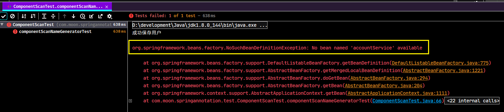

# Spring 注解开发使用详解汇总

> 注：注解的源码注释参考项目 https://github.com/MooNkirA/spring-note/tree/master/Spring-Framework

## 1. Spring注解驱动开发入门

### 1.1. 简介

Spring在2.5版本引入了注解配置的支持，同时从Spring 3.x版本开始，Spring JavaConfig项目提供的许多特性成为核心Spring框架的一部分。因此，可以使用Java而不是XML文件来定义应用程序类外部的bean。在Spring的官方文档里提供了四个基本注解`@Configuration`，`@Bean`，`@Import`，`@DependsOn`用于驱动开发

### 1.2. 注解驱动入门案例

#### 1.2.1. 案例需求

1. 需求：实现保存一条数据到数据库。
2. 示例使用的表结构：

```sql
create table account(
    id int primary key auto_increment,
    name varchar(50),
    money double(7,2)
);
```

3. 要求：使用spring框架中的JdbcTemplate和DriverManagerDataSource，使用纯注解配置spring的ioc

#### 1.2.2. 代码实现

##### 1.2.2.1. 导入依赖

创建示例项目，pom.xml文件引入相关依赖

```xml
<dependencies>
    <!-- spring核心依赖 -->
    <dependency>
        <groupId>org.springframework</groupId>
        <artifactId>spring-context</artifactId>
        <version>5.1.6.RELEASE</version>
    </dependency>
    <dependency>
        <groupId>org.springframework</groupId>
        <artifactId>spring-jdbc</artifactId>
        <version>5.1.6.RELEASE</version>
    </dependency>
    <!-- mysql驱动 -->
    <dependency>
        <groupId>mysql</groupId>
        <artifactId>mysql-connector-java</artifactId>
        <version>5.1.45</version>
    </dependency>
</dependencies>
```

##### 1.2.2.2. 编写配置类

创建spring的配置类，用于代替xml配置文件

```java
package com.moon.springsample.config;

import org.springframework.context.annotation.Configuration;
import org.springframework.context.annotation.Import;
import org.springframework.context.annotation.PropertySource;

/**
 * spring项目的配置类，用于代替传统的xml配置文件
 */
@Configuration /* 标识当前类为配置类 */
@Import(JdbcConfig.class) /* @Import注解是写在类上的，通常是和注解驱动的配置类一起使用的。其作用是引入其他的配置类 */
@PropertySource("classpath:jdbc.properties") /* 用于指定读取资源文件的位置。不仅支持properties，也支持xml文件 */
public class SpringConfiguration {
}
```

```java
package com.moon.springsample.config;

import org.springframework.beans.factory.annotation.Value;
import org.springframework.context.annotation.Bean;
import org.springframework.jdbc.core.JdbcTemplate;
import org.springframework.jdbc.datasource.DriverManagerDataSource;

import javax.sql.DataSource;

/**
 * 连接数据库的配置类
 */
public class JdbcConfig {
    // @Value注解用于注入基本类型和String类型的数据。它支持spring的EL表达式，可以通过${}的方式获取配置文件中的数据
    @Value("${jdbc.driver}")
    private String driver;
    @Value("${jdbc.url}")
    private String url;
    @Value("${jdbc.username}")
    private String username;
    @Value("${jdbc.password}")
    private String password;

    /* 创建JdbcTemplate对象 */
    @Bean("jdbcTemplate") // @Bean注解用于方法上，表示把当前方法的返回值存入spring的ioc容器
    public JdbcTemplate createJdbcTemplate(DataSource dataSource) {
        return new JdbcTemplate(dataSource);
    }

    /* 创建DataSource对象 */
    @Bean("dataSource")
    public DataSource createDataSource() {
        DriverManagerDataSource dataSource = new DriverManagerDataSource();
        dataSource.setDriverClassName(driver);
        dataSource.setUrl(url);
        dataSource.setUsername(username);
        dataSource.setPassword(password);
        return dataSource;
    }
}
```

##### 1.2.2.3. 编写配置文件

在resources目录下，创建数据库连接参数的配置文件jdbc.properties

```properties
jdbc.driver=com.mysql.jdbc.Driver
jdbc.url=jdbc:mysql://localhost:3306/tempdb?characterEncoding=utf-8
jdbc.username=root
jdbc.password=123456
```

##### 1.2.2.4. 测试

```java
/* 测试spring全注解开发示例 */
public static void main(String[] args) {
    // 1. 获取基于注解的spinrg容器
    ApplicationContext context = new AnnotationConfigApplicationContext("com.moon.springsample");
    // 2. 测试根据id获取spring容器中的对象
    JdbcTemplate jdbcTemplate = context.getBean("jdbcTemplate", JdbcTemplate.class);
    // 3. 进行数据库操作
    jdbcTemplate.update("insert into account(name,money) values (?,?)","Moon", 1888);
}
```

## 2. IOC的常用注解 - 用于注解驱动的注解

### 2.1. @Configuration

#### 2.1.1. 作用

它是在spring3.0版本之后加入的。此注解是Spring支持注解驱动开发的一个标志。表示当前类是Spring的一个配置类，作用是替代传统主Spring的`applicationContext.xml`配置文件。

从它的源码可以看出，其本质就是`@Component`注解，被此注解修饰的类，也会被存入spring的ioc容器。

#### 2.1.2. 相关属性

- `value`：用于存入spring的Ioc容器中Bean的id

#### 2.1.3. 使用场景

在注解驱动开发时，用于编写配置的类，通常可以使用此注解。一般情况下，配置也会分为主从配置，`@Configuration`一般出现在主配置类上。

例如，在上面快递入门案例中的`SpringConfiguration`类上。值得注意的是，构建ioc容器（`AnnotationConfigApplicationContext`）使用的是传入字节码的构造函数，此注解可以省略。

```java
ApplicationContext context = new AnnotationConfigApplicationContext(SpringConfiguration.class);

// @Configuration /* 标识当前类为配置类 */
@Import(JdbcConfig.class)
@PropertySource("classpath:jdbc.properties")
public class SpringConfiguration {
}
```

但是如果使用基础包扫描的构造函数创建`AnnotationConfigApplicationContext`，则配置类中的`@Configuration `注解则不能省略。

```java
ApplicationContext context = new AnnotationConfigApplicationContext("com.moon.springsample");

@Configuration /* 标识当前类为配置类 */
@Import(JdbcConfig.class) /* @Import注解是写在类上的，通常是和注解驱动的配置类一起使用的。其作用是引入其他的配置类 */
@PropertySource("classpath:jdbc.properties") /* 用于指定读取资源文件的位置。不仅支持properties，也支持xml文件 */
public class SpringConfiguration {
}
```

#### 2.1.4. 示例

- 创建配置类

```java
package com.moon.springsample.config;

import org.springframework.context.annotation.ComponentScan;
import org.springframework.context.annotation.Configuration;

/**
 * spring项目的配置类，用于代替传统的xml配置文件
 * <p>没有applicationContext.xml，就没法在xml中配置spring创建容器要扫描的包了。</p>
 * <p>那么可以创建一些类，通过注解配置到ioc容器中也无法实现了。此时就可以使用此注解来代替spring的配置文件。</p>
 */
@Configuration("springConfiguration") /* 标识当前类为配置类 */
@ComponentScan("com.moon.springsample") /* 配置开启包扫描 */
// @Import(Xxxxx.class) /* 通过@Import注解导入其他的配置类 */
// @PropertySource("classpath:xxxx.properties") /* 通过@PropertySource注解导入配置文件，如.properties、.xml等 */
public class SpringConfiguration {
}
```

- 测试

```java
package com.moon.springannotation.test;

import com.moon.springsample.config.SpringConfiguration;
import org.springframework.context.ApplicationContext;
import org.springframework.context.annotation.AnnotationConfigApplicationContext;

/**
 * `@Configuration` 注解使用测试
 *
 * @author MooNkirA
 * @version 1.0
 * @date 2020-7-31 23:40
 * @description
 */
public class ConfigurationTest {
    /* Configuratio注解使用测试 */
    public static void main(String[] args) {
        // 方式一：1. 获取基于注解的spinrg容器，使用基础包basePackages的构造函数创建=容器，此时SpringConfiguration类上必须加上@Configuration注解
        // ApplicationContext context = new AnnotationConfigApplicationContext("com.moon.springsample");
        // 方式二：1. 获取基于注解的spinrg容器，使用传入字节码的构造函数创建容器，此时SpringConfiguration类上可以不加@Configuration注解
        ApplicationContext context = new AnnotationConfigApplicationContext(SpringConfiguration.class);
        // 2. 根据id或者类型去获取对应的bean实例
        SpringConfiguration springConfiguration = (SpringConfiguration) context.getBean("springConfiguration");
        System.out.println(springConfiguration);
    }
}
```

### 2.2. @ComponentScan

#### 2.2.1. 作用与使用场景

用于指定创建容器时要扫描的包。该注解在指定扫描的位置时，可以指定包名，也可以指定扫描的类。同时支持定义扫描规则，例如包含哪些或者排除哪些。同时，它还支持自定义Bean的命名规则

在注解驱动开发时，编写的类都使用注解的方式进行配置，但想让加上相关spring注解(如：`@Controller`、`@Service`、`@Repository`、`@Component`)的类添加到spring的ioc容器中，就需要使用`@ComponentScan`注解来实现组件的扫描。

<font color=red>**注意：在spring4.3版本之后还加入了一个`@ComponentScans`的注解，该注解相当于支持配置多个`@ComponentScan`**</font>

#### 2.2.2. 相关属性

- `value`：用于指定要扫描的包。当指定了包的名称之后，spring会扫描指定的包及其子包下的所有类
- `basePackages`：与value作用一样
- `basePackageClasses`：指定具体要扫描的类的字节码，spring会扫描指定字节码的类所在的包及其子包下的所有类。
- `nameGenrator`：指定扫描bean对象存入容器时的命名规则。详情参考《Spring源码分析》的BeanNameGenerator及其实现类。
- `scopeResolver`：用于处理并转换检测到的Bean的作用范围。
- `soperdProxy`：用于指定bean生成时的代理方式。默认是Default，则不使用代理，可选值有四个：`DEFAULT`，`NO`，`INTERFACES`，`TARGET_CLASS`。详情请参考《Spring源码分析》的ScopedProxyMode枚举。
- `resourcePattern`：用于指定符合组件检测条件的类文件，默认是包扫描下的`**/*.class`
- `useDefaultFilters`：是否对带有@Component @Repository @Service @Controller注解的类开启检测，默认是开启的。
- `includeFilters`：自定义组件扫描的过滤规则，用于扫描组件。注解的是`Filter`注解数组，`Filter`的`type`属性是`FilterType`的枚举，有5种类型：
    - `ANNOTATION`：注解类型 默认
    - `ASSIGNABLE_TYPE`：指定固定类
    - `ASPECTJ`：ASPECTJ类型
    - `REGEX`：正则表达式
    - `CUSTOM`：自定义类型
    - > 详情参考《Spring源码分析》自定义组件扫描过滤规则
- `excludeFilters`：自定义组件扫描的排除规则。
- `lazyInit`：组件扫描时是否采用懒加载 ，默认不开启。

#### 2.2.3. 示例

##### 2.2.3.1. 不指定扫描包的使用

- 创建配置类

```java
@Configuration /* 标识当前类为配置类 */
@ComponentScan /* 配置开启包扫描，不写扫描的包路径，则默认扫描当前@ComponentScan注解的类所在的包及其下的所有子包 */
public class SpringConfiguration {
}
```

- 测试代码

```java
@Test
public void componentScanBaseTest() {
    // 1. 获取基于注解的spinrg容器，使用传入字节码的构造函数创建容器。（这里故意不使用传入基础包的构造函数，如果这里配置了扫描包包含了测试层的位置，则看不出效果）
    ApplicationContext context = new AnnotationConfigApplicationContext(SpringConfiguration.class);
    // 2. 根据id或者类型去获取对应的bean实例
    UserService userService = context.getBean("userService", UserService.class);
    // 3. 调用对象方法
    userService.saveUser();
}
```

测试结果，`@ComponentScan`不指定扫描包，只会扫描当前配置类所在的包及其下的所有子包


##### 2.2.3.2. value与basePackages属性

- 创建简单模拟的业务层代码

```java
package com.moon.springsample.service;

public interface UserService {
    /* 模拟保存用户 */
    void saveUser();
}
```

```java
package com.moon.springsample.service.impl;

import com.moon.springsample.service.UserService;
import org.springframework.stereotype.Service;

@Service("userService") /* 配置当前类交给spring ioc容器管理，其中value为对象在容器中的名称 */
public class UserServiceImpl implements UserService {
    @Override
    public void saveUser() {
        System.out.println("成功保存用户");
    }
}
```

- 创建配置类，使用`@ComponentScan`注解

```java
package com.moon.springsample.config;

import org.springframework.context.annotation.ComponentScan;
import org.springframework.context.annotation.Configuration;

/**
 * spring项目的配置类
 */
@Configuration /* 标识当前类为配置类 */
// @ComponentScan("com.moon.springsample") /* 配置开启包扫描，配置value属性，如果没有配置，则可以省略不写value="xxxx" */
@ComponentScan(basePackages = {"com.moon.springsample"}) /* 配置开启包扫描，配置basePackages属性，效果与value一样，但不能与value属性同时存在 */
public class SpringConfiguration {
}
```

- 测试

```java
@Test
public void componentScanBasePackagesTest() {
    // 1. 获取基于注解的spinrg容器，使用传入字节码的构造函数创建容器。（这里故意不使用传入基础包的构造函数，如果这里配置了扫描包包含了测试层的位置，则看不出效果）
    ApplicationContext context = new AnnotationConfigApplicationContext(SpringConfiguration.class);
    // 2. 根据id或者类型去获取对应的bean实例
    UserService userService = context.getBean("userService", UserService.class);
    // 3. 调用对象方法
    userService.saveUser();
}
```

##### 2.2.3.3. basePackageClassesn属性

- 配置`basePackageClasses`属性，指定扫描类的字节码

```java
@Configuration /* 标识当前类为配置类 */
@ComponentScan(basePackageClasses = UserService.class) /* 配置开启包扫描，指定具体要扫描的类的字节码，spring会扫描指定字节码的类所在的包及其子包下的所有类。 */
public class SpringConfiguration {
}
```

- 测试

```java
@Test
public void componentScanBasePackageClassesTest() {
    // 1. 获取基于注解的spinrg容器，使用基础包的构造函数，只扫描配置类所在的包。
    ApplicationContext context = new AnnotationConfigApplicationContext("com.moon.springsample.config");
    // 2. 根据id或者类型去获取对应的bean实例
    UserService userService = context.getBean("userService", UserService.class);
    // 3. 调用对象方法
    userService.saveUser();
    // 使用basePackageClasses方法扫描，测试指定字节码类所在的包及其子包所有的类是否被扫描到
    AccountService accoutService = context.getBean("accountService", AccountService.class);
    accoutService.deleteAccount();
}
```

测试结果：扫描到UserService所在的包及其子包


#### 2.2.4. 自定义BeanNameGenerator生成规则

##### 2.2.4.1. nameGenrator属性

通过查看`@ComponentScan`注解的源码，有`nameGenrator`属性，用来定义bean在spring容器中的名称。属性的值是一个`BeanNameGenerator`接口，spring有默认实现的生成名称，其实现类为`AnnotationBeanNameGenerator`。

其中`AnnotationBeanNameGenerator`实现的逻辑主要通过类上的注解元数据，在获取注解中的value值，如果value有值，则以value的值为baen的名称。如果value没有值，则将获取类名，将首字母转成小写，用作bean的名称

> 注：在《Spring源码分析》中有`BeanNameGenerator`的详细介绍

##### 2.2.4.2. 自定义beanName生成规则示例

- 创建自定义beanName生成规则类`com.moon.springsample.custom.CustomBeanNameGenerator`，实现`BeanNameGenerator`接口。里面的逻辑可以参考源码

```java
package com.moon.springsample.custom;

import org.springframework.beans.factory.annotation.AnnotatedBeanDefinition;
import org.springframework.beans.factory.config.BeanDefinition;
import org.springframework.beans.factory.support.BeanDefinitionRegistry;
import org.springframework.beans.factory.support.BeanNameGenerator;
import org.springframework.context.annotation.AnnotationConfigUtils;
import org.springframework.core.annotation.AnnotationAttributes;
import org.springframework.core.type.AnnotationMetadata;
import org.springframework.lang.Nullable;
import org.springframework.util.Assert;
import org.springframework.util.ClassUtils;
import org.springframework.util.StringUtils;

import java.beans.Introspector;
import java.util.Map;
import java.util.Set;

/**
 * 自定义BeanName生成规则实现类，需实现spring框架的BeanNameGenerator接口
 */
public class CustomBeanNameGenerator implements BeanNameGenerator {

    /* Component注解的全类名 */
    private static final String COMPONENT_ANNOTATION_CLASSNAME = "org.springframework.stereotype.Component";

    /* 自定义beanName前缀 */
    private static final String NAME_PREFIX = "MooN_";

    @Override
    public String generateBeanName(BeanDefinition definition, BeanDefinitionRegistry registry) {
        // 0. 定义返回的beanName
        String beanName = null;

        // 1. 判断当前BeanDefinition对象是否为注解
        if (definition instanceof AnnotatedBeanDefinition) {
            // 2. 将BeanDefinition对象强转成注解的BeanDefinition对象
            AnnotatedBeanDefinition abd = (AnnotatedBeanDefinition) definition;
            // 3. 通过BeanDefinition对象获取注解的元信息（AnnotationMetadata）
            AnnotationMetadata amd = abd.getMetadata();
            // 4. 获取元信息中所有注解的Set集合
            Set<String> annotationTypes = amd.getAnnotationTypes();
            // 5. 遍历AnnotationType的集合
            for (String type : annotationTypes) {
                // 6. 获取注解的属性，（AnnotationAttributes是继承LinkedHashMap）
                AnnotationAttributes attributes = AnnotationAttributes
                        .fromMap(amd.getAnnotationAttributes(type, false));
                // 7. 判断注解属性attributes的是否为空，并且必须是@Component注解或者其衍生注解
                if (attributes != null && isStereotypeWithNameValue(type, amd.getMetaAnnotationTypes(type), attributes)) {
                    // 8. 获取注解中value属性的值
                    Object value = attributes.get("value");
                    if (value instanceof String) {
                        // 9. 如果是字符串类型，强转
                        String strVal = (String) value;
                        // 10. 判断value值是否为空
                        if (StringUtils.hasLength(strVal)) {
                            // 11. 如果beanName为空，并且与注解中的value值不相同，抛出异常
                            if (beanName != null && !strVal.equals(beanName)) {
                                throw new IllegalStateException("Stereotype annotations suggest inconsistent " +
                                        "component names: '" + beanName + "' versus '" + strVal + "'");
                            }
                            // 因为是直接参考spring的实现，为了看到自定义beanName生成规则的效果，这里加上前缀，以作区分
                            beanName = NAME_PREFIX + strVal;
                        }
                    }
                }
            }
        }
        // 这里生成默认的名称也加上前缀，以作区分
        return beanName == null ? NAME_PREFIX + buildDefaultBeanName(definition) : beanName;
    }

    /**
     * 用于判断注解是否为@Component注解或者其衍生注解
     */
    private boolean isStereotypeWithNameValue(String annotationType, Set<String> metaAnnotationTypes,
                                              @Nullable Map<String, Object> attributes) {

        boolean isStereotype = annotationType.equals(COMPONENT_ANNOTATION_CLASSNAME) ||
                metaAnnotationTypes.contains(COMPONENT_ANNOTATION_CLASSNAME) ||
                annotationType.equals("javax.annotation.ManagedBean") ||
                annotationType.equals("javax.inject.Named");

        return (isStereotype && attributes != null && attributes.containsKey("value"));
    }

    /**
     * 创建一个默认的beanName(spring的原方法)
     */
    private String buildDefaultBeanName(BeanDefinition definition) {
        String beanClassName = definition.getBeanClassName();
        Assert.state(beanClassName != null, "No bean class name set");
        String shortClassName = ClassUtils.getShortName(beanClassName);
        return Introspector.decapitalize(shortClassName);
    }
}
```

- 在配置类中的`@ComponentScan`注解，加入`nameGenrator`属性，值为自定义的规则实现类`CustomBeanNameGenerator`

```java
@Configuration
/* 配置bean对象存入容器时自定义的命名规则 */
@ComponentScan(basePackages = {"com.moon.springsample"}, nameGenerator = CustomBeanNameGenerator.class)
public class SpringConfiguration {
}
```

- 测试代码与结果

```java
 @Test
public void componentScanNameGeneratorTest() {
    // 1. 获取基于注解的spinrg容器，使用基础包的构造函数，只扫描配置类所在的包。
    ApplicationContext context = new AnnotationConfigApplicationContext("com.moon.springsample.config");
    // 2. 根据id去获取对应的bean实例，因为是自定义baeanName命名规则，所以需要使用自定义的beanName才能获取到相应的spring容器的对象
    UserService userService = context.getBean("MooN_userService", UserService.class);
    // 3. 调用对象方法
    userService.saveUser();
    // 使用spring架构默认的命名规则的名称去获取容器中的实例，报错！
    AccountService accoutService = context.getBean("accountService", AccountService.class);
    accoutService.deleteAccount();
}
```




### 2.3. @Bean

#### 2.3.1. 源码


# 其他暂存

## 1. `@ControllerAdvice` 注解

`@ControllerAdvice`，是spring3.2提供的新注解，大体的作用是控制器增强。还有`@RestControllerAdvice`注解，是`@ControllerAdvice`与`@ResponseBody`的组合体

**使用`@ControllerAdvice`，不用任何的配置，只要把这个类放在项目中配置了Spring包扫描的位置（`<context:component-scan>`）。就可以实现全局异常的回调。**

官方定义说明

- `@ControllerAdvice`是一个`@Component`，用于定义@`ExceptionHandler`，`@InitBinder`和`@ModelAttribute`方法，适用于所有使用`@RequestMapping`方法。
- Spring4之前，`@ControllerAdvice`在同一调度的Servlet中协助所有控制器。Spring4已经改变：`@ControllerAdvice`支持配置控制器的子集，而默认的行为仍然可以利用。
- 在Spring4中，` @ControllerAdvice`通过`annotations()`, `basePackageClasses()`, `basePackages()`方法定制用于选择控制器子集。

此注解一般配合`@ExceptionHandler`使用，异常处理器，此注解的作用是当出现其定义的异常时进行处理的方法，其可以使用springmvc提供的数据绑定，比如注入HttpServletRequest等，还可以接受一个当前抛出的Throwable对象。

例：

```java
/**
 * 全局异常处理器
 */
@RestControllerAdvice
public class GlobalExceptionHandler {
    private static final Logger log = LoggerFactory.getLogger(GlobalExceptionHandler.class);

    /**
     * 权限校验失败 如果请求为ajax返回json，普通请求跳转页面
     */
    @ExceptionHandler(AuthorizationException.class)
    public Object handleAuthorizationException(HttpServletRequest request, AuthorizationException e) {
        log.error(e.getMessage(), e);
        if (ServletUtils.isAjaxRequest(request)) {
            return AjaxResult.error(PermissionUtils.getMsg(e.getMessage()));
        } else {
            ModelAndView modelAndView = new ModelAndView();
            modelAndView.setViewName("/error/unauth");
            return modelAndView;
        }
    }

    /**
     * 请求方式不支持
     */
    @ExceptionHandler({HttpRequestMethodNotSupportedException.class})
    public AjaxResult handleException(HttpRequestMethodNotSupportedException e) {
        log.error(e.getMessage(), e);
        return AjaxResult.error("不支持' " + e.getMethod() + "'请求");
    }

    /**
     * 拦截未知的运行时异常
     */
    @ExceptionHandler(RuntimeException.class)
    public AjaxResult notFount(RuntimeException e) {
        log.error("运行时异常:", e);
        return AjaxResult.error("运行时异常:" + e.getMessage());
    }

    /**
     * 系统异常
     */
    @ExceptionHandler(Exception.class)
    public AjaxResult handleException(Exception e) {
        log.error(e.getMessage(), e);
        return AjaxResult.error("服务器错误，请联系管理员");
    }

    /**
     * 业务异常
     */
    @ExceptionHandler(BusinessException.class)
    public AjaxResult businessException(BusinessException e) {
        log.error(e.getMessage(), e);
        return AjaxResult.error(e.getMessage());
    }
}
```

*注：AjaxResult.error是自定义的一个方法，封装了一个返回的map，用来返回前端是一个json对象*

## 2. 参考资料

1. http://mp.weixin.qq.com/s?__biz=MzI3ODcxMzQzMw==&mid=2247491621&idx=1&sn=332712bcb7146cb9f5f3f280e3bb1c2b&chksm=eb506513dc27ec05d2143663720c1a3b7d9b610954763cb7cea3f8f31a6bad5064d8ef5b13c1&mpshare=1&scene=1&srcid=&sharer_sharetime=1574220624476&sharer_shareid=6087581adbbb79acccd7e873962f1a09#rd

