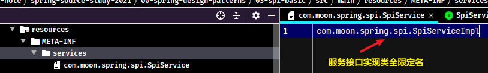
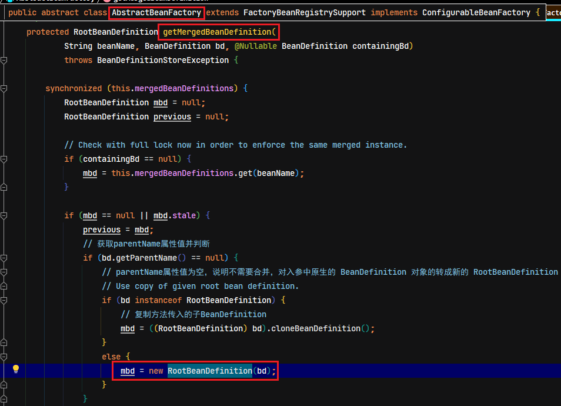
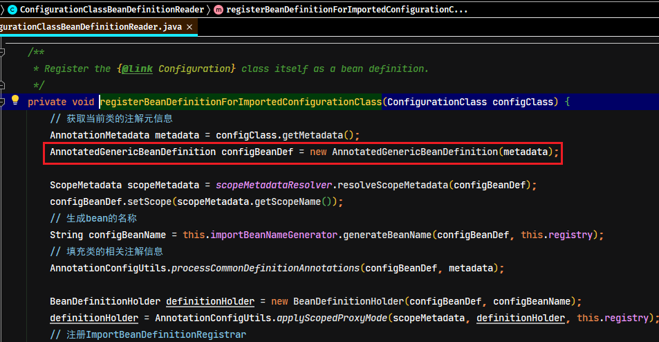
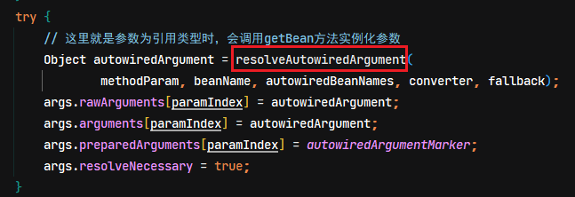
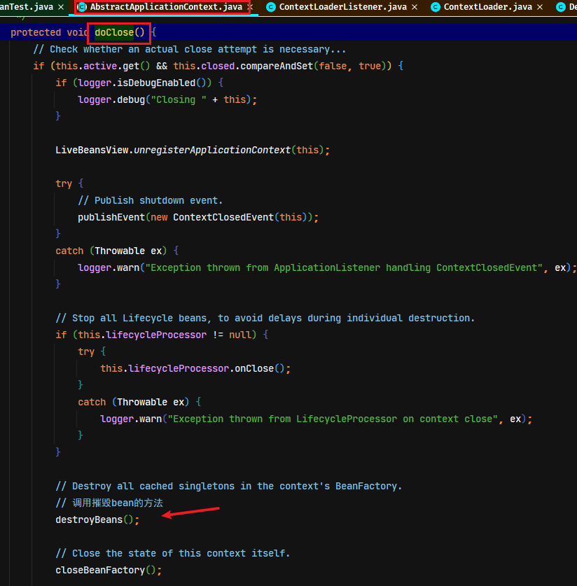
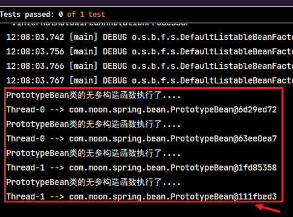
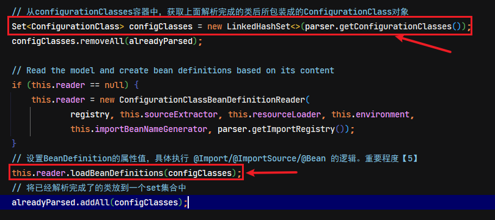
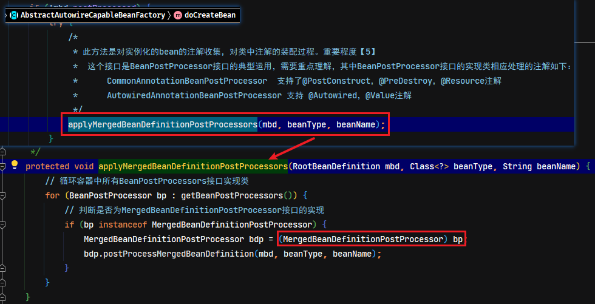

# Spring源码分析01-IOC（控制反转）

官方参考文档：https://docs.spring.io/spring-framework/docs/5.2.12.RELEASE/spring-framework-reference/

## 1. IOC相关理论

### 1.1. 设计模式-工厂模式

工厂模式是最常用的实例化对象模式了，它是用工厂中的方法代替new创建对象的一种设计模式。

### 1.2. IOC（Inversion of Control）控制反转

控制反转（IOC），它不是一个技术，而是一种思想。其作用是用于削减代码间的耦合。它的实现思想就是利用了工厂设计模式，把创建对象代码从具体类中剥离出去，交由工厂来完成，从而降低代码间的依赖关系。耦合有如下分类：

1. 内容耦合。当一个模块直接修改或操作另一个模块的数据时，或一个模块不通过正常入口而转入另一个模块时，这样的耦合被称为内容耦合。内容耦合是最高程度的耦合，应该避免使用之。
2. 公共耦合。两个或两个以上的模块共同引用一个全局数据项，这种耦合被称为公共耦合。在具有大量公共耦合的结构中，确定究竟是哪个模块给全局变量赋了一个特定的值是十分困难的。
3. 外部耦合。一组模块都访问同一全局简单变量而不是同一全局数据结构，而且不是通过参数表传递该全局变量的信息，则称之为外部耦合。
4. 控制耦合。一个模块通过接口向另一个模块传递一个控制信号，接受信号的模块根据信号值而进行适当的动作，这种耦合被称为控制耦合。
5. 标记耦合。若一个模块A通过接口向两个模块B和C传递一个公共参数，那么称模块B和C之间存在一个标记耦合。
6. 数据耦合。模块之间通过参数来传递数据，那么被称为数据耦合。数据耦合是最低的一种耦合形式，系统中一般都存在这种类型的耦合，因为为了完成一些有意义的功能，往往需要将某些模块的输出数据作为另一些模块的输入数据。
7. 非直接耦合。两个模块之间没有直接关系，它们之间的联系完全是通过主模块的控制和调用来实现的。

解耦的必要性在于，耦合是影响软件复杂程度和设计质量的一个重要因素，在设计上应采用以下原则：如果模块间必须存在耦合，就尽量使用数据耦合，少用控制耦合，限制公共耦合的范围，尽量避免使用内容耦合。

### 1.3. DI（Dependency Injection）依赖注入

依赖注入（DI），是Spring框架核心IOC的具体实现。IOC解耦只是降低他们的依赖关系，但不会消除。比如：业务层需要依赖数据层的方法。

## 2. Spring 源码分析准备工作

> 注：下载spring源码并写注释，里面会标识相应方法的重要程度：1~5。
>
> - 0：不重要，可以不看
> - 1：一般重要，可看可不看
> - 5：非常重要，一定要看

### 2.1. Spring 源码下载

1. 到github下载源码
    - 源码下载地址：https://github.com/spring-projects/spring-framework
    - 国内镜像：https://gitee.com/mirrors/spring-framework
    - 目前源码学习的笔记更新至spring-framework 5.2.8.RELEASE，下载地址：https://gitee.com/mirrors/Spring-Framework/tree/v5.2.8.RELEASE
2. 下载 gradle，需要 JDK8 及以上的版本。解压Gradle压缩包到无中文与空格的目录，然后配置gradle环境变量


3. 修改源码项目的`settings.gradle`文件，增加阿里云仓库

```gradle
pluginManagement {
	repositories {
		gradlePluginPortal()
        maven { url 'https://maven.aliyun.com/repository/public' }
		maven { url 'https://repo.spring.io/plugins-release' }
	}
}
```

4. 修改源码项目的`gradle.properties`文件，修改一些参数配置

```properties
version=5.2.8.RELEASE
org.gradle.jvmargs=-Xmx2048M
org.gradle.caching=true
org.gradle.parallel=true
org.gradle.configureondemand=true
org.gradle.daemon=true
```

5. 修改源码项目的`build.gradle`文件，增加阿里云仓库

```gradle
repositories {
    maven { url 'https://maven.aliyun.com/nexus/content/groups/public/' }
    maven { url 'https://maven.aliyun.com/nexus/content/repositories/jcenter'}
	mavenCentral()
    maven { url "https://repo.spring.io/libs-spring-framework-build" }
}
```

6. 到下载的 spring 源码路径执行 gradle 命令，`gradlew :spring-oxm:compileTestJava`。编译spring-oxm模块，编译成功后会有`BUILD SUCCESSFUL`的提示。
7. 用 idea 打开 spring 源码工程，在 idea 中安装插件 kotlin，重启 idea
8. 把编译好的源码导入到工程中，这样可以在源码中写注释并且断点调试源码了。

### 2.2. 把源码导入到工程

1. 使用gradle在将相关模块的源码打成jar


2. 在Project侧边栏中的External Libraries，选择源码测试工程所依赖的spring相应的版本，右键选择【Open Library Settings】


3. 选择Libraries里的spring源码包，在Classes、Sources、Annotations中增加编译好的源码


4. 选择Classes、Sources，删除原来maven仓库的jar，改成使用源码编译后jar包


### 2.3. 创建 Spring 最基础示例项目

- 创建maven项目，修改pom.xml导入 spring 依赖。其中 spring 中最核心的4个jar如下
    - spring-beans
    - spring-core
    - spring-context
    - spring-expression
- 一个最简单的 spring 工程，理论上就只需要依赖一个 spring-context 就足够了

1. 创建pom父工程，此工程包含所有示例项目

```xml
<?xml version="1.0" encoding="UTF-8"?>
<project xmlns="http://maven.apache.org/POM/4.0.0"
         xmlns:xsi="http://www.w3.org/2001/XMLSchema-instance"
         xsi:schemaLocation="http://maven.apache.org/POM/4.0.0 http://maven.apache.org/xsd/maven-4.0.0.xsd">
    <parent>
        <artifactId>spring-analysis-note</artifactId>
        <groupId>com.moon</groupId>
        <version>1.0-SNAPSHOT</version>
    </parent>

    <modelVersion>4.0.0</modelVersion>
    <artifactId>spring-source-study-2021</artifactId>
    <packaging>pom</packaging>
    <name>${project.artifactId}</name>
    <description>
        Spring Framework 5.2.8.RELEASE 版本的源码学习案例工程(包括基础使用示例、涉及设计模式示例) - 2021年整理版本
    </description>
    <modules>
        <module>01-spring-basic</module>
    </modules>

    <!-- 版本号管理 -->
    <properties>
        <spring.version>5.2.8.RELEASE</spring.version>
        <lombok.version>1.18.4</lombok.version>
        <junit.version>4.13</junit.version>
        <slf4j.version>1.7.10</slf4j.version>
        <logback.version>1.1.2</logback.version>
    </properties>

    <!-- 版本控制 -->
    <dependencyManagement>
        <dependencies>
            <!-- spring framework 核心依赖 -->
            <dependency>
                <groupId>org.springframework</groupId>
                <artifactId>spring-context</artifactId>
                <version>${spring.version}</version>
            </dependency>

            <!-- junit测试框架 -->
            <dependency>
                <groupId>junit</groupId>
                <artifactId>junit</artifactId>
                <version>${junit.version}</version>
            </dependency>

            <!-- 日志相关依赖 -->
            <dependency>
                <groupId>org.slf4j</groupId>
                <artifactId>slf4j-api</artifactId>
                <version>${slf4j.version}</version>
            </dependency>
            <dependency>
                <groupId>ch.qos.logback</groupId>
                <artifactId>logback-classic</artifactId>
                <version>${logback.version}</version>
            </dependency>
            <dependency>
                <groupId>ch.qos.logback</groupId>
                <artifactId>logback-core</artifactId>
                <version>${logback.version}</version>
            </dependency>

            <!-- 工具框架 -->
            <dependency>
                <groupId>org.projectlombok</groupId>
                <artifactId>lombok</artifactId>
                <version>${lombok.version}</version>
            </dependency>
        </dependencies>
    </dependencyManagement>

    <!-- 公共依赖 -->
    <dependencies>
        <dependency>
            <groupId>junit</groupId>
            <artifactId>junit</artifactId>
            <scope>test</scope>
        </dependency>

        <dependency>
            <groupId>org.projectlombok</groupId>
            <artifactId>lombok</artifactId>
        </dependency>
    </dependencies>

</project>
```

2. 创建子项目，只需要引入 spring-context 的依赖，其包本身就依赖了 spring-aop，spring-beans，spring-core 等模块jar包

```xml
<?xml version="1.0" encoding="UTF-8"?>
<project xmlns="http://maven.apache.org/POM/4.0.0"
         xmlns:xsi="http://www.w3.org/2001/XMLSchema-instance"
         xsi:schemaLocation="http://maven.apache.org/POM/4.0.0 http://maven.apache.org/xsd/maven-4.0.0.xsd">
    <parent>
        <artifactId>spring-source-study-2021</artifactId>
        <groupId>com.moon</groupId>
        <version>1.0-SNAPSHOT</version>
    </parent>

    <modelVersion>4.0.0</modelVersion>
    <artifactId>01-spring-basic</artifactId>
    <packaging>war</packaging>
    <name>${project.artifactId}</name>
    <description>Spring Framework 基础入门示例</description>

    <dependencies>
        <!--
            spring框架最核心的依赖，一个最基本的spring项目只需要引入此依赖即可
                此依赖包括：spring-context,spring-aop,spring-beans,spring-core,spring-expression
        -->
        <dependency>
            <groupId>org.springframework</groupId>
            <artifactId>spring-context</artifactId>
        </dependency>
    </dependencies>

</project>
```

3. 创建一个spring的xml配置文件

```xml
<beans xmlns="http://www.springframework.org/schema/beans"
       xmlns:xsi="http://www.w3.org/2001/XMLSchema-instance"
       xmlns:context="http://www.springframework.org/schema/context"
       xmlns:aop="http://www.springframework.org/schema/aop"
       xmlns:p="http://www.springframework.org/schema/p"
       xmlns:c="http://www.springframework.org/schema/c"
       xsi:schemaLocation="
	http://www.springframework.org/schema/beans
	http://www.springframework.org/schema/beans/spring-beans.xsd
    http://www.springframework.org/schema/context
    http://www.springframework.org/schema/context/spring-context.xsd
    http://www.springframework.org/schema/aop
	http://www.springframework.org/schema/aop/spring-aop-3.2.xsd"
       default-lazy-init="false">

    <bean id="student" class="com.moon.spring.bean.Student"/>

</beans>
```

4. 编写示例方法

```java
@Test
public void testBasic() {
    ClassPathXmlApplicationContext applicationContext = new ClassPathXmlApplicationContext("spring.xml");
    Student bean = applicationContext.getBean(Student.class);
    System.out.println(bean.getUsername());
}
```


5. 一个空的 spring 工程是不能打印日志的，要导入 spring 依赖的日志 jar 包

```xml
<!-- spring 框架输出日志的依赖包 -->
<dependency>
    <groupId>org.slf4j</groupId>
    <artifactId>slf4j-api</artifactId>
</dependency>
<dependency>
    <groupId>ch.qos.logback</groupId>
    <artifactId>logback-classic</artifactId>
</dependency>
<dependency>
    <groupId>ch.qos.logback</groupId>
    <artifactId>logback-core</artifactId>
</dependency>
```


## 3. Spring 基础

### 3.1. spring 配置文件中xsd文件引入

XSD 是编写 xml 文件的一种规范，有了这个规范才能校验当前 xml 文件是否准确，在 spring 中同样有 XSD 规范。

### 3.2. spring 容器加载方式（了解）

现在实际项目中几乎用不到

#### 3.2.1. ClassPathXmlApplicationContext(类路径获取配置文件上下文对象)

比较常用的上下文对象，用于启动时读取类路径下的配置文件，创建xml的上下文对象

```java
/* 类路径获取配置文件上下文对象（ClassPathXmlApplicationContext） */
@Test
public void testClassPathXmlApplicationContext() {
    // 读取spring类路径下的配置文件
    ClassPathXmlApplicationContext applicationContext = new ClassPathXmlApplicationContext("spring.xml");
    Student student = (Student) applicationContext.getBean("student");
    System.out.println(student.getUsername());
}
```

#### 3.2.2. FileSystemXmlApplicationContext(文件系统路径【绝对路径】获取配置文件上下文对象)

此上下文对象很少使用，一般都使用类路径读取配置文件的上下文对象

```java
/* 文件系统路径获取配置文件【绝对路径】上下文对象（FileSystemXmlApplicationContext）【基本上不用】 */
@Test
public void testFileSystemXmlApplicationContext() {
    // 读取spring的配置文件，需要绝对路径
    FileSystemXmlApplicationContext applicationContext = new FileSystemXmlApplicationContext("D:\\code\\spring-note\\spring.xml");
    Student student = (Student) applicationContext.getBean("student");
    System.out.println(student.getUsername());
}
```

#### 3.2.3. AnnotationConfigApplicationContext(无配置文件加载容器上下文对象)

此上下文对象也比较少用，一般在测试用例中使用比较多，因为可以直接扫描指定的包，获取包下所有有spring注解标识的类实例

```java
private static final String BASE_PACKAGE = "com.moon.spring";

/* 无配置文件加载容器上下文对象（AnnotationConfigApplicationContext） */
@Test
public void testAnnotationConfigApplicationContext() {
    // 注解扫描上下文对象
    AnnotationConfigApplicationContext applicationContext = new AnnotationConfigApplicationContext(BASE_PACKAGE);
    BeanWithAnnotation bean = (BeanWithAnnotation) applicationContext.getBean("beanWithAnnotation");
    System.out.println(bean.getData());
}
```

#### 3.2.4. EmbeddedWebApplicationContext(SpringBoot 加载容器)

此上下文对象是spring boot的框架，启动的时候可以创建一个嵌入式的tomcat

```xml
<!-- springboot web 的依赖，用于引入EmbeddedWebApplicationContext类 -->
<dependency>
    <groupId>org.springframework.boot</groupId>
    <artifactId>spring-boot</artifactId>
    <version>1.5.17.RELEASE</version>
</dependency>
<dependency>
    <groupId>org.springframework</groupId>
    <artifactId>spring-webmvc</artifactId>
</dependency>
<dependency>
    <groupId>javax.servlet</groupId>
    <artifactId>servlet-api</artifactId>
    <version>2.5</version>
</dependency>
```

```java
/* springboot 加载容器的上下文对象（EmbeddedWebApplicationContext） */
@Test
public void testEmbeddedWebApplicationContext() {
    // springboot在启动的时候就会用到此上下文对象，启动spring容器，创建一个嵌入式的tomcat
    new EmbeddedWebApplicationContext();
}
```

### 3.3. Bean 实例注册到 Spring 容器的方式

#### 3.3.1. 使用xml配置

最传统的配置方式，通过xml配置文件，配置需要实例化类的全限定名称，与实例id

```xml
<!-- 注册bean到spring容器方式1: 使用xml配置文件配置 -->
<bean id="student" class="com.moon.spring.common.bean.Student"/>
```

```java
@Test
public void testXmlRegisterBean() {
    ClassPathXmlApplicationContext context = new ClassPathXmlApplicationContext("spring.xml");
    Student student = context.getBean("student", Student.class);
    System.out.println(student);
    Assert.assertNotNull(student);
}
```

#### 3.3.2. 使用注解

通过在需要spring实例化与管理的类上标识`@Component`等注解，开启包扫描

```java
/**
 * 注册bean到spring容器方式2: 使用@Component等注解配置
 */
@Data
@Component
public class Dog {
    private String name;
    private int age;
}
```

```java
@Test
public void testAnnotationRegisterBean() {
    AnnotationConfigApplicationContext context = new AnnotationConfigApplicationContext("com.moon.spring");
    Dog dog = context.getBean("dog", Dog.class);
    System.out.println(dog);
    Assert.assertNotNull(dog);
}
```

#### 3.3.3. 通过BeanFactory手动注册

通过阅读源码，在spring的核心流程中的`initApplicationEventMulticaster`初始化事件管理器的方式是手动创建管理器实例，然后通过`BeanFactory`的`registerSingleton`手动注册到spring容器

```java
@Data
public class Fish {
    private String name;
    private String color;
}
```

测试代码

```java
@Test
public void testBeanFactoryRegisterBean() {
    AnnotationConfigApplicationContext context = new AnnotationConfigApplicationContext("com.moon.spring");
    // 获取bean实例工厂
    ConfigurableListableBeanFactory beanFactory = context.getBeanFactory();
    // 获取目前容器中所有实例的名称
    System.out.println("===== 手动注册Fish实例前 =====");
    for (String singletonName : beanFactory.getSingletonNames()) {
        System.out.println(singletonName);
    }

    // 实例工厂注册实例
    beanFactory.registerSingleton("fish", new Fish());
    // 获取目前容器中所有实例的名称
    System.out.println("===== 手动注册Fish实例后 =====");
    for (String singletonName : beanFactory.getSingletonNames()) {
        System.out.println(singletonName);
    }

    // 通过实例工厂删除实例
    ((DefaultListableBeanFactory) beanFactory).destroySingleton("dog");
    // 获取目前容器中所有实例的名称
    System.out.println("===== 删除容器中的Dog实例后 =====");
    for (String singletonName : beanFactory.getSingletonNames()) {
        System.out.println(singletonName);
    }
}
```

## 4. Spring 框架涉及的设计模式

### 4.1. 设计模式1 - 模板设计模式

在 spring 中大量的使用了模板设计模式，可以说是用得最多的设计模式。

模板设计模式demo代码详见：spring-analysis-note项目中的spring-source-study-2021\00-spring-design-patterns\01-design-patterns-template-method模块中demo

**模板设计模式的核心是：创建抽象类或者接口，定义一个主业务方法，而主业务方法有些业务逻辑可以抽象类已经实现，在主业务方法中预留了一些抽象方法，这些抽象方法由子类继承(或实现)的时候实现该方法的业务逻辑，到根据不同的业务场景，使用不同的子类，从而在调用父类主业务方法时，实现不同的（子类）业务逻辑**

> 注：模板类中的主业务可以使用final声明此方法，从而子类不可以重写，只能继承使用。至于其他的抽象方法，子类可以实现自己的业务逻辑，

spring框架中使用模板设计模式案例


### 4.2. 设计模式2 - 委托模式(代理模式)

有两个对象参与处理同一个请求，接受请求的对象将请求委托给另一个对象来处理

### 4.3. 设计模式3 - 装饰模式

- 装饰模式主要分几个元素
    1. 被装饰者：已存在的具体对象，需要被增强的对象
    2. 抽象装饰者：具体对象与装饰对象的共同父接口
    3. 装饰者对象：对具体对象进行功能的增强，进行装饰的类。对方法进行增强。(自定义的类)

装饰者设计模式demo详见：moonzero-system项目中的mz-learning-springsource模块，`com.moon.learningspring.designPattern.decorator`包下的demo

### 4.4. SPI 设计思想

#### 4.4.1. SPI是什么

SPI全称Service Provider Interface，是Java提供的一套用来被第三方实现或者扩展的API，它可以用来启用框架扩展和替换组件。整体机制图如下：


<font color=red>**Java SPI 实际上是“基于接口的编程＋策略模式＋配置文件”组合实现的动态加载机制。**</font>

#### 4.4.2. Java SPI 机制基础实现

要使用Java SPI，需要遵循如下约定：

1. 当服务提供者提供了接口的一种具体实现后，在jar包的`META-INF/services`目录下创建一个以“接口全限定名”为命名的文件，内容为实现类的全限定名；
2. 接口实现类所在的jar包放在主程序的classpath中；
3. 主程序通过`java.util.ServiceLoder`动态装载实现模块，它通过扫描`META-INF/services`目录下的配置文件找到实现类的全限定名，把类加载到JVM；
4. SPI的实现类必须携带一个不带参数的构造方法；

自定义标签的解析就是一个 SPI 设计思想，即通过加装全文配置文件，做到代码灵活的调用案例。实现步骤如下：

1. 定义一个服务提供接口

```java
package com.moon.spring.spi;

/**
 * service provider interface
 * <P>服务提供接口，需要提供一个可配置的服务接口的实现类</P>
 */
public interface SpiService {
    String query(String param)
}
```

2. 编写服务接口的实现类

```java
package com.moon.spring.spi;

/**
 * SPI 服务接口实现
 */
public class SpiServiceImpl implements SpiService {
    @Override
    public String query(String param) {
        System.out.println(String.format("=======SpiServiceImpl.query(%s)方法执行了======", param));
        return "OK";
    }
}
```

3. 在 resources 目录下创建 META-INF/services 文件夹，创建文件（文件的名称为服务接口全限定名）




4. 这样就可以通过这个接口，找到配置在文件中的所有该接口的实现类（可以是多个实现类）。
    - **这种设计的好处是：实现业务代码解耦，扩展性高。**核心的业务不需要再修改，日后增加新的业务需求时，可以通过增加新的实现类与修改配置文件即可
    - 缺点是：粒度不够细，通过配置的方式不能唯一确定一个实现类

```java
package com.moon.spring.spi;

import java.util.ServiceLoader;

/**
 * SPI 服务接口测试
 */
public class SpiTest {
    /**
     * 此设计的好处是：实现业务代码解耦，扩展性高。核心的业务不需要再修改，日后增加新的业务需求时，可以通过增加新的实现类与修改配置文件即可
     * 缺点是：粒度不够细，通过配置的方式不能唯一确定一个实现类
     */
    public static void main(String[] args) {
        // 通过jdk的api，ServiceLoader获取配置文件中定义所有实现类实例
        ServiceLoader<SpiService> load = ServiceLoader.load(SpiService.class);

        // 调用实现类的业务方法
        for (SpiService spiService : load) {
            spiService.query("呵呵");
        }
    }
}
```

#### 4.4.3. spring 框架对spi设计的运用

spring 中自定义标签的解析就是这种 SPI 设计的运用，在自定义标签中解析的过程中，spring 会去加载 META-INF/spring.handlers 文件，然后建立映射关系，程序在解析标签头的时候，如：`<context:>`这种的标签头。会拿到一个 namespaceUri，然后再从映射关系中找到这个 namespaceUri 所对应的处理类


#### 4.4.4. 扩展：dubbo对spi的优化(有时间研究)

dubbo在spi的配置文件中，设置为key-value的形式，这样在xml配置文件中配置相关属性，就可以唯一的确认一个实现类。

## 5. Spring 中的 BeanDefinition

### 5.1. BeanDefinition 简介

```java
public interface BeanDefinition extends AttributeAccessor, BeanMetadataElement
```

BeanDefinition 在 spring 中贯穿全部，spring 要根据 BeanDefinition 对象来实例化 bean，只要把解析的标签或者扫描的注解类封装成 BeanDefinition 对象，spring 才能实例化 bean

#### 5.1.1. 作用说明

Spring 的容器是用于存储 bean 对象。通常对于容器中存储 bean 的理解是一个个对应配置文件中的 `<bean/>` 标签或者是被注解的类，但是这些都是 bean 的静态表示，是还没有放入容器的物料，最终（<font color=red>**加载完配置，且在 getBean 之前**</font>）加载到容器中的是一个个 `BeanDefinition` 实例。

BeanDefinition 的继承关系如下图，`RootBeanDefinition`、`ChildBeanDefinition`，以及 `GenericBeanDefinition` 是三个主要的实现。

在配置时，通过 `parent` 属性指定 bean 的父子关系，这个时候父 bean 则用 `RootBeanDefinition` 表示，而子 bean 则用 `ChildBeanDefinition` 表示。`GenericBeanDefinition` 自 2.5 版本引入，是对于一般的 bean 定义的一站式服务中心。

#### 5.1.2. BeanDefinition类视图


### 5.2. BeanDefinition 接口与实现类

#### 5.2.1. AbstractBeanDefinition 抽象类

##### 5.2.1.1. 源码分析

```java
/*
 * RootBeanDefinition，ChildBeanDefinition，GenericBeanDefinition三个类都是由AbstractBeanDefinition派生而来
 * 该抽象类中包含了bean的所有配置项和一些支持程序运行的属性。
 */
public abstract class AbstractBeanDefinition extends BeanMetadataAttributeAccessor
		implements BeanDefinition, Cloneable {
    ......省略定义的变量

	/* bean 对应的类实例 */
	@Nullable
	private volatile Object beanClass;
	/* bean的作用域，对应scope属性 */
	@Nullable
	private String scope = SCOPE_DEFAULT;
	/* 是否是抽象类，对应abstract属性 */
	private boolean abstractFlag = false;
	/* 是否延迟加载，对应lazy-init属性 */
	private boolean lazyInit = false;
	/* 自动装配模式，对应autowire属性 */
	private int autowireMode = AUTOWIRE_NO;
	/* 依赖检查，对应dependency-check属性 */
	private int dependencyCheck = DEPENDENCY_CHECK_NONE;

	/* 对应depends-on，表示一个bean实例化前置依赖另一个bean */
	@Nullable
	private String[] dependsOn;
	/* 对应autowire-candidate属性，设置为false时表示取消当前bean作为自动装配候选者的资格 */
	private boolean autowireCandidate = true;
	/* 对应primary属性，当自动装配存在多个候选者时，将其作为首选 */
	private boolean primary = false;
	/* 对应qualifier属性 */
	private final Map<String, AutowireCandidateQualifier> qualifiers = new LinkedHashMap<>();

	@Nullable
	private Supplier<?> instanceSupplier;
	/* 非配置项：表示允许访问非公开的构造器和方法，由程序设置 */
	private boolean nonPublicAccessAllowed = true;

	/*
	 * 非配置项：表示是否允许以宽松的模式解析构造函数，由程序设置
	 * 	例如：如果设置为true，则在下列情况时不会抛出异常
	 * 		interface ITest{}
	 * 		class ITestImpl implements ITest {}
	 * 		class Main {
	 * 			Main(ITest i){}
	 * 			Main(ITestImpl i){}
	 * 		}
	 */
	private boolean lenientConstructorResolution = true;
	/* 对应factory-bean属性 */
	@Nullable
	private String factoryBeanName;
	/* 对应factory-method属性 */
	@Nullable
	private String factoryMethodName;
	/* 记录构造函数注入属性，对应<construct-arg/>标签 */
	@Nullable
	private ConstructorArgumentValues constructorArgumentValues;
	/* 记录<property/>属性集合 */
	@Nullable
	private MutablePropertyValues propertyValues;
	/* 记录<lookup-method/>和<replaced-method/>标签配置 */
	@Nullable
	private MethodOverrides methodOverrides;
	/* 对应init-method属性 */
	@Nullable
	private String initMethodName;
	/* 对应destroy-method属性 */
	@Nullable
	private String destroyMethodName;
	/* 非配置项：是否执行init-method，由程序设置 */
	private boolean enforceInitMethod = true;
	/* 非配置项：是否执行destroy-method，由程序设置 */
	private boolean enforceDestroyMethod = true;
	/* 非配置项：表示是否是用户定义，而不是程序定义的，创建AOP时为true,由程序设置 */
	private boolean synthetic = false;
	/*
	 * 非配置项：定义bean的应用场景，由程序设置，角色如下：
	 * 		ROLE_APPLICATION：用户
	 * 		ROLE_INFRASTRUCTURE：完全内部使用
	 * 		ROLE_SUPPORT：某些复杂配置的一部分
	 */
	private int role = BeanDefinition.ROLE_APPLICATION;
	/* bean的描述信息，对应description标签 */
	@Nullable
	private String description;
	/* bean定义的资源 */
	@Nullable
	private Resource resource;

    ......省略定义的方法
}
```

##### 5.2.1.2. 总结

`BeanDefinition` 是容器对于bean配置的内部表示，Spring 将各个 bean 的 `BeanDefinition` 实例注册记录在 `BeanDefinitionRegistry` 中，该接口定义了对 `BeanDefinition` 的各种增删查操作，类似于内存数据库，其实现类 `SimpleBeanDefinitionRegistry` 主要以 Map 作为存储标的。

#### 5.2.2. RootBeanDefinition 类

- 一个 RootBeanDefinition 定义表明它是一个可合并的 beanDefinition：即在 spring beanFactory 运行期间，可以返回一个特定的 bean。RootBeanDefinition 可以作为一个重要的通用的 beanDefinition 视图。
- RootBeanDefinition 用来在配置阶段进行注册 beanDefinition。然后，从 spring 2.5 后，编写注册 beanDefinition 有了更好的的方法：GenericBeanDefinition。GenericBeanDefinition 支持动态定义父类依赖，而非硬编码作为 root bean definition。

在Spring实例化过程开始循环全部BeanDefinitionName集合时，会将转成`RootBeanDefinition`




从构造函数可以知道，将原来的`BeanDefinition`属性值逐个填充到`RootBeanDefinition`类型实例中


#### 5.2.3. ChildBeanDefinition 类

- ChildBeanDefinition 是一种 bean definition，它可以继承它父类的设置，即ChildBeanDefinition 对 RootBeanDefinition 有一定的依赖关系
- ChildBeanDefinition 从父类继承构造参数值，属性值并可以重写父类的方法，同时也可以增加新的属性或者方法。(类同于 java 类的继承关系)。若指定初始化方法，销毁方法或者静态工厂方法，ChildBeanDefinition 将重写相应父类的设置。`depends on`，`autowire mode`，`dependency check`，`sigleton`，`lazy init` 一般由子类自行设定。

#### 5.2.4. GenericBeanDefinition 类（源码分析的重点关注的实现类）

- 注意：从 spring 2.5 开始，提供了一个更好的注册 bean definition 类 GenericBeanDefinition，它支持动态定义父依赖，方法是GenericBeanDefinition对象中`public void setParentName(@Nullable String parentName);`，GenericBeanDefinition 可以在绝大分部使用场合有效的替代 ChildBeanDefinition
- GenericBeanDefinition 是一站式的标准 bean definition，除了具有指定类、可选的构造参数值和属性参数这些其它 bean definition 一样的特性外，它还具有通过 parenetName 属性来灵活设置 parent bean definition
- 通常，GenericBeanDefinition 用来注册用户可见的 bean definition(可见的bean definition意味着可以在该类bean definition上定义post-processor来对bean进行操作，甚至为配置 parent name 做扩展准备)。RootBeanDefinition / ChildBeanDefinition 用来预定义具有 parent/child 关系的 bean definition。

#### 5.2.5. ScannedGenericBeanDefinition

```java
public class ScannedGenericBeanDefinition extends GenericBeanDefinition implements AnnotatedBeanDefinition
```

`ScannedGenericBeanDefinition`是在xml配置中，自定义标签`<context:component-scan>`解析时，会使用此类型的`BeanDefinition`进行封装


#### 5.2.6. AnnotatedGenericBeanDefinition

```java
public class AnnotatedGenericBeanDefinition extends GenericBeanDefinition implements AnnotatedBeanDefinition
```

`AnnotatedGenericBeanDefinition`是在使用`@Import`注解导入的类或者内部类时，会使用此类型的`BeanDefinition`进行封装



#### 5.2.7. ConfigurationClassBeanDefinition

```java
class ConfigurationClassBeanDefinitionReader {
    ....省略
    private static class ConfigurationClassBeanDefinition extends RootBeanDefinition implements AnnotatedBeanDefinition
}
```

`ConfigurationClassBeanDefinition`是在解析`@Bean`注解创建的实例时，会使用此类型的`BeanDefinition`进行封装


### 5.3. BeanDefinition 中的属性

#### 5.3.1. 属性图示

原文件位置：`\code-learning-note\note attachments\02-后端框架\03-Spring\BeanDefinition属性结构图.xmind`


#### 5.3.2. 属性作用解释

- 【id】：Bean 的唯一标识名。它必须是合法的 XMLID，在整个 XML 文档中唯一
- 【class】：用来定义类的全限定名（包名+类名）。只有子类 Bean 不用定义该属性
- 【name】：用来为 id 创建一个或多个别名。它可以是任意的字母符合。多个别名之间用逗号或空格分开
- 【parent】：子类 Bean 定义它所引用它的父类 Bean。这时前面的 class 属性失效。子类 Bean 会继承父类 Bean 的所有属性，子类 Bean 也可以覆盖父类 Bean 的属性。注意：子类 Bean 和父类 Bean 是同一个 Java 类
- 【abstract】：默认为“false”。用来定义 Bean 是否为抽象 Bean。它表示这个 Bean 将不会被实例化，一般用于父类 Bean，因为父类 Bean 主要是供子类 Bean 继承使用
- 【lazy-init】：默认为“default”。用来定义这个 Bean 是否实现懒初始化。如果为“true”，它将在 BeanFactory 启动时初始化所有的 SingletonBean。反之，如果为“false”,它只在 Bean 请求时才开始创建 SingletonBean
- 【autowire】：自动装配，默认为“default”。它定义了 Bean 的自动装载方式。
    - `no`：不使用自动装配功能
    - `byName`：通过 Bean 的属性名实现自动装配
    - `byType`：通过 Bean 的类型实现自动装配
    - `constructor`：类似于`byType`，但它是用于构造函数的参数的自动组装
    - `autodetect`：通过 Bean 类的反省机制（introspection）决定是使用`constructor`还是使用`byType`
- 【autowire-candidate】：**采用 xml 格式配置 bean 时**，将`<bean/>`元素的 autowire-candidate 属性设置为 false，这样容器在查找自动装配对象时，将不考虑该 bean，即它不会被考虑作为其它 bean 自动装配的候选者，但是该 bean 本身还是可以使用自动装配来注入其它 bean 的。
    - 主要的使用场景是：如果一个接口有多个实现类，但不希望某一个类自动注入的时候可以使用此配置，*注意，只有在用xml配置的时候生效*
- 【dependency-check】：依赖检查，默认值为“default”。它用来确保Bean组件通过JavaBean描述的所以依赖关系都得到满足。在与自动装配功能一起使用时，它特别有用。
    - `none`：不进行依赖检查
    - `objects`：只做对象间依赖的检查
    - `simple`：只做原始类型和String类型依赖的检查
    - `all`：对所有类型的依赖进行检查。它包括了前面的objects和simple
- 【depends-on】：依赖对象。这个 Bean 在初始化时依赖的对象，这个对象会在这个 Bean 初始化之前创建
- 【init-method】：用来定义 Bean 的初始化方法，它会在 Bean 组装之后调用。它**必须是一个无参数的方法**
- 【primary】：用于定义某个实现类是否优先被选择注入。当一个接口有多个实现类时，如果在xml配置文件中将primary的值设置为true，并在某一个实现类上加上`@Primary`注解，此时spring容器在需要自动注入该接口时，优先选择此实现类进行注入
- 【destroy-method】：用来定义 Bean 的销毁方法，它在 BeanFactory 关闭时调用。同样，它也**必须是一个无参数的方法，而且只能应用于 singletonBean**
- 【factory-method】：定义创建该 Bean 对象的工厂方法。它用于相应的属性“factory-bean”，表示这个 Bean 是通过工厂方法创建。此时，“class”属性失效
- 【factory-bean】：定义创建该 Bean 对象的工厂类。如果使用了“factory-bean”则“class”属性失效
- 【MutablePropertyValues】：用于封装`<property>`标签的信息，其实类里面就是有一个 list，list里面是 PropertyValue 对象，PropertyValue 就是一个 name 和 value 属性，用于封装`<property>`标签的名称和值信息
- 【ConstructorArgumentValues】：用于封装`<constructor-arg>`标签的信息，其实类里面就是有一个 map，map 中用构造函数的参数顺序作为 key，值作为 value 存储到 map 中
- 【MethodOverrides】：用于封装 bean 标签下的 lookup-method 和 replaced-method 等子标签的信息，同样的类里面有一个 Set 对象添加 LookupOverride 对象和 ReplaceOverride 对象

### 5.4. GenericBeanDefinition 创建实例测试

手动创建`BeanDefinition`对象并注册到spring容器中，定义一个被spring容器管理的类，实现`BeanDefinitionRegistryPostProcessor`接口，实现`postProcessBeanDefinitionRegistry`方法，在方法里设置需要实例化的类即可

```java
package com.moon.learningspring.beanDefinition;

import org.springframework.beans.BeansException;
import org.springframework.beans.MutablePropertyValues;
import org.springframework.beans.factory.config.ConfigurableListableBeanFactory;
import org.springframework.beans.factory.support.BeanDefinitionRegistry;
import org.springframework.beans.factory.support.BeanDefinitionRegistryPostProcessor;
import org.springframework.beans.factory.support.GenericBeanDefinition;
import org.springframework.stereotype.Component;

/**
 * BeanDefinition 创建测试
 */
@Component
public class BeanDefinitionTest implements BeanDefinitionRegistryPostProcessor {
    /**
     * 在spring容器加载的执行此方法，可以手动创建BeanDefinition对象并注册到spring容器中
     *
     * @param registry
     * @throws BeansException
     */
    @Override
    public void postProcessBeanDefinitionRegistry(BeanDefinitionRegistry registry) throws BeansException {
        // 创建GenericBeanDefinition对象
        GenericBeanDefinition genericBeanDefinition = new GenericBeanDefinition();
        // 设置需要实例化的类
        genericBeanDefinition.setBeanClass(BeanClass.class);

        // 如果需要实例化的类中属性赋值，需要获取MutablePropertyValues属性，赋值到此属性中
        MutablePropertyValues propertyValues = genericBeanDefinition.getPropertyValues();
        propertyValues.addPropertyValue("userName", "moon");

        // 将BeanDefinition对象注册到spring容器中，spring实例化对象，必须将beanName与BeanDefinition对象进行映射。（即添加到beanDefinitionMap属性中）
        registry.registerBeanDefinition("beanClass", genericBeanDefinition);
    }

    @Override
    public void postProcessBeanFactory(ConfigurableListableBeanFactory beanFactory) throws BeansException {
    }
}
```

### 5.5. BeanDefinition 创建过程

主要在`BeanDefinitionParserDelegate`类的`parseBeanDefinitionElement()`方法中进行对xml配置文件里面的bean标签进行解析，并创建BeanDefinition对象。

1. 创建BeanDefinition对象

```java
// 创建GenericBeanDefinition对象
AbstractBeanDefinition bd = createBeanDefinition(className, parent);
```

2. 解析属性

```java
// 解析bean标签的属性，并把解析出来的属性设置到BeanDefinition对象中
parseBeanDefinitionAttributes(ele, beanName, containingBean, bd);
```

3. 解析子标签

```java
// 解析bean中的meta标签
parseMetaElements(ele, bd);

// 解析bean中的lookup-method标签  重要程度【2】，可看可不看
parseLookupOverrideSubElements(ele, bd.getMethodOverrides());

// 解析bean中的replaced-method标签  重要程度【2】，可看可不看
parseReplacedMethodSubElements(ele, bd.getMethodOverrides());

// 解析bean中的constructor-arg标签  重要程度【2】，可看可不看
parseConstructorArgElements(ele, bd);

// 解析bean中的property标签  重要程度【2】，可看可不看
parsePropertyElements(ele, bd);
```

**解析过程重点记忆：`MutablePropertyValues`属性**。如果想要设置类的属性值，那么就需要往这个对象中添加 `PropertyValue` 对象

## 6. Spring 中的 BeanFactory

BeanFactory是一个接口，Spring框架中，所有对Bean相关操作，都可以在BeanFactory里实现

### 6.1. BeanFactory类视图


### 6.2. Spring 框架中各类工厂（*BeanFactory）介绍

#### 6.2.1. BeanFactory

BeanFactory 中定义的各种方法其中将近一半是获取 bean 对象的各种方法，另外就是对 bean 属性的获取和判定，该接口仅仅是定义了 IOC 容器的最基本基本形式，具体实现都交由子类来实现。

#### 6.2.2. HierarchicalBeanFactory

```java
public interface HierarchicalBeanFactory extends BeanFactory
```

HierarchicalBeanFactory（译为中文是“分层的”），它相对于 BeanFactory 而言，增加了对父 BeanFactory 的获取，子容器可以通过接口方法访问父容器，让容器的设计具备了层次性。

这种层次性增强了容器的扩展性和灵活性，可以通过编程的方式为一个已有的容器添加一个或多个子容器，从而实现一些特殊功能。

层次容器有一个特点就是子容器对于父容器来说是透明的，而子容器则能感知到父容器的存在。典型的应用场景就是 Spring MVC，控制层的 bean 位于子容器中，并将业务层和持久层的 bean 所在的容器设置为父容器，这样的设计可以让控制层的 bean 访问业务层和持久层的 bean，反之则不行，从而在容器层面对三层软件结构设计提供支持。

#### 6.2.3. ListableBeanFactory

```java
public interface ListableBeanFactory extends BeanFactory
```

该接口引入了获取容器中 bean 的配置信息的若干方法，比如获取容器中 bean 的个数，获取容器中所有 bean 的名称列表，按照目标类型获取 bean 名称，以及检查容器中是否包含指定名称的 bean 等等。

Listable 中文译为“可列举的”，对于容器而言，bean 的定义和属性是可以列举的对象

#### 6.2.4. AutowireCapableBeanFactory

```java
public interface AutowireCapableBeanFactory extends BeanFactory
```

该接口提供了创建 bean、自动注入、初始化以及应用 bean 的后置处理器等功能。自动注入让配置变得更加简单，也让注解配置成为可能，Spring 提供了四种自动注入类型：

- `byName`：根据名称自动装配。假设 bean A 有一个名为 b 的对象属性，如果容器中刚好存在一个 bean 的名称为 b，则将该 bean 装配给 bean A 的 b 属性。
- `byType`：根据类型自动匹配。假设 bean A 有一个类型为 B 的对象属性，如果容器中刚好有一个 B 类型的 bean，则使用该 bean 装配 A 的对应属性。
- `constructor`：仅针对构造方法注入而言，类似于 byType。如果 bean A 有一个构造方法，构造方法包含一个 B 类型的入参，如果容器中有一个 B 类型的 bean，则使用该 bean 作为入参，如果找不到，则抛出异常。
- `autodetect`：根据 bean 的自省机制决定采用 byType 还是 constructor 进行自动装配。如果 bean 提供了默认的构造函数，则采用 byType，否则采用 constructor。

**总结**：`<beans />`元素标签中的 `default-autowire` 属性可以配置全局自动匹配，`default-autowire` 默认值为 `no`，表示不启用自动装配。在实际开发中，XML 配置方式很少启用自动装配功能，而基于注解的配置方式默认采用 byType 自动装配策略。

#### 6.2.5. ConfigurableBeanFactory

```java
public interface ConfigurableBeanFactory extends HierarchicalBeanFactory, SingletonBeanRegistry
```

ConfigurableBeanFactory 提供配置 Factory 的各种方法，增强了容器的可定制性，定义了设置类装载器、属性编辑器、容器初始化后置处理器等方法。

#### 6.2.6. DefaultListableBeanFactory（重要）

```java
public class DefaultListableBeanFactory extends AbstractAutowireCapableBeanFactory
		implements ConfigurableListableBeanFactory, BeanDefinitionRegistry, Serializable
```

`DefaultListableBeanFactory` 是一个非常重要的类，它包含了 IOC 容器所应该具备的重要功能，是容器完整功能的一个基本实现。

其中 `XmlBeanFactory`(已过时)是一个典型的由该类派生出来的 Factory 类，并且只是增加了加载 XML 配置资源的逻辑，而容器相关的特性则全部由 `DefaultListableBeanFactory` 来实现。

```java
@Deprecated
@SuppressWarnings({"serial", "all"})
public class XmlBeanFactory extends DefaultListableBeanFactory
```

## 7. Spring 框架中的高级容器（*Context）

### 7.1. ApplicationContext

```java
public interface ApplicationContext extends EnvironmentCapable, ListableBeanFactory, HierarchicalBeanFactory,
		MessageSource, ApplicationEventPublisher, ResourcePatternResolver
```

`ApplicationContext` 是 Spring 为开发者提供的高级容器形式，也是初始化 Spring 容器的常用方式，除了简单容器所具备的功能（*即继承了ListableBeanFactory, HierarchicalBeanFactory接口*）外，`ApplicationContext` 还提供了许多额外功能，这些额外的功能主要包括：

- 国际化支持：`ApplicationContext` 实现了 `org.springframework.context.MessageSource` 接口，该接口为容器提供国际化消息访问功能，支持具备多语言版本需求的应用开发，并提供了多种实现来简化国际化资源文件的装载和获取。
- 发布应用上下文事件：`ApplicationContext` 实现了 `org.springframework.context.ApplicationEventPublisher` 接口，该接口让容器拥有发布应用上下文事件的功能，包括容器启动、关闭事件等，如果一个 bean 需要接收容器事件，则只需要实现 ApplicationListener 接口即可，Spring 会自动扫描对应的监听器配置，并注册成为主题的观察者。
- 丰富的资源获取的方式：`ApplicationContext` 实现了 `org.springframework.core.io.support.ResourcePatternResolver` 接口，`ResourcePatternResolver` 的实现类 `PathMatchingResourcePatternResolver` 让我们可以采用 Ant 风格的资源路径去加载配置文件。

### 7.2. ConfigurableApplicationContext

```java
public interface ConfigurableApplicationContext extends ApplicationContext, Lifecycle, Closeable
```

`ConfigurableApplicationContext` 中主要增加了 `refresh()` 和 `close()` 两个方法，从而为应用上下文提供了启动、刷新和关闭的能力。其中 `refresh()` 方法是高级容器的核心方法，方法中概括了高级容器初始化的主要流程（包含简单的容器的全部功能，以及高级容器特有的扩展功能）

### 7.3. WebApplicationContext

```java
public interface WebApplicationContext extends ApplicationContext
```

`WebApplicationContext` 是为 WEB 应用定制的上下文，可以基于 WEB 容器来实现配置文件的加载，以及初始化工作。对于非 WEB 应用而言，bean 只有 `singleton` 和 `prototype` 两种作用域，而在 `WebApplicationContext` 中则新增了 `request`、`session`、`globalSession`，以及 `application` 四种作用域。

`WebApplicationContext` 将整个应用上下文对象以属性的形式放置到 ServletContext 中，所以在 WEB 应用中，可以通过 `WebApplicationContextUtils` 的`getWebApplicationContext(ServletContext sc)` 方法，从 ServletContext 中获取到 ApplicationContext 实例。为了支持这一特性，WebApplicationContext 定义了一个常量：

```java
String ROOT_WEB_APPLICATION_CONTEXT_ATTRIBUTE = WebApplicationContext.class.getName() + ".ROOT";
```

并在初始化应用上下文时以该常量为 key，将 `WebApplicationContext` 实例存放到 ServletContext 的属性列表中，当调用 `WebApplicationContextUtils` 的 `getWebApplicationContext(ServletContext sc)` 方法时，本质上是在调用 ServletContext 的 `getAttribute(String name)` 方法，只不过 Spring 会对获取的结果做一些校验。


### 7.4. 高级容器的一些具体实现类

#### 7.4.1. AnnotationConfigApplicationContext

```java
public class AnnotationConfigWebApplicationContext extends AbstractRefreshableWebApplicationContext
		implements AnnotationConfigRegistry
```

`AnnotationConfigWebApplicationContext` 是基于注解驱动开发的高级容器实现类，该类中提供了`AnnotatedBeanDefinitionReader`和`ClassPathBeanDefinitionScanner`两个成员

- `AnnotatedBeanDefinitionReader`：用于读取注解创建Bean的定义信息
- `ClassPathBeanDefinitionScanner`：负责扫描指定包获取Bean的定义信息

#### 7.4.2. ClasspathXmlApplicationContext

```java
public class ClassPathXmlApplicationContext extends AbstractXmlApplicationContext
```

`ClasspathXmlApplicationContext` 是基于xml配置的高级容器类，它用于加载类路径下配置文件。

#### 7.4.3. FileSystemXmlApplicationContext

```java
public class FileSystemXmlApplicationContext extends AbstractXmlApplicationContext
```

`FileSystemXmlApplicationContext` 是基于xml配置的高级容器类，它用于加载文件系统中的配置文件。

#### 7.4.4. AnnotationConfigWebApplicationContext

```java
public class AnnotationConfigWebApplicationContext extends AbstractRefreshableWebApplicationContext
		implements AnnotationConfigRegistry
```

`AnnotationConfigWebApplicationContext` 是注解驱动开发web应用的高级容器类。

## 8. 基于注解驱动的Spring执行过程分析

### 8.1. 使用配置类字节码的构造函数

#### 8.1.1. 构造方法

```java
public class AnnotationConfigApplicationContext extends GenericApplicationContext implements AnnotationConfigRegistry
```

- 调用`AnnotationConfigApplicationContext`类的构造方法，通过传入一个或者多个配置类的字节码对象来创建容器

```java
/**
 * Create a new AnnotationConfigApplicationContext, deriving bean definitions
 * from the given annotated classes and automatically refreshing the context.
 * @param annotatedClasses one or more annotated classes,
 * e.g. {@link Configuration @Configuration} classes
 */
public AnnotationConfigApplicationContext(Class<?>... annotatedClasses) {
	// 子类的构造方法执行时，第一步会默认调父类的无参构造方法，即public GenericApplicationContext()
	// this()此无参构造方法是用来注册与初始化框架的本身的类
	this();
	// 将传入的类字节码对象（配置类）注册到BeanDefinition中
	register(annotatedClasses);
	refresh();
}
```

#### 8.1.2. 初始化注解读取器与扫描器

- 初始化注解的读取器`AnnotatedBeanDefinitionReader`与扫描器`ClassPathBeanDefinitionScanner`

```java
/**
 * Create a new AnnotationConfigApplicationContext that needs to be populated
 * through {@link #register} calls and then manually {@linkplain #refresh refreshed}.
 */
// AnnotationConfigApplicationContext(Class<?>... annotatedClasses) 与 AnnotationConfigApplicationContext(String... basePackages) 创建容器的第一步会调用此构造方法
public AnnotationConfigApplicationContext() {
	// 创建读取注解的BeanDefinition读取器
	this.reader = new AnnotatedBeanDefinitionReader(this);
	/*
	 * 创建扫描器，用于扫描包或类，封装成BeanDefinition对象
	 * 		spring默认的扫描器其实不是这个scanner对象
	 * 		而是在后面自己又重新new了一个ClassPathBeanDefinitionScanner
	 * 		spring在执行工程后置处理器ConfigurationClassPostProcessor时，去扫描包时会new一个ClassPathBeanDefinitionScanner
	 * 	这个scanner是为了可以手动调用AnnotationConfigApplicationContext对象的scan方法
	 */
	this.scanner = new ClassPathBeanDefinitionScanner(this);
}
```

#### 8.1.3. register 方法说明

它是根据传入的配置类字节码解析Bean对象中注解的（包括类上的和类中方法和字段上的注解。如果类没有被注解，那么类中方法和字段上的注解不会被扫描）。使用的是AnnotatedGenericBeanDefinition，里面包含了BeanDefinition和Scope两部分信息，其中BeanDefinition是传入注解类的信息，即构造方法传入的项目的配置类；scope是指定bean的作用范围，默认情况下为单例。

同时，借助`AnnotationConfigUtils`类中`processCommonDefinitionAnnotations`方法判断是否使用了`@Primary`，`@Lazy`，`@DependsOn`等注解来决定Bean的加载时机。

在`ConfigurationClassBeanDefinitionReader`类中的`registerBeanDefinitionForImportedConfigurationClass`方法会把导入的在自己配置类通过`@Bean`注解创建的类注册到容器中。而`loadBeanDefinitionsForBeanMethod`方法会解析`@Bean`注解，把被`@Bean`注解修饰的方法返回值存入容器。

### 8.2. 使用包扫描的构造函数

#### 8.2.1. 构造方法

```java
/**
 * Create a new AnnotationConfigApplicationContext, scanning for bean definitions
 * in the given packages and automatically refreshing the context.
 * @param basePackages the packages to check for annotated classes
 */
public AnnotationConfigApplicationContext(String... basePackages) {
	this();
	// 如果入参为基础包，则进行包扫描的操作
	scan(basePackages);
	refresh();
}
```

#### 8.2.2. scan 方法说明

它是根据传入的类路径下(`classpath*`)的包解析Bean对象中注解的（包括类上以及类成员的），使用的是`ClassPathBeanDefinitionScanner`类中的`doScan`方法，该方法最终将得到的BeanDefinitionHolder信息存储到LinkedHashSet中，为后面初始化容器做准备。

`doScan()`中的`findCandidateComponents`方法调用`ClassPathScanningCandidateComponentProvider`类中的`scanCandidateComponents`方法，而此方法又去执行了`PathMatchingResourcePatternResolver`类中的`doFindAllClassPathResources`方法，找到指定扫描包的URL(是URL，不是路径。因为是带有file协议的)，然后根据磁盘路径读取当前目录及其子目录下的所有类。接下来执行`AnnotationConfigUtils`类中的`processCommonDefinitionAnnotations`方法，剩余执行流程与通过字节码方式的一样。

### 8.3. ClassPathScanningCandidateComponentProvider 的 registerDefaultFilters

`ClassPathScanningCandidateComponentProvider` 的 `registerDefaultFilters()` 方法是Spring注册注解类型过滤器的处理逻辑

详情查询源代码工程`\spring-note\Spring-Framework\`

### 8.4. AbstractApplicationContext 的 refresh()

`AbstractApplicationContext` 的 `refresh()` 方法是初始化容器与创建实现主流程【重点流程】

```java
/*
 * 该方法是spring容器初始化的核心方法。是spring容器初始化的核心流程
 * 	 此方法是典型的父类模板设计模式的运用，里面设置很多抽象方法。
 * 	 根据不同的上下文对象，会调用不同的上下文对象子类方法中
 *
 * 核心上下文子类有：
 * 	ClassPathXmlApplicationContext
 * 	FileSystemXmlApplicationContext
 * 	AnnotationConfigApplicationContext
 * 	EmbeddedWebApplicationContext(springboot的上下文对象)
 *
 * 注：此方法重要程度【5】，必看
 */
@Override
public void refresh() throws BeansException, IllegalStateException {
	synchronized (this.startupShutdownMonitor) {
		// 为容器初始化做准备，设置一些初始化信息，例如启动时间。验证必须要的属性等等。重要程度【0】
		// Prepare this context for refreshing.
		prepareRefresh();
		/*
		 *  告诉子类刷新内部bean工厂。实际就是重新创建一个Bean工厂
		 *  此方法的重要程度【5】，主要的作用如下：
		 *  1. 创建BeanFactory对象
		 *  2. xml解析
		 * 		传统标签解析，如：bean、import等
		 * 		自定义标签解析，如：<context:component-scan base-package="com.moon.learningspring"/>
		 * 		自定义标签解析流程：
		 * 			1. 根据当前解析标签的头信息找到对应的namespaceUri
		 * 			2. 加载spring所以jar中的spring.handlers文件。并建立映射关系
		 * 			3. 根据namespaceUri从映射关系中找到对应的实现了NamespaceHandler接口的类
		 * 			4. 调用类的init方法，init方法是注册了各种自定义标签的解析类
		 * 			5. 根据namespaceUri找到对应的解析类，然后调用paser方法完成标签解析
		 *  3. 将解析出来的xml标签封装成BeanDefinition对象
		 */
		// Tell the subclass to refresh the internal bean factory.
		ConfigurableListableBeanFactory beanFactory = obtainFreshBeanFactory();
		// 准备使用创建的这个BeanFactory，此方法给beanFactory设置一些属性值以及添加一些处理器，即准备Spring的上下文环境，重要程度【1】
		// Prepare the bean factory for use in this context.
		prepareBeanFactory(beanFactory);
		try {
			// Allows post-processing of the bean factory in context subclasses.
			// 由子类实现对BeanFacoty的添加一些后置处理器（BeanPostProcessor）。例如，在web环境中bean的作用范围等等。（可以暂时不研究）
			postProcessBeanFactory(beanFactory);
			/*
			 * 在Singleton的Bean对象初始化前，对Bean工厂进行一些处理
			 * 此方法完成实例化实现了以下两个接口的类，并且调用postProcessBeanDefinitionRegistry()方法
			 * 		BeanDefinitionRegistryPostProcessor
			 *  	BeanFactoryPostProcessor
			 */
			// Invoke factory processors registered as beans in the context.
			invokeBeanFactoryPostProcessors(beanFactory);
			// 把实现了BeanPostProcessor接口的类实例化，并且加入到BeanFactory中。即注册拦截bean创建的处理器
			// Register bean processors that intercept bean creation.
			registerBeanPostProcessors(beanFactory);
			// 初始化消息资源接口的实现类。主要用于处理国际化（i18n），重要程度【2】
			// Initialize message source for this context.
			initMessageSource();
			// 为容器注册与初始化事件管理类
			// Initialize event multicaster for this context.
			initApplicationEventMulticaster();
			/*
			 * 在AbstractApplicationContext的子类中初始化其他特殊的bean
			 * 此方法重点理解模板设计模式，因为在springboot中，此方法是用来完成内嵌式tomcat启动
			 */
			// Initialize other special beans in specific context subclasses.
			onRefresh();
			/*
			 * 往事件管理类中注册事件类应用的监听器，就是注册实现了ApplicationListener接口的监听器bean
			 * 	此方法会与initApplicationEventMulticaster()方法成对出现的
			 */
			// Check for listener beans and register them.
			registerListeners();
			/*
			 * 实例化所有剩余的（非lazy init）单例。（就是没有被@Lazy修饰的单例Bean）
			 * 此方法是spring中最重要的方法（没有之一），重要程度【5】。
			 * 所以此方法要重点理解分析，此方法具体作用如下：
			 * 		1. bean实例化过程
			 * 		2. ioc
			 * 		3. 注解支持
			 * 		4. BeanPostProcessor的执行
			 *		5. Aop的入口
			 */
			// Instantiate all remaining (non-lazy-init) singletons.
			finishBeanFactoryInitialization(beanFactory);
			// Last step: publish corresponding event.
			// 完成context的刷新。主要是调用LifecycleProcessor的onRefresh()方法，并且发布事件（ContextRefreshedEvent）
			finishRefresh();
		}
		catch (BeansException ex) {
			if (logger.isWarnEnabled()) {
				logger.warn("Exception encountered during context initialization - " +
						"cancelling refresh attempt: " + ex);
			}
			// Destroy already created singletons to avoid dangling resources.
			// 如果刷新失败那么就会将已经创建好的单例Bean销毁掉
			destroyBeans();
			// Reset 'active' flag.
			// 重置context的活动状态
			cancelRefresh(ex);
			// Propagate exception to caller.
			throw ex; // 抛出异常
		}
		finally {
			// Reset common introspection caches in Spring's core, since we
			// might not ever need metadata for singleton beans anymore...
			// 重置的Spring内核的缓存。因为可能不再需要metadata给单例Bean了
			resetCommonCaches();
		}
	}
}
```

### 8.5. AbstractBeanFactory 的 doGetBean

`AbstractBeanFactory`的`doGetBean()`方法，是实例化和获取Bean对象的主要流程

详情查询源代码工程`\spring-note\Spring-Framework\`

## 9. BeanNameGenerator及其实现类

`BeanNameGenerator` 接口位于 `org.springframework.beans.factory.support` 包下面:

```java
public interface BeanNameGenerator {
	/**
	 * Generate a bean name for the given bean definition.
	 * @param definition the bean definition to generate a name for
	 * @param registry the bean definition registry that the given definition
	 * is supposed to be registered with
	 * @return the generated bean name
	 */
	String generateBeanName(BeanDefinition definition, BeanDefinitionRegistry registry);
}
```

它有两个实现类，分别是：


- `DefaultBeanNameGenerator`是给资源文件加载bean时使用（BeanDefinitionReader中使用）
- `AnnotationBeanNameGenerator`是为了处理注解生成beanName的情况。

> `DefaultBeanNameGenerator`与`AnnotationBeanNameGenerator`详见代码工程的注释


# Bean 的实例化过程（基于xml配置方式）

## 1. Spring 框架解析xml文件流程

### 1.1. 解析xml文件入口

此次分析源码如何解析xml文件的的入口选择了比较常用的`ClassPathXmlApplicationContext`类，点击查看此类的构造方法

1. 此方法先调用父类的构造方法
2. 再创建解析器，解析configLocations属性
3. **调用父类核心方法`refresh()`，该方法是spring容器初始化的核心方法。是spring容器初始化的核心流程，spring容器要加载必须执行该方法**

```java
public ClassPathXmlApplicationContext(
		String[] configLocations, boolean refresh, @Nullable ApplicationContext parent)
		throws BeansException {

	// 调用父类的构造方法
	super(parent);
	// 创建解析器，解析configLocations
	setConfigLocations(configLocations);
	// 是否自己刷新spring context
	if (refresh) {
		// 调用父类AbstractApplicationContext的refresh()的方法，是核心方法
		refresh();
	}
}
```

### 1.2. 解析xml文件流程

1. 通过构造函数，创建对应的上下文对象。调用父类AbstractApplicationContext中的`refresh()`方法
2. 做了一些初始化容器的准备工作后，调用父类AbstractApplicationContext的`obtainFreshBeanFactory()`方法，返回`ConfigurableListableBeanFactory`对象
3. 在`obtainFreshBeanFactory()`方法中，有模板方法`refreshBeanFactory()`，由子类去实现具体业务。而此ClassPathXmlApplicationContext读取配置文件是由AbstractRefreshableApplicationContext类去实现

> 注：如何判断钩子方法是调用那个类的方法，通过创建出来的对象，*如：ClassPathXmlApplicationContext对象*的类关系去分析即可


`refresh()`方法中的`ConfigurableListableBeanFactory beanFactory = obtainFreshBeanFactory();`。该方法主要进行 xml 解析工作，流程如下：

1. 创建 XmlBeanDefinitionReader 对象


2. 通过 Reader 对象加载配置文件


3. 根据加载的配置文件把配置文件封装成 document 对象


4. 创建 BeanDefinitionDocumentReader 对象，DocumentReader 负责对 document 对象解析


5. `parseDefaultElement(ele, delegate);`负责常规标签解析
6. `delegate.parseCustomElement(ele);`负责自定义标签解析


7. 最终解析的标签封装成 BeanDefinition 并缓存到容器中

**Xml 流程分析图**


### 1.3. 自定义标签解析（component-scan 标签为例）

#### 1.3.1. 自定义标签解析源码调用逻辑


spring框架是通过spi设计思想来解决自定义标签解析。在DefaultBeanDefinitionDocumentReader类中的`parseBeanDefinitions()`方法中实现，具体的解析委托给`BeanDefinitionParserDelegate`类来实现，实现流程如下：


1. 获取自定义标签的 namespace 命名空间。如：`xmlns:context="http://www.springframework.org/schema/context"`

```java
// 根据node获取到node的命名空间，形如：http://www.springframework.org/schema/p
String namespaceUri = getNamespaceURI(node);
```

2. 根据命名空间获取`NamespaceHandler`对象。通过SPI机制 spring 会从所有的 jar 包中扫描 `META-INF/spring.handlers` 文件，建立 NamespaceUri 和 NamespaceHandler 之间映射关系。*spring.handler 文件，其实就是 namespaceUri 和类的完整限定名的映射*


3. 在`DefaultNamespaceHandlerResolver`类的`resolve`方法中，通过反射获取 `NamespaceHandler` 实例
4. 调用对应标签（如`ContextNameHandler`标签）的`init()`方法完成标签相应的元素解析类的注册，并返回`NamespaceHandler`实例


5. 返回处理类的实例对象后，调用`parse`方法进行标签解析，最终解析的标签封装成`BeanDefinition`并缓存到容器中

```java
handler.parse(ele, new ParserContext(this.readerContext, this, containingBd));
```

#### 1.3.2. parse 解析方法流程分析（以`<context:component-scan/>`为例）

每个NameHander的`init()`方法注册不同标签对应的不同的 Parse 解析器，如 `<context:component-scan/>` 标签的解析是`ComponentScanBeanDefinitionParser`，其`parse`方法源码如下：

```java
/*
 * 此解析类的parse方法主要需要处理的逻辑如下：
 * 	1. 扫描标签设置的“base-package”属性的包路径，所有.class后缀的文件
 * 	2. 将第1步扫描出来的文件所有相关信息都封装到一个Metadata对象中，再去判断扫描到的类上是否有注解
 * 	3. 将有注解的类包装成BeanDefinition对象
 * 		GenericBeanDefinition genericBeanDefinition = new GenericBeanDefinition();
 * 		genericBeanDefinition.setBeanClass(Xxxx.class);
 * 	4. 完成beanDefinition对象注册到spring容器中
 */
@Override
@Nullable
public BeanDefinition parse(Element element, ParserContext parserContext) {
	// 获取标签设置的“base-package”属性的值
	String basePackage = element.getAttribute(BASE_PACKAGE_ATTRIBUTE);
	basePackage = parserContext.getReaderContext().getEnvironment().resolvePlaceholders(basePackage);

	// “base-package”可以使用逗号分隔，配置多个扫描的包路径
	String[] basePackages = StringUtils.tokenizeToStringArray(basePackage,
			ConfigurableApplicationContext.CONFIG_LOCATION_DELIMITERS);

	// Actually scan for bean definitions and register them.
	// 创建注解扫描器
	ClassPathBeanDefinitionScanner scanner = configureScanner(parserContext, element);
	// 进行扫描，并将扫描到的类封装成BeanDefinition对象。核心方法，重要程度【5】
	Set<BeanDefinitionHolder> beanDefinitions = scanner.doScan(basePackages);

	/*
	 * 注册一些XxxBeanPostProcessor类，是用于使用注解DI依赖注入（如@Autowired、@Value等） 重要程度【5】
	 *   如：ConfigurationClassPostProcessor、AutowiredAnnotationBeanPostProcessor、CommonAnnotationBeanPostProcessor等
	 * 	这些BeanPostProcessor接口实现都会在AbstractApplicationContext的refresh()核心方法中的registerBeanPostProcessors方法中进行提前实例化
	 */
	registerComponents(parserContext.getReaderContext(), beanDefinitions, element);

	return null;
}
```

- `parse`方法主要的处理逻辑总结：
1. `element.getAttribute(BASE_PACKAGE_ATTRIBUTE);`方法获取`base-package`属性
2. `configureScanner(parserContext, element)`创建注解扫描器`ClassPathBeanDefinitionScanner`(扫描所有`.class`文件)
3. 通过`scanner.doScan`方法，扫描类并封装成`BeanDefiniton`对象
4. `registerComponents(parserContext.getReaderContext(), beanDefinitions, element);`方法注册相关`BeanPostProcessor`类，后面用于注解DI依赖注入

#### 1.3.3. configureScanner 注解扫描器的创建


```java
protected ClassPathBeanDefinitionScanner configureScanner(ParserContext parserContext, Element element) {
	// 使用默认的过滤器，默认就是扫描spring框架的@Service @Component等注解
	boolean useDefaultFilters = true;
	// 判断是否有配置“use-default-filters”属性
	if (element.hasAttribute(USE_DEFAULT_FILTERS_ATTRIBUTE)) {
		// 使用xml文件中配置“use-default-filters”的值
		useDefaultFilters = Boolean.parseBoolean(element.getAttribute(USE_DEFAULT_FILTERS_ATTRIBUTE));
	}

	// Delegate bean definition registration to scanner class.
	// 创建注解的扫描器，此方法的主要逻辑是往注解扫描器中注册相关注解过滤器AnnotationTypeFilter（存放到一个List集合中），用于过滤哪些注解需要扫描
	ClassPathBeanDefinitionScanner scanner = createScanner(parserContext.getReaderContext(), useDefaultFilters);
	....省略
	// 解析<context:exclude-filter>与<context:include-filter>两个子标签，将配置包含与不包含的过滤器分别加入
	// ClassPathScanningCandidateComponentProvider类的 List<TypeFilter> excludeFilters 与 List<TypeFilter> includeFilters 属性中
	parseTypeFilters(element, scanner, parserContext);

	return scanner;
}
```

1. 扫描过滤器中添加需要扫描的注解类型为`Component.class`。因此会扫码`@Component`注解和`@Service`注解，`@Service`注解继承自`@Component`注解


扫描过滤器中添加 `include-filter` 和 `exclude-filter`


#### 1.3.4. doScan 注解类的扫描


调用`ClassPathBeanDefinitionScanner`的`doScan`方法进行类扫描。通过层层递归扫描`base-package`下的包，先扫描出`classpath:/base-package`以`.class`结尾的所有文件，然后再根据过滤器扫描出具有`@Service`和`@Component`注解的类添加到对应的集合 `Set<BeanDefinition>`完成`BeanDefinition`的注册。

```java
/*
 * doScan方法实现注解扫描的核心流程：
 * 	1. 扫描基础包basePackages路径下的所有.class文件
 *  2. 通过递归的方式去加载.class文件
 *  3. 判断.class文件中是否存在指定的注解，即includeFilters容器中包含注解，如: @Component
 * 	4. 将符合第3点的的类封装成BeanDefinition对象
 */
protected Set<BeanDefinitionHolder> doScan(String... basePackages) {
	Assert.notEmpty(basePackages, "At least one base package must be specified");
	Set<BeanDefinitionHolder> beanDefinitions = new LinkedHashSet<>();
	for (String basePackage : basePackages) {
		// 循环每个配置的包路径，扫描到适合要求并有注解的类并封装成BeanDefinition对象
		Set<BeanDefinition> candidates = findCandidateComponents(basePackage);
		// 循环并将BeanDefinition对象中其余属性值补全
		for (BeanDefinition candidate : candidates) {
			ScopeMetadata scopeMetadata = this.scopeMetadataResolver.resolveScopeMetadata(candidate);
			// 从metadata对象中获取此类的作用范围，是单例还是多例
			candidate.setScope(scopeMetadata.getScopeName());
			String beanName = this.beanNameGenerator.generateBeanName(candidate, this.registry);
			if (candidate instanceof AbstractBeanDefinition) {
				postProcessBeanDefinition((AbstractBeanDefinition) candidate, beanName);
			}
			if (candidate instanceof AnnotatedBeanDefinition) {
				// 支持了@Lazy、@DependOn等注解，即从metadata对象中获取扫描到的类上的注解的值，然后将值设置到BeanDefinition对象中
				AnnotationConfigUtils.processCommonDefinitionAnnotations((AnnotatedBeanDefinition) candidate);
			}
			if (checkCandidate(beanName, candidate)) {
				BeanDefinitionHolder definitionHolder = new BeanDefinitionHolder(candidate, beanName);

				// 判断是否需要生成代理（不需要研究）
				definitionHolder =
						AnnotationConfigUtils.applyScopedProxyMode(scopeMetadata, definitionHolder, this.registry);
				beanDefinitions.add(definitionHolder);

				// 上面的逻辑都是对BeanDefinition进行创建、设置值后，最后这里是将BeanDefinition注册到BeanDefinitionRegistry容器中
				registerBeanDefinition(definitionHolder, this.registry);
			}
		}
	}
	return beanDefinitions;
}
```

循环每个配置的包路径，扫描到适合要求并有注解的类，封装成BeanDefinition对象返并返回


`@Lazy`、`@DependOn`、`@Primary`等注解支持


#### 1.3.5. registerComponents 组件注册


`registerComponents` 方法中，注册了几个比较重要的如 `ConfigurationClassPostProcessor`(扫描`@Configuration`、`@Component`、`@Bean`注解的解析)、`AutowiredAnnotationBeanPostProcessor`(扫描`@Value`和`@Autowired`注解)、`CommonAnnotationBeanPostProcessor`


例如：`ConfigurationClassPostProcessor`类对`@Configuration`、`@Component`、`@Bean`注解扫描与解析


## 2. invokeBeanFactoryPostProcessors 方法调用

### 2.1. 方法的作用

`AbstractApplicationContext`类的`refresh()`核心方法，`invokeBeanFactoryPostProcessors`方法的作用是：在Bean实例化前，BeanDefinitionRegistry与BeanFactory初始化后，实例化`BeanDefinitionRegistryPostProcessor`与`BeanFactoryPostProcessor`接口的实现类，并且调用接口的`postProcessBeanDefinitionRegistry()`与`postProcessBeanFactory()`方法

```java
/*
 * 在Singleton的Bean对象初始化前，对Bean工厂进行一些处理
 * 此方法完成实例化以下两个接口的实现类，并且调用postProcessBeanDefinitionRegistry()方法
 * 		BeanDefinitionRegistryPostProcessor
 *  	BeanFactoryPostProcessor
 */
// Invoke factory processors registered as beans in the context.
invokeBeanFactoryPostProcessors(beanFactory);
```

以上两个接口的调用，是完成<font color=red>**对 BeanDefinition 的动态修改**</font>

```java
protected void invokeBeanFactoryPostProcessors(ConfigurableListableBeanFactory beanFactory) {
	// 此方法完成 BeanFactoryPostProcessor 与 BeanDefinitionRegistryPostProcessor 接口所有实现类的实例化与postProcessBeanDefinitionRegistry()方法的调用 重要程度【5】
	PostProcessorRegistrationDelegate.invokeBeanFactoryPostProcessors(beanFactory, getBeanFactoryPostProcessors());

	// Detect a LoadTimeWeaver and prepare for weaving, if found in the meantime
	// (e.g. through an @Bean method registered by ConfigurationClassPostProcessor)
	if (beanFactory.getTempClassLoader() == null && beanFactory.containsBean(LOAD_TIME_WEAVER_BEAN_NAME)) {
		beanFactory.addBeanPostProcessor(new LoadTimeWeaverAwareProcessor(beanFactory));
		beanFactory.setTempClassLoader(new ContextTypeMatchClassLoader(beanFactory.getBeanClassLoader()));
	}
}
```

### 2.2. BeanDefinitionRegistryPostProcessor 接口的方法调用

#### 2.2.1. 接口的作用

<font color=red>**这个接口的理解：用于获取 `BeanDefinitionRegistry` 对象，获取到此对象就可以获取这个对象中注册的所有 `BeanDefinition` 对象，就可以完成里面所有 `BeanDefinition` 对象的新增、修改、删除、查询操作。**</font>

#### 2.2.2. 在spring中的调用时机

在AbstractApplicationContext类的`refresh()`方法中，调用`invokeBeanFactoryPostProcessors(beanFactory)`方法。BeanDefinitionRegistryPostProcessor 这个接口的调用分为三步：

1. 调用实现了 PriorityOrdered 排序接口
2. 调用实现了 Ordered 排序接口
3. 没有实现接口的调用

#### 2.2.3. 接口主要作用的案例

##### 2.2.3.1. BeanDefinition 的增删改查操作

```java
package com.moon.spring.postprocessor;

import com.moon.spring.bean.BeanToAdd;
import org.springframework.beans.BeansException;
import org.springframework.beans.MutablePropertyValues;
import org.springframework.beans.factory.config.BeanDefinition;
import org.springframework.beans.factory.config.ConfigurableListableBeanFactory;
import org.springframework.beans.factory.support.BeanDefinitionRegistry;
import org.springframework.beans.factory.support.BeanDefinitionRegistryPostProcessor;
import org.springframework.beans.factory.support.GenericBeanDefinition;
import org.springframework.core.PriorityOrdered;
import org.springframework.stereotype.Component;

/**
 * 自定义 BeanDefinitionRegistryPostProcessor 实现基础功能示例
 */
// PriorityOrdered（排序，优先级）接口是用于Spring创建同一类型的Bean时进行排序
@Component
public class CustomBeanDefinitionRegistryPostProcessor implements BeanDefinitionRegistryPostProcessor, PriorityOrdered {
    /*
     * 在spring容器加载，加载xml配置文件解析（注解扫描），生成所有BeanDefinition 后，在bean实例化前的执行此方法
     * 所以可以使用此接口方法手动 BeanDefinition 的动态修改，完成对Spring容器里面所有 BeanDefinition 对象的新增、修改、删除、查询操作
     * @param registry 这是Spring框架的BeanDefinition的注册器，此注册器可以获取所有spring容器管理的BeanDefinition对象
     */
    @Override
    public void postProcessBeanDefinitionRegistry(BeanDefinitionRegistry registry) throws BeansException {
        // 通过BeanDefinitionRegistry注册容器，可以查询所有已注册的BeanDefinition
        final String[] beanDefinitionNames = registry.getBeanDefinitionNames();
        for (String beanDefinitionName : beanDefinitionNames) {
            BeanDefinition beanDefinition = registry.getBeanDefinition(beanDefinitionName);
            System.out.println(beanDefinition);
        }

        /* *************************** 手动新增BeanDefinition注册 *************************************/
        // 创建GenericBeanDefinition对象
        GenericBeanDefinition bdToAdd = new GenericBeanDefinition();
        // 设置需要实例化的类
        bdToAdd.setBeanClass(BeanToAdd.class);

        // 如果需要实例化的类中属性赋值，需要获取MutablePropertyValues属性，赋值到此属性中
        MutablePropertyValues propertyValues = bdToAdd.getPropertyValues();
        propertyValues.addPropertyValue("value", "实现BeanDefinitionRegistryPostProcessor接口，手动创建BeanDefinition对象并注册到spring容器中");

        // 将BeanDefinition对象注册到spring容器中，spring实例化对象，必须将beanName与BeanDefinition对象进行映射。（即添加到beanDefinitionMap属性中）
        registry.registerBeanDefinition("beanToAdd", bdToAdd);

        /* *************************** 手动修改原已注册的BeanDefinition *************************************/
        // 从BeanDefinitionRegistry中获取BeanDefinition对象
        BeanDefinition bdToEdit = registry.getBeanDefinition("beanToEdit");

        // 如果需要实例化的类中属性赋值，需要获取MutablePropertyValues属性，赋值到此属性中
        MutablePropertyValues bdToEditPropertyValues = bdToEdit.getPropertyValues();
        bdToEditPropertyValues.addPropertyValue("value", "我是通过实现BeanDefinitionRegistryPostProcessor接口后修改的值");

        /* *************************** 手动删除原已注册的BeanDefinition *************************************/
        // 根据beanName删除BeanDefinition
        registry.removeBeanDefinition("beanToDelete");
    }

    /*
     * 此方法是父接口BeanFactoryPostProcessor的方法
     */
    @Override
    public void postProcessBeanFactory(ConfigurableListableBeanFactory beanFactory) throws BeansException {
    }

    @Override
    public int getOrder() {
        // Spring根据此数值在创建Bean时，进行排序。数值越少越优先
        return 0;
    }
}
```

##### 2.2.3.2. 自定义注解扫描

可以通过实现`BeanDefinitionRegistryPostProcessor`接口，实现自定义注解扫描及其所作用的类注册到spring容器中

1. 创建两种自定义注解

```java
/**
 * 自定义注解
 */
@Target({ElementType.TYPE})
@Retention(RetentionPolicy.RUNTIME)
@Documented
public @interface CustomAnnotation {
    String value() default "";
}

/**
 * 自定义注解，继承 Spring 的 @Component
 */
@Target({ElementType.TYPE})
@Retention(RetentionPolicy.RUNTIME)
@Documented
@Component
public @interface CustomComponent {
    String value() default "";
}
```

2. 分别标识在原本配置的包扫描路径（`com.moon.spring`）下的相关类，与标识在新配置的包扫描路径（`cn.moon.autumn`）下的相关类


3. 实现`BeanDefinitionRegistryPostProcessor`接口，创建自定义注解扫描器

```java
package com.moon.spring.postprocessor;

import com.moon.spring.annotation.CustomAnnotation;
import org.springframework.beans.BeansException;
import org.springframework.beans.factory.config.ConfigurableListableBeanFactory;
import org.springframework.beans.factory.support.BeanDefinitionRegistry;
import org.springframework.beans.factory.support.BeanDefinitionRegistryPostProcessor;
import org.springframework.context.annotation.ClassPathBeanDefinitionScanner;
import org.springframework.core.PriorityOrdered;
import org.springframework.core.type.filter.AnnotationTypeFilter;
import org.springframework.stereotype.Component;

/**
 * 自定义 BeanDefinitionRegistryPostProcessor 案例，实现扫描自定义注解
 */
@Component
public class CustomAnnotationScanPostProcessor implements BeanDefinitionRegistryPostProcessor, PriorityOrdered {

    @Override
    public void postProcessBeanDefinitionRegistry(BeanDefinitionRegistry registry) throws BeansException {
        /* ============ 自定义注解注册 ============ */
        // 1. 创建扫描器，将BeanDefinitionRegistry（注册器）传入
        ClassPathBeanDefinitionScanner scanner = new ClassPathBeanDefinitionScanner(registry);
        // 2. 将自定义注解添加注解过滤器中
        scanner.addIncludeFilter(new AnnotationTypeFilter(CustomAnnotation.class));
        /*
         * 3. 设置扫描的包路径
         *   注：1. 如不设置扫描包路径，则不会生效。
         *      2. 设置此扫描包路径，会与spring原生@Component及其衍生注解一起会扫描
         */
        scanner.scan("cn.moon.autumn");
    }

    @Override
    public void postProcessBeanFactory(ConfigurableListableBeanFactory beanFactory) throws BeansException {
    }

    @Override
    public int getOrder() {
        return 0;
    }
}
```

4. 测试

```java
/* 自定义注解扫描测试 */
@Test
public void testCustomAnnotationScan() {
    // 读取spring类路径下的配置文件(xml文件中只配置了扫描 com.moon.spring 包)
    ClassPathXmlApplicationContext context = new ClassPathXmlApplicationContext("spring.xml");
    // 获取实例工厂
    ConfigurableListableBeanFactory beanFactory = context.getBeanFactory();
    // 输出工厂所有bean实例名称
    String[] beanDefinitionNames = beanFactory.getBeanDefinitionNames();
    for (String name : beanDefinitionNames) {
        System.out.println(name);
    }
    /*
     * 输出结果节选如下：
     *   beanCustomComponent
     *   otherPackageBeanCustomAnnotation
     *   otherPackageBeanCustomComponent
     * 从结果总结：
     *  1. 通过实现BeanDefinitionRegistryPostProcessor接口中增加需要扫描的自定义注解，只在定义时设置的包扫描路径才生效，原xml配置的包扫描路径无法扫描到此自定义注解
     *  2. 设置扫描自定义注解的路径，也会扫描Spring原生@Component及其衍生注解
     *  3. 自定义注解继承了Spring原生@Component注解，作用的类也同样可以被扫描并注册到spring容器中
     */
}
```

##### 2.2.3.3. BeanFactory 参数的修改

实现`BeanDefinitionRegistryPostProcessor`接口，在`postProcessBeanFactory`方法可以获取到`BeanFactory`实例，从而可以实现对`BeanFactory`的一些参数修改，及其所有注册的BeanDefinition对象

```java
@Component
public class CustomBeanDefinitionRegistryPostProcessor implements BeanDefinitionRegistryPostProcessor {

    @Override
    public void postProcessBeanDefinitionRegistry(BeanDefinitionRegistry registry) throws BeansException {
    }

    /*
     * 此方法是父接口BeanFactoryPostProcessor的方法
     */
    @Override
    public void postProcessBeanFactory(ConfigurableListableBeanFactory beanFactory) throws BeansException {
        /*
         * BeanFactory 对象一样可以拿到所有的BeanDefinition对象，因为BeanFactory的相关实现类也都会实现 BeanDefinitionRegistry 接口
         */
        BeanDefinitionRegistry registry = (BeanDefinitionRegistry) beanFactory;
        // 从注册中心获取所有注册的BeanDefinition的名称
        String[] beanDefinitionNames = registry.getBeanDefinitionNames();

        for (String bdName : beanDefinitionNames) {
            System.out.println("BeanDefinition的名称" + bdName);
            System.out.println(registry.getBeanDefinition(bdName));
        }

        /* 修改BeanFactory相关的参数 */
        DefaultListableBeanFactory beanFactory1 = (DefaultListableBeanFactory) beanFactory;
        beanFactory1.setAllowBeanDefinitionOverriding(true);
        beanFactory1.setAllowCircularReferences(true);
        beanFactory1.setAllowRawInjectionDespiteWrapping(true);
    }
}
```

### 2.3. BeanFactoryPostProcessor 接口的方法调用

此调用的流程与`BeanDefinitionRegistryPostProcessor`一样，在`BeanDefinitionRegistryPostProcessor`接口调用后进行调用


## 3. registerBeanPostProcessors 方法调用

### 3.1. BeanPostProcessor 源码

```java
public interface BeanPostProcessor {
	/* 实例化前需要做的工作 */
	@Nullable
	default Object postProcessBeforeInitialization(Object bean, String beanName) throws BeansException {
		return bean;
	}

	/* 实例化后需要做的工作 */
	@Nullable
	default Object postProcessAfterInitialization(Object bean, String beanName) throws BeansException {
		return bean;
	}
}
```

### 3.2. BeanPostProcessor 接口的作用

BeanPostProcessor（后置处理器）：这个接口里面有两个方法，可以进行相应的操作，<font color=red>**bean实例化前的操作，以及bean实例化后的操作**</font>，这个实例化在其他正常的实例化方法之前，比如可以阻止其他 bean 的 IOC 依赖注入，把实现了 BeanPostProcessor 接口的类实例化，并且加入到 BeanFactory

### 3.3. BeanPostProcessor 的注册

在AbstractApplicationContext类的`refresh()`方法中，调用`registerBeanPostProcessors(beanFactory);`方法。此方法完成了 `BeanPostProcessor` 的注册，<font color=red>**就是把实现 `BeanPostProcessor` 接口的类提前实例化**</font>

1. 此方法里面一开始就获取到 BeanFactory 中所有注册的 BeanDefinition 对象的名称 beanName。

```java
public static void registerBeanPostProcessors(
		ConfigurableListableBeanFactory beanFactory, AbstractApplicationContext applicationContext) {

	// 获取到工程里面所有实现了BeanPostProcessor接口的类，获取到BeanDefinition的名称
	String[] postProcessorNames = beanFactory.getBeanNamesForType(BeanPostProcessor.class, true, false);
	....
}
```

2. 然后判断是否实现了 `PriorityOrdered` 排序接口、`Ordered` 排序接口、或者无实现排序接口，`getBean` 方法是将该 ppName 对应的 BeanDefinition 对象实例化

```java
/// 提前实例化BeanPostProcessor类型的bean，然后bean进行排序
for (String ppName : postProcessorNames) {
	if (beanFactory.isTypeMatch(ppName, PriorityOrdered.class)) {
		// getBean是实例化方法，是bean实例化过程
		BeanPostProcessor pp = beanFactory.getBean(ppName, BeanPostProcessor.class);
		priorityOrderedPostProcessors.add(pp);
		// 判断类型是否为MergedBeanDefinitionPostProcessor，如果是则代码是内部使用的
		if (pp instanceof MergedBeanDefinitionPostProcessor) {
			internalPostProcessors.add(pp);
		}
	}
	else if (beanFactory.isTypeMatch(ppName, Ordered.class)) {
		orderedPostProcessorNames.add(ppName);
	}
	else {
		nonOrderedPostProcessorNames.add(ppName);
	}
}
```

3. 把对应的 `BeanPostProcessor` 对象注册到 BeanFactory 中，BeanFactory 中有一个 List 容器(`private final List<BeanPostProcessor> beanPostProcessors`)接收

```java
// 注册到BeanFactory中
registerBeanPostProcessors(beanFactory, priorityOrderedPostProcessors);
```

```java
/* 注册的BeanPostProcessor所有实例都存放在BeanFactory的 private final List<BeanPostProcessor> beanPostProcessors = new CopyOnWriteArrayList<>(); 容器中 */
private static void registerBeanPostProcessors(
		ConfigurableListableBeanFactory beanFactory, List<BeanPostProcessor> postProcessors) {

	for (BeanPostProcessor postProcessor : postProcessors) {
		beanFactory.addBeanPostProcessor(postProcessor);
	}
}
```

## 4. initMessageSource 初始化消息资源接口的实现类（待整理）

```java
// 初始化消息资源接口的实现类。主要用于处理国际化（i18n），重要程度【2】
// Initialize message source for this context.
initMessageSource();
```

## 5. initApplicationEventMulticaster 容器注册与初始化事件管理类

### 5.1. 源码

```java
protected void initApplicationEventMulticaster() {
	ConfigurableListableBeanFactory beanFactory = getBeanFactory();
	// 判断spring容器中是否存在事件管理类applicationEventMulticaster
	if (beanFactory.containsLocalBean(APPLICATION_EVENT_MULTICASTER_BEAN_NAME)) {
		// 从容器中获取事件管理类实例
		this.applicationEventMulticaster =
				beanFactory.getBean(APPLICATION_EVENT_MULTICASTER_BEAN_NAME, ApplicationEventMulticaster.class);
		if (logger.isTraceEnabled()) {
			logger.trace("Using ApplicationEventMulticaster [" + this.applicationEventMulticaster + "]");
		}
	}
	else {
		// 没有则创建一个新的事件管理类
		this.applicationEventMulticaster = new SimpleApplicationEventMulticaster(beanFactory);
		// 手动创建事件管理类实例，通过BeanFactory的registerSingleton方法注册到spring容器中
		beanFactory.registerSingleton(APPLICATION_EVENT_MULTICASTER_BEAN_NAME, this.applicationEventMulticaster);
		if (logger.isTraceEnabled()) {
			logger.trace("No '" + APPLICATION_EVENT_MULTICASTER_BEAN_NAME + "' bean, using " +
					"[" + this.applicationEventMulticaster.getClass().getSimpleName() + "]");
		}
	}
}
```

### 5.2. 作用

此方法是`AbstractApplicationContext.refresh()`方法的流程之一，作用是为容器注册与初始化事件管理类

## 6. onRefresh

### 6.1. 源码

```java
/*
 * 在AbstractApplicationContext的子类中初始化其他特殊的bean
 * 此方法重点理解模板设计模式，因为在springboot中，此方法是用来完成内嵌式tomcat启动
 */
// Initialize other special beans in specific context subclasses.
onRefresh();
```

```java
/**
 * Template method which can be overridden to add context-specific refresh work.
 * Called on initialization of special beans, before instantiation of singletons.
 * <p>This implementation is empty.
 * @throws BeansException in case of errors
 * @see #refresh()
 */
protected void onRefresh() throws BeansException {
	// For subclasses: do nothing by default.
}
```

### 6.2. 作用

此方法是`AbstractApplicationContext.refresh()`方法的流程之一，是典型的钩子方法，是模板设计模式。此方法是在一般的spring实现中，都是空方法，没有任何逻辑。但在SpringBoot中，就在此方法中完成一些事情，如tomcat的启动等等工作。

## 7. registerListeners 注册事件类应用的监听器

### 7.1. 作用

此方法是`AbstractApplicationContext.refresh()`方法的流程之一，作用是往事件管理类中注册事件类应用的监听器，就是注册实现了ApplicationListener接口的监听器bean。*前面的`initApplicationEventMulticaster()`方法是用于初始化事件管理类*

### 7.2. Spring 标准事件与自定义事件使用示例

1. 创建自定义事件类，需继承Spring的`ApplicationEvent`事件类

```java
package com.moon.spring.event;

import org.springframework.context.ApplicationEvent;

/**
 * 自定义Spring事件，需要继承Spring的 ApplicationEvent 事件类
 */
public class CustomEvent extends ApplicationEvent {

    private String content;

    /**
     * Create a new {@code ApplicationEvent}.
     *
     * @param source the object on which the event initially occurred or with
     *               which the event is associated (never {@code null})
     */
    public CustomEvent(Object source, String content) {
        super(source);
        this.content = content;
    }
    // accessor and other methods...
}
```

2. 创建自定义事件监听类，需实现Spring的`ApplicationListener`接口，实现`onApplicationEvent`方法，当监听到相应事件发布时会执行该方法

```java
package com.moon.spring.listener;

import com.moon.spring.event.CustomEvent;
import org.springframework.context.ApplicationListener;
import org.springframework.stereotype.Component;

/**
 * 自定义spring事件监听器，需实现spring框架的 ApplicationListener 接口
 */
// 实现ApplicationListener接口可以指定事件的类型，也可以不指定。
// @Component  // 如果要容器加载后直接发布事件被监听到，需要使用@Component等注解将当前类注册到spring容器中
public class CustomEventListener implements ApplicationListener<CustomEvent> {
    @Override
    public void onApplicationEvent(CustomEvent event) {
        System.out.println("自定义事件CustomEvent发布，内容是：" + event.getContent());
    }
}

// public class CustomEventListener implements ApplicationListener {
//     @Override
//     public void onApplicationEvent(ApplicationEvent event) {
//         /*
//          * 如果不指定监听的事件类型，此时方法的入参是spring的事件类ApplicationEvent
//          * 可以在方法进行类型的判断，再执行相应的逻辑
//          */
//         if (event instanceof CustomEvent) {
//             // do something...
//         }
//     }
// }
```

3. 创建Spring标准事件监听类，也需要实现Spring的`ApplicationListener`接口，只需要指定接口泛型为spring提供的标准事件即可，当监听到相应的事件发布时，`onApplicationEvent`方法执行

```java
package com.moon.spring.listener;

import org.springframework.context.ApplicationListener;
import org.springframework.context.event.ContextRefreshedEvent;
import org.springframework.stereotype.Component;

/**
 * spring标准事件监听类，监听ContextRefreshedEvent事件，容器完成加载成功后发布此事件
 */
@Component
public class SpringRefreshedListener implements ApplicationListener<ContextRefreshedEvent> {
    @Override
    public void onApplicationEvent(ContextRefreshedEvent event) {
        System.out.println("========SpringRefreshedListener容器加载完成了=========");
    }
}
```

4. 测试

```java
@Test
public void testPublishEvent() {
    AnnotationConfigApplicationContext context = new AnnotationConfigApplicationContext("com.moon.spring");
    /*
     * 如果容器加载完成后直接手动发布事件，则相应的事件监听类必须要使用xml配置或者@Component等注解注册到spring容器中
     *  如监听类没有使用@Component注解，则此次发布的事件无法监听到
     */
    context.publishEvent(new CustomEvent(context, "我是自定义事件！"));

    // 如果容器启动时没有将监听类注册到spring容器，可以在启动容器后手动设置监听类，然后再发布事件
    context.addApplicationListener(new CustomEventListener());
    context.publishEvent(new CustomEvent("可以传入任何值", "我是手动设置监听后，再发布的自定义事件！！"));

    // spring框架提供的标准事件
    context.start(); // 调用当前方法，spring会发布ContextStartedEvent事件
    context.stop(); // 调用当前方法，spring会发布ContextStoppedEvent事件

    /*
     * 输出结果如下：
     *  ========SpringRefreshedListener容器加载完成了=========
     *  自定义事件CustomEvent发布，内容是：我是手动设置监听后，再发布的自定义事件！！
     *  ========ContextStartedListener上下文开始事件监听========
     *  ========ContextStoppedListener上下文停止事件监听========
     */
}
```

### 7.3. Spring 事件的处理流程

> 官网：Event handling in the ApplicationContext is provided through the ApplicationEvent class and the ApplicationListener interface. If a bean that implements the ApplicationListener interface is deployed into the context, every time an ApplicationEvent gets published to the ApplicationContext, that bean is notified. Essentially, this is the standard Observer design pattern.

Spring框架是通过`ApplicationEvent`类和`ApplicationListener`接口提供了ApplicationContext中对于事件处理功能。如果将实现`ApplicationListener`接口的监听类注册到spring容器中，则每次`ApplicationEvent`发布到ApplicationContext时，都会调用到该监听类的相应方法。这个本质就是标准的观察者设计模式。

#### 7.3.1. Spring 提供的标准事件列表

|             事件             |                                                         说明                                                          |
| ---------------------------- | --------------------------------------------------------------------------------------------------------------------- |
| `ContextRefreshedEvent`      | 上下文更新事件，在调用`ConfigurableApplicationContext`接口上的`refresh()`方法初始化或刷新ApplicationContext时被触发         |
| `ContextStartedEvent`        | 上下文开始事件，在调用`ConfigurableApplicationContext`接口上的`start()`方法开始/重新开始容器时触发该事件                     |
| `ContextStoppedEvent`        | 上下文停止事件，在调用`ConfigurableApplicationContext`接口上的`stop()`方法停止容器时触发该事件                              |
| `ContextClosedEvent`         | 上下文关闭事件，在调用`ApplicationContext`被关闭时触发该事件。容器被关闭时，其管理的所有单例Bean都被销毁                       |
| `RequestHandledEvent`        | 请求处理事件，在Web应用中，当一个http请求(request)结束触发该事件。*此事件仅适用于使用Spring的DispatcherServlet的Web应用程序。* |
| `ServletRequestHandledEvent` | `RequestHandledEvent`的子类，添加了特定于Servlet的上下文信息                                                             |

#### 7.3.2. 源码

此方法是`AbstractApplicationContext.refresh()`方法的流程之一，作用是往事件管理类中注册事件类应用的监听器

```java
/*
 * 往事件管理类中注册事件类应用的监听器，就是注册实现了ApplicationListener接口的监听器bean
 * 	此方法会与initApplicationEventMulticaster()方法成对出现的
 */
// Check for listener beans and register them.
registerListeners();
```

- 注册监听类

```java
/**
 * Add beans that implement ApplicationListener as listeners.
 * Doesn't affect other listeners, which can be added without being beans.
 */
protected void registerListeners() {
	// Register statically specified listeners first.
	// 获取原有静态监听器，并且注册
	for (ApplicationListener<?> listener : getApplicationListeners()) {
		getApplicationEventMulticaster().addApplicationListener(listener);
	}

	// Do not initialize FactoryBeans here: We need to leave all regular beans
	// uninitialized to let post-processors apply to them!
	// 从spring容器中获取实现ApplicationListener接口的监听器类的beanName
	String[] listenerBeanNames = getBeanNamesForType(ApplicationListener.class, true, false);
	for (String listenerBeanName : listenerBeanNames) {
		getApplicationEventMulticaster().addApplicationListenerBean(listenerBeanName);
	}

	// Publish early application events now that we finally have a multicaster...
	Set<ApplicationEvent> earlyEventsToProcess = this.earlyApplicationEvents;
	this.earlyApplicationEvents = null;
	if (!CollectionUtils.isEmpty(earlyEventsToProcess)) {
		for (ApplicationEvent earlyEvent : earlyEventsToProcess) {
			// 发布事件
			getApplicationEventMulticaster().multicastEvent(earlyEvent);
		}
	}
}
```

- 通过事件管理器实现类`SimpleApplicationEventMulticaster`，进行事件的发布与监听器的`onApplicationEvent`方法的调用

```java
@Override
public void multicastEvent(final ApplicationEvent event, @Nullable ResolvableType eventType) {
	ResolvableType type = (eventType != null ? eventType : resolveDefaultEventType(event));
	Executor executor = getTaskExecutor();
	// getApplicationListeners方法是获取前端在registerListeners()方法中注册了的所有监听类集合
	for (ApplicationListener<?> listener : getApplicationListeners(event, type)) {
		// 循环集合，发布事件并调用相应监听类实现的onApplicationEvent方法
		if (executor != null) {
			executor.execute(() -> invokeListener(listener, event));
		}
		else {
			invokeListener(listener, event);
		}
	}
}
```

#### 7.3.3. ContextRefreshedEvent 事件的执行时机

在`AbstractApplicationContext.refresh()`方法的流程中的`finishRefresh()`方法中，完成context的刷新。主要是调用LifecycleProcessor的onRefresh()方法，并且发布`ContextRefreshedEvent`事件

```java
/**
 * Finish the refresh of this context, invoking the LifecycleProcessor's
 * onRefresh() method and publishing the
 * {@link org.springframework.context.event.ContextRefreshedEvent}.
 */
protected void finishRefresh() {
	// Clear context-level resource caches (such as ASM metadata from scanning).
	clearResourceCaches();

	// Initialize lifecycle processor for this context.
	initLifecycleProcessor();

	// Propagate refresh to lifecycle processor first.
	getLifecycleProcessor().onRefresh();

	// Publish the final event.
	publishEvent(new ContextRefreshedEvent(this));

	// Participate in LiveBeansView MBean, if active.
	LiveBeansView.registerApplicationContext(this);
}
```

# 【重点】Bean实例化核心方法 finishBeanFactoryInitialization

> 此方法是Bean实例化的核心流程，所以单独一个章节

```java
/*
 * 实例化所有剩余的（非lazy init）单例。（就是没有被@Lazy修饰的单例Bean）
 * 此方法是spring中最重要的方法（没有之一），重要程度【5】。
 * 所以此方法要重点理解分析，此方法具体作用如下：
 * 		1. bean实例化过程
 * 		2. ioc
 * 		3. 注解支持
 * 		4. BeanPostProcessor的执行
 *		5. Aop的入口
 */
// Instantiate all remaining (non-lazy-init) singletons.
finishBeanFactoryInitialization(beanFactory);
```

```java
/**
 * Finish the initialization of this context's bean factory,
 * initializing all remaining singleton beans.
 */
protected void finishBeanFactoryInitialization(ConfigurableListableBeanFactory beanFactory) {
	// 设置类型转换器（暂时未研究）
	// Initialize conversion service for this context.
	if (beanFactory.containsBean(CONVERSION_SERVICE_BEAN_NAME) &&
			beanFactory.isTypeMatch(CONVERSION_SERVICE_BEAN_NAME, ConversionService.class)) {
		beanFactory.setConversionService(
				beanFactory.getBean(CONVERSION_SERVICE_BEAN_NAME, ConversionService.class));
	}

	// 此方法没有什么作用，暂时未研究
	// Register a default embedded value resolver if no bean post-processor
	// (such as a PropertyPlaceholderConfigurer bean) registered any before:
	// at this point, primarily for resolution in annotation attribute values.
	if (!beanFactory.hasEmbeddedValueResolver()) {
		beanFactory.addEmbeddedValueResolver(strVal -> getEnvironment().resolvePlaceholders(strVal));
	}

	// 暂时未研究
	// Initialize LoadTimeWeaverAware beans early to allow for registering their transformers early.
	String[] weaverAwareNames = beanFactory.getBeanNamesForType(LoadTimeWeaverAware.class, false, false);
	for (String weaverAwareName : weaverAwareNames) {
		getBean(weaverAwareName);
	}

	// Stop using the temporary ClassLoader for type matching.
	beanFactory.setTempClassLoader(null);

	// Allow for caching all bean definition metadata, not expecting further changes.
	beanFactory.freezeConfiguration();

	// 此方法为重点，重要程度【5】
	// Instantiate all remaining (non-lazy-init) singletons.
	beanFactory.preInstantiateSingletons();
}
```

## 1. preInstantiateSingletons 实例化主流程方法

`DefaultListableBeanFactory`抽象类中的`preInstantiateSingletons`方法，此方法是具体实例化过程

```java
@Override
public void preInstantiateSingletons() throws BeansException {
	if (logger.isTraceEnabled()) {
		logger.trace("Pre-instantiating singletons in " + this);
	}

	/* 在分析xml解析时研究过，就是所有beanDefinition对象对应的beanName都缓存到beanDefinitionNames容器中 */
	// Iterate over a copy to allow for init methods which in turn register new bean definitions.
	// While this may not be part of the regular factory bootstrap, it does otherwise work fine.
	List<String> beanNames = new ArrayList<>(this.beanDefinitionNames);

	// Trigger initialization of all non-lazy singleton beans...
	for (String beanName : beanNames) {
		// 把父BeanDefinition里面的属性拿到子BeanDefinition中，相当于涉及两个BeanDefinition的合并
		RootBeanDefinition bd = getMergedLocalBeanDefinition(beanName);

		// 如果配置的bean不是抽象的，单例的，非懒加载的就实例化
		if (!bd.isAbstract() && bd.isSingleton() && !bd.isLazyInit()) {
			if (isFactoryBean(beanName)) {
				Object bean = getBean(FACTORY_BEAN_PREFIX + beanName);

				// 判断bean是否实现了FactoryBean接口，暂时未研究
				if (bean instanceof FactoryBean) {
					FactoryBean<?> factory = (FactoryBean<?>) bean;
					boolean isEagerInit;
					if (System.getSecurityManager() != null && factory instanceof SmartFactoryBean) {
						isEagerInit = AccessController.doPrivileged(
								(PrivilegedAction<Boolean>) ((SmartFactoryBean<?>) factory)::isEagerInit,
								getAccessControlContext());
					}
					else {
						isEagerInit = (factory instanceof SmartFactoryBean &&
								((SmartFactoryBean<?>) factory).isEagerInit());
					}
					if (isEagerInit) {
						getBean(beanName);
					}
				}
			}
			else {
				// 实例化过程，重要程度【5】
				getBean(beanName);
			}
		}
	}

	// Trigger post-initialization callback for all applicable beans...
	for (String beanName : beanNames) {
		Object singletonInstance = getSingleton(beanName);
		if (singletonInstance instanceof SmartInitializingSingleton) {
			SmartInitializingSingleton smartSingleton = (SmartInitializingSingleton) singletonInstance;
			if (System.getSecurityManager() != null) {
				AccessController.doPrivileged((PrivilegedAction<Object>) () -> {
					smartSingleton.afterSingletonsInstantiated();
					return null;
				}, getAccessControlContext());
			}
			else {
				smartSingleton.afterSingletonsInstantiated();
			}
		}
	}
}
```

通过判断`!bd.isAbstract() && bd.isSingleton() && !bd.isLazyInit()`，即判断当前准备创建的类是：非抽象、单例类、非懒加载。如果符合条件，则实例化。

在此处实例化会分成普通bean实例以及实现factorybean接口的bean实例化。其核心方法是`getBean(beanName);`。

## 2. getSingleton 方法（获取单例）

### 2.1. 源码

核心代码位置：

```java
AbstractBeanFactory.doGetBean(String name, @Nullable Class<T> requiredType, @Nullable Object[] args, boolean typeCheckOnly)
```

此方法开始就通过`Object sharedInstance = getSingleton(beanName);`方法获取缓存中的实例，判断缓存中是否存在 Bean 的实例(无，则新创建 Bean)

```java
protected <T> T doGetBean(
		String name, @Nullable Class<T> requiredType, @Nullable Object[] args, boolean typeCheckOnly)
		throws BeansException {
	/*
	 * 将方法传入的bean名称转成对应spring容器的保存真正的beanName
	 * 	因为传入的参数可以是alias，也可能是FactoryBean的name，所以需要进行解析，包含以下内容：
	 * 		1. 如果是FactoryBean，则去掉修饰符“&”
	 * 		2. 沿着引用链获取alias对应的最终name
	 */
	String beanName = transformedBeanName(name);
	Object bean;

	/*
	 * 检查缓存或者实例工厂中是否有对应的单例
	 * 	在创建单例bean的时候会存在依赖注入的情况，而在创建依赖的时候为了避免循环依赖，
	 * 	Spring创建bean的原则是不等bean创建完成就会将创建bean的ObjectFactory提前曝光（将对应的ObjectFactory加入到缓存）
	 * 	一旦下一个bean创建需要依赖上一个bean，则直接使用ObjectFactory对象
	 */
	// Eagerly check singleton cache for manually registered singletons.
	Object sharedInstance = getSingleton(beanName);
	// 如果缓存里面能拿到实例
	if (sharedInstance != null && args == null) {
		// 实例已存在
		if (logger.isTraceEnabled()) {
			if (isSingletonCurrentlyInCreation(beanName)) {
				logger.trace("Returning eagerly cached instance of singleton bean '" + beanName +
						"' that is not fully initialized yet - a consequence of a circular reference");
			}
			else {
				logger.trace("Returning cached instance of singleton bean '" + beanName + "'");
			}
		}
		// 这个方法是FactoryBean接口的调用入口
		bean = getObjectForBeanInstance(sharedInstance, name, beanName, null);
	}
    ......
    // Create bean instance.
    if (mbd.isSingleton()) {
    	// 此逻辑是重点，因为大部分情况都是单例的
    	sharedInstance = getSingleton(beanName, () -> {
    		try {
    			// 创建bean实例核心逻辑
    			return createBean(beanName, mbd, args);
    		}
    		catch (BeansException ex) {
    			// Explicitly remove instance from singleton cache: It might have been put there
    			// eagerly by the creation process, to allow for circular reference resolution.
    			// Also remove any beans that received a temporary reference to the bean.
    			destroySingleton(beanName);
    			throw ex;
    		}
    	});
    	// 此方法是FactoryBean接口的调用入口
    	bean = getObjectForBeanInstance(sharedInstance, name, beanName, mbd);
    }
    ......
}
```

### 2.2. getSingleton 两个重载方法

```java
/**
 * Return the (raw) singleton object registered under the given name.
 * <p>Checks already instantiated singletons and also allows for an early
 * reference to a currently created singleton (resolving a circular reference).
 * @param beanName the name of the bean to look for
 * @param allowEarlyReference whether early references should be created or not
 * @return the registered singleton object, or {@code null} if none found
 */
@Nullable
protected Object getSingleton(String beanName, boolean allowEarlyReference)


/**
 * Return the (raw) singleton object registered under the given name,
 * creating and registering a new one if none registered yet.
 * @param beanName the name of the bean
 * @param singletonFactory the ObjectFactory to lazily create the singleton
 * with, if necessary
 * @return the registered singleton object
 */
public Object getSingleton(String beanName, ObjectFactory<?> singletonFactory)
```

在`doGetBean`方法中执行流程，有`getSingleton`两个重载的方法

- 第一个`getSingleton`方法是根据beanName从缓存中获取单例对象。并且检查是否允许循环依赖
- 第二个`getSingleton`方法也是根据beanName从缓存中获取单例对象，如果缓存中没有，则创建一个新的实例对象

### 2.3. getSingleton 从缓存中获取 Bean 实例的过程

```java
/* 根据beanName从缓存中获取实例 */
@Nullable
protected Object getSingleton(String beanName, boolean allowEarlyReference) {
	// 1. 先从一级缓存查找获取对象实例（如果类的实例化全部完成后，都是从此容器中获取；如第一次进入此方法时，里面是没有相应的实例）
	Object singletonObject = this.singletonObjects.get(beanName);
	// 如果bean还正在创建，还没创建完成，其实就是堆内存有了，属性还没有DI依赖注入
	if (singletonObject == null && isSingletonCurrentlyInCreation(beanName)) {
		synchronized (this.singletonObjects) {
			// 2. 再从二级缓存中查找获取对象实例
			singletonObject = this.earlySingletonObjects.get(beanName);

			// 判断如果没有查找到，并且允许bean提前暴露
			if (singletonObject == null && allowEarlyReference) {
				// 3. 从三级缓存中拿到对象工厂
				ObjectFactory<?> singletonFactory = this.singletonFactories.get(beanName);
				if (singletonFactory != null) {
					// 从工厂中拿到对象
					singletonObject = singletonFactory.getObject();
					// 升级到二级缓存
					this.earlySingletonObjects.put(beanName, singletonObject);
					// 删除三级缓存
					this.singletonFactories.remove(beanName);
				}
			}
		}
	}
	return singletonObject;
}
```

- 此方法的主要处理流程：
1. 先从singletonObjects（一级缓存）中获取单例实例
2. 判断一级缓存中没有，并且是正在创建中，则再从earlySingletonObjects（二级缓存）中获取
3. 如果二级缓存中没有，并且是允许实例提前暴露，则再从singletonFactories（三级缓存）中获取。
4. 如果三级缓存中也没有，则直接返回null；如果三级缓存中存在实例，则将实例存入二级缓存，并且将其实例对象从三级缓存中删除。（**这个操作主要是用于循环依赖**）

### 2.4. beforeSingletonCreation

方法开始，调用`this.singletonObjects.get(beanName);`方法，从一级缓存中获取实例，如果一级缓存中有，说明bean实例化已完成，则直接返回；如果一级缓存中没有，说明bean还没有实例化，则进行创建


`beforeSingletonCreation(beanName);`方法把 beanName 添加到 `singletonsCurrentlyInCreation` 的 Set 容器中，在这个集合里面的 bean 都是正在实例化的 bean，就是实例化还没做完的 BeanName

```java
/**
 * Callback before singleton creation.
 * <p>The default implementation register the singleton as currently in creation.
 * @param beanName the name of the singleton about to be created
 * @see #isSingletonCurrentlyInCreation
 */
protected void beforeSingletonCreation(String beanName) {
	// 把beanName添加到singletonsCurrentlyInCreation的Set容器中，在这个集合里面的bean都是正在实例化的bean
	if (!this.inCreationCheckExclusions.contains(beanName) && !this.singletonsCurrentlyInCreation.add(beanName)) {
		// 如果需要创建的beanName不在inCreationCheckExclusions容器（存储排除创建的）中，并且singletonsCurrentlyInCreation容器（存储正在创建的）已经存在，抛出异常
		throw new BeanCurrentlyInCreationException(beanName);
	}
}
```

### 2.5. singletonFactory.getObject

在执行`Object getSingleton(String beanName, ObjectFactory<?> singletonFactory)`方法的过程中，调用了`singletonObject = singletonFactory.getObject();`方法(即会调用外层的lambda表达式的逻辑)。调到 getObject 方法，完成 bean 的实例化。


### 2.6. afterSingletonCreation

当`getObject`方法调用完后，就代表着 Bean 实例化已经完成了，此后还需要进行以下两步操作：


1. 调用`afterSingletonCreation(beanName);`方法，主要的作用是，要bean实例创建完成后，根据 beanName 从`singletonsCurrentlyInCreation`容器（存储正在实例化的bean的集合）中删除该bean

```java
/**
 * Callback after singleton creation.
 * <p>The default implementation marks the singleton as not in creation anymore.
 * @param beanName the name of the singleton that has been created
 * @see #isSingletonCurrentlyInCreation
 */
protected void afterSingletonCreation(String beanName) {
	if (!this.inCreationCheckExclusions.contains(beanName) && !this.singletonsCurrentlyInCreation.remove(beanName)) {
		throw new IllegalStateException("Singleton '" + beanName + "' isn't currently in creation");
	}
}
```

> *注：如果正在实例化的容器中，根据beanName没有可删除的元素时，会抛出异常*

2. 调用`addSingleton(beanName, singletonObject);`方法，主要的作用是，创建对象成功后，把bean对象实例缓存到singletonObjects一级缓存中，删除二、三级缓存（`earlySingletonObjects`、`singletonFactories`），并注册bean实例化名称到容器（`registeredSingletons`）中

```java
/**
 * Add the given singleton object to the singleton cache of this factory.
 * <p>To be called for eager registration of singletons.
 * @param beanName the name of the bean
 * @param singletonObject the singleton object
 */
protected void addSingleton(String beanName, Object singletonObject) {
	synchronized (this.singletonObjects) {
		// 设置实例到一级缓存
		this.singletonObjects.put(beanName, singletonObject);
		// 将创建好的bean的名称从三级缓存中移除
		this.singletonFactories.remove(beanName);
		// 将创建好的bean的名称从二级缓存中移除
		this.earlySingletonObjects.remove(beanName);
		// 保存已注册到容器的bean实例的名称
		this.registeredSingletons.add(beanName);
	}
}
```

### 2.7. 涉及相关重要的核心属性

在`DefaultSingletonBeanRegistry`类中的`singletonObjects`属性，此属性是Map结构容器，用于存在完全实例化的对象。

> 完全实例化对象：指的是此类创建出对象，并且类里的所有属性与DI（依赖注入）都全部已经完成

## 3. createBean 方法

### 3.1. 源码位置

`createBean`的代码位置：`AbstractBeanFactory.doGetBean()` 方法中调用，其具体实现在`AbstractAutowireCapableBeanFactory.createBean`，此方法是 bean 实例化核心方法。


在实例化bean的方法中，会把 bean 实例化，并且包装成 BeanWrapper。*注：但此时不涉及DI（依赖注入）*

### 3.2. doCreateBean 方法


### 3.3. createBeanInstance 方法

在`doCreateBean`方法中对应创建 Bean 实例的方法是`createBeanInstance`。会将bean实例化，并且包装成`BeanWrapper`对象返回

```java
instanceWrapper = createBeanInstance(beanName, mbd, args);
```


#### 3.3.1. 此方法主要处理的内容

1. 实例化factoryMethod方法相应的实例
2. 实例化标识`@Autowired`注解的有参构造函数
3. 实例化没有`@Autowired`注解的有参构造函数
4. 实例化无参构造函数

#### 3.3.2. 获取bean的Class对象

该方法首先通过beanName，反射获取将要实例化的bean的Class对象

```java
protected BeanWrapper createBeanInstance(String beanName, RootBeanDefinition mbd, @Nullable Object[] args) {
	// Make sure bean class is actually resolved at this point.
	// 通过反射获取Class对象
	Class<?> beanClass = resolveBeanClass(mbd, beanName);
	....
```

### 3.4. createBeanInstance 对 FactoryMethodName 属性的处理

#### 3.4.1. 源码分析

进入`createBeanInstance(beanName, mbd, args);`方法中，会有判断当前创建中类（BeanDefinition对象）的`FactoryMethodName`属性是否为空，如果不为空，则调用`instantiateUsingFactoryMethod()`方法进行factory-method的实例处理，核心代码如下：


这个方法主要逻辑是：如果有`FactoryMethodName`属性，则反射调用类中的 factoryMethod 方法。这要知道 `@Bean` 方法的原理，实际上 spring 会扫描有 `@Bean` 注解的方法，然后把方法名称设置到 BeanDefinition 的 factoryMethod 属性中，接下来就会调到上面截图中的方法实现 `@Bean` 方法的调用。该方法里面的参数解析过程不需要了解。

```java
public BeanWrapper instantiateUsingFactoryMethod(
		String beanName, RootBeanDefinition mbd, @Nullable Object[] explicitArgs) {

	// 创建一个包装类
	BeanWrapperImpl bw = new BeanWrapperImpl();
	this.beanFactory.initBeanWrapper(bw);

	Object factoryBean;
	Class<?> factoryClass;
	// 此标识用于判断配置的factory-method方法是否为静态方法
	boolean isStatic;

	// 获取factoryBean的name（相当于factory-method所在的类的名称）
	String factoryBeanName = mbd.getFactoryBeanName();
	if (factoryBeanName != null) {
		if (factoryBeanName.equals(beanName)) {
			throw new BeanDefinitionStoreException(mbd.getResourceDescription(), beanName,
					"factory-bean reference points back to the same bean definition");
		}
		// 如果配置了factory-bean属性，则先实例此factoryBean
		factoryBean = this.beanFactory.getBean(factoryBeanName);
		/*
		 * 判断当前正在实例化的bean是单例的，并且根据beanName在容器中找到此实例已存在，抛出异常。
		 * 	因为配置了factory-method属性，当前实例是从factory-method属性相应的方法来实例化的
		 */
		if (mbd.isSingleton() && this.beanFactory.containsSingleton(beanName)) {
			throw new ImplicitlyAppearedSingletonException();
		}
		// 获取配置的factory-bean的Class对象
		factoryClass = factoryBean.getClass();
		// 设置方法标识为false，即factoryMethod要为非静态方法
		isStatic = false;
	}
	else {
		// It's a static factory method on the bean class.
		// 如果没配置factory-bean属性（即factoryBeanName值为空），进入此分支，此时如果也没有配置class属性，则抛出异常
		if (!mbd.hasBeanClass()) {
			throw new BeanDefinitionStoreException(mbd.getResourceDescription(), beanName,
					"bean definition declares neither a bean class nor a factory-bean reference");
		}
		factoryBean = null;
		// 如果没有配置factory-bean属性，则获取当前类的Class类对象
		factoryClass = mbd.getBeanClass();
		// 设置方法标识为true，即factoryMethod需要为静态方法
		isStatic = true;
	}

	Method factoryMethodToUse = null;
	ArgumentsHolder argsHolderToUse = null;
	Object[] argsToUse = null;

	if (explicitArgs != null) {
		argsToUse = explicitArgs;
	}
	else {
		Object[] argsToResolve = null;
		synchronized (mbd.constructorArgumentLock) {
			factoryMethodToUse = (Method) mbd.resolvedConstructorOrFactoryMethod;
			if (factoryMethodToUse != null && mbd.constructorArgumentsResolved) {
				// Found a cached factory method...
				argsToUse = mbd.resolvedConstructorArguments;
				if (argsToUse == null) {
					argsToResolve = mbd.preparedConstructorArguments;
				}
			}
		}
		if (argsToResolve != null) {
			// 对方法参数的解析，获取参数列表，再一个个去判断参数类型，还要判断参数上是否有注解，比较难理解。暂时未研究
			argsToUse = resolvePreparedArguments(beanName, mbd, bw, factoryMethodToUse, argsToResolve, true);
		}
	}

	if (factoryMethodToUse == null || argsToUse == null) {
		// Need to determine the factory method...
		// Try all methods with this name to see if they match the given arguments.
		factoryClass = ClassUtils.getUserClass(factoryClass);

		List<Method> candidates = null;
		if (mbd.isFactoryMethodUnique) {
			if (factoryMethodToUse == null) {
				factoryMethodToUse = mbd.getResolvedFactoryMethod();
			}
			if (factoryMethodToUse != null) {
				candidates = Collections.singletonList(factoryMethodToUse);
			}
		}
		if (candidates == null) {
			candidates = new ArrayList<>();
			// 获取类中所有方法对象
			Method[] rawCandidates = getCandidateMethods(factoryClass, mbd);
			for (Method candidate : rawCandidates) {
				/*
				 * 判断当前循环的方法是否与上面的isStatic标识一致，并且方法的名称等于配置的factoryMethod属性值
				 * 注：Modifier.isStatic()方法是jdk的方法，用于判断方法是否为静态方法
				 */
				if (Modifier.isStatic(candidate.getModifiers()) == isStatic && mbd.isFactoryMethod(candidate)) {
					candidates.add(candidate);
				}
			}
		}
		.....
}
```

#### 3.4.2. factory-method 两种调用形式总结

1. 配置`factory-bean`属性，`factory-method`指定类中的非静态方法
2. 如不配置`factory-bean`属性，则必须配置`class`属性，并且`factory-method`指定类中的静态方法

### 3.5. createBeanInstance 对不同类型的构造函数处理

#### 3.5.1. 标识`@Autowired`注解的有参构造函数实例化过程

测试示例：

```java
@Component
public class AutowiredConstructorComponent {
    /**
     * 用于测试标识`@Autowired`注解的有参构造函数实例化过程
     */
    @Autowired
    public AutowiredConstructorComponent(ComponentA a, ComponentB b) {
        System.out.println(a);
        System.out.println(b);
    }
}
```

如果没有配置`factoryMethod`属性，则继续往下执行到`determineConstructorsFromBeanPostProcessors`方法，此方法是 `BeanPostProcessor` 接口类的首次应用，最终会调到 `AutowiredAnnotationBeanPostProcessor` 类的方法，在方法中会扫描有注解的构造函数然后完成装配过程，然后会将标识了`@Autowired`注解的构造函数返回

```java
// Candidate constructors for autowiring?
// 寻找当前正在实例化的bean中是否有 @Autowired 注解的构造函数。核心代码，重要程度【5】
Constructor<?>[] ctors = determineConstructorsFromBeanPostProcessors(beanClass, beanName); // 此方法获取类的构造函数（多个，返回数组）
if (ctors != null || mbd.getResolvedAutowireMode() == AUTOWIRE_CONSTRUCTOR ||
		mbd.hasConstructorArgumentValues() || !ObjectUtils.isEmpty(args)) {
	// 如果ctors不为空，就说明构造函数上有@Autowired注解
	return autowireConstructor(beanName, mbd, ctors, args);
}
```

`determineConstructorsFromBeanPostProcessors()`方法源码如下：主要处理逻辑是，获取所有的BeanPostProcessor接口类型的求对象，然后判断是否是`SmartInstantiationAwareBeanPostProcessor`类型的，然后循环调用接口的`determineCandidateConstructors`方法，该方法的作用是获取所有`@Autowired`注解的构造函数

注：此循环中所有`SmartInstantiationAwareBeanPostProcessor`类型的实现类都会进入if判断中，并且执行了`determineCandidateConstructors`方法，但如果不是处理此个功能的实现类只需要返回null即可，所以此处的逻辑只会`AutowiredAnnotationBeanPostProcessor`会起作用

```java
@Nullable
protected Constructor<?>[] determineConstructorsFromBeanPostProcessors(@Nullable Class<?> beanClass, String beanName)
		throws BeansException {

	if (beanClass != null && hasInstantiationAwareBeanPostProcessors()) {
		// getBeanPostProcessors()方法获取所有注册到BeanFactory里的BeanPostProcessor，在此处进行循环调用
		for (BeanPostProcessor bp : getBeanPostProcessors()) {
			// 筛选实现了SmartInstantiationAwareBeanPostProcessor接口的BeanPostProcessor
			if (bp instanceof SmartInstantiationAwareBeanPostProcessor) {
				SmartInstantiationAwareBeanPostProcessor ibp = (SmartInstantiationAwareBeanPostProcessor) bp;
				/*
				 * 此处只有AutowiredAnnotationBeanPostProcessor类会起作用，其他的实现类（不关注此功能的）只需要返回null即可
				 * 	这里是spring进行了功能的埋点，日后如果需要进行功能扩展，
				 * 	只需要实现SmartInstantiationAwareBeanPostProcessor接口，将业务逻辑写在determineCandidateConstructors方法中
				 */
				Constructor<?>[] ctors = ibp.determineCandidateConstructors(beanClass, beanName);
				if (ctors != null) {
					return ctors;
				}
			}
		}
	}
	return null;
}
```

上面已经拿到正在实例化的类的带有`@Autowired`构造函数，然后`autowireConstructor`方法是获取构造参数的过程

```java
/* AbstractAutowireCapableBeanFactory 类 */
protected BeanWrapper autowireConstructor(
		String beanName, RootBeanDefinition mbd, @Nullable Constructor<?>[] ctors, @Nullable Object[] explicitArgs) {
	return new ConstructorResolver(this).autowireConstructor(beanName, mbd, ctors, explicitArgs);
}
```

调用`ConstructorResolver`类中的`autowireConstructor`方法，处理标识有`@Autowired`注解的构造函数





此处的`descriptor.resolveCandidate`方法实际是通过getBean方法来获取实例


当上面的构造函数的入参都创建完成后，通过构造函数对象反射实例化


<font color=red>**总结：由以上源码分析可知，不管是Field，Method、或者是构造函数，凡是使用`@Autowired`注解，如果自动注入的参数是一个引用的类型，就会触发这个引用类型的getBean方法来进行实例化，获取bean实例**</font>

#### 3.5.2. 无`@Autowired`注解的有参构造函数实例化过程

当实例化的类中有一个无`@Autowired`的有参数构造函数时，spring是可以正常实例化该类；如果多个无标识`@Autowired`的有参构造函数时，实例化时会报错，但报错非spring框架的错误，而是会报实例化时找不到构造函数。因为这种情况下，spring框架实例化会去找无参构造函数。如不让程序报错，增加无参构造函数即可

```java
public AutowiredConstructorComponent(ComponentA a, ComponentB b) {
    System.out.println(a);
    System.out.println(b);
}

public AutowiredConstructorComponent(ComponentA a) {
    System.out.println(a);
}
```

分析源码`AutowiredAnnotationBeanPostProcessor.determineCandidateConstructors`


#### 3.5.3. 无参构造函数的实例化过程

通过上面有`@Autowired`注解与无注解的有参构造方法处理后，如果都没有，则走到无参数构造函数的实例化。**这就是简单的反射实例化。大部分类的实例化都会走无参构造的逻辑**

```java
protected BeanWrapper createBeanInstance(String beanName, RootBeanDefinition mbd, @Nullable Object[] args) {
	......

	// 通过无参构造函数的实例化bean，实际上大部分的实例都是采用的无参构造函数的方式实例化
	// No special handling: simply use no-arg constructor.
	return instantiateBean(beanName, mbd);
}
```

#### 3.5.4. 小结

为什么spring框架要设计可以使用`@Autowired`注解标识有参构造函数的方式来实例化对象，如果类只一个构造函数，或者不写构造函数（此时会有默认的构造函数）都可以支持类到的实例化。

因为类是可以定义多个构造函数，所以通过设计这种注解的的方式，方便使用者去指定以那个构造函数用于实例化

### 3.6. 类中注解的收集 applyMergedBeanDefinitionPostProcessors

实例化完成后，接下来就需要对类中的属性进行依赖注入操作。类里面属性和方法的依赖注入往往都标识了 `@Autowired` 或者 `@Resource` 注解，核心方法就是`applyMergedBeanDefinitionPostProcessors`

```java
// Allow post-processors to modify the merged bean definition.
synchronized (mbd.postProcessingLock) {
	if (!mbd.postProcessed) {
		try {
			/*
			 * 此方法是对实例化的bean的注解收集，对类中注解的装配过程。重要程度【5】
			 * 	这个接口是BeanPostProcessor接口的典型运用，需要重点理解，其中BeanPostProcessor接口的实现类相应处理的注解如下：
			 * 		CommonAnnotationBeanPostProcessor  支持了@PostConstruct，@PreDestroy，@Resource注解
			 * 		AutowiredAnnotationBeanPostProcessor 支持 @Autowired，@Value注解
			 */
			applyMergedBeanDefinitionPostProcessors(mbd, beanType, beanName);
		}
		catch (Throwable ex) {
			throw new BeanCreationException(mbd.getResourceDescription(), beanName,
					"Post-processing of merged bean definition failed", ex);
		}
		mbd.postProcessed = true;
	}
}
```

注解的收集，也是通过不同的 `BeanPostProcessor` 接口类型实例来一个个循环处理的。


#### 3.6.1. CommonAnnotationBeanPostProcessor

第1个是调用 `CommonAnnotationBeanPostProcessor` 类，这个类完成了 `@Resource` 注解的属性或者方法的收集。这个类还对 `@PostConstruct` 和 `@PreDestory` 等注解的支持

```java
/*
 * 1、扫描类里面的属性或者方法
 * 2、判断属性或者方法上面是否有@PostConstruct @PreDestroy @Resource注解
 * 3、如果有注解的属性或者方法，包装成一个类
 */
@Override
public void postProcessMergedBeanDefinition(RootBeanDefinition beanDefinition, Class<?> beanType, String beanName) {
	// 调用父类（InitDestroyAnnotationBeanPostProcessor）的方法，扫描@PostConstruct、@PreDestroy注解
	super.postProcessMergedBeanDefinition(beanDefinition, beanType, beanName);
	// 扫描目标类的属性和方法上面是否有@Resource注解，如果有则收集起来封装成InjectionMetadata对象
	InjectionMetadata metadata = findResourceMetadata(beanName, beanType, null);
	// 设置InjectionMetadata对象的checkedElements属性
	metadata.checkConfigMembers(beanDefinition);
}
```

在`CommonAnnotationBeanPostProcessor`类的构造方法中，设置`@PostConstruct`与`@PreDestroy`注解的支持


**在父类（`InitDestroyAnnotationBeanPostProcessor`）中处理收集被`@PostConstruct`和`@PreDestroy`注解标注的方法**，具体流程如下：

1. 看缓存里面有没有 `InjectionMetadata` 对象

```java
private LifecycleMetadata findLifecycleMetadata(Class<?> clazz) {
	// 先从缓存里查找当前类的LifecycleMetadata对象，此对象就是包装了目标对象与相关的生命周期方法
	if (this.lifecycleMetadataCache == null) {
		// Happens after deserialization, during destruction...
		// 没有则去初始化类与LifecycleMetadata对象的映射，放到缓存中
		return buildLifecycleMetadata(clazz);
	}
	// Quick check on the concurrent map first, with minimal locking.
	LifecycleMetadata metadata = this.lifecycleMetadataCache.get(clazz);
	if (metadata == null) {
		synchronized (this.lifecycleMetadataCache) {
			metadata = this.lifecycleMetadataCache.get(clazz);
			if (metadata == null) {
				metadata = buildLifecycleMetadata(clazz);
				this.lifecycleMetadataCache.put(clazz, metadata);
			}
			return metadata;
		}
	}
	return metadata;
}
```

2. 循环遍历类中的所有的方法，判断方法上是否有`@PostConstruct`注解如果有的话加入到 `initMethods` 集合，判断方法上是否有`@PreDestroy` 注解，如果有加入到 `destroyMethods` 集合中去

```java
private LifecycleMetadata buildLifecycleMetadata(final Class<?> clazz) {
	// 判断当前实例化类的方法上是否有@PostConstruct或者@PreDestroy注解
	if (!AnnotationUtils.isCandidateClass(clazz, Arrays.asList(this.initAnnotationType, this.destroyAnnotationType))) {
		return this.emptyLifecycleMetadata;
	}

	List<LifecycleElement> initMethods = new ArrayList<>();
	List<LifecycleElement> destroyMethods = new ArrayList<>();
	Class<?> targetClass = clazz;

	// 循环类中所有的方法
	do {
		final List<LifecycleElement> currInitMethods = new ArrayList<>();
		final List<LifecycleElement> currDestroyMethods = new ArrayList<>();

		/* doWithLocalMethods(Class<?> clazz, MethodCallback mc)，此方法就是循环调用函数式接口MethodCallback里的doWith()方法，方法里通过反射调用Method对象 */
		ReflectionUtils.doWithLocalMethods(targetClass, method -> {
			// 判断方法上是否有@PostConstruct注解，包装成LifecycleElement对象，加入到LifecycleMetadata.initMethods容器中
			if (this.initAnnotationType != null && method.isAnnotationPresent(this.initAnnotationType)) {
				LifecycleElement element = new LifecycleElement(method);
				currInitMethods.add(element);
				if (logger.isTraceEnabled()) {
					logger.trace("Found init method on class [" + clazz.getName() + "]: " + method);
				}
			}
			// 判断方法上是否有@PreDestroy注解，包装成LifecycleElement对象，加入到LifecycleMetadata.destroyMethods容器中
			if (this.destroyAnnotationType != null && method.isAnnotationPresent(this.destroyAnnotationType)) {
				currDestroyMethods.add(new LifecycleElement(method));
				if (logger.isTraceEnabled()) {
					logger.trace("Found destroy method on class [" + clazz.getName() + "]: " + method);
				}
			}
		});

		// 使用List集合收集所有初始化和销毁方法
		initMethods.addAll(0, currInitMethods);
		destroyMethods.addAll(currDestroyMethods);
		// 循环递归查询父类
		targetClass = targetClass.getSuperclass();
	}
	while (targetClass != null && targetClass != Object.class);

	// 包装成LifecycleMetadata对象并返回
	return (initMethods.isEmpty() && destroyMethods.isEmpty() ? this.emptyLifecycleMetadata :
			new LifecycleMetadata(clazz, initMethods, destroyMethods));
}
```

**收集被 @Resource 注解的标注的方法**

在执行完父类的`super.postProcessMergedBeanDefinition(beanDefinition, beanType, beanName);`方法后，调用`findResourceMetadata()`方法收集`@Resource`注解，收集过程如下：

1. 看缓存里面有没有 `InjectionMetadata` 对象

```java
private InjectionMetadata findResourceMetadata(String beanName, final Class<?> clazz, @Nullable PropertyValues pvs) {
	// Fall back to class name as cache key, for backwards compatibility with custom callers.
	String cacheKey = (StringUtils.hasLength(beanName) ? beanName : clazz.getName());
	// 先从缓存中查询
	// Quick check on the concurrent map first, with minimal locking.
	InjectionMetadata metadata = this.injectionMetadataCache.get(cacheKey);
	if (InjectionMetadata.needsRefresh(metadata, clazz)) {
		// 如果缓存中没有，则收集并设置到缓存中
		synchronized (this.injectionMetadataCache) {
			metadata = this.injectionMetadataCache.get(cacheKey);
			if (InjectionMetadata.needsRefresh(metadata, clazz)) {
				if (metadata != null) {
					metadata.clear(pvs);
				}
				// 收集@Resource注解，主要逻辑在此方法上
				metadata = buildResourceMetadata(clazz);
				// 收集后将数据缓存起来
				this.injectionMetadataCache.put(cacheKey, metadata);
			}
		}
	}
	return metadata;
}
```

2. 从类中获取所有 `Field` 对象，循环 `field` 对象，判断 `field` 有没有 `@Resource` 注解，如果有注解封装成 `ResourceElement` 对象


3. 再从类中获取所有 `Method` 对象，循环 `Method` 对象，判断 `Method` 有没有 `@Resource` 注解，如果有注解封装成 `ResourceElement` 对象


4. 最终把两个 `field` 和 `Method` 封装的对象集合封装到 `InjectionMetadata` 对象中，并加入`injectionMetadataCache`的Map缓存中


#### 3.6.2. AutowiredAnnotationBeanPostProcessor

`AutowiredAnnotationBeanPostProcessor`类，对`@Autowired`与`@Value`注解的属性和方法的收集。收集过程基本上跟`@Resource`注解的收集差不多，详见源码注释

### 3.7. IOC\DI 依赖注入（populateBean）

#### 3.7.1. populateBean 源码位置


#### 3.7.2. DI前是否需要注入判断


在依赖注入核心方法`populateBean`中，方法开始时在依赖引入类属性之前，会循环所有实现`InstantiationAwareBeanPostProcessors`接口，会调用接口中的`postProcessAfterInstantiation`方法，如果此方法返回值为false，会直接中止，程序不再往下执行依赖注入部分的逻辑，这样会使当前创建中实例的属性没有DI注入。如果不去针对某个类型，而是直接返回false的话，全部实例的属性都没有DI注入

> 注：此部分运用的示例详见`spring-note\spring-analysis-note\spring-source-study-2021\09-spring-beanpostprocessor\CustomInstantiationAwareBeanPostProcessor.java`

#### 3.7.3. @Resource 和 @Autowired 注解依赖注入

在Bean实例化完成、并且收集完`@Resource`和`@Autowired`注解以后，通过上面的依赖注入前的校验后，开始处理依赖注入的逻辑


依赖注入又是一个`BeanPostProcessor`类型接口的运用，前面已经完成对`@Resource`、`@Autowired`注解的收集，此时就是根据收集到的注解进行反射调用。

> 研究其中的子类`org.springframework.beans.factory.annotation.AutowiredAnnotationBeanPostProcessor`的实现逻辑


```java
@Override
public PropertyValues postProcessProperties(PropertyValues pvs, Object bean, String beanName) {
	// 获取之前进行的@Autowired注解收集的元数据（此方法在之前的注解收集过程里研究过）
	InjectionMetadata metadata = findAutowiringMetadata(beanName, bean.getClass(), pvs);
	try {
		// 进行反射完成依赖注入
		metadata.inject(bean, beanName, pvs);
	}
	catch (BeanCreationException ex) {
		throw ex;
	}
	catch (Throwable ex) {
		throw new BeanCreationException(beanName, "Injection of autowired dependencies failed", ex);
	}
	return pvs;
}
```

循环收集到的`metaData`对象中的List集合，调用里面的每个`InjectedElement`对象的`inject`方法完成依赖注入。

```java
public void inject(Object target, @Nullable String beanName, @Nullable PropertyValues pvs) throws Throwable {
	Collection<InjectedElement> checkedElements = this.checkedElements;
	// injectedElements集合是以前收集到的@Autowired注解的字段、方法对象
	Collection<InjectedElement> elementsToIterate =
			(checkedElements != null ? checkedElements : this.injectedElements);
	if (!elementsToIterate.isEmpty()) {
		// 循环所有需要注入的元素
		for (InjectedElement element : elementsToIterate) {
			if (logger.isTraceEnabled()) {
				logger.trace("Processing injected element of bean '" + beanName + "': " + element);
			}
			// 循环调用每个元素/方法进行注入处理
			element.inject(target, beanName, pvs);
		}
	}
}
```


`element.inject`其实就是通过反射来完成依赖注入调用。<font color=red>**注：其中 value 值的获取，如果依赖的属性是一个引用类型必定会触发该属性的`BeanFactory.getBean()`操作，从 spring 容器中获取到对应的实例。**</font>

- 字段属性依赖注入

```java
private class AutowiredFieldElement extends InjectionMetadata.InjectedElement {
    ....
	/*
	 * 属性DI，依赖注入
	 */
	@Override
	protected void inject(Object bean, @Nullable String beanName, @Nullable PropertyValues pvs) throws Throwable {
		Field field = (Field) this.member;
		Object value;
		if (this.cached) {
			value = resolvedCachedArgument(beanName, this.cachedFieldValue);
		}
		else {
			DependencyDescriptor desc = new DependencyDescriptor(field, this.required);
			desc.setContainingClass(bean.getClass());
			Set<String> autowiredBeanNames = new LinkedHashSet<>(1);
			Assert.state(beanFactory != null, "No BeanFactory available");
			TypeConverter typeConverter = beanFactory.getTypeConverter();
			try {
				// 这里会触发依赖注入属性的getBean操作
				value = beanFactory.resolveDependency(desc, beanName, autowiredBeanNames, typeConverter);
			}
			catch (BeansException ex) {
				throw new UnsatisfiedDependencyException(null, beanName, new InjectionPoint(field), ex);
			}
			synchronized (this) {
				if (!this.cached) {
					if (value != null || this.required) {
						this.cachedFieldValue = desc;
						registerDependentBeans(beanName, autowiredBeanNames);
						if (autowiredBeanNames.size() == 1) {
							String autowiredBeanName = autowiredBeanNames.iterator().next();
							if (beanFactory.containsBean(autowiredBeanName) &&
									beanFactory.isTypeMatch(autowiredBeanName, field.getType())) {
								this.cachedFieldValue = new ShortcutDependencyDescriptor(
										desc, autowiredBeanName, field.getType());
							}
						}
					}
					else {
						this.cachedFieldValue = null;
					}
					this.cached = true;
				}
			}
		}
		if (value != null) {
		    // 反射注入
			ReflectionUtils.makeAccessible(field);
			field.set(bean, value);
		}
	}
}
```

- 方法的依赖注入类似的逻辑

```java
private class AutowiredMethodElement extends InjectionMetadata.InjectedElement {
    ....
	/*
	 * 方法的DI注入
	 */
	@Override
	protected void inject(Object bean, @Nullable String beanName, @Nullable PropertyValues pvs) throws Throwable {
		if (checkPropertySkipping(pvs)) {
			return;
		}
		Method method = (Method) this.member;
		Object[] arguments;
		if (this.cached) {
			// Shortcut for avoiding synchronization...
			arguments = resolveCachedArguments(beanName);
		}
		else {
			int argumentCount = method.getParameterCount();
			arguments = new Object[argumentCount];
			DependencyDescriptor[] descriptors = new DependencyDescriptor[argumentCount];
			Set<String> autowiredBeans = new LinkedHashSet<>(argumentCount);
			Assert.state(beanFactory != null, "No BeanFactory available");
			TypeConverter typeConverter = beanFactory.getTypeConverter();
			for (int i = 0; i < arguments.length; i++) {
				MethodParameter methodParam = new MethodParameter(method, i);
				DependencyDescriptor currDesc = new DependencyDescriptor(methodParam, this.required);
				currDesc.setContainingClass(bean.getClass());
				descriptors[i] = currDesc;
				try {
					Object arg = beanFactory.resolveDependency(currDesc, beanName, autowiredBeans, typeConverter);
					if (arg == null && !this.required) {
						arguments = null;
						break;
					}
					arguments[i] = arg;
				}
				catch (BeansException ex) {
					throw new UnsatisfiedDependencyException(null, beanName, new InjectionPoint(methodParam), ex);
				}
			}
			synchronized (this) {
				if (!this.cached) {
					if (arguments != null) {
						DependencyDescriptor[] cachedMethodArguments = Arrays.copyOf(descriptors, arguments.length);
						registerDependentBeans(beanName, autowiredBeans);
						if (autowiredBeans.size() == argumentCount) {
							Iterator<String> it = autowiredBeans.iterator();
							Class<?>[] paramTypes = method.getParameterTypes();
							for (int i = 0; i < paramTypes.length; i++) {
								String autowiredBeanName = it.next();
								if (beanFactory.containsBean(autowiredBeanName) &&
										beanFactory.isTypeMatch(autowiredBeanName, paramTypes[i])) {
									cachedMethodArguments[i] = new ShortcutDependencyDescriptor(
											descriptors[i], autowiredBeanName, paramTypes[i]);
								}
							}
						}
						this.cachedMethodArguments = cachedMethodArguments;
					}
					else {
						this.cachedMethodArguments = null;
					}
					this.cached = true;
				}
			}
		}
		if (arguments != null) {
			try {
    			// 反射调用方法
				ReflectionUtils.makeAccessible(method);
				method.invoke(bean, arguments);
			}
			catch (InvocationTargetException ex) {
				throw ex.getTargetException();
			}
		}
	}
    ....
}
```

- `@Resource`注解标识依赖注入

```java
/**
 * A single injected element.
 * 单个注入元素
 */
public abstract static class InjectedElement {
    ....
	/**
	 * Either this or {@link #getResourceToInject} needs to be overridden.
	 */
	protected void inject(Object target, @Nullable String requestingBeanName, @Nullable PropertyValues pvs)
			throws Throwable {

		if (this.isField) {
			Field field = (Field) this.member;
			ReflectionUtils.makeAccessible(field);
			field.set(target, getResourceToInject(target, requestingBeanName));
		}
		else {
			if (checkPropertySkipping(pvs)) {
				return;
			}
			try {
				Method method = (Method) this.member;
				ReflectionUtils.makeAccessible(method);
				method.invoke(target, getResourceToInject(target, requestingBeanName));
			}
			catch (InvocationTargetException ex) {
				throw ex.getTargetException();
			}
		}
	}
    ....
}
```

<font color=red>**上述过程是对`@Autowired`、`@Resource`以及`@Value`注解修饰的`Field`和`Method`等完成依赖注入**</font>

#### 3.7.4. @Value 属性值注入

其实`@Value`的属性值注入，与`@Autowired`注解注入流程是一样。在`AbstractAutowireCapableBeanFactory#doCreateBean`的方法，执行到`applyMergedBeanDefinitionPostProcessors(mbd, beanType, beanName);`时，会对`@Value`注解的收集，然后在`populateBean`处理对属性的注入，主要`AutowiredAnnotationBeanPostProcessor`这个BeanPostProcessor实现

与`@Autowired`主要的区别就是，`@Value`注入的是非引用类型，所以不会触发getBean的操作


进入`resolveEmbeddedValue`方法中，会循环一个`List<StringValueResolver> embeddedValueResolvers`的容器，里面是存放着xml配置或者`@Bean`注册的配置文件占位符解析器。


此占位符解析器的注册流程详见<a href="#/02-后端框架/03-Spring/03-Spring源码分析01-IOC?id=_2-spring-配置文件的解析">《Spring 配置文件的解析》章节</a>，核心注册的代码位置如下：


#### 3.7.5. xml 配置的依赖注入

比如在spring的xml配置文件的 `<bean>` 标签中配置以下属性

```xml
<!-- property子标签测试（此方式几乎不使用，直接使用@Value实现） -->
<bean class="com.moon.spring.bean.PropertyBean" id="propertyBean">
    <property name="username" value="MoonZero"/>
    <property name="password" value="123"/>
</bean>
```

标签的依赖注入实现逻辑代码位置如下：


这块逻辑是针对xml配置依赖注入的，基本上现在基于xml配置的依赖很少使用，没必要研究

### 3.8. initializeBean - Bean 实例化和 IOC 依赖注入完成后逻辑处理

#### 3.8.1. 源码位置与逻辑处理内容

核心代码位置在`AbstractAutowireCapableBeanFactory`类中的`doCreateBean()`方法中。`initializeBean`方法主要是

```java
// bean实例化+ioc依赖注入完以后的调用，非常重要，重要程度【5】
exposedObject = initializeBean(beanName, exposedObject, mbd);
```

此方法主要处理的内容如下：

1. 调用Aware接口
2. 调用`@PostConstruct`注解的方法，主要是通过BeanPostProcessor接口来实现该功能
3. 调用实现了`InitializingBean`接口的类中的`afterPropertiesSet`方法，调用init-method中配置的方法
4. 代理实例的创建，用BeanPostProcessor接口来完成代理实例的生成

#### 3.8.2. 对某些 Aware 接口的调用(实例化Bean后执行流程1)

此步骤主要是对于当前实例中的bean实现某些Aware的接口的方法调用，如`BeanNameAware`、`BeanClassLoaderAware`、`BeanFactoryAware`


```java
private void invokeAwareMethods(final String beanName, final Object bean) {
	if (bean instanceof Aware) {
		// 调用实现BeanNameAware接口的setBeanName()方法，可以获取当前实例化的beanName
		if (bean instanceof BeanNameAware) {
			((BeanNameAware) bean).setBeanName(beanName);
		}
		if (bean instanceof BeanClassLoaderAware) {
			ClassLoader bcl = getBeanClassLoader();
			if (bcl != null) {
				((BeanClassLoaderAware) bean).setBeanClassLoader(bcl);
			}
		}
		// 调用实现BeanFactoryAware接口的setBeanFactory()方法，可以获取当前BeanFactory对象
		if (bean instanceof BeanFactoryAware) {
			((BeanFactoryAware) bean).setBeanFactory(AbstractAutowireCapableBeanFactory.this);
		}
	}
}
```

#### 3.8.3. @PostConstruct 注解方法与某些Aware接口的调用(实例化Bean后执行流程2)

`applyBeanPostProcessorsBeforeInitialization`方法，作用是对类中某些特殊方法的调用，比如@PostConstruct，Aware接口。此处又是一个 `BeanPostProcessor` 接口的运用。核心代码位置

```java
/* AbstractAutowireCapableBeanFactory类中的initializeBean()方法 */
Object wrappedBean = bean;
if (mbd == null || !mbd.isSynthetic()) {
	// 对类中某些特殊方法的调用，比如@PostConstruct，Aware接口。重要程度【5】
	wrappedBean = applyBeanPostProcessorsBeforeInitialization(wrappedBean, beanName);
}
```

```java
@Override
public Object applyBeanPostProcessorsBeforeInitialization(Object existingBean, String beanName)
		throws BeansException {
	Object result = existingBean;
	/*
	 * 循环容器中所有BeanPostProcessor，着重理解以下几个实现类
	 *  1、ApplicationContextAwareProcessor  对某此Aware接口方法的调用
	 *  2、InitDestroyAnnotationBeanPostProcessor  @PostConstruct注解方法的调用
	 *  3、ImportAwareBeanPostProcessor  对ImportAware类型实例setImportMetadata方法调用。（这个对理解springboot有很大帮助。此时暂时不深入了解）
	 */
	for (BeanPostProcessor processor : getBeanPostProcessors()) {
		Object current = processor.postProcessBeforeInitialization(result, beanName);
		if (current == null) {
			return result;
		}
		result = current;
	}
	return result;
}
```

##### 3.8.3.1. ApplicationContextAwareProcessor

`ApplicationContextAwareProcessor`类是相关`Aware`类型的接口的调用，支持`EnvironmentAware`、`EmbeddedValueResolverAware`、`ResourceLoaderAware`、`ApplicationEventPublisherAware`、`MessageSourceAware`、`ApplicationContextAware`等接口

```java
public Object postProcessBeforeInitialization(Object bean, String beanName) throws BeansException {
	// 判断是否为所支持的Aware接口的类型，如不支持，直接返回bean
	if (!(bean instanceof EnvironmentAware || bean instanceof EmbeddedValueResolverAware ||
			bean instanceof ResourceLoaderAware || bean instanceof ApplicationEventPublisherAware ||
			bean instanceof MessageSourceAware || bean instanceof ApplicationContextAware)){
		return bean;
	}

	AccessControlContext acc = null;

	if (System.getSecurityManager() != null) {
		acc = this.applicationContext.getBeanFactory().getAccessControlContext();
	}

	if (acc != null) {
		AccessController.doPrivileged((PrivilegedAction<Object>) () -> {
			invokeAwareInterfaces(bean);
			return null;
		}, acc);
	}
	else {
		// 调用Aware接口的方法
		invokeAwareInterfaces(bean);
	}

	return bean;
}
```

```java
/* ApplicationContextAwareProcessor 调用所支持的 Aware 接口类型的方法 */
private void invokeAwareInterfaces(Object bean) {
	if (bean instanceof EnvironmentAware) {
		((EnvironmentAware) bean).setEnvironment(this.applicationContext.getEnvironment());
	}
	if (bean instanceof EmbeddedValueResolverAware) {
		((EmbeddedValueResolverAware) bean).setEmbeddedValueResolver(this.embeddedValueResolver);
	}
	if (bean instanceof ResourceLoaderAware) {
		((ResourceLoaderAware) bean).setResourceLoader(this.applicationContext);
	}
	if (bean instanceof ApplicationEventPublisherAware) {
		((ApplicationEventPublisherAware) bean).setApplicationEventPublisher(this.applicationContext);
	}
	if (bean instanceof MessageSourceAware) {
		((MessageSourceAware) bean).setMessageSource(this.applicationContext);
	}
	if (bean instanceof ApplicationContextAware) {
		((ApplicationContextAware) bean).setApplicationContext(this.applicationContext);
	}
}
```

##### 3.8.3.2. InitDestroyAnnotationBeanPostProcessor

从前面了解到，有 `@PostConstruct` 注解的方法会收集到一个 `metaData` 对象中，现在就是通过 `BeanPostProcessor` 接口调到 `CommonAnnotationBeanPostProcessor` 类，然后在类中拿到 `metaData` 对象，根据对象里面的容器来反射调用有注解的方法。核心逻辑（*以`InitDestroyAnnotationBeanPostProcessor`为例，此类用于调用`@PostConstruct`相应的方法*）代码如下：

```java
@Override
public Object postProcessBeforeInitialization(Object bean, String beanName) throws BeansException {
	// 获取生命周期相关方法的Metadata对象
	LifecycleMetadata metadata = findLifecycleMetadata(bean.getClass());
	try {
		// 调用@PostConstruct注解的方法
		metadata.invokeInitMethods(bean, beanName);
	}
	catch (InvocationTargetException ex) {
		throw new BeanCreationException(beanName, "Invocation of init method failed", ex.getTargetException());
	}
	catch (Throwable ex) {
		throw new BeanCreationException(beanName, "Failed to invoke init method", ex);
	}
	return bean;
}
```

```java
public void invokeInitMethods(Object target, String beanName) throws Throwable {
	Collection<LifecycleElement> checkedInitMethods = this.checkedInitMethods;
	Collection<LifecycleElement> initMethodsToIterate =
			(checkedInitMethods != null ? checkedInitMethods : this.initMethods); // 获取之前收集 @PostConstruct 注解的 initMethods 容器中
	if (!initMethodsToIterate.isEmpty()) {
		for (LifecycleElement element : initMethodsToIterate) {
			if (logger.isTraceEnabled()) {
				logger.trace("Invoking init method on bean '" + beanName + "': " + element.getMethod());
			}
			// 反射调用
			element.invoke(target);
		}
	}
}
```

有 `@PostConstruct` 注解的会收集到 `initMethods` 容器中，接下来就是方法的反射调用。

```java
public void invoke(Object target) throws Throwable {
	ReflectionUtils.makeAccessible(this.method);
	// 反射调用，从源码可以知道，调用的方法是没有入参的。
	this.method.invoke(target, (Object[]) null);
}
```

##### 3.8.3.3. ImportAwareBeanPostProcessor

`ImportAwareBeanPostProcessor`是`ConfigurationClassPostProcessor`的内部类，是对`ImportAware`接口类型实例的`setImportMetadata`方法调用。

此接口的主要用途是，如果需要获取某个类上的多个注解的信息，可以通过实现`ImportAware`接口，并通过`@Import`注解导入，然后在实现的`setImportMetadata`方法获取到该类上所有注解的元数据。*所以这接口需要配合`@Import`注解使用*

```java
@Override
public Object postProcessBeforeInitialization(Object bean, String beanName) {
	// 判断当前bean的类型是否ImportAware
	if (bean instanceof ImportAware) {
		// 获取ImportRegistry接口的实例
		ImportRegistry ir = this.beanFactory.getBean(IMPORT_REGISTRY_BEAN_NAME, ImportRegistry.class);
		// 获取实现了ImportAware接口，并且通过@Import注解引入。使用@Import注解所在的类的相关其他注解数据
		AnnotationMetadata importingClass = ir.getImportingClassFor(ClassUtils.getUserClass(bean).getName());
		if (importingClass != null) {
			// 传入注解数据，并调用setImportMetadata方法
			((ImportAware) bean).setImportMetadata(importingClass);
		}
	}
	return bean;
}
```

> <font color=red>**注：通过`@Import`注解导入的类，在spring容器中注册的名称不是默认的“类名首字母小写”，而是“类的全限定名”**</font>

##### 3.8.3.4. 番外：ImportAware 接口的运用示例

- 创建`ImportAware`接口的实现类。<font color=red>**注意：此实现类不需要使用`@Component`之类的注解，而是通过`@Import`注解的方式，让spring容器管理**</font>

```java
public class CustomImportAware implements ImportAware {
    /**
     * Set the annotation metadata of the importing @{@code Configuration} class.
     * <p>
     * 设置导入类的注解元数据。
     * 即通过实现此接口的类，在相关的配置类中使用@Import注解导入时，可以获取到其配置类上相关所有的注解元数据
     *
     * @param importMetadata 注解元数据
     */
    @Override
    public void setImportMetadata(AnnotationMetadata importMetadata) {
        System.out.println("CustomImportAware.setImportMetadata()方法执行了....");
        System.out.println(importMetadata);
    }
}
```

- 在配置类（或其他类上），通过`@Import`注解引入上面的`ImportAware`接口的实现类

```java
@Configuration
@PropertySource("classpath:application.properties")
@Import(CustomImportAware.class)
public class SpringConfiguration {
}
```

- 测试代码

```java
@Test
public void testImportAware() {
    String[] beanNamesForType = context.getBeanNamesForType(CustomImportAware.class);
    for (String beanName : beanNamesForType) {
        System.out.println(beanName);
    }
    // 注意：通过@Import注解导入的类，在spring容器中注册的名称不是默认的“类名首字母小写”，而是“类的全限定名”
    CustomImportAware customImportAware = context.getBean("com.moon.spring.aware.CustomImportAware", CustomImportAware.class);
    System.out.println(customImportAware);
}
```

- 启动项目测试，debug可以看到`setImportMetadata`方法的入参`importMetadata`包含了SpringConfiguration类中的所有注解的元数据


#### 3.8.4. InitializingBean 接口和 init-method 属性的调用(实例化Bean后执行流程3)

##### 3.8.4.1. InitializingBean 接口介绍

实现`InitializingBean`接口的类，spring会在实例化该类以后，会调用接口的`afterPropertiesSet()`方法

```java
package com.moon.spring.bean;

import org.springframework.beans.factory.InitializingBean;
import org.springframework.stereotype.Component;

/**
 * Spring 框架中 InitializingBean 接口的示例
 * <p>如果需要在一个类实例化以后去做一些逻辑处理，那么就可以借助这个InitializingBean接口来完成
 */
@Component
public class CustomInitializingBean implements InitializingBean {

    public CustomInitializingBean() {
        System.out.println("CustomInitializingBean无参构造方法执行了....");
    }

    /*
     * 实现此接口的 afterPropertiesSet 方法，是在当前bean实例化后被调用的
     */
    @Override
    public void afterPropertiesSet() throws Exception {
        System.out.println("CustomInitializingBean类实现InitializingBean接口的afterPropertiesSet()方法执行了....");
    }

    /*
     * 在xml配置文件中<bean>标签中，配置init-method属性
     *  注意：通过xml配置文件的方式实现类创建后执行init-method，相应的方法的执行顺序是在实现了InitializingBean接口的afterPropertiesSet()方法执行之后
     */
    public void initMehtod() {
        System.out.println("xml配置的CustomInitializingBean.initMethod()方法执行了....");
    }
}
```

也可以通过xml配置文件的方式，实现与`InitializingBean`接口一样的效果，只要在`<bean>`标签中配置`init-method`属性，值为需要执行的方法名称

```xml
<beans xmlns="http://www.springframework.org/schema/beans"
       xmlns:xsi="http://www.w3.org/2001/XMLSchema-instance"
       xsi:schemaLocation="http://www.springframework.org/schema/beans
       http://www.springframework.org/schema/beans/spring-beans.xsd"
       default-lazy-init="false">

    <!--
        配置init-method属性示例
            用于定义 Bean 实例创建后的执行初始化方法，会在 Bean 组装之后调用。注意：该方法必须是一个无参数的方法
     -->
    <bean class="com.moon.spring.bean.CustomInitializingBean" id="customInitializingBean" init-method="initMehtod"/>

</beans>
```

> <font color=red>**注意：通过xml配置文件的方式实现类创建后执行`init-method`，相应的方法的执行顺序是在实现了`InitializingBean`接口的`afterPropertiesSet()`方法执行之后。init-method配置的方法必须是无参数的方法**</font>

测试：

```java
private final ApplicationContext context = new ClassPathXmlApplicationContext("spring.xml");

/** InitializingBean接口基础使用测试 */
@Test
public void testBaseInitializingBean() {
    CustomInitializingBean customInitializingBean = context.getBean("customInitializingBean", CustomInitializingBean.class);
    System.out.println(customInitializingBean);
}
```

启动spring，运行结果如下


##### 3.8.4.2. 源码实现过程分析

执行流程往下就是对实现了`InitializingBean`接口的类与在xml配置文件中`<bean>`标签中配置了`init-method`属性的相应方法的调用


从源码可以看出，实现了 `InitializingBean` 接口的类就必然会调用到 `afterPropertiesSet()` 方法，且 `Init-method` 属性调用是在 `afterPropertiesSet()` 方法之后

```java
protected void invokeInitMethods(String beanName, final Object bean, @Nullable RootBe
		throws Throwable {
	// 判断是否为InitializingBean接口实现
	boolean isInitializingBean = (bean instanceof InitializingBean);
	// 首先调用实现InitializingBean接口的afterPropertiesSet()方法
	if (isInitializingBean && (mbd == null || !mbd.isExternallyManagedInitMethod("aft
		if (logger.isTraceEnabled()) {
			logger.trace("Invoking afterPropertiesSet() on bean with name '" + beanNa
		}
		if (System.getSecurityManager() != null) {
			try {
				AccessController.doPrivileged((PrivilegedExceptionAction<Object>) ()
					((InitializingBean) bean).afterPropertiesSet();
					return null;
				}, getAccessControlContext());
			}
			catch (PrivilegedActionException pae) {
				throw pae.getException();
			}
		}
		else {
			// 直接调用afterPropertiesSet()方法
			((InitializingBean) bean).afterPropertiesSet();
		}
	}
	// 然后调用xml配置文件中的init-method属性相应的方法
	if (mbd != null && bean.getClass() != NullBean.class) {
		// 获取调用的方法名称
		String initMethodName = mbd.getInitMethodName();
		if (StringUtils.hasLength(initMethodName) &&
				!(isInitializingBean && "afterPropertiesSet".equals(initMethodName))
				!mbd.isExternallyManagedInitMethod(initMethodName)) {
			// 此方法为调用xml配置文件中的init-method属性相应的方法
			invokeCustomInitMethod(beanName, bean, mbd);
		}
	}
}
```

#### 3.8.5. @PostConstruct、InitializingBean接口、init-method 小结

`InitializingBean.afterPropertiesSet`、`init-method`和有`@PostConstruct`注解的方法其实核心功能都是一样的，只是调用时序不一样而已，都是在该类实例化和 IOC 做完后调用的，可以在这些方法中做一些在 spring 或者 servlet 容器启动的时候的初始化工作。比如缓存预热，比如缓存数据加载到内存，比如配置解析，等等初始化工作。

<font color=red>**从源码的分析可知，这3种初始化方法的调用时序是：`@PostConstruct` -> `InitializingBean.afterPropertiesSet` -> `init-method`（xml配置）**</font>

#### 3.8.6. AOP入口

在这个方法里面最后还有一个重要的逻辑

```java
/* AbstractAutowireCapableBeanFactory */
protected Object initializeBean(final String beanName, final Object bean, @Nullable RootBeanDefinition mbd) {
    ......
    // 此部分也是一个 BeanPostProcessor 接口的运用，在这里会返回 bean 的代理实例，这个就是 AOP 的入口【暂未研究】
    if (mbd == null || !mbd.isSynthetic()) {
    	wrappedBean = applyBeanPostProcessorsAfterInitialization(wrappedBean, beanName);
    }

    return wrappedBean;
}
```

<font color=red>**这也是一个 `BeanPostProcessor` 接口的运用，在这里会返回 bean 的代理实例，这个就是 AOP 的入口。**</font>

### 3.9. 循环依赖

> <font color=red>**注：此部分的逻辑是在IOC/DI依赖注入之前，为了方便理解，先分析了依赖注入与bean实例化后操作流程再来分析**</font>

#### 3.9.1. 循环依赖流程图

循环依赖参照流程图（引用其他资料。）<font color="red">有时间自己再重新整理</font>


> 图片出处：https://www.processon.com/view/link/5df9ce52e4b0c4255ea1a84f

#### 3.9.2. 循环依赖需要注意的问题

- 循环依赖只会出现在单例实例无参构造函数实例化情况下
- 有参构造函数的加 `@Autowired` 的方式循环依赖会直接报错
- 多例的循环依赖也是直接报错

#### 3.9.3. 循环依赖步骤与源码分析

> *注：以最简单的两个单例A与B相互引用为案例说明*

- 从A类实例化开始，流程执行到`AbstractBeanFactory.doGetBean()`方法中，此时spring容器中没有A实例，A类为单例，所以执行到`getSingleton`方法。


- 在`getSingleton`方法中的`beforeSingletonCreation(beanName)`，会给将A实例的beanName加入`singletonsCurrentlyInCreation`的set容器，标识A类实例正在创建中

```java
protected void beforeSingletonCreation(String beanName) {
	// 把beanName添加到singletonsCurrentlyInCreation的Set容器中，在这个集合里面的bean都是正在实例化的bean
	if (!this.inCreationCheckExclusions.contains(beanName) && !this.singletonsCurrentlyInCreation.add(beanName)) {
		// 如果需要创建的beanName不在inCreationCheckExclusions容器（存储排除创建的）中，并且singletonsCurrentlyInCreation容器（存储正在创建的）已经存在，抛出异常
		throw new BeanCurrentlyInCreationException(beanName);
	}
}
```

- 然后`singletonFactory.getObject();`会调用lambda表达式中的`createBean`方法
- A 类无参构造函数实例化后，将实例设置到三级缓存中，此部分的源码位置，在`AbstractAutowireCapableBeanFactory`类的`doCreateBean`方法中，注解收集方法`applyMergedBeanDefinitionPostProcessors`执行后，依赖注入`populateBean`方法执行前

```java
// Eagerly cache singletons to be able to resolve circular references
// even when triggered by lifecycle interfaces like BeanFactoryAware.
/*
 * 判断单例的bean是否需要提前暴露
 * 	判断依据是：当前实例化的bean是否为单例、是否允许循环依赖、是否正在创建中
 *
 * isSingletonCurrentlyInCreation(beanName) 方法的作用是：
 * 	判断singletonsCurrentlyInCreation容器中，是否存在当前bean的名称，从而判断当前bean是否正在创建中
 */
boolean earlySingletonExposure = (mbd.isSingleton() && this.allowCircularReferences &&
		isSingletonCurrentlyInCreation(beanName));
if (earlySingletonExposure) {
	if (logger.isTraceEnabled()) {
		logger.trace("Eagerly caching bean '" + beanName +
				"' to allow for resolving potential circular references");
	}
	/*
	 * 添加当前创建好的bean实例（但还没有DI依赖注入）加入到三级缓存，对理解循环依赖帮助非常大，重要程度【5】。
	 * 此匿名内部类要完成的逻辑是，直接将已经创建好的bean实例返回（在堆内存中存在，但还没有DI依赖注入，引用类型的属性为null）
	 */
	addSingletonFactory(beanName, () -> getEarlyBeanReference(beanName, mbd, bean));
}
```

- 将当前A实例（未依赖注入，所有属性值都为空）放到`singletonFactories`三级缓存，建立beanName与`ObjectFactory<?>`接口对象的映射

```java
protected void addSingletonFactory(String beanName, ObjectFactory<?> singletonFactory) {
	Assert.notNull(singletonFactory, "Singleton factory must not be null");
	synchronized (this.singletonObjects) {
		// 如果一级缓存不存在
		if (!this.singletonObjects.containsKey(beanName)) {
			// 设置三级缓存
			this.singletonFactories.put(beanName, singletonFactory);
			// 删除二级缓存
			this.earlySingletonObjects.remove(beanName);
			this.registeredSingletons.add(beanName);
		}
	}
}
```

- 当A类执行 `populateBean()` 方法进行依赖注入，这里触发了 B 类属性的 `getBean()` 操作
- B类实例化开始的流程与A类实例化的流程一样，当执行无参构造函数实例化后，也与A实例一样，将B实例设置到三级缓存中
- 当B类执行 `populateBean()` 方法进行依赖注入时，这里又会触发了 A 类属性的 `getBean()` 操作
- A 类之前正在实例化，所以`singletonsCurrentlyInCreation` 集合中有已经有这个 A 类的实例了，三级缓存里面也有了，所以此时，A类执行到`getSingleton(beanName);`方法，可以从三级缓存中拿到的提前暴露的A实例，该实例还没有进行 B 类属性的依赖注入的，B 类属性为空。

> 具体流程：具体通过`Object sharedInstance = getSingleton(beanName);`这个方法(先从一级缓存中获取，没有则再从二级缓存中获取，如果没有，并且允许 bean 提前暴露则从三级缓存中获取对象工厂，调用`getObject`方法并从工厂中拿到实例对象成功后，升级到二级缓存，并删除三级缓存。往后再有别的类引用此实例的话，就直接从二级缓存中进行取)


- B类拿到了A的提前暴露实例注入到引入A类属性中了
- 依赖注入后，B类实例化已经完成，B类的实例化是由A类实例化中B属性的依赖注入触发的 `getBean()` 操作进行的，现在B类已经实例化，所以A类中B属性就可以完成依赖注入了，此时A类B属性已经有值了
- B类A属性指向的就是A类实例堆空间，所以这时候B类A属性也会有值了。

#### 3.9.4. earlySingletonObjects （二级缓存）的作用总结

`earlySingletonObjects`是`DefaultSingletonBeanRegistry`类中的一个Map集合，作用是用于存放提前暴露的bean实例的映射。

当创建的实例中存在循环依赖的情况时，当第1次触发`getBean`操作时，会将没有依赖注入的bean实例的引入放到一个`singletonFactories`（三级缓存）容器中，此容器是beanName与`ObjectFactory<?>`的映射；

当第2次触发`getBean`操作时，在`doGetBean`方法中调用`getSingleton(beanName)`时，此时通过beanName在`singletonFactories`（三级缓存）容器中相关的`ObjectFactory<?>`对象，调用其`getObject()`获取到依赖的实例引用，然后将实例放入`earlySingletonObjects`（二级缓存），再删除`singletonFactories`（三级缓存）容器中的beanName映射

当第3次或往后的多次循环依赖同一个对象，触发`getBean`操作时，此时就会直接从`earlySingletonObjects`（二级缓存）中获取到实例对象，不需要每次都通过`ObjectFactory<?>`接口的`getObject()`方法调用来获取对象实例，提高性能。

> *注：其实`singletonFactories`（三级缓存）在多次的循环依赖情况下，只会触发一次就会被删除，将实例放到`earlySingletonObjects`（二级缓存）中*

#### 3.9.5. 有参构造函数的`@Autowired`循环依赖

1. 创建A类的实例是在方法 `createBeanInstance(beanName, mbd, args)` 中通过无参或标识`@Autowired`注解的有参构造函数实例化进行的
2. 如果A类的有参构造函数的参数是引用类型B类，创建当前实例的时候，就是触发B类的`getBean`实例化操作。


3. 因为A类在执行`createBeanInstance`方法时，由于构造函数中的参数是引用类型B类，会触发B类的实例化`getBean`操作，此时A类的实例化还没有完成，也还没有执行到`addSingletonFactory`方法，所以无法提前暴露当前A类实例对象
4. 此时B类的实例化也执行到`createBeanInstance`方法，由于B类构造函数的参数是引用类型A类，所以又会触发A类的第2次`getBean`操作，此时在`getSingleton`中的一、二、三缓存都没有A类的实例，所以程序又调用`getSingleton`方法创建A类的实例


5. 在`beforeSingletonCreation`方法中，会将当前创建的A类的beanName放入用于存放正在实例化bean的名称的Set容器(`singletonsCurrentlyInCreation`)，因为一开始第1次实例化A类时，此`singletonsCurrentlyInCreation`容器已经存在A类的名称，所以往里面增加时就返回false，从而进入if代码块，抛出异常。


**如果是通过属性加`@Autowired`方式进行循环依赖，在执行`populateBean`方法进行属性依赖注入之前就会把 bean 放入三级缓存中，从而在`populateBean`方法进行依赖注入操作时触发 `getBean` 操作时就可以直接从三级缓存中获取到提前暴露的实例引入**

#### 3.9.6. 多例模式的循环依赖

多例模式也是不支持循环依赖，原理同上有参构造函数的循环依赖，多例每次创建的三级缓存都不一样，所以第2次触发`getBean`操作时找不到对应的三级缓存，校验的时候也会报错误。


在当前线程`ThreadLocal<Object> prototypesCurrentlyInCreation`对象中，存入当前创建中的实例名称


非单例，无法加入三级缓存


在第2次`getBean`操作时，从当前线程的`ThreadLocal`对象中获取到的beanName与当前创建中的实例名称一样，从而抛出异常。


### 3.10. Bean 的销毁

#### 3.10.1. DisposableBeanAdapter（销毁处理器）的注册

在依赖注入完成并调用了相关的Aware接口、生命周期方法后，程序往下执行到`registerDisposableBeanIfNecessary`方法。此方法会在 bean 创建完成后就会对这个 bean 注册一个销毁的 `DisposableBeanAdapter` 对象， `disposableBeans`集合负责对需要销毁的 bean 进行放置。

> *注：其实此处的Bean的销毁准确来说，并不是真正的销毁内存中的一个对象，销毁对象是由JVM来实现，这里Spring只是在Bean销毁前做的一些逻辑处理*

```java
/** AbstractAutowireCapableBeanFactory.doCreateBean()  **/
// Register bean as disposable.
try {
	// 注册bean销毁时的处理类DisposableBeanAdapter，注册此类是为了等tomcat这些应用服务器进行调用
	registerDisposableBeanIfNecessary(beanName, bean, mbd);
}
catch (BeanDefinitionValidationException ex) {
	throw new BeanCreationException(
			mbd.getResourceDescription(), beanName, "Invalid destruction signature", ex);
}
```

```java
protected void registerDisposableBeanIfNecessary(String beanName, Object bean, RootBeanDefinition mbd) {
	AccessControlContext acc = (System.getSecurityManager() != null ? getAccessControlContext() : null);
	if (!mbd.isPrototype() && requiresDestruction(bean, mbd)) {
		if (mbd.isSingleton()) {
			// Register a DisposableBean implementation that performs all destruction
			// work for the given bean: DestructionAwareBeanPostProcessors,
			// DisposableBean interface, custom destroy method.
			// 注册beanName与DisposableBeanAdapter映射关系到 一个叫disposableBeans的容器中
			registerDisposableBean(beanName,
					new DisposableBeanAdapter(bean, beanName, mbd, getBeanPostProcessors(), acc));
		}
		else {
			// A bean with a custom scope...
			Scope scope = this.scopes.get(mbd.getScope());
			if (scope == null) {
				throw new IllegalStateException("No Scope registered for scope name '" + mbd.getScope() + "'");
			}
			scope.registerDestructionCallback(beanName,
					new DisposableBeanAdapter(bean, beanName, mbd, getBeanPostProcessors(), acc));
		}
	}
}
```

注册beanName与`DisposableBeanAdapter`的映射关系

```java
public void registerDisposableBean(String beanName, DisposableBean bean) {
	synchronized (this.disposableBeans) {
		this.disposableBeans.put(beanName, bean);
	}
}
```

这个`DisposableBeanAdapter`对象就是负责bean销毁的类。在这个类中收集了该bean是否实现了 `DisposableBean` 接口，是否配置 `destroy-method` 属性，过滤了 `DestructionAwareBeanPostProcessor` 类型的接口。

```java
public DisposableBeanAdapter(Object bean, String beanName, RootBeanDefinition beanDefinition,
		List<BeanPostProcessor> postProcessors, @Nullable AccessControlContext acc) {

	Assert.notNull(bean, "Disposable bean must not be null");
	this.bean = bean;
	this.beanName = beanName;
	this.invokeDisposableBean =
			(this.bean instanceof DisposableBean && !beanDefinition.isExternallyManagedDestroyMethod("destroy"));
	this.nonPublicAccessAllowed = beanDefinition.isNonPublicAccessAllowed();
	this.acc = acc;
	// 判断当前的Bean实例是否实现了 DisposableBean 接口，并从BeanDefinition对象中获取相应bean的destroyMethod的名称，没有null
	String destroyMethodName = inferDestroyMethodIfNecessary(bean, beanDefinition);
	if (destroyMethodName != null && !(this.invokeDisposableBean && "destroy".equals(destroyMethodName)) &&
			!beanDefinition.isExternallyManagedDestroyMethod(destroyMethodName)) {
		this.destroyMethodName = destroyMethodName;
		// 反射获取销毁方法的Method对象
		Method destroyMethod = determineDestroyMethod(destroyMethodName);
		if (destroyMethod == null) {
			if (beanDefinition.isEnforceDestroyMethod()) {
				throw new BeanDefinitionValidationException("Could not find a destroy method named '" +
						destroyMethodName + "' on bean with name '" + beanName + "'");
			}
		}
		else {
			Class<?>[] paramTypes = destroyMethod.getParameterTypes();
			if (paramTypes.length > 1) {
				throw new BeanDefinitionValidationException("Method '" + destroyMethodName + "' of bean '" +
						beanName + "' has more than one parameter - not supported as destroy method");
			}
			else if (paramTypes.length == 1 && boolean.class != paramTypes[0]) {
				throw new BeanDefinitionValidationException("Method '" + destroyMethodName + "' of bean '" +
						beanName + "' has a non-boolean parameter - not supported as destroy method");
			}
			destroyMethod = ClassUtils.getInterfaceMethodIfPossible(destroyMethod);
		}
		this.destroyMethod = destroyMethod;
	}
	// 过滤Spring容器中所有的BeanPostProcessor，获取所有DestructionAwareBeanPostProcessor类型的List集合
	this.beanPostProcessors = filterPostProcessors(postProcessors, bean);
}
```

```java
private List<DestructionAwareBeanPostProcessor> filterPostProcessors(List<BeanPostProcessor> processors, Object bean) {
	List<DestructionAwareBeanPostProcessor> filteredPostProcessors = null;
	if (!CollectionUtils.isEmpty(processors)) {
		filteredPostProcessors = new ArrayList<>(processors.size());
		for (BeanPostProcessor processor : processors) {
			// 只过滤DestructionAwareBeanPostProcessor类型
			if (processor instanceof DestructionAwareBeanPostProcessor) {
				DestructionAwareBeanPostProcessor dabpp = (DestructionAwareBeanPostProcessor) processor;
				if (dabpp.requiresDestruction(bean)) {
					filteredPostProcessors.add(dabpp);
				}
			}
		}
	}
	return filteredPostProcessors;
}
```

#### 3.10.2. Bean 销毁的时的调用处理

测试代码：

```java
private final ApplicationContext context =
        new AnnotationConfigApplicationContext("com.moon.spring");

@Test
public void testDisposableBeanBasic() {
    DestroyDemoBean bean = context.getBean("destroyDemoBean", DestroyDemoBean.class);
    System.out.println(bean);

    /*
     * AutowireCapableBeanFactory 对象的 destroyBean 方法，需要传入的Bean对象，
     * 如果此bean类实现DisposableBean接口，则调用destroy方法
     * 否则只做销毁bean的操作
     */
    // context.getAutowireCapableBeanFactory().destroyBean(bean);

    // 调用上下文对象关闭方法，会调用到容器中所有 DisposableBean 类型的 destroy 方法
    ((AnnotationConfigApplicationContext) context).close();
}
```

而 bean 销毁时机是在 tomcat 关闭的时候就会调用到 servlet 中的销毁方法。具体是通过类`ContextLoaderListener`中的 `contextDestroyed` 方法，通过 `closeWebApplicationContext` 方法一直往下找此为 servlet 规范的使用，在这个方法中就会最终掉用到 `DisposableBeanAdapter` 类的`destroy()`方法，该方法就会根据前面的收集进行调用。具体的流程如下：

```java
public class ContextLoaderListener extends ContextLoader implements ServletContextListener {
    ......
    /**
	 * Close the root web application context.
	 * web应用关闭时调用此方法
	 */
	@Override
	public void contextDestroyed(ServletContextEvent event) {
	    // 在此方法中，最终会调用到spring 的 DisposableBeanAdapter 类的 destroy() 方法
		closeWebApplicationContext(event.getServletContext());
		ContextCleanupListener.cleanupAttributes(event.getServletContext());
	}
}
```





### 3.11. FactoryBean 接口

#### 3.11.1. 接口的作用

`FactirtBean`接口的作用是：在实例化和 IOC/DI 做完后，就会调用 `FactoryBean` 类型的接口重写的`getObject()`方法，可以返回不同的bean类型，此bean实例会被Spring容器管理

- 如果要获取到 `FactoryBean` 接口实现类实例本身，就必须在beanName前加上`&`符号，比如：`beanFactory.getBean("&beanName")`。
- `BeanFactory.getBean("beanName")` 只能获取到 `getObject()` 方法返回的实例

> 注：`FactoryBean`类型的类本身与`getObject()`方法返回的实例都会被Spring容器管理

#### 3.11.2. 基础使用示例

示例如下：

```java
/**
 * Spring 框架 FactoryBean 接口使用示例
 */
// FactoryBean是泛型接口，如果不指定泛型，但getObject()方法返回值为Object类型
@Component
public class FactoryBeanDemo implements FactoryBean<Cat> {
    /*
     *  此方法可以进行一些其他的逻辑处理，然后返回一个新的bean
     *   注：此处返回的新的实例与原来实现了FactoryBean接口当前类的实例互不干扰，都会被spring管理
     */
    @Override
    public Cat getObject() throws Exception {
        System.out.println("FactoryBeanDemo.getObject()方法执行了....");
        Cat cat = new Cat();
        cat.setName("I am born form FactoryBeanDemo");
        cat.setColor("purple");
        return cat;
    }

    @Override
    public Class<?> getObjectType() {
        return Cat.class;
    }
}
```

- 测试

```java
private final ApplicationContext context = new AnnotationConfigApplicationContext("com.moon.spring");

@Test
public void testFactoryBeanBasic() {
    // 实现了FactoryBean接口的类，通过bean的id只能获取该类实现了getObject()方法返回的对象实例
    Cat cat = (Cat) context.getBean("factoryBeanDemo");
    System.out.println(cat); // Cat(name=I am born form FactoryBeanDemo, color=purple)

    // 如果要获取实现了FactoryBean接口的类的实例，只能通过【"&" + beanName】来获取实例
    FactoryBeanDemo factoryBean = context.getBean("&factoryBeanDemo", FactoryBeanDemo.class);
    System.out.println(factoryBean); // com.moon.spring.factorybean.FactoryBeanDemo@5c909414
}
```

#### 3.11.3. 源码分析

`FactoryBean` 类型接口触发的位置：`AbstractBeanFactory --> doGetBean()`

```java
// Create bean instance.
if (mbd.isSingleton()) {
	/* 此逻辑是重点，因为大部分情况都是单例的 */
	sharedInstance = getSingleton(beanName, () -> {
		try {
			// 创建bean实例核心逻辑
			return createBean(beanName, mbd, args);
		}
		catch (BeansException ex) {
			// Explicitly remove instance from singleton cache: It might have been put there
			// eagerly by the creation process, to allow for circular reference resolution.
			// Also remove any beans that received a temporary reference to the bean.
			destroySingleton(beanName);
			throw ex;
		}
	});
	// 此方法是FactoryBean接口的调用入口
	bean = getObjectForBeanInstance(sharedInstance, name, beanName, mbd);
}
```

`FactoryBean`接口调用主要逻辑

- 判断beanName是否以`&`开头，并且是`FactoryBean`接口类型，如果是，直接返回。
- 判断

```java
protected Object getObjectForBeanInstance(
		Object beanInstance, String name, String beanName, @Nullable RootBeanDefinition mbd) {

	// Don't let calling code try to dereference the factory if the bean isn't a factory.
	// 如果Bean不是工厂，请不要让调用代码尝试取消引用工厂
	// 根据方法传入的名称判断当前实例是否为FactoryBean接口类型
	if (BeanFactoryUtils.isFactoryDereference(name)) {
		if (beanInstance instanceof NullBean) {
			return beanInstance;
		}
		// 进入此if代码块，说明bean实例是FactoryBean接口类型，但如果不是，则抛出异常
		if (!(beanInstance instanceof FactoryBean)) {
			throw new BeanIsNotAFactoryException(beanName, beanInstance.getClass());
		}
		if (mbd != null) {
			// 设置BeanDefinition的isFactoryBean标识为true
			mbd.isFactoryBean = true;
		}
		return beanInstance;
	}

	// Now we have the bean instance, which may be a normal bean or a FactoryBean.
	// If it's a FactoryBean, we use it to create a bean instance, unless the
	// caller actually wants a reference to the factory.
	/*
	 * 代码执行到这里，说明beanName不是以"&"开头的，
	 * 此时判断如果传入的实例不是FactoryBean接口类型的，则直接返回传入的实例（相当于此方法没有任何作用）
	 */
	if (!(beanInstance instanceof FactoryBean)) {
		return beanInstance;
	}

	// 以下逻辑说明了当前实例beanInstance是FactoryBean接口类型的，并且beanName不是以&开头
	Object object = null;
	if (mbd != null) {
		mbd.isFactoryBean = true;
	}
	else {
		// 从缓存（factoryBeanObjectCache容器）里面获取FactoryBean类型的实例
		object = getCachedObjectForFactoryBean(beanName);
	}
	if (object == null) {
		// 如果缓存没有实例，执行创建实例。其实就是调用`FactoryBean`接口的`getObject`方法获取实例
		// Return bean instance from factory.
		FactoryBean<?> factory = (FactoryBean<?>) beanInstance;
		// Caches object obtained from FactoryBean if it is a singleton.
		if (mbd == null && containsBeanDefinition(beanName)) {
			mbd = getMergedLocalBeanDefinition(beanName);
		}
		boolean synthetic = (mbd != null && mbd.isSynthetic());
		// 重点关注此方法，调用接口的`getObject`方法获取实例，重要程度【5】
		object = getObjectFromFactoryBean(factory, beanName, !synthetic);
	}
	return object;
}
```

判断beanName是否有`&`的前缀

```java
public static boolean isFactoryDereference(@Nullable String name) {
	// 判断bean的名称带有"&"的前缀
	return (name != null && name.startsWith(BeanFactory.FACTORY_BEAN_PREFIX));
}
```

`getObjectFromFactoryBean`方法的主要执行逻辑是：先从`factoryBeanObjectCache`缓存中获取，如果缓存为空，则调用`FactoryBean.getObect()`方法获取实例，最后会判断一级缓存中已存在，则会在专门保存`FactoryBean`类型的`factoryBeanObjectCache`缓存多保存一份

```java
protected Object getObjectFromFactoryBean(FactoryBean<?> factory, String beanName, boolean shouldPostProcess) {
	if (factory.isSingleton() && containsSingleton(beanName)) {
		synchronized (getSingletonMutex()) {
			// 先从factoryBeanObjectCache缓存容器中获取
			Object object = this.factoryBeanObjectCache.get(beanName);
			if (object == null) {
				// 缓存没有，则调用getObject方法
				object = doGetObjectFromFactoryBean(factory, beanName);
				// Only post-process and store if not put there already during getObject() call above
				// (e.g. because of circular reference processing triggered by custom getBean calls)
				Object alreadyThere = this.factoryBeanObjectCache.get(beanName);
				if (alreadyThere != null) {
					object = alreadyThere;
				}
				else {
					if (shouldPostProcess) {
						// 判断如果当前beanName的实例是正在创建中，则直接返回
						if (isSingletonCurrentlyInCreation(beanName)) {
							// Temporarily return non-post-processed object, not storing it yet..
							return object;
						}
						beforeSingletonCreation(beanName);
						try {
							object = postProcessObjectFromFactoryBean(object, beanName);
						}
						catch (Throwable ex) {
							throw new BeanCreationException(beanName,
									"Post-processing of FactoryBean's singleton object failed", ex);
						}
						finally {
							afterSingletonCreation(beanName);
						}
					}
					if (containsSingleton(beanName)) {
						// 把实例缓存到factoryBeanObjectCache的map容器中，这个是单独缓存FactoryBean类型实例的map
						this.factoryBeanObjectCache.put(beanName, object);
					}
				}
			}
			return object;
		}
	}
	else {
		Object object = doGetObjectFromFactoryBean(factory, beanName);
		if (shouldPostProcess) {
			try {
				object = postProcessObjectFromFactoryBean(object, beanName);
			}
			catch (Throwable ex) {
				throw new BeanCreationException(beanName, "Post-processing of FactoryBean's object failed", ex);
			}
		}
		return object;
	}
}
```

调用`getObject`方法获取实例

```java
private Object doGetObjectFromFactoryBean(FactoryBean<?> factory, String beanName) throws BeanCreationException {
	Object object;
	try {
		if (System.getSecurityManager() != null) {
			AccessControlContext acc = getAccessControlContext();
			try {
				object = AccessController.doPrivileged((PrivilegedExceptionAction<Object>) factory::getObject, acc);
			}
			catch (PrivilegedActionException pae) {
				throw pae.getException();
			}
		}
		else {
			// 调用getObject方法
			object = factory.getObject();
		}
	}
	catch (FactoryBeanNotInitializedException ex) {
		throw new BeanCurrentlyInCreationException(beanName, ex.toString());
	}
	catch (Throwable ex) {
		throw new BeanCreationException(beanName, "FactoryBean threw exception on object creation", ex);
	}

	// Do not accept a null value for a FactoryBean that's not fully
	// initialized yet: Many FactoryBeans just return null then.
	if (object == null) {
		if (isSingletonCurrentlyInCreation(beanName)) {
			throw new BeanCurrentlyInCreationException(
					beanName, "FactoryBean which is currently in creation returned null from getObject");
		}
		object = new NullBean();
	}
	return object;
}
```

#### 3.11.4. 小结

`FactoryBean`接口类型实例的调用具体调用位置是在`getSingleton`方法之后`getObjectForBeanInstance`的方法中，主要处理的内容如下：

1. 如果 bean 实例不是 `FactoryBean` 类型的或者 name 以`&`开始的则直接返回实例。
2. 如果 bean 是 `FacotyBean` 类型并且不是以`&`开头，会通过方法 `doGetObjectFromFactoryBean` 调用 `FactoryBean` 内部继承实现的 `getObject` 方法，并且判断一级缓存中如果存在该 bean 实例把实例缓存到`factoryBeanObjectCache`对应的Map中，这个是单独缓存`FactoryBean`类型实例的Map容器

从源码分析可知：从开始循环所有创建的Bean实例名称集合时，如果是`FactoryBean`类型，则会拼加`&`的前缀。所以`BeanFactory.getBean("beanName")`只能获取到`FactoryBean`接口的`getObject()`方法返回的实例。该方法返回的实例会有单独的缓存存储，跟其他实例不是同一个缓存，对应的缓存是：`factoryBeanObjectCache`


### 3.12. Bean 的多例及作用域

#### 3.12.1. 多例Bean测试

通过`@Scope`注解可以设置bean为多例

```java
package com.moon.spring.bean;

import org.springframework.beans.factory.config.ConfigurableBeanFactory;
import org.springframework.context.annotation.Scope;
import org.springframework.stereotype.Component;

/**
 * 用于测试 Spring Bean 的多例情况与作用范围
 */
@Component
// @Scope(ConfigurableBeanFactory.SCOPE_SINGLETON) // Bean实例是单例，默认不需要设置
@Scope(ConfigurableBeanFactory.SCOPE_PROTOTYPE) // Bean实例是多例
public class PrototypeBean {
    public PrototypeBean() {
        System.out.println("PrototypeBean类的无参构造函数执行了....");
    }
}
```

测试Spring Bean的实例作用范围

```java
@Test
public void testPrototype() throws InterruptedException {
    /*
     * 测试单例与多例
     *      单例情况：每个线程获取的实例的hashCode都一样
     *      多例情况：每个线程获取的实例的hashCode都不一样
     *      多例情况，一个线程多次获取实例，其hashCode也是不一样
     */
    for (int i = 0; i < 10; i++) {
        new Thread(() -> {
            System.out.println(Thread.currentThread().getName() + " --> " + context.getBean("prototypeBean"));
            System.out.println(Thread.currentThread().getName() + " --> " + context.getBean("prototypeBean"));
        }).start();
        Thread.sleep(1000);
    }
}
```

单例：


多例：



#### 3.12.2. 多例Bean源码分析


- Bean 的多例模式，在容器启动时不会进行实例化，在方法 `preInstantiateSingletons` 中有判断，如果 bean 不是抽象的、单例的、非懒加载的才会进行实例化，多例模式需要在手动调用 `getBean` 触发。存放正在创建的多例 bean 对象的集合是 `prototypesCurrentlyInCreation`，此容器是`ThreadLocal<Object>`，为了确保**同一个线程的同一次`getBean`操作**不会重复创建实例
- Bean 的多例模式不支持循环依赖 `doGetBean` 方法中有判断，因为多例的 Bean 不进行实例化，所以没法从一级缓存中获取，所以直接就走此方法 `isPrototypeCurrentlyInCreation`，如果 scope 是 `Prototype` 的，校验是否有出现循环依赖，如果有则直接报错。

#### 3.12.3. 多例Bean注意项

- scope 作用域：默认是单例模式，即 `scope="singleton"`。另外 scope 还有 prototype、request、session、global session 作用域。`scope="prototype"`表示多例。<font color=red>**注：request 和 session 作用域只会在 web 环境才会存在(此时 bean 的管理是由 tomcat 进行的)**</font>
- Scope 是 `Prototype` 时，不管是否同一个线程，只要是 `getBean()` 方法就会得到一个新的实例
- Scope 是 `Prototype` 时，在spring容器启动中，是不会创建实例，需要主动调用 `getBean()` 时才会创建实例
- Request 作用域时，是把实例存储到 request 对象中(此时 bean 的管理是由 tomcat 进行的)， 通过 `request.getAttruibte/setAttibute` 进行操作
- Session 作用域时，是把实例存储到 session 对象中，通过 `session.getAttruibte/setAttibute` 进行操作
- `ClassPathApplicationContext` 容器是没有 request 和 session 的作用域
- `WebXmlApplicationContext` 容器是有 request 和 session 的作用域，但是如何添加呢？


#### 3.12.4. Request与Session作用域(!!后面需要补充tomcat部署时的截图。目前因为没有配置好web.xml文件与springMVC)

定义两个作用域测试bean。*注：需要引入spring-web的依赖*

```java
@Component
@Scope(value = RequestAttributes.REFERENCE_REQUEST/*,proxyMode = ScopedProxyMode.TARGET_CLASS*/)
public class RequestScopeBean {
}

@Component
@Scope(value = RequestAttributes.REFERENCE_SESSION/*,proxyMode = ScopedProxyMode.TARGET_CLASS*/)
public class SessionScopeBean {
}
```

如果直接使用单元测试，调用spring容器的`getBean()`方法，则会直接报错

```java
@Test
public void requestSessoinScopeTest() {
    applicationContext.getBean("requestScopeBean");
}
```


因为spring框架的scopes容器没有request作用域


#### 3.12.5. 自定义作用域

##### 3.12.5.1. 自定义作用域源码分析

阅读`AbstractBeanFactory`类的源码发现，有一个public的方法`registerScope`，该方法可以往spring构架中的scopes容器中注册（添加自定义作用域）。所以只要通过实现`BeanFactoryPostProcessor`接口，拿到spring的BeanFactory对象，即可调用该方法往作用域scopes容器中注册自定义作用域

```java
/* 该方法实现向spring容器中注册一个Scope（bean作用范围）对象 */
@Override
public void registerScope(String scopeName, Scope scope) {
	Assert.notNull(scopeName, "Scope identifier must not be null");
	Assert.notNull(scope, "Scope must not be null");
	if (SCOPE_SINGLETON.equals(scopeName) || SCOPE_PROTOTYPE.equals(scopeName)) {
		throw new IllegalArgumentException("Cannot replace existing scopes 'singleton' and 'prototype'");
	}
	Scope previous = this.scopes.put(scopeName, scope);
	if (previous != null && previous != scope) {
		if (logger.isDebugEnabled()) {
			logger.debug("Replacing scope '" + scopeName + "' from [" + previous + "] to [" + scope + "]");
		}
	}
	else {
		if (logger.isTraceEnabled()) {
			logger.trace("Registering scope '" + scopeName + "' with implementation [" + scope + "]");
		}
	}
}
```

- 自定义scope作用域的调用位置。主要会从`scopes`容器获取已经注册的`Scope`接口实例，然后调用`Scope`接口实例的`get`方法，当前调用入参的`ObjectFactory.getObject()`方法时，就会调用到lambda表达式的代码，创建实例返回

```java
protected <T> T doGetBean(
		String name, @Nullable Class<T> requiredType, @Nullable Object[] args, boolean typeCheckOnly)
		throws BeansException {
    ....省略
    else {
		/* 其他作用范围的bean的实例化 */
		String scopeName = mbd.getScope();
		if (!StringUtils.hasLength(scopeName)) {
			throw new IllegalStateException("No scope name defined for bean ´" + beanName + "'");
		}
		// 从scopes的Map容器中，根据scopeName获取Scope接口实例
		Scope scope = this.scopes.get(scopeName);
		if (scope == null) {
			throw new IllegalStateException("No Scope registered for scope name '" + scopeName + "'");
		}
		try {
			/*
			 * 此处会调用Scope接口的get方法，其中第二个入参为ObjectFactory对象
			 * 在实现Scope接口的get方法中，调用ObjectFactory.getObject()方法，
			 * 即调用到此lambda表达式的代码，会返回spring创建的实例
			 *
			 * 注：这里spring只会创建，不会保存到缓存中，意味着实例的管理由自己来实现
			 */
			Object scopedInstance = scope.get(beanName, () -> {
				beforePrototypeCreation(beanName);
				try {
					return createBean(beanName, mbd, args);
				}
				finally {
					afterPrototypeCreation(beanName);
				}
			});
			// 此方法是FactoryBean接口的调用入口
			bean = getObjectForBeanInstance(scopedInstance, name, beanName, mbd);
		}
		catch (IllegalStateException ex) {
			throw new BeanCreationException(beanName,
					"Scope '" + scopeName + "' is not active for the current thread; consider " +
					"defining a scoped proxy for this bean if you intend to refer to it from a singleton",
					ex);
		}
	}
    ....省略
}

```

- `Scope`接口的`remove(String name)`方法的调用

```java
@Override
public void destroyScopedBean(String beanName) {
	RootBeanDefinition mbd = getMergedLocalBeanDefinition(beanName);
	if (mbd.isSingleton() || mbd.isPrototype()) {
		throw new IllegalArgumentException(
				"Bean name '" + beanName + "' does not correspond to an object in a mutable scope");
	}
	String scopeName = mbd.getScope();
	// 从scope容器中获取自定义的scope对象
	Scope scope = this.scopes.get(scopeName);
	if (scope == null) {
		throw new IllegalStateException("No Scope SPI registered for scope name '" + scopeName + "'");
	}
	// 调用自定义的scope对象的remove方法
	Object bean = scope.remove(beanName);
	if (bean != null) {
		destroyBean(beanName, bean, mbd);
	}
}
```


##### 3.12.5.2. 自定义作用域实现

1. 写一个类实现 scope 接口，实现`get()`方法，该方法是管理生成bean实例作用域的逻辑

```java
package com.moon.spring.scope;

import org.springframework.beans.factory.ObjectFactory;
import org.springframework.beans.factory.config.Scope;

/**
 * 自定义bean作用域，需要实现Scope接口
 * <p>此自定义作用域的需求是，在同一个线程中获取都是同一个实例，不同线程获取不同实例</p>
 */
public class CustomScope implements Scope {

    private final ThreadLocal<Object> threadLocal = new ThreadLocal<>();

    /**
     * 获取bean实例的方法，此方法可以实现管理生成bean实例作用域逻辑
     */
    @Override
    public Object get(String name, ObjectFactory<?> objectFactory) {
        System.out.println("=====自定义作用域CustomScope.get()执行=====");

        // 如果当前线程存在创建完成的实例，直接返回
        if (threadLocal.get() != null) {
            return threadLocal.get();
        }

        // 此处调用ObjectFactory接口的getObject方法，相应源码就是调用spring框架的createbean方法获得一个实例
        Object object = objectFactory.getObject();
        // 设置到ThreadLocal容器并返回
        threadLocal.set(object);
        return object;
    }

    @Override
    public Object remove(String name) {
        Object o = threadLocal.get();
        threadLocal.remove();
        return o;
    }

    @Override
    public void registerDestructionCallback(String name, Runnable callback) {

    }

    @Override
    public Object resolveContextualObject(String key) {
        return null;
    }

    @Override
    public String getConversationId() {
        return null;
    }
}
```

2. 要获取`BeanFactory`对象，必须实现`BeanFactoryPostProcessor`或者``接口才能获取 `BeanFactory` 对象。调用 `BeanFactory.registerScope` 方法把自定义的 scope 注册进去

```java
package com.moon.spring.scope;

import org.springframework.beans.BeansException;
import org.springframework.beans.factory.config.BeanFactoryPostProcessor;
import org.springframework.beans.factory.config.ConfigurableListableBeanFactory;
import org.springframework.stereotype.Component;

/**
 * 实现BeanFactoryPostProcessor接口，用于注册自定义bean作用域
 */
@Component
public class CustomBeanFactoryPostProcessor implements BeanFactoryPostProcessor {
    // 实现postProcessBeanFactory方法，注册自定义作用域
    @Override
    public void postProcessBeanFactory(ConfigurableListableBeanFactory beanFactory) throws BeansException {
        beanFactory.registerScope("MooNkirAScope", new CustomScope());
    }
}
```

3. 编写测试bean。测试结果如下：

```java
@Component
@Scope("MooNkirAScope")
public class CustomScopeBean {
}
```


#### 3.12.6. Bean作用域总结

Spring框架Bean的作用域的本质是对Bean实例的管理。

1. 单例模式Bean的实例是存储在`DefaultSingletonBeanRegistry`类中的`singletonObjects`的map容器中
2. 实现`FactoryBean`接口后所创建的Bean实例，是存储在`FactoryBeanRegistrySupport`类中的`factoryBeanObjectCache`的Map容器中
3. 多例模式Bean的实例是没有存缓存中，每次获取时创建
4. Request与Session模式Bean的实例是存储在web容器相应的request与session对象中
5. 自定义作用域其实是自已定义Bean实例的管理方式，存储到缓存或者直接创建由定义者决定

# Bean 的实例化过程（基于纯注解配置方式）

注：Spring基于纯注解的Bean实例化过程，基本上与xml的流程差不多，目前项目几乎都是基于注解驱动开发的，所以基于注解的方式的实例化是重点

## 1. AnnotationConfigApplicationContext 基于注解配置上下文对象

### 1.1. 构造方法

创建基于注解的上下文对象一般都会调用以下的构造方法

```java
/**
 * Create a new AnnotationConfigApplicationContext, scanning for components
 * in the given packages, registering bean definitions for those components,
 * and automatically refreshing the context.
 * @param basePackages the packages to scan for component classes
 */
public AnnotationConfigApplicationContext(String... basePackages) {
	this();
	// 如果入参为基础包，则进行包扫描的操作
	scan(basePackages);
	refresh();
}
```

```java
/**
 * Create a new AnnotationConfigApplicationContext, deriving bean definitions
 * from the given component classes and automatically refreshing the context.
 * @param componentClasses one or more component classes &mdash; for example,
 * {@link Configuration @Configuration} classes
 */
public AnnotationConfigApplicationContext(Class<?>... componentClasses) {
	// 子类的构造方法执行时，第一步会默认调父类的无参构造方法，即public GenericApplicationContext()
	// 调用无参构造方法，用来注册与初始化框架的本身一些核心类，主要完成一些解析器与扫描器的注册
	this();
	// 将传入的类字节码对象（配置类）注册到BeanDefinition中
	register(componentClasses);
	refresh();
}
```

### 1.2. 注解读取处理类与扫描器的注册

在执行`this.reader = new AnnotatedBeanDefinitionReader(this);`时，创建注解读取器AnnotatedBeanDefinitionReader时，在调用`AnnotationConfigUtils.registerAnnotationConfigProcessors(this.registry)`方法时完成注解与相应处理类的注册到BeanDefinitionRegistry对象中，会注册一些比较重要的`BeanPostProcessor`处理类，如：`ConfigurationClassPostProcessor`、`AutowiredAnnotationBeanPostProcessor`、`CommonAnnotationBeanPostProcessor`，

```java
/**
 * Create a new AnnotationConfigApplicationContext that needs to be populated
 * through {@link #register} calls and then manually {@linkplain #refresh refreshed}.
 */
/*
 * AnnotationConfigApplicationContext(Class<?>... annotatedClasses)
 * AnnotationConfigApplicationContext(String... basePackages)
 * 	以上两个构造函数，创建容器的第一步会调用此无参构造方法
 */
public AnnotationConfigApplicationContext() {
	// 创建读取注解的BeanDefinition读取器
	this.reader = new AnnotatedBeanDefinitionReader(this);
	/*
	 * 创建扫描器，用于扫描包或类，封装成BeanDefinition对象
	 * 		spring默认的扫描器其实不是这个scanner对象
	 * 		而是在后面自己又重新new了一个ClassPathBeanDefinitionScanner
	 * 		spring在执行工程后置处理器ConfigurationClassPostProcessor时，去扫描包时会new一个ClassPathBeanDefinitionScanner
	 * 	这个scanner是为了可以手动调用AnnotationConfigApplicationContext对象的scan方法
	 */
	this.scanner = new ClassPathBeanDefinitionScanner(this);
}
```

```java
public AnnotatedBeanDefinitionReader(BeanDefinitionRegistry registry, Environment environment) {
	Assert.notNull(registry, "BeanDefinitionRegistry must not be null");
	Assert.notNull(environment, "Environment must not be null");
	this.registry = registry;
	this.conditionEvaluator = new ConditionEvaluator(registry, environment, null);
	// 完成相关注解与其相应的处理的类的注册到BeanDefinitionRegistry对象中
	AnnotationConfigUtils.registerAnnotationConfigProcessors(this.registry);
}
```


> 注：上面的`registerAnnotationConfigProcessors()`方法，在xml自定义标签标签时的逻辑一致。因为基于纯注解配置，没有了xml配置文件，其实以前基于xml自定义标签(如`<context:component-scan>`等)来配置注解扫描的解析，也会调用`AnnotationConfigUtils.registerAnnotationConfigProcessors()`方法，来完成这些组件的注册。

## 2. ConfigurationClassPostProcessor 类

在`registerAnnotationConfigProcessors()`方法中，会完成很多注解处理类的注册，`ConfigurationClassPostProcessor`类的作用就是支持了`@Configuration`、`@Component`、`@ComponentScan`、`@Import`、`@ImportResource`、`@PropertySource`、`@Order` 等注解的注册，对于理解 springboot 帮助很大，真正的可以做到零 xml 配置

### 2.1. 类作用分析

```java
public class ConfigurationClassPostProcessor implements BeanDefinitionRegistryPostProcessor,
		PriorityOrdered, ResourceLoaderAware, BeanClassLoaderAware, EnvironmentAware
```

从类的继承关系可以看出，`ConfigurationClassPostProcessor`实现`BeanDefinitionRegistryPostProcessor`接口，所以此类主要的作用就是在处理容器实例化前对`BeanDefinition`进行操作并且加入到`BeanDefinitionRegistry`注册中心中

此类也实现了`PriorityOrdered`，并且设置优先为最低，会在所有的`BeanDefinitionRegistryPostProcessor`接口实现类都调用后，才会进行调用

```java
@Override
public int getOrder() {
	return Ordered.LOWEST_PRECEDENCE;  // within PriorityOrdered
}
```

### 2.2. bean实例化前的处理

`ConfigurationClassPostProcessor`实现`BeanDefinitionRegistryPostProcessor`接口，所以实例化bean前会调用`postProcessBeanDefinitionRegistry`方法

```java
@Override
public void postProcessBeanDefinitionRegistry(BeanDefinitionRegistry registry) {
	int registryId = System.identityHashCode(registry);
	if (this.registriesPostProcessed.contains(registryId)) {
		throw new IllegalStateException(
				"postProcessBeanDefinitionRegistry already called on this post-processor against " + registry);
	}
	if (this.factoriesPostProcessed.contains(registryId)) {
		throw new IllegalStateException(
				"postProcessBeanFactory already called on this post-processor against " + registry);
	}
	this.registriesPostProcessed.add(registryId);

	// 此方法会完成很多注解处理类的注册，核心逻辑，重要程度【5】
	processConfigBeanDefinitions(registry);
}
```

### 2.3. 包含所支持的注解的类收集

调用`processConfigBeanDefinitions`方法，完成有包含可支持注解的BeanDefinition收集

```java
public void processConfigBeanDefinitions(BeanDefinitionRegistry registry) {
	List<BeanDefinitionHolder> configCandidates = new ArrayList<>();
	// 获取所有的beanNames
	String[] candidateNames = registry.getBeanDefinitionNames();

    // 此循环所有BeanDefinition的作用是判断要创建的类上是否有需要处理的注解
	for (String beanName : candidateNames) {
		BeanDefinition beanDef = registry.getBeanDefinition(beanName);
		// 如果有该标识就不再处理
		if (beanDef.getAttribute(ConfigurationClassUtils.CONFIGURATION_CLASS_ATTRIBUTE) != null) {
			if (logger.isDebugEnabled()) {
				logger.debug("Bean definition has already been processed as a configuration class: " + beanDef);
			}
		}
		// 判断类上是否有@Configuration、@Component，或者类中的方法有@Bean注解，如果是则放入List集合容器configCandidates
		else if (ConfigurationClassUtils.checkConfigurationClassCandidate(beanDef, this.metadataReaderFactory)) {
			configCandidates.add(new BeanDefinitionHolder(beanDef, beanName));
		}
	}

	// Return immediately if no @Configuration classes were found
	// 如果容器为空，即没有找到以上的注解，则直接返回
	if (configCandidates.isEmpty()) {
		return;
	}
	....省略
}
```

通过`BeanDefinitionRegistry`对象获取到容器中所有`BeanDefinition`，循环所有并调用`ConfigurationClassUtils.checkConfigurationClassCandidate`方法，判断循环当前类上是否有包含需要处理的注解（如：`@Configuration`、`@Component`，或者类中的方法有`@Bean`注解）

```java
public static boolean checkConfigurationClassCandidate(
		BeanDefinition beanDef, MetadataReaderFactory metadataReaderFactory) {

	String className = beanDef.getBeanClassName();
	if (className == null || beanDef.getFactoryMethodName() != null) {
		return false;
	}

	AnnotationMetadata metadata;
	// 如果是扫描注解产生的BeanDefinition
	if (beanDef instanceof AnnotatedBeanDefinition &&
			className.equals(((AnnotatedBeanDefinition) beanDef).getMetadata().getClassName())) {
		// Can reuse the pre-parsed metadata from the given BeanDefinition...
		metadata = ((AnnotatedBeanDefinition) beanDef).getMetadata();
	}
	// 非扫描注解产生的BeanDefinition
	else if (beanDef instanceof AbstractBeanDefinition && ((AbstractBeanDefinition) beanDef).hasBeanClass()) {
		// Check already loaded Class if present...
		// since we possibly can't even load the class file for this Class.
		Class<?> beanClass = ((AbstractBeanDefinition) beanDef).getBeanClass();
		if (BeanFactoryPostProcessor.class.isAssignableFrom(beanClass) ||
				BeanPostProcessor.class.isAssignableFrom(beanClass) ||
				AopInfrastructureBean.class.isAssignableFrom(beanClass) ||
				EventListenerFactory.class.isAssignableFrom(beanClass)) {
			return false;
		}
		metadata = AnnotationMetadata.introspect(beanClass);
	}
	else {
		try {
			MetadataReader metadataReader = metadataReaderFactory.getMetadataReader(className);
			metadata = metadataReader.getAnnotationMetadata();
		}
		catch (IOException ex) {
			if (logger.isDebugEnabled()) {
				logger.debug("Could not find class file for introspecting configuration annotations: " +
						className, ex);
			}
			return false;
		}
	}

	// 从metadata中获取@Configuration注解
	Map<String, Object> config = metadata.getAnnotationAttributes(Configuration.class.getName());
	// 判断如果有@Configuration注解，设置一个标识（CONFIGURATION_CLASS_FULL="full"），代表完全匹配标识
	if (config != null && !Boolean.FALSE.equals(config.get("proxyBeanMethods"))) {
		beanDef.setAttribute(CONFIGURATION_CLASS_ATTRIBUTE, CONFIGURATION_CLASS_FULL);
	}
	/*
	 * 判断是否有@Component、@ComponentScan、@Import、@ImportResource注解或者方法上面有@Bean注解，
	 * 或者类上面没注解（xml配置实例化）但方法上面有@Bean注解
	 * 如果是，则设置一个标识（CONFIGURATION_CLASS_LITE="lite"），代表部分匹配标识
	 */
	else if (config != null || isConfigurationCandidate(metadata)) {
		beanDef.setAttribute(CONFIGURATION_CLASS_ATTRIBUTE, CONFIGURATION_CLASS_LITE);
	}
	else {
		return false;
	}

	// 获取@Order注解值，用于排序
	// It's a full or lite configuration candidate... Let's determine the order value, if any.
	Integer order = getOrder(metadata);
	if (order != null) {
		beanDef.setAttribute(ORDER_ATTRIBUTE, order);
	}

	return true;
}
```

判断是否为所支持的注解

```java
public static boolean isConfigurationCandidate(AnnotationMetadata metadata) {
	// Do not consider an interface or an annotation...
	if (metadata.isInterface()) {
		return false;
	}

	// Any of the typical annotations found?
	// 判断是否包含@Component,@ComponentScan,@Import,@ImportResource
	for (String indicator : candidateIndicators) {
		if (metadata.isAnnotated(indicator)) {
			return true;
		}
	}

	// Finally, let's look for @Bean methods...
	try {
		// 判断是否有@Bean注解
		return metadata.hasAnnotatedMethods(Bean.class.getName());
	}
	catch (Throwable ex) {
		if (logger.isDebugEnabled()) {
			logger.debug("Failed to introspect @Bean methods on class [" + metadata.getClassName() + "]: " + ex);
		}
		return false;
	}
}
```

Set集合`candidateIndicators`所包含的支持的注解名称


### 2.4. ConfigurationClassParser - 解析候选BeanDefinition中的相关注解

收集完候选的BeanDefinition后，程序继续往下执行，会创建一个注解的解析类`ConfigurationClassParser`，然后对筛选出来的

```java
public void processConfigBeanDefinitions(BeanDefinitionRegistry registry) {
    ....省略
    // Parse each @Configuration class
	// 此处创建一个重要的ConfigurationClassParser类（对候选BeanDefinition的解析），是对@ComponentScan @Configuration支持
	ConfigurationClassParser parser = new ConfigurationClassParser(
			this.metadataReaderFactory, this.problemReporter, this.environment,
			this.resourceLoader, this.componentScanBeanNameGenerator, registry);

	Set<BeanDefinitionHolder> candidates = new LinkedHashSet<>(configCandidates);
	// 用于存放已经处理过的类，因为有些类会通过@Import重复导入一些类
	Set<ConfigurationClass> alreadyParsed = new HashSet<>(configCandidates.size());
	do {
		// ConfigurationClassParser类的解析核心流程，重要程度【5】
		// 将相关的支持的注解进行封装，即把类上面的特殊注解解析出来最终封装成BeanDefinition
		parser.parse(candidates);
		parser.validate();
        ....省略
	}
	while (!candidates.isEmpty());
    ....省略
}
```

调用`ConfigurationClassParser.parse`方法循环解析

```java
public void parse(Set<BeanDefinitionHolder> configCandidates) {
	for (BeanDefinitionHolder holder : configCandidates) {
		BeanDefinition bd = holder.getBeanDefinition();
		try {
			// 扫描注解得到的BeanDefinition
			if (bd instanceof AnnotatedBeanDefinition) {
				parse(((AnnotatedBeanDefinition) bd).getMetadata(), holder.getBeanName());
			}
			// 非扫描注解得到的BeanDefinition(如自己手动创建的BeanDefinition注册到BeanDefinitionRegistry)
			else if (bd instanceof AbstractBeanDefinition && ((AbstractBeanDefinition) bd).hasBeanClass()) {
				parse(((AbstractBeanDefinition) bd).getBeanClass(), holder.getBeanName());
			}
			else {
				parse(bd.getBeanClassName(), holder.getBeanName());
			}
		}
		catch (BeanDefinitionStoreException ex) {
			throw ex;
		}
		catch (Throwable ex) {
			throw new BeanDefinitionStoreException(
					"Failed to parse configuration class [" + bd.getBeanClassName() + "]", ex);
		}
	}
	// 这行代码不能忽视
	this.deferredImportSelectorHandler.process();
}
```

```java
protected final void parse(AnnotationMetadata metadata, String beanName) throws IOException {
	// 将metadata对象与beanName再封装成ConfigurationClass对象
	processConfigurationClass(new ConfigurationClass(metadata, beanName), DEFAULT_EXCLUSION_FILTER);
}
```

`doProcessConfigurationClass`方法进行相关注解的解析。

```java
protected void processConfigurationClass(ConfigurationClass configClass, Predicate<String> filter) throws IOException {
	// 对@Condition注解的支持，过滤掉不需要实例化的类
	if (this.conditionEvaluator.shouldSkip(configClass.getMetadata(), ConfigurationPhase.PARSE_CONFIGURATION)) {
		return;
	}

	ConfigurationClass existingClass = this.configurationClasses.get(configClass);
	if (existingClass != null) {
		if (configClass.isImported()) {
			if (existingClass.isImported()) {
				existingClass.mergeImportedBy(configClass);
			}
			// Otherwise ignore new imported config class; existing non-imported class overrides it.
			return;
		}
		else {
			// Explicit bean definition found, probably replacing an import.
			// Let's remove the old one and go with the new one.
			this.configurationClasses.remove(configClass);
			this.knownSuperclasses.values().removeIf(configClass::equals);
		}
	}

	// Recursively process the configuration class and its superclass hierarchy. --> 翻译：递归处理配置类及其超类层次结构
	/*
	 * 封装成SourceClass对象(ConfigurationClassParser的内部类)，此对象主要封装了处理类的Class对象与类相关信息的metadata对象
	 * 这个对象理解为跟类或者接口对应，然后把metadata对象包装进去了
	 */
	SourceClass sourceClass = asSourceClass(configClass, filter);
	do {
		// 处理相关注解解析，核心代码，重要程度【5】
		sourceClass = doProcessConfigurationClass(configClass, sourceClass, filter);
	}
	while (sourceClass != null);

	this.configurationClasses.put(configClass, configClass);
}
```

### 2.5. @Conditional 实现原理

#### 2.5.1. 注解作用

`@Conditional`注解作用是根据条件选择是否注入的bean对象到Spring容器中。该注解可以作用在类、方法上。该注解的value属性的值老百姓提供一个或者多个`Condition`接口的实现类，实现类中需要编写具体代码实现注册到ioc容器的条件。重写接口的`matches`方法，返回true表示通过校验可实例化到容器

#### 2.5.2. 源码分析

`@Conditional`注解处理源码位置：`ConfigurationClassParser.processConfigurationClass()`。如果进入if代码块，则不会执行到最后增加到`configurationClasses`，就不会加入到`BeanDefinitionRegistry`中

```java
protected void processConfigurationClass(ConfigurationClass configClass, Predicate<String> filter) throws IOException {
	// 对@Condition注解的支持，过滤掉不需要实例化的类
	if (this.conditionEvaluator.shouldSkip(configClass.getMetadata(), ConfigurationPhase.PARSE_CONFIGURATION)) {
		return;
	}
	....省略
	this.configurationClasses.put(configClass, configClass);
}
```

主要的校验在`ConditionEvaluator`类的`shouldSkip`方法中

```java
public boolean shouldSkip(@Nullable AnnotatedTypeMetadata metadata, @Nullable ConfigurationPhase phase) {
	// 判断当前类上是否有注解没有@Conditional注解，则直接结束，不作校验
	if (metadata == null || !metadata.isAnnotated(Conditional.class.getName())) {
		return false;
	}

	if (phase == null) {
		if (metadata instanceof AnnotationMetadata &&
				ConfigurationClassUtils.isConfigurationCandidate((AnnotationMetadata) metadata)) {
			return shouldSkip(metadata, ConfigurationPhase.PARSE_CONFIGURATION);
		}
		return shouldSkip(metadata, ConfigurationPhase.REGISTER_BEAN);
	}

	List<Condition> conditions = new ArrayList<>();
	// 获取@Conditional注解的value值
	for (String[] conditionClasses : getConditionClasses(metadata)) {
		for (String conditionClass : conditionClasses) {
			// 根据value属性配置的字节码，反射实例化Condition对象
			Condition condition = getCondition(conditionClass, this.context.getClassLoader());
			conditions.add(condition);
		}
	}

	// 排序
	AnnotationAwareOrderComparator.sort(conditions);

	// 调用每个condition实例的matches方法
	for (Condition condition : conditions) {
		ConfigurationPhase requiredPhase = null;
		if (condition instanceof ConfigurationCondition) {
			requiredPhase = ((ConfigurationCondition) condition).getConfigurationPhase();
		}
		// 调用matches方法
		if ((requiredPhase == null || requiredPhase == phase) && !condition.matches(this.context, metadata)) {
			return true;
		}
	}

	return false;
}
```

#### 2.5.3. 使用示例

> 注：此事例只是基础使用，真正功能实现不严谨

- 创建条件注解

```java
@Target({ElementType.TYPE, ElementType.METHOD})
@Retention(RetentionPolicy.RUNTIME)
@Documented
@Conditional(CustomOnClassCondition.class)
public @interface MoonConditionalOnClass {
    Class<?>[] value() default {};
    String[] name() default {};
}
```

- 编写条件校验实现类

```java
public class CustomOnClassCondition implements Condition {
    @Override
    public boolean matches(ConditionContext context, AnnotatedTypeMetadata metadata) {
        if (metadata.isAnnotated(MoonConditionalOnClass.class.getName())) {
            Class<?>[] classes = metadata.getAnnotations().get(MoonConditionalOnClass.class).getClassArray("value");
            try {
                for (Class<?> clazz : classes) {
                    ClassUtils.forName(clazz.getName(), ClassUtils.getDefaultClassLoader());
                }
                return true;
            } catch (ClassNotFoundException e) {
                e.printStackTrace();
            }
        }
        return false;
    }
}
```

- 标识待创建的类

```java
@Component
@MoonConditionalOnClass(Dog.class)
public class ConditionalBean {
}
```

### 2.6. @Component 实现原理

`@Component`在`ConfigurationClassParser.doProcessConfigurationClass`方法中，去处理该注解

```java
// 判断类上面是否有@Component注解
if (configClass.getMetadata().isAnnotated(Component.class.getName())) {
	// Recursively process any member (nested) classes first --> 翻译：首先递归处理任何成员（嵌套）类
	// 递归处理有@Component注解的内部类
	processMemberClasses(configClass, sourceClass, filter);
}
```

调用`processMemberClasses`方法，获取当前类中的所有内部类（如果包含内部类有该注解，则会递归处理）

```java
/**
 * Register member (nested) classes that happen to be configuration classes themselves.
 */
private void processMemberClasses(ConfigurationClass configClass, SourceClass sourceClass,
		Predicate<String> filter) throws IOException {

	// 获取当前类的内部类并又包装成sourceClass对象
	Collection<SourceClass> memberClasses = sourceClass.getMemberClasses();
	if (!memberClasses.isEmpty()) {
		List<SourceClass> candidates = new ArrayList<>(memberClasses.size());
		for (SourceClass memberClass : memberClasses) {
			// 判断内部类是候选的
			if (ConfigurationClassUtils.isConfigurationCandidate(memberClass.getMetadata()) &&
					!memberClass.getMetadata().getClassName().equals(configClass.getMetadata().getClassName())) {
				candidates.add(memberClass);
			}
		}
		// 排序
		OrderComparator.sort(candidates);
		// 循环去处理每一个内部类
		for (SourceClass candidate : candidates) {
			if (this.importStack.contains(configClass)) {
				this.problemReporter.error(new CircularImportProblem(configClass, this.importStack));
			}
			else {
				this.importStack.push(configClass);
				try {
					/*
					 * candidate 是 configClass 的内部类，此处将内部类包装成ConfigurationClass类
					 *  即相对来说变成了外部类，然后调用processConfigurationClass方法，进行递归处理
					 */
					processConfigurationClass(candidate.asConfigClass(configClass), filter);
				}
				finally {
					this.importStack.pop();
				}
			}
		}
	}
}
```

### 2.7. @PropertySource 与 @PropertySources 实现原理

`@PropertySource`与`@PropertySources`在`ConfigurationClassParser.doProcessConfigurationClass`方法中，会循环当前类中所有此两个注解进行解析

```java
// Process any @PropertySource annotations
// 处理 @PropertySources 和 @PropertySource 注解
for (AnnotationAttributes propertySource : AnnotationConfigUtils.attributesForRepeatable(
		sourceClass.getMetadata(), PropertySources.class,
		org.springframework.context.annotation.PropertySource.class)) {
	if (this.environment instanceof ConfigurableEnvironment) {
		// 核心逻辑
		processPropertySource(propertySource);
	}
	else {
		logger.info("Ignoring @PropertySource annotation on [" + sourceClass.getMetadata().getClassName() +
				"]. Reason: Environment must implement ConfigurableEnvironment");
	}
}
```

读取并封装`@PropertySource`与`@PropertySources`注解的信息。在`this.environment.resolveRequiredPlaceholders(location)`方法，就是用来解析占位符，如不是占位符，则直接返回原数据

```java
/**
 * Process the given <code>@PropertySource</code> annotation metadata.
 * @param propertySource metadata for the <code>@PropertySource</code> annotation found
 * @throws IOException if loading a property source failed
 */
private void processPropertySource(AnnotationAttributes propertySource) throws IOException {
	String name = propertySource.getString("name");
	if (!StringUtils.hasLength(name)) {
		name = null;
	}
	String encoding = propertySource.getString("encoding");
	if (!StringUtils.hasLength(encoding)) {
		encoding = null;
	}
	// 获取配置文件路径
	String[] locations = propertySource.getStringArray("value");
	Assert.isTrue(locations.length > 0, "At least one @PropertySource(value) location is required");
	boolean ignoreResourceNotFound = propertySource.getBoolean("ignoreResourceNotFound");

	Class<? extends PropertySourceFactory> factoryClass = propertySource.getClass("factory");
	PropertySourceFactory factory = (factoryClass == PropertySourceFactory.class ?
			DEFAULT_PROPERTY_SOURCE_FACTORY : BeanUtils.instantiateClass(factoryClass));

	for (String location : locations) {
		try {
			// 替换占位符
			String resolvedLocation = this.environment.resolveRequiredPlaceholders(location);
			// 流的方式加载配置文件并封装成Resource对象
			Resource resource = this.resourceLoader.getResource(resolvedLocation);
			// 加载Resource中的配置属性封装成Properties对象中，并创建PropertySource对象加入到Environment对象中
			addPropertySource(factory.createPropertySource(name, new EncodedResource(resource, encoding)));
		}
		catch (IllegalArgumentException | FileNotFoundException | UnknownHostException ex) {
			// Placeholders not resolvable or resource not found when trying to open it
			if (ignoreResourceNotFound) {
				if (logger.isInfoEnabled()) {
					logger.info("Properties location [" + location + "] not resolvable: " + ex.getMessage());
				}
			}
			else {
				throw ex;
			}
		}
	}
}
```


根据配置的location值，通过流的方式读取配置文件，并转成`Resource`对象，然后调用`addPropertySource`方法，获取`Environment`对象中的`MutablePropertySources`（`PropertySources`的子类），然后将每个配置文件转成的`PropertySource`加入到`MutablePropertySources`中。*注：如果出现多个`@PropertySource`配置的name名称一样的，会将`PropertySource`进行合并成`CompositePropertySource`类型，其实将新旧的值都保存起来再合并*

```java
private void addPropertySource(PropertySource<?> propertySource) {
	String name = propertySource.getName();
	// 获取Environment对象中的MutablePropertySources
	MutablePropertySources propertySources = ((ConfigurableEnvironment) this.environment).getPropertySources();

	// 如果已经存在了该配置文件的PropertySource则进行合并
	if (this.propertySourceNames.contains(name)) {
		// We've already added a version, we need to extend it
		PropertySource<?> existing = propertySources.get(name);
		if (existing != null) {
			PropertySource<?> newSource = (propertySource instanceof ResourcePropertySource ?
					((ResourcePropertySource) propertySource).withResourceName() : propertySource);
			// 合并二次后的类型
			if (existing instanceof CompositePropertySource) {
				((CompositePropertySource) existing).addFirstPropertySource(newSource);
			}
			else {
				if (existing instanceof ResourcePropertySource) {
					existing = ((ResourcePropertySource) existing).withResourceName();
				}
				// 其实就是CompositePropertySource里面有一个Set，Set里面装了新和旧的PropertySource对象
				CompositePropertySource composite = new CompositePropertySource(name);
				composite.addPropertySource(newSource);
				composite.addPropertySource(existing);
				// 合并
				propertySources.replace(name, composite);
			}
			return;
		}
	}

	if (this.propertySourceNames.isEmpty()) {
		propertySources.addLast(propertySource);
	}
	else {
		// 用于计算插入的位置index
		String firstProcessed = this.propertySourceNames.get(this.propertySourceNames.size() - 1);
		// 把propertySource对象存入MutablePropertySources的list中
		propertySources.addBefore(firstProcessed, propertySource);
	}
	// 将解析过的@PropertySource的name值加到集合中
	this.propertySourceNames.add(name);
}
```

### 2.8. @ComponentScan 实现原理

#### 2.8.1. 测试@ComponentScan配置扫描

- 创建配置类，在类上增加`@ComponentScan`注解，作用相当于xml配置文件中的`<context:component-scan base-package="com.moon.spring"/>`标签

```java
package com.moon.spring.config;

import org.springframework.context.annotation.ComponentScan;

/**
 * 测试 @ComponentScan 注解配置类
 */
@ComponentScan(basePackages = {"com.moon.spring"})
public class ComponentScanConfig {
}
```

- 测试，将Spring的xml配置文件注释后，传入上面创建的测试配置类ComponentScanConfig类，创建`AnnotationConfigApplicationContext`对象

```java
// @RunWith(SpringJUnit4ClassRunner.class)
// @ContextConfiguration(locations = {"classpath:spring.xml"})
public class MyTest {
    @Test
    public void componentScanTest() {
        applicationContext = new AnnotationConfigApplicationContext(ComponentScanConfig.class);
        System.out.println("@ComponentScan Test --> " + applicationContext.getBean("userServiceImpl"));
    }
}
```

#### 2.8.2. 开启xml配置注解扫描标签的差异

- 如果不开启xml配置文件中的注解扫描时，运行`AnnotationConfigApplicationContext`测试，会发现`BeanDefinitionRegistry`对象中的`BeanDefinitionNames`只有当前传入的类名称


- 如果开启xml配置文件中的注解扫描时，同样运行`AnnotationConfigApplicationContext`测试，会发现`BeanDefinitionRegistry`对象中的`BeanDefinitionNames`已经注册很多`BeanDefinition`名称


以上的差异是因为在spring的核心方法`AbstractApplicationContext.refresh()`方法中，执行的逻辑时序是先解析xml配置文件，再调用`BeanDefinitionRegistryPostProcessor`接口的`postProcessBeanDefinitionRegistry()`方法读取已经注册的BeanDefinition名称


#### 2.8.3. 解析流程

`@ComponentScan`在`ConfigurationClassParser.doProcessConfigurationClass`方法中，去处理该注解

```java
// Process any @ComponentScan annotations --> 翻译：处理任何@ComponentScan注解
// 从metaData对象中获取是否有@ComponentScans或@ComponentScan注解
Set<AnnotationAttributes> componentScans = AnnotationConfigUtils.attributesForRepeatable(
		sourceClass.getMetadata(), ComponentScans.class, ComponentScan.class);
// 判断是否存在@ComponentScans注解，并且是否需要跳过
if (!componentScans.isEmpty() &&
		!this.conditionEvaluator.shouldSkip(sourceClass.getMetadata(), ConfigurationPhase.REGISTER_BEAN)) {
	for (AnnotationAttributes componentScan : componentScans) {
		// The config class is annotated with @ComponentScan -> perform the scan immediately
		// 处理@ComponentScan注解，此parse方法里面的逻辑，基本上跟<component-scan>自定义标签解析的逻辑差不多
		Set<BeanDefinitionHolder> scannedBeanDefinitions =
				this.componentScanParser.parse(componentScan, sourceClass.getMetadata().getClassName());
		// Check the set of scanned definitions for any further config classes and parse recursively if needed
		// 扫描到@Component生成beanDefinition后，又递归去校验类上面是否有特殊注解
		for (BeanDefinitionHolder holder : scannedBeanDefinitions) {
			BeanDefinition bdCand = holder.getBeanDefinition().getOriginatingBeanDefinition();
			if (bdCand == null) {
				bdCand = holder.getBeanDefinition();
			}
			// 判断是否是候选的BeanDefinition，如果是则又递归调用parse方法
			if (ConfigurationClassUtils.checkConfigurationClassCandidate(bdCand, this.metadataReaderFactory)) {
				parse(bdCand.getBeanClassName(), holder.getBeanName());
			}
		}
	}
}
```

`this.componentScanParser.parse()`方法的处理逻辑基本上自定义标签`<context:component-scan>`解析逻辑差不多，先创建扫描器，解析配置了includeFilters属性与excludeFilters属性，最后调用`ClassPathBeanDefinitionScanner.doScan`方法进行扫描


与自定义标签扫描调用的方法一样


值得注意的是，在处理包扫描后，此时扫描出来类都只是包含`@Component`注解，然而这些类上可能还会有其他的注解（如：`@Import`、`@Bean`等等注解）。此时就又会调用`ConfigurationClassUtils.checkConfigurationClassCandidate`方法进行是否有候选待处理的注解，如果有，则再递归调用`ConfigurationClassParser.parse`方法

### 2.9. @Import 实现原理

`@Import`在`ConfigurationClassParser.doProcessConfigurationClass`方法中，去处理该注解

```java
// 解析@Import注解，其注解的作用是引入一个（或多个）类，getImports(sourceClass) 获取类上面的@Import注解导入的类并封装成SourceClass的set集合
processImports(configClass, sourceClass, getImports(sourceClass), filter, true);
```

#### 2.9.1. getImports 收集所有导入的类数据

收集`@Import`注解`value`属性配置导入的多个类字节码对象，又将每个导入的类包装成`SourceClass`对象。

```java
private Set<SourceClass> getImports(SourceClass sourceClass) throws IOException {
	Set<SourceClass> imports = new LinkedHashSet<>();
	Set<SourceClass> visited = new LinkedHashSet<>();
	collectImports(sourceClass, imports, visited);
	return imports;
}
```

```java
private void collectImports(SourceClass sourceClass, Set<SourceClass> imports, Set<SourceClass> visited)
		throws IOException {

	if (visited.add(sourceClass)) {
		// 获取当前类所有注解
		for (SourceClass annotation : sourceClass.getAnnotations()) {
			String annName = annotation.getMetadata().getClassName();
			// 判断如果当前是@Import注解，则跳过；不是则递归再调用collectImports方法
			if (!annName.equals(Import.class.getName())) {
				// 递归调用
				collectImports(annotation, imports, visited);
			}
		}
		// 最后将@Import注解的value属性配置的多个类又包装成SourceClass对象，增加到Set<SourceClass> imports 集合容器中
		imports.addAll(sourceClass.getAnnotationAttributes(Import.class.getName(), "value"));
	}
}
```

#### 2.9.2. processImports

`processImports`方法是处理`@Import`注解的主要逻辑源码与分析如下：

```java
private void processImports(ConfigurationClass configClass, SourceClass currentSourceClass,
		Collection<SourceClass> importCandidates, Predicate<String> exclusionFilter,
		boolean checkForCircularImports) {

	// 如果收集@Import注解导入的类set集合为空，则不处理直接返回
	if (importCandidates.isEmpty()) {
		return;
	}

	if (checkForCircularImports && isChainedImportOnStack(configClass)) {
		this.problemReporter.error(new CircularImportProblem(configClass, this.importStack));
	}
	else {
		this.importStack.push(configClass);
		try {
			// 循环类上面的@Import注解导入的每一个类
			for (SourceClass candidate : importCandidates) {
				// 判断@Import注解引入的是ImportSelector类型
				if (candidate.isAssignable(ImportSelector.class)) {
					// Candidate class is an ImportSelector -> delegate to it to determine imports
					Class<?> candidateClass = candidate.loadClass();
					// 反射实例化
					ImportSelector selector = ParserStrategyUtils.instantiateClass(candidateClass, ImportSelector.class,
							this.environment, this.resourceLoader, this.registry);
					Predicate<String> selectorFilter = selector.getExclusionFilter();
					if (selectorFilter != null) {
						exclusionFilter = exclusionFilter.or(selectorFilter);
					}
					// 判断@Import注解引入的是DeferredImportSelector类型
					if (selector instanceof DeferredImportSelector) {
						// 如果为延迟导入处理则加入集合当中，比较复杂，SpringBoot中自动配置会用到
						this.deferredImportSelectorHandler.handle(configClass, (DeferredImportSelector) selector);
					}
					else {
						// 调用ImportSelector接口的selectImports方法，获取方法返回的类全限定名称数组
						String[] importClassNames = selector.selectImports(currentSourceClass.getMetadata());
						// 根据ImportSelector接口方法的返回值来进行递归操作，将返回的类都封装成SourceClass对象
						Collection<SourceClass> importSourceClasses = asSourceClasses(importClassNames, exclusionFilter);
						// 递归处理，有可能import进来的类上又有@Import注解
						processImports(configClass, currentSourceClass, importSourceClasses, exclusionFilter, false);
					}
				}
				// 判断@Import注解引入的是ImportBeanDefinitionRegistrar类型
				else if (candidate.isAssignable(ImportBeanDefinitionRegistrar.class)) {
					// Candidate class is an ImportBeanDefinitionRegistrar ->
					// delegate to it to register additional bean definitions
					Class<?> candidateClass = candidate.loadClass();
					// 反射实例化
					ImportBeanDefinitionRegistrar registrar =
							ParserStrategyUtils.instantiateClass(candidateClass, ImportBeanDefinitionRegistrar.class,
									this.environment, this.resourceLoader, this.registry);
					/*
					 * 加入到Map<ImportBeanDefinitionRegistrar, AnnotationMetadata> importBeanDefinitionRegistrars容器中，
					 *  这里还没有调用registerBeanDefinitions方法
					 */
					configClass.addImportBeanDefinitionRegistrar(registrar, currentSourceClass.getMetadata());
				}
				else {
					// Candidate class not an ImportSelector or ImportBeanDefinitionRegistrar ->
					// process it as an @Configuration class
					// 如果当前的类既不是ImportSelector也不是ImportBeanDefinitionRegistar就按@Configuration注解解析流程去处理
					this.importStack.registerImport(
							currentSourceClass.getMetadata(), candidate.getMetadata().getClassName());
					// 如果都不是，则调用@Configuration注解的处理方法
					processConfigurationClass(candidate.asConfigClass(configClass), exclusionFilter);
				}
			}
		}
		catch (BeanDefinitionStoreException ex) {
			throw ex;
		}
		catch (Throwable ex) {
			throw new BeanDefinitionStoreException(
					"Failed to process import candidates for configuration class [" +
					configClass.getMetadata().getClassName() + "]", ex);
		}
		finally {
			this.importStack.pop();
		}
	}
}
```

- 方法的第一行语句`importCandidates.isEmpty()`的判断就说明了，如果没有收集到`@Import`注解导入的类，则程序不会继续往下执行。意味着`ImportSelector`、`DeferredImportSelector`、`ImportBeanDefinitionRegistrar`等接口的实现也不会被调用了。
- 判断是否`ImportSelector`接口类型，通过反射实例化import导入的类（不会注册到spring ioc容器）
    - 此处会一个分支，如果当前又是`DeferredImportSelector`接口类型，会延迟导入处理，加入一个容器中，SpringBoot中自动配置会用到
    - 否则直接调用`ImportSelector`接口的`selectImports`方法，获取方法返回值后封装成SourceClass对象数组，递归调用`processImports`方法（因为有可能import导入的类上又有`@Import`注解）
- 判断是否`ImportBeanDefinitionRegistrar`接口类型，也通过反射实例化import导入的类（不会注册到spring ioc容器），加入到`Map<ImportBeanDefinitionRegistrar, AnnotationMetadata> importBeanDefinitionRegistrars`容器中，这里还没有调用接口的`registerBeanDefinitions`方法
- 判断都不是以上两种类型，按`@Configuration`注解解析流程去处理，调用`processConfigurationClass`方法解析

#### 2.9.3. ImportSelector 与 ImportBeanDefinitionRegistrar 接口运用小示例

- 创建自定义注解用于测试

```java
@Retention(RetentionPolicy.RUNTIME)
@Target(ElementType.TYPE)
@Documented
public @interface CustomAnnotation {
    String[] value() default {};
}
```

- 创建配置类，使用`@Import`注解导入

```java
@ComponentScan(Constants.BASE_PACKAGES)
// 使用@Import注解导入一个（或多个）类，导入的类不需要再使用@Component相关注解即可
@Import({Bird.class, Cat.class, ImportSelectorDemo.class, ImportBeanDefinitionRegistrarDemo.class})
// 用于测试导入ImportSelector与ImportBeanDefinitionRegistrar接口实现方法是否以下注解信息
@CustomAnnotation({"MooN", "L", "kirA"})
public class AppConfig {
}
```

- `ImportSelector`接口示例

```java
public class ImportSelectorDemo implements ImportSelector {
    /**
     * 此方法用于批量导入bean对象到ioc容器
     *
     * @param importingClassMetadata 导入类上相关注解信息，此示例是获取到AppConfig类上的所有注解
     * @return 需要注册到ioc容器的bean的全限定名数组
     */
    @Override
    public String[] selectImports(AnnotationMetadata importingClassMetadata) {
        System.out.println("ImportSelectorDemo.selectImports() 方法执行了....");

        /* 获取导入类的所有注解信息 */
        MergedAnnotations annotations = importingClassMetadata.getAnnotations();
        // 获取@CustomAnnotation自定义注解数据
        if (importingClassMetadata.hasAnnotation(CustomAnnotation.class.getName())) {
            MergedAnnotation<CustomAnnotation> customAnnotation = annotations.get(CustomAnnotation.class);
            Optional<String[]> value = customAnnotation.getValue("value", String[].class);
            value.ifPresent(v -> {
                for (String s : v) {
                    System.out.println("CustomAnnotation注解的value值：" + s);
                }
            });
        }

        // 获取@ComponentScan注解数据
        if (importingClassMetadata.hasAnnotation(ComponentScan.class.getName())) {
            Optional<String[]> value = annotations.get(ComponentScan.class).getValue("value", String[].class);
            value.ifPresent(v -> {
                for (String s : v) {
                    System.out.println("ComponentScan注解的value值：" + s);
                }
            });
        }

        // 返回需要实例化类的全限定名数组
        return new String[]{Parent.class.getName(), Son.class.getName()};
    }
}
```

- `ImportBeanDefinitionRegistrar`接口示例

```java
public class ImportBeanDefinitionRegistrarDemo implements ImportBeanDefinitionRegistrar {
    /**
     * 此方法无返回值，需要在方法中手动注册bean到注册中心容器中
     *
     * @param importingClassMetadata 使用@Import注解的类上所有的注解信息，
     *                               此示例即SpringConfiguration类上所有注解信息
     * @param registry               BeanDefinition注册中心
     */
    @Override
    public void registerBeanDefinitions(AnnotationMetadata importingClassMetadata, BeanDefinitionRegistry registry,
                                        BeanNameGenerator importBeanNameGenerator) {
        System.out.println("ImportBeanDefinitionRegistrarDemo.registerBeanDefinitions() 方法执行了....");

        /* importingClassMetadata 一样可以获取导入类的所有注解信息 */
        MergedAnnotations annotations = importingClassMetadata.getAnnotations();

        // 需要手动将实例化类加入到registry注册中心
        GenericBeanDefinition beanDefinition = new GenericBeanDefinition();
        beanDefinition.setBeanClass(Student.class);
        MutablePropertyValues propertyValues = new MutablePropertyValues();
        propertyValues.addPropertyValue(new PropertyValue("username", "ImportBeanDefinitionRegistrar接口修改的名称"));
        beanDefinition.setPropertyValues(propertyValues);
        String beanName = importBeanNameGenerator.generateBeanName(beanDefinition, registry);
        System.out.println("BeanNameGenerator类生成的BeanDefinition的名称是：" + beanName); // com.moon.spring.bean.Student
        // 注册BeanDefinition
        registry.registerBeanDefinition(beanName, beanDefinition);
    }
}
```

- 控制台打印相关测试到容器的类，测试结果如下：


#### 2.9.4. DeferredImportSelector 接口调用流程与使用示例

##### 2.9.4.1. 基础使用示例

- 创建`DeferredImportSelector`接口实现

```java
/**
 * DeferredImportSelector 接口实现示例
 * 具体方法的时序是：
 * DeferredImportSelector.getImportGroup.getImportGroup
 * --> DeferredImportSelector.Group.process
 * --> DeferredImportSelector.Group.selectImports
 */
public class DeferredImportSelectorDemo implements DeferredImportSelector {
    /**
     * 此方法是DeferredImportSelector继承了父接口ImportSelector。
     * 此方法不会被调用，只能是通过手动调用
     *
     * @param importingClassMetadata
     * @return
     */
    @Override
    public String[] selectImports(AnnotationMetadata importingClassMetadata) {
        System.out.println("DeferredImportSelectorDemo.selectImports()方法执行了....");
        // 返回需要实例化的类全限定名数组
        return new String[]{Chocolate.class.getName()};
    }

    @Override
    public Predicate<String> getExclusionFilter() {
        return null;
    }

    /**
     * 返回一个实现了DeferredImportSelector.Group接口的类的Class对象
     *
     * @return
     */
    @Override
    public Class<? extends Group> getImportGroup() {
        return DeferredImportSelectorGroupImpl.class;
    }

    /**
     * 内部类，实现了DeferredImportSelector.Group接口
     */
    private static class DeferredImportSelectorGroupImpl implements DeferredImportSelector.Group {

        private List<Entry> list = new ArrayList<>();

        /**
         * 处理流程，收集需要加入到Spring容器实例化的类
         *
         * @param metadata 使用@Import注解导入的类的所有注解元数据
         * @param selector 外部类 DeferredImportSelectorDemo 实例
         */
        @Override
        public void process(AnnotationMetadata metadata, DeferredImportSelector selector) {
            System.out.println("DeferredImportSelectorGroupImpl.process()方法执行了....");
            // 调用外部类方法，将selectImports方法，获取要创建的类集合
            for (String s : selector.selectImports(metadata)) {
                // 创建Entry对象增加到内部属性集合中
                list.add(new Entry(metadata, s));
            }
        }

        /**
         * 将process收集到的数据(封装成Group.Entry对象)，返回
         *
         * @return
         */
        @Override
        public Iterable<Entry> selectImports() {
            System.out.println("DeferredImportSelectorGroupImpl.selectImports()方法执行了....");
            // 返回process方法收集的数据
            return this.list;
        }
    }
}
```

- 使用`@Import`注解导入

```java
@ComponentScan(Constants.BASE_PACKAGES)
@Import({DeferredImportSelectorDemo.class})
public class AppConfig {
}
```

- 测试

```java
@Test
public void testDeferredImportSelectorBasic() {
    Chocolate bean = context.getBean(Chocolate.class);
    System.out.println(bean);
    /*
     * 调用方法的时序如下
     * ImportSelectorDemo.selectImports() 方法执行了....
     * DeferredImportSelectorGroupImpl.process()方法执行了....
     * DeferredImportSelectorDemo.selectImports()方法执行了....
     * DeferredImportSelectorGroupImpl.selectImports()方法执行了....
     */
}
```


##### 2.9.4.2. 源码分析

源码位置：`ConfigurationClassParser.processImports`


主要的处理逻辑：

```java
public void handle(ConfigurationClass configClass, DeferredImportSelector importSelector) {
	// 将方法的入参再包装成DeferredImportSelectorHolder对象
	DeferredImportSelectorHolder holder = new DeferredImportSelectorHolder(configClass, importSelector);
	if (this.deferredImportSelectors == null) {
		// 创建DeferredImportSelectorGroup接口的处理类
		DeferredImportSelectorGroupingHandler handler = new DeferredImportSelectorGroupingHandler();
		// 注册并调用DeferredImportSelector接口的方法
		handler.register(holder);
		// 收集后调用
		handler.processGroupImports();
	}
	else {
		this.deferredImportSelectors.add(holder);
	}
}
```

首先调用`DeferredImportSelector`接口的`getImportGroup`方法，获取返回实现了`Group`接口的类，没有实现`Group`接口，则会父接口`ImportSelector`的`selectImports`方法

```java
public void register(DeferredImportSelectorHolder deferredImport) {
	// 首先调用getImportGroup方法，返回实现了Group接口的类
	Class<? extends Group> group = deferredImport.getImportSelector().getImportGroup();
	// 建立实现了Group接口类和DeferredImportSelectorGrouping的映射关系
	DeferredImportSelectorGrouping grouping = this.groupings.computeIfAbsent(
			// 这里如果getImportGroup方法没有返回实现Group接口的类，则后面调用就是父接口ImportSelector的selectImports方法
			(group != null ? group : deferredImport),
			key -> new DeferredImportSelectorGrouping(createGroup(group)));
	grouping.add(deferredImport);
	this.configurationClasses.put(deferredImport.getConfigurationClass().getMetadata(),
			deferredImport.getConfigurationClass());
}
```

在`createGroup`方法中，返回`Group`接口的实现，这里就会判断，如果没有自定义的`Group`实现或者没有重写`getImportGroup()`方法返回实现的话，这里就是使用Spring提供的默认的实现：`DefaultDeferredImportSelectorGroup`


收集完成后，如果有`Group`接口实现，则会调用了`process`方法后再调用`selectImports`方法；如果没有`Group`接口的实现，则直接会调用父接口的`selectImports`方法。无论那种逻辑，还是会获取到需要实例化的类全限定名（包装成Entry对象）集合，最后就会递归去调用`processImports`处理每个待实例化的类。

```java
public void processGroupImports() {
	for (DeferredImportSelectorGrouping grouping : this.groupings.values()) {
		Predicate<String> exclusionFilter = grouping.getCandidateFilter();
		// 这里调用了Group接口的selectImports()方法
		grouping.getImports().forEach(entry -> {
			ConfigurationClass configurationClass = this.configurationClasses.get(entry.getMetadata());
			try {
				// 又递归处理每一个返回的Entry
				processImports(configurationClass, asSourceClass(configurationClass, exclusionFilter),
						Collections.singleton(asSourceClass(entry.getImportClassName(), exclusionFilter)),
						exclusionFilter, false);
			}
			catch (BeanDefinitionStoreException ex) {
				throw ex;
			}
			catch (Throwable ex) {
				throw new BeanDefinitionStoreException(
						"Failed to process import candidates for configuration class [" +
								configurationClass.getMetadata().getClassName() + "]", ex);
			}
		});
	}
}
```

```java
public Iterable<Group.Entry> getImports() {
	// 调用了实现了Group接口的process方法
	for (DeferredImportSelectorHolder deferredImport : this.deferredImports) {
		this.group.process(deferredImport.getConfigurationClass().getMetadata(),
				deferredImport.getImportSelector());
	}
	// 在这里调用了实现了Group接口的selectImports方法
	return this.group.selectImports();
}
```

### 2.10. @ImportResource 实现原理

`@ImportResource`在`ConfigurationClassParser.doProcessConfigurationClass`方法中，去处理该注解，其处理流程与xml配置文件解析处理流程一样

```java
// Process any @ImportResource annotations
// 解析@ImportResource注解，其注解的作用是引入一个xml配置文件，目前的项目都是基于注解开发，所以没什么用
AnnotationAttributes importResource =
		AnnotationConfigUtils.attributesFor(sourceClass.getMetadata(), ImportResource.class);
if (importResource != null) {
	String[] resources = importResource.getStringArray("locations");
	Class<? extends BeanDefinitionReader> readerClass = importResource.getClass("reader");
	for (String resource : resources) {
		String resolvedResource = this.environment.resolveRequiredPlaceholders(resource);
		// 建立xml文件和reader的映射关系
		configClass.addImportedResource(resolvedResource, readerClass);
	}
}
```

### 2.11. @Bean 实现原理

`@Bean`在`ConfigurationClassParser.doProcessConfigurationClass`方法中，去收集该注解所标识的方法，放到`ConfigurationClass`类的`beanMethods`容器（`Set<BeanMethod>`）中

```java
/* 处理@Bean注解，重要程度【5】 */
// Process individual @Bean methods
// 收集有@Bean注解的方法
Set<MethodMetadata> beanMethods = retrieveBeanMethodMetadata(sourceClass);
for (MethodMetadata methodMetadata : beanMethods) {
	// 加入到ConfigurationClass的beanMethods容器中
	configClass.addBeanMethod(new BeanMethod(methodMetadata, configClass));
}

// 处理接口里面方法有@Bean注解的，逻辑差不多
// Process default methods on interfaces
processInterfaces(configClass, sourceClass);
```

### 2.12. 注解收集与解析完成后的处理

在`parser.parse(candidates)`注解解析方法完成后，`ConfigurationClassPostProcessor.processConfigBeanDefinitions`的方法继续往下执行

```java
public void processConfigBeanDefinitions(BeanDefinitionRegistry registry) {
    ....省略
	do {
		// ConfigurationClassParser类的解析核心流程，重要程度【5】
		// 将相关的支持的注解进行封装，即把类上面的特殊注解解析出来最终封装成BeanDefinition
		parser.parse(candidates);
		parser.validate();

        // 从configurationClasses容器中，获取上面解析完成的类后所包装成的ConfigurationClass对象
		Set<ConfigurationClass> configClasses = new LinkedHashSet<>(parser.getConfigurationClasses());
		configClasses.removeAll(alreadyParsed);

		// Read the model and create bean definitions based on its content
		if (this.reader == null) {
			this.reader = new ConfigurationClassBeanDefinitionReader(
					registry, this.sourceExtractor, this.resourceLoader, this.environment,
					this.importBeanNameGenerator, parser.getImportRegistry());
		}
        // 设置BeanDefinition的属性值，具体执行 @Import/@ImportSource/@Bean 的逻辑。重要程度【5】
		this.reader.loadBeanDefinitions(configClasses);
		// 将已经解析完成了的类放到一个set集合中
		alreadyParsed.addAll(configClasses);

		candidates.clear();
		// 比较差异又走一遍解析流程
		if (registry.getBeanDefinitionCount() > candidateNames.length) {
			String[] newCandidateNames = registry.getBeanDefinitionNames();
			Set<String> oldCandidateNames = new HashSet<>(Arrays.asList(candidateNames));
			Set<String> alreadyParsedClasses = new HashSet<>();
			for (ConfigurationClass configurationClass : alreadyParsed) {
				alreadyParsedClasses.add(configurationClass.getMetadata().getClassName());
			}
			for (String candidateName : newCandidateNames) {
				if (!oldCandidateNames.contains(candidateName)) {
					BeanDefinition bd = registry.getBeanDefinition(candidateName);
					if (ConfigurationClassUtils.checkConfigurationClassCandidate(bd, this.metadataReaderFactory) &&
							!alreadyParsedClasses.contains(bd.getBeanClassName())) {
						candidates.add(new BeanDefinitionHolder(bd, candidateName));
					}
				}
			}
			candidateNames = newCandidateNames;
		}
	}
	while (!candidates.isEmpty());
    ....省略
}
```

但前面都是主要处理与解析了注解，但一些通过` @Import`、`@ImportSource`、`@Bean`导入进来的类或者内部类都还没有加入到`BeanDefinitionRegistry`注册中心，只是在`ConfigurationClassParser.processConfigurationClass`方法，将这些类都放到`Map<ConfigurationClass, ConfigurationClass> configurationClasses`的容器中


所以获取前面已解析的后的类集合，在`loadBeanDefinitions`方法中循环处理`@Import`、`@ImportSource`、`@Bean`等注解导入的类封装成BeanDefinition与解析xml资源文件，还有调用实现了`ImportBeanDefinitionRegistrar`接口的方法



```java
private void loadBeanDefinitionsForConfigurationClass(
		ConfigurationClass configClass, TrackedConditionEvaluator trackedConditionEvaluator) {

	// 调用TrackedConditionEvaluator（跟踪条件处理器对象）方法，判断是否要跳过
	if (trackedConditionEvaluator.shouldSkip(configClass)) {
		String beanName = configClass.getBeanName();
		if (StringUtils.hasLength(beanName) && this.registry.containsBeanDefinition(beanName)) {
			this.registry.removeBeanDefinition(beanName);
		}
		this.importRegistry.removeImportingClass(configClass.getMetadata().getClassName());
		return;
	}

	// 判断是否通过@Import注解导入的类或者是内部类，将封装成BeanDefinition
	if (configClass.isImported()) {
		registerBeanDefinitionForImportedConfigurationClass(configClass);
	}
	// 循环当前类中所有@Bean注解的方法，将方法返回封装成BeanDefinition
	for (BeanMethod beanMethod : configClass.getBeanMethods()) {
		loadBeanDefinitionsForBeanMethod(beanMethod);
	}

	// 执行有@ImportResource注解的逻辑，主要是调用了xml配置文件的解析逻辑
	loadBeanDefinitionsFromImportedResources(configClass.getImportedResources());
	// 调用ImportBeanDefinitionRegistra接口的方法
	loadBeanDefinitionsFromRegistrars(configClass.getImportBeanDefinitionRegistrars());
}
```

#### 2.12.1. @Import 导入类的处理

调用`registerBeanDefinitionForImportedConfigurationClass`方法，对`@Import`导入的类封装成BeanDefinition，填充类标识了的注解信息，并注册

```java
private void registerBeanDefinitionForImportedConfigurationClass(ConfigurationClass configClass) {
	// 获取当前类的注解元信息
	AnnotationMetadata metadata = configClass.getMetadata();
	AnnotatedGenericBeanDefinition configBeanDef = new AnnotatedGenericBeanDefinition(metadata);

	ScopeMetadata scopeMetadata = scopeMetadataResolver.resolveScopeMetadata(configBeanDef);
	configBeanDef.setScope(scopeMetadata.getScopeName());
	// 生成bean的名称
	String configBeanName = this.importBeanNameGenerator.generateBeanName(configBeanDef, this.registry);
	// 填充类的相关注解信息
	AnnotationConfigUtils.processCommonDefinitionAnnotations(configBeanDef, metadata);

	BeanDefinitionHolder definitionHolder = new BeanDefinitionHolder(configBeanDef, configBeanName);
	definitionHolder = AnnotationConfigUtils.applyScopedProxyMode(scopeMetadata, definitionHolder, this.registry);
	// 注册ImportBeanDefinitionRegistrar
	this.registry.registerBeanDefinition(definitionHolder.getBeanName(), definitionHolder.getBeanDefinition());
	configClass.setBeanName(configBeanName);

	if (logger.isTraceEnabled()) {
		logger.trace("Registered bean definition for imported class '" + configBeanName + "'");
	}
}
```

#### 2.12.2. @Bean 注解的处理

前面已经收集过每个标识了`@Bean`注解的方法，并封装成`BeanMethod`对象。此处调用`loadBeanDefinitionsForBeanMethod`方法，封装成BeanDefinition对象，并注册

<font color=red>**需要注意的是：通过`@Bean`注解创建的对象，会设置其相应的BeanDefinition的`factoryBeanName`属性值为当前类的名称，`factoryMethodName`属性值为当前方法名**</font>


#### 2.12.3. @ImportedResources 注解的处理

调用`loadBeanDefinitionsFromImportedResources`进入xml文件的解析，与前面的xml配置文件解析逻辑一样

```java
private void loadBeanDefinitionsFromImportedResources(
		Map<String, Class<? extends BeanDefinitionReader>> importedResources) {

	Map<Class<?>, BeanDefinitionReader> readerInstanceCache = new HashMap<>();

	importedResources.forEach((resource, readerClass) -> {
		// Default reader selection necessary?
		if (BeanDefinitionReader.class == readerClass) {
			if (StringUtils.endsWithIgnoreCase(resource, ".groovy")) {
				// When clearly asking for Groovy, that's what they'll get...
				readerClass = GroovyBeanDefinitionReader.class;
			}
			else {
				// Primarily ".xml" files but for any other extension as well
				readerClass = XmlBeanDefinitionReader.class;
			}
		}

		BeanDefinitionReader reader = readerInstanceCache.get(readerClass);
		if (reader == null) {
			try {
				// Instantiate the specified BeanDefinitionReader
				reader = readerClass.getConstructor(BeanDefinitionRegistry.class).newInstance(this.registry);
				// Delegate the current ResourceLoader to it if possible
				if (reader instanceof AbstractBeanDefinitionReader) {
					AbstractBeanDefinitionReader abdr = ((AbstractBeanDefinitionReader) reader);
					abdr.setResourceLoader(this.resourceLoader);
					abdr.setEnvironment(this.environment);
				}
				readerInstanceCache.put(readerClass, reader);
			}
			catch (Throwable ex) {
				throw new IllegalStateException(
						"Could not instantiate BeanDefinitionReader class [" + readerClass.getName() + "]");
			}
		}

		// 调用xml解析方法（与xml方式配置的处理解析一样）
		// TODO SPR-6310: qualify relative path locations as done in AbstractContextLoader.modifyLocations
		reader.loadBeanDefinitions(resource);
	});
}
```

#### 2.12.4. ImportBeanDefinitionRegistrar 接口的调用

在前面注解的解析时，将`@Import`注解导入的`ImportBeanDefinitionRegistrar`接口类型反射实例化，并存入`importBeanDefinitionRegistrars`的容器中


在`loadBeanDefinitionsFromRegistrars`方法中，循环调用所有`ImportBeanDefinitionRegistrar`接口的实现

```java
private void loadBeanDefinitionsFromRegistrars(Map<ImportBeanDefinitionRegistrar, AnnotationMetadata> registrars) {
	registrars.forEach((registrar, metadata) ->
			registrar.registerBeanDefinitions(metadata, this.registry, this.importBeanNameGenerator));
}
```

#### 2.12.5. 比较差异

执行完`parse`与`loadBeanDefinitions`方法后，会获取最新注册器中所有BeanDefinition数量，与原来的比较差异，如果不一样，又要执行多一次解析流程

## 3. @Configuration 注解

### 3.1. `@Configuration`与`@Component`的差异

#### 3.1.1. 手动调用@Bean注解方法获取对象


#### 3.1.2. 手动调用实现FactoryBean接口的getObject方法

- 创建`FactoryBean`接口实现

```java
public class MyFactoryBean implements FactoryBean<Bird> {

    @Override
    public Bird getObject() throws Exception {
        return new Bird();
    }

    @Override
    public Class<?> getObjectType() {
        return Bird.class;
    }
}
```

- 使用`@Bean`注解创建`FactoryBean`接口实现类实例，并在其他方法调用该`getObject`方法


- 运行测试结果：使用`@Component`注解时，两个hashCode的结果不一样；而使用`@Configuration`注解时，两个hashCode的结果一致

### 3.2. 源码分析

> <font color=red>**经上面差异测试，可以知道，在调用`@Bean`注解的方法获取对象时，不是通过类实例本身调用，而是通过代理调用**</font>

`ConfigurationClassPostProcessor`实现了`BeanDefinitionRegistryPostProcessor`接口，分别实现了`postProcessBeanDefinitionRegistry`与`postProcessBeanFactory`方法。而在前面的源码分析中，此两个方法的调用时序是：先`postProcessBeanDefinitionRegistry`后`postProcessBeanFactory`。

`postProcessBeanDefinitionRegistry`方法主要处理注解解析与收集，还有一些接口的调用；而`postProcessBeanFactory`方法就是处理`@Configuration`注解生成代理的逻辑

#### 3.2.1. postProcessBeanFactory 方法

```java
/* 将配置类替换为CGLIB增强的子类，用于运行时请求生成bean实例 */
@Override
public void postProcessBeanFactory(ConfigurableListableBeanFactory beanFactory) {
	int factoryId = System.identityHashCode(beanFactory);
	if (this.factoriesPostProcessed.contains(factoryId)) {
		throw new IllegalStateException(
				"postProcessBeanFactory already called on this post-processor against " + beanFactory);
	}
	this.factoriesPostProcessed.add(factoryId);
	if (!this.registriesPostProcessed.contains(factoryId)) {
		// BeanDefinitionRegistryPostProcessor hook apparently not supported...
		// Simply call processConfigurationClasses lazily at this point then.
		processConfigBeanDefinitions((BeanDefinitionRegistry) beanFactory);
	}
	// 将标识@Configuration的类生成CGlib增加子类
	enhanceConfigurationClasses(beanFactory);
	beanFactory.addBeanPostProcessor(new ImportAwareBeanPostProcessor(beanFactory));
}
```

#### 3.2.2. 生成CGlib代理子类

在`enhanceConfigurationClasses`方法中，会将原来标识了`@Configuration`的类生成增强的子类。*注：CGlib的作用只是动态生成一个增强的字节码文件并加载到jvm中，而真正的实例化由spring来处理*

```java
// 创建CGLIB代理实例
private Enhancer newEnhancer(Class<?> configSuperClass, @Nullable ClassLoader classLoader) {
	Enhancer enhancer = new Enhancer();
	// 设置待增强的类
	enhancer.setSuperclass(configSuperClass);
	enhancer.setInterfaces(new Class<?>[] {EnhancedConfiguration.class});
	enhancer.setUseFactory(false);
	enhancer.setNamingPolicy(SpringNamingPolicy.INSTANCE);
	enhancer.setStrategy(new BeanFactoryAwareGeneratorStrategy(classLoader));
	// 设置Callback调用处理筛选器
	enhancer.setCallbackFilter(CALLBACK_FILTER);
	// 设置Callback数组
	enhancer.setCallbackTypes(CALLBACK_FILTER.getCallbackTypes());
	return enhancer;
}
```


#### 3.2.3. 代理调用MethodInterceptor的筛选

在`isMath`方法中，判断调用哪个callback方法的逻辑


所以当前的`method`带有`@Bean`注解的话，就会调用`BeanMethodInterceptor`这个实例的`intercept`方法

#### 3.2.4. BeanMethodInterceptor 类调用代理方法

上面筛选后就是使用代理调用方法的逻辑，在`BeanMethodInterceptor.intercept`方法中实现普通的`@Bean`方法的代理调用


以下是在`@Bean`注解的方法调用`FactoryBean`接口实现的处理


# Spring 相关功能与设计

## 1. BeanPostProcessor 接口理解

BeanPostProcessor 接口类型实例是针对某种特定功能的埋点，在这个点会根据接口类型来过滤掉不关注这个点的其他类，只有真正关注的类才会在这个点进行相应的功能实现。

### 1.1. 获取有`@Autowired`注解的构造函数埋点

- 作用：用于收集创建中Bean实例中有`@Autowired`注解的构造函数
- 此功能实现的`BeanPostProcessor`接口类型是：`SmartInstantiationAwareBeanPostProcessor`
- 调用的方法是：`determineCandidateConstructors`


### 1.2. 收集注解的方法和属性埋点

- 作用：收集`@Resource`、`@Autowired`、`@Value`、`@PostConstruct`、`@PreDestroy`等注解，并收集的信息封装成`InjectionMetadata`对象
- 此功能实现的`BeanPostProcessor`接口类型是：`MergedBeanDefinitionPostProcessor`
- 调用的方法是：`postProcessMergedBeanDefinition`



### 1.3. 解决循环依赖提前暴露bean实例的埋点

- 作用：用于从三级缓存中暴露bean的实例，如果当前bean不需要增加装饰或者生成代理，则直接返回，此设计方便日后增强
- 此功能实现的`BeanPostProcessor`接口类型是：`SmartInstantiationAwareBeanPostProcessor`
- 调用的方法是：`getEarlyBeanReference`


### 1.4. 阻止依赖注入的埋点

- 作用：在实例属性依赖注入前，阻止继续执行依赖注入的逻辑
- 此功能实现的`BeanPostProcessor`接口类型是：`InstantiationAwareBeanPostProcessor`
- 调用的方法是：`postProcessAfterInstantiation`


### 1.5. IOC/DI 依赖注入埋点

- 此功能实现的`BeanPostProcessor`接口类型是：`InstantiationAwareBeanPostProcessor`
- 调用的方法是：`postProcessProperties`（新版本才是调用此方法）


## 2. Spring 配置文件的解析

### 2.1. 基础使用示例

#### 2.1.1. 准备测试类、xml配置、properties文件

```java
@Data
public class PropertyBean {
    private String username;
    private String password;
}
```

- 配置bean标签，在property标签中使用el表达式，指定properties文件的相应的key

```xml
<!-- 开启注解扫描 -->
<context:component-scan base-package="com.moon.spring"/>
<!-- 配置读取配置文件 -->
<bean class="com.moon.spring.bean.PropertyBean" id="propertyBean">
    <!--
        通过property标签可以给属性注入相应的值，
        但此时将value部分设置为占位符${}，实现读取properties文件指定的key，有两种解决方案：

        第1种：使用传统的xml配置文件方式，设置context:property-placeholder标签(也可以自定义)，指定要读取的配置文件
        第2种：xml文件的解析是将每个bean标签封装在一个BeanDefinition对象，可以通过实现 BeanDefinitionRegistryPostProcessor 接口
              在spring容器启动的过程中，修改 BeanDefinition 的 MutablePropertyValues 属性即可
    -->
    <property name="name" value="${moon.name}"/>
    <property name="password" value="${moon.password}"/>
</bean>
```

```properties
moon.name=MooNkirA
moon.password=123456
```

#### 2.1.2. 传统xml配置读取properties配置文件

- xml设置读取配置文件方式1，直接配置`<context:property-placeholder>`标签即可

```xml
<context:property-placeholder location="classpath:application.properties"/>
```

- xml设置读取配置文件方式2-1：直接配置实例化spring提供的配置参数解析类

```xml
<!--
    xml设置读取配置文件方式2-1：配置实例PropertySourcesPlaceholderConfigurer 或者 PropertyPlaceholderConfigurer（已过时）
-->
<bean id="propertyConfigurerForProject"
      class="org.springframework.beans.factory.config.PropertyPlaceholderConfigurer">
    <property name="order" value="1"/>
    <property name="ignoreUnresolvablePlaceholders" value="true"/>
    <property name="location">
        <value>classpath:application.properties</value>
    </property>
</bean>

<!-- 或者创建PropertySourcesPlaceholderConfigurer -->
<bean id="propertySourcesPlaceholderConfigurer"
      class="org.springframework.context.support.PropertySourcesPlaceholderConfigurer">
    <property name="order" value="1"/>
    <property name="ignoreUnresolvablePlaceholders" value="true"/>
    <property name="location">
        <value>classpath:application.properties</value>
    </property>
</bean>
```

- xml设置读取配置文件方式2-2，也可以配置一个自定义配置文件处理类，继承spring框架的`PropertySourcesPlaceholderConfigurer`类或者~~`PropertyPlaceholderConfigurer`类~~（*此类已过时，在spring 5.2版本后，使用前面那个类*），通过locations属性指定需要读取的配置文件位置即可

```java
<!--
    xml设置读取配置文件方式2：可以自定义properties文件处理类，该类继承spring框架的PropertySourcesPlaceholderConfigurer类或者PropertyPlaceholderConfigurer类（已过时），
    此方式应该与注解的@PropertySource的实现原理一样，通过locations属性指定需要读取的配置文件位置
-->
<bean class="com.moon.spring.config.PropertyConfiguration" id="propertyConfiguration">
    <property name="locations">
        <list>
            <!-- 可以指定多个配置文件 -->
            <value>classpath:application.properties</value>
        </list>
    </property>
</bean>
```

- 测试

```java
private final ApplicationContext context = new ClassPathXmlApplicationContext("spring.xml");
/* 测试xml配置中的property占位符赋值 */
@Test
public void testPropertiesByXml() {
    PropertyBean bean = context.getBean("propertyBean", PropertyBean.class);
    System.out.println(bean.getUsername() + " :: " + bean.getPassword());
}
```

#### 2.1.3. 通过BeanDefinitionRegistryPostProcessorr接口修改BeanDefinition

- 使用上面示例原始的xml配置文件（*但不需要配置`context:property-placeholder`标签*）与properties文件
- 创建使用`@Value`注解占位符注入属性的测试类

```java
@Component
@Data
public class PlaceholderBean {
    @Value("${moon.name}")
    private String name;
    @Value("${moon.password}")
    private String password;
}
```

- 创建配置类，使用`@PropertySource`注解引入配置文件。

```java
@Configuration
/*
 * @PropertySource注解用于引入配置文件，与xml的配置
 * <context:property-placeholder location="classpath:application.properties"/>
 * 作用一样，也可实现将注入属性值为占位符时替换成相应的值
 *
 * 注：但此注解在使用@Value(${xx.xx})的情况，能成功解析占位符并替换成配置文件中的值
 * xml配置<property name="abc" value="${xx.xx}"/> 却无法解析占位符
 */
@PropertySource("classpath:application.properties")
public class SpringConfiguration {
}
```

- 创建`PropertyBeanDefinitionRegistryPostProcessor`类，分别实现`BeanDefinitionRegistryPostProcessor`与`EnvironmentAware`接口，前者是可以获取到`BeanDefinitionRegistry`注册中心，后者是为了获取到`Environment`环境对象。由此可以通过`Environment`对象获取可以配置文件的值，然后将值设置到相应的`BeanDefinition`中的`MutablePropertyValues`属性即可

```java
@Component
public class PropertyBeanDefinitionRegistryPostProcessor implements BeanDefinitionRegistryPostProcessor, EnvironmentAware {

    // 注入spring的环境对象
    private Environment environment;

    @Override
    public void postProcessBeanDefinitionRegistry(BeanDefinitionRegistry registry) throws BeansException {
        // 通过BeanDefinitionRegistry注册中心获取指定的BeanDefinition(或者全部BeanDefinition，逐个循环处理)
        MutablePropertyValues propertyValues = registry.getBeanDefinition("propertiesXmlBean").getPropertyValues();
        // 循环所有属性
        for (PropertyValue propertyValue : propertyValues.getPropertyValueList()) {
            TypedStringValue typedStringValue = (TypedStringValue) propertyValue.getValue();
            if (typedStringValue != null) {
                // 获取xml配置中的值，值为${xxx.xxx}，截取后为即为配置文件的key，通过环境对象获取相应的配置文件中的value
                String value = typedStringValue.getValue();
                Optional.ofNullable(value)
                        .ifPresent(v -> propertyValue.setConvertedValue(environment.getProperty(v.substring(2, v.length() - 1))));
            }
        }
    }

    @Override
    public void postProcessBeanFactory(ConfigurableListableBeanFactory beanFactory) throws BeansException {
        // do nothing
    }

    @Override
    public void setEnvironment(Environment environment) {
        this.environment = environment;
    }
}
```

- 测试

```java
private final ApplicationContext context = new ClassPathXmlApplicationContext("spring.xml");
/* 测试xml配置中的property占位符赋值 */
@Test
public void testPropertiesByXml() {
    PropertyBean bean = context.getBean("propertyBean", PropertyBean.class);
    System.out.println(bean.getUsername() + " :: " + bean.getPassword());

    PlaceholderBean placeholderBean = context.getBean("placeholderBean", PlaceholderBean.class);
    System.out.println(placeholderBean.getName() + " :: " + placeholderBean.getPassword());
}
```

> <font color=red>**注：`@PropertySource`注解引入配置文件与xml配置中`<context:property-placeholder>`标签效果一样，也可以实现将注入属性值替换相应占位符的值，同时也会将properties或xml配置文件的值会注册到`Environment`对象中**</font>


但这次测试中发现问题是：如果`@PropertySource`注解引入配置文件只对使用`@Value`的占位符生效，对xml配置文件中的`<property name="username" value="${moon.name}"/>`的占位符是无效，注释`BeanDefinitionRegistryPostProcessor`接口实现修改部分，属性值直接就为占位符，此问题待日后详细研究源码后再分析原因


#### 2.1.4. 通过`ResourceLoaderAware`接口实现读取properties配置文件

- 实现`ResourceLoaderAware`接口，通过`setResourceLoader`方法获取到资源加载对象`ResourceLoader`，通过该对象读取properties文件，手动设置到spring的占位符解析器`PropertySourcesPlaceholderConfigurer`

```java
@Component
public class CustomResourceLoaderAware implements ResourceLoaderAware {

    private ResourceLoader resourceLoader;

    @Override
    public void setResourceLoader(ResourceLoader resourceLoader) {
        this.resourceLoader = resourceLoader;
    }

    /* 通过@Bean注解，创建占位符解析器 */
    @Bean
    public PropertySourcesPlaceholderConfigurer getPropertySourcesPlaceholderConfigurer() {
        PropertySourcesPlaceholderConfigurer propertySourcesPlaceholderConfigurer = new PropertySourcesPlaceholderConfigurer();
        // 通过ResourceLoader对象读取配置文件，并设置到PropertySourcesPlaceholderConfigurer占位符解析器的location属性
        propertySourcesPlaceholderConfigurer.setLocation(resourceLoader.getResource("application.properties"));
        return propertySourcesPlaceholderConfigurer;
    }

}
```

#### 2.1.5. 注意事项

<font color=red>**注：如果都不配置以上的任何一种参数解析方案，xml则直接将占位符（el表达式）当成字符串赋值给相应的属性**</font>，结果如下：

```
${moon.name} :: ${moon.password}
```

### 2.2. PropertyPlaceholderBeanDefinitionParser 标签解析类

`PropertyPlaceholderBeanDefinitionParser`是`<context:property-placeholder>`标签的解析类

查看spring-context包下的`spring.handlers`文件，找到相应的`context`自定义标签头的相应的解析类注册的处理类`ContextNamespaceHandler`


找到`<property-placeholder>`标签的解析类`PropertyPlaceholderBeanDefinitionParser`


在`getBeanClass`方法中，返回相应的属性值占位符的解析类`PropertySourcesPlaceholderConfigurer`或者`PropertyPlaceholderConfigurer`（*旧版本，已过时*）

```java
protected Class<?> getBeanClass(Element element) {
	// As of Spring 3.1, the default value of system-properties-mode has changed from
	// 'FALLBACK' to 'ENVIRONMENT'. This latter value indicates that resolution of
	// placeholders against system properties is a function of the Environment and
	// its current set of PropertySources.
	if (SYSTEM_PROPERTIES_MODE_DEFAULT.equals(element.getAttribute(SYSTEM_PROPERTIES_MODE_ATTRIBUTE))) {
		// 属性值占位符解析器
		return PropertySourcesPlaceholderConfigurer.class;
	}

	// The user has explicitly specified a value for system-properties-mode: revert to
	// PropertyPlaceholderConfigurer to ensure backward compatibility with 3.0 and earlier.
	// This is deprecated; to be removed along with PropertyPlaceholderConfigurer itself.
	// 5.2版本以前的属性值占位符解析器（已过时）
	return org.springframework.beans.factory.config.PropertyPlaceholderConfigurer.class;
}
```

### 2.3. PropertySourcesPlaceholderConfigurer 占位符解析器

从源码的继承关系可知，`PropertySourcesPlaceholderConfigurer`类不仅实现了`BeanFactoryPostProcessor`接口、还实现了`EnvironmentAware`、`BeanNameAware`、`BeanFactoryAware`等接口

- 新版本参数占位符赋值处理都是调用此方法执行，此方法会将`Environment`对象与本地配置文件属性与值包装成`PropertySource`对象，然后加入到`MutablePropertySources`类的list集合中，然后处理占位符赋值的逻辑

```java
public void postProcessBeanFactory(ConfigurableListableBeanFactory beanFactory) throws BeansException {
	if (this.propertySources == null) {
		this.propertySources = new MutablePropertySources();
		if (this.environment != null) {
			// 把environment对象封装成PropertySource对象后，加到MutablePropertySources中的list中
			this.propertySources.addLast(
				// 把environment对象封装成的PropertySource对象
				new PropertySource<Environment>(ENVIRONMENT_PROPERTIES_PROPERTY_SOURCE_NAME, this.environment) {
					@Override
					@Nullable
					public String getProperty(String key) {
						// source就是PropertySource类的泛型T，即environment对象
						return this.source.getProperty(key);
					}
				}
			);
		}
		try {
			// 加载本地配置文件中的属性值，并包装成properties对象后，最终包装成PropertySource对象
			PropertySource<?> localPropertySource =
					new PropertiesPropertySource(LOCAL_PROPERTIES_PROPERTY_SOURCE_NAME, mergeProperties());
			// 加入到MutablePropertySources中的list中，根据localOverride标识决定排序
			if (this.localOverride) {
				this.propertySources.addFirst(localPropertySource);
			}
			else {
				this.propertySources.addLast(localPropertySource);
			}
		}
		catch (IOException ex) {
			throw new BeanInitializationException("Could not load properties", ex);
		}
	}
	// 处理占位符赋值的主要逻辑
	processProperties(beanFactory, new PropertySourcesPropertyResolver(this.propertySources));
	this.appliedPropertySources = this.propertySources;
}
```

- 其中`mergeProperties`方法是读取本地配置文件（如`.properties`）的属性与值


- `doProcessProperties`方法处理将属性的占位符`${xxx}`替换成真正的值

```java
protected void processProperties(ConfigurableListableBeanFactory beanFactoryToProcess,
		final ConfigurablePropertyResolver propertyResolver) throws BeansException {

	// 设置占位符的前缀后缀
	propertyResolver.setPlaceholderPrefix(this.placeholderPrefix);
	propertyResolver.setPlaceholderSuffix(this.placeholderSuffix);
	// 设分割符“:”
	propertyResolver.setValueSeparator(this.valueSeparator);

	// @Value注解的依赖注入会调到此匿名对象，重要程度【4】
	StringValueResolver valueResolver = strVal -> {
		String resolved = (this.ignoreUnresolvablePlaceholders ?
				propertyResolver.resolvePlaceholders(strVal) :
				propertyResolver.resolveRequiredPlaceholders(strVal));
		if (this.trimValues) {
			resolved = resolved.trim();
		}
		return (resolved.equals(this.nullValue) ? null : resolved);
	};
	// 核心流程。把占位符${xxx}替换成真正的值
	doProcessProperties(beanFactoryToProcess, valueResolver);
}
```

```java
protected void doProcessProperties(ConfigurableListableBeanFactory beanFactoryToProcess,
		StringValueResolver valueResolver) {

	// 创建BeanDefinition的修改者
	BeanDefinitionVisitor visitor = new BeanDefinitionVisitor(valueResolver);

	// 获取所有的beanNames
	String[] beanNames = beanFactoryToProcess.getBeanDefinitionNames();
	for (String curName : beanNames) {
		// Check that we're not parsing our own bean definition,
		// to avoid failing on unresolvable placeholders in properties file locations.
		if (!(curName.equals(this.beanName) && beanFactoryToProcess.equals(this.beanFactory))) {
			// 获取BeanDefinition对象
			BeanDefinition bd = beanFactoryToProcess.getBeanDefinition(curName);
			try {
				// 修改BeanDefinition中的MutablePropertyValues中的每一个属性值，把属性值有${xxx.xxx}修改成真正的参数值
				visitor.visitBeanDefinition(bd);
			}
			catch (Exception ex) {
				throw new BeanDefinitionStoreException(bd.getResourceDescription(), curName, ex.getMessage(), ex);
			}
		}
	}

	// New in Spring 2.5: resolve placeholders in alias target names and aliases as well.
	beanFactoryToProcess.resolveAliases(valueResolver);
	// 把内嵌的Value解析器设置到BeanFactory中，为@Value的依赖注入做准备
	// New in Spring 3.0: resolve placeholders in embedded values such as annotation attributes.
	beanFactoryToProcess.addEmbeddedValueResolver(valueResolver);
}
```

> 注：方法的最后一行代码`beanFactoryToProcess.addEmbeddedValueResolver(valueResolver);`，会将刚刚外面的调用方法的传入的lambda表达式创建的匿名内部类保存到`embeddedValueResolvers`的容器中

- 其中`visitor.visitBeanDefinition(bd);`方法是处理占位符替换成真正的属性值的核心方法


调用`resolveStringValue`方法解析


> 注：以上的`this.valueResolver.resolveStringValue(strVal);`方法调用，调用`PropertySourcesPlaceholderConfigurer#processProperties`方法中的lambda表达式匿名内部类
>
> ```java
> String resolved = (this.ignoreUnresolvablePlaceholders ?
>         propertyResolver.resolvePlaceholders(strVal) :
>         propertyResolver.resolveRequiredPlaceholders(strVal));
> ```

- `AbstractPropertyResolver#resolveRequiredPlaceholders`方法

```java
@Override
public String resolveRequiredPlaceholders(String text) throws IllegalArgumentException {
	if (this.strictHelper == null) {
		this.strictHelper = createPlaceholderHelper(false);
	}
	return doResolvePlaceholders(text, this.strictHelper);
}
```

```java
private String doResolvePlaceholders(String text, PropertyPlaceholderHelper helper) {
	return helper.replacePlaceholders(text, this::getPropertyAsRawString);
}
```

```java
@Override
@Nullable
protected String getPropertyAsRawString(String key) {
	return getProperty(key, String.class, false);
}

@Nullable
protected <T> T getProperty(String key, Class<T> targetValueType, boolean resolveNestedPlaceholders) {
	// 其实就是从MutablePropertySources中的list中获取每一个PropertySource对象然后调用getProperty方法
	if (this.propertySources != null) {
		for (PropertySource<?> propertySource : this.propertySources) {
			if (logger.isTraceEnabled()) {
				logger.trace("Searching for key '" + key + "' in PropertySource '" +
						propertySource.getName() + "'");
			}
			// 调用getProperty方法，属性值的来源分别是Environment对象和本地配置文件
			Object value = propertySource.getProperty(key);
			if (value != null) {
				if (resolveNestedPlaceholders && value instanceof String) {
					value = resolveNestedPlaceholders((String) value);
				}
				logKeyFound(key, propertySource, value);
				// 参数转换
				return convertValueIfNecessary(value, targetValueType);
			}
		}
	}
	if (logger.isTraceEnabled()) {
		logger.trace("Could not find key '" + key + "' in any property source");
	}
	return null;
}
```

- 在`doResolvePlaceholders`方法中，调用`helper.replacePlaceholders(text, this::getPropertyAsRawString);`，最终会


### 2.4. PropertySourcesPlaceholderConfigurer 与 PropertyPlaceholderConfigurer 的区别

Spring在5.2版本以后，使用`PropertySourcesPlaceholderConfigurer`类做为属性值占位符的解析器，而`PropertyPlaceholderConfigurer`是以前版本的占位符解析器。

```java
public class PropertySourcesPlaceholderConfigurer extends PlaceholderConfigurerSupport implements EnvironmentAware {
    ....
}

@Deprecated
public class PropertyPlaceholderConfigurer extends PlaceholderConfigurerSupport {
    ....
}
```

它们的区别在于，`PropertyPlaceholderConfigurer`类解析属性值占位符时获取值的渠道，只通过读取配置文件（如：properties文件）；

从源码可以看到，`PropertySourcesPlaceholderConfigurer`类实现`EnvironmentAware`接口，该类解析属性值占位符时获取值的渠道，不只通过读取配置文件（如：properties文件），还通过`Environment`对象去获取。

因为`PropertySourcesPlaceholderConfigurer`类重写了`postProcessBeanFactory`方法，而`PropertyPlaceholderConfigurer`类没有重写该方法，是直接调用抽象父类`PlaceholderConfigurerSupport`的`postProcessBeanFactory`方法

```java
/* 5.2以前的版本的 PropertyPlaceholderConfigurer 占位符赋值的处理是调用抽象父类 PropertyResourceConfigurer 的方法 */
@Override
public void postProcessBeanFactory(ConfigurableListableBeanFactory beanFactory) throws BeansException {
	try {
		Properties mergedProps = mergeProperties();

		// Convert the merged properties, if necessary.
		convertProperties(mergedProps);

		// Let the subclass process the properties.
		processProperties(beanFactory, mergedProps);
	}
	catch (IOException ex) {
		throw new BeanInitializationException("Could not load properties", ex);
	}
}
```

### 2.5. 占位符设置BeanClass属性示例

通过源码分析，其他的属性都可以设置为占位符，在下图的位置可以进行占位符的替换操作。如`BeanClass`属性，与处理类属性值一样，同样会调用`resolveStringValue`方法处理占位符


利用Spring这个功能，可以通过配置文件与占位符来创建Bean实例

#### 2.5.1. 配置文件

修改properties文件，设置占位符与待创建实例的类全限定名

```properties
# 定义beanClass的占位符
moon.beanClass=${moon.placeHolderBean1},${moon.placeHolderBean2},${moon.placeHolderBean3}
# 定义占位符相应的beanClass的值
moon.placeHolderBean1=com.moon.spring.bean.Bird
moon.placeHolderBean2=com.moon.spring.bean.Cat
moon.placeHolderBean3=com.moon.spring.bean.Fish
```

#### 2.5.2. 创建配置类

在配置类中设置包扫描与手动创建`PropertySourcesPlaceholderConfigurer`占位符解析器

```java
@Configuration
@ComponentScan("com.moon.spring")
public class SpringConfiguration {
    /* 通过@Bean注解，创建占位符解析器 */
    @Bean
    public PropertySourcesPlaceholderConfigurer getPropertySourcesPlaceholderConfigurer() {
        PropertySourcesPlaceholderConfigurer propertySourcesPlaceholderConfigurer = new PropertySourcesPlaceholderConfigurer();
        // 读取本地配置文件，设置占位符解析器location属性
        ClassPathResource resource = new ClassPathResource("application.properties");
        propertySourcesPlaceholderConfigurer.setLocation(resource);
        return propertySourcesPlaceholderConfigurer;
    }
}
```

#### 2.5.3. 通过BeanDefinitionRegistry注册中心设置BeanClass占位符

创建`BeanDefinitionRegistryPostProcessor`接口的实现类，在`postProcessBeanDefinitionRegistry`方法注册`beanClass`属性为占位符的 BeanDefinition。

```java
@Component
public class BeanClassDefinitionRegistryPostProcessor implements BeanDefinitionRegistryPostProcessor {
    @Override
    public void postProcessBeanDefinitionRegistry(BeanDefinitionRegistry registry) throws BeansException {
        try {
            // 使用工具类读取properties文件
            Properties properties = PropertiesLoaderUtils.loadAllProperties("application.properties", ClassUtils.getDefaultClassLoader());
            // 读取所有占位符
            String beanClassProperty = properties.getProperty("moon.beanClass");
            for (String beanClass : beanClassProperty.split(",")) {
                // 创建BeanDefinition对象
                BeanDefinition beanDefinition = new GenericBeanDefinition();
                // 设置占位符的beanClass
                beanDefinition.setBeanClassName(beanClass);
                // 注册BeanDefinition
                String beanName = BeanDefinitionReaderUtils.generateBeanName(beanDefinition, registry);
                registry.registerBeanDefinition(beanName, beanDefinition);
            }
        } catch (IOException e) {
            e.printStackTrace();
        }
    }

    @Override
    public void postProcessBeanFactory(ConfigurableListableBeanFactory beanFactory) throws BeansException {
        // do nothing
    }
}
```

#### 2.5.4. 测试

```java
private final ApplicationContext context = new AnnotationConfigApplicationContext(SpringConfiguration.class);

@Test
public void testBeanClassByPlaceHolder() {
    Cat cat = context.getBean(Cat.class);
    System.out.println(cat);
    Bird bird = context.getBean(Bird.class);
    System.out.println(bird);
    Fish fish = context.getBean(Fish.class);
    System.out.println(fish);
}
```

### 2.6. Spring 配置文件解析总结

Spring 在属性值（或者一些其他BeanDefinition属性，如`BeanClass`）是可以使用占位符（如`${xx.xx}`），此时需要配合Spring提供的`PropertySourcesPlaceholderConfigurer`类来对占位符解析成相应`Environment`对象或者本地配置文件中的值。如果不配置此类，则会将占位符字符串直接注入属性中。

通过xml配置或者`@Bean`注解将`PropertySourcesPlaceholderConfigurer`类注册到spring容器中，会占位符解析方法存入到`AbstractBeanFactory`类的`List<StringValueResolver> embeddedValueResolvers`容器中，在实例创建的过程依赖注入`populateBean`的方法，会使用占位符解析方法进行解析，从而获取到占位符相应的值

## 3. `@Lazy`注解标识构造函数不会出现循环依赖的问题

在构造函数中循环依赖会报错的根本原因是：在相互依赖的构造函数中，会多次触发getBean操作，然而在调用有参构造函数时，不会提前将实例放到三级缓存中，然后在第二次触发getBean操作时，缓存不存在实例，所以就会创建实例。此时`singletonsCurrentlyInCreation`容器已存在当前创建的beanName，就会报出异常


从源码分析中可知，如果将`@Lazy`标识在有循环依赖的构造函数上，不直接调用参数为引入类型的beanBean操作，而返回一个代理对象，因为多次触发getBean操作，所以不会出现循环依赖报错的异常


## 4. CGlib 动态代理库

### 4.1. CGlib 简介

> CGLIB是一个强大的、高性能的代码生成库。其被广泛应用于AOP框架（Spring、dynaop）中，用以提供方法拦截操作。Hibernate作为一个比较受欢迎的ORM框架，同样使用CGLIB来代理单端（多对一和一对一）关联（延迟提取集合使用的另一种机制）。CGLIB作为一个开源项目，其代码托管在github，地址为：https://github.com/cglib/cglib
>
> CGLIB代理主要通过对字节码的操作，为对象引入间接级别，以控制对象的访问。CGLIB相比于JDK动态代理更加强大，JDK动态代理虽然简单易用，但是其有一个致命缺陷是，只能对接口进行代理。如果要代理的类为一个普通类、没有接口，那么Java动态代理就没法使用了。

### 4.2. CGlib基础使用示例

- 引入cglib依赖

```xml
<dependency>
    <groupId>cglib</groupId>
    <artifactId>cglib</artifactId>
    <version>3.3.0</version>
</dependency>
```

- 准备被代理类

```java
public interface GoodsService {

    String queryGoods(String param);

    String addGoods(String param);

    String editGoods(String param);

    String deleteGoods(String param);

    String fixedValue(String param);

}

/**
 * 被代理类，CGlib与jdk动态不同，代理与被代理不需要实现同一接口
 */
public class GoodsServiceImpl implements GoodsService {

    @Override
    public String queryGoods(String param) {
        System.out.println("=== queryGoods ===");
        return "queryGoods";
    }

    @Override
    public String addGoods(String param) {
        System.out.println("=== addGoods ===");
        return "addGoods";
    }

    @Override
    public String editGoods(String param) {
        System.out.println("=== editGoods ===");
        return "editGoods";
    }

    @Override
    public String deleteGoods(String param) {
        System.out.println("=== deleteGoods ===");
        return "deleteGoods";
    }

    @Override
    public String fixedValue(String param) {
        System.out.println("=== fixedValue ===");
        return "fixedValue";
    }
}
```

- 创建`FixedValue`接口实现，其`loadObject`方法，是用于完全替代被代理类调用的方法

```java
public class FixedValueIntercepter implements FixedValue {

    @Override
    public Object loadObject() throws Exception {
        System.out.println("FixedValueIntercepter.loadObject()方法执行了....");
        return "loadObject value";
    }

}
```

- 创建 `CallbackFilter` 接口实现类，重写`accept`方法，方法返回值相应`Callback`数组的下标时，就会调用相应数组中相应下标的`Callback`

```java
public class CglibCallbackFilter implements CallbackFilter {
    private final List<String> methodList = Arrays.asList("addGoods", "editGoods", "queryGoods", "deleteGoods");

    @Override
    public int accept(Method method) {
        String methodName = method.getName();
        // 获取方法名相应的下标
        int i = methodList.indexOf(methodName);
        return i < 0 ? 4 : i;
    }
}
```

- 创建获取代理的工厂类`CglibBeanFactory`

```java
public class CglibBeanFactory {

    public static Object getInstance() {
        // 创建增强器
        Enhancer enhancer = new Enhancer();
        // 设置被代理类（注意：是子类，非接口），会生成字节码文件并加载到jvm中
        enhancer.setSuperclass(GoodsServiceImpl.class);
        /*
         * 创建CallbackFilter对象，实现接口accept方法，在方法中指定调用相应的callback方法
         * 此方法的返回值是int整数，对于Callbacks数组中的下标
         */
        CallbackFilter callbackFilter = new CglibCallbackFilter();
        enhancer.setCallbackFilter(callbackFilter);

        // 创建几个Callback
        Callback callback1 = new GoodsServiceInterceptor1();
        Callback callback2 = new GoodsServiceInterceptor2();
        Callback callback3 = new GoodsServiceInterceptor3();
        // 这个NoOp表示no operator，即什么操作也不做，代理类直接调用被代理的方法不进行拦截。
        Callback noop = NoOp.INSTANCE;
        // 此FixedValue接口实现，会直接替代被代理类调用的方法
        Callback fixdValueCallback = new FixedValueIntercepter();

        // 设置Callback回调数组（在CallbackFilter的accept方法返回值，相应此数组的下标，即会调用相应的Callback）
        Callback[] callbacks = {callback1, callback2, callback3, noop, fixdValueCallback};
        enhancer.setCallbacks(callbacks);
        // 创建代理
        return enhancer.create();
    }

    private static class GoodsServiceInterceptor1 implements MethodInterceptor {
        @Override
        public Object intercept(Object obj, Method method, Object[] args, MethodProxy proxy) throws Throwable {
            // 前置增强
            System.out.println(String.format("Interceptor1 执行 %s 前....", method.getName()));
            // 调用被代理的方法
            Object o = proxy.invokeSuper(obj, args);
            // 后置增强
            System.out.println(String.format("Interceptor1 执行 %s 后....", method.getName()));
            return o;
        }
    }

    private static class GoodsServiceInterceptor2 implements MethodInterceptor {
        @Override
        public Object intercept(Object obj, Method method, Object[] args, MethodProxy proxy) throws Throwable {
            System.out.println(String.format("Interceptor2 执行 %s 前....", method.getName()));
            Object o = proxy.invokeSuper(obj, args);
            System.out.println(String.format("Interceptor2 执行 %s 后....", method.getName()));
            return o;
        }
    }

    private static class GoodsServiceInterceptor3 implements MethodInterceptor {
        @Override
        public Object intercept(Object obj, Method method, Object[] args, MethodProxy proxy) throws Throwable {
            System.out.println(String.format("Interceptor3 执行 %s 前....", method.getName()));
            Object o = proxy.invokeSuper(obj, args);
            System.out.println(String.format("Interceptor3 执行 %s 后....", method.getName()));
            return o;
        }
    }
}
```

- 测试结果

```java
@Test
public void testCglibBasic() {
    // 获取代理
    GoodsService goodsService = (GoodsService) CglibBeanFactory.getInstance();
    // 调用相应的方法
    System.out.println(goodsService.queryGoods("MooN"));
    System.out.println(goodsService.addGoods("iPhone18"));
    System.out.println(goodsService.editGoods("战神游戏本"));
    System.out.println(goodsService.deleteGoods("机械键盘"));
    System.out.println(goodsService.fixedValue("kirA"));
}
```


## 5. 自定义增强型依赖注入注解案例（整理中！）

### 5.1. 案例需求

此案例的需求是：

1. 使 `@Autowired`、`@Resource` 注解可以一次性注入一个接口所有的实现类
2. 希望能通过注解的方式，可以一次性调用接口中方法对应的所有实现，如果能实现跟dubbo里面的那个ExtensionLoader 这个里面的功能那就更好了，可以批量找实现类，也可以单个找实现类，可以优先匹配某个实现类。

根据源码分析，整理实现此需求的思路如下：

- `@Autowired`注解的收集源码位置是在`AbstractAutowireCapableBeanFactory.doCreateBean`方法的`applyMergedBeanDefinitionPostProcessors`中


- Spring实现`@Autowired`注解的收集是通过一个`MergedBeanDefinitionPostProcessor`接口类型的`AutowiredAnnotationBeanPostProcessor`类来完成的
- Spring的真正的依赖注入源码位置是在`AbstractAutowireCapableBeanFactory.doCreateBean`方法的`populateBean`中
- Spring实现`@Autowired`依赖注入是通过一个`InstantiationAwareBeanPostProcessor`接口类型的`AutowiredAnnotationBeanPostProcessor`类来完成的


- 所以可以参考`AutowiredAnnotationBeanPostProcessor`类来实现此案例的功能

### 5.2. 功能实现


