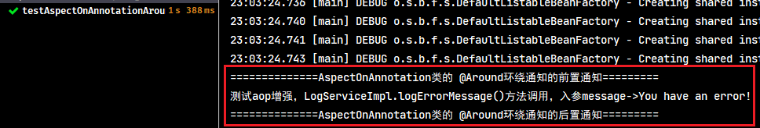
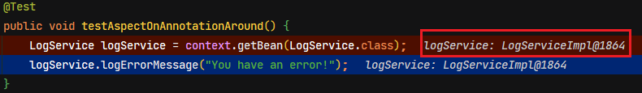
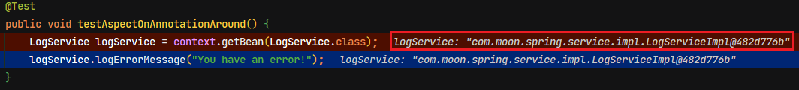
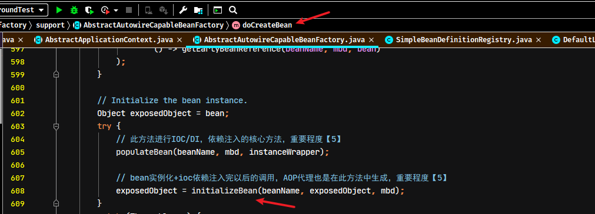
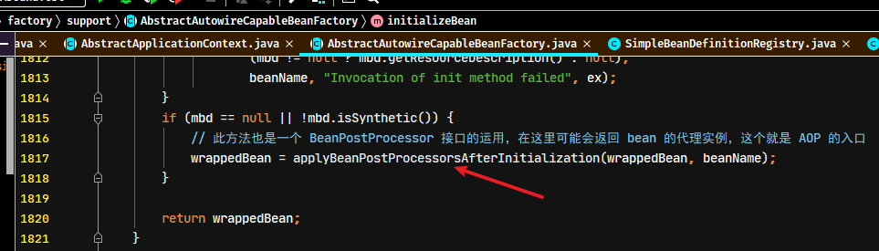
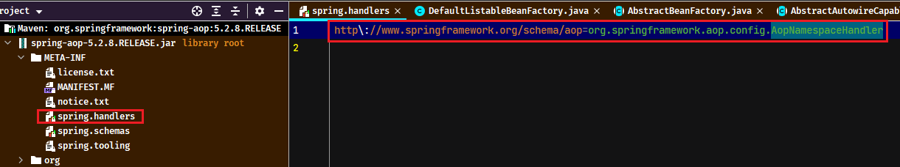
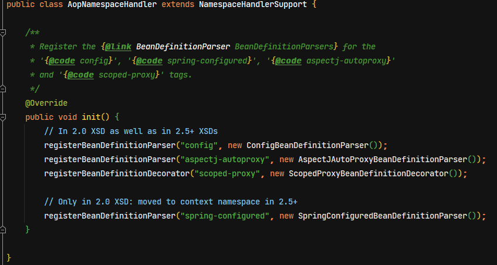
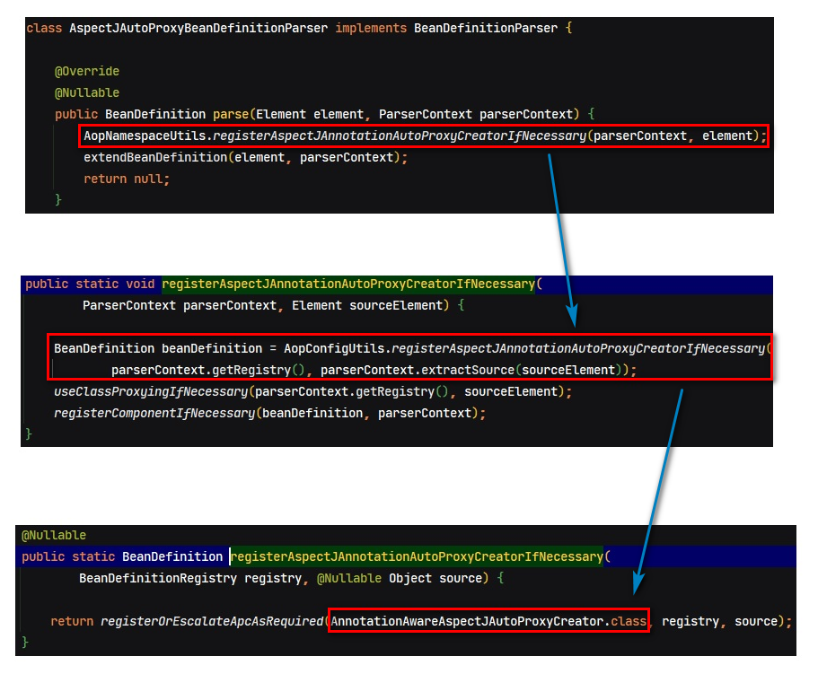
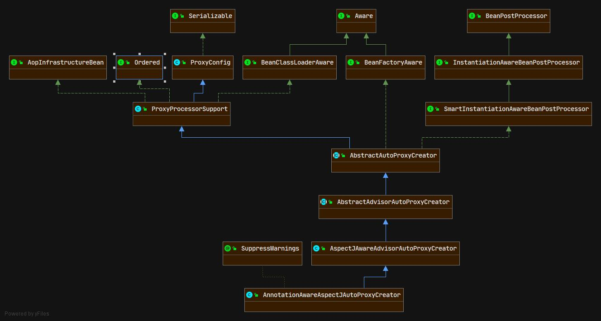

# Spring源码分析02-AOP

## 1. AOP 相关理论

### 1.1. 设计模式-代理模式

代理模式：给某一个对象提供一个代理对象，并由代理对象控制对源对象的引用。

代理模式可以并不知道真正的被代理对象，而仅仅持有一个被代理对象的接口，这时候代理对象不能够创建被代理对象，被代理对象必须有系统的其他角色代为创建并传入。

为什么要使用代理模式呢？

1. 它有间接的特点，可以起到中介隔离作用。减少耦合
2. 它有增强的功能。

> 代理模式示例代码详见：`spring-note\spring-analysis-note\spring-sample-annotation\20-spring-aop-proxy\`

### 1.2. AOP思想及实现原理

#### 1.2.1. AOP 思想

在软件业，AOP为Aspect Oriented Programming的缩写，意为：面向切面编程，通过预编译方式和运行期动态代理实现程序功能的统一维护的一种技术。AOP是OOP的延续，是软件开发中的一个热点，也是Spring框架中的一个重要内容，是函数式编程的一种衍生范型。利用AOP可以对业务逻辑的各个部分进行隔离，从而使得业务逻辑各部分之间的耦合度降低，提高程序的可重用性，同时提高了开发的效率。

#### 1.2.2. AOP 实现原理

实现原理是基于动态代理技术实现的。具体的两种实现方式分别是**基于接口的动态代理**和**基于子类的动态代理**，详见[01-Spring笔记02-AOP.md](#/02-后端框架/03-Spring/01-Spring笔记02-AOP)

#### 1.2.3. Spring中AOP的术语

详见[01-Spring笔记02-AOP.md](#/02-后端框架/03-Spring/01-Spring笔记02-AOP)

## 2. AOP 面向切面编程

### 2.1. 基于注解 AOP 基础使用

使用`@EnableAspectJAutoProxy`可以替代传统的xml配置文件中的`<aop:aspectj-autoproxy />`标签。**其作用都是开启Spring容器对AOP注解的支持**。

#### 2.1.1. 开启AOP支持

- 开启AOP注解支持配置类

```java
/**
 * 配置开启Spring容器的AOP注解支持
 */
@Configuration
/* 注解的方式开启AOP注解支持，相当于xml配置文件中的 <aop:aspectj-autoproxy/> 标签 */
@EnableAspectJAutoProxy(proxyTargetClass = false, exposeProxy = true)
public class AopConfig {
}
```

- 包扫描配置类

```java
@ComponentScan(basePackages = {"com.moon.spring"})
public class SpringConfig {
}
```

#### 2.1.2. AOP基础使用示例

- 准备测试的接口与实现类

```java
public interface LogService {
    String logErrorMessage(String message);
}

@Service
public class LogServiceImpl implements LogService {
    @Override
    public String logErrorMessage(String message) {
        System.out.println("测试aop增强，LogServiceImpl.logErrorMessage()方法调用，入参message->" + message);
        return "LogServiceImpl.logErrorMessage()返回：" + message;
    }
}
```

- 编写切面类，定义切入点与增强的方法

```java
package com.moon.spring.aop.aspectj;

import org.aspectj.lang.ProceedingJoinPoint;
import org.aspectj.lang.annotation.Around;
import org.aspectj.lang.annotation.Aspect;
import org.aspectj.lang.annotation.Pointcut;
import org.springframework.stereotype.Component;

/**
 * 基于注解的方式的AOP使用
 */
@Component
@Aspect // 声明此类是一个切面
public class AspectOnAnnotation {

    /*
     * @Pointcut注解标识定义切入点
     * execution(表达式)：表示拦截的位置（方法）
     *  表达式语法：execution([修饰符] 返回值类型 包名.类名.方法名(参数))
     */
    @Pointcut("execution(public * com.moon.spring.service.*.*(..))")
    public void pc1() {
    }

    /**
     * 环绕通知（增强）
     */
    @Around("pc1()")
    public Object aroudAdvice(ProceedingJoinPoint joinPoint) throws Throwable {
        System.out.println("==============AspectOnAnnotation类的 @Around环绕通知的前置通知=========");
        Object result = joinPoint.proceed();
        System.out.println("==============AspectOnAnnotation类的 @Around环绕通知的后置通知=========");
        return result;
    }
}
```

- 测试

```java
private final ApplicationContext context = new AnnotationConfigApplicationContext(SpringConfig.class);

/**
 * 基于注解方式的aop测试 - @Around环绕增强
 */
@Test
public void testAspectOnAnnotationAround() {
    LogService logService = context.getBean(LogService.class);
    logService.logErrorMessage("You have an error!");
}
```



#### 2.1.3. 移除配置类的`@Configuration`注解

以下测试如果移除配置类中的`@Configuration`注解，该类没有给spring管理，即`@EnableAspectJAutoProxy`注解不生效。此时测试方法可以看到从spring容器中拿到的是接口实现类实例本身




如果配置类上有的`@Configuration`注解，即`@EnableAspectJAutoProxy`注解生效。此时测试方法从spring容器中拿到的是接口的代理实例



### 2.2. 基于 xml 配置基础使用（暂无，待完善）


# Spring AOP 源码实现分析

## 1. AOP 源码入口位置

AOP的源码分析，因为AOP的实现是需要生成代理，因此可以推断AOP入口会是在Bean的实例化之后，

当一个bean实例化完成之后，就会判断是当前bean是否需要生成代理，所以aop的处理时机（入口）就在`AbstractAutowireCapableBeanFactory`类中`doCreateBean`方法中完成DI依赖注入以后，具体位置如下图：



`initializeBean()`方法中生成代理具体逻辑，具体位置如下图：



## 2. AOP 实现类的导入

### 2.1. 基于注解 AOP 实现类的导入

- 注解的扫描逻辑是：通过读取项目的配置类上的`@ComponentScan`注解，首先会扫描到`@Configuration`、`@Service`、`@Component`等注解，对标识这些注解的类进行收集并封装成BeanDefinition对象，再扫描到`@EnableAspectJAutoProxy`注解（其实是扫描该注解上的`@Import`注解）
- 通过扫描注解`@EnableAspectJAutoProxy(proxyTargetClass = false, exposeProxy = true)`注册了 AOP 入口类，入口是在`@Import(AspectJAutoProxyRegistrar.class)`注解中导入

```java
class AspectJAutoProxyRegistrar implements ImportBeanDefinitionRegistrar {

	/**
	 * Register, escalate, and configure the AspectJ auto proxy creator based on the value
	 * of the @{@link EnableAspectJAutoProxy#proxyTargetClass()} attribute on the importing
	 * {@code @Configuration} class.
	 */
	@Override
	public void registerBeanDefinitions(
			AnnotationMetadata importingClassMetadata, BeanDefinitionRegistry registry) {

		// 此方法注册了AOP入口类（AnnotationAwareAspectJAutoProxyCreator）
		AopConfigUtils.registerAspectJAnnotationAutoProxyCreatorIfNecessary(registry);

		// 判断是否有@EnableAspectJAutoProxy注解
		AnnotationAttributes enableAspectJAutoProxy =
				AnnotationConfigUtils.attributesFor(importingClassMetadata, EnableAspectJAutoProxy.class);
		if (enableAspectJAutoProxy != null) {
			/*
			 * 设置为true
			 * 1、目标对象实现了接口 – 使用CGLIB代理机制
			 * 2、目标对象没有接口(只有实现类) – 使用CGLIB代理机制
			 *
			 * 设置为false（默认值）
			 * 1、目标对象实现了接口 – 使用JDK动态代理机制(代理所有实现了的接口)
			 * 2、目标对象没有接口(只有实现类) – 使用CGLIB代理机制
			 */
			if (enableAspectJAutoProxy.getBoolean("proxyTargetClass")) {
				AopConfigUtils.forceAutoProxyCreatorToUseClassProxying(registry);
			}
			// 是否需要把代理对象暴露出来，简单来说是否需要把代理对象用ThreadLocal存起来，如需要则设置为true
			if (enableAspectJAutoProxy.getBoolean("exposeProxy")) {
				AopConfigUtils.forceAutoProxyCreatorToExposeProxy(registry);
			}
		}
	}
}
```

- 在`@Import`导入的`AspectJAutoProxyRegistrar`这个类中，注册了 AOP 入口类 `AnnotationAwareAspectJAutoProxyCreator`（*注：此类与xml配置方式开启AOP注解支持是同一个处理类*）。在此类中设置了`proxyTargetClass`与`exposeProxy`的两个属性

#### 2.1.1. `@EnableAspectJAutoProxy`的两个属性说明

|       属性名        |                                                                作用                                                                |    取值    |
| :----------------: | ---------------------------------------------------------------------------------------------------------------------------------- | ---------- |
| `proxyTargetClass` | 设置代理机制。指定是否采用cglib进行代理。默认值是false，表示使用jdk的代理                                                                | true/false |
|   `exposeProxy`    | 指定是否暴露代理对象，默认值是false。如果暴露则通过AopContext可以进行访问，简单来说是否需要把代理对象用`ThreadLocal`存起来，如需要则设置为true | true/false |

> `proxyTargetClass`属性注意事项说明：
>
> - 设置为true时，目标对象无论是否实现了接口，都使用CGLIB代理机制
> - 设置为false时，目标对象实现了接口，则使用JDK动态代理机制(代理所有实现了的接口)；没有实现接口（只有实现类），则使用CGLIB代理机制

### 2.2. 基于 xml 配置 AOP 实现类的导入

基于 xml 配置的方式导入aop实现类。从Spring解析xml自定义标签的流程可知，通过spring.handlers文件中找到aop自定义标签的解析初始化处理类`AopNamespaceHandler`





#### 2.2.1. 开启注解支持标签

`<aop:aspectj-autoproxy>`标签是开启注解支持。

```xml
<aop:aspectj-autoproxy proxy-target-class="false" expose-proxy="true"/>
```

通过源码分析知道，其相应的解析类是`AspectJAutoProxyBeanDefinitionParser`，方法会注册了`AnnotationAwareAspectJAutoProxyCreator`，是`AbstractAutoProxyCreator`的子类。*与基于注解导入的aop实现类是同一个*



比如声明aop配置`<aop:config>`，配置切入点、切面、增加通知等(!待补充)。通过源码可以看到，是注册`AspectJAwareAdvisorAutoProxyCreator.class`类，是`AbstractAutoProxyCreator`的子类

```xml
<!-- 待补充 -->
```

> **以上两个都是自定义标签解析，解析过程可参照 `<context:component-scan>` 标签解析过程。最终也是完成 AOP 入口类的注册。**

## 3. AOP注解执行过程及核心对象的分析

### 3.1. 加载 @EnableAspectJAutoproxy 注解

当spring扫描到`@EnableAspectJAutoProxy`注解时，会加载`AspectJAutoProxyRegistrar`的注册类。

```java
@Target(ElementType.TYPE)
@Retention(RetentionPolicy.RUNTIME)
@Documented
@Import(AspectJAutoProxyRegistrar.class) // 引入AOP注解开启注册类
public @interface EnableAspectJAutoProxy {
	/**
	 * 指定是否采用cglib进行代理。
	 *
	 * 设置为true
	 * 1、目标对象实现了接口 – 使用CGLIB代理机制
	 * 2、目标对象没有接口(只有实现类) – 使用CGLIB代理机制
	 *
	 * 设置为false（默认值）
	 * 1、目标对象实现了接口 – 使用JDK动态代理机制(代理所有实现了的接口)
	 * 2、目标对象没有接口(只有实现类) – 使用CGLIB代理机制
	 */
	boolean proxyTargetClass() default false;

	/**
	 * 指定是否暴露代理对象，如果暴露则通过AopContext可以进行访问
	 */
	boolean exposeProxy() default false;
}
```

### 3.2. AspectJAutoProxyRegistrar

`AspectJAutoProxyRegistrar`运行注册逻辑后，会往容器中注册`AnnotationAwareAspectJAutoProxyCreator`实例

### 3.3. AnnotationAwareAspectJAutoProxyCreator对象的分析

#### 3.3.1. 类视图



#### 3.3.2. 加载过程

1. 执行父类`AbstractAutoProxyCreator`中的`postProcessAfterInitialization()`方法

```java
@Override
public Object postProcessAfterInitialization(@Nullable Object bean, String beanName) {
	if (bean != null) {
		// 首先根据bean的class和name构建出key
		Object cacheKey = getCacheKey(bean.getClass(), beanName);
		if (!this.earlyProxyReferences.contains(cacheKey)) {
			// 判断是否需要包装成代理的（从方法名可以很容易看出意图）
			return wrapIfNecessary(bean, beanName, cacheKey);
		}
	}
	return bean;
}

/* 构建key */
protected Object getCacheKey(Class<?> beanClass, @Nullable String beanName) {
	if (StringUtils.hasLength(beanName)) {
		return (FactoryBean.class.isAssignableFrom(beanClass) ?
				BeanFactory.FACTORY_BEAN_PREFIX + beanName : beanName);
	}
	else {
		return beanClass;
	}
}
```

2. 判断是否需要增强或已经被增强过了

```java
/* 判断当前的bean对象是否需要增强或已经被增强过，需要则返回增加后对象，不需要则直接返回原对象 */
protected Object wrapIfNecessary(Object bean, String beanName, Object cacheKey) {
	// 判断该对象是否已经处理过了，返回原对象
	if (StringUtils.hasLength(beanName) && this.targetSourcedBeans.contains(beanName)) {
		return bean;
	}
	// 判断如不需要进行AOP增强，返回原对象
	if (Boolean.FALSE.equals(this.advisedBeans.get(cacheKey))) {
		return bean;
	}
	// 判断这个Bean是不是基础设施类，或者配置了跳过自动代理
	if (isInfrastructureClass(bean.getClass()) || shouldSkip(bean.getClass(), beanName)) {
		this.advisedBeans.put(cacheKey, Boolean.FALSE);
		return bean;
	}
	// 给当前的bean寻找advisor切面，如果这个bean有advice的话，则代表后面需要创建当前bean的代理。重要程度【5】
	// Create proxy if we have advice.
	Object[] specificInterceptors = getAdvicesAndAdvisorsForBean(bean.getClass(), beanName, null);
	// 判断获取到了要切面增强的方法，如果有，则需要针对这些需要增强的方法创建该bean的代理对象
	if (specificInterceptors != DO_NOT_PROXY) {
		this.advisedBeans.put(cacheKey, Boolean.TRUE);
		// 把被代理对象bean实例封装到SingletonTargetSource对象中
		Object proxy = createProxy(
				bean.getClass(), beanName, specificInterceptors, new SingletonTargetSource(bean));
		this.proxyTypes.put(cacheKey, proxy.getClass());
		return proxy;
	}
	this.advisedBeans.put(cacheKey, Boolean.FALSE);
	return bean;
}
```

3. 判断是否为基础类（通知类）

```java
/*
 * 判断是否为基础设施类，基础设施了不需要代理
 * 	Advisor、Advice、AopInfrastructureBean这3个类属于基础设施类。
 */
protected boolean isInfrastructureClass(Class<?> beanClass) {
	boolean retVal = Advice.class.isAssignableFrom(beanClass) ||
			Pointcut.class.isAssignableFrom(beanClass) ||
			Advisor.class.isAssignableFrom(beanClass) ||
			AopInfrastructureBean.class.isAssignableFrom(beanClass);
	if (retVal && logger.isTraceEnabled()) {
		logger.trace("Did not attempt to auto-proxy infrastructure class [" + beanClass.getName() + "]");
	}
	return retVal;
}
```

4. 获取增强的代码（在`AbstractAdvisorAutoProxyCreator`类实现`getAdvicesAndAdvisorsForBean()`抽象方法进行处理）

```java
@Override
@Nullable
protected Object[] getAdvicesAndAdvisorsForBean(
		Class<?> beanClass, String beanName, @Nullable TargetSource targetSource) {
	// 这里是找到合格的切面，返回一个对象数组
	List<Advisor> advisors = findEligibleAdvisors(beanClass, beanName);
	if (advisors.isEmpty()) {
		return DO_NOT_PROXY;
	}
	return advisors.toArray();
}

protected List<Advisor> findEligibleAdvisors(Class<?> beanClass, String beanName) {
	// 找到候选的切面,其实就是寻找有@Aspectj注解的过程，把工程中所有加上了此注解的类封装成Advisor返回
	List<Advisor> candidateAdvisors = findCandidateAdvisors();
	// 判断候选的切面是否作用在当前beanClass上面，就是一个匹配过程
	List<Advisor> eligibleAdvisors = findAdvisorsThatCanApply(candidateAdvisors, beanClass, beanName);
	extendAdvisors(eligibleAdvisors);
	if (!eligibleAdvisors.isEmpty()) {
		// 此方法是对有@Order@Priority等注解进行排序
		eligibleAdvisors = sortAdvisors(eligibleAdvisors);
	}
	return eligibleAdvisors;
}
```

5. 根据增强创建代理对象

```java
protected Object createProxy(Class<?> beanClass, @Nullable String beanName,
		@Nullable Object[] specificInterceptors, TargetSource targetSource) {
	if (this.beanFactory instanceof ConfigurableListableBeanFactory) {
		AutoProxyUtils.exposeTargetClass((ConfigurableListableBeanFactory) this.beanFactory, beanName, beanClass);
	}
	ProxyFactory proxyFactory = new ProxyFactory();
	proxyFactory.copyFrom(this);
	if (!proxyFactory.isProxyTargetClass()) {
		if (shouldProxyTargetClass(beanClass, beanName)) {
			proxyFactory.setProxyTargetClass(true);
		}
		else {
			evaluateProxyInterfaces(beanClass, proxyFactory);
		}
	}
	Advisor[] advisors = buildAdvisors(beanName, specificInterceptors);
	proxyFactory.addAdvisors(advisors);
	proxyFactory.setTargetSource(targetSource);
	customizeProxyFactory(proxyFactory);
	proxyFactory.setFrozen(this.freezeProxy);
	if (advisorsPreFiltered()) {
		proxyFactory.setPreFiltered(true);
	}
	return proxyFactory.getProxy(getProxyClassLoader());
}
```

#### 3.3.3. 加载过程总结

1. 首先进行创建cacheKey
2. 判断是否已经处理过了
3. 判断是不是不需要增强
4. 判断是不是基础设施类或者是不是需要跳过的bean
5. 获取增强器
6. 根据增强器进行创建代理对象

### 3.4. 解析切入点表达式的加载流程(!待整理)

spring在解析切入点表达式时，是通过一些类进行封装的。此实现类`PointcutImpl`实现了`Pointcut`接口。

- 如果使用`@Pointcut`注解的话，则会将切入点表达式封装到`PointcutImpl`类中，此类实现Spring框架的`Pointcut`接口。
- 如果没有使用`@Pointcut`注解的话，则会将切入点表达式封装到`KindedPointcut`类中，此类继承了aspectjweaver依赖包下`Pointcut`抽象类

*注：`PointcutImpl`与`KindedPointcut`是在`org.aspectj.aspectjweaver`的依赖包下*

### 3.5. 解析通知注解

#### 3.5.1. 初始化通知注解的Map(!待整理)

首先在执行初始化时容器创建时，spring框架把和通知相关的注解都放到一个受保护的内部类中了。

```java
public abstract class AbstractAspectJAdvisorFactory implements AspectJAdvisorFactory {
    // 类中的其他代码略
    /*
     * 在protected权限的内部类中，在静态代码块中定义着和通知类型相关的注解。
     */
    protected static class AspectJAnnotation<A extends Annotation> {
    	private static final String[] EXPRESSION_ATTRIBUTES = new String[] {"pointcut", "value"};
    	private static Map<Class<?>, AspectJAnnotationType> annotationTypeMap = new HashMap<>(8);
    	static {
    		annotationTypeMap.put(Pointcut.class, AspectJAnnotationType.AtPointcut);
    		annotationTypeMap.put(Around.class, AspectJAnnotationType.AtAround);
    		annotationTypeMap.put(Before.class, AspectJAnnotationType.AtBefore);
    		annotationTypeMap.put(After.class, AspectJAnnotationType.AtAfter);
    		annotationTypeMap.put(AfterReturning.class, AspectJAnnotationType.AtAfterReturning);
    		annotationTypeMap.put(AfterThrowing.class, AspectJAnnotationType.AtAfterThrowing);
    	}
    	// 内部类的其余代码略
	}
    // 类中的其他代码略
}
```

#### 3.5.2. 构建通知的拦截器链(!待整理)

## 4. 代理生成逻辑

`initializeBean` 方法是一个 bean 实例化完成后做的操作，而这个代理实例生成也是在 bean 实例化完成后做的操作。在`applyBeanPostProcessorsAfterInitialization`方法中，又是一个 `BeanPostProcessor` 接口的运用，处理代码如下：

```java
@Override
public Object applyBeanPostProcessorsAfterInitialization(Object existingBean, String beanName)
		throws BeansException {

	Object result = existingBean;
	/*
	 * 这里又是BeanPostProcessor接口的运用，这里主要理解以下实现类
	 * 	1、AbstractAutoProxyCreator 主要处理AOP代理生成的逻辑
	 *  2、ApplicationListenerDetector 主要将所有实现ApplicationListener接口的事件监听类加入到监听集合中
	 */
	for (BeanPostProcessor processor : getBeanPostProcessors()) {
		Object current = processor.postProcessAfterInitialization(result, beanName);
		if (current == null) {
			return result;
		}
		result = current;
	}
	return result;
}
```

AOP的核心逻辑代码在`BeanPostProcessor`接口现实类`AbstractAutoProxyCreator`中

```java
@Override
public Object postProcessAfterInitialization(@Nullable Object bean, String beanName) {
	if (bean != null) {
		// 首先根据bean的class和name构建缓存中的key
		Object cacheKey = getCacheKey(bean.getClass(), beanName);
		// 根据缓存key从代理缓存中获取代理实例，并判断是否与当前创建中的实例是否是同一个
		if (this.earlyProxyReferences.remove(cacheKey) != bean) {
			// 判断是否需要包装成代理的（从方法名可以很容易看出意图）
			return wrapIfNecessary(bean, beanName, cacheKey);
		}
	}
	return bean;
}

protected Object wrapIfNecessary(Object bean, String beanName, Object cacheKey) {
	if (StringUtils.hasLength(beanName) && this.targetSourcedBeans.contains(beanName)) {
		return bean;
	}
	if (Boolean.FALSE.equals(this.advisedBeans.get(cacheKey))) {
		return bean;
	}
	if (isInfrastructureClass(bean.getClass()) || shouldSkip(bean.getClass(), beanName)) {
		this.advisedBeans.put(cacheKey, Boolean.FALSE);
		return bean;
	}
	// 给当前的bean寻找advisor切面，如果这个bean有advice的话，则代表后面需要创建当前bean的代理。重要程度【5】
	// Create proxy if we have advice.
	Object[] specificInterceptors = getAdvicesAndAdvisorsForBean(bean.getClass(), beanName, null);
	// 判断如果有切面，则生成该bean的代理
	if (specificInterceptors != DO_NOT_PROXY) {
		this.advisedBeans.put(cacheKey, Boolean.TRUE);
		// 把被代理对象bean实例封装到SingletonTargetSource对象中
		Object proxy = createProxy(
				bean.getClass(), beanName, specificInterceptors, new SingletonTargetSource(bean));
		this.proxyTypes.put(cacheKey, proxy.getClass());
		return proxy;
	}
	this.advisedBeans.put(cacheKey, Boolean.FALSE);
	return bean;
}
```

上面的的`getAdvicesAndAdvisorsForBean()`方法，就是判断当前bean是否有切面advisor，如果有切面则会执行到`createProxy()`方法，生成代理对象然后返回

```java
@Override
@Nullable
protected Object[] getAdvicesAndAdvisorsForBean(
		Class<?> beanClass, String beanName, @Nullable TargetSource targetSource) {
	// 这里是找到合格的切面，返回一个对象数组
	List<Advisor> advisors = findEligibleAdvisors(beanClass, beanName);
	if (advisors.isEmpty()) {
		return DO_NOT_PROXY;
	}
	return advisors.toArray();
}


protected List<Advisor> findEligibleAdvisors(Class<?> beanClass, String beanName) {
	// 找到候选的切面,其实就是寻找有@Aspectj注解的过程，把工程中所有加上了此注解的类封装成Advisor返回
	List<Advisor> candidateAdvisors = findCandidateAdvisors();
	// 判断候选的切面是否作用在当前beanClass上面，就是一个匹配过程
	List<Advisor> eligibleAdvisors = findAdvisorsThatCanApply(candidateAdvisors, beanClass, beanName);
	extendAdvisors(eligibleAdvisors);
	if (!eligibleAdvisors.isEmpty()) {
		// 此方法是对有@Order@Priority等注解进行排序
		eligibleAdvisors = sortAdvisors(eligibleAdvisors);
	}
	return eligibleAdvisors;
}
```
