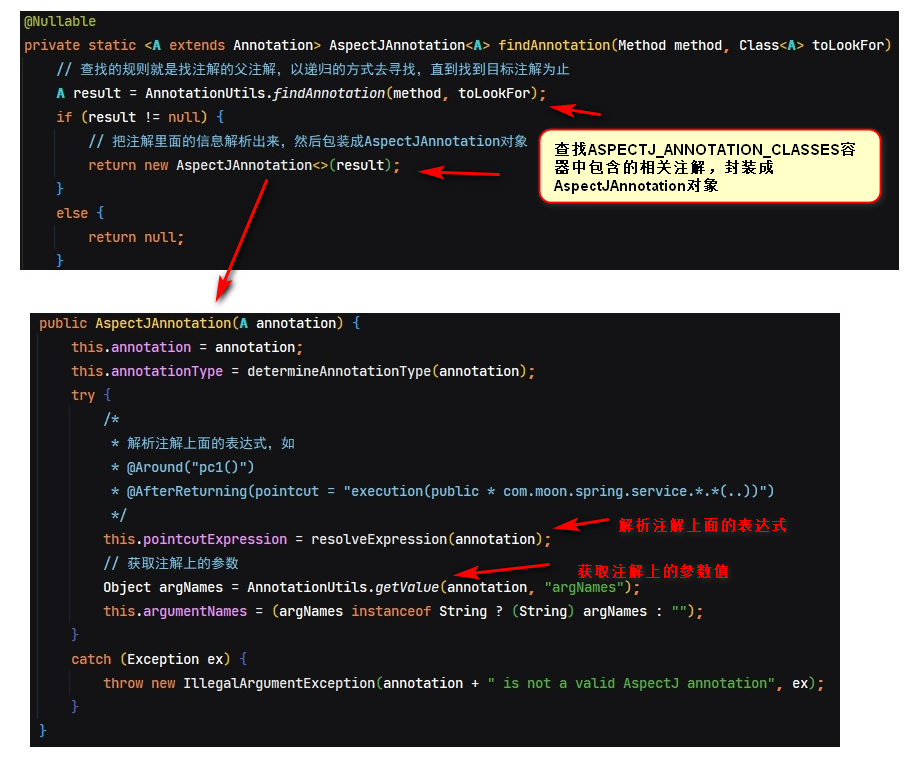
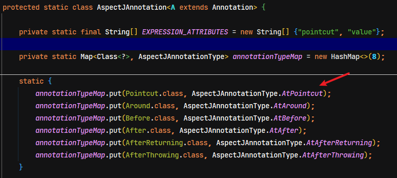
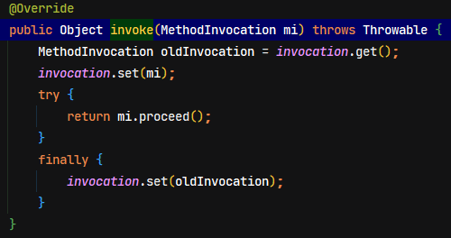

# Spring源码分析02-AOP

## 1. AOP 相关理论

### 1.1. 设计模式-代理模式

代理模式：给某一个对象提供一个代理对象，并由代理对象控制对源对象的引用。

代理模式可以并不知道真正的被代理对象，而仅仅持有一个被代理对象的接口，这时候代理对象不能够创建被代理对象，被代理对象必须有系统的其他角色代为创建并传入。

为什么要使用代理模式呢？

1. 它有间接的特点，可以起到中介隔离作用。减少耦合
2. 它有增强的功能。

> 代理模式示例代码详见：`spring-note\spring-analysis-note\spring-sample-annotation\20-spring-aop-proxy\`

### 1.2. AOP思想及实现原理

#### 1.2.1. AOP 思想

在软件业，AOP为Aspect Oriented Programming的缩写，意为：面向切面编程，通过预编译方式和运行期动态代理实现程序功能的统一维护的一种技术。AOP是OOP的延续，是软件开发中的一个热点，也是Spring框架中的一个重要内容，是函数式编程的一种衍生范型。利用AOP可以对业务逻辑的各个部分进行隔离，从而使得业务逻辑各部分之间的耦合度降低，提高程序的可重用性，同时提高了开发的效率。

#### 1.2.2. AOP 实现原理

实现原理是基于动态代理技术实现的。具体的两种实现方式分别是**基于接口的动态代理**和**基于子类的动态代理**，详见[01-Spring笔记02-AOP.md](#/02-后端框架/03-Spring/01-Spring笔记02-AOP)

#### 1.2.3. Spring中AOP的术语

详见[01-Spring笔记02-AOP.md](#/02-后端框架/03-Spring/01-Spring笔记02-AOP)

## 2. AOP 面向切面编程

### 2.1. 基于注解 AOP 基础使用

使用`@EnableAspectJAutoProxy`可以替代传统的xml配置文件中的`<aop:aspectj-autoproxy />`标签。**其作用都是开启Spring容器对AOP注解的支持**。

#### 2.1.1. 开启AOP支持

- 开启AOP注解支持配置类

```java
/**
 * 配置开启Spring容器的AOP注解支持
 */
@Configuration
/* 注解的方式开启AOP注解支持，相当于xml配置文件中的 <aop:aspectj-autoproxy/> 标签 */
@EnableAspectJAutoProxy(proxyTargetClass = false, exposeProxy = true)
public class AopConfig {
}
```

- 包扫描配置类

```java
@ComponentScan(basePackages = {"com.moon.spring"})
public class SpringConfig {
}
```

#### 2.1.2. AOP基础使用示例

- 准备测试的接口与实现类

```java
public interface LogService {
    String logErrorMessage(String message);
}

@Service
public class LogServiceImpl implements LogService {
    @Override
    public String logErrorMessage(String message) {
        System.out.println("测试aop增强，LogServiceImpl.logErrorMessage()方法调用，入参message->" + message);
        return "LogServiceImpl.logErrorMessage()返回：" + message;
    }
}
```

- 编写切面类，定义切入点与增强的方法

```java
package com.moon.spring.aop.aspectj;

import org.aspectj.lang.ProceedingJoinPoint;
import org.aspectj.lang.annotation.Around;
import org.aspectj.lang.annotation.Aspect;
import org.aspectj.lang.annotation.Pointcut;
import org.springframework.stereotype.Component;

/**
 * 基于注解的方式的AOP使用
 */
@Component
@Aspect // 声明此类是一个切面
public class AspectOnAnnotation {

    /*
     * @Pointcut注解标识定义切入点
     * execution(表达式)：表示拦截的位置（方法）
     *  表达式语法：execution([修饰符] 返回值类型 包名.类名.方法名(参数))
     */
    @Pointcut("execution(public * com.moon.spring.service.*.*(..))")
    public void pc1() {
    }

    /**
     * 环绕通知（增强）
     */
    @Around("pc1()")
    public Object aroudAdvice(ProceedingJoinPoint joinPoint) throws Throwable {
        System.out.println("==============AspectOnAnnotation类的 @Around环绕通知的前置通知=========");
        Object result = joinPoint.proceed();
        System.out.println("==============AspectOnAnnotation类的 @Around环绕通知的后置通知=========");
        return result;
    }
}
```

- 测试

```java
private final ApplicationContext context = new AnnotationConfigApplicationContext(SpringConfig.class);

/**
 * 基于注解方式的aop测试 - @Around环绕增强
 */
@Test
public void testAspectOnAnnotationAround() {
    LogService logService = context.getBean(LogService.class);
    logService.logErrorMessage("You have an error!");
}
```


#### 2.1.3. 移除配置类的`@Configuration`注解

以下测试如果移除配置类中的`@Configuration`注解，该类没有给spring管理，即`@EnableAspectJAutoProxy`注解不生效。此时测试方法可以看到从spring容器中拿到的是接口实现类实例本身


如果配置类上有的`@Configuration`注解，即`@EnableAspectJAutoProxy`注解生效。此时测试方法从spring容器中拿到的是接口的代理实例


### 2.2. 基于 xml 配置基础使用

> 因现在项目基本上都基于注解实现aop功能，所以不整理示例源码，具体可详见`spring-source-study-2021/24-spring-xml-aop`项目，或《01-Spring笔记02-AOP.md》

# Spring AOP 源码实现分析

## 1. AOP 源码入口位置

AOP的源码分析，因为AOP的实现是需要生成代理，因此可以推断AOP入口会是在Bean的实例化之后。当一个bean实例化完成之后，就会判断是当前bean是否需要生成代理，所以aop的处理时机（入口）就在`AbstractAutowireCapableBeanFactory`类中`doCreateBean`方法中完成DI依赖注入以后，具体位置如下图：


`initializeBean()`方法中生成代理具体逻辑，具体位置如下图：


## 2. 基于 xml 配置 AOP 实现类的导入（了解）

基于 xml 配置的方式导入aop实现类。从Spring解析xml自定义标签的流程可知，通过spring.handlers文件中找到aop自定义标签的解析初始化处理类`AopNamespaceHandler`


### 2.1. 开启注解支持标签

`<aop:aspectj-autoproxy>`标签是开启注解支持。

```xml
<aop:aspectj-autoproxy proxy-target-class="false" expose-proxy="true"/>
```

通过源码分析知道，其相应的解析类是`AspectJAutoProxyBeanDefinitionParser`，方法会注册了`AnnotationAwareAspectJAutoProxyCreator`，是`AbstractAutoProxyCreator`的子类。*与基于注解导入的aop实现类是同一个*


### 2.2. 声明aop配置标签

`<aop:config>`标签声明aop配置，配置切入点、切面、增加通知等。通过源码分析知道，其相应的解析类是`ConfigBeanDefinitionParser`，方法是注册`AspectJAwareAdvisorAutoProxyCreator`类，是`AbstractAutoProxyCreator`的子类

> 基于xml配置声明aop的示例详见`spring-source-study-2021/24-spring-xml-aop`项目，或《01-Spring笔记02-AOP.md》
>
> **以上两个都是自定义标签解析，解析过程可参照 `<context:component-scan>` 标签解析过程。最终也是完成 AOP 入口类的注册。**

## 3. 基于注解配置 AOP 实现类导入

### 3.1. 加载 @EnableAspectJAutoproxy 注解

在Spring工程的配置类上标识`@EnableAspectJAutoproxy`注解，即开启Spring AOP注解的支持

```java
@Configuration
/* 注解的方式开启AOP注解支持，相当于xml配置文件中的 <aop:aspectj-autoproxy/> 标签 */
@EnableAspectJAutoProxy(proxyTargetClass = false, exposeProxy = true)
public class AopConfig {
}
```

当spring扫描到`@EnableAspectJAutoProxy`注解时，会加载通过`@Import`注解导入的`AspectJAutoProxyRegistrar`的注册类。

```java
@Target(ElementType.TYPE)
@Retention(RetentionPolicy.RUNTIME)
@Documented
@Import(AspectJAutoProxyRegistrar.class) // 引入AOP注解开启注册类
public @interface EnableAspectJAutoProxy {
	/**
	 * 指定是否采用cglib进行代理。
	 *
	 * 设置为true时，目标对象无论是否实现了接口，都使用CGLIB代理机制
	 * 设置为false时（默认值）
	 * 1、目标对象实现了接口，则使用JDK动态代理机制(代理所有实现了的接口)；
	 * 2、目标对象没有实现接口（只有实现类），则使用CGLIB代理机制
	 */
	boolean proxyTargetClass() default false;

	/**
	 * 指定是否暴露代理对象，如果暴露则通过AopContext可以进行访问
	 */
	boolean exposeProxy() default false;
}
```

### 3.2. AspectJAutoProxyRegistrar 注册基于注解AOP实现类

`AspectJAutoProxyRegistrar`运行注册逻辑后，会往容器中注册`AnnotationAwareAspectJAutoProxyCreator`实例。

#### 3.2.1. 注解开启AOP

- 注解的扫描逻辑是：通过读取项目的配置类上的`@ComponentScan`注解，首先会扫描到`@Configuration`、`@Service`、`@Component`等注解，对标识这些注解的类进行收集并封装成BeanDefinition对象，再扫描到`@EnableAspectJAutoProxy`注解（其实是扫描该注解上的`@Import`注解）
- 通过扫描注解`@EnableAspectJAutoProxy(proxyTargetClass = false, exposeProxy = true)`注册了 AOP 入口类，入口是在`@Import(AspectJAutoProxyRegistrar.class)`注解中导入

```java
class AspectJAutoProxyRegistrar implements ImportBeanDefinitionRegistrar {

	/**
	 * Register, escalate, and configure the AspectJ auto proxy creator based on the value
	 * of the @{@link EnableAspectJAutoProxy#proxyTargetClass()} attribute on the importing
	 * {@code @Configuration} class.
	 */
	@Override
	public void registerBeanDefinitions(
			AnnotationMetadata importingClassMetadata, BeanDefinitionRegistry registry) {

		// 此方法注册了AOP入口类（AnnotationAwareAspectJAutoProxyCreator）
		AopConfigUtils.registerAspectJAnnotationAutoProxyCreatorIfNecessary(registry);

		// 判断是否有@EnableAspectJAutoProxy注解
		AnnotationAttributes enableAspectJAutoProxy =
				AnnotationConfigUtils.attributesFor(importingClassMetadata, EnableAspectJAutoProxy.class);
		if (enableAspectJAutoProxy != null) {
			/*
			 * 设置为true时，目标对象无论是否实现了接口，都使用CGLIB代理机制
			 * 设置为false时（默认值）
			 * 	1、目标对象实现了接口，则使用JDK动态代理机制(代理所有实现了的接口)；
			 * 	2、目标对象没有实现接口（只有实现类），则使用CGLIB代理机制
			 */
			if (enableAspectJAutoProxy.getBoolean("proxyTargetClass")) {
				AopConfigUtils.forceAutoProxyCreatorToUseClassProxying(registry);
			}
			// 是否需要把代理对象暴露出来，简单来说是否需要把代理对象用ThreadLocal存起来，如需要则设置为true
			if (enableAspectJAutoProxy.getBoolean("exposeProxy")) {
				AopConfigUtils.forceAutoProxyCreatorToExposeProxy(registry);
			}
		}
	}
}
```


- 在`AspectJAutoProxyRegistrar`类中，注册了 AOP 入口类 `AnnotationAwareAspectJAutoProxyCreator`（*注：此类与xml配置方式开启AOP注解支持是同一个处理类*）。同时也在此类中设置了`proxyTargetClass`与`exposeProxy`的两个属性

> 番外：`@Import(AspectJAutoProxyRegistrar.class)`导入的这个类中，注册了AOP入口类`AnnotationAwareAspectJAutoProxyCreator`，并且设置了两个属性，至于`AspectJAutoProxyRegistrar`中的`registerBeanDefinitions`方法是如何调到的，参考前面Spring源码分析的`@Import`注解解析章节

#### 3.2.2. @EnableAspectJAutoProxy 的两个属性说明

|       属性名        |                                                                作用                                                                |    取值    |
| :----------------: | ---------------------------------------------------------------------------------------------------------------------------------- | ---------- |
| `proxyTargetClass` | 设置代理机制。指定是否采用cglib进行代理。默认值是false，表示使用jdk的代理                                                                | true/false |
|   `exposeProxy`    | 指定是否暴露代理对象，默认值是false。如果暴露则通过AopContext可以进行访问，简单来说是否需要把代理对象用`ThreadLocal`存起来，如需要则设置为true | true/false |

> `proxyTargetClass`属性注意事项说明：
>
> - 设置为true时，目标对象无论是否实现了接口，都使用CGLIB代理机制
> - 设置为false时，目标对象实现了接口，则使用JDK动态代理机制(代理所有实现了的接口)；没有实现接口（只有实现类），则使用CGLIB代理机制

## 4. AOP 执行过程及核心对象导入的分析

### 4.1. applyBeanPostProcessorsAfterInitialization AOP 处理入口

在`AbstractAutowireCapableBeanFactory`类中的`doCreateBean`方法，其中执行`initializeBean`方法是一个 bean 实例化完成后做的操作，而这个代理实例生成也是在 bean 实例化完成后做的操作。在`applyBeanPostProcessorsAfterInitialization`方法中，又是一个 `BeanPostProcessor` 接口的运用，处理代码如下：

```java
@Override
public Object applyBeanPostProcessorsAfterInitialization(Object existingBean, String beanName)
		throws BeansException {

	Object result = existingBean;
	/*
	 * 这里又是BeanPostProcessor接口的运用，这里主要理解以下实现类
	 * 	1、AbstractAutoProxyCreator 主要处理AOP代理生成的逻辑
	 *  2、ApplicationListenerDetector 主要将所有实现ApplicationListener接口的事件监听类加入到监听集合中
	 */
	for (BeanPostProcessor processor : getBeanPostProcessors()) {
		Object current = processor.postProcessAfterInitialization(result, beanName);
		if (current == null) {
			return result;
		}
		result = current;
	}
	return result;
}
```

### 4.2. AbstractAutoProxyCreator

切面由切点和增强（引介）组成，它既包括了横切逻辑的定义，也包括了连接点的定义，Spring AOP 就是负责实施切面的框架，它将切面所定义的横切逻辑织入到切面所指定的连接点中。`Advisor = pointCut + advice`

- AOP的核心逻辑代码在`BeanPostProcessor`接口现实类`AbstractAutoProxyCreator`中。执行父类`AbstractAutoProxyCreator`中的`postProcessAfterInitialization()`方法

```java
@Override
public Object postProcessAfterInitialization(@Nullable Object bean, String beanName) {
	if (bean != null) {
		// 首先根据bean的class和name构建缓存中的key
		Object cacheKey = getCacheKey(bean.getClass(), beanName);
		// 根据缓存key从代理缓存中获取代理实例，并判断是否与当前创建中的实例是否是同一个
		if (this.earlyProxyReferences.remove(cacheKey) != bean) {
			// 判断是否需要包装成代理的（从方法名可以很容易看出意图）
			return wrapIfNecessary(bean, beanName, cacheKey);
		}
	}
	return bean;
}
```

- 获取Aop代理缓存中的key

```java
/* 构建key */
protected Object getCacheKey(Class<?> beanClass, @Nullable String beanName) {
	if (StringUtils.hasLength(beanName)) {
		return (FactoryBean.class.isAssignableFrom(beanClass) ?
				BeanFactory.FACTORY_BEAN_PREFIX + beanName : beanName);
	}
	else {
		return beanClass;
	}
}
```

### 4.3. wrapIfNecessary 判断是否需要增强

- 判断当前实例是否需要增强或已经被增强过了

```java
/* 判断当前的bean对象是否需要增强或已经被增强过，需要则返回增加后对象，不需要则直接返回原对象 */
protected Object wrapIfNecessary(Object bean, String beanName, Object cacheKey) {
	// 判断该对象是否已经处理过了，返回原对象
	if (StringUtils.hasLength(beanName) && this.targetSourcedBeans.contains(beanName)) {
		return bean;
	}
	// 判断如不需要进行AOP增强，返回原对象
	if (Boolean.FALSE.equals(this.advisedBeans.get(cacheKey))) {
		return bean;
	}
	// 判断这个Bean是不是基础设施类，或者配置了跳过自动代理
	if (isInfrastructureClass(bean.getClass()) || shouldSkip(bean.getClass(), beanName)) {
		this.advisedBeans.put(cacheKey, Boolean.FALSE);
		return bean;
	}

	// 给当前的bean寻找advisor切面，如果这个bean有advice的话，则代表后面需要创建当前bean的代理。重要程度【5】
	// Create proxy if we have advice.
	Object[] specificInterceptors = getAdvicesAndAdvisorsForBean(bean.getClass(), beanName, null);
	// 判断获取到了要切面增强的方法，如果有，则需要针对这些需要增强的方法创建该bean的代理对象
	if (specificInterceptors != DO_NOT_PROXY) {
		this.advisedBeans.put(cacheKey, Boolean.TRUE);
		// 把被代理对象bean实例封装到SingletonTargetSource对象中
		Object proxy = createProxy(
				bean.getClass(), beanName, specificInterceptors, new SingletonTargetSource(bean));
		this.proxyTypes.put(cacheKey, proxy.getClass());
		return proxy;
	}

	// 代码执行到这里，代表当前bean对象不需要生成代理，所以在这里设置了标识
	this.advisedBeans.put(cacheKey, Boolean.FALSE);
	return bean;
}
```

- 判断是否为基础类（通知类）

```java
/*
 * 判断是否为基础设施类，基础设施了不需要代理
 * 	Advisor、Advice、AopInfrastructureBean这3个类属于基础设施类。
 */
protected boolean isInfrastructureClass(Class<?> beanClass) {
	boolean retVal = Advice.class.isAssignableFrom(beanClass) ||
			Pointcut.class.isAssignableFrom(beanClass) ||
			Advisor.class.isAssignableFrom(beanClass) ||
			AopInfrastructureBean.class.isAssignableFrom(beanClass);
	if (retVal && logger.isTraceEnabled()) {
		logger.trace("Did not attempt to auto-proxy infrastructure class [" + beanClass.getName() + "]");
	}
	return retVal;
}
```

### 4.4. getAdvicesAndAdvisorsForBean 获取增强器

获取增强的代码。在`AbstractAdvisorAutoProxyCreator`类实现`getAdvicesAndAdvisorsForBean()`抽象方法进行处理。就是判断当前bean是否有切面advisor，如果有切面则后面会执行到`createProxy()`方法，生成代理对象然后返回

```java
@Override
@Nullable
protected Object[] getAdvicesAndAdvisorsForBean(
		Class<?> beanClass, String beanName, @Nullable TargetSource targetSource) {
	// 这里是找到合格的切面，返回一个对象数组
	List<Advisor> advisors = findEligibleAdvisors(beanClass, beanName);
	if (advisors.isEmpty()) {
		return DO_NOT_PROXY;
	}
	return advisors.toArray();
}
```

### 4.5. findEligibleAdvisors 匹配候选切面封装成Advisor

`findEligibleAdvisors`方法，主要是一个匹配当前实例是否有合格的切面，并且封装成`Advisor`的过程

```java
protected List<Advisor> findEligibleAdvisors(Class<?> beanClass, String beanName) {
	// 找到候选的切面，其实就是寻找有@Aspectj注解的过程，把工程中所有加上了此注解的类封装成Advisor返回
	List<Advisor> candidateAdvisors = findCandidateAdvisors();
	// 判断候选的切面是否作用在当前beanClass上面，就是一个匹配过程
	List<Advisor> eligibleAdvisors = findAdvisorsThatCanApply(candidateAdvisors, beanClass, beanName);
	// 针对@Aspect注解切面添加了一个默认的切面 DefaultPointcutAdvisor
	extendAdvisors(eligibleAdvisors);
	if (!eligibleAdvisors.isEmpty()) {
		// 此方法是对有@Order、@Priority等注解进行排序
		eligibleAdvisors = sortAdvisors(eligibleAdvisors);
	}
	return eligibleAdvisors;
}
```

### 4.6. findCandidateAdvisors 寻找合格切面的过程

#### 4.6.1. 定义切面的两种方式

匹配候选切面的首先是寻找有`@Aspectj`注解或者实现`Advisor`接口的类，进行处理封装成`Advisor`返回。相应的处理会先调用AOP入口实现类`AnnotationAwareAspectJAutoProxyCreator`重写的`findCandidateAdvisors`方法

```java
@Override
protected List<Advisor> findCandidateAdvisors() {
	// Add all the Spring advisors found according to superclass rules.
	// 调用父类AbstractAdvisorAutoProxyCreator的方法，找到所有直接实现了Advisor接口的实例
	List<Advisor> advisors = super.findCandidateAdvisors();
	// Build Advisors for all AspectJ aspects in the bean factory.
	if (this.aspectJAdvisorsBuilder != null) {
		// 重点关注`buildAspectJAdvisors`方法，此方法主要作用是创建候选的切面，即对@Aspect注解的类进行处理
		advisors.addAll(this.aspectJAdvisorsBuilder.buildAspectJAdvisors());
	}
	return advisors;
}
```

从上面源码可行，定义Spring切面的两种方式

- 编写类实现`Advisor`接口，并且在类里定义pointCut和advice。源码匹配的方法位置如下：

```java
List<Advisor> advisors = super.findCandidateAdvisors();
```

- 标识`@Aspectj`注解的类，Spring具体处理是：会解析有`@Aspectj`的类，然后再解析类中标识了`@Aroud`、`@Before`等注解的方法，创建advice对象，通过注解中配置的value值创建pointCut对象，最终根据advice对象和pointCut对象创建`Advisor`对象实例。源码处理方法位置如下：

```java
this.aspectJAdvisorsBuilder.buildAspectJAdvisors()
```

#### 4.6.2. 查找实现 Advisor 接口的切面

先调用父类`AbstractAdvisorAutoProxyCreator`的逻辑，通过分析父类的方法的逻辑可知，Spring会收集所有实现`Advisor`接口的实例，所以可以<font color=red>**通过实现`Advisor`接口来自定义一些切面实现，这种方式实现的切面也会被Spring收集与管理**</font>


#### 4.6.3. 查找标识 @Aspect 注解的切面

接下来在调用`BeanFactoryAspectJAdvisorsBuilder.buildAspectJAdvisors()`方法，处理匹配`@Aspect`注解的切面类。此方法的处理逻辑如下：

- 获取 spring 容器中的所有 bean 的名称 `BeanName` 的数组


- 循环遍历 `BeanNames` 数组，判断该类上面是否有`@Aspect`注解，如果有则为需要处理的实例，添加到 `aspectNames` 集合中。


- 将标识了`@Aspect`注解的单个beanName包装成`MetadataAwareAspectInstanceFactory`工厂对象，然后通过`getAdvisors`方法获取与创建当前实例中所有切面`Advisor`集合。(注：一个bean当中可能有多个`Advisor`，单个`Advisor`是由`poinCut`和`advice`组成，因此每个bean对应的都是一个`Advisors`集合)


- 重点分析`ReflectiveAspectJAdvisorFactory.getAdvisors`方法。该方法主要作用是创建切面`Advisor`对象，主要处理流程是：循环单个Bean实例里面所有方法，通过`getAdvisorMethods(aspectClass)`方法获取除了`@PointCut`注解的其他所有方法，判断当前方法上面的注解是否有标识`@Around`、`@Before`、`@After`、`@AfterReturning`、`@AfterThrowing`等的注解，如果包含在这些注解之中，就把注解里面的信息，比如表达式、argNames、注解类型等信息封装成`AspectJAnnotation`对象

1. 从工厂中获取有`@Aspect`注解的类Class
2. 从工厂中获取有`@Aspect`注解的类的名称
3. 创建工厂的装饰类，获取实例只会获取一次


4. 从上面包装的工厂中获取对应的带`@Aspect`注解的单个实例的`Class`对象，遍历这个`aspectClass`对象中的所有没有被`@Pointcut`注解标注的方法，然后把收集到的方法进行过滤


```java
private List<Method> getAdvisorMethods(Class<?> aspectClass) {
	final List<Method> methods = new ArrayList<>();
	ReflectionUtils.doWithMethods(aspectClass, method -> {
		// Exclude pointcuts
		// 这里判断没有@Pointcut注解的方法
		if (AnnotationUtils.getAnnotation(method, Pointcut.class) == null) {
			methods.add(method);
		}
	}, ReflectionUtils.USER_DECLARED_METHODS);
	if (methods.size() > 1) {
		// 按照注解先后顺序+自然顺序排序
		methods.sort(METHOD_COMPARATOR);
	}
	return methods;
}
```

5. 核心处理逻辑方法`getAdvisor`，循环遍历没有`@Pointcut`注解的方法，并且把每个方法组装成`Advisor`对象：


```java
/* 参数 candidateAdviceMethod 是候选的Advice方法，候选的增强方法 */
@Override
@Nullable
public Advisor getAdvisor(Method candidateAdviceMethod, MetadataAwareAspectInstanceFactory aspectInstanceFactory,
		int declarationOrderInAspect, String aspectName) {

	validate(aspectInstanceFactory.getAspectMetadata().getAspectClass());

	// 获取PointCut对象，最重要的是从注解中获取表达式
	AspectJExpressionPointcut expressionPointcut = getPointcut(
			candidateAdviceMethod, aspectInstanceFactory.getAspectMetadata().getAspectClass());
	if (expressionPointcut == null) {
		return null;
	}

	/*
	 * 创建Advisor切面类，这才是真正的切面类，一个切面类里面肯定要包含两个元素
	 * 	1. pointCut，这里的pointCut是 expressionPointcut
	 * 	2. advice，增强方法是 candidateAdviceMethod
	 */
	return new InstantiationModelAwarePointcutAdvisorImpl(expressionPointcut, candidateAdviceMethod,
			this, aspectInstanceFactory, declarationOrderInAspect, aspectName);
}
```

`getPointcut()`方法，主要处理逻辑是：把注解信息封装成`AspectJAnnotation`对象，封装一个`PointCut`类实例，并且把前面从注解里面解析的表达式设置进去

```java
@Nullable
private AspectJExpressionPointcut getPointcut(Method candidateAdviceMethod, Class<?> candidateAspectClass) {
	/*
	 * 从候选的增强方法里面 candidateAdviceMethod 找有以下注解
	 * 	@Pointcut, @Around, @Before, @After, @AfterReturning, @AfterThrowing
	 * 并把注解信息封装成AspectJAnnotation对象
	 */
	AspectJAnnotation<?> aspectJAnnotation =
			AbstractAspectJAdvisorFactory.findAspectJAnnotationOnMethod(candidateAdviceMethod);
	if (aspectJAnnotation == null) {
		return null;
	}

	// 创建一个PointCut类
	AspectJExpressionPointcut ajexp =
			new AspectJExpressionPointcut(candidateAspectClass, new String[0], new Class<?>[0]);
	/*
	 * 把前面从注解里面解析的表达式设置到PointCut对象中。
	 * 	注意：此时只是获取到AspectJ相关注解的value值，可能有些是pointCut的引入字符串而已
	 */
	ajexp.setExpression(aspectJAnnotation.getPointcutExpression());
	if (this.beanFactory != null) {
		ajexp.setBeanFactory(this.beanFactory);
	}
	return ajexp;
}
```

在`findAspectJAnnotationOnMethod`方法中，循环`ASPECTJ_ANNOTATION_CLASSES`容器中相关的注解，判断`Method`是否包含这些注解，如有，则将其封装成`AspectJAnnotation`对象

```java
@Nullable
protected static AspectJAnnotation<?> findAspectJAnnotationOnMethod(Method method) {
	// ASPECTJ_ANNOTATION_CLASSES容器的值：Pointcut.class, Around.class, Before.class, After.class, AfterReturning.class, AfterThrowing.class
	for (Class<?> clazz : ASPECTJ_ANNOTATION_CLASSES) {
		// 找到ASPECTJ_ANNOTATION_CLASSES容器包含的注解的方法对象，并且把注解里面的信息封装成AspectJAnnotation对象
		AspectJAnnotation<?> foundAnnotation = findAnnotation(method, (Class<Annotation>) clazz);
		if (foundAnnotation != null) {
			return foundAnnotation;
		}
	}
	return null;
}
```




找到相应合格的增强注解后，就创建`PointCut`对象，并设置表达式


在上面已创建`AspectJExpressionPointcut`对象，接下来就通过`InstantiationModelAwarePointcutAdvisorImpl`实现类构造函数，创建`Advisor`切面类


核心处理逻辑在`instantiateAdvice`方法中

```java
private Advice instantiateAdvice(AspectJExpressionPointcut pointcut) {
	// 创建Advice对象
	Advice advice = this.aspectJAdvisorFactory.getAdvice(this.aspectJAdviceMethod, pointcut,
			this.aspectInstanceFactory, this.declarationOrder, this.aspectName);
	return (advice != null ? advice : EMPTY_ADVICE);
}
```

其中`getAdvice`方法是获取有`@Aspect`注解的类，然后把方法上面的注解包装成`AspectJAnnotation`对象，这个对象中包括6种注解类型


`AspectJAnnotation`包含的注解类型



`getAdvice`方法往下执行，之前针对单个方法创建的`PointCut`对象，并已经将注解对象中的表达式设置到`PointCut`对象中，此时就根据不同的注解类型创建出不同的`Advice`对象，包括：`AspectJAroundAdvice`、`AspectJMethodBeforeAdvice`、`AspectJAfterAdvice`、`AspectJAfterReturningAdvice`、`AspectJAfterThrowingAdvice`。最终会把注解对应的`Advice`和`PointCut`对象封装成`Advisor`对象，并返回


返回`Advisor`切面类


上面的所有处理就是为了给一个类中的某一个方法包装成对应的`Advisor`对象，下面的方法是一个类中可能有多个不同的方法，每个方法都包装成对应的`Advisor`对象，这样对应的一个类中就会有一个`List<Advisor>`集合


获取到`List<Advisor>`集合后，`buildAspectJAdvisors`方法继续往下执行逻辑已经将收集到的`Advisor`集合加入到`advisorsCache`缓存与返回


**总结`buildAspectJAdvisors`方法的处理流程**：就是循环遍历`Beanfactory`中的所有的bean实例，判断 bean上是否有`@Aspect`注解，如果有此注解，则遍历该类中所有的非`@Pointcut`注解的方法，然后把该方法上的注解信息封装成`AspectJAnnotation`对象，并且把此对象中的`pointcutExpression`表达式，通过`setExpression`方法包装到`AspectJExpressionPointcut`对象（即`PointCut`对象）；然后通过方法中的`AspectJAnnotation`中的不同的`AnnotationType`，创建创建不同的`Advice`类实例，最后把`pointcut`和`advice`对象封装成对应的`Advisor`对象，然后一个类中对应一个 `List<Advisor>`对象。

> TODO: 【然后不同的 bean 循环添加到`List<Advisor>`集合中，封装成`List<List<Advisor>>`最后的集合中去】这句话如何理解？？？

> **以上就是`findCandidateAdvisors`方法寻找切面的全部过程**

### 4.7. findAdvisorsThatCanApply 匹配合格切面的过程

`findEligibleAdvisors`方法寻找到合格的切面

```java
protected List<Advisor> findEligibleAdvisors(Class<?> beanClass, String beanName) {
	....
	// 判断候选的切面是否作用在当前beanClass上面，就是一个匹配过程
	List<Advisor> eligibleAdvisors = findAdvisorsThatCanApply(candidateAdvisors, beanClass, beanName);
	....
}
```

```java
protected List<Advisor> findAdvisorsThatCanApply(
		List<Advisor> candidateAdvisors, Class<?> beanClass, String beanName) {

	ProxyCreationContext.setCurrentProxiedBeanName(beanName);
	try {
		// 判断当前类实例是否在这些切面的PointCut中，是调用类和方法的match匹配的过程
		return AopUtils.findAdvisorsThatCanApply(candidateAdvisors, beanClass);
	}
	finally {
		ProxyCreationContext.setCurrentProxiedBeanName(null);
	}
}

/* AopUtils类 */
public static List<Advisor> findAdvisorsThatCanApply(List<Advisor> candidateAdvisors, Class<?> clazz) {
	if (candidateAdvisors.isEmpty()) {
		return candidateAdvisors;
	}
	List<Advisor> eligibleAdvisors = new ArrayList<>();
	for (Advisor candidate : candidateAdvisors) {
		// 如果是引介切面并且匹配
		if (candidate instanceof IntroductionAdvisor && canApply(candidate, clazz)) {
			eligibleAdvisors.add(candidate);
		}
	}
	boolean hasIntroductions = !eligibleAdvisors.isEmpty();
	// 循环所有切面Advisor
	for (Advisor candidate : candidateAdvisors) {
		if (candidate instanceof IntroductionAdvisor) {
			// already processed
			continue;
		}
		// 调用pointCut中的ClassFilter和MethodMatcher的match方法进行匹配
		if (canApply(candidate, clazz, hasIntroductions)) {
			eligibleAdvisors.add(candidate);
		}
	}
	return eligibleAdvisors;
}
```

在`canApply`方法中，调用`PointCut`类的`ClassFilter`和`MethodMatcher`的`match`方法进行匹配，找到与当前类匹配的合格的切面。（*注：匹配过程比较复杂，暂不研究*）


类匹配`pointCut`


方法匹配`pointCut`


### 4.8. extendAdvisors 添加默认切面

在查找与匹配完切面的后，会调用`extendAdvisors`方法增加一个默认切面`DefaultPointcutAdvisor`。此方法的具体在`AspectJAwareAdvisorAutoProxyCreator`类中

```java
@Override
protected void extendAdvisors(List<Advisor> candidateAdvisors) {
	AspectJProxyUtils.makeAdvisorChainAspectJCapableIfNecessary(candidateAdvisors);
}
```

调用`AspectJProxyUtils`类的`makeAdvisorChainAspectJCapableIfNecessary`方法

```java
public static boolean makeAdvisorChainAspectJCapableIfNecessary(List<Advisor> advisors) {
	// Don't add advisors to an empty list; may indicate that proxying is just not required
	if (!advisors.isEmpty()) {
		boolean foundAspectJAdvice = false;
		// 循环所有切面
		for (Advisor advisor : advisors) {
			// Be careful not to get the Advice without a guard, as this might eagerly
			// instantiate a non-singleton AspectJ aspect...
			// 判断是否为使用@Aspect注解的切面
			if (isAspectJAdvice(advisor)) {
				foundAspectJAdvice = true;
				break;
			}
		}
		// 判断当前的切面集合中是否包含DefaultPointcutAdvisor类型的切面
		if (foundAspectJAdvice && !advisors.contains(ExposeInvocationInterceptor.ADVISOR)) {
			// 如果没有，则往集合首位置增加默认切面DefaultPointcutAdvisor
			advisors.add(0, ExposeInvocationInterceptor.ADVISOR);
			return true;
		}
	}
	return false;
}
```

默认切面`ExposeInvocationInterceptor.ADVISOR`


默认的切面的`invoke`方法，主要是往当前线程`ThreadLocal`中放入`MethoInvocation`实例



<font color=red>**总结：因为切面都是链式调用，所以增加此默认切面的目的是，可以在任意其他切面上，通过工具方法`ExposeInvocationInterceptor.currentInvocation()`，获取到当前`MethodInvocation`对象，从此对象中可以获取到调用的参数、方法、实例对象等，用于切面间的数据传递**</font>

### 4.9. 切面的排序

#### 4.9.1. 查找切面方法时的排序

具体排序位置：

```
getAdvicesAndAdvisorsForBean -> findEligibleAdvisors -> findCandidateAdvisors -> buildAspectJAdvisors -> getAdvisors -> getAdvisorMethods
```


具体排序器逻辑如下：

```java
public class ReflectiveAspectJAdvisorFactory extends AbstractAspectJAdvisorFactory implements Serializable {

    private static final Comparator<Method> METHOD_COMPARATOR;

    static {
    	// Note: although @After is ordered before @AfterReturning and @AfterThrowing,
    	// an @After advice method will actually be invoked after @AfterReturning and
    	// @AfterThrowing methods due to the fact that AspectJAfterAdvice.invoke(MethodInvocation)
    	// invokes proceed() in a `try` block and only invokes the @After advice method
    	// in a corresponding `finally` block.
    	// 先按注解类型排序
    	Comparator<Method> adviceKindComparator = new ConvertingComparator<>(
    			new InstanceComparator<>(
    					Around.class, Before.class, After.class, AfterReturning.class, AfterThrowing.class),
    			(Converter<Method, Annotation>) method -> {
    				AspectJAnnotation<?> ann = AbstractAspectJAdvisorFactory.findAspectJAnnotationOnMethod(method);
    				return (ann != null ? ann.getAnnotation() : null);
    			});
		// 再按方法名称自然排序
    	Comparator<Method> methodNameComparator = new ConvertingComparator<>(Method::getName);
    	// 两次排序
    	METHOD_COMPARATOR = adviceKindComparator.thenComparing(methodNameComparator);
    }
    ....省略
}
```

#### 4.9.2. 针对@Order、@Priority等注解的切面排序

前面经过寻找到切面，匹配切面，增加默认的切面后，进行再次进行排序后返回


### 4.10. createProxy 代理的创建


如果找到当前Bean实例的`Advisor`切面，即从收集到的所有切面中，每一个切面都会有`PointCut`来进行模块匹配，这个过程就是一个匹配过程，看`PointCut`表达式中的内容是否包含了当前bean，如果包含了，即代表当前bean有切面，就会生成代理。`createProxy`方法就是根据增强切面创建代理对象

```java
protected Object createProxy(Class<?> beanClass, @Nullable String beanName,
		@Nullable Object[] specificInterceptors, TargetSource targetSource) {

	if (this.beanFactory instanceof ConfigurableListableBeanFactory) {
		AutoProxyUtils.exposeTargetClass((ConfigurableListableBeanFactory) this.beanFactory, beanName, beanClass);
	}

	ProxyFactory proxyFactory = new ProxyFactory();
	// 把AnnotationAwareAspectJAutoProxyCreator中的某些属性copy到proxyFactory中
	proxyFactory.copyFrom(this);

	if (!proxyFactory.isProxyTargetClass()) {
		if (shouldProxyTargetClass(beanClass, beanName)) {
			proxyFactory.setProxyTargetClass(true);
		}
		else {
			evaluateProxyInterfaces(beanClass, proxyFactory);
		}
	}
	// 组装advisor
	Advisor[] advisors = buildAdvisors(beanName, specificInterceptors);
	// 把advisor加入到proxyFactory
	proxyFactory.addAdvisors(advisors);
	// 把targetSource对象加入到proxyFactory
	proxyFactory.setTargetSource(targetSource);
	customizeProxyFactory(proxyFactory);

	proxyFactory.setFrozen(this.freezeProxy);
	if (advisorsPreFiltered()) {
		proxyFactory.setPreFiltered(true);
	}
	// 获取代理对象
	return proxyFactory.getProxy(getProxyClassLoader());
}
```

### 4.11. 代理加载流程总结

1. 首先调用`getCacheKey`方法，进行创建代理缓存的cacheKey
2. 判断是否已经处理过了
3. 判断是否不需要增强
4. 判断是否基础设施类或者是否需要跳过的bean
5. 调用`getAdvicesAndAdvisorsForBean`方法，获取增强器。即当前类中是否有advice增强的方法
6. 根据增强器进行创建代理对象

### 4.12. AnnotationAwareAspectJAutoProxyCreator 类视图与对象的分析

`AnnotationAwareAspectJAutoProxyCreator`是`AbstractAutoProxyCreator`抽象类的子类


## 5. 其他

### 5.1. 解析切入点表达式的加载流程(!待整理)

spring在解析切入点表达式时，是通过一些类进行封装的。此实现类`PointcutImpl`实现了`Pointcut`接口。

- 如果使用`@Pointcut`注解的话，则会将切入点表达式封装到`PointcutImpl`类中，此类实现Spring框架的`Pointcut`接口。
- 如果没有使用`@Pointcut`注解的话，则会将切入点表达式封装到`KindedPointcut`类中，此类继承了aspectjweaver依赖包下`Pointcut`抽象类

*注：`PointcutImpl`与`KindedPointcut`是在`org.aspectj.aspectjweaver`的依赖包下*

### 5.2. 解析通知注解

#### 5.2.1. 初始化通知注解的Map(!待整理)

首先在执行初始化时容器创建时，spring框架把和通知相关的注解都放到一个受保护的内部类中了。

```java
public abstract class AbstractAspectJAdvisorFactory implements AspectJAdvisorFactory {
    // 类中的其他代码略
    /*
     * 在protected权限的内部类中，在静态代码块中定义着和通知类型相关的注解。
     */
    protected static class AspectJAnnotation<A extends Annotation> {
    	private static final String[] EXPRESSION_ATTRIBUTES = new String[] {"pointcut", "value"};
    	private static Map<Class<?>, AspectJAnnotationType> annotationTypeMap = new HashMap<>(8);
    	static {
    		annotationTypeMap.put(Pointcut.class, AspectJAnnotationType.AtPointcut);
    		annotationTypeMap.put(Around.class, AspectJAnnotationType.AtAround);
    		annotationTypeMap.put(Before.class, AspectJAnnotationType.AtBefore);
    		annotationTypeMap.put(After.class, AspectJAnnotationType.AtAfter);
    		annotationTypeMap.put(AfterReturning.class, AspectJAnnotationType.AtAfterReturning);
    		annotationTypeMap.put(AfterThrowing.class, AspectJAnnotationType.AtAfterThrowing);
    	}
    	// 内部类的其余代码略
	}
    // 类中的其他代码略
}
```

#### 5.2.2. 构建通知的拦截器链(!待整理)

