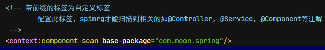
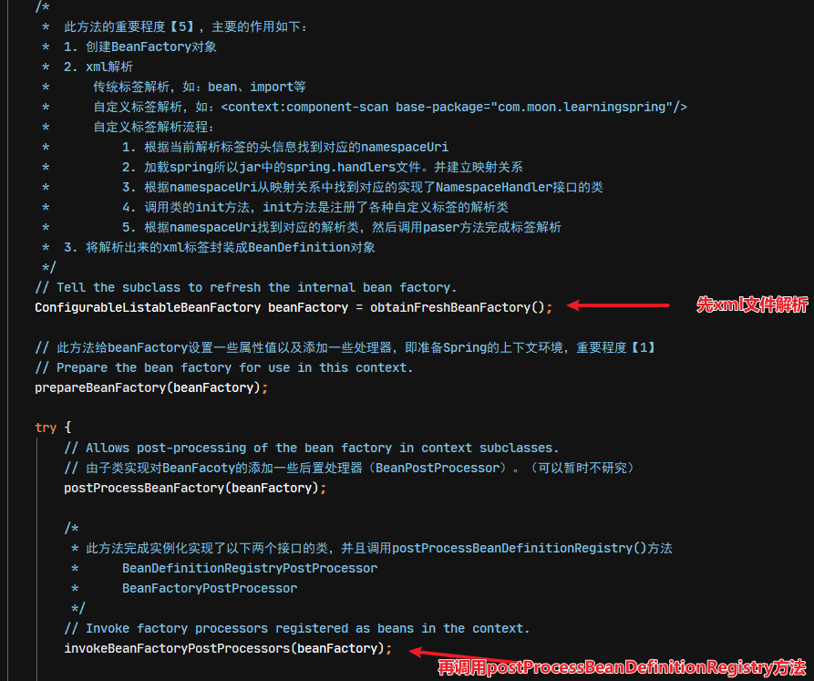

# Spring 源码分析

## 1. Spring 源码分析准备工作

> 注：下载spring源码并写注释，里面会标识相应方法的重要程度：1~5。
>
> - 0：不重要，可以不看
> - 1：一般重要，可看可不看
> - 5：非常重要，一定要看

### 1.1. Spring 源码下载

1. 到github下载源码
    - 源码下载地址：https://github.com/spring-projects/spring-framework
    - 国内镜像：https://gitee.com/mirrors/spring-framework
2. 下载 gradle，需要 JDK8 及以上的版本
3. 到下载的 spring 源码路径执行 gradle 命令，`gradlew :spring-oxm:compileTestJava`
4. 用 idea 打开 spring 源码工程，在 idea 中安装插件 kotlin，重启 idea
5. 把编译好的源码导入到工程中，这样可以在源码中写注释并且断点调试源码了。

### 1.2. 把源码导入到工程

1. 选择源码测试工程所依赖的spring相应的版本，右键选择【Open Library Settings】


2. 选择Libraries里的spring源码包，在Classes、Sources、Annotations中增加编译好的源码


3. 选择Classes


4. 选择Sources


### 1.3. 创建 Spring 示例项目

- 创建maven项目，修改pom.xml导入 spring 依赖。其中 spring 中最核心的4个jar如下
    - spring-beans
    - spring-core
    - spring-context
    - spring-expression
- 一个最简单的 spring 工程，理论上就只需要依赖一个 spring-context 就足够了

```xml
<?xml version="1.0" encoding="UTF-8"?>

<project xmlns="http://maven.apache.org/POM/4.0.0"
         xmlns:xsi="http://www.w3.org/2001/XMLSchema-instance"
         xsi:schemaLocation="http://maven.apache.org/POM/4.0.0
         http://maven.apache.org/xsd/maven-4.0.0.xsd">

    <parent>
        <artifactId>mz-system-learning</artifactId>
        <groupId>com.moon</groupId>
        <version>0.3.1</version>
    </parent>
    <modelVersion>4.0.0</modelVersion>
    <artifactId>mz-learning-springsource</artifactId>
    <packaging>war</packaging>
    <name>${project.artifactId}</name>
    <description>Spring Framework 源码学习案例工程</description>

    <!-- 版本号管理 -->
    <properties>
        <spring.version>5.1.3.RELEASE</spring.version>
        <junit.version>4.12</junit.version>
    </properties>

    <dependencies>
        <!--
            spring框架最核心的依赖，一个最基本的spring项目只需要引入此依赖即可
                此依赖包括：spring-context,spring-aop,spring-beans,spring-core,spring-expression
        -->
        <dependency>
            <groupId>org.springframework</groupId>
            <artifactId>spring-context</artifactId>
            <version>${spring.version}</version>
        </dependency>
    </dependencies>

</project>
```

> spring-context 包本身就依赖了，spring-aop，spring-beans，spring-core 等模块jar包

- 一个空的 spring 工程是不能打印日志的，要导入 spring 依赖的日志 jar 包

```xml
<!-- spring 框架输出日志的依赖包 -->
<dependency>
    <groupId>ch.qos.logback</groupId>
    <artifactId>logback-classic</artifactId>
    <version>LATEST</version>
</dependency>
```

## 2. Spring 基础使用
### 2.1. spring 配置文件中xsd文件引入

XSD 是编写 xml 文件的一种规范，有了这个规范才能校验当前 xml 文件是否准确，在 spring 中同样有 XSD 规范。


### 2.2. spring 容器加载方式
#### 2.2.1. ClassPathXmlApplicationContext(类路径获取配置文件上下文对象)

比较常用的上下文对象，用于启动时读取上下文对象

```java
/* 类路径获取配置文件上下文对象（ClassPathXmlApplicationContext） */
@Test
public void ClassPathXmlApplicationContextTest() {
    // 读取spring类路径下的配置文件
    ClassPathXmlApplicationContext applicationContext = new ClassPathXmlApplicationContext("spring.xml");
    Student student = (Student) applicationContext.getBean("student");
    System.out.println(student.getUserName());
}
```

#### 2.2.2. FileSystemXmlApplicationContext(文件系统路径【绝对路径】获取配置文件上下文对象)

此上下文对象很少使用，一般都使用类路径读取配置文件的上下文对象

```java
/* 文件系统路径获取配置文件【绝对路径】上下文对象（FileSystemXmlApplicationContext）【基本上不用】 */
@Test
public void FileSystemXmlApplicationContextTest() {
    // 读取spring的配置文件，需要绝对路径
    FileSystemXmlApplicationContext applicationContext = new FileSystemXmlApplicationContext("D:\\code\\moonzero-system\\mz-system-learning\\mz-learning-springsource\\src\\main\\resources\\spring.xml");
    Student student = (Student) applicationContext.getBean("student");
    System.out.println(student.getUserName());
}
```

#### 2.2.3. AnnotationConfigApplicationContext(无配置文件加载容器上下文对象)

此上下文对象也比较少用，一般在测试用例中使用比较多，因为可以直接扫描指定的包，获取包下所有有spring注解标识的类实例

```java
private static final String BASE_PACKAGE = "com.moon.learningspring";

/* 无配置文件加载容器上下文对象（AnnotationConfigApplicationContext） */
@Test
public void AnnotationConfigApplicationContextTest() {
    // 注解扫描上下文对象
    AnnotationConfigApplicationContext applicationContext = new AnnotationConfigApplicationContext(BASE_PACKAGE);
    Student student = (Student) applicationContext.getBean("student");
    System.out.println(student.getUserName());
}
```

#### 2.2.4. EmbeddedWebApplicationContext(springboot 加载容器)

此上下文对象是spring boot的框架，启动的时候可以创建一个嵌入式的tomcat

```xml
<!-- springboot web 的依赖，用于引入EmbeddedWebApplicationContext类  -->
<dependency>
    <groupId>org.springframework.boot</groupId>
    <artifactId>spring-boot</artifactId>
    <version>1.5.13.RELEASE</version>
</dependency>
```

```java
/* springboot 加载容器的上下文对象（EmbeddedWebApplicationContext） */
@Test
public void EmbeddedWebApplicationContextTest() {
    // springboot在启动的时候就会用到此上下文对象，启动spring容器，创建一个嵌入式的tomcat
    ApplicationContext applicationContext = (ApplicationContext) new EmbeddedWebApplicationContext();
    Student student = (Student) applicationContext.getBean("student");
    System.out.println(student.getUserName());
}
```

## 3. Spring 框架涉及的设计模式
### 3.1. 设计模式1 - 模板设计模式

在 spring 中大量的使用了模板设计模式，可以说是用得最多的设计模式。

模板设计模式demo代码详见：moonzero-system项目中的mz-learning-springsource模块，`com.moon.learningspring.designPattern.template`包下的demo

**模板设计模式的核心是：创建抽象类或者接口，定义一个主业务方法，而主业务方法有些业务逻辑可以抽象类已经实现，在主业务方法中预留了一些抽象方法，这些抽象方法由子类继承(或实现)的时候实现该方法的业务逻辑，到根据不同的业务场景，使用不同的子类，从而在调用父类主业务方法时，实现不同的（子类）业务逻辑**

> 注：模板类中的主业务可以使用final声明此方法，从而子类不可以重写，只能继承使用。至于其他的抽象方法，子类可以实现自己的业务逻辑，

spring框架中使用模板设计模式案例


### 3.2. 设计模式2 - 委托模式

有两个对象参与处理同一个请求，接受请求的对象将请求委托给另一个对象来处理

### 3.3. 设计模式3 - 装饰模式

- 装饰模式主要分几个元素
    1. 被装饰者：已存在的具体对象，需要被增强的对象
    2. 抽象装饰者：具体对象与装饰对象的共同父接口
    3. 装饰者对象：对具体对象进行功能的增强，进行装饰的类。对方法进行增强。(自定义的类)

装饰者设计模式demo详见：moonzero-system项目中的mz-learning-springsource模块，`com.moon.learningspring.designPattern.decorator`包下的demo

### 3.4. SPI 设计思想

自定义标签的解析就是一个 SPI 设计思想，即通过加装全文配置文件，做到代码灵活的调用。实现步骤如下：

1. 定义一个服务提供接口

```java
package com.moon.learningspring.spi;

/**
 * service provider interface
 * <P>服务提供接口，需要提供一个可配置的服务接口的实现类</P>
 */
public interface SpiService {
    String query(String param);
}
```

2. 编写服务接口的实现类

```java
package com.moon.learningspring.spi;

/**
 * SPI服务接口实现类
 */
public class SpiServiceImpl implements SpiService {
    @Override
    public String query(String param) {
        System.out.println("=======SpiServiceImpl.query()方法执行了======");
        return "OK";
    }
}
```

3. 在 resources 目录下创建 META-INF/services 文件夹，创建文件（文件的名称为服务接口全限定名）


4. 这样就可以通过这个接口，找到配置在文件中的所有该接口的实现类（可以是多个实现类）。
    - **这种设计的好处是：实现业务代码解耦，扩展性高。**核心的业务不需要再修改，日后增加新的业务需求时，可以通过增加新的实现类与修改配置文件即可
    - 缺点是：粒度不够细，通过配置的方式不能唯一确定一个实现类

```java
package com.moon.learningspring.spi;

import java.util.ServiceLoader;

/**
 * SPI 服务接口测试
 */
public class SpiTest {
    /**
     * 此设计的好处是：实现业务代码解耦，扩展性高。核心的业务不需要再修改，日后增加新的业务需求时，可以通过增加新的实现类与修改配置文件即可
     * 缺点是：粒度不够细，通过配置的方式不能唯一确定一个实现类
     */
    public static void main(String[] args) {
        // 通过jdk的api，ServiceLoader获取配置文件中定义所有实现类实例
        ServiceLoader<SpiService> load = ServiceLoader.load(SpiService.class);
        // 调用实现类的业务方法
        for (SpiService spiService : load) {
            spiService.query("呵呵");
        }
    }
}
```

#### 3.4.1. spring 框架对spi设计的运用

spring 中自定义标签的解析就是这种 SPI 设计的运用，在自定义标签中解析的过程中，spring 会去加载 META-INF/spring.handlers 文件，然后建立映射关系，程序在解析标签头的时候，如：`<context:>`这种的标签头。会拿到一个 namespaceUri，然后再从映射关系中找到这个 namespaceUri 所对应的处理类


#### 3.4.2. 扩展：dubbo对spi的优化(有时间研究)

dubbo在spi的配置文件中，设置为key-value的形式，这样在xml配置文件中配置相关属性，就可以唯一的确认一个实现类。

## 4. Spring 框架解析xml文件流程
### 4.1. 解析xml文件入口

此次分析源码如何解析xml文件的的入口选择了比较常用的`ClassPathXmlApplicationContext`类，点击查看此类的构造方法

1. 此方法先调用父类的构造方法
2. 再创建解析器，解析configLocations属性
3. **调用父类核心方法`refresh()`，该方法是spring容器初始化的核心方法。是spring容器初始化的核心流程，spring容器要加载必须执行该方法**

```java
public ClassPathXmlApplicationContext(
		String[] configLocations, boolean refresh, @Nullable ApplicationContext parent)
		throws BeansException {

	// 调用父类的构造方法
	super(parent);
	// 创建解析器，解析configLocations
	setConfigLocations(configLocations);
	// 是否自己刷新spring context
	if (refresh) {
		// 调用父类AbstractApplicationContext的refresh()的方法，是核心方法
		refresh();
	}
}
```

### 4.2. 解析xml文件流程

1. 通过构造函数，创建对应的上下文对象。调用父类AbstractApplicationContext中的`refresh()`方法
2. 做了一些初始化容器的准备工作后，调用父类AbstractApplicationContext的`obtainFreshBeanFactory()`方法，返回`ConfigurableListableBeanFactory`对象
3. 在`obtainFreshBeanFactory()`方法中，有模板方法`refreshBeanFactory()`，由子类去实现具体业务。而此ClassPathXmlApplicationContext读取配置文件是由AbstractRefreshableApplicationContext类去实现

> 注：如何判断钩子方法是那个调用那个类的方法，通过创建出来的对象，*如：ClassPathXmlApplicationContext对象*的类关系去分析即可


`refresh()`方法中的`ConfigurableListableBeanFactory beanFactory = obtainFreshBeanFactory();`。该方法主要进行 xml 解析工作，流程如下：

1. 创建 XmlBeanDefinitionReader 对象


2. 通过 Reader 对象加载配置文件


3. 根据加载的配置文件把配置文件封装成 document 对象


4. 创建 BeanDefinitionDocumentReader 对象，DocumentReader 负责对 document 对象解析


5. `parseDefaultElement(ele, delegate);`负责常规标签解析
6. `delegate.parseCustomElement(ele);`负责自定义标签解析


7. 最终解析的标签封装成 BeanDefinition 并缓存到容器中

**Xml 流程分析图**


### 4.3. 自定义标签解析


spring框架是通过spi设计思想来解决自定义标签解析。在DefaultBeanDefinitionDocumentReader类中的`parseBeanDefinitions()`方法中实现，具体的解析委托给BeanDefinitionParserDelegate类来实现，实现流程如下：

1. 获取自定义标签的 namespace 命令空间。如：`xmlns:context="http://www.springframework.org/schema/context"`

```java
// 根据node获取到node的命名空间，形如：http://www.springframework.org/schema/p
String namespaceUri = getNamespaceURI(node);
```

2. 根据命令空间获取 NamespaceHandler 对象。NamespaceUri 和 NamespaceHandler 之间会建立一个映射，spring 会从所有的 spring 的 jar 包中扫描 spring.handlers 文件，建立映射关系。


spring.handler 文件，其实就是 namespaceUri 和类的完整限定名的映射


3. 反射获取 NamespaceHandler 实例

```java
// 通过反射实例化对象
NamespaceHandler namespaceHandler = (NamespaceHandler) BeanUtils.instantiateClass(handlerClass);
```

4. 调用 init 方法

```java
// 调用处理类的init方法，在init方法中完成标签元素解析类的注册
namespaceHandler.init();
```

5. 返回处理类的实例对象后，调用 parse 方法

```java
handler.parse(ele, new ParserContext(this.readerContext, this, containingBd));
```

## 5. BeanDefinition
### 5.1. BeanDefinition 简介

BeanDefinition 在 spring 中贯穿全部，spring 要根据 BeanDefinition 对象来实例化 bean，只要把解析的标签，扫描的注解类封装成 BeanDefinition 对象，spring 才能实例化 bean

### 5.2. BeanDefinition 实现类

- ChildBeanDefinition
    - ChildBeanDefinition 是一种 bean definition，它可以继承它父类的设置，即ChildBeanDefinition 对 RootBeanDefinition 有一定的依赖关系
    - ChildBeanDefinition 从父类继承构造参数值，属性值并可以重写父类的方法，同时也可以增加新的属性或者方法。(类同于 java 类的继承关系)。若指定初始化方法，销毁方法或者静态工厂方法，ChildBeanDefinition 将重写相应父类的设置。`depends on`，`autowire mode`，`dependency check`，`sigleton`，`lazy init` 一般由子类自行设定。
- **GenericBeanDefinition（源码分析的重点关注的实现类）**
    - 注意：从 spring 2.5 开始，提供了一个更好的注册 bean definition 类 GenericBeanDefinition，它支持动态定义父依赖，方法是GenericBeanDefinition对象中`public void setParentName(@Nullable String parentName);`，GenericBeanDefinition 可以在绝大分部使用场合有效的替代 ChildBeanDefinition
    - GenericBeanDefinition 是一站式的标准 bean definition，除了具有指定类、可选的构造参数值和属性参数这些其它 bean definition 一样的特性外，它还具有通过 parenetName 属性来灵活设置 parent bean definition
    - 通常，GenericBeanDefinition 用来注册用户可见的 bean definition(可见的bean definition意味着可以在该类bean definition上定义post-processor来对bean进行操作，甚至为配置 parent name 做扩展准备)。RootBeanDefinition / ChildBeanDefinition 用来预定义具有 parent/child 关系的 bean definition。
- RootBeanDefinition
    - 一个 RootBeanDefinition 定义表明它是一个可合并的 bean definition：即在 spring beanFactory 运行期间，可以返回一个特定的 bean。RootBeanDefinition 可以作为一个重要的通用的 bean definition 视图。
    - RootBeanDefinition 用来在配置阶段进行注册 bean definition。然后，从 spring 2.5 后，编写注册 bean definition 有了更好的的方法：GenericBeanDefinition。GenericBeanDefinition 支持动态定义父类依赖，而非硬编码作为 root bean definition。

### 5.3. GenericBeanDefinition 创建实例测试

手动创建`BeanDefinition`对象并注册到spring容器中，定义一个被spring容器管理的类，实现`BeanDefinitionRegistryPostProcessor`接口，实现`postProcessBeanDefinitionRegistry`方法，在方法里设置需要实例化的类即可

```java
package com.moon.learningspring.beanDefinition;

import org.springframework.beans.BeansException;
import org.springframework.beans.MutablePropertyValues;
import org.springframework.beans.factory.config.ConfigurableListableBeanFactory;
import org.springframework.beans.factory.support.BeanDefinitionRegistry;
import org.springframework.beans.factory.support.BeanDefinitionRegistryPostProcessor;
import org.springframework.beans.factory.support.GenericBeanDefinition;
import org.springframework.stereotype.Component;

/**
 * BeanDefinition 创建测试
 */
@Component
public class BeanDefinitionTest implements BeanDefinitionRegistryPostProcessor {
    /**
     * 在spring容器加载的执行此方法，可以手动创建BeanDefinition对象并注册到spring容器中
     *
     * @param registry
     * @throws BeansException
     */
    @Override
    public void postProcessBeanDefinitionRegistry(BeanDefinitionRegistry registry) throws BeansException {
        // 创建GenericBeanDefinition对象
        GenericBeanDefinition genericBeanDefinition = new GenericBeanDefinition();
        // 设置需要实例化的类
        genericBeanDefinition.setBeanClass(BeanClass.class);

        // 如果需要实例化的类中属性赋值，需要获取MutablePropertyValues属性，赋值到此属性中
        MutablePropertyValues propertyValues = genericBeanDefinition.getPropertyValues();
        propertyValues.addPropertyValue("userName", "moon");

        // 将BeanDefinition对象注册到spring容器中，spring实例化对象，必须将beanName与BeanDefinition对象进行映射。（即添加到beanDefinitionMap属性中）
        registry.registerBeanDefinition("beanClass", genericBeanDefinition);
    }

    @Override
    public void postProcessBeanFactory(ConfigurableListableBeanFactory beanFactory) throws BeansException {
    }
}
```

### 5.4. BeanDefinition 中的属性
#### 5.4.1. 属性图示

原文件在\code-learning-note\note attachments\02-后端框架\03-Spring\BeanDefinition属性结构图.xmind


#### 5.4.2. 属性作用解释

- 【id】：Bean 的唯一标识名。它必须是合法的 XMLID，在整个 XML 文档中唯一
- 【class】：用来定义类的全限定名（包名+类名）。只有子类 Bean 不用定义该属性
- 【name】：用来为 id 创建一个或多个别名。它可以是任意的字母符合。多个别名之间用逗号或空格分开
- 【parent】：子类 Bean 定义它所引用它的父类 Bean。这时前面的 class 属性失效。子类 Bean 会继承父类 Bean 的所有属性，子类 Bean 也可以覆盖父类 Bean 的属性。注意：子类 Bean 和父类 Bean 是同一个 Java 类
- 【abstract】：默认为“false”。用来定义 Bean 是否为抽象 Bean。它表示这个 Bean 将不会被实例化，一般用于父类 Bean，因为父类 Bean 主要是供子类 Bean 继承使用
- 【lazy-init】：默认为“default”。用来定义这个 Bean 是否实现懒初始化。如果为“true”，它将在 BeanFactory 启动时初始化所有的 SingletonBean。反之，如果为“false”,它只在 Bean 请求时才开始创建 SingletonBean
- 【autowire】：自动装配，默认为“default”。它定义了 Bean 的自动装载方式。
    - `no`：不使用自动装配功能
    - `byName`：通过 Bean 的属性名实现自动装配
    - `byType`：通过 Bean 的类型实现自动装配
    - `constructor`：类似于`byType`，但它是用于构造函数的参数的自动组装
    - `autodetect`：通过 Bean 类的反省机制（introspection）决定是使用`constructor`还是使用`byType`
- 【autowire-candidate】：**采用 xml 格式配置 bean 时**，将`<bean/>`元素的 autowire-candidate 属性设置为 false，这样容器在查找自动装配对象时，将不考虑该 bean，即它不会被考虑作为其它 bean 自动装配的候选者，但是该 bean 本身还是可以使用自动装配来注入其它 bean 的。
    - 主要的使用场景是：如果一个接口有多个实现类，但不希望某一个类自动注入的时候可以使用此配置，*注意，只有在用xml配置的时候生效*
- 【depends-on】：依赖对象。这个 Bean 在初始化时依赖的对象，这个对象会在这个 Bean 初始化之前创建
- 【init-method】：用来定义 Bean 的初始化方法，它会在 Bean 组装之后调用。它**必须是一个无参数的方法**
- 【primary】：用于定义某个实现类是否优先被选择注入。当一个接口有多个实现类时，如果在xml配置文件中将primary的值设置为true，并在某一个实现类上加上`@Primary`注解，此时spring容器在需要自动注入该接口时，优先选择此实现类进行注入
- 【destroy-method】：用来定义 Bean 的销毁方法，它在 BeanFactory 关闭时调用。同样，它也**必须是一个无参数的方法，而且只能应用于 singletonBean**
- 【factory-method】：定义创建该 Bean 对象的工厂方法。它用于相应的属性“factory-bean”，表示这个 Bean 是通过工厂方法创建。此时，“class”属性失效
- 【factory-bean】：定义创建该 Bean 对象的工厂类。如果使用了“factory-bean”则“class”属性失效
- 【MutablePropertyValues】：用于封装`<property>`标签的信息，其实类里面就是有一个 list，list里面是 PropertyValue 对象，PropertyValue 就是一个 name 和 value 属性，用于封装`<property>`标签的名称和值信息
- 【ConstructorArgumentValues】：用于封装`<constructor-arg>`标签的信息，其实类里面就是有一个 map，map 中用构造函数的参数顺序作为 key，值作为 value 存储到 map 中
- 【MethodOverrides】：用于封装 bean 标签下的 lookup-method 和 replaced-method 等子标签的信息，同样的类里面有一个 Set 对象添加 LookupOverride 对象和 ReplaceOverride 对象

### 5.5. BeanDefinition 创建过程

主要在`BeanDefinitionParserDelegate`类的`parseBeanDefinitionElement()`方法中进行对xml配置文件里面的bean标签进行解析，并创建BeanDefinition对象。

1. 创建BeanDefinition对象

```java
// 创建GenericBeanDefinition对象
AbstractBeanDefinition bd = createBeanDefinition(className, parent);
```

2. 解析属性

```java
// 解析bean标签的属性，并把解析出来的属性设置到BeanDefinition对象中
parseBeanDefinitionAttributes(ele, beanName, containingBean, bd);
```

3. 解析子标签

```java
// 解析bean中的meta标签
parseMetaElements(ele, bd);

// 解析bean中的lookup-method标签  重要程度【2】，可看可不看
parseLookupOverrideSubElements(ele, bd.getMethodOverrides());

// 解析bean中的replaced-method标签  重要程度【2】，可看可不看
parseReplacedMethodSubElements(ele, bd.getMethodOverrides());

// 解析bean中的constructor-arg标签  重要程度【2】，可看可不看
parseConstructorArgElements(ele, bd);

// 解析bean中的property标签  重要程度【2】，可看可不看
parsePropertyElements(ele, bd);
```

**解析过程重点记忆：MutablePropertyValues属性**。如果想要设置类的属性值，那么就需要往这个对象中添加 PropertyValue 对象

## 6. Bean 的实例化过程
### 6.1. BeanDefinitionRegistryPostProcessor 接口

在AbstractApplicationContext类的`refresh()`方法中，调用`invokeBeanFactoryPostProcessors(beanFactory)`方法

BeanDefinitionRegistryPostProcessor 这个接口的调用分为三步：

1. 调用实现了 PriorityOrdered 排序接口
2. 调用实现了 Ordered 排序接口
3. 没有实现接口的调用

这个接口的理解：获取 BeanDefinitionRegistry 对象，获取到这个对象就可以获取这个对象中注册的所有 BeanDefinition 对象，所以可以知道，拥有这个对象就可以完成里面所有 BeanDefinition 对象的修改和新增操作

### 6.2. BeanPostProcessor 的注册

1. 在AbstractApplicationContext类的`refresh()`方法中，调用`registerBeanPostProcessors(beanFactory);`这个方法里面。会拿到 BeanFactory 中所有注册的 BeanDefinition 对象的名称 beanName。

```java
public static void registerBeanPostProcessors(
		ConfigurableListableBeanFactory beanFactory, AbstractApplicationContext applicationContext) {

	// 获取到工程里面所有实现了BeanPostProcessor接口的类，获取到BeanDefinition的名称
	String[] postProcessorNames = beanFactory.getBeanNamesForType(BeanPostProcessor.class, true, false);
	....
}
```

2. 然后判断是否实现了 `PriorityOrdered` 排序接口、`Ordered` 排序接口，getBean 是将该 ppName 对应的 BeanDefinition 对象实例化

```java
// 提前实例化BeanPostProcessor类型的bean，然后bean进行排序
for (String ppName : postProcessorNames) {
	if (beanFactory.isTypeMatch(ppName, PriorityOrdered.class)) {
		// getBean是实例化方法，是bean实例化过程
		BeanPostProcessor pp = beanFactory.getBean(ppName, BeanPostProcessor.class);
		priorityOrderedPostProcessors.add(pp);
		// 判断类型是否为MergedBeanDefinitionPostProcessor，如果是则代码是内部使用的
		if (pp instanceof MergedBeanDefinitionPostProcessor) {
			internalPostProcessors.add(pp);
		}
	}
	else if (beanFactory.isTypeMatch(ppName, Ordered.class)) {
		orderedPostProcessorNames.add(ppName);
	}
	else {
		nonOrderedPostProcessorNames.add(ppName);
	}
}
```

3. 把对应的 `BeanPostProcessor` 对象注册到 BeanFactory 中，BeanFactory 中有一个 List 容器(`private final List<BeanPostProcessor> beanPostProcessors`)接收

```java
// 注册到BeanFactory中
registerBeanPostProcessors(beanFactory, priorityOrderedPostProcessors);

/* 注册的BeanPostProcessor所有实例都存放在BeanFactory的 private final List<BeanPostProcessor> beanPostProcessors = new CopyOnWriteArrayList<>(); 容器中 */
```

### 6.3. getSingleton 方法（获取单例）
#### 6.3.1. 代码所在位置

- 核心代码位置：`AbstractBeanFactory.doGetBean()` 方法中

```java
......

// Create bean instance.
if (mbd.isSingleton()) {
	// 此逻辑是重点，因为大部分情况都是单例的
	sharedInstance = getSingleton(beanName, () -> {
		try {
			// 创建bean实例核心逻辑
			return createBean(beanName, mbd, args);
		}
		catch (BeansException ex) {
			// Explicitly remove instance from singleton cache: It might have been put there
			// eagerly by the creation process, to allow for circular reference resolution.
			// Also remove any beans that received a temporary reference to the bean.
			destroySingleton(beanName);
			throw ex;
		}
	});
	// 此方法是FactoryBean接口的调用入口
	bean = getObjectForBeanInstance(sharedInstance, name, beanName, mbd);
}

......
```

方法里面核心要点：


把 beanName 添加到 singletonsCurrentlyInCreation Set 容器中，在这个集合里面的 bean 都是正在实例化的 bean，就是实例化还没做完的 BeanName

```java
/**
 * Callback before singleton creation.
 * <p>The default implementation register the singleton as currently in creation.
 * @param beanName the name of the singleton about to be created
 * @see #isSingletonCurrentlyInCreation
 */
protected void beforeSingletonCreation(String beanName) {
	// 把beanName添加到singletonsCurrentlyInCreation的Set容器中，在这个集合里面的bean都是正在实例化的bean
	if (!this.inCreationCheckExclusions.contains(beanName) && !this.singletonsCurrentlyInCreation.add(beanName)) {
		// 如果需要创建的beanName不在inCreationCheckExclusions容器（存储排除创建的）中，并且singletonsCurrentlyInCreation容器（存储正在创建的）已经存在，抛出异常
		throw new BeanCurrentlyInCreationException(beanName);
	}
}
```

在执行`Object getSingleton(String beanName, ObjectFactory<?> singletonFactory)`方法的过程中，调用了`singletonObject = singletonFactory.getObject();`方法(即会调用外层的lambda表达式的逻辑)。调到 getObject 方法，完成 bean 的实例化。


getObject 调用完后，就代表着 Bean 实例化已经完成了，此还需要进行以下两步操作：


1. 调用`singletonsCurrentlyInCreation`方法，把 beanName 从这个集合中删除

```java
/**
 * Callback after singleton creation.
 * <p>The default implementation marks the singleton as not in creation anymore.
 * @param beanName the name of the singleton that has been created
 * @see #isSingletonCurrentlyInCreation
 */
protected void afterSingletonCreation(String beanName) {
	if (!this.inCreationCheckExclusions.contains(beanName) && !this.singletonsCurrentlyInCreation.remove(beanName)) {
		throw new IllegalStateException("Singleton '" + beanName + "' isn't currently in creation");
	}
}
```

2. 调用`addSingleton`方法，把 bean 缓存到一级缓存中

```java
/**
 * Add the given singleton object to the singleton cache of this factory.
 * <p>To be called for eager registration of singletons.
 * @param beanName the name of the bean
 * @param singletonObject the singleton object
 */
protected void addSingleton(String beanName, Object singletonObject) {
	synchronized (this.singletonObjects) {
		this.singletonObjects.put(beanName, singletonObject);
		this.singletonFactories.remove(beanName);
		this.earlySingletonObjects.remove(beanName);
		this.registeredSingletons.add(beanName);
	}
}
```

#### 6.3.2. 涉及相关重要的核心属性

在`DefaultSingletonBeanRegistry`类中的`singletonObjects`属性，此属性是Map结构容器，用于存在完全实例化的对象。

> 完全实例化对象：指的是此类创建出对象，并且类里的所有属性与DI（依赖注入）都全部已经完成

### 6.4. createBean 方法

代码位置：`AbstractBeanFactory.doGetBean()` 方法中，此方法是 bean 实例化核心方法


在实例化bean的方法中，会把 bean 实例化，并且包装成 BeanWrapper。*注：但此时不涉及DI（依赖注入）*


#### 6.4.1. FactoryMethodName 属性的处理

进入`createBeanInstance(beanName, mbd, args);`方法中，会有判断是否配置了`FactoryMethodName`属性的处理


这个方法是反射调用类中的 factoryMethod 方法。这要知道 `@Bean` 方法的原理，实际上 spring 会扫描有 `@bean` 注解的方法，然后把方法名称设置到 BeanDefinition 的 factoryMethod
属性中，接下来就会调到上面截图中的方法实现 `@Bean` 方法的调用。该方法里面的参数解析过程不需要了解。

#### 6.4.2. 实例化的类存有参构造函数时的处理方法

这个方法是 `BeanPostProcessor` 接口类的首次应用，最终会调到 `AutowiredAnnotationBeanPostProcessor` 类的方法，在方法中会扫描有注解的构造函数然后完成装配过程。

```java
// Candidate constructors for autowiring?
// 寻找当前正在实例化的bean中是否有 @Autowired 注解的构造函数。核心代码，重要程度【5】
Constructor<?>[] ctors = determineConstructorsFromBeanPostProcessors(beanClass, beanName); // 此方法获取类的构造函数（多个，返回数组）
if (ctors != null || mbd.getResolvedAutowireMode() == AUTOWIRE_CONSTRUCTOR ||
		mbd.hasConstructorArgumentValues() || !ObjectUtils.isEmpty(args)) {
	// 如果ctors不为空，就说明构造函数上有@Autowired注解
	return autowireConstructor(beanName, mbd, ctors, args);
}
```

进入`determineConstructorsFromBeanPostProcessors()`方法中。

```java
@Nullable
protected Constructor<?>[] determineConstructorsFromBeanPostProcessors(@Nullable Class<?> beanClass, String beanName)
		throws BeansException {
	if (beanClass != null && hasInstantiationAwareBeanPostProcessors()) {
		// getBeanPostProcessors()方法获取所有注册到BeanFactory里的BeanPostProcessor，在此处进行循环调用
		for (BeanPostProcessor bp : getBeanPostProcessors()) {
			if (bp instanceof SmartInstantiationAwareBeanPostProcessor) {
				SmartInstantiationAwareBeanPostProcessor ibp = (SmartInstantiationAwareBeanPostProcessor) bp;
				// 此处只有AutowiredAnnotationBeanPostProcessor类会启作用，其他的实现类（不关注此功能的）只需要返回null即可
				Constructor<?>[] ctors = ibp.determineCandidateConstructors(beanClass, beanName);
				if (ctors != null) {
					return ctors;
				}
			}
		}
	}
	return null;
}
```

**总结：凡是使用`@Autowired`注解，如果参数是一个引用的类型，就会触发这个引用类型的getBean操作**

#### 6.4.3. 无参构造函数的实例化

这就是简单的反射实例化。大部分类的实例化都会走无参构造的逻辑

```java
protected BeanWrapper createBeanInstance(String beanName, RootBeanDefinition mbd, @Nullable Object[] args) {
	......

	// 通过无参构造函数的实例化bean，实际上大部分的实例都是采用的无参构造函数的方式实例化
	// No special handling: simply use no-arg constructor.
	return instantiateBean(beanName, mbd);
}
```

#### 6.4.4. 类中注解的收集

实例化完成后，接下来就需要对类中的属性进行依赖注入操作。类里面属性和方法的依赖注入往往用 `@Autowired` 或者 `@Resource` 注解

```java
// Allow post-processors to modify the merged bean definition.
synchronized (mbd.postProcessingLock) {
	if (!mbd.postProcessed) {
		try {
			/*
			 * 此方法是对实例化的bean的注解收集，对类中注解的装配过程。重要程度【5】
			 * 	这个接口是BeanPostProcessor接口的典型运用，需要重点理解，其中BeanPostProcessor接口的实现类相应处理的注解如下：
			 * 		CommonAnnotationBeanPostProcessor  支持了@PostConstruct，@PreDestroy，@Resource注解
			 * 		AutowiredAnnotationBeanPostProcessor 支持 @Autowired，@Value注解
			 */
			applyMergedBeanDefinitionPostProcessors(mbd, beanType, beanName);
		}
		catch (Throwable ex) {
			throw new BeanCreationException(mbd.getResourceDescription(), beanName,
					"Post-processing of merged bean definition failed", ex);
		}
		mbd.postProcessed = true;
	}
}
```

注解的收集，也是通过不同的 `BeanPostProcessor` 接口类型实例来一个个循环处理的。


##### 6.4.4.1. CommonAnnotationBeanPostProcessor

第1个是调用 `CommonAnnotationBeanPostProcessor` 类，这个类完成了 `@Resource` 注解的属性或者方法的收集。这个类还对 `@PostConstruct` 和 `@PreDestory` 等注解的支持


其中收集`@Resource`注解的过程如下：

1. 看缓存里面有没有 `InjectionMetadata` 对象
2. 从类中获取所有 `Field` 对象，循环 `field` 对象，判断 `field` 有没有 `@Resource` 注解，如果有注解封装成 `ResourceElement` 对象
3. 从类中获取所有 `Method` 对象，循环 `Method` 对象，判断 `Method` 有没有 `@Resource` 注解，如果有注解封装成 `ResourceElement` 对象
4. 最终把两个 `field` 和 `Method` 封装的对象集合封装到 `InjectionMetadata` 对象中

##### 6.4.4.2. AutowiredAnnotationBeanPostProcessor

`AutowiredAnnotationBeanPostProcessor` 类，对 `@Autowired` 注解的属性和方法的收集。收集过程基本上跟 `@Resource` 注解的收集差不多

#### 6.4.5. IOC\DI 依赖注入
##### 6.4.5.1. @Resource 和 @Autowired 注解依赖注入


相应的方法代码块

```java
populateBean(beanName, mbd, instanceWrapper);
```

进入方法，核心代码位置在红框中


上面又是一个 `BeanPostProcessor` 类型接口的运用，前面有对`@Resource`、`@Autowired`注解的收集，那么这个方法就是根据收集到的注解进行反射调用。研究其中的子类`org.springframework.beans.factory.annotation.AutowiredAnnotationBeanPostProcessor`的实现逻辑


```java
@Override
public PropertyValues postProcessProperties(PropertyValues pvs, Object bean, String beanName) {
	// 获取之前进行的@Autowired注解收集的元数据（此方法在之前的注解收集过程里研究过）
	InjectionMetadata metadata = findAutowiringMetadata(beanName, bean.getClass(), pvs);
	try {
		// 进行反射完成依赖注入
		metadata.inject(bean, beanName, pvs);
	}
	catch (BeanCreationException ex) {
		throw ex;
	}
	catch (Throwable ex) {
		throw new BeanCreationException(beanName, "Injection of autowired dependencies failed", ex);
	}
	return pvs;
}
```

循环收集到的 `metaData` 对象中的List集合，调用里面的每个 InjectedElement 的 inject 方法完成依赖注入。

```java
public void inject(Object target, @Nullable String beanName, @Nullable PropertyValues pvs) throws Throwable {
	Collection<InjectedElement> checkedElements = this.checkedElements;
	Collection<InjectedElement> elementsToIterate =
			(checkedElements != null ? checkedElements : this.injectedElements);
	if (!elementsToIterate.isEmpty()) {
		// 循环所有需要注入的元素
		for (InjectedElement element : elementsToIterate) {
			if (logger.isTraceEnabled()) {
				logger.trace("Processing injected element of bean '" + beanName + "': " + element);
			}
			// 对元素/方法进行注入
			element.inject(target, beanName, pvs);
		}
	}
}
```


其中 value 值的获取，如果依赖的属性是一个引用类型必定会触发该属性的`BeanFactory.getBean()`操作，从 spring 容器中获取到对应的实例。

```java
@Override
protected void inject(Object bean, @Nullable String beanName, @Nullable PropertyValues pvs) throws Throwable {
	Field field = (Field) this.member;
	......
	if (value != null) {
		ReflectionUtils.makeAccessible(field);
		field.set(bean, value);
	}
}
```

方法的依赖注入类似的逻辑

```java
@Override
protected void inject(Object bean, @Nullable String beanName, @Nullable PropertyValues) throws Throwable {
	if (checkPropertySkipping(pvs)) {
		return;
	}
	Method method = (Method) this.member;
	......

	if (arguments != null) {
		try {
			ReflectionUtils.makeAccessible(method);
			method.invoke(bean, arguments);
		}
		catch (InvocationTargetException ex) {
			throw ex.getTargetException();
		}
	}
}
```

以上就是对注解 `@Resource` 和 `@Autowired` 的依赖注入的实现逻辑

##### 6.4.5.2. xml 配置的依赖注入

比如在spring的xml配置文件的 `<bean>` 标签中配置以下属性

```xml
<!-- property子标签测试（此方式几乎不使用，直接使用@Value实现） -->
<bean class="com.moon.spring.bean.PropertyBean" id="propertyBean">
    <property name="username" value="MoonZero"/>
    <property name="password" value="123"/>
</bean>
```

标签的依赖注入实现逻辑代码位置如下：


这块逻辑是专门做 xml 配置依赖注入的，基本上现在基于 xml 配置的依赖很少使用，暂时不研究

#### 6.4.6. bean 实例化后的操作

核心代码位置在`AbstractAutowireCapableBeanFactory`类中的`doCreateBean()`方法中

```java
// bean实例化+ioc依赖注入完以后的调用，非常重要，重要程度【5】
exposedObject = initializeBean(beanName, exposedObject, mbd);
```

##### 6.4.6.1. InitializingBean 接口介绍

实现`InitializingBean`接口的类，spring会在实例化该类以后，调用接口的`afterPropertiesSet()`方法

```java
package com.moon.spring.bean;

import org.springframework.beans.factory.InitializingBean;

/**
 * Spring 框架中 InitializingBean 接口的示例
 * <p>
 * 如果需要在一个类实例化以后去做一些逻辑处理，那么就可以借助这个InitializingBean接口来完成。
 *
 * @author MoonZero
 * @version 1.0
 * @date 2020-5-18 23:31
 * @description
 */
public class InitMethodBean implements InitializingBean {

    @Override
    public void afterPropertiesSet() throws Exception {
        System.out.println("****** 实现InitializingBean接口的afterPropertiesSet()方法执行了 ******");
    }

    /*
     * 在xml配置文件中<bean>标签中，配置init-method属性
     *  注意：通过xml配置文件的方式实现类创建后执行init-method，相应的方法的执行顺序是在实现了InitializingBean接口的afterPropertiesSet()方法执行之后
     */
    public void initMethod() {
        System.out.println("======= InitMethodBean.initMethod()方法执行了 =========");
    }

}
```

也可以通过xml配置文件的方式，实现与`InitializingBean`接口一样的效果，只要在`<bean>`标签中配置`init-method`属性，值为需要执行的方法名称

```xml
<beans xmlns="http://www.springframework.org/schema/beans"
       xmlns:xsi="http://www.w3.org/2001/XMLSchema-instance"
       xmlns:context="http://www.springframework.org/schema/context"
       xmlns:aop="http://www.springframework.org/schema/aop"
       xmlns:p="http://www.springframework.org/schema/p"
       xmlns:c="http://www.springframework.org/schema/c"
       xmlns:moon="http://www.moon.com/schema/mytags"
       xsi:schemaLocation="http://www.springframework.org/schema/beans
       http://www.springframework.org/schema/beans/spring-beans.xsd
       http://www.springframework.org/schema/context
       http://www.springframework.org/schema/context/spring-context.xsd
       http://www.springframework.org/schema/aop
       http://www.springframework.org/schema/aop/spring-aop.xsd
       http://www.moon.com/schema/mytags
       http://www.moon.com/schema/mytags.xsd">
    ......
    <!-- 配置init-method属性示例
            用于定义 Bean 的初始化方法，会在 Bean 组装之后调用。注意：该方法必须是一个无参数的方法
     -->
    <bean id="initMethodBean" class="com.moon.spring.bean.InitMethodBean" init-method="initMethod"/>
</beans>
```

> 注意：通过xml配置文件的方式实现类创建后执行`init-method`，相应的方法的执行顺序是在实现了`InitializingBean`接口的`afterPropertiesSet()`方法执行之后

启动spring，运行结果如下


##### 6.4.6.2. 对某些 Aware 接口的调用(实例化Bean后执行流程1)

此步骤主要是对于当前实现Aware的接口的方法调用


```java
private void invokeAwareMethods(final String beanName, final Object bean) {
	if (bean instanceof Aware) {
		// 调用实现BeanNameAware接口的setBeanName()方法，可以获取当前实例化的beanName
		if (bean instanceof BeanNameAware) {
			((BeanNameAware) bean).setBeanName(beanName);
		}
		if (bean instanceof BeanClassLoaderAware) {
			ClassLoader bcl = getBeanClassLoader();
			if (bcl != null) {
				((BeanClassLoaderAware) bean).setBeanClassLoader(bcl);
			}
		}
		// 调用实现BeanFactoryAware接口的setBeanFactory()方法，可以获取当前BeanFactory对象
		if (bean instanceof BeanFactoryAware) {
			((BeanFactoryAware) bean).setBeanFactory(AbstractAutowireCapableBeanFactory.this);
		}
	}
}
```

##### 6.4.6.3. @PostConstruct 注解方法的调用(实例化Bean后执行流程2)

此处又是一个 `BeanPostProcessor` 接口的运用。核心代码位置

```java
/* AbstractAutowireCapableBeanFactory类中的initializeBean()方法 */
Object wrappedBean = bean;
if (mbd == null || !mbd.isSynthetic()) {
	// 对类中某些特殊方法的调用，比如@PostConstruct，Aware接口。重要程度【5】
	wrappedBean = applyBeanPostProcessorsBeforeInitialization(wrappedBean, beanName);
}
```

```java
@Override
public Object applyBeanPostProcessorsBeforeInitialization(Object existingBean, String beanName)
		throws BeansException {
	Object result = existingBean;
	/*
	 * 循环容器中所有BeanPostProcessor，着重理解以下几个实现类
	 *  1、ApplicationContextAwareProcessor  对某个Aware接口方法的调用
	 *  2、InitDestroyAnnotationBeanPostProcessor  @PostConstruct注解方法的调用
	 *  3、ImportAwareBeanPostProcessor  对ImportAware类型实例setImportMetadata方法调用。（这个对理解springboot有很大帮助。此时暂时不深入了解）
	 */
	for (BeanPostProcessor processor : getBeanPostProcessors()) {
		Object current = processor.postProcessBeforeInitialization(result, beanName);
		if (current == null) {
			return result;
		}
		result = current;
	}
	return result;
}
```

从前面了解到，有 `@PostConstruct` 注解的方法会收集到一个 `metaData` 对象中，现在就是通过 `BeanPostProcessor` 接口调到 `CommonAnnotationBeanPostProcessor` 类，然后在类中拿到 `metaData` 对象，根据对象里面的容器来反射调用有注解的方法。核心逻辑（*以`InitDestroyAnnotationBeanPostProcessor`为例，此类用于调用`@PostConstruct`相应的方法*）代码如下：

```java
@Override
public Object postProcessBeforeInitialization(Object bean, String beanName) throws BeansException {
	// 获取生命周期相关方法的Metadata对象
	LifecycleMetadata metadata = findLifecycleMetadata(bean.getClass());
	try {
		// 调用@PostConstruct注解的方法
		metadata.invokeInitMethods(bean, beanName);
	}
	catch (InvocationTargetException ex) {
		throw new BeanCreationException(beanName, "Invocation of init method failed", ex.getTargetException());
	}
	catch (Throwable ex) {
		throw new BeanCreationException(beanName, "Failed to invoke init method", ex);
	}
	return bean;
}
```

```java
public void invokeInitMethods(Object target, String beanName) throws Throwable {
	Collection<LifecycleElement> checkedInitMethods = this.checkedInitMethods;
	Collection<LifecycleElement> initMethodsToIterate =
			(checkedInitMethods != null ? checkedInitMethods : this.initMethods); // 获取之前收集 @PostConstruct 注解的 initMethods 容器中
	if (!initMethodsToIterate.isEmpty()) {
		for (LifecycleElement element : initMethodsToIterate) {
			if (logger.isTraceEnabled()) {
				logger.trace("Invoking init method on bean '" + beanName + "': " + element.getMethod());
			}
			// 反射调用
			element.invoke(target);
		}
	}
}
```

有 `@PostConstruct` 注解的会收集到 `initMethods` 容器中，接下来就是方法的反射调用。

```java
public void invoke(Object target) throws Throwable {
	ReflectionUtils.makeAccessible(this.method);
	this.method.invoke(target, (Object[]) null);
}
```

##### 6.4.6.4. InitializingBean 接口和 init-method 属性的调用(实例化Bean后执行流程3)

执行流程往下就是对实现了 `InitializingBean` 接口的类与在xml配置文件中`<bean>`标签中配置了 `init-method` 属性的相应方法的调用


从源码可以看出，实现了 `InitializingBean` 接口的类就必然会调用到 `afterPropertiesSet()` 方法，且 `Init-method` 属性调用是在 `afterPropertiesSet()` 方法之后

```java
protected void invokeInitMethods(String beanName, final Object bean, @Nullable RootBe
		throws Throwable {
	// 判断是否为InitializingBean接口实现
	boolean isInitializingBean = (bean instanceof InitializingBean);
	// 首先调用实现InitializingBean接口的afterPropertiesSet()方法
	if (isInitializingBean && (mbd == null || !mbd.isExternallyManagedInitMethod("aft
		if (logger.isTraceEnabled()) {
			logger.trace("Invoking afterPropertiesSet() on bean with name '" + beanNa
		}
		if (System.getSecurityManager() != null) {
			try {
				AccessController.doPrivileged((PrivilegedExceptionAction<Object>) ()
					((InitializingBean) bean).afterPropertiesSet();
					return null;
				}, getAccessControlContext());
			}
			catch (PrivilegedActionException pae) {
				throw pae.getException();
			}
		}
		else {
			// 直接调用afterPropertiesSet()方法
			((InitializingBean) bean).afterPropertiesSet();
		}
	}
	// 然后调用xml配置文件中的init-method属性相应的方法
	if (mbd != null && bean.getClass() != NullBean.class) {
		// 获取调用的方法名称
		String initMethodName = mbd.getInitMethodName();
		if (StringUtils.hasLength(initMethodName) &&
				!(isInitializingBean && "afterPropertiesSet".equals(initMethodName))
				!mbd.isExternallyManagedInitMethod(initMethodName)) {
			// 此方法为调用xml配置文件中的init-method属性相应的方法
			invokeCustomInitMethod(beanName, bean, mbd);
		}
	}
}
```

`afterPropertiesSet`、`Init-method`和有`@PostConstruct`注解的方法其实核心功能都是一样的，只是调用时序不一样而已，都是在该类实例化和 IOC 做完后调用的，可以在这些方法中做一些在 spring 或者 servlet 容器启动的时候的初始化工作。比如缓存预热，比如缓存数据加载到内存，比如配置解析，等等初始化工作。

在这个方法里面还有一个重要的逻辑

```java
/* AbstractAutowireCapableBeanFactory */
protected Object initializeBean(final String beanName, final Object bean, @Nullable RootBeanDefinition mbd) {
    ......
    // 此部分也是一个 BeanPostProcessor 接口的运用，在这里会返回 bean 的代理实例，这个就是 AOP 的入口【暂未研究】
    if (mbd == null || !mbd.isSynthetic()) {
    	wrappedBean = applyBeanPostProcessorsAfterInitialization(wrappedBean, beanName);
    }

    return wrappedBean;
}
```

也是一个 `BeanPostProcessor` 接口的运用，在这里会返回 bean 的代理实例，这个就是 AOP 的入口。

##### 6.4.6.5. FactoryBean 接口

接口方法触发入口位置：`AbstractBeanFactory --> doGetBean()`

```java
// Create bean instance.
if (mbd.isSingleton()) {
	/* 此逻辑是重点，因为大部分情况都是单例的 */
	sharedInstance = getSingleton(beanName, () -> {
		try {
			// 创建bean实例核心逻辑
			return createBean(beanName, mbd, args);
		}
		catch (BeansException ex) {
			// Explicitly remove instance from singleton cache: It might have been put there
			// eagerly by the creation process, to allow for circular reference resolution.
			// Also remove any beans that received a temporary reference to the bean.
			destroySingleton(beanName);
			throw ex;
		}
	});
	// 此方法是FactoryBean接口的调用入口
	bean = getObjectForBeanInstance(sharedInstance, name, beanName, mbd);
}
```

该接口的作用是：在实例化和 IOC/DI 做完后，就会调用 FactoryBean 类型的接口，重写`getObject()`，方法，可以返回不同的bean类型，此bean实例会被Spring容器管理

- 如果要获取到 FactoryBean 接口实现类本身，就必须加上`&`符号，比如：`beanFactory.getBean("&beanName")`。
- `BeanFactory.getBean("beanName")` 只能获取到 `getObject()` 方法返回的实例

示例如下：

```java
package com.moon.spring.factorybean;

import org.springframework.beans.factory.FactoryBean;
import org.springframework.stereotype.Component;

/**
 * Spring 框架 FactoryBean 接口使用示例
 */
@Component
public class FactoryBeanDemo implements FactoryBean {

    @Override
    public Object getObject() throws Exception {
        /*
         *  此处可以进行一些其他的逻辑处理，然后返回一个新的bean
         *   注：此处返回的新的实例与原来实现了FactoryBean接口的此类的实例互不干扰
         */
        return new FactoryBeanOther();
    }

    @Override
    public Class<?> getObjectType() {
        return FactoryBeanOther.class;
    }
}


/* 测试 */
@Autowired
private ApplicationContext applicationContext;

/* FactoryBean接口实现测试 */
@Test
public void factoryBeanTest() {
    // 实现了FactoryBean接口的类，通过bean的id只能获取该类实现了getObject()方法返回的对象实例
    FactoryBeanOther other = (FactoryBeanOther) applicationContext.getBean("factoryBeanDemo");
    System.out.println(other); // com.moon.spring.factorybean.FactoryBeanOther@4cc8eb05
    // 如果要获取实现了FactoryBean接口的类的实例，只能通过【"&" + beanName】来获取实例
    FactoryBeanDemo factoryBeanDemo = (FactoryBeanDemo) applicationContext.getBean("&factoryBeanDemo");
    System.out.println(factoryBeanDemo); // com.moon.spring.factorybean.FactoryBeanDemo@51f116b8
}
```

#### 6.4.7. 循环依赖
##### 6.4.7.1. 循环依赖流程图

循环依赖参照流程图（引用其他资料。）<font color="red">有时间自己再重新整理</font>


> 图片出处：https://www.processon.com/view/link/5df9ce52e4b0c4255ea1a84f

##### 6.4.7.2. 循环依赖需要注意的问题

- 循环依赖只会出现在单例实例无参构造函数实例化情况下
- 有参构造函数的加 `@Autowired` 的方式循环依赖会直接报错的，多例的循环依赖也是直接报错的。

##### 6.4.7.3. 循环依赖步骤总结

1. A 类无参构造函数实例化后，将实例设置到三级缓存中
2. A 类执行 `populateBean()` 方法进行依赖注入，这里触发了 B 类属性的 `getBean()` 操作
3. B 类无参构造函数实例化后，将实例设置到三级缓存中
4. B 类执行 `populateBean()` 方法进行依赖注入，这里又会触发了 A 类属性的 `getBean()` 操作
5. A 类之前正在实例化，`singletonsCurrentlyInCreation` 集合中有已经有这个 A 类的实例了，三级缓存里面也有了，所以这时候是从三级缓存中拿到的提前暴露的 A 实例，该实例还没有进行 B 类属性的依赖注入的，B 类属性为空。
6. B 类拿到了 A 的提前暴露实例注入到引入 A 类属性中了
7. B 类实例化已经完成，B 类的实例化是由 A 类实例化中 B 属性的依赖注入触发的 `getBean()` 操作进行的，现在 B 已经实例化，所以 A 类中 B 属性就可以完成依赖注入了，这时候 A 类 B 属性已经有值了
8. B 类 A 属性指向的就是 A 类实例堆空间，所以这时候 B 类 A 属性也会有值了。

#### 6.4.8. Bean 的多例及作用域
##### 6.4.8.1. 多例Bean测试

通过`@Scope`注解可以设置bean为多例

```java
package com.moon.spring.bean;

import org.springframework.beans.factory.config.ConfigurableBeanFactory;
import org.springframework.context.annotation.Scope;
import org.springframework.stereotype.Component;

/**
 * 用于测试 Spring Bean 的多例情况与作用范围
 */
@Component
// @Scope(ConfigurableBeanFactory.SCOPE_SINGLETON) // Bean实例是单例，默认不需要设置
@Scope(ConfigurableBeanFactory.SCOPE_PROTOTYPE) // Bean实例是多例
public class PrototypeBean {
}
```

```java
/* 测试Spring Bean的实例作用范围 */
@Test
public void prototypeTest() {
    /*
     * 测试单例与多例
     *      单例情况：每个线程获取的实例的hashCode都一样
     *      多例情况：每个线程获取的实例的hashCode都不一样
     *      多例情况，一个线程多次获取实例，其hashCode也是不一样
     */
    for (int i = 0; i < 10; i++) {
        int finalI = i;
        new Thread(() -> {
            if (finalI % 2 == 0) {
                System.out.println(Thread.currentThread().getName() + " --> " + applicationContext.getBean("prototypeBean"));
                System.out.println(Thread.currentThread().getName() + " --> " + applicationContext.getBean("prototypeBean"));
            } else {
                System.out.println(Thread.currentThread().getName() + " --> " + applicationContext.getBean("prototypeBean"));
            }
        }).start();
    }
}
```

**重点注意**：

- Scope 如果是 `Prototype` 时，不管是否同一个线程，只要是 `getBean()` 方法就会得到一个新的实例
- Scope 是 `Prototype` 时，在spring容器启动中，是不会创建实例，需要主动调用 `getBean()` 时才会创建实例
- Request 作用域时，是把实例存储到 request 对象中；Session 作用域时，是把实例存储到 session 对象中。注：request 和 session 作用域只会在 web 环境才会存在

##### 6.4.8.2. Request与Session作用域(!!后面需要补充tomcat部署时的截图。目前因为没有配置好web.xml文件与springMVC)

定义两个作用域测试bean。*注：需要引入spring-web的依赖*

```java
@Component
@Scope(value = RequestAttributes.REFERENCE_REQUEST/*,proxyMode = ScopedProxyMode.TARGET_CLASS*/)
public class RequestScopeBean {
}

@Component
@Scope(value = RequestAttributes.REFERENCE_SESSION/*,proxyMode = ScopedProxyMode.TARGET_CLASS*/)
public class SessionScopeBean {
}
```

如果直接使用单元测试，调用spring容器的`getBean()`方法，则会直接报错

```java
@Test
public void requestSessoinScopeTest() {
    applicationContext.getBean("requestScopeBean");
}
```


因为spring框架的scopes容器没有request作用域


##### 6.4.8.3. 自定义作用域

阅读`AbstractBeanFactory`类的源码发现，有一个public的方法`registerScope`，该方法可以往spring构架中的scopes容器中注册（添加自定义作用域）。所以只要通过实现`BeanFactoryPostProcessor`接口，拿到spring的BeanFactory对象，即可调用该方法往作用域scopes容器中注册自定义作用域

```java
/* 该方法实现向spring容器中注册一个Scope（bean作用范围）对象 */
@Override
public void registerScope(String scopeName, Scope scope) {
	Assert.notNull(scopeName, "Scope identifier must not be null");
	Assert.notNull(scope, "Scope must not be null");
	if (SCOPE_SINGLETON.equals(scopeName) || SCOPE_PROTOTYPE.equals(scopeName)) {
		throw new IllegalArgumentException("Cannot replace existing scopes 'singleton' and 'prototype'");
	}
	Scope previous = this.scopes.put(scopeName, scope);
	if (previous != null && previous != scope) {
		if (logger.isDebugEnabled()) {
			logger.debug("Replacing scope '" + scopeName + "' from [" + previous + "] to [" + scope + "]");
		}
	}
	else {
		if (logger.isTraceEnabled()) {
			logger.trace("Registering scope '" + scopeName + "' with implementation [" + scope + "]");
		}
	}
}
```

自定义作用域实现步骤：

1. 写一个类实现 scope 接口，实现`get()`方法，该方法是管理生成bean实例作用域的逻辑

```java
package com.moon.spring.scope;

import org.springframework.beans.factory.ObjectFactory;
import org.springframework.beans.factory.config.Scope;

/**
 * 自定义bean作用域，需要实现Scope接口
 * <p> 此自定义作用域的需求是，在同一个线程中获取都是同一个实例，不同线程获取不同实例 </p>
 */
public class CustomScope implements Scope {

    private ThreadLocal<Object> threadLocal = new ThreadLocal<>();

    /**
     * 获取bean实例的方法，此方法可以实现管理生成bean实例作用域逻辑。
     *
     * @param name
     * @param objectFactory
     * @return
     */
    @Override
    public Object get(String name, ObjectFactory<?> objectFactory) {
        System.out.println("=====自定义作用域CustomScope.get()执行=====");

        // 如果当前线程存在实现化完成的对象，直接返回
        if (threadLocal.get() != null) {
            return threadLocal.get();
        }

        // 此方法就是调用spring框架ObjectFactory接口的createbean方法获得一个实例
        Object object = objectFactory.getObject();
        // 设置到ThreadLocal容器并返回
        threadLocal.set(object);
        return object;
    }

    @Override
    public Object remove(String name) {
        return null;
    }

    @Override
    public void registerDestructionCallback(String name, Runnable callback) {

    }

    @Override
    public Object resolveContextualObject(String key) {
        return null;
    }

    @Override
    public String getConversationId() {
        return null;
    }
}
```

2. 要获取 BeanFactory 对象，必须实现 BeanFactoryPostProcessor 接口才能获取 BeanFactory 对象。调用 registerScope 方法把自定义的 scope 注册进去

```java
package com.moon.spring.scope;

import org.springframework.beans.BeansException;
import org.springframework.beans.factory.config.BeanFactoryPostProcessor;
import org.springframework.beans.factory.config.ConfigurableListableBeanFactory;
import org.springframework.stereotype.Component;

/**
 * 实现BeanFactoryPostProcessor接口，用于注册自定义bean作用域
 */
@Component
public class CustomBeanFactoryPostProcessor implements BeanFactoryPostProcessor {
    // 实现postProcessBeanFactory方法，注册自定义作用域
    @Override
    public void postProcessBeanFactory(ConfigurableListableBeanFactory beanFactory) throws BeansException {
        beanFactory.registerScope("MooNkirAScope", new CustomScope());
    }
}
```

3. 编写测试bean。测试结果如下：

```java
package com.moon.spring.scope;

import org.springframework.context.annotation.Scope;
import org.springframework.stereotype.Component;

/**
 * 测试自定义bean作用域
 */
@Component
@Scope("MooNkirAScope")
public class CustomScopeBean {
    private String id;

    public String getId() {
        return id;
    }

    public void setId(String id) {
        this.id = id;
    }
}
```


##### 6.4.8.4. Bean作用域总结

Spring框架Bean的作用域的本质是对Bean实例的管理。

1. 单例模式Bean的实例是存储在`DefaultSingletonBeanRegistry`类中的`singletonObjects`的map容器中
2. 实现`FactoryBean`接口后所创建的Bean实例，是存储在`FactoryBeanRegistrySupport`类中的`factoryBeanObjectCache`的Map容器中
3. 多例模式Bean的实例是没有存缓存中，每次获取时创建
4. Request与Session模式Bean的实例是存储在web容器相应的request与session对象中
5. 自定义作用域其实是自已定义Bean实例的管理方式，存储到缓存或者直接创建由定义者决定

#### 6.4.9. Bean 的销毁

在 bean 创建完成后就会对这个 bean 注册一个销毁的 DisposableBeanAdapter 对象

```java
/** AbstractAutowireCapableBeanFactory.doCreateBean()  **/
// Register bean as disposable.
try {
	// 注册bean销毁时的处理类DisposableBeanAdapter
	registerDisposableBeanIfNecessary(beanName, bean, mbd);
}
catch (BeanDefinitionValidationException ex) {
	throw new BeanCreationException(
			mbd.getResourceDescription(), beanName, "Invalid destruction signature", ex);
}
```

```java
protected void registerDisposableBeanIfNecessary(String beanName, Object bean, RootBeanDefinition mbd) {
	AccessControlContext acc = (System.getSecurityManager() != null ? getAccessControlContext() : null);
	if (!mbd.isPrototype() && requiresDestruction(bean, mbd)) {
		if (mbd.isSingleton()) {
			// Register a DisposableBean implementation that performs all destruction
			// work for the given bean: DestructionAwareBeanPostProcessors,
			// DisposableBean interface, custom destroy method.
			// 注册beanName与DisposableBeanAdapter映射关系到 一个叫disposableBeans的容器中
			registerDisposableBean(beanName,
					new DisposableBeanAdapter(bean, beanName, mbd, getBeanPostProcessors(), acc));
		}
		else {
			// A bean with a custom scope...
			Scope scope = this.scopes.get(mbd.getScope());
			if (scope == null) {
				throw new IllegalStateException("No Scope registered for scope name '" + mbd.getScope() + "'");
			}
			scope.registerDestructionCallback(beanName,
					new DisposableBeanAdapter(bean, beanName, mbd, getBeanPostProcessors(), acc));
		}
	}
}
```

这个`DisposableBeanAdapter`对象就是负责bean销毁的类。在这个类中收集了该bean是否实现了 `DisposableBean` 接口，是否配置 `destroy-method` 属性，过滤了 `DestructionAwareBeanPostProcessor` 类型的接口。

而 bean 销毁时机是，在 tomcat 关闭的时候就会调用到 servlet 中的销毁方法

```java
public class ContextLoaderListener extends ContextLoader implements ServletContextListener {
    ......
    /**
	 * Close the root web application context.
	 * web应用关闭时调用此方法
	 */
	@Override
	public void contextDestroyed(ServletContextEvent event) {
	    / 在此方法中，最终会调用到spring 的 DisposableBeanAdapter 类的 destroy() 方法
		closeWebApplicationContext(event.getServletContext());
		ContextCleanupListener.cleanupAttributes(event.getServletContext());
	}
}
```

在这个方法中就会最终掉用到 DisposableBeanAdapter 类的，destroy()方法，该方法就会根据前面的收集进行调用。

## 7. BeanPostProcessor 接口理解（！待整理）

BeanPostProcessor 接口类型实例是针对某种特定功能的埋点，在这个点会根据接口类型来过滤掉不关注这个点的其他类，只有真正关注的类才会在这个点进行相应的功能实现。

## 8. 纯注解扫描的过程

此类的作用是支持了`@Configuration`、`@ComponentScan`、`@Import`、`@ImportResource`、`@PropertySource`、`@Order` 等注解，对于理解 springboot 帮助很大，真正的可以做到零 xml 配置

### 8.1. 测试@ComponentScan配置扫描

- 创建配置类，在类上增加`@ComponentScan`注解，作用相当于xml配置文件中的`<context:component-scan base-package="com.moon.spring"/>`标签

```java
package com.moon.spring.config;

import org.springframework.context.annotation.ComponentScan;

/**
 * 测试 @ComponentScan 注解配置类
 */
@ComponentScan(basePackages = {"com.moon.spring"})
public class ComponentScanConfig {
}
```

- 测试，将Spring的xml配置文件注释后，传入上面创建的测试配置类ComponentScanConfig类，创建`AnnotationConfigApplicationContext`对象

```java
// @RunWith(SpringJUnit4ClassRunner.class)
// @ContextConfiguration(locations = {"classpath:spring.xml"})
public class MyTest {
    @Test
    public void componentScanTest() {
        applicationContext = new AnnotationConfigApplicationContext(ComponentScanConfig.class);
        System.out.println("@ComponentScan Test --> " + applicationContext.getBean("userServiceImpl"));
    }
}
```

### 8.2. AnnotationConfigApplicationContext 注解上下文对象

- 构造函数

```java
public AnnotationConfigApplicationContext(Class<?>... annotatedClasses) {
	this();
	// 将传入的类注册到BeanDefinition中
	register(annotatedClasses);
	refresh();
}

public AnnotationConfigApplicationContext() {
	// 创建读取注解的BeanDefinition读取器
	this.reader = new AnnotatedBeanDefinitionReader(this);
	/*
	 * 创建扫描器，用于扫描包或类，封装成BeanDefinition对象
	 * 		spring默认的扫描器其实不是这个scanner对象
	 * 		而是在后面自己又重新new了一个ClassPathBeanDefinitionScanner
	 * 		spring在执行工程后置处理器ConfigurationClassPostProcessor时，去扫描包时会new一个ClassPathBeanDefinitionScanner
	 * 	这个scanner是为了可以手动调用AnnotationConfigApplicationContext对象的scan方法
	 */
	this.scanner = new ClassPathBeanDefinitionScanner(this);
}
```

- 在执行`this.reader = new AnnotatedBeanDefinitionReader(this);`时，创建注解读取器AnnotatedBeanDefinitionReader时，在调用`AnnotationConfigUtils.registerAnnotationConfigProcessors(this.registry)`方法时完成注解与相应处理类的注册到BeanDefinitionRegistry对象中。

```java
public AnnotatedBeanDefinitionReader(BeanDefinitionRegistry registry, Environment environment) {
	Assert.notNull(registry, "BeanDefinitionRegistry must not be null");
	Assert.notNull(environment, "Environment must not be null");
	this.registry = registry;
	this.conditionEvaluator = new ConditionEvaluator(registry, environment, null);
	// 完成相关注解与其相应的处理的类的注册到BeanDefinitionRegistry对象中
	AnnotationConfigUtils.registerAnnotationConfigProcessors(this.registry);
}
```

> 注：上面的`registerAnnotationConfigProcessors()`方法，在xml自定义标签标签时的逻辑一致

### 8.3. ConfigurationClassPostProcessor 类

在`registerAnnotationConfigProcessors()`方法中，会完成很多注解处理类的注册，其中`ConfigurationClassPostProcessor`类就是完成对`@Configuration`、`@Component`、`@Bean`、`@ComponentScan`、`@Import`、`@ImportResource`等注解的注册

#### 8.3.1. 开启xml配置注解扫描标签的差异

- 如果不开启xml配置文件中的注解扫描时，运行`AnnotationConfigApplicationContext`测试，会发现BeanDefinitionRegistry对象中的BeanDefinitionNames只有当前传入的类名称


- 如果开启xml配置文件中的注解扫描时，同样运行`AnnotationConfigApplicationContext`测试，会发现BeanDefinitionRegistry对象中的BeanDefinitionNames已经注册很多BeanDefinition名称





以上的差异是因为在spring的核心方法`AbstractApplicationContext.refresh()`方法中，执行的逻辑时序是先解析xml配置文件，再调用`BeanDefinitionRegistryPostProcessor`接口的`postProcessBeanDefinitionRegistry()`方法读取已经注册的BeanDefinition名称




## 9. AOP 面向切面编程
### 9.1. AOP 基础使用

#### 9.1.1. 基于注解 AOP 基础使用

使用`@EnableAspectJAutoProxy`可以替代传统的xml配置文件中的`<aop:aspectj-autoproxy />`标签。**其作用都是开启Spring容器对AOP注解的支持**。

##### 9.1.1.1. 开启AOP支持

- 开启AOP注解支持配置类

```java
package com.moon.spring.config;

import org.springframework.context.annotation.Configuration;
import org.springframework.context.annotation.EnableAspectJAutoProxy;

/**
 * 配置开启Spring容器的AOP注解支持
 */
// 使用@Configuration、@Service、@Component等注解，会被@ComponentScan配置包扫描所扫描到
@Configuration
/*
 * 注解的方式开启AOP注解支持
 *   相当于xml配置文件中的 <aop:aspectj-autoproxy/> 标签
 */
@EnableAspectJAutoProxy(proxyTargetClass = false, exposeProxy = true)
public class EnableAspectJAutoProxyConfig {
}
```

- 包扫描配置类

```java
package com.moon.spring.config;

import org.springframework.context.annotation.ComponentScan;

/**
 * 测试 @ComponentScan 注解配置类
 */
@ComponentScan(basePackages = {"com.moon.spring"})
public class ComponentScanConfig {
}
```

- 测试，使用加载包扫描配置类

```java
package com.moon.spring.test;

import com.moon.spring.config.ComponentScanConfig;
import org.junit.Before;
import org.springframework.context.ApplicationContext;
import org.springframework.context.annotation.AnnotationConfigApplicationContext;

public class AopTest {
    private ApplicationContext context;

    @Before
    public void before() {
        // 使用注解扫描方式启动spring容器，ComponentScanConfig配置类有@ComponentScan注解
        context = new AnnotationConfigApplicationContext(ComponentScanConfig.class);
    }
}
```

##### 9.1.1.2. AOP基础使用示例

- 准备测试的接口与实现类

```java
package com.moon.spring.service;

public interface UserService {
    public String queryUser(String userId);
}


package com.moon.spring.service;

import org.springframework.context.annotation.Primary;
import org.springframework.stereotype.Service;

@Primary // 有多个实现同一个接口，spring注入时会优先选择标识了 @Primary 注解实现类
@Service
public class UserServiceImpl1 implements UserService {
    @Override
    public String queryUser(String userId) {
        System.out.println("测试aop增强，UserServiceImpl1.queryUser()方法调用，入参userId->" + userId);
        return "UserServiceImpl1.queryUser()返回：" + userId;
    }
}
```

- 编写切面类，定义切入点与增强的方法

```java
package com.moon.spring.aop.aspectj;

import org.aspectj.lang.ProceedingJoinPoint;
import org.aspectj.lang.annotation.Around;
import org.aspectj.lang.annotation.Aspect;
import org.aspectj.lang.annotation.Pointcut;
import org.springframework.stereotype.Component;

/**
 * 基于注解的方式的AOP使用
 */
@Component
@Aspect // 声明此类是一个切面
public class AspectOnAnnotation {

    /*
     * @Pointcut注解标识定义切入点
     * execution(表达式)：表示拦截的位置（方法）
     *  表达式语法：execution([修饰符] 返回值类型 包名.类名.方法名(参数))
     */
    @Pointcut("execution(public * com.moon.spring.service.*.*(..))")
    public void pc1() {
    }

    /**
     * 环绕通知（增强）
     */
    @Around("pc1()")
    public Object aroudAdvice(ProceedingJoinPoint joinPoint) throws Throwable {
        System.out.println("==============AspectOnAnnotation类的 @Around环绕通知的前置通知=========");
        Object result = joinPoint.proceed();
        System.out.println("==============AspectOnAnnotation类的 @Around环绕通知的后置通知=========");
        return result;
    }
}
```

- 测试

```java
package com.moon.spring.test;

import com.moon.spring.config.ComponentScanConfig;
import com.moon.spring.service.UserService;
import org.junit.Before;
import org.junit.Test;
import org.springframework.context.ApplicationContext;
import org.springframework.context.annotation.AnnotationConfigApplicationContext;

/**
 * Spring AOP 测试
 */
public class AopTest {

    private ApplicationContext context;

    @Before
    public void before() {
        // 使用注解扫描方式启动spring容器，ComponentScanConfig配置类有@ComponentScan注解
        context = new AnnotationConfigApplicationContext(ComponentScanConfig.class);
    }

    /**
     * 基于注解方式的aop测试 - @Around环绕增强
     */
    @Test
    public void aspectOnAnnotationAroundTest() {
        UserService userService = context.getBean(UserService.class);
        userService.queryUser("MooNkirA");
    }
}
```


##### 9.1.1.3. 移除配置类的`@Configuration`注解

以下测试如果移除配置类中的`@Configuration`注解，该类没有给spring管理，即`@EnableAspectJAutoProxy`注解不生效。此时测试方法可以看到从spring容器中拿到的是接口实现类实例本身


如果配置类上有的`@Configuration`注解，即`@EnableAspectJAutoProxy`注解生效。此时测试方法从spring容器中拿到的是接口的代理实例


#### 9.1.2. 基于 xml 配置基础使用（暂无，待完善）

### 9.2. AOP 入口

AOP的源码分析，可以通过注解与xml配置分别去找到aop的入口

#### 9.2.1. 基于注解 AOP 入口

- 注解的扫描逻辑是：通过读取配置类`ComponentScanConfig`上的`@ComponentScan`注解，首先会扫描到`@Configuration`、`@Service`、`@Component`等注解，对标识这些注解的类进行收集并封装成BeanDefinition对象，再扫描到`@EnableAspectJAutoProxy`注解（其实是扫描该注解上的`@Import`注解）
- 通过扫描注解`@EnableAspectJAutoProxy(proxyTargetClass = false, exposeProxy = true)`注册了 AOP 入口类，入口是在`@Import(AspectJAutoProxyRegistrar.class)`注解中导入

```java
class AspectJAutoProxyRegistrar implements ImportBeanDefinitionRegistrar {

	/**
	 * Register, escalate, and configure the AspectJ auto proxy creator based on the value
	 * of the @{@link EnableAspectJAutoProxy#proxyTargetClass()} attribute on the importing
	 * {@code @Configuration} class.
	 */
	@Override
	public void registerBeanDefinitions(
			AnnotationMetadata importingClassMetadata, BeanDefinitionRegistry registry) {

		// 此方法注册了AOP入口类（AnnotationAwareAspectJAutoProxyCreator）
		AopConfigUtils.registerAspectJAnnotationAutoProxyCreatorIfNecessary(registry);

		// 判断是否有@EnableAspectJAutoProxy注解
		AnnotationAttributes enableAspectJAutoProxy =
				AnnotationConfigUtils.attributesFor(importingClassMetadata, EnableAspectJAutoProxy.class);
		if (enableAspectJAutoProxy != null) {
			/*
			 * 设置为true
			 * 1、目标对象实现了接口 – 使用CGLIB代理机制
			 * 2、目标对象没有接口(只有实现类) – 使用CGLIB代理机制
			 *
			 * 设置为false（默认值）
			 * 1、目标对象实现了接口 – 使用JDK动态代理机制(代理所有实现了的接口)
			 * 2、目标对象没有接口(只有实现类) – 使用CGLIB代理机制
			 */
			if (enableAspectJAutoProxy.getBoolean("proxyTargetClass")) {
				AopConfigUtils.forceAutoProxyCreatorToUseClassProxying(registry);
			}
			// 是否需要把代理对象暴露出来，简单来说是否需要把代理对象用ThreadLocal存起来，如需要则设置为true
			if (enableAspectJAutoProxy.getBoolean("exposeProxy")) {
				AopConfigUtils.forceAutoProxyCreatorToExposeProxy(registry);
			}
		}
	}
}
```

在`@Import`导入的`AspectJAutoProxyRegistrar`这个类中，注册了 AOP 入口类 `AnnotationAwareAspectJAutoProxyCreator`（*注：此类与xml配置方式开启AOP注解支持是同一个处理类*）。在此类中设置了`proxyTargetClass`与`exposeProxy`的两个属性

##### 9.2.1.1. `@EnableAspectJAutoProxy`的两个属性

**proxyTargetClass属性**：设置代理机制

- 设置为true
    1. 目标对象实现了接口 – 使用CGLIB代理机制
    2. 目标对象没有接口(只有实现类) – 使用CGLIB代理机制
- 设置为false（默认值）
    1. 目标对象实现了接口 – 使用JDK动态代理机制(代理所有实现了的接口)
    2. 目标对象没有接口(只有实现类) – 使用CGLIB代理机制

**exposeProxy属性**：是否需要把代理对象暴露出来，简单来说是否需要把代理对象用ThreadLocal存起来，如需要则设置为true

#### 9.2.2. 基于 xml 配置 AOP 入口（!待完善）

AOP 的其他入口类的配置是基于 xml 的形式

比如开启注解支持`<aop:aspectj-autoproxy>`。通过源码分析知道，是注册了`AnnotationAwareAspectJAutoProxyCreator.class`，是`AbstractAutoProxyCreator`的子类

```xml
<aop:aspectj-autoproxy proxy-target-class="false" expose-proxy="true"/>
```

比如声明aop配置`<aop:config>`，配置切入点、切面、增加通知等(!待补充)。通过源码可以看到，是注册`AspectJAwareAdvisorAutoProxyCreator.class`类，是`AbstractAutoProxyCreator`的子类

```xml
<!-- 待补充 -->
```

> **以上两个都是自定义标签解析，解析过程可参照 `<context:component-scan>` 标签解析过程。最终也是完成 AOP 入口类的注册。**

### 9.3. 代理生成逻辑

当一个bean实例化完成之后，就会判断是当前bean是否需要生成代理，即aop的入口处理时机就在`AbstractAutowireCapableBeanFactory`类中`doCreateBean`方法中完成DI依赖注入以后，具体位置如下图：


`initializeBean()`方法中生成代理具体逻辑，具体位置如下图：


这是一个 `BeanPostProcessor` 接口的运用，`initializeBean` 方法是一个 bean 实例化完成后做的操作，而这个代理实例生成也是在 bean 实例化完成后做的操作，处理代码如下：

```java
@Override
public Object applyBeanPostProcessorsAfterInitialization(Object existingBean, String beanName)
		throws BeansException {
	Object result = existingBean;
	/*
	 * 这里又是BeanPostProcessor接口的运用，这里主要理解以下实现类
	 * 	1、AbstractAutoProxyCreator 主要处理AOP代理生成的逻辑
	 */
	for (BeanPostProcessor processor : getBeanPostProcessors()) {
		Object current = processor.postProcessAfterInitialization(result, beanName);
		if (current == null) {
			return result;
		}
		result = current;
	}
	return result;
}
```

AOP的核心逻辑代码在`BeanPostProcessor`接口现实类`AbstractAutoProxyCreator`中

```java
@Override
public Object postProcessAfterInitialization(@Nullable Object bean, String beanName) {
	if (bean != null) {
		Object cacheKey = getCacheKey(bean.getClass(), beanName);
		if (!this.earlyProxyReferences.contains(cacheKey)) {
			// 判断是否需要包装成代理的（从方法名可以很容易看出意图）
			return wrapIfNecessary(bean, beanName, cacheKey);
		}
	}
	return bean;
}

protected Object wrapIfNecessary(Object bean, String beanName, Object cacheKey) {
	if (StringUtils.hasLength(beanName) && this.targetSourcedBeans.contains(beanName)) {
		return bean;
	}
	if (Boolean.FALSE.equals(this.advisedBeans.get(cacheKey))) {
		return bean;
	}
	if (isInfrastructureClass(bean.getClass()) || shouldSkip(bean.getClass(), beanName)) {
		this.advisedBeans.put(cacheKey, Boolean.FALSE);
		return bean;
	}
	// 如果这个bean有advice的话，则创建当前bean的代理。重要程度【5】
	// Create proxy if we have advice.
	Object[] specificInterceptors = getAdvicesAndAdvisorsForBean(bean.getClass(), beanName, null);
	// 判断如果有切面，则生成该bean的代理
	if (specificInterceptors != DO_NOT_PROXY) {
		this.advisedBeans.put(cacheKey, Boolean.TRUE);
		// 把被代理对象bean实例封装到SingletonTargetSource对象中
		Object proxy = createProxy(
				bean.getClass(), beanName, specificInterceptors, new SingletonTargetSource(bean));
		this.proxyTypes.put(cacheKey, proxy.getClass());
		return proxy;
	}
	this.advisedBeans.put(cacheKey, Boolean.FALSE);
	return bean;
}
```

上面的的`getAdvicesAndAdvisorsForBean()`方法，就是判断当前bean是否有切面advisor，如果有切面则会执行到`createProxy()`方法，生成代理对象然后返回

```java
@Override
@Nullable
protected Object[] getAdvicesAndAdvisorsForBean(
		Class<?> beanClass, String beanName, @Nullable TargetSource targetSource) {
	// 这里是找到合格的切面，返回一个对象数组
	List<Advisor> advisors = findEligibleAdvisors(beanClass, beanName);
	if (advisors.isEmpty()) {
		return DO_NOT_PROXY;
	}
	return advisors.toArray();
}


protected List<Advisor> findEligibleAdvisors(Class<?> beanClass, String beanName) {
	// 找到候选的切面,其实就是寻找有@Aspectj注解的过程，把工程中所有加上了此注解的类封装成Advisor返回
	List<Advisor> candidateAdvisors = findCandidateAdvisors();
	// 判断候选的切面是否作用在当前beanClass上面，就是一个匹配过程
	List<Advisor> eligibleAdvisors = findAdvisorsThatCanApply(candidateAdvisors, beanClass, beanName);
	extendAdvisors(eligibleAdvisors);
	if (!eligibleAdvisors.isEmpty()) {
		// 此方法是对有@Order@Priority等注解进行排序
		eligibleAdvisors = sortAdvisors(eligibleAdvisors);
	}
	return eligibleAdvisors;
}
```


