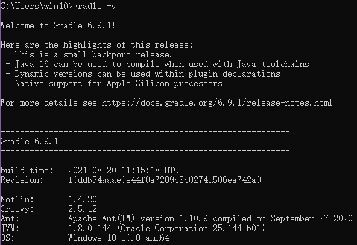
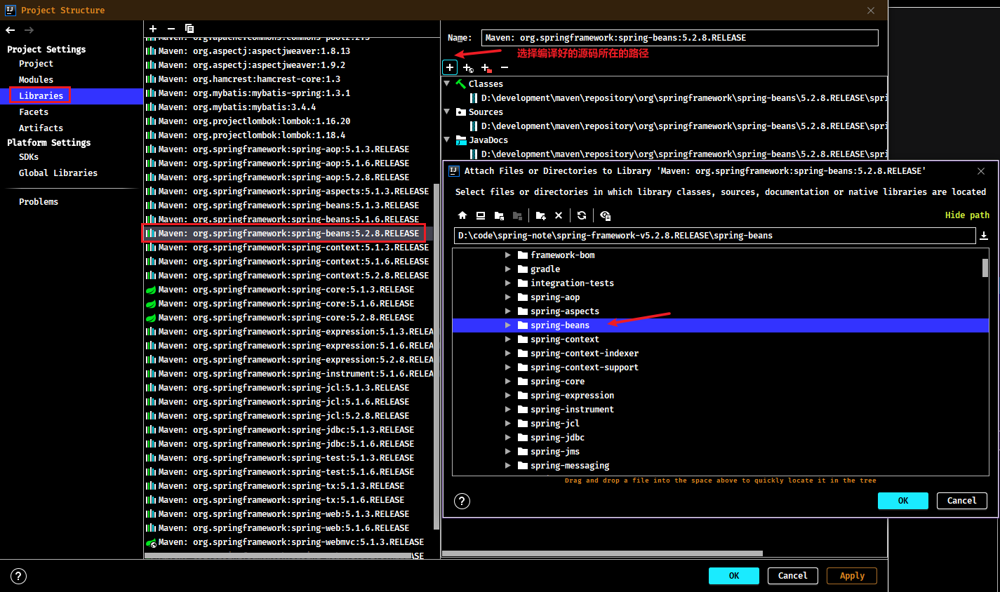

# Spring源码编译教程

## 1. Gradle 项目构建工具

### 1.1. 下载

Spring 源码是使用Gradle进行构建，需要下载与安装Gradle。

Gradle官网：https://gradle.org/

下载 gradle，需要 JDK8 及以上的版本。解压Gradle压缩包到无中文与空格的目录

### 1.2. 配置环境变量

- 配置gradle环境变量


- 配置环境变量`GRADLE_USER_HOME`，用于指定本地仓库的位置


- 通过cmd查看是否配置成功



### 1.3. 修改gradle.bat批处理脚本

- 修改Gradle的`\gradle-x.x\bin\`目录下的`gradle.bat`脚本，增加设置用户配置路径变量


### 1.4. 配置 Gradle 仓库源

在Gradle安装目录下的 `init.d` 文件夹下，新建一个 `init.gradle` 文件，添加如下配置

```
allprojects {
    repositories {
        maven { url 'file:///D:/Java/maven_repository'}
        mavenLocal()
        maven { name "Alibaba" ; url "https://maven.aliyun.com/repository/public" }
        maven { name "Bstek" ; url "http://nexus.bsdn.org/content/groups/public/" }
        mavenCentral()
    }

    buildscript {
        repositories {
            maven { name "Alibaba" ; url 'https://maven.aliyun.com/repository/public' }
            maven { name "Bstek" ; url 'http://nexus.bsdn.org/content/groups/public/' }
            maven { name "M2" ; url 'https://plugins.gradle.org/m2/' }
        }
    }
}
```

repositories 是配置获取 jar 包的顺序。以上配置是先是本地的 Maven 仓库路径；接着的 `mavenLocal()` 是获取 Maven 本地仓库的路径，是和第一条一样，但是不冲突；第三条和第四条是从国内和国外的网络上仓库获取；最后的 `mavenCentral()` 是从Apache提供的中央仓库获取 jar 包。

### 1.5. IDEA 配置 Gradle


- 将【Use Gradle From】选项改为【Specified location】，然后右侧就会出现一个框，选择Gradle安装目录（即将 `%GRADLE_HOME%` 的路径复制到这里即可）。如果是多模块项目，需要将每个模块都修改才可以。
- 修改【Gradle user home】，填写jar包保存路径（即复制环境变量中的【GRADLE_USER_HOME】的值）

这样 IDEA 的 Gradle 就配置好了。如果要更改 IDEA 的全局配置，在【Settings for New Projects】中配置即可，和 【Settings】的相似。

## 2. Spring 5.3.10

此教程是基于个人git库的Spring5.3.10源码编译的，并不是Github原生的Spring5.3.10源码，有一些差别，但都是gradle配置文件的微小改动，比如把某些依赖从optional改成compile级别（主要是为了方便编译），其他都没改动。

编译使用的IDEA版本是2021.1.3，用其他IDEA版本可能会遇到各种各样的问题。

### 2.1. 源码下载

git clone的地址为：

- 源码：https://gitee.com/mirrors/Spring-Framework/tree/v5.3.10
- 个人注释版：https://github.com/MooNkirA/spring-note

### 2.2. 修改Gradle配置

使用IDEA导入Spring源码，idea就会自动下载gradle，下载完gradle就会开始下载Spring源码依赖，因为使用自己下载的gradle，所以可以直接取消这个过程。


- 设置`Gradle user home`、`Use Gradle from`的配置

- 修改`gradle user home`为.gradle压缩包的解压之后的文件路径，比如D:\.gradle
- 将`Build and run suing`和`Run tests using`都改为`IntelliJ IDEA`


保存修改后，会自动触发gradle的重新编译。


如无自动触发编译，可以手动点击刷新


正常情况下，此时gradle编译将比较快，会有一个索引文件过程，但是不需要额外的下载gradle和依赖了。编译成功效果如下：


### 2.3. 测试运行代码

编译成功后，编写一个基础的spring测试代码


### 2.4. 相关问题


## 3. Spring 5.2.8.RELEASE

### 3.1. 源码下载与配置

1. 到github下载源码

- 源码下载地址：https://github.com/spring-projects/spring-framework
- 国内镜像：https://gitee.com/mirrors/spring-framework
- 目前源码学习的笔记更新至spring-framework 5.2.8.RELEASE，下载地址：https://gitee.com/mirrors/Spring-Framework/tree/v5.2.8.RELEASE

2. 修改源码项目的`settings.gradle`文件，增加阿里云仓库

```gradle
pluginManagement {
	repositories {
		gradlePluginPortal()
        maven { url 'https://maven.aliyun.com/repository/public' }
		maven { url 'https://repo.spring.io/plugins-release' }
	}
}
```

3. 修改源码项目的`gradle.properties`文件，修改一些参数配置

```properties
version=5.2.8.RELEASE
org.gradle.jvmargs=-Xmx2048M
org.gradle.caching=true
org.gradle.parallel=true
org.gradle.configureondemand=true
org.gradle.daemon=true
```

4. 修改源码项目的`build.gradle`文件，增加阿里云仓库

```gradle
repositories {
    maven { url 'https://maven.aliyun.com/nexus/content/groups/public/' }
    maven { url 'https://maven.aliyun.com/nexus/content/repositories/jcenter'}
	mavenCentral()
    maven { url "https://repo.spring.io/libs-spring-framework-build" }
}
```

5. 到下载的 spring 源码路径执行 gradle 命令，`gradlew :spring-oxm:compileTestJava`。编译spring-oxm模块，编译成功后会有`BUILD SUCCESSFUL`的提示。
6. 用 idea 打开 spring 源码工程，在 idea 中安装插件 kotlin，重启 idea
7. 把编译好的源码导入到工程中，这样可以在源码中写注释并且断点调试源码了。

### 3.2. 把源码导入到工程

1. 使用gradle在将相关模块的源码打成jar


2. 在Project侧边栏中的External Libraries，选择源码测试工程所依赖的spring相应的版本，右键选择【Open Library Settings】


3. 选择Libraries里的spring源码包，在Classes、Sources、Annotations中增加编译好的源码



4. 选择Classes、Sources，删除原来maven仓库的jar，改成使用源码编译后jar包


