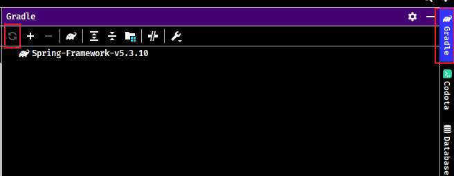
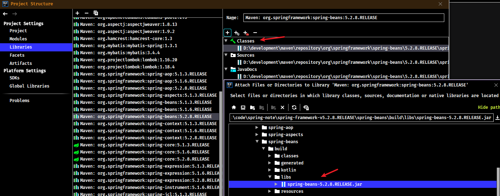
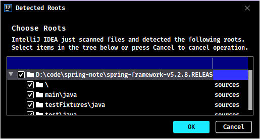

# Spring 源码编译教程

## 1. Gradle 项目构建工具

Spring 源码是使用 Gradle 进行构建，需要下载与安装 Gradle。

Gradle官网：https://gradle.org/

> 具体 Gradle 安装详见[《Gradle基础笔记》](/05-DevOps工具/01-项目构建工具/03-Gradle基础笔记)

## 2. Spring 5.3.10

此教程是基于个人 git 库的 Spring 5.3.10 源码编译的，并不是 Github 原生的 Spring 5.3.10 源码，有一些差别，但都是 gradle 配置文件的微小改动，比如把某些依赖从 optional 改成 compile 级别（主要是为了方便编译），其他都没改动。

编译使用的 IDEA 版本是 2021.1.3，用其他 IDEA 版本可能会遇到各种各样的问题。

### 2.1. 源码下载

git clone的地址为：

- 源码：https://gitee.com/mirrors/Spring-Framework/tree/v5.3.10
- 个人注释版：https://github.com/MooNkirA/spring-note

### 2.2. 修改源码项目配置与编译

1. 修改源码项目的`settings.gradle`文件，增加阿里云仓库

```gradle
pluginManagement {
	repositories {
		gradlePluginPortal()
        maven { url 'https://maven.aliyun.com/repository/public' }
		maven { url 'https://repo.spring.io/plugins-release' }
	}
}
```

2. 修改源码项目的`gradle.properties`文件，修改一些参数配置

```properties
version=5.3.10
#org.gradle.jvmargs=-Xmx1536M
org.gradle.jvmargs=-Xmx2048M
org.gradle.caching=true
org.gradle.parallel=true
kotlin.stdlib.default.dependency=false
```

3. 修改源码项目的`build.gradle`文件，增加阿里云仓库

```gradle
repositories {
    maven { url 'https://maven.aliyun.com/nexus/content/groups/public/' }
    maven { url 'https://maven.aliyun.com/nexus/content/repositories/jcenter'}
	mavenCentral()
    maven { url "https://repo.spring.io/libs-spring-framework-build" }
}
```

### 2.3. IDEA 导入源码时修改 Gradle 配置

1. 到下载的 Spring 源码路径下载执行 `gradle` 命令，`gradlew :spring-oxm:compileTestJava`。编译spring-oxm模块，编译成功后会有`BUILD SUCCESSFUL`的提示。
2. 导入IDEA (File -> New -> Project from Existing Sources -> Navigate to directory -> Select build.gradle)
3. 使用IDEA导入Spring源码，idea就会自动下载gradle，下载完gradle就会开始下载Spring源码依赖，因为使用自己下载的gradle，所以可以直接取消这个过程。


设置`Gradle user home`、`Use Gradle from`的配置

- 修改`gradle user home`为.gradle压缩包的解压之后的文件路径，比如D:\.gradle
- ~~将`Build and run suing`和`Run tests using`都改为`IntelliJ IDEA`~~


保存修改后，会自动触发gradle的重新编译。


如无自动触发编译，可以手动点击刷新



正常情况下，此时gradle编译将比较快，会有一个索引文件过程，但是不需要额外的下载gradle和依赖了。编译成功效果如下：


### 2.4. 修改源码的依赖配置

#### 2.4.1. spring-aspects 模块

修改 spring-aspects.gradle 依赖配置

```
// 原版依赖
dependencies {
	api("org.aspectj:aspectjweaver")
	compileOnly("org.aspectj:aspectjrt")
	optional(project(":spring-aop"))  // for @Async support
	optional(project(":spring-beans"))  // for @Configurable support
	optional(project(":spring-context"))  // for @Enable* support
	optional(project(":spring-context-support"))  // for JavaMail and JSR-107 support
	optional(project(":spring-orm"))  // for JPA exception translation support
	optional(project(":spring-tx"))  // for JPA, @Transactional support
	optional("javax.cache:cache-api")  // for JCache aspect
	optional("javax.transaction:javax.transaction-api")  // for @javax.transaction.Transactional support
	testImplementation(project(":spring-core"))  // for CodeStyleAspect
	testImplementation(project(":spring-test"))
	testImplementation(testFixtures(project(":spring-context")))
	testImplementation(testFixtures(project(":spring-context-support")))
	testImplementation(testFixtures(project(":spring-core")))
	testImplementation(testFixtures(project(":spring-tx")))
	testImplementation("javax.mail:javax.mail-api")
	testCompileOnly("org.aspectj:aspectjrt")
}


// 修改后
dependencies {
	compile("org.aspectj:aspectjweaver")
	compileOnly("org.aspectj:aspectjrt")
	optional(project(":spring-aop"))  // for @Async support
	optional(project(":spring-beans"))  // for @Configurable support
	optional(project(":spring-context"))  // for @Enable* support
	optional(project(":spring-context-support"))  // for JavaMail and JSR-107 support
	optional(project(":spring-orm"))  // for JPA exception translation support
	optional(project(":spring-tx"))  // for JPA, @Transactional support
	optional("javax.cache:cache-api")  // for JCache aspect
	optional("javax.transaction:javax.transaction-api")  // for @javax.transaction.Transactional support
	testCompile(project(":spring-core"))  // for CodeStyleAspect
	testCompile(project(":spring-test"))
	testCompile(testFixtures(project(":spring-context")))
	testCompile(testFixtures(project(":spring-context-support")))
	testCompile(testFixtures(project(":spring-core")))
	testCompile(testFixtures(project(":spring-tx")))
	testCompile("javax.mail:javax.mail-api")
	testCompileOnly("org.aspectj:aspectjrt")
}
```


### 2.5. 测试运行代码

编译成功后，编写一个基础的spring测试代码


### 2.6. 相关问题


## 3. Spring 5.2.8.RELEASE

### 3.1. 源码下载与配置

1. 到github下载源码

- 源码下载地址：https://github.com/spring-projects/spring-framework
- 国内镜像：https://gitee.com/mirrors/spring-framework
- 目前源码学习的笔记更新至spring-framework 5.2.8.RELEASE，下载地址：https://gitee.com/mirrors/Spring-Framework/tree/v5.2.8.RELEASE

2. 修改源码项目的`settings.gradle`文件，增加阿里云仓库

```gradle
pluginManagement {
	repositories {
		gradlePluginPortal()
        maven { url 'https://maven.aliyun.com/repository/public' }
		maven { url 'https://repo.spring.io/plugins-release' }
	}
}
```

3. 修改源码项目的`gradle.properties`文件，修改一些参数配置

```properties
version=5.2.8.RELEASE
org.gradle.jvmargs=-Xmx2048M
org.gradle.caching=true
org.gradle.parallel=true
org.gradle.configureondemand=true
org.gradle.daemon=true
```

4. 修改源码项目的`build.gradle`文件，增加阿里云仓库

```gradle
repositories {
    maven { url 'https://maven.aliyun.com/nexus/content/groups/public/' }
    maven { url 'https://maven.aliyun.com/nexus/content/repositories/jcenter'}
	mavenCentral()
    maven { url "https://repo.spring.io/libs-spring-framework-build" }
}
```

5. 到下载的 spring 源码路径执行 gradle 命令，`gradlew :spring-oxm:compileTestJava`。编译spring-oxm模块，编译成功后会有`BUILD SUCCESSFUL`的提示。
6. 用 idea 打开 spring 源码工程，在 idea 中安装插件 kotlin，重启 idea
7. 把编译好的源码导入到工程中，这样可以在源码中写注释并且断点调试源码了。

### 3.2. 把源码导入到工程

1. 使用gradle在将相关模块的源码打成jar


2. 在Project侧边栏中的External Libraries，选择源码测试工程所依赖的spring相应的版本，右键选择【Open Library Settings】


3. 选择Libraries里的spring源码包，在Classes、Sources、Annotations中增加编译好的源码


4. 选择Classes、Sources，删除原来maven仓库的jar，改成使用源码编译后jar包





