# Spring 源码编译教程

## 1. Gradle 项目构建工具

Spring 源码是使用 Gradle 进行构建，需要下载与安装 Gradle。

Gradle官网：https://gradle.org/

> 具体 Gradle 安装详见[《Gradle基础笔记》](/05-DevOps工具/01-项目构建工具/03-Gradle基础笔记)

## 2. Spring 源码编译流程

> 个人编译是使用 IDEA，可以直接参考源码工程中的《import-into-idea.md》文档

### 2.1. 修改源码项目配置

1. 修改源码项目的 `settings.gradle` 文件，增加阿里云仓库 spring 插件库

```gradle
pluginManagement {
	repositories {
		gradlePluginPortal()
        // 阿里云仓库 spring-plugin (旧版)
        // maven { url 'https://maven.aliyun.com/repository/public' }
        // 阿里云仓库 spring-plugin (新版)
        maven { url 'https://maven.aliyun.com/repository/spring-plugin' }
		maven { url 'https://repo.spring.io/plugins-release' }
	}
}
```

2. 修改源码项目的 `gradle.properties` 文件，修改一些参数配置

```properties
version=5.3.10
#org.gradle.jvmargs=-Xmx1536M
org.gradle.jvmargs=-Xmx2048M
org.gradle.caching=true
org.gradle.parallel=true
kotlin.stdlib.default.dependency=false
```

3. 修改源码项目的`build.gradle`文件，增加阿里云仓库

```gradle
repositories {
    // 添加 maven 本地仓库
    mavenLocal()
    // 阿里云仓库地址(老版)
	// maven { url 'https://maven.aliyun.com/nexus/content/groups/public/' }
	// maven { url 'https://maven.aliyun.com/nexus/content/repositories/jcenter'}
    // 阿里云仓库地址(新版)
	maven { url 'https://maven.aliyun.com/repository/public' }
	maven { url 'https://maven.aliyun.com/repository/central'}
	mavenCentral()
    maven { url "https://repo.spring.io/libs-spring-framework-build" }
}
```

### 2.2. 编译项目

进入 Spring 源码工程根目录，执行 `gradle` 命令。

```bash
gradlew :spring-oxm:compileTestJava
```

编译 spring-oxm 模块，编译成功后会有“BUILD SUCCESSFUL”的提示。

### 2.3. 导入源码

导入IDEA (File -> New -> Project from Existing Sources -> Navigate to directory -> Select build.gradle)

使用 IDEA 导入 Spring 源码，idea 默认会根据 ${spring.dir}\gradle\wrapper\gradle-wrapper.properties 文件的配置，自动下载 gradle，下载完 gradle 就会开始下载 Spring 源码依赖。若使用本机安装好的 gradle，可以直接取消这个过程。


> Notes: 
>
> 1. 用 idea 打开 spring 源码工程，需要检查是否已经安装 kotlin 插件。如果安装，则需要重启 idea
> 2. 需要先按上一个步骤编译工程后再导入

### 2.4. IDEA 的 Gradle 配置

打开【Settings】面板，选择【Build, Execution, Deployment】->【Gradle】

- 设置【Gradle user home】，用于设置 Gradle 缓存、依赖、.gradle 压缩包的解压之后的文件等保存路径。比如设置为 `D:\.gradle`
- 设置【Build and run using】和【Run tests using】
    - `Gradle (Default)`：使用 Gradle 来构建项目和运行任务。
    - `IntelliJ IDEA`：选择使用 IDEA 来构建和运行项目，对于一些纯JAVA/Kotlin项目，使用这种方式可能会更快。但 IDEA 并不是支持所有 Gradle 插件，项目如果使用其中一些插件可能无法正确构建项目。

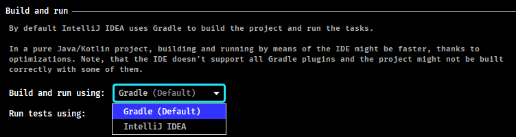

- 设置【Use Gradle from】，用于配置使用的 Gradle 位置，具体选项如下：
    - `'gradle-wrapper.properties' file`：使用导入工程中的 gradle-wrapper.properties 文件中配置
    - `'wrapper' task in Gradle build script`：使用 Gradle 构建脚本中的'wrapper'任务
    - `Specified location`：指定 Gradle 的安装位置

最终配置示例如下（按需修改各个配置项）：


保存修改后，会自动触发gradle的重新编译。


如无自动触发编译，可以手动点击刷新


正常情况下，此时gradle编译将比较快，会有一个索引文件过程，但是不需要额外的下载gradle和依赖了。编译成功效果如下：


### 2.5. 排除 spring-aspects 模块

在源码编译的过程中，可能会出现以下错误：

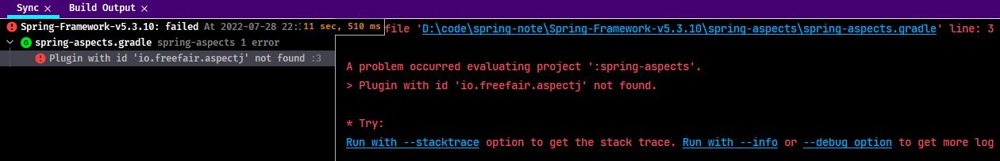

是因为 `spring-aspects` 模块编译时是依赖ajc编译器，这个 IntelliJ IDEA 没有默认安装。只要将 spring-aspects 模块排除即可。排除的步骤如下：

1. 右键项目，选择【Load/Unload Modules...】

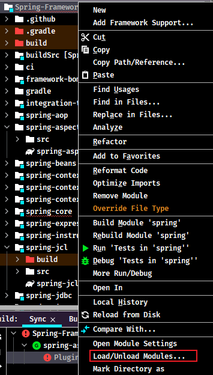

2. 选择 spring-aspects 模块 unloaded

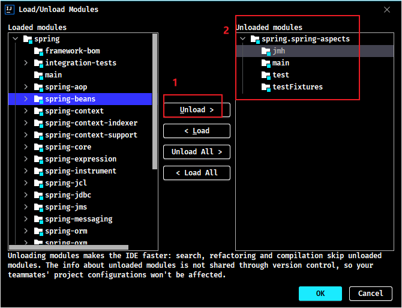

3. 修改工程的根目录的 settings.gradle 文件，移除 spring-aspects 模块

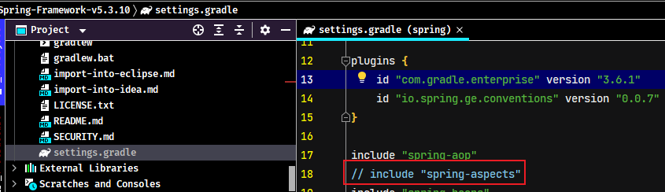

4. 点击刷新，重新编译。

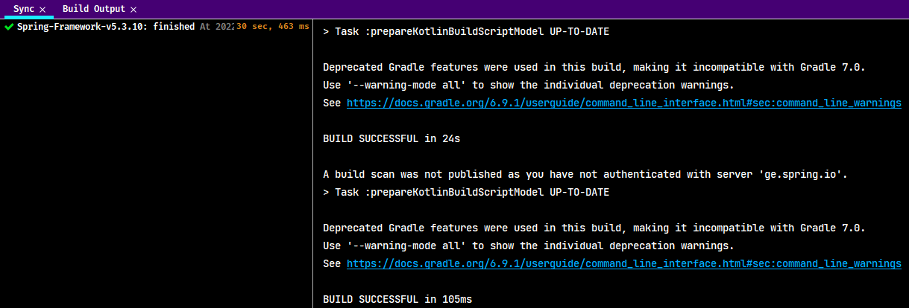

### 2.6. AspectJ 编译器（非必须）

安装 AspectJ 编译器插件是为了解决使用 AOP 相关测试

#### 2.6.1. 下载与安装

AspectJ 官网下载 AspectJ 编译器

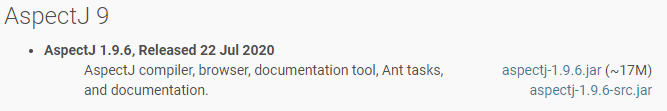

值得注意：官网下载页面中，只有1.9.6版本，1.9.7往后的版本都在github仓库发布

- 1.9.6 及以前版本，下载地址：https://www.eclipse.org/aspectj/downloads.php
- 1.9.7+ 版本，下载地址：https://github.com/eclipse/org.aspectj/releases/

下载完成后，进入 jar 包所在目录吕，执行以下命令安装ajc编译器。

```bash
java -jar aspectj-1.9.5.jar
```

选择jdk目录

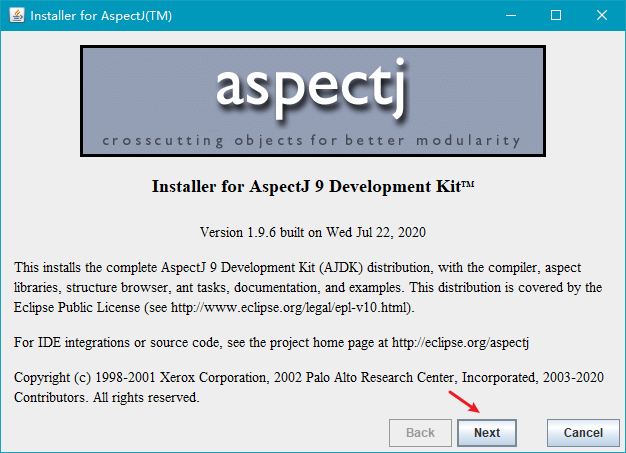

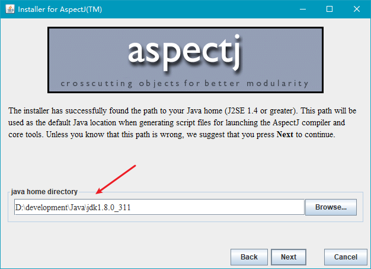

选择安装的目录安装即可

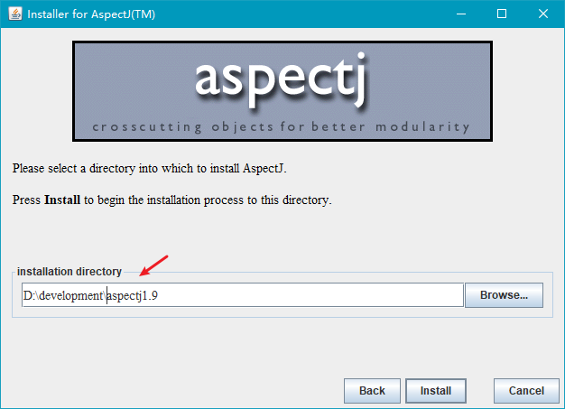

#### 2.6.2. IDEA 设置 AspectJ 编译器

1. 打开 Idea，先安装 Aspectj 插件，并启用此插件

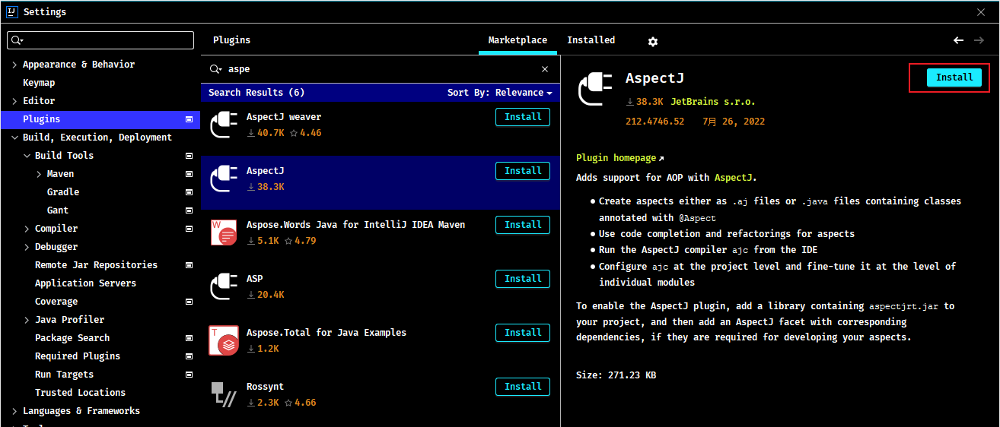

2. 将 IDEA 编译器设置为 ajc，然后设置 AspectJ 安装目录下的 lib 文件夹中的 aspectjtools.jar 文件，再勾选【Delegate to Javac】选项。

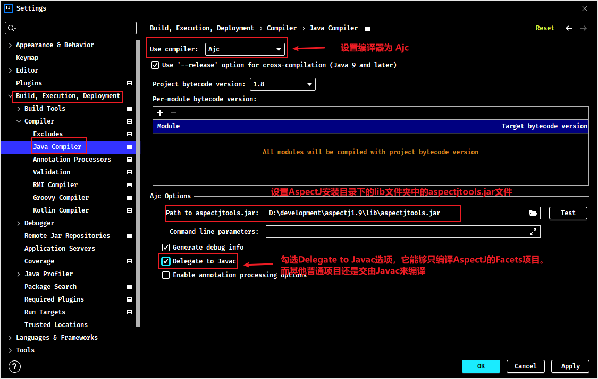

3. 点选【File】->【Project Structure】->【Modules】，将 spring-aop_main 和 spring-aspectjs_main 两个模块添加 AspectJ Facets，

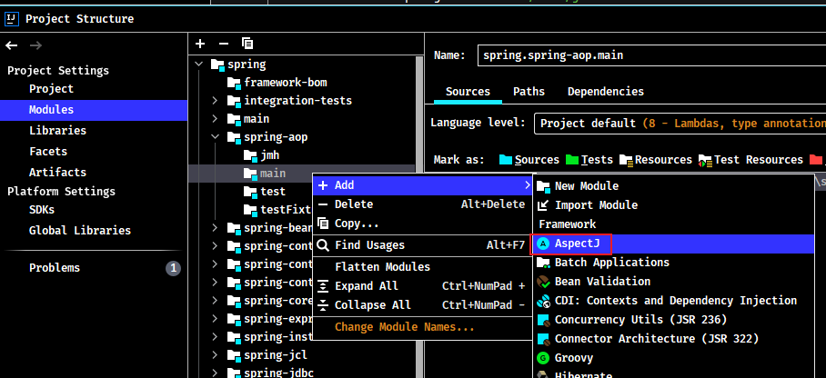

4. 把项目重新 build project，然后再成功运行 AOP 相关测试。即源码中可以使用 aspectj aop 了。

> 参考（待删）：https://blog.csdn.net/weixin_41657488/article/details/110223801

## 3. Spring 各版本的下载地址

### 3.1. Spring 5.3.10

此教程是基于个人 git 库的 Spring 5.3.10 源码编译的，并不是 Github 原生的 Spring 5.3.10 源码，有一些差别，但都是 gradle 配置文件的微小改动，比如把某些依赖从 optional 改成 compile 级别（主要是为了方便编译），其他都没改动。

编译使用的 IDEA 版本是 2021.1.3，用其他 IDEA 版本可能会遇到各种各样的问题。

git clone 的地址为：

- 源码：https://gitee.com/mirrors/Spring-Framework/tree/v5.3.10
- 个人注释版：https://github.com/MooNkirA/spring-note

### 3.2. Spring 5.2.8.RELEASE

- 源码下载地址：https://github.com/spring-projects/spring-framework
- 国内镜像：https://gitee.com/mirrors/spring-framework
- 目前源码学习的笔记更新至spring-framework 5.2.8.RELEASE，下载地址：https://gitee.com/mirrors/Spring-Framework/tree/v5.2.8.RELEASE

## 4. 注释的源码引用

### 4.1. 方式一：直接在源码工程中创建测试代码

像 maven 工程一样，在源码工程中创建自定义的测试示例等模块，直接依赖本源码工程各个模块即可。

> Tips: 此方式就很方便边看源码，边调试。但需要有 Gradle 工具的知识。

### 4.2. 方式一：测试的工程引入编译打包后的源码包

把编译好的源码导入到工程中，这样可以在源码中写注释并且断点调试源码了。如果想让其他工程（或者maven工程）依赖自己注释过的源码包，需要进行如下操作：

1. 使用 gradle 在将相关模块的源码打成 jar


2. 在【Project】侧边栏中的【External Libraries】，选择源码测试工程所依赖的 spring 相应的版本，右键选择【Open Library Settings】


3. 选择【Libraries】里的 spring 源码包，在 Classes、Sources、Annotations 中选择编译打包后的源码


4. 选择 Classes、Sources，删除原来maven仓库的jar，改成使用源码编译后jar包


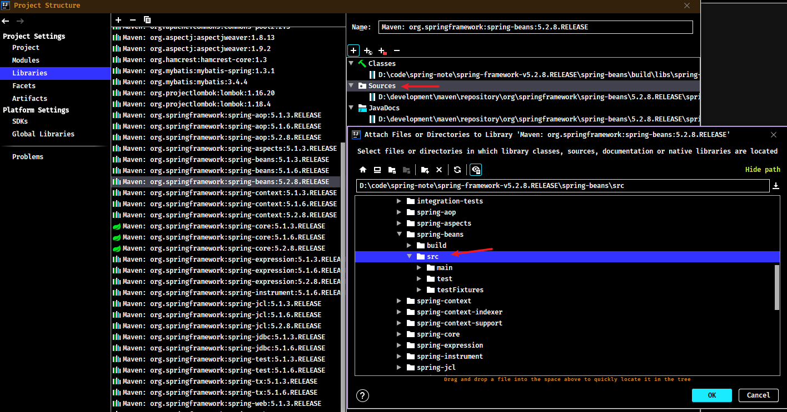


> Tips: 这种方式唯一的好处就是可以使用 maven 来构建测试工程，然后引用编译后 class 包。但这种方式不好的地方是，如果源码有任何修改，需要重新编译打包，示例项目需要重新进行引用。

## 5. 编译的相关问题
