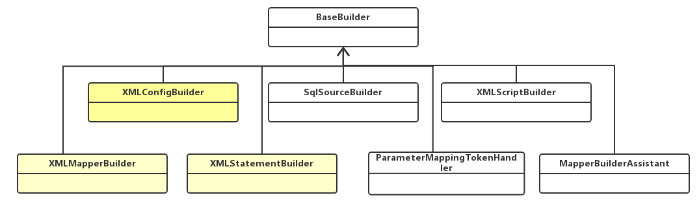

# MyBatis 源码笔记

## 1. MyBatis 源码概述

### 1.1. MyBatis 源码获取

MyBatis 源码下载地址：`https://github.com/MyBatis/MyBatis-3`

> 直接用`mybatis-3-master（注释版）.zip`的源码包，在里面加注释

源码包导入过程：

1. 下载 MyBatis 的源码
2. 检查 maven 的版本，必须是 3.25 以上，建议使用 maven 的最新版本
3. MyBatis 的工程是 maven 工程，在开发工具中导入，工程必须使用 jdk1.8 以上版本；
4. <font color=red>**把 MyBatis 源码的 pom 文件中`<optional>true</optional>`，全部改为 false或者注释掉，因为这个会阻断依赖的传递，会导致自己做的demo示例无法依赖到mybatis所依赖的第三方的jar包**</font>；
5. 在工程目录下执行 mvn clean install -Dmaven.test.skip=true,将当前工程安装到本地仓库（pdf 插件报错的话，需要将这个插件屏蔽）；
    - > 注意：安装过程中会可能会有很多异常信息，只要不中断运行，请耐心等待；
6. 其他工程依赖此工程

### 1.2. 源码架构分析

#### 1.2.1. 物理分层


> 完整思维导图详见：D:\【Moon】\Java\编程资料思维导图\MyBatis源码结构.xmind

#### 1.2.2. 逻辑分层

MyBatis 源码共 16 个模块，可以分成三层


- 基础支撑层：技术组件专注于底层技术实现，通用性较强无业务含义；
- 核心处理层：业务组件专注 MyBatis 的业务流程实现，依赖于基础支撑层；
- 接口层：MyBatis 对外提供的访问接口，面向 SqlSession 编程；

> 拓展思考问题：系统为什么要分层？
>
> 1. 代码和系统的可维护性更高。系统分层之后，每个层次都有自己的定位，每个层次内部的组件都有自己的分工，系统就会变得很清晰，维护起来非常明确；
> 2. 方便开发团队分工和开发效率的提升；举个例子，mybatis 这么大的一个源码框架不可能是一个人开发的，他需要一个团队，团队之间肯定有分工，既然有了层次的划分，分工也会变得容易，开发人员可以专注于某一层的某一个模块的实现，专注力提升了，开发效率自然也会提升
> 3. 提高系统的伸缩性和性能。系统分层之后，只要把层次之间的调用接口明确了，那就可以从逻辑上的分层变成物理上的分层。当系统并发量吞吐量上来了，怎么办？为了提高系统伸缩性和性能，可以把不同的层部署在不同服务器集群上，不同的组件放在不同的机器上，用多台机器去抗压力，这就提高了系统的性能。压力大的时候扩展节点加机器，压力小的时候，压缩节点减机器，系统的伸缩性就是这么来的

## 2. MyBatis涉及的设计模式

### 2.1. 外观模式（门面模式）

从源码的架构分析，特别是接口层的设计，MyBatis的整体架构的设计模式符合外观模式

门面模式定义：提供了一个统一的接口，用来访问子系统中的一群接口。外观模式定义了一个高层接口，让子系统更容易使用。类图如下：


- **Facade 角色**：提供一个外观接口，对外，它提供一个易于客户端访问的接口，对内，它可以访问子系统中的所有功能。
- **SubSystem（子系统）角色**：子系统在整个系统中可以是一个或多个模块，每个模块都有若干类组成，这些类可能相互之间有着比较复杂的关系

门面模式优点：使复杂子系统的接口变的简单可用，减少了客户端对子系统的依赖，达到了解耦的效果；遵循了 OO 原则中的迪米特法则，对内封装具体细节，对外只暴露必要的接口。

- 门面模式使用场景：
    - 一个复杂的模块或子系统提供一个供外界访问的接口
    - 子系统相对独立，外界对子系统的访问只要黑箱操作即可

### 2.2. 面向对象设计需要遵循的六大设计原则

> 学习源码除了学习编程的技巧、经验之外，最重要的是学习源码的设计的思想以及设计模式的灵活应用

1. **单一职责原则**：一个类或者一个接口只负责唯一项职责，尽量设计出功能单一的接口；
2. **依赖倒转原则**：高层模块不应该依赖低层模块具体实现，解耦高层与低层。简单来说，既**面向接口编程**，当实现发生变化时，只需提供新的实现类，不需要修改高层模块代码
3. **开放-封闭原则**：程序对外扩展开放，对修改关闭；换句话说，当需求发生变化时，可以通过添加新模块来满足新需求，而不是通过修改原来的实现代码来满足新需求
4. **迪米特法则**：一个对象应该对其他对象保持最少的了解，尽量降低类与类之间的耦合度。实现这个原则，要注意以下两点：
    1. 在做类结构设计的时候尽量降低成员的访问权限，能用 private 的尽量用 private；
    2. 在类之间，如果没有必要直接调用，就不要有依赖关系；这个法则强调的还是类之间的松耦合；
5. **里氏代换原则**：所有引用基类（父类）的地方必须能透明地使用其子类的对象；
6. **接口隔离原则**：客户端不应该依赖它不需要的接口，一个类对另一个类的依赖应该建立在最小的接口上

### 2.3. 建造者模式

#### 2.3.1. 什么是建造者模式

在配置加载阶段大量的使用了建造者模式，首先学习建造者模式。建造者模式（Builder Pattern）使用多个简单的对象一步一步构建成一个复杂的对象。这种类型的设计模式属于创建型模式，它提供了一种创建对象的最佳方式。建造者模式类图如下：


建造者模式中主要的元素是：

- `Product`：要创建的复杂对象
- `Builder`：给出一个抽象接口，以规范产品对象的各个组成成分的建造。这个接口规定要实现复杂对象的哪些部分的创建，并不涉及具体的对象部件的创建；
- `ConcreteBuilder`：实现`Builder`接口，针对不同的商业逻辑，具体化复杂对象的各部分的创建。 在建造过程完成后，提供产品的实例；
- `Director`：调用具体建造者来创建复杂对象的各个部分，在指导者中不涉及具体产品的信息，只负责保证对象各部分完整创建或按某种顺序创建

> **关于建造器模式的扩展知识**：流式编程风格越来越流行，如 zookeeper 的 Curator、JDK8 的流式编程等等都是例子。流式编程的优点在于代码编程性更高、可读性更好，缺点在于对程序员编码要求更高、不太利于调试。建造者模式是实现流式编程风格的一种方式。

#### 2.3.2. 与工厂模式区别

建造者模式应用场景如下：

- 需要生成的对象具有复杂的内部结构，实例化对象时要屏蔽掉对象内部的细节，让上层代码与复杂对象的实例化过程解耦，可以使用建造者模式；简而言之，如果“遇到多个构造器参数时要考虑用构建器”
- 对象的实例化是依赖各个组件的产生以及装配顺序，关注的是一步一步地组装出目标对象，可以使用建造器模式

建造者模式与工程模式的区别在于：

|  设计模式  |                                       对象复杂度                                       |                                   客户端参与程度                                    |
| --------- | ------------------------------------------------------------------------------------- | ---------------------------------------------------------------------------------- |
| 工厂模式   | 关注的是一个产品整体，无须关心产品的各部分是如何创建出来的                                   | 客户端对产品的创建过程参与度低，对象实例化时属性值相对比较固定                            |
| 建造者模式 | 建造的对象更加复杂，是一个复合产品，它由各个部件复合而成，部件不同产品对象不同，生成的产品粒度细 | 客户端参与了产品的创建，决定了产品的类型和内容，参与度高；适合实例化对象时属性变化频繁的场景 |

## 3. 日志模块分析

### 3.1. 日志模块需求分析

1. MyBatis 没有提供日志的实现类，需要接入第三方的日志组件，但第三方日志组件都有各自的 Log 级别，且各不相同，而 MyBatis 统一提供了 trace、debug、warn、error 四个级别；
2. 自动扫描日志实现，并且第三方日志插件加载优先级如下：slf4J --> commonsLoging --> Log4J2 --> Log4J --> JdkLog;
3. 日志的使用要优雅的嵌入到主体功能中

### 3.2. 适配器模式

日志模块的第一个需求是一个典型的使用适配器模式的场景。

**适配器模式（Adapter Pattern）**是作为两个不兼容的接口之间的桥梁，将一个类的接口转换成客户希望的另外一个接口。适配器模式使得原本由于接口不兼容而不能一起工作的那些类可以一起工作；类图如下：


- Target：目标角色，期待得到的接口
- Adaptee：适配者角色，被适配的接口
- Adapter：适配器角色，将源接口转换成目标接口

适用场景：当调用双方都不太容易修改的时候，为了复用现有组件可以使用适配器模式；在系统中接入第三方组件的时候经常被使用到；

> 注意适配器使用的缺点：如果系统中存在过多的适配器，会增加系统的复杂性，设计人员应考虑对系统进行重构

- MyBatis 日志模块是怎么使用适配器模式？实现如下
    - Target：目标角色，期待得到的接口。org.apache.ibatis.logging.Log 接口，对内提供了统一的日志接口
    - Adaptee：适配者角色，被适配的接口。其他日志组件组件如 slf4J、commonsLoging、Log4J2 等被包含在适配器中。
    - Adapter：适配器角色，将源接口转换成目标接口。针对每个日志组件都提供了适配器，每个适配器都对特定的日志组件进行封装和转换；如 Slf4jLoggerImpl、JakartaCommonsLoggingImpl 等

日志模块适配器结构类图：


**总结：日志模块实现采用适配器模式，日志组件（Target）、适配器以及统一接口（Log 接口）定义清晰明确符合单一职责原则；同时，客户端在使用日志时，面向 Log 接口编程，不需要关心底层日志模块的实现，符合依赖倒转原则；最为重要的是，如果需要加入其他第三方日志框架，只需要扩展新的模块满足新需求，而不需要修改原有代码，这又符合了开闭原则**


### 3.3. 怎么实现优先加载日志组件

见 org.apache.ibatis.logging.LogFactory 中的静态代码块，通过静态代码块确保第三方日志插件加载优先级如下：slf4J → commonsLoging → Log4J2 → Log4J → JdkLog。在`tryImplementation`方法，会判断适配器的构造方法是否为空，为空时才会执行

```java
public final class LogFactory {
  ...
  // 被选定的第三方日志组件适配器的构造方法
  private static Constructor<? extends Log> logConstructor;

  // 自动扫描日志实现，并且第三方日志插件加载优先级如下：slf4J → commonsLoging → Log4J2 → Log4J → JdkLog
  static {
    tryImplementation(LogFactory::useSlf4jLogging);
    tryImplementation(LogFactory::useCommonsLogging);
    tryImplementation(LogFactory::useLog4J2Logging);
    tryImplementation(LogFactory::useLog4JLogging);
    tryImplementation(LogFactory::useJdkLogging);
    tryImplementation(LogFactory::useNoLogging);
  }
  ......

  private static void tryImplementation(Runnable runnable) {
    // 当构造方法不为空才执行方法
    if (logConstructor == null) {
      try {
        runnable.run();
      } catch (Throwable t) {
        // ignore
      }
    }
  }

  // 通过指定的log类来初始化构造方法
  private static void setImplementation(Class<? extends Log> implClass) {
    try {
      Constructor<? extends Log> candidate = implClass.getConstructor(String.class);
      Log log = candidate.newInstance(LogFactory.class.getName());
      if (log.isDebugEnabled()) {
        log.debug("Logging initialized using '" + implClass + "' adapter.");
      }
      logConstructor = candidate;
    } catch (Throwable t) {
      throw new LogException("Error setting Log implementation.  Cause: " + t, t);
    }
  }
  .....
}
```

### 3.4. 代理模式和动态代理(知识回顾)

- 代理模式定义：给目标对象提供一个代理对象，并由代理对象控制对目标对象的引用；
- 目的：
    1. 通过引入代理对象的方式来间接访问目标对象，防止直接访问目标对象给系统带来的不必要复杂性；
    2. 通过代理对象对原有的业务增强；
- 代理模式类图


- 代理模式有**静态代理**和**动态代理**两种实现方式

#### 3.4.1. 静态代理

- 静态代理方式需要代理对象和目标对象实现一样的接口
- 优点：可以在不修改目标对象的前提下扩展目标对象的功能
- 缺点：
    - 冗余。由于代理对象要实现与目标对象一致的接口，会产生过多的代理类
    - 不易维护。一旦接口增加方法，目标对象与代理对象都要进行修改

#### 3.4.2. 动态代理

- 动态代理利用了 JDK API，动态地在内存中构建代理对象，从而实现对目标对象的代理功能
- 动态代理又被称为 JDK 代理或接口代理。静态代理与动态代理的区别主要在
    1. 静态代理在编译时就已经实现，编译完成后代理类是一个实际的 class 文件
    2. 动态代理是在运行时动态生成的，即编译完成后没有实际的 class 文件，而是在运行时动态生成类字节码，并加载到 JVM 中
- **注意：动态代理对象不需要实现接口，但是要求目标对象必须实现接口，否则不能使用动态代理**

JDK 中生成代理对象主要涉及两个类/接口

- 第一个为 `java.lang.reflect.Proxy` 类，通过静态方法 `newProxyInstance` 生成代理对象
- 第二个为 `java.lang.reflect.InvocationHandler` 接口，通过 `invoke` 方法对业务进行增强

### 3.5. 优雅的增强日志功能

通过观察Mybatis框架的日志打印信息，总结框架对如下几个位置需要打日志：

1. 在创建 prepareStatement 时，打印执行的 SQL 语句；
2. 访问数据库时，打印参数的类型和值
3. 查询出结构后，打印结果数据条数

因此Mybatis框架在日志模块中有 BaseJdbcLogger、ConnectionLogger、PreparedStatementLogger 和 ResultSetLogger 通过动态代理负责在不同的位置打印日志；几个相关类的类图如下：


- `BaseJdbcLogger`：所有日志增强的抽象基类，用于记录 JDBC 那些方法需要增强，保存运行期间 sql 参数信息
- `ConnectionLogger`：负责打印连接信息和 SQL 语句。通过动态代理，对 connection 进行增强，如果是调用 prepareStatement、prepareCall、createStatement 的方法，打印要执行的 sql 语句并返回 prepareStatement 的代理对象（PreparedStatementLogger），让prepareStatement 也具备日志能力，打印参数
- `PreparedStatementLogger`：对 prepareStatement 对象增强，增强的点如下：
    - 增强 PreparedStatement 的 setxxx 方法将参数设置到 columnMap、columnNames、columnValues，为打印参数做好准备
    - 增强 PreparedStatement 的 execute 相关方法，当方法执行时，通过动态代理打印参数,返回动态代理能力的 resultSet
    - 如果是查询，增强 PreparedStatement 的 getResultSet 方法，返回动态代理能力的 resultSet；如果是更新，直接打印影响的行数
- `ResultSetLogger`：负责打印数据结果信息
- `StatementLooger`：与PreparedStatementLogger一样，只是打印没有预编译的SQL语句


#### 3.5.1. 日志功能是如何加入主体功能中

既然在 Mybatis 中 Executor 才是访问数据库的组件，日志功能是在 Executor 中被嵌入的，具体代码在`org.apache.ibatis.executor.SimpleExecutor.prepareStatement(StatementHandler, Log)`方法中


## 4. 数据源模块分析

数据源模块重点：数据源的创建和数据库连接池（*池化技术*）的源码分析；数据源创建比较复杂，对于复杂对象的创建，可以考虑使用工厂模式来优化，接下来介绍下简单工厂模式和工厂模式

### 4.1. 简单工厂模式

### 4.2. 工厂模式

### 4.3. 数据源的创建

数据源对象是比较复杂的对象，其创建过程相对比较复杂，对于 MyBatis 创建一个数据源，具体来讲有如下难点

1. 常见的数据源组件都实现了 `javax.sql.DataSource` 接口
2. MyBatis 不但要能集成第三方的数据源组件，自身也提供了数据源的实现
3. 一般情况下，数据源的初始化过程参数较多，比较复杂
- 综上所述，数据源的创建是一个典型使用工厂模式的场景，实现类图如下所示

**需求补充工厂模式的类图**

- `DataSource`：数据源接口，JDBC 标准规范之一，定义了获取获取 Connection 的方法
- `UnPooledDataSource`：不带连接池的数据源，获取连接的方式和手动通过 JDBC 获取连接的方式是一样的
- `PooledDataSource`：带连接池的数据源，提高连接资源的复用性，避免频繁创建、关闭连接资源带来的开销
- `DataSourceFactory`：工厂接口，定义了创建 Datasource 的方法
- `UnpooledDataSourceFactory`：工厂接口的实现类之一，用于创建 UnpooledDataSource(不带连接池的数据源)
- `PooledDataSourceFactory`：工厂接口的实现类之一，用于创建 PooledDataSource（带连接池的数据源）

# MyBatis 源码流程解析

## 1. MyBatis 基础执行流程分析

使用MyBatis完成一次数据库基础操作的代码如下：

```java
@Test
public void testMyBatisGetMapper() {
    try {
        // ----------------------------------------- 第一阶段 -----------------------------------------
        // 从 XML 文件中构建 SqlSessionFactory 的实例非常简单，建议使用类路径下的资源文件进行配置。
        // MyBatis 包含一个名叫 Resources 的工具类，它包含一些实用方法，可以使类路径或其它位置加载资源文件
        InputStream inputStream = Resources.getResourceAsStream("mybatis-config.xml");
        // 读取配置文件，创建SqlSessionFactory
        SqlSessionFactory sqlSessionFactory = new SqlSessionFactoryBuilder().build(inputStream);

        // ----------------------------------------- 第二阶段 -----------------------------------------
        // 通过SqlSessionFactory开启一个SqlSession
        SqlSession sqlSession = sqlSessionFactory.openSession();
        // 通过SqlSession获取指定的mapper映射器（其实是Mapper接口的代理）
        CommonMapper mapper = sqlSession.getMapper(CommonMapper.class);

        // ----------------------------------------- 第三阶段 -----------------------------------------
        // 通过代理实例调用相应Mapper接口中的方法
        System.out.println(mapper.queryAreaByAreaCode(new HashMap<>()));
    } catch (IOException e) {
        e.printStackTrace();
    }
}
```

通过对快速入门代码的分析，可以把 MyBatis 的运行流程分为三大阶段：

1. 初始化阶段：读取 XML 配置文件和注解中的配置信息，创建配置对象，并完成各个模块的初始化的工作。
2. 代理封装阶段：封装 iBatis 的编程模型，使用 mapper 接口开发的初始化工作。
3. 数据访问阶段：通过 SqlSession 完成 SQL 的解析，参数的映射、SQL 的执行、结果的解析过程。

## 2. 第一阶段：加载与解析配置

### 2.1. 配置加载的核心类

#### 2.1.1. 建造器三个核心类

在 MyBatis 中负责加载配置文件的核心类有三个，类图如下：



- `BaseBuilder`：所有解析器的父类，包含配置文件实例，为解析文件提供的一些通用的方法；
- `XMLConfigBuilder`：主要负责解析总配置文件 mybatis-config.xml；
- `XMLMapperBuilder`：主要负责解析映射配置 Mapper.xml 文件；
- `XMLStatementBuilder`：主要负责解析映射配置文件中的 SQL 节点；

#### 2.1.2. 三个核心类分工示意图

`XMLConfigBuilder`、`XMLMapperBuilder`、`XMLStatementBuilder` 这三个类在配置文件加载过程中非常重要，具体分工如下图所示：


这三个类使用了建造者模式对 configuration 对象进行初始化，使用建造者模式屏蔽复杂对象的创建过程，把建造者模式演绎成了工厂模式。

### 2.2. MyBatis启动入口

根据MyBatis基础的执行代码可知，通过`new SqlSessionFactoryBuilder().build(inputStream);`可创建`SqlSessionFactory`实例，这也是MyBatis项目的启动入口


### 2.3. 配置加载过程

第一个阶段配置加载过程分解为四个步骤，四个步骤如下图：


#### 2.3.1. 核心配置文件读取

通过`SqlSessionFactoryBuilder`建造`SqlSessionFactory`，并创建`XMLConfigBuilder`对象读取MyBatis核心配置文件。具体代码如下：


#### 2.3.2. parseConfiguration 配置元素解析

进入`XMLConfigBuilder`的`parseConfiguration`方法，对MyBatis核心配置文件的各个元素进行解析，读取元素信息后填充到`Configuration`对象。重点关注以下几点：

- 在`XMLConfigBuilder`的`typeAliasesElement()`方法中会解析总配置文件中`<typeAliases>`别名标签，进行别名的注册（**重点关注一下Mybatis扫描类的逻辑，比较与spring的不同点**）
    - 在指定包扫描的处理逻辑中，有`VFS.getInstance()`的方法获取`VFS`单例实例的方法，这里**使用静态内部类来创建外部类实例的方式来实现单例模式**，因为静态内部在jvm加载的时候就会初始化，并且内存中只会存在一份，jvm的初始化时是线程互斥的（*此处值得关注，具体这种单例实现的方式说明详见 \01-Java&JavaWeb\01-JavaSE基础\20-设计模式.md*）
- 在`XMLConfigBuilder`的`mapperElement()`方法中通过`XMLMapperBuilder`对象读取所有 mapper.xml 映射文件


#### 2.3.3. Mapper.xml 配置文件的解析


#### 2.3.4. Mapper.xml 中 select、insert、update、delete 节点的解析


## 3. Configuration 类

### 3.1. 类作用简述

`Configuration`，里面包含了配置的信息、反射工厂、对象工厂、代理工厂等数据是一个非常庞大的类。**在整个Mybatis流程中无处不在，需要重点关注**

实例化并初始化 `Configuration` 对象是第一个阶段的最终目的。该类的关键属性解析如下：

```java
public class Configuration {
    ....省略
    // 映射注册表
    protected final MapperRegistry mapperRegistry = new MapperRegistry(this);
    // 映射的数据库操作语句
    protected final Map<String, MappedStatement> mappedStatements = new StrictMap<MappedStatement>("Mapped Statements collection")
        .conflictMessageProducer((savedValue, targetValue) ->
            ". please check " + savedValue.getResource() + " and " + targetValue.getResource());
    // 结果映射，即所有的<resultMap>节点
    protected final Map<String, ResultMap> resultMaps = new StrictMap<>("Result Maps collection");
    ....省略
}
```

- `MapperRegistry`：mapper 接口动态代理工厂类的注册中心。在MyBatis中，通过mapperProxy实现`InvocationHandler`接口，`MapperProxyFactory`用于生成动态代理的实例对象
- `Map<String, ResultMap> resultMaps`：用于解析 mapper.xml 文件中的 resultMap 节点，使用 `ResultMapping` 来封装 id，result 等子元素；
- `Map<String, MappedStatement> mappedStatements`：用于存储 mapper.xml 文件中的 select、insert、update 和 delete 节点，同时还包含了这些节点的很多重要属性；
- `SqlSource`：用于创建`BoundSql`实例，mapper.xml 文件中的 sql 语句会被解析成`BoundSql`对象，经过解析`BoundSql`包含的语句最终仅仅包含`?`占位符，可以直接提交给数据库执行

### 3.2. Configuration 对象的创建与生命周期

#### 3.2.1. 对象的创建

`Configuration`对象的初始化（属性复制），是在建造 `SqlSessionfactory` 的过程中进行的

```java
/* 创建SqlSessionFactory核心方法 */
public SqlSessionFactory build(InputStream inputStream, String environment, Properties properties) {
  try {
    // 创建XMLConfigBuilder实例，主要是完成将xml配置文件流封装成Document对象，还有重点是创建了Configuration实例
    XMLConfigBuilder parser = new XMLConfigBuilder(inputStream, environment, properties);
    // 解析xml配置文件，将解析的信息都放入Configuration实例中
    // build 方法，创建DefaultSqlSessionFactory实例，该实例中持有Configuration实例
    return build(parser.parse());
  } catch (Exception e) {
    throw ExceptionFactory.wrapException("Error building SqlSession.", e);
  } finally {
    ErrorContext.instance().reset();
    try {
      inputStream.close();
    } catch (IOException e) {
      // Intentionally ignore. Prefer previous error.
    }
  }
}
```

需要特别注意的是 `Configuration` 对象在MyBatis中是单例的，生命周期是应用级的，换句话说只要MyBatis运行`Configuration`对象就会独一无二的存在；在MyBatis中仅在调用`XMLConfigBuilder`的构造函数`XMLConfigBuilder(XPathParser, String, Properties)`时，创建了`Configuration`实例

```java
public XMLConfigBuilder(InputStream inputStream, String environment, Properties props) {
  // 先创建XPathParser实例，然后XMLConfigBuilder类的自己的构造函数
  this(new XPathParser(inputStream, true, props, new XMLMapperEntityResolver()), environment, props);
}

private XMLConfigBuilder(XPathParser parser, String environment, Properties props) {
  // 在这里创建了一个核心类Configuration的实例，调用抽象父类BaseBuilder构造函数，设置成员变量configuration
  super(new Configuration());
  ErrorContext.instance().resource("SQL Mapper Configuration");
  this.configuration.setVariables(props);
  this.parsed = false;
  this.environment = environment;
  this.parser = parser;
}
```

#### 3.2.2. 类属性的填充

在创建`SqlSessionFactory`的过程，会调用`XMLConfigBuilder`实例的`parse`方法，在该方法中会对MyBatis的总配置文件的解析，从根节点`<configuration>`开始逐个解析下层节点，然后将解析的数据都封装到`Configuration`类中

```java
/**
 * 解析配置文件的入口
 * @return Configuration 对象
 */
public Configuration parse() {
  // 判断标识，不允许重复解析
  if (parsed) {
    throw new BuilderException("Each XMLConfigBuilder can only be used once.");
  }
  // 设置解析标识
  parsed = true;
  // 从根节点<configuration>标签开始解析
  parseConfiguration(parser.evalNode("/configuration"));
  return configuration;
}

/**
 * 从根节点configuration开始解析下层节点
 * @param root 根节点configuration节点
 */
/* 当前类中有一个Configuration类的成员属性，在此方法中，所有解析信息的都放入此Configuration实例中 */
private void parseConfiguration(XNode root) {
  try {
    // 首先解析<properties>标签，以保证在解析其他节点时可以会用到properties中的参数值
    //issue #117 read properties first
    propertiesElement(root.evalNode("properties"));
    // 解析<settings>标签
    Properties settings = settingsAsProperties(root.evalNode("settings"));
    // 获取 <setting> 标签name属性为vfsImpl的值，加载自定义类扫描器(类似spring的类扫描器)
    loadCustomVfs(settings);
    // 获取 <setting> 标签name属性为logImpl的值
    loadCustomLogImpl(settings);
    // 别名标签 <typeAliases> 扫描注册【重点】
    typeAliasesElement(root.evalNode("typeAliases"));
    // 插件标签 <plugins> 的解析
    pluginElement(root.evalNode("plugins"));
    // 解析Pojo对象工厂类。可以用于自定义数据库与pojo对象的映射逻辑，一般都使用默认的【不重要】
    objectFactoryElement(root.evalNode("objectFactory"));
    objectWrapperFactoryElement(root.evalNode("objectWrapperFactory"));
    reflectorFactoryElement(root.evalNode("reflectorFactory"));
    // 解析settings标签
    settingsElement(settings);
    // read it after objectFactory and objectWrapperFactory issue #631
    // 解析环境标签
    environmentsElement(root.evalNode("environments"));
    // 解析数据库厂商标识（databaseIdProvider）
    databaseIdProviderElement(root.evalNode("databaseIdProvider"));
    // 解析类型转换器
    typeHandlerElement(root.evalNode("typeHandlers"));
    // 解析mappers
    mapperElement(root.evalNode("mappers"));
  } catch (Exception e) {
    throw new BuilderException("Error parsing SQL Mapper Configuration. Cause: " + e, e);
  }
}
```

