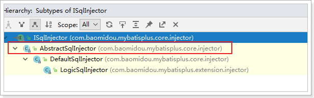
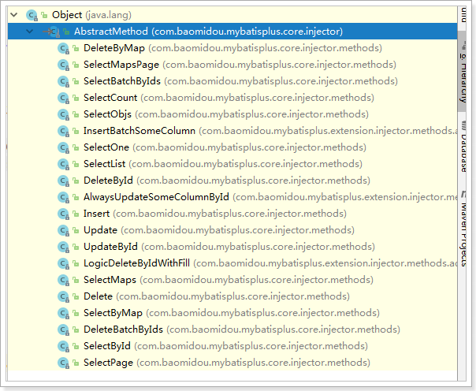

# MyBatisPlus （MyBatis 的增强工具）

## 1. MyBatis-Plus 简介

MyBatis-Plus（简称 MP）是一个 MyBatis 的增强工具，在 MyBatis 的基础上只做增强不做改变，为简化开发、提高效率而生

- 官网：https://baomidou.com/
- 文档地址：https://baomidou.com/guide/
- 源码地址：https://github.com/baomidou/mybatis-plus
- 码云地址：https://gitee.com/baomidou/mybatis-plus

### 1.1. 特性

- **无侵入**：只做增强不做改变，引入它不会对现有工程产生影响，如丝般顺滑
- **损耗小**：启动即会自动注入基本 CURD，性能基本无损耗，直接面向对象操作
- **强大的 CRUD 操作**：内置通用 Mapper、通用 Service，仅仅通过少量配置即可实现单表大部分 CRUD 操作，更有强大的条件构造器，满足各类使用需求
- **支持 Lambda 形式调用**：通过 Lambda 表达式，方便的编写各类查询条件，无需再担心字段写错
- **支持多种数据库**：支持 MySQL、MariaDB、Oracle、DB2、H2、HSQL、SQLite、Postgre、SQLServer2005、SQLServer 等多种数据库
- **支持主键自动生成**：支持多达 4 种主键策略（内含分布式唯一 ID 生成器 - Sequence），可自由配置，完美解决主键问题
- **支持 XML 热加载**：Mapper 对应的 XML 支持热加载，对于简单的 CRUD 操作，甚至可以无 XML 启动
- **支持 ActiveRecord 模式**：支持 ActiveRecord 形式调用，实体类只需继承 Model 类即可进行强大的 CRUD操作
- **支持自定义全局通用操作**：支持全局通用方法注入（ Write once, use anywhere ）
- **支持关键词自动转义**：支持数据库关键词（order、key......）自动转义，还可自定义关键词
- **内置代码生成器**：采用代码或者 Maven 插件可快速生成 Mapper 、 Model 、 Service 、 Controller 层代码，支持模板引擎，更有超多自定义配置等您来使用
- **内置分页插件**：基于 MyBatis 物理分页，开发者无需关心具体操作，配置好插件之后，写分页等同于普通 List 查询
- **内置性能分析插件**：可输出 Sql 语句以及其执行时间，建议开发测试时启用该功能，能快速揪出慢查询
- **内置全局拦截插件**：提供全表 delete 、 update 操作智能分析阻断，也可自定义拦截规则，预防误操作
- **内置 Sql 注入剥离器**：支持 Sql 注入剥离，有效预防 Sql 注入攻击

### 1.2. 架构


### 1.3. 示例项目说明

示例项目代码位置：`mybatis-note\mybatis-plus-samples\`

github位置：https://github.com/MooNkirA/mybatis-note/tree/master/mybatis-plus-samples

## 2. MyBatis-Plus 快速入门示例

### 2.1. 创建示例数据库以及表

脚本的位置：`mybatis-note\mybatis-plus-samples\document\sql\mysql-sample.sql`

### 2.2. SpringBoot + Mybatis + MP

#### 2.2.1. 引入依赖

```xml
<dependencies>
    <dependency>
        <groupId>org.springframework.boot</groupId>
        <artifactId>spring-boot-starter</artifactId>
    </dependency>
    <dependency>
        <groupId>mysql</groupId>
        <artifactId>mysql-connector-java</artifactId>
        <version>8.0.26</version>
        <scope>runtime</scope>
    </dependency>
    <dependency>
        <groupId>com.baomidou</groupId>
        <artifactId>mybatis-plus-boot-starter</artifactId>
        <version>3.4.3.4</version>
    </dependency>
    <dependency>
        <groupId>org.springframework.boot</groupId>
        <artifactId>spring-boot-starter-test</artifactId>
        <scope>test</scope>
    </dependency>

    <dependency>
        <groupId>org.assertj</groupId>
        <artifactId>assertj-core</artifactId>
        <scope>test</scope>
    </dependency>
    <dependency>
        <groupId>org.projectlombok</groupId>
        <artifactId>lombok</artifactId>
        <scope>provided</scope>
    </dependency>
</dependencies>
```

#### 2.2.2. 配置

- 在 `application.yml` 配置文件中添加数据库的相关配置：

```yml
spring:
  # DataSource Config
  datasource:
    driver-class-name: com.mysql.cj.jdbc.Driver
    url: jdbc:mysql://127.0.0.1:3306/mybatis_plus_sample_db?useSSL=false&useUnicode=true&characterEncoding=UTF-8
    username: root
    password: ****
```

- 在 Spring Boot 启动类中添加 `@MapperScan` 注解，扫描 Mapper 文件夹：

```java
@SpringBootApplication
@MapperScan("com.moon.mybatisplus.mapper") // 设置mapper接口的扫描包
public class QuickstartApplication {
    public static void main(String[] args) {
        SpringApplication.run(QuickstartApplication.class, args);
    }
}
```

#### 2.2.3. 创建实体类

```java
@Data
public class User {
    private Long id;
    private String name;
    private Integer age;
    private String email;
}
```

#### 2.2.4. 编写mapper接口

```java
import com.baomidou.mybatisplus.core.mapper.BaseMapper;
import com.moon.mybatisplus.entity.User;

public interface UserMapper extends BaseMapper<User> {
}
```

#### 2.2.5. 编写测试用例

```java
@SpringBootTest
public class BaseTest {
    @Autowired
    private UserMapper userMapper;

    @Test
    public void testSelect() {
        System.out.println(("----- selectAll method test ------"));
        List<User> userList = userMapper.selectList(null);
        Assertions.assertEquals(5, userList.size());
        userList.forEach(System.out::println);
    }
}
```

### 2.3. 项目入门示例

> 注：此快速入门示例是在好客租房项目开发时的入门示例，代码位置在`haoke-project\haoke-technology-stack-sample\sample-mybatis-plus`

#### 2.3.1. 创建数据库与相关表格

- 创建数据库

```sql
create database haoke default character set utf8;
```

- 创建相关数据库表与测试数据

```sql

```

#### 2.3.2. 创建工程以及导入依赖

创建jar类型的`sample-mybatis-plus`示例工程，修改`pom.xml`文件引入相关依赖

```xml
<?xml version="1.0" encoding="UTF-8"?>
<project xmlns="http://maven.apache.org/POM/4.0.0"
         xmlns:xsi="http://www.w3.org/2001/XMLSchema-instance"
         xsi:schemaLocation="http://maven.apache.org/POM/4.0.0 http://maven.apache.org/xsd/maven-4.0.0.xsd">
    <!-- 添加SpringBoot parent支持 -->
    <parent>
        <groupId>org.springframework.boot</groupId>
        <artifactId>spring-boot-starter-parent</artifactId>
        <version>2.1.0.RELEASE</version>
    </parent>

    <modelVersion>4.0.0</modelVersion>
    <artifactId>sample-mybatis-plus</artifactId>
    <name>${project.artifactId}</name>
    <packaging>jar</packaging>
    <description>技术栈示例 - MyBatis-Plus快速入门示例</description>

    <dependencies>
        <!-- spring boot 依赖 -->
        <dependency>
            <groupId>org.springframework.boot</groupId>
            <artifactId>spring-boot-starter</artifactId>
        </dependency>
        <dependency>
            <groupId>org.springframework.boot</groupId>
            <artifactId>spring-boot-starter-test</artifactId>
            <scope>test</scope>
        </dependency>

        <!-- mybatis-plus的springboot支持（注：不需要再依赖mybatis，此插件已包含引入mybatis） -->
        <dependency>
            <groupId>com.baomidou</groupId>
            <artifactId>mybatis-plus-boot-starter</artifactId>
            <version>3.0.5</version>
        </dependency>
        <!-- mysql驱动 -->
        <dependency>
            <groupId>mysql</groupId>
            <artifactId>mysql-connector-java</artifactId>
            <version>5.1.47</version>
        </dependency>
        <!-- 实体类工具包 -->
        <dependency>
            <groupId>org.projectlombok</groupId>
            <artifactId>lombok</artifactId>
            <optional>true</optional>
            <version>1.18.4</version>
        </dependency>
    </dependencies>

    <!-- 项目构建 -->
    <build>
        <plugins>
            <plugin>
                <groupId>org.springframework.boot</groupId>
                <artifactId>spring-boot-maven-plugin</artifactId>
            </plugin>
        </plugins>
    </build>
</project>
```

#### 2.3.3. 编写项目的配置文件

编写spring boot 项目的默认配置文件 `application.properties`

```properties
spring.application.name=sample-mybatis-plus
# 数据库(MySQl)相关配置
spring.datasource.driver-class-name=com.mysql.jdbc.Driver
spring.datasource.url=jdbc:mysql://192.168.12.134:3306/haoke?useUnicode=true&characterEncoding=utf8&autoReconnect=true&allowMultiQueries=true&useSSL=false
spring.datasource.username=root
spring.datasource.password=123456
```

#### 2.3.4. 创建实体类

```java
@Data
public class User {
    private Long id;
    private String name;
    private Integer age;
    private String email;
}
```

#### 2.3.5. 创建持久层Mapper接口

使用MyBatis-Plus插件，需要继承此工具框架提供的`public interface BaseMapper<T>`接口，泛型为接口操作的数据库表相应的实体类。此`BaseMapper<T>`接口时定义很多基础操作方法

```java
public interface UserMapper extends BaseMapper<User> { }
```

#### 2.3.6. 编写SpringBoot启动类

```java
// 设置mybatis框架对mapper接口的扫描包路径
@MapperScan("com.moon.sample.mybatisplus.mapper")
@SpringBootApplication
public class MyBatisPlusApplication {
    public static void main(String[] args) {
        SpringApplication.run(MyBatisPlusApplication.class, args);
    }
}
```

#### 2.3.7. 编写单元测试用例

```java
@RunWith(SpringRunner.class)
@SpringBootTest
public class UserMapperTest {
    // 注入测试的接口
    @Autowired
    private UserMapper userMapper;

    /* 基础的查询测试 */
    @Test
    public void selectTest(){
        List<User> users = this.userMapper.selectList(null);
        for (User user : users) {
            System.out.println(user);
        }
    }
}
```

运行测试用例，查看测试结果

## 3. BaseMapper（CRUD 基础接口）

在Mybatis Plus中，`BaseMapper`接口中定义了一些常用的CRUD方法，当自定义的`Mapper`接口继承`BaseMapper`后即可以获取到各种各样的单表操作。官方说明如下：


- 通用 CRUD 封装`BaseMapper`接口，为 `Mybatis-Plus` 启动时自动解析实体表关系映射转换为 `Mybatis` 内部对象注入容器
- 泛型 `T` 为任意实体对象
- 参数 `Serializable` 为任意类型主键 `Mybatis-Plus` 不推荐使用复合主键约定每一张表都有自己的唯一 `id` 主键
- 对象 `Wrapper` 为条件构造器

> <font color=red>**注：这些方法仅适合单表操作**</font>
>
> 官方文档地址：[Mapper CRUD 接口](https://baomidou.com/guide/crud-interface.html#mapper-crud-%E6%8E%A5%E5%8F%A3)

### 3.1. 新增操作

```java
@Test
public void testSave(){
    User user = new User();
    user.setAge(25);
    user.setEmail("shiyuan@qq.com");
    user.setName("石原里美");
    int count = this.userMapper.insert(user);
    System.out.println("新增数据成功! count => " + count);
}
```

#### 3.1.1. 设置主键ID生成策略

上面示例数据插入结果：


可以看到，数据已经写入到了数据库，但是，id的值不正确。期望的是数据库自增长，实际是MP生成了id的值写入到了数据库。

如何设置id的生成策略呢？需要修改操作的表相应的实体类，增加MP的id策略为自增长。*注：数据库表的id字段也需要设置为自增长*

```java
@Data
public class User {
    @TableId(value = "id", type = IdType.AUTO)
    private Long id;
    private String name;
    private Integer age;
    private String email;
}
```

> MP支持的id策略详见源码`com.baomidou.mybatisplus.annotation.IdType`

再次运行测试，查看结果


### 3.2. 更新操作

在MP中，更新操作有2种，一种是根据id更新，另一种是根据条件更新。

#### 3.2.1. 根据 ID 更新数据

源码方法定义：

```java
/**
 * 根据 ID 修改
 *
 * @param entity 实体对象
 */
int updateById(@Param(Constants.ENTITY) T entity);
```

根据id修改数据，只会修改传的对象的属性不为null的相应字段。

```java
@Test
public void testUpdateById() {
    User u1 = new User();
    u1.setId(5L);
    u1.setName("新垣结衣");

    // 返回的result是受影响的行数
    int result = userMapper.updateById(u1);
    System.out.println("根据id更新影响行数：" + result);
}
```


#### 3.2.2. 根据 Wrapper 条件更新

源码方法定义：

```java
/**
 * 根据 whereEntity 条件，更新记录
 *
 * @param entity        实体对象 (set 条件值,可以为 null)
 * @param updateWrapper 实体对象封装操作类（可以为 null,里面的 entity 用于生成 where 语句）
 */
int update(@Param(Constants.ENTITY) T entity, @Param(Constants.WRAPPER) Wrapper<T> updateWrapper);
```

可以有两种方式更新数据

- 方式1: 通过QueryWrapper对象更新
- 方式2：通过LambdaUpdateWrapper<T>对象更新

```java
@Test
public void testUpdateByWrapper() {
    // 方式1: 通过QueryWrapper对象更新
    User user = new User();
    user.setEmail("mk@moon.com");
    int result1 = userMapper.update(user, new QueryWrapper<User>().lambda().eq(User::getId, 4L));
    System.out.println("影响行数result1：" + result1);
    assertThat(result1).isGreaterThan(0);

    // 方式2：通过LambdaUpdateWrapper<T>对象更新
    int result2 = userMapper.update(null, Wrappers.<User>lambdaUpdate().set(User::getEmail, null).eq(User::getId, 3L));
    System.out.println("影响行数result1：" + result2);
    assertThat(result2).isGreaterThan(0);
}
```

### 3.3. 删除操作

#### 3.3.1. 根据 ID 删除

源码方法定义：

```java
/**
 * 根据 ID 删除
 *
 * @param id 主键ID
 */
int deleteById(Serializable id);

/**
 * 根据实体(ID)删除
 *
 * @param entity 实体对象
 * @since 3.4.4
 */
int deleteById(T entity);
```

示例：

```java
@Test
public void testDeleteById() {
    // 直接根据id值删除
    int result1 = userMapper.deleteById("1452460873191886851");
    System.out.println("根据id删除影响行数：" + result1);

    // 根据实体对象(ID)主键属性删除
    User user = new User();
    user.setId(1452460873191886852L);
    int result2 = userMapper.deleteById(user);
    System.out.println("根据实体对象(ID)删除影响行数：" + result2);
}
```

#### 3.3.2. 根据 columnMap 条件删除

源码方法定义：

```java
/**
 * 根据 columnMap 条件，删除记录
 *
 * @param columnMap 表字段 map 对象
 */
int deleteByMap(@Param(Constants.COLUMN_MAP) Map<String, Object> columnMap);
```

示例

```java
@Test
public void testDeleteByMap() {
    // 创建 map 条件
    Map<String, Object> columnMap = new HashMap<>();
    columnMap.put("age", 24);
    columnMap.put("name", "石原里美");

    // 根据 columnMap 的元素设置为删除的条件，多个值之间为and关系
    int result = userMapper.deleteByMap(columnMap);
    System.out.println("根据 Map 条件删除影响行数：" + result);
}
```

#### 3.3.3. 根据 Wrapper 对象条件删除

源码方法定义：

```java
/**
 * 根据 entity 条件，删除记录
 *
 * @param queryWrapper 实体对象封装操作类（可以为 null,里面的 entity 用于生成 where 语句）
 */
int delete(@Param(Constants.WRAPPER) Wrapper<T> queryWrapper);
```

示例：

```java
@Test
public void testDeleteByWrapper() {
    // 创建实体对象查询条件
    User user = new User();
    user.setAge(24);
    user.setName("石原里美");

    // 将实体对象进行包装，包装为查询操作条件
    Wrapper<User> wrapper = new QueryWrapper<>(user);
    int result = userMapper.delete(wrapper);
    System.out.println("根据 Wrapper 对象条件删除影响行数：" + result);
}
```

#### 3.3.4. 根据 ID 集合批量删除

源码方法定义：

```java
/**
 * 删除（根据ID 批量删除）
 *
 * @param idList 主键ID列表(不能为 null 以及 empty)
 */
int deleteBatchIds(@Param(Constants.COLLECTION) Collection<? extends Serializable> idList);
```

示例：

```java
@Test
public void testDeleteBatchIds() {
    // 创建ID集合批量删除
    int result = userMapper.deleteBatchIds(Arrays.asList(1L, 2L, 4L, 5L));
    System.out.println("根据id批量删除影响行数：" + result);
}
```

### 3.4. 查询操作

MP提供了多种查询操作，包括根据id查询、批量查询、查询单条数据、查询列表、分页查询、根据条件查询等操作。

#### 3.4.1. selectById - 根据id查询

源码方法定义：

```java
/**
 * 查询（根据ID 批量查询）
 *
 * @param idList 主键ID列表(不能为 null 以及 empty)
 */
List<T> selectBatchIds(@Param(Constants.COLLECTION) Collection<? extends Serializable> idList);
```

示例：

```java
@Test
public void testSelectById() {
    // 根据ID查询
    User user = userMapper.selectById(3L);
    System.out.println("根据id查询结果：" + user);
}
```

#### 3.4.2. selectBatchIds - 根据ID 批量查询

源码方法定义：

```java
/**
 * 查询（根据ID 批量查询）
 *
 * @param idList 主键ID列表(不能为 null 以及 empty)
 */
List<T> selectBatchIds(@Param(Constants.COLLECTION) Collection<? extends Serializable> idList);
```

示例：

```java
@Test
public void testSelectBatchIds() {
    List<TableUser> users = tableUserMapper.selectBatchIds(Arrays.asList(1L, 2L, 4L, 5L));
    System.out.println("根据id批量查询结果：" + users);
}
```

#### 3.4.3. selectOne - 查询单条记录

源码方法定义：

```java
/**
 * 根据 entity 条件，查询一条记录
 * <p>查询一条记录，例如 qw.last("limit 1") 限制取一条记录, 注意：多条数据会报异常</p>
 *
 * @param queryWrapper 实体对象封装操作类（可以为 null）
 */
default T selectOne(@Param(Constants.WRAPPER) Wrapper<T> queryWrapper)
```

示例：

```java
@Test
public void testSelectOne() {
    // 创建查询条件
    QueryWrapper<TableUser> wrapper = new QueryWrapper<>();
    wrapper.eq("name", "Tom");
    // 根据条件查询一条数据，如果结果超过一条会报错
    TableUser user = tableUserMapper.selectOne(wrapper);
    System.out.println("查询结果：" + user);
}
```

#### 3.4.4. selectCount - 查询总记录数

源码方法定义：

```java
/**
 * 根据 Wrapper 条件，查询总记录数
 *
 * @param queryWrapper 实体对象封装操作类（可以为 null）
 */
Long selectCount(@Param(Constants.WRAPPER) Wrapper<T> queryWrapper);
```

示例：

```java
@Test
public void testSelectCount() {
    // 创建查询条件
    QueryWrapper<TableUser> wrapper = new QueryWrapper<>();
    wrapper.ge("age", 21); // 查询年龄大于等于21
    // 根据条件查询数据条数
    Long count = tableUserMapper.selectCount(wrapper);
    System.out.println("查询总记录数：" + count);
}
```

#### 3.4.5. selectList - 条件查询

源码方法定义：

```java
/**
 * 根据 entity 条件，查询全部记录
 *
 * @param queryWrapper 实体对象封装操作类（可以为 null）
 */
List<T> selectList(@Param(Constants.WRAPPER) Wrapper<T> queryWrapper);
```

示例：

```java
/* 条件查询记录 */
@Test
public void testSelectList() {
    // 方式1：创建 QueryWrapper 查询条件
    QueryWrapper<TableUser> wrapper = new QueryWrapper<>();
    wrapper.ge("age", 21); // 查询年龄大于等于21
    // 根据条件查询数据
    List<TableUser> users = tableUserMapper.selectList(wrapper);
    System.out.println("QueryWrapper 查询结果：" + users);

    // 方式1：创建 lambdaQuery 查询条件
    List<User> userList = userMapper.selectList(Wrappers.<User>lambdaQuery().select(User::getId, User::getName));
    // 上面是查询所有记录，但只返回id与name属性
    System.out.println("LambdaQueryWrapper 查询结果：" + userList);
}
```

#### 3.4.6. selectPage - 分页查询

源码方法定义：

```java
/**
 * 根据 entity 条件，查询全部记录（并翻页）
 *
 * @param page         分页查询条件（可以为 RowBounds.DEFAULT）
 * @param queryWrapper 实体对象封装操作类（可以为 null）
 */
<P extends IPage<T>> P selectPage(P page, @Param(Constants.WRAPPER) Wrapper<T> queryWrapper);
```

使用MyBatis-Plus进行分页查询操作，需要在项目中启动类（或者配置类）创建分页插件，并注册到spring的ioc容器中。*更多分页插件详细用法，详见《分页插件》章节*

```java
@Configuration
@MapperScan("com.moon.mybatisplus.mapper")
public class MybatisPlusConfig {
    // 创建MyBatis-Plus的分页插件(旧版)
    /*@Bean
    public PaginationInterceptor paginationInterceptor() {
        PaginationInterceptor paginationInterceptor = new PaginationInterceptor();
        // 设置请求的页面大于最大页后操作， true调回到首页，false 继续请求  默认false
        // paginationInterceptor.setOverflow(false);
        // 设置最大单页限制数量，默认 500 条，-1 不受限制
        // paginationInterceptor.setLimit(500);
        // 开启 count 的 join 优化,只针对部分 left join
        paginationInterceptor.setCountSqlParser(new JsqlParserCountOptimize(true));
        return paginationInterceptor;
    }*/

    /**
     * 创建MyBatis-Plus的分页插件，注册到spring ioc容器中 （最新版）
     *
     * @return
     */
    @Bean
    public MybatisPlusInterceptor mybatisPlusInterceptor() {
        MybatisPlusInterceptor interceptor = new MybatisPlusInterceptor();
        interceptor.addInnerInterceptor(new PaginationInnerInterceptor(DbType.MYSQL));
        return interceptor;
    }
}
```

示例：

```java
@Test
public void testSelectPage() {
    // 创建 QueryWrapper 查询条件
    QueryWrapper<User> wrapper = new QueryWrapper<>();
    wrapper.ge("age", 21); // 查询年龄大于等于21
    // 创建分页对象
    Page<User> page = new Page<>(1, 2);
    // 根据条件分页查询数据
    IPage<User> iPage = userMapper.selectPage(page, wrapper);
    System.out.println("数据总条数：" + iPage.getTotal());
    System.out.println("总页数：" + iPage.getPages());
    List<User> users = iPage.getRecords();
    for (User user : users) {
        System.out.println("user = " + user);
    }
}
```

## 4. 注解(!整理中)

> 此章节介绍 MybatisPlus 注解包相关类详解(注解类包：mybatis-plus-annotation)

### 4.1. @TableName

描述：表名注解，用于实体类上

|        属性        |    类型    | 必须指定 |  默认值  |                                           描述                                           |
| :----------------: | :--------: | :------: | :-----: | --------------------------------------------------------------------------------------- |
|      `value`       |  `String`  |    否    |  `""`   | 表名                                                                                     |
|      `schema`      |  `String`  |    否    |  `""`   | schema                                                                                  |
| `keepGlobalPrefix` | `boolean`  |    否    | `false` | 是否保持使用全局的 `tablePrefix` 的值(如果设置了全局 `tablePrefix` 且自行设置了 `value` 的值) |
|    `resultMap`     |  `String`  |    否    |  `""`   | xml 中 `resultMap` 的 `id`                                                               |
|  `autoResultMap`   | `boolean`  |    否    | `false` | 是否自动构建 `resultMap` 并使用(如果设置 `resultMap` 则不会进行 `resultMap` 的自动构建并注入) |
| `excludeProperty`  | `String[]` |    否    |  `{}`   | 需要排除的属性名(@since 3.3.1)                                                            |

### 4.2. @TableField

描述：实体类字段注解(非主键)

|        属性        |              类型              | 必须指定 |           默认值           |                                                                          描述                                                                          |
| :----------------: | :----------------------------: | :------: | :------------------------: | :---------------------------------------------------------------------------------------------------------------------------------------------------: |
|      `value`       |            `String`            |    否    |            `""`            |                                                                      数据库字段名                                                                       |
|        `el`        |            `String`            |    否    |            `""`            |                                              映射为原生 `#{ ... }` 逻辑,相当于写在 xml 里的 `#{ ... }` 部分                                               |
|      `exist`       |           `boolean`            |    否    |           `true`           |                                                                   是否为数据库表字段                                                                    |
|    `condition`     |            `String`            |    否    |            `""`            |                                     字段 `where` 实体查询比较条件,有值设置则按设置的值为准,没有则为默认全局的 `%s=#{%s}`                                     |
|      `update`      |            `String`            |    否    |            `""`            |                      字段 `update set` 部分注入, 例如`update="%s+1"`：表示更新时会`set version=version+1`(该属性优先级高于 `el` 属性)                       |
|  `insertStrategy`  |             `Enum`             |    否    |         `DEFAULT`          | 举例：NOT_NULL: `insert into table_a(<if test="columnProperty != null">column</if>) values (<if test="columnProperty != null">#{columnProperty}</if>)` |
|  `updateStrategy`  |             `Enum`             |    否    |         `DEFAULT`          |                                              举例：IGNORED: `update table_a set column=#{columnProperty}`                                              |
|  `whereStrategy`   |             `Enum`             |    否    |         `DEFAULT`          |                    举例：NOT_EMPTY: `where <if test="columnProperty != null and columnProperty!=''">column=#{columnProperty}</if>`                     |
|       `fill`       |             `Enum`             |    否    |    `FieldFill.DEFAULT`     |                                                                    字段自动填充策略                                                                     |
|      `select`      |           `boolean`            |    否    |           `true`           |                                                                  是否进行 select 查询                                                                   |
| `keepGlobalFormat` |           `boolean`            |    否    |          `false`           |                                                            是否保持使用全局的 format 进行处理                                                            |
|     `jdbcType`     |           `JdbcType`           |    否    |    `JdbcType.UNDEFINED`    |                                                          JDBC类型 (该默认值不代表会按照该值生效)                                                          |
|   `typeHandler`    | `Class<? extends TypeHandler>` |    否    | `UnknownTypeHandler.class` |                                                         类型处理器 (该默认值不代表会按照该值生效)                                                          |
|   `numericScale`   |            `String`            |    否    |             `""`             |                                                                  指定小数点后保留的位数                                                                  |

> 关于`jdbcType`和`typeHandler`以及`numericScale`的说明:
>
> `numericScale`只生效于 update 的sql。`jdbcType`和`typeHandler`如果不配合`@TableName#autoResultMap = true`一起使用，也只生效于 update 的sql。对于`typeHandler`如果你的字段类型和set进去的类型为`equals`关系，则只需要让你的`typeHandler`让Mybatis加载到即可，不需要使用注解

### 4.3. @Version(opens new window)

描述：乐观锁注解、标记 `@Verison` 在字段上

### 4.4. @EnumValue(opens new window)

描述：通枚举类注解(注解在枚举字段上)

## 5. 配置

虽然在MybatisPlus中可以实现零配置，但是有些时候需要自定义一些配置，就需要使用Mybatis原生的一些配置文件方式了。在MyBatis-Plus中有大量的配置，其中有一部分是Mybatis原生的配置，另一部分是MyBatis-Plus的配置。

> 更详细配置参考官方文档：https://baomidou.com/config/

### 5.1. 基本配置

#### 5.1.1. configLocation

MyBatis 配置文件位置，如果您有单独的 MyBatis 配置，请将其路径配置到 configLocation 中。 *MyBatis Configuration 的具体内容请参考MyBatis 官方文档*

- Spring Boot 配置：

```properties
mybatis-plus.config-location = classpath:mybatis-config.xml
```

- Spring MVC 配置：

```xml
<bean id="sqlSessionFactory" class="com.baomidou.mybatisplus.extension.spring.MybatisSqlSessionFactoryBean">
    <property name="configLocation" value="classpath:mybatis-config.xml"/>
</bean>
```

#### 5.1.2. mapperLocations

- 类型：`String[]`
- 默认值：`["classpath*:/mapper/**/*.xml"]`

MyBatis Mapper 所对应的 XML 文件位置，如果在 Mapper 中有自定义方法（XML 中有自定义实现），需要进行该配置，告诉 Mapper 所对应的 XML 文件位置。

Spring Boot：

```properties
mybatis-plus.mapper-locations = classpath*:mybatis/*.xml
```

Spring MVC：

```xml
<bean id="sqlSessionFactory" class="com.baomidou.mybatisplus.extension.spring.MybatisSqlSessionFactoryBean">
    <property name="mapperLocations" value="classpath*:mybatis/*.xml"/>
</bean>
```

> 注意：**Maven 多模块项目的扫描路径需以 `classpath*:` 开头 （即加载多个 jar 包下的 XML 文件）**

测试：

UserMapper.xml：

```xml
<?xml version="1.0" encoding="UTF-8" ?>
<!DOCTYPE mapper
        PUBLIC "-//mybatis.org//DTD Mapper 3.0//EN"
        "http://mybatis.org/dtd/mybatis-3-mapper.dtd">
<mapper namespace="com.moon.mybatisplus.mapper.UserMapper">

    <select id="findById" resultType="com.moon.mybatisplus.entity.User">
        select * from user where id = #{id}
    </select>

</mapper>
```

```java
package com.moon.mybatisplus.mapper;

import com.moon.mybatisplus.pojo.User;
import com.baomidou.mybatisplus.core.mapper.BaseMapper;

public interface UserMapper extends BaseMapper<User> {
    User findById(Long id);
}
```

测试用例：

```java
@RunWith(SpringRunner.class)
@SpringBootTest
public class UserMapperTest {
    @Autowired
    private UserMapper userMapper;

    @Test
    public void testSelectPage() {
        User user = this.userMapper.findById(2L);
        System.out.println(user);

    }
}
```

#### 5.1.3. typeAliasesPackage

MyBaits 别名包扫描路径，通过该属性可以给包中的类注册别名，注册后在 Mapper 对应的 XML 文件中可以直接使用类名，而不用使用全限定的类名（即 XML 中调用的时候不用包含包名）。

Spring Boot：

```properties
mybatis-plus.type-aliases-package = com.moon.mybatisplus.pojo
```

Spring MVC：

```xml
<bean id="sqlSessionFactory" class="com.baomidou.mybatisplus.extension.spring.MybatisSqlSessionFactoryBean">
    <property name="typeAliasesPackage" value="com.baomidou.mybatisplus.samples.quickstart.entity"/>
</bean>
```

### 5.2. Configuration

本部分（Configuration）的配置大都为 MyBatis 原生支持的配置，这意味着您可以通过 MyBatis XML 配置文件的形式进行配置。

#### 5.2.1. mapUnderscoreToCamelCase

- 类型：`boolean`
- 默认值：`true`

是否开启自动驼峰命名规则（camel case）映射，即从经典数据库列名 `A_COLUMN`（下划线命名） 到经典 Java 属性名 `aColumn`（驼峰命名） 的类似映射。

> 注意
>
> 此属性在 MyBatis 中原默认值为 `false`，在 MyBatis-Plus 中，此属性也将用于生成最终的 SQL 的 select body
>
> 如果数据库命名符合规则无需使用 `@TableField` 注解指定数据库字段名

示例（Spring Boot）：

```properties
#关闭自动驼峰映射，该参数不能和mybatis-plus.config-location同时存在
mybatis-plus.configuration.map-underscore-to-camel-case=false
```

#### 5.2.2. cacheEnabled

- 类型：`boolean`
- 默认值：`true`

全局地开启或关闭配置文件中的所有映射器已经配置的任何缓存(Mybatis二级缓存)，默认为`true`。

示例（Spring Boot）：

```properties
mybatis-plus.configuration.cache-enabled=false
```

### 5.3. DbConfig（DB 策略配置）

#### 5.3.1. idType

- 类型：`com.baomidou.mybatisplus.annotation.IdType`
- 默认值：`ASSIGN_ID`

全局默认主键类型。设置后，即可省略实体对象中的`@TableId(type = IdType.AUTO)`配置。

示例（SpringBoot）：

```properties
mybatis-plus.global-config.db-config.id-type=auto
```

示例（SpringMVC）：

```xml
<!-- 这里使用MP提供的sqlSessionFactory，完成了Spring与MP的整合 -->
<bean id="sqlSessionFactory" class="com.baomidou.mybatisplus.extension.spring.MybatisSqlSessionFactoryBean">
    <property name="dataSource" ref="dataSource"/>
    <property name="globalConfig">
        <bean class="com.baomidou.mybatisplus.core.config.GlobalConfig">
            <property name="dbConfig">
                <bean class="com.baomidou.mybatisplus.core.config.GlobalConfig$DbConfig">
                    <property name="idType" value="AUTO"/>
                </bean>
            </property>
        </bean>
    </property>
</bean>
```

#### 5.3.2. tablePrefix

- 类型：`String`
- 默认值：`null`

表名前缀。全局配置后可省略`@TableName()`配置。

示例（SpringBoot）：

```properties
mybatis-plus.global-config.db-config.table-prefix=tb_
```

示例（SpringMVC）：

```xml
<bean id="sqlSessionFactory" class="com.baomidou.mybatisplus.extension.spring.MybatisSqlSessionFactoryBean">
    <property name="dataSource" ref="dataSource"/>
    <property name="globalConfig">
        <bean class="com.baomidou.mybatisplus.core.config.GlobalConfig">
            <property name="dbConfig">
                <bean class="com.baomidou.mybatisplus.core.config.GlobalConfig$DbConfig">
                    <property name="idType" value="AUTO"/>
                    <property name="tablePrefix" value="tb_"/>
                </bean>
            </property>
        </bean>
    </property>
</bean>
```

## 6. Wrapper 条件构造器

在MP中，`Wrapper`接口的实现类`AbstractWrapper`和`AbstractChainWrapper`，其关系如下：


> 说明:
>
> - 以下出现的第一个入参`boolean condition`表示该条件是否加入最后生成的sql中，例如：`query.like(StringUtils.isNotBlank(name), Entity::getName, name).eq(age!=null && age >= 0, Entity::getAge, age)`
> - 以下代码块内的多个方法均为从上往下补全个别`boolean`类型的入参，默认为`true`
> - 以下出现的泛型`Param`均为`Wrapper`的子类实例(均具有`AbstractWrapper`的所有方法)
> - 以下方法在入参中出现的`R`为泛型，在普通wrapper中是String，在`LambdaWrapper`中是函数(例:`Entity::getId`，Entity为实体类，`getId`为字段id的getMethod)
> - 以下方法入参中的R column均表示数据库字段,当R具体类型为String时则为数据库字段名(字段名是数据库关键字的自己用转义符包裹!)!而不是实体类数据字段名!!!,另当R具体类型为SFunction时项目runtime不支持eclipse自家的编译器!!!
> - 以下举例均为使用普通wrapper，入参为Map和List的均以json形式表现!
> - 使用中如果入参的Map或者List为空，则不会加入最后生成的sql中!!!

### 6.1. AbstractWrapper

**注意：**

- `QueryWrapper`(`LambdaQueryWrapper`) 和 `UpdateWrapper`(`LambdaUpdateWrapper`) 的父类。用于生成 sql 的 `where` 条件，entity 属性也用于生成 sql 的 where 条件。
- 注意: entity 生成的 where 条件与 使用各个 api 生成的 where 条件**没有任何关联行为**

官方文档地址：https://baomidou.com/guide/wrapper.html#abstractwrapper

#### 6.1.1. 全匹配 allEq

`allEq`方法定义：

```java
allEq(Map<R, V> params)
allEq(Map<R, V> params, boolean null2IsNull)
allEq(boolean condition, Map<R, V> params, boolean null2IsNull)
allEq(BiPredicate<R, V> filter, Map<R, V> params)
allEq(BiPredicate<R, V> filter, Map<R, V> params, boolean null2IsNull)
allEq(boolean condition, BiPredicate<R, V> filter, Map<R, V> params, boolean null2IsNull)
```

- 此方法代表，全部条件为`eq`(或个别`isNull`)
- 个别参数说明：
    - `params`：`key`为数据库字段名，`value`为字段值
    - `null2IsNull`：为`true`则在map的`value`为`null`时调用`isNull`方法，为`false`时则忽略`value`为`null`的情况
    - `filter`：过滤函数，是否允许字段传入比对条件中
    - `params` 与 `null2IsNull`：同上
- 示例：
    - 例1: `allEq({id:1, name:"老王", age:null})` ---> `id = 1 and name = '老王' and age is null`
    - 例2: `allEq({id:1, name:"老王", age:null}, false)` ---> `id = 1 and name = '老王'`
    - 例3: `allEq((k,v) -> k.indexOf("a") >= 0, {id:1, name:"老王", age:null})` ---> `name = '老王' and age is null`
    - 例4: `allEq((k,v) -> k.indexOf("a") >= 0, {id:1, name:"老王", age:null}, false)` ---> `name = '老王'`

使用示例：

```java
@Test
public void testAllEq() {
    // 创建QueryWrapper条件查询器
    QueryWrapper<User> wrapper = new QueryWrapper<>();
    // 设置查询条件
    Map<String, Object> params = new HashMap<>();
    params.put("name", "石原里美");
    params.put("age", "24");
    params.put("email", null);

    // allEq(Map<R, V> params)
    // wrapper.allEq(params); // 相当于 name = ? AND age = ? AND email IS NULL

    // allEq(Map<R, V> params, boolean null2IsNull)
    // wrapper.allEq(params, false); // 相当于 name = ? AND age = ?

    // allEq(boolean condition, Map<R, V> params, boolean null2IsNull)
    // wrapper.allEq(false, params, false); // condition设置为false，代表条件都不加入最后生成的sql中，相当于无查询条件

    // allEq(BiPredicate<R, V> filter, Map<R, V> params)
    // allEq(BiPredicate<R, V> filter, Map<R, V> params, boolean null2IsNull)
    // allEq(boolean condition, BiPredicate<R, V> filter, Map<R, V> params, boolean null2IsNull)
    wrapper.allEq((k, v) -> k.equals("age"), params); // 过滤key为age的查询条件，相当于 age = ?

    List<User> users = userMapper.selectList(wrapper);
    for (User user : users) {
        System.out.println(user);
    }
}
```

#### 6.1.2. 基本比较操作

|   方法定义    |            含义             |                           示例                           |
| :----------: | :------------------------: | -------------------------------------------------------- |
|     `eq`     |          等于 `=`           | `eq("name", "老王")--->name = '老王'`                     |
|     `ne`     |         不等于 `<>`         | `ne("name", "老王")--->name <> '老王'`                    |
|     `gt`     |          大于 `>`           | `gt("age", 18)--->age > 18`                              |
|     `ge`     |        大于等于 `>=`        | `ge("age", 18)--->age >= 18`                             |
|     `lt`     |          小于 `<`           | `lt("age", 18)--->age < 18`                              |
|     `le`     |        小于等于 `<=`        | `le("age", 18)--->age <= 18`                             |
|  `between`   |     BETWEEN 值1 AND 值2     | `between("age", 18, 30)--->age between 18 and 30`        |
| `notBetween` |   NOT BETWEEN 值1 AND 值2   | `notBetween("age", 18, 30)--->age not between 18 and 30` |
|     `in`     |   字段 IN (值1, 值2, ...)   | `in("age", 1, 2, 3)--->age in (1,2,3)`                   |
|   `notIn`    | 字段 NOT IN (值1, 值2, ...) | `notIn("age", 1, 2, 3)--->age not in (1,2,3)`            |

使用示例：

```java
@Test
public void testBasicQuery() {
    // 等于 =
    List<User> users = userMapper.selectList(new QueryWrapper<User>().eq("age", 24));
    forEachPrint(users);

    // 不等于 <>
    List<User> users1 = userMapper.selectList(new QueryWrapper<User>().ne("name", "石原里美"));
    forEachPrint(users1);

    // 大于 >
    List<User> users2 = userMapper.selectList(new QueryWrapper<User>().gt("age", 21));
    forEachPrint(users2);

    // 大于等于 >=
    List<User> users3 = userMapper.selectList(new QueryWrapper<User>().ge("age", 21));
    forEachPrint(users3);

    // 小于 <
    List<User> users4 = userMapper.selectList(new QueryWrapper<User>().lt("age", 21));
    forEachPrint(users4);

    // 小于等于 <=
    List<User> users5 = userMapper.selectList(new QueryWrapper<User>().le("age", 21));
    forEachPrint(users5);

    // BETWEEN 值1 AND 值2
    List<User> users6 = userMapper.selectList(new QueryWrapper<User>().between("age", 20, 28));
    forEachPrint(users6);

    // NOT BETWEEN 值1 AND 值2
    List<User> users7 = userMapper.selectList(new QueryWrapper<User>().notBetween("age", 20, 28));
    forEachPrint(users7);

    // IN (值1, 值2, ...)
    List<User> users8 = userMapper.selectList(new QueryWrapper<User>().in("age", 20, 24));
    forEachPrint(users8);

    // NOT IN (值1, 值2, ...)
    List<User> users9 = userMapper.selectList(new QueryWrapper<User>().notIn("age", 20, 24));
    forEachPrint(users9);

    // 多个基本操作符连接使用
    List<User> users10 = userMapper.selectList(new QueryWrapper<User>()
            .between("role_id", 1, 4)
            .gt("age", 20)
            .ne("name", "Tom")); // sql: SELECT * FROM user WHERE (role_id BETWEEN 1 AND 4 AND age > 20 AND name <> 'Tom'
    forEachPrint(users10);
}
```

#### 6.1.3. 模糊查询

|   方法定义   |      含义       |                      示例                       |
| :---------: | :-------------: | ----------------------------------------------- |
|   `like`    |   LIKE '%值%'   | `like("name", "王")--->name like '%王%'`        |
|  `notLike`  | NOT LIKE '%值%' | `notLike("name", "王")--->name not like '%王%'` |
| `likeLeft`  |   LIKE '%值'    | `likeLeft("name", "王")--->name like '%王'`     |
| `likeRight` |   LIKE '值%'    | `likeRight("name", "王")--->name like '王%'`    |

使用示例：

```java

```

#### 6.1.4. 排序

|   方法定义    |          含义           |                              示例                               |
| :-----------: | :--------------------: | --------------------------------------------------------------- |
|   `orderBy`   |   ORDER BY 字段, ...    | `orderBy(true, true, "id", "name")--->order by id ASC,name ASC` |
| `orderByAsc`  | ORDER BY 字段, ... ASC  | `orderByAsc("id", "name")--->order by id ASC,name ASC`          |
| `orderByDesc` | ORDER BY 字段, ... DESC | `orderByDesc("id", "name")--->order by id DESC,name DESC`       |

使用示例：

```java
@Test
public void testOrderQuery() {
    // ORDER BY 字段, ...
    List<User> users = userMapper.selectList(new QueryWrapper<User>().orderBy(true, false, Arrays.asList("name", "age")));
    forEachPrint(users);

    // ORDER BY 字段, ... ASC
    List<User> users1 = userMapper.selectList(new QueryWrapper<User>().orderByAsc(Arrays.asList("age", "name")));
    forEachPrint(users1);

    // ORDER BY 字段, ... DESC
    List<User> users2 = userMapper.selectList(new QueryWrapper<User>().orderByDesc(Arrays.asList("name", "age")));
    forEachPrint(users2);
}
```

#### 6.1.5. 逻辑查询

| 方法定义 |        含义         |                                                                               示例                                                                               |
| :-----: | :----------------: | --------------------------------------------------------------------------------------------------------------------------------------------------------------- |
|  `or`   | 拼接 OR<br/>OR 嵌套 | `eq("id",1).or().eq("name","老王")--->id = 1 or name = '老王'`<br/>`or(i -> i.eq("name", "李白").ne("status", "活着"))--->or (name = '李白' and status <> '活着')` |
|  `and`  |      AND 嵌套       | `and(i -> i.eq("name", "李白").ne("status", "活着"))--->and (name = '李白' and status <> '活着')`                                                                 |

使用示例：

```java
@Test
public void testOrQuery() {
    // 拼接 OR
    // SELECT * FROM user WHERE (name = 'Sandy' OR age = 24)
    List<User> users = userMapper.selectList(new QueryWrapper<User>().eq("name", "Sandy").or().eq("age", 24));
    forEachPrint(users);

    // OR 嵌套
    // SELECT * FROM user WHERE (age > 21 OR (role_id BETWEEN 1 AND 4 AND name = 'Jack'))
    List<User> users1 = userMapper.selectList(new QueryWrapper<User>()
            .gt("age", 21)
            .or(i -> i.between("role_id", 1, 4).eq("name", "Jack")));
    forEachPrint(users1);
}

@Test
public void testAndQuery() {
    // AND 嵌套
    // SELECT * FROM user WHERE (age > 21 AND (role_id BETWEEN 1 AND 4 AND name = 'Tom'))
    List<User> users = userMapper.selectList(new QueryWrapper<User>()
            .gt("age", 21)
            .and(i -> i.between("role_id", 1, 4).eq("name", "Tom")));
    forEachPrint(users);
}
```

### 6.2. QueryWrapper

说明：继承自`AbstractWrapper`，自身的内部属性 `entity` 也用于生成 `where` 条件及 `LambdaQueryWrapper`，可以通过 `new QueryWrapper().lambda()` 方法获取

#### 6.2.1. select 设置查询字段

```java
select(String... sqlSelect)
select(Predicate<TableFieldInfo> predicate)
select(Class<T> entityClass, Predicate<TableFieldInfo> predicate)
```

在MP查询中，默认查询所有的字段，如果有需要也可以通过`select`方法进行指定字段。说明：以上方法分为两类。第二类方法为：过滤查询字段(主键除外)，入参不包含 `class` 的调用前需要`wrapper`内的`entity`属性有值！这两类方法重复调用以最后一次为准

使用示例：

```java
@Test
public void testSelect() {
    // 创建QueryWrapper条件查询器
    QueryWrapper<User> wrapper = new QueryWrapper<>();
    // 设置需查询的字段
    wrapper.select("id", "name").between("age", 20, 29)
            .orderByDesc("age");
    forEachPrint(userMapper.selectList(wrapper));
}
```


## 7. ActiveRecord


## 8. 代码生成器

### 8.1. 代码生成器（历史版本）-待整理

示例代码位置：`\mybatis-note\mybatis-plus-samples\03-mybatis-plus-generator\mp-generator-previous\`

#### 8.1.1. 添加依赖

```xml
<dependencies>
    <!-- mybatis-plus 代码生成器依赖 -->
    <dependency>
        <groupId>com.baomidou</groupId>
        <artifactId>mybatis-plus-generator</artifactId>
        <version>3.4.1</version>
    </dependency>
    <!--
        添加 模板引擎 依赖，MyBatis-Plus 支持 Velocity（默认）、Freemarker、Beetl，
        用户可以选择自己熟悉的模板引擎，如果都不满足您的要求，可以采用自定义模板引擎。
    -->
    <dependency>
        <groupId>org.freemarker</groupId>
        <artifactId>freemarker</artifactId>
        <version>2.3.31</version>
    </dependency>
    <!-- Velocity（默认）：
    <dependency>
        <groupId>org.apache.velocity</groupId>
        <artifactId>velocity-engine-core</artifactId>
        <version>latest-velocity-version</version>
    </dependency>-->
    <!-- Beetl
    <dependency>
        <groupId>com.ibeetl</groupId>
        <artifactId>beetl</artifactId>
        <version>latest-beetl-version</version>
    </dependency> -->
    <!-- mysql 驱动 -->
    <dependency>
        <groupId>mysql</groupId>
        <artifactId>mysql-connector-java</artifactId>
    </dependency>

    <dependency>
        <groupId>ch.qos.logback</groupId>
        <artifactId>logback-classic</artifactId>
    </dependency>
</dependencies>
```

#### 8.1.2. 编写配置

```java
/**
 * MyBatis-Plus 的代码生成器，通过 AutoGenerator 可以快速生成 Entity、Mapper、Mapper XML、Service、Controller 等各个模块的代码。
 *
 * @author MooNkirA
 * @version 1.0
 * @date 2021-10-25 17:01
 * @description
 */
public class CodeGenerator {
    /**
     * 读取控制台内容
     */
    public static String scanner(String tip) {
        Scanner scanner = new Scanner(System.in);
        StringBuilder help = new StringBuilder();
        help.append("请输入" + tip + "：");
        System.out.println(help.toString());
        if (scanner.hasNext()) {
            String ipt = scanner.next();
            if (StringUtils.isNotBlank(ipt)) {
                return ipt;
            }
        }
        throw new MybatisPlusException("请输入正确的" + tip + "！");
    }

    /* 执行 main 方法控制台输入模块表名回车自动生成对应项目目录中 */
    public static void main(String[] args) {
        // 代码生成器
        AutoGenerator mpg = new AutoGenerator();

        // 全局配置
        GlobalConfig gc = new GlobalConfig();
        // String projectPath = System.getProperty("user.dir");
        String projectPath = "E:\\00-Downloads\\temp_file\\mp-code-generator";
        gc.setOutputDir(projectPath + "/src/main/java");
        gc.setAuthor("MooNkirA");
        gc.setOpen(false);
        // gc.setSwagger2(true); 实体属性 Swagger2 注解
        mpg.setGlobalConfig(gc);

        // 数据源配置
        DataSourceConfig dsc = new DataSourceConfig();
        dsc.setUrl("jdbc:mysql://localhost:3306/mybatis_plus_sample_db?useUnicode=true&useSSL=false&characterEncoding=utf8");
        // dsc.setSchemaName("public");
        // dsc.setDriverName("com.mysql.jdbc.Driver"); // 过时的
        dsc.setDriverName("com.mysql.cj.jdbc.Driver");
        dsc.setUsername("root");
        dsc.setPassword("123456");
        mpg.setDataSource(dsc);

        // 包配置
        PackageConfig pc = new PackageConfig();
        pc.setModuleName(scanner("模块名"));
        pc.setParent("com.moon");
        mpg.setPackageInfo(pc);

        // 自定义配置
        InjectionConfig cfg = new InjectionConfig() {
            @Override
            public void initMap() {
                // to do nothing
            }
        };

        // 如果模板引擎是 freemarker
        String templatePath = "/templates/mapper.xml.ftl";
        // 如果模板引擎是 velocity
        // String templatePath = "/templates/mapper.xml.vm";

        // 自定义输出配置
        List<FileOutConfig> focList = new ArrayList<>();
        // 自定义配置会被优先输出
        focList.add(new FileOutConfig(templatePath) {
            @Override
            public String outputFile(TableInfo tableInfo) {
                // 自定义输出文件名 ， 如果你 Entity 设置了前后缀、此处注意 xml 的名称会跟着发生变化！！
                return projectPath + "/src/main/resources/mapper/" + pc.getModuleName()
                        + "/" + tableInfo.getEntityName() + "Mapper" + StringPool.DOT_XML;
            }
        });
        /*
        cfg.setFileCreate(new IFileCreate() {
            @Override
            public boolean isCreate(ConfigBuilder configBuilder, FileType fileType, String filePath) {
                // 判断自定义文件夹是否需要创建
                checkDir("调用默认方法创建的目录，自定义目录用");
                if (fileType == FileType.MAPPER) {
                    // 已经生成 mapper 文件判断存在，不想重新生成返回 false
                    return !new File(filePath).exists();
                }
                // 允许生成模板文件
                return true;
            }
        });
        */
        cfg.setFileOutConfigList(focList);
        mpg.setCfg(cfg);

        // 配置模板
        TemplateConfig templateConfig = new TemplateConfig();

        // 配置自定义输出模板
        //指定自定义模板路径，注意不要带上.ftl/.vm, 会根据使用的模板引擎自动识别
        // templateConfig.setEntity("templates/entity2.java");
        // templateConfig.setService();
        // templateConfig.setController();

        templateConfig.setXml(null);
        mpg.setTemplate(templateConfig);

        // 策略配置
        StrategyConfig strategy = new StrategyConfig();
        strategy.setNaming(NamingStrategy.underline_to_camel);
        strategy.setColumnNaming(NamingStrategy.underline_to_camel);
        // strategy.setSuperEntityClass("你自己的父类实体,没有就不用设置!");
        strategy.setEntityLombokModel(true);
        strategy.setRestControllerStyle(true);
        // 公共父类
        // strategy.setSuperControllerClass("你自己的父类控制器,没有就不用设置!");
        // 写于父类中的公共字段
        // strategy.setSuperEntityColumns("id");
        strategy.setInclude(scanner("表名，多个英文逗号分割").split(","));
        strategy.setControllerMappingHyphenStyle(true);
        strategy.setTablePrefix(pc.getModuleName() + "_");
        mpg.setStrategy(strategy);
        // 注意！如果您选择了非默认引擎，需要在 AutoGenerator 中 设置模板引擎。
        mpg.setTemplateEngine(new FreemarkerTemplateEngine());
        mpg.execute();
    }
}
```

### 8.2. 代码生成器（3.5.1+版本）

示例代码位置：`\mybatis-note\mybatis-plus-samples\03-mybatis-plus-generator\mp-generator-latest\`

#### 8.2.1. 添加依赖

```xml
<dependencies>
    <!-- mybatis-plus 代码生成器依赖 -->
    <dependency>
        <groupId>com.baomidou</groupId>
        <artifactId>mybatis-plus-generator</artifactId>
        <version>3.5.1</version>
    </dependency>

    <dependency>
        <groupId>com.baomidou</groupId>
        <artifactId>mybatis-plus-core</artifactId>
        <version>3.4.3.4</version>
    </dependency>
    <!--
        添加 模板引擎 依赖，MyBatis-Plus 支持 Velocity（默认）、Freemarker、Beetl，
        用户可以选择自己熟悉的模板引擎，如果都不满足您的要求，可以采用自定义模板引擎。
    -->
    <dependency>
        <groupId>org.freemarker</groupId>
        <artifactId>freemarker</artifactId>
        <version>2.3.31</version>
    </dependency>
    <!-- Velocity（默认）：
    <dependency>
        <groupId>org.apache.velocity</groupId>
        <artifactId>velocity-engine-core</artifactId>
        <version>latest-velocity-version</version>
    </dependency>-->
    <!-- Beetl
    <dependency>
        <groupId>com.ibeetl</groupId>
        <artifactId>beetl</artifactId>
        <version>latest-beetl-version</version>
    </dependency> -->
    <!-- mysql 驱动 -->
    <dependency>
        <groupId>mysql</groupId>
        <artifactId>mysql-connector-java</artifactId>
    </dependency>

    <dependency>
        <groupId>ch.qos.logback</groupId>
        <artifactId>logback-classic</artifactId>
    </dependency>
</dependencies>
```

#### 8.2.2. 编写配置

```java
/**
 * MyBatis-Plus 的代码生成器(3.5.1+版本)，通过 AutoGenerator 可以快速生成 Entity、Mapper、Mapper XML、Service、Controller 等各个模块的代码。
 *
 * @author MooNkirA
 * @version 1.0
 * @date 2021-10-26 13:58
 * @description
 */
public class MpFastAutoGenerator {

    /**
     * 执行初始化数据库脚本
     */
    public static void before() throws SQLException {
        /*Connection conn = DATA_SOURCE_CONFIG.build().getConn();
        InputStream inputStream = H2CodeGeneratorTest.class.getResourceAsStream("/sql/init.sql");
        ScriptRunner scriptRunner = new ScriptRunner(conn);
        scriptRunner.setAutoCommit(true);
        scriptRunner.runScript(new InputStreamReader(inputStream));
        conn.close();*/
    }

    /**
     * 数据源配置
     */
    private static final DataSourceConfig.Builder DATA_SOURCE_CONFIG = new DataSourceConfig
            .Builder("jdbc:mysql://localhost:3306/mybatis_plus_sample_db?useUnicode=true&useSSL=false&characterEncoding=utf8", "root", "123456");

    /**
     * 执行 run
     */
    public static void main(String[] args) throws SQLException {
        before();
        FastAutoGenerator.create(DATA_SOURCE_CONFIG)
                // 全局配置
                .globalConfig((scanner, builder) -> {
                    builder.author(scanner.apply("请输入作者名称？")) // 设置作者
                            // .enableSwagger() // 开启 swagger 模式
                            .fileOverride() // 覆盖已生成文件
                            .outputDir("E://00-Downloads/temp_file/mp-code-generator/src/main/java");
                })
                // 包配置
                .packageConfig((scanner, builder) -> builder.parent(scanner.apply("请输入包名？")))
                // 策略配置
                .strategyConfig(builder -> builder.addInclude("user"))
                /*
                    模板引擎配置，默认 Velocity 可选模板引擎 Beetl 或 Freemarker
                   .templateEngine(new BeetlTemplateEngine())
                 */
                .templateEngine(new FreemarkerTemplateEngine())
                .execute();
    }
}
```

# MyBatis 插件

## 1. mybatis的插件机制

MyBatis 允许在已映射语句执行过程中的某一点进行拦截调用。默认情况下，MyBatis 允许使用插件来拦截的方法调用包括：

1. Executor (update, query, flushStatements, commit, rollback, getTransaction, close, isClosed)
2. ParameterHandler (getParameterObject, setParameters)
3. ResultSetHandler (handleResultSets, handleOutputParameters)
4. StatementHandler (prepare, parameterize, batch, update, query)

可以拦截`Executor`接口的部分方法，比如`update`，`query`，`commit`，`rollback`等方法，还有其他接口的一些方法等。

总结：

1. 拦截执行器的方法
2. 拦截参数的处理
3. 拦截结果集的处理
4. 拦截Sql语法构建的处理

> 详细插件执行机制详见[《MyBatis 源码笔记》](/02-后端框架/04-MyBatis/03-MyBatis源码笔记?id=_8-插件模块源码分析)

## 2. MybatisPlusInterceptor 核心插件

该插件是MP核心插件，目前代理了 `Executor#query` 和 `Executor#update` 和 `StatementHandler#prepare` 方法

## 3. 分页插件

### 3.1. PaginationInnerInterceptor

#### 3.1.1. 配置依赖

```xml
<dependencies>
    <dependency>
        <groupId>org.springframework.boot</groupId>
        <artifactId>spring-boot-starter</artifactId>
         <version>latest-version</version>
    </dependency>
    <dependency>
        <groupId>mysql</groupId>
        <artifactId>mysql-connector-java</artifactId>
        <scope>runtime</scope>
        <version>latest-version</version>
    </dependency>
    <dependency>
        <groupId>com.baomidou</groupId>
        <artifactId>mybatis-plus-boot-starter</artifactId>
        <version>latest-version</version>
    </dependency>
</dependencies>
```

#### 3.1.2. 配置分页插件

##### 3.1.2.1. spring xml 方式

```xml
<!-- spring xml 方式 -->
<property name="plugins">
    <array>
        <bean class="com.baomidou.mybatisplus.extension.plugins.PaginationInterceptor">
            <property name="sqlParser" ref="自定义解析类、可以没有"/>
            <property name="dialectClazz" value="自定义方言类、可以没有"/>
            <!-- COUNT SQL 解析.可以没有 -->
            <property name="countSqlParser" ref="countSqlParser"/>
        </bean>
    </array>
</property>

<bean id="countSqlParser" class="com.baomidou.mybatisplus.extension.plugins.pagination.optimize.JsqlParserCountOptimize">
    <!-- 设置为 true 可以优化部分 left join 的sql -->
    <property name="optimizeJoin" value="true"/>
</bean>
```

##### 3.1.2.2. Spring boot 方式

- 通过`@Bean`注解配置新版分页插件加入到spring容器

```java
@Configuration
@MapperScan("com.moon.mybatisplus.samples.pagination.mapper")
public class MybatisPlusConfig {
    // MyBatis-Plus的分页插件(旧版)
    /*@Bean
    public PaginationInterceptor paginationInterceptor() {
        PaginationInterceptor paginationInterceptor = new PaginationInterceptor();
        // 设置请求的页面大于最大页后操作， true调回到首页，false 继续请求  默认false
        // paginationInterceptor.setOverflow(false);
        // 设置最大单页限制数量，默认 500 条，-1 不受限制
        // paginationInterceptor.setLimit(500);
        // 开启 count 的 join 优化,只针对部分 left join
        paginationInterceptor.setCountSqlParser(new JsqlParserCountOptimize(true));
        return paginationInterceptor;
    }*/

    /**
     * 新的分页插件，一缓和二缓遵循mybatis的规则，需要设置 MybatisConfiguration#useDeprecatedExecutor = false
     * 避免缓存出现问题(该属性会在旧插件移除后一同移除)
     */
    @Bean
    public MybatisPlusInterceptor mybatisPlusInterceptor() {
        MybatisPlusInterceptor interceptor = new MybatisPlusInterceptor();
        PaginationInnerInterceptor mysqlPaginationInterceptor = new PaginationInnerInterceptor(DbType.MYSQL); // 此示例使用MySQL数据库
        // mysqlPaginationInterceptor.setOverflow(true); // 溢出总页数后是否进行处理(默认为false，不处理，可参考 插件#continuePage 方法)
        // mysqlPaginationInterceptor.setMaxLimit(1024L); // 单页分页条数限制(默认无限制，可参考 插件#handlerLimit 方法)
        // mysqlPaginationInterceptor.setDbType(DbType.MYSQL); // 数据库类型(根据类型获取应使用的分页方言，可参考 插件#findIDialect 方法)
        // mysqlPaginationInterceptor.setDialect(new MySqlDialect()); // 方言实现类(可参考 插件#findIDialect 方法)
        interceptor.addInnerInterceptor(mysqlPaginationInterceptor);
        return interceptor;
    }
}
```

- 如果有配置mapper的xml映射文件，需要配置映射文件的位置

```yml
spring:
  # DataSource Config
  datasource:
    driver-class-name: com.mysql.cj.jdbc.Driver
    url: jdbc:mysql://127.0.0.1:3306/mybatis_plus_sample_db?useSSL=false&useUnicode=true&characterEncoding=UTF-8
    username: root
    password: 123456

# MyBatis-Plus 配置
logging: # Logger Config
  level:
    com.moon.mybatisplus.samples.pagination.mapper: debug

mybatis-plus:
  mapper-locations: classpath:/mapper/*Mapper.xml
```

#### 3.1.3. 基于 BaseMapper 基础分页示例

```java
/**
 * BaseMapper 自带分页测试
 */
@Test
public void testBaseMapperPagination() {
    // 创建分页对象
    Page<User> page = new Page<>(1, 2);
    printPageInfo(userMapper.selectPage(page, Wrappers.<User>lambdaQuery().gt(User::getAge, 19)));
}

/**
 * 测试分页只查询当前页的记录，不查询总记录数
 */
@Test
public void testPaginationNotSearchCount() {
    // 使用三参数的构造器创建Page对象
    // 第三个参数searchCount：传true则查询总记录数；传false则不查询总记录数（即不进行count查询）
    Page<User> page = new Page<>(1, 2, false);
    // 因为没有进行count查询，getTotal方法返回值为0
    printPageInfo(userMapper.selectPage(page, Wrappers.<User>lambdaQuery().gt(User::getAge, 19)));
}


private <T> void printPageInfo(Page<T> page) {
    if (page == null) {
        return;
    }
    System.out.println("总条数 -----> " + page.getTotal()); // 因为没有进行count查询，getTotal值为0
    System.out.println("当前页数 -----> " + page.getCurrent());
    System.out.println("当前每页显示数 -----> " + page.getSize());
    page.getRecords().forEach(System.out::println);
}
```

#### 3.1.4. PaginationInnerInterceptor 分页插件相关属性介绍

|   属性名    |    类型    |  默认值  |                                描述                                |
| :--------: | :--------: | :-----: | ----------------------------------------------------------------- |
| `overflow` | `boolean`  | `false` | 溢出总页数后是否进行处理(默认不处理，参见 `插件#continuePage` 方法)     |
| `maxLimit` |   `Long`   |         | 单页分页条数限制(默认无限制，参见 `插件#handlerLimit` 方法)            |
|  `dbType`  |  `DbType`  |         | 数据库类型(根据类型获取应使用的分页方言，参见 `插件#findIDialect` 方法) |
| `dialect`  | `IDialect` |         | 方言实现类(参见 `插件#findIDialect` 方法)                            |

> <font color=red>**建议单一数据库类型的均设置 dbType**</font>

#### 3.1.5. 自定义 mapper 接口分页查询

##### 3.1.5.1. 自定义分页方法的入参与出参的说明

- 如果返回类型是 `IPage` 则入参的 `IPage` 不能为`null`，因为`返回的IPage == 入参的IPage`

```java
IPage<User> selectByIPage(IPage<?> page, ...其他参数);
```

- 如果返回类型是 `List` 则入参的 `IPage` 可以为`null`(为`null` 则不分页)，但需要手动入参的`IPage.setRecords(返回的List);`

```java
List<User> selectByIPage(IPage<User> page, ...其他参数);
```

- 自定义分页对象，继承`Page<T>`

```java
MyPage selectByIPage(MyPage page, ...其他参数);
```

> 注：如果 xml 需要从 `page` 里取值，需要 `page.属性` 获取

##### 3.1.5.2. 自定义mapper接口分页示例

- 自定义分页类

```java
@Data
@EqualsAndHashCode(callSuper = true)
public class MyPage<T> extends Page<T> {
    private static final long serialVersionUID = -344650460219713271L;

    private String name;

    public MyPage(long current, long size) {
        super(current, size);
    }
}
```

- 在mapper接口定义分页查询的相关接口

```java
/**
 * 自定义 mapper 方法分页。
 * 如果返回类型是 IPage 则入参的 IPage 不能为null,因为 返回的IPage == 入参的IPage
 *
 * @param page
 * @return
 */
IPage<User> selectReturnIPage(IPage<User> page, String name);

/**
 * 自定义 mapper 方法分页。
 * 如果返回类型是 List 则入参的 IPage 可以为 null(为 null 则不分页),但需要你手动 入参的IPage.setRecords(返回的 List);
 *
 * @param page
 * @return
 */
List<User> selectByIPage(IPage<User> page);

/**
 * 自定义分页对象
 *
 * @param myPage
 * @return
 */
MyPage<User> selectByMyPage(MyPage<User> myPage);
```

- mapper接口的映射文件，等同于编写一个普通 list 查询，mybatis-plus 会自动分页

```xml
<select id="selectReturnIPage" resultType="com.moon.mybatisplus.samples.pagination.entity.User">
    select * from user
    <where>
        <if test="name!=null and name!=''">
            name like #{name}
        </if>
    </where>
</select>

<select id="selectByIPage" resultType="com.moon.mybatisplus.samples.pagination.entity.User">
    select * from user
    <where>
        <if test="name!=null and name!=''">
            name like #{name}
        </if>
    </where>
</select>

<select id="selectByMyPage" resultType="com.moon.mybatisplus.samples.pagination.entity.User">
    select * from user
    <where>
        <if test="name!=null and name!=''">
            name like CONCAT('%', #{name}, '%')
        </if>
    </where>
</select>
```

- 测试示例

```java
/**
 * 自定义的 mapper 方法使用分页，入参为IPage，返回IPage
 */
@Test
public void testSelectReturnIPage() {
    IPage<User> page = new Page<>(1, 2);
    // 如果返回类型是 IPage 则入参的 IPage 不能为null,因为 返回的IPage == 入参的IPage
    // 不进行 count sql 优化，解决 MP 无法自动优化 SQL 问题，这时候你需要自己查询 count 部分
    // page.setOptimizeCountSql(false);
    // 当 total 为小于 0 或者设置 setSearchCount(false) 分页插件不会进行 count 查询
    // 要点!! 分页返回的对象与传入的对象是同一个
    IPage<User> users = userMapper.selectReturnIPage(page, "%a%");
    printPageInfo(users);
}

/**
 * 自定义的 mapper 方法使用分页，入参为IPage，返回List
 */
@Test
public void testSelectByIPage() {
    IPage<User> page = new Page<User>(1, 2) {
        private static final long serialVersionUID = 6954054104022283002L;
        private String name = "%a%";

        public String getName() {
            return name;
        }

        public void setName(String name) {
            this.name = name;
        }
    };

    List<User> users = userMapper.selectByIPage(page);
    users.forEach(System.out::println);
    System.out.println("list.size=" + users.size());
    System.out.println("page.total=" + page.getTotal());
}

/**
 * 自定义的 mapper 方法使用分页，入参与返回均使用自定义分页对象
 */
@Test
public void testSelectByMyPage() {
    MyPage<User> page = new MyPage<>(1, 2);
    page.setName("%");

    MyPage<User> users = userMapper.selectByMyPage(page);
    users.getRecords().forEach(System.out::println);
    System.out.println("page.total=" + page.getTotal());
}
```

### 3.2. Pagehelper 分页助手

MP除了框架自己本身的分页插件之外，也可以引入第三方的Pagehelper分页助手

#### 3.2.1. 配置依赖

```xml
<dependencies>
    <dependency>
        <groupId>org.springframework.boot</groupId>
        <artifactId>spring-boot-starter</artifactId>
    </dependency>
    <dependency>
        <groupId>com.baomidou</groupId>
        <artifactId>mybatis-plus-boot-starter</artifactId>
        <!-- pagehelper 包含该依赖存在版本冲突，因此不建议和 mp 一起混用 -->
        <exclusions>
            <exclusion>
                <groupId>com.github.jsqlparser</groupId>
                <artifactId>jsqlparser</artifactId>
            </exclusion>
        </exclusions>
    </dependency>
    <dependency>
        <groupId>com.github.pagehelper</groupId>
        <artifactId>pagehelper</artifactId>
        <version>5.1.11</version>
    </dependency>
    <dependency>
        <groupId>mysql</groupId>
        <artifactId>mysql-connector-java</artifactId>
        <scope>runtime</scope>
    </dependency>
</dependencies>
```

#### 3.2.2. 配置分页插件

```java
@Configuration
public class MybatisPlusConfig {
    /**
     * pagehelper的分页插件。
     * mp 的分页插件（MybatisPlusInterceptor）与 pagehelper 存在依赖 jsqlparser 冲突，不建议混用
     */
    @Bean
    public PageInterceptor pageInterceptor() {
        return new PageInterceptor();
    }
}
```

#### 3.2.3. 测试示例

示例直接使用`BaseMapper`的基础操作测试

```java
@Test
public void testPagehelperBasic() {
    // 开启分页
    PageHelper.startPage(1, 2);
    PageInfo<User> users = new PageInfo<>(userMapper.selectList(new QueryWrapper<User>().gt("age", 20)));
    System.out.println("总页数pages：" + users.getPages());
    System.out.println("总记录数total：" + users.getTotal());
    users.getList().forEach(System.out::println);
}

@Test
public void testDoSelectPageInfo() {
    // 开启分页
    PageInfo<User> users = PageHelper.startPage(1, 2)
            .doSelectPageInfo(() -> userMapper.selectList(new QueryWrapper<User>().gt("age", 20)));
    System.out.println("总页数pages：" + users.getPages());
    System.out.println("总记录数total：" + users.getTotal());
    users.getList().forEach(System.out::println);
}
```

# 原理分析

## 1. SQL注入的原理

MP在启动后会将`BaseMapper`中的一系列的方法注册到`meppedStatements`中，下面分析是如何注入与流程。

在MP中，`ISqlInjector`负责SQL的注入工作，它是一个接口，`AbstractSqlInjector`是它的实现类，实现关系如下：



在`AbstractSqlInjector`中，主要是由`inspectInject()`方法进行注入的，如下：

```java
@Override
public void inspectInject(MapperBuilderAssistant builderAssistant, Class<?> mapperClass) {
    Class<?> modelClass = extractModelClass(mapperClass);
    if (modelClass != null) {
        String className = mapperClass.toString();
        Set<String> mapperRegistryCache = GlobalConfigUtils.getMapperRegistryCache(builderAssistant.getConfiguration());
        if (!mapperRegistryCache.contains(className)) {
            List<AbstractMethod> methodList = this.getMethodList();
            if (CollectionUtils.isNotEmpty(methodList)) {
                TableInfo tableInfo = TableInfoHelper.initTableInfo(builderAssistant, modelClass);
                // 循环注入自定义方法
                methodList.forEach(m -> m.inject(builderAssistant, mapperClass, modelClass, tableInfo));
            } else {
                logger.debug(mapperClass.toString() + ", No effective injection method was found.");
            }
            mapperRegistryCache.add(className);
        }
    }
}
```

在实现方法中，`methodList.forEach(m -> m.inject(builderAssistant, mapperClass, modelClass, tableInfo));`是关键，循环遍历方法，进行注入。最终调用抽象方法`injectMappedStatement`进行真正的注入：

```java
/**
 * 注入自定义 MappedStatement
 *
 * @param mapperClass mapper 接口
 * @param modelClass  mapper 泛型
 * @param tableInfo   数据库表反射信息
 * @return MappedStatement
 */
public abstract MappedStatement injectMappedStatement(Class<?> mapperClass, Class<?> modelClass, TableInfo tableInfo);
```

查看该方法的实现：



以`SelectById`为例查看：

```java
public class SelectById extends AbstractMethod {

    @Override
    public MappedStatement injectMappedStatement(Class<?> mapperClass, Class<?> modelClass, TableInfo tableInfo) {
        SqlMethod sqlMethod = SqlMethod.LOGIC_SELECT_BY_ID;
        SqlSource sqlSource = new RawSqlSource(configuration, String.format(sqlMethod.getSql(),
            sqlSelectColumns(tableInfo, false),
            tableInfo.getTableName(), tableInfo.getKeyColumn(), tableInfo.getKeyProperty(),
            tableInfo.getLogicDeleteSql(true, false)), Object.class);
        return this.addSelectMappedStatement(mapperClass, sqlMethod.getMethod(), sqlSource, modelClass, tableInfo);
    }
}
```

可以看到，生成了`SqlSource`对象，再将SQL通过`addSelectMappedStatement`方法添加到`meppedStatements`中。


