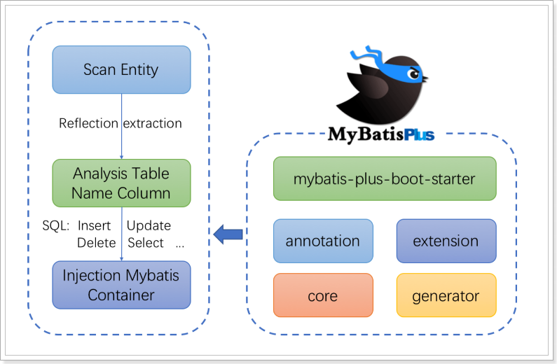

# MyBatisPlus （MyBatis 的增强工具）

## 1. MyBatis-Plus 简介

MyBatis-Plus（简称 MP）是一个 MyBatis 的增强工具，在 MyBatis 的基础上只做增强不做改变，为简化开发、提高效率而生

官网：[https://baomidou.com/](https://baomidou.com/)

### 1.1. 特性

- **无侵入**：只做增强不做改变，引入它不会对现有工程产生影响，如丝般顺滑
- **损耗小**：启动即会自动注入基本 CURD，性能基本无损耗，直接面向对象操作
- **强大的 CRUD 操作**：内置通用 Mapper、通用 Service，仅仅通过少量配置即可实现单表大部分 CRUD 操作，更有强大的条件构造器，满足各类使用需求
- **支持 Lambda 形式调用**：通过 Lambda 表达式，方便的编写各类查询条件，无需再担心字段写错
- **支持多种数据库**：支持 MySQL、MariaDB、Oracle、DB2、H2、HSQL、SQLite、Postgre、SQLServer2005、SQLServer 等多种数据库
- **支持主键自动生成**：支持多达 4 种主键策略（内含分布式唯一 ID 生成器 - Sequence），可自由配置，完美解决主键问题
- **支持 XML 热加载**：Mapper 对应的 XML 支持热加载，对于简单的 CRUD 操作，甚至可以无 XML 启动
- **支持 ActiveRecord 模式**：支持 ActiveRecord 形式调用，实体类只需继承 Model 类即可进行强大的 CRUD操作
- **支持自定义全局通用操作**：支持全局通用方法注入（ Write once, use anywhere ）
- **支持关键词自动转义**：支持数据库关键词（order、key......）自动转义，还可自定义关键词
- **内置代码生成器**：采用代码或者 Maven 插件可快速生成 Mapper 、 Model 、 Service 、 Controller 层代码，支持模板引擎，更有超多自定义配置等您来使用
- **内置分页插件**：基于 MyBatis 物理分页，开发者无需关心具体操作，配置好插件之后，写分页等同于普通 List 查询
- **内置性能分析插件**：可输出 Sql 语句以及其执行时间，建议开发测试时启用该功能，能快速揪出慢查询
- **内置全局拦截插件**：提供全表 delete 、 update 操作智能分析阻断，也可自定义拦截规则，预防误操作
- **内置 Sql 注入剥离器**：支持 Sql 注入剥离，有效预防 Sql 注入攻击

### 1.2. 架构




## 2. MyBatis-Plus 快速入门示例

> 注：此快速入门示例是在好客租房项目开发时的入门示例，代码位置在`haoke-project\haoke-technology-stack-sample\sample-mybatis-plus`

### 2.1. 创建数据库与相关表格

- 创建数据库

```sql
create database haoke default character set utf8;
```

- 创建相关数据库表与测试数据

```sql

```

### 2.2. 创建工程以及导入依赖

创建jar类型的`sample-mybatis-plus`示例工程，修改`pom.xml`文件引入相关依赖

```xml
<?xml version="1.0" encoding="UTF-8"?>
<project xmlns="http://maven.apache.org/POM/4.0.0"
         xmlns:xsi="http://www.w3.org/2001/XMLSchema-instance"
         xsi:schemaLocation="http://maven.apache.org/POM/4.0.0 http://maven.apache.org/xsd/maven-4.0.0.xsd">
    <!-- 添加SpringBoot parent支持 -->
    <parent>
        <groupId>org.springframework.boot</groupId>
        <artifactId>spring-boot-starter-parent</artifactId>
        <version>2.1.0.RELEASE</version>
    </parent>

    <modelVersion>4.0.0</modelVersion>
    <artifactId>sample-mybatis-plus</artifactId>
    <name>${project.artifactId}</name>
    <packaging>jar</packaging>
    <description>技术栈示例 - MyBatis-Plus快速入门示例</description>

    <dependencies>
        <!-- spring boot 依赖 -->
        <dependency>
            <groupId>org.springframework.boot</groupId>
            <artifactId>spring-boot-starter</artifactId>
        </dependency>
        <dependency>
            <groupId>org.springframework.boot</groupId>
            <artifactId>spring-boot-starter-test</artifactId>
            <scope>test</scope>
        </dependency>

        <!-- mybatis-plus的springboot支持（注：不需要再依赖mybatis，此插件已包含引入mybatis） -->
        <dependency>
            <groupId>com.baomidou</groupId>
            <artifactId>mybatis-plus-boot-starter</artifactId>
            <version>3.0.5</version>
        </dependency>
        <!-- mysql驱动 -->
        <dependency>
            <groupId>mysql</groupId>
            <artifactId>mysql-connector-java</artifactId>
            <version>5.1.47</version>
        </dependency>
        <!-- 实体类工具包 -->
        <dependency>
            <groupId>org.projectlombok</groupId>
            <artifactId>lombok</artifactId>
            <optional>true</optional>
            <version>1.18.4</version>
        </dependency>
    </dependencies>

    <!-- 项目构建 -->
    <build>
        <plugins>
            <plugin>
                <groupId>org.springframework.boot</groupId>
                <artifactId>spring-boot-maven-plugin</artifactId>
            </plugin>
        </plugins>
    </build>
</project>
```

### 2.3. 编写项目的配置文件

编写spring boot 项目的默认配置文件 `application.properties`

```properties
spring.application.name=sample-mybatis-plus
# 数据库(MySQl)相关配置
spring.datasource.driver-class-name=com.mysql.jdbc.Driver
spring.datasource.url=jdbc:mysql://192.168.12.134:3306/haoke?useUnicode=true&characterEncoding=utf8&autoReconnect=true&allowMultiQueries=true&useSSL=false
spring.datasource.username=root
spring.datasource.password=123456
```

### 2.4. 创建实体类

```java
@Data
public class User {
    private Long id;
    private String name;
    private Integer age;
    private String email;
}
```

### 2.5. 创建持久层Mapper接口

使用MyBatis-Plus插件，需要继承此工具框架提供的`public interface BaseMapper<T>`接口，泛型为接口操作的数据库表相应的实体类。此`BaseMapper<T>`接口时定义很多基础操作方法

```java
public interface UserMapper extends BaseMapper<User> { }
```

### 2.6. 编写SpringBoot启动类

```java
// 设置mybatis框架对mapper接口的扫描包路径
@MapperScan("com.moon.sample.mybatisplus.mapper")
@SpringBootApplication
public class MyBatisPlusApplication {
    public static void main(String[] args) {
        SpringApplication.run(MyBatisPlusApplication.class, args);
    }
}
```

### 2.7. 编写单元测试用例

```java
@RunWith(SpringRunner.class)
@SpringBootTest
public class UserMapperTest {
    // 注入测试的接口
    @Autowired
    private UserMapper userMapper;

    /* 基础的查询测试 */
    @Test
    public void selectTest(){
        List<User> users = this.userMapper.selectList(null);
        for (User user : users) {
            System.out.println(user);
        }
    }
}
```

运行测试用例，查看测试结果

## 3. BaseMapper（CRUD 基础接口）

在MybatisPlus中，`BaseMapper`接口中定义了一些常用的CRUD方法，当自定义的`Mapper`接口继承`BaseMapper`后即可拥有了这些方法。官方说明如下：

- 通用 CRUD 封装`BaseMapper`接口，为 `Mybatis-Plus` 启动时自动解析实体表关系映射转换为 `Mybatis` 内部对象注入容器
- 泛型 `T` 为任意实体对象
- 参数 `Serializable` 为任意类型主键 `Mybatis-Plus` 不推荐使用复合主键约定每一张表都有自己的唯一 `id` 主键
- 对象 `Wrapper` 为条件构造器

> <font color=red>**注：这些方法仅适合单表操作**</font>
>
> 官方文档地址：[Mapper CRUD 接口](https://baomidou.com/guide/crud-interface.html#mapper-crud-%E6%8E%A5%E5%8F%A3)

### 3.1. 新增操作

```java
@Test
public void testSave(){
    User user = new User();
    user.setAge(25);
    user.setEmail("shiyuan@qq.com");
    user.setName("石原里美");
    int count = this.userMapper.insert(user);
    System.out.println("新增数据成功! count => " + count);
}
```

数据插入结果：


可以看到，数据已经写入到了数据库，但是，id的值不正确。期望的是数据库自增长，实际是MP生成了id的值写入到了数据库。

如何设置id的生成策略呢？需要修改操作的表相应的实体类，增加MP的id策略为自增长。*注：数据库表的id字段也需要设置为自增长*

```java
@Data
public class User {
    @TableId(value = "id", type = IdType.AUTO)
    private Long id;
    private String name;
    private Integer age;
    private String email;
}
```

> MP支持的id策略详见源码`com.baomidou.mybatisplus.annotation.IdType`

再次运行测试，查看结果


### 3.2. 更新操作

在MP中，更新操作有2种，一种是根据id更新，另一种是根据条件更新。

#### 3.2.1. 根据 ID 更新数据

根据id修改数据，只会修改传的对象的属性不为null的相应字段。

```java
@Test
public void testUpdate() {
    User user = new User();
    user.setId(6L); // 设置需要更新数据的主键
    user.setName("新垣结衣"); // 设置修改的内容

    // 根据id更新，只会更新对象不为null的属性相应的字段
    int count = this.userMapper.updateById(user);
    System.out.println("修改成功! count => " + count);
}
```


### 3.3. 删除操作

```java
@Test
public void testDelete() {
    this.userMapper.deleteById(6L);
    System.out.println("删除成功!");
}
```

### 3.4. 查询操作

MP提供了多种查询操作，包括根据id查询、批量查询、查询单条数据、查询列表、分页查询、根据条件查询等操作。

#### 3.4.1. selectById - 根据id查询

```java
@Test
public void testSelectById(){
    User user = this.userMapper.selectById(3L);
    System.out.println(user);
}
```

#### 3.4.2. selectList - 条件查询

```java
/* 条件查询 - like查询 */
@Test
public void testSelectByLike() {
    // 创建条件构造器对象QueryWrapper
    QueryWrapper<User> wrapper = new QueryWrapper<>();
    // 调用相应的方法，设置相应的查询条件
    wrapper.like("name", "o"); // 表示 name like '%o%'
    // 传入条件构造器，实现条件查询
    List<User> list = this.userMapper.selectList(wrapper);
    for (User user : list) {
        System.out.println(user);
    }
}

/* 条件查询 - 小于查询 */
@Test
public void testSelectByLe() {
    QueryWrapper<User> wrapper = new QueryWrapper<>();
    wrapper.le("age", 20);
    List<User> list = this.userMapper.selectList(wrapper);
    for (User user : list) {
        System.out.println(user);
    }
}
```

#### 3.4.3. selectPage - 分页查询

- 方法定义

```java
/**
 * 根据 entity 条件，查询全部记录（并翻页）
 *
 * @param page         分页查询条件（可以为 RowBounds.DEFAULT）
 * @param queryWrapper 实体对象封装操作类（可以为 null）
 */
IPage<T> selectPage(IPage<T> page, @Param(Constants.WRAPPER) Wrapper<T> queryWrapper);
```

- 使用MyBatis-Plus进行分页查询操作，需要在项目中启动类（或者配置类）创建分页插件，并注册到spring的ioc容器中

```java
/**
 * 创建MyBatis-Plus的分页插件，注册到spring ioc容器中
 */
@Bean
public PaginationInterceptor paginationInterceptor() {
    return new PaginationInterceptor();
}
```

- 测试用例：

```java
@Test
public void testSelectByPage() {
    // 调用有参构造创建分页对象，设置当前页与每页显示条数
    Page<User> page = new Page<>(1, 2);
    // 调用selectPage方法，传入分页对象进行分页查询
    IPage<User> userIPage = this.userMapper.selectPage(page, null);
    System.out.println("总条数 ------> " + userIPage.getTotal());
    System.out.println("当前页数 ------> " + userIPage.getCurrent());
    System.out.println("当前每页显示数 ------> " + userIPage.getSize());
    List<User> records = userIPage.getRecords();
    for (User user : records) {
        System.out.println(user);
    }
}
```

## 4. 配置(!待整理)

虽然在MybatisPlus中可以实现零配置，但是有些时候需要自定义一些配置，就需要使用Mybatis原生的一些配置文件方式了

在MyBatis-Plus中有大量的配置，其中有一部分是Mybatis原生的配置，另一部分是MyBatis-Plus的配置，详情参考官方文档：https://baomidou.com/config/

### 4.1. 基本配置

#### 4.1.1. configLocation

MyBatis 配置文件位置，如果您有单独的 MyBatis 配置，请将其路径配置到 configLocation 中。

- Spring Boot 配置：

```properties
mybatis-plus.config-location = classpath:mybatis-config.xml
```

- Spring MVC 配置：

```xml
<bean id="sqlSessionFactory" class="com.baomidou.mybatisplus.extension.spring.MybatisSqlSessionFactoryBean">
    <property name="configLocation" value="classpath:mybatis-config.xml"/>
</bean>
```

