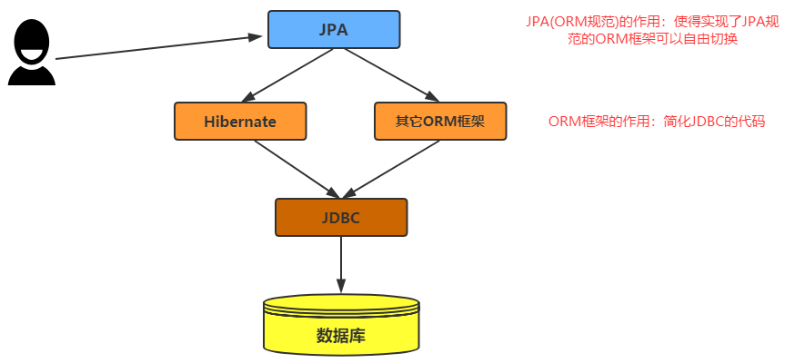

# Spring Data JPA

## 1. JPA 基础回顾

> 详情 JPA 详见 [《Java基础-JPA》](/01-Java/09-Java基础-JPA)

### 1.1. 概述

JPA 的全称是 Java Persistence API，即 Java 持久化 API，是 SUN 公司推出的一套基于 ORM 的规范，注意不是 ORM 框架——因为 JPA 并未提供 ORM 实现，它只是提供了一些编程的 API 接口。

### 1.2. JPA 基础使用

## 2. Spring Data JPA 简介

