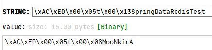
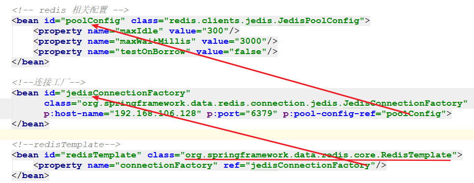
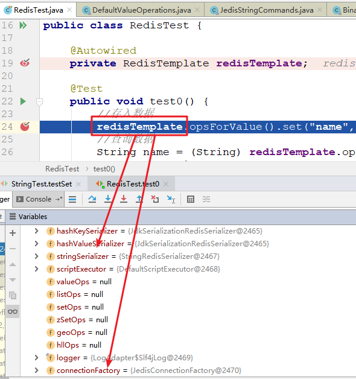
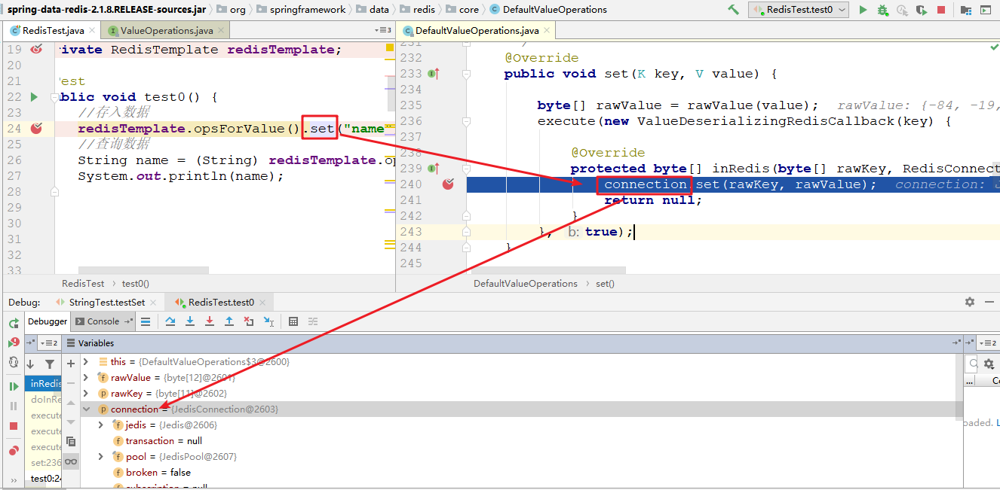
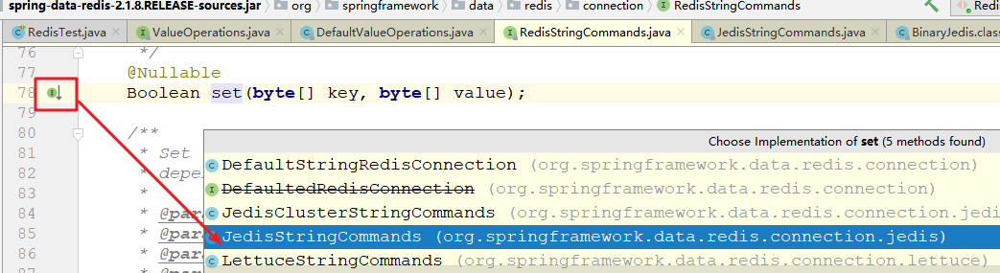
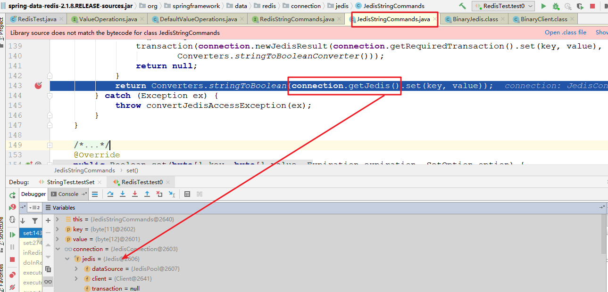
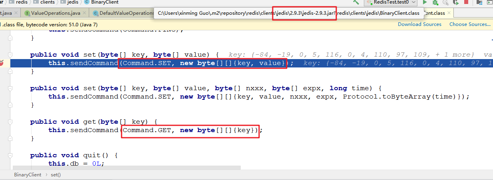

# Spring Data Redis

## 1. Spring Data Redis 简介

Redis 是一个基于内存的数据结构存储系统，它可以用作数据库或者缓存。它支持多种类型的数据结构，这些数据结构类型分别为 String（字符串）、List（列表）、Set（集合）、Hash（散列）和 Zset（有序集合）。

Spring Data Redis 的作用是通过一段简单的配置即可访问 redis 服务，它的底层是对 java 提供的 redis 开发包(比如 jedis 等)进行了高度封装，主要提供了如下功能：

- 连接池自动管理，提供了一个高度封装的 `RedisTemplate` 类，基于这个类的对象可以对 redis 进行各种操作
- 针对 jedis 客户端中大量 api 进行了归类封装，将同一类型操作封装为 `*Operations` 系列的接口
    - `ValueOperations`：简单字符串类型数据操作
    - `SetOperations`：set 类型数据操作
    - `ZSetOperations`：zset 类型数据操作
    - `HashOperations`：map 类型的数据操作
    - `ListOperations`：list 类型的数据操作

## 2. Spring Data Redis 快速入门案例

### 2.1. Redis 环境搭建

- Redis 的测试环境搭建，详见 [《Redis安装》](/04-数据库/03-Redis/02-Redis安装) 章节
- Redis 的基础使用，详见 [《Redis 笔记》](/04-数据库/03-Redis/01-Redis笔记) 章节

### 2.2. 创建案例项目

#### 2.2.1. 引入依赖
 
创建 maven 项目 `spring-data-redis`，依赖相关依赖

```xml
<dependencies>
    <!-- jedis 客户端依赖 -->
    <dependency>
        <groupId>redis.clients</groupId>
        <artifactId>jedis</artifactId>
        <version>2.9.3</version>
    </dependency>
    <!-- Spring Data Redis 依赖 -->
    <dependency>
        <groupId>org.springframework.data</groupId>
        <artifactId>spring-data-redis</artifactId>
        <version>2.1.8.RELEASE</version>
    </dependency>

    <!-- 测试 -->
    <dependency>
        <groupId>junit</groupId>
        <artifactId>junit</artifactId>
        <version>4.13.2</version>
        <scope>test</scope>
    </dependency>
    <dependency>
        <groupId>org.springframework</groupId>
        <artifactId>spring-test</artifactId>
        <version>5.1.6.RELEASE</version>
        <scope>test</scope>
    </dependency>

    <dependency>
        <groupId>com.fasterxml.jackson.core</groupId>
        <artifactId>jackson-databind</artifactId>
        <version>2.9.8</version>
    </dependency>
</dependencies>
```

#### 2.2.2. 创建配置文件

在 resources 目录创建 applicationContext-redis.xml 配置文件

```xml
<?xml version="1.0" encoding="UTF-8"?>
<beans xmlns="http://www.springframework.org/schema/beans"
       xmlns:xsi="http://www.w3.org/2001/XMLSchema-instance"
       xmlns:p="http://www.springframework.org/schema/p"
       xsi:schemaLocation="http://www.springframework.org/schema/beans
            http://www.springframework.org/schema/beans/spring-beans.xsd">

    <!-- 配置 Jedis 连接池参数 -->
    <bean id="jedisPoolConfig" class="redis.clients.jedis.JedisPoolConfig">
        <!-- 最大连接数 -->
        <property name="maxTotal" value="30"/>
        <!-- 最大空闲连接数 -->
        <property name="maxIdle" value="20"/>
        <!-- 最小空闲连接数 -->
        <property name="minIdle" value="10"/>
        <!-- 连接时的最大等待毫秒数 -->
        <property name="maxWaitMillis" value="3000"/>
        <!-- 在提取一个 jedis 实例时，是否提前进行验证操作；如果为 true，则得到的 jedis 实例均是可用的 -->
        <property name="testOnBorrow" value="false"/>
    </bean>

    <!-- 配置 Jedis 连接工厂 -->
    <bean id="jedisConnectionFactory"
          class="org.springframework.data.redis.connection.jedis.JedisConnectionFactory"
          p:hostName="192.168.106.128" p:port="6379" p:poolConfig-ref="jedisPoolConfig"
    />

    <!-- 配置 RedisTemplate -->
    <bean id="redisTemplate" class="org.springframework.data.redis.core.RedisTemplate">
        <!-- 配置 jedis 的连接工厂,目的是为了获取 jedis 连接 -->
        <property name="connectionFactory" ref="jedisConnectionFactory"/>
    </bean>

</beans>
```

#### 2.2.3. 测试

创建测试类，完成一条简单数据的存取

```java
@RunWith(SpringJUnit4ClassRunner.class)
@ContextConfiguration("classpath:applicationContext-redis.xml") // 加载配置文件
public class RedisBasicTest {

    @Autowired
    private RedisTemplate redisTemplate;

    @Test
    public void testSave() {
        // 获取操作简单字符串类型数据的数据句柄
        ValueOperations<String, String> ops = redisTemplate.opsForValue();
        // 存入数据
        ops.set("SpringDataRedisTest1", "MooNkirA");

        // 查询数据
        String value = ops.get("SpringDataRedisTest");
        System.out.println("查询的数据：" + value);
    }
}
```

## 3. Spring Data Redis 的序列化器

通过 Redis 提供的客户端查看入门案例中存入 redis 的数据。会发现，存入的数据并不是简单的字符串，而是一些类似于二进制的数据



因为 Spring Data Redis 在保存数据的时候，底层有一个序列化器在工作，它会将要保存的数据（键和值）按照一定的规则进行序列化操作后再进行存储。spring-data-redis 提供如下几种序列化器：

- `StringRedisSerializer`：简单的字符串序列化
- `GenericToStringSerializer`：可以将任何对象泛化为字符串并序列化
- `Jackson2JsonRedisSerialize`：序列化对象为 json 字符串
- `GenericJackson2JsonRedisSerializer`：功能同上，但是更容易反序列化
- `OxmSerializer`：序列化对象为 xml 字符串
- `JdkSerializationRedisSerializer`：序列化对象为二进制数据

<font color=purple>`RedisTemplate` 默认使用的是 `JdkSerializationRedisSerializer` 对数据进行序列化。</font>

Spring Data 提供了两种方式选择不同的序列化器：

方式1：通过配置文件配置

```xml
<!-- 配置 RedisTemplate -->
<bean id="redisTemplate" class="org.springframework.data.redis.core.RedisTemplate">
    <!-- 配置 jedis 的连接工厂,目的是为了获取 jedis 连接 -->
    <property name="connectionFactory" ref="jedisConnectionFactory"/>

    <!-- 指定非 hash 类型的数据序列化器 -->
    <property name="keySerializer">
        <bean class="org.springframework.data.redis.serializer.StringRedisSerializer"/>
    </property>
    <property name="valueSerializer">
        <bean class="org.springframework.data.redis.serializer.StringRedisSerializer"/>
    </property>
</bean>
```

方式2：通过 `RedisTemplate` 对象的方法设定

```java
@Autowired
private RedisTemplate redisTemplate;

@Test
public void test() {
    // 指定非 hash 类型的数据序列化器
    redisTemplate.setKeySerializer(new StringRedisSerializer());
    redisTemplate.setValueSerializer(new StringRedisSerializer());
    // RedisTemplate 操作....
}
```

配置后正常序列化：


## 4. Spring Data Redis 常用类型操作 API

在 Redis 中有五种常见类型，Spring Data Redis 对每一种数据类型都提供了一个 `xxxOperations` 的API，分别是：

- `ValueOperations`：用来操作字符串类型数据
- `HashOperations`：用来操作 hash 类型数据
- `ListOperations`：用来操作 list 类型数据
- `SetOperations`：用来操作 set 类型数据
- `ZSetOperations`：用来操作 zset 类型数据

### 4.1. String 类型操作 API
 


### 4.2. Hash 类型操作 API


### 4.3. List 类型操作 API


### 4.4. Set 类型操作 API


### 4.5. ZSet 类型操作 API


# Spring Data Redis 原理分析

## 1. RestTemplate 底层实现

Spring Data Redis 操作 Redis 服务器只要是通过 `RestTemplate` 实现的。下面通过源码追踪的形式来查阅 `RestTemplate` 底层到底是如何操作 redis

- 首先看配置文件中关于 `RestTemplate` 的 bean 的配置，可以看到在 `RedisTemplate` 的 bean 声明中注入了一个 `JedisConnectionFactory` 实例，这个连接工厂是用来获取 Jedis 连接的，那么通过这种方式 `RedisTemplate` 就可以拿到操作 Redis 服务器的句柄了。



- 使用 debug 运行入门案例，观察创建好的 `RestTemplate` 实例，可以看到里面主要有序列化器和 redis 的连接信息，



- 跟踪进入 `set` 方法，可以看到 `set` 方法中使用了一个 `connection` 实例来进行操作，此 `connection` 的类型是 `JedisConnetion`，而这个 `connection` 实例肯定是通过配置文件配置的 `JedisConnectionFactory` 产生的，也就是底层开始调用 jedis 的 api 了。



- 继续追踪 `set` 方法，选择 `JedisStringCommands` 实现



- 继续跟踪 `set` 方法，可以看到底层已经获取到了 jedis 的实例，再调用 `set` 方法已经在调 jedis 的 `set` 方法了



- 再往下追踪，就会发现底层最终调用的是 jedis 的原生 API `setCommand`方法，这个方法就是 jedis 提供的对 redis 的各种操作命令了。



结论：Spring Data 提供 `RedisTemplate` 就是在原生的 Jedis 或者其他操作 redis 的技术上做的一层封装，它屏蔽掉了这些原生技术的实现细节，统一了调用接口，使得操作更加简单明了。
