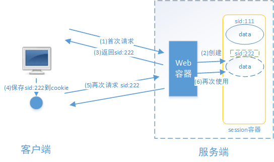
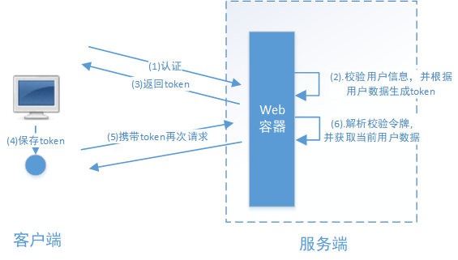
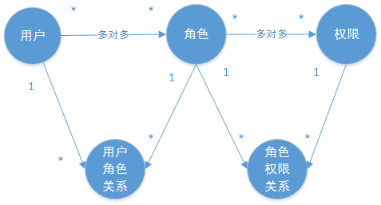

# Authorization Overview（授权认证概述）

此部分是对于授权认证的综合概述，是各种授权认证框架的公共介绍。具体授权框架的使用教程详见各个框架笔记

## 1. 基本概念

### 1.1. 什么是认证

认证 ：一般是指用户认证，就是判断一个用户的身份是否合法的过程，用户去访问系统资源时系统要求验证用户的身份信息，身份合法方可继续访问，不合法则拒绝访问。认证是为了保护系统的隐私数据与资源，用户的身份合法方可访问该系统的资源。

常见的用户身份认证方式有：用户名密码登录，二维码登录，手机短信登录，指纹认证等方式。

### 1.2. 什么是会话

用户认证通过后，为了避免用户的每次操作都进行认证可将用户的信息保证在会话中。会话就是系统为了保持当前用户的登录状态所提供的机制，常见的有基于session方式、基于token方式等。

#### 1.2.1. 基于 session 的认证方式

交互流程是，用户认证成功后，在服务端生成用户相关的数据保存在session(当前会话)中，发给客户端的 sesssion_id 存放到 cookie 中，这样用户客户端请求时带上 session_id 就可以验证服务器端是否存在 session 数据，以此完成用户的合法校验，当用户退出系统或 session 过期销毁时，客户端的 session_id 也就无效了。

#### 1.2.2. 基于 token 的认证方式

交互流程是，用户认证成功后，服务端生成一个token发给客户端，客户端可以放到 cookie 或 localStorage 等存储中，每次请求时带上 token，服务端收到 token 通过验证后即可确认用户身份。

#### 1.2.3. 两种方式的区别

- 基于 session 的认证方式由 Servlet 规范定制，服务端要存储 session 信息需要占用内存资源，客户端需要支持 cookie；
- 基于 token 的方式则一般不需要服务端存储 token，并且不限制客户端的存储方式。

如今移动互联网时代更多类型的客户端需要接入系统，系统多是采用前后端分离的架构进行实现，所以基于 token 的方式更适合。

### 1.3. 什么是授权

授权是用户认证通过后，根据用户的权限来控制用户访问资源的过程，拥有资源的访问权限则正常访问，没有权限则拒绝访问。

认证是为了保证用户身份的合法性，授权则是为了更细粒度的对隐私数据进行划分，授权是在认证通过后发生的，控制不同的用户能够访问不同的资源。

### 1.4. 授权的数据模型

授权即对用户访问资源进行控制。

#### 1.4.1. 数据模型的类型

授权是有相关的数据模型，主要分成以下几种类型：

- 主体（Subject），一般是指用户，也可以是程序，需要访问系统中的资源。
- 资源（Resource），如系统菜单、页面、按钮、代码方法、系统商品信息、系统订单信息等。系统菜单、页面、按钮、代码方法都属于系统功能资源，对于web系统每个功能资源通常对应一个URL；系统商品信息、系统订单信息都属于实体资源（数据资源），实体资源由资源类型和资源实例组成，比如商品信息为资源类型，商品编号 为001的商品为资源实例。
- 权限/许可（Permission），规定了用户对资源的操作许可，权限离开资源没有意义，如用户查询权限、用户添加权限、某个代码方法的调用权限、编号为001的用户的修改权限等，通过权限可知用户对哪些资源都有哪些操作许可。

#### 1.4.2. 数据模型之间的关系

对于权限的控制，一般是会引入角色这个概念，定义一个角色所拥有那些权限，再根据权限去访问相应的资源。相关的数据模型如下：

- 主体表（用户id、账号、密码、...）
- 资源表（资源id、资源名称、访问地址、...）
- 权限表（权限id、权限标识、权限名称、资源id、...）
- 角色表（角色id、角色名称、...）
- 角色和权限关系表（角色id、权限id、...）
- 主体（用户）和角色关系表（用户id、角色id、...）

关系如下图：

通常企业开发中会设计将资源和权限表合并为一张权限表，如下：

- 权限表（权限id、权限标识、权限名称、资源名称、资源访问地址、...）

修改后数据模型之间的关系如下图：

### 1.5. RBAC 授权方案

#### 1.5.1. 基于角色的访问控制

RBAC 基于角色的访问控制（Role-Based Access Control）是按角色进行授权。

例如：定义角色A可以进行删除某些资源的操作，那么代码的处理逻辑就是，在删除这些资源之前，就需要判断当前用户是否为角色A。如果是，则可以删除资源；否则不能删除。但如果当前有新需求需要增加角色B，并且也可以进行删除资源的操作，此时就需要修改代码，将删除资源需要判断当前用户是否为角色A或者角色B，如果是，则可以删除资源。

根据上面的例子发现，当需要修改角色的权限时就需要修改授权的相关代码，系统可扩展性差。

#### 1.5.2. 基于资源的访问控制

RBAC 基于资源的访问控制（Resource-Based Access Control）是按资源（或权限）进行授权。

例如：同样是上面的示例，如果调整为拥有权限A的才可以进行删除资源操作，那么代码的实现逻辑是判断当前用户的角色A是否有权限A，如果有，则可以删除资源。那么当新增一个角色B时，如果也需要进行删除操作，则需要在表中新增记录，将角色B与权限A绑定，则角色B就拥有了删除资源的权限，此时是不需要修改原代码的判断逻辑。

根据上面的例子可发现，根据系统设计时定义好相关权限关系，即使修改主体相关的角色，也不需要修改原授权的逻辑代码，系统可扩展性强。

## 2. 基于 Session 实现认证的示例

