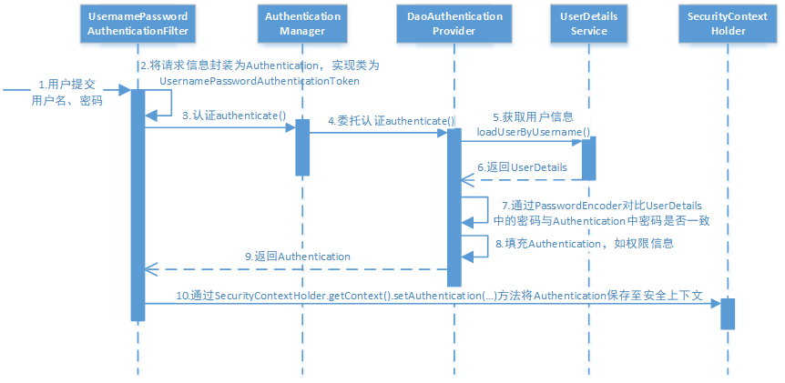

# Spring Security

- 官网：https://spring.io/projects/spring-security
- 官方源码仓库地址：https://github.com/spring-projects/spring-security
- 官方示例仓库地址：https://github.com/spring-projects/spring-security-samples

## 1. Spring Security 概述

Spring Security 是一个能够为基于 Spring 的企业应用系统提供声明式的安全访问控制解决方案的安全框架。由于它是 Spring 生态系统中的一员，因此它伴随着整个 Spring 生态系统不断修正、升级，在 spring boot 项目中加入 spring security 更是十分简单，使用 Spring Security 减少了为企业系统安全控制编写大量重复代码的工作。

## 2. Spring Security 快速开始

此示例基于 Maven 构建的 Spring MVC 项目

### 2.1. 初始化示例项目

创建 maven 工程 spring-security-5.1.x，工程结构如下：


#### 2.1.1. 引入依赖

在 spring mvc 项目的基础上增加 spring-security 的依赖，完整依赖如下：

```xml
<?xml version="1.0" encoding="UTF-8"?>
<project xmlns="http://maven.apache.org/POM/4.0.0"
         xmlns:xsi="http://www.w3.org/2001/XMLSchema-instance"
         xsi:schemaLocation="http://maven.apache.org/POM/4.0.0 http://maven.apache.org/xsd/maven-4.0.0.xsd">

    <parent>
        <artifactId>spring-security-sample</artifactId>
        <groupId>com.moon</groupId>
        <version>1.0-SNAPSHOT</version>
    </parent>

    <modelVersion>4.0.0</modelVersion>
    <artifactId>spring-security-5.1.x</artifactId>
    <packaging>war</packaging>
    <description>
        Spring Security 5.1.x 版本使用示例工程（基于 Spring MVC 的 Web 项目）
    </description>

    <properties>
        <project.build.sourceEncoding>UTF-8</project.build.sourceEncoding>
        <maven.compiler.source>8</maven.compiler.source>
        <maven.compiler.target>8</maven.compiler.target>

        <spring-security.version>5.1.4.RELEASE</spring-security.version>
        <spring.version>5.1.5.RELEASE</spring.version>
    </properties>

    <dependencies>
        <!-- Spring Security 依赖 -->
        <dependency>
            <groupId>org.springframework.security</groupId>
            <artifactId>spring-security-web</artifactId>
            <version>${spring-security.version}</version>
        </dependency>

        <dependency>
            <groupId>org.springframework.security</groupId>
            <artifactId>spring-security-config</artifactId>
            <version>${spring-security.version}</version>
        </dependency>

        <!-- Spring MVC 依赖 -->
        <dependency>
            <groupId>org.springframework</groupId>
            <artifactId>spring-webmvc</artifactId>
            <version>${spring.version}</version>
        </dependency>

        <dependency>
            <groupId>javax.servlet</groupId>
            <artifactId>javax.servlet-api</artifactId>
            <version>3.0.1</version>
            <scope>provided</scope>
        </dependency>
        <dependency>
            <groupId>org.projectlombok</groupId>
            <artifactId>lombok</artifactId>
            <version>1.18.22</version>
        </dependency>
    </dependencies>

    <build>
        <finalName>${artifactId}</finalName>
        <pluginManagement>
            <plugins>
                <plugin>
                    <groupId>org.apache.tomcat.maven</groupId>
                    <artifactId>tomcat7-maven-plugin</artifactId>
                    <version>2.2</version>
                </plugin>
                <!-- 编译插件 -->
                <plugin>
                    <groupId>org.apache.maven.plugins</groupId>
                    <artifactId>maven-compiler-plugin</artifactId>
                    <configuration>
                        <source>1.8</source>
                        <target>1.8</target>
                    </configuration>
                </plugin>
                <!-- 资源打包插件 -->
                <plugin>
                    <artifactId>maven-resources-plugin</artifactId>
                    <configuration>
                        <encoding>utf-8</encoding>
                        <useDefaultDelimiters>true</useDefaultDelimiters>
                        <resources>
                            <resource>
                                <directory>src/main/resources</directory>
                                <filtering>true</filtering>
                                <includes>
                                    <include>**/*</include>
                                </includes>
                            </resource>
                            <resource>
                                <directory>src/main/java</directory>
                                <includes>
                                    <include>**/*.xml</include>
                                </includes>
                            </resource>
                        </resources>
                    </configuration>
                </plugin>
            </plugins>
        </pluginManagement>
    </build>

</project>
```

#### 2.1.2. 配置 Spring 容器

创建 `com.moon.spring.security.config.ApplicationConfig` 类，用于替代 applicationContext.xml 配置文件。对应在 web.xml 中的 `ContextLoaderListener` 等配置。

```java
@Configuration
@ComponentScan(basePackages = "com.moon.spring.security",
        excludeFilters = {@ComponentScan.Filter(type = FilterType.ANNOTATION, value = Controller.class)})
public class ApplicationConfig {
}
```

#### 2.1.3. 配置 Servlet Context

本案例采用 Servlet3.0 无 web.xml 方式，创建 `com.moon.spring.security.config.WebConfig` 类，它对应于 web.xml  文件中的 `DispatcherServlet` 配置

> 这里因为使用了 Spring Security 框架，所以不需要自定义登陆授权的拦截器，由框架来实现

```java
/**
 * 此配置类相当于 spring-mvc.xml 配置文件，相应 DispatcherServlet 的配置。
 * 在此类中配置 Spring MVC 的视频解析器
 */
@Configuration
@EnableWebMvc
@ComponentScan(basePackages = "com.moon.spring.security",
        includeFilters = {@ComponentScan.Filter(type = FilterType.ANNOTATION, value = Controller.class)})
public class WebConfig {
    // 视图解析器
    @Bean
    public InternalResourceViewResolver viewResolver() {
        InternalResourceViewResolver viewResolver = new InternalResourceViewResolver();
        viewResolver.setPrefix("/WEB-INF/view/");
        viewResolver.setSuffix(".jsp");
        return viewResolver;
    }
}
```

#### 2.1.4. 配置加载 Spring 容器

在 init 包下创建 Spring 容器初始化类 `SpringApplicationInitializer`，此类实现 `WebApplicationInitializer` 接口，Spring 容器启动时加载 `WebApplicationInitializer` 接口的所有实现类。

注：一般自定义的初始化类会继承抽象现实类 `org.springframework.web.servlet.support.AbstractAnnotationConfigDispatcherServletInitializer` ，它实现了 `WebApplicationInitializer` 接口。

```java
/**
 * 实现 WebApplicationInitializer 接口。用于初始化 Spring 容器。
 * 此类相当于 web.xml 配置文件，使用了 servlet3.0 开发则不需要再定义 web.xml
 */
public class SpringApplicationInitializer extends AbstractAnnotationConfigDispatcherServletInitializer {
    /* 指定rootContext的配置类 */
    @Override
    protected Class<?>[] getRootConfigClasses() {
        return new Class<?>[]{ApplicationConfig.class};
    }

    /* 指定servletContext的配置类 */
    @Override
    protected Class<?>[] getServletConfigClasses() {
        return new Class<?>[]{WebConfig.class};
    }

    /* 配置 servlet 访问地址映射 */
    @Override
    protected String[] getServletMappings() {
        return new String[]{"/"};
    }
}
```

### 2.2. 实现认证功能

#### 2.2.1. 认证登陆页面

Spring Security 框架默认提供认证页面，不需要使用者额外开发。


- 登陆的url：`http://项目访问域名/login`
- 登出的url：`http://项目访问域名/logout`

#### 2.2.2. Spring Security 安全配置

Spring Security 提供了用户名密码登录、退出、会话管理等认证功能，只需要配置即可使用。

- 在 config 包下创建 Spring Security 的配置类，继承 `org.springframework.security.config.annotation.web.configuration.WebSecurityConfigurerAdapter` 抽象类，安全配置类主要需要设置的内容包括：**用户信息**(即用户登陆的账号与密码)、**密码编码器**(即密码加密后比较的方式，也可以直接比较)、**安全拦截机制**(即配置需要拦截校验的url)。
- 在类上标识 `@EnableWebSecurity` 注解，开启 Spring Security。

```java
@EnableWebSecurity
public class WebSecurityConfig extends WebSecurityConfigurerAdapter {
    /**
     * 创建 UserDetailsService 实例。
     * 用于定义用户信息服务（查询用户信息）
     *
     * @return
     */
    @Bean
    public UserDetailsService userDetailsService() {
        // 正常情况是查询数据库，此示例为了简单直接创建保存在内存中的用户信息服务
        InMemoryUserDetailsManager manager = new InMemoryUserDetailsManager();
        // 创建用户信息与配置权限标识
        manager.createUser(User.withUsername("admin").password("123").authorities("p1").build());
        manager.createUser(User.withUsername("moon").password("456").authorities("p2").build());
        return manager;
    }

    /**
     * 密码编码器，即设置登陆时密码的校验
     *
     * @return
     */
    @Bean
    public PasswordEncoder passwordEncoder() {
        // 此示例为了方便，暂时使用密码无转码的方式来验证
        return NoOpPasswordEncoder.getInstance();
    }

    /**
     * 安全拦截机制（最重要）
     *
     * @param http
     * @throws Exception
     */
    @Override
    protected void configure(HttpSecurity http) throws Exception {
        http.authorizeRequests()
                .antMatchers("/check/**").authenticated() // 设置所有 /check/** 的请求必须认证通过
                .anyRequest().permitAll()  // 设置除了上面配置的 /check/**，其它的请求可以访问
                .and()
                .formLogin() // 允许表单登录
                .successForwardUrl("/login-success"); // 自定义登录成功的页面地址
    }
}
```

以上 Spring Security 的配置主要是在 `userDetailsService()` 方法中，返回了一个 `UserDetailsService` 给 spring 容器，Spring Security 会使用它来获取用户信息。示例暂时使用 `InMemoryUserDetailsManager` 实现类，并在其中分别创建了“admin”、“moon”两个用户，并设置密码和权限。

而在 `configure()` 方法中，通过 `HttpSecurity` 设置了安全拦截规则，其中包含了以下内容：

1. url 匹配 `/check/**` 的资源，经过认证后才能访问。
2. 其他 url 完全开放。
3. 支持 form 表单认证，认证成功后跳转到 `/login-success`（*自定义的成功页面url*）。

> *注：`HttpSecurity` 更多的配置详见[《附录：HttpSecurity 配置列表》](#_251-httpsecurity-配置列表)*

#### 2.2.3. 加载 Spring Security 配置类

修改 `SpringApplicationInitializer` 的 `getRootConfigClasses()` 方法，添加 `WebSecurityConfig.class`：

```java
public class SpringApplicationInitializer extends AbstractAnnotationConfigDispatcherServletInitializer {
    /* 指定rootContext的配置类 */
    @Override
    protected Class<?>[] getRootConfigClasses() {
        return new Class<?>[]{ApplicationConfig.class, WebSecurityConfig.class};
    }
    ....
}
```

#### 2.2.4. Spring Security 初始化

Spring Security 初始化，有两种情况：

- 若当前环境没有使用 Spring 或 Spring MVC，则需要将 `WebSecurityConfig` (Spring Security 配置类) 传入超类，以确保获取配置，并创建 spring context。
- 若当前环境已经使用 spring，应该在现有的 Spring Context 中注册 Spring Security (上一步已经做将 `WebSecurityConfig` 加载至 rootcontext )，此方法可以什么都不做。

在 init 包下定义 `SpringSecurityApplicationInitializer` 类，用于初始化 Spring Security：

```java
public class SpringSecurityApplicationInitializer extends AbstractSecurityWebApplicationInitializer {
    public SpringSecurityApplicationInitializer() {
        //super(WebSecurityConfig.class);
    }
}
```

#### 2.2.5. 配置默认根路径请求

在 `WebConfig.java` 配置类中添加默认请求根路径 `/` 时，重定向到 `/login`，此 url 为 spring security 默认提供的登陆页面：

```java
public class WebConfig implements WebMvcConfigurer {
    ....
    /**
     * 配置 url 的与页面的映射关系
     *
     * @param registry
     */
    @Override
    public void addViewControllers(ViewControllerRegistry registry) {
        // 增加默认 Url 根路径为 '/' 时，跳转到 /login。注：此 url 是 spring security 默认提供的登陆页面
        registry.addViewController("/").setViewName("redirect:/login");
    }
}
```

#### 2.2.6. 创建登陆成功后跳转页面

在 `LoginController` 类中定义 `/login-success` 相应的映射方法:

```java
/**
 * 登陆成功后跳转的请求url
 */
@RequestMapping(value = "/login-success", produces = {"text/plain;charset=UTF-8"})
public String loginSuccess() {
    return " 登录成功";
}
```

> 注意： 这里有一个小坑，如果使用 `@GetMapping` 注解的话，登陆后会报 405 错误：Request method 'POST' not supported。（*具体原因以后分析*）
>
> 

#### 2.2.7. 测试

- 使用 maven 命令 `clean tomcat7:run` 启动项目，访问项目地址： `http://localhost:8080/spring-security-5.1.x`。页面会根据 `WebConfig` 中 `addViewControllers` 配置规则，跳转至 `/login`，这是 Spring Security 提供的登录页面。
- 输入错误的用户名、密码


- 输入正确的用户名、密码，登录成功


- 请求 `/logout` 退出登陆。退出后再访问资源自动跳转到登录页面


### 2.3. 实现授权功能

实现授权需要对用户的访问进行拦截校验，校验用户的权限是否可以操作指定的资源，Spring Security 默认提供授权实现方法。

#### 2.3.1. 新增不同权限访问的 url 控制方法

在 `LoginController` 添加 `/check/p1` 与 `/check/p2`
 
```java
@GetMapping(value = "/check/p1", produces = {"text/plain;charset=UTF-8"})
public String checkPrivilege1() {
    return "访问资源p1";
}

@GetMapping(value = "/check/p2", produces = {"text/plain;charset=UTF-8"})
public String checkPrivilege2() {
    return "访问资源p2";
}
```

#### 2.3.2. 配置授权规则

修改安全配置类 `WebSecurityConfig.java` 中配置授权规则：

```java
@Override
protected void configure(HttpSecurity http) throws Exception {
    http.authorizeRequests()
            .antMatchers("/check/p1").hasAuthority("p1") // 设置不同权限访问的url
            .antMatchers("/check/p2").hasAuthority("p2") // 设置不同权限访问的url
            .antMatchers("/check/**").authenticated() // 设置所有 /check/** 的请求必须认证通过
            .anyRequest().permitAll()  // 设置除了上面配置的 /check/**，其它的请求可以访问
            .and()
            .formLogin() // 允许表单登录
            .successForwardUrl("/login-success"); // 自定义登录成功的页面地址
}
```

- `.antMatchers("/check/p1").hasAuthority("p1")` 表示：访问 `/check/p1` 资源的 ur l需要拥有 p1 权限。
- `.antMatchers("/check/p2").hasAuthority("p2")` 表示：访问 `/check/p2` 资源的 url 需要拥有 p2 权限。

#### 2.3.3. 测试

启动项目。登陆 admin 用户，分别访问两个url，有权限时则正常访问，否则返回403（拒绝访问）


### 2.4. 小结

通过快速开始示例可知，Spring Security 提供了基于账号和密码的认证方式，通过安全配置即可实现请求拦截，授权功能。不需要开发者去实现登陆、授权控制等逻辑代码。

### 2.5. 附录

#### 2.5.1. HttpSecurity 配置列表


#### 2.5.2. @EnableWebSecurity 注解源码

```java
@Retention(value = java.lang.annotation.RetentionPolicy.RUNTIME)
@Target(value = { java.lang.annotation.ElementType.TYPE })
@Documented
@Import({ WebSecurityConfiguration.class,
		SpringWebMvcImportSelector.class,
		OAuth2ImportSelector.class })
@EnableGlobalAuthentication
@Configuration
public @interface EnableWebSecurity {
	/**
	 * Controls debugging support for Spring Security. Default is false.
	 * @return if true, enables debug support with Spring Security
	 */
	boolean debug() default false;
}
```

## 3. Spring Boot 集成 Spring Security

> *注：Spring Boot 集成 Spring Security 更多的集成功能示例详见【分布式架构&微服务架构/SpringBoot】*

Spring Boot 是一套 Spring 的快速开发框架，基于 Spring 4.0 设计，使用 Spring Boot 开发可以避免一些繁琐的工程搭建和配置，同时它集成了大量的常用框架，快速导入依赖包，避免依赖包的冲突。基本上常用的开发框架都支持 Spring Boot 开发，例如：MyBatis、Dubbo 等，Spring 家族更是如此，例如：Spring cloud、Spring mvc、Spring security 等，使用 Spring Boot 开发可以大大得高生产率。

Spring Boot 提供 spring-boot-starter-security 用于快速开发 Spring Security 应用。

### 3.1. 创建示例工程

创建 maven 工程 spring-security-boot-2.1.x，工程目录结构如下：


引入依赖

```xml
<?xml version="1.0" encoding="UTF-8"?>
<project xmlns="http://maven.apache.org/POM/4.0.0"
         xmlns:xsi="http://www.w3.org/2001/XMLSchema-instance"
         xsi:schemaLocation="http://maven.apache.org/POM/4.0.0 http://maven.apache.org/xsd/maven-4.0.0.xsd">
    <parent>
        <artifactId>spring-security-sample</artifactId>
        <groupId>com.moon</groupId>
        <version>1.0-SNAPSHOT</version>
    </parent>

    <modelVersion>4.0.0</modelVersion>
    <artifactId>spring-security-boot-2.1.x</artifactId>
    <packaging>jar</packaging>
    <description>
        Spring Boot 集成 Spring Security 示例项目。
        示例的 Spring Boot 版本：2.1.3.RELEASE。
        相应的 Spring Security 版本：5.1.4.RELEASE
    </description>

    <properties>
        <project.build.sourceEncoding>UTF-8</project.build.sourceEncoding>
        <maven.compiler.source>8</maven.compiler.source>
        <maven.compiler.target>8</maven.compiler.target>
    </properties>

    <dependencyManagement>
        <!-- 因为继承自己项目的聚合项目，所以这里需要使用import的方式引入SpringBoot -->
        <dependencies>
            <dependency>
                <groupId>org.springframework.boot</groupId>
                <artifactId>spring-boot-dependencies</artifactId>
                <version>2.1.3.RELEASE</version>
                <type>pom</type>
                <scope>import</scope>
            </dependency>
        </dependencies>
    </dependencyManagement>

    <dependencies>
        <!-- spring boot依赖-->
        <dependency>
            <groupId>org.springframework.boot</groupId>
            <artifactId>spring-boot-starter-web</artifactId>
        </dependency>

        <!-- spring security依赖-->
        <dependency>
            <groupId>org.springframework.boot</groupId>
            <artifactId>spring-boot-starter-security</artifactId>
        </dependency>


        <!-- jsp依赖-->
        <dependency>
            <groupId>javax.servlet</groupId>
            <artifactId>javax.servlet-api</artifactId>
            <scope>provided</scope>
        </dependency>
        <!-- jsp页面使用jstl标签 -->
        <dependency>
            <groupId>javax.servlet</groupId>
            <artifactId>jstl</artifactId>
        </dependency>

        <dependency>
            <groupId>org.springframework.boot</groupId>
            <artifactId>spring-boot-starter-tomcat</artifactId>
            <scope>provided</scope>
        </dependency>
        <!-- 用于编译jsp -->
        <dependency>
            <groupId>org.apache.tomcat.embed</groupId>
            <artifactId>tomcat-embed-jasper</artifactId>
            <scope>provided</scope>
        </dependency>
        <dependency>
            <groupId>org.projectlombok</groupId>
            <artifactId>lombok</artifactId>
            <version>1.18.0</version>
        </dependency>
    </dependencies>

    <build>
        <finalName>${artifactId}</finalName>
        <pluginManagement>
            <plugins>
                <plugin>
                    <groupId>org.apache.tomcat.maven</groupId>
                    <artifactId>tomcat7-maven-plugin</artifactId>
                    <version>2.2</version>
                </plugin>
                <!-- 编译插件 -->
                <plugin>
                    <groupId>org.apache.maven.plugins</groupId>
                    <artifactId>maven-compiler-plugin</artifactId>
                    <configuration>
                        <source>1.8</source>
                        <target>1.8</target>
                    </configuration>
                </plugin>
                <!-- 资源打包插件 -->
                <plugin>
                    <artifactId>maven-resources-plugin</artifactId>
                    <configuration>
                        <encoding>utf-8</encoding>
                        <useDefaultDelimiters>true</useDefaultDelimiters>
                        <resources>
                            <resource>
                                <directory>src/main/resources</directory>
                                <filtering>true</filtering>
                                <includes>
                                    <include>**/*</include>
                                </includes>
                            </resource>
                            <resource>
                                <directory>src/main/java</directory>
                                <includes>
                                    <include>**/*.xml</include>
                                </includes>
                            </resource>
                        </resources>
                    </configuration>
                </plugin>
            </plugins>
        </pluginManagement>
    </build>

</project>
```

### 3.2. 配置 spring 容器

- 创建 SpringBoot 项目启动类。SpringBoot 工程启动会自动扫描启动类所在包下的所有Bean，加载到 spring 容器。

```java
@SpringBootApplication
public class SpringSecurityBootApp {
    public static void main(String[] args) {
        SpringApplication.run(SpringSecurityBootApp.class, args);
    }
}
```

- 在 resources 目录下，创建 Spring Boot 配置文件 application.yml。配置 web 项目的相关配置

```yml
server:
  port: 8080
  servlet:
    context-path: /

spring:
  application:
    name: spring-security-boot
```

### 3.3. 配置 Servlet Context

- 创建 Servlet Context 配置类 `WebConfig`。由于 Spring boot starter 自动装配机制，不需要像 Spring MVC 项目，不用标识 `@EnableWebMvc` 与 `@ComponentScan` 注解，如下：

```java
@Configuration
public class WebConfig implements WebMvcConfigurer {
    /**
     * 配置 url 的与页面的映射关系
     *
     * @param registry
     */
    @Override
    public void addViewControllers(ViewControllerRegistry registry) {
        // 增加默认 Url 根路径为 '/' 时，跳转到 /login。注：此 url 是 spring security 默认提供的登陆页面
        registry.addViewController("/").setViewName("redirect:/login");
    }
}
```

- 视图解析器在 application.yml 文件中配置。指定项目上页面的前后缀

```yml
spring:
  mvc:
    view: # 配置视图解析器
      prefix: /WEB-INF/view/
      suffix: .jsp
```

### 3.4. Spring Security 安全配置

创建 Spring Security 安全配置类 `WebSecurityConfig`，由于 Spring boot starter 自动装配机制，无需使用 `@EnableWebSecurity` 注解开启 Spring Security，配置的内容和上面 Spring MVC 项目一样，如下：

```java
@Configuration
public class WebSecurityConfig extends WebSecurityConfigurerAdapter {
    /**
     * 创建 UserDetailsService 实例。
     * 用于定义用户信息服务（查询用户信息）
     *
     * @return
     */
    @Bean
    public UserDetailsService userDetailsService() {
        // 正常情况是查询数据库，此示例为了简单直接创建保存在内存中的用户信息服务
        InMemoryUserDetailsManager manager = new InMemoryUserDetailsManager();
        // 创建用户信息与配置权限标识
        manager.createUser(User.withUsername("admin").password("123").authorities("p1").build());
        manager.createUser(User.withUsername("moon").password("456").authorities("p2").build());
        return manager;
    }

    /**
     * 密码编码器，即设置登陆时密码的校验
     *
     * @return
     */
    @Bean
    public PasswordEncoder passwordEncoder() {
        // 此示例为了方便，暂时使用密码无转码的方式来验证
        return NoOpPasswordEncoder.getInstance();
    }

    /**
     * 安全拦截机制（最重要）
     *
     * @param http
     * @throws Exception
     */
    @Override
    protected void configure(HttpSecurity http) throws Exception {
        http.authorizeRequests()
                .antMatchers("/check/p1").hasAuthority("p1") // 设置不同权限访问的url
                .antMatchers("/check/p2").hasAuthority("p2") // 设置不同权限访问的url
                .antMatchers("/check/**").authenticated() // 设置所有 /check/** 的请求必须认证通过
                .anyRequest().permitAll()  // 设置除了上面配置的 /check/**，其它的请求可以访问
                .and()
                .formLogin() // 允许表单登录
                .successForwardUrl("/login-success"); // 自定义登录成功的页面地址
    }
   
}
```

### 3.5. 测试

创建与上面 Spring MVC 示例一样的控制层。启动项目进行登陆、退出、授权等测试。

示例项目访问地址：`http://127.0.0.1:8080/`

## 4. Spring Security 应用详解

Spring Security 提供了非常好的认证、授权扩展方法，比如：快速开始的示例中将用户信息存储到内存中，实际开发中用户信息通常在数据库，Spring security 可以实现从数据库读取用户信息，Spring security 还支持多种授权方法。

### 4.1. 自定义认证登录页面

在上面基础示例中，默认配置没有明确设定一个登录页面的URL，因此 Spring Security 会根据启用的功能自动生成一个登录页面 URL，并使用默认 URL 处理登录的提交内容，登录后跳转的到默认 URL 等等。尽管 Spring Security  提供的默认登陆页面很方便快速启动和运行，但实际应用程序都希望定义自己的登录页面。

#### 4.1.1. 配置流程

- 在项目的 `/src/main/webapp/WEB-INF/view/` 目录下，创建自定义认证页面 login.jsp

```jsp
<%@ page contentType="text/html;charset=UTF-8" pageEncoding="utf-8" %>
<html>
<head>
    <title>用户登录</title>
</head>
<body>
<form action="login" method="post">
    用户名：<input type="text" name="username"/><br/>
    密&nbsp;&nbsp;&nbsp;码:
    <input type="password" name="password"/><br/>
    <input type="submit" value="登录">
</form>
</body>
</html>
```

- 在 web mvc 配置类 `WebConfig.java` 中，配置登陆时跳转到自定义的认证页面

```java
@Configuration
public class WebConfig implements WebMvcConfigurer {
    @Override
    public void addViewControllers(ViewControllerRegistry registry) {
        // 配置跳转到自定义的认证登陆页面，url 按需定，此示例是 /login-view
        registry.addViewController("/").setViewName("redirect:/login-view");
        // 配置自定义登陆 url 指向自定义的页面 login.jsp
        registry.addViewController("/login-view").setViewName("login");
    }
}
```

- 修改 Spring Security 安全配置类 `WebSecurityConfig`，配置表单登录认证相关信息

```java
@Override
protected void configure(HttpSecurity http) throws Exception {
    http.authorizeRequests()
            .antMatchers("/check/p1").hasAuthority("p1") // 设置不同权限访问的url
            .antMatchers("/check/p2").hasAuthority("p2") // 设置不同权限访问的url
            .antMatchers("/check/**").authenticated() // 设置所有 /check/** 的请求必须认证通过
            .anyRequest().permitAll()  // 设置除了上面配置的 /check/**，其它的请求可以访问
            .and()
            .formLogin() // 允许表单登录
            .loginPage("/login-view") // 指定自定义登陆页面url
            .loginProcessingUrl("/login") // 指定登陆认证表单提交的url
            .successForwardUrl("/login-success"); // 自定义登录成功的页面地址
}
```

> 配置项解析：
>
> - `formLogin()`：允许表单登录
> - `loginPage("/login-view")`：指定自定义登录页，spring security 以重定向方式跳转到 /login-view
> - `loginProcessingUrl("/login")`：指定登录处理的 URL，也就是用户名、密码表单提交的目的路径
> - `successForwardUrl("/login-success")`：指定登录成功后的跳转URL
>
> 必须允许所有用户访问自定义登录页（例如为验证的用户），这个 `formLogin().permitAll()` 方法允许任意用户访问基于表单登录的所有的URL。

#### 4.1.2. 测试与跨域问题

- 测试，启动项目。访问项目根路径，当用户没有认证（登陆）时访问系统的资源会重定向到 login-view，即 login.jsp 页面


但点击登陆会报错。


问题原因：spring security 为防止 CSRF（Cross-site request forgery跨站请求伪造）的发生，限制了除了 get 以外的大多数方法。因为表单的提交是 post 请求

- 解决方法1：配置 Spring Security 安全配置类 `WebSecurityConfig`，屏蔽 CSRF 控制，即 spring security 不再限制 CSRF。

```java
@Override
protected void configure(HttpSecurity http) throws Exception {
    http.csrf().disable() // 屏蔽 CSRF（Cross-site request forgery跨站请求伪造）控制
            ....
}
```

- 解决方法2：在 login.jsp 页面添加一个 token，spring security 会验证 token，如果 token 合法则可以继续请求。

```jsp
<form action="login" method="post">
    <input type="hidden" name="${_csrf.parameterName}" value="${_csrf.token}"/>
    ....
</form>
```

#### 4.1.3. 小坑记录

因为示例项目是使用聚合项目的结构


启动项目时会找不到jsp页面


问题出现的原因是：IDEA默认工作路径为当前工程路径（Project），而不是模块的路径， 所以导致多模块无法定位到 /WEB-INF/ 下的 jsp 文件；而在独立的模块的工程中，工作路径就是模块路径 ，因此可以定位。故在多模块的工程中，设置 Working directory 为当前模块即可。


或者直接选择模块目录


配置后即可正常访问到jsp页面

### 4.2. 自定义连接数据库认证

前面的示例都是将用户信息存储在内存中，实际项目中用户信息存储在数据库中。

#### 4.2.1. 创建数据库

- 创建 user_db 数据库

```sql
CREATE DATABASE `user_db` CHARACTER SET 'utf8' COLLATE 'utf8_general_ci';
```

- 创建 t_user 表

```sql
CREATE TABLE `t_user` (
	`id` BIGINT ( 20 ) NOT NULL COMMENT '用户id',
	`username` VARCHAR ( 64 ) NOT NULL,
	`password` VARCHAR ( 64 ) NOT NULL,
	`fullname` VARCHAR ( 255 ) NOT NULL COMMENT '用户姓名',
	`mobile` VARCHAR ( 11 ) DEFAULT NULL COMMENT '手机号',
PRIMARY KEY ( `id` ) USING BTREE 
) ENGINE = INNODB DEFAULT CHARSET = utf8 ROW_FORMAT = DYNAMIC;

INSERT INTO t_user ( `id`, `username`, `password`, `fullname` )
VALUES
	( 1, 'admin', '123', '管理员' ),( 2, 'moon', '123', '天锁斩月' );
```

#### 4.2.2. 配置连接数据库

- 修改项目依赖文件 pom.xml，引入 jdbc、mysql 数据库驱动 依赖

```xml
<dependency>
    <groupId>org.springframework.boot</groupId>
    <artifactId>spring-boot-starter-jdbc</artifactId>
</dependency>

<dependency>
    <groupId>mysql</groupId>
    <artifactId>mysql-connector-java</artifactId>
    <version>5.1.48</version>
</dependency>
```

- 修改项目配置文件 application.yml，增加数据库相关的配置

```yml
spring:
  datasource:
    driver-class-name: com.mysql.jdbc.Driver
    url: jdbc:mysql://localhost:3306/user_db
    username: root
    password: 123456
```

#### 4.2.3. 编写查询用户接口

- 创建用户实体类

```java
@Data
public class UserDO {
    private String id;
    private String username;
    private String password;
    private String fullname;
    private String mobile;
}
```

- 创建用户 DAO 接口

```java
@Repository
public class UserDao {
    @Autowired
    private JdbcTemplate jdbcTemplate;

    /**
     * 根据账号查询用户信息
     */
    public UserDO getUserByUsername(String username) {
        String sql = "select id,username,password,fullname,mobile from t_user where username = ?";
        // 连接数据库查询用户
        List<User> list = jdbcTemplate.query(sql, new Object[]{username}, new BeanPropertyRowMapper<>(UserDO.class));
        if (list != null && list.size() == 1) {
            return list.get(0);
        }
        return null;
    }
}
```

#### 4.2.4. 修改自定义 UserDetailService 接口实现

创建（修改）自定义 UserDetailService 接口实现类 `CustomUserDetailsService`，在 `loadUserByUsername` 方法中查询数据库获取用户信息

```java
@Service
public class CustomUserDetailsService implements UserDetailsService {

    @Autowired
    private UserDao userDao;

    /**
     * 自定义实现获取用户的逻辑
     */
    @Override
    public UserDetails loadUserByUsername(String username) throws UsernameNotFoundException {
        // 根据账号查询数据库
        UserDO user = userDao.getUserByUsername(username);

        if (user == null) {
            // 如果用户查不到，返回 null，由 Spring Security 框架 provider 来抛出异常
            return null;
        }

        return User.withUsername(user.getUsername())
                .password(user.getPassword()) // 设置密码
                .authorities("p1") // 设置权限，目前暂时使用静态数据
                .build();
    }
}
```

#### 4.2.5. 使用 BCryptPasswordEncoder

在示例项目 Spring Security 安全配置类中，配置相关的密码编码器，本示例使用 `BCryptPasswordEncoder` 加密密码

```java
@Bean
public PasswordEncoder passwordEncoder() {
    return new BCryptPasswordEncoder();
}
```

此时 `UserDetails` 中的密码存储是 BCrypt 格式，所以修改数据库表，存储 BCrypt 格式的密码

密码“123”加密后：`$2a$10$v5KrQmZ9X6H7teU2tofKye4BlvQUkStUKwxWzNxnoNXwz9wjHuz0C`


#### 4.2.6. 测试

启动项目，测试是否成功认证登陆。

### 4.3. 会话

用户认证通过后，为了避免用户的每次操作都进行认证可将用户的信息保存在会话中。Spring Security 提供会话管理，认证通过后将身份信息放入 `SecurityContextHolder` 上下文，`SecurityContext` 与当前线程进行绑定，方便获取用户身份。


## 5. Spring Security 工作原理

### 5.1. 框架总体结构概述

Spring Security 构架的作用是**安全访问控制**，而安全访问控制功能其实就是对所有进入系统的请求进行拦截，校验每个请求是否能够访问它所期望的资源。可以通过 Filter 或 AOP 等技术来实现，Spring Security 对 Web 资源的保护是靠 Filter 链实现的

当初始化 Spring Security 时，会创建一个名为 `SpringSecurityFilterChain` 的 Servlet 过滤器，类型为 `org.springframework.security.web.FilterChainProxy`，它实现了 `javax.servlet.Filter`，因此外部的请求会经过此类，下图是Spring Security过虑器链结构图：


`FilterChainProxy` 是一个代理，真正起作用的是 `FilterChainProxy` 中 `SecurityFilterChain` 所包含的各个 Filter，同时这些 Filter 会作为 Bean 被 Spring 管理，它们是 Spring Security 核心，各有各的职责，但这些 Filter 并不直接处理用户的认证，也不直接处理用户的授权，而是交给了认证管理器（`AuthenticationManager`）和决策管理器（`AccessDecisionManager`）进行处理，下图是 `FilterChainProxy` 相关类的 UML 图示。


Spring Security 功能的实现主要是由一系列过滤器链相互配合完成。


过滤器链中主要的几个过滤器及其作用：

- `SecurityContextPersistenceFilter` 这个 Filter 是整个拦截过程的入口和出口（也就是第一个和最后一个拦截器），会在请求开始时从配置好的 `SecurityContextRepository` 中获取 `SecurityContext`，然后把它设置给 `SecurityContextHolder`。在请求完成后将 `SecurityContextHolder` 持有的 `SecurityContext` 再保存到配置好的 `SecurityContextRepository`，同时清除 `SecurityContextHolder` 所持有的 `SecurityContext`；
- `UsernamePasswordAuthenticationFilter` 用于处理来自表单提交的认证。该表单必须提供对应的用户名和密码，其内部还有登录成功或失败后进行处理的 `AuthenticationSuccessHandler` 和 `AuthenticationFailureHandler`，这些都可以根据需求做相关改变；
- `FilterSecurityInterceptor` 是用于保护web资源的，使用 `AccessDecisionManager` 对当前用户进行授权访问，前面已经详细介绍过了；5.2. - `ExceptionTranslationFilter` 能够捕获来自 FilterChain 所有的异常，并进行处理。但是它只会处理两类异常：`AuthenticationException` 和 `AccessDeniedException`，其它的异常它会继续抛出。

### 5.2. 认证流程5.2.1. 
#### 5.2.1. 整体流程概述



认证过程如下：

1. 用户提交用户名、密码被 `SecurityFilterChain` 中的 `UsernamePasswordAuthenticationFilter` 过滤器获取到，封装为请求 `Authentication`，通常情况下是 `UsernamePasswordAuthenticationToken` 这个实现类。
2. 然后过滤器将 `Authentication` 提交至认证管理器（`AuthenticationManager`）进行认证
3. 认证成功后，`AuthenticationManager` 身份管理器返回一个被填充满了信息的（包括上面提到的权限信息，身份信息，细节信息，但密码通常会被移除） `Authentication` 实例。
4. `SecurityContextHolder` 安全上下文容器将第3步填充了信息的 `Authentication`，通过 `SecurityContextHolder.getContext().setAuthentication(…)` 方法，设置到其中。

可以看出 `AuthenticationManager` 接口（认证管理器）是认证相关的核心接口，也是发起认证的出发点，它的实现类为 `ProviderManager`。而 Spring Security 支持多种认证方式，因此 `ProviderManager` 维护着一个 `List<AuthenticationProvider>` 列表，存放多种认证方式，最终实际的认证工作是由 `AuthenticationProvider` 完成的。咱们知道 web 表单的对应的 `AuthenticationProvider` 实现类为 `DaoAuthenticationProvider`，它的内部又维护着一个 `UserDetailsService` 负责 `UserDetails` 的获取。最终 `AuthenticationProvider` 将 `UserDetails` 填充至 `Authentication`。

认证核心组件的大体关系如下：


#### 5.2.2. AuthenticationProvider

在 Spring Security 认证流程中，认证管理器（`AuthenticationManager`）委托 `AuthenticationProvider` 完成认证工作。`AuthenticationProvider` 是一个接口，源码如下：

```java
public interface AuthenticationProvider {

	Authentication authenticate(Authentication authentication)
			throws AuthenticationException;

	boolean supports(Class<?> authentication);
}
```

`authenticate()` 方法是用于定义认证的实现过程，它的参数是一个 `Authentication` 实例，里面包含了登录用户所提交的用户、密码等。而返回值也是一个 `Authentication` 实例，这个 `Authentication` 实例则是在认证成功后，将用户的权限及其他信息重新组装后生成。

Spring Security 中维护着一个 `List<AuthenticationProvider>` 列表，存放多种认证方式，不同的认证方式使用不同的 `AuthenticationProvider`

每个 `AuthenticationProvider` 需要实现 `supports()` 方法来表明自己所支持的认证方式，如使用表单方式认证，在提交请求时 Spring Security 会生成 `UsernamePasswordAuthenticationToken`，它是一个 `Authentication`，里面封装着用户提交的用户名、密码信息。

在 `DaoAuthenticationProvider` 的基类 `AbstractUserDetailsAuthenticationProvider` 中有如下代码：

```java
public boolean supports(Class<?> authentication) {
	return (UsernamePasswordAuthenticationToken.class.isAssignableFrom(authentication));
}
```

**由此可以说明，当 web 表单提交用户名密码时，Spring Security 是由 `DaoAuthenticationProvider` 类来处理。**


#### 5.2.3. Authentication （认证信息）

Authentication (认证信息) ，是 Spring Security 框架中的接口，直接继承自 `Principal` 类，而 `Principal` 是位于 `java.security` 包中的。它是表示着一个抽象主体身份，任何主体都有一个名称，因此包含一个 `getName()` 方法。前面出现过的 `UsernamePasswordAuthenticationToken` 就是此接口的其中一个实现，接口源码如下：

```java
public interface Authentication extends Principal, Serializable {

	Collection<? extends GrantedAuthority> getAuthorities();

	Object getCredentials();

	Object getDetails();

	Object getPrincipal();

	boolean isAuthenticated();

	void setAuthenticated(boolean isAuthenticated) throws IllegalArgumentException;
}
```

- `getAuthorities()`：获取权限信息列表，返回值默认是 `GrantedAuthority` 接口的一些实现类，通常是代表权限信息的一系列字符串。
- `getCredentials()`：获取凭证信息，用户输入的密码字符串，在认证过后通常会被移除，用于保障安全。
- `getDetails()`：获取细节信息，web 应用中的实现接口通常为 `WebAuthenticationDetails`，它记录了访问者的 ip 地址和 sessionId 的值。
- `getPrincipal()`：获取身份信息，大部分情况下返回的是 `UserDetails` 接口的实现类，`UserDetails` 代表用户的详细信息，那从 `Authentication` 中取出来的 `UserDetails` 就是当前登录用户信息，它也是框架中的常用接口之一。

#### 5.2.4. UserDetailsService

##### 5.2.4.1. 概述

`DaoAuthenticationProvider` 处理了 web 表单的认证逻辑，认证成功后既得到一个 `Authentication` (`UsernamePasswordAuthenticationToken`实现类实例)，里面包含了身份信息（`Principal`）。这个身份信息就是一个 `Object`，大多数情况下它可以被强转为 `UserDetails` 对象。

`DaoAuthenticationProvider` 中包含了一个 `UserDetailsService` 实例，它负责根据用户名提取用户信息 `UserDetails` 实例(包含密码)，然后 `DaoAuthenticationProvider` 会去对比 `UserDetailsService` 提取的用户密码与用户提交的密码是否匹配，作为认证成功的关键依据，因此可以通过自定义的 `UserDetailsService` 接口实现，然后放到 Spring 容器管理，从而来实现自定义的身份验证。

- `UserDetailsService` 接口

```java
public interface UserDetailsService {
	UserDetails loadUserByUsername(String username) throws UsernameNotFoundException;
}
```

`DaoAuthenticationProvider` 和 `UserDetailsService` 两个接口所负责的职责是不一样的，其中 `UserDetailsService` 只负责从特定的地方（通常是数据库）加载用户信息，仅此而已。而 `DaoAuthenticationProvider` 的职责更大，它完成完整的认证流程，同时会把 `UserDetails` 填充至 `Authentication`

- `UserDetails` 接口

```java
public interface UserDetails extends Serializable {

	Collection<? extends GrantedAuthority> getAuthorities();

	String getPassword();

	String getUsername();

	boolean isAccountNonExpired();

	boolean isAccountNonLocked();

	boolean isCredentialsNonExpired();

	boolean isEnabled();
}
```

`UserDetails` 和 `Authentication` 接口很类似，比如它们都拥有 username，authorities 等属性。`Authentication` 接口的 `getCredentials()` 方法与 `UserDetails` 接口中的 `getPassword()` 方法，需要被区分对待，前者是用户提交的密码凭证，后者是用户实际存储的密码，认证其实就是对这两者的比对。

`Authentication` 接口中的 `getAuthorities()` 方法实际是由 `UserDetails` 接口的 `getAuthorities()` 方法传递而形成的。`Authentication` 接口中的 `getDetails()` 方法中的 `UserDetails` 用户详细信息便是经过了 `AuthenticationProvider` 认证之后被填充的。

通过自定义实现 `UserDetailsService` 和 `UserDetails`，可以完成对用户信息获取方式以及用户信息字段的扩展。Spring Security 提供的 `InMemoryUserDetailsManager`(内存认证)，`JdbcUserDetailsManager`(jdbc认证)就是 `UserDetailsService` 的实现类，主要区别是前者从内存加载用户数据，后者是从数据库加载用户数据。

##### 5.2.4.2. 自定义 UserDetailsService 接口实现

在原来的安全配置类 `WebSecurityConfig` 中，注释了原来创建框架默认的 `UserDetailsService` 实现的实例化方法。然后编写自定义的 `org.springframework.security.core.userdetails.UserDetailsService` 接口实现类，重写 `loadUserByUsername` 方法，该方法就是用于实现获取用户的处理逻辑。

```java
import org.springframework.security.core.userdetails.User;
import org.springframework.security.core.userdetails.UserDetails;
import org.springframework.security.core.userdetails.UserDetailsService;
import org.springframework.security.core.userdetails.UsernameNotFoundException;
import org.springframework.stereotype.Service;

/**
 * 自定义 UserDetailsService 实现
 */
@Service
public class CustomUserDetailsService implements UserDetailsService {
    /**
     * 自定义实现获取用户的逻辑
     */
    @Override
    public UserDetails loadUserByUsername(String username) throws UsernameNotFoundException {
        // 入参为登陆的账号
        System.out.println("username=" + username);
        // 根据账号查询数据库，但此示例暂时使用静态数据模拟
        return User.withUsername(username)
                .password("123") // 设置密码
                .authorities("p1") // 设置权限
                .build();
    }
}
```

重启工程，请求认证，测试 `SpringDataUserDetailsService` 实现类中的 `loadUserByUsername` 方法是否被调用 ，查询用户信息。

#### 5.2.5. PasswordEncoder

##### 5.2.5.1. 概述

`DaoAuthenticationProvider` 认证处理器通过 `UserDetailsService` 获取到 `UserDetails` 后，就需要将查询到的用户密码与请求 `Authentication` 中的密码做对比。Spring Security 为了适应多种多样的加密类型，将校验方法抽象成接口，`DaoAuthenticationProvider` 通过 `PasswordEncoder` 接口的 `matches` 方法进行密码的对比，而具体的密码对比细节取决于具体的实现。`PasswordEncoder` 接口源码如下：

```java
public interface PasswordEncoder {

	String encode(CharSequence rawPassword);

	boolean matches(CharSequence rawPassword, String encodedPassword);

	default boolean upgradeEncoding(String encodedPassword) {
		return false;
	}
}
```

Spring Security 提供很多内置的 `PasswordEncoder` 实现，能够开箱即用，具体使用哪种 `PasswordEncoder`，只需要在项目的配置类（或者配置文件）中，手动创建相应的现实类实例，并加入到 Spring 容器即可。如：

```java
@Bean
public PasswordEncoder passwordEncoder() {
    return NoOpPasswordEncoder.getInstance();
}
```

以上示例 `NoOpPasswordEncoder` 采用字符串匹配方法，不对密码进行加密比较处理，密码比较流程如下：

1. 用户输入密码（明文 ）
2. `DaoAuthenticationProvider` 获取 `UserDetails`（其中存储了用户的正确密码）
3. `DaoAuthenticationProvider` 使用 `PasswordEncoder` 对输入的密码和正确的密码进行校验，密码一致则校验通过，否则校验失败。

`NoOpPasswordEncoder` 的校验规则拿输入的密码和 `UserDetails` 中的正确密码进行字符串比较，字符串内容一致则校验通过，否则校验失败。

实际项目中推荐使用 `BCryptPasswordEncoder`, `Pbkdf2PasswordEncoder`, `SCryptPasswordEncoder` 等

##### 5.2.5.2. 密码加密使用示例 BCryptPasswordEncoder

- 在安全配置类 `WebSecurityConfig` 中，创建 `BCryptPasswordEncoder` 实例并加入到 Spring 容器

```java
@Bean
public PasswordEncoder passwordEncoder() {
    return new BCryptPasswordEncoder();
}
```

- 修改示例中自定义获取用户数据处理方法的逻辑，对 `UserDetails` 中的原始密码进行 BCrypt 加密

```java
@Service
public class CustomUserDetailsService implements UserDetailsService {
    @Override
    public UserDetails loadUserByUsername(String username) throws UsernameNotFoundException {
        // 根据账号查询数据库，但此示例暂时使用静态数据模拟
        // 对密码进行 BCrypt 加密
        String hashpw = BCrypt.hashpw("123", BCrypt.gensalt());
        return User.withUsername(username)
                .password(hashpw) // 设置密码
                .authorities("p1") // 设置权限
                .build();
    }

}
```

> 注：实际项目中存储在数据库中的密码并不是原始密码，都是经过加密处理的密码。

### 5.3. 授权流程

#### 5.3.1. 整体流程概述

Spring Security 可以通过 `http.authorizeRequests()` 对 web 请求进行授权保护。Spring Security 使用标准 Filter 建立了对 web 请求的拦截，最终实现对资源的授权访问。授权流程如下：


1. **拦截请求**，已认证用户访问受保护的 web 资源将被 `SecurityFilterChain` 中的 `FilterSecurityInterceptor` 的子类拦截
2. **获取资源访问策略**，`FilterSecurityInterceptor` 会从 `SecurityMetadataSource` 的子类 `DefaultFilterInvocationSecurityMetadataSource` 获取要访问当前资源所需要的权限 `Collection<ConfigAttribute>`。`SecurityMetadataSource` 其实就是读取访问策略的抽象，而读取的内容就是项目所配置的访问规则， 读取访问策略如：


3. `FilterSecurityInterceptor` 会调用 `AccessDecisionManager` 进行授权决策，若决策通过，则允许访问资源，否则将禁止访问。

#### 5.3.2. 授权决策

`AccessDecisionManager` 采用<font color=red>**投票**</font>的方式来确定是否能够访问受保护资源。


通过上图可以看出，`AccessDecisionManager` 中包含的一系列 `AccessDecisionVoter` 将会被用来对 `Authentication` 是否有权访问受保护对象进行投票，`AccessDecisionManager` 根据投票结果，做出最终决策。

#### 5.3.3. AccessDecisionManager（访问决策管理器）

`AccessDecisionManager`（访问决策管理器）的核心接口源码如下：

```java
public interface AccessDecisionManager {

    /**
     * 通过传递的参数来决定用户是否有访问对应受保护资源的权限
     */
	void decide(Authentication authentication, Object object,
			Collection<ConfigAttribute> configAttributes) throws AccessDeniedException,
			InsufficientAuthenticationException;

	boolean supports(ConfigAttribute attribute);

	boolean supports(Class<?> clazz);
}
```

其中<font color=red>**`decide()` 方法就是用来鉴定当前用户是否有访问对应受保护资源的权限**</font>。方法的参数说明如下：

- `Authentication authentication`：要访问资源的访问者的身份
- `Object object`：要访问的受保护资源，web 请求对应 `FilterInvocation`
- `Collection<ConfigAttribute> configAttributes`：是受保护资源的访问策略，通过 `SecurityMetadataSource` 获取。

#### 5.3.4. AccessDecisionVoter （决策投票者）

`AccessDecisionVoter` 是一个接口，其中定义有三个方法，具体源码如下：

```java
public interface AccessDecisionVoter<S> {

	int ACCESS_GRANTED = 1;
	int ACCESS_ABSTAIN = 0;
	int ACCESS_DENIED = -1;

	boolean supports(ConfigAttribute attribute);

	boolean supports(Class<?> clazz);

	int vote(Authentication authentication, S object,
			Collection<ConfigAttribute> attributes);
}
```

`vote()` 方法的返回结果会是 `AccessDecisionVoter` 中定义的三个常量之一。

- `ACCESS_GRANTED` 表示同意
- `ACCESS_DENIED` 表示拒绝
- `ACCESS_ABSTAIN` 表示弃权

如果一个 `AccessDecisionVoter` 不能判定当前 `Authentication` 是否拥有访问对应受保护对象的权限，则其 `vote()` 方法的返回值应当为弃权 `ACCESS_ABSTAIN`

#### 5.3.5. 内置 AccessDecisionManager 实现类

Spring Security 内置了三个基于投票的 `AccessDecisionManager` 实现类如下，它们分别是 `AffirmativeBased`、`ConsensusBased` 和 `UnanimousBased`

**`AffirmativeBased` 处理逻辑是**：

1. 只要有 `AccessDecisionVoter` 的投票为 `ACCESS_GRANTED` 则同意用户进行访问
2. 如果全部弃权也表示通过
3. 如果没有一个人投赞成票，但是有人投反对票，则将抛出 `AccessDeniedException`

> Spring security 默认使用的是 `AffirmativeBased`

**`ConsensusBased` 处理逻辑是**：

1. 如果赞成票多于反对票则表示通过
2. 反过来，如果反对票多于赞成票则将抛出 `AccessDeniedException`
3. 如果赞成票与反对票相同且不等于0，并且属性 `allowIfEqualGrantedDeniedDecisions` 的值为 `true`，则表示通过，否则将抛出异常 `AccessDeniedException`。参数 `allowIfEqualGrantedDeniedDecisions` 的值默认为` true`。
4. 如果所有的 `AccessDecisionVoter` 都弃权了，则将视参数 `allowIfAllAbstainDecisions` 的值而定，如果该值为 `true` 则表示通过，否则将抛出异常 `AccessDeniedException`。参数 `allowIfAllAbstainDecisions` 的值默认为 `false`。

**`UnanimousBased` 处理逻辑是**：

1. 如果受保护对象配置的某一个 `ConfigAttribute` 被任意的 `AccessDecisionVoter` 反对了，则将抛出 `AccessDeniedException`
2. 如果没有反对票，但是有赞成票，则表示通过
3. 如果全部弃权了，则将视参数 `allowIfAllAbstainDecisions` 的值而定，`true` 则通过，`false` 则抛出 `AccessDeniedException`

> `UnanimousBased` 的逻辑与另外两种实现有点不一样，另外两种会一次性把受保护对象的配置属性全部传递给 `AccessDecisionVoter` 进行投票，而 `UnanimousBased` 会一次只传递一个 `ConfigAttribute` 给 `AccessDecisionVoter` 进行投票。这也就意味着如果 `AccessDecisionVoter` 的逻辑是只要传递进来的 `ConfigAttribute` 中有一个能够匹配则投赞成票，但是放到 `UnanimousBased` 中其投票结果就不一定是赞成了

#### 5.3.6. 内置投票者实现类（未整理）

Spring Security 也内置一些投票者实现类，如 `RoleVoter`、`AuthenticatedVoter` 和 `WebExpressionVoter` 等，待查阅资料学习


