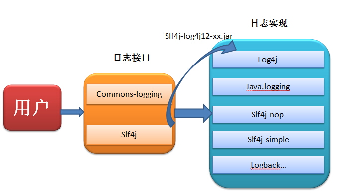
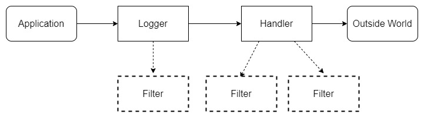
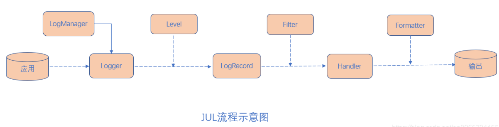
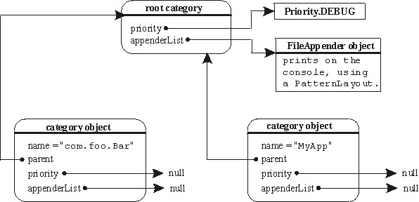
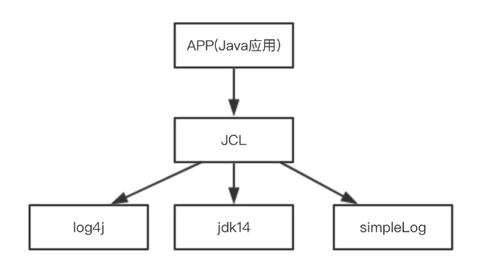
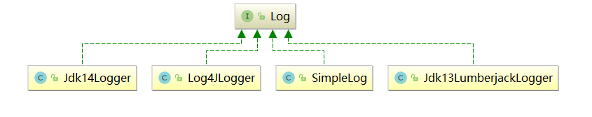
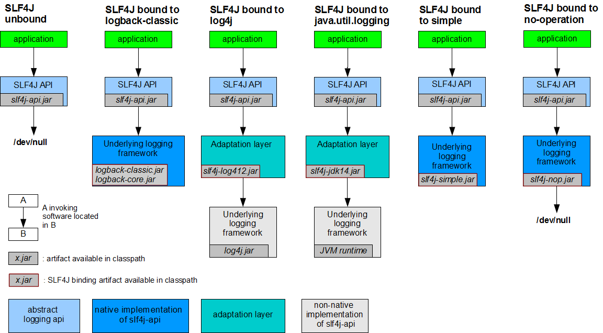
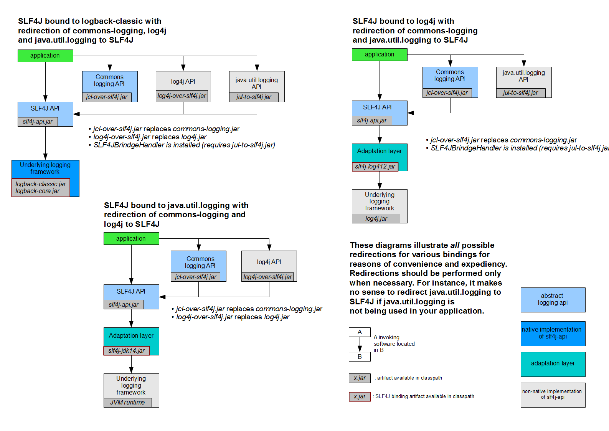

# Java日志工具类库

## 1. 日志的概念

### 1.1. 日志文件

**日志文件是用于记录系统操作事件的文件集合**，可分为**事件日志**和**消息日志**。具有处理历史数据、诊断问题的追踪以及理解系统的活动等重要作用。

在计算机中，日志文件是记录在操作系统或其他软件运行中发生的事件或在通信软件的不同用户之间的消息的文件。记录是保持日志的行为。在最简单的情况下，消息被写入单个日志文件。

许多操作系统，软件框架和程序包括日志系统。广泛使用的日志记录标准是在因特网工程任务组（IETF）RFC5424 中定义的 syslog。 syslog 标准使专用的标准化子系统能够生成，过滤，记录和分析日志消息。

#### 1.1.1. 调试日志

软件开发中，经常需要去调试程序，做一些信息，状态的输出便于开发者查询程序的运行状况。为了让开发者能够更加灵活和方便的控制这些调试的信息，所以需要专业的日志技术。java 中寻找 bug 会需要重现。调试也就是 debug 可以在程序运行中暂停程序运行，可以查看程序在运行中的情况。日志主要是为了更方便的去重现问题。

#### 1.1.2. 系统日志

系统日志是记录系统中硬件、软件和系统问题的信息，同时还可以监视系统中发生的事件。用户可以通过它来检查错误发生的原因，或者寻找受到攻击时攻击者留下的痕迹。系统日志包括系统日志、应用程序日志和安全日志。

系统日志策略可以在故障刚刚发生时就向维护人员发送警告信息，**系统日志的价值**就是帮助开发者与维护人员在最短的时间内发现问题。

系统日志是一种非常关键的组件，因为系统日志可以让开发者充分了解自己的环境。这种系统日志信息对于决定故障的根本原因或者缩小系统攻击范围来说是非常关键的，因为系统日志可以让你了解故障或者袭击发生之前的所有事件。为虚拟化环境制定一套良好的系统日志策略也是至关重要的，因为系统日志需要和许多不同的外部组件进行关联。良好的系统日志可以防止你从错误的角度分析问题，避免浪费宝贵的排错时间。另外一种原因是借助于系统日志，管理员很有可能会发现一些之前从未意识到的问题，在几乎所有刚刚部署系统日志的环境当中。

### 1.2. 日志的作用

日志用于记录程序日常运行的信息，主要作用如下：

- 编程期调试代码
- 运营期记录信息
- 记录日常运营重要信息（峰值流量、平均响应时长...）
- 记录应用报错信息（错误堆栈）
- 记录运维过程数据（扩容、宕机、报警...）

## 2. Java 日志框架

### 2.1. 为什么要用日志框架

因为软件系统发展到今天已经很复杂了，特别是服务器端软件，涉及到的知识，内容，问题太多。如：

1. 控制日志输出的内容和格式
2. 控制日志输出的位置
3. 日志优化：异步日志，日志文件的归档和压缩
4. 日志系统的维护
5. 面向接口开发 - 日志的门面

在某些方面使用第三方成熟的框架，就相当于让别人帮忙完成一些基础工作，开发者只需要集中精力完成系统的业务逻辑设计。而且框架一般是成熟，稳健的，它可以处理系统很多细节问题，比如，事务处理，安全性，数据流控制等问题。还有框架一般都经过很多人使用，所以结构很好，所以扩展性也很好，而且它是不断升级的。

### 2.2. 主流日志框架简介

#### 2.2.1. 日志门面

当项目系统变的更加复杂的时候，日志就容易发生混乱。随着系统开发的进行，可能会更新不同的日志框架，造成当前系统中存在不同的日志依赖，难以统一的管理和控制。就算强制要求开者人员对所有的模块使用相同的日志框架，系统中也难以避免使用其他类似 spring，mybatis 等其他的第三方框架，它们依赖于自己项目规定不同的日志框架，而且第三方框架自身的日志系统就有着不一致性，依然会出来日志体系的混乱。

因此可以借鉴 JDBC 的思想，为日志系统也提供一套门面，那么开发者就可以面向这些接口规范来开发，避免了直接依赖具体的日志框架。这样项目系统在日志中，就存在了日志的门面和日志的实现。

**日志门面**就是对不同日志框架提供的一个 API 封装，可以在部署的时候不修改任何配置即可接入一种日志实现方案。常用的日志门面有如下：

- JCL 全称：Jakarta Commons Logging，又称 common-logging 
- slf4j 全称：Simple Logging Facade for Java

JCL 与 slf4j 区别：

- slf4j 库类似于 Apache Common-Logging。但是，它在编译时静态绑定真正的日志库。这点似乎很麻烦，其实也不过是导入桥接 jar 包而已。
- slf4j 一大亮点是提供了更方便的日志记录方式：不需要使用`logger.isDebugEnabled()`来解决日志因为字符拼接产生的性能问题。slf4j 的方式是使用`{}`作为字符串替换符，形式如下

```java
logger.debug("id: {}, name: {} ", id, name);
```

#### 2.2.2. 日志实现

- JUL 全称：java util logging
- logback
- log4j
- log4j2

#### 2.2.3. 日志门面和日志实现的关系



日志框架出现的历史顺序：

log4j --> JUL --> JCL --> slf4j --> logback --> log4j2

### 2.3. 各个日志框架比较

按照官方的说法，Log4j2 大大优于 Log4j 和 Logback。Log4j2的优势如下：

- Log4j2 旨在用作审计日志记录框架。Log4j 1.x 和 Logback 都会在重新配置时丢失事件。Log4j 2 不会。在 Logback 中，Appender 中的异常永远不会对应用程序可见。在 Log4j 中，可以将 Appender 配置为允许异常渗透到应用程序。
- Log4j2 在多线程场景中，异步 Loggers 的吞吐量比 Log4j 1.x 和 Logback 高 10 倍，延迟低几个数量级。
- Log4j2 对于独立应用程序是无垃圾的，对于稳定状态日志记录期间的 Web 应用程序来说是低垃圾。这减少了垃圾收集器的压力，并且可以提供更好的响应时间性能。
- Log4j2 使用插件系统，通过添加新的 Appender、Filter、Layout、Lookup 和 Pattern Converter，可以非常轻松地扩展框架，而无需对 Log4j 进行任何更改。
- 由于插件系统配置更简单。配置中的条目不需要指定类名。
- 支持自定义日志等级。
- 支持 lambda 表达式。
- 支持消息对象。
- Log4j 和 Logback 的 Layout 返回的是字符串，而 Log4j2 返回的是二进制数组，这使得它能被各种 Appender 使用。
- Syslog Appender 支持 TCP 和 UDP 并且支持 BSD 系统日志。
- Log4j2 利用 Java5 并发特性，尽量小粒度的使用锁，减少锁的开销

### 2.4. 小结

**综上所述，使用 slf4j + Logback 可谓是目前最理想的日志解决方案了**

## 3. JUL（Java Util Logging）

JUL 全称 Java util Logging，从 JDK1.4 开始提供的 Java 原生的日志功能框架（在 `java.util.logging` 包），使用时不需要另外引用第三方类库，相对其他日志框架使用方便，学习简单，能够在小型应用中灵活使用。它能满足基本的日志需要，但是功能没有其他日志框架强大，使用范围也没有其他的广泛。

### 3.1. 架构介绍



- Loggers：被称为记录器，应用程序通过获取 `Logger` 对象，调用其 API 来来发布日志信息。`Logger` 通常时应用程序访问日志系统的入口程序。
- Appenders：也被称为 Handlers，每个Logger 都会关联一组 Handlers，Logger 会将日志交给关联 Handlers 处理，由 Handlers 负责将日志做记录。Handlers 在此是一个抽象，其具体的实现决定了日志记录的位置可以是控制台、文件、网络上的其他日志服务或操作系统日志等。
- Layouts：也被称为 Formatters，它负责对日志事件中的数据进行转换和格式化。Layouts 决定了数据在一条日志记录中的最终形式。
- Level：每条日志消息都有一个关联的日志级别。该级别粗略指导了日志消息的重要性和紧迫，可以将 Level 和 Loggers，Appenders 做关联以便于过滤消息。
- Filters：过滤器，根据需要定制哪些信息会被记录，哪些信息会被放过。

总结：

用户使用 Logger 来进行日志记录，Logger 持有若干个 Handler，日志的输出操作是由 Handler 完成的。在 Handler 在输出日志前，会经过 Filter 的过滤，判断哪些日志级别过滤放行哪些拦截，Handler 会将日志内容输出到指定位置（日志文件、控制台等）。Handler 在输出日志时会使用 Layout，将输出内容进行排版。

### 3.2. 基础使用案例

准备测试环境，引入依赖

```xml
<dependencies>
    <dependency>
        <groupId>junit</groupId>
        <artifactId>junit</artifactId>
        <version>4.12</version>
    </dependency>
</dependencies>

<build>
    <plugins>
        <!-- 设置编译版本为1.8 -->
        <plugin>
            <groupId>org.apache.maven.plugins</groupId>
            <artifactId>maven-compiler-plugin</artifactId>
            <version>3.1</version>
            <configuration>
                <source>1.8</source>
                <target>1.8</target>
                <encoding>UTF-8</encoding>
            </configuration>
        </plugin>
    </plugins>
</build>
```

基础使用步骤：

1. 创建日志记录器对象 `Logger`
2. 调用不同的日志记录方法即可。输出的日志内容可以使用占位符的方式灵活替换相应的变量值

```java
@Test
public void testBasic() {
    // 1. 创建日志记录器对象，一般使用当前类的全路径名称
    Logger logger = Logger.getLogger(JULTest.class.getName());
    // 2. 使用不同日志级别的方法，输出日志记录
    logger.info("hello jul");
    /*
     * 使用通用方法进行日志记录
     *  public void log(Level level, String msg)
     *      level 参数：日志级别
     *      msg 参数：日志内容
     */
    logger.log(Level.INFO, "info msg");

    // 通过占位符方式，输出变量值
    String name = "MooNkirA";
    int age = 13;
    logger.log(Level.INFO, "用户信息：{0},{1}", new Object[]{name, age});
}
```

### 3.3. 日志的级别

在 `java.util.logging.Level` 中定义了 JUL 的日志级别：

- SEVERE（最高值）
- WARNING
- INFO （默认级别）
- CONFIG
- FINE
- FINER
- FINEST（最低值）

另外还有两个特殊的日志级别：

- OFF：可用来关闭日志记录
- ALL：启用所有消息的日志记录

#### 3.3.1. 默认日志级别

默认的日志级别是 `INFO`，若不作任何设置，则只能输出到此级别，往后更低级别的日志是无法输出

```java
@Test
public void testDefaultLevel() {
    // 1. 创建日志记录器对象，一般使用当前类的全路径名称
    Logger logger = Logger.getLogger(JULTest.class.getName());
    // 2. 使用不同日志级别的方法，输出日志记录
    logger.severe("severe");
    logger.warning("warning");
    logger.info("info"); // 默认日志输出级别，默认无法输出后面更低级别的日志
    logger.config("config");
    logger.fine("fine");
    logger.finer("finer");
    logger.finest("finest");
}
```

输出结果：

```
六月 17, 2022 7:00:04 下午 com.moon.log.JULTest testDefaultLevel
严重: severe
六月 17, 2022 7:00:04 下午 com.moon.log.JULTest testDefaultLevel
警告: warning
六月 17, 2022 7:00:04 下午 com.moon.log.JULTest testDefaultLevel
信息: info
```

#### 3.3.2. 自定义日志级别配置

自定义日志级别配置步骤：

1. 创建日志记录器对象 `Logger`
2. 通过 `setUseParentHandlers` 方法关闭系统默认配置
3. 创建具体输出的对象 Handler 与日志输出格式转换对象 Formatter
4. 设置 Handler 与 Formatter 关联，然后将 Handler 加到 日志记录器中
5. 可以分别配置全局与具体某个 Handler 的日志级别，最终以所配置的最高级别为准
6. 输出日志

```java
@Test
public void testConfigLevel() {
    // 1. 创建日志记录器对象，一般使用当前类的全路径名称
    Logger logger = Logger.getLogger(JULTest.class.getName());

    // 2. 关闭系统默认配置
    logger.setUseParentHandlers(false);

    // 3. 自定义配置日志级别
    // 3.1 创建控制台输出对象 ConsoleHandler
    ConsoleHandler consoleHandler = new ConsoleHandler();
    // 3.2 创建简单格式转换对象 SimpleFormatter
    SimpleFormatter simpleFormatter = new SimpleFormatter();
    // 3.4 Handler 关联 Formatter
    consoleHandler.setFormatter(simpleFormatter);
    // 3.5 日志记录器关联 Handler
    logger.addHandler(consoleHandler);

    // 3.6 配置日志具体级别
    logger.setLevel(Level.ALL); // 设置全局日志级别
    consoleHandler.setLevel(Level.FINE); // 设置具体的 Handler 级别
    // 注意，最终的日志级别，以设置中最高的级别为准

    // 4. 使用不同日志级别的方法，输出日志记录
    logger.severe("severe");
    logger.warning("warning");
    logger.info("info");
    logger.config("config");
    logger.fine("fine");
    logger.finer("finer");
    logger.finest("finest");
}
```

输出结果：

```
六月 17, 2022 7:09:31 下午 com.moon.log.JULTest testConfigLevel
严重: severe
六月 17, 2022 7:09:31 下午 com.moon.log.JULTest testConfigLevel
警告: warning
六月 17, 2022 7:09:31 下午 com.moon.log.JULTest testConfigLevel
信息: info
六月 17, 2022 7:09:31 下午 com.moon.log.JULTest testConfigLevel
配置: config
六月 17, 2022 7:09:31 下午 com.moon.log.JULTest testConfigLevel
详细: fine
```

### 3.4. 配置日志输出到文件

通过配置 `FileHandler` 来实现输出日志到文件，步骤与配置自定义日志级别一样

```java
@Test
public void testConfigLogFile() throws IOException {
    // 1. 创建日志记录器对象，一般使用当前类的全路径名称
    Logger logger = Logger.getLogger(JULTest.class.getName());

    // 2. 指定日志输出到文件
    // 2.1 创建日志文件输出对象 FileHandler
    FileHandler fileHandler = new FileHandler("E:/logs/jul.log");
    // 2.2 创建简单格式转换对象 SimpleFormatter
    SimpleFormatter simpleFormatter = new SimpleFormatter();
    // 2.4 Handler 关联 Formatter
    fileHandler.setFormatter(simpleFormatter);
    // 2.5 日志记录器关联 Handler
    logger.addHandler(fileHandler);

    // 3. 使用不同日志级别的方法，输出日志记录
    logger.severe("severe");
    logger.warning("warning");
    logger.info("info");
    logger.config("config");
    logger.fine("fine");
    logger.finer("finer");
    logger.finest("finest");
}
```

> <font color=violet>**注：可以同时配置多个 Handler**</font>

### 3.5. Logger 之间的父子关系

JUL 中 Logger 之间存在父子关系，子 Logger 可以继承父级 Logger 的配置。

Logger 父子关系通过路径来关联。这种父子关系通过树状结构存储，JUL 在初始化时会创建一个顶层 `RootLogger` 作为所有 Logger 父级 Logger，存储上作为树状结构的根节点。

```java
@Test
public void testLogParent() {
    // 1. 创建两个不同层级的日志记录器
    Logger logger1 = Logger.getLogger("com.moon.log");
    Logger logger2 = Logger.getLogger("com.moon");

    // 测试 logger1 的父级 是否为 logger2
    System.out.println(logger1.getParent() == logger2);
    // 所有日志记录器的顶级父元素 LogManager$RootLogger，name ""
    System.out.println("logger2 Parent: " + logger2.getParent() + " , name: " + logger2.getParent().getName());

    // 2. 关闭父Logger 默认配置
    logger2.setUseParentHandlers(false);

    // 3. 配置父 Logger 日志级别
    ConsoleHandler consoleHandler = new ConsoleHandler();
    SimpleFormatter simpleFormatter = new SimpleFormatter();
    consoleHandler.setFormatter(simpleFormatter);
    logger2.addHandler(consoleHandler);

    // 3.6 配置日志具体级别
    logger2.setLevel(Level.ALL); // 设置全局日志级别
    consoleHandler.setLevel(Level.FINE); // 设置具体的 Handler 级别
    // 注意，最终的日志级别，以设置中最高的级别为准

    // 4. 使用不同日志级别的方法，输出日志记录
    logger1.severe("severe");
    logger1.warning("warning");
    logger1.info("info");
    logger1.config("config");
    logger1.fine("fine");
    logger1.finer("finer");
    logger1.finest("finest");
}
```

输出结果：

```true
logger2 Parent: java.util.logging.LogManager$RootLogger@573fd745 , name: 
六月 17, 2022 7:40:56 下午 com.moon.log.JULTest testLogParent
严重: severe
六月 17, 2022 7:40:56 下午 com.moon.log.JULTest testLogParent
警告: warning
六月 17, 2022 7:40:56 下午 com.moon.log.JULTest testLogParent
信息: info
六月 17, 2022 7:40:56 下午 com.moon.log.JULTest testLogParent
配置: config
六月 17, 2022 7:40:56 下午 com.moon.log.JULTest testLogParent
详细: fine
```

### 3.6. 日志的配置文件

通过查看源码，默认配置文件路径是：`$JAVAHOME\jre\lib\logging.properties`

参考默认的配置文件，复制到项目的 resources 目录下进行修改，创建 LogManager 并读取自定义的配置文件。

```java
@Test
public void testLogProperties() throws IOException {
    // 读取配置文件，通过类加载器
    InputStream ins = JULTest.class.getClassLoader().getResourceAsStream("logging.properties");
    // 创建 LogManager
    LogManager logManager = LogManager.getLogManager();
    // 通过 LogManager 加载配置文件
    logManager.readConfiguration(ins);

    // 1. 创建日志记录器对象
    Logger logger = Logger.getLogger("com.moon.log");

    // 2. 使用不同日志级别的方法，输出日志记录
    logger.severe("severe");
    logger.warning("warning");
    logger.info("info");
    logger.config("config");
    logger.fine("fine");
    logger.finer("finer");
    logger.finest("finest");
}
```

#### 3.6.1. 配置文件示例

```properties
# 配置 RootLogger 顶级父元素指定的默认处理器（获取时设置），配置多个处理器则使用 “,” 逗号分隔
handlers=java.util.logging.ConsoleHandler,java.util.logging.FileHandler
# 配置 RootLogger 顶级父元素默认的日志级别（注意需要大写）
.level=ALL

# 配置自定义 Logger 使用
com.moon.log.handlers=java.util.logging.ConsoleHandler
com.moon.log.level=CONFIG
# 关闭默认配置
com.moon.log.useParentHanlders=false

# 配置控制台处理器
# 指定日志级别
java.util.logging.ConsoleHandler.level=ALL
# 指定日志消息格式化对象
java.util.logging.ConsoleHandler.formatter=java.util.logging.SimpleFormatter
# 指定处理器字符集
java.util.logging.ConsoleHandler.encoding=UTF-8
# 指定日志消息格式
java.util.logging.SimpleFormatter.format=%4$s: %5$s [%1$tc]%n

# 配置日志文件处理器
# 指定日志文件输出路径
java.util.logging.FileHandler.pattern=E:/logs/java%u.log
# 指定日志文件内容限制大小（50000字节）
java.util.logging.FileHandler.limit=50000
# 指定日志文件数量
java.util.logging.FileHandler.count=1
# 指定日志消息格式化对象
java.util.logging.FileHandler.formatter=java.util.logging.SimpleFormatter
# 指定以追加方式添加日志内容，默认值是 false，覆盖之前内容
java.util.logging.FileHandler.append=true
```

### 3.7. 日志原理解析

1. 初始化 LogManager
    1. LogManager 会加载 logging.properties 配置文件
    2. 添加 Logger 到 LogManager
2. 从单例 LogManager 获取 Logger
3. 设置级别 Level，并指定日志记录 LogRecord
4. Filter 提供了日志级别之外更细粒度的控制
5. Handler 是用来处理日志输出位置
6. Formatter 是用来格式化 LogRecord 的



## 4. Log4j

> 官网：https://logging.apache.org/log4j/1.2/

### 4.1. 简述

Log4j 是 Apache 下的一款开源的日志框架，是 Java 领域资格最老，应用最广的日志工具。从诞生之日到现在一直广受业界欢迎。但在2015年已经结束生命周期，目前已经不建议使用

Log4j 是高度可配置的，并可通过在运行时的外部文件配置。它根据记录的优先级别，并提供机制，控制日志信息输出不同的位置，如：数据库，文件，控制台，UNIX 系统日志等。也可以控制每一条日志的输出格式，通过定义日志的输出级别，可以更灵活的控制日志的输出过程。方便项目的调试。

### 4.2. Log4j 的日志级别

每个 Logger 都被了一个日志级别（log level），用来控制日志信息的输出。日志级别从高到低分为：

- fatal 指出每个严重的错误事件将会导致应用程序的退出
- error 指出虽然发生错误事件，但仍然不影响系统的继续运行
- warn 表明会出现潜在的错误情形
- info 一般和在粗粒度级别上，强调应用程序的运行全程
- debug 一般用于细粒度级别上，对调试应用程序非常有帮助
- trace 是程序追踪，可以用于输出程序运行中的变量，显示执行的流程

两个特殊的级别：

- OFF：可用来关闭日志记录
- ALL：启用所有消息的日志记录

> **注：一般只使用4个级别，优先级从高到低为 ERROR > WARN > INFO > DEBUG**

### 4.3. 基础使用步骤

1. 创建 maven 工程，添加依赖，导入 log4j 的 jar 包

```xml
<dependencies>
    <dependency>
        <groupId>junit</groupId>
        <artifactId>junit</artifactId>
        <version>4.12</version>
    </dependency>

    <!-- Log4j 1.x 依赖 -->
    <dependency>
        <groupId>log4j</groupId>
        <artifactId>log4j</artifactId>
        <version>1.2.17</version>
    </dependency>
</dependencies>

<build>
    <plugins>
        <!-- 设置编译版本为1.8 -->
        <plugin>
            <groupId>org.apache.maven.plugins</groupId>
            <artifactId>maven-compiler-plugin</artifactId>
            <version>3.1</version>
            <configuration>
                <source>1.8</source>
                <target>1.8</target>
                <encoding>UTF-8</encoding>
            </configuration>
        </plugin>
    </plugins>
</build>
```
 
2. 编写 Log4j 基础使用示例代码（注：这里暂时不使用配置文件）

```java
@Test
public void testBasic() {
    // 若无 Log4j 的配置文件，可以使用编程方式来初始化配置信息
    BasicConfigurator.configure();

    // 获取日志记录器对象
    Logger logger = Logger.getLogger(Log4jTest.class);

    // 输出不同日志级别的日志
    logger.fatal("fatal"); // 严重错误，一般会造成系统崩溃并终止运行
    logger.error("error"); // 错误信息，不会影响系统运行
    logger.warn("warn");   // 警告信息，可能会发生问题
    logger.info("info");   // 运行信息，数据连接、网络连接、IO 操作等等
    logger.debug("debug"); // 调试信息，一般在开发中使用，记录程序变量参数传递信息等等
    logger.trace("trace"); // 追踪信息，记录程序所有的流程信息
}
```

输出结果：

```
0 [main] FATAL com.moon.log.Log4jTest  - fatal
1 [main] ERROR com.moon.log.Log4jTest  - error
1 [main] WARN com.moon.log.Log4jTest  - warn
1 [main] INFO com.moon.log.Log4jTest  - info
1 [main] DEBUG com.moon.log.Log4jTest  - debug
```

3. 在项目的 resources 目录下创建 log4j.properties 或者 log4j.xml 的配置文件（注：本基础使用示例使用 properties 格式的配置文件），一些基础配置如下：

```properties
# 指定 RootLogger 顶级父元素默认配置信息
# 指定日志级别为 trace，使用的 apeender 为 console
log4j.rootLogger = trace,console

# 指定控制台日志输出的 appender
log4j.appender.console = org.apache.log4j.ConsoleAppender
# 指定消息格式 layout
log4j.appender.console.layout = org.apache.log4j.SimpleLayout
```

删除上面示例中的 `BasicConfigurator.configure();`，运行测试用例观察输出结果如下：

```
FATAL - fatal
ERROR - error
WARN - warn
INFO - info
DEBUG - debug
TRACE - trace
```

> *注：一般情况下，在开发环境下日志级别会设置成 debug，生产环境设置成 info 或 error*

### 4.4. Log4j 组件

Log4J 主要由 Loggers (日志记录器)、Appenders（输出端）和 Layout（日志格式化器）组成。

- Loggers 负责捕获记录信息，控制日志的输出级别与日志是否输出
- Appenders 指定日志的输出方式（输出到控制台、文件等）
- Layout 控制日志信息的输出格式化

#### 4.4.1. Loggers

日志记录器，负责收集处理日志记录，实例的命名就是类的 full quailied name（类的全限定名），Logger 的名字大小写敏感，其命名有继承机制：例如：name 为 `org.apache.commons` 的 logger 会继承 name 为 `org.apache` 的 logger。

Log4J 中有一个特殊的 logger 叫做“root”，他是所有logger的根，也就意味着其他所有的logger都会直接或者间接地继承自root。root logger可以用Logger.getRootLogger()方法获取。

但是，自log4j 1.2版以来， Logger 类已经取代了 Category 类。对于熟悉早期版本的log4j的人来说，Logger 类可以被视为 Category 类的别名。



#### 4.4.2. Appenders

Appender 用来指定日志输出到哪个地方，可以同时指定日志的输出目的地。Log4j 常用的输出目的地有以下几种：

|        输出端类型         |                                                     作用                                                     |
| :----------------------: | ------------------------------------------------------------------------------------------------------------ |
|     ConsoleAppender      | 将日志输出到控制台                                                                                            |
|       FileAppender       | 将日志输出到文件中                                                                                            |
| DailyRollingFileAppender | 将日志输出到一个日志文件，并且每天输出到一个新的文件                                                            |
|   RollingFileAppender    | 将日志信息输出到一个日志文件，并且指定文件的尺寸，当文件大小达到指定尺寸时，会自动把文件改名，同时产生一个新的文件 |
|       JDBCAppender       | 把日志信息保存到数据库中                                                                                      |

#### 4.4.3. Layouts

布局器 Layouts 用于控制日志输出内容的格式，可以使用各种需要的格式输出日志。Log4j 常用的 Layout 如下：

|  格式化器类型  |                                         作用                                         |
| :-----------: | ------------------------------------------------------------------------------------ |
|  HTMLLayout   | 格式化日志输出为HTML表格形式                                                          |
| SimpleLayout  | 简单的日志输出格式化，打印的日志格式为（info - message）                               |
| PatternLayout | 最强大的格式化器，可以根据自定义格式输出日志。如果没有指定转换格式，就是用默认的转换格式 |

### 4.5. 自定义 Layout 的格式语法示例

在 log4j.properties 配置文件中，可以定义了日志输出级别与输出端，在输出端中分别配置日志的输出格式。

log4j 采用类似 C 语言的 `printf` 函数的打印格式格式化日志信息，具体的占位符及其含义如下：

- `%m` 输出代码中指定的日志信息
- `%p` 输出优先级，及 DEBUG、INFO 等
- `%n` 换行符（Windows平台的换行符为 "`\n`"，Unix 平台为 "`\n`"）
- `%r` 输出自应用启动到输出该 log 信息耗费的毫秒数
- `%c` 输出打印语句所属的类的全名
- `%t` 输出产生该日志的线程全名
- `%d` 输出服务器当前时间，默认为 ISO8601，也可以指定格式，如：`%d{yyyy年MM月dd日HH:mm:ss}`
- `%l` 输出日志时间发生的位置，包括类名、线程、及在代码中的行数。如：`Test.main(Test.java:10)`
- `%F` 输出日志消息产生时所在的文件名称
- `%L` 输出代码中的行号
- `%%` 输出一个 "`%`" 字符

可以在 `%` 与字符之间加上修饰符来控制最小宽度、最大宽度和文本的对其方式。如：

- `%5c` 输出 category 名称，最小宽度是5，category 名称长度小于5，默认的情况下右对齐
- `%-5c` 输出 category 名称，最小宽度是5，category 名称长度小于5，"`-`"号指定左对齐，会有空格
- `%.5c` 输出 category 名称，最大宽度是5，category 名称长度大于5，就会将左边多出的字符截掉，名称长度小于5则不会有空格
- `%20.30c` 输出 category 名称长度小于20补空格，并且右对齐，大于30字符，就从左边交远销出的字符截掉

### 4.6. log4j 完整配置参考示例

log4j 的配置文件一般有 xml 格式或 properties 格式。

#### 4.6.1. properties 格式配置

可以配置日志输出到控制台，文件，数据库等。而文件输出可以配置 rollingFile 与 dailyFile 不同的拆分方式

```properties
# 指定 RootLogger 顶级父元素默认配置信息
# 指定日志级别为 trace，使用的 apeender 为 console 与 rollingFile
log4j.rootLogger=trace,console,rollingFile

# 自定义 logger 对象设置
log4j.logger.com.moon.log=info,console
log4j.logger.org.apache=error

# 指定控制台日志输出的 appender
log4j.appender.console=org.apache.log4j.ConsoleAppender
# 指定消息格式 layout
log4j.appender.console.layout=org.apache.log4j.PatternLayout
# 指定消息格式的内容
log4j.appender.console.layout.conversionPattern=[%-10p]%r  %l %d{yyyy-MM-dd HH:mm:ss.SSS} %m%n

# 日志文件输出的 appender 对象
log4j.appender.file=org.apache.log4j.FileAppender
# 指定消息格式 layout
log4j.appender.file.layout=org.apache.log4j.PatternLayout
# 指定消息格式的内容
log4j.appender.file.layout.conversionPattern=[%-10p]%r  %l %d{yyyy-MM-dd HH:mm:ss.SSS} %m%n
# 指定日志文件保存路径
log4j.appender.file.file=/logs/log4j.log
# 指定日志文件的字符集
log4j.appender.file.encoding=UTF-8

# 按照文件大小拆分的 appender 对象
# 日志文件输出的 appender 对象
log4j.appender.rollingFile=org.apache.log4j.RollingFileAppender
# 指定消息格式 layout
log4j.appender.rollingFile.layout=org.apache.log4j.PatternLayout
# 指定消息格式的内容
log4j.appender.rollingFile.layout.conversionPattern=[%-10p]%r  %l %d{yyyy-MM-dd HH:mm:ss.SSS} %m%n
# 指定日志文件保存路径
log4j.appender.rollingFile.file=E:/logs/log4j.log
# 指定日志文件的字符集
log4j.appender.rollingFile.encoding=UTF-8
# 指定日志文件内容的大小
log4j.appender.rollingFile.maxFileSize=1MB 
# 指定日志文件的数量
log4j.appender.rollingFile.maxBackupIndex=10

# 按照时间规则拆分的 appender 对象
log4j.appender.dailyFile=org.apache.log4j.DailyRollingFileAppender
# 指定消息格式 layout
log4j.appender.dailyFile.layout=org.apache.log4j.PatternLayout
# 指定消息格式的内容
log4j.appender.dailyFile.layout.conversionPattern=[%-10p]%r  %l %d{yyyy-MM-dd HH:mm:ss.SSS} %m%n
# 指定日志文件保存路径
log4j.appender.dailyFile.file=E:/logs/log4j.log
# 指定日志文件的字符集
log4j.appender.dailyFile.encoding=UTF-8
# 指定日期拆分规则
log4j.appender.dailyFile.datePattern='.'yyyy-MM-dd-HH-mm-ss

# 指定日志输出到数据库
log4j.appender.logDB=org.apache.log4j.jdbc.JDBCAppender
log4j.appender.logDB.layout=org.apache.log4j.PatternLayout
log4j.appender.logDB.Driver=com.mysql.jdbc.Driver
log4j.appender.logDB.URL=jdbc:mysql://localhost:3306/test
log4j.appender.logDB.User=root
log4j.appender.logDB.Password=123456
log4j.appender.logDB.Sql=INSERT INTO log(project_name,create_date,level,category,file_name,thread_name,line,all_category,message) values('itcast','%d{yyyy-MM-dd HH:mm:ss}','%p','%c','%F','%t','%L','%l','%m')
```

若输出到数据库，需要在数据库中创建日志表

```sql
CREATE TABLE `log` (
	`log_id` INT ( 11 ) NOT NULL AUTO_INCREMENT,
	`project_name` VARCHAR ( 255 ) DEFAULT NULL COMMENT '项目名',
	`create_date` VARCHAR ( 255 ) DEFAULT NULL COMMENT '创建时间',
	`level` VARCHAR ( 255 ) DEFAULT NULL COMMENT '优先级',
	`category` VARCHAR ( 255 ) DEFAULT NULL COMMENT '所在类的全名',
	`file_name` VARCHAR ( 255 ) DEFAULT NULL COMMENT '输出日志消息产生时所在的文件名称 ',
	`thread_name` VARCHAR ( 255 ) DEFAULT NULL COMMENT '日志事件的线程名',
	`line` VARCHAR ( 255 ) DEFAULT NULL COMMENT '号行',
	`all_category` VARCHAR ( 255 ) DEFAULT NULL COMMENT '日志事件的发生位置',
	`message` VARCHAR ( 4000 ) DEFAULT NULL COMMENT '输出代码中指定的消息',
PRIMARY KEY ( `log_id` ) 
);
```

#### 4.6.2. xml 格式配置

xml 格式的配置，可以与后面的 logback.xml 做对比

```xml
<?xml version="1.0" encoding="UTF-8"?>
<!DOCTYPE log4j:configuration SYSTEM "log4j.dtd">
<log4j:configuration xmlns:log4j='http://jakarta.apache.org/log4j/'>
    <appender name="STDOUT" class="org.apache.log4j.ConsoleAppender">
        <layout class="org.apache.log4j.PatternLayout">
            <param name="ConversionPattern"
                   value="%d{yyyy-MM-dd HH:mm:ss,SSS\} [%-5p] [%t] %c{36\}.%M - %m%n"/>
        </layout>
        <!--过滤器设置输出的级别-->
        <filter class="org.apache.log4j.varia.LevelRangeFilter">
            <param name="levelMin" value="debug"/>
            <param name="levelMax" value="fatal"/>
            <param name="AcceptOnMatch" value="true"/>
        </filter>
    </appender>

    <appender name="ALL" class="org.apache.log4j.DailyRollingFileAppender">
        <param name="File" value="${user.dir}/logs/spring-common/jcl/all"/>
        <param name="Append" value="true"/>
        <!-- 每天重新生成日志文件 -->
        <param name="DatePattern" value="'-'yyyy-MM-dd'.log'"/>
        <!-- 每小时重新生成日志文件 -->
        <!--<param name="DatePattern" value="'-'yyyy-MM-dd-HH'.log'"/>-->
        <layout class="org.apache.log4j.PatternLayout">
            <param name="ConversionPattern"
                   value="%d{yyyy-MM-dd HH:mm:ss,SSS\} [%-5p] [%t] %c{36\}.%M - %m%n"/>
        </layout>
    </appender>
    <!-- 指定logger的设置，additivity指示是否遵循缺省的继承机制-->
    <logger name="org.zp.notes.spring" additivity="false">
        <level value="error"/>
        <appender-ref ref="STDOUT"/>
        <appender-ref ref="ALL"/>
    </logger>
    <!-- 根logger的设置-->
    <root>
        <level value="warn"/>
        <appender-ref ref="STDOUT"/>
    </root>
</log4j:configuration>
```

### 4.7. 自定义 Logger

修改配置文件，增加自定义的 logger 配置

```properties
# RootLogger配置
log4j.rootLogger=trace,console

# 自定义 logger 对象设置
log4j.logger.com.moon.log=info,console
log4j.logger.org.apache=error
```

测试程序

```java
@Test
public void testCustomLogger() {
    // 自定义 com.moon.log 的 logger
    Logger logger = Logger.getLogger(Log4jTest.class);

    // 输出不同日志级别的日志
    logger.fatal("fatal");
    logger.error("error");
    logger.warn("warn");
    logger.info("info");
    logger.debug("debug");
    logger.trace("trace");

    // 自定义 org.apache 的 logger
    Logger logger2 = Logger.getLogger(Logger.class);
    logger2.fatal("fatal logger2");
    logger2.error("error logger2");
    logger2.warn("warn logger2");
    logger2.info("info logger2");
    logger2.debug("debug logger2");
    logger2.trace("trace logger2");
}
```

输出结果

```
[FATAL     ]0  com.moon.log.Log4jTest.testCustomLogger(Log4jTest.java:41) 2022-06-18 12:00:57.785 fatal
[ERROR     ]3  com.moon.log.Log4jTest.testCustomLogger(Log4jTest.java:42) 2022-06-18 12:00:57.788 error
[WARN      ]3  com.moon.log.Log4jTest.testCustomLogger(Log4jTest.java:43) 2022-06-18 12:00:57.788 warn
[INFO      ]3  com.moon.log.Log4jTest.testCustomLogger(Log4jTest.java:44) 2022-06-18 12:00:57.788 info
[FATAL     ]3  com.moon.log.Log4jTest.testCustomLogger(Log4jTest.java:50) 2022-06-18 12:00:57.788 fatal logger2
[ERROR     ]4  com.moon.log.Log4jTest.testCustomLogger(Log4jTest.java:51) 2022-06-18 12:00:57.789 error logger2
```

## 5. JCL - 日志门面

> 官网：https://commons.apache.org/proper/commons-logging/

### 5.1. 简述

JCL 全称 Jakarta Commons Logging，又称 common-logging 是 apache 的一个开源项目。

JCL 的功能是提供通用日志功能的 API 接口，本身并不提供日志的具体实现（其实内部有一个 SimpleLog 的简单实现，但是功能很弱，所以一般不会单独使用它，直接忽略），而是在运行时动态的绑定日志实现组件来工作（如 log4j、java.util.logging）

JCL 有两个基本的抽象类：Log（基本记录器）和 LogFactory（负责创建Log实例）



### 5.2. JCL 基础使用

1. 创建 maven 工程，添加依赖，导入 commons-logging 的 jar 包

```xml
<!-- JCL 日志门面 -->
<dependency>
    <groupId>commons-logging</groupId>
    <artifactId>commons-logging</artifactId>
    <version>1.2</version>
</dependency>
```

2. 编写基础使用示例代码，因为目前没有引入具体的日志实现，所以是使用了 commons-logging 默认的 SimpleLog 的简单实现

```java
@Test
public void testBasic() {
    // 获取 log日志记录器对象
    Log log = LogFactory.getLog(JCLTest.class);
    // 日志记录输出
    log.info("hello jcl");
}
```

输出结果：

```
六月 18, 2022 12:44:10 下午 com.moon.log.JCLTest testBasic
信息: hello jcl
```

3. 引入具体的日志实现 log4j

```xml
<!-- 引入 JCL 的具体实现 log4j -->
<dependency>
    <groupId>log4j</groupId>
    <artifactId>log4j</artifactId>
    <version>1.2.17</version>
</dependency>
```

4. 在项目的 resources 目录中创建 log4j.properties，添加一些基础配置

```properties
# 指定 RootLogger 顶级父元素默认配置信息。指定日志级别与使用的 apeender
log4j.rootLogger=trace,console

# 指定控制台日志输出的 appender
log4j.appender.console=org.apache.log4j.ConsoleAppender
# 指定消息格式 layout
log4j.appender.console.layout=org.apache.log4j.PatternLayout
# 指定消息格式的内容
log4j.appender.console.layout.conversionPattern=[%-10p]%r  %l %d{yyyy-MM-dd HH:mm:ss.SSS} %m%n
```

5. 再次运行上面的测试用例，运行结果如下：

```
[INFO      ]0  com.moon.log.JCLTest.testBasic(JCLTest.java:22) 2022-06-18 12:50:58.829 hello jcl
```

### 5.3. JCL 原理

- 通过 `LogFactory` 动态加载 `Log` 实现类



- 日志门面支持的日志实现数组

```java
/** Log4JLogger class name */
private static final String LOGGING_IMPL_LOG4J_LOGGER = "org.apache.commons.logging.impl.Log4JLogger";

private static final String[] classesToDiscover = {
        LOGGING_IMPL_LOG4J_LOGGER,
        "org.apache.commons.logging.impl.Jdk14Logger",
        "org.apache.commons.logging.impl.Jdk13LumberjackLogger",
        "org.apache.commons.logging.impl.SimpleLog"
};
```

- 获取具体的日志实现

```java
// LogFactoryImpl 类
private Log discoverLogImplementation(String logCategory)
    throws LogConfigurationException {
    // ...
    for(int i=0; i<classesToDiscover.length && result == null; ++i) {
        result = createLogFromClass(classesToDiscover[i], logCategory, true);
    }

    if (result == null) {
        throw new LogConfigurationException
                    ("No suitable Log implementation");
    }

    return result;
}
```

## 6. slf4j - 日志门面

> 官网：https://www.slf4j.org/

### 6.1. 简述

SLF4J 全称为 Simple Logging Facade for Java，即 java 简单日志门面。类似于 Common-Logging，slf4j 是对 Java 不同日志框架提供的一套标准、规范的日志访问 API 框架，可以在部署的时候不修改任何配置即可接入一种日志实现方案。但是，slf4j 在编译时静态绑定真正的 Log 库。

slf4j 其主要意义在于提供接口，具体的实现可以交由其他日志框架，例如 log4j 和 logback 等。当然 slf4j 也提供了功能较为简单的实现，但是一般很少用到。对于一般的 Java 项目而言，日志框架会选择 slf4j-api 作为门面，配上具体的实现框架（log4j、logback 等），中间使用桥接器完成桥接。

#### 6.1.1. SLF4J 的功能

SLF4J 是目前市面上最流行的日志门面。现在的项目中，基本上都是使用 SLF4J 作为日志系统。SLF4J 日志门面主要提供两大功能：

1. 日志框架的绑定
2. 日志框架的桥接

#### 6.1.2. 为什么要使用 SLF4J 作为日志门面？

1. 使用 SLF4J 框架，可以在部署时迁移到所需的日志记录框架
2. SLF4J 提供了对所有流行的日志框架的绑定，例如 log4j，JUL，Simple logging 和 NOP。因此可以在部署时切换到任何这些流行的框架
3. 无论使用哪种绑定，SLF4J 都支持参数化日志记录消息。由于SLF4J将应用程序和日志记录框架分离，因此可以轻松编写独立于日志记录框架的应用程序。而无需担心用于编写应用程序的日志记录框架
4. SLF4J 提供了一个简单的 Java 工具，称为迁移器。使用此工具，可以迁移现有项目，这些项目使用日志框架(如Jakarta Commons Logging(JCL)或 log4j 或 Java.util.logging(JUL))到SLF4J

### 6.2. SLF4J 入门示例

1. 创建 maven 工程，添加 SLF4J 门面与实现相关依赖。（*注：示例使用 slf4j 自带的简单日志实现*）

```xml
<!-- slf4j 日志门面 -->
<dependency>
    <groupId>org.slf4j</groupId>
    <artifactId>slf4j-api</artifactId>
    <version>1.7.36</version>
</dependency>
<!-- slf4j 内置的简单实现 -->
<dependency>
    <groupId>org.slf4j</groupId>
    <artifactId>slf4j-simple</artifactId>
    <version>1.7.36</version>
</dependency>
```

2. 编写基础使用的程序

```java
// 创建日志对象
public static final Logger LOGGER = LoggerFactory.getLogger(Slf4jTest.class);

@Test
public void testBasic() {
    // 输出不同级别的日志
    LOGGER.error("error");
    LOGGER.warn("wring");
    LOGGER.info("info"); // 默认级别
    LOGGER.debug("debug");
    LOGGER.trace("trace");

    // 使用占位符输出日志信息
    String name = "MooNkirA";
    Integer age = 14;
    LOGGER.info("用户：{},{}", name, age);

    // 将系统的异常信息输出
    try {
        int i = 1 / 0;
    } catch (Exception e) {
        LOGGER.error("出现异常：", e);
    }
}
```

输出结果：

```
[main] ERROR com.moon.log.Slf4jTest - error
[main] WARN com.moon.log.Slf4jTest - wring
[main] INFO com.moon.log.Slf4jTest - info
[main] INFO com.moon.log.Slf4jTest - 用户：MooNkirA,14
[main] ERROR com.moon.log.Slf4jTest - 出现异常：
java.lang.ArithmeticException: / by zero
```

### 6.3. 绑定日志的实现（Binding）

SLF4J 支持各种日志框架。SLF4J 发行版附带了几个称为 “SLF4J-binding” 的 jar 文件，每个绑定对应一个受支持的框架。

> <font color=red>**值得注意的是：在使用时确保只保留一套日志实现，如果同时出现多个实现，默认也只会使用第一个实现**</font>

#### 6.3.1. slf4j 直接绑定的日志组件

##### 6.3.1.1. slf4j + slf4j-simple

pom.xml 添加依赖。slf4j-simple 会自动将 slf4j-api 也添加到项目中

```xml
<dependency>
    <groupId>org.slf4j</groupId>
    <artifactId>slf4j-simple</artifactId>
    <version>${slf4j-version}</version>
</dependency>
```

##### 6.3.1.2. slf4j + slf4j-nop

使用 NOP 日志开关，如果引入该依赖则表示默认不开启日志功能。pom.xml 添加依赖。slf4j-nop 会自动将 slf4j-api 也添加到项目中

```xml
<dependency>
    <groupId>org.slf4j</groupId>
    <artifactId>slf4j-nop</artifactId>
    <version>${slf4j-version}</version>
</dependency>
```

##### 6.3.1.3. slf4j + logback

pom.xml 添加依赖。logback-classic 会自动将 slf4j-api 和 logback-core 也添加到项目中

```xml
<dependency>
    <groupId>ch.qos.logback</groupId>
    <artifactId>logback-classic</artifactId>
    <version>1.2.11</version>
</dependency>
```

##### 6.3.1.4. slf4j + log4j

pom.xml 添加依赖。slf4j-log4j12 会自动将 slf4j-api 和 log4j 也添加到项目中

```xml
<dependency>
    <groupId>org.slf4j</groupId>
    <artifactId>slf4j-log4j12</artifactId>
    <version>${slf4j-version}</version>
</dependency>
```

##### 6.3.1.5. slf4j + java.util.logging

pom.xml 添加依赖。slf4j-jdk14 会自动将 slf4j-api 也添加到项目中

```xml
<dependency>
    <groupId>org.slf4j</groupId>
    <artifactId>slf4j-jdk14</artifactId>
    <version>${slf4j-version}</version>
</dependency>
```

#### 6.3.2. 使用 slf4j 的日志绑定流程

1. 添加 slf4j-api 日志门面的依赖
2. 使用 slf4j 的 API 在项目中进行统一的日志记录
3. 绑定具体的日志实现框架，会分如下两种情况
    1. 绑定已经实现了 slf4j 的日志框架，直接添加对应依赖即可
    2. 绑定没有实现 slf4j 的日志框架，先添加日志框架相应的适配器，再添加实现类的依赖
4. slf4j 有且仅有一个日志实现框架的绑定（**如果出现多个默认使用第一个依赖日志实现**）

要切换日志框架，只需替换类路径上的 slf4j 绑定。例如，要从 java.util.logging 切换到 log4j，只需将 slf4j-jdk14-1.7.27.jar 替换为 slf4j-log4j12-1.7.27.jar 即可。

SLF4J 不依赖于任何特殊的类装载。实际上，每个 SLF4J 绑定在编译时都是硬连线的，以使用一个且只有一个特定的日志记录框架。例如，slf4j-log4j12-1.7.27.jar 绑定在编译时绑定以使用log4j。在代码中，除了 slf4j-api-1.7.27.jar 之外，只需将选择的一个且只有一个绑定放到相应的类路径位置。不要在类路径上放置多个绑定。以下是一般概念的图解说明：



### 6.4. 桥接旧的日志框架（Bridging）

#### 6.4.1. 桥接的概念

通常项目依赖的某些组件依赖于 SLF4J 以外的日志记录 API。也可以假设这些组件在不久的将来不会切换到 SLF4J。为了解决这种情况，SLF4J 附带了几个桥接模块，这些模块将对 log4j，JCL 和java.util.logging API 的调用重定向，就好像它们是对 SLF4J API 一样。

假如正在开发应用程序所调用的组件当中已经使用了 common-logging，这时需要 jcl-over-slf4j.jar 把日志信息输出重定向到 slf4j-api，slf4j-api 再去调用 slf4j 实际依赖的日志组件。这个过程称为**桥接**

#### 6.4.2. 迁移的步骤

桥接解决的是项目中日志的遗留问题，当系统中存在之前的日志 API，无论老项目中使用的是 common-logging 或是直接使用 log4j、java.util.logging，都可以通过桥接转换到 slf4j 的实现来解决兼容问题。

如果要使用 SLF4J 的桥接器，替换原有的日志框架，那么需要做的第一件事情，就是删除掉原有项目中的日志框架的依赖。然后替换成 SLF4J 提供的桥接器。具体步骤如下：

1. 先去除之前老的日志框架的依赖
2. 添加 SLF4J 提供的桥接组件
3. 为项目添加 SLF4J 的具体实现



相关的桥接器依赖如下：

##### 6.4.2.1. slf4j 兼容 common-logging

```xml
<dependency>
    <groupId>org.slf4j</groupId>
    <artifactId>jcl-over-slf4j</artifactId>
    <version>${slf4j-version}</version>
</dependency>
```

##### 6.4.2.2. slf4j 兼容 log4j

```xml
<dependency>
    <groupId>org.slf4j</groupId>
    <artifactId>log4j-over-slf4j</artifactId>
    <version>${slf4j-version}</version>
</dependency>
```

##### 6.4.2.3. slf4j 兼容 java.util.logging

```xml
<dependency>
    <groupId>org.slf4j</groupId>
    <artifactId>jul-to-slf4j</artifactId>
    <version>${slf4j-version}</version>
</dependency>
```

```xml
<!-- log4j-->
<dependency>
    <groupId>org.slf4j</groupId>
    <artifactId>log4j-over-slf4j</artifactId>
    <version>1.7.36</version>
</dependency>
<!-- jul -->
<dependency>
    <groupId>org.slf4j</groupId>
    <artifactId>jul-to-slf4j</artifactId>
    <version>1.7.36</version>
</dependency>
<!--jcl -->
<dependency>
    <groupId>org.slf4j</groupId>
    <artifactId>jcl-over-slf4j</artifactId>
    <version>1.7.36</version>
</dependency>
```

#### 6.4.3. 桥接注意问题

1. jcl-over-slf4j.jar 和 slf4j-jcl.jar 不能同时部署。前一个 jar 文件将导致 JCL 将日志系统的选择委托给 SLF4J，后一个 jar 文件将导致 SLF4J 将日志系统的选择委托给 JCL，从而导致无限循环。
2. log4j-over-slf4j.jar 和 slf4j-log4j12.jar 不能同时出现
3. jul-to-slf4j.jar 和 slf4j-jdk14.jar 不能同时出现
4. 所有的桥接都只对 Logger 日志记录器对象有效，如果程序中调用了内部的配置类或者是 Appender、Filter 等对象，将无法产生效果。

### 6.5. SLF4J 原理解析

1. SLF4J 通过 `LoggerFactory` 加载日志具体的实现对象
2. `LoggerFactory` 在初始化的过程中，会通过 `performInitialization()` 方法绑定具体的日志实现。
3. 在绑定具体实现的时候，通过类加载器，加载 org/slf4j/impl/StaticLoggerBinder.class
4. 所以只要是一个日志实现框架，在 `org.slf4j.impl` 包中提供一个自己的 `StaticLoggerBinder` 类，在其中提供具体日志实现的 `LoggerFactory` 就可以被 SLF4J 所加载

## 7. Logback

> 官网：http://logback.qos.ch/

### 7.1. 简述

Logback 是由 log4j 创始人 Ceki Gulcu 设计的又一个开源日记组件，目标是替代 log4j。logback 主要分成三个模块：

- logback-core：是其它两个模块的基础模块
- logback-classic：是 log4j 的一个改良版本。此外 logback-classic 完整实现 SLF4J API，可以很方便地更换成其它日记系统如 log4j 或 JDK14 Logging 等
- logback-access：访问模块与 Servlet 容器集成提供通过 Http 来访问日记的功能

### 7.2. 基础使用示例

1. 创建 maven 工程，添加 logback-classic 的依赖，会自动将 slf4j-api-1.7.21.jar 和 logback-core-1.0.13.jar 也添加到项目中

```xml

```


### 7.3. Logback 配置

### 7.4. 基本配置

SpringBoot工程自带 logback 和 slf4j 的依赖，所以重点放在编写配置文件上，需要引入什么依赖，日志依赖冲突统统都不需要管

logback框架会默认加载 classpath 下命名为 `logback-spring` 或 `logback` 的配置文件。将所有日志都存储在一个文件中文件大小也随着应用的运行越来越大并且不好排查问题，正确的做法应该是将error日志和其他日志分开，并且不同级别的日志根据时间段进行记录存储。

```xml
<?xml version="1.0" encoding="utf-8"?>
<configuration>
    <property resource="logback.properties"/>
    <appender name="CONSOLE-LOG" class="ch.qos.logback.core.ConsoleAppender">
        <layout class="ch.qos.logback.classic.PatternLayout">
            <pattern>[%d{yyyy-MM-dd' 'HH:mm:ss.sss}] [%C] [%t] [%L] [%-5p] %m%n</pattern>
            <!--格式化输出：%d表示日期，%thread表示线程名，%-5level：级别从左显示5个字符宽度%msg：日志消息，%n是换行符，彩色日志设置-->
            <!--<pattern>%red(%d{yyyy-MM-dd HH:mm:ss.SSS}) %green([%thread]) %highlight(%-5level) %boldMagenta(%logger{36}) - %cyan(%msg%n)</pattern>-->
        </layout>
    </appender>
    <!-- 获取比info级别高(包括info级别)但除error级别的日志 -->
    <appender name="INFO-LOG" class="ch.qos.logback.core.rolling.RollingFileAppender">
        <filter class="ch.qos.logback.classic.filter.LevelFilter">
            <level>ERROR</level>
            <onMatch>DENY</onMatch>
            <onMismatch>ACCEPT</onMismatch>
        </filter>
        <encoder>
            <pattern>[%d{yyyy-MM-dd' 'HH:mm:ss.sss}] [%C] [%t] [%L] [%-5p] %m%n</pattern>
        </encoder>

        <!-- 滚动策略 -->
        <rollingPolicy class="ch.qos.logback.core.rolling.TimeBasedRollingPolicy">
            <!-- 路径 -->
            <fileNamePattern>${LOG_INFO_HOME}//%d.log</fileNamePattern>
            <maxHistory>30</maxHistory>
        </rollingPolicy>
    </appender>
    <appender name="ERROR-LOG" class="ch.qos.logback.core.rolling.RollingFileAppender">
        <filter class="ch.qos.logback.classic.filter.ThresholdFilter">
            <level>ERROR</level>
        </filter>
        <encoder>
            <pattern>[%d{yyyy-MM-dd' 'HH:mm:ss.sss}] [%C] [%t] [%L] [%-5p] %m%n</pattern>
        </encoder>
        <!-- 滚动策略 -->
        <rollingPolicy class="ch.qos.logback.core.rolling.TimeBasedRollingPolicy">
            <!-- 路径 -->
            <fileNamePattern>${LOG_ERROR_HOME}//%d.log</fileNamePattern>
            <maxHistory>30</maxHistory>
        </rollingPolicy>
    </appender>

    <root level="info">
        <appender-ref ref="CONSOLE-LOG"/>
        <appender-ref ref="INFO-LOG"/>
        <appender-ref ref="ERROR-LOG"/>
    </root>
</configuration>
```

### 7.5. 配置文件各标签作用

#### 7.5.1. `<configuration>`

- 作用：`<configuration>` 是 logback 配置文件的根元素。
- 要点：它有 `<appender>`、`<logger>`、`<root>` 三个子元素。

#### 7.5.2. `<appender>`

- 作用：将记录日志的任务委托给名为 appender 的组件。
- 要点：可以配置零个或多个；它有 `<file>`、`<filter>`、`<layout>`、`<encoder>` 四个子元素。
- 属性：
    - name：设置 appender 名称。
    - class：设置具体的实例化类。

#### 7.5.3. `<file>`

- 作用：设置日志文件路径。

#### 7.5.4. `<filter>`

- 作用：设置过滤器。通过使用该标签指定过滤策略
- 要点：可以配置零个或多个。

#### 7.5.5. `<layout>`

- 作用：设置 appender。
- 要点：可以配置零个或一个。
- 属性：
    - class：设置具体的实例化类。

#### 7.5.6. `<encoder>`

- 作用：设置编码。使用该标签下的标签指定日志输出格式
- 要点：可以配置零个或多个。
- 属性：
    - class：设置具体的实例化类。

#### 7.5.7. `<logger>`

- 作用：设置 logger。
- 要点：可以配置零个或多个。
- 属性：
    - name
    - level：设置日志级别。不区分大小写。可选值：TRACE、DEBUG、INFO、WARN、ERROR、ALL、OFF。
    - additivity：可选值：true 或 false。

#### 7.5.8. `<appender-ref>`

- 作用：appender 引用。
- 要点：可以配置零个或多个。

#### 7.5.9. `<root>`

- 作用：设置根 logger。必填标签，用来指定最基础的日志输出级别
- 要点：只能配置一个；除了 level，不支持任何属性。level 属性和 `<logger>` 中的相同；有一个子元素 `<appender-ref>`，与 `<logger>` 中的相同。

### 7.6. logback 高级特性异步输出日志

之前的日志配置方式是基于同步的，每次日志输出到文件都会进行一次磁盘IO。采用异步写日志的方式而不让此次写日志发生磁盘IO，阻塞线程从而造成不必要的性能损耗。异步输出日志的方式很简单，添加一个基于异步写日志的appender，并指向原先配置的appender即可

```xml
<!-- 异步输出 -->
<appender name="ASYNC-INFO" class="ch.qos.logback.classic.AsyncAppender">
    <!-- 不丢失日志.默认的,如果队列的80%已满,则会丢弃TRACT、DEBUG、INFO级别的日志 -->
    <discardingThreshold>0</discardingThreshold>
    <!-- 更改默认的队列的深度,该值会影响性能.默认值为256 -->
    <queueSize>256</queueSize>
    <!-- 添加附加的appender,最多只能添加一个 -->
    <appender-ref ref="INFO-LOG"/>
</appender>

<appender name="ASYNC-ERROR" class="ch.qos.logback.classic.AsyncAppender">
    <!-- 不丢失日志.默认的,如果队列的80%已满,则会丢弃TRACT、DEBUG、INFO级别的日志 -->
    <discardingThreshold>0</discardingThreshold>
    <!-- 更改默认的队列的深度,该值会影响性能.默认值为256 -->
    <queueSize>256</queueSize>
    <!-- 添加附加的appender,最多只能添加一个 -->
    <appender-ref ref="ERROR-LOG"/>
</appender>
```

### 7.7. 完整的 logback.xml 参考示例

在下面的配置文件中，为项目代码（根目录：org.zp.notes.spring）设置了五种等级：TRACE、DEBUG、INFO、WARN、ERROR，优先级依次从低到高。

因为关注 spring 框架本身的一些信息，增加了专门打印 spring WARN 及以上等级的日志。

```xml
<?xml version="1.0" encoding="UTF-8" ?>
<!-- logback中一共有5种有效级别，分别是TRACE、DEBUG、INFO、WARN、ERROR，优先级依次从低到高 -->
<configuration scan="true" scanPeriod="60 seconds" debug="false">
    <property name="DIR_NAME" value="spring-helloworld"/>
    <!-- 将记录日志打印到控制台 -->
    <appender name="STDOUT" class="ch.qos.logback.core.ConsoleAppender">
        <encoder>
            <pattern>%d{HH:mm:ss.SSS} [%thread] [%-5p] %c{36}.%M - %m%n</pattern>
        </encoder>
    </appender>
    <!-- RollingFileAppender begin -->
    <appender name="ALL" class="ch.qos.logback.core.rolling.RollingFileAppender">
        <!-- 根据时间来制定滚动策略 -->
        <rollingPolicy class="ch.qos.logback.core.rolling.TimeBasedRollingPolicy">
            <fileNamePattern>${user.dir}/logs/${DIR_NAME}/all.%d{yyyy-MM-dd}.log</fileNamePattern>
            <maxHistory>30</maxHistory>
        </rollingPolicy>
        <!-- 根据文件大小来制定滚动策略 -->
        <triggeringPolicy class="ch.qos.logback.core.rolling.SizeBasedTriggeringPolicy">
            <maxFileSize>30MB</maxFileSize>
        </triggeringPolicy>
        <encoder>
            <pattern>%d{HH:mm:ss.SSS} [%thread] [%-5p] %c{36}.%M - %m%n</pattern>
        </encoder>
    </appender>
    <appender name="ERROR" class="ch.qos.logback.core.rolling.RollingFileAppender">
        <!-- 根据时间来制定滚动策略 -->
        <rollingPolicy class="ch.qos.logback.core.rolling.TimeBasedRollingPolicy">
            <fileNamePattern>${user.dir}/logs/${DIR_NAME}/error.%d{yyyy-MM-dd}.log</fileNamePattern>
            <maxHistory>30</maxHistory>
        </rollingPolicy>
        <!-- 根据文件大小来制定滚动策略 -->
        <triggeringPolicy class="ch.qos.logback.core.rolling.SizeBasedTriggeringPolicy">
            <maxFileSize>10MB</maxFileSize>
        </triggeringPolicy>
        <filter class="ch.qos.logback.classic.filter.LevelFilter">
            <level>ERROR</level>
            <onMatch>ACCEPT</onMatch>
            <onMismatch>DENY</onMismatch>
        </filter>
        <encoder>
            <pattern>%d{HH:mm:ss.SSS} [%thread] [%-5p] %c{36}.%M - %m%n</pattern>
        </encoder>
    </appender>
    <appender name="WARN" class="ch.qos.logback.core.rolling.RollingFileAppender">
        <!-- 根据时间来制定滚动策略 -->
        <rollingPolicy class="ch.qos.logback.core.rolling.TimeBasedRollingPolicy">
            <fileNamePattern>${user.dir}/logs/${DIR_NAME}/warn.%d{yyyy-MM-dd}.log</fileNamePattern>
            <maxHistory>30</maxHistory>
        </rollingPolicy>
        <!-- 根据文件大小来制定滚动策略 -->
        <triggeringPolicy class="ch.qos.logback.core.rolling.SizeBasedTriggeringPolicy">
            <maxFileSize>10MB</maxFileSize>
        </triggeringPolicy>
        <filter class="ch.qos.logback.classic.filter.LevelFilter">
            <level>WARN</level>
            <onMatch>ACCEPT</onMatch>
            <onMismatch>DENY</onMismatch>
        </filter>
        <encoder>
            <pattern>%d{HH:mm:ss.SSS} [%thread] [%-5p] %c{36}.%M - %m%n</pattern>
        </encoder>
    </appender>
    <appender name="INFO" class="ch.qos.logback.core.rolling.RollingFileAppender">
        <!-- 根据时间来制定滚动策略 -->
        <rollingPolicy class="ch.qos.logback.core.rolling.TimeBasedRollingPolicy">
            <fileNamePattern>${user.dir}/logs/${DIR_NAME}/info.%d{yyyy-MM-dd}.log</fileNamePattern>
            <maxHistory>30</maxHistory>
        </rollingPolicy>
        <!-- 根据文件大小来制定滚动策略 -->
        <triggeringPolicy class="ch.qos.logback.core.rolling.SizeBasedTriggeringPolicy">
            <maxFileSize>10MB</maxFileSize>
        </triggeringPolicy>
        <filter class="ch.qos.logback.classic.filter.LevelFilter">
            <level>INFO</level>
            <onMatch>ACCEPT</onMatch>
            <onMismatch>DENY</onMismatch>
        </filter>
        <encoder>
            <pattern>%d{HH:mm:ss.SSS} [%thread] [%-5p] %c{36}.%M - %m%n</pattern>
        </encoder>
    </appender>
    <appender name="DEBUG" class="ch.qos.logback.core.rolling.RollingFileAppender">
        <!-- 根据时间来制定滚动策略 -->
        <rollingPolicy class="ch.qos.logback.core.rolling.TimeBasedRollingPolicy">
            <fileNamePattern>${user.dir}/logs/${DIR_NAME}/debug.%d{yyyy-MM-dd}.log</fileNamePattern>
            <maxHistory>30</maxHistory>
        </rollingPolicy>
        <!-- 根据文件大小来制定滚动策略 -->
        <triggeringPolicy class="ch.qos.logback.core.rolling.SizeBasedTriggeringPolicy">
            <maxFileSize>10MB</maxFileSize>
        </triggeringPolicy>
        <filter class="ch.qos.logback.classic.filter.LevelFilter">
            <level>DEBUG</level>
            <onMatch>ACCEPT</onMatch>
            <onMismatch>DENY</onMismatch>
        </filter>
        <encoder>
            <pattern>%d{HH:mm:ss.SSS} [%thread] [%-5p] %c{36}.%M - %m%n</pattern>
        </encoder>
    </appender>
    <appender name="TRACE" class="ch.qos.logback.core.rolling.RollingFileAppender">
        <!-- 根据时间来制定滚动策略 -->
        <rollingPolicy class="ch.qos.logback.core.rolling.TimeBasedRollingPolicy">
            <fileNamePattern>${user.dir}/logs/${DIR_NAME}/trace.%d{yyyy-MM-dd}.log</fileNamePattern>
            <maxHistory>30</maxHistory>
        </rollingPolicy>
        <!-- 根据文件大小来制定滚动策略 -->
        <triggeringPolicy class="ch.qos.logback.core.rolling.SizeBasedTriggeringPolicy">
            <maxFileSize>10MB</maxFileSize>
        </triggeringPolicy>
        <filter class="ch.qos.logback.classic.filter.LevelFilter">
            <level>TRACE</level>
            <onMatch>ACCEPT</onMatch>
            <onMismatch>DENY</onMismatch>
        </filter>
        <encoder>
            <pattern>%d{HH:mm:ss.SSS} [%thread] [%-5p] %c{36}.%M - %m%n</pattern>
        </encoder>
    </appender>
    <appender name="SPRING" class="ch.qos.logback.core.rolling.RollingFileAppender">
        <!-- 根据时间来制定滚动策略 -->
        <rollingPolicy class="ch.qos.logback.core.rolling.TimeBasedRollingPolicy">
            <fileNamePattern>${user.dir}/logs/${DIR_NAME}/springframework.%d{yyyy-MM-dd}.log
            </fileNamePattern>
            <maxHistory>30</maxHistory>
        </rollingPolicy>
        <!-- 根据文件大小来制定滚动策略 -->
        <triggeringPolicy class="ch.qos.logback.core.rolling.SizeBasedTriggeringPolicy">
            <maxFileSize>10MB</maxFileSize>
        </triggeringPolicy>
        <encoder>
            <pattern>%d{HH:mm:ss.SSS} [%thread] [%-5p] %c{36}.%M - %m%n</pattern>
        </encoder>
    </appender>
    <!-- RollingFileAppender end -->
    <!-- logger begin -->
    <!-- 本项目的日志记录，分级打印 -->
    <logger name="org.zp.notes.spring" level="TRACE" additivity="false">
        <appender-ref ref="STDOUT"/>
        <appender-ref ref="ERROR"/>
        <appender-ref ref="WARN"/>
        <appender-ref ref="INFO"/>
        <appender-ref ref="DEBUG"/>
        <appender-ref ref="TRACE"/>
    </logger>
    <!-- SPRING框架日志 -->
    <logger name="org.springframework" level="WARN" additivity="false">
        <appender-ref ref="SPRING"/>
    </logger>
    <root level="TRACE">
        <appender-ref ref="ALL"/>
    </root>
    <!-- logger end -->
</configuration>
```


## 8. Log4j2

> 官网：http://logging.apache.org/log4j/2.x/

按照官方的说法，Log4j2 是 Log4j 和 Logback 的替代


## 9. 实施日志解决方案

- 使用日志解决方案基本可分为三步：
    1. 引入 jar 包
    2. 配置
    3. 使用 API
- 常见的各种日志解决方案的第 2 步和第 3 步基本一样，实施上的差别主要在第 1 步，也就是使用不同的库

### 9.1. 引入 jar 包（引入依赖）

**首选推荐使用 slf4j + logback 的组合**，也可以选择 common-logging + log4j

强烈建议不要直接使用日志实现组件(logback、log4j、java.util.logging)，因为无法灵活替换日志库

> 还有一种情况，老项目使用了 common-logging，或是直接使用日志实现组件。如果修改老的代码，工作量太大，需要兼容处理


### 9.2. spring 集成 slf4j

spring 使用的日志解决方案是 common-logging + log4j。所以，需要一个桥接 jar 包：logback-ext-spring。

```xml
<dependency>
    <groupId>ch.qos.logback</groupId>
    <artifactId>logback-classic</artifactId>
    <version>1.1.3</version>
</dependency>
<dependency>
    <groupId>org.logback-extensions</groupId>
    <artifactId>logback-ext-spring</artifactId>
    <version>0.1.2</version>
</dependency>
<dependency>
    <groupId>org.slf4j</groupId>
    <artifactId>jcl-over-slf4j</artifactId>
    <version>1.7.12</version>
</dependency>
```

### 9.3. common-logging 绑定日志组件

pom.xml 添加依赖

```xml
<dependency>
    <groupId>commons-logging</groupId>
    <artifactId>commons-logging</artifactId>
    <version>1.2</version>
</dependency>
<dependency>
    <groupId>log4j</groupId>
    <artifactId>log4j</artifactId>
    <version>1.2.17</version>
</dependency>
```

### 9.4. 使用 API

#### 9.4.1. slf4j 用法

使用 slf4j 的 API 很简单。使用LoggerFactory初始化一个Logger实例，然后调用 Logger 对应的打印等级函数就行了

```java
import org.slf4j.Logger;
import org.slf4j.LoggerFactory;

public class App {
    private static final Logger log = LoggerFactory.getLogger(App.class);
    public static void main(String[] args) {
        String msg = "print log, current level: {}";
        log.trace(msg, "trace");
        log.debug(msg, "debug");
        log.info(msg, "info");
        log.warn(msg, "warn");
        log.error(msg, "error");
    }
}
```

#### 9.4.2. common-logging 用法

- common-logging 用法和 slf4j 几乎一样，但是支持的打印等级多了一个更高级别的：fatal
- common-logging 不支持`{}`替换参数，只能选择拼接字符串这种方式了

```java
import org.apache.commons.logging.Log;
import org.apache.commons.logging.LogFactory;

public class JclTest {
    private static final Log log = LogFactory.getLog(JclTest.class);
    public static void main(String[] args) {
        String msg = "print log, current level: ";
        log.trace(msg + "trace");
        log.debug(msg + "debug");
        log.info(msg + "info");
        log.warn(msg + "warn");
        log.error(msg + "error");
        log.fatal(msg + "fatal");
    }
}
```

## 10. log4j2 配置

### 10.1. log4j2 基本配置形式

Log4j 2 的配置文件名 log4j2.xml，需要放在应用的 classpath 中。Log4j 2 有 XML、JSON、YAML 或者 properties 格式的配置文件。以下是 xml 格式的示例：

```xml
<?xml version="1.0" encoding="UTF-8"?>
<Configuration>
    <Properties>
        <Property name="name1">value</Property>>
        <Property name="name2" value="value2"/>
    </Properties>
    <Filter type="type" ... />
    <Appenders>
        <Appender type="type" name="name">
            <Filter type="type" ... />
        </Appender>
        ...
    </Appenders>
    <Loggers>
        <Logger name="name1">
            <Filter type="type" ... />
        </Logger>
        ...
        <Root level="level">
            <AppenderRef ref="name"/>
        </Root>
    </Loggers>
</Configuration>
```

### 10.2. 配置示例

```xml
<?xml version="1.0" encoding="UTF-8"?>
<Configuration status="debug" strict="true" name="XMLConfigTest"
               packages="org.apache.logging.log4j.test">
    <Properties>
        <Property name="filename">target/test.log</Property>
    </Properties>
    <Filter type="ThresholdFilter" level="trace"/>
    <Appenders>
        <Appender type="Console" name="STDOUT">
            <Layout type="PatternLayout" pattern="%m MDC%X%n"/>
            <Filters>
                <Filter type="MarkerFilter" marker="FLOW" onMatch="DENY" onMismatch="NEUTRAL"/>
                <Filter type="MarkerFilter" marker="EXCEPTION" onMatch="DENY" onMismatch="ACCEPT"/>
            </Filters>
        </Appender>
        <Appender type="Console" name="FLOW">
            <Layout type="PatternLayout" pattern="%C{1}.%M %m %ex%n"/><!-- class and line number -->
            <Filters>
                <Filter type="MarkerFilter" marker="FLOW" onMatch="ACCEPT" onMismatch="NEUTRAL"/>
                <Filter type="MarkerFilter" marker="EXCEPTION" onMatch="ACCEPT" onMismatch="DENY"/>
            </Filters>
        </Appender>
        <Appender type="File" name="File" fileName="${filename}">
            <Layout type="PatternLayout">
                <Pattern>%d %p %C{1.} [%t] %m%n</Pattern>
            </Layout>
        </Appender>
    </Appenders>
    <Loggers>
        <Logger name="org.apache.logging.log4j.test1" level="debug" additivity="false">
            <Filter type="ThreadContextMapFilter">
                <KeyValuePair key="test" value="123"/>
            </Filter>
            <AppenderRef ref="STDOUT"/>
        </Logger>
        <Logger name="org.apache.logging.log4j.test2" level="debug" additivity="false">
            <AppenderRef ref="File"/>
        </Logger>
        <Root level="trace">
            <AppenderRef ref="STDOUT"/>
        </Root>
    </Loggers>
</Configuration>
```

### 10.3. Log4j2 —— XML配置示例（带详细注释，网络资源）

```xml
<?xml version="1.0" encoding="UTF-8"?>
<!--日志级别以及优先级排序: OFF > FATAL > ERROR > WARN > INFO > DEBUG > TRACE > ALL -->
<!--Configuration后面的status，这个用于设置log4j2自身内部的信息输出，可以不设置，当设置成trace时，你会看到log4j2内部各种详细输出-->
<!--monitorInterval：Log4j能够自动检测修改配置 文件和重新配置本身，可设置一个非零的间隔秒数来检测配置变更 -->
<Configuration status="WARN" monitorInterval="60">
    <!-- 自定义一些变量 -->
    <Properties>
        <!-- 变量定义 -->
        <Property name="log_base_dir">/app_data/logs/my_app</Property>
        <!-- Appender在将日志数据写入目标位置之前，一般会将日志数据通过Layout进行格式化。PatternLayout可以使用与C语言printf函数类似
        的转换模式来指定输出格式。常见的配置如下：
        - %d{yyyy-MM-dd HH:mm:ss.SSS} : 日志生成时间，输出格式为“年-月-日 时:分:秒.毫秒”
        - %p : 日志输出格式
        - %c : logger的名称
        - %m : 日志内容，即 logger.info("message")
        - %n : 换行符
        - %T : 线程号
        - %L : 日志输出所在行数
        - %M : 日志输出所在方法名 -->
        <Property name="log_pattern">[%d{yyyy-MM-dd HH:mm:ss.SSS}][%-5p][%T][%c.%M:%L] %msg%xEx%n</Property>
        <!-- 单个日志文件最大大小，单位可以是KB, MB or GB -->
        <Property name="max_single_file_size">1MB</Property>
    </Properties>

    <!-- 使用Appenders元素可以将日志事件数据写到各种目标位置（目前可以为控制台、文件、多种数据库API、远程套接字服务器、Apache Flume、
    JMS、远程UNIX Syslog daemon），其内的每个Appender都必须要有一个name属性作为唯一标识，该标识的值在Logger中通过AppenderRef来引
    用，从而将该Appender配置到该Logger中 -->
    <Appenders>
        <!-- Console Appender常用于将日志输出到System.out，一般用在开发环境 -->
        <Console name="Console" target="SYSTEM_OUT">
            <!-- 只接受程序中DEBUG级别的日志进行处理-->
            <ThresholdFilter level="DEBUG" onMatch="ACCEPT" onMismatch="DENY"/>
            <!-- 在大多数情况下，Appender将格式化LogEvent的责任委托给Layout -->
            <PatternLayout pattern="${log_pattern}"/>
        </Console>

        <!-- RollingFile Appender会将日志输出到fileName属性指定的文件中，且需要指定TriggeringPolicy和RolloverStrategy。其中
        TriggeringPolicy决定是否生成新的日志文件，RolloverStrategy决定如何生成新的日志文件。如果没有配置RolloverStrategy，则会
        使用DefaultRolloverStrategy。从2.5开始，可以在DefaultRolloverStrategy中配置一个自定义的删除动作。从2.8开始，如果没有指定
        文件名，则会使用DirectWriteRolloverStrategy来代替DefaultRolloverStrategy -->
        <!-- 这个RollingFile Appender会打印出所有的DEBUG及以下级别（DEBUG、INFO、ERROR、FATAL、OFF）的信息 -->
        <RollingFile name="DebugLogRollingFile" fileName="${log_base_dir}/my_app_debug.log"
                     filePattern="${log_base_dir}/$${date:yyyy_MM_dd}/my_app_debug_%d{yyyy_MM_dd_HH}_%i.log.gz">
            <ThresholdFilter level="DEBUG" onMatch="ACCEPT" onMismatch="DENY"/>
            <PatternLayout pattern="${log_pattern}" charset="UTF-8"/>
            <!-- Policies表示一个CompositeTriggeringPolicy，可以组合多个TriggeringPolicy，只要内部的任意一个TriggeringPolicy
            满足触发条件，都会滚动日志 -->
            <Policies>
                <!-- TimeBasedTriggeringPolicy用于按时间滚动日志。只要filePattern属性值中的日期/时间模式（pattern）不再应用于当
                前文件时就进行日志滚动。这种规则通过interval和modulate属性来配置。interval属性指定一个整数，用于基于日期/时间模式中
                的最小的时间单位数滚动一次。例如，filePattern值为/app_data/logs/my_app/$${date:yyyy_MM_dd}/my_app_%d{yyyy_
                MM_dd_HH}_%i.log，这里使用小时作为最小的时间单位时，假如interval参数值为4，则表示每4小时滚动一次。默认值为1。
                modulate表示是否调整interval属性值以便下次滚动发生在interval边界处。如果时间最小单位为小时，当前时间为早上3点，间隔
                为4小时，则第一次滚动将发生在早上4点时（而不是早上7点），后续滚动将发生在早上8点、中午12点、下午4点等时刻 -->
                <TimeBasedTriggeringPolicy interval="1" modulate="false"/>
                <!-- SizeBasedTriggeringPolicy用于按文件大小滚动日志。每当日志文件超过size指定的大小（一般不超过几十MB，否则使用软
                件打开导出的日志时很不方便），则这size大小的日志会自动存入按filePattern属性指定建立的文件夹下面并进行压缩存档 -->
                <SizeBasedTriggeringPolicy size="${max_single_file_size}"/>
            </Policies>
            <!-- DefaultRolloverStrategy可以同时接受RollingFileAppender中filePattern属性值中日期/时间和整数计数器（%i）的
            pattern，当日期/时间满足条件时，则会使用当前的日期/时间生成新的日志文件，如果filePattern属性值中含有一个整数计数器%i，则
            在每次滚动时该整数都会增加，如果filePattern属性值中同时包含了日期/时间和整数计数器（%i），计数器会在日期/时间不变时而满足
            其他滚动触发条件时（文件大小）开始自增，直到日期/时间发生变化时，计数器会重新自增。以.gz、.zip、.bz2、deflate、pack200
            或xz结尾的filePattern值，会在日志文件归档时以后缀对应的格式进行压缩。min属性指定计数器的最小值，默认为1。max属性指定计数
            器的最大值，一旦计数器达到了最大值，最早的归档将会在每次滚动时被删除，默认值为7。fileIndex属性如果设置为max（默认），则具
            有更大索引的文件比具有更小索引的文件内容更新，如果设置为min，文件将重命名且计数器将遵循Fixed Window策略，这两种情况均有可
            能导致批量的文件重命名，自2.8版本开始，如果fileIndex属性设置为nomax，则min和max属性值都将会被忽略，文件编号将每次递增1，
            每次滚动都会递增到更大的值，且没有最大文件编号的限制 -->
            <!--<DefaultRolloverStrategy max="100" min="1" fileIndex = "nomax"/>-->
            <DefaultRolloverStrategy fileIndex="nomax">
                <!-- Log4j 2.5引入了删除动作（Delete元素）。在滚动删除旧的日志文件时，相比使用DefaultRolloverStrategy的max属
                性，该功能可以让用户拥有更多的删除控制。删除动作可以让用户配置若干个条件来删除相对于基准目录的文件。该功能可以删除非日
                志文件，使用时一定要小心。可以通过testMode属性来测试配置是否会错删文件。basePath属性值用于指定删除文件的基准目录，必
                须显式指定。maxDepth属性指定扫描目录的最大层级，0表示仅能访问基准目录（安全限制不能访问的情况除外），
                Integer.MAX_VALUE值表示可以访问所有层级。默认值为1，表示仅扫描基准目录下的文件。testMode属性值如果设置为true，文件
                不会实际删除，而是在status logger打印一条INFO级别的消息，可以使用该功能来测试是否会错删目标文件，默认为false。-->

                <!-- 这里的Delete元素配置了每次滚动都会删除基准目录下匹配“*/my_app_debug_*.log.gz”日志文件，只要9分钟以前的日志文
                件总大小超过2MB，或9分钟以前的日志文件文件总数超过2个就按时间顺序删除较早的日志文件。该元素可以防止日志文件所在分区的
                磁盘空间被占满。特别需要注意的是，只有在发生日志滚动时才会尝试进行删除，否则即使满足了删除条件，但如果没有新的滚动日志
                生成的话也不会发生删除操作。 -->
                <Delete basePath="${log_base_dir}" maxDepth="2">
                    <!-- Delete元素里可以指定若干个PathCondition类型的元素。如果指定了不止一个条件，则这些条件都需要在删除之前接受
                    某个路径。这些条件可以嵌套，只有外部条件接受某个路径之后，其内部条件才会决定是否接受该路径。如果这些条件没有嵌套，
                    则它们的执行顺序是任意的。这些条件也可以通过使用IfAll, IfAny和IfNot等组合条件进行AND、OR和NOT等逻辑运算。用户
                    也可以创建自定义条件或使用内置条件：
                    - IfFileName：接受匹配正则表达式或glob的文件路径；
                    - IfLastModified：接受比指定时段早或一样早的文件；
                    - IfAccumulatedFileCount：在遍历文件树时文件总数超过文件数上限后接受路径；
                    - IfAccumulatedFileSize：在遍历文件树时文件总大小超过上限后接受路径；
                    - IfAll：如果所有内嵌条件都接受了某个路径才会接受该路径，相当于AND逻辑，其内嵌条件的执行顺序是任意的；
                    - IfAny：如果任意一个内嵌条件接受了某个目录就接受该目录，相当于OR逻辑，其内嵌条件的执行顺序是任意的；
                    - IfNot：如果内嵌条件不接受某个路径就接收该路径，相当于NOT逻辑。-->

                    <!-- IfFileName可以通过glob（使用受限的模式语言,比正则更简单）或regex属性（正则）来匹配相对路径（相对于Delete
                    的basePath属性指定的基准目录）-->
                    <!-- 当外部的条件满足时才会计算内部的条件，内部的同级条件的计算顺序是任意的。 -->
                    <IfFileName glob="*/my_app_debug_*.log.gz">
                        <!-- IfLastModified可以通过age属性值来指定接受最后修改时间为指定时间或早于指定时间的路径，该属性的值可参考
                        org.apache.logging.log4j.core.appender.rolling.action.Duration.parse(CharSequence text)方法的文档 -->
                        <!-- 这里的IfLastModified指定删除达到或超过60天内的文件 -->
                        <IfLastModified age="9m">
                            <!-- 这里的IfAny内嵌了两个PathCondition，表示满足任意一个条件即可 -->
                            <IfAny>
                                <!-- IfAccumulatedFileSize可通过exceeds属性值指定一个文件总大小上限值。如果文件数超过了该上限值
                                则删除文件 -->
                                <IfAccumulatedFileSize exceeds="2MB"/>
                                <!-- IfAccumulatedFileCount可通过exceeds属性值指定一个文件总数上限值。如果文件数超过了该上限值
                                则删除文件 -->
                                <IfAccumulatedFileCount exceeds="2"/>
                            </IfAny>
                        </IfLastModified>
                    </IfFileName>
                </Delete>
            </DefaultRolloverStrategy>
        </RollingFile>

        <RollingFile name="InfoLogRollingFile" fileName="${log_base_dir}/my_app_info.log"
                     filePattern="${log_base_dir}/$${date:yyyy_MM_dd}/my_app_info_%d{yyyy_MM_dd_HH}_%i.log.gz">
            <ThresholdFilter level="INFO" onMatch="ACCEPT" onMismatch="DENY"/>
            <PatternLayout pattern="${log_pattern}"/>
            <Policies>
                <TimeBasedTriggeringPolicy/>
                <SizeBasedTriggeringPolicy size="${max_single_file_size}"/>
            </Policies>
            <DefaultRolloverStrategy fileIndex="nomax">
                <Delete basePath="${log_base_dir}" maxDepth="2">
                    <IfFileName glob="*/my_app_info_*.log.gz">
                        <!-- 这里表示匹配“*/my_app_info_*.log.gz”模式的日志文件的删除策略如下：
                        - 只要日志文件总数量超过5个就删除按时间顺序最早的日志文件
                        - 只要日志文件总大小超过10MB就会删除按时间顺序最早的日志文件
                        - 只要日志文件最近修改时间为9分钟前或更早就会删除按时间顺序最早的日志文件 -->
                        <IfAny>
                            <IfAccumulatedFileSize exceeds="8MB"/>
                            <IfAccumulatedFileCount exceeds="5"/>
                            <IfLastModified age="9m"/>
                        </IfAny>
                    </IfFileName>
                </Delete>
            </DefaultRolloverStrategy>
        </RollingFile>

        <RollingFile name="WarnLogRollingFile" fileName="${log_base_dir}/my_app_warn.log"
                     filePattern="${log_base_dir}/$${date:yyyy_MM_dd}/my_app_warn_%d{yyyy_MM_dd_HH}_%i.log.gz">
            <ThresholdFilter level="WARN" onMatch="ACCEPT" onMismatch="DENY"/>
            <PatternLayout pattern="${log_pattern}"/>
            <Policies>
                <TimeBasedTriggeringPolicy/>
                <SizeBasedTriggeringPolicy size="${max_single_file_size}"/>
            </Policies>
            <DefaultRolloverStrategy fileIndex="nomax">
                <Delete basePath="${log_base_dir}" maxDepth="2">
                    <IfFileName glob="*/my_app_warn_*.log.gz">
                        <IfAny>
                            <IfAccumulatedFileSize exceeds="3GB"/>
                            <IfAccumulatedFileCount exceeds="3000"/>
                            <IfLastModified age="30d"/>
                        </IfAny>
                    </IfFileName>
                </Delete>
            </DefaultRolloverStrategy>
        </RollingFile>

        <RollingFile name="ErrorLogRollingFile" fileName="${log_base_dir}/my_app_error.log"
                     filePattern="${log_base_dir}/$${date:yyyy_MM_dd}/my_app_error_%d{yyyy_MM_dd_HH}_%i.log.gz">
            <ThresholdFilter level="ERROR" onMatch="ACCEPT" onMismatch="DENY"/>
            <PatternLayout pattern="${log_pattern}"/>
            <Policies>
                <TimeBasedTriggeringPolicy/>
                <SizeBasedTriggeringPolicy size="${max_single_file_size}"/>
            </Policies>
            <DefaultRolloverStrategy fileIndex="nomax">
                <Delete basePath="${log_base_dir}" maxDepth="2">
                    <IfFileName glob="*/my_app_error_*.log.gz">
                            <IfAny>
                            <IfAccumulatedFileSize exceeds="3GB"/>
                            <IfAccumulatedFileCount exceeds="3000"/>
                            <IfLastModified age="30d"/>
                        </IfAny>
                    </IfFileName>
                </Delete>
            </DefaultRolloverStrategy>
        </RollingFile>

        <!-- 记录druid的SQL语句 -->
        <RollingFile name="DruidSqlRollingFile" fileName="${log_base_dir}/druid.log"
                     filePattern="${log_base_dir}/$${date:yyyy_MM_dd}/druid_%d{yyyy_MM_dd_HH}_%i.log.gz">
            <PatternLayout pattern="${log_pattern}"/>
            <Policies>
                <TimeBasedTriggeringPolicy/>
                <SizeBasedTriggeringPolicy size="${max_single_file_size}"/>
            </Policies>
            <DefaultRolloverStrategy fileIndex="nomax">
                <Delete basePath="${log_base_dir}" maxDepth="2" testMode="true">
                    <IfFileName glob="*/druid_*.log.gz">
                        <IfAny>
                            <IfAccumulatedFileSize exceeds="3GB"/>
                            <IfAccumulatedFileCount exceeds="3000"/>
                            <IfLastModified age="30d"/>
                        </IfAny>
                    </IfFileName>
                </Delete>
            </DefaultRolloverStrategy>
        </RollingFile>
    </Appenders>

    <!--定义logger，只有定义了logger并引入的appender，appender才会生效-->
    <Loggers>
        <!-- 当Logger在配置文件中声明时，就创建了一个LoggerConfig对象，两者一一对应，LoggerConfig包含一些Filter、这些
        Filters用于过滤传递给任意Appender的LogEvent，它还包含一些Appender的引用。Logger本身执行无指向的动作，它仅含有一
        个与LoggerConfig关联的名称（通过name属性指定），root Logger具有固定的默认名称，其他Logger需要指定各自的name属性
        值。LoggerConfig会被分配一个日志级别，通过level属性来指定。内建的日志级别按优先级从高到底排序有：OFF > FATAL >
        ERROR > WARN > INFO > DEBUG > TRACE > ALL，Log4j 2 也支持自定义的日志级别。
        -->
        <Root level="ALL">
            <AppenderRef ref="Console"/>
            <AppenderRef ref="InfoLogRollingFile"/>
            <AppenderRef ref="WarnLogRollingFile"/>
            <AppenderRef ref="DebugLogRollingFile"/>
            <AppenderRef ref="ErrorLogRollingFile"/>
        </Root>

        <!-- 每个LoggerConfig的日志级别如果没有显式配置，则会继承其父级LoggerConfig的日志级别，而root LoggerConfig如果没
        有配置日志级别，则会为其分配一个默认的ERROR级别 -->
        <!-- 某个Logger所允许的每条日志打印请求都会传递给其LoggerConfig中的所有Appender，也会传递给该LoggerConfig的parent
        LoggerConfig中的Appender，这种现象称为相加性（Additivity）。也就是说，Appender会从LoggerConfig的继承中继承相加性。这种特
        性可以用来汇整某几个logger的输出，可以在声明Logger的配置文件中设置additivity="false"来禁用这种叠加继承 -->
        <!--记录druid-sql的记录-->
        <Logger name="druid.sql.Statement" level="debug" additivity="false">
            <appender-ref ref="DruidSqlRollingFile"/>
        </Logger>

        <!--过滤掉spring和mybatis的一些无用的DEBUG信息-->
        <Logger name="org.springframework" level="INFO"/>
        <Logger name="org.mybatis" level="INFO"/>

        <!--log4j2 自带过滤日志-->
        <Logger name="org.apache.catalina.startup.DigesterFactory" level="error"/>
        <Logger name="org.apache.catalina.util.LifecycleBase" level="error"/>
        <Logger name="org.apache.coyote.http11.Http11NioProtocol" level="warn"/>
        <Logger name="org.apache.sshd.common.util.SecurityUtils" level="warn"/>
        <Logger name="org.apache.tomcat.util.net.NioSelectorPool" level="warn"/>
        <Logger name="org.crsh.plugin" level="warn"/>
        <Logger name="org.crsh.ssh" level="warn"/>
        <Logger name="org.eclipse.jetty.util.component.AbstractLifeCycle" level="error"/>
        <Logger name="org.hibernate.validator.internal.util.Version" level="warn"/>
        <Logger name="org.springframework.boot.actuate.autoconfigure.CrshAutoConfiguration" level="warn"/>
        <Logger name="org.springframework.boot.actuate.endpoint.jmx" level="warn"/>
        <Logger name="org.thymeleaf" level="warn"/>
    </Loggers>
</Configuration>
```

## 11. 实践过程需要注意的问题

### 11.1. 案例1

在MoonZero个人管理系统项目中，出现在开发环境记录中文日志正常，但到部署到tomcat后，记录的日志就是出现乱码

后来查询资料得出结论，因为当时是用tomcat9.0版本，好像tomcat8开始就默认是以nio作为通信模式，所以在配置logback日志时，需要增加`<charset class="java.nio.charset.Charset">UTF-8</charset>`，不然就会出现在开发环境正常，而到生产环境就出现中文乱码的问题

```xml
<!-- Console 输出设置 -->
<appender name="CONSOLE" class="ch.qos.logback.core.ConsoleAppender">
    <encoder>
        <!--格式化输出：%d表示日期，%thread表示线程名，%-5level：级别从左显示5个字符宽度%msg：日志消息，%n是换行符-->
        <pattern>%d{yyyy-MM-dd HH:mm:ss.SSS} [%thread] %-5level %logger{36} - %msg%n</pattern>
        <charset class="java.nio.charset.Charset">UTF-8</charset>
    </encoder>
</appender>

<!-- 按照每天生成日志文件 -->
<appender name="FILE" class="ch.qos.logback.core.rolling.RollingFileAppender">
    <rollingPolicy class="ch.qos.logback.core.rolling.TimeBasedRollingPolicy">
        <!--日志文件输出的文件名-->
        <fileNamePattern>${LOG_HOME}/jav.%d{yyyy-MM-dd}.log</fileNamePattern>
    </rollingPolicy>
    <encoder>
        <pattern>%d{yyyy-MM-dd HH:mm:ss.SSS} [%thread] %-5level %logger{36} - %msg%n</pattern>
        <!--
            注意：使用tomcat9.0版本，因为tomcat只支付nio，所以此处需要指定java.nio.charset.Charset才不会出现中文乱码的问题
         -->
        <charset class="java.nio.charset.Charset">UTF-8</charset>
    </encoder>
</appender>
```

### 11.2. 修改日志打印对象为JSON格式

在开发的时候，经常要打印日志，有的时候会在一些代码的关键节点处进行日志输出。

使用logback/log4j等原生的日志框架，在日志输出的时候可能会遇到一个问题，那就是打印对象的时候，如以下代码：

```java
log.info("req = {}", aRequest);
```

打印结果却是以下形式：

```console
com.hollis.java.ways.ApplyRequest@39ddf169
```

其实原因比较简单，那就是要打印的对象没有重写toString方法，这样无法将该对象的参数打印出来。所以，为了可以把对象的值都打印出来，一般要求对于自己定义的入参、出参等定义toString方法。

但是有些时候，使用的是外部定义的request和response对象，他们并没有覆盖toString，当对这些对象打印的时候，就会出现以上问题。一般简单的解决办法是，可以通过JSON把对象转成String，如：

```java
log.info("req = {}", JSON.toJSONString(aRequest));
```

**借助logback(log4j也有类似的功能)的MessageConverter。无侵入性的解决这个问题**

1. 自定义一个Layout

```java
/**
 * 参数JSON格式化类
 */
public class ArgumentJsonFormatLayout extends MessageConverter {
    @Override
    public String convert(ILoggingEvent event) {
        try {
            return MessageFormatter.arrayFormat(event.getMessage(), Stream.of(event.getArgumentArray())
                .map(JSON::toJSONString).toArray()).getMessage();
        } catch (Exception e) {
            return event.getMessage();
        }
    }
}
```

2. 在logback中配置上这个Layout

```xml
<configuration>
    <conversionRule conversionWord="m" converterClass="com.moon.java.ways.ArgumentJsonFormatLayout"/>
 </configuration>
```

通过以上设置，就可以直接使用`log.info("req = {}", obj)`这样的形式记录日志了

# 日志级别与记录日志规范

对于记录日志来说，只是在方法开始、结束、异常时输出一些什么，那是绝对不够的，这样的日志对于日志分析没有任何意义。如果在方法的开始和结束整个日志，那方法中呢？如果方法中没有日志的话，那就完全失去了日志的意义！如果应用出现问题要查找由什么原因造成的，也没有什么作用。

## 1. 常用的日志级别

- TRACE：运行堆栈信息，使用率低
- DEBUG：程序员调试代码使用
- INFO：记录运维过程数据
- WARN：记录运维过程报警数据
- ERROR：记录错误堆栈信息
- FATAL：灾难信息，合并计入ERROR

> TRACE、FATAL 级别基本不会用到

### 1.1. DEBUG

DEBUG级别的主要输出调试性质的内容，该级别日志主要用于在开发、测试阶段输出。该级别的日志应尽可能地详尽，便于在开发、测试阶段出现问题或者异常时，对其进行分析。

### 1.2. INFO

INFO 级别的主要输出提示性质的内容，该级别日志主要用于生产环境的日志输出。该级别或更高级别的日志不要出现在循环中，可以在循环开始或者结束后输出循环的次数，以及一些其他重要的数据。

INFO 级别日志原则是在生产环境中，通过 INFO 和更高级别的日志，可以了解系统的运行状况，以及出现问题或者异常时，能快速地对问题进行定位，还原当时调用的上下文数据，能重现问题,那么INFO级别的日志主要是用于哪些方面呢？

1. 应用启动时所加载的配置参数值（比如：连接参数、线程池参数、超时时间等，以及一些与环境相关的配置，或者是整个配置参数）
2. 一些重要的依赖注入对象的类名
3. 方法（服务方法）的输入参数值、返回值，由于一些方法入参的值非常多，只在入口处输出一次就可以了，在服务方法内部或者调用非服务方法时就不需要再输出了
4. 方法中重要的部分，比如：从数据库中所获取较为重要的数据，以及调用第三方接口的输入参数值和接口返回值

这个INFO应该用来反馈系统的当前状态给最终用户的，所以，在这里输出的信息，应该对最终用户具有实际意义，也就是最终用户要能够看得明白是什么意思才行。从某种角度上说，INFO 输出的信息可以看作是软件产品的一部分（就像那些交互界面上的文字一样），所以需要谨慎对待，不可随便。此输出级别常用语业务事件信息。例如某项业务处理完毕，或者业务处理过程中的一些信息。

此输出级别也常用于输出一些对系统有比较大的影响的需要被看到的message，例如数据库更新，系统发送了额外的请求等。

### 1.3. WARN

WARN 级别的主要输出警告性质的内容，这些内容是可以预知且是有规划的，比如，某个方法入参为空或者该参数的值不满足运行该方法的条件时。在 WARN 级别的时应输出较为详尽的信息，以便于事后对日志进行分析，不要直接写成：

```java
log.warn("name is null");
```

因为除了输出警告的原因之外，还需要将其他参数内容都输出，以便于有更多的信息供为日志分析的参考。所以可以写成如下：

```java
log.warn("[{}] name is null, ignore the method, arg0: {}, arg1: {}", username, param1, param2);
```

### 1.4. ERROR

ERROR 级别主要针对于一些不可预知的信息，诸如：错误、异常等，比如，在 catch 块中抓获的网络通信、数据库连接等异常，若异常对系统的整个流程影响不大，可以使用 WARN 级别日志输出。在输出 ERROR 级别的日志时，尽量多地输出方法入参数、方法执行过程中产生的对象等数据，在带有错误、异常对象的数据时，需要将该对象一并输出.

这个时候也就是说，发生了必须马上处理的错误。此类错误出现以后可以允许程序继续运行，但必须马上修正，如果不修正，就会导致不能完成相应的业务。

## 2. 日志优先级别

优先级从高到低依次为: ERROR > WARN > INFO > DEBUG

如果将log level设置在某一个级别上，那么比此级别优先级高的log都能打印出来。例如：如果设置优先级为`WARN`那么`ERROR` `WARN` 2个级别的log能正常输出，而`INFO` `DEBUG`级别的log则会被忽略。

## 3. 基本日志规范

### 3.1. 一些个人整理的规范

- 在一个对象中通常只使用一个Logger对象，Logger应该是使用`private static final`修饰的，只有在少数需要在构造函数中传递logger的情况下才使用`private final`。

```java
private static final Logger_LOG = LoggerFactory.getLogger(Test.class)
```

- 输出Exceptions的全部Throwable信息，因为`logger.error(msg)`和`logger.error(msg,e.getMessage())`这样的日志输出方法会丢失掉最重要的StackTrace信息。

```java
try {
    ...
} catch (Exception e) {
    Log.error("xxx", e);
}
```

- 不允许记录日志后又抛出异常，因为这样会多次记录日志，只允许记录一次日志。以下是错误的示范：

```java
try {
    ...
} catch (Exception e) {
    Log.error("xxx", e);
    thorw new LogException("xxx", e);
}
```

- 日志性能的考虑，如果代码为核心代码，执行频率非常高，则输出日志建议增加判断，尤其是低级别的输出`debug`、`info`、`warn`。

### 3.2. 阿里巴巴Java开发手册日志规约（节选嵩山版）

- <font color=red>**【强制】**</font>应用中不可直接使用日志系统（Log4j、Logback）中的 API，而应依赖使用日志框架（SLF4J、JCL--Jakarta Commons Logging）中的 API，使用门面模式的日志框架，有利于维护和各个类的日志处理方式统一。*说明：日志框架（SLF4J、JCL--Jakarta Commons Logging）的使用方式（推荐使用 SLF4J）*

```java
/* 使用 SLF4J：*/
import org.slf4j.Logger;
import org.slf4j.LoggerFactory;
private static final Logger logger = LoggerFactory.getLogger(Test.class);

/* 使用 JCL：*/
import org.apache.commons.logging.Log;
import org.apache.commons.logging.LogFactory;
private static final Log log = LogFactory.getLog(Test.class);
```

- <font color=red>**【强制】**</font>所有日志文件至少保存 15 天，因为有些异常具备以“周”为频次发生的特点。对于当天日志，以“`应用名.log`”来保存，保存在`/home/admin/应用名/logs/`目录下，过往日志格式为: `{logname}.log.{保存日期}`，日期格式：`yyyy-MM-dd`，以 aap 应用为例：

> - 日志保存位置：/home/admin/aapserver/logs/aap.log
> - 历史日志名称为：aap.log.2016-08-01

- <font color=red>**【强制】**</font>应用中的扩展日志（如打点、临时监控、访问日志等）命名方式：`appName_logType_logName.log`。这种命名的好处：通过文件名就可知道日志文件属于什么应用，什么类型，什么目的，也有利于归类查找。*说明：推荐对日志进行分类，如将错误日志和业务日志分开存放，便于开发人员查看，也便于通过日志对系统进行及时监控。*

> - `logType`: 日志类型，如 stats/monitor/access 等；
> - `logName`: 日志描述
>
> 示例：mppserver 应用中单独监控时区转换异常，如：`mppserver_monitor_timeZoneConvert.log`

- <font color=red>**【强制】**</font>在日志输出时，字符串变量之间的拼接使用占位符的方式。*说明：因为`String`字符串的拼接会使用`StringBuilder`的`append()`方式，有一定的性能损耗。使用占位符仅是替换动作，可以有效提升性能。*

```java
logger.debug("Processing trade with id: {} and symbol: {}", id, symbol);
```

- <font color=red>**【强制】**</font>对于 trace/debug/info 级别的日志输出，必须进行日志级别的开关判断。*说明：虽然在 `debug(参数)` 的方法体内第一行代码`isDisabled(Level.DEBUG_INT)`为真时（Slf4j 的常见实现 Log4j 和 Logback），就直接return，但是参数可能会进行字符串拼接运算。此外，如果`debug(getName())`这种参数内有`getName()`方法调用，无谓浪费方法调用的开销。*

```java
// 如果判断为真，那么可以输出 trace 和 debug 级别的日志
if (logger.isDebugEnabled()) {
    logger.debug("Current ID is: {} and name is: {}", id, getName());
}
```

- <font color=red>**【强制】**</font>避免重复打印日志，浪费磁盘空间，务必在日志配置文件中设置 `additivity=false`。

```java
<logger name="com.taobao.dubbo.config" additivity="false">
```

- <font color=red>**【强制】**</font>生产环境禁止直接使用 `System.out` 或 `System.err` 输出日志或使用 `e.printStackTrace()` 打印异常堆栈。*说明：标准日志输出与标准错误输出文件每次 Jboss 重启时才滚动，如果大量输出送往这两个文件，容易造成文件大小超过操作系统大小限制。*

- <font color=red>**【强制】**</font>日志打印时禁止直接用 JSON 工具将对象转换成 String。

> - 说明：如果对象里某些 `get` 方法被覆写，存在抛出异常的情况，则可能会因为打印日志而影响正常业务流程的执行。
> - 正例：打印日志时仅打印出业务相关属性值或者调用其对象的`toString()`方法。

- <font color=gold>**【推荐】**</font>谨慎地记录日志。生产环境禁止输出 debug 日志；有选择地输出 info 日志；如果使用 warn 来记录刚上线时的业务行为信息，一定要注意日志输出量的问题，避免把服务器磁盘撑爆，并记得及时删除这些观察日志。*说明：大量地输出无效日志，不利于系统性能提升，也不利于快速定位错误点。*
- <font color=gold>**【推荐】**</font>可以使用 warn 日志级别来记录用户输入参数错误的情况，避免用户投诉时，无所适从。如非必要，请不要在此场景打出 error 级别，避免频繁报警。*说明：注意日志输出的级别，error 级别只记录系统逻辑出错、异常或者重要的错误信息。*
