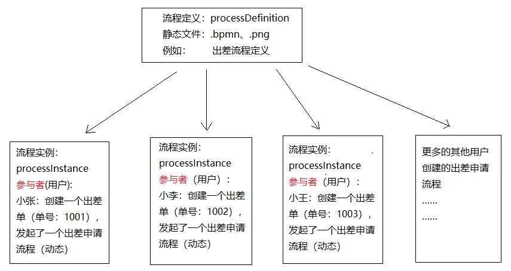

# Activiti 工作流引擎进阶

> 官方网站：https://www.activiti.org/

## 1. 流程实例

### 1.1. 什么是流程实例

**流程实例**（ProcessInstance）代表流程定义的执行实例。一个流程实例包括了所有的运行节点。可以利用这个对象来了解当前流程实例的进度等信息。

例如：用户或程序按照流程定义内容发起一个流程，这就是一个流程实例。流程定义和流程实例的图解如下：



### 1.2. 启动流程实例并添加 Businesskey（业务标识）

流程定义部署在 Activiti 后，就可以在系统中通过 Activiti 去管理该流程的执行，执行流程表示流程的一次执行。

比如部署系统出差流程后，如果某用户要申请出差这时就需要执行这个流程，如果另外一个用户也要申请出差则也需要执行该流程，每个执行互不影响，每个执行是单独的流程实例。

#### 1.2.1. BusinessKey

Businesskey：业务标识，通常为业务表的主键，业务标识和流程实例一一对应。业务标识来源于业务系统。存储业务标识就是根据业务标识来关联查询业务系统的数据。

启动流程实例时，可以指定业务的 businesskey，启动流程后会在 act_ru_execution （流程实例的执行表）中存储 businesskey。

#### 1.2.2. 关联 businessKey 需求

在 activiti 实际应用时，查询流程实例列表时可能要显示出业务系统的一些相关信息，比如：查询当前运行的出差流程列表需要将出差单名称、出差天数等信息显示出来，出差天数等信息在业务系统中存在，而并没有在 activiti 数据库中存在，所以是无法通过 activiti 的 api 查询到出差天数等信息。

#### 1.2.3. 关联 businessKey 实现

比如：出差流程启动一个流程实例，就可以将出差单的 id 作为业务标识存储到 activiti 中，将来查询 activiti 的流程实例信息时，可以通过 businessKey（业务标识 ）关联查询业务系统的出差单表，查询到出差天数等信息。以下是启动流程时关联 businessKey 的具体实现：

```java
@Test
public void testAddBusinessKey() {
    // 1、创建 ProcessEngine 流程引擎
    ProcessEngine processEngine = ProcessEngines.getDefaultProcessEngine();
    // 2、获取 RuntimeService 流程运行管理类
    RuntimeService runtimeService = processEngine.getRuntimeService();
    /*
     * 3、启动流程时关联 businesskey
     *  ProcessInstance startProcessInstanceByKey(String processDefinitionKey, String businessKey);
     *      processDefinitionKey 参数：流程定义的key
     *      businessKey 参数：项目中其他业务的唯一标识，如示例是出差申请单的id="1001"
     */
    ProcessInstance instance = runtimeService.startProcessInstanceByKey("myEvection", "1001");
    // 输出结果
    System.out.println("businessKey == " + instance.getBusinessKey());
}
```

查询 Activiti 的 act_ru_execution 表，字段 `BUSINESS_KEY_` 就是存放业务标识 KEY


在实际应用中，通过下面的代码就可以获取 activiti 中所对应实例保存的业务 Key。而这个业务 Key 一般都会保存相关联的业务操作表的主键，再通过主键 ID 去查询业务信息，比如通过出差单的 ID，去查询更多的请假信息（出差人，出差时间，出差天数，出差目的地等）

```java
String businessKey = processInstance.getBusinessKey();
```

### 1.3. 流程涉及操作的数据库表

#### 1.3.1. 流程启动

启动流程实例，操作如下数据库表：

```sql
-- 流程实例执行表，记录当前流程实例的执行情况
SELECT * FROM act_ru_execution;
```


**说明**：流程实例执行，如果当前只有一个分支时，一个流程实例只有一条记录且执行表的主键id和流程实例id相同；如果当前有多个分支正在运行则该执行表中有多条记录，存在执行表的主键和流程实例id不相同的记录。**不论当前有几个分支总会有一条记录的执行表的主键和流程实例id相同** 

#### 1.3.2. 流程运行完成

一个流程实例运行完成，此表中与流程实例相关的记录删除。

```sql
-- 任务执行表，记录当前执行的任务
SELECT * FROM act_ru_task;
```


**说明**：启动流程实例，流程当前执行到第一个任务结点，此表会插入一条记录表示当前任务的执行情况，如果任务完成则记录删除。

流程每到一个步骤，都会记录当前步骤中参与者的数据

```sql
-- 任务参与者，记录当前参与任务的用户或组
SELECT * FROM act_ru_identitylink;
```


#### 1.3.3. 流程历史记录
  
流程实例启动，会在此表插入一条记录，流程实例运行完成记录也不会删除。

```sql
-- 流程实例历史表
SELECT * FROM act_hi_procinst
```


开始一个任务时，不仅在 act_ru_task 表插入记录，也会在历史任务表插入一条记录，任务历史表的主键就是任务id，任务完成此表记录不删除。

```sql
-- 任务历史表，记录所有任务
SELECT * FROM act_hi_taskinst;
```


活动包括任务，所以此表中不仅记录了任务，还记录了流程执行过程的其它活动，比如开始事件、结束事件。

```sql
-- 活动历史表，记录所有活动
SELECT * FROM act_hi_actinst;
```


### 1.4. 查询流程实例

流程在运行过程中可以查询流程实例的状态，当前运行结点等信息。

```java
@Test
public void testQueryProcessInstance() {
    // 1、创建 ProcessEngine 流程引擎
    ProcessEngine processEngine = ProcessEngines.getDefaultProcessEngine();
    // 2、获取 RuntimeService 流程运行管理类
    RuntimeService runtimeService = processEngine.getRuntimeService();
    // 3、根据流程定义key查询
    List<ProcessInstance> processInstances = runtimeService.createProcessInstanceQuery()
            .processDefinitionKey("myEvection")
            .list();
    // 循环数据
    for (ProcessInstance processInstance : processInstances) {
        System.out.println("----------------------------");
        System.out.println("流程实例id：" + processInstance.getProcessInstanceId());
        System.out.println("所属流程定义id：" + processInstance.getProcessDefinitionId());
        System.out.println("是否执行完成：" + processInstance.isEnded());
        System.out.println("是否暂停：" + processInstance.isSuspended());
        System.out.println("当前活动标识：" + processInstance.getActivityId());
    }
}
```

### 1.5. 流程实例的挂起与激活

某些情况可能由于流程变更需要将当前运行的流程暂停而不是直接删除，流程暂停后将不会继续执行。

#### 1.5.1. 全部流程实例挂起与激活

流程定义为挂起状态该流程定义将不允许启动新的流程实例，同时该流程定义下所有的流程实例将全部挂起暂停执行。

```java
@Test
public void testSuspendAllProcessInstance() {
    // 1、创建 ProcessEngine 流程引擎
    ProcessEngine processEngine = ProcessEngines.getDefaultProcessEngine();
    // 2、获取 RepositoryService 资源管理类
    RepositoryService repositoryService = processEngine.getRepositoryService();
    // 3、获取流程定义的查询对象，查询流程定义
    ProcessDefinition processDefinition = repositoryService.createProcessDefinitionQuery()
            .processDefinitionKey("myEvection")
            .singleResult();
    // 4、获取当前流程定义的所有实例是否都为暂停状态
    boolean suspended = processDefinition.isSuspended();
    String definitionId = processDefinition.getId(); // 获取流程定义的id
    // 5、判断流程实例的状态
    if (suspended) {
        /*
         * 如果是挂起状态，则执行激活的操作
         *  public void activateProcessDefinitionById(String processDefinitionId, boolean activateProcessInstances, Date activationDate)
         *      processDefinitionId 参数：流程定义id
         *      activateProcessInstances 参数：是否激活
         *      activationDate 参数：流程开始激活的日期，如果为 null，则流程立即激活
         */
        repositoryService.activateProcessDefinitionById(definitionId, true, null);
        System.out.println("流程定义id:" + definitionId + "，已激活");
    } else {
        /*
         * 如果是激活状态，则执行挂起的操作
         *  public void suspendProcessDefinitionById(String processDefinitionId, boolean suspendProcessInstances, Date suspensionDate)
         *      processDefinitionId 参数：流程定义id
         *      suspendProcessInstances 参数：是否激活
         *      suspensionDate 参数：流程开始挂起的日期，如果为 null，则流程立即挂起
         */
        repositoryService.suspendProcessDefinitionById(definitionId, true, null);
        System.out.println("流程定义id:" + definitionId + "，已挂起");
    }
}
```

流程实例挂起


流程实例激活


<font color=red>**通过观察上面的操作日志可知，流程实例的挂起与激活实质就是修改相应运行时的表的 `SUSPENSION_STATE_` 字段，“1”代表激活，“2”代表挂起。**</font>

#### 1.5.2. 单个流程实例挂起与激活

操作流程实例对象，针对单个流程执行挂起操作，某个流程实例挂起则此流程不再继续执行，完成该流程实例的当前任务将报异常。示例代码如下：

```java
@Test
public void testSuspendSingleProcessInstance() {
    // 1、创建 ProcessEngine 流程引擎
    ProcessEngine processEngine = ProcessEngines.getDefaultProcessEngine();
    // 2、获取 RuntimeService 流程运行管理类
    RuntimeService runtimeService = processEngine.getRuntimeService();
    // 3、通过 RuntimeService 获取某个流程实例对象
    ProcessInstance processInstance = runtimeService.createProcessInstanceQuery()
            .processInstanceId("")
            .singleResult();
    // 4、获取当前流程实例的暂停状态。true-已暂停  false-激活
    boolean suspended = processInstance.isSuspended();
    String instanceId = processInstance.getId(); // 获取流程实例的id
    // 5、判断流程实例的状态
    if (suspended) {
        // 如果是挂起状态，则执行激活的操作
        runtimeService.activateProcessInstanceById(instanceId);
        System.out.println("流程实例id:" + instanceId + "已经激活");
    } else {
        // 如果是激活状态，则执行挂起的操作
        runtimeService.suspendProcessInstanceById(instanceId);
        System.out.println("流程实例id:" + instanceId + "已经暂停");
    }
}
```

> <font color=purple>**tips: 值得注意的是，操作单个流程实例是通过 `RuntimeService` 流程运行管理类；而操作全部流程实例是通过 `RepositoryService` 资源管理类**</font>

如果流程实例被挂起，操作该流程实例的当前任务会抛出异常。以下是测试代码：

```java
@Test
public void testCompletSuspendTask() {
    // 1、创建 ProcessEngine 流程引擎
    ProcessEngine processEngine = ProcessEngines.getDefaultProcessEngine();
    // 2、获取 TaskService 任务管理类
    TaskService taskService = processEngine.getTaskService();
    // 3、使用 TaskService 根据流程实例的id、负责人来获取任务
    Task task = taskService.createTaskQuery()
            .processInstanceId("10001")
            .taskAssignee("Sam")
            .singleResult();
    System.out.println("流程实例id==" + task.getProcessInstanceId());
    System.out.println("流程任务id==" + task.getId());
    System.out.println("负责人==" + task.getAssignee());
    System.out.println("任务名称==" + task.getName());
    // 4、根据任务的id完成任务
    taskService.complete(task.getId());
}
```

运行结果：


## 2. 个人任务

### 2.1. 任务负责人分配方式1 - 固定分配

在进行业务流程建模时，选择相应的任务节点，并在 properties 视图中，填写 Assignee 项指定固定的任务负责人。如图：


固定分配方式，任务只管一步一步执行任务，执行到每一个任务将按照 bpmn 的配置去分配任务负责人。实际应用中，此方式明显不适用。

### 2.2. 任务负责人分配方式2 - 表达式
  
使用表达式分配的方式，可以灵活指定任务负责人。

#### 2.2.1. UEL 表达式

Activiti 使用 UEL 表达式，UEL 是 java EE6 规范的一部分，UEL（Unified Expression Language）即统一表达式语言，Activiti 支持两种 UEL 表达式：**UEL-value** 和 **UEL-method**

UEL 定义语法：

```java
${变量|对象属性|对象方法}
```

##### 2.2.1.1. UEL-value 方式定义

例如在 Assignee 配置项中填写 `${assignee0}`，其中 `assignee0` 是 activiti 的一个流程变量


也可以使用对象属性的方式，如 `${user.assignee}`，其中 user 也是 activiti 的一个流程变量，`user.assignee` 表示通过调用 user 的 getter 方法获取值。


##### 2.2.1.2. UEL-method 方式定义

UEL-method 方式是通过类调用方法的形式实现


例如在 Assignee 配置项中填写 `${userBean.getUserId()}`，其中 `userBean` 是 spring 容器管理的一个 bean，表示调用该 bean 的 `getUserId()` 方法。

##### 2.2.1.3. UEL-method 与 UEL-value 结合 

以上两种方式可以组合一起使用。

例如在 Assignee 配置项中填写 `${ldapService.findManagerForEmployee(emp)}`。其中 `ldapService` 是 spring 容器的一个 bean，`findManagerForEmployee` 是该 bean 的一个方法，emp 是 activiti 流程变量，然后 emp 作为参数传到 `ldapService.findManagerForEmployee` 方法中。 

##### 2.2.1.4. 其它方式

表达式支持解析基础类型、bean、list、array 和 map，也可作为条件判断。例如

```java
${order.price > 100 && order.price < 250}
```

#### 2.2.2. 编程实现表达式配置负责人

1. 定义新的流程图，任务负责人使用 UEL 表达式来配置，如下图：


2. 部署流程

```java
@Test
public void testDeployment() {
    // 1、创建 ProcessEngine 流程引擎
    ProcessEngine processEngine = ProcessEngines.getDefaultProcessEngine();
    // 2、获取 RepositoryService 资源管理类
    RepositoryService repositoryService = processEngine.getRepositoryService();
    // 3、使用 service 进行流程的部署，定义一个流程的名字，把 bpmn 部署到数据库中
    Deployment deploy = repositoryService.createDeployment()
            .name("出差申请流程-uel")
            .addClasspathResource("bpmn/evection-uel.bpmn20.xml")
            .deploy();
}
```

3. 启动流程时设置流程变量

```java
@Test
public void testStartProcess() {
    // 1、创建 ProcessEngine 流程引擎
    ProcessEngine processEngine = ProcessEngines.getDefaultProcessEngine();
    // 2、获取 RuntimeService 流程运行管理类
    RuntimeService runtimeService = processEngine.getRuntimeService();
    // 3、设定 assignee 的值，用来替换uel表达式
    Map<String, Object> assigneeMap = new HashMap<>();
    assigneeMap.put("assignee0", "MooN");
    assigneeMap.put("assignee1", "李经理");
    assigneeMap.put("assignee2", "王总经理");
    assigneeMap.put("assignee3", "赵财务");
    // 4、根据流程定义Id（其实是数据库表 act_re_procdef 的 key 字段），并设置流程变量，启动流程
    ProcessInstance instance = runtimeService
            .startProcessInstanceByKey("myEvection-uel", assigneeMap);
    // 输出流程信息
    System.out.println("流程定义ID：" + instance.getProcessDefinitionId());
    System.out.println("流程实例ID：" + instance.getId());
    System.out.println("当前活动的ID：" + instance.getActivityId());
}
```

启动成功后，观察数据库 act_ru_variable 表，记录示例中设置的流程变量


流程任务运行表 act_ru_task，也记录任务相应的负责人名称


#### 2.2.3. 表达式使用注意事项

由于使用了表达式分配，必须保证在任务执行过程表达式执行成功。比如：

某个任务使用了表达式 `${order.price > 100 && order.price < 250}`，当执行该任务时必须保证 order 在流程变量中存在，否则 activiti 抛出异常。 

### 2.3. 任务负责人分配方式3 - 监听器

#### 2.3.1. 任务监听器概述

Activiti 可以使用监听器来完成很多流程的业务。因此也可使用监听器的方式来指定负责人，那么在流程设计时就不需要指定 assignee 选项

**任务监听器**是发生对应的任务相关事件时执行自定义 java 逻辑或表达式。

任务相当事件（此截图来源于idea 2019版本之前的 actiBPM 插件）包括：


Event的选项包含：

- Create：任务创建后触发
- Assignment：任务分配后触发
- Delete：任务完成后触发
- All：所有事件发生都触发

#### 2.3.2. Camunda Modeler 工具的安装

Activiti BPMN visualizer 插件无法定义监听器，需要使用扩展程序 camunda-modeler。

官网: https://camunda.com

安装步骤（网上资料，未经测试）：


#### 2.3.3. 监听器分配具体实现

##### 2.3.3.1. 创建监听器类

定义任务监听类，并且必须实现 `org.activiti.engine.delegate.TaskListener` 接口 

```java
public class MyTaskListener implements TaskListener {
    /**
     * 流程启动时，会回调此方法
     *
     * @param delegateTask
     */
    @Override
    public void notify(DelegateTask delegateTask) {
        // 判断当前的任务是“创建申请”并且是“create 事件”
        if ("创建申请".equals(delegateTask.getName()) &&
                "create".equals(delegateTask.getEventName())) {
            delegateTask.setAssignee("天锁斩月");
        }
    }
}
```

##### 2.3.3.2. 流程图定义监听器

> Notes: 因为插件不能定义，又没有安装前面的扩展程序 camunda-modeler，这里使用手动修改 bpmn xml 文件来解决。

1. 使用 Activiti BPMN visualizer 插件正常的创建 bpmn 流程图，暂不需要填写 Assignee 配置项


2. 参考其他已定义了监听器的 bpmn 文件，手动增加监听器部分配置即可。如下：

```xml
...省略
<startEvent id="sid-8c7b3b1a-a7e7-4ffa-878d-a6575168c436"/>
<userTask id="sid-12d16fe6-461d-406b-ae4d-27a72fe46aac" name="创建申请">
    <extensionElements>
        <activiti:taskListener class="com.moon.activiti.listener.MyTaskListener" event="all"/>
    </extensionElements>
</userTask>
<userTask id="sid-1c8d0716-1c86-45b0-a753-015c4b47e50c" name="审批申请">
    <extensionElements>
        <activiti:taskListener class="com.moon.activiti.listener.MyTaskListener" event="all"/>
    </extensionElements>
</userTask>
<endEvent id="sid-4c5596a3-ac8d-4166-b470-710da9ac9365"/>
...省略
```

##### 2.3.3.3. 部署与开启流程

```java
public class ActivitiTaskListenerTest {
    /**
     * 流程部署
     */
    @Test
    public void testDeployment() {
        // 1、创建 ProcessEngine 流程引擎
        ProcessEngine processEngine = ProcessEngines.getDefaultProcessEngine();
        // 2、获取 RepositoryService 资源管理类
        RepositoryService repositoryService = processEngine.getRepositoryService();
        // 3、使用 service 进行流程的部署，定义一个流程的名字，把 bpmn 部署到数据库中
        Deployment deploy = repositoryService.createDeployment()
                .name("测试监听器")
                .addClasspathResource("bpmn/listener-demo.bpmn20.xml")
                .deploy();
    }

    /**
     * 启动流程
     */
    @Test
    public void testStartProcess() {
        // 1、创建 ProcessEngine 流程引擎
        ProcessEngine processEngine = ProcessEngines.getDefaultProcessEngine();
        // 2、获取 RuntimeService 流程运行管理类
        RuntimeService runtimeService = processEngine.getRuntimeService();
        // 3、根据流程定义Id（其实是数据库表 act_re_procdef 的 key 字段）启动流程
        ProcessInstance instance = runtimeService.startProcessInstanceByKey("listener-demo");
    }
}
```

部署流程


在 `MyTaskListener` 的 `notify` 的方法打上断点，使用 debug 模式运行启动流程，可查看 `DelegateTask` 对象的内容如下：


启动流程后，查看 act_ru_task 表，任务负责人名称成功记录


#### 2.3.4. 监听器使用注意事项 

使用监听器分配方式，按照监听事件去执行监听类的 notify 方法，方法如果不能正常执行也会影响任务的执行。 

### 2.4. 回顾：查询任务

> 此部分内容在基础篇已有简单了解，此处结合前端的任务负责人分配来回顾

#### 2.4.1. 查询任务负责人的待办任务

```java
@Test
public void testTaskQueryByAssignee() {
    // 1、创建 ProcessEngine 流程引擎
    ProcessEngine processEngine = ProcessEngines.getDefaultProcessEngine();
    // 2、获取 TaskService 任务管理类
    TaskService taskService = processEngine.getTaskService();
    // 3、根据流程 key 和 任务的负责人 查询任务
    List<Task> tasks = taskService.createTaskQuery()
            .processDefinitionKey("myEvection") // 流程Key
            .includeProcessVariables()
            .taskAssignee("Sam") // 只查询该任务负责人的任务
            .list();
    // 4、输出任务信息
    for (Task task : tasks) {
        System.out.println("流程实例id：" + task.getProcessInstanceId());
        System.out.println("任务id：" + task.getId());
        System.out.println("任务负责人：" + task.getAssignee());
        System.out.println("任务名称：" + task.getName());
    }
}
```

#### 2.4.2. 关联 businessKey

需求：在 activiti 实际应用时，查询待办任务可能要显示出业务系统的一些相关信息。

比如：查询待审批出差任务列表需要将出差单的日期、 出差天数等信息显示出来。出差天数等信息在业务系统中存在，而并没有在 activiti 数据库中存在，所以是无法通过 activiti 的 api 查询到出差天数等信息。

实现：在查询待办任务时，通过 businessKey（业务标识 ）关联查询业务系统的出差单表，查询出出差天数等信息。 

```java
@Test
public void testQueryProcessInstanceByBusinessKey() {
    // 1、创建 ProcessEngine 流程引擎
    ProcessEngine processEngine = ProcessEngines.getDefaultProcessEngine();
    // 2、获取 RuntimeService 流程运行管理类
    RuntimeService runtimeService = processEngine.getRuntimeService();
    // 获取 TaskService 任务管理类
    TaskService taskService = processEngine.getTaskService();
    // 3、查询流程定义key和任务负责人查询任务对象
    List<Task> tasks = taskService.createTaskQuery()
            .processDefinitionKey("myEvection")
            .taskAssignee("Sam")
            // .singleResult();
            .list();// 因为之前测试的原因，数据库有多条记录，如果只有一条记录，可用 singleResult

    // 4、通过 task 对象获取实例id
    for (Task task : tasks) {
        ProcessInstance processInstance = runtimeService.createProcessInstanceQuery()
                .processInstanceId(task.getProcessInstanceId())
                .singleResult();
        // 5、通过流程实例 ProcessInstance，得到关联的 businessKey
        String businessKey = processInstance.getBusinessKey();
        // 以下可以做相关的业务处理
        System.out.println("businessKey == " + businessKey);
    }
}
```

### 2.5. 回顾：完成任务

> 此部分内容在基础篇已有简单了解，此处结合前端的任务负责人分配来回顾

<font color=red>**注意：在实际应用中，完成任务前需要校验任务的负责人是否具有该任务的办理权限**</font>。以下示例是根据任务id查询并完成

```java
@Test
public void testCompletTaskByTaskId() {
    // 1、创建 ProcessEngine 流程引擎
    ProcessEngine processEngine = ProcessEngines.getDefaultProcessEngine();
    // 2、获取 TaskService 任务管理类
    TaskService taskService = processEngine.getTaskService();
    /*
     * 3、查询任务。完成任务前，需要校验该负责人可以完成当前任务
     *  校验方法：根据任务id和任务负责人查询当前任务，如果查到该用户有权限，就完成
     */
    Task task = taskService.createTaskQuery()
            .taskId("22505") // 任务ID
            .taskAssignee("Sam") // 只查询该任务负责人的任务
            .singleResult();
    // 4、根据任务id，完成任务
    if (task != null) {
        taskService.complete(task.getId());
        System.out.println("完成任务");
    }
}
```

## 3. 流程变量

### 3.1. 什么是流程变量

流程变量在 Activiti 中是一个非常重要的角色，流程运转有时需要依赖流程变量，业务系统和 Activiti 结合时少不了流程变量，流程变量就是 Activiti 在管理工作流时根据管理需要而设置的变量。

比如：在出差申请流程流转时如果出差天数大于 3 天则由总经理审核，否则由人事直接审核，出差天数就可以设置为流程变量，在流程流转时使用。 

<font color=red>**注意：虽然流程变量中理论上可以存储业务数据，并通过 Activiti 的 api 查询流程变量从而实现查询业务数据，但是不建议这样使用，因为业务数据查询应该是由业务系统负责，Activiti 设置流程变量只是为了流程执行需要而创建**</font>

### 3.2. 流程变量类型

如果将 pojo 对象类型存储到流程变量中，必须实现序列化接口 `Serializable`，为了防止由于新增字段无法反序列化，需要生成 `serialVersionUID`。 


### 3.3. 流程变量作用域

流程变量的作用域可以是一个流程实例(processInstance)，或一个任务(task)，或一个执行实例(execution)

#### 3.3.1. global 变量

流程变量的默认作用域是流程实例。当一个流程变量的作用域为流程实例时，可以称为 global 变量

<font color=red>**Notes: global 变量中变量名不允许重复，设置相同名称的变量，后设置的值会覆盖前设置的变量值**</font>

#### 3.3.2. local 变量

任务和执行实例仅仅是针对一个任务和一个执行实例范围，范围没有流程实例大， 称为 local 变量。

local 变量由于在不同的任务或不同的执行实例中，作用域互不影响，变量名可以相同没有影响。local 变量名也可以和 global 变量名相同，没有影响。 

### 3.4. 流程变量的使用方法

#### 3.4.1. 在属性上使用 UEL 表达式

可以选择某个任务，在 assignee 项中设置 UEL 表达式，表达式的值为任务的负责人，比如：`${assignee}`，assignee 就是一个流程变量名称。

Activiti 获取 UEL 表达式的值，即流程变量 assignee 的值 ，将 assignee 的值作为任务的负责人进行任务分配


#### 3.4.2. 在连线上使用 UEL 表达式

可以在连线上设置 UEL 表达式，决定流程走向。

比如：`${price<10000}`。price 就是一个流程变量名称，uel 表达式结果类型为布尔类型。如果 UEL 表达式是 true，要决定流程执行走向。

### 3.5. 使用 Global 变量控制流程

#### 3.5.1. 需求

示例需求：员工创建出差申请单，由部门经理审核，部门经理审核通过后出差3天及以下由人财务直接审批，3天以上先由总经理审核，总经理审核通过再由财务审批。最终流程图：


#### 3.5.2. 流程图定义步骤

> 建议在连线上设置 Name 属性，以便在流程图可明显看出分支的条件

1. 设置出差天数大于等于3连线条件

直接使用变量命名，如 `num`：


也可以使用对象参数命名，如 `evection.num`：


2. 设置出差天数小于3连线条件（同上）

#### 3.5.3. 程序中设置 global 流程变量

示例中，在部门经理审核前设置流程变量，变量值为出差单信息（包括出差天数），部门经理审核后可以根据流程变量的值决定流程走向。

在设置 global 流程变量时，可以在启动流程时设置，也可以在任务办理时设置

##### 3.5.3.1. 创建 POJO 对象

创建出差申请 pojo 对象，注意需要实现 `Serializable` 接口与生成 `serialVersionUID`

```java
@Data
public class Evection implements Serializable {
    private static final long serialVersionUID = -5791160141505345527L;
    /**
     * 主键Id
     */
    private Long id;
    /**
     * 出差单的名字
     */
    private String evectionName;
    /**
     * 出差天数
     */
    private Double num;
    /**
     * 开始时间
     */
    private Date beginDate;
    /**
     * 出差结束时间
     */
    private Date endDate;
    /**
     * 目的地
     */
    private String destination;
    /**
     * 出差原因
     */
    private String reson;
}
```

##### 3.5.3.2. 部署流程

```java
@Test
public void testDeployment() {
    // 1、创建 ProcessEngine 流程引擎
    ProcessEngine processEngine = ProcessEngines.getDefaultProcessEngine();
    // 2、获取 RepositoryService 资源管理类
    RepositoryService repositoryService = processEngine.getRepositoryService();
    // 3、使用 service 进行流程的部署，定义一个流程的名字，把 bpmn 部署到数据库中
    Deployment deploy = repositoryService.createDeployment()
            .name("出差申请流程-global")
            .addClasspathResource("bpmn/evection-global.bpmn20.xml")
            .deploy();
    // 输出部署信息
    System.out.println("流程部署id=" + deploy.getId());
    System.out.println("流程部署名字=" + deploy.getName());
}
```

部署成功


##### 3.5.3.3. 启动流程时设置变量

在启动流程时设置流程变量，变量的作用域是整个流程实例。通过 `Map<key,value>` 设置流程变量，map 中可以设置多个变量，key 为流程变量的名字。

调用 `RuntimeService` 类的 `startProcessInstanceByKey(processDefinitionKey, variables)` 方法时设置，流程变量作用域是一个流程实例，流程变量使用Map存储，同一个流程实例设置变量map中key相同，后者覆盖前者。

示例代码如下：

1. 启动流程，设置流程变量中出差日期为2天

```java
@Test
public void testStartProcess() {
    // 创建 ProcessEngine 流程引擎
    ProcessEngine processEngine = ProcessEngines.getDefaultProcessEngine();
    // 获取 RuntimeService 流程运行管理类
    RuntimeService runtimeService = processEngine.getRuntimeService();
    // 流程变量的map
    Map<String, Object> variables = new HashMap<>();
    // 设置流程变量 Pojo
    Evection evection = new Evection();
    // 设置出差日期
    evection.setNum(2d);
    // 把流程变量的pojo放入map
    variables.put("evection", evection);
    // 设置任务负责人
    variables.put("assignee0", "king");
    variables.put("assignee1", "王经理");
    variables.put("assignee2", "杨总经理");
    variables.put("assignee3", "张财务");
    // 根据流程定义Id（其实是数据库表 act_re_procdef 的 key 字段），并设置流程变量，启动流程
    ProcessInstance instance = runtimeService
            .startProcessInstanceByKey("evection-global", variables);
    // 输出流程信息
    System.out.println("流程定义ID：" + instance.getProcessDefinitionId());
    System.out.println("流程实例ID：" + instance.getId());
    System.out.println("当前活动的ID：" + instance.getActivityId());
}
```

成功设置流程变量


根据每一个任务不同的负责人来完成任务（多次运行，分别修改负责人名称变量即可），观察是否走向预期的分支

```java
@Test
public void completTask() {
    // 任务负责人（根据当前流程的任务来修改相应的名称）
    String assingee = "king";
    // String assingee = "王经理";
    // String assingee = "杨总经理";
    // String assingee = "张财务";
    // 获取流程引擎
    ProcessEngine processEngine = ProcessEngines.getDefaultProcessEngine();
    // 获取 TaskService 任务管理类
    TaskService taskService = processEngine.getTaskService();
    // 根据流程定义key与任务负责人来查询任务
    Task task = taskService.createTaskQuery()
            .processDefinitionKey("evection-global")
            .taskAssignee(assingee)
            .singleResult();
    if (task != null) {
        // 根据任务id来 完成任务
        taskService.complete(task.getId());
    }
}
```


> Notes: **当流程全部结束后，相应的流程变量也会删除**
>
> 

2. 修改代码启动新流程，设置流程变量中出差日期为5天，同样按上面的流程测试，观察是否走“总经理审批”的分支


##### 3.5.3.4. 任务办理时设置变量

在完成任务时设置流程变量，该流程变量只有在该任务完成后其它结点才可使用该变量，它的作用域是整个流程实例，如果设置的流程变量的key在流程实例中已存在相同的名字则后设置的变量替换前边设置的变量。

通过当前任务设置流程变量，需要指定当前任务id，如果当前执行的任务id不存在则抛出异常。任务办理时也是通过 `Map<key,value>` 设置流程变量，一次可以设置多个变量。

示例代码如下：

1. 启动流程，这里只设置任务负责人的变量即可（删除设置pojo变量部分代码）

```java
@Test
public void testStartProcess() {
    // 创建 ProcessEngine 流程引擎
    ProcessEngine processEngine = ProcessEngines.getDefaultProcessEngine();
    // 获取 RuntimeService 流程运行管理类
    RuntimeService runtimeService = processEngine.getRuntimeService();
    // 流程变量的map
    Map<String, Object> variables = new HashMap<>();
    // 设置任务负责人
    variables.put("assignee0", "kitty");
    variables.put("assignee1", "陈经理");
    variables.put("assignee2", "欧阳总经理");
    variables.put("assignee3", "黄财务");
    // 根据流程定义Id（其实是数据库表 act_re_procdef 的 key 字段），并设置流程变量，启动流程
    ProcessInstance instance = runtimeService
            .startProcessInstanceByKey("evection-global", variables);
    // 输出流程信息
    System.out.println("流程定义ID：" + instance.getProcessDefinitionId());
    System.out.println("流程实例ID：" + instance.getId());
    System.out.println("当前活动的ID：" + instance.getActivityId());
}
```

只有任务负责人的流程变量


2. 完成任务，注意，完成“部门经理审批”的任务，就需要设置相应的pojo流程变量

```java
@Test
public void completTask() {
    // 任务负责人（根据当前流程的任务来修改相应的名称）
    // String assingee = "kitty";
    String assingee = "陈经理";
    // String assingee = "欧阳总经理";
    // String assingee = "黄财务";

    // 获取流程引擎
    ProcessEngine processEngine = ProcessEngines.getDefaultProcessEngine();
    // 获取 TaskService 任务管理类
    TaskService taskService = processEngine.getTaskService();
    // 根据流程定义key与任务负责人来查询任务
    Task task = taskService.createTaskQuery()
            .processDefinitionKey("evection-global")
            .taskAssignee(assingee)
            .singleResult();
    if (task != null) {
        // 根据任务id来 完成任务(无设置变量)
        // taskService.complete(task.getId());

        /* notes: 在完成“部门经理审批”的任务时，需要设置 pojo 的流程变量，用于指定下一任务的分支 */
        // 流程变量的map
        Map<String, Object> variables = new HashMap<>();
        // 设置流程变量 Pojo
        Evection evection = new Evection();
        // 设置出差日期(走 “部门经理审批” -> "财务审批" 分支)
        // evection.setNum(2d);
        // 设置出差日期(走 “部门经理审批” -> “总经理审批” -> "财务审批" 分支)
        evection.setNum(5d);
        // 把流程变量的pojo放入map
        variables.put("evection", evection);
        // 根据任务id来 完成任务，并设置流程变量
        taskService.complete(task.getId(), variables);
    }
}
```

成功设置pojo的流程变量


流程也走预期的分支


> Notes: <font color=red>**在完成任务时设置的流程变量也启动流程时设置的一样，变量均在整个流程完成后才销毁**</font>

##### 3.5.3.5. 通过当前流程实例设置

通过流程实例id也设置全局变量，<font color=red>**值得注意的是，该流程实例必须未执行完成**</font>。

```java
@Test
public void testSetGlobalVariableByExecutionId() {
    // 当前流程实例执行 id，通常设置为当前执行的流程实例（注意：必须是未结束的流程实例）
    String executionId = "xxx";
    // 创建 ProcessEngine 流程引擎
    ProcessEngine processEngine = ProcessEngines.getDefaultProcessEngine();
    // 获取 RuntimeService 流程运行管理类
    RuntimeService runtimeService = processEngine.getRuntimeService();
    // 设置流程变量 Pojo
    Evection evection = new Evection();
    // 设置出差日期
    evection.setNum(5d);

    /*
     * 通过流程运行管理类的方法，给指定id的流程设置单个流程变量
     * public void setVariable(String executionId, String variableName, Object value)
     *  executionId 参数：流程实例的ID
     *  variableName 参数：流程变量的名称
     *  value 参数：流程变量的值
     */
    runtimeService.setVariable(executionId, "evection", evection);

    /*
     * 通过流程运行管理类的方法，给指定id的流程一次性设置多个流程变量
     * public void setVariables(String executionId, Map<String, ? extends Object> variables)
     *  executionId 参数：流程实例的ID
     *  variables 参数：多个流程变量 k-v 集合
     */
    // 流程变量的map
    Map<String, Object> variables = new HashMap<>();
    // 把流程变量的pojo放入map
    variables.put("evection", evection);
    // 设置其他变量
    variables.put("name", "MooN");
    variables.put("time", "12");
    runtimeService.setVariables(executionId, variables);
}
```

> Tips: 示例中 executionId 必须是当前未结束的流程实例的执行id，通常此 id 设置流程实例的id。也可以通 `runtimeService.getVariable()` 获取流程变量。

##### 3.5.3.6. 通过当前任务设置

任务id必须是当前待办任务id(未完成)，在 `act_ru_task` 表中存在。如果该任务已结束，则会报错。也可以通过 `taskService.getVariable()` 获取流程变量。

```java
@Test
public void testSetGlobalVariableByTaskId() {
    // 当前待办任务id（注意：必须是未完成的任务）
    String taskId = "xxx";
    // 创建 ProcessEngine 流程引擎
    ProcessEngine processEngine = ProcessEngines.getDefaultProcessEngine();
    // 获取 TaskService 任务管理类
    TaskService taskService = processEngine.getTaskService();
    // 设置流程变量 Pojo
    Evection evection = new Evection();
    // 设置出差日期
    evection.setNum(5d);

    /*
     * 通过任务管理类的方法，给指定id的任务设置单个流程变量
     * public void setVariable(String taskId, String variableName, Object value)
     *  taskId 参数：未完成的任务ID
     *  variableName 参数：流程变量的名称
     *  value 参数：流程变量的值
     */
    taskService.setVariable(taskId, "evection", evection);

    /*
     * 通过任务管理类的方法，给指定id的任务一次性设置多个流程变量
     * public void setVariables(String taskId, Map<String, ? extends Object> variables)
     *  executionId 参数：未完成的任务ID
     *  variables 参数：多个流程变量 k-v 集合
     */
    // 流程变量的map
    Map<String, Object> variables = new HashMap<>();
    // 把流程变量的pojo放入map
    variables.put("evection", evection);
    // 设置其他变量
    variables.put("name", "MooN");
    variables.put("time", "12");
    taskService.setVariables(taskId, variables);
}
```

#### 3.5.4. 注意事项

1. 如果 UEL 表达式中流程变量名不存在则报错。
2. 如果 UEL 表达式中流程变量值为 NULL，流程不按 UEL 表达式去执行，而流程结束
3. 如果 UEL 表达式都不符合条件，流程结束
4. 如果连线不设置条件，会走 flow 序号小的那条分支线

#### 3.5.5. 涉及操作的数据库表

设置流程变量会在当前执行流程变量表插入记录，同时也会在历史流程变量表也插入记录。

```sql
-- 当前流程变量表
SELECT * FROM act_ru_variable;
```

记录当前运行流程实例可使用的流程变量，包括 global 和 local 变量。表字段说明如下：

|       字段       |                       说明                        |
| --------------- | ------------------------------------------------ |
| `Id_`           | 主键                                              |
| `Type_`         | 变量类型                                          |
| `Name_`         | 变量名称                                          |
| `Execution_id_` | 所属流程实例执行id，global和local变量都存储          |
| `Proc_inst_id_` | 所属流程实例id，global和local变量都存储             |
| `Task_id_`      | 所属任务id，local变量存储                          |
| `Bytearray_`    | serializable类型变量存储对应act_ge_bytearray表的id |
| `Double_`       | double类型变量值                                  |
| `Long_`         | long类型变量值                                    |
| `Text_`         | text类型变量值                                    |


```sql
-- 历史流程变量表
SELECT * FROM act_hi_varinst;
```

记录所有已创建的流程变量，包括 global 和 local 变量。*字段意义参考流程变量表。*

#### 3.5.6. 测试说明

正常测试：

- 设置流程变量的值大于等于3天
- 设计流程变量的值小于3天

异常测试：

- 流程变量不存在
- 流程变量的值为空 NULL，price 属性为空
- UEL 表达式都不符合条件  
- 不设置连线的条件

### 3.6. 设置 local 流程变量


## 4. 组任务

### 4.1. 需求分析

在流程定义中在任务结点的 assignee 只能固定设置一个任务负责人，并且在流程定义时将参与者固定设置在 .bpmn 文件中，如果临时任务负责人变更则需要修改流程定义，系统可扩展性差。

针对这种情况可以给任务设置多个候选人，可以从候选人中选择参与者来完成任务。 

### 4.2. 设置任务候选人

在流程图中任务节点的 candidate-users(候选人)配置项中设置，多个候选人之间用逗号(`,`)分开。 


相应生成的 bpmn 文件

```xml
<userTask id="sid-1bf63446-bcf6-462a-85c6-88fefb727b49" name="部门经理审批" activiti:candidateUsers="MooN,kirA,Zero"/>
```

可以看到部门经理的审核人已经设置为 "MooN,kirA,Zero" 这样的一组候选人，可以使用 `activiti:candiateUsers="用户1,用户2,用户3"` 的这种方式来实现设置一组候选人 

### 4.3. 组任务办理流程


