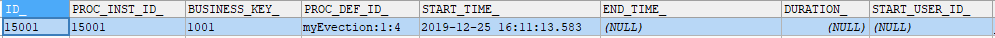
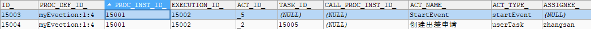

# Activiti 工作流引擎进阶

> 官方网站：https://www.activiti.org/

## 1. 流程实例

### 1.1. 什么是流程实例

**流程实例**（ProcessInstance）代表流程定义的执行实例。一个流程实例包括了所有的运行节点。可以利用这个对象来了解当前流程实例的进度等信息。

例如：用户或程序按照流程定义内容发起一个流程，这就是一个流程实例。流程定义和流程实例的图解如下：


### 1.2. 启动流程实例并添加 Businesskey（业务标识）

流程定义部署在 Activiti 后，就可以在系统中通过 Activiti 去管理该流程的执行，执行流程表示流程的一次执行。

比如部署系统出差流程后，如果某用户要申请出差这时就需要执行这个流程，如果另外一个用户也要申请出差则也需要执行该流程，每个执行互不影响，每个执行是单独的流程实例。

#### 1.2.1. BusinessKey

Businesskey：业务标识，通常为业务表的主键，业务标识和流程实例一一对应。业务标识来源于业务系统。存储业务标识就是根据业务标识来关联查询业务系统的数据。

启动流程实例时，可以指定业务的 businesskey，启动流程后会在 act_ru_execution （流程实例的执行表）中存储 businesskey。

#### 1.2.2. 关联 businessKey 需求

在 activiti 实际应用时，查询流程实例列表时可能要显示出业务系统的一些相关信息，比如：查询当前运行的出差流程列表需要将出差单名称、出差天数等信息显示出来，出差天数等信息在业务系统中存在，而并没有在 activiti 数据库中存在，所以是无法通过 activiti 的 api 查询到出差天数等信息。

#### 1.2.3. 关联 businessKey 实现

比如：出差流程启动一个流程实例，就可以将出差单的 id 作为业务标识存储到 activiti 中，将来查询 activiti 的流程实例信息时，可以通过 businessKey（业务标识 ）关联查询业务系统的出差单表，查询到出差天数等信息。以下是启动流程时关联 businessKey 的具体实现：

```java
@Test
public void testAddBusinessKey() {
    // 1、创建 ProcessEngine 流程引擎
    ProcessEngine processEngine = ProcessEngines.getDefaultProcessEngine();
    // 2、获取 RuntimeService 流程运行管理类
    RuntimeService runtimeService = processEngine.getRuntimeService();
    /*
     * 3、启动流程时关联 businesskey
     *  ProcessInstance startProcessInstanceByKey(String processDefinitionKey, String businessKey);
     *      processDefinitionKey 参数：流程定义的key
     *      businessKey 参数：项目中其他业务的唯一标识，如示例是出差申请单的id="1001"
     */
    ProcessInstance instance = runtimeService.startProcessInstanceByKey("myEvection", "1001");
    // 输出结果
    System.out.println("businessKey == " + instance.getBusinessKey());
}
```

查询 Activiti 的 act_ru_execution 表，字段 `BUSINESS_KEY_` 就是存放业务标识 KEY


在实际应用中，通过下面的代码就可以获取 activiti 中所对应实例保存的业务 Key。而这个业务 Key 一般都会保存相关联的业务操作表的主键，再通过主键 ID 去查询业务信息，比如通过出差单的 ID，去查询更多的请假信息（出差人，出差时间，出差天数，出差目的地等）

```java
String businessKey = processInstance.getBusinessKey();
```

### 1.3. 流程涉及操作的数据库表

#### 1.3.1. 流程启动

启动流程实例，操作如下数据库表：

```sql
-- 流程实例执行表，记录当前流程实例的执行情况
SELECT * FROM act_ru_execution;
```


**说明**：流程实例执行，如果当前只有一个分支时，一个流程实例只有一条记录且执行表的主键id和流程实例id相同；如果当前有多个分支正在运行则该执行表中有多条记录，存在执行表的主键和流程实例id不相同的记录。**不论当前有几个分支总会有一条记录的执行表的主键和流程实例id相同** 

#### 1.3.2. 流程运行完成

一个流程实例运行完成，此表中与流程实例相关的记录删除。

```sql
-- 任务执行表，记录当前执行的任务
SELECT * FROM act_ru_task;
```


**说明**：启动流程实例，流程当前执行到第一个任务结点，此表会插入一条记录表示当前任务的执行情况，如果任务完成则记录删除。

流程每到一个步骤，都会记录当前步骤中参与者的数据

```sql
-- 任务参与者，记录当前参与任务的用户或组
SELECT * FROM act_ru_identitylink;
```


#### 1.3.3. 流程历史记录
  
流程实例启动，会在此表插入一条记录，流程实例运行完成记录也不会删除。

```sql
-- 流程实例历史表
SELECT * FROM act_hi_procinst
```



开始一个任务时，不仅在 act_ru_task 表插入记录，也会在历史任务表插入一条记录，任务历史表的主键就是任务id，任务完成此表记录不删除。

```sql
-- 任务历史表，记录所有任务
SELECT * FROM act_hi_taskinst;
```


活动包括任务，所以此表中不仅记录了任务，还记录了流程执行过程的其它活动，比如开始事件、结束事件。

```sql
-- 活动历史表，记录所有活动
SELECT * FROM act_hi_actinst;
```



### 1.4. 查询流程实例

流程在运行过程中可以查询流程实例的状态，当前运行结点等信息。

```java
@Test
public void testQueryProcessInstance() {
    // 1、创建 ProcessEngine 流程引擎
    ProcessEngine processEngine = ProcessEngines.getDefaultProcessEngine();
    // 2、获取 RuntimeService 流程运行管理类
    RuntimeService runtimeService = processEngine.getRuntimeService();
    // 3、根据流程定义key查询
    List<ProcessInstance> processInstances = runtimeService.createProcessInstanceQuery()
            .processDefinitionKey("myEvection")
            .list();
    // 循环数据
    for (ProcessInstance processInstance : processInstances) {
        System.out.println("----------------------------");
        System.out.println("流程实例id：" + processInstance.getProcessInstanceId());
        System.out.println("所属流程定义id：" + processInstance.getProcessDefinitionId());
        System.out.println("是否执行完成：" + processInstance.isEnded());
        System.out.println("是否暂停：" + processInstance.isSuspended());
        System.out.println("当前活动标识：" + processInstance.getActivityId());
    }
}
```

### 1.5. 流程实例的挂起与激活

某些情况可能由于流程变更需要将当前运行的流程暂停而不是直接删除，流程暂停后将不会继续执行。

#### 1.5.1. 全部流程实例挂起与激活

流程定义为挂起状态该流程定义将不允许启动新的流程实例，同时该流程定义下所有的流程实例将全部挂起暂停执行。

```java
@Test
public void testSuspendAllProcessInstance() {
    // 1、创建 ProcessEngine 流程引擎
    ProcessEngine processEngine = ProcessEngines.getDefaultProcessEngine();
    // 2、获取 RepositoryService 资源管理类
    RepositoryService repositoryService = processEngine.getRepositoryService();
    // 3、获取流程定义的查询对象，查询流程定义
    ProcessDefinition processDefinition = repositoryService.createProcessDefinitionQuery()
            .processDefinitionKey("myEvection")
            .singleResult();
    // 4、获取当前流程定义的所有实例是否都为暂停状态
    boolean suspended = processDefinition.isSuspended();
    String definitionId = processDefinition.getId(); // 获取流程定义的id
    // 5、判断流程实例的状态
    if (suspended) {
        /*
         * 如果是挂起状态，则执行激活的操作
         *  public void activateProcessDefinitionById(String processDefinitionId, boolean activateProcessInstances, Date activationDate)
         *      processDefinitionId 参数：流程定义id
         *      activateProcessInstances 参数：是否激活
         *      activationDate 参数：流程开始激活的日期，如果为 null，则流程立即激活
         */
        repositoryService.activateProcessDefinitionById(definitionId, true, null);
        System.out.println("流程定义id:" + definitionId + "，已激活");
    } else {
        /*
         * 如果是激活状态，则执行挂起的操作
         *  public void suspendProcessDefinitionById(String processDefinitionId, boolean suspendProcessInstances, Date suspensionDate)
         *      processDefinitionId 参数：流程定义id
         *      suspendProcessInstances 参数：是否激活
         *      suspensionDate 参数：流程开始挂起的日期，如果为 null，则流程立即挂起
         */
        repositoryService.suspendProcessDefinitionById(definitionId, true, null);
        System.out.println("流程定义id:" + definitionId + "，已挂起");
    }
}
```

流程实例挂起


流程实例激活


<font color=red>**通过观察上面的操作日志可知，流程实例的挂起与激活实质就是修改相应运行时的表的 `SUSPENSION_STATE_` 字段，“1”代表激活，“2”代表挂起。**</font>

#### 1.5.2. 单个流程实例挂起与激活

操作流程实例对象，针对单个流程执行挂起操作，某个流程实例挂起则此流程不再继续执行，完成该流程实例的当前任务将报异常。示例代码如下：

```java
@Test
public void testSuspendSingleProcessInstance() {
    // 1、创建 ProcessEngine 流程引擎
    ProcessEngine processEngine = ProcessEngines.getDefaultProcessEngine();
    // 2、获取 RuntimeService 流程运行管理类
    RuntimeService runtimeService = processEngine.getRuntimeService();
    // 3、通过 RuntimeService 获取某个流程实例对象
    ProcessInstance processInstance = runtimeService.createProcessInstanceQuery()
            .processInstanceId("")
            .singleResult();
    // 4、获取当前流程实例的暂停状态。true-已暂停  false-激活
    boolean suspended = processInstance.isSuspended();
    String instanceId = processInstance.getId(); // 获取流程实例的id
    // 5、判断流程实例的状态
    if (suspended) {
        // 如果是挂起状态，则执行激活的操作
        runtimeService.activateProcessInstanceById(instanceId);
        System.out.println("流程实例id:" + instanceId + "已经激活");
    } else {
        // 如果是激活状态，则执行挂起的操作
        runtimeService.suspendProcessInstanceById(instanceId);
        System.out.println("流程实例id:" + instanceId + "已经暂停");
    }
}
```

> <font color=purple>**tips: 值得注意的是，操作单个流程实例是通过 `RuntimeService` 流程运行管理类；而操作全部流程实例是通过 `RepositoryService` 资源管理类**</font>

如果流程实例被挂起，操作该流程实例的当前任务会抛出异常。以下是测试代码：

```java
@Test
public void testCompletSuspendTask() {
    // 1、创建 ProcessEngine 流程引擎
    ProcessEngine processEngine = ProcessEngines.getDefaultProcessEngine();
    // 2、获取 TaskService 任务管理类
    TaskService taskService = processEngine.getTaskService();
    // 3、使用 TaskService 根据流程实例的id、负责人来获取任务
    Task task = taskService.createTaskQuery()
            .processInstanceId("10001")
            .taskAssignee("Sam")
            .singleResult();
    System.out.println("流程实例id==" + task.getProcessInstanceId());
    System.out.println("流程任务id==" + task.getId());
    System.out.println("负责人==" + task.getAssignee());
    System.out.println("任务名称==" + task.getName());
    // 4、根据任务的id完成任务
    taskService.complete(task.getId());
}
```

运行结果：


## 2. 个人任务
