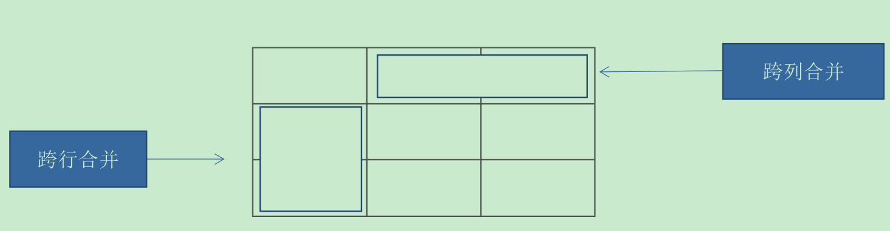
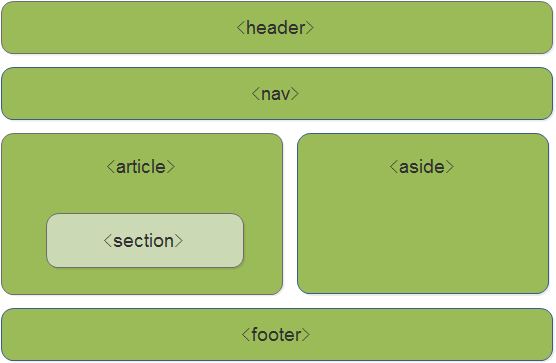
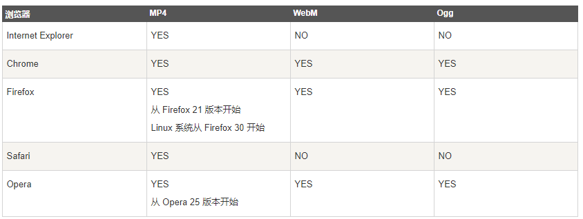
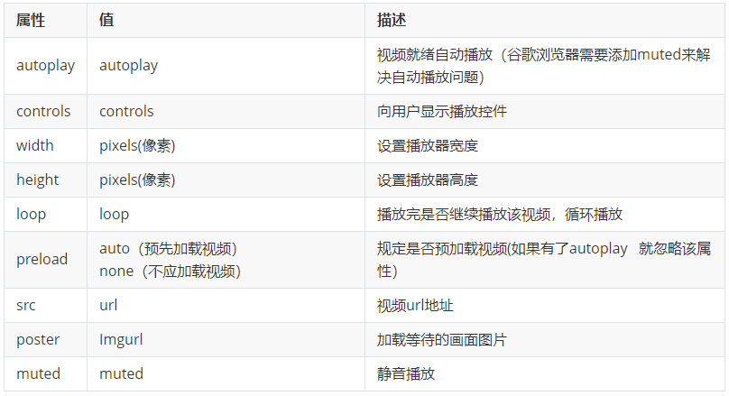
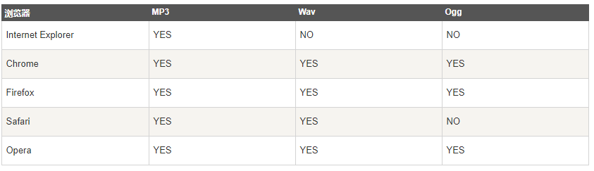
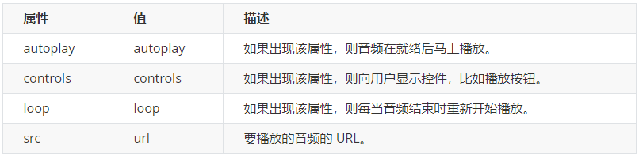
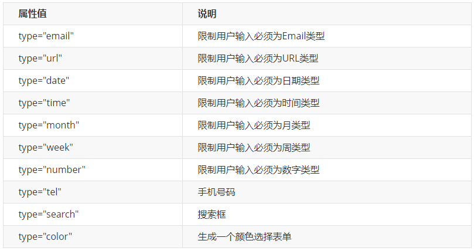
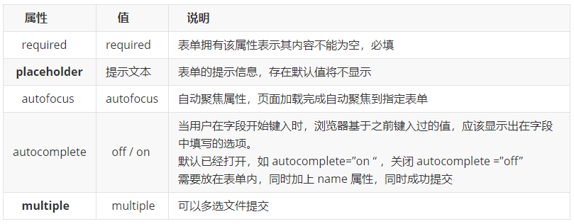

# HTML

## 1. HTML概述
### 1.1. HTTP 协议

- `http://www.xxx.com/`：Hyper Text Transfer Protocol 超文本传输协议，用于在浏览器与服务器之间传输网页
- `https://www.xxx.com/`：加密的超文本传输协议，在进行数据传输过程中对数据进行了加密

### 1.2. W3C

万维网发布的一种规范，Web技术标准及实施指南。如：超文本标记语言HTML，可扩展标记语言XML。

### 1.3. HTML概念

- **HTML**
    - HyperText Markup Language: 超文本标记语言，html也是一个xml文件，但是一个特殊的xml文件，xml可以描述数据，html不仅描述数据，而且可以布局数据。
    - 对书写出错的标记将不指出其错误，且不停止其解释执行过程。
- **超文本**
    - 普通文本，文本字符串
    - 超文本，不同于普通文本的文本，不仅描述普通文本，还可以描述图片、超链接、音频、视频
- **标记语言**
    - 整个网页由各种标签组成，标签也叫标记，标签时成对出现的。
    - 如：`<标签名称>描述的数据</标签名称>`
- **网页语言**
    - 就是一种编写代码的方式（与xml相似），html浏览器可以解析的语言

### 1.4. HTML特点

html后缀名是：xx.html 或者 xx.htm。直接通过浏览器就可以运行

### 1.5. HTML的规范

1. 一个html文件开始标签和结束的标签，如：`<html>xxx</html>`
2. html包含两部分内容
    - `<head>设置相关信息</head>`
    - `<body>显示在页面上的内容都写在body里面</body>`
    - 如果使用框架标签则使用`<frameset></frameset>`替换`<body>`
3. html的标签有开始标签，也要有结束标签
4. html的代码不区分大小写
5. 有些标签，没有结束标签
    - 比如：换行`<br/>`、水平线`<hr/>`

### 1.6. HTML的操作思想

- 网页中有很多数据，不同的数据可能需要不同的显示效果。这个时候需要使用标签把要操作的数据包起来(封装起来)
- 通过修改标签的属性值实现标签内数据样式的变化
- 一个标签相当于一个容器，想要修改容器内的数据的样式，只需要改变容器的属性值，就可以实现容器内数据样式的变化

### 1.7. 拼接的注意问题

**拼接要点：外双内单，再出现引号则需要转义**

```html
"<a href='#' onclick='updateCategory("+cid+",\""+ cname +"\");'>修改</a>"
```

## 2. HTML标签

### 2.1. 标签的格式

- `<标签名称 属性名="属性值">数据</标签名称>`
    - 有主体标签
- `<标签名称 属性名="属性值"/>`
    - 无主体标签

### 2.2. HTML标签分类

- **块标签**
    - 每个标签单独独一行，自动**换行**
- **内联标签**
    - 标签**不换行**，每个标签是排在上一个标签的后面。

## 3. HTML网页的基本结构相关
### 3.1. HTML整体结构标签

|     标签名      |                             作用                             |
| :-------------: | :---------------------------------------------------------- |
|    `<html>`     |                         网页的根元素                         |
|    `<head>`     |                          网页的头部                          |
|    `<body>`     | 网页的主体<br />bgcolor属性：用于设置网页的背景颜色<br />background属性：用于设置网页的背景 |
| `<!-- 注释 -->` |                       与XML的注释相同                        |

### 3.2. 网页头部标签的作用

- 语法：`<head>头部内容</head>`
    1. `<title>`标签显示整个网页标题：例：`<title>这是一个标题</title>`
    2. 用来设置网页的字符集(编码)，汉字如果编码不正确，就会出现乱码的问题。
        - HTML5设置字符集：`<meta charset="UTF-8">`
        - HTML4设置字符集：`<meta http-equiv="Content-Type" content="text/html;charset=UTF-8"/>`
    3. 告诉搜索引擎（如：百度），当前网页包含哪些关键字。`<meta name="keywords" content="xx1,xx2,xx3……">`

### 3.3. 网页体的作用

- 语法：`<body>网页体内容</body>`
    - 网页要显示的内容
    - HTML4：主要用于电脑端浏览器
    - HTML5：主要用于移动端

### 3.4. HTML其他结构标签

#### 3.4.1. 文档类型声明标签

`<!DOCTYPE>` 文档类型声明，作用就是告诉浏览器使用哪种HTML版本来显示网页。

```html
<!DOCTYPE html>
```

以上示例意思是：当前页面采取的是 HTML5 版本来显示网页

- **注意**:
1. `<!DOCTYPE>`声明位于文档中的最前面的位置，处于 `<html>` 标签之前。
2. `<!DOCTYPE>`不是一个 HTML 标签，它就是文档类型声明标签。

#### 3.4.2. lang 语言种类

`<html lang="en">`用来定义当前文档显示的语言。

`en`定义语言为英语；`zh-CN`定义语言为中文。其实对于文档显示来说，定义成en的文档也可以显示中文，定义成zh-CN的文档也可以显示英文。这个属性对浏览器和搜索引擎(百度.谷歌等)还是有作用的

#### 3.4.3. 字符集

字符集 (Character set)是多个字符的集合。以便计算机能够识别和存储各种文字。

在`<head>`标签内，可以通过`<meta>`标签的 charset 属性来规定 HTML 文档应该使用哪种字符编码。

```html
<meta charset="UTF-8">
```

charset 常用的值有：`GB2312`、`BIG5`、`GBK`和`UTF-8`，其中 `UTF-8` 也被称为**万国码**，基本包含了全世界所有国家需要用到的字符

<font color=red>注意：`<meta charset="UTF-8">`是必须要写的代码，否则可能引起乱码的情况。一般情况下，统一使用"UTF-8"编码，尽量统一写成标准的"UTF-8"，不要写成"utf8"或"UTF8"</font>

## 4. HTML中常用标签

### 4.1. 标题标签

为了使网页更具有语义化，经常会在页面中用到标题标签。HTML提供了6个等级的网页标题，即`<h1>`-`<h6>`，具体用法如下：

```html
<h1>标题一共六级选,</h1>
<h2>文字加粗一行显。</h2>
<h3>由大到小依次减，</h3>
<h4>从重到轻随之变。</h4>
<h5>语法规范书写后，</h5>
<h6>具体效果刷新见。</h6>
```

- 特点：
1. 加了标题的文字会变的加粗，字号也会依次变大。即自带加粗
2. 一个标题独占一行，即自动换行

#### 4.1.1. 常用属性

- align：设置标题对齐方式，默认是左对齐。可选值：`center`居中，`right`右对齐

### 4.2. 段落和换行标签

#### 4.2.1. 段落标签

在 HTML 标签中，`<p>`标签用于定义段落，标签语义：它可以把 HTML 文档分割为若干段落。

```html
<p>我是一个段落标签</p>
```

- **特点**：
1. 文本在一个段落中会根据浏览器窗口的大小自动换行。
2. 段落和段落之间保有空隙。
3. 段落没有首行缩进

- **常用属性**
    - `title`：当鼠标移动到段落上的时候，会出现提示性的文字

#### 4.2.2. 换行标签

在 HTML 中，一个段落中的文字会从左到右依次排列，直到浏览器窗口的右端，然后才自动换行。换行标签`<br />`就是将某段文本强制换行显示，标签语义：强制换行。

```html
我是换行前的文字<br/>我是换行后的文字
```

- **特点**:
1. `<br />` 是个单标签。
2. `<br />` 标签只是简单地开始新的一行，跟段落不一样，段落之间会插入一些垂直的间距。

### 4.3. 文本格式化标签

HTML 中的文本格式化标签，使文字设置为粗体、斜体 或下划线等效果显示。

|  语义  |              标签              |
| :---: | :----------------------------: |
|  加粗  | `<strong></strong>`或`<b></b>` |
|  倾斜  |     `<em></em>`或`<i></i>`     |
| 删除线 |    `<del></del>`或`<s></s>`    |
| 下划线 |    `<ins></ins>`或`<u></u>`    |

```html
我是<strong>加粗</strong>的文字 <br />
我是<b>加粗</b>的文字 <br />

我是<em>倾斜</em>的文字 <br />
我是<i>倾斜</i>的文字 <br />

我是<del>删除线</del> <br />
我是<s>删除线</s> <br />

我是<ins>下划线</ins> <br />
我是<u>下划线</u> <br />
```

### 4.4. `<div>`和`<span>`标签

`<div>` 和 `<span>` 标签是没有语义的，它们就是一个盒子，用来装网页的内容。

- **特点**：
1. `<div>` 标签用来布局，将网页中的内容在逻辑上分成不同的块，换行，是<font color=red>**块标签**</font>。在没有写css样式前，一行只能放一个`<div>`。
2. `<span>` 标签用来布局，将网页中的内容在逻辑上分成不同的块，不换行，是<font color=red>**内联标签**</font>。一行上可以多个`<span>`。

```htmL
<div>我是div标签，我是块元素，独占一行</div>
<span>我是span标签，我是行内元素，多个span标签能在一行中显示</span>
```

### 4.5. 图像标签
#### 4.5.1. 图像标签作用

在 HTML 标签中，`` 标签用于定义 HTML 页面中的图像。

#### 4.5.2. 图像标签语法

```html

```

<font color=red>**注意：`src`是``标签的必须属性，它用于指定图像文件的路径和文件名**</font>

#### 4.5.3. 图像标签相关属性

|  属性名   | 描述                                                                        |
| :------: | :-------------------------------------------------------------------------- |
|  `src`   | 图片的地址，可以使用本地服务器，也可以链接其它网站。是**必须的属性**              |
| `width`  | 指定图片的宽度。（如果只指定1个，另一个会按比例缩放。）                           |
| `height` | 指定图片的高度。（如果只指定1个，另一个会按比例缩放。）                           |
|  `alt`   | 如果图片丢失，会出现这个替代文字                                               |
| `title`  | 如果鼠标移动到图片上面，会出现提示的信息。但有些浏览器下不显示（没有效果，兼容性差） |
| `border` | 定义图像周围的边框的粗细。**不推荐使用**                                       |

```html
<h4>图像标签的使用:</h4>
<!-- 图像标签 -->

<h4>alt 替换文本 图像显示不出来的时候用文字替换:</h4>

<h4>title 提示文本 鼠标放到图像上,提示的文字:</h4>


<h4>width 给图像设定宽度:</h4>

<h4>height 给图像设定高度:</h4>

<h4>border 给图像设定边框:</h4>

```

- 图像标签注意点：
1. 图像标签可以拥有多个属性，必须写在标签名的后面。
2. 属性之间不分先后顺序，标签名与属性、属性与属性之间均以空格分开。
3. 属性采取键值对的格式，即 `key="value"` 的格式，即`属性名="属性值"`。

#### 4.5.4. 路径分类写法

路径可以分为：**绝对路径**和**相对路径**

##### 4.5.4.1. 相对路径（三种形式）

**相对路径**：以<font color=red>引用文件所在位置为参考基础</font>，而建立出的目录路径。简单来说，就是<font color=red>图片相对于 HTML 页面的位置</font>

1. html文件和图片在同一个路径下，直接写文件名称即可

```html
`
```

2. 图片在html文件夹的下层目录中

```html
<!--
	c:\xxx\x.html
	c:\xxx\img\x.jpg
-->

```

3. 图片在html文件夹的上层目录中

```html
<!--
	c:\xxx\code\x.html
	c:\xxx\x.jpg
    表示上层的上层则: ..\..\
-->

```

##### 4.5.4.2. 绝对路径

**绝对路径**：是指目录下的绝对位置，直接到达目标位置，通常是从盘符开始的路径。或者是完整的网络地址

如：`D:\web\img\logo.gif`或者网址`http://www.moon.cn/images/logo.gif`

### 4.6. 超链接标签（重点）

#### 4.6.1. 超链接作用

在 HTML 标签中，`<a>`标签用于定义超链接，作用是从一个页面链接到另一个页面

#### 4.6.2. 超链接语法

```html
<a href="链接到资源的路径URL" target="目标窗口的弹出方式">显示在页面上的文字或者图片</a>
```

#### 4.6.3. 超链接相关属性

|  属性名   | 属性值                                                                   | 描述                                 |
| :------: | :----------------------------------------------------------------------- | :----------------------------------- |
|  `href`  | 链接到资源的路径URL，是必须的属性                                           | 链接的资源的地址                      |
| `title`  |                                                                          | 当鼠标移上去时候，显示提示信息          |
| `target` | `target="_self"`：在当前页打开（默认）<br/>`target="_blank"`：在新的窗口打开 | 设置链接的打开的方式，默认是在当前页打开 |

```html
<!-- 超链接标签 -->
<a href="Java学习路线图1.jpg" target="_blank">这是一个超链接。</a><br/>
<a href="#">这是一个没有写链接资源的超链接。</a>
```

#### 4.6.4. 链接分类

1. 外部链接：当前网站以外的资源，例如`<a href="http://www.baidu.com">百度</a>`
2. 内部链接：网站内部页面之间的相互链接，直接链接内部页面名称即可。例如`<a href="index.html">首页</a>`
3. 空链接：如果当时没有确定链接目标时，`<a href="#">首页</a>`
4. 下载链接：如果 href 里面地址是一个文件或者压缩包，会下载这个文件
5. 网页元素链接：在网页中的各种网页元素，如文本、图像、表格、音频、视频等都可以添加超链接
6. 锚点链接：点击链接时，可以快速定位到页面中的某个位置

```html
<h4>1.外部链接</h4>
<a href="http://www.qq.com">腾讯</a>
<h4>target 打开窗口的方式 默认的值是_self。 _self: 当前窗口打开页面 _blank: 新窗口打开页面</h4>
<a href="http://www.baidu.com" target="_blank">百度</a>
<h4>2.内部链接: 网站内部页面之间的相互链接</h4>
<a href="08-图像标签.html" target="_blank">网站内的页面</a>
<h4>3.空链接:#</h4>
<a href="#">我是一个空链接</a>
<h4>4.下载链接: 地址链接的是文件（.exe）或者压缩包（.zip等）形式</h4>
<a href="test-download.zip">下载文件</a>
<h4>5.网页元素的链接</h4>
<a href="http://www.baidu.com"></a>
```

#### 4.6.5. 调用发邮件客户端

```html
<a href="mailto:xxx@xx.com">给我发邮件</a>
```

#### 4.6.6. 定位资源(锚的使用)

锚：当一个网页的内容特别长的时候，需要定位到网页中不同的部分，就可以在网页中设置一些锚点，可以让链接跳转到这个位置上。

- 如果想要定位资源，则先定义一个位置(锚点)，可以使用`<a>`标签设置name属性，或者其他html标签设置id属性，值为锚点的名称

```html
<!-- <a>标签 -->
<a name="锚点名称">锚点的位置</a>
<!-- 或者使用其他html标签 -->
<h3 id="锚点名称">其他标签定义的锚点</h3>
```

- 在链接文本的`href`属性中，设置属性值为`#锚点名字`的形式

```html
<a href="#锚点名称">显示在网页的文字内容</a>
```

示例

```html
<a name="here">链接</a>
<h1 id="here">标题1</h1>
……
<!-- 定位资源 -->
<a href="#here">点击定位到指定位置</a>
```

#### 4.6.7. 跳到本页的写法

```html
<a href="#">xxx</a>
```

- 设置成一个链接，没有名字的锚点，主要用于后期编程使用。
- **当超链接不需要链接到任何的地址，在href里面需要加`#`，如果什么都不写，则点击后会自动打开该html文件所在的文件夹(注：这个在不同浏览器中有不同效果。在IE浏览器中才这么实现，如果是chrome浏览器，点击都是直接跳到当前页面的最顶端位置而已)**

### 4.7. 特殊字符(符号实体)

在 HTML 页面中，一些特殊的符号很难或者不方便直接使用，此时就可以使用下面的字符来替代。

- 需要对实体字符进行转义
- 格式：以`&`开头，以`;`结尾
- 实体字符对应的转义字符：

| 实体字符 |   描述   | 对应的转义字符 |
| :------: | :-----: | :----------: |
|          |   空格   |   `&nbsp;`   |
|    <     |  小于号  |    `&lt;`    |
|    >     |  大于号  |    `&gt;`    |
|    &     |   和    |   `&amp;`    |
|    /     |  反斜杠  |  `&frasl;`   |
|    "     |   引号   |   `&quot;`   |
|    ©     |   版权   |   `&copy;`   |
|    ¥     |   日元   |   `&yen;`    |
|    √    | 正确符号 |  `&radic;`   |

<font color=red>**注释：实体名称对大小写敏感。**</font>

### 4.8. HTML基本文本标签

|      标签名      | 常用属性                                                                                                                               | 标签描述                                                   |
| :-------------: | :------------------------------------------------------------------------------------------------------------------------------------ | :-------------------------------------------------------- |
|     `<hr>`      | 单位：像素(px)<br />**color**：水平线的颜色<br />**width**：水平线的长度<br />**size**：水平线的粗细                                        | 定义水平线。可以通过属性指定粗细和长度，单独一行或者在语句的后面 |
|    `<font>`     | **size**：文字的大小，取值范围(1-7)，超出了7，默认还是7<br />**color**：字体颜色，有两种表示方式（英文单词或十六进制数）<br />**face**：字体样式 | 定义字体。前提：客户端系统中安装了这种字体                     |
|     `<pre>`     |                                                                                                                                       | 将网页中纯文本原样输出                                      |
| `<sup>`/`<sub>` |                                                                                                                                       | 上标/下标                                                  |

### 4.9. 构架标签

#### 4.9.1. 构架标签

- frameset框架集(使用时要替换`<body>`标签)
- frame框架

#### 4.9.2. frameset的属性

- **rows**属性
    - 行，单位：像素或百分比。列出了每一行的高度
    - `rows="20,50,100"`：一共有3行，第1行占20像素，第2行占50像素，第3行占100像素
    - ` rows="100,*"`：第1行占100像素，剩下的全部给第2行
- **cols**属性
    - 列，单位：像或百分比素。列出了每一列的宽度
    - `clos="200,*"`：第1列占200，剩下的给第2列

#### 4.9.3. frame的属性

|    属性名    | 作用                                                    |
| :----------: | :------------------------------------------------------ |
|   **src**    | 当前这个框架引用的html文件                              |
|   **name**   | 当前框架的名字                                          |
| **noresize** | 构架的大小不能修改，值和名字一样，`noresize="noresize"` |

#### 4.9.4. 与普通页面的区别

1. DTD约束不同，使用框架的dtd文件
2. body没有，换成frameset

- main.html

```html
<!DOCTYPE html>
<html>
	<head>
		<meta charset="UTF-8">
		<title></title>
	</head>
	<frameset rows="100,*" noresize="noresize" border="0">
		<frame src="top.html" />
		<frameset cols="200,*">
			<frame src="left.html"/>
			<frame src="main.html" name="main"/>
		</frameset>
	</frameset>
</html>
```

- top.html

```html
<!DOCTYPE html>
<html>
	<head>
		<meta charset="UTF-8">
		<title></title>
	</head>
	<body>
		<h1>我是顶端框架</h1>
	</body>
</html>
```

- left.html

```html
<!DOCTYPE html>
<html>
	<head>
		<meta charset="UTF-8">
		<title></title>
	</head>
	<body>
		<h2>选项菜单</h2>
		<ul type="square">
		<li><a href="welcome.html" target="main"><b>选项1</b></a><br/></li>
		<li><a href="#"><b>选项2</b></a><br/></li>
		<li><a href="#"><b>选项3</b></a><br/></li>
		<li><a href="#"><b>选项4</b></a><br/></li>
		</ul>
	</body>
</html>
```

- main.html

```html
<!DOCTYPE html>
<html>
	<head>
		<meta charset="UTF-8">
		<title></title>
	</head>
	<body>
		<h1>我是主界面</h1>
	</body>
</html>
```

- welcome.html

```html
<!DOCTYPE html>
<html>
	<head>
		<meta charset="UTF-8">
		<title></title>
	</head>
	<body>
		<h1>欢迎！</h1>
	</body>
</html>
```


## 5. 表格标签（重点）
### 5.1. 表格的作用

- 用来显示从服务器读取的数据
- 用于网页布局，后期主要还是使用div布局
- 表格由 `<table>` 标签来定义。
- 每个表格均有若干行（由 `<tr>` 标签定义）
- 每行被分割为若干单元格（由 `<td>` 标签定义）。字母 td 指表格数据（table data），即数据单元格的内容。
- 数据单元格可以包含文本、图片、列表、段落、表单、水平线、表格等等。

### 5.2. 表格包含的元素

|   标签名    | 作用                                                                                                                                                     |
| :---------: | :------------------------------------------------------------------------------------------------------------------------------------------------------- |
|  `<table>`  | 用于定义表格的标签，相当于表格容器                                                                                                                           |
|   `<tr>`    | 用于定义表格中的行，必须嵌套在`<table></table>`标签中                                                                                                        |
|   `<th>`    | 表格中表头，一般表头单元格位于表格的第一行或第一列，表头单元格里面的文本内容具有加粗居中显示效果                                                                    |
|   `<td>`    | 用于定义表格中的单元格，必须嵌套在`<tr></tr>`标签中                                                                                                          |
| `<caption>` | 表格的标题                                                                                                                                                |
|  `<thead>`  | 用于定义表格的头部，在逻辑上将表格分成表格头部，不会显示内容。`<thead>`内部必须拥有`<tr>`标签。一般是位于第一行                                                     |
|  `<tbody>`  | 用于定义表格的主体，主要用于放数据本体。浏览器在解析的时候，会自动加上`<tbody>`标签，在逻辑上将表格分成不同组成部分，**`<tbody>`标签无论代码有没有写，始终是存在的。** |
|  `<tfoot>`  | 表格的脚部                                                                                                                                                |

```html
 <table>
    <tr>
        <td>单元格内的文字</td>
        ...
    </tr>
    ...
</table>
```

### 5.3. 表格标签

标签：`<table></table>`，在table里面(就是表格的行，多少行则写多少个tr)

table表格的相关属性：

|  **属性名**   | **作用**                            |
| :-----------: | :---------------------------------- |
|    `width`    | 表格的宽度                            |
|   `height`    | 表格的高度                            |
|   `border`    | 边框厚度                             |
|    `align`    | 水平对齐方式(取值：left,right,center) |
|   `valign`    | 垂直对齐方式(取值：top,buttom,middle) |
|   `rowspan`   | 单元格跨多行                          |
|   `colspan`   | 单元格跨多列                          |
| `cellspacing` | 单元格与单元格之间的间距              |
| `cellpadding` | 单元格的边框与单元格内容的间距         |

### 5.4. 行标签

- 在table里面定义，`<tr></tr>`
- tr行标签的相关属性：
    - 设置一行的对齐方式**align**: left/center/right

### 5.5. 单元格（表头）

- 在tr里面，如果表头可以使用 `<th>` 标签进行定义。(与td同级，作用一样，但自带居中和加粗效果)
- `<th>表头内容</th>`

### 5.6. 单元格

- 在tr里面(就是表格的单元格，一行内有多少个单元格，则写多少个td)

```html
<td>单元格内容</td>
```

- td单元格的相关属性：
- 设置单元格的对齐方式`align`,取值：`left/center/right`

### 5.7. 表格标题

```html
<caption>表格的标题</caption>
```

### 5.8. 合并单元格

#### 5.8.1. 合并的相关属性

合并单元格都在`<td>`标签中相关属性进行设置

- `rowspan`：跨行合并（将一列中的指定的行数合并）

```html
<td rowspan="3" align="center">合并行</td>
```

- `colspan`：跨列合并（将一行中的指定的列数合并）

```html
<td colspan="3" align="center">合并列</td>
```




```html
<!-- 表格标签 -->
<table border="1" bordercolor="blue" cellspacing="0" width="200" height="100">
	<caption>表格的标题</caption>
	<tr>
		<td colspan="3" align="center">合并列</td>
	</tr>
	<tr>
		<th>姓名</th>
		<th>年龄</th>
		<th>性别</th>
	</tr>
	<tr align="center">
		<td>剑圣</td>
		<td>19</td>
		<td>男</td>
	</tr>
	<tr align="center">
		<td>敌法师</td>
		<td>20</td>
		<td>男</td>
	</tr>
</table>
```

#### 5.8.2. 合并单元格步骤

1. 先确定是跨行还是跨列合并。
2. 找到目标单元格。写上`合并方式=合并的单元格数量`。比如：`<td colspan=“2”></td>`。
3. 删除多余的单元格。

## 6. 列表标签（重点）

如果表格是用来显示数据的，那么<font color=red>**列表就是用来布局**</font>的。

列表最大的特点就是整齐、整洁、有序，它作为布局会更加自由和方便。

根据使用情景不同，列表可以分为三大类：**无序列表**、**有序列表**和**自定义列表**。

### 6.1. 无序列表（重点）

`<ul>` 标签表示 HTML 页面中项目的无序列表，一般会以项目符号呈现列表项，而列表项使用 `<li>` 标签定义。

#### 6.1.1. 基本语法格式

```html
<ul>
    <li>列表项1</li>
    <li>列表项2</li>
    <li>列表项3</li>
    ...
</ul>
```

#### 6.1.2. 相关属性

无序列表`<ul>`标签有设置样式的属性`type`，取值如下：

- `type="disc"`：● (默认样式)
- `type="circle"`：○
- `type="square"`：■

*注：这个样式属性不常用，以后都是编写CSS样式取代*

#### 6.1.3. 无序列表总结

1. 无序列表的各个列表项之间没有顺序级别之分，是并列的。
2. `<ul></ul>` 中只能嵌套 `<li></li>`，直接在 `<ul></ul>` 标签中输入其他标签或者文字的做法是不被允许的。
3. `<li>` 与 `</li>` 之间相当于一个容器，可以容纳所有其他html元素。
4. 无序列表会带有自己的样式属性，但在实际使用时，会使用 CSS 来设置。

### 6.2. 有序列表（理解）

有序列表即为有排列顺序的列表，其各个列表项会按照一定的顺序排列定义。

在 HTML 标签中，`<ol>` 标签用于定义有序列表，列表排序以数字来显示，并且使用 `<li>` 标签来定义列表项。

#### 6.2.1. 基本语法格式

```html
<ol>
    <li>列表项1</li>
    <li>列表项2</li>
    <li>列表项3</li>
    ...
</ol>
```

#### 6.2.2. 相关属性

无序列表`<ol>`标签有设置样式的属性`type`，取值如下：

- `type="1"`：显示数字（默认值）
- `type="a"`：显示"A"字母
- `type="i"`：显示"I"罗马数字

*注：这个样式属性不常用，以后都是编写CSS样式取代*

#### 6.2.3. 有序列表总结

1. `<ol></ol>`中只能嵌套`<li></li>`，直接在`<ol></ol>`标签中输入其他标签或者文字的做法是不被允许的。
2. `<li>` 与 `</li>`之间相当于一个容器，可以容纳所有元素。
3. 有序列表会带有自己样式属性，但在实际使用时，会使用 CSS 来设置。

### 6.3. 自定义列表（重点）

自定义列表的使用场景：常用于对术语或名词进行解释和描述，定义列表的列表项前没有任何项目符号。

在 HTML 标签中，`<dl>` 标签用于定义描述列表（或定义列表），该标签会与 `<dt>`（定义项目/名字）和 `<dd>`（描述每一个项目/名字）一起使用。

#### 6.3.1. 基本语法格式

```html
<dl>
    <dt>名词1</dt>
    <dd>名词1解释1</dd>
    <dd>名词1解释2</dd>
</dl>
```

#### 6.3.2. 自定义列表总结

1. `<dl></dl>` 里面只能包含 `<dt>` 和 `<dd>`。
2. `<dt>`和`<dd>`个数没有限制，经常是一个`<dt>`对应多个`<dd>`。

### 6.4. 各列表类型总结

|    标签名    |     定义      | 说明                                                               |
| :---------: | :----------: | :---------------------------------------------------------------- |
| `<ul></ul>` |   无序标签    | 里面只能包含`<li>`标签，没有顺序，使用较多。`<li>`标签中可以包含任何标签 |
| `<ol></ol>` |   有序标签    | 里面只能包含`<li>`标签，有顺序，使用较少。`<li>`标签中可以包含任何标签   |
| `<dl></dl>` | 自定义列表标签 | 里面只能包含`<dt>`和`<dd>`标签。`<dt>`和`<dd>`标签中可以包含任何标签   |

## 7. 表单标签（重点）

### 7.1. 表单的概念

- 将用户在浏览器端输入的数据提交给服务器
- 只要需要提交数据的场景都会使用到表单标签
- 表单标签不会在网站上显示任何内容，本身是一个数据的容器。所有的控件要放在表单标签内部

在 HTML 中，<font color=red>**一个完整的表单通常由表单域、表单控件（也称为表单元素）和提示信息3个部分构成**</font>。

### 7.2. 表单域

#### 7.2.1. 表单域标签语法

定义一个表单容器：

```html
<form action="url地址" method="提交方式" name="表单域名称">
    各种表单元素控件
</form>
```

#### 7.2.2. 表单的常用的属性

|  常用属性  |                                     属性值                                      |                                          作用                                          |
| :-------: | ------------------------------------------------------------------------------ | ------------------------------------------------------------------------------------- |
| `action`  | URL                                                                            | 用于指定接收并提交表单数据给服务器的url地址，默认提交到当前页面                              |
| `method`  | get/post                                                                       | 用于设置表单数据提交给服务器的方式，默认值是get请求                                         |
| `enctype` | `application/x-www-form-urlencoded`<br/>`multipart/form-data`<br/>`text/plain` | 规定在发送表单数据之前如何对其进行编码。一般请求下不需要这个属性，做文件上传时候需要设置这个属性 |
|  `name`   | form_name（名称）                                                               | 用于指定表单的名称，以区分同一个页面中的多个表单域                                          |

#### 7.2.3. get和post的区别

- 使用get提交属性，在表单提交后网址的地址会发生变化
- `?`起到一个分隔的作用，`?`前面是地址，后面是`参数名=参数值`，第二个参数以后使用`&`进行分隔

| 区别点         | GET方法(默认)                                                | POST方法                                                     |
| -------------- | ------------------------------------------------------------ | ------------------------------------------------------------ |
| 得到数据的方式 | 主动从服务器去取一个网页                                     | 把数据发送给服务器                                           |
| 地址栏         | 提交的参数会显示在地址栏上<br />格式：`http://127.0.0.1/web/server/user=aaa&pwd=xxx`<br />**?**分隔地址与参数<br />**&**多个参数之间使用&分隔<br />参数名就是表单项的名字<br />进行查询、删除操作时建议使用get方法 | 参数不会显示在地址栏，数据是以请求体的方式发送<br />进行新增、修改操作时建议使用post方法 |
| 大小           | 发给服务器的数据最大1K                                       | 数据大小没有限制                                             |
| 安全性         | 更低                                                         | 更高                                                         |

### 7.3. 表单元素

在表单域中可以定义各种表单元素，这些表单元素就是允许用户在表单中输入或者选择的内容控件。主要分成如下几种类型：

1. input输入表单元素
2. select下拉表单元素
3. textarea文本域元素

#### 7.3.1. `<input>`表单元素

在表单元素中 `<input>` 标签用于收集用户信息

在 `<input>` 标签中，包含一个 `type` 属性，根据不同的 `type` 属性值，输入字段拥有很多种形式（可以是文本字段、复选框、掩码后的文本控件、单选按钮、按钮等）。

##### 7.3.1.1. 语法格式

```html
<input type="输入项的类型" />
```

- **在输入项里面需要有一个name属性，用于提交时获取的表单元素的值**

##### 7.3.1.2. type属性相关设置

|                       属性值                        |                                                                                                                                           可用相关属性描述                                                                                                                                           |                                  说明                                   |
| -------------------------------------------------- | -------------------------------------------------------------------------------------------------------------------------------------------------------------------------------------------------------------------------------------------------------------------------------------------------- | ---------------------------------------------------------------------- |
| `text`                                             | **name**: 名字<br />**value**: 值，显示在文本框的文字<br />**readonly**: 只读，不能修改，**默认底色**`readonly="readonly"`<br />**disabled**: 文本框不可用，**以灰色显示**，`disabled="disabled"`，注意：设置该属性后，值无法提交<br />**size**：输入框的长度<br />**maxlength**：输入最大的字符个数              | **文本输入框**，type可以省略，默认就是文本框，默认宽度为20个字符                             |
| `password`                                         | 其余可用属性与`text`类型一样                                                                                                                                                                                                                                                                         | **密码框**，输入的字符是不可见的                                          |
| `redio`                                            | **checked="checked"**：默认选中<br />**name**：单选框的值，如果值是一样的单选框定义为同一个组<br />**value**: 代表当前项的值                                                                                                                                                                               | **单选框**，name属性相同的是一组，一组单选框中只能选其中一个                 |
| `checkbox`                                         | **checked="checked"**：默认选中<br />**value**: 代表当前项的值<br />**name**：代表复选框的名字，如果不指定提交后没有显示“xx=xxx”                                                                                                                                                                          | **复选框**，可以选中多项，只有选中的值才会提交到服务器                       |
|                                                    | **name**：select标签指定名字<br />**option**：表示其中一个选项<br />**multiple**：多选项，按ctrl选，multiple="multiple"<br />**value**：选项的值，每个option建议都加上value，有些浏览器value可以省略，会使用option中的文本做为值。<br />**selected="selected"**：下拉菜单设置默认值，不设置该属性的话，页面显示第一项 | **下拉列表**，包含多个`<option>`的下拉列表<br />每个选项是一个option        |
| `hidden`                                           | **name**：名字<br />**value**：值                                                                                                                                                                                                                                                                   | **隐藏表单域**，不会在表单上显示任何的内容，但可以将数据提交给服务器。        |
| `file`                                             | **accept**：指定文件的类型<br />格式：`image/*`。这种类型全称叫：MIME类型                                                                                                                                                                                                                               | **文件域(上传)**，出现文件选择对话框                                      |
| `<textarea cols="x" rows="x">文本域内容</textarea>` | **name**：文本域提交时显示的名字<br />**rows**: 文本有多少行<br />**cols**: 文本有多少列                                                                                                                                                                                                                | **多行文本域**，文本域是有主体的标签，标签中的内容就是文本域提交给服务器的数据 |
| `submit`                                           | **value**="按钮上显示的文字"，如果不写value则提交按键显示默认的文字                                                                                                                                                                                                                                     | **提交按钮**，提交表单的数据给服务器                                      |
| `reset`                                            | **value**="按钮上显示的文字"，如果不写value则重置按键显示默认的文字                                                                                                                                                                                                                                     | **重置按钮**，表单中状态还原到初始状态                                     |
| `button`                                           |                                                                                                                                                                                                                                                                                                    | **普通按钮**，用于编程，一般和JS一起使用                                   |
| `image`                                            | **src**：图片地址<br />鼠标点击的位置<br />**x**：水平方向<br />**y**：垂直方向                                                                                                                                                                                                                         | **图片按钮**，功能与submit相同                                           |

> - **注：上面的属性中，如果有name这属性，一般都指定名称，不然提交后会出来数据无法接收的问题**
> - **id**属性是给浏览器使用，**name**属性是服务器使用
> - name表单元素的名字, 要求单选按钮和复选框要有相同的name值
> - **checked属性主要针对于单选按钮和复选框**, 主要作用一打开页面，就要可以默认选中某个表单元素
> - maxlength是可以在表单元素输入的最大字符数, 一般较少使用.

#### 7.3.2. `<label>` 标签

`<label>` 标签为 input 元素定义标注（标签）

`<label>` 标签用于绑定一个表单元素, 当点击`<label>`标签内的文本时，浏览器就会自动将焦点(光标)转到或者选择对应的表单元素上，用来增强用户体验

**语法格式**：

```html
<label for="sex">男</label>
<input type="radio" name="sex" id="sex" />
```

**核心**：`<label>` 标签的 `for` 属性应当与绑定的表单元素的 `id` 属性相同。

#### 7.3.3. `<select>`表单元素

在页面中，如果有多个选项让用户选择，并且想要节约页面空间时，可以使用`<select>`标签控件定义下拉列表.

**语法格式**：

```html
<select>
    <option>选项1</option>
    <option>选项2</option>
    <option>选项3</option>
    ...
</select>
```

- **注意**：
1. `<select>`中至少包含一对`<option>`
2. 在`<option>`中定义`selected ="selected"`时，代表当前项为默认选中项。

#### 7.3.4. `<textarea>`表单元素

当用户输入内容较多的情况下，就不能使用文本框表单了，此时可以使用 `<textarea>` 标签。

在表单元素中，<textarea> 标签是用于定义多行文本输入的控件。使用多行文本输入控件，可以输入更多的文字，该控件常见于留言板，评论。

**语法格式**：

```html
<textarea rows="3" cols="20">文本内容</textarea>
```

- **注意**：
1. `<textarea>`标签的输入默认值是设置在标签体内，而不是像`<input>`标签的value属性
2. 通过 `<textarea>` 标签可以轻松地创建多行文本输入框。
3. `cols="每行中的字符数"`，`rows="显示的行数"`，在实际开发中不会使用，都是用 CSS 来改变大小。

### 7.4. 表单基础使用案例


```html
<!DOCTYPE html>
<html>
	<head>
		<meta charset="UTF-8">
		<title>用户注册</title>
	</head>
	<body>
		<h3>用户注册</h3>
		<hr />
		<form action="../level01test02/Day29Test01_02.html" method="post">
			<!--隐藏表单-->
			<input type="hidden" name="userid" value="1100123" />
			<!--使用表格布局-->
			<table>
				<tr>
					<td>用户名：</td>
					<td><input type="text" name="username" /></td>
				</tr>
				<tr>
					<td>密码：</td>
					<td><input type="password" name="pwd" /></td>
				</tr>
				<tr>
					<td>性别：</td>
					<td>
						<input type="radio" name="gender" checked="checked" value="man"/>男
						<input type="radio" name="gender" value="woman"/>女
					</td>
				</tr>
				<tr>
					<td>爱好：</td>
					<td>
						<input type="checkbox" name="hobby" value="swim"/>游泳
						<input type="checkbox" name="hobby" value="chess"/>下棋
						<input type="checkbox" name="hobby" value="travel"/>旅游
						<input type="checkbox" name="hobby" value="jump"/>跳楼
					</td>
				</tr>
				<tr>
					<td>学历：</td>
					<td>
						<select name="education">
							<option value="none">-请选择-</option>
							<option value="初中">初中</option>
							<option value="高中">高中</option>
							<option value="大专">大专</option>
							<option value="本科">本科</option>
							<option value="硕士">硕士</option>
							<option value="博士">博士</option>
						</select>
					</td>
				</tr>
				<tr>
					<td>照片：</td>
					<td><input type="file" accept="image/*" name="pic"/></td>
				</tr>
				<tr>
					<td>个人简介：</td>
					<td>
						<textarea rows="3" cols="30" name="resume"></textarea>
					</td>
				</tr>
				<tr>
					<td colspan="2" align="center">
						<input type="submit" value="注册"/>
						<input type="reset" value="清空"/>
					</td>
				</tr>
			</table>
		</form>
	</body>
</html>
```

# HTML5

HTML5 的新增特性主要是针对于以前的不足，增加了一些新的标签、新的表单和新的表单属性等。这些新特性都有兼容性问题，基本是 IE9+ 以上版本的浏览器才支持

## 1. HTML5 新增标签

### 1.1. 语义化标签

- `<header>` 头部标签
- `<nav>` 导航标签
- `<article>` 内容标签
- `<section>` 定义文档某个区域
- `<aside>` 侧边栏标签
- `<footer>` 尾部标签



```html
<head>
  <style>
    header,
    nav {
      height: 120px;
      background-color: pink;
      border-radius: 15px;
      width: 800px;
      margin: 15px auto;
    }
    section {
      width: 500px;
      height: 300px;
      background-color: skyblue;
      margin: 0 auto;
    }
  </style>
</head>
<body>
  <header>头部标签</header>
  <nav>导航栏标签</nav>
  <section>某个区域</section>
</body>
```

注意：

- 这种语义化标准主要是针对搜索引擎的
- 这些新标签页面中可以使用多次
- 在 IE9 中，需要把这些元素转换为块级元素

### 1.2. 多媒体标签

- 音频：`<audio>`
- 视频：`<video>`

作用：在页面中嵌入音频和视频

#### 1.2.1. 视频`<video>`

 <video> 元素支持以下三种视频格式：（**尽量使用mp4格式**）



- 语法：

```html
<video src="文件地址" controls="controls"></video>
```

- 简单示例：

```html
<video width="320" height="240" controls="controls">
  <source src="movie.ogg" type="video/ogg">
  <source src="movie.mp4" type="video/mp4">
   您的浏览器暂不支持 video 标签播放视频
</video>
```

- 常见属性:



#### 1.2.2. 音频`<audio>`

当前 `<audio>` 元素支持三种音频格式：



- 语法：

```html
<audio src="文件地址" controls="controls"></audio>
```

- 简单示例：

```html
<audio controls="controls">
    <source src="happy.mp3" type="audio/mpeg" />
    <source src="happy.ogg" type="audio/ogg" />
    您的浏览器暂不支持 audio标签。
</audio>
```

- 常见属性



> 谷歌浏览器禁止了音频和视频的自动播放

#### 1.2.3. 多媒体标签总结

- 音频标签和视频标签使用方式基本一致
- 浏览器支持情况不同
- 谷歌浏览器把音频和视频自动播放禁止了
- 可以给视频标签添加 `muted` 属性来静音播放视频，音频不可以（可以通过JavaScript解决）
- 视频标签是重点，经常设置自动播放，不使用 `controls` 控件，循环和设置大小属性

### 1.3. 表单元素

#### 1.3.1. input 表单元素新增的类型



#### 1.3.2. 新增的表单属性



修改`placeholder`所设置的输入框里面的字体颜色

```css
input::placeholder {
    color: pink;
}
```

## 2. HTML5 Canvas标签详解
### 2.1. canvas简介

`<canvas>`是HTML5新增的，一个可以使用脚本(通常为JavaScript)在其中绘制图像的 HTML 元素。它可以用来制作照片集或者制作简单(也不是那么简单)的动画，甚至可以进行实时视频处理和渲染。

它最初由苹果内部使用自己MacOS X WebKit推出，供应用程序使用像仪表盘的构件和 Safari 浏览器使用。后来，有人通过Gecko内核的浏览器 (尤其是Mozilla和Firefox)，Opera和Chrome和超文本网络应用技术工作组建议为下一代的网络技术使用该元素。

Canvas是由HTML代码配合高度和宽度属性而定义出的可绘制区域。JavaScript代码可以访问该区域，类似于其他通用的二维API，通过一套完整的绘图函数来动态生成图形。

Mozilla 程序从 Gecko 1.8 (Firefox 1.5)开始支持`<canvas>`, Internet Explorer 从IE9开始`<canvas>` 。Chrome和Opera 9+也支持`<canvas>`。

### 2.2. Canvas基本使用
#### 2.2.1. <canvas>元素

```html
<canvas id="tutorial" width="300" height="300"></canvas>
```

`<canvas>`看起来和``标签一样，只是`<canvas>`只有两个可选的属性width、heigth 属性，而没有src、alt属性。

如果不给`<canvas>`设置widht、height属性时，则默认width为300、height为150，单位都是px。也可以使用css属性来设置宽高，但是如宽高属性和初始比例不一致，他会出现扭曲。所以，建议永远不要使用css属性来设置`<canvas>`的宽高。

##### 2.2.1.1. 替换内容

由于某些较老的浏览器（尤其是IE9之前的IE浏览器）或者浏览器不支持HTML元素`<canvas>`，在这些浏览器上你应该总是能展示替代内容。

支持`<canvas>`的浏览器会只渲染`<canvas>`标签，而忽略其中的替代内容。不支持`<canvas>`的浏览器则 会直接渲染替代内容。

> 用文本替换：

```html
<canvas>
    你的浏览器不支持canvas,请升级你的浏览器
</canvas>
```

> 用 `` 替换：

```html
<canvas>
    
</canvas>
```

##### 2.2.1.2. 结束标签`</canvas>`不可省

与``元素不同，`<canvas>`元素需要结束标签(`</canvas>`)。如果结束标签不存在，则文档的其余部分会被认为是替代内容，将不会显示出来。

#### 2.2.2. 渲染上下文(Thre Rending Context)

`<canvas>`会创建一个固定大小的画布，会公开一个或多个 渲染上下文(画笔)，使用 渲染上下文来绘制和处理要展示的内容。

重点研究**2D渲染上下文**。 其他的上下文暂不研究，比如， WebGL使用了基于OpenGL ES的3D上下文 (“experimental-webgl”) 。

```js
var canvas = document.getElementById('tutorial');
//获得 2d 上下文对象
var ctx = canvas.getContext('2d');
```

#### 2.2.3. 检测支持性

```js
var canvas = document.getElementById('tutorial');

if (canvas.getContext){
  var ctx = canvas.getContext('2d');
  // drawing code here
} else {
  // canvas-unsupported code here
}
```

#### 2.2.4. 代码模板

```html
<html>
<head>
    <title>Canvas tutorial</title>
    <style type="text/css">
        canvas {
            border: 1px solid black;
        }
    </style>
</head>
<canvas id="tutorial" width="300" height="300"></canvas>
</body>
<script type="text/javascript">
    function draw(){
        var canvas = document.getElementById('tutorial');
        if(!canvas.getContext) return;
      	var ctx = canvas.getContext("2d");
      	//开始代码

    }
    draw();
</script>
</html>
```

#### 2.2.5. 一个简单的例子

> 绘制两个长方形

```html
<html>
<head>
    <title>Canvas tutorial</title>
    <style type="text/css">
        canvas {
            border: 1px solid black;
        }
    </style>
</head>
<canvas id="tutorial" width="300" height="300"></canvas>
</body>
<script type="text/javascript">
    function draw(){
        var canvas = document.getElementById('tutorial');
        if(!canvas.getContext) return;
        var ctx = canvas.getContext("2d");
        ctx.fillStyle = "rgb(200,0,0)";
      	//绘制矩形
        ctx.fillRect (10, 10, 55, 50);

        ctx.fillStyle = "rgba(0, 0, 200, 0.5)";
        ctx.fillRect (30, 30, 55, 50);
    }
    draw();
</script>
</html>
```

### 2.3. 绘制形状
#### 2.3.1. 栅格(grid)和坐标空间

如下图所示，canvas元素默认被网格所覆盖。通常来说网格中的一个单元相当于canvas元素中的一像素。栅格的起点为左上角（坐标为（0,0））。所有元素的位置都相对于原点来定位。所以图中蓝色方形左上角的坐标为距离左边（X轴）x像素，距离上边（Y轴）y像素（坐标为（x,y））。

后面会涉及到坐标原点的平移、网格的旋转以及缩放等。


#### 2.3.2. 绘制矩形

`<canvas>`只支持一种原生的图形绘制：**矩形**。所有其他图形都至少需要生成一种路径(path)。不过，我们拥有众多路径生成的方法让复杂图形的绘制成为了可能。

> canvast 提供了三种方法绘制矩形：

1. `fillRect(x, y, width, height)`

绘制一个填充的矩形

2. `strokeRect(x, y, width, height)`

绘制一个矩形的边框

3. `clearRect(x, y, widh, height)`

清除指定的矩形区域，然后这块区域会变的完全透明。

说明：

- 这3个方法具有相同的参数。
- x, y：指的是矩形的左上角的坐标。(相对于canvas的坐标原点)
- width, height：指的是绘制的矩形的宽和高。

```js
function draw(){
    var canvas = document.getElementById('tutorial');
    if(!canvas.getContext) return;
    var ctx = canvas.getContext("2d");
    ctx.fillRect(10, 10, 100, 50);  //绘制矩形,填充的默认颜色为黑色
    ctx.strokeRect(10, 70, 100, 50);  //绘制矩形边框

}
draw();
```

```js
ctx.clearRect(15, 15, 50, 25);
```

### 2.4. 绘制路径(path)

图形的基本元素是路径。

路径是通过不同颜色和宽度的线段或曲线相连形成的不同形状的点的集合。

一个路径，甚至一个子路径，都是闭合的。

> 使用路径绘制图形需要一些额外的步骤：

1. 创建路径起始点
2. 调用绘制方法去绘制出路径
3. 把路径封闭
4. 一旦路径生成，通过描边或填充路径区域来渲染图形。

> 下面是需要用到的方法

- `beginPath()`
    - 新建一条路径，路径一旦创建成功，图形绘制命令被指向到路径上生成路径
- `moveTo(x, y)`
    - 把画笔移动到指定的坐标(x, y)。相当于设置路径的起始点坐标。
- `closePath()`
    - 闭合路径之后，图形绘制命令又重新指向到上下文中
- `stroke()`
    - 通过线条来绘制图形轮廓
- `fill()`
    - 通过填充路径的内容区域生成实心的图形

#### 2.4.1. 绘制线段

```js
function draw(){
    var canvas = document.getElementById('tutorial');
    if (!canvas.getContext) return;
    var ctx = canvas.getContext("2d");
    ctx.beginPath(); //新建一条path
    ctx.moveTo(50, 50); //把画笔移动到指定的坐标
    ctx.lineTo(200, 50);  //绘制一条从当前位置到指定坐标(200, 50)的直线.
    //闭合路径。会拉一条从当前点到path起始点的直线。如果当前点与起始点重合，则什么都不做
    ctx.closePath();
    ctx.stroke(); //绘制路径。
}
draw();
```

#### 2.4.2. 绘制三角形边框

```js
function draw(){
    var canvas = document.getElementById('tutorial');
    if (!canvas.getContext) return;
    var ctx = canvas.getContext("2d");
    ctx.beginPath();
    ctx.moveTo(50, 50);
    ctx.lineTo(200, 50);
    ctx.lineTo(200, 200);
  	ctx.closePath(); //虽然我们只绘制了两条线段，但是closePath会closePath，仍然是一个3角形
    ctx.stroke(); //描边。stroke不会自动closePath()
}
draw();
```

#### 2.4.3. 填充三角形

```js
function draw(){
    var canvas = document.getElementById('tutorial');
    if (!canvas.getContext) return;
    var ctx = canvas.getContext("2d");
    ctx.beginPath();
    ctx.moveTo(50, 50);
    ctx.lineTo(200, 50);
    ctx.lineTo(200, 200);

    ctx.fill(); //填充闭合区域。如果path没有闭合，则fill()会自动闭合路径。
}
draw();
```

#### 2.4.4. 绘制圆弧

> 有两个方法可以绘制圆弧

1. `arc(x, y, r, startAngle, endAngle, anticlockwise)`:

以(x, y)为圆心，以r为半径，从 startAngle弧度开始到endAngle弧度结束。anticlosewise是布尔值，true表示逆时针，false表示顺时针。(默认是顺时针)

- 注意：
    1. 这里的度数都是弧度。
    2. 0弧度是指的x轴正方形

```js
radians=(Math.PI/180)*degrees   //角度转换成弧度
```

2. `arcTo(x1, y1, x2, y2, radius)`:

根据给定的控制点和半径画一段圆弧，最后再以直线连接两个控制点。

##### 2.4.4.1. 圆弧案例1

```js
function draw(){
    var canvas = document.getElementById('tutorial');
    if (!canvas.getContext) return;
    var ctx = canvas.getContext("2d");
    ctx.beginPath();
    ctx.arc(50, 50, 40, 0, Math.PI / 2, false);
    ctx.stroke();
}
draw();
```

##### 2.4.4.2. 圆弧案例2

```js
function draw(){
    var canvas = document.getElementById('tutorial');
    if (!canvas.getContext) return;
    var ctx = canvas.getContext("2d");
    ctx.beginPath();
    ctx.arc(50, 50, 40, 0, Math.PI / 2, false);
    ctx.stroke();

    ctx.beginPath();
    ctx.arc(150, 50, 40, 0, -Math.PI / 2, true);
    ctx.closePath();
    ctx.stroke();

    ctx.beginPath();
    ctx.arc(50, 150, 40, -Math.PI / 2, Math.PI / 2, false);
    ctx.fill();

    ctx.beginPath();
    ctx.arc(150, 150, 40, 0, Math.PI, false);
    ctx.fill();

}
draw();
```

##### 2.4.4.3. 圆弧案例3

```js
function draw(){
    var canvas = document.getElementById('tutorial');
    if (!canvas.getContext) return;
    var ctx = canvas.getContext("2d");
    ctx.beginPath();
    ctx.moveTo(50, 50);
  	//参数1、2：控制点1坐标   参数3、4：控制点2坐标  参数4：圆弧半径
    ctx.arcTo(200, 50, 200, 200, 100);
    ctx.lineTo(200, 200)
    ctx.stroke();

    ctx.beginPath();
    ctx.rect(50, 50, 10, 10);
    ctx.rect(200, 50, 10, 10)
    ctx.rect(200, 200, 10, 10)
    ctx.fill()
}
draw();
```

arcTo方法的说明：

- 这个方法可以这样理解。绘制的弧形是由两条切线所决定。
- 第1条切线：起始点和控制点1决定的直线。
- 第2条切线：控制点1和控制点2决定的直线。
- 其实绘制的圆弧就是与这两条直线相切的圆弧。

#### 2.4.5. 绘制贝塞尔曲线
##### 2.4.5.1. 什么是贝塞尔曲线

贝塞尔曲线(Bézier curve)，又称贝兹曲线或贝济埃曲线，是应用于二维图形应用程序的数学曲线。

一般的矢量图形软件通过它来精确画出曲线，贝兹曲线由线段与节点组成，节点是可拖动的支点，线段像可伸缩的皮筋，我们在绘图工具上看到的钢笔工具就是来做这种矢量曲线的。

贝塞尔曲线是计算机图形学中相当重要的参数曲线，在一些比较成熟的位图软件中也有贝塞尔曲线工具如PhotoShop等。在Flash4中还没有完整的曲线工具，而在Flash5里面已经提供出贝塞尔曲线工具。

贝塞尔曲线于1962，由法国工程师皮埃尔·贝塞尔（Pierre Bézier）所广泛发表，他运用贝塞尔曲线来为汽车的主体进行设计。贝塞尔曲线最初由Paul de Casteljau于1959年运用de Casteljau演算法开发，以稳定数值的方法求出贝兹曲线。

##### 2.4.5.2. 绘制贝塞尔曲线

绘制二次贝塞尔曲线`quadraticCurveTo(cp1x, cp1y, x, y)`:

- 说明：
    - 参数1和2：控制点坐标
    - 参数3和4：结束点坐标

```js
function draw(){
    var canvas = document.getElementById('tutorial');
    if (!canvas.getContext) return;
    var ctx = canvas.getContext("2d");
    ctx.beginPath();
    ctx.moveTo(10, 200); //起始点
    var cp1x = 40, cp1y = 100;  //控制点
    var x = 200, y = 200; // 结束点
    //绘制二次贝塞尔曲线
    ctx.quadraticCurveTo(cp1x, cp1y, x, y);
    ctx.stroke();

    ctx.beginPath();
    ctx.rect(10, 200, 10, 10);
    ctx.rect(cp1x, cp1y, 10, 10);
    ctx.rect(x, y, 10, 10);
    ctx.fill();
}
draw();
```

绘制三次贝塞尔曲线`bezierCurveTo(cp1x, cp1y, cp2x, cp2y, x, y)`:

- 说明：
    - 参数1和2：控制点1的坐标
    - 参数3和4：控制点2的坐标
    - 参数5和6：结束点的坐标

```js
function draw(){
    var canvas = document.getElementById('tutorial');
    if (!canvas.getContext) return;
    var ctx = canvas.getContext("2d");
    ctx.beginPath();
    ctx.moveTo(40, 200); //起始点
    var cp1x = 20, cp1y = 100;  //控制点1
    var cp2x = 100, cp2y = 120;  //控制点2
    var x = 200, y = 200; // 结束点
    //绘制二次贝塞尔曲线
    ctx.bezierCurveTo(cp1x, cp1y, cp2x, cp2y, x, y);
    ctx.stroke();

    ctx.beginPath();
    ctx.rect(40, 200, 10, 10);
    ctx.rect(cp1x, cp1y, 10, 10);
    ctx.rect(cp2x, cp2y, 10, 10);
    ctx.rect(x, y, 10, 10);
    ctx.fill();

}
draw();
```

### 2.5. 添加样式和颜色

在前面的绘制矩形章节中，只用到了默认的线条和颜色。

如果想要给图形上色，有两个重要的属性可以做到。

1. `fillStyle = color`

设置图形的填充颜色

2. `strokeStyle = color`

设置图形轮廓的颜色

> - 备注：
>     1. `color` 可以是表示 `css` 颜色值的字符串、渐变对象或者图案对象。
>     2. 默认情况下，线条和填充颜色都是黑色。
>     3. 一旦您设置了 `strokeStyle` 或者 `fillStyle` 的值，那么这个新值就会成为新绘制的图形的默认值。如果你要给每个图形上不同的颜色，你需要重新设置 `fillStyle` 或 `strokeStyle` 的值。

#### 2.5.1. `fillStyle`

```js
function draw(){
  var canvas = document.getElementById('tutorial');
  if (!canvas.getContext) return;
  var ctx = canvas.getContext("2d");
  for (var i = 0; i < 6; i++){
    for (var j = 0; j < 6; j++){
      ctx.fillStyle = 'rgb(' + Math.floor(255 - 42.5 * i) + ',' +
        Math.floor(255 - 42.5 * j) + ',0)';
      ctx.fillRect(j * 50, i * 50, 50, 50);
    }
  }
}
draw();
```

#### 2.5.2. `strokeStyle`

```html
<script type="text/javascript">
    function draw(){
        var canvas = document.getElementById('tutorial');
        if (!canvas.getContext) return;
        var ctx = canvas.getContext("2d");
        for (var i = 0; i < 6; i++){
            for (var j = 0; j < 6; j++){
                ctx.strokeStyle = `rgb(${randomInt(0, 255)},${randomInt(0, 255)},${randomInt(0, 255)})`;
                ctx.strokeRect(j * 50, i * 50, 40, 40);
            }
        }
    }
    draw();
    /**
     * 返回随机的 [from, to] 之间的整数(包括from，也包括to)
     */
    function randomInt(from, to){
        return parseInt(Math.random() * (to - from + 1) + from);
    }
</script>
```

#### 2.5.3. `Transparency`(透明度)

`globalAlpha = transparencyValue`

这个属性影响到 `canvas` 里所有图形的透明度，有效的值范围是 0.0 （完全透明）到 1.0（完全不透明），默认是 1.0。

`globalAlpha` 属性在需要绘制大量拥有相同透明度的图形时候相当高效。不过，我认为使用rgba()设置透明度更加好一些。

#### 2.5.4. line style
##### 2.5.4.1. `lineWidth = value`

线宽。只能是正值。默认是1.0。起始点和终点的连线为中心，**上下各占线宽的一半**

```js
ctx.beginPath();
ctx.moveTo(10, 10);
ctx.lineTo(100, 10);
ctx.lineWidth = 10;
ctx.stroke();

ctx.beginPath();
ctx.moveTo(110, 10);
ctx.lineTo(160, 10)
ctx.lineWidth = 20;
ctx.stroke()
```

##### 2.5.4.2. `lineCap = type`

线条末端样式。共有3个值：

1. `butt`：线段末端以方形结束
2. `round`：线段末端以圆形结束
3. `square`：线段末端以方形结束，但是增加了一个宽度和线段相同，高度是线段厚度一半的矩形区域。

```js
var lineCaps = ["butt", "round", "square"];

for (var i = 0; i < 3; i++){
    ctx.beginPath();
    ctx.moveTo(20 + 30 * i, 30);
    ctx.lineTo(20 + 30 * i, 100);
    ctx.lineWidth = 20;
    ctx.lineCap = lineCaps[i];
    ctx.stroke();
}

ctx.beginPath();
ctx.moveTo(0, 30);
ctx.lineTo(300, 30);

ctx.moveTo(0, 100);
ctx.lineTo(300, 100)

ctx.strokeStyle = "red";
ctx.lineWidth = 1;
ctx.stroke();
```

##### 2.5.4.3. `lineJoin = type`

同一个path内，设定线条与线条间接合处的样式。

共有3个值`round`, `bevel` 和 `miter`：

1. `round`

通过填充一个额外的，圆心在相连部分末端的扇形，绘制拐角的形状。 圆角的半径是线段的宽度。

2. `bevel`

在相连部分的末端填充一个额外的以三角形为底的区域， 每个部分都有各自独立的矩形拐角。

3. `miter`(默认)

通过延伸相连部分的外边缘，使其相交于一点，形成一个额外的菱形区域。

```js
function draw(){
    var canvas = document.getElementById('tutorial');
    if (!canvas.getContext) return;
    var ctx = canvas.getContext("2d");

    var lineJoin = ['round', 'bevel', 'miter'];
    ctx.lineWidth = 20;

    for (var i = 0; i < lineJoin.length; i++){
        ctx.lineJoin = lineJoin[i];
        ctx.beginPath();
        ctx.moveTo(50, 50 + i * 50);
        ctx.lineTo(100, 100 + i * 50);
        ctx.lineTo(150, 50 + i * 50);
        ctx.lineTo(200, 100 + i * 50);
        ctx.lineTo(250, 50 + i * 50);
        ctx.stroke();
    }

}
draw();
```

##### 2.5.4.4. 虚线

用`setLineDash`方法和`lineDashOffset`属性来制定虚线样式. `setLineDash`方法接受一个数组，来指定线段与间隙的交替；`lineDashOffset`属性设置起始偏移量.

```js
function draw(){
    var canvas = document.getElementById('tutorial');
    if (!canvas.getContext) return;
    var ctx = canvas.getContext("2d");

    ctx.setLineDash([20, 5]);  // [实线长度, 间隙长度]
    ctx.lineDashOffset = -0;
    ctx.strokeRect(50, 50, 210, 210);
}
draw();
```

> 备注：`getLineDash()`返回一个包含当前虚线样式，长度为非负偶数的数组。

### 2.6. 绘制文本
#### 2.6.1. 绘制文本的两个方法

canvas 提供了两种方法来渲染文本:

1. `fillText(text, x, y [, maxWidth])`

在指定的(x,y)位置填充指定的文本，绘制的最大宽度是可选的.

2. `strokeText(text, x, y [, maxWidth])`

在指定的(x,y)位置绘制文本边框，绘制的最大宽度是可选的.

```js
var ctx;
function draw(){
    var canvas = document.getElementById('tutorial');
    if (!canvas.getContext) return;
    ctx = canvas.getContext("2d");
    ctx.font = "100px sans-serif"
    ctx.fillText("天若有情", 10, 100);
    ctx.strokeText("天若有情", 10, 200)
}
draw();
```

#### 2.6.2. 给文本添加样式

1. `font = value`

当前我们用来绘制文本的样式。这个字符串使用和 CSS font属性相同的语法. 默认的字体是`10px sans-serif`。

2. `textAlign = value`

文本对齐选项. 可选的值包括：start, end, left, right or center. 默认值是 start。

3. `textBaseline = value`

基线对齐选项，可选的值包括：top, hanging, middle, alphabetic, ideographic, bottom。默认值是 alphabetic。

4. `direction = value`

文本方向。可能的值包括：ltr, rtl, inherit。默认值是 inherit。

### 2.7. 绘制图片

我们也可以在canvas上直接绘制图片。

#### 2.7.1. 由零开始创建图片

创建``元素

```js
var img = new Image();   // 创建一个元素
img.src = 'myImage.png'; // 设置图片源地址
```

脚本执行后图片开始装载

##### 2.7.1.1. 绘制img

```js
//参数1：要绘制的img  参数2、3：绘制的img在canvas中的坐标
ctx.drawImage(img,0,0);
```

注意：考虑到图片是从网络加载，如果`drawImage`的时候图片还没有完全加载完成，则什么都不做，个别浏览器会抛异常。所以我们应该保证在`img`绘制完成之后再 `drawImage`。

#### 2.7.2. 绘制 img 标签元素中的图片

`img`可以`new`也可以来源于我们页面的``标签

```html
<br>
<canvas id="tutorial" width="600" height="400"></canvas>
<script type="text/javascript">
    function draw(){
        var canvas = document.getElementById('tutorial');
        if (!canvas.getContext) return;
        var ctx = canvas.getContext("2d");
        var img = document.querySelector("img");
        ctx.drawImage(img, 0, 0);
    }
    document.querySelector("img").onclick = function (){
        draw();
    }

</script>
```

第一张图片就是页面中的``标签

#### 2.7.3. 缩放图片

`drawImage()`也可以再添加两个参数：

`drawImage(image, x, y, width, height)`

这个方法多了2个参数：`width`和`height`，这两个参数用来控制当像canvas画入时应该缩放的大小。

#### 2.7.4. 切片(slice)

`drawImage(image, sx, sy, sWidth, sHeight, dx, dy, dWidth, dHeight)`

第一个参数和其它的是相同的，都是一个图像或者另一个 canvas 的引用。

其他8个参数：

- 前4个是定义图像源的切片位置和大小
- 后4个则是定义切片的目标显示位置和大小

### 2.8. 状态的保存和恢复

`Saving and restoring state`是绘制复杂图形时必不可少的操作。

`save()`和`restore()`

`save`和`restore`方法是用来保存和恢复canvas状态的，都没有参数。

Canvas的状态就是当前画面应用的所有样式和变形的一个快照。

#### 2.8.1. 关于`save()`

Canvas状态存储在栈中，每当`save()`方法被调用后，当前的状态就被推送到栈中保存。一个绘画状态包括：

- 当前应用的变形（即移动，旋转和缩放）
- strokeStyle, fillStyle, globalAlpha, lineWidth, lineCap, lineJoin, miterLimit, shadowOffsetX, shadowOffsetY, shadowBlur, shadowColor, globalCompositeOperation的值
- 当前的裁切路径（clipping path）

可以调用任意多次**save**方法。(类似数组的`push()`)

#### 2.8.2. 关于`restore()`

每一次调用**restore**方法，上一个保存的状态就从栈中弹出，所有设定都恢复。(类似数组的`pop()`)

```js
var ctx;
function draw(){
    var canvas = document.getElementById('tutorial');
    if (!canvas.getContext) return;
    var ctx = canvas.getContext("2d");

    ctx.fillRect(0, 0, 150, 150);   // 使用默认设置绘制一个矩形
    ctx.save();                  // 保存默认状态

    ctx.fillStyle = 'red'       // 在原有配置基础上对颜色做改变
    ctx.fillRect(15, 15, 120, 120); // 使用新的设置绘制一个矩形

    ctx.save();                  // 保存当前状态
    ctx.fillStyle = '#FFF'       // 再次改变颜色配置
    ctx.fillRect(30, 30, 90, 90);   // 使用新的配置绘制一个矩形

    ctx.restore();               // 重新加载之前的颜色状态
    ctx.fillRect(45, 45, 60, 60);   // 使用上一次的配置绘制一个矩形

    ctx.restore();               // 加载默认颜色配置
    ctx.fillRect(60, 60, 30, 30);   // 使用加载的配置绘制一个矩形
}
draw();
```

### 2.9. 变形
#### 2.9.1. translate

`translate(x, y)`

用来移动canvas的原点到指定的位置

`translate`方法接受两个参数。`x`是左右偏移量，`y`是上下偏移量。

在做变形之前先保存状态是一个良好的习惯。大多数情况下，调用 restore 方法比手动恢复原先的状态要简单得多。又如果你是在一个循环中做位移但没有保存和恢复canvas 的状态，很可能到最后会发现怎么有些东西不见了，那是因为它很可能已经超出 canvas 范围以外了。

***注意：translate移动的是canvas的坐标原点。(坐标变换)***

```js
var ctx;
function draw(){
    var canvas = document.getElementById('tutorial1');
    if (!canvas.getContext) return;
    var ctx = canvas.getContext("2d");
    ctx.save(); //保存坐原点平移之前的状态
    ctx.translate(100, 100);
    ctx.strokeRect(0, 0, 100, 100)
    ctx.restore(); //恢复到最初状态
    ctx.translate(220, 220);
    ctx.fillRect(0, 0, 100, 100)
}
draw();
```

#### 2.9.2. rotate

- `rotate(angle)`​
    - 旋转坐标轴。
    - 这个方法只接受一个参数：旋转的角度(angle)，它是顺时针方向的，以弧度为单位的值。
    - ​	旋转的中心是坐标原点。

```js
var ctx;
function draw(){
  var canvas = document.getElementById('tutorial1');
  if (!canvas.getContext) return;
  var ctx = canvas.getContext("2d");

  ctx.fillStyle = "red";
  ctx.save();

  ctx.translate(100, 100);
  ctx.rotate(Math.PI / 180 * 45);
  ctx.fillStyle = "blue";
  ctx.fillRect(0, 0, 100, 100);
  ctx.restore();

  ctx.save();
  ctx.translate(0, 0);
  ctx.fillRect(0, 0, 50, 50)
  ctx.restore();
}
draw();
```

#### 2.9.3. scale

`scale(x, y)`

用它来增减图形在canvas中的像素数目，对形状，位图进行缩小或者放大。

scale方法接受两个参数。x，y分别是横轴和纵轴的缩放因子，它们都必须是正值。值比1.0小表示缩小，比1.0大则表示放大，值为1.0时什么效果都没有。

默认情况下，canvas的1单位就是1个像素。举例说，如果我们设置缩放因子是0.5，1个单位就变成对应0.5个像素，这样绘制出来的形状就会是原先的一半。同理，设置为2.0时，1个单位就对应变成了2像素，绘制的结果就是图形放大了2倍。

#### 2.9.4. transform(变形矩阵)

`transform(a, b, c, d, e, f)`

- `a (m11)`
    - Horizontal scaling
- `b (m12)`
    - Horizontal skewing
- `c (m21)`
    - Vertical skewing
- `d (m22)`
    - Vertical scaling
- `e (dx)`
    - Horizontal moving
- `f (dy)`
    - Vertical moving

```js
var ctx;
function draw(){
    var canvas = document.getElementById('tutorial1');
    if (!canvas.getContext) return;
    var ctx = canvas.getContext("2d");
    ctx.transform(1, 1, 0, 1, 0, 0);
    ctx.fillRect(0, 0, 100, 100);
}
draw();
```

### 2.10. 合成

在前面的所有例子中，总是将一个图形画在另一个之上，对于其他更多的情况，仅仅这样是远远不够的。比如，对合成的图形来说，绘制顺序会有限制。不过，我们可以利用 `globalCompositeOperation`属性来改变这种状况。

`globalCompositeOperation = type`

```js
var ctx;
function draw(){
    var canvas = document.getElementById('tutorial1');
    if (!canvas.getContext) return;
    var ctx = canvas.getContext("2d");

    ctx.fillStyle = "blue";
    ctx.fillRect(0, 0, 200, 200);

    ctx.globalCompositeOperation = "source-over"; //全局合成操作
    ctx.fillStyle = "red";
    ctx.fillRect(100, 100, 200, 200);
}
draw();
```

***`type`是下面 13 种字符串值之一：***

#### 2.10.1. source-over(default)

这是默认设置，新图像会覆盖在原有图像。

#### 2.10.2. source-in

仅仅会出现新图像与原来图像重叠的部分，其他区域都变成透明的。(包括其他的老图像区域也会透明)

#### 2.10.3. source-out

仅仅显示新图像与老图像没有重叠的部分，其余部分全部透明。(老图像也不显示)

#### 2.10.4. source-atop

新图像仅仅显示与老图像重叠区域。老图像仍然可以显示。

#### 2.10.5. destination-over

新图像会在老图像的下面。

#### 2.10.6. destination-in

仅仅新老图像重叠部分的老图像被显示，其他区域全部透明。

#### 2.10.7. destination-out

仅仅老图像与新图像没有重叠的部分。 注意显示的是老图像的部分区域。

#### 2.10.8. destination-atop

老图像仅仅仅仅显示重叠部分，新图像会显示在老图像的下面。

#### 2.10.9. lighter

新老图像都显示，但是重叠区域的颜色做加处理

#### 2.10.10. darken

保留重叠部分最黑的像素。(每个颜色位进行比较，得到最小的)

```
blue: #0000ff
red: #ff0000
所以重叠部分的颜色：#000000
```

#### 2.10.11. lighten

保证重叠部分最量的像素。(每个颜色位进行比较，得到最大的)

```
blue: #0000ff
red: #ff0000
所以重叠部分的颜色：#ff00ff
```

#### 2.10.12. xor

重叠部分会变成透明

#### 2.10.13. copy

只有新图像会被保留，其余的全部被清除(边透明)

### 2.11. 裁剪路径

`clip()`

把已经创建的路径转换成裁剪路径。裁剪路径的作用是遮罩。只显示裁剪路径内的区域，裁剪路径外的区域会被隐藏。

注意：`clip()`只能遮罩在这个方法调用之后绘制的图像，如果是`clip()`方法调用之前绘制的图像，则无法实现遮罩。

```js
var ctx;
function draw(){
    var canvas = document.getElementById('tutorial1');
    if (!canvas.getContext) return;
    var ctx = canvas.getContext("2d");

    ctx.beginPath();
    ctx.arc(20,20, 100, 0, Math.PI * 2);
    ctx.clip();

    ctx.fillStyle = "pink";
    ctx.fillRect(20, 20, 100,100);
}
draw();
```

### 2.12. 动画
#### 2.12.1. 动画的基本步骤

1. 清空`canvas`

再绘制每一帧动画之前，需要清空所有。清空所有最简单的做法就是`clearRect()`方法

2. 保存`canvas`状态

如果在绘制的过程中会更改`canvas`的状态(颜色、移动了坐标原点等),又在绘制每一帧时都是原始状态的话，则最好保存下`canvas`的状态

3. 绘制动画图形

这一步才是真正的绘制动画帧

4. 恢复`canvas`状态

如果你前面保存了`canvas`状态，则应该在绘制完成一帧之后恢复`canvas`状态。

#### 2.12.2. 控制动画

我们可用通过`canvas`的方法或者自定义的方法把图像会知道到`canvas`上。正常情况，我们能看到绘制的结果是在脚本执行结束之后。例如，我们不可能在一个`for`循环内部完成动画。

也就是，为了执行动画，我们需要一些可以定时执行重绘的方法。

一般用到下面三个方法：

1. `setInterval()`
2. `setTimeout()`
3. `requestAnimationFrame()`

#### 2.12.3. 案例1：太阳系

```js
let sun;
let earth;
let moon;
let ctx;
function init(){
    sun = new Image();
    earth = new Image();
    moon = new Image();
    sun.src = "sun.png";
    earth.src = "earth.png";
    moon.src = "moon.png";

    let canvas = document.querySelector("#solar");
    ctx = canvas.getContext("2d");

    sun.onload = function (){
        draw()
    }

}
init();
function draw(){
    ctx.clearRect(0, 0, 300, 300); //清空所有的内容
    /*绘制 太阳*/
    ctx.drawImage(sun, 0, 0, 300, 300);

    ctx.save();
    ctx.translate(150, 150);

    //绘制earth轨道
    ctx.beginPath();
    ctx.strokeStyle = "rgba(255,255,0,0.5)";
    ctx.arc(0, 0, 100, 0, 2 * Math.PI)
    ctx.stroke()

    let time = new Date();
    //绘制地球
    ctx.rotate(2 * Math.PI / 60 * time.getSeconds() + 2 * Math.PI / 60000 * time.getMilliseconds())
    ctx.translate(100, 0);
    ctx.drawImage(earth, -12, -12)

    //绘制月球轨道
    ctx.beginPath();
    ctx.strokeStyle = "rgba(255,255,255,.3)";
    ctx.arc(0, 0, 40, 0, 2 * Math.PI);
    ctx.stroke();

    //绘制月球
    ctx.rotate(2 * Math.PI / 6 * time.getSeconds() + 2 * Math.PI / 6000 * time.getMilliseconds());
    ctx.translate(40, 0);
    ctx.drawImage(moon, -3.5, -3.5);
    ctx.restore();

    requestAnimationFrame(draw);
}
```

#### 2.12.4. 案例2：模拟时钟

```html
<!DOCTYPE html>
<html lang="en">
<head>
    <meta charset="UTF-8">
    <title>Title</title>
    <style>
        body {
            padding: 0;
            margin: 0;
            background-color: rgba(0, 0, 0, 0.1)
        }

        canvas {
            display: block;
            margin: 200px auto;
        }
    </style>
</head>
<body>
<canvas id="solar" width="300" height="300"></canvas>
<script>
    init();

    function init(){
        let canvas = document.querySelector("#solar");
        let ctx = canvas.getContext("2d");
        draw(ctx);
    }

    function draw(ctx){
        requestAnimationFrame(function step(){
            drawDial(ctx); //绘制表盘
            drawAllHands(ctx); //绘制时分秒针
            requestAnimationFrame(step);
        });
    }
    /*绘制时分秒针*/
    function drawAllHands(ctx){
        let time = new Date();

        let s = time.getSeconds();
        let m = time.getMinutes();
        let h = time.getHours();

        let pi = Math.PI;
        let secondAngle = pi / 180 * 6 * s;  //计算出来s针的弧度
        let minuteAngle = pi / 180 * 6 * m + secondAngle / 60;  //计算出来分针的弧度
        let hourAngle = pi / 180 * 30 * h + minuteAngle / 12;  //计算出来时针的弧度

        drawHand(hourAngle, 60, 6, "red", ctx);  //绘制时针
        drawHand(minuteAngle, 106, 4, "green", ctx);  //绘制分针
        drawHand(secondAngle, 129, 2, "blue", ctx);  //绘制秒针
    }
    /*绘制时针、或分针、或秒针
     * 参数1：要绘制的针的角度
     * 参数2：要绘制的针的长度
     * 参数3：要绘制的针的宽度
     * 参数4：要绘制的针的颜色
     * 参数4：ctx
     * */
    function drawHand(angle, len, width, color, ctx){
        ctx.save();
        ctx.translate(150, 150); //把坐标轴的远点平移到原来的中心
        ctx.rotate(-Math.PI / 2 + angle);  //旋转坐标轴。 x轴就是针的角度
        ctx.beginPath();
        ctx.moveTo(-4, 0);
        ctx.lineTo(len, 0);  // 沿着x轴绘制针
        ctx.lineWidth = width;
        ctx.strokeStyle = color;
        ctx.lineCap = "round";
        ctx.stroke();
        ctx.closePath();
        ctx.restore();
    }

    /*绘制表盘*/
    function drawDial(ctx){
        let pi = Math.PI;

        ctx.clearRect(0, 0, 300, 300); //清除所有内容
        ctx.save();

        ctx.translate(150, 150); //一定坐标原点到原来的中心
        ctx.beginPath();
        ctx.arc(0, 0, 148, 0, 2 * pi); //绘制圆周
        ctx.stroke();
        ctx.closePath();

        for (let i = 0; i < 60; i++){//绘制刻度。
            ctx.save();
            ctx.rotate(-pi / 2 + i * pi / 30);  //旋转坐标轴。坐标轴x的正方形从 向上开始算起
            ctx.beginPath();
            ctx.moveTo(110, 0);
            ctx.lineTo(140, 0);
            ctx.lineWidth = i % 5 ? 2 : 4;
            ctx.strokeStyle = i % 5 ? "blue" : "red";
            ctx.stroke();
            ctx.closePath();
            ctx.restore();
        }
        ctx.restore();
    }
</script>
</body>
</html>
```


