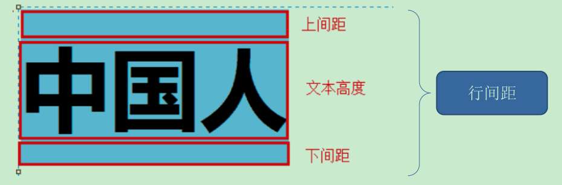
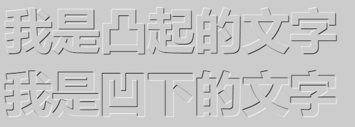

# CSS 常用样式手册

## 1. Fonts（字体样式）

### 1.1. 相关属性汇总表

|            功能             |    属性名    |
| --------------------------- | ----------- |
| 设置字体，本机必须要有这种字体 | font-family |
| 设置字体大小，单位：像素      | font-size   |
| 设置字体样式                 | font-style  |
| 设置字体粗细                 | font-weight |

建议：如果能使用样式，就不要使用标签。

### 1.2. font-size（字号大小）

`font-size`属性用于设置字号，该属性的值可以使用相对长度单位，也可以使用绝对长度单位。其中，相对长度单位比较常用，推荐使用像素单位px，绝对长度单位使用较少。具体如下：

```css
p {
    font-size: 18px;
}
```


> - 注意细节：
> 1. 谷歌浏览器默认的文字大小为16px
> 2. 不同浏览器可能默认显示的字号大小不一致，尽量给一个明确值大小，不要默认大小
> 3. 可以给 body 指定整个页面文字的大小

### 1.3. font-family（字体）

`font-family`属性用于设置字体。网页中常用的字体有宋体、微软雅黑、黑体等，例如将网页中所有段落文本的字体设置为微软雅黑，可以使用如下CSS样式代码：

```css
p { font-family:"微软雅黑"; }
```

可以同时指定多个字体，中间以逗号隔开，表示如果浏览器不支持第一个字体，则会尝试下一个，直到找到合适的字体。

**常用技巧**：

1. 现在网页中普遍使用14px+。
2. 尽量使用偶数的数字字号。ie6等老式浏览器支持奇数会有bug。
3. 各种字体之间必须使用英文状态下的逗号隔开。
4. 中文字体需要加英文状态下的引号，英文字体一般不需要加引号。当需要设置英文字体时，英文字体名必须位于中文字体名之前。
5. 如果字体名中包含空格、`#`、`$`等符号，则该字体必须加英文状态下的单引号或双引号，例`如font-family: "Times New Roman";`。
6. 尽量使用系统默认字体，保证在任何用户的浏览器中都能正确显示。

### 1.4. CSS Unicode 字体

在 CSS 中设置字体名称，直接写中文是可以的。但是在文件编码（GB2312、UTF-8 等）不匹配时会产生乱码的错误。xp 系统不支持 类似微软雅黑的中文。

- 方案一： 可以使用英文来替代。例如：`font-family:"Microsoft Yahei"`。
- 方案二： 在 CSS 直接使用 Unicode 编码来写字体名称可以避免这些错误。使用 Unicode 写中文字体名称，浏览器是可以正确的解析的。例如：`font-family: "\5FAE\8F6F\96C5\9ED1"`，表示设置字体为“微软雅黑”。

可以通过`escape()`来测试属于什么字体。*为了照顾不同电脑的字体安装问题，尽量只使用宋体和微软雅黑中文字体*

|  字体名称   |     英文名称     |      Unicode 编码      |
| ----------- | --------------- | ---------------------- |
| 宋体        | SimSun          | `\5B8B\4F53`           |
| 新宋体       | NSimSun         | `\65B0\5B8B\4F53`      |
| 黑体        | SimHei          | `\9ED1\4F53`           |
| 微软雅黑    | Microsoft YaHei | `\5FAE\8F6F\96C5\9ED1` |
| 楷体_GB2312 | KaiTi_GB2312    | `\6977\4F53_GB2312`    |
| 隶书        | LiSu            | `\96B6\4E66`           |
| 幼园        | YouYuan         | `\5E7C\5706`           |
| 华文细黑    | STXihei         | `\534E\6587\7EC6\9ED1` |
| 细明体       | MingLiU         | `\7EC6\660E\4F53`      |
| 新细明体    | PMingLiU        | `\65B0\7EC6\660E\4F53` |

### 1.5. font-weight（字体粗细）

字体加粗除了用`<b>`和`<strong>`标签之外，可以使用CSS来实现，但是CSS是没有语义的。

`font-weight`属性用于定义字体的粗细，其可用属性值：`normal`、`bold`、`bolder`、`lighter`、100~900（100的整数倍）。**注意：使用数值时，后面不能写单位**

```css
p {
    font-weight: bold;
}
```

> 小技巧：数字 400 等价于 normal，而 700 等价于 bold。一般更喜欢用数字来表示。

### 1.6. font-style（字体风格）

字体倾斜除了用`<i>`和`<em>`标签之外，可以使用CSS来实现，但是CSS是没有语义的。

`font-style`属性用于定义字体风格，如设置斜体、倾斜或正常字体，其可用属性值如下：

- `normal`：默认值，浏览器会显示标准的字体样式。
- `italic`：浏览器会显示斜体的字体样式。
- `oblique`：浏览器会显示倾斜的字体样式。

```css
p {
    font-style: normal;
}
```

> 小技巧：平时很少给文字加斜体，反而喜欢给斜体标签（`<em>`，`<i>`）改为普通模式。

### 1.7. font（综合设置字体样式）(重点)

`font`属性用于对字体样式进行综合设置，其基本语法格式如下：

```css
选择器 { font: font-style  font-weight  font-size/line-height  font-family; }
```

- **注意细节**：
- 使用`font`属性时，必须按上面语法格式中的顺序书写，<font color=red>**不能更换顺序**</font>，各个属性以<font color=red>**空格**</font>隔开。
- 其中不需要设置的属性可以省略（取默认值），但<font color=red>**必须保留`font-size`和`font-family`属性，否则`font`属性将不起作用**</font>。

## 2. Text（文本样式）

### 2.1. 相关属性汇总表

|   功能   |      属性名      |                                                       属性取值与作用                                                       |
| -------- | --------------- | ------------------------------------------------------------------------------------------------------------------------- |
| 颜色     | color           | 颜色常量，如：red<br />使用十六进制，如：#123<br />使用RGB(红，绿，蓝)函数                                                     |
| 设置行高 | line-height     | 单位：像素                                                                                                                 |
| 文字修饰 | text-decoration | **underline**：<u>下划线</u><br />**overline**：上划线<br />**line-through**：~~删除线，中划线~~<br />**none**：正常显示的文字 |
| 文本缩进 | text-indent     | 单位：em，用于缩进文本，如果设置2em，表示缩进2个字符，无论字符的大小                                                             |
| 文本对齐 | text-align      | **left：把文本排列到左边。默认值：由浏览器决定。**<br />**right**：把文本排列到右边。<br />**center**：把文本排列到中间。       |
| 文字间距 | letter-spacing  | 不同单位的数值，允许使用负值                                                                                                 |
| 单词间距 | word-spacing    | 不同单位的数值，允许使用负值                                                                                                 |

> <font color=red>**使用技巧**：在只一行文字的盒子内，设定文字的行高等于盒子的高度，就可以使文字垂直居中。</font>。注：如果盒子内有多行文字，则不无效

单行文字垂直居中的实现原理是：行高的上空隙和下空隙把文字挤到中间了；如果行高小于盒子高度，文字会偏上；如果行高大于盒子高度，则文字偏下。


### 2.2. color（文本颜色）

color属性用于定义文本的颜色，其取值方式有如下3种：

1. 预定义的颜色值，如red，green，blue等。
2. 十六进制，如`#FF0000`，`#FF6600`，`#29D794`等。实际工作中，十六进制是最常用的定义颜色的方式
3. RGB代码，如红色可以表示为`rgb(255,0,0)`或`rgb(100%,0%,0%)`

```css
div {
    color: red;
}
```

> 需要注意的是，如果使用RGB代码的百分比颜色值，取值为0时也不能省略百分号，必须写为0%。

### 2.3. 颜色半透明(css3)

在CSS3以后，文字颜色可以采取半透明的格式，其语法格式如下：

```css
color: rgba(r,g,b,a); /* 语法：a 是alpha  透明的意思  取值范围 0~1之间 */
color: rgba(0,0,0,0.3); /* 示例 */
```

### 2.4. line-height（行间距）

`line-height`属性用于设置行间距，就是行与行之间的距离，即字符的垂直间距，一般称为行高。`line-height`常用的属性值单位有三种，分别是：像素px，相对值em和百分比%，实际使用最多的是像素px

一般情况下，行距比字号大7.8像素左右就可以了。



```css
p {
    line-height: 26px;
}
```

### 2.5. text-align（水平对齐方式）

`text-align`属性用于设置文本内容的水平对齐，相当于html中的align对齐属性。其可用属性值如下：

- `left`：左对齐（默认值）
- `right`：右对齐
- `center`：居中对齐

```css
div {
    text-align: center;
}
```

### 2.6. text-indent（首行缩进）

`text-indent`属性用于设置首行文本的缩进，其属性值可为不同单位的数值、em字符宽度的倍数、或相对于浏览器窗口宽度的百分比%，允许使用负值, 建议使用em作为设置单位。

如：`1em`就是一个字的宽度，如果是汉字的段落，则`1em`就是一个汉字的宽度

```css
/* 通过设置该属性，所有元素的第一行都可以缩进一个给定的长度，甚至该长度可以是负值 */
div {
    text-indent: 10px;
}
/* em 是一个相对单位，就是当前元素（font-size) 1 个文字的大小, 如果当前元素没有设置大小，则会按照父元素的 1 个文字大小。 */
p {
    text-indent: 2em;
}
```

### 2.7. letter-spacing（字间距）

`letter-spacing`属性用于定义字间距，所谓字间距就是字符与字符之间的空白。其属性值可为不同单位的数值，允许使用负值，默认为`normal`。

### 2.8. word-spacing（单词间距）

`word-spacing`属性用于定义英文单词之间的间距，<font color=red>**对中文字符无效**</font>。和`letter-spacing`一样，其属性值可为不同单位的数值，允许使用负值，默认为`normal`。

`word-spacing`和`letter-spacing`均可对英文进行设置。不同的是`letter-spacing`定义的为字母之间的间距，而`word-spacing`定义的为英文单词之间的间距。

### 2.9. text-shadow（文字阴影）(CSS3)

css3以后，可以通过`text-shadow`属性给文字添加阴影效果，语法如下：

```css
text-shadow: h-shadow v-shadow blur color;
```

|     值     |             描述              |
| :--------: | ---------------------------- |
| `h-shadow` | 必需。水平阴影的位置。允许负值。 |
| `v-shadow` | 必需。垂直阴影的位置。允许负值。 |
|   `blur`   | 可选。模糊的距离。             |
|  `color`   | 可选。阴影的颜色。             |

### 2.10. text-decoration（文本装饰）

`text-decoration`属性用于设置装饰效果，如：下划线、中划线、上划线等，通常多用于给链接修改装饰效果，如属性如下：

|       值       |                     描述                     |
| :------------: | -------------------------------------------- |
|     `none`     | 默认。定义标准的文本                           |
|  `underline`   | 定义文本下的一条线。(下划线也是链接自带的)       |
|   `overline`   | 定义文本上的一条线                             |
| `line-through` | 定义穿过文本中间的一条线                        |
|    `blink`     | 定义闪烁的文本                                |
|   `inherit`    | 规定应该从父元素继承 `text-decoration` 属性的值 |

```css
a {
    /* 取消<a>标签默认的下划线(最常用) */
    text-decoration: none;
}
```

### 2.11. 字体样式案例

#### 2.11.1. 凹凸文字案例

```html
<!DOCTYPE html>
<html lang="en">
  <head>
    <meta charset="UTF-8" />
    <meta name="viewport" content="width=device-width, initial-scale=1.0" />
    <title>Document</title>
    <style>
      body {
        background-color: #ccc;
      }
      div {
        color: #ccc;
        font: 700 80px "微软雅黑";
      }
      div:first-child {
        /* text-shadow: 水平位置 垂直位置 模糊距离 阴影颜色; */
        text-shadow: 1px 1px 1px #000, -1px -1px 1px #fff;
      }
      div:last-child {
        /* text-shadow: 水平位置 垂直位置 模糊距离 阴影颜色; */
        text-shadow: -1px -1px 1px #000, 1px 1px 1px #fff;
      }
    </style>
  </head>
  <body>
    <div>我是凸起的文字</div>
    <div>我是凹下的文字</div>
  </body>
</html>
```



#### 2.11.2. 导航栏案例

```html
<!DOCTYPE html>
<html lang="en">
  <head>
    <meta charset="UTF-8" />
    <meta name="viewport" content="width=device-width, initial-scale=1.0" />
    <title>Document</title>

    <style>
      body {
        background-color: #000;
      }
      a {
        width: 200px;
        height: 50px;
        /* background-color: orange; */
        display: inline-block; /* 把a行内元素转换为行内块元素 */
        text-align: center; /* 文字水平居中 */
        line-height: 50px; /* 设定行高等于盒子的高度，就可以使文字垂直居中 */
        color: #fff;
        font-size: 22px;
        text-decoration: none; /* 取消下划线 文本装饰 */
      }
      a:hover {
        /* 鼠标经过给链接添加背景图片 */
        background: url(images/h.png) no-repeat;
      }
    </style>
  </head>
  <body>
    <a href="#">专区说明</a>
    <a href="#">申请资格</a>
    <a href="#">兑换奖励</a>
    <a href="#">下载游戏</a>
  </body>
</html>
```

## 3. Backgrounds（背景样式）

CSS 背景属性用于定义HTML元素添加背景颜色和背景图片，以及来进行图片设置。

### 3.1. Backgrounds相关属性

|         属性名         |      作用       |
| --------------------- | -------------- |
| background-color      | 背景颜色        |
| background-image      | 背景图片地址     |
| background-repeat     | 平铺方式        |
| background-position   | 背景位置        |
| background-attachment | 背景固定还是滚动 |

**背景的合写（复合属性）**

```css
background:背景颜色 背景图片地址 背景平铺 背景滚动 背景位置
```

### 3.2. 背景颜色 (background-color)

`background-color`属性定义了元素的背景颜色。

```css
background-color: transparent | 颜色值;
```

- 颜色取值：
1. 颜色常量，如：red
2. 使用十六进制，如：#FF0
3. 使用RGB(红,绿,蓝)每个颜色取值是0~255
4. 一般情况下元素背景颜色默认值是`transparent`（透明），也可以手动指定背景颜色为透明色

```css
div {
    /* 不设置背景颜色，也有默认值为transparent */
    background-color: transparent;
}
```

### 3.3. 背景图片 (background-image)

`background-image`属性描述了元素的背景图像。实际开发常见于logo或者一些装饰性的小图片或者是超大的背景图片，其优点是非常便于控制位置。

**语法**：

```css
background-image: none | url(图片url或者相对路径);
```

**属性值说明**：

- `none`：无背景图（默认的）
- `url`：使用绝对或相对地址指定背景图像

`background-image` 属性允许指定一个图片展示在背景中（只有CSS3才可以多背景）可以和 `background-color` 连用。如果图片不重复地话，图片覆盖不到地地方都会被背景色填充。如果有背景图片平铺，则会覆盖背景颜色。

> 小技巧：提倡背景图片后面的地址，url不要加引号。

### 3.4. 背景平铺 (background-repeat)

`background-repeat` 属性可以设置HTML页面上元素的背景图像进行平铺。

**语法**：

```css
background-repeat: repeat | no-repeat | repeat-x | repeat-y;
```

属性值：

- `repeat`：背景图像在纵向和横向上平铺（默认的）
- `no-repeat`：背景图像不平铺，背景图像将仅显示一次
- `repeat-x`：背景图像在横向上平铺
- `repeat-y`：背景图像在纵向平铺

> *注：设置背景图片时，默认把图片在水平和垂直方向平铺以铺满整个元素。*

### 3.5. 背景位置 (background-position)

`background-position` 属性可以改变图片在背景中的位置

**语法**：

```css
background-position: length || length;
background-position: position || position;
```

**属性值**：

- `length`: 　百分数 | 由浮点数字和单位标识符组成的长度值。请参阅长度单位
- `position`: top | center | bottom | left | center | right，方位名词

> 说明：设置或检索对象的背景图像位置。必须先指定`background-image`属性。默认值为：(0% 0%)。如果只指定了一个值，该值将用于横坐标。纵坐标将默认为50%。第二个值将用于纵坐标。

- **注意的细节**：
1. 参数是方位名词
    - position 的方位名词默认值是`left top`
    - 如果指定的两个值都是方位名词，则两个值前后顺序无关，比如 `left top` 和 `top left` 效果一致
    - 如果只指定了一个方位名词，另一个值省略，则第二个值默认居中对齐
2. 参数是精确单位
    - 如果参数值是精确坐标，那么第一个肯定是 x 坐标，第二个一定是 y 坐标
    - 如果只指定一个数值，那该数值一定是x坐标，另一个默认垂直居中
3. 参数是混合单位
    - 如果和精确单位和方位名字混合使用，则必须是x坐标在前，y坐标后面。比如`background-position: 15px top;`则 15px 一定是x坐标，top是y坐标。

### 3.6. 背景固定与滚动 (background-attachment)

`background-attachment` 属性设置背景图像是否固定或者随着页面的其余部分滚动

**语法**：

```css
background-attachment: scroll | fixed;
```

**属性值**：

- `scroll`：背景图像是随对象内容滚动
- `fixed`：背景图像固定

### 3.7. 背景属性简写 (background)

`background`属性的值的书写顺序官方并没有强制标准的。为了可读性，建议如下写法：

```css
background: 背景颜色 背景图片地址 背景平铺 背景滚动 背景位置;
```

### 3.8. 背景透明 (CSS3)

CSS3支持背景半透明的写法，语法格式是:

```css
background: rgba(0,0,0,0.3);
```

最后一个参数是alpha透明度，取值范围0~1之间

> **注意：背景半透明是指盒子背景半透明，盒子里面的内容不收影响**。
>
> *CSS3 新增属性，是 IE9+ 版本浏览器才支持的*

### 3.9. 背景线性渐变 (CSS3)


**语法**：

```css
background: linear-gradient(起始方向, 颜色1, 颜色2, ...);
```

**注意**：

- 背景渐变必须添加浏览器私有前缀
- 起始方向可以是：方位名词或者度数，如果省略默认就是`top`

**示例**：

```html
<style>
    div {
        width: 600px;
        height: 200px;
        /* 背景渐变必须添加浏览器私有前缀 */
        /* background: -webkit-linear-gradient(left, red, blue); */
        /* background: -webkit-linear-gradient(red, blue); */
        background: -webkit-linear-gradient(top left, red, blue);
    }
</style>

<body>
    <div></div>
</body>
```

### 3.10. 背景缩放 (background-size)(CSS3)

通过`background-size`设置背景图片的尺寸，就像设置img的尺寸一样，在移动Web开发中做屏幕适配应用非常广泛。

**语法**：

```css
background-size: length|percentage|cover|contain;
```

**参数设置**：

1. 可以设置长度单位(px)或百分比

|      值      |                                                                       描述                                                                       |
| :----------: | ------------------------------------------------------------------------------------------------------------------------------------------------ |
|   `length`   | 设置背景图像的高度和宽度。第一个值设置宽度，第二个值设置高度。如果只设置一个值，则第二个值会被设置为"auto"                                                  |
| `percentage` | 以父元素的百分比来设置背景图像的宽度和高度。第一个值设置宽度，第二个值设置高度。如果只设置一个值，则第二个值会被设置为"auto"。（*设置百分比时，参照盒子的宽高*）  |
|   `cover`    | 会自动调整缩放比例，把背景图像扩展至足够大，保证背景图像始终填充满背景区域。背景图像的某些部分也许无法显示在背景定位区域中，溢出部分则会被隐藏。（*平时使用最多*） |
|  `contain`   | 会自动调整缩放比例，把图像图像扩展至最大尺寸，以使其宽度和高度完全适应内容区域，保证图片始终完整显示在背景区域。                                             |

**示例**：

```css
background-image: url('images/gyt.jpg');
background-size: 300px 100px;
/* background-size: contain; */
/* background-size: cover; */
```

### 3.11. 多背景 (CSS3)

CSS3以后，以逗号分隔可以设置多背景，可用于自适应布局

- 一个元素可以设置多重背景图像。
- 每组属性间使用逗号分隔。
- 如果设置的多重背景图之间存在着交集（即存在着重叠关系），前面的背景图会覆盖在后面的背景图之上。
- 为了避免背景色将图像盖住，背景色通常都定义在最后一组上，

```css
background: url(test1.jpg) no-repeat scroll 10px 20px/50px 60px,
    	    url(test1.jpg) no-repeat scroll 10px 20px/70px 90px,
    	    url(test1.jpg) no-repeat scroll 10px 20px/110px 130px c #aaa;
```

## 4. List（列表）

复合属性。用于设置列表相关的样式。如`<ul><li>`、`<ol><li>`等列表类型元素

### 4.1. list-style（列表样式）

**语法**：

```css
list-style：<' list-style-type '> || <' list-style-position '> || <' list-style-image '>;
```

**属性取值**：

- `list-style-type`：设置或检索对象的列表项所使用的预设标记
- `list-style-position`：设置或检索作为对象的列表项标记如何根据文本排列
- `list-style-image`：设置或检索作为对象的列表项标记的图像

示例：取消`<ul>`列表的默认样式小点

```css
li {
    /* 去掉li列表的默认样式小点 */
    list-style: none;
}
ul {
    list-style: square inside url('/i/arrow.gif');
}
```

## 5. transform（2D 转换）（CSS3）

转换（transform）是CSS3中具有颠覆性的特征之一，可以实现元素的位移（translate）、旋转（rotate）、缩放（scale）等效果

### 5.1. 二维坐标系

2D转换是改变标签在二维平面上的位置和形状的一种技术


### 5.2. 2D 转换之移动 translate

2D移动是2D转换里面的一种功能，可以改变元素在页面中的位置，类似定位。

**语法**：

```css
/* 设置x与y轴的位置，如果只想往一个方向移动，不移动的方向属性设置为0。需要注意的是，不能省略不写 */
transform: translate(x,y);
/* 单独设置x与y轴 */
transform: translateX(n);
transform: translateY(n);
```

**重点**：

- 定义 2D 转换中的移动，沿着 X 和 Y 轴移动元素
- <font color=red>**translate最大的优点：不会影响到其他元素的位置**</font>
- translate中的百分比单位是相对于元素自身的高度/宽度 `translate:(50%,50%);`
- 对行内标签没有效果

### 5.3. 2D 转换之旋转 rotate

2D旋转指的是让元素在2维平面内顺时针旋转或者逆时针旋转

**语法**：

```css
transform:rotate(度数)
```

**重点**：

- rotate里面跟度数，单位是 deg 比如`rotate(45deg)`。*注意单位不能省略*
- 角度为正数时，顺时针旋转；负数时，为逆时针旋转
- 默认旋转的中心点是元素的中心点

### 5.4. 2D 转换中心点 transform-origin

该属性用于设置元素转换的中心点

**语法**：

```css
transform-origin: x y;
```

**重点**：

- 注意属性值中的 x 和 y 用空格隔开
- x 和 y 默认转换的中心点是元素的中心点 (50% 50%)
- 可以给 x y 设置像素或者方位名词（top bottom left right center）

### 5.5. 2D 转换之缩放 scale

元素添加上该属性后，就能控制放大或者缩小

**语法**：

```css
transform:scale(x,y);
```

**重点**：

- 注意其中的x和y用逗号分隔
- `sacle`缩放最大的优势：可以设置转换中心点缩放，默认以中心点缩放的，而且不影响其他盒子

```css
/* 宽和高都放大一倍，相对于没有放大 */
transform:scale(1,1);
/* 宽和高都放大了2倍 */
transform:scale(2,2);
/* 只写一个参数，第二个参数则和第一个参数一样，相当于 scale(2,2) */
transform:scale(2);
/* 缩小 */
transform:scale(0.5,0.5);
```

### 5.6. 2D 转换综合写法

2D转换可以同时使用多个转换，语法格式：

```css
transform: translate() rotate() scale()...等;
```

**重点**：

- 其顺序会影转换的效果。（先旋转会改变坐标轴方向）
- <font color=red>**当同时有位移和其他属性的时候，记得要将位移放到最前**</font>

## 6. animation（动画）（CSS3）

动画（animation）是CSS3中具有颠覆性的特征之一，可通过设置多个节点来精确控制一个或一组动画，常用来实现复杂的动画效果。

相比较过渡，动画可以实现更多变化，更多控制，连续自动播放等效果。

### 6.1. 动画的基本使用与语法

制作动画分为两步：

1. 先定义动画
2. 再使用（调用）动画

用`keyframes` 定义动画（类似定义类选择器）。语法：

```css
@keyframes 动画名称 {
    /* 开始状态 */
    0% {
        此状态下的样式...
    }
    /* 结束状态 */
    100% {
        此状态下的样式...
    }
}
```

元素使用动画的语法：

```css
元素 {
    其他样式...
    /* 调用动画 */
    animation-name: 动画名称; /* 动画名称 */
    animation-duration: 时长; /* 持续时间，单位：秒(s) */
}
```


### 6.2. 动画序列

- `0%` 是动画的开始，`100%` 是动画的完成。这样的规则就是动画序列。
- 在 `@keyframes` 中规定某项 CSS 样式，就能创建由当前样式逐渐改为新样式的动画效果。
- 动画是使元素从一种样式逐渐变化为另一种样式的效果。<font color=red>**可以改变任意多的样式任意多的次数**</font>。
- 使用百分比来规定变化发生的时间，或用关键词 "`from`" 和 "`to`"，等同于 `0%` 和 `100%`。

### 6.3. 动画常用属性

|            属性             | 描述                                                             |
| :-------------------------: | :--------------------------------------------------------------- |
|        `@keyframes`         | 规定动画                                                          |
|         `animation`         | 所有动画属性的简写属性，除了`animation-play-state`属性              |
|      `animation-name`       | 规定`@keyframes`动画的名称。（必须的）                              |
|    `animation-duration`     | 规定动画完成一个周期所花费的秒或毫秒，默认是0。（必须的）              |
| `animation-timing-function` | 规定动画的速度曲线，默认是“`ease`”                                  |
|      `animation-delay`      | 规定动画何时开始，默认是0                                          |
| `animation-iteration-count` | 规定动画被播放的次数，默认是1，`infinite`代表无限次                  |
|    `animation-direction`    | 规定动画是否在下一周期逆向播放，默认是"`normal`",`alternate`逆播放    |
|   `animation-play-state`    | 规定动画是否正在运行或暂停。默认是"`running`",还有"`paused`"         |
|    `animation-fill-mode`    | 规定动画结束后状态，回到起始是`backwards`（默认值），保持是`forwards` |

**速度曲线属性的细节**

|     属性      | 描述                                     |
| :-----------: | :-------------------------------------- |
|   `linear`    | 动画从头到尾的速度是相同的，即匀速          |
|    `ease`     | 默认。动画以低速开始，然后加快，在结束前变慢 |
|   `ease-in`   | 动画以低速开始                            |
|  `ease-out`   | 动画以低速结束                            |
| `ease-in-out` | 动画以低速开始和结束                      |
|   `steps()`   | 指定了时间函数中的间隔数量（步长）          |

### 6.4. 动画简写属性

```css
animation: 动画名称 持续时间 运动曲线 何时开始 播放次数 是否反方向 动画起始或者结束的状态;
```

小结

- 简写属性里面不包含 `animation-play-state`
- 暂停动画：`animation-play-state: puased;` 经常和鼠标经过等其他配合使用
- 想要动画走回来，而不是直接跳回来：`animation-direction: alternate`
- 盒子动画结束后，停在结束位置：`animation-fill-mode: forwards`

## 7. 3D 转换（CSS3）

### 7.1. 三维坐标系

三维坐标系其实就是指立体空间，立体空间是由3个轴共同组成的。


- x轴：水平向右 <font color=red>**注意：x 右边是正值，左边是负值**</font>
- y轴：垂直向下 <font color=red>**注意：y 下面是正值，上面是负值**</font>
- z轴：垂直屏幕 <font color=red>**注意：往外面是正值，往里面是负值**</font>

### 7.2. 3D移动 translate3d

3D移动在2D移动的基础上多加了一个可以移动的方向，就是z轴方向。

- `translform:translateX(数值px)`：仅仅是在x轴上移动
- `translform:translateY(数值px)`：仅仅是在Y轴上移动
- `translform:translateZ(数值px)`：仅仅是在Z轴上移动（注意：`translateZ`一般用px单位）
- `transform:translate3d(x,y,z)`：其中 x、y、z 分别指要移动的轴的方向的距离

> 注：因为z轴是垂直屏幕，由里指向外面，所以默认是看不到元素在z轴的方向上移动。如果设置了透视，就能看到 `translateZ` 属性引起的变化了。
>
> - `translateZ`：近大远小
> - `translateZ`：往外是正值
> - `translateZ`：往里是负值

### 7.3. 透视 perspective

在2D平面产生近大远小视觉立体，但是只是效果二维的

- 如果想要在网页产生3D效果需要透视（理解成3D物体投影在2D平面内）。
- 模拟人类的视觉位置，可认为安排一只眼睛去看
- 透视也称为视距：视距就是人的眼睛到屏幕的距离
- 距离视觉点越近的在电脑平面成像越大，越远成像越小
- 透视的单位是像素


<font color=red>**透视写在被观察元素的父盒子上面的**</font>

- d：就是视距，视距就是一个距离人的眼睛到屏幕的距离。
- z：就是 z轴，物体距离屏幕的距离，z轴越大（正值） 我们看到的物体就越大。

### 7.4. 3D旋转 rotate3d

#### 7.4.1. 语法定义

3D旋转指可以让元素在三维平面内沿着 x轴，y轴，z轴或者自定义轴进行旋转。语法如下：

- `transform:rotateX(45deg)`：沿着x轴正方向旋转 45度
- `transform:rotateY(45deg)`：沿着y轴正方向旋转 45度
- `transform:rotateZ(45deg)`：沿着Z轴正方向旋转 45度
- `transform:rotate3d(x,y,z,deg)`：沿着自定义轴旋转 deg为角度（了解即可）
    - xyz是表示旋转轴的矢量，是标示是否希望沿着该轴旋转，最后一个标示旋转的角度。
    - `transform:rotate3d(1,0,0,45deg)` 就是沿着x轴旋转 45deg
    - `transform:rotate3d(1,1,0,45deg)` 就是沿着对角线旋转 45deg

#### 7.4.2. 旋转的方向 - 左手准则

对于元素旋转的方向的判断，可以通过左手准则来确定。

**X轴转动方向**

- 左手的手拇指指向x轴的正方向
- 其余手指的弯曲方向就是该元素沿着x轴旋转的方向（正值）

**Y轴转动方向**

- 左手的手拇指指向y轴的正方向
- 其余手指的弯曲方向就是该元素沿着y轴旋转的方向（正值）


### 7.5. 3D呈现 transfrom-style

该属性用于控制子元素是否开启三维立体环境。（*此很重要*）

```css
transform-style: flat|preserve-3d;
```

|      值       |                      描述                       |
| :-----------: | ----------------------------------------------- |
|    `flat`     | 子元素将不保留其 3D 位置，即不开启3d立体空间。默认值 |
| `preserve-3d` | 子元素将保留其 3D 位置，即开启立体空间             |

<font color=red>**此属性需要定义在父级元素，但是影响的是子级元素**</font>。

## 8. CSS3 其他新特性（了解）

### 8.1. filter 滤镜

filter CSS属性将模糊或颜色偏移等图形效果应用于元素

语法：

```css
filter: 函数();
```

```css
/* blur模糊处理 数值越大越模糊 */
filter: blur(5px);
```

### 8.2. calc 函数

`calc()` 此CSS函数可以在声明CSS属性值时执行一些计算。括号里面可以使用 `+ - * /` 来进行计算，*注：需要写单位*

```css
width: calc(100% - 80px);
```

### 8.3. transition 过渡（重点）

过渡（transition)是CSS3中具有颠覆性的特征之一，用于设置当元素从一种样式变换为另一种样式时为元素添加效果。

过渡动画：是从一个状态 渐渐的过渡到另外一个状态，<font color=red>经常和`:hover`一起搭配使用</font>

- 语法：

```css
transition: 要过渡的属性 花费时间 运动曲线 何时开始;
```

1. 过渡的属性：想要变化的 css 属性，宽度高度、背景颜色、内外边距都可以 。如果想要所有的属性都变化过渡，写一个all即可
2. 花费时间：单位是秒（必须写单位） 比如 0.5s
3. 运动曲线：默认是 `ease` （可以省略）
4. 何时开始：单位是秒（必须写单位）可以设置延迟触发时间 默认是 0s （可以省略）

> <font color=red>**注：谁做过渡给谁加**</font>

示例：

```html
<head>
  <style>
    div {
      width: 200px;
      height: 100px;
      background-color: pink;
      /* transition: 变化的属性 花费时间 运动曲线 何时开始; */
      /* transition: width .5s ease 0s, height .5s ease 1s; */
      /* 如果想要写多个属性，利用逗号进行分割 */
      /* transition: width .5s, height .5s; */
      /* 如果想要多个属性都变化，属性写all就可以了 */
      /* transition: height .5s ease 1s; */
      /* 谁做过渡，给谁加 */
      transition: all 0.5s;
    }
    div:hover {
      width: 400px;
      height: 200px;
      background-color: skyblue;
    }
  </style>
</head>
<body>
  <div></div>
</body>
html>
```

## 9. CSS选择器和常用样式案例练习


- 需求：
1. body全文字体大小14px; 颜色：#333，行高30px
2. 诗放在div的层中，宽400px
3. 标题放在h1中，文字大小18px，颜色#06F，居中对齐
4. 每段文字缩进2em（em是一个相对度量单位，相当于缩进2个字）
5. 段中的行高是22px
6. "胸怀中满溢着幸福，只因你就在我眼前",加粗，倾斜，蓝色，鼠标移上去指针变成手的形状。
7. 最后一段，颜色#390; 下划线，鼠标移上去指针变化。
8. 美字加粗，颜色color:#F36，大小18px;
9. 文/席慕容，三个字，12px，颜色#999，不加粗

```html
<!DOCTYPE html>
<html>
	<head>
		<meta charset="UTF-8">
		<title>诗歌排版</title>
		<!--使用外部样式-->
		<link rel="stylesheet" href="../css/Day29Test01_02.css" type="text/css" />
	</head>
	<body>
		<div>
			<h1>初相遇&nbsp;&nbsp;<span>文/席慕容</span></h1>
			<p><sanp id="mei">美</sanp>丽的梦和美丽的诗一样，都是可遇而不可求的，常常在最没能料到的时刻里出现。</p>
			<p>
				我喜欢那样的梦，在梦里，一切都可以重新开始，一切都可以慢慢解释，心里甚至还能感觉到，
				所有被浪费的时光竟然都能重回时的狂喜与感激。<span class="blue">胸怀中满溢着幸福，只因你就在我眼前，</span>对我微笑，一如当年。
			</p>
			<p id="last">
				我喜欢那样的梦，明明知道你已为我跋涉千里，却又觉得芳草鲜美，落落英缤纷，好像你我才初相遇。
			</p>
		</div>
	</body>
</html>
```

```css
/* 标签选择器 */
body{
	font-size: 14px;
	color: #333;
	line-heiht: 30px;
	font-family:Verdana, Arial, Helvetica, sans-serif;
}

div{
	width: 400px;
}

h1{
	font-size: 18px;
	color: #06F;
	text-align: center;
}

p{
	text-indent: 2em;
	line-height: 22px;
}

/* 类选择器 */
.blue{
	font-size:16px;
	font-weight: bolder;
	font-style: italic;
	color: blue;
	cursor:pointer;
}


/* id选择器 */
#last{
	color: #390;
	text-decoration: underline;
	cursor: crosshair;
}

#mei{
	color: #F36;
	font-size: 18px;
}

/* 使用层级选择器 */
h1 span{
	font-size: 12px;
	color: #999;
	font-style: normal;
}
```
