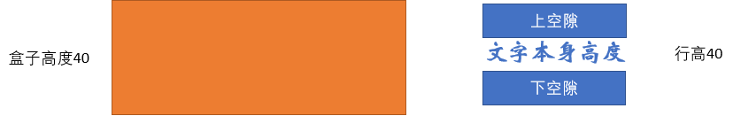
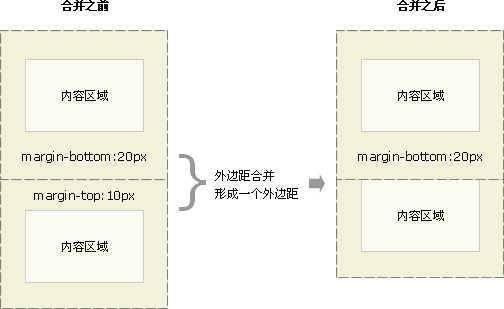
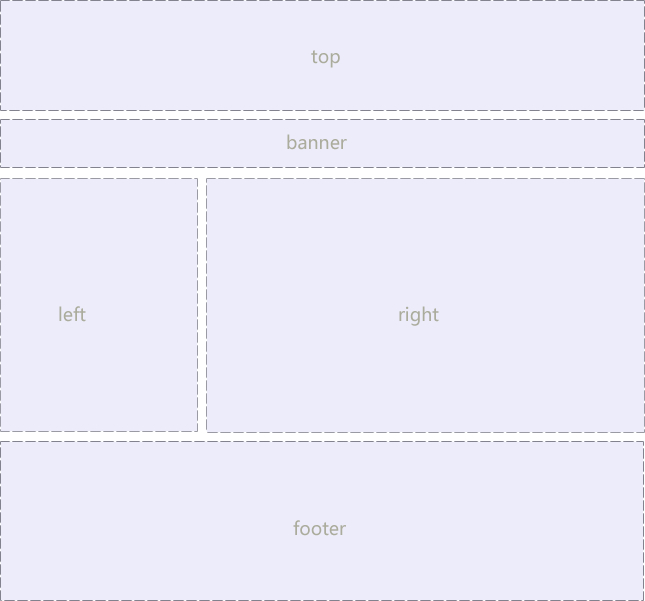
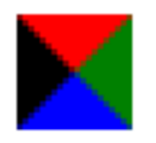

# CSS 层叠样式表

## 1. CSS概述
### 1.1. CSS概念

1. CSS 是层叠样式表 ( Cascading Style Sheets ) 的简称
	- **样式**：给HTML标签添加需要显示的效果
	- **层叠**：使用不同的添加方式，给同一个HTML标签添加样式，最后所有的样式都叠加到一起，共同作用于该标签。
2. CSS 是一种标记语言，属于浏览器解释型语言，可以直接由浏览器执行，不需要编译
3. CSS 是用来表现HTML或XML的标记语言
4. CSS 是由W3C的CSS工作组发布推荐和维护的
5. 运用CSS样式可以让页面变得美观
6. CSS语法由三部分构成：选择器、属性和值：`selector {property: value}`

### 1.2. CSS美化相对HTML美化的好处

1. 功能上更加强大，可以实现HTML中无法实现的美化功能
2. 降低了HTML与CSS代码耦合度，将数据的显示与数据的装饰进行了分离
    - HTML：用于网页的结构创建
    - CSS：用于网页的美化，分工更加明确

### 1.3. CSS的编写规范

- 属性名：所有单词全部小写，如果一个属性名有多个单词，单词之间使用 (`-`) 分隔
- 属性值：所有的属性值都是固定的，每个属性名可以有多个属性值，样式名与样式值之间使用冒号 (`:`) 隔开
- 多个样式之间：使用分号 (`;`) 分隔
- 注释：`/**/`，类似java中的多行注释

### 1.4. div概述

- `<div></div>`标签是HTML一个普通标签，进行区域划分。特性：独自占一行。独自不能实现复杂效果。必须结合CSS样式进行渲染。
- div通常是其是块标签
    - `<div>`可定义文档中的分区或节（division/section）。
    - `<div>`标签可以把文档分割为独立的，不同的部分。它可以用作严格的组织工具，并且不使用任何格式与其关联。
    - 如果用id或class来标记`<div>`，那么该标签的作用会变得更加有效。

### 1.5. 引入CSS样式表（CSS代码的位置）

#### 1.5.1. 行内样式表（行内式）

行内样式表（内联样式表）是<font color=red>**在元素标签内部的`style`属性中设定CSS样式**</font>。适合于修改简单样式

这种样式方式的特点是：出现在标签的一行中，以**标签的style属性的方式**存在，只对这一个标签起作用。多个样式属性使用`;`分隔

```html
<h3 style="color:green">学生成绩</h3>
```

**细节**：

- style 其实就是标签的属性
- 在双引号中间，写法要符合 CSS 规范
- 只能控制当前的标签设置样式
- 由于书写繁琐，并且没有体现出结构与样式相分离的思想，所以不推荐大量使用，只有对当前元素添加简单样式的时候，可以考虑使用
- 使用行内样式表设定 CSS，通常也被称为行内式引入

#### 1.5.2. 内部样式表（嵌入式）

内部样式表（内嵌样式表）是写到html页面内部。是将所有的 CSS 代码抽取出来，单独放到一个 `<style>` 标签中。

其特点是：以**style标签**的方式存在于网页中，对网页中的指定的标签起作用。一般是**在head标签中**，多个样式使用`;`分隔

语法格式

```html
<style type="text/css">
	css选择器 {
	    属性名: 属性值;
	    ......
	}
</style>
```

- 示例

```html
<head>
	<meta charset="UTF-8">
	<title></title>
	<style type="text/css">
		td {
			text-align: center;
		}
	</style>
</head>
```

**细节**：

- `<style>` 标签理论上可以放在 HTML 文档的任何地方，但一般会放在文档的`<head>`标签中
- 通过此种方式，可以方便控制当前整个页面中的元素样式设置。代码结构清晰，但是并没有实现结构与样式完全分离
- 使用内部样式表设定 CSS，通常也被称为**嵌入式引入**

#### 1.5.3. 外部样式表（链接式）

##### 1.5.3.1. 使用步骤

开发最常用的是外部样式。样式单独写到CSS文件中，与HTML分开。使用时外部样式需要导入到HTML中

- 引入外部样式表分为两步：
1. 新建一个后缀名为`.css`的样式文件，把所有CSS代码都放入此文件中。
2. 在HTML页面中，使用`<link>`标签引入这个文件。

##### 1.5.3.2. 引入方式

1. **引入方式一(常用的方式)**

```html
<link rel="stylesheet" href="css/xx.css" type="text/css" />
```

> 注意：`<link>` 是个单标签哦！！！不需要写在style标签中

该语法中，link标签需要放在head头部标签中，并且必须指定link标签的三个属性，具体如下：

- `rel`: CSS与HTML之间的关系是样式表，这个属性必须加，不然没有效果，取值：stylesheet
- `href`: 定义所链接外部样式表文件的URL（即要导入的CSS文件的地址），可以是相对路径，也可以是绝对路径。
- `type`: 表示文本文件的类型，MIME类型，指定这是一个CSS文件类型，在这里需要指定为“text/CSS”，表示链接的外部文件为CSS样式表。（*一般可以省略不写*）

2. **引入方式二(使用较少)**，写在style标签中。

```html
<style type="text/css">
	@import url("css/out.css");
</style>
```

3. **优先级：就近原则**，后面的样式会将前面的<u>同名</u>样式覆盖。

*写到CSS文件的选择器不需要放到`<style>`标签中*

#### 1.5.4. 三种样式表总结

|   样式表   |          优点          |          缺点          |   使用情况    |     控制范围      |
| --------- | --------------------- | --------------------- | ------------ | ---------------- |
| 行内样式表 | 书写方便，权重高        | 没有实现样式和结构相分离 | 较少          | 控制一个标签（少） |
| 内部样式表 | 部分结构和样式相分离     | 没有彻底分离            | 较多          | 控制一个页面（中） |
| 外部样式表 | 完全实现结构和样式相分离 | 需要引入               | 最多，强烈推荐 | 控制整个站点（多） |

## 2. CSS 的选择器
### 2.1. 选择器的作用

对HTML中的元素使用样式之前，先选中要操作的元素。选择器作用就是用来选中要操作的元素。

### 2.2. 选择器基础语法格式

```CSS
选择器名 {
	样式名1：样式值;
	样式名2：样式值;
	样式名3：样式值;
	......
}
```

### 2.3. 基本选择器（重点）

一般定义在`<head>`标签中，`<style>`标签内

#### 2.3.1. 标签选择器

<font color=red>**标签选择器（元素选择器）是指用 HTML 标签名称作为选择器，按标签名称分类**</font>，为页面中某一类标签指定统一的 CSS 样式。

- **作用**：标签选择器可以通过标签的名字选中全部某一类标签元素，比如所有的 `<div>` 标签和所有的 `<span>` 标签。
- **语法格式**：

```css
/* 语法格式 */
标签名 {
	样式名1：样式值;
	样式名2：样式值;
	......
}
/* 示例 */
h3 {
	color: green;
}
```

- **细节**：以标签的名字做为选择器，同时选中所有相同的标签
- **优点**：能快速为页面中同类型的标签统一设置样式。
- **缺点**：不能设计差异化样式，只能选择全部的当前标签。

#### 2.3.2. 类选择器

##### 2.3.2.1. 类选择器-单类名

- **作用**：通过分类名选中元素
- **使用类选择器前提**：使用类选择器之前，首先要给元素进行分类。给这些标签添加一个class属性
- **命名**：**类名不能以数字开头**
- **语法格式**:**（注意“.”不能少）**

```css
/* 类选择器格式 */
.类名 {
    属性1: 属性值1;
    ...
}
```

```html
<!-- 类选择器示例 -->
<head>
	<meta charset="UTF-8">
	<title></title>
	<style>
		.first {
			color:yellow;
		}
	</style>
</head>
<body>
	<div class="first">
		这是一个div
	</div>
</body>
```

- **注意的细节**：
1. 分类的命名：不能以数字开头
2. 优先级：类选择器 > 标签选择器
3. 长名称或词组可以使用中横线来为选择器命名
4. 不要使用纯数字、中文等命名，尽量使用英文字母来表示

- **多类名开发中使用场景**
1. 可以把一些标签元素相同的样式(共同的部分)放到一个类里面
2. 这些标签都可以调用这个公共的类的样式，然后再调用自己独有的类样式
3. 节省CSS代码，统一修改也非常方便

##### 2.3.2.2. 类选择器-多类名

一个标签指定多个类名，从而达到更多的选择目的。这些类名都可以选出这个标签。简单理解就是一个标签有多个名字。

- **语法格式**

```html
<div class="red font20">我是有多类名的div</div>
```

- **注意细节**：
1. 在标签class属性中写多个类名
2. 多个类名中间必须用空格分开
3. 这个标签就可以分别具有这些类名的样式

#### 2.3.3. ID选择器

- **作用**：ID 选择器可以为标有特定 ID 的 HTML 元素指定特定的样式
- **使用ID选择器的前提**：HTML元素以ID属性来设置ID选择器的名称，CSS中ID选择器以`#`来定义。
- **细节**：<font color=red>**id 属性只能在每个HTML文档中出现一次。CSS样式使用`#`来定义，页面元素使用`id`属性来调用，只能一个元素使用。**</font>（建议id属性唯一，在一个网页中最好不要出现同名的id）
- **ID选择器语法格式**:

```css
/* id选择器语法格式 */
#id名 {
    属性1: 属性值1;
    ...
}
```

```html
<!-- ID选择器示例 -->
<head>
	<meta charset="UTF-8">
	<title></title>
	<style>
		/* id选择器 */
		#p1{
			color: red;
		}
	</style>
</head>
<body>
	<!-- 使用了三种选择器，显示id的效果 -->
	<p id="p1" class="first">这是第三段</p>
</body>
```

#### 2.3.4. 通配符选择器

在CSS中，通配符选择器使用`*`定义，它表示选取页面中所有元素（标签）

- 语法结构

```css
* {
    属性1: 属性值1;
    ...
}
```

- **注意细节**：
1. 通配符选择器不需要调用，自动就给所有的元素使用样式
2. 特殊情况才使用，如下例，清除所有的元素标签的内外边距

```css
* {
    margin: 0;
    padding: 0;
}
```

#### 2.3.5. 总结

##### 2.3.5.1. id 选择器和类选择器的区别

1. 类选择器（class），一个页面元素可以有多个class名字，同时一个class样式也可以被多个页面元素使用
2. ID选择器是唯一的，不能重复，只能给一个页面元素使用
3. ID选择器和类选择器最大的不同在于使用次数上
4. 类选择器在修改样式中用的最多，ID选择器一般用于页面唯一性的元素上，经常和 JavaScript 搭配使用

##### 2.3.5.2. 4种基础选择器的区别

|  基础选择器  |            作用            |              特点              |       用法示例        |
| :---------: | -------------------------- | ----------------------------- | -------------------- |
|  标签选择器  | 选出所有相同类型的标签        | 不能差异化选择                  | `p {color: red;}`    |
|   类选择器   | 选出1个或者多个相同类名的标签 | 可以根据需求选择                | `.nav {color: red;}` |
|   ID选择器   | 只能选择1个指定ID的标签      | ID属性只能在每个HTML文档出现一次 | `#nav {color: red;}` |
| 通配符选择器 | 选择所有的标签              | 选择范围太多，有些情况不需要     | `* {color: red;}`    |

##### 2.3.5.3. 四种基础选择器的优先级

**优先级：id选择器 > 类选择器 > 标签选择器 > 通配符选择器**

三种选择器综合案例

```html
<!DOCTYPE html>
<html>
	<head>
		<meta charset="UTF-8">
		<title></title>
		<style>
			/* 使用类选择器 */
			.first {
				color:yellow;
			}
			/* 标签选择器 */
			p{
				color: blue;
			}
			/* id选择器 */
			#p1{
				color: red;
			}
		</style>
	</head>
	<body>
		<!-- 优先级： id选择器>类选择器>标签选择器 -->
		<!-- 使用了id和标签选择器，显示id的效果 -->
		<p id="p1">这是第一段</p>
		<!-- 使用了标签选择器 -->
		<p>这是第二段</p>
		<!-- 使用了三种选择器，显示id的效果 -->
		<p id="p1" class="first">这是第三段</p>
		<!-- 定义div块，显示类选择器的效果 -->
		<div class="first">
			这是一个div
		</div>
	</body>
</html>
```

### 2.4. CSS复合选择器（扩展选择器）

#### 2.4.1. 交集选择器

交集选择器由两个选择器构成，其中第一个为标签选择器，第二个为class选择器，两个选择器之间不能有空格，如`h3.special`。

```css
p.one { }   /* 选择的是： 类名为 .one 的段落标签。*/
```

> 用的相对来说比较少，不太建议使用。

#### 2.4.2. 并集选择器（多个样式设置）

并集选择器（CSS选择器分组）是各个选择器通过<font color=red>**逗号（,）**</font>连接而成的，任何形式的选择器（包括**标签选择器**、**class类选择器**、**ID选择器**、**其他复合选择器**等）都可以作为并集选择器的一部分。如果某些选择器定义的样式完全相同，或部分相同，就可以利用并集选择器为它们定义相同的CSS样式。

**语法格式**

```css
元素1, 元素2 {
    属性名: 属性值;
    ...
}
```

> 上述语法表示选择元素1和元素2。

**语法说明**：

- 元素1和元素2中间用<font color=red>**逗号隔开**</font>
- 逗号可以理解为<font color=red>**和**</font>的意思
- 并集选择器通常用于集体声明

```css
.class1,.class2,#ID,p,div, ...{
}
/* 一般都会将多个选择器换行编写 */
.one,
p,
#test { color: #F00; }  /* 表示 .one 和 p 和 #test 这三个选择器都会执行颜色为红色。通常用于集体声明。*/
```

#### 2.4.3. 后代选择器（层级选择器\包含选择器）

**后代选择器**又称为包含选择器、层级选择器，用来选择元素或元素组的后代，其写法就是把外层标签写在前面，内层标签写在后面，中间用空格分隔。当标签发生嵌套时，内层标签就成为外层标签的后代。通过父选择器，选择它下面的子孙元素。子孙都可以这么选择。或者说，它能选择父选择器下任何包含在内的标签。

**语法格式**

```css
元素1 元素2 {
    属性名: 属性值;
    ...
}
```

> 上述语法表示选择元素1里面的所有元素2<font color=red>**(后代元素，包含所有子子孙孙)**</font>

**语法说明**

- 元素1和元素2中间用<font color=red>**空格**</font>隔开
- 元素1是父级，元素2是子级，最终选择的是元素2
- 元素2可以是儿子，也可以是孙子等，只要是元素1的后代即可
- 元素1和元素2可以是任意基础选择器

#### 2.4.4. 子元素选择器

子元素选择器只能选择作为某元素的最近一级所有子元素（不包含孙级及其以下的元素）。其写法就是把父级标签写在前面，子级标签写在后面，中间跟一个 `>` 进行连接，<font color=red>**注意：符号左右两侧各保留一个空格**</font>。

**语法格式**：

```css
元素1 > 元素2 {
    属性名: 属性值;
    ...
}
```

> 上述语法表示选择元素1里面的所有直接后代(子元素)元素2。

**语法说明**：

- 元素1和元素2中间用<font color=red>**大于号**</font>隔开
- 元素1是父级，元素2是子级，最终选择的是元素2
- 元素2必须是亲儿子，其孙子、重孙之类都不会被选择

```css
/* 示例说明： h3标签一定是在demo类标签内（亲儿子）。类名为demo元素包含着h3标签，不包含外面 */
.demo > h3 {
    color: red;
}
```

#### 2.4.5. 属性选择器（CSS3）

选取标签带有某些特殊属性的选择器，称为属性选择器，即根据指定的标签包含指定的属性去改变样式。**语法：标签名后使用中括号`[]`包含指定的属性**

- 第1种：标签有某个属性名

```css
标签名[属性名] {
}
```

- 第2种：标签有某个属性，并且等于指定的值（**重点**）

```css
标签名[属性名="属性值"] {
}
```

- 其他：标签有某个属性，并且值某个部分符合要求

```css
/* 获取到拥有该属性的元素 */
div[class^=font] { /*  class^=font 表示 font 开始位置就行了 */
    color: pink;
}
div[class$=footer] { /*  class$=footer 表示 footer 结束位置就行了 */
    color: skyblue;
}
div[class*=tao] { /* class*=tao  *=  表示tao 在任意位置都可以 */
    color: green;
}
```


> <font color=red>**注意：类选择器、属性选择器、伪类选择器，权重为 10。**</font>

#### 2.4.6. 伪类选择器
##### 2.4.6.1. 作用与语法格式

- 作用：一个标签在不同的操作状态下呈现不同的样式
- 语法格式(注意冒号“ : ”)，例如：`a:link {  }`

##### 2.4.6.2. 链接伪类选择器

- `a:link`：正常状态，未访问的链接
- `a:visited`：访问过的状态
- `a:hover`：鼠标悬浮状态
- `a:active`：正在激活状态，鼠标按下，未放开时

> 注：在编写链接伪类选择器时，需要注意其编写的顺序，link --> visited --> hover --> active。如果不按顺序编写，可能会出现样式无效的结果

**实际开发通常的写法**

```css
/* 设置<a>标签选择器，将所有链接统一修改样式 */
a {
    color: #333;
    text-decoration: none;
}
/* 修改:hover链接伪类选择器，鼠标经过时的样式 */
a:hover {
    color: #369; /* 鼠标经过时改变的颜色 */
    text-decoration: underline;
}
```

##### 2.4.6.3. 文本框得到焦点伪类选择器

`:focus` 伪类选择器用于选取获得焦点的表单元素。焦点就是光标，一般情况 `<input>` 类表单元素才能获取，因此这个选择器也主要针对于表单元素来说

```css
input:focus {
    background-color:yellow;
}
```

##### 2.4.6.4. 结构(位置)伪类选择器（CSS3)

结构伪类选择器主要根据**文档结构**来选择器元素，常用于根据父级选择器里面的子元素

- `:first-child`：选取属于其父元素的首个子元素的指定选择器
- `:last-child`：选取属于其父元素的最后一个子元素的指定选择器
- `:nth-child(n)`： 匹配属于其父元素的第 N 个子元素，不论元素的类型
- `:nth-last-child(n)`：选择器匹配属于其元素的第 N 个子元素的每个元素，不论元素的类型，从最后一个子元素开始计数。
- `E:first-of-type`：选择指定类型E的第一个元素
- `E:last-of-type`：选择指定类型E的最后一个元素
- `E:eth-of-type()`：选择指定类型E的第n个元素

<font color=red>**注意：n 可以是数字、关键词或公式**</font>

- n 如果是数字，就是选择第n个子元素，里面数字从1开始
- n 可以是关键字：`even`（偶数），`odd`（奇数）
- n 可以是公式：常见的公式如下 ( 如果n是公式，则从0开始计算，但是第0个元素或者超出了元素的个数会被忽略 )


```css
li:first-child { /*  选择第一个孩子 */
    color: pink;
}
li:last-child {   /* 最后一个孩子 */
    color: purple;
}
li:nth-child(4) {   /* 选择第4个孩子 n 代表第几个的意思 */
    color: skyblue;
}
li:nth-child(2n) {   /* 选择所有偶数的孩子 2n 代表偶数的意思 */
    color: red;
}
li:nth-child(n) {   /* 选择所有奇数的孩子 n 代表奇数的意思 */
    color: yellow;
}
/* nth-child 会把所有的盒子都排列序号 */
/* 执行的时候首先看  :nth-child(1) 之后回去看前面div */
section div:nth-child(1) {
    background-color: red;
}
/* nth-of-type 会把指定元素的盒子排列序号 */
/* 执行的时候首先看  div指定的元素，之后回去看 :nth-of-type(1) 第几个孩子 */
section div:nth-of-type(1) {
    background-color: blue;
}
```

**nth-child 与 nth-of-type 的区别**

1. `nth-child` 对父元素里面所有子元素排序选择（序号是固定的，先找到第n个子元素，然后看看是否和E匹配
2. `nth-of-type` 对父元素里面指定子元素进行排序选择。先去匹配E类型，然后再根据E类型找第n个子元素

##### 2.4.6.5. 目标伪类选择器(CSS3)

- `:target`：目标伪类选择器，选择器可用于选取当前活动的目标元素

```css
:target {
    color: red;
    font-size: 30px;
}
```

#### 2.4.7. 伪元素选择器（CSS3)

伪元素选择器可以利用CSS创建新标签元素，而不需要HTML标签，从而简化HTML结构。

##### 2.4.7.1. 基础语法与使用

- `E::first-letter`：文本的第一个单词或字（如中文、日文、韩文等）
- `E::first-line`：文本第一行，如果缩小浏览器，换行后的那部分文本则无效
- `E::selection`：可改变选中文本的样式

```css
p::first-letter {
    font-size: 20px;
    color: hotpink;
}

/* 首行特殊样式 */
p::first-line {
    color: skyblue;
}

p::selection {
    /* font-size: 50px; */
    color: orange;
}
```

- `E::before`和`E::after`：在E元素内部的开始位置和结束位创建一个元素，该元素为行内元素，且必须要结合content属性使用。

```css
div::befor {
    content:"开始";
}
div::after {
    content:"结束";
}
```

> `E:after`、`E:before` 在旧版本里是伪元素，CSS3的规范里“`:`”用来表示伪类，“`::`”用来表示伪元素，但是在高版本浏览器下`E:after`、`E:before`会被自动识别为`E::after`、`E::before`，这样做的目的是用来做兼容处理。

##### 2.4.7.2. before 和 after 伪元素(详解)

之所以被称为伪元素，是因为它们不是真正的页面元素，在html页面没有对应的元素，但是其所有用法和表现行为与真正的页面元素一样，可以对其使用诸如页面元素一样的css样式，表面上看上去貌似是页面的某些元素来展现，实际上是css样式展现的行为，因此被称为伪元素。是伪元素在html代码机构中的展现，可以看出无法伪元素的结构无法审查

<font color=red>**注意：伪元素 `::before` 和 `::after` 添加的内容默认是`inline`行内元素；这个两个伪元素的`content`属性，表示伪元素的内容，设置`::before`和`::after`时必须设置其`content`属性，否则伪元素就不起作用**</font>

```html
<head>
  <meta charset="utf-8" />
  <style>
    /* .one  类选择器  :hover 伪类选择器  ::after 伪元素选择器 */
    div::before {
      content: "我是before伪元素";
      background-color: pink;
      border: 1px solid red;
      width: 100px;
      height: 100px;
      display: block;
      /* 类选择 伪类选择器 就是选区对象
		     伪元素选择器本质上是插入一个元素（标签 盒子），只不过是行内元素 如：<span>、<a>*/
    }
    div::after {
      content: "我是after伪元素";
      display: block;
      width: 50px;
      height: 50px;
      border: 1px solid skyblue;
    }
  </style>
</head>
<body>
  <div>这是一个div</div>
</body>
```

##### 2.4.7.3. 伪元素使用案例

需求：给图片增加一个鼠标经过的特效

```html
<head>
  <meta charset="utf-8" />
  <style>
    div {
      width: 296px;
      height: 180px;
      margin: 20px auto;
      position: relative; /* 子绝父相 */
    }
    div:hover::before {
      /* 鼠标经过之后，前面插入一个伪元素 */
      content: "";
      width: 100%;
      height: 100%;
      border: 10px solid rgba(255, 255, 255, 0.3);
      display: block; /* 伪元素属于行内元素，需要转换 */
      position: absolute; /* 要伪元素不占位，就用绝对定位 */
      top: 0;
      left: 0;
      box-sizing: border-box; /* 把padding和border都算入width里面 */
    }
  </style>
</head>
<body>
  <div>
    
  </div>
  <div>
    
  </div>
  <div>
    
  </div>
  <div>
    
  </div>
</body>
```

#### 2.4.8. 伪元素选择器与伪类选择器的区别

##### 2.4.8.1. css3为了区分伪类和伪元素，伪元素采用双冒号写法

- 【常见伪类】 `:hover`,`:link`,`:active`,`:target`,`:not()`,`:focus`
- 【常见伪元素】 `::first-letter`,`::first-line`,`::before`,`::after`,`::selection`
- `::before`和`::after`下特有的content，用于在css渲染中向元素逻辑上的头部或尾部添加内容。
- 这些添加不会出现在DOM中，不会改变文档内容，不可复制，仅仅是在css渲染层加入。
- 所以不要用`:before`或`:after`展示有实际意义的内容，尽量使用它们显示修饰性内容，例如图标。
- `::before`和`::after`必须配合content属性来使用，content用来定义插入的内容，content必须有值，至少是空。默认情况下，伪类元素的`display`是默认值`inline`，可以通过设置`display:block`来改变其显示

##### 2.4.8.2. `::` 与 `:` 的写法区别

- **相同点**
    - 都可以用来表示伪类对象，用来设置对象前的内容
    - `:before`和`::before`写法是等效的
- **不同点**
    - `:before`是CSS2的写法，`::before`是CSS3的写法
    - `:before`的兼容性要比`::before`好 ，不过在H5开发中建议使用`::before`比较好

#### 2.4.9. 扩展选择器优先级

- css中权重最高的样式为行内样式，就是以`style=" "`方式直接加入到HTML标签内的样式，其在css优先级中具有最高的权重。
- 其次是ID选择器，ID选择器由于每一个ID在代码中只能出现一次，和唯一指向性，具有第二高的权重。
- 权重处于第三的是类、伪类和属性选择器。

## 3. CSS的显示模式

### 3.1. 元素的显示模式

标签的类型(显示模式)。HTML标签一般分为块标签和行内标签两种类型，它们也称块元素和行内元素。

#### 3.1.1. 块级元素(block-level)

每个块元素通常都会独自占据一整行或多整行，可以对其设置宽度、高度、对齐等属性，常用于网页布局和网页结构的搭建。常见的块元素标签有`<h1>`~`<h6>`、`<p>`、`<div>`、`<ul>`、`<ol>`、`<li>`等，<font color=red>**其中`<div>`标签是最典型的块元素**</font>

**块级元素的特点**：

1. 自己独占一行，每个块级元素总是从新行开始
2. 高度，行高、外边距以及内边距都可以控制。
3. 宽度默认是容器（父级元素宽度）的100%
4. 是一个容器或者盒子，里面可以放行内元素和其他块级元素。

**需注意的细节**：

- 文字类的元素内不能使用块级元素
- `<p>`标签主要用于存放文字，因此`<p>`里面不能放块级元素，特别是不能放`<div>`。同理，`<h1>`~`<h6>`等都是文字类块级标签，里面也不能放其他块级元素

#### 3.1.2. 行内元素(inline-level)

行内元素（内联元素）不占有独立的区域，仅仅靠自身的字体大小和图像尺寸来支撑结构，一般不可以设置宽度、高度、对齐等属性，常用于控制页面中文本的样式。常见的行内元素有`<a>`、`<strong>`、`<b>`、`<em>`、`<i>`、`<del>`、`<s>`、`<ins>`、`<u>`、`<span>`等，其中`<span>`标签最典型的行内元素。

行内元素的特点：

1. 和相邻行内元素在一行上，一行可以显示多个。
2. 高、宽无效，但水平方向的padding和margin可以设置，垂直方向的无效。
3. 默认宽度就是它本身内容的宽度。
4. 行内元素只能容纳文本或其他行内元素。（`<a>`标签特殊）

**需注意的细节**：

1. 特殊情况链接`<a>`里面可以放块级元素，但是给`<a>`转换为块级模式最安全
2. 链接里面不能再放链接。

#### 3.1.3. 行内块元素（inline-block）

行内元素中有几个特殊的标签：``、`<input />`、`<td>`，可以对它们设置宽高和对齐属性，有些资料可能会称它们为行内块元素。

**行内块元素的特点**：

1. 和相邻行内元素（行内块）在一行上，但是之间会有空白缝隙。一行可以显示多个（行内元素特点）。
2. 默认宽度就是它本身内容的宽度（行内元素特点）。
3. 高度，行高、外边距以及内边距都可以控制（块级元素特点）。

#### 3.1.4. 元素显示模式总结

- 块级元素的特点：
    1. 总是从新行开始
    2. 高度，行高、外边距以及内边距都可以控制
    3. 宽度默认是容器的100%
    4. 可以容纳内联元素和其他块元素
- 行内元素的特点：
    1. 和相邻行内元素在一行上
    2. 高、宽无效，但水平方向的padding和margin可以设置，垂直方向的无效
    3. 默认宽度就是它本身内容的宽度
    4. 行内元素只能容纳文本或则其他行内元素


#### 3.1.5. 标签显示模式转换（display属性）

在特殊情况下，需要元素模式进行转换，即一个模式的元素需要另外一种模式的特性。比如想要增加链 `<a>`的点击的触发范围时，需要将行内元素`<a>`转成块级元素。

- `display: inline;`：将块级元素转换成行内元素
- `display: block;`：将行内元素转换成块级元素
- `display: inline-block;`：将行内元素或块级元素转换成行内块元素
- `display: none;`：将元素隐藏

### 3.2. 元素的显示与隐藏

在CSS中有比较常见的三种属性将元素设置为显示或隐藏，需要理解区分开，分别是：`display`、`visibility`和`overflow`。他们的主要目的是让一个元素在页面中消失，但是不在文档源码中删除。

#### 3.2.1. display 显示

`display`属性是设置或检索对象是否及如何显示。即是让一个元素在页面中隐藏或者显示出来

- `display: none;`：隐藏对象
- `display: block`：显示对象，*注意，这个属性除了转换为块级元素之外，同时还有显示元素的意思*。

特点：<font color=red>**display 隐藏元素后，不再占有原来的位置**</font>。

#### 3.2.2. visibility 可见性

`visibility`属性是设置或检索是否显示对象，指定一个元素应可见还是隐藏

- `visible`：元素可视
- `hidden`：元素隐藏

特点： <font color=red>**visibility 隐藏元素后，继续占有原来的位置**</font>。

> 如果隐藏元素想要原来位置，就用`visibility: hidden;`
>
> 如果隐藏元素不想要原来位置，就用`display: none;` (用处更多，重点）

#### 3.2.3. overflow 溢出

`overflow`属性是检索或设置当元素的内容超过其指定高度及宽度时，如何管理内容

- `visible`：不剪切内容也不添加滚动条。默认值
- `auto`：超出自动显示滚动条，不超出不显示滚动条
- `hidden`：不显示超过对象尺寸的内容，超出的部分隐藏掉（常用）
- `scroll`：不管超出内容否，总是显示滚动条

一般情况下，都不想让溢出的内容显示出来，因为溢出的部分会影响布局。但是如果有定位的盒子，请慎用`overflow: hidden;`，因为它会隐藏多余的部分

#### 3.2.4. 显示隐藏综合案例-仿土豆网显示隐藏遮罩

```html
<head>
  <style>
    .tudou {
      position: relative;
      width: 444px;
      height: 320px;
      background-color: pink;
      margin: 30px auto;
    }
    .tudou img {
      width: 100%;
      height: 100%;
    }
    .mask {
      /* 隐藏遮罩层 */
      display: none;
      position: absolute;
      top: 0;
      left: 0;
      width: 100%;
      height: 100%;
      background: rgba(0, 0, 0, 0.4) url(images/arr.png) no-repeat center;
    }
    /* 当鼠标经过了tudou这个盒子，就让里面遮罩层显示出来 */
    .tudou:hover .mask {
      /* 而是显示元素 */
      display: block;
    }
  </style>
</head>
<body>
  <div class="tudou">
    <div class="mask"></div>
    
  </div>
  <div class="tudou">
    <div class="mask"></div>
    
  </div>
  <div class="tudou">
    <div class="mask"></div>
    
  </div>
  <div class="tudou">
    <div class="mask"></div>
    
  </div>
</body>
```

## 4. CSS常用的样式

### 4.1. Fonts（字体样式）

#### 4.1.1. 相关属性汇总表

|            功能             |    属性名    |
| --------------------------- | ----------- |
| 设置字体，本机必须要有这种字体 | font-family |
| 设置字体大小，单位：像素      | font-size   |
| 设置字体样式                 | font-style  |
| 设置字体粗细                 | font-weight |

建议：如果能使用样式，就不要使用标签。

#### 4.1.2. font-size（字号大小）

`font-size`属性用于设置字号，该属性的值可以使用相对长度单位，也可以使用绝对长度单位。其中，相对长度单位比较常用，推荐使用像素单位px，绝对长度单位使用较少。具体如下：

```css
p {
    font-size: 18px;
}
```


> - 注意细节：
> 1. 谷歌浏览器默认的文字大小为16px
> 2. 不同浏览器可能默认显示的字号大小不一致，尽量给一个明确值大小，不要默认大小
> 3. 可以给 body 指定整个页面文字的大小

#### 4.1.3. font-family（字体）

`font-family`属性用于设置字体。网页中常用的字体有宋体、微软雅黑、黑体等，例如将网页中所有段落文本的字体设置为微软雅黑，可以使用如下CSS样式代码：

```css
p { font-family:"微软雅黑"; }
```

可以同时指定多个字体，中间以逗号隔开，表示如果浏览器不支持第一个字体，则会尝试下一个，直到找到合适的字体。

**常用技巧**：

1. 现在网页中普遍使用14px+。
2. 尽量使用偶数的数字字号。ie6等老式浏览器支持奇数会有bug。
3. 各种字体之间必须使用英文状态下的逗号隔开。
4. 中文字体需要加英文状态下的引号，英文字体一般不需要加引号。当需要设置英文字体时，英文字体名必须位于中文字体名之前。
5. 如果字体名中包含空格、`#`、`$`等符号，则该字体必须加英文状态下的单引号或双引号，例`如font-family: "Times New Roman";`。
6. 尽量使用系统默认字体，保证在任何用户的浏览器中都能正确显示。

#### 4.1.4. CSS Unicode 字体

在 CSS 中设置字体名称，直接写中文是可以的。但是在文件编码（GB2312、UTF-8 等）不匹配时会产生乱码的错误。xp 系统不支持 类似微软雅黑的中文。

- 方案一： 可以使用英文来替代。例如：`font-family:"Microsoft Yahei"`。
- 方案二： 在 CSS 直接使用 Unicode 编码来写字体名称可以避免这些错误。使用 Unicode 写中文字体名称，浏览器是可以正确的解析的。例如：`font-family: "\5FAE\8F6F\96C5\9ED1"`，表示设置字体为“微软雅黑”。

可以通过`escape()`来测试属于什么字体。*为了照顾不同电脑的字体安装问题，尽量只使用宋体和微软雅黑中文字体*

|  字体名称   |     英文名称     |      Unicode 编码      |
| ----------- | --------------- | ---------------------- |
| 宋体        | SimSun          | `\5B8B\4F53`           |
| 新宋体       | NSimSun         | `\65B0\5B8B\4F53`      |
| 黑体        | SimHei          | `\9ED1\4F53`           |
| 微软雅黑    | Microsoft YaHei | `\5FAE\8F6F\96C5\9ED1` |
| 楷体_GB2312 | KaiTi_GB2312    | `\6977\4F53_GB2312`    |
| 隶书        | LiSu            | `\96B6\4E66`           |
| 幼园        | YouYuan         | `\5E7C\5706`           |
| 华文细黑    | STXihei         | `\534E\6587\7EC6\9ED1` |
| 细明体       | MingLiU         | `\7EC6\660E\4F53`      |
| 新细明体    | PMingLiU        | `\65B0\7EC6\660E\4F53` |

#### 4.1.5. font-weight（字体粗细）

字体加粗除了用`<b>`和`<strong>`标签之外，可以使用CSS来实现，但是CSS是没有语义的。

`font-weight`属性用于定义字体的粗细，其可用属性值：`normal`、`bold`、`bolder`、`lighter`、100~900（100的整数倍）。**注意：使用数值时，后面不能写单位**

```css
p {
    font-weight: bold;
}
```

> 小技巧：数字 400 等价于 normal，而 700 等价于 bold。一般更喜欢用数字来表示。

#### 4.1.6. font-style（字体风格）

字体倾斜除了用`<i>`和`<em>`标签之外，可以使用CSS来实现，但是CSS是没有语义的。

`font-style`属性用于定义字体风格，如设置斜体、倾斜或正常字体，其可用属性值如下：

- `normal`：默认值，浏览器会显示标准的字体样式。
- `italic`：浏览器会显示斜体的字体样式。
- `oblique`：浏览器会显示倾斜的字体样式。

```css
p {
    font-style: normal;
}
```

> 小技巧：平时很少给文字加斜体，反而喜欢给斜体标签（`<em>`，`<i>`）改为普通模式。

#### 4.1.7. font（综合设置字体样式）(重点)

`font`属性用于对字体样式进行综合设置，其基本语法格式如下：

```css
选择器 { font: font-style  font-weight  font-size/line-height  font-family; }
```

- **注意细节**：
- 使用`font`属性时，必须按上面语法格式中的顺序书写，<font color=red>**不能更换顺序**</font>，各个属性以<font color=red>**空格**</font>隔开。
- 其中不需要设置的属性可以省略（取默认值），但<font color=red>**必须保留`font-size`和`font-family`属性，否则`font`属性将不起作用**</font>。

### 4.2. Text（文本样式）

#### 4.2.1. 相关属性汇总表

|   功能   |      属性名      |                                                       属性取值与作用                                                       |
| -------- | --------------- | ------------------------------------------------------------------------------------------------------------------------- |
| 颜色     | color           | 颜色常量，如：red<br />使用十六进制，如：#123<br />使用RGB(红，绿，蓝)函数                                                     |
| 设置行高 | line-height     | 单位：像素                                                                                                                 |
| 文字修饰 | text-decoration | **underline**：<u>下划线</u><br />**overline**：上划线<br />**line-through**：~~删除线，中划线~~<br />**none**：正常显示的文字 |
| 文本缩进 | text-indent     | 单位：em，用于缩进文本，如果设置2em，表示缩进2个字符，无论字符的大小                                                             |
| 文本对齐 | text-align      | **left：把文本排列到左边。默认值：由浏览器决定。**<br />**right**：把文本排列到右边。<br />**center**：把文本排列到中间。       |
| 文字间距 | letter-spacing  | 不同单位的数值，允许使用负值                                                                                                 |
| 单词间距 | word-spacing    | 不同单位的数值，允许使用负值                                                                                                 |

> <font color=red>**使用技巧**：在只一行文字的盒子内，设定文字的行高等于盒子的高度，就可以使文字垂直居中。</font>。注：如果盒子内有多行文字，则不无效

单行文字垂直居中的实现原理是：行高的上空隙和下空隙把文字挤到中间了；如果行高小于盒子高度，文字会偏上；如果行高大于盒子高度，则文字偏下。



#### 4.2.2. color（文本颜色）

color属性用于定义文本的颜色，其取值方式有如下3种：

1. 预定义的颜色值，如red，green，blue等。
2. 十六进制，如`#FF0000`，`#FF6600`，`#29D794`等。实际工作中，十六进制是最常用的定义颜色的方式
3. RGB代码，如红色可以表示为`rgb(255,0,0)`或`rgb(100%,0%,0%)`

```css
div {
    color: red;
}
```

> 需要注意的是，如果使用RGB代码的百分比颜色值，取值为0时也不能省略百分号，必须写为0%。

#### 4.2.3. 颜色半透明(css3)

在CSS3以后，文字颜色可以采取半透明的格式，其语法格式如下：

```css
color: rgba(r,g,b,a); /* 语法：a 是alpha  透明的意思  取值范围 0~1之间 */
color: rgba(0,0,0,0.3); /* 示例 */
```

#### 4.2.4. line-height（行间距）

`line-height`属性用于设置行间距，就是行与行之间的距离，即字符的垂直间距，一般称为行高。`line-height`常用的属性值单位有三种，分别是：像素px，相对值em和百分比%，实际使用最多的是像素px

一般情况下，行距比字号大7.8像素左右就可以了。


```css
p {
    line-height: 26px;
}
```

#### 4.2.5. text-align（水平对齐方式）

`text-align`属性用于设置文本内容的水平对齐，相当于html中的align对齐属性。其可用属性值如下：

- `left`：左对齐（默认值）
- `right`：右对齐
- `center`：居中对齐

```css
div {
    text-align: center;
}
```

#### 4.2.6. text-indent（首行缩进）

`text-indent`属性用于设置首行文本的缩进，其属性值可为不同单位的数值、em字符宽度的倍数、或相对于浏览器窗口宽度的百分比%，允许使用负值, 建议使用em作为设置单位。

如：`1em`就是一个字的宽度，如果是汉字的段落，则`1em`就是一个汉字的宽度

```css
/* 通过设置该属性，所有元素的第一行都可以缩进一个给定的长度，甚至该长度可以是负值 */
div {
    text-indent: 10px;
}
/* em 是一个相对单位，就是当前元素（font-size) 1 个文字的大小, 如果当前元素没有设置大小，则会按照父元素的 1 个文字大小。 */
p {
    text-indent: 2em;
}
```

#### 4.2.7. letter-spacing（字间距）

`letter-spacing`属性用于定义字间距，所谓字间距就是字符与字符之间的空白。其属性值可为不同单位的数值，允许使用负值，默认为`normal`。

#### 4.2.8. word-spacing（单词间距）

`word-spacing`属性用于定义英文单词之间的间距，<font color=red>**对中文字符无效**</font>。和`letter-spacing`一样，其属性值可为不同单位的数值，允许使用负值，默认为`normal`。

`word-spacing`和`letter-spacing`均可对英文进行设置。不同的是`letter-spacing`定义的为字母之间的间距，而`word-spacing`定义的为英文单词之间的间距。

#### 4.2.9. text-shadow（文字阴影）(CSS3)

css3以后，可以通过`text-shadow`属性给文字添加阴影效果，语法如下：

```css
text-shadow: 水平位置 垂直位置 模糊距离 阴影颜色;
```

> 注：前两项是必须写的。后两项可以选写。

#### 4.2.10. text-decoration（文本装饰）

`text-decoration`属性用于设置装饰效果，如：下划线、中划线、上划线等，通常多用于给链接修改装饰效果，如属性如下：

- `none`：默认。定义标准的文本。
- `underline`：定义文本下的一条线。下划线也是链接自带的
- `overline`：定义文本上的一条线
- `line-through`：定义穿过文本中间的一条线

```css
a {
    /* 取消<a>标签默认的下划线(最常用) */
    text-decoration: none;
}
```

#### 4.2.11. 字体样式案例

##### 4.2.11.1. 凹凸文字案例

```html
<!DOCTYPE html>
<html lang="en">
  <head>
    <meta charset="UTF-8" />
    <meta name="viewport" content="width=device-width, initial-scale=1.0" />
    <title>Document</title>
    <style>
      body {
        background-color: #ccc;
      }
      div {
        color: #ccc;
        font: 700 80px "微软雅黑";
      }
      div:first-child {
        /* text-shadow: 水平位置 垂直位置 模糊距离 阴影颜色; */
        text-shadow: 1px 1px 1px #000, -1px -1px 1px #fff;
      }
      div:last-child {
        /* text-shadow: 水平位置 垂直位置 模糊距离 阴影颜色; */
        text-shadow: -1px -1px 1px #000, 1px 1px 1px #fff;
      }
    </style>
  </head>
  <body>
    <div>我是凸起的文字</div>
    <div>我是凹下的文字</div>
  </body>
</html>
```


##### 4.2.11.2. 导航栏案例

```html
<!DOCTYPE html>
<html lang="en">
  <head>
    <meta charset="UTF-8" />
    <meta name="viewport" content="width=device-width, initial-scale=1.0" />
    <title>Document</title>

    <style>
      body {
        background-color: #000;
      }
      a {
        width: 200px;
        height: 50px;
        /* background-color: orange; */
        display: inline-block; /* 把a行内元素转换为行内块元素 */
        text-align: center; /* 文字水平居中 */
        line-height: 50px; /* 设定行高等于盒子的高度，就可以使文字垂直居中 */
        color: #fff;
        font-size: 22px;
        text-decoration: none; /* 取消下划线 文本装饰 */
      }
      a:hover {
        /* 鼠标经过给链接添加背景图片 */
        background: url(images/h.png) no-repeat;
      }
    </style>
  </head>
  <body>
    <a href="#">专区说明</a>
    <a href="#">申请资格</a>
    <a href="#">兑换奖励</a>
    <a href="#">下载游戏</a>
  </body>
</html>
```

### 4.3. Backgrounds（背景样式）

CSS 背景属性用于定义HTML元素添加背景颜色和背景图片，以及来进行图片设置。

#### 4.3.1. Backgrounds相关属性

|         属性名         |      作用       |
| --------------------- | -------------- |
| background-color      | 背景颜色        |
| background-image      | 背景图片地址     |
| background-repeat     | 平铺方式        |
| background-position   | 背景位置        |
| background-attachment | 背景固定还是滚动 |

**背景的合写（复合属性）**

```css
background:背景颜色 背景图片地址 背景平铺 背景滚动 背景位置
```

#### 4.3.2. 背景颜色(background-color)

`background-color`属性定义了元素的背景颜色。

```css
background-color: transparent | 颜色值;
```

- 颜色取值：
1. 颜色常量，如：red
2. 使用十六进制，如：#FF0
3. 使用RGB(红,绿,蓝)每个颜色取值是0~255
4. 一般情况下元素背景颜色默认值是`transparent`（透明），也可以手动指定背景颜色为透明色

```css
div {
    /* 不设置背景颜色，也有默认值为transparent */
    background-color: transparent;
}
```

#### 4.3.3. 背景图片(background-image)

`background-image`属性描述了元素的背景图像。实际开发常见于logo或者一些装饰性的小图片或者是超大的背景图片，其优点是非常便于控制位置。

**语法**：

```css
background-image: none | url(图片url或者相对路径);
```

**属性值说明**：

- `none`：无背景图（默认的）
- `url`：使用绝对或相对地址指定背景图像

`background-image` 属性允许指定一个图片展示在背景中（只有CSS3才可以多背景）可以和 `background-color` 连用。如果图片不重复地话，图片覆盖不到地地方都会被背景色填充。如果有背景图片平铺，则会覆盖背景颜色。

> 小技巧：提倡背景图片后面的地址，url不要加引号。

#### 4.3.4. 背景平铺（background-repeat）

`background-repeat` 属性可以设置HTML页面上元素的背景图像进行平铺。

**语法**：

```css
background-repeat: repeat | no-repeat | repeat-x | repeat-y;
```

属性值：

- `repeat`：背景图像在纵向和横向上平铺（默认的）
- `no-repeat`：背景图像不平铺，背景图像将仅显示一次
- `repeat-x`：背景图像在横向上平铺
- `repeat-y`：背景图像在纵向平铺

> *注：设置背景图片时，默认把图片在水平和垂直方向平铺以铺满整个元素。*

#### 4.3.5. 背景位置(background-position)

`background-position` 属性可以改变图片在背景中的位置

**语法**：

```css
background-position: length || length;
background-position: position || position;
```

**属性值**：

- `length`: 　百分数 | 由浮点数字和单位标识符组成的长度值。请参阅长度单位
- `position`: top | center | bottom | left | center | right，方位名词

> 说明：设置或检索对象的背景图像位置。必须先指定`background-image`属性。默认值为：(0% 0%)。如果只指定了一个值，该值将用于横坐标。纵坐标将默认为50%。第二个值将用于纵坐标。

- **注意的细节**：
1. 参数是方位名词
    - position 的方位名词默认值是`left top`
    - 如果指定的两个值都是方位名词，则两个值前后顺序无关，比如 `left top` 和 `top left` 效果一致
    - 如果只指定了一个方位名词，另一个值省略，则第二个值默认居中对齐
2. 参数是精确单位
    - 如果参数值是精确坐标，那么第一个肯定是 x 坐标，第二个一定是 y 坐标
    - 如果只指定一个数值，那该数值一定是x坐标，另一个默认垂直居中
3. 参数是混合单位
    - 如果和精确单位和方位名字混合使用，则必须是x坐标在前，y坐标后面。比如`background-position: 15px top;`则 15px 一定是x坐标，top是y坐标。

#### 4.3.6. 背景固定与滚动(background-attachment)

`background-attachment` 属性设置背景图像是否固定或者随着页面的其余部分滚动

**语法**：

```css
background-attachment: scroll | fixed;
```

**属性值**：

- `scroll`：背景图像是随对象内容滚动
- `fixed`：背景图像固定

#### 4.3.7. 背景属性简写(background)

`background`属性的值的书写顺序官方并没有强制标准的。为了可读性，建议如下写法：

```css
background: 背景颜色 背景图片地址 背景平铺 背景滚动 背景位置;
```

#### 4.3.8. 背景透明(CSS3)

CSS3支持背景半透明的写法，语法格式是:

```css
background: rgba(0,0,0,0.3);
```

最后一个参数是alpha透明度，取值范围0~1之间

> **注意：背景半透明是指盒子背景半透明，盒子里面的内容不收影响**。
>
> *CSS3 新增属性，是 IE9+ 版本浏览器才支持的*

#### 4.3.9. 背景缩放(background-size)(CSS3)

通过`background-size`设置背景图片的尺寸，就像设置img的尺寸一样，在移动Web开发中做屏幕适配应用非常广泛。其参数设置如下：

1. 可以设置长度单位(px)或百分比（设置百分比时，参照盒子的宽高）
2. 设置为`cover`时，会自动调整缩放比例，保证图片始终填充满背景区域，如有溢出部分则会被隐藏。平时使用最多
3. 设置为`contain`会自动调整缩放比例，保证图片始终完整显示在背景区域。

```css
background-image: url('images/gyt.jpg');
background-size: 300px 100px;
/* background-size: contain; */
/* background-size: cover; */
```

#### 4.3.10. 多背景(CSS3)

CSS3以后，以逗号分隔可以设置多背景，可用于自适应布局

- 一个元素可以设置多重背景图像。
- 每组属性间使用逗号分隔。
- 如果设置的多重背景图之间存在着交集（即存在着重叠关系），前面的背景图会覆盖在后面的背景图之上。
- 为了避免背景色将图像盖住，背景色通常都定义在最后一组上，

```css
background: url(test1.jpg) no-repeat scroll 10px 20px/50px 60px,
    	    url(test1.jpg) no-repeat scroll 10px 20px/70px 90px,
    	    url(test1.jpg) no-repeat scroll 10px 20px/110px 130px c #aaa;
```

### 4.4. List（列表）

复合属性。用于设置列表相关的样式。如`<ul><li>`、`<ol><li>`等列表类型元素

#### 4.4.1. 列表样式

**语法**：

```css
list-style：<' list-style-type '> || <' list-style-position '> || <' list-style-image '>;
```

**属性取值**：

- `list-style-type`：设置或检索对象的列表项所使用的预设标记
- `list-style-position`：设置或检索作为对象的列表项标记如何根据文本排列
- `list-style-image`：设置或检索作为对象的列表项标记的图像

示例：取消`<ul>`列表的默认样式小点

```css
li {
    /* 去掉li列表的默认样式小点 */
    list-style: none;
}
```

### 4.5. CSS选择器和常用样式案例练习


- 需求：
1. body全文字体大小14px; 颜色：#333，行高30px
2. 诗放在div的层中，宽400px
3. 标题放在h1中，文字大小18px，颜色#06F，居中对齐
4. 每段文字缩进2em（em是一个相对度量单位，相当于缩进2个字）
5. 段中的行高是22px
6. "胸怀中满溢着幸福，只因你就在我眼前",加粗，倾斜，蓝色，鼠标移上去指针变成手的形状。
7. 最后一段，颜色#390; 下划线，鼠标移上去指针变化。
8. 美字加粗，颜色color:#F36，大小18px;
9. 文/席慕容，三个字，12px，颜色#999，不加粗

```html
<!DOCTYPE html>
<html>
	<head>
		<meta charset="UTF-8">
		<title>诗歌排版</title>
		<!--使用外部样式-->
		<link rel="stylesheet" href="../css/Day29Test01_02.css" type="text/css" />
	</head>
	<body>
		<div>
			<h1>初相遇&nbsp;&nbsp;<span>文/席慕容</span></h1>
			<p><sanp id="mei">美</sanp>丽的梦和美丽的诗一样，都是可遇而不可求的，常常在最没能料到的时刻里出现。</p>
			<p>
				我喜欢那样的梦，在梦里，一切都可以重新开始，一切都可以慢慢解释，心里甚至还能感觉到，
				所有被浪费的时光竟然都能重回时的狂喜与感激。<span class="blue">胸怀中满溢着幸福，只因你就在我眼前，</span>对我微笑，一如当年。
			</p>
			<p id="last">
				我喜欢那样的梦，明明知道你已为我跋涉千里，却又觉得芳草鲜美，落落英缤纷，好像你我才初相遇。
			</p>
		</div>
	</body>
</html>
```

```css
/* 标签选择器 */
body{
	font-size: 14px;
	color: #333;
	line-heiht: 30px;
	font-family:Verdana, Arial, Helvetica, sans-serif;
}

div{
	width: 400px;
}

h1{
	font-size: 18px;
	color: #06F;
	text-align: center;
}

p{
	text-indent: 2em;
	line-height: 22px;
}

/* 类选择器 */
.blue{
	font-size:16px;
	font-weight: bolder;
	font-style: italic;
	color: blue;
	cursor:pointer;
}


/* id选择器 */
#last{
	color: #390;
	text-decoration: underline;
	cursor: crosshair;
}

#mei{
	color: #F36;
	font-size: 18px;
}

/* 使用层级选择器 */
h1 span{
	font-size: 12px;
	color: #999;
	font-style: normal;
}
```

### 4.6. CSS3 其他新特性（了解）

#### 4.6.1. filter 滤镜

filter CSS属性将模糊或颜色偏移等图形效果应用于元素

语法：

```css
filter: 函数();
```

```css
/* blur模糊处理 数值越大越模糊 */
filter: blur(5px);
```

#### 4.6.2. calc 函数

`calc()` 此CSS函数可以在声明CSS属性值时执行一些计算。括号里面可以使用 `+ - * /` 来进行计算，*注：需要写单位*

```css
width: calc(100% - 80px);
```

#### 4.6.3. transition 过渡（重点）

过渡（transition)是CSS3中具有颠覆性的特征之一，用于设置当元素从一种样式变换为另一种样式时为元素添加效果。

过渡动画：是从一个状态 渐渐的过渡到另外一个状态，<font color=red>经常和`:hover`一起搭配使用</font>

- 语法：

```css
transition: 要过渡的属性 花费时间 运动曲线 何时开始;
```

1. 过渡的属性：想要变化的 css 属性，宽度高度、背景颜色、内外边距都可以 。如果想要所有的属性都变化过渡，写一个all即可
2. 花费时间：单位是秒（必须写单位） 比如 0.5s
3. 运动曲线：默认是 `ease` （可以省略）
4. 何时开始：单位是秒（必须写单位）可以设置延迟触发时间 默认是 0s （可以省略）

> <font color=red>**注：谁做过渡给谁加**</font>

示例：

```html
<head>
  <style>
    div {
      width: 200px;
      height: 100px;
      background-color: pink;
      /* transition: 变化的属性 花费时间 运动曲线 何时开始; */
      /* transition: width .5s ease 0s, height .5s ease 1s; */
      /* 如果想要写多个属性，利用逗号进行分割 */
      /* transition: width .5s, height .5s; */
      /* 如果想要多个属性都变化，属性写all就可以了 */
      /* transition: height .5s ease 1s; */
      /* 谁做过渡，给谁加 */
      transition: all 0.5s;
    }
    div:hover {
      width: 400px;
      height: 200px;
      background-color: skyblue;
    }
  </style>
</head>
<body>
  <div></div>
</body>
html>
```

## 5. 盒子模型（重点）

**CSS就三个大模块：盒子模型、浮动、定位，其余的都是细节。**

### 5.1. 盒子模型概念

所谓盒子模型就是把HTML页面中的元素看作是一个矩形的盒子，也就是一个盛装内容的容器。每个矩形都由元素的内容（content）、内边距（padding）、边框（border）和外边距（margin）组成。

看透网页布局的本质：把网页元素比如文字图片等等，放入盒子里面，然后利用CSS摆放盒子的过程，就是网页布局。

### 5.2. 盒子模型图解（Box Model）

网页元素盒子模型的各个属性图


所有的文档元素（标签）都会生成一个矩形框，成为元素框（element box），它描述了一个文档元素再网页布局汇总所占的位置大小。因此，<font color=red>**每个盒子除了有自己大小和位置外，还影响着其他盒子的大小和位置**</font>


### 5.3. 盒子属性汇总表

|  属性   |                   作用                   |
| :-----: | --------------------------------------- |
| border  | 盒子边框                                 |
|  width  | 盒子宽度，**随着内部的变化，宽和高会撑大** |
| height  | 盒子高度                                 |
| margin  | 外边距                                   |
| padding | 内边距                                   |

### 5.4. 盒子边框属性（border）

<font color=red>**注意：设置盒子边框宽度会影响盒子大小**</font>

#### 5.4.1. 边框样式属性汇总表

|   作用   |     属性      |
| :------: | :-----------: |
| 边框线型 | border-style  |
| 边框宽度 | border-width  |
| 边框颜色 | border-color  |
| 边框圆角 | border-radius |

#### 5.4.2. 单独设置边框属性

```css
选择器 {
    /* 边框属性—设置边框宽度 */
    border-width: 1px;
    /* 边框属性—设置边框样式 */
    border-style: none || solid || dashed || dotted || double;
    /* 边框属性—设置边框颜色 */
    border-color: red;
}
```

`border-style`边框样式属性，用于定义页面中边框的风格，常用属性值如下：

- `none`：没有边框即忽略所有边框的宽度（默认值）
- `solid`：边框为单实线(最为常用的)
- `dashed`：边框为虚线
- `dotted`：边框为点线
- `double`：边框为双实线

#### 5.4.3. 边框属性汇总写法

```css
/* 注意：多个值中间以空格隔开 */
选择器 {
    boder: 粗细(border-width) 线形(border-style) 颜色(border-color);
}
```

#### 5.4.4. 盒子边框常用写法汇总

| 设置内容     | 样式属性                                                                                                 | 常用属性值                                                     |
| :-----------: | ------------------------------------------------------------------------------------------------------- | ------------------------------------------------------------- |
| 上边框      | border-top-style:样式; border-top-width:宽度;border-top-color:颜色;border-top:宽度 样式 颜色;              |                                                               |
| 下边框      | border-bottom-style:样式;border- bottom-width:宽度;border- bottom-color:颜色;border-bottom:宽度 样式 颜色; |                                                               |
| 左边框      | border-left-style:样式; border-left-width:宽度;border-left-color:颜色;border-left:宽度 样式 颜色;          |                                                               |
| 右边框      | border-right-style:样式;border-right-width:宽度;border-right-color:颜色;border-right:宽度 样式 颜色;       |                                                               |
| 样式综合设置 | border-style:上边 [右边 下边 左边];                                                                       | none无（默认）、solid单实线、dashed虚线、dotted点线、double双实线 |
| 宽度综合设置 | border-width:上边 [右边 下边 左边];                                                                       | 像素值                                                        |
| 颜色综合设置 | border-color:上边 [右边 下边 左边];                                                                       | 颜色值、#十六进制、rgb(r,g,b)、rgb(r%,g%,b%)                    |
| 边框综合设置 | border:四边宽度 四边样式 四边颜色;                                                                         |                                                               |

#### 5.4.5. 圆角边框(CSS3)

在 CSS3 中，新增了圆角边框样式。`border-radius`属性用于设置元素的外边框圆角。

**语法格式**：(注：属性值中间以空格隔开)

```css
border-radius: 左上角 右上角 右下角 左下角;
```

**细节**：

- 参数值可以为**数值或百分比**的形式
- 如果是**正方形**，想要设置为一个圆，把<font color=red>**数值修改为高度或者宽度的一半即可，或者直接写为50%**</font>
- 该属性是有一个简写`border-radius: length;`，分别代表左上角、右上角、右下角、左下角的长度都为length
- 分开写：`border-top-left-radius`、`border-top-right-radius`、`border-bottom-right-radius` 和 `border-bottom-left-radius`


示例

```html
<!DOCTYPE html>
<html lang="en">
  <head>
    <meta charset="UTF-8" />
    <meta name="viewport" content="width=device-width, initial-scale=1.0" />
    <title>测试圆角边框</title>
    <style>
      div {
        width: 200px;
        height: 200px;
        border: 1px solid red;
      }
        /* 结构伪类选择器 选亲兄弟 */
      div:first-child {
        border-radius: 10px; /*  一个数值表示4个角都是相同的 10px 的弧度 */
      }

      div:nth-child(2) {
        /*border-radius: 100px;    取宽度和高度一半，则会变成一个圆形 */
        border-radius: 50%;  /*  50% 即取宽度和高度一半，则会变成一个圆形 */
      }

      div:nth-child(3) {
        border-radius: 10px 40px; /* 左上角  和 右下角  是 10px  右上角 左下角 40 对角线 */
      }

      div:nth-child(4) {
        border-radius: 10px 40px 80px; /* 左上角 10  右上角 左下角 40  右下角80 */
      }
      div:nth-child(5) {
        border-radius: 10px 40px 80px 100px; /* 左上角 10  右上角 40 右下角 80  左下角 100 */
      }
      div:nth-child(6) {
        border-radius: 100px;
        height: 100px;
      }
      div:nth-child(7) {
        border-radius: 100px 0;
      }
    </style>
  </head>
  <body>
    <div></div>
    <div></div>
    <div></div>
    <div></div>
    <div></div>
    <div></div>
    <div></div>
  </body>
</html>
```

#### 5.4.6. 表格（table标签）的细线边框（扩展）

在学习html的table标签时，设置表格的单元格叠加后边框会很粗

只要设置`border-collapse:collapse;`属性，就表示边框合并在一起。

### 5.5. 内边距（padding）

`padding`属性用于设置内边距。是指边框与内容之间的距离。分别设置上、右、下、左内边距属性如下：

- `padding-top`：上内边距
- `padding-right`：右内边距
- `padding-bottom`：下内边距
- `padding-left`：左内边距

也可以直接设置`padding`属性，其值的个数可以是1~4个，中间以空格隔开，分别代表设置的内容如下：

| 值的个数 |                                              代表设置的内边距方向                                              |
| ------- | ----------------------------------------------------------------------------------------------------------- |
| 1       | `padding：上下左右边距` 比如padding: 3px; 表示上下左右都是3像素                                                  |
| 2       | `padding: 上下边距 左右边距` 比如 padding: 3px 5px; 表示 上下3像素 左右 5像素                                    |
| 3       | `padding：上边距 左右边距 下边距` 比如 padding: 3px 5px 10px; 表示 上是3像素 左右是5像素 下是10像素                |
| 4       | `padding:上内边距 右内边距 下内边距 左内边距` 比如: padding: 3px 5px 10px 15px; 表示 上3px 右是5px 下 10px 左15px |

> 注：4个值设置的规律是从上开始，按顺时针方向设置

<font color=red>**注意：内边距也会影响盒子大小。解决方案：如果要保证盒子跟效果图大小保持一致，则让width/height减去多出来的内边距大小即可**</font>

<font color=red>**如果父级元素有宽度/高度，子级元素不指定宽度/高度，增加内边距也不会改变盒子的宽度/高度**</font>

### 5.6. 外边距（margin）

`margin`属性用于设置盒子的外边距，即控制盒子和盒子之间的距离。设置外边距会在元素之间创建“空白”区域，这空白区域通常不能放置其他内容。

#### 5.6.1. 外边距相关属性

- `margin-top`: 上外边距
- `margin-right`: 右外边距
- `margin-bottom`: 下外边距
- `margin-left`: 上外边距
- `margin`: 上外边距 右外边距 下外边距 左外边距

> 注：取值顺序跟内边距相同。

#### 5.6.2. `margin`属性设置四边值写法

|          外边距的写法          | 含义                  |
| :----------------------------: | --------------------- |
|        `margin: 10px;`         | 设置：四边            |
|      `margin: 10px 20px;`      | 分别设置：上下 左右   |
|   `margin: 10px 20px 30px;`    | 分别设置：上 左右 下  |
| `margin: 10px 20px 30px 40px;` | 分别设置：上 右 下 左 |

#### 5.6.3. `margin-*`设置一边值的写法

|      外边距的写法      |   含义   |      内边距的写法       |   含义   |
| :--------------------: | :------: | :---------------------: | :------: |
|  `margin-top: 10px;`   | 上外边距 |  `padding-top: 10px;`   | 上内边距 |
|  `margin-left: 10px;`  | 左外边距 |  `padding-left: 10px;`  | 左内边距 |
| `margin-bottom: 10px;` | 下外边距 | `padding-bottom: 10px;` | 下内边距 |
| `margin-right: 10px;`  | 右外边距 | `padding-right: 10px;`  | 右内边距 |

#### 5.6.4. 外边距典型应用 - 实现盒子居中（块级元素）

外边距可以让块级盒子<font color=red>**水平居中**</font>，但是必须满足3个条件：

1. 必须是块级元素
2. 盒子必须指定了宽度（width）
3. 盒子<font color=red>**左右的外边距**</font>都设置为`auto`

示例：

```css
.header{ width:960px; margin:0 auto; }
```

常见的写法，以下三种都可以：

```css
margin-left: auto; margin-right: auto;
margin: auto;
margin: 0 auto; /* 这种最常用 */
```

> 注意：以上方法是让块级元素水平居中，<font color=red>**行内元素或者行内块元素水平居中给其父元素添加 `text-align:center` 即可**</font>。

#### 5.6.5. 清除元素的默认内外边距

网页元素很多都带有默认的内外边距，而且不同浏览器默认的也不一致。因此在布局前，为了更方便地控制网页中的元素，首先要清除下网页元素的内外边距。

```css
* {
    padding: 0;    /* 清除内边距 */
    margin: 0;    /* 清除外边距 */
}
```

> 注意：行内元素是只有左右外边距的，是没有上下外边距的。内边距，在ie6等低版本浏览器也会有问题。所以尽量不要给行内元素指定上下的内外边距。但是转换为块级和行内块元素就可以了

#### 5.6.6. 文字盒子居中

- 文字水平居中，设置`text-align: center;`
- 盒子水平居中，将左右 `margin` 改为 `auto`

```css
text-align: center;  /* 文字居中水平 */
margin: 10px auto;  /* 盒子水平居中，左右 margin 改为 auto */
```

#### 5.6.7. 图片和背景区别

- 使用插入图片的场景：比如产品展示类
- 使用背景图片的塌景：一般用于小图标背景或者超大背景图片

```css
section img {
  width: 200px; /* 更改插入图片的大小 width 和 height */
  height: 210px;
  margin-top: 30px; /* 更改插入图片的位置，可以用 margin 或 padding 盒子模型，插入的图片也是一个盒子 */
  margin-left: 50px;
}

aside {
  width: 400px;
  height: 400px;
  border: 1px solid purple;
  background: #fff url(images/sun.jpg) no-repeat;

  background-size: 200px 210px; /* 更改背景图片的大小只能用 background-size */
  background-position: 30px 50px; /* 更改背景图片的位置使用 background-position */
}
```

#### 5.6.8. 外边距合并

使用`margin`定义块元素的<font color=red>**垂直外边距**</font>时，可能会出现外边距的合并。

##### 5.6.8.1. 相邻块元素垂直外边距的合并

当上下相邻的两个块元素相遇时，如果上面的元素有下外边距margin-bottom，下面的元素有上外边距margin-top，则**他们之间的垂直间距不是margin-bottom与margin-top之和，而是两者中的较大者的值。这种现象被称为相邻块元素垂直外边距的合并（也称外边距塌陷）**。



此问题的解决方案是：<font color=red>**尽量只给一个盒子添加`margin`值即可**</font>

##### 5.6.8.2. 嵌套块元素垂直外边距的合并

对于两个嵌套关系的块元素，如果父元素没有上内边距及边框，则父元素的上外边距会与子元素的上外边距发生合并，合并后的外边距为两者中的较大者，即使父元素的上外边距为0，也会发生合并。


此问题的解决方案：

1. 可以给父元素定义1像素的上边框(如果不想显示边框，将颜色设置为`transparent`即可)
2. 可以给父元素定义1像素的上内边距
3. 可以给父元素添加`overflow: hidden;`属性

> 还有其他方法，比如<font color=red>**设置了浮动、固定，绝对定位的盒子不会有塌陷问题**</font>

#### 5.6.9. content宽度和高度（了解）

使用宽度属性width和高度属性height可以对盒子的大小进行控制。

width和height的属性值可以为不同单位的数值或相对于父元素的百分比%，实际项目中最常用的是像素值。

大多数浏览器，如Firefox、IE6及以上版本都采用了W3C规范，符合CSS规范的盒子模型的总宽度和总高度的计算原则是：

```
/*外盒尺寸计算（元素空间尺寸）*/
Element空间高度 = content height + padding + border + margin
Element 空间宽度 = content width + padding + border + margin
/*内盒尺寸计算（元素实际大小）*/
Element Height = content height + padding + border （Height为内容高度）
Element Width = content width + padding + border （Width为内容宽度）
```

注意：

1. 宽度属性width和高度属性height仅适用于块级元素，对行内元素无效（``标签和`<input>`标签除外）。
2. 计算盒子模型的总高度时，还应考虑上下两个盒子垂直外边距合并的情况。
3. <font color=red>**如果一个盒子没有给定宽度/高度或者继承父亲的宽度/高度，则`padding`属性不会影响本盒子大小**</font>

#### 5.6.10. 盒子模型布局稳定性

盒子模型什么情况下使用内边距，什么情况下使用外边距？其实大部分情况下是可以混用的。哪种方便使用哪种。但根据稳定性来分，建议如下：

**优先使用 宽度（width）> 内边距（padding）> 外边距（margin）**

推荐原因如下：

1. `margin` 会有外边距合并的问题，还有ie6浏览器 `margin` 加倍的bug，所以最后使用
2. `padding` 会影响盒子大小，需要进行加减计算，所以其次使用。
3. `width` 没有问题，经常使用宽度剩余法 高度剩余法来做。

### 5.7. CSS3 的盒模型

CSS3中可以通过 `box-sizing` 来指定盒模型，其属性值为`content-box`、`border-box`，这样原计算盒子大小的方式就发生了改变。可以分成两种情况：

1. `box-sizing: content-box;`：盒子大小为 width + padding + border。此值为其默认值，其让元素维持W3C的标准Box Mode
2. `box-sizing: border-box;`：盒子大小为 width，就是说 `padding` 和 `border` 是包含到width里面的

> 注：上面的标注的width指的是CSS属性里设置的`width: length`，content的值是会自动调整的。

```css
div:first-child {
  width: 200px;
  height: 200px;
  background-color: pink;
  box-sizing: content-box; /*  设置为以前的标准盒模型  w3c */
  padding: 10px;
  border: 15px solid red;
  /* 盒子大小为 width + padding + border。content-box:此值为其默认值，其让元素维持W3C的标准Box Mode */
}
div:last-child {
  width: 200px;
  height: 200px;
  background-color: purple;
  padding: 10px;
  box-sizing: border-box; /* padding border 设置不撑开盒子 */
  border: 15px solid red;
  /* margin: 10px; */
  /* 盒子大小为 width。就是说 padding 和 border 是包含到width里面的 */
}
```

### 5.8. box-shadow（盒子阴影）

`box-shadow`属性用于给盒子显示阴影部分，

**语法格式**：

```css
box-shadow: 水平阴影 垂直阴影 模糊距离 阴影尺寸 阴影颜色 内/外阴影；
```

| 值       | 描述                                  |
| :------- | :------------------------------------ |
| h-shadow | 必需。水平阴影的位置。允许负值。         |
| v-shadow | 必需。垂直阴影的位置。允许负值。         |
| blur     | 可选。模糊距离。                       |
| spread   | 可选。阴影的尺寸。                      |
| color    | 可选。阴影的颜色。请参阅 CSS 颜色值。    |
| inset    | 可选。将外部阴影 (outset) 改为内部阴影。 |

**细节**：

1. 前两个属性是必须写的。其余的可以省略。
2. 外阴影(`outset`，默认值) 但是不能写，否则造成阴影无效。如果想要内阴影修改为`inset`
3. 盒子阴影不占用空间，不会影响其他盒子排列。

```css
<style>
  div {
    width: 200px;
    height: 200px;
    border: 10px solid red;
    /* box-shadow: 5px 5px 3px 4px rgba(0, 0, 0, .4);  */
    /* box-shadow: 水平位置 垂直位置 模糊距离 阴影尺寸（影子大小） 阴影颜色  内/外阴影; */
    box-shadow: 0 15px 30px rgba(0, 0, 0, 0.4);
  }
</style>
```

## 6. 网页布局-浮动(float)（重点）

### 6.1. 传统网页布局的三种方式

网页布局的本质：就是用CSS来摆放盒子位置。

CSS 提供了三种传统布局方式(简单来说，就是盒子如何进行排列顺序)：

- **普通流（标准流）**
- **浮动**
- **定位**

> 注意：实际开发中，一个页面基本都包含了这三种布局方式

### 6.2. 网页布局-普通流(normal flow)

normal flow 也有称为文档流。

html语言当中另外一个相当重要的概念：标准流！或者普通流。普通流实际上就是一个网页内标签元素正常从上到下，从左到右排列顺序的意思

1. 块级元素会独占一行，从上向下顺序排列。常用元素：div、hr、p、h1~h6、ul、ol、dl、form、table
2. 行内元素会按照顺序，从左到右顺序排列，碰到父元素边缘则自动换行。常用元素：span、a、i、em 等

以上都是标准流布局，标准流是最基本的布局方式。

### 6.3. 浮动的定义

#### 6.3.1. 什么是浮动

有很多的布局效果，标准流没有办法完成，此时就可以利用浮动完成布局。因为浮动可以改变元素标签默认的排列方式

浮动最早是用来控制图片，以便达到其他元素（特别是文字）实现“环绕”图片的效果。后面发现float属性可以让任何盒子可以一行排列。慢慢开始用浮动的特性来做页面的布局了。（CSS3后已经是真正意义上的网页布局）

浮动最典型的应用：可以让多个块级元素一行内排列显示。


<font color=red>**网页布局第一准则：多个块级元素纵向排列用标准流，多个块级元素横向排列用浮动。**</font>

元素的浮动是指设置了浮动属性的元素会脱离标准普通流的控制，移动到其父元素中指定位置的过程

#### 6.3.2. CSS中如何设置浮动

在CSS中，`float`属性用于创建浮动框，将其移动到一边，直到左边缘或右边缘触及包含块或另一个浮动框的边缘。其基本语法格式如下：

```css
选择器 { float: 属性值; }
```

| 属性值 |                    描述                     |
| ----- | ------------------------------------------ |
| left  | 元素向左浮动（如果设置了float属性，此为默认值） |
| right | 元素向右浮动                                 |
| none  | 元素不浮动（不设置float属性，此为默认值）      |

### 6.4. 浮动特性

添加浮动之后的元素，会有以下特点：

1. 浮动元素会脱离标准流(脱标)
2. 浮动的元素会一行内显示并且元素顶部对齐
3. 浮动的元素会具有行内块元素的特性

#### 6.4.1. 特性1 - 浮动元素脱标

1. 浮动（float）的元素会脱离标准普通流的控制（浮）移动到指定位置（动），俗称脱标
2. 浮动的盒子<font color=red>**不再保留原先的位置**</font>
3. 浮动只有左右浮动

#### 6.4.2. 特性2 - 浮动元素的排序

如果多个盒子都设置了浮动，则它们会按照属性值的方向，<font color=red>**在一行内显示并且顶端对齐排列**</font>

<font color=red>**注意：浮动的元素是互相贴靠在一起的（元素之间不会有缝隙），如果父级宽度装不下这些浮动的盒子，多出的盒子会另起一行对齐。**</font>

#### 6.4.3. 特性3 - 浮动元素的行内块元素特性

任何元素都可以浮动。不管原先是什么模式的元素，添加浮动之后具有行内块元素相似的特性。

> - 如果块级盒子没有设置宽度，默认宽度和父级一样宽，但是添加浮动后，它的大小根据内容来决定
> - 浮动的盒子中间是没有缝隙的，是紧挨着一起的
> - 行内元素也是一样的效果

#### 6.4.4. 浮动内幕特性示例详解

浮动会脱离标准流，不占位置，会影响标准流。浮动只有左右浮动。

1. 浮动首先创建包含块的概念（包裹）。就是说，浮动的元素总是找离它最近的父级元素对齐。但是不会超出内边距的范围。


2. 浮动的元素排列位置，跟上一个元素（块级）有关系。

- 如果A元素有设置浮动，B元素也设置浮动，则A与B元素会在父容器的顶部对齐；

```html
<head>
    <style>
    .father {
        width: 600px;
        height: 350px;
        background-color: pink;
    }
    .father > div:first-child {
        width: 300px;
        height: 100px;
        background-color: purple;
        float: left;
        color: yellow;
        text-align: center;
        line-height: 100px;
    }
    .father > div:last-child {
        width: 200px;
        height: 200px;
        background-color:green;
        color: skyblue;
        float: left;
        text-align: center;
        line-height: 200px;
    }
    </style>
</head>
<body>
    <div class="father">
        <div>A</div>
        <div>B</div>
    </div>
</body>
```


- 如果A元素无设置浮动（标准流），B元素也设置浮动，则B元素的顶部会与A元素的底部对齐；

```css
.father > div:first-child {
    width: 300px;
    height: 100px;
    background-color: purple;
    /* float: left; */
    color: yellow;
    text-align: center;
    line-height: 100px;
}
.father > div:last-child {
    width: 200px;
    height: 200px;
    background-color:green;
    color: skyblue;
    float: left;
    text-align: center;
    line-height: 200px;
}
```


- **总结：浮动的目的就是为了让多个块级元素同一行上显示**。
    1. 由以上两种情况可以推断出，在一个父盒子里面的子盒子，如果其中一个子级盒子有浮动的，则其他子级盒子都需要浮动。这样所有盒子才能一行对齐显示。
    2. 元素添加浮动后，元素会具有行内块元素的特性。元素的大小完全取决于定义的大小或者默认的内容多少，浮动则根据元素书写的位置来显示相应的浮动。
- 特点：
    1. 加了浮动的元素盒子是浮起来的，漂浮在其他的标准流盒子上面
    2. 加了浮动的盒子，它浮起来不占位置的，它原来的位置留给了后面的标准流盒子
- 特别注意
    1. 浮动的盒子需要和标准流的父级搭配使用
    2. 特别注意浮动可以使元素（行内、块）显示模式体现为行内块元素的特性

### 6.5. 常见浮动布局用法

#### 6.5.1. 浮动元素和标准流父级元素搭配使用

为了约束浮动元素位置, 网页布局一般采取的策略是：<font color=red>**先用标准流的父元素排列上下位置，之后内部子元素采取浮动排列左右位置**</font>。符合网页布局第一准侧.

```html
<head>
  <meta charset="UTF-8" />
  <meta name="viewport" content="width=device-width, initial-scale=1.0" />
  <meta http-equiv="X-UA-Compatible" content="ie=edge" />
  <title>浮动布局练习3</title>
  <style>
    .box {
      width: 1226px;
      height: 615px;
      background-color: pink;
      margin: 0 auto;
    }
    .left {
      float: left;
      width: 234px;
      height: 615px;
      background-color: purple;
    }
    .right {
      float: left;
      width: 992px;
      height: 615px;
      background-color: skyblue;
    }
    .right > div {
      float: left;
      width: 234px;
      height: 300px;
      background-color: pink;
      margin-left: 14px;
      margin-bottom: 14px;
    }
  </style>
</head>
<body>
  <div class="box">
    <div class="left">左青龙</div>
    <div class="right">
      <div>1</div>
      <div>2</div>
      <div>3</div>
      <div>4</div>
      <div>5</div>
      <div>6</div>
      <div>7</div>
      <div>8</div>
    </div>
  </div>
</body>
```

最终效果：


#### 6.5.2. 版心（可视区）和布局流程

在制作网页时，要想使页面结构清晰、有条理，也需要对网页进行“排版”。“版心”(可视区) 是指网页中主体内容所在的区域。一般在浏览器窗口中水平居中显示，常见的宽度值为960px、980px、1000px、1200px等。

为了提高网页制作的效率，布局时通常需要遵守一定的布局流程，具体如下：

1. 确定页面的版心（可视区）
2. 分析页面中的行模块，以及每个行模块中的列模块
3. 制作HTML结构
4. CSS初始化，然后开始运用盒子模型的原理，通过DIV+CSS布局来控制网页的各个模块

#### 6.5.3. 一列固定宽度且居中


```html
<!DOCTYPE html>
<html lang="en">
  <head>
    <meta charset="UTF-8" />
    <meta name="viewport" content="width=device-width, initial-scale=1.0" />
    <title>Document</title>
    <style>
      * {
        margin: 0;
        padding: 0; /* 常用样式初始化，清除内外边距 */
      }
      /* 相同的样式，使用并集选择器定义 */
      .top,
      .banner,
      .main,
      .footer {
        width: 960px;
        text-align: center; /* 文字居中对齐 */
        margin: 0 auto; /* 让盒子居中对齐，设置保证左右属性值为auto即可 */
        margin-bottom: 10px;
        border: 1px dashed #ccc;
      }
      .top {
        height: 80px;
        background-color: pink;
      }
      .banner {
        height: 120px;
        background-color: purple;
      }
      .main {
        height: 500px;
        background-color: hotpink;
      }
      .footer {
        height: 150px;
        background-color: black;
      }
    </style>
  </head>
  <body>
    <div class="top">top</div>
    <div class="banner">banner</div>
    <div class="main">main</div>
    <div class="footer">footer</div>
  </body>
</html>
```

#### 6.5.4. 两列左窄右宽型



```html
<!DOCTYPE html>
<html lang="en">
  <head>
    <meta charset="UTF-8" />
    <meta name="viewport" content="width=device-width, initial-scale=1.0" />
    <title>Document</title>
    <style>
      * {
        margin: 0;
        padding: 0;
      }
      .top,  /* 并集选择器给相同样式集体声明 */
	  .banner,
	  .main,
	  .footer {
        width: 960px;
        margin: 0 auto;
        border: 1px dashed #ccc;
        text-align: center;
        background-color: #eee;
        margin-bottom: 8px;
      }
      .top {
        height: 80px;
      }
      .banner {
        height: 150px;
      }
      .main {
        height: 500px;
      }
      /* 计算好中间的间隔的宽度后，调整左右子元素的宽度，不要超出父元素的宽度。然后再设置子元素分别左右浮动即可 */
      .left {
        width: 360px;
        height: 500px;
        background-color: pink;
        float: left;
      }
      .right {
        width: 592px;
        height: 500px;
        background-color: purple;
        float: right;
      }
      .footer {
        height: 120px;
      }
    </style>
  </head>
  <body>
    <div class="top">top</div>
    <div class="banner">banner</div>
    <div class="main">
      <div class="left">left</div>
      <div class="right">right</div>
    </div>
    <div class="footer">footer</div>
  </body>
</html>
```

#### 6.5.5. 通栏平均分布型


```html
<!DOCTYPE html>
<html lang="en">
  <head>
    <meta charset="UTF-8" />
    <meta name="viewport" content="width=device-width, initial-scale=1.0" />
    <title>Document</title>
    <style>
      * {
        margin: 0;
        padding: 0;
      }
      ul {
        list-style: none; /* 取消列表的默认样式小点 */
      }
      .top {
        height: 60px;
        background-color: #000;
      }
      .banner {
        width: 960px;
        height: 400px;
        background-color: skyblue;
        margin: 20px auto;
        border-radius: 15px;
      }
      .main {
        width: 960px;
        margin: 0 auto;
        height: 200px;
      }
      .main ul li {
        width: 240px;
        height: 200px;
        background-color: pink;
        float: left; /* 浮动的目的让多个块级li 一行显示并且没有间隔 */
      }
      .main ul li:nth-child(even) {
        /* even：偶数  odd：奇数 */
        background-color: purple;
      }
      .footer {
        height: 100px;
        background-color: #000;
        margin-top: 20px;
      }
    </style>
  </head>
  <body>
    <div class="top">top</div>
    <div class="banner">banner</div>
    <div class="main">
      <ul>
        <li>1</li>
        <li>2</li>
        <li>3</li>
        <li>4</li>
      </ul>
    </div>
    <div class="footer">footer</div>
  </body>
</html>
```

#### 6.5.6. 浮动布局注意点

1. 浮动和标准流的父盒子搭配

<font color=red>**先用标准流的父元素排列上下位置, 之后内部子元素采取浮动排列左右位置**</font>

2. 一个元素浮动了，理论上其余的兄弟元素也要浮动

一个盒子里面有多个子盒子，如果其中一个盒子浮动了，那么其他兄弟也应该浮动，以防止引起问题。

<font color=red>**浮动的盒子只会影响浮动盒子后面的标准流，不会影响前面的标准流**</font>

### 6.6. 消除浮动

#### 6.6.1. 为什么要清除浮动

由于父级盒子很多情况下，不方便给高度，希望子元素将父盒子撑开，但是子盒子设置了浮动后不再占用原文档流的位置，最后会导致父级盒子高度变为0，就会影响后面的标准流盒子的排版。为了解决这些问题，此时就需要在该元素中清除浮动。

#### 6.6.2. 清除浮动本质

清除浮动主要为了解决父级元素因为子级浮动引起内部高度为0的问题。<font color=red>**准确地说，并不是清除浮动，而是清除浮动后造成的影响**</font>

注意：如果父盒子本身有高度，则不需要清除浮动

<font color=red>**清除浮动之后，父级就会根据浮动的子盒子自动检测高度。父级有了高度，就不会影响下面的标准流了**</font>


### 6.7. 清除浮动的方法

其实本质叫做闭合浮动。清除浮动就是把浮动的盒子圈到里面，让父盒子闭合出口和入口不让他们出来影响其他元素。

在CSS中，`clear`属性用于清除浮动，其基本语法格式如下：

```css
选择器 { clear: 属性值; }
```

| 属性值 |                  描述                  |
| ----- | ------------------------------------- |
| left  | 不允许左侧有浮动元素（清除左侧浮动的影响） |
| right | 不允许右侧有浮动元素（清除右侧浮动的影响） |
| both  | 同时清除左右两侧浮动的影响               |

#### 6.7.1. 额外标签法

额外标签法也称为隔墙法，是W3C推荐的做法，主要是通过在浮动元素末尾添加一个空的标签。例如`<div style=”clear:both”></div>`，或则其他标签`<br>`等亦可。

- 优点：通俗易懂，书写方便
- 缺点：添加许多无意义的标签，结构化较差。

<font color=red>**注意： 要求这个新的空标签必须是块级元素。**</font>

```html
<!DOCTYPE html>
<html lang="en">
  <head>
    <meta charset="utf-8" />
    <style>
      .box1 {
        width: 600px;
        background-color: pink;
      }
      .box2 {
        width: 600px;
        height: 240px;
        background-color: purple;
      }
      .son1 {
        /*  son1 和 son2 是标准流，会撑开盒子 */
        width: 150px;
        height: 100px;
        background-color: skyblue;
        float: left;
      }
      .son2 {
        width: 300px;
        height: 100px;
        background-color: hotpink;
        float: left;
      }
      /* 如果son1 和son2 都浮动了，浮动元素不占有位置，父亲没有高度。此时底下盒子就会跑上来 */
      .clear {
        clear: both; /* 清除浮动的影响 */
      }
    </style>
  </head>
  <body>
    <div class="box1">
      <div class="son1"></div>
      <div class="son2"></div>
      <!-- 在浮动盒子的后面添加一个空盒子 -->
      <div class="clear"></div>
    </div>
    <div class="box2"></div>
  </body>
</html>
```

#### 6.7.2. 父级添加overflow属性方法

可以通过触发BFC的方式，可以实现清除浮动效果。给<font color=red>**父级标签**</font>添加以下属性，均可实现

```css
overflow: hidden | auto | scroll;
```

- 优点：代码简洁
- 缺点：内容增多时候容易造成不会自动换行导致内容被隐藏掉，无法显示需要溢出的元素。

```html
<!DOCTYPE html>
<html lang="en">
  <head>
    <meta charset="utf-8" />
    <style>
      .box1 {
        width: 600px;
        background-color: pink;
        overflow: hidden; /*  触发BFC，BFC可以清除浮动。这是解决方案 */
      }
      .box2 {
        width: 600px;
        height: 240px;
        background-color: purple;
      }
      .son1 {
        width: 150px;
        height: 100px;
        background-color: skyblue;
        float: left;
      }
      .son2 {
        width: 300px;
        height: 100px;
        background-color: hotpink;
        float: left;
      }
    </style>
  </head>
  <body>
    <div class="box1">
      <div class="son1"></div>
      <div class="son2"></div>
    </div>
    <div class="box2"></div>
  </body>
</html>
```

#### 6.7.3. 使用after伪元素清除浮动（推荐）

`:after`方式为空元素的升级版，好处是不用单独加标签。使用方法：

```css
.clearfix:after { content: "."; display: block; height: 0; clear: both; visibility: hidden; }
.clearfix {*zoom: 1;}   /* IE6、7 专有 */
```

- 优点：符合闭合浮动思想，结构语义化正确
- 缺点：由于IE6-7不支持`:after`，使用`zoom:1`触发`hasLayout`。

> 注意：`content:"."`里面尽量跟一个小点，或者其他，尽量不要为空，否则再firefox 7.0前的版本会有生成空格。

```html
<!DOCTYPE html>
<html lang="en">
  <head>
    <meta charset="utf-8" />
    <style>
      .box1 {
        width: 600px;
        background-color: pink;
      }
      .box2 {
        width: 600px;
        height: 240px;
        background-color: purple;
      }
      .son1 {
        width: 150px;
        height: 100px;
        background-color: skyblue;
        float: left;
      }
      .son2 {
        width: 300px;
        height: 100px;
        background-color: hotpink;
        float: left;
      }
      .clearfix:after {
        content: "."; /* 内容为小点，尽量加不要空，否则旧版本浏览器有空隙 */
        display: block; /* 转换为块级元素 */
        height: 0; /* 高度为0 */
        visibility: hidden; /* 隐藏盒子 */
        clear: both; /* 清除浮动 */
      }
      .clearfix {
        /* ie6.7浏览器的处理方式 */
        *zoom: 1;
        /*
          * 代表ie6.7能识别的特殊符号，带有这个*的属性 只有ie6.7才执行
	      zoom 就是ie6.7 清除浮动的方法
        */
      }
    </style>
  </head>
  <body>
    <p>123</p>
    <div class="box1 clearfix">
      <div class="son1"></div>
      <div class="son2"></div>
    </div>
    <div class="box2"></div>
  </body>
</html>
```

#### 6.7.4. 使用before和after双伪元素清除浮动（推荐）

使用方法：给父级元素增加以下固定的属性

```css
.clearfix:before, .clearfix:after {
    content: "";
    display: table;  /* 触发bfc 防止外边距合并 */
}
.clearfix:after {
    clear: both;
}
.clearfix {
    *zoom: 1;
}
```

- 优点：代码更简洁
- 缺点：由于IE6-7不支持`:after`，使用`zoom:1`触发`hasLayout`。

## 7. 网页布局-定位(position)（重点）

### 7.1. 为什么要用定位？

定位常用的场景：

1. 某个元素可以自由的在一个盒子内移动位置，并且压住其他盒子
2. 当滚动窗口的时候，盒子是固定屏幕某个位置的

以上效果，如果用标准流或者浮动，实现会比较复杂或者难以实现，此时用定位来做就比较简单

**浮动与定位的应用场景总结**：

- 浮动可以让多个块级盒子一行没有缝隙排列显示，经常用于横向排列盒子
- 定位则是可以让盒子自由的在某个盒子内移动位置或者固定屏幕中某个位置，并且可以压住其他盒子

### 7.2. 元素的定位属性

定位：将盒子定在某一个位置，并且按照定位的方式移动盒子

定位属性主要包括**定位模式**和**边偏移**两部分。<font color=red>**定位模式用于指定一个元素在文档中的定位方式。边偏移则决定了该元素的最终位置。**</font>

#### 7.2.1. 定位模式(定位的分类)

在CSS中，position属性用于定义元素的定位模式，其基本语法格式如下：

```css
选择器 { position: 属性值; }
```

position属性的常用值

| 定位模式值 |                    描述                     |
| :------: | ------------------------------------------- |
|  static  | 自动定位（默认定位方式）                      |
| relative | 相对定位，相对于其原文档流的位置进行定位        |
| absolute | 绝对定位，相对于其上一个已经定位的父元素进行定位 |
|  fixed   | 固定定位，相对于浏览器窗口进行定位             |

#### 7.2.2. 边偏移

| 边偏移属性 |                   描述                    |
| :------: | ----------------------------------------- |
|    top    | 顶端偏移量，定义元素相对于其父元素上边线的距离 |
|  bottom   | 底部偏移量，定义元素相对于其父元素下边线的距离 |
|   left    | 左侧偏移量，定义元素相对于其父元素左边线的距离 |
|   right   | 右侧偏移量，定义元素相对于其父元素右边线的距离 |

定位要和边偏移搭配使用了， 比如`top: 100px; left: 30px;`等等。**注意不能同给上下或者左右的边偏移**

### 7.3. 静态定位(static)

静态定位是所有元素的默认定位方式。可以理解为网页的标签文档流就是静态定位的。

```css
选择器 { position: static; }
```

> 通俗来说，就是网页中所有元素都默认的是静态定位，其实就是标准流的特性。在静态定位状态下，无法通过边偏移属性（top、bottom、left或right）来改变元素的位置。

### 7.4. 相对定位(relative)

相对定位是将元素相对于它在标准流中的原位置进行移动后的定位，是相对于它原来的位置。

```css
选择器 { position: relative; }
```

对元素设置相对定位后，可以通过边偏移属性改变元素的位置，但是它在文档流中的位置仍然保留。如下图所示，即是一个相对定位的效果展示：


- **相对定位特点**：
1. 每次移动的位置，相对于自己原来的位置来移动的（移动位置的时候参照点是自己原来的位置）
2. 相对定位最重要的一点是，<font color=red>**它可以通过边偏移移动位置后，原来在标准流的位置继续占有，即相对定位的元素并没有脱标。**</font>

> 就是说，相对定位的盒子仍在标准流中，它后面的盒子仍以标准流方式对待它。（相对定位不脱标）。如果说浮动的主要目的是让多个块级元素一行显示，那么定位的主要价值就是移动位置，让盒子到想要的位置上去。

### 7.5. 绝对定位(absolute)

绝对定位是元素在移动位置的时候，是<font color=red>**相对于它的父元素或者以上元素来说的**</font>

```css
选择器 { position: absolute; }
```

- **绝对定位特点**：
1. 如果<font color=red>没有祖先元素或者祖先元素没有定位</font>，则以浏览器为准定位（Document文档）。
2. 如果祖先元素有定位（相对、绝对、固定定位），则以最近一级的有定位祖先元素为参考点移动位置
3. <font color=red>**绝对定位不再占有原先的位置（完全脱标）**</font>

```html
<head>
  <meta charset="utf-8" />
  <style>
    div:first-child {
      width: 100px;
      height: 100px;
      background-color: pink;
      position: absolute; /* 定位模式：绝对定位 */
      top: 20px;
      left: 20px;
      /* 绝对定位完全脱标的，它不占有位置 */
    }
    div:last-child {
      width: 200px;
      height: 150px;
      background-color: purple;
    }
  </style>
</head>
<body>
  <div></div>
  <div></div>
</body>
```

#### 7.5.1. 父级元素没有定位

若所有父元素都没有定位，以浏览器为准对齐(document文档)。


```html
<head>
  <style>
    .father {
      width: 300px;
      height: 300px;
      background-color: pink;
      margin: 100px;
    }
    .son {
      width: 100px;
      height: 100px;
      background-color: purple;
      position: absolute;
      top: 15px;
      left: 15px;
      /* 子元素绝对定位，父亲没有定位，子元素则以浏览器为基准点对齐 */
    }
  </style>
</head>
<body>
  <div class="father">
    <div class="son">孩子跑走了</div>
  </div>
</body>
```

#### 7.5.2. 父级元素有定位

如果父级元素有定位，子元素的绝对定位将依据最近的已经定位（绝对、固定或相对定位）的父元素（祖先）进行定位。


```html
<head>
  <meta charset="utf-8" />
  <style>
    .father {
      width: 300px;
      height: 300px;
      background-color: pink;
      margin: 100px;
      position: relative; /* 父级有定位，则以父级元素为基准点对齐，也可以是 absolute */
    }
    .son {
      width: 100px;
      height: 100px;
      background-color: purple;
      position: absolute;
      top: 15px;
      left: 15px;
      /* 绝对定位，当前父亲有定位，子元素则以父元素（祖先）为基准点对齐，进行定位 */
    }
  </style>
</head>
<body>
  <div class="father">
    <div class="son"></div>
  </div>
</body>
```

#### 7.5.3. 子绝父相

“子绝父相”是定位的重要的口诀。意思是<font color=red>**子级是绝对定位的话，父级要用相对定位**</font>。原因如下：

1. 子级绝对定位，不会占有位置，可以放到父盒子里面的任何一个地方，不会影响其他的兄弟盒子。
2. 父盒子需要加定位限制子盒子在父盒子内显示
3. 父盒子布局时，需要占有位置，防止后面的标准流盒子排版错乱，因此父亲只能是相对定位

总结：**使用“子绝父相”，因为子级是绝对定位，不会占有位置，可以放到父盒子里面的任何一个地方。但父盒子布局时，需要占有位置，因此父亲只能是相对定位。这就是子绝父相的由来**

- <font color=red>**相对定位经常用来作为绝对定位的父级**</font>
- <font color=red>**因为父级需要占有位置，因此是相对定位，子盒子不需要占有位置，则是绝对定位**</font>

```html
<!DOCTYPE html>
<html lang="en">
  <head>
    <meta charset="UTF-8" />
    <title>Document</title>
    <style>
      div {
        width: 310px;
        height: 190px;
        border: 1px solid #ccc;
        margin: 50px auto;
        padding: 10px;
        /* 子级元素加了绝对定位，如果父级没有定位，以浏览器为准。所以需要给父级元素增加相对定位 */
        position: relative; /* 根据子绝父相最合适 */
      }
      .topIcon {
        position: absolute; /* 绝对定位，不占有位置 */
        top: 0;
        left: 0;
      }
      .bottomIcon {
        position: absolute;
        right: 0;
        bottom: 0;
      }
    </style>
  </head>
  <body>
    <div>
      
      
      
    </div>
  </body>
</html>
```


### 7.6. 固定定位(fixed)

固定定位是元素固定于浏览器可视区的位置，即以浏览器窗口作为参照物来定义网页元素的位置。主要使用场景：可以在浏览器页面滚动时元素的位置不会改变。

```css
选择器 { position: fixed; }
```

当对元素设置固定定位后，它将脱离标准文档流的控制，始终依据浏览器窗口来定义自己的显示位置。不管浏览器滚动条如何滚动也不管浏览器窗口的大小如何变化，该元素都会始终显示在浏览器窗口的固定位置。**固定定位有以两个特点**：

1. 固定定位的元素跟父元素没有任何关系，**只以浏览器的可视窗口为参照点移动元素。**。
2. 固定定位完全脱标，不占原先位置，**不随着滚动条滚动**。

> 注：ie6等低版本浏览器不支持固定定位

```html
<!DOCTYPE html>
<html lang="en">
    <head>
        <meta charset="utf-8">
        <style>
		* {
			margin: 0;
			padding: 0;
		}
		.top {
			height: 44px;
			background: url(images/top.png) no-repeat top center;
			width: 100%;  /* 固定定位的盒子一定要写宽和高，除非有内容撑开，才不用写 */
			position: fixed;  /* 固定定位 */
			top:0;
			left:0;
		}
		.ad-l,
		.ad-r {
			position: fixed;
			top: 100px;
		}
		.ad-l {
			left: 0;
		}
		.ad-r {
			right: 0;
		}
		.box {
			width: 1002px;
			margin: 44px auto;
		}

        </style>
    </head>
    <body>
    <div class="top"></div>
    <div class="ad-l"></div>
    <div class="ad-r"></div>
    <div class="box">
    	
    </div>
    </body>
</html>
```


### 7.7. 粘性定位 sticky（了解）

粘性定位可以被认为是相对定位和固定定位的混合。

```css
选择器 {
    position: sticky;
    top: 10px;
}
```

**粘性定位的特点**：

1. 以浏览器的可视窗口为参照点移动元素（固定定位特点）
2. 粘性定位<font color=red>**占有原先的位置**</font>（相对定位特点）
3. 必须添加 top 、left、right、bottom 其中一个才有效

> 不常用，兼容性较差，IE不支持

### 7.8. 叠放次序（z-index）

当对多个元素同时设置定位时，定位元素之间有可能会发生重叠。在CSS中，要想调整重叠定位元素的堆叠顺序，可以对定位元素应用`z-index`层叠等级属性，其取值可为正整数、负整数和0。

```css
选择器 { z-index: 1; }
```

叠放次序有以下注意点：

1. `z-index`的默认属性值是0，取值越大，定位元素在层叠元素中越居上。
2. 如果取值相同，则根据书写顺序，后来居上。
3. 后面数字一定不能加单位。
4. 只有相对定位，绝对定位，固定定位有此属性，其余标准流，浮动，静态定位都无此属性，亦不可指定此属性。

```html
<head>
  <meta charset="utf-8" />
  <style>
    div {
      width: 200px;
      height: 200px;
      background-color: pink;
      position: absolute; /* 绝对定位 */
      top: 0;
      left: 0;
    }
    div:first-child {
      z-index: 1; /* 不能写单位 */
    }
    div:nth-child(2) {
      background-color: purple;
      top: 30px;
      left: 30px;
      z-index: 2;
    }
    div:last-child {
      background-color: skyblue;
      top: 60px;
      left: 60px;
    }
  </style>
</head>
<body>
  <div></div>
  <div></div>
  <div></div>
</body>
```

### 7.9. 五种定位总结

|     定位模式     |   是否脱标占有位置   | 是否可以使用边偏移 |     移动位置基准      |
| --------------- | ------------------ | ---------------- | -------------------- |
| 静态static       | 不脱标，正常模式     | 不可以            | 正常模式             |
| 相对定位relative | 不脱标，占有位置     | 可以             | 相对自身位置移动      |
| 绝对定位absolute | 完全脱标，不占有位置 | 可以             | 相对于定位父级移动位置 |
| 固定定位fixed    | 完全脱标，不占有位置 | 可以             | 相对于浏览器移动位置   |
| 粘性定位sticky   | 不脱标，占有位置     | 可以             | 相对于浏览器可视区     |

### 7.10. 定位拓展

#### 7.10.1. 固定定位小技巧 - 固定到版心右侧

小技巧：

1. 让固定定位的盒子`left: 50%`。走到浏览器可视区（也可以看做版心）的一半位置
2. 让固定定位的盒子`margin-left`版心宽度的一半距离。多走版心宽度的一半位置

就可以让固定定位的盒子贴着版心右侧对齐了。

```html
<head>
  <style>
    .w {
      width: 800px;
      height: 1400px;
      background-color: pink;
      margin: 0 auto;
    }
    .fixed {
      position: fixed;
      /* 1. 偏移浏览器宽度的一半 */
      left: 50%;
      /* 2. 利用margin属性，再移动版心盒子宽度的一半距离 */
      margin-left: 405px;
      width: 50px;
      height: 150px;
      background-color: skyblue;
    }
  </style>
</head>
<body>
  <div class="fixed"></div>
  <div class="w">版心盒子 800像素</div>
</body>
```

效果：


#### 7.10.2. 绝对定位小技巧 - 让盒子水平/垂直居中

普通的盒子主要设置左右margin属性为auto即可，即`margin: auto;`，但是对于绝对定位就无效了

绝对定位的盒子也可以水平或者垂直居中，其算法如下：

1. 首先设置`left: 50%`，即父级盒子的一半大小
2. 再设置子级元素外边距`margin-left`为负的自身宽度的一半值即可。

```html
<!DOCTYPE html>
<html lang="en">
  <head>
    <meta charset="utf-8" />
    <style>
      .father {
        width: 800px;
        height: 400px;
        background-color: pink;
        margin: 40px auto;
        position: relative;
      }
      .son {
        width: 100px;
        height: 40px;
        background-color: purple;
        position: absolute;
        /* margin: 0 auto;  子元素为绝对定位的盒子，设置margin左右auto来居中就无效了 */
        /* left: 400px; */
        left: 50%; /* 设置 left 为父盒子宽度的一半 */
        margin-left: -50px; /* 再设置左走自己宽度的一半，即margin-left: -宽度一半 */
        top: 50%;
        margin-top: -20px;
      }
    </style>
  </head>
  <body>
    <div class="father">
      <div class="son"></div>
    </div>
  </body>
</html>
```

#### 7.10.3. 绝对定位（固定定位）会完全压住盒子

浮动元素不同，只会压住它下面标准流的盒子，但是不会压住下面标准流盒子里面的文字（或图片）。因为浮动产生的目的最初是为了做文字环绕效果的，文字会围绕浮动元素

但是绝对定位（固定定位） 会压住下面标准流所有的内容。

### 7.11. 定位模式转换

跟浮动一样，元素添加了绝对定位或固定定位之后，元素模式也会发生转换，都转换为行内块模式

1. 行内元素添加绝对或者固定定位，可以直接设置高度和宽度。
2. 块级元素添加绝对或者固定定位，如果不给宽度或者高度，默认大小是内容的大小。

**因此，行内元素如果添加了绝对定位、固定定位或浮动后，可以不用转换模式，直接给高度和宽度即可。**

```html
<head>
  <meta charset="utf-8" />
  <style>
    div {
      height: 100px;
      background-color: pink;
      /* float: left;  没给盒子的宽度，设置为浮动的盒子有模式转换的情况，会转化为行内块元素，宽度位内容的宽度*/
      /* position: fixed;  元素添加了绝对定位或者固定定位之后，元素模式也会发生转换，都转换为行内块模式 */
    }
    span {
      background-color: purple;
      /* display: block; 如果盒子本身就需要添加浮动后者绝对固定定位就不需要转换了 */
      width: 100px;
      height: 100px;
      /* float: left; */
      position: absolute;
    }
  </style>
</head>
<body>
  <div>稳住，定位不难，我们能赢</div>
  <span>我是行内元素</span>
</body>
```

## 8. CSS高级样式技巧

### 8.1. CSS实现三角形

只要不给盒子高度与宽度，分别设置5个边框，就出现如下效果



```css
.box1 {
    width: 0;
    height: 0;
    border-top: 10px solid pink;
    border-right: 10px solid red;
    border-bottom: 10px solid blue;
    border-left: 10px solid green;
}
```

如果只生成三角形，主要设置一个边框，其余3个边框都设置为透明即可

```css
.box2 {
    width: 0;
    height: 0;
    line-height: 0;
    font-size: 0;
    border: 50px solid transparent;
    border-left-color: pink;
    margin: 100px auto;
}
```

### 8.2. CSS用户界面样式

界面样式，就是更改一些用户操作样式，比如：更改用户的鼠标样式，表单轮廓，防止表单域拖拖拽等。但是比如滚动条的样式改动受到了很多浏览器的抵制，就不会去改变

#### 8.2.1. 鼠标样式（cursor）

设置或检索在对象上移动的鼠标指针采用何种系统预定义的光标形状。语法如下：

```css
cursor: default(默认光标，通学是一个箭头) | pointer(小手) | move(移动) | text(文本) | crosshair(十字线)
```

示例：

```css
<ul>
    <li style="cursor: default;">我是默认光标（通常是一个箭头）</li>
    <li style="cursor: pointer;">我是小手（光标呈现为指示某个链接的指针）</li>
    <li style="cursor: move;">我是移动光标（十字有勾的光标）</li>
    <li style="cursor: text;">我是文本光标（像“I”的文本选择光标）</li>
    <li style="cursor: crosshair;">我是十字线光标（十字样式的光标）</li>
</ul>
```

> 注： 尽量不要用小手光标因为火狐浏览器不支持`pointer`，在ie6以上都支持的尽量用

#### 8.2.2. 表单轮廓（outline）

轮廓（`outline`）是绘制于元素周围的一条线，位于边框边缘的外围，可起到突出元素的作用。语法如下：

```css
outline: outline-color || outline-style || outline-width;
```

通过都不会设置，一般都是用来去掉包围的线（多用于去掉文本输入框，获取焦点时在文本输入框外面有一圈光亮的线）

去掉外围光亮线的写法是：`outline: 0;` 或者 `outline: none;`

```html
<input  type="text"  style="outline: 0;"/>
```

#### 8.2.3. 防止拖拽文本域（resize）

`resize：none;`这个属性可以防止火狐、谷歌等浏览器随意的拖动多行文本域的大小。

```css
<textarea style="resize: none;"></textarea>
```

### 8.3. 垂直对齐（vertical-align）

- 如果让带有宽度的块级元素居中对齐，是`margin: 0 auto;`
- 如果让文字居中对齐，是`text-align: center;`

`vertical-align`用于设置一个元素的垂直对齐方式，但是它只针对于行内元素或者行内块元素有效。经常用于设置图片或者表单(行内块元素）和文字垂直对齐。

```css
vertical-align: baseline | top | middle | bottom
```

|  属性值   |               作用描述               |
| :------: | ------------------------------------ |
| baseline | 默认。元素放置在父元素的基线上。        |
|   top    | 把元素的顶端与行中最高元素的顶端对齐     |
|  middle  | 把此元素放置在父元素的中部。            |
|  bottom  | 把元素的顶端与行中最低的元素的顶端对齐。 |


<font color=red>**特别注意是：`vertical-align`不影响块级元素中的内容对齐，它只针对于行内元素或者行内块元素，特别是行内块元素，通常用于控制图片/表单与文字的对齐**</font>


#### 8.3.1. 图片、表单和文字对齐

通过vertical-align 控制图片和文字的垂直关系了。 默认的图片会和文字基线对齐。

```html
<head>
  <meta charset="utf-8" />
  <style>
    div {
      width: 200px;
      height: 100px;
      background-color: pink;
      margin-left: auto;
      margin-right: auto; /* 左右自动 auto  盒子可水平居中对齐 */
      text-align: center; /* 文字水平居中 */
      /* vertical-align: middle; 对于块级元素无效 */
    }
    /* 对于图片/文本框这类行内块元素，可以设置文字与它们的垂直对齐方式 */
    img {
      /* vertical-align: baseline;  默认的基线对齐 */
      vertical-align: middle; /* 手动改为中线对齐 */
    }
    textarea {
      height: 300px;
      width: 300px;
      vertical-align: middle;
    }
  </style>
</head>
<body>
  <div>文字居中</div>
  <hr />
  <!-- 图片和文字默认的是基线对齐（即baseline），通过vertical-align可以设置文字的中线对齐 -->
   我与图片的垂直对齐方式
  <hr />
  用户留言: <textarea></textarea>
</body>
```

#### 8.3.2. 去除图片底侧空白缝隙

**有个重要特性需要记忆：图片或者表单等行内块元素，它的底线会和父级盒子的基线对齐。这样会造成一个问题，就是图片底侧会有一个空白缝隙。**

解决的方法有两种：

1. 给img元素`vertical-align: middle | top;`。让图片不要和基线对齐。（推荐）
2. 给img元素添加 `display：block;` 转换为块级元素就不会存在问题了。

```html
<head>
  <meta charset="utf-8" />
  <style>
    div {
      width: 222px;
      height: 220px;
      background-color: pink;
    }
    img {
      /* display: block; 转换为块级元素可以解决图片与父盒子底部的间隙 */
      /* vertical-align: baseline; */
      vertical-align: top; /* 将垂直对齐为 top 或者 middle，让图片不要和基线对齐即可。(最常用) */
    }
  </style>
</head>
<body>
  <div>
    
  </div>
</body>
```

### 8.4. CSS处理溢出的文字隐藏

#### 8.4.1. word-break（自动换行）

`word-break`属性用于设置英文单词是否换行。主要属性如下：

```css
word-break: normal | break-all | keep-all;
```

|   属性值   |          作用描述          |
| :-------: | ------------------------- |
|  normal   | 使用浏览器默认的换行规则     |
| break-all | 允许在单词内换行            |
| keep-all  | 只能在半角空格或连字符处换行 |

> 注：主要用于处理英文单词

```html
<head>
  <meta charset="utf-8" />
  <style>
    div {
      width: 120px;
      height: 20px;
      border: 1px solid #f00;
      /* word-break: break-all; 允许单词拆开显示 */
      word-break: keep-all; /* 不允许拆开单词显示，除非特殊的连字符。如：-、z-index等  */
    }
  </style>
</head>
<body>
  <div>
    my name is MooNkirA
  </div>
</body>
```

#### 8.4.2. white-space（文本显示方式）

`white-space`属性用于设置或检索对象内文本显示方式，通常使用来强制一行显示内容。主要属性如下：

```css
word-wrap: normal | break-word;
```

|   属性值    |                            作用描述                            |
| :--------: | ------------------------------------------------------------- |
|   normal   | 默认处理方式，只在允许的断字点换行                                |
| break-word | 强制在同一行内显示所有文本，直到文本结束或者遭遇`<br>`标签对象才换行 |

> 注：此属性可以处理中文

#### 8.4.3. CSS长连续字母或数据不换行解决方法

CSS 长连续字母或数据不换行解决方法：CSS字母自动换行，CSS数字自动换行

```css
word-wrap: break-word;
word-break: break-all;
```

#### 8.4.4. text-overflow（文字溢出）

`text-overflow`属性是用于设置或检索是否使用一个省略标记（`...`）来标示对象内文本的溢出，语法与主要属性如下：

```css
text-overflow: clip | ellipsis;
```

|  属性值   |               作用描述               |
| :------: | ----------------------------------- |
|   clip   | 不显示省略标记（`...`），而是简单的裁切      |
| ellipsis | 当对象内文本溢出时显示省略标记（`...`） |

> <font color=red>**注意：首先必须设置`white-space: nowrap`强制一行内显示，然后再和`overflow`属性搭配使用**</font>

```html
<head>
  <meta charset="utf-8" />
  <style>
    div {
      width: 120px;
      height: 20px;
      border: 1px solid #f00;
      white-space: nowrap; /* 首先必须添加white-space属性，强制文本一行显示*/
      overflow: hidden; /* 其次必须有这句话 */
      /* text-overflow: clip;  设置超出范围的文字直接裁剪 */
      text-overflow: ellipsis; /* 设置超出的部分用省略号代替 */
    }
  </style>
</head>
<body>
  <div>
    我的是一段很长很长很长很长很长很长很长的文字！！！
  </div>
</body>
```

#### 8.4.5. 溢出的文字省略号显示案例

##### 8.4.5.1. 单行文本溢出显示省略号

单行文本溢出显示省略号--必须满足三个条件

```css
/*1. 先强制一行内显示文本*/
white-space: nowrap; （ 默认 normal 自动换行）
/*2. 超出的部分隐藏*/
overflow: hidden;
/*3. 文字用省略号替代超出的部分*/
text-overflow: ellipsis;
```

##### 8.4.5.2. 多行文本溢出显示省略号（了解）

多行文本溢出显示省略号，有较大兼容性问题， 适合于webKit浏览器或移动端（移动端大部分是webkit内核）

```css
overflow: hidden;
text-overflow: ellipsis;
/* 弹性伸缩盒子模型显示 */
display: -webkit-box;
/* 限制在一个块元素显示的文本的行数 */
-webkit-line-clamp: 2;
/* 设置或检索伸缩盒对象的子元素的排列方式 */
-webkit-box-orient: vertical;
```

### 8.5. 常见布局技巧

#### 8.5.1. margin负值的运用

需求：商品列表，当鼠标经过时，商品的盒子出现外边框


实现步骤

1. 让每个盒子`margin`往左侧移动`-1px`正好压住相邻盒子边框
2. 鼠标经过某个盒子的时候，提高当前盒子的层级即可（如果没有有定位，则加相对定位（保留位置），如果有定位，则加`z-index`）

```html
<head>
  <style>
    ul li {
      position: relative;
      float: left;
      list-style: none;
      width: 150px;
      height: 200px;
      border: 1px solid red;
      margin-left: -1px;
    }
    /* ul li:hover {
      情况1. 如果盒子没有定位，则鼠标经过添加相对定位即可
      position: relative;
      border: 1px solid blue;
     } */
    ul li:hover {
      /* 情况2.如果li都有定位，则利用 z-index 提高层级 */
      z-index: 1;
      border: 1px solid blue;
    }
  </style>
</head>
<body>
  <ul>
    <li>1</li>
    <li>2</li>
    <li>3</li>
    <li>4</li>
    <li>5</li>
  </ul>
</body>
```

#### 8.5.2. 文字围绕浮动元素

巧妙运用浮动元素不会压住文字的特性，实现左边图片+右边文字的效果

```html
<head>
  <style>
    * {
      margin: 0;
      padding: 0;
    }
    .box {
      width: 300px;
      height: 70px;
      background-color: pink;
      margin: 0 auto;
      padding: 5px;
    }
    .pic {
      float: left;
      width: 120px;
      height: 60px;
      margin-right: 5px;
    }
    .pic img {
      width: 100%;
    }
  </style>
</head>
<body>
  <div class="box">
    <div class="pic">
      
    </div>
    <p>【集锦】热身赛-巴西0-1秘鲁 内马尔替补两人血染赛场</p>
  </div>
</body>
```

#### 8.5.3. 行内块巧妙运用

需求，实现常见页面居中的分页页码栏的效果，思路如下：

1. 把这些链接盒子转换为行内块，之后给父级指定`text-align: center;`
2. 利用行内块元素中间有缝隙，并且给父级添加`text-align: center;` 行内块元素会水平会居中

```html
<head>
  <style>
    * {
      margin: 0;
      padding: 0;
    }
    .box {
      text-align: center;
    }
    .box a {
      display: inline-block;
      width: 36px;
      height: 36px;
      background-color: #f7f7f7;
      border: 1px solid #ccc;
      text-align: center;
      line-height: 36px;
      text-decoration: none;
      color: #333;
      font-size: 14px;
    }
    .box .prev,
    .box .next {
      width: 85px;
    }
    .box .current,
    .box .elp {
      background-color: #fff;
      border: none;
    }
    .box input {
      height: 36px;
      width: 45px;
      border: 1px solid #ccc;
      outline: none;
    }
    .box button {
      width: 60px;
      height: 36px;
      background-color: #f7f7f7;
      border: 1px solid #ccc;
    }
  </style>
</head>
<body>
  <div class="box">
    <a href="#" class="prev">&lt;&lt;上一页</a>
    <a href="#" class="current">2</a>
    <a href="#">3</a>
    <a href="#">4</a>
    <a href="#">5</a>
    <a href="#">6</a>
    <a href="#" class="elp">...</a>
    <a href="#" class="next">&gt;&gt;下一页</a>
    到第
    <input type="text" />
    页
    <button>确定</button>
  </div>
</body>
```

#### 8.5.4. CSS 三角强化

需求：实现以下图片的效果


实现一个直角三角形的方法

```css
.box1 {
    width: 0;
    height: 0;
    /* 1.只保留右边的边框有颜色 */
    border-color: transparent red transparent transparent;
    /* 2. 样式都是solid */
    border-style: solid;
    /* 3. 上边框宽度要大，右边框宽度稍小，其余的边框该为0 */
    border-width: 100px 50px 0 0;
}
```

完整示例

```html
<head>
  <style>
    .box1 {
      width: 0;
      height: 0;
      /* 把上边框宽度调大 */
      /* border-top: 100px solid transparent;
          border-right: 50px solid skyblue; */
      /* 左边和下边的边框宽度设置为0 */
      /* border-bottom: 0 solid blue;
          border-left: 0 solid green; */
      /* 直角三角形 */
      /* 1.只保留右边的边框有颜色 */
      border-color: transparent red transparent transparent;
      /* 2. 样式都是solid */
      border-style: solid;
      /* 3. 上边框宽度要大，右边框宽度稍小，其余的边框该为0 */
      border-width: 100px 50px 0 0;
    }
    .price {
      width: 160px;
      height: 24px;
      line-height: 24px;
      border: 1px solid red;
      margin: 0 auto;
    }
    .miaosha {
      position: relative;
      float: left;
      width: 90px;
      height: 100%;
      background-color: red;
      text-align: center;
      color: #fff;
      font-weight: 700;
      margin-right: 8px;
    }
    /* 直角三角形，然后定位到右侧即可 */
    .miaosha i {
      position: absolute;
      right: 0;
      top: 0;
      width: 0;
      height: 0;
      border-color: transparent #fff transparent transparent;
      border-style: solid;
      border-width: 24px 10px 0 0;
    }
    .origin {
      font-size: 12px;
      color: gray;
      text-decoration: line-through;
    }
  </style>
</head>
<body>
  <div class="box1"></div>
  <div class="price">
    <span class="miaosha">
      ¥1650
      <i></i>
    </span>
    <span class="origin">¥5650</span>
  </div>
</body>
```

### 8.6. CSS 初始化

不同浏览器对有些标签的默认值是不同的，为了消除不同浏览器对HTML文本呈现的差异，照顾浏览器的兼容，需要对CSS初始化。简单来说，CSS初始化是指重设浏览器的样式(也称为CSS reset）

Unicode编码字体：把中文字体的名称用相应的Unicode编码来代替，这样就可以有效的避免浏览器解释CSS代码时候出现乱码的问题。如：黑体 `\9ED1\4F53`、宋体 `\5B8B\4F53`、微软雅黑 `\5FAE\8F6F\96C5\9ED1`

京东的CSS初始化示例

```css
/* 把我们所有标签的内外边距清零 */
* {
  margin: 0;
  padding: 0;
}
/* em 和 i 斜体的文字不倾斜 */
em,
i {
  font-style: normal;
}
/* 去掉li 的小圆点 */
li {
  list-style: none;
}

img {
  /* border 0 照顾低版本浏览器 如果图片外面包含了链接会有边框的问题 */
  border: 0;
  /* 取消图片底侧有空白缝隙的问题 */
  vertical-align: middle;
}

button {
  /* 当鼠标经过button按钮的时候，鼠标变成小手 */
  cursor: pointer;
}

a {
  color: #666;
  text-decoration: none;
}

a:hover {
  color: #c81623;
}

button,
input {
  /* "\5B8B\4F53" 就是宋体的意思 这样浏览器兼容性比较好 */
  font-family: Microsoft YaHei, Heiti SC, tahoma, arial, Hiragino Sans GB,
    "\5B8B\4F53", sans-serif;
}

body {
  /* CSS3 抗锯齿形 让文字显示的更加清晰 */
  -webkit-font-smoothing: antialiased;
  background-color: #fff;
  font: 12px/1.5 Microsoft YaHei, Heiti SC, tahoma, arial, Hiragino Sans GB,
    "\5B8B\4F53", sans-serif;
  color: #666;
}

.hide,
.none {
  display: none;
}
/* 清除浮动 */
.clearfix:after {
  visibility: hidden;
  clear: both;
  display: block;
  content: ".";
  height: 0;
}

.clearfix {
  *zoom: 1;
}
```

## 9. 伸缩布局(CSS3)

CSS3在布局方面做了非常大的改进，使得对块级元素的布局排列变得十分灵活，适应性非常强，其强大的伸缩性，在响应式开中可以发挥极大的作用。

### 9.1. 伸缩布局（Flex）相关概念

- **主轴**：Flex容器的主轴主要用来配置Flex项目，默认是水平方向
- **侧轴**：与主轴垂直的轴称作侧轴，默认是垂直方向的
- **方向**：默认主轴从左向右，侧轴默认从上到下

**注：主轴和侧轴并不是固定不变的，通过`flex-direction`属性可以互换。**


> Flex布局的语法规范经过几年发生了很大的变化，也给Flexbox的使用带来一定的局限性，因为语法规范版本众多，浏览器支持不一致，致使Flexbox布局使用不多

### 9.2. Flex 各属性详解

#### 9.2.1. 缩放比例

flex子元素在主轴的缩放比例，不指定flex属性，则不参与伸缩分配

|    属性值    |       作用描述       |                             说明                             |
| ----------- | -------------------- | ------------------------------------------------------------ |
| `min-width` | 设置当前子元素的最小值 | `min-width: 280px;`即当前盒子最小宽度280伸缩到此值后，不再缩小   |
| `max-width` | 设置当前子元素的最大值 | `min-width: 1280px;`即当前盒子最大宽度1280伸缩到此值后，不再放大 |

#### 9.2.2. flex-direction（主轴方向）

`flex-direction`属性用于调整主轴方向。默认为水平方向

|               属性值               |     作用描述      |
| :-------------------------------: | ---------------- |
|      `flex-direction: row;`       | 水平排列(默认值)   |
|     `flex-direction: column;`     | 垂直排列          |
|  `flex-direction: row-reverse;`   | 水平排列(顺序反转) |
| `flex-direction: column-reverse;` | 垂直排列(顺序反转) |


```html
<!DOCTYPE html>
<html lang="en">
  <head>
    <meta charset="UTF-8" />
    <title>Document</title>
    <style>
      /* 公共部分 */
      h2 {
        text-align: center;
      }
      section {
        width: 80%;
        height: 200px;
        border: 1px solid pink;
        margin: 10px auto;
        /* 父盒子添加 flex 属性*/
        display: flex; /* 伸缩布局模式 */
      }
      #s1 div,
      #s2 div,
      #s3 div {
        height: 100%;
      }
      /* 伸缩布局三分布局 */
      #s1 div:nth-child(1) {
        background-color: pink;
        flex: 1; /*子盒子添加分数 flex:1 不加单位*/
      }
      #s1 div:nth-child(2) {
        background-color: purple;
        margin: 0 5px;
        flex: 2; /*子盒子添加分数*/
      }
      #s1 div:nth-child(3) {
        background-color: pink;
        flex: 3; /*子盒子添加分数*/
      }

      /* 伸缩布局固定部分宽度 */
      #s2 {
        min-width: 500px;
      }
      #s2 div:nth-child(1) {
        background-color: pink;
        width: 200px; /* 固定宽度 */
      }
      #s2 div:nth-child(2) {
        background-color: purple;
        margin: 0 5px;
        width: 100px; /* 固定宽度 */
      }
      #s2 div:nth-child(3) {
        background-color: pink;
        flex: 1; /* 子盒子添加分数 */
      }
      #s2 div:nth-child(4) {
        background-color: skyblue;
        flex: 1; /* 子盒子添加分数 */
      }

      /* 伸缩布局排列方式 */
      #s3 {
        /* 给父盒子添加排列方式属性flex-direction，可以是水平也可以是垂直 */
        /* flex-direction: row; 水平排列（默认） */
        flex-direction: column; /* 垂直排列 */
        /* flex-direction: row-reverse;  水平排列(顺序反转) */
        /* flex-direction: column-reverse;  垂直排列(顺序反转) */
      }
      #s3 div:nth-child(1) {
        background-color: pink;
        flex: 2;
      }
      #s3 div:nth-child(2) {
        background-color: purple;
        margin: 0 5px;
        flex: 3;
      }
      #s3 div:nth-child(3) {
        background-color: pink;
        flex: 1;
      }
      #s3 div:nth-child(4) {
        background-color: skyblue;
        flex: 1;
      }
    </style>
  </head>
  <body>
    <h2>伸缩布局三分布局</h2>
    <section id="s1">
      <div>1</div>
      <div>2</div>
      <div>3</div>
    </section>
    <h2>伸缩布局固定宽度</h2>
    <section id="s2">
      <div>1</div>
      <div>2</div>
      <div>3</div>
      <div>4</div>
    </section>
    <h2>伸缩布局排列方式</h2>
    <section id="s3">
      <div>1</div>
      <div>2</div>
      <div>3</div>
      <div>4</div>
    </section>
  </body>
</html>
```

#### 9.2.3. justify-content（主轴对齐/水平对齐）

`justify-content`属性用于调整主轴对齐（水平对齐），即子盒子如何在父盒子里面水平对齐。此属性是在父级盒子中定义

|      值       |                                      描述                                      |
| ------------- | ----------------------------------------------------------------------------- |
| flex-start    | 默认值。项目位于容器的开头。让子元素从父容器的开头开始排序但是盒子顺序不变            |
| flex-end      | 项目位于容器的结尾。让子元素从父容器的后面开始排序但是盒子顺序不变                   |
| center        | 项目位于容器的中心。让子元素在父容器中间显示                                       |
| space-between | 项目位于各行之间留有空白的容器内。 左右的盒子贴近父盒子，中间的平均分布空白间距        |
| space-around  | 项目位于各行之前、之间、之后都留有空白的容器内。相当于给每个盒子添加了左右margin外边距 |

```html
<head>
  <meta charset="utf-8" />
  <style>
    section {
      width: 1000px;
      height: 300px;
      border: 2px solid pink;
      margin: 100px auto;
      display: flex;
      /* justify-content: flex-start; 让子元素从父容器的开头开始排序，盒子顺序不变 */
      /* justify-content: flex-end;  让子元素从父容器的开头开始排序，盒子顺序不变 */
      /* justify-content: center; 让子元素在父容器中间显示 */
      /* justify-content: space-between; 左右的盒子贴近父盒子，中间的平均分布空白间距 */
      justify-content: space-around; /* 相当于给每个盒子添加了左右margin外边距 */
    }
    div {
      width: 250px;
      height: 100%;
    }
    div:first-child {
      background-color: pink;
    }
    div:nth-child(2) {
      background-color: purple;
    }
    div:nth-child(3) {
      background-color: skyblue;
    }
  </style>
</head>
<body>
  <section>
    <div>1</div>
    <div>2</div>
    <div>3</div>
  </section>
</body>
```

#### 9.2.4. align-items（侧轴对齐/垂直对齐）

`align-items`属性用于调整侧轴对齐（垂直对齐），即子盒子如何在父盒子里面垂直对齐（单行）。此属性是在父级盒子中定义

|     值     |                                    描述                                    |
| ---------- | -------------------------------------------------------------------------- |
| stretch    | 默认值。项目被拉伸以适应容器。让子元素的高度拉伸适用父容器（子元素不给高度的前提下) |
| center     | 项目位于容器的中心。垂直居中                                                  |
| flex-start | 项目位于容器的开头。垂直对齐开始位置 上对齐                                     |
| flex-end   | 项目位于容器的结尾。垂直对齐结束位置 底对齐                                    |

```html
<head>
  <meta charset="utf-8" />
  <style>
    section {
      width: 1000px;
      height: 600px;
      border: 2px solid pink;
      margin: 100px auto;
      display: flex;
      justify-content: space-around; /* 相当于给每个盒子添加了左右margin外边距 */
      /* 垂直对齐 */
      /* align-items: flex-start; 上对齐 */
      /* align-items: flex-end; 底对齐 */
      /* align-items: center; 垂直居中 */
      align-items: stretch; /* 相当于 height: 100%; 让子元素的高度拉伸适用父容器（子元素不给高度的前提下) */
    }
    div {
      width: 250px;
      /* height: 200px; */
    }
    div:first-child {
      background-color: pink;
    }
    div:nth-child(2) {
      background-color: purple;
    }
    div:nth-child(3) {
      background-color: skyblue;
    }
  </style>
</head>
<body>
  <section>
    <div>1</div>
    <div>2</div>
    <div>3</div>
  </section>
</body>
```

#### 9.2.5. flex-wrap（控制是否换行）

当子盒子内容宽度多于父盒子的时候，通过`flex-wrap`属性控制子盒子是否换行

|      值      |                                  描述                                  |
| ------------ | --------------------------------------------------------------------- |
| nowrap       | 默认值。规定灵活的项目不拆行或不拆列。不换行，则收缩（压缩）显示强制一行内显示 |
| wrap         | 规定灵活的项目在必要的时候拆行或拆列。                                     |
| wrap-reverse | 规定灵活的项目在必要的时候拆行或拆列，盒子的顺序将反转。                           |

```html
<head>
  <meta charset="utf-8" />
  <style>
    section {
      width: 1000px;
      height: 600px;
      border: 2px solid pink;
      margin: 100px auto;
      display: flex;
      justify-content: space-around; /*  相当于给每个盒子添加了左右margin外边距 */
      /* 垂直对齐 */
      align-items: stretch; /* 相当于 height: 100%; 让子元素的高度拉伸适用父容器（子元素不给高度的前提下)*/
      /* 规定灵活的项目不拆行或不拆列。不换行，则收缩（压缩）显示，强制一行内显示	*/
      flex-wrap: nowrap; /* 默认值，不换行 */
      /* flex-wrap: wrap; 换行 */
      /* flex-wrap: wrap-reverse; 换行，并且顺序会翻转 */
    }
    div {
      width: 250px;
      height: 200px;
    }
    div:first-child {
      background-color: pink;
    }
    div:nth-child(2) {
      background-color: purple;
    }
    div:nth-child(3) {
      background-color: skyblue;
    }
    div:nth-child(4) {
      background-color: hotpink;
    }
    div:nth-child(5) {
      background-color: deeppink;
    }
  </style>
</head>
<body>
  <section>
    <div>1</div>
    <div>2</div>
    <div>3</div>
    <div>4</div>
    <div>5</div>
  </section>
</body>
```

#### 9.2.6. flex-flow

`flex-flow`是`flex-direction`、`flex-wrap`这两个属性的合并简写形式，中间以空格隔开

```css
flex-flow: flex-direction的值 flex-wrap的值;
```

```css
section {
  width: 1000px;
  height: 600px;
  border: 2px solid pink;
  margin: 100px auto;
  display: flex;
  /* flex-direction: row;
     flex-wrap: wrap;   这两句话等价于下面的flex-flow*/
  flex-flow: column wrap; /* 上面两者的综合 */
}
```

#### 9.2.7. align-content（多行垂直对齐方式）

`align-content`属性是针对flex容器里面多轴(多行)的情况，（由flex-wrap产生的独立行，设置多行垂直对齐方式。而`align-items`是针对一行的情况进行排列。

<font color=red>**必须对父元素设置伸缩属性`display: flex;`，并且设置排列方式为横向排列`flex-direction :row;`，并且设置换行`flex-wrap: wrap;`。这样这个属性的设置才会起作用。**</font>

|      值       |                    描述                     |
| ------------- | ------------------------------------------- |
| stretch       | 默认值。项目被拉伸以适应容器。                 |
| center        | 项目位于容器的中心。                          |
| flex-start    | 项目位于容器的开头。                          |
| flex-end      | 项目位于容器的结尾。                          |
| space-between | 项目位于各行之间留有空白的容器内。             |
| space-around  | 项目位于各行之前、之间、之后都留有空白的容器内。 |

```html
<head>
  <meta charset="utf-8" />
  <style>
    section {
      width: 1000px;
      height: 600px;
      border: 2px solid pink;
      margin: 100px auto;
      display: flex; /* 必须定义为伸缩盒子 */
      flex-flow: row wrap; /* 必须定义水平排列与换行 */
      align-content: space-around;
    }
    div {
      width: 250px;
      height: 200px;
    }
    div:first-child {
      background-color: pink;
    }
    div:nth-child(2) {
      background-color: purple;
    }
    div:nth-child(3) {
      background-color: skyblue;
    }
    div:nth-child(4) {
      background-color: hotpink;
    }
    div:nth-child(5) {
      background-color: deeppink;
    }
    div:nth-child(6) {
      background-color: #f40;
    }
    div:nth-child(7) {
      background-color: #daa520;
    }
  </style>
</head>
<body>
  <section>
    <div>1</div>
    <div>2</div>
    <div>3</div>
    <div>4</div>
    <div>5</div>
    <div>6</div>
    <div>7</div>
  </section>
</body>
```

#### 9.2.8. order（子盒子排列顺序）

`order`属性用于控制子盒子的排列顺序，正序方式排序，从小到大。用整数值来定义排列顺序，数值小的排在前面。可以为负值。默认值是0

```html
<head>
  <meta charset="utf-8" />
  <style>
    section {
      width: 1000px;
      height: 600px;
      border: 2px solid pink;
      margin: 100px auto;
      display: flex;
      flex-flow: row wrap;
      align-content: space-around;
    }
    div {
      width: 250px;
      height: 200px;
    }
    div:first-child {
      background-color: pink;
    }
    div:nth-child(2) {
      background-color: purple;
      order: 1;
    }
    div:nth-child(3) {
      background-color: skyblue;
    }
    div:nth-child(4) {
      background-color: hotpink;
      order: -1; /* 数值越小，越往前，可以为负数*/
    }
    div:nth-child(5) {
      background-color: deeppink;
    }
    div:nth-child(6) {
      background-color: #f40;
      order: -2;
    }
    div:nth-child(7) {
      background-color: #daa520;
    }
  </style>
</head>
<body>
  <section>
    <div>1</div>
    <div>2</div>
    <div>3</div>
    <div>4</div>
    <div>5</div>
    <div>6</div>
    <div>7</div>
  </section>
</body>
```

## 10. CSS书写规范

### 10.1. 空格规范

【强制】 `选择器` 与 `{` 之间必须包含空格。

```css
.selector { }
```

【强制】 `属性名` 与之后的 `:` 之间不允许包含空格， `:` 与 `属性值` 之间必须包含空格。

```css
font-size: 12px;
```

### 10.2. 选择器规范

【强制】 当一个 rule 包含多个 selector 时，每个选择器声明必须独占一行。

```css
/* good */
.post,
.page,
.comment {
    line-height: 1.5;
}

/* bad */
.post, .page, .comment {
    line-height: 1.5;
}
```

【建议】 选择器的嵌套层级应不大于 3 级，位置靠后的限定条件应尽可能精确。

```css
/* good */
#username input {}
.comment .avatar {}

/* bad */
.page .header .login #username input {}
.comment div * {}
```

### 10.3. 属性规范

【强制】 属性定义必须另起一行。

```css
/* good */
.selector {
    margin: 0;
    padding: 0;
}

/* bad */
.selector { margin: 0; padding: 0; }
```

【强制】 属性定义后必须以分号结尾。

```css
/* good */
.selector {
    margin: 0;
}

/* bad */
.selector {
    margin: 0
}
```

### 10.4. CSS 属性书写顺序(重点)

1. 布局定位属性：display / position / float / clear / visibility / overflow（建议 display 第一个写，毕竟关系到模式）
2. 自身属性：width / height / margin / padding / border / background
3. 文本属性：color / font / text-decoration / text-align / vertical-align / white-space / break-word
4. 其他属性（CSS3）：content / cursor / border-radius / box-shadow / text-shadow / background:linear-gradient ...

示例

```css
.jdc {
    display: block;
    position: relative;
    float: left;
    width: 100px;
    height: 100px;
    margin: 0 10px;
    padding: 20px 0;
    font-family: Arial, 'Helvetica Neue', Helvetica, sans-serif;
    color: #333;
    background: rgba(0,0,0,.5);
    border-radius: 10px;
}
```


# 其他

## 1. CSS精灵技术（sprite）（了解）

> 详细参考《2017.07.05-Web前端入门教程》笔记

### 1.1. 精灵技术本质

简单地说，CSS精灵是一种处理网页背景图像的方式。它将一个页面涉及到的所有零星背景图像都集中到一张大图中去，然后将大图应用于网页，这样，当用户访问该页面时，只需向服务发送一次请求，网页中的背景图像即可全部展示出来。通常情况下，这个由很多小的背景图像合成的大图被称为精灵图（雪碧图）

## 2. 字体图标（iconfont）（了解）

> 详细参考《2017.07.05-Web前端入门教程》笔记

### 2.1. 字体图标优点

- 可以做出跟图片一样可以做的事情,改变透明度、旋转度等等...
- 但是本质其实是文字，可以很随意的改变颜色、产生阴影、透明效果等等...
- 本身体积更小，但携带的信息并没有削减。
- 几乎支持所有的浏览器
- 在移动端设备响应式放大和缩小不会失真

### 2.2. 字体图标使用流程


icomoon字库。网站：http://www.iconfont.cn/

阿里icon font字库。网站：http://www.iconfont.cn/

