# ECMAScript 6(ES6)

现在使用主流的前端框架中，如ReactJS、Vue.js、angularjs等，都会使用到ES6的新特性

## 1. ES6 简介

ES6，是ECMAScript 6的简称，它是 JavaScript 语言的下一代标准，己于 2015 年 6 月正式发布。

它的目标是使JavaScript语言可以用于编写复杂的大型应用程序，成为企业级开发语言。

### 1.1. 什么是 ECMAScript？（了解）

- web1.0时代：
    - 最初的网页以 HTML为主，是纯静态的网页。网页是只读的，信息流只能从服务的到客户端单向流通。**开发人员也只关心页面的样式和内容**即可。
- web2.0时代：
    - 1995 年，网景工程师Brendan Eich花了10天时间设计了JavaScript语言。
    - 1996 年，微软发布了JScript，其实是JavaScript的逆向工程实现。
    - 1997 年，为了统一各种不同script脚本语言，ECMA（欧洲计算机制造商协会）以JavaScript为基础，制定了ECMAscript 标准规范。JavaScript和JScript都是 ECMAScript 的标准实现者，随后各大浏览器厂商纷纷实现了ECMAScript 标准。

ECMAScript是浏览器脚本语言的规范，而各种我们熟知的js语言，如JavaScript则是规范的具体实现。

### 1.2. ECMAScript 的快速发展

- 1998 年6月，ECMAScript 2.0 发布。
- 1999 年12月，ECMAScript 3.0 发布。这时，ECMAScript 规范本身也相对比较完善和稳定了
- 2007 年10月。。。。ECMAScript 4.0 草案发布。
    - 这次的新规范，历时颇久，规范的新内容也有了很多争议。在制定ES4的时候，是分成了两个工作组同时工作的。
    - 一边是以 Adobe, Mozilla, Opera 和 Google为主的 ECMAScript 4 工作组。
    - 一边是以 Microsoft 和 Yahoo 为主的 ECMAScript 3.1 工作组。
    - ECMAScript 4 的很多主张比较激进，改动较大。而 ECMAScript 3.1 则主张小幅更新。最终经过 TC39 的会议，决定将一部分不那么激进的改动保留发布为 ECMAScript 3.1，而ES4的内容，则延续到了后来的ECMAScript5和6版本中
- 2009 年12月，ECMAScript 5 发布。
- 2011 年6月，ECMAScript 5.1 发布。
- 2015 年6月，ECMAScript 6，也就是 ECMAScript 2015 发布了。 并且从 ECMAScript 6 开始，开始采用年号来做版本。即 ECMAScript 2015，就是ECMAScript6。
- 2016 年 6月，小幅修订的《ECMAScript 2016标准》 (简称 ES2016)如期发布， 这个版本可以看作是 ES6.1版，因为两者的差异非常小(只新增了数组实例的 includes 方法 和指数运算符)，基本上可以认为是同 一个标准 。
- 2017 年 6 月发布了ES2017 标准。

因此， ES6 既是一个历史名词，也是一个泛指，含义是 5.1 版本以后的 JavaScript 的下一代 标准，涵盖了 ES2015、ES2016、 ES2017 等，而 ES2015 则是正式名称，特指当年发布的正式 版本的语言标准 。

### 1.3. ECMAScript 和 JavaScript 的关系

1996 年 11 月，JavaScript 的创造者 Netscape 公司，决定将 JavaScript 提交给标准化组织 ECMA，次年，ECMA 发布 262 号标准文件（ECMA-262）的第一版，规定了浏览器脚本语言的标准，并将这种语言称为 ECMAScript，这个版本就是 1.0 版。

该标准从一开始就是针对 JavaScript 语言制定的，但是之所以不叫 JavaScript，有两个原因。一是商标，Java 是 Sun 公司的商标，根据授权协议，只有 Netscape 公司可以合法地使用 JavaScript 这个名字，且 JavaScript 本身也已经被 Netscape 公司注册为商标。二是想体现这门语言的制定者是 ECMA，不是 Netscape，这样有利于保证这门语言的开放性和中立性。

ECMAScript 和 JavaScript 的关系是，前者是后者的规格，后者是前者的一种实现（另外的 ECMAScript 方言还有 JScript 和 ActionScript）。日常场合，这两个词是可以互换的。

### 1.4. ES6 与 ECMAScript 2015 的关系

2011 年，ECMAScript 5.1 版发布后，就开始制定 6.0 版了。因此，ES6 这个词的原意，就是指 JavaScript 语言的下一个版本。

ES6 的第一个版本，就这样在 2015 年 6 月发布了，正式名称就是《ECMAScript 2015 标准》（简称 ES2015）。2016 年 6 月，小幅修订的《ECMAScript 2016 标准》（简称 ES2016）如期发布，这个版本可以看作是 ES6.1 版，因为两者的差异非常小（只新增了数组实例的includes方法和指数运算符），基本上是同一个标准。根据计划，2017 年 6 月发布 ES2017 标准。

因此，ES6 既是一个历史名词，也是一个泛指，含义是 5.1 版以后的 JavaScript 的下一代标准，涵盖了 ES2015、ES2016、ES2017 等等，而 ES2015 则是正式名称，特指该年发布的正式版本的语言标准。

## 2. let 和 const 命令

之前`var`是写js定义变量。但`var`有一个问题，就是定义的变量可以在全局使用。例如：

```js
for (var i = 0; i < 5; i++) {
  console.log(i);
}
console.log("循环外：" + i)
```

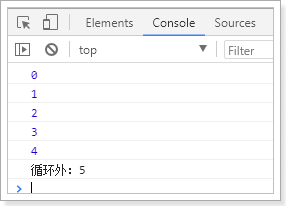

可以看出，在循环外部也可以获取到变量`i`的值，显然变量`i`的作用域范围太大了，在做复杂页面时，会带来很大的问题。

### 2.1. let 关键字

`let` 所声明的变量，只在 `let` 命令所在的代码块内有效。例如：

```js
for (let i = 0; i < 5; i++) {
  console.log(i);
}
console.log("循环外：" + i)
```

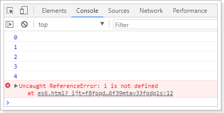

这样，就把变量的`i`的作用域控制在了循环内部。

### 2.2. const 关键字
#### 2.2.1. 定义

`const` 声明的变量是常量，**不能被修改**，类似于java中`final`关键字

```js
const a = 1;
console.log("a = ", a);
// 给a重新赋值
a = 2;
console.log("a = ", a);
```

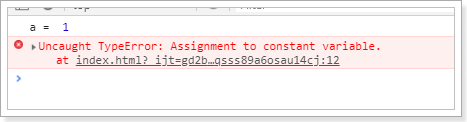

#### 2.2.2. 总结分析

1. 如果是定义是简单数据类型，是不能修改。简单理解是不能通过**“=”**来修改const修饰的变量，**即值不可变**
2. 对于数组、对象、函数、正则、Set、Map之类等引用类型的可以更改、删除属性，但**引用的地址不能改变**

## 3. 字符串扩展
### 3.1. ES6中为字符串扩展了几个新的API

- `includes()` ：返回布尔值，表示是否找到了参数字符串。
- `startsWith()` ：返回布尔值，表示参数字符串是否在原字符串的头部。
- `endsWith()` ：返回布尔值，表示参数字符串是否在原字符串的尾部。

```js
let str = "hello moon";
console.log(str, " 中是否包含了moon => ", str.includes("moon"));
console.log(str, " 中是否包含了sun => ", str.includes("sun"));
console.log(str, " 中是否以h开头 => ", str.startsWith("h"));
console.log(str, " 中是否以a开头 => ", str.startsWith("n"));
console.log(str, " 中是否以a结束 => ", str.endsWith("n"));
console.log(str, " 中是否以h结束 => ", str.endsWith("h"));
```

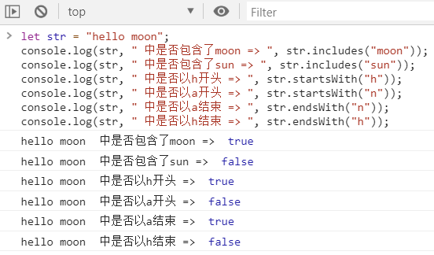

### 3.2. 字符串模板

ES6中提供了“**&#96;**”来作为字符串模板标记。在两个“**&#96;**”之间的部分都会被作为字符串的值，可以任意换行。

```js
let str = `
  hello
  moon
  zero
`;
console.log(str);
```

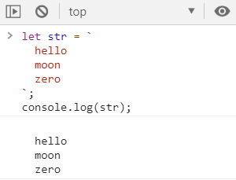

#### 3.2.1. `${}`占位符
模板字符串使用反引号 (&#96; &#96;) 来代替普通字符串中的用双引号和单引号。模板字符串可以包含特定语法（`${expression}`）的占位符。占位符中的表达式和周围的文本会一起传递给一个默认函数，该函数负责将所有的部分连接起来，如果一个模板字符串由表达式开头，则该字符串被称为带标签的模板字符串，该表达式通常是一个函数，它会在模板字符串处理后被调用，在输出最终结果前，你都可以通过该函数来对模板字符串进行操作处理。在模版字符串内使用反引号（&#96;）时，需要在它前面加转义符（`\`）

```js
// 在普通字符串中嵌入表达式，必须使用如下语法：
var a = 5;
var b = 10;
console.log('Fifteen is ' + (a + b) + ' and\nnot ' + (2 * a + b) + '.');
// "Fifteen is 15 and
// not 20."

// 现在通过模板字符串，我们可以使用一种更优雅的方式来表示：
var a = 5;
var b = 10;
console.log(`Fifteen is ${a + b} and
not ${2 * a + b}.`);
// "Fifteen is 15 and
// not 20."
```

## 4. 解构表达式

什么是解构？ -- ES6中允许按照一定模式从数组和对象中提取值，然后对变量进行赋值，这被称为解构 (Destructuring)。

### 4.1. 数组解构

之前获取数组中的值，只能通过角标（索引）。ES6可以使用以下方式获取值

```js
let arr = [1, 2, 3]
const [x, y, z] = arr; // x，y，z将与arr中的每个位置对应来取值
// 然后打印
console.log(x, y, z);

const [a] = arr; // 只匹配1个参数
console.log(a);
```

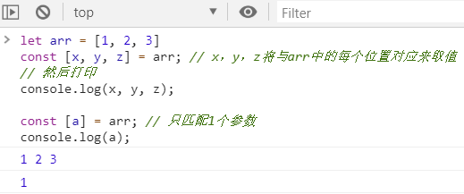

### 4.2. 对象解构
#### 4.2.1. 按属性名称获取对象中的值

解构表达式语法：`const { 属性名1, 属性名2, 属性名3, ...} = Object对象`

```js
const person = {
  name: "jack",
  age: 21,
  language: ['java', 'js', 'css']
}

// 解构表达式获取值
const { name, age, language } = person;
// 打印
console.log(name);
console.log(age);
console.log(language);
```

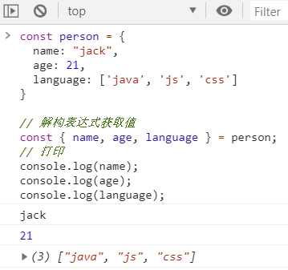

#### 4.2.2. 指定其他变量获取对象中的值

- 解构表达式语法：`const { 属性名1, 属性名2, 属性名3:赋值的变量名, ...} = Object对象`
    - 冒号前是对象中的属性名，冒号后面的是解构后要赋值给的变量。

```js
const person = {
  name: "jack",
  age: 21,
  language: ['java', 'js', 'css']
}

// 解构表达式获取值
const { name:n, age } = person;
// 打印
console.log(n);
console.log(age);
```

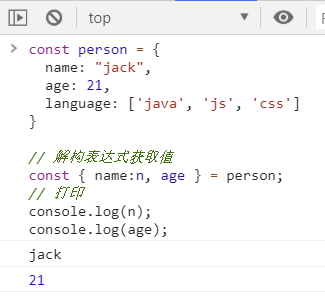

## 5. 函数优化

在ES6中，对函数的操作做了优化，使得在操作函数时更加的便捷

### 5.1. 函数参数默认值

在ES6以前，无法给一个函数参数设置默认值，只能采用变通写法。ES6后可以在函数参数直接定义默认值

```js
/*  *** ES6前，设置参数默认值  *** */
function add(a, b) {
  // 判断b是否为空，为空就给默认值1
  b = b || 1;
  return a + b;
}
// 传一个参数
console.log(add(10));

/*  *** ES6新特性，设置参数默认值  *** */
function add(a, b = 1) {
  return a + b;
}
// 传一个参数
console.log(add(10));
```

### 5.2. 箭头函数 (=>)

ES6 允许使用“箭头”（=>）定义函数

#### 5.2.1. 语法

```js
var 变量名 = 参数名 => 返回值
```

上面的箭头函数等同于：

```js
var 变量名 = function(参数) {
    return 返回值;
};
```

如果箭头函数的代码块部分多于一条语句，就要使用大括号将它们括起来，并且使用return语句返回。例：

```js
var sum = (num1, num2) => { return num1 + num2; }
```

由于大括号被解释为代码块，所以**如果箭头函数直接返回一个对象，必须在对象外面加上括号**。。例：

```js
var getTempItem = id => ({ id: id, name: "Temp" });
```

#### 5.2.2. 箭头函数有几个使用注意点

1. 函数体内的this对象，就是定义时所在的对象，而不是使用时所在的对象。
2. 不可以当作构造函数，也就是说，不可以使用new命令，否则会抛出一个错误。
3. 不可以使用arguments对象，该对象在函数体内不存在。如果要用，可以用Rest参数代替。
4. 不可以使用yield命令，因此箭头函数不能用作Generator函数。

**this指向的固定化**，并不是因为箭头函数内部有绑定this的机制，实际原因是箭头函数根本没有自己的this，导致内部的**this就是外层代码块的this**。正是因为它没有this，所以也就不能用作构造函数。

#### 5.2.3. 剪头函数-综合例子

- 一个参数时：

```js
var print = function (obj) {
  console.log(obj);
}
// 简写为：
var print2 = obj => console.log(obj);
```

- 多个参数：

```js
// 两个参数的情况：
var sum = function (a, b) {
  return a + b;
}
// 简写为：
var sum2 = (a, b) => a + b;
```

- 没有参数：

```js
// 没有参数时，需要通过()进行占位，代表参数部分
let sayHello = () => console.log("hello!");
sayHello();
```

- 代码不止一行，可以用 {} 括起来：

```js
var sum3 = (a, b) => {
  return a + b;
}
// 多行，没有返回值
let sayHello = () => {
  console.log("hello!");
  console.log("world!");
}
sayHello();
```

### 5.3. 对象的函数属性简写

```js
let person = {
  name: "jack",
  // 以前定义方式：
  eat: function (food) {
    console.log(this.name + "在吃" + food);
  },
  // 箭头函数版：
  eat2: food => console.log(person.name + "在吃" + food), // 这里拿不到this
  // 简写版：
  eat3(food) {
    console.log(this.name + "在吃" + food);
  }
}
```

*注：使用箭头函数时，里面不能使用this点属性取值*

### 5.4. 箭头函数结合解构表达式

```js
const person = {
  name: "jack",
  age: 21,
  language: ['java', 'js', 'css']
}

/* 原来的函数 */
function hello(person) {
  console.log("hello," + person.name)
}

/* 结合使用箭头函数和解构表达式 */
var hi = ({ name }) => console.log("hello," + name);
hi(person);
```

## 6. set 和 map 数据结构

ES6提供了Set和Map的数据结构。

### 6.1. set 数据结构

Set本质与数组类似。不同在于Set中只能保存不同元素，如果元素相同会被忽略。和java中的Set集合非常相似。

#### 6.1.1. 构造函数

```js
// Set 构造函数可以接收一个数组或空
let set = new Set();
set.add(1); // [1]

// 接收数组
let set2 = new Set([2, 3, 4, 5, 5]); // 得到结果[2,3,4,5]
```

#### 6.1.2. 相关方法

```js
let set = new Set();

set.add(1); // 添加
set.clear(); // 清空
set.delete(2); // 删除指定元素
set.has(2); // 判断是否存在
set.forEach(function () {}) // 遍历元素
set.size; // 元素个数。是属性，不是方法。
```

#### 6.1.3. 利用set数据结构进行数组去重

```js
const list = [1, 1, 2, 3, 6, 45, 8, 5, 4, 6, 5]
const uniqueList = [...new Set(list)]    // [1, 2, 3, 6, 45, 8, 5, 4]
```

### 6.2. map 数据结构

map本质是与Object类似的结构。不同在于，Object强制规定key只能是字符串。而Map结构的key可以是任意对象。即：

- object 是`<string, object>`集合
- map 是`<object, object>`集合

#### 6.2.1. 构造函数

```js
/* map 构造函数可以接收一个数组，数组中的元素是键值对数组 */
const map = new Map([
  ['key1', 'value1'],
  ['key2', 'value2'],
])

/* 传入一个set */
const set = new Set([
  ['key1', 'value1'],
  ['key2', 'value2'],
])
const map2 = new Map(set)

/* 传入其它map */
const map3 = new Map(map);
```

#### 6.2.2. 相关方法

```js
map.set(key, value); // 添加
map.clear(); // 清空
map.delete(key); // 删除指定元素
map.has(key); // 判断是否存在
map.forEach(function (key, value) {}) // 遍历元素
map.size; // 元素个数。是属性，不是方法
map.values() // 获取value的迭代器
map.keys() // 获取key的迭代器
map.entries() // 获取entry的迭代器

/* 迭代器for of用法： */
for (let key of map.keys()) {
  console.log(key);
}
/* 通过扩展运算符进行展开 */
console.log(...map.values());
```

## 7. 扩展运算符(...)

扩展运算符(spread)是三个点(**`...`**)， 将一个数组转为用逗号分隔的参数序列。

用法例子：

```js
console.log(...[1, 2, 3]); // 1 2 3
console.log(1, ...[2, 3, 4], 5); // 1 2 3 4 5

/* 解构数组，作为函数入参 */
function add(x, y) {
  return x + y;
}
var numbers = [1, 2];
console.log(add(...numbers)); // 3

/* 数组合并 */
let arr = [...[1, 2, 3], ...[4, 5, 6]];
console.log(arr); // [1, 2, 3, 4, 5, 6]

/* 与解构表达式结合 */
const [first, ...rest] = [1, 2, 3, 4, 5];
console.log(first, rest) // 1  [2, 3, 4, 5]

/* 将字符串转成数组 */
console.log([...'hello']) // ["h", "e", "l", "l", "o"]
```

## 8. Promise 对象

### 8.1. Promise 简述

Promise 是异步编程的一种解决方案。所谓Promise，简单说就是一个容器，里面保存着某个未来才会结束的事件（通常是一个异步操作）的结果。从语法上说，Promise 是一个对象，从它可以获取异步操作的消息。Promise 提供统一的 API，各种异步操作都可以用同样的方法进行处理。

可以通过Promise的构造函数来创建Promise对象，并在内部封装一个异步执行的结果。

### 8.2. Promise 语法

ES6 规定，`Promise` 对象是一个构造函数，用来生成 `Promise` 实例。

```js
const promise = new Promise(function (resolve, reject) {
  // ... 执行异步操作
  if ( /* 异步操作成功 */ ) {
    resolve(value); // 调用resolve，代表Promise将返回成功的结果
  } else {
    reject(error); // 调用reject，代表Promise会返回失败结果
  }
});
```

`Promise`构造函数接受一个函数作为参数，该函数的两个参数分别是`resolve`和`reject`。它们是两个函数，由 JavaScript 引擎提供，不用开发者定义。

- `resolve` 函数的作用是，将 `Promise` 对象的状态从“未完成”变为“成功”（即从 pending 变为 resolved），在异步操作成功时调用，并将异步操作的结果，作为参数传递出去；
- `reject` 函数的作用是，将 `Promise` 对象的状态从“未完成”变为“失败”（即从 pending 变为 rejected），在异步操作失败时调用，并将异步操作报出的错误，作为参数传递出去。

在promise中就封装了一段异步执行的结果。如果想要等待异步执行完成，做一些事情，可以通过promise对象的then方法来实现接收 `resolved` 状态和 `rejected` 状态的回调函数。其中，`rejected` 函数是可选的，不一定要提供。语法如下：

```js
promise.then(function (value) {
  // 异步执行成功后的回调
}, function(error) {
  // 异步执行失败后的回调
});
```

如果想要处理promise异步执行失败的事件，还可以跟上catch，实现接收reject方法返回的结果。语法：

```js
promise.then(function (value) {
  // 异步执行成功后的回调
}).catch(function (error) {
  // 异步执行失败后的回调
})
```

### 8.3. Promise 基础使用示例

```js
const p = new Promise(function (resolve, reject) {
  // 这里我们用定时任务模拟异步
  setTimeout(() => {
    const num = Math.random();
    // 随机返回成功或失败
    if (num < 0.5) {
      resolve("成功！num:" + num)
    } else {
      reject("出错了！num:" + num)
    }
  }, 300)
})

console.log('异步请求开始!');
// 调用promise
p.then(function (msg) {
  console.log(msg);
}).catch(function (msg) {
  console.log(msg);
})
console.log('异步请求结束!');
```

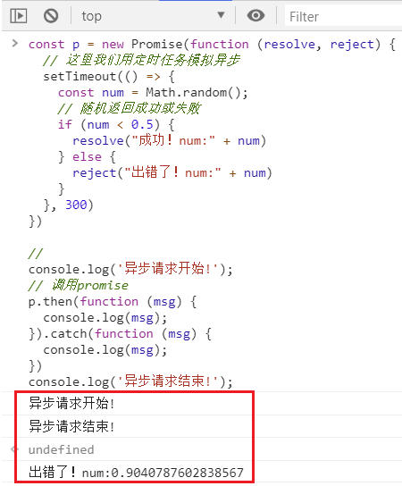

### 8.4. Promise.prototype.then()

`then` 方法是定义在原型对象 `Promise.prototype` 上的。它的作用是为 `Promise` 实例添加状态改变时的回调函数。`then` 方法的参数如下：

- 第一个参数是 `resolved` 状态的回调函数
- 第二个参数（可选）是 `rejected` 状态的回调函数。

`then` 方法返回的是一个新的 `Promise` 实例（*注意，不是原来那个 `Promise` 实例*），因此可以采用链式写法。第一个回调函数完成以后，会将返回结果作为参数，传入第二个回调函数，以此类推。

```js
getJSON("/posts.json").then(function(json) {
  return json.post;
}).then(function(post) {
  // ...
});
```

采用链式的`then`，可以指定一组按照次序调用的回调函数。如前一个回调函数，有可能返回的还是一个`Promise`对象（即有异步操作），这时后一个回调函数，就会等待该`Promise`对象的状态发生变化，才会被调用。

```js
getJSON("/post/1.json").then(function(post) {
  return getJSON(post.commentURL);
}).then(function (comments) {
  console.log("resolved: ", comments);
}, function (err){
  console.log("rejected: ", err);
});

// 箭头函数写法
getJSON("/post/1.json").then(
  post => getJSON(post.commentURL)
).then(
  comments => console.log("resolved: ", comments),
  err => console.log("rejected: ", err)
);
```

### 8.5. Promise.prototype.catch()

`Promise.prototype.catch()` 方法是 `.then(null, rejection)` 或 `.then(undefined, rejection)` 的别名，用于指定发生错误时的回调函数。

```js
getJSON('/posts.json').then(function(posts) {
  // ...
}).catch(function(error) {
  // 处理 getJSON 和 前一个回调函数运行时发生的错误
  console.log('发生错误！', error);
});
```

上述示例中，方法返回一个 `Promise` 对象，如果该对象状态变为`resolved`，则会调用`then()`方法指定的回调函数；如果异步操作抛出错误，状态就会变为`rejected`，就会调用`catch()`方法指定的回调函数，处理这个错误。另外，`then()`方法指定的回调函数，如果运行中抛出错误，也会被`catch()`方法捕获。

一般总是建议，`Promise` 对象后面要跟`catch()`方法，这样可以处理 `Promise` 内部发生的错误。`catch()`方法返回的还是一个 `Promise` 对象，因此后面还可以接着调用`then()`方法。

```js
const someAsyncThing = function() {
  return new Promise(function(resolve, reject) {
    // 下面一行会报错，因为x没有声明
    resolve(x + 2);
  });
};

someAsyncThing()
.catch(function(error) {
  console.log('oh no', error);
})
.then(function() {
  console.log('carry on');
});
// oh no [ReferenceError: x is not defined]
// carry on
```

### 8.6. Promise.all()

`Promise.all()` 方法用于将多个 `Promise` 实例，包装成一个新的 `Promise` 实例。方法接受一个数组作为参数，但参数也可以不是数组，但必须具有 `Iterator` 接口，且返回的每个成员都是 `Promise` 实例。

`Promise.all()` 方法会发起并行的 `Promise` 异步操作，等所有的异步操作全部结束后才会执行下一步的 `.then` 操作（等待机制）。**注意：参数数组中 `Promise` 实例的顺序，就是最终结果的顺序！**

```js
const databasePromise = connectDatabase();

const booksPromise = databasePromise
  .then(findAllBooks);
const userPromise = databasePromise
  .then(getCurrentUser);

Promise.all([
  booksPromise,
  userPromise
]).then(([books, user]) => pickTopRecommendations(books, user));
```

> *上面代码中，`booksPromise`和`userPromise`是两个异步操作，只有等到它们的结果都返回了，才会触发`pickTopRecommendations`这个回调函数。*

### 8.7. Promise.race()

`Promise.race()` 方法同样是将多个 `Promise` 实例，包装成一个新的 `Promise` 实例。方法的参数与 `Promise.all()` 方法参数一样，不同的地方在于，`Promise.race()` 方法会发起并行的 `Promise` 异步操作，只要任何一个异步操作完成，就立即执行下一步的 `.then` 操作（赛跑机制）

```js
const p = Promise.race([
  fetch('/resource-that-may-take-a-while'),
  new Promise(function (resolve, reject) {
    setTimeout(() => reject(new Error('request timeout')), 5000)
  })
]);

p
.then(console.log)
.catch(console.error);
```

> *上面代码中，如果 5 秒之内`fetch`方法无法返回结果，变量`p`的状态就会变为`rejected`，从而触发`catch`方法指定的回调函数。*

## 9. Generator函数

### 9.1. Generator函数简介

- Generator函数是ES6提供的一种异步编程解决方案，语法行为与传统函数完全不同。
- Generator函数有两个特征: 一是function命令与函数名之间有一个星号；二是函数体内部使用yield吾句定义不同的内部状态。

用法：

```js
function* hello() {
    yield "hello";
    yield "world";
    return "done";
}
let h = hello();

console.log(h.next()); // {value: "hello", done: false}
console.log(h.next()); // {value: "world", done: false}
console.log(h.next()); // {value: "done", done: true}
console.log(h.next()); // {value: undefined, done: true}
```

上例说明，通过hello()返回的h对象，每调用一次next()方法返回一个对象，该对象包含了value值和done状态。直到遇到return关键字或者函数执行完毕，这个时候返回的状态为ture，表示已经执行结束了。

### 9.2. yield关键字简介

- yield是ES6的新关键字，使生成器函数执行暂停，yield关键字后面的表达式的值返回给生成器的调用者。它可以被认为是一个基于生成器的版本的return关键字。
- yield关键字实际返回一个IteratorResult（迭代器）对象，它有两个属性，value和done，分别代表返回值和是否完成。
- yield无法单独工作，需要配合generator(生成器)的其他函数，如next，懒汉式操作，展现强大的主动控制特性。

通过上面的案例说明：

> 1. 如果你看到某个函数中有yield，说明这个函数已经是个生成器了
> 2. yield可以用来加强控制，懒汉式加载
> 3. ~~调用函数指针和调用生成器是两码事~~（待研究！）
> 4. 需要next()函数配合使用，每次调用返回两个值：分别是value和done，代表迭代结果和是否完成
> 5. 函数next()是个迭代器对象，传参可以缺省，默认调用函数。

### 9.3. for...of循环

通过for...of可以循环遍历Generator函数返回的迭代器。用法如下：

```js
function* hello() {
    yield "hello";
    yield "world";
    return "done";
}
let h = hello();
for (let obj of h) {
    console.log(obj);
}
/**
 * 输出：
 *      hello
 *      world
 */
```

## 10. async/await

### 10.1. 简介

ES2017 标准引入了 `async` 函数，使得异步操作变得更加方便。`async` 是 `Generator` 函数的语法糖。`async` 函数就是将 `Generator` 函数的星号（`*`）替换成 `async`，将 `yield` 替换成`await`。

`async`/`await` 是 ES8（ECMAScript 2017）引入的新语法，用来简化 `Promise` 异步操作。在 `async`/`await` 出现之前，开发者只能通过链式 `.then()` 的方式处理 `Promise` 异步操作。

### 10.2. 基础用法

`async` 函数返回一个 `Promise` 对象，可以使用 `then` 方法添加回调函数。当函数执行的时候，一旦遇到 `await` 就会先返回，等到异步操作完成，再接着执行函数体内后面的语句。

```js
function timeout(ms) {
  return new Promise((resolve) => {
    setTimeout(resolve, ms);
  });
}

async function asyncPrint(value, ms) {
  await timeout(ms);
  console.log(value);
}

asyncPrint('hello world', 50);
```

**async 函数有多种使用形式**

```js
// 函数声明
async function foo() {}

// 函数表达式
const foo = async function () {};

// 对象的方法
let obj = { async foo() {} };
obj.foo().then(...)

// Class 的方法
class Storage {
  constructor() {
    this.cachePromise = caches.open('avatars');
  }
  async getAvatar(name) {
    const cache = await this.cachePromise;
    return cache.match(`/avatars/${name}.jpg`);
  }
}

const storage = new Storage();
storage.getAvatar('jake').then(…);

// 箭头函数
const foo = async () => {};
```

### 10.3. async/await 使用注意事项

1. 如果在 function 中使用了 `await`，则 function 必须被 `async` 修饰
2. 在 `async` 方法中，第一个 `await` 之前的代码会同步执行，`await` 之后的代码会异步执行

```js
console.log('A')

/*
  1. 如果在 function 中使用了 await，则 function 必须被 async 修饰
  2. 在 async 方法中，第一个 await 之前的代码是同步执行，await 之后的代码会异步执行
    即下面示例中，getAllResult 方法调用后会马上console.log('B')，然后是异步执行getResult方法，
    虽然 getAllResult 方法内的多个 await 修饰的方法是同步执行，但会先 getAllResult 方法外的逻辑
*/
async function getAllResult() {
  console.log('B')
  const r1 = await getResult(2)
  console.log(r1)
  const r2 = await getResult(3)
  console.log(r2)
  console.log('D')
}

getAllResult()

console.log('C')

/*
  最终的输出的结果：

  A
  B
  84ms后 getResult(2) 将返回数据
  C
  延迟84ms后 getResult(2) 返回的数据
  679ms后 getResult(3) 将返回数据
  延迟679ms后 getResult(3) 返回的数据
  D
*/
```

## 11. class（类）的基本语法

JavaScript 语言的传统方法是通过构造函数定义井生成新对象。ES6中引入了class的概念，通过class关键字自定义类。

### 11.1. 基本用法

#### 11.1.1. 创建类

- 语法：

```js
class ClassName {
  // class body
}
```

- 创建实例：

```js
var xx = new ClassName();
```

- 示例：

```js
/* 定义类 */
class User {
  constructor(name, age = 20) { // 构造方法
    this.name = name; // 添加属性并且赋值
    this.age = age;
  }
  sayHello() { // 定义方法
    return "hello";
  }
  static isAdult(age) { // 静态方法
    if (age >= 18) {
      return "成年人";
    }
    return "未成年人";
  }
}
/* 创建类 */
let user = new User("张三");

// 测试
console.log(user); // User {name: "张三", age: 20}
console.log(user.sayHello()); // hello
console.log(User.isAdult(20)); // 成年人
```

#### 11.1.2. constructor 类的构造函数

`constructor()`是类的构造函数(默认方法)，<font color=red>**用于传递参数，返回实例对象**</font>，通过 `new` 关键字生成对象实例时，自动调用该方法。如果没有显示定义，类内部会自动给创建一个无参的构造函数`constructor()`

- 语法：

```js
class ClassName {
    constructor(属性1, 属性2) {   // constructor 构造方法或者构造函数
        this.属性1 = 属性1;
        this.属性2 = 属性2;
    }
}
```

- 示例：

```js
class Star {
    constructor(uname, age) {
        this.uname = uname
        this.age = age
    }
}

var shiyuan = new Star("石原里美", 18);
console.log(shiyuan);
```

#### 11.1.3. 定义类的方法

- 语法：

```js
class Person {
  constructor(name, age) {   // constructor 构造器或者构造函数
      this.name = name;
      this.age = age;
    }
   say() {
      console.log(this.name + '你好');
   }
}
```

- 方法的调用

```js
var shiyuan = new Person('石原里美', 18);
shiyuan.say() // 石原里美你好
```

<font color=red>**注意：方法之间不能加逗号分隔，同时方法不需要添加 `function` 关键字。**</font>

- 示例

```js
// 1. 创建类 class  创建一个 明星类
class Star {
  // 类的共有属性放到 constructor 里面
  constructor(uname, age) {
    this.uname = uname
    this.age = age
  }
  sing(song) {
    // console.log('我唱歌');
    console.log(this.uname + song)
  }
}
// 2. 利用类创建对象 new
var ldh = new Star("刘德华", 18)
var zxy = new Star("张学友", 20)
console.log(ldh)
console.log(zxy)
/*
  (1) 定义类里面所有的函数不需要写function关键字
  (2) 多个函数方法之间不需要添加逗号分隔
*/
ldh.sing("冰雨")
zxy.sing("李香兰")
```

### 11.2. 类的继承

#### 11.2.1. 创建类的继承

- 语法：

```js
class Father{   // 父类
}

class  Son extends Father {  // 子类继承父类
}
```

- 示例

```js
class User {
  constructor(name, age = 20) { // 构造方法
    this.name = name; // 添加属性并且赋值
    this.age = age;
  }
  sayHello() {
    return "hello"; // 定义方法
  }
  static isAdult(age) { // 静态方法
    if (age >= 18) {
      return "成年人";
    }
    return "未成年人";
  }
}

/* 继承 */
class ZhangSan extends User {
  constructor() {
    super("张三", 30); // 如果父类中的构造方法有参数，那么子类必须通过super调用父类的构造
    // 方法
    this.address = "上海"; // 设置子类中的属性，位置必须处于super下面
  }
}

// 测试
let zs = new ZhangSan();
console.log(zs.name, zs.address);   // 输出结果：张三 上海
console.log(zs.sayHello());         // 输出结果：hello
console.log(ZhangSan.isAdult(20));  // 输出结果：成年人
```

#### 11.2.2. super 关键字

`super` 关键字用于访问和调用对象父类上的函数。<font color=red>**可以调用父类的构造函数，也可以调用父类的普通函数**</font>。语法如下：

```js
class Person {   // 父类
    constructor(surname){
        this.surname = surname;
    }
}
class  Student extends Person {       // 子类继承父类
    constructor(surname,firstname){
        super(surname);             // 调用父类的constructor(surname)
        this.firstname = firstname; // 定义子类独有的属性
    }
}
```

<font color=red>**注意：子类在构造函数中使用`super`，必须放到 `this` 前面(必须先调用父类的构造方法，在使用子类构造方法)**</font>

- 调用父类构造函数示例

```js
/* 父类 */
class Father {
  constructor(x, y) {
    this.x = x
    this.y = y
  }
  sum() {
    console.log(this.x + this.y)
  }
}
/* 子类 */
class Son extends Father {
  constructor(x, y) {
    super(x, y) // 通过super关键字调用了父类中的构造函数
  }
}
var son = new Son(1, 2)
var son1 = new Son(11, 22)
son.sum()
son1.sum()
```

- 调用父类普通方法示例

```js
// super 关键字调用父类普通函数
class Father {
  say() {
    return "我是爸爸"
  }
}
class Son extends Father {
  say() {
    // console.log('我是儿子');
    // super.say() 就是调用父类中的普通函数 say()
    console.log(super.say() + "的儿子")
  }
}
var son = new Son()
son.say()
/*
  继承中的属性或者方法查找原则: 就近原则
  1. 继承中，如果实例化子类输出一个方法，先看子类有没有这个方法，如果有就先执行子类的
  2. 继承中，如果子类里面没有，就去查找父类有没有这个方法，如果有，就执行父类的这个方法(就近原则)
*/
```

#### 11.2.3. 子类扩展自己的方法

```js
// 父类有加法方法
class Father {
  constructor(x, y) {
    this.x = x
    this.y = y
  }
  sum() {
    console.log(this.x + this.y)
  }
}
// 子类继承父类加法方法，同时扩展减法方法
class Son extends Father {
  constructor(x, y) {
    // 利用super 调用父类的构造函数，super 必须在子类this之前调用
    super(x, y)
    this.x = x
    this.y = y
  }
  subtract() {
    console.log(this.x - this.y)
  }
}
var son = new Son(5, 3)
son.subtract() // 调用子类扩展的方法
son.sum() // 调用父类方法
```

### 11.3. 类与对象的注意点

1. 在 ES6 中类没有变量提升，所以必须先定义类，才能通过类实例化对象
2. 类里面的共有属性和方法一定要加`this`使用
3. 类里面的`this`指向问题：`constructor`函数里面的`this`指向实例对象，方法里面的`this`指向这个方法的调用者

### 11.4. 面向对象综合案例

项目代码详见：【html-css-js-sample\javascript-sample\07-面向对象案例\】

### 11.5. 类的本质

1. class本质还是function
2. 类的所有方法都定义在类的`prototype`属性上
3. 类创建的实例,里面也有`__proto__`指向类的`prototype`原型对象
4. 所以ES6的类它的绝大部分功能，ES5都可以做到，新的class写法只是让对象原型的写法更加清晰、更像面向对象编程的语法而已。
5. 所以ES6的类其实就是语法糖。语法糖就是一种便捷写法。简单理解，有两种方法可以实现同样的功能，但是一种写法更加清晰、方便，那么这个方法就是语法糖

```js
/*
ES6 之前通过 构造函数+ 原型实现面向对象 编程
  (1) 构造函数有原型对象prototype
  (2) 构造函数原型对象prototype 里面有constructor 指向构造函数本身
  (3) 构造函数可以通过原型对象添加方法
  (4) 构造函数创建的实例对象有__proto__ 原型指向 构造函数的原型对象
*/
// ES6 通过类实现面向对象编程
class Star {}
console.log(typeof Star)
// 1. 类的本质其实还是一个函数，也可以简单的认为，类就是构造函数的另外一种写法
// (1) 类有原型对象prototype
console.log(Star.prototype)
// (2) 类原型对象prototype 里面有constructor 指向类本身
console.log(Star.prototype.constructor)
// (3) 类可以通过原型对象添加方法
Star.prototype.act = function () {
  console.log("非自然死亡")
}
var shiyuan = new Star()
console.dir(shiyuan)
// (4) 类创建的实例对象有__proto__ 原型指向 类的原型对象
console.log(shiyuan.__proto__ === Star.prototype)
```

## 12. 模块化

### 12.1. 什么是模块化

在 ES6 模块化规范诞生之前，JavaScript 社区已经尝试并提出了 AMD、CMD、CommonJS 等模块化规范。但是，这些由社区提出的模块化标准，还是存在一定的差异性与局限性、并不是浏览器与服务器通用的模块化标准，例如：

- AMD 和 CMD 适用于浏览器端的 Javascript 模块化
- CommonJS 适用于服务器端的 Javascript 模块化

为了统一规范，推出了 ES6 模块化规范

- 模块化就是把代码进行拆分，方便重复利用。类似java中的导包：要使用一个包，必须先导包。
- 而JS中没有包的概念，换来的是模块。

### 12.2. ES6的模块化的基本规则或特点

ES6 模块化规范是浏览器端与服务器端通用的模块化开发规范。ES6 模块化规范中定义：

- 每个 js 文件都是一个独立的模块
- 导入其它模块成员使用 `import` 关键字
- 向外共享模块成员使用 `export` 关键字

模块化的特点：

1. 每一个模块只加载一次，每一个JS只执行一次，如果下次再去加载同目录下同文件，直接从内存中读取。一个模块就是一个单例，或者说就是一个对象；
2. 每一个模块内声明的变量都是局部变量，不会污染全局作用域；
3. 模块内部的变量或者函数可以通过 `export` 导出；
4. 一个模块可以导入别的模块

> node.js 中默认**仅支持 CommonJS 模块化规范**，基于 node.js 使用 ES6 的模块化语法的配置详见[《node.js 笔记》](#/03-前端资料/06-前端工程化工具/01-node?id=_41-在-nodejs-中体验-es6-模块化)

### 12.3. ES6 模块化的基本语法与用法

模块功能主要由两个命令构成：`export` 和 `import`。

- `export` 命令用于规定模块的对外接口
- `import` 命令用于输入其他模块提供的功能

ES6 的模块化主要包含如下 3 种用法：

1. 默认导出与默认导入
2. 按需导出与按需导入
3. 直接导入并执行模块中的代码

### 12.4. export 用法

一个模块就是一个独立的文件。该文件内部的所有变量，外部无法获取。如果希望外部能够读取模块内部的某个变量，就必须使用 `export` 关键字输出该变量。

#### 12.4.1. 单独导入多个变量

```js
// profile.js
export const firstName = 'MooN';
export const lastName = 'Zero';
export const age = 23;
```

除以上示例写法，还有另外一种写法：使用大括号`{}`指定所要导出的一组变量。它与前一种写法（`export`直接放在变量前）是等价的。应该优先考虑使用此写法，因为相对比较清晰导出哪些变量。

```js
// profile.js
const firstName = 'MooN';
const lastName = 'Zero';
const age = 23;

export { firstName, lastName, age }
```

`export` 命令除了导出变量，还可以导出函数或类（class）。

```js
// 对外输出一个函数multiply
export function multiply(x, y) {
  return x * y;
};
```

#### 12.4.2. 导出变量重命名

通常情况下，`export` 导出的变量就是原文件中的变量名称，但是可以使用 `as` 关键字重命名。

```js
const firstName = 'MooN';
function v1() { ... }
function v2() { ... }

// 使用as关键字重命名了函数v1和v2的对外接口。重命名后，v2可以用不同的名字输出两次。
export {
  firstName as fName,
  v1 as streamV1,
  v2 as streamV2,
  v2 as streamLatestVersion
};
```

#### 12.4.3. export default （默认导出）

使用 `export default` 命令，为模块指定默认导出。<font color=red>**一个模块只能有一个默认输出，因此 export default 命令只能使用一次**</font>。所以当使用 `import` 命令导入时，是不用加大括号，因为只可能唯一对应 `export default` 命令。

比如定义一个js文件：Util.js，里面有一个Util类。

```js
class Util {
  static sum = (a, b) => a + b;
}
// 对外默认导出Util类
export default Util;
```

默认导出函数

```js
// export-default.js
export default function () {
  console.log('foo');
}

// 或者写成
function foo() {
  console.log('foo');
}
export default foo;
```

本质上，`export default` 就是输出一个名叫 `default` 的变量或方法，然后也允许为它取任意名字。所以，下面的写法是有效的。

```js
// modules.js
function add(x, y) {
  return x * y;
}
export {add as default};
// 等同于
// export default add;

// app.js
import { default as foo } from 'modules';
// 等同于
// import foo from 'modules';
```

`export default` 与 单独的 `export` 可以混合使用

```js
export default function (obj) {
  // ···
}
export function each(obj, iterator, context) {
  // ···
}
export { each as forEach };
```

> 以上示例就是导出一个默认的函数，然后单独导出 `forEach` 与 `each` 函数，然后 `forEach` 函数默认指向 `each` 函数。所以 `forEach` 和 `each` 指向同一个方法。

#### 12.4.4. 导出的注意事项

- `export` 命令可以出现在模块（js文件）的任何位置，只要处于模块顶层即可。如果处于块级作用域内，就会报错

```js
function foo() {
  export default 'bar' // SyntaxError
}
foo()
```

- 每个模块中，只允许使用唯一的一次 `export default`，否则会报错！
- 单独导出可以和默认导出一起使用

### 12.5. import 用法

使用 `export` 命令定义了模块的对外接口以后，其他 JS 文件就可以通过 `import` 命令加载这个模块。

#### 12.5.1. 导入单独变量

`import` 命令用于加载模块文件，并导入指定的变量。`import` 命令接受一对大括号`{}`，里面指定要从其他模块导入的变量名。大括号里面的变量名，必须与被导入模块对外导出的变量名称相同。

```js
import { firstName, lastName, age } from './export.js'
```

`import` 后面的 `from` 指定模块文件的位置，可以是相对路径，也可以是绝对路径，并且 `.js` 后缀可以省略。如果只是模块名，不带有路径，那么必须有配置文件，告诉 JavaScript 引擎该模块的位置。

```js
// 相对路径导入
import {myMethod} from './xxxx';
// 不带路径导入
import {myMethod} from 'util';
```

#### 12.5.2. 导入变量重命名

`import` 命令可以使用 `as` 关键字，将导入的变量重命名。

```js
import { str as string, sum } from './export.js'
```

#### 12.5.3. 默认导入

在导入默认导出的内容时，`import` 命令可以为该匿名内容指定任意名字。需要注意的是，这时 `import` 命令后面，不使用大括号`{}`。

```js
// import-default.js
import customName from './export-default';
customName(); // 'foo'
```

本质上，`export default` 就是输出一个叫做 `default` 的变量或方法，导入时其实就是导入 `default` 的变量，并且使用 `as` 关键字重命名

```js
// modules.js
function add(x, y) {
  return x * y;
}
export default add;

// app.js
import { default as foo } from 'modules';
// 等同于
// import foo from 'modules';
```

#### 12.5.4. 直接导入并执行模块中的代码

如果只想单纯地执行某个模块中的代码，并不需要得到模块中向外共享的成员。此时，可以直接导入并执行模块代码

```js
// 某个只有执行逻辑的js
for (let i = 0; i < 3; i++) {
  console.log(i)
}

/* 直接导入并执行模块代码 */
import './no-export.js'
```

#### 12.5.5. 导入的注意事项

- `import` 命令**导入的变量都是只读的**，因为它的本质是导入变量。即不允许在加载模块的脚本里面，改写变量相应的内容。<font color=red>**但如果导入的变量是指定一个对象，改写该对象的属性是允许的。不过，这种写法很难查错，建议凡是输入的变量，都当作完全只读，不要轻易改变它的属性。**</font>

```js
import {a} from './xxx.js'
a = {}; // Syntax Error : 'a' is read-only;

import {a} from './xxx.js'
a.foo = 'hello'; // 合法操作。不过，这种写法很难查错，建议凡是输入的变量，都当作完全只读，不要轻易改变它的属性。
```

- 如果多次重复执行同一句 `import` 语句，那么只会执行一次，而不会执行多次。

### 12.6. ES6 中 export 及 export default 的区别

`export const` 与 `export default` 均可用于导出常量、函数、文件、模块等，可以在其它文件或模块中通过`import+(常量 | 函数 | 文件 | 模块名)`的方式将其导入，以便能够对其进行使用，但在一个文件或模块中，export、import可以有多个，export default仅有一个。

```js
// demo1.js
export const str = 'hello world'
export function f(a){
    return a+1
}

// demo2.js
import { str, f } from 'demo1' // 也可以分开写两次，导入的时候带花括号
```

```js
// demo1.js
export default const str = 'hello world'
// demo2.js
import str from 'demo1' // 导入的时候没有花括号
```

**总结：其中`export`和`export default`最大的区别就是`export`不限变量数可以一直写，而`export default`只输出一次 而且`export`导出的变量要使用时，必须使用`{}`来定义接收的变量，而`export default`不需要`{}`，只要`import`任意一个名字来接收对象即可。**

`export default`可以跟在非匿名函数之前，也可以跟在匿名函数之前，同时也可以是一个对象之前。

## 13. Proxy

### 13.1. 概述

Proxy 这个词的原意是代理，表示由它来“代理”某些操作，可以译为“代理器”。用于修改某些操作的默认行为，等同于在语言层面做出修改，属于一种“元编程”（meta programming），即对编程语言进行编程。

Proxy 可以理解成，在目标对象之前架设一层“拦截”，外界对该对象的访问，都必须先通过这层拦截，因此提供了一种机制，可以对外界的访问进行过滤和改写。

### 13.2. 基础语法

ES6 原生提供 Proxy 构造函数，用来生成 Proxy 实例。

```js
const proxy = new Proxy(target, handler);
```

- `new Proxy()` 表示生成一个 Proxy 实例
- `target` 参数表示所要拦截的目标对象
- `handler` 参数也是一个对象，用来定制拦截行为。

基础示例：

```js
/* 示例1 */
var obj = new Proxy({}, {
  get: function (target, propKey, receiver) {
    console.log(`getting ${propKey}!`);
    return Reflect.get(target, propKey, receiver);
  },
  set: function (target, propKey, value, receiver) {
    console.log(`setting ${propKey}!`);
    return Reflect.set(target, propKey, value, receiver);
  }
});

// 示例1输出结果
obj.count = 1
//  setting count!
++obj.count
//  getting count!
//  setting count!
//  2

/* 示例2 */
var proxy = new Proxy({}, {
  get: function(target, propKey) {
    return 35;
  }
});

// 示例2输出结果
proxy.time // 35
proxy.name // 35
proxy.title // 35
```

上面代码中，作为构造函数，`Proxy`接受两个参数。

- 第一个参数是所要代理的目标对象（上例是一个空对象），即如果没有`Proxy`的介入，操作原来要访问的就是这个对象；
- 第二个参数是一个配置对象，对于每一个被代理的操作，需要提供一个对应的处理函数，该函数将拦截对应的操作。比如，上面代码中，配置对象有一个`get`方法，用来拦截对目标对象属性的访问请求。`get`方法的两个参数分别是目标对象和所要访问的属性。可以看到，由于拦截函数总是返回`35`，所以访问任何属性都得到`35`。

<font color=red>**注意，要使得`Proxy`起作用，必须针对`Proxy`实例（上例是`proxy`对象）进行操作，而不是针对目标对象（上例是空对象）进行操作。**</font>

如果 `handler` 没有设置任何拦截，那就等同于直接通向原对象。

```js
var target = {};
var handler = {};
var proxy = new Proxy(target, handler);
proxy.a = 'b';
target.a // "b"
```

同一个拦截器函数，可以设置拦截多个操作：

```js
var handler = {
  get: function(target, name) {
    if (name === 'prototype') {
      return Object.prototype;
    }
    return 'Hello, ' + name;
  },

  apply: function(target, thisBinding, args) {
    return args[0];
  },

  construct: function(target, args) {
    return {value: args[1]};
  }
};

var fproxy = new Proxy(function(x, y) {
  return x + y;
}, handler);

fproxy(1, 2) // 1
new fproxy(1, 2) // {value: 2}
fproxy.prototype === Object.prototype // true
fproxy.foo === "Hello, foo" // true
```

### 13.3. Proxy 实例支持的拦截方法(未整理完,待续)

> 参考：https://www.bookstack.cn/read/es6-3rd/spilt.2.docs-proxy.md

- `get(target, propKey, receiver)`：拦截对象属性的读取，比如`proxy.foo`和`proxy['foo']`。
- `set(target, propKey, value, receiver)`：拦截对象属性的设置，比如`proxy.foo = v`或`proxy['foo'] = v`，返回一个布尔值。
- `has(target, propKey)`：拦截`propKey in proxy`的操作，返回一个布尔值。
- `deleteProperty(target, propKey)`：拦截`delete proxy[propKey]`的操作，返回一个布尔值。
- `ownKeys(target)`：拦截`Object.getOwnPropertyNames(proxy)`、`Object.getOwnPropertySymbols(proxy)`、`Object.keys(proxy)`、`for...in`循环，返回一个数组。该方法返回目标对象所有自身的属性的属性名，而`Object.keys()`的返回结果仅包括目标对象自身的可遍历属性。
- `getOwnPropertyDescriptor(target, propKey)`：拦截`Object.getOwnPropertyDescriptor(proxy, propKey)`，返回属性的描述对象。
- `defineProperty(target, propKey, propDesc)`：拦截`Object.defineProperty(proxy, propKey, propDesc）`、`Object.defineProperties(proxy, propDescs)`，返回一个布尔值。
- `preventExtensions(target)`：拦截`Object.preventExtensions(proxy)`，返回一个布尔值。
- `getPrototypeOf(target)`：拦截`Object.getPrototypeOf(proxy)`，返回一个对象。
- `isExtensible(target)`：拦截`Object.isExtensible(proxy)`，返回一个布尔值。
- `setPrototypeOf(target, proto)`：拦截`Object.setPrototypeOf(proxy, proto)`，返回一个布尔值。如果目标对象是函数，那么还有两种额外操作可以拦截。
- `apply(target, object, args)`：拦截 Proxy 实例作为函数调用的操作，比如`proxy(...args)`、`proxy.call(object, ...args)`、`proxy.apply(...)`。
- `construct(target, args)`：拦截 Proxy 实例作为构造函数调用的操作，比如`new proxy(...args)`。

#### 13.3.1. get()

`get(target, propertyKey, receiver)` 方法用于拦截某个属性的读取操作，可以接受三个参数：

- `target`：目标对象
- `propertyKey`：属性名
- `receiver`（可选）：proxy 实例本身（严格地说，是操作行为所针对的对象）

```js
var person = {
  name: "张三"
};

var proxy = new Proxy(person, {
  get: function(target, propKey) {
    if (propKey in target) {
      return target[propKey];
    } else {
      throw new ReferenceError("Prop name \"" + propKey + "\" does not exist.");
    }
  }
});

proxy.name // "张三"
proxy.age // 抛出一个错误
```

#### 13.3.2. set()

`set(target, propKey, value, receiver)` 方法用来拦截某个属性的赋值操作，可以接受四个参数：

- `target`：目标对象
- `propertyKey`：属性名
- `value`：属性值
- `receiver`（可选）：Proxy 实例本身

```js
let validator = {
  set: function(obj, prop, value) {
    if (prop === 'age') {
      if (!Number.isInteger(value)) {
        throw new TypeError('The age is not an integer');
      }
      if (value > 200) {
        throw new RangeError('The age seems invalid');
      }
    }

    // 对于满足条件的 age 属性以及其他属性，直接保存
    obj[prop] = value;
  }
};

let person = new Proxy({}, validator);

person.age = 100;
person.age // 100
person.age = 'young' // 报错
person.age = 300 // 报错
```

### 13.4. Proxy.revocable() 取消的 Proxy 实例

`Proxy.revocable()` 方法返回一个可取消的 Proxy 实例。

```js
let target = {};
let handler = {};
let {proxy, revoke} = Proxy.revocable(target, handler);

proxy.foo = 123;
proxy.foo // 123

revoke();
proxy.foo // TypeError: Revoked
```

`Proxy.revocable()` 方法返回一个对象，该对象的 `proxy` 属性是 Proxy 实例，`revoke` 属性是一个函数，可以取消 Proxy 实例。上面代码中，当执行 `revoke` 函数之后，再访问 Proxy 实例，就会抛出一个错误。`Proxy.revocable()` 的一个使用场景是，目标对象不允许直接访问，必须通过代理访问，一旦访问结束，就收回代理权，不允许再次访问。

### 13.5. 示例：Web 服务的客户端

Proxy 对象可以拦截目标对象的任意属性，适合用于 Web 服务的客户端。

```js
function createWebService(baseUrl) {
  return new Proxy({}, {
    get(target, propKey, receiver) {
      return () => httpGet(baseUrl + '/' + propKey);
    }
  });
}

const service = createWebService('http://example.com/data');

service.employees().then(json => {
  const employees = JSON.parse(json);
  // ···
});
```

上面代码新建了一个 Web 服务的接口，这个接口返回各种数据。Proxy 可以拦截这个对象的任意属性，所以不用为每一种数据写一个适配方法，只要写一个 Proxy 拦截就可以了。

## 14. 修饰器(Decorator)

修饰器(Decorator)是一个函数，是一种与类（class）相关的语法，用来注释或修改类和类方法。ES2017 引入了这项功能，目前 Babel 转码器己经支持。

### 14.1. 语法格式

装饰器是一种函数，语法格式：`@ + 函数名`。它可以放在类和类方法的定义前面。

#### 14.1.1. 使用示例

示例1：

```js
@T // 通过@符号进行引用该方法，类似java中的注解
class User {
  constructor(name, age = 20) {
    this.name = name;
    this.age = age;
  }
}

function T(target) { // 定义一个普通的方法
  console.log(target); // target对象为修饰的目标对象，这里是User对象
  target.country = "中国"; // 为User类添加一个静态属性country
}
console.log(User.country); // 打印出country属性值
```

示例2：修改类本身与修改类方法

```js
@frozen class Foo {
    @configurable(false)
    @enumerable(true)
    method() {}
  
    @throttle(500)
    expensiveMethod() {}
}
```

#### 14.1.2. 运行出现报错

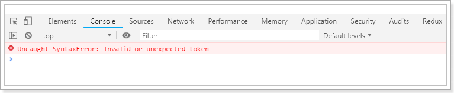

原因是，在 ES6 中，并没有支持该用法，在 ES2017 中才有，所以不能直接运行了，需要进行编码后再运行。转码的意思是：将 ES6 或 ES2017 转为 ES5 执行。类似这样：

```js
// 转码前
input.map(item => item + 1);
// 转码后
input.map(function (item) {
  return item + 1;
})
```

> 转码器相关内容详见《转码器》章节

### 14.2. 类的装饰

装饰器是一个可以装饰整个类，并对类进行处理的<font color=red>**函数**</font>。装饰器函数的第一个参数，就是所要装饰的目标类。

<font color=red>**注意，装饰器对类的行为的改变，是代码编译时发生的，而不是在运行时。这意味着，装饰器能在编译阶段运行代码。也就是说，装饰器本质就是编译时执行的函数。**</font>

#### 14.2.1. 给类增加静态属性

```js
@testable
class MyTestableClass {
    // ...
}

function testable(target) {
    target.isTestable = true;
}

MyTestableClass.isTestable // true
```

上面代码中，`@testable` 就是一个装饰器，`testable` 函数的参数 `target` 是 `MyTestableClass` 类本身。它修改了 `MyTestableClass` 这个类的行为，为它加上了静态属性 `isTestable`

装饰器的行为可以理解为：

```js
@decorator
class A {}

// 等同于
class A {}
A = decorator(A) || A;
```

#### 14.2.2. 装饰器传递参数

如果需要给装饰器传递参数，可以在装饰器外面再封装一层函数。

```java
function testable(isTestable) {
    return function(target) {
        target.isTestable = isTestable;
    }
}

// 传递参数
@testable(true)
class MyTestableClass {}
MyTestableClass.isTestable // true

@testable(false)
class MyClass {}
MyClass.isTestable // false
```

#### 14.2.3. 给类增加实例属性(多个)

如果想给目标类添加实例属性，可以对目标类的 `prototype` 对象上进行操作。

```js
function testable(target) {
  target.prototype.isTestable = true;
}

@testable
class MyTestableClass {}

let obj = new MyTestableClass();
obj.isTestable // true
```

如果需要给目标类添加多个实例属性，可以用 `Object.assign()` 方法来实现，这种做法也称为 Mixin 模式。所谓 Mixin 模式，就是对象继承的一种替代方案，中文译为“混入”（mix in），意为在一个对象之中混入另外一个对象的方法。

```js
// mixins.js
export function mixins(...list) {
    return function (target) {
        Object.assign(target.prototype, ...list)
    }
}

// main.js
import { mixins } from './mixins'
const Foo = {
    foo() { console.log('foo') }
};

@mixins(Foo)
class MyClass {}

let obj = new MyClass();
obj.foo() // 'foo'

// ********* 上面代码等价于 *********
const Foo = {
    foo() { console.log('foo') }
};

class MyClass {}
Object.assign(MyClass.prototype, Foo);

let obj = new MyClass();
obj.foo() // 'foo'
```

> 上面代码通过装饰器 `mixins`，把 `Foo` 对象的方法添加到了 `MyClass` 的实例上面。

### 14.3. 方法的装饰

装饰器不仅可以装饰类，还可以装饰类的属性。*装饰器也可以有注释的作用。*

#### 14.3.1. 基础使用

装饰类方法的装饰器函数一共可以接受三个参数。

- 参数1：类的原型对象，即`类.prototype`。装饰器的本意是要“装饰”类的实例，但是此实例还未生成，所以只能去装饰类的原型（这不同于类的装饰，那种情况时 `target` 参数指的是类本身）
- 参数2：被装饰的属性名称
- 参数3：该修饰属性(方法)的描述对象

```js
/**
 * 方法的装饰器
 * @param {*} target 类的原型对象，即 类.prototype
 * @param {*} name 被修饰属性的名称
 * @param {*} descriptor 该修饰属性(方法)的描述对象，原来的值如下：
 *                      { value: specifiedFunction, enumerable: false, configurable: true, writable: true }
 * @returns
 */
function foo(target, name, descriptor) {
  descriptor.writable = false
  return descriptor
}
```

基础示例使用

```js
class Person {
  @readonly
  name() {
    return `${this.first} ${this.last}`
  }

  @nonenumerable
  get kidCount() { return this.children.length; }
}

function readonly(target, name, descriptor) {
  descriptor.writable = false
  return descriptor
}

function nonenumerable(target, name, descriptor) {
  // 修改属性描述对象的enumerable属性，使得该属性不可遍历
  descriptor.enumerable = false;
  return descriptor;
}

readonly(Person.prototype, 'name', descriptor)
// 类似于
Object.defineProperty(Person.prototype, 'name', descriptor)
```

> 上面示例，装饰器（`readonly`）会修改属性的描述对象（`descriptor`），然后被修改的描述对象再用来定义属性

进阶使用示例：创建 `@log` 装饰器输出日志

```js
class Math {
  @log
  add(a, b) {
    return a + b
  }
}

function log(target, name, descriptor) {
  var oldValue = descriptor.value
  descriptor.value = function () {
    console.log(`Calling ${name} with`, arguments)
    return oldValue.apply(this, arguments)
  }
  return descriptor
}

const math = new Math()
// passed parameters should get logged now
math.add(2, 4)
```

> 上面代码中，`@log` 装饰器的作用就是在执行原始的操作之前，执行一次 `console.log`，从而达到输出日志的目的

#### 14.3.2. 多个方法装饰器执行顺序

如果同一个方法有多个装饰器，**先从外到内进入，然后由内向外执行**。

```js
function dec(id) {
  console.log('evaluated', id)
  return (target, property, descriptor) => console.log('executed', id)
}

class Example {
  @dec(1)
  @dec(2)
  method() {}
}
// evaluated 1
// evaluated 2
// executed 2
// executed 1
```

> 上面代码中，外层装饰器 `@dec(1)` 先进入，但是内层装饰器 `@dec(2)` 先执行。

### 14.4. core-decorators.js 工具类

core-decorators.js 是一个第三方模块，提供了几个常见的装饰器。

- `@autobind` 装饰器使得方法中的 this 对象，绑定原始对象。
- `@readonly` 装饰器使得属性或方法不可写。
- `@override` 装饰器检查子类的方法，是否正确覆盖了父类的同名方法，如果不正确会报错。
- `@deprecate` 或 `@deprecated` 装饰器在控制台显示一条警告，表示该方法将废除。
- `@suppressWarnings` 装饰器抑制 `@deprecated` 装饰器导致的 `console.warn()` 调用。但是，异步代码发出的调用除外。

## 15. 转码器

- Babel (babeljs.io) 是一个广为使用的 ES6 转码器，可以将 ES6 代码转为 ES5 代码，从而在浏览器或其他环境执行。
- Google 公司的 Traceur 转码器 (github.com/google/traceur-compiler)， 也可以将 ES6 代码转为ES5的代码。

这2款都是非常优秀的转码工具，后面的案例项目是使用阿里的开源企业级react框架：UmiJS。

### 15.1. Babel 转码器

Babel 是一个广泛使用的 ES6 转码器，可以将 ES6 代码转为 ES5 代码，从而在老版本的浏览器执行。这意味着，可以用 ES6 的方式编写程序，又不用担心现有环境是否支持。转换效果如下：

```js
// 转码前
input.map(item => item + 1);

// 转码后
input.map(function (item) {
    return item + 1;
});
```

上面的原始代码用了箭头函数，Babel 将其转为普通函数，就能在不支持箭头函数的 JavaScript 环境执行了。

#### 15.1.1. 安装 Babel

项目目录中，使用以下命令安装 Babel

```bash
$ npm install --save-dev @babel/core
```

#### 15.1.2. 配置文件 .babelrc

Babel 的配置文件是 `.babelrc`，存放在项目的根目录下。使用 Babel 的第一步，就是配置这个文件。该文件用来设置转码规则和插件，基本格式如下。

```json
{
  "presets": [],
  "plugins": []
}
```

`presets` 字段设定转码规则，官方提供以下的规则集，可以根据需要安装。

```bash
# 最新转码规则
$ npm install --save-dev @babel/preset-env

# react 转码规则
$ npm install --save-dev @babel/preset-react
```

然后，将这些规则加入 `.babelrc`

```json
{
    "presets": [
        "@babel/env",
        "@babel/preset-react"
    ],
    "plugins": []
}
```

> **注意，以下所有 Babel 工具和模块的使用，都必须先写好 `.babelrc`。**

#### 15.1.3. 命令行转码

Babel 提供命令行工具 `@babel/cli`，用于命令行转码。安装命令如下：

```bash
$ npm install --save-dev @babel/cli
```

基本用法如下：

```bash
# 转码结果输出到标准输出
$ npx babel example.js

# 转码结果写入一个文件
# --out-file 或 -o 参数指定输出文件
$ npx babel example.js --out-file compiled.js
# 或者
$ npx babel example.js -o compiled.js

# 整个目录转码
# --out-dir 或 -d 参数指定输出目录
$ npx babel src --out-dir lib
# 或者
$ npx babel src -d lib

# -s 参数生成source map文件
$ npx babel src -d lib -s
```

### 15.2. UmiJS

官网： https://umijs.org/zh/

UmiJS 读音：（Omi）。其特点如下：

- 插件化
    - umi 的整个生命周期都是插件化的，甚至其内部实现就是由大量插件组成，比如 pwa、按需加载、一键切换 preact、一键兼容 ie9 等等，都是由插件实现。
- 开箱即用
    - 你只需一个 umi 依赖就可启动开发，无需安装 react、preact、webpack、react-router、babel、jest 等等。
- 约定式路由
    - 类 next.js 的约定式路由，无需再维护一份冗余的路由配置，支持权限、动态路由、嵌套路由等等。

#### 15.2.1. 部署安装

1. 确认是否安装node.js

```shell
# 首先，需要安装Node.js，安装完成后，通过node -v 命令查看其版本号
PS C:\Users\MoonZero> node -v
v10.15.3
```

2. ~~教程推荐使用yarn或者tyarn~~，测试使用不好用，下次时不需要安装此步骤

```shell
# 接下来，开始安装yarn，其中tyarn使用的是npm.taobao.org的源，速度要快一些
# 可以把yarn看做了优化了的npm
npm i yarn tyarn -g  # -g 是指全局安装
tyarn -v # 进行测试，如果能够正常输出版本信息则说明安装成功了
```

3. 安装umi

```shell
# 如果安装失败，是由于将yarn添加到环境变量中导致，参见http://www.easysb.cn/2017/06/115.html
# 下面开始安装umi（使用yarn安装不好用，直接使用npm安装）
npm install -g umi # 或者yarn global add umi 或者 tyarn global add umi
# 进行测试（如果使用umi命令时，提示无法找到该命令，是因为没有配置环境变量导致）
umi
```

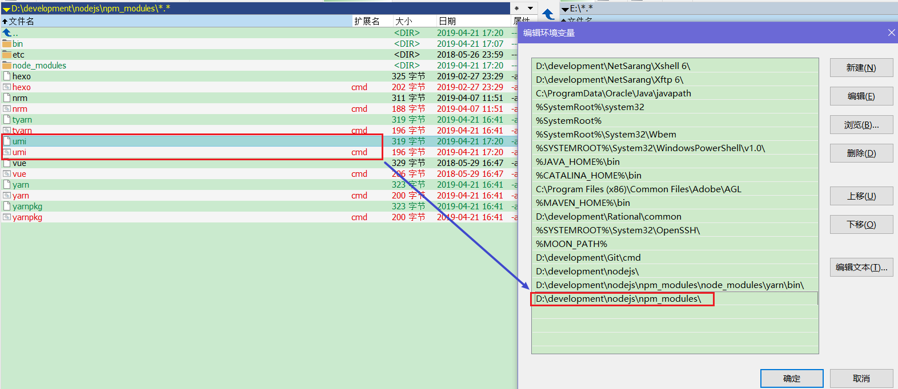

#### 15.2.2. 快速入门

```shell
# 进入测试工程的文件夹中，通过初始化命令将生成package.json文件，它是 NodeJS 约定的用来存放项目的信息和配置等信息的文件。
npm init -y
# 通过umi命令创建index.js文件
umi g page index  # 可以看到在pages下创建好了index.js和index.css文件
```

将下面内存拷贝到index.js文件中进行测试

```js
@T //通过@符号进行引用该方法，类似java中的注解
class User {
  constructor(name, age = 20) {
    this.name = name;
    this.age = age;
  }
}

function T(target) { // 定义一个普通的方法
  console.log(target); // target对象为修饰的目标对象，这里是User对象
  target.country = "中国"; // 为User类添加一个静态属性country
}
console.log(User.country); // 打印出country属性值
```

```shell
# 通过命令行启动umi的后台服务,用于本地开发
umi dev
# 通过浏览器进行访问：http://localhost:8000/，查看效果
# 值得注意的是，这里访问的是umi的后台服务，不是idea提供的服务
```

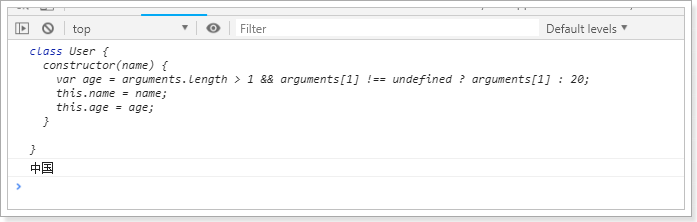

查看编码后的js文件，可以看到，将上面写的代码进行的编码。

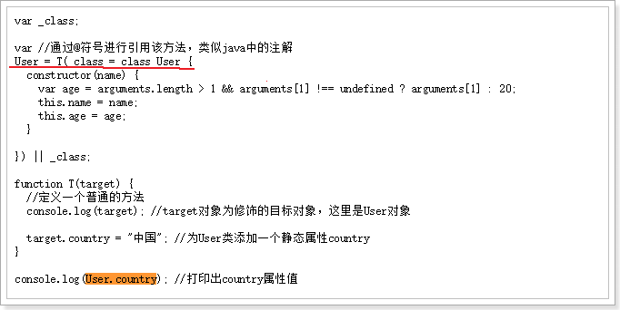
