# Vue2.x 基础笔记

Vue 官网：https://cn.vuejs.org/

> 以下是vue的学习笔记，大部分内容引用官网

## 1. Vue 简介

近年前端开发趋势，架构从传统后台 MVC 向 REST API + 前端 `MV*` 迁移，`MV*`包括：MVC、MVP、MVVM（如：Angular.js/react.js/Vue.js）

MVVM 框架，针对具有复杂交互逻辑的前端应用，提供基础的架构抽象，通过 Ajax 数据持久化，保存前端用户体验

Vue (读音 /vjuː/，类似于 view) 是一套用于构建用户界面的<font color=red>**渐进式框架**</font>。

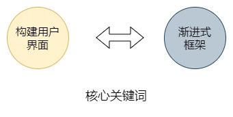

核心思想：**数据驱动 + 组件化的前端开发**。Vue.js最轻量。借鉴了angular的指令和react的组件化

### 1.1. vue 的特性

vue 框架的特性，主要体现在如下两方面：

- <font color=red>**数据驱动视图**</font>
- <font color=red>**双向数据绑定**</font>

#### 1.1.1. 数据驱动视图

在使用了 vue 的页面中，vue 会<font color=red>**监听数据的变化**</font>，从而<font color=red>**自动重新渲染**</font>页面的结构。示意图如下：

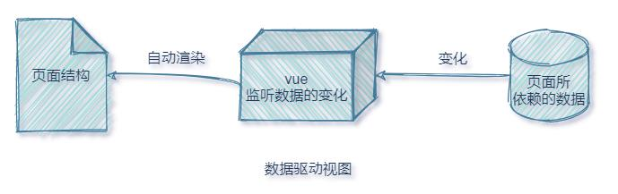

数据驱动视图的优点是：当页面数据发生变化时，页面会自动重新渲染！

值得注意是：<font color=red>**数据驱动视图是单向的数据绑定**</font>。

#### 1.1.2. 双向数据绑定

在填写表单时，双向数据绑定可以辅助开发者在不操作 DOM 的前提下，自动把用户填写的内容同步到数据源中。示意图如下：

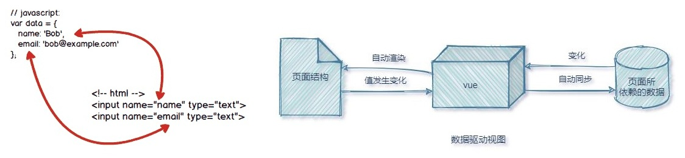

双向数据绑定的优点：开发者不再需要手动操作 DOM 元素，来获取表单元素最新的值！

#### 1.1.3. 组件化

组件的作用：扩展HTML元素，封装可重用的代码。**组件设计原则**如下；

- 页面上每个独立的可视/可交互区域视为一个组件
- 每个组件对应一个工程目录，组件所需要的各种资料在此目录下就近维护
- 页面是组件的容器，组件可以嵌套自由组合形成完整的页面

### 1.2. Vue 底层原理

#### 1.2.1. MVVM 概念

MVVM 是 vue 实现**数据驱动视图**和**双向数据绑定**的核心原理。MVVM 指的是 Model、View 和 ViewModel，它把每个 HTML 页面都拆分成了这三个部分，如图所示：

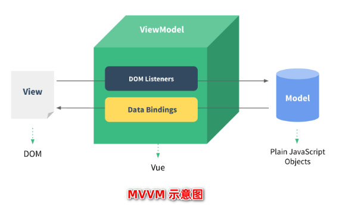

- `Model`：表示当前页面渲染时所依赖的数据源。
- `View`：表示当前页面所渲染的 DOM 结构。
- `ViewModel`：表示 vue 的实例，它是 MVVM 的核心。

#### 1.2.2. MVVM 的工作原理

<font color=red>ViewModel 作为 MVVM 的核心</font>，是它把当前页面的数据源（Model）和页面的结构（View）连接在了一起。

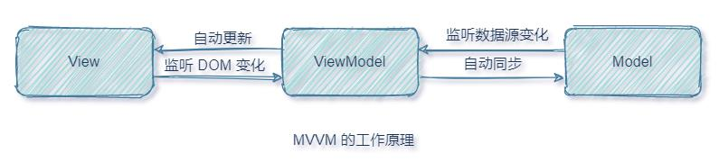

- 当**数据源发生变化**时，会被 ViewModel 监听到，ViewModel 会根据最新的数据源**自动更新**页面的结构
- 当**表单元素的值发生变化**时，也会被 ViewModel 监听到，ViewModel 会把变化过后最新的值**自动同步**到 Model 数据源中

### 1.3. vue 版本介绍

当前（2021年），vue 共有 3 个大版本，其中：

- ~~1.x 版本~~ 几乎被淘汰，不再建议学习与使用
- 2.x 版本 是目前企业级项目开发中的**主流版本**。但在未来（1 ~ 2年内）会被逐渐淘汰
- 3.x 版本 于 2020-09-19 发布，生态还不完善，尚未在企业级项目开发中普及和推广。但是未来企业级项目开发的趋势

### 1.4. Vue 基本使用步骤

1. 导入 vue.js 的 script 脚本文件
2. 在页面中声明一个将要被 vue 所控制的 DOM 区域
3. 创建 vm 实例对象（vue 实例对象）

```html
<!-- 1. 导入 Vue 的库文件，在 window 全局就有了 Vue 这个构造函数 -->
<script src="./lib/vue-2.6.12.js"></script>
<!-- 2. 创建 Vue 的实例对象 -->
<script>
    window.onload = function () {
        // 创建 Vue 的实例对象，即 ViewModel
        const vm = new Vue({
            // el 属性是固定的写法，表示当前 vm 实例要控制页面上的哪个区域，接收的值是一个选择器，即View 视图区域
            el: '#app',
            // data 指向的对象就是要渲染到页面上的数据，即 Model 数据源
            data: {
                username: 'MooNkirA',
            },
        });
    };
</script>

<body>
    <!-- 在页面中声明一个被 vue 所控制的 DOM 区域。
        其中id的值为创建vue实例对象时的 el 属性挂载点，
        由此 DOM 元素就由 vue 控制，可将数据源填充到此 DOM 元素中 -->
    <div id="app">{{ username }}</div>
</body>
```

## 2. Vue 实例

### 2.1. 创建一个 Vue 实例

每个 Vue 应用都是通过用 Vue 函数创建一个新的 Vue 实例开始的：

```js
var vm = new Vue({
  // 选项
})
```

> 注：经常会使用 vm (ViewModel 的缩写) 这个变量名表示 Vue 实例。

当创建一个 Vue 实例时，可以传入一个**选项对象**。一个 Vue 应用由一个通过 `new Vue` 创建的**根 Vue 实例**，以及可选的嵌套的、可复用的组件树组成。

### 2.2. 数据与方法

- 当一个 Vue 实例被创建时，它将 `data` 对象中的所有的 property 加入到 Vue 的**响应式系统**中。当这些 property 的值发生改变时，视图将会产生“响应”，即匹配更新为新的值。当这些数据改变时，视图会进行重渲染。
- <font color=red>**值得注意的是只有当实例被创建时就已经存在于 data 中的 property 才是响应式的**</font>。如果创建实例后再添加一个新的 property，那么此 property 改变将不会触发任何视图的更新。
- 除了数据 property，Vue 实例还暴露了一些有用的实例 property 与方法。它们都有前缀 `$`，以便与用户定义的 property 区分开来。

示例：

```js
// 定义 data 数据对象
const data = { a: 1 };

// 创建 Vue 的实例对象，即 ViewModel。可以传入一个选项对象
const vm = new Vue({
    // el 属性提供一个在页面上已存在的 DOM 元素作为 Vue 实例的挂载目标
    el: '#app',
    // data 对象中的所有的 property 将加入到 Vue 的响应式系统中
    data: data,
});

// 获得这个实例上的 property
// 返回源数据中对应的字段
console.log('vm.a == data.a => ', vm.a == data.a); // => true

// 设置 vue 实例中的 property 也会影响到原始数据
vm.a = 2;
console.log('vm.a = 2, data.a => ', data.a); // => 2

// ……反之亦然
data.a = 3;
console.log('data.a = 3, vm.a => ', vm.a);

// 值得注意：只有当实例被创建时就已经存在于 data 中的 property 才是响应式的。
// 如果创建实例后添加一个新的 property，那么此property改变将不会触发任何视图的更新。
vm.b = 2;

// 除了数据 property，Vue 实例还暴露了一些有用的实例 property 与方法。它们都有前缀 $，以便与用户定义的 property 区分开来。
console.log('vm.$data === data => ', vm.$data === data); // => true
console.log(
    'vm.$el === document.getElementById("app")  => ',
    vm.$el === document.getElementById('app')
); // => true

// $watch 是一个实例方法
vm.$watch('a', function (newValue, oldValue) {
    // 这个回调将在 `vm.a` 改变后调用
    console.log(
        'a newValue is %d, a oldValue is %d',
        newValue,
        oldValue
    );
});
vm.a = 10; // 触发 vue 实例的 watch 方法
```

### 2.3. Vue 实例生命周期钩子

每个 Vue 实例在被创建时都要经过一系列的初始化过程。*如：需要设置数据监听、编译模板、将实例挂载到 DOM 并在数据变化时更新 DOM 等*。生命周期（Life Cycle）就是指一个实例（vue组件）从创建 -> 运行 -> 销毁的整个阶段，强调的是一个时间段。

在这个过程中也会运行一些叫做**生命周期钩子的函数**，是由 vue 框架提供的**内置函数**，会伴随着组件的生命周期，**自动按次序执行**。让使用者在不同阶段添加自己的代码的机会。常见的生命周期钩子方法有：

- beforeCreate
- created
- beforeMount
- mounted
- beforeUpdate
- updated
- beforeDestroy
- destroyed

以上生命周期钩子函数，在实例生命周期的不同阶段被调用。<font color=red>**生命周期钩子的 `this` 上下文指向调用它的 Vue 实例**</font>。

> **特别注意**：不要在选项对象 property 或回调上使用箭头函数，比如 `created: () => console.log(this.a)` 或 `vm.$watch('a', newValue => this.myMethod())`。因为箭头函数并没有 `this`，`this` 会作为变量一直向上级词法作用域查找，直至找到为止，经常导致 `Uncaught TypeError: Cannot read property of undefined` 或 `Uncaught TypeError: this.myMethod is not a function` 之类的错误。
>
> 总结：生命周期强调的是时间段，生命周期函数强调的是时间点。


生命周期钩子使用示例。比如 `created` 钩子可以用来在一个实例被创建之后执行代码：

```js
new Vue({
  data: {
    a: 1
  },
  created: function () {
    // `this` 指向 vm 实例
    console.log('a is: ' + this.a)
  }
})
// => "a is: 1"
```

### 2.4. 生命周期图示

> 参考 vue 官方文档的“生命周期图示”：https://cn.vuejs.org/v2/guide/instance.html#生命周期图示

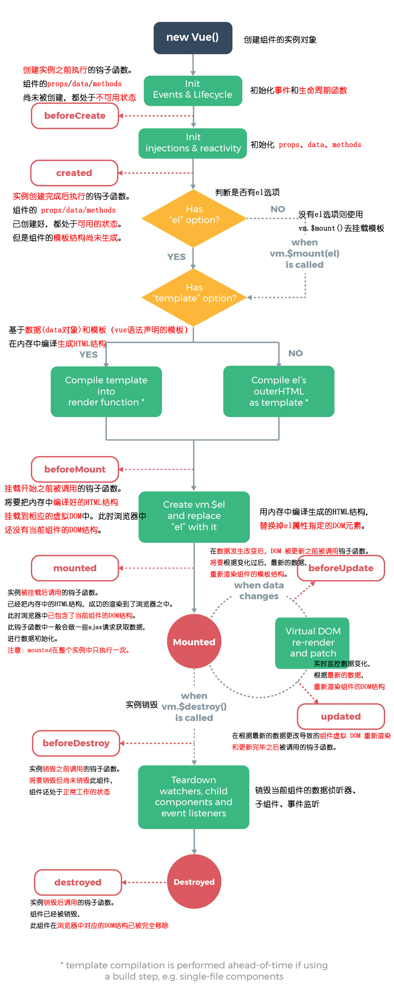

<font color=red>**特别值得注意的是：`created`钩子函数和`mounted`钩子函数的区别**</font>

## 3. vue 的指令

指令（Directives）是 vue 为开发者提供的<font color=red>**模板语法**</font>，用于**辅助开发者渲染页面的基本结构**。

vue 中的指令按照不同的用途可以分为如下 6 大类：

1. 内容渲染指令
2. 属性绑定指令
3. 事件绑定指令
4. 双向绑定指令
5. 条件渲染指令
6. 列表渲染指令

> 注意：指令是 vue 开发中最基础、最常用、最简单的知识点

### 3.1. 模板语法

Vue.js 使用了基于 HTML 的模板语法，允许开发者声明式地将 DOM 绑定至底层 Vue 实例的数据。所有 Vue.js 的模板都是合法的 HTML，所以能被遵循规范的浏览器和 HTML 解析器解析。

在底层的实现上，Vue 将模板编译成虚拟 DOM 渲染函数。结合响应系统，Vue 能够智能地计算出最少需要重新渲染多少组件，并把 DOM 操作次数减到最少。

实际开发也可以不用模板，直接写渲染 (render) 函数，使用可选的 JSX 语法。

### 3.2. 内容渲染指令

#### 3.2.1. v-text

`v-text` 作为元素的属性来定义，更新标签体内容。<font color=red>**注意：`v-text` 指令会覆盖元素内默认的值**</font>。

```html
<span v-text="msg"></span>
```

#### 3.2.2. 插值表达式 {{ }}

vue 提供的 `{{ }}` 语法，专门用来解决 `v-text` 会覆盖默认文本内容的问题。这种 `{{ }}` 语法的专业名称是插值表达式（英文名为：Mustache，双大括号），是数据绑定最常见的形式。

Mustache 标签将会被替代为对应数据对象上 msg property 的值。无论何时，绑定的数据对象上 msg property 发生了改变，插值处的内容都会更新。

```html
<span>Message: {{ msg }}</span>
```

通过使用 `v-once` 指令，能执行一次性地插值，当数据改变时，插值处的内容不会更新。*但请留心这会影响到该节点上的其它数据绑定*

```html
<span>Message: {{ msg }}</span>
```

> 注意：相对于 v-text 指令来说，插值表达式在开发中更常用一些！因为它不会覆盖元素中默认的文本内容。

#### 3.2.3. v-html

`v-text` 指令和插值表达式只能渲染纯文本内容。如果要把包含 HTML 标签的字符串渲染为页面的 HTML 元素，则需要用到 `v-html` 这个指令：

```html
<p>Using mustaches: {{ rawHtml }}</p>
<p>Using v-html directive: <span v-html="rawHtml"></span></p>
```

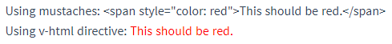

这个 `span` 的内容将会被替换成为 property 值 `rawHtml`，直接作为 HTML——会忽略解析 property 值中的数据绑定。

#### 3.2.4. 内容渲染指令示例

```html
<script>
    window.onload = function () {
        const vm = new Vue({
            el: '#app',
            data: {
                username: 'MooNkirA',
                gender: '女',
                info: '<h4 style="color: red; font-weight: bold;">我是用样式的标签字符串</h4>',
                msg: '我是初始值',
            },
        });

        // 改变 msg 属性值，测试 v-once 的一次性地插值效果
        vm.msg = '我已经变了！！';
    };
</script>

<body>
    <div id="app">
        <!-- v-text 更新元素的标签内容 -->
        <p v-text="username"></p>
        <!-- 注意：v-text 更新的内容会将标签体内容全部覆盖 -->
        <p v-text="gender">性别：</p>

        <hr />

        <!-- 文本插值 {{  }}。双大括号会将数据解释为普通文本，而非 HTML 代码。 -->
        <p>姓名：{{ username }}</p>
        <p>性别：{{ gender }}</p>
        <!-- 通过使用 v-once 指令，能执行一次性地插值，当数据改变时，插值处的内容不会更新。但请留心这会影响到该节点上的其它数据绑定： -->
        <span v-once>这个将不会改变: {{ msg }}</span>

        <hr />

        <div v-text="info"></div>
        <div>{{ info }}</div>
        <!-- v-html 将标签体内容直接作为 HTML —— 会忽略解析 property 值中的数据绑定。 -->
        <div v-html="info"></div>
    </div>
</body>
```

### 3.3. 属性绑定指令

#### 3.3.1. v-bind

如果需要为元素的属性动态绑定属性值，则需要用到 `v-bind` 属性绑定指令。用法示例如下：

```html
<div v-bind:id="dynamicId"></div>
```

对于布尔类型的属性(它们只要存在就意味着值为 `true`)，`v-bind` 处理有所不同，如下例：

```html
<button v-bind:disabled="isButtonDisabled">Button</button>
```

上例如果 `isButtonDisabled` 的值是 `null`、`undefined` 或 `false`，则 `disabled` 属性甚至不会被包含在渲染出来的 `<button>` 元素中。

由于 `v-bind` 指令在开发中使用频率非常高，因此，vue 官方提供了属性绑定指令的简写形式（简写为英文的 `:` ）。

```htmL
<!-- 缩写 -->

```

#### 3.3.2. 使用 Javascript 表达式

在 vue 提供的模板渲染语法中，除了支持绑定简单的数据值之外，还支持 Javascript 表达式的运算，例如：

```html
<div>{{ number + 1 }}</div>
<div>{{ ok ? 'YES' : 'NO' }}</div>
<div>{{ message.split('').reverse().join('') }}</div>
<div v-bind:id="'list-' + id"></div>
```

表达式有个限制就是，每个绑定都只能包含单个表达式，所以下面的例子都不会生效：

```html
<!-- 这是语句，不是表达式 -->
{{ var a = 1 }}
<!-- 流控制也不会生效，请使用三元表达式 -->
{{ if (ok) { return message } }}
```

#### 3.3.3. 属性绑定指令示例

```html
<script>
    window.onload = function () {
        const vm = new Vue({
            el: '#app',
            data: {
                tips: '请输入用户名',
                photo: 'https://cn.vuejs.org/images/logo.svg',
                index: 3,
            },
        });
    };
</script>

<body>
    <div id="app">
        <!-- v-bind 属性绑定 -->
        <input type="text" v-bind:placeholder="tips" />
        <hr />
        <!-- vue 规定 v-bind: 指令可以简写为 : -->
        

        <hr />

        <!-- 使用 JavaScript 表达式。其限制就是，每个绑定都只能包含单个表达式 -->
        <div>1 + 2 的结果是：{{ 1 + 2 }}</div>
        <div>
            {{ tips }} 反转的结果是：{{ tips.split('').reverse().join('') }}
        </div>
        <!-- 表达式后结果是 box3 -->
        <div :title="'box' + index">这是一个 div</div>

        <!-- 这是语句，不是表达式 -->
        <!-- <div>不会生效的 JavaScript 表达式：{{ var a = 1 }}</div> -->
        <!-- 流控制也不会生效，请使用三元表达式 -->
        <!-- <div>
            不会生效的 JavaScript 表达式：{{ if (ok) { return msg } }}
        </div> -->
    </div>
</body>
```

#### 3.3.4. Class 与 Style 绑定

操作元素的 `class` 列表和内联样式是数据绑定的一个常见需求。因为它们都是 attribute，所以可以用 `v-bind` 处理它们：只需要通过表达式计算出字符串结果即可。不过，字符串拼接麻烦且易错。因此，在将 `v-bind` 用于 `class` 和 `style` 时，Vue.js 做了专门的增强。表达式结果的类型除了字符串之外，还可以是对象或数组。

##### 3.3.4.1. 绑定 HTML Class

- **对象语法**

使用 `v-bind:class` 一个对象，以动态地切换 class：

```html
<div v-bind:class="{ active: isActive }"></div>
```

在对象中传入更多字段来动态切换多个 `class`。此外，`v-bind:class` 指令也可以与普通的 class attribute 共存。

```html
<div
  class="static"
  v-bind:class="{ active: isActive, 'text-danger': hasError }"
></div>
```

```js
data: {
  isActive: true,
  hasError: false
}
```

最后渲染结果：

```html
<div class="static active"></div>
```

可以将class属性都绑定的数据对象，并通过计算属性来返回此对象

```html
<div v-bind:class="classObject"></div>
```

```js
data: {
  isActive: true,
  error: null
},
computed: {
  classObject: function () {
    return {
      active: this.isActive && !this.error,
      'text-danger': this.error && this.error.type === 'fatal'
    }
  }
}
```

- **数组语法**

可以把一个数组传给 `v-bind:class`，以应用一个 `class` 列表：

```html
<div v-bind:class="[activeClass, errorClass]"></div>
```

```js
data: {
  activeClass: 'active',
  errorClass: 'text-danger'
}
```

渲染结果：

```html
<div class="active text-danger"></div>
```

想根据条件切换列表中的 class，可以用三元表达式：

```html
<div v-bind:class="[isActive ? activeClass : '', errorClass]"></div>
```

当有多个条件 class 时三元表达式的方式会比较繁琐，可以在数组语法中也可以使用对象语法：

```html
<div v-bind:class="[{ active: isActive }, errorClass]"></div>
```

- **用在组件上**

当在一个自定义组件上使用 `class` 属性时，这些 `class` 将被添加到该组件的根元素上面。这个元素上已经存在的 `class` 不会被覆盖。

```js
Vue.component('my-component', {
  template: '<p class="foo bar">Hi</p>'
})
```

使用组件时添加一些class属性：

```html
<my-component class="baz boo"></my-component>

<!-- 带数据绑定 class -->
<my-component v-bind:class="{ active: isActive }"></my-component>
```

HTML 将被渲染为：

```html
<p class="foo bar baz boo">Hi</p>

<!-- 当 isActive 为 true 时，会增加 “active” 的类属性 -->
<p class="foo bar active">Hi</p>
```

##### 3.3.4.2. 绑定内联样式

- **对象语法**

`v-bind:style` 的对象语法绑定样式，CSS property 名可以用驼峰式 (camelCase) 或短横线分隔 (kebab-case，记得用引号括起来) 来命名：

```html
<div v-bind:style="{ color: activeColor, fontSize: fontSize + 'px' }"></div>
```

```js
data: {
  activeColor: 'red',
  fontSize: 30
}
```

或直接绑定到一个样式对象会让模板更清晰，同样的，对象语法常常结合返回对象的计算属性使用。

```html
<div v-bind:style="styleObject"></div>
```

```js
data: {
  styleObject: {
    color: 'red',
    fontSize: '13px'
  }
}
```

- **数组语法**

`v-bind:style` 的数组语法可以将多个样式对象应用到同一个元素上：

```html
<div v-bind:style="[baseStyles, overridingStyles]"></div>
```

- **自动添加前缀**

当 `v-bind:style` 使用需要添加浏览器引擎前缀的 CSS property 时，如 `transform`，Vue.js 会自动侦测并添加相应的前缀。

- **多重值**

2.3.0+ 版本后，`style` 绑定中的 property 提供一个包含多个值的数组，常用于提供多个带前缀的值，例如：

```html
<!-- 在本例中，如果浏览器支持不带浏览器前缀的 flexbox，那么就只会渲染 display: flex -->
<div :style="{ display: ['-webkit-box', '-ms-flexbox', 'flex'] }"></div>
```

> 这样写只会渲染数组中最后一个被浏览器支持的值。

### 3.4. 事件绑定指令

#### 3.4.1. v-on 监听事件

vue 提供了 `v-on` 事件绑定指令，用来为 DOM 元素绑定事件监听器，并在触发时运行一些 JavaScript 代码。语法格式如下：

```html
<div id="example-1">
  <button v-on:click="counter += 1">Add 1</button>
  <p>The button above has been clicked {{ counter }} times.</p>
</div>

<script>
  var example1 = new Vue({
    el: '#example-1',
    data: {
      counter: 0
    }
  })
</script>
```

> 注意：原生 DOM 对象有 `onclick`、`oninput`、`onkeyup` 等原生事件，替换为 vue 的事件绑定形式后，分别为：`v-on:click`、`v-on:input`、`v-on:keyup`

#### 3.4.2. 事件绑定的简写形式

由于 `v-on` 指令在开发中使用频率非常高，因此，vue 官方为其提供了简写形式（简写为英文的 `@` ）。

```html
<!-- 缩写 -->
<button @click="doThis"></button>
```

#### 3.4.3. 事件处理方法

如果事件处理逻辑会更为复杂，会将处理逻辑封装成函数方法。因此 `v-on` 还可以接收一个需要调用的方法名称。而 `v-on` 绑定的事件处理函数，需要在 `methods` 节点中进行声明。

在原生的 DOM 事件绑定中，可以在事件处理函数的形参处，接收事件参数对象 event。同理，在 v-on 指令（简写为 @ ）所绑定的事件处理函数中，同样可以接收到事件参数对象 event

```html
<div id="example-2">
  <!-- `greet` 是在下面定义的方法名 -->
  <button v-on:click="greet">Greet</button>
</div>

<script>
    var example2 = new Vue({
      el: '#example-2',
      data: {
        name: 'Vue.js'
      },
      // 在 `methods` 对象中定义方法
      methods: {
        greet: function (event) {
          // `this` 在方法里指向当前 Vue 实例
          alert('Hello ' + this.name + '!')
          // `event` 是原生 DOM 事件
          if (event) {
            alert(event.target.tagName)
          }
        }
      }
    })

    // 也可以用 JavaScript 直接调用方法
    example2.greet() // => 'Hello Vue.js!'
</script>
```

#### 3.4.4. 内联处理器中的方法

除了直接绑定到一个方法，也可以在内联 JavaScript 语句中调用方法，即可以使用 `()` 给方法进行传参：

```html
<div id="example-3">
  <button v-on:click="say('hi')">Say hi</button>
  <button v-on:click="say('what')">Say what</button>
</div>

<script>
    new Vue({
      el: '#example-3',
      methods: {
        say: function (message) {
          alert(message)
        }
      }
    })
</script>
```

如需要在内联语句处理器中访问原始的 DOM 事件。可以用特殊变量 `$event` 把它传入方法：

```html
<button v-on:click="warn('Form cannot be submitted yet.', $event)">
  Submit
</button>

<script>
    // ...
    methods: {
      warn: function (message, event) {
        // 现在我们可以访问原生事件对象
        if (event) {
          event.preventDefault()
        }
        alert(message)
      }
    }
</script>
```

`$event` 是 vue 提供的特殊变量，用来表示原生的事件参数对象 `event`。`$event` 可以解决事件参数对象 `event` 被覆盖的问题。

#### 3.4.5. 事件修饰符

在事件处理函数中调用` event.preventDefault()` 或 `event.stopPropagation()` 是非常常见的需求。因此，vue 提供了事件修饰符的概念，更方便的对事件的触发进行控制。从而方法只有纯粹的数据逻辑，而不是去处理 DOM 事件细节。常用的 5 个事件修饰符如下：

| 事件修饰符  |                          说明                           |
| :--------: | ------------------------------------------------------- |
| `.prevent` | 阻止默认行为（例如：阻止 `<a>` 连接的跳转、阻止表单的提交等） |
|  `.stop`   | 阻止事件冒泡                                             |
| `.capture` | 以捕获模式触发当前的事件处理函数                            |
|  `.once`   | 绑定的事件只触发1次                                       |
|  `.self`   | 只有在 `event.target` 是当前元素自身时触发事件处理函数      |

```html
<!-- 阻止单击事件继续传播 -->
<a v-on:click.stop="doThis"></a>

<!-- 提交事件不再重载页面 -->
<form v-on:submit.prevent="onSubmit"></form>

<!-- 修饰符可以串联 -->
<a v-on:click.stop.prevent="doThat"></a>

<!-- 只有修饰符 -->
<form v-on:submit.prevent></form>

<!-- 添加事件监听器时使用事件捕获模式 -->
<!-- 即内部元素触发的事件先在此处理，然后才交由内部元素进行处理 -->
<div v-on:click.capture="doThis">...</div>

<!-- 只当在 event.target 是当前元素自身时触发处理函数 -->
<!-- 即事件不是从内部元素触发的 -->
<div v-on:click.self="doThat">...</div>

<!-- 2.1.4 新增 点击事件将只会触发一次 -->
<a v-on:click.once="doThis"></a>

<!-- 2.3.0 新增 滚动事件的默认行为 (即滚动行为) 将会立即触发 -->
<!-- 而不会等待 `onScroll` 完成  -->
<!-- 这其中包含 `event.preventDefault()` 的情况 -->
<div v-on:scroll.passive="onScroll">...</div>
```

> 使用修饰符时，顺序很重要；相应的代码会以同样的顺序产生。因此，用 `@click.prevent.self` 会阻止所有的点击，而 `@click.self.prevent` 只会阻止对元素自身的点击。
>
> 这个 `.passive` 修饰符尤其能够提升移动端的性能。不要把 `.passive` 和 `.prevent` 一起使用，因为 `.prevent` 将会被忽略，同时浏览器可能会向你展示一个警告。请记住，`.passive` 会告诉浏览器你不想阻止事件的默认行为。

#### 3.4.6. 按键修饰符

在监听键盘事件时，经常需要判断详细的按键。Vue 允许为 `v-on` 在监听键盘事件时添加按键修饰符，例如：

```html
<!-- 只有在 `key` 是 `Enter` 时调用 `vm.submit()` -->
<input v-on:keyup.enter="submit">
```

也可以直接将 `KeyboardEvent.key` 暴露的任意有效按键名转换为 `kebab-case` 来作为修饰符。

```html
<!-- 处理函数只会在 $event.key 等于 PageDown 时被调用。 -->
<input v-on:keyup.page-down="onPageDown">
```

#### 3.4.7. 事件绑定指令示例

```html
<script>
    window.onload = function () {
        const vm = new Vue({
            el: '#app',
            data: {
                count: 0,
            },
            methods: {
                add(n) {
                    // 在 methods 处理函数中，this 就是 new 出来的 vm 实例对象
                    console.log(vm === this);
                    console.log(vm);
                    this.count += n;
                },
                sub() {
                    // console.log('触发了 sub 处理函数')
                    this.count -= 1;
                },
                addEvent(e) {
                    this.count += 2;
                    console.log(e);

                    // 判断 this.count 的值是否为偶数
                    if (this.count % 2 === 0) {
                        // 偶数
                        e.target.style.backgroundColor = 'red';
                    } else {
                        // 奇数
                        e.target.style.backgroundColor = '';
                    }
                },
                addEvent1(e, n) {
                    this.count += n;
                    console.log(e);

                    // 判断 this.count 的值是否为偶数
                    if (this.count % 2 === 0) {
                        // 偶数
                        e.target.style.backgroundColor = 'pink';
                    } else {
                        // 奇数
                        e.target.style.backgroundColor = '';
                    }
                },
                show() {
                    console.log('点击了 a 链接');
                },
                btnHandler() {
                    console.log('btnHandler');
                },
                divHandler() {
                    console.log('divHandler');
                },
                clearInput(e) {
                    console.log('触发了 clearInput 方法');
                    e.target.value = '';
                },
                commitAjax(e) {
                    console.log('触发了 commitAjax 方法');
                    console.log('发送数据：' + e.target.value);
                },
            },
        });
    };
</script>

<body>
    <div id="app">
        <p>count 的值是：{{ count }}</p>
        <!-- 直接触发 JavaScript 代码 -->
        <button v-on:click="count += 10">JavaScript 代码 +10</button>
        <!-- 在绑定事件处理函数的时候，可以使用 () 传递参数 -->
        <button v-on:click="add(1)">函数传参 +1</button>
        <!-- v-on: 指令可以被简写为 @ -->
        <button @click="sub">指令简写 -1</button>

        <!-- 原生的 DOM 事件绑定接收事件参数对象 event -->
        <button @click="addEvent">获取原生 DOM 事件对象 +2</button>
        <!-- vue 提供了内置变量，名字叫做 $event，它就是原生 DOM 的事件对象 event -->
        <button @click="addEvent1($event, 3)">
            获取 vue 内置 $event 事件对象 +3
        </button>

        <hr />

        <!-- 事件修饰符 .prevent - 调用 event.preventDefault() -->
        <a href="#" @click.prevent="show">跳转</a>

        <hr />

        <div
            style="
                height: 150px;
                background-color: orange;
                padding-left: 100px;
                line-height: 150px;
            "
            @click="divHandler"
        >
            <!-- 事件修饰符 .stop - 调用 event.stopPropagation() -->
            <button @click.stop="btnHandler">按钮</button>
        </div>

        <hr />

        <!-- 指定事件按键修饰符 -->
        <input
            type="text"
            @keyup.esc="clearInput"
            @keyup.enter="commitAjax"
        />
    </div>
</body>
```

### 3.5. 双向绑定指令

vue 提供了 `v-model` 指令，在表单 `<input>`、`<textarea>` 及 `<select>` 元素上创建双向数据绑定。在不操作 DOM 的前提下，快速获取表单的数据。它会根据控件类型自动选取正确的方法来更新元素。它负责监听用户的输入事件以更新数据，并对一些极端场景进行一些特殊处理。

#### 3.5.1. v-model 基础使用

`v-model` 在内部为不同的输入元素使用不同的 property 并抛出不同的事件：

- `text` 和 `textarea` 元素使用 `value` property 和 `input` 事件
- `checkbox` 和 `radio` 使用 `checked` property 和 `change` 事件
- `select` 字段将 `value` 作为 `prop` 并将 `change` 作为事件

##### 3.5.1.1. 文本

```html
<input v-model="message" placeholder="edit me">
<p>Message is: {{ message }}</p>
```

##### 3.5.1.2. 文本

```html
<span>Multiline message is:</span>
<p style="white-space: pre-line;">{{ message }}</p>
<br>
<textarea v-model="message" placeholder="add multiple lines"></textarea>
```

> 在文本区域插值 (`<textarea>{{text}}</textarea>`) 并不会生效，应用 `v-model` 来代替。

##### 3.5.1.3. 复选框

单个复选框，绑定到布尔值：

```html
<input type="checkbox" id="checkbox" v-model="checked">
<label for="checkbox">{{ checked }}</label>
```

多个复选框，绑定到同一个数组：

```html
<input type="checkbox" id="jack" value="Jack" v-model="checkedNames">
<label for="jack">Jack</label>
<input type="checkbox" id="john" value="John" v-model="checkedNames">
<label for="john">John</label>
<input type="checkbox" id="mike" value="Mike" v-model="checkedNames">
<label for="mike">Mike</label>
<br>
<span>Checked names: {{ checkedNames }}</span>

<script>
    new Vue({
        el: '...',
        data: {
            checkedNames: []
        }
    })
</script>
```

##### 3.5.1.4. 单选按钮

```html
<div id="example-4">
  <input type="radio" id="one" value="One" v-model="picked">
  <label for="one">One</label>
  <br>
  <input type="radio" id="two" value="Two" v-model="picked">
  <label for="two">Two</label>
  <br>
  <span>Picked: {{ picked }}</span>
</div>

<script>
    new Vue({
        el: 'example-4',
        data: {
            picked: ''
        }
    })
</script>
```

##### 3.5.1.5. 选择框

单选

```html
<div id="example-5">
  <select v-model="selected">
    <option disabled value="">请选择</option>
    <option>A</option>
    <option>B</option>
    <option>C</option>
  </select>
  <span>Selected: {{ selected }}</span>
</div>

<script>
    new Vue({
        el: '...',
        data: {
            selected: ''
        }
    })
</script>
```

> 如果 `v-model` 表达式的初始值未能匹配任何选项，`<select>` 元素将被渲染为“未选中”状态。在 iOS 中，这会使用户无法选择第一个选项。因为这样的情况下，iOS 不会触发 `change` 事件。因此，更推荐像上面这样提供一个值为空的禁用选项。

多选时 (绑定到一个数组)：

```html
<div id="example-6">
  <select v-model="selected" multiple style="width: 50px;">
    <option>A</option>
    <option>B</option>
    <option>C</option>
  </select>
  <br>
  <span>Selected: {{ selected }}</span>
</div>
<script>
    new Vue({
        el: '...',
        data: {
            selected: []
        }
    })
</script>
```

#### 3.5.2. v-model 指令的修饰符

为了方便对用户输入的内容进行处理，vue 为 `v-model` 指令提供了 3 个修饰符

##### 3.5.2.1. .lazy

在默认情况下，`v-model` 在每次 `input` 事件触发后将输入框的值与数据进行同步 (除了上述输入法组合文字时)。你可以添加 `lazy` 修饰符，从而转为在 `change` 事件之后进行同步：

```html
<!-- 在“change”时而非“input”时更新 -->
<input v-model.lazy="msg">
```

##### 3.5.2.2. .number

如果想自动将用户的输入值转为数值类型，可以给 `v-model` 添加 `number` 修饰符：

```html
<input v-model.number="age" type="number">
```

> 注：输入框即使在 `type="number"` 时，HTML 输入元素的值也总会返回字符串。如果这个值无法被 `parseFloat()` 解析，则会返回原始的值。

##### 3.5.2.3. .trim

如果要自动过滤用户输入的首尾空白字符，可以给 `v-model` 添加 `trim` 修饰符：

```html
<input v-model.trim="msg">
```

#### 3.5.3. 在组件上使用 v-model（待整理）


### 3.6. 条件渲染指令

条件渲染指令用来辅助开发者按需控制 DOM 的显示与隐藏。条件渲染指令有如下两个，分别是：

- `v-if`
- `v-show`

#### 3.6.1. v-if

`v-if` 指令用于条件性地渲染一块内容。这块内容只会在指令的表达式返回 `true` 的时候被渲染。

```html
<h1 v-if="awesome">Vue is awesome!</h1>
```

#### 3.6.2. v-else

可以使用 `v-else` 指令来表示 `v-if` 的另一个分支：

```html
<div v-if="Math.random() > 0.5">
  Now you see me
</div>
<div v-else>
  Now you don't
</div>
```

<font color=red>**注意：`v-else` 指令必须紧跟在带 `v-if` 或者 `v-else-if` 元素的后面使用，否则它将不会被识别！**</font>

#### 3.6.3. v-else-if

2.1.0 版本新增，充当 `v-if` 的“`else-if` 块”，可以连续使用：

```html
<div v-if="type === 'A'">
  A
</div>
<div v-else-if="type === 'B'">
  B
</div>
<div v-else-if="type === 'C'">
  C
</div>
<div v-else>
  Not A/B/C
</div>
```

<font color=red>**注意：`v-else-if` 指令必须紧跟在带 `v-if` 元素的后面使用，否则它将不会被识别！**</font>

#### 3.6.4. v-show

`v-show` 是另一个用于根据条件展示元素的指令。*与`v-if`指令用法基本一致*

```html
<h1 v-show="ok">Hello!</h1>
```

不同的是带有 `v-show` 的元素始终会被渲染并保留在 DOM 中。`v-show` 只是简单地将元素的属性 `display: none`。

<font color=red>**注意，`v-show` 不支持 `<template>` 元素，也不支持 `v-else`**</font>

#### 3.6.5. v-if 与 v-show 区别

实现原理不同：

- `v-if` 指令会动态地创建或移除 DOM 元素，从而控制元素在页面上的显示与隐藏；是“真正”的条件渲染，因为它会确保在切换过程中条件块内的事件监听器和子组件适当地被销毁和重建。此指令也是惰性的：如果在初始渲染时条件为假，则什么也不做——直到条件第一次变为真时，才会开始渲染条件块。
- `v-show` 指令会动态为元素添加或移除 `style="display: none;"` 样式，从而控制元素的显示与隐藏。不管初始条件是什么，元素总是会被渲染

性能消耗不同。`v-if` 有更高的切换开销，而 `v-show` 有更高的初始渲染开销。因此：

- 如果需要非常频繁地切换，则使用 `v-show` 较好
- 如果在运行时条件很少改变，则使用 `v-if` 较好

#### 3.6.6. v-if 与 v-for 一起使用

不推荐在同一元素上同时使用 `v-if` 和 `v-for`。当 `v-if` 与 `v-for` 一起使用时，`v-for` 具有比 `v-if` 更高的优先级。

### 3.7. 列表渲染指令

vue 提供了 `v-for` 列表渲染指令，用来基于一个数组来循环渲染一个列表结构。

#### 3.7.1. v-for 循环数组

用 `v-for` 指令基于一个数组来渲染一个列表。

语法：

```
v-for="(item, index) in items"
```

参数解析：

- `items` 是源数据数组。（*变量是data中定义*）
- 第1个参数`item` 是被迭代的数组元素的别名。
- 第2个参数`index` 是被迭代当前项的索引。

> 注意：`v-for` 指令中的 `item` 项和 `index` 索引都是形参，可以根据需要进行重命名。

示例：

```html
<li v-for="(item, index) in items" :key="index">
  {{ item.message }} :: {{ index }}
</li>
```

<font color=red>也可以用 `of` 替代 `in` 作为分隔符，因为它更接近 JavaScript 迭代器的语法</font>：

```html
<div v-for="item of items"></div>
```

#### 3.7.2. v-for 循环对象

可以用 `v-for` 来遍历一个对象的 property 属性。*其语法使用与循环数组一致*

```html
<!--
    第1个参数是对象的属性值；
    第2个的参数为 property 名称 (也就是键名)
    第3个的参数为索引
 -->
<ul>
  <li v-for="(value, name, index) in obj" :key="name">
    属性值：{{ value }} | 属性名：{{ name }} | 索引值：{{ index }}
  </li>
</ul>
```

> 注意：在遍历对象时，会按 `Object.keys()` 的结果遍历，但是不能保证它的结果在不同的 JavaScript 引擎下都一致。

#### 3.7.3. v-for 里使用值范围（整数）

`v-for` 也可以接受整数。在这种情况下，它会把模板重复对应次数。

```html
<div>
  <span v-for="n in 10" :key="n">{{ n }} </span>
</div>
```

输出结果：

```
1 2 3 4 5 6 7 8 9 10
```

#### 3.7.4. 在 template 标签上使用 v-for

利用带有 `v-for` 的 `<template>` 来循环渲染一段包含多个元素的内容。

```html
<ul>
  <template v-for="(item, index) in items">
    <li :key="'A' + index">{{ item.message }}</li>
    <li :key="'B' + index" style="color: red">{{ index }}</li>
  </template>
</ul>
```

#### 3.7.5. 在组件上使用 v-for (待整理！)


#### 3.7.6. 使用 key 维护列表的状态

当 Vue 正在更新使用 `v-for` 渲染的元素列表时，它默认使用“就地更新”的策略。如果数据项的顺序被改变，Vue 将不会移动 DOM 元素来匹配数据项的顺序，而是就地更新每个元素，并且确保它们在每个索引位置正确渲染。这个默认的模式是高效的，但是只适用于不依赖子组件状态或临时 DOM 状态 (例如：表单输入值) 的列表渲染输出。

当列表的数据变化时，默认情况下，vue 会尽可能的复用已存在的 DOM 元素，从而提升渲染的性能。但这种默认的性能优化策略，会导致有状态的列表无法被正确更新。

为了给 Vue 一个提示，以便它能跟踪每个节点的身份，保证有状态的列表被正确更新的前提下，重用和重新排序现有元素，提升渲染的性能。需要为每项提供一个唯一 key 属性：

```html
<div v-for="item in items" v-bind:key="item.id">
  <!-- 内容 -->
</div>
```

> 注：不要使用对象或数组之类的非基本类型值作为 `v-for` 的 `key` 值。请用字符串或数值类型的值。

**key 的注意事项总结**：

- key 的值只能是字符串或数字类型
- key 的值必须具有唯一性（即：key 的值不能重复）
- 建议把数据项 id 属性的值作为 key 的值（因为 id 属性的值具有唯一性）
- 使用 index 的值当作 key 的值没有任何意义（因为 index 的值不具有唯一性）
- 建议使用 `v-for` 指令时一定要指定 key 的值（既提升性能、又防止列表状态紊乱）

#### 3.7.7. 数组更新检测规则

Vue会对一些数组更新的情况，才会触发视图更新。如下可以更新

- **数组变更的方法**会触发视图更新，如：`push()`、`pop()`、`shift()`、`unshift()`、`splice()`、`sort()`、`reverse()`，因为这些方法都会直接改变数组本身。
- **替换数组**会触发视图更新，如：`filter()`、`concat()` 和 `slice()`，是非变更方法，不会变更原始数组，而总是返回一个新数组。当使用非变更方法时，可以用新数组替换旧数组：

> 注意事项：由于 JavaScript 的限制，Vue 不能检测数组和对象的变化

#### 3.7.8. 显示过滤/排序后的结果

如想要显示一个数组经过过滤或排序后的版本，而不实际变更或重置原始数据。在这种情况下，可以创建一个计算属性，来返回过滤或排序后的数组。

```html
<li v-for="n in evenNumbers">{{ n }}</li>
```

```js
data: {
  numbers: [ 1, 2, 3, 4, 5 ]
},
computed: {
  evenNumbers: function () {
    return this.numbers.filter(function (number) {
      return number % 2 === 0
    })
  }
}
```

在计算属性不适用的情况下 (例如，在嵌套 `v-for` 循环中) ，可以嵌套一个方法：

```html
<ul v-for="set in sets">
  <li v-for="n in even(set)">{{ n }}</li>
</ul>
```

```js
data: {
  sets: [[ 1, 2, 3, 4, 5 ], [6, 7, 8, 9, 10]]
},
methods: {
  even: function (numbers) {
    return numbers.filter(function (number) {
      return number % 2 === 0
    })
  }
}
```

## 4. 计算属性和侦听器

### 4.1. watch 侦听器

#### 4.1.1. 基础使用

`watch` 自定义的侦听器允许开发者监视数据的变化，从而针对数据的变化做特定的操作。**当需要在数据变化时执行异步或开销较大的操作时**，这个方式是最有用的。

```html
<input v-model.lazy="username" />
```

```js
data() {
  return {
    username: 'admin',
  }
},
// 所有的侦听器，都应该被定义到 watch 节点下
watch: {
  /**
   * 侦听器本质上是一个函数，要监视哪个数据的变化，监听的属性名作为函数名
   * 参数1是新值，参数2是旧值
   */
  username(newVal, oldVal) {
    console.log('新值 ==> ', newVal)
    console.log('旧值 ==> ', oldVal)
  },
},
```

#### 4.1.2. 侦听器的配置方式

侦听器取值类型：`{ [key: string]: string | Function | Object | Array }`

侦听器的键是需要观察（被监听）的属性名的表达式，值是对应回调函数。值也可以是方法名，或者包含选项的对象，或者是包含多个回调函数的数组。

选项的对象可选值：

| 选项对象属性值 |                                                                           说明                                                                           |
| :----------: | ----------------------------------------------------------------------------------------------------------------------------------------------------- |
|  `handler`   | 相应监听变化的回调函数                                                                                                                                     |
|    `deep`    | 如果 `watch` 侦听的是一个对象，而对象中的属性值发生了变化，则无法被监听到。如设置为`true`，则表示该回调会在任何被侦听的对象的 property 改变时被调用，不论其被嵌套多深 |
| `immediate`  | 默认情况下，组件在初次加载完毕后不会调用 `watch` 侦听器。如此属性设置为`true`，则开始侦听对象时就执行回调函数，无论被监听元素是否有变化                               |

使用示例：

```js
watch: {
  a: function (val, oldVal) {
    console.log('new: %s, old: %s', val, oldVal)
  },
  // 方法名
  b: 'someMethod',
  // 该回调会在任何被侦听的对象的 property 改变时被调用，不论其被嵌套多深
  c: {
    handler: function (val, oldVal) { /* ... */ },
    deep: true
  },
  // 该回调将会在侦听开始之后被立即调用
  d: {
    handler: 'someMethod',
    immediate: true
  },
  // 你可以传入回调数组，它们会被逐一调用
  e: [
    'handle1',
    function handle2 (val, oldVal) { /* ... */ },
    {
      handler: function handle3 (val, oldVal) { /* ... */ },
      /* ... */
    }
  ],
  // watch vm.e.f's value: {g: 5}
  'e.f': function (val, oldVal) { /* ... */ }
}
```

> <font color=red>**注意，不应该使用箭头函数来定义 `watcher` 函数 (例如 `searchQuery: newValue => this.updateAutocomplete(newValue))`。理由是箭头函数绑定了父级作用域的上下文，所以 `this` 将不会按照期望指向 Vue 实例，`this.updateAutocomplete` 将是 `undefined`。**</font>

### 4.2. computed 计算属性

#### 4.2.1. 什么是计算属性

计算属性本质上就是一个 `function` 函数，它可以实时监听 `data` 中数据的变化，并 `return` 一个计算后的新值，供组件渲染 DOM 时使用。

计算属性指的是通过一系列运算之后，最终得到一个属性值。这个动态计算出来的属性值可以被模板结构或 methods 方法使用。所以，对于任何复杂逻辑，都应当使用计算属性。

#### 4.2.2. 计算属性的特点

- 虽然计算属性在声明的时候被定义为方法，但是<font color=red>计算属性的本质是一个属性</font>
- 计算属性会缓存计算的结果，只有计算属性依赖的数据变化时，才会重新进行运算

#### 4.2.3. 基础示例

```html
<div id="example">
  <p>Original message: "{{ message }}"</p>
  <p>Computed reversed message: "{{ reversedMessage }}"</p>
</div>
```

```js
var vm = new Vue({
  el: '#example',
  data: {
    message: 'Hello'
  },
  computed: {
    // 计算属性的 getter
    reversedMessage: function () {
      // `this` 指向 vm 实例
      return this.message.split('').reverse().join('')
    }
  }
})
```

以上示例声明了一个计算属性 `reversedMessage`。在 `computed` 属性中提供的函数将用作 property `vm.reversedMessage` 的 `getter` 函数：

```js
console.log(vm.reversedMessage) // => 'olleH'
vm.message = 'Goodbye'
console.log(vm.reversedMessage) // => 'eybdooG'
```

可以像绑定普通 property 一样在模板中绑定计算属性。Vue 知道 `vm.reversedMessage` 依赖于 `vm.message`，因此当 `vm.message` 发生改变时，所有依赖 `vm.reversedMessage` 的绑定也会更新。而且是以声明的方式创建了这种依赖关系：计算属性的 getter 函数是没有副作用 (side effect) 的，这使它更易于测试和理解。

#### 4.2.4. 计算属性缓存 vs 方法

计算属性其实同样可以通过函数的方式来实现计算的功能。

```html
<p>Reversed message: "{{ reversedMessage() }}"</p>
```

```js
// 在组件中
methods: {
  reversedMessage: function () {
    return this.message.split('').reverse().join('')
  }
}
```

与定义方法不同的是，<font color=red>计算属性是基于它们的响应式依赖进行缓存的</font>。只在相关响应式依赖发生改变时它们才会重新求值。这就意味着只要 message 还没有发生改变，多次访问 reversedMessage 计算属性会立即返回之前的计算结果，而不必再次执行函数。

相比之下，定义方法的方式，每当触发重新渲染时，调用方法将总会再次执行函数。*但如果不希望有缓存，则使用方法方式来替代计算属性*。

#### 4.2.5. 计算属性 vs 侦听属性

Vue 另一种更通用的方式来观察和响应 Vue 实例上的数据变动是：侦听属性。当有一些涉及多个数据需要随着其它们数据变动而变动时，假如使用 `watch` 侦听去处理，则需要各自设置方法去进行侦听多个属性，然而使用计算属性，则只需要定义一个即可。如下：

```html
<div id="demo">{{ fullName }}</div>
```

```js
// 侦听器方式
watch: {
  firstName: function (val) {
    this.fullName = val + ' ' + this.lastName
  },
  lastName: function (val) {
    this.fullName = this.firstName + ' ' + val
  }
}

// 计算属性方式
computed: {
  fullName: function () {
    return this.firstName + ' ' + this.lastName
  }
}
```

#### 4.2.6. 计算属性的 setter

计算属性默认只有 `getter` 方法，不过在需要时也可以自定义提供一个 `setter` 方法

```js
computed: {
  fullName: {
    // getter
    get: function () {
      return this.firstName + ' ' + this.lastName
    },
    // setter
    set: function (newValue) {
      var names = newValue.split(' ')
      this.firstName = names[0]
      this.lastName = names[names.length - 1]
    },
  },
},
```

## 5. 过滤器

过滤器（Filters）是 vue 提供的功能，常用于文本的格式化。过滤器可以用在两个地方：**双花括号插值表达式和 `v-bind` 属性绑定指令**(后者从 2.1.0+ 开始支持)。

### 5.1. 过滤器的使用

过滤器应该被添加在 JavaScript 表达式的尾部，由“**管道符**”进行调用。语法如下：

```html
<!-- 在双花括号中 -->
{{ message | capitalize }}

<!-- 在 `v-bind` 中 -->
<div v-bind:id="rawId | formatId"></div>
```

### 5.2. 自定义过滤器

#### 5.2.1. 私有过滤器（局部过滤器）

可以在 `filters` 节点中定义过滤器。在 filters 节点下定义的过滤器，称为“私有过滤器/局部过滤器”，因为它只能在当前 vm 实例所控制的 el 区域内使用。

```js
filters: {
  capitalize: function (value) {
    if (!value) return ''
    value = value.toString()
    return value.charAt(0).toUpperCase() + value.slice(1)
  }
}
```

#### 5.2.2. 全局过滤器

如果希望在多个 vue 实例之间共享过滤器，则需要在创建 Vue 实例之前全局定义过滤器。语法格式如下：

```js
Vue.filter('capitalize', function (value) {
  if (!value) return ''
  value = value.toString()
  return value.charAt(0).toUpperCase() + value.slice(1)
})

new Vue({
  // ...
})
```

<font color=red>**注意：当全局过滤器和局部过滤器重名时，会优先使用局部过滤器。**</font>


### 5.3. 过滤器串联调用

过滤器可以串联地进行调用

```html
{{ message | filterA | filterB }}
```

在这个例子中，`filterA` 被定义为接收单个参数的过滤器函数，表达式 `message` 的值将作为参数传入到函数中。然后继续调用同样被定义为接收单个参数的过滤器函数 `filterB`，将 `filterA` 的结果传递到 `filterB` 中。

### 5.4. 过滤器接收参数

过滤器的本质是 JavaScript 函数，因此可以接收参数：

```html
{{ message | filterA('arg1', arg2) }}
```

以上示例，`filterA` 被定义为接收三个参数的过滤器函数。其中 `message` 的值作为第一个参数，普通字符串 `'arg1'` 作为第二个参数，表达式 `arg2` 的值作为第三个参数。

<font color=red>**注意：过滤器函数的第1个参数永远都是“管道符”前面待处理数值**</font>

### 5.5. 过滤器的兼容性

**过滤器仅在 vue 2.x 和 1.x 中受支持，在 vue 3.x 的版本中剔除了过滤器相关的功能**。在企业级项目开发中：

- 如果使用的是 2.x 版本的 vue，则依然可以使用过滤器相关的功能
- 如果项目已经升级到了 3.x 版本的 vue，官方建议使用计算属性或方法代替被剔除的过滤器功能

> 具体的迁移指南，请参考 vue 3.x 的官方文档给出的说明：https://v3.vuejs.org/guide/migration/filters.html#migration-strategy

## 6. 组件

### 6.1. 什么是组件化开发

组件化开发指的是：根据封装的思想，把**页面上可重用的 UI 结构封装为组件**，从而方便项目的开发和维护。

vue 是一个支持组件化开发的前端框架。vue 中规定：组件的后缀名是 `.vue`。项目一般的入口 `App.vue` 文件本质上就是一个 vue 的组件。

### 6.2. vue 组件的三个组成部分

每个 `.vue` 组件都由 3 部分构成，分别是：

- `<template>` -> 组件的模板结构
- `<script>` -> 组件的 JavaScript 逻辑行为
- `<style>` -> 组件的样式

> 注意：每个组件中必须包含 template 模板结构，而 script 行为和 style 样式是可选的组成部分。

#### 6.2.1. template

vue 规定：每个组件对应的模板结构，需要定义到 `<template>` 节点中。

```html
<template>
  <!-- 当前组件的 DOM 结构，需要定义到 template 标签的内容 -->
  <div></div>
</template>
```

- `<template>` 是 vue 提供的容器标签，只起到包裹性质的作用，它不会被渲染为真正的 DOM 元素
- `<template>` 中只能包含唯一的根节点

#### 6.2.2. script

vue 规定：`<script>` 节点中封装组件的 JavaScript 业务逻辑。`<script>` 节点的基本结构如下：

```html
<script>
// 组件相关的 data 数据、methods 方法等，都需要定义到 export default 所导出的对象中
export default {

}
</script>
```

vue 规定：<font color=red>**组件中的 data 必须是一个函数**</font>，不能直接指向一个数据对象。

```js
data: { // 组件中，不能直接让 data 指向一个数据对象（会报错）
  count: 0
}
```

如果组件data为对象时，会导致多个组件实例共用同一份数据的问题。

> 请参考官方给出的示例：https://cn.vuejs.org/v2/guide/components.html#data-必须是一个函数

#### 6.2.3. style

vue 规定：组件内的 `<style>` 节点中可编写样式美化当前组件的 UI 结构，此节点是可选的。`<script>` 节点的基本结构如下：

```css
<style>
.xxx {
  font-style: normal;
}
</style>
```

让 style 中支持不同CSS语法，只需要在 `<style>` 标签上添加 `lang="xxx"` 属性，即可使用指定语法编写组件的样式：

```less
<style lang="less">
.xxx {
  font-style: normal;
  .yyy {
    color: red;
  }
}
</style>
```

### 6.3. 基本使用组件的步骤

创建 `.vue` 后缀名的文件，此文件做为组件。

```vue
<template>
  <div class="container">
    <h2>我是子组件</h2>
    <div>
      <button @click="count++">You clicked me {{ count }} times.</button>
    </div>
  </div>
</template>

<script>
export default {
  name: 'ButtonCounter',
  data() {
    return {
      count: 0,
    }
  },
}
</script>

<style scoped>
</style>
```

- 步骤1：使用 `import` 语法导入需要的组件

```vue
<script>
// 组件的基础使用步骤1: 导入需要使用的 .vue 组件
import ButtonCounter from '@/components/ButtonCounter'

</script>
```

- 步骤2：在 components 节点注册组件

```vue
<script>
export default {
  ...
  // 组件的基础使用步骤2: 在 components 属性中注册组件
  components: {
    ButtonCounter,
  },
  ...
}
</script>
```

- 步骤3：以标签形式使用刚才注册的组件

```vue
<template>
  <div class="container">
    <h1>我是父组件</h1>
    <hr />

    <!-- 组件的基础使用步骤3: 以标签形式，使用已注册的组件 -->
    <ButtonCounter></ButtonCounter>
  </div>
</template>
```

因为组件是可复用的 Vue 实例，所以它们与 `new Vue` 接收相同的选项，例如 `data`、`computed`、`watch`、`methods` 以及生命周期钩子等。仅有的例外是像 `el` 这样根实例特有的选项。

组件是可以进行任意次数的复用，组件中的`data`数据都是独立维护，因为每用一次组件，就会有一个它的新实例被创建。

### 6.4. 组件的注册

通常一个应用会以一棵嵌套的组件树的形式来组织：

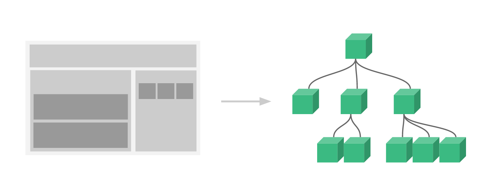

为了能在模板中使用，这些组件必须先注册以便 Vue 能够识别。这里有两种组件的注册类型：**全局注册**和**局部注册**。

#### 6.4.1. 组件名

在注册一个组件的时候，始终需要给它一个名字。强烈推荐遵循 W3C 规范中的自定义组件名 (**字母全小写且必须包含一个连字符**)。这会避免和当前以及未来的 HTML 元素相冲突。

组件命名建议详见官网：https://cn.vuejs.org/v2/style-guide/#%E5%9F%BA%E7%A1%80%E7%BB%84%E4%BB%B6%E5%90%8D-%E5%BC%BA%E7%83%88%E6%8E%A8%E8%8D%90

##### 6.4.1.1. 定义组件名的两种方式

- **使用 kebab-case 方式**

```js
Vue.component('my-component-name', { /* ... */ })
```

当使用 kebab-case (短横线分隔命名) 定义一个组件时，那么也必须在引用这个自定义元素时使用 kebab-case，例如 `<my-component-name>`。

- **使用 PascalCase 方式**

```js
Vue.component('MyComponentName', { /* ... */ })
```

当使用 PascalCase (首字母大写命名) 定义一个组件时，那么在引用这个自定义元素时两种命名法都可以使用。即 `<my-component-name>` 和 `<MyComponentName>` 都是可接受的。注意，尽管如此，直接在 DOM (即非字符串的模板) 中使用时只有 kebab-case 是有效的。

> 注意：在实际开发中，推荐使用PascalCase（帕斯卡命名法）为组件注册名称，因为它的适用性更强。

##### 6.4.1.2. 通过 name 属性注册组件

在注册组件期间，除了可以直接提供组件的注册名称之外，还可以把组件的 name 属性作为注册后组件的名称，

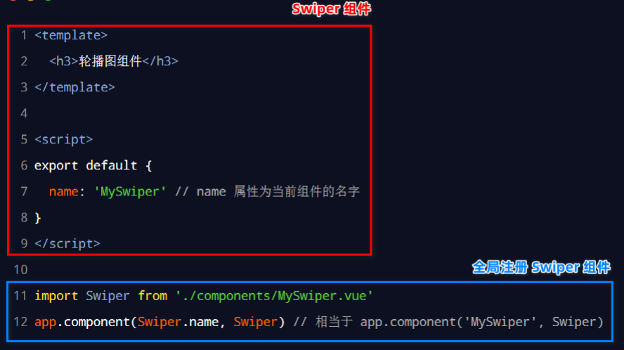

#### 6.4.2. 局部注册组件

在 vue 通过 `components` 属性注册的是私有子组件，都是只能该注册的组件中使用，其他组件是否使用。

```js
import ComponentA from './ComponentA.vue'

export default {
  components: {
    ComponentA
  },
  // ...
}
```

对于 `components` 属性对象中的每个 property 来说，其 property 名就是自定义元素的名字，其 property 值就是这个组件的选项对象。

<font color=violet>**值得注意：局部注册的组件在其子组件中不可用**</font>。

#### 6.4.3. 全局注册组件

在 vue 项目的 `main.js` 入口文件中，通过` Vue.component()` 方法，可以注册全局组件。也就是说它们在注册之后可以用在任何新创建的 Vue 根实例 (`new Vue`) 的模板中。

```js
/* 全局组件注册 */
// 1. 导入需要全局注册的注册
import GlobalComponent from './components/GlobalComponent.vue'
// 2. 注册组件
//    参数1：组件的注册名称，字符串类型
//    参数2：需要被全局注册的组件
Vue.component('MyGlobalComponent', GlobalComponent)

// 创建 Vue 的实例对象
new Vue({
  el: '#app',
  router,
  components: { App },
  template: '<App/>'
})
```

全局注册意味着，在所有组件的各自内部也都可以相互使用。

<font color=red>**注意：全局注册的行为必须在根 Vue 实例 (通过 `new Vue`) 创建之前。**</font>

#### 6.4.4. 模块系统下的注册

##### 6.4.4.1. 在模块系统中局部注册

使用了诸如 Babel 和 webpack 的模块系统。在这些情况下，推荐创建一个 `components` 目录，并将每个组件放置在其各自的文件中。然后在局部注册之前导入每个想使用的组件即可。例如：假设在在一个 `ComponentB.vue` 文件中：

```js
import ComponentA from './ComponentA'
import ComponentC from './ComponentC'

export default {
  components: {
    ComponentA,
    ComponentC
  },
  // ...
}
```

然后 `ComponentA` 和 `ComponentC` 都可以在 `ComponentB` 的模板中使用了。

##### 6.4.4.2. 基础组件的自动化全局注册

可能有许多组件只是包裹了一个输入框或按钮之类的元素，是相对通用的。会把它们称为基础组件，它们会在各个组件中被频繁的用到。如果每次使用都注册，会导致很多组件里都会有一个包含基础组件的长列表。如：

```js
import BaseButton from './BaseButton.vue'
import BaseIcon from './BaseIcon.vue'
import BaseInput from './BaseInput.vue'

export default {
  components: {
    BaseButton,
    BaseIcon,
    BaseInput
  }
}
```

如果使用了 webpack (或在内部使用了 webpack 的 Vue CLI 3+)，那么就可以使用 `require.context` 全局注册这些非常通用的基础组件。以下是在应用入口文件 (比如 `src/main.js`) 中全局导入基础组件的示例代码：

```js
import Vue from 'vue'
import upperFirst from 'lodash/upperFirst'
import camelCase from 'lodash/camelCase'

const requireComponent = require.context(
  // 其组件目录的相对路径
  './components',
  // 是否查询其子目录
  false,
  // 匹配基础组件文件名的正则表达式
  /Base[A-Z]\w+\.(vue|js)$/
)

requireComponent.keys().forEach(fileName => {
  // 获取组件配置
  const componentConfig = requireComponent(fileName)

  // 获取组件的 PascalCase 命名
  const componentName = upperFirst(
    camelCase(
      // 获取和目录深度无关的文件名
      fileName
        .split('/')
        .pop()
        .replace(/\.\w+$/, '')
    )
  )

  // 全局注册组件
  Vue.component(
    componentName,
    // 如果这个组件选项是通过 `export default` 导出的，
    // 那么就会优先使用 `.default`，
    // 否则回退到使用模块的根。
    componentConfig.default || componentConfig
  )
})
```

<font color=red>**需要注意：全局注册的行为必须在根 Vue 实例 (通过 `new Vue`) 创建之前。**</font>

### 6.5. Prop

`props` 是组件的自定义属性，在封装通用组件的时候，合理地使用 `props` 可以极大的提高组件的复用性！

#### 6.5.1. 基础语法定义

`props` 类型值：`Array<string> | Object`

`props` 可以是数组或对象，用于接收来自父组件的数据。`props` 可以是简单的数组，或者使用对象作为替代，对象允许配置高级选项，如类型检测、自定义验证和设置默认值。基于对象的语法使用以下选项：

|                                    属性配置                                    |                                                              说明                                                               |
| :---------------------------------------------------------------------------: | ------------------------------------------------------------------------------------------------------------------------------ |
| `type: String | Number | Boolean | Array | Object | Date | Function | Symbol` | 可以原生构造函数中的一种、任何自定义构造函数、或上述内容组成的数组。会检查一个 prop 是否是给定的类型，否则抛出警告。                       |
|                                `default: any`                                 | 为该 prop 指定一个默认值。如果该 prop 没有被传入，则换做用这个值。对象或数组的默认值必须从一个工厂函数返回。                              |
|                              `required: Boolean`                              | 定义该 prop 是否是必填项。在非生产环境中，如果这个值为 truthy 且该 prop 没有被传入的，则一个控制台警告将会被抛出。                        |
|                             `validator: Function`                             | 自定义验证函数会将该 prop 的值作为唯一的参数代入。在非生产环境下，如果该函数返回一个 falsy 的值 (也就是验证失败)，一个控制台警告将会被抛出。 |

基础语法格式示例：

```js
export default {
  // 组件的定义属性
  props: ['属性1', '属性2', '属性3', ....],
  // 组件的私有属性
  data() {
    return {}
  },
}
```

#### 6.5.2. Prop 的大小写

HTML 中标签元素的 attribute（属性）名是大小写不敏感的，所以浏览器会把所有大写字符解释为小写字符。这意味着当使用 DOM 中的模板时，camelCase (驼峰命名法) 的 prop 名需要使用其等价的 kebab-case (短横线分隔命名) 命名：

```js
Vue.component('blog-post', {
  // 在 JavaScript 中是 camelCase 的
  props: ['postTitle'],
  template: '<h3>{{ postTitle }}</h3>'
})
```

```html
<!-- 在 HTML 中是 kebab-case 的 -->
<blog-post post-title="hello!"></blog-post>
```

> **注：如果使用字符串模板，那么此限制就不存在了。**

#### 6.5.3. Prop 类型

在 `props` 基础语法定义中，都是以字符串数组形式出现。

在声明自定义属性时，如果希望每个 prop 都有指定的值类型，可以通过 `type` 来定义属性值的类型。

```js
props: {
  // 这些 property 的名称和值分别是 prop 各自的名称和类型
  title: String,
  likes: Number,
  isPublished: Boolean,
  commentIds: Array,
  author: Object,
  callback: Function,
  contactsPromise: Promise // or any other constructor
}
```

> 设置 prop 的类型，不仅为组件提供了文档，还会在它们遇到错误的类型时从浏览器的 JavaScript 控制台提示用户。

#### 6.5.4. 传递静态或动态 Prop

基础的 prop 的用法是传递静态的值。如下例：

```html
<blog-post title="My journey with Vue"></blog-post>
```

也可以通过 `v-bind` 动态赋值。如下例：

```html
<!-- 动态赋予一个变量的值 -->
<blog-post v-bind:title="post.title"></blog-post>

<!-- 动态赋予一个复杂表达式的值 -->
<blog-post
  v-bind:title="post.title + ' by ' + post.author.name"
></blog-post>
```

> *在上述两个示例中，传入的值都是字符串类型的，但实际上任何类型的值都可以传给一个 prop。*

##### 6.5.4.1. 传入数字类型

```html
<!-- 即便 `42` 是静态的，仍然需要 `v-bind` 来告诉 Vue -->
<!-- 这是一个 JavaScript 表达式而不是一个字符串 -->
<blog-post v-bind:likes="42"></blog-post>

<!-- 用一个变量进行动态赋值 -->
<blog-post v-bind:likes="post.likes"></blog-post>
```

##### 6.5.4.2. 传入布尔值

```html
<!-- 包含该 prop 没有值的情况在内，都意味着 `true` -->
<blog-post is-published></blog-post>

<!-- 即便 `false` 是静态的，仍然需要 `v-bind` 来告诉 Vue -->
<!-- 这是一个 JavaScript 表达式而不是一个字符串 -->
<blog-post v-bind:is-published="false"></blog-post>

<!-- 用一个变量进行动态赋值。-->
<blog-post v-bind:is-published="post.isPublished"></blog-post>
```

##### 6.5.4.3. 传入数组

```html
<!-- 即便数组是静态的，仍然需要 `v-bind` 来告诉 Vue -->
<!-- 这是一个 JavaScript 表达式而不是一个字符串 -->
<blog-post v-bind:comment-ids="[234, 266, 273]"></blog-post>

<!-- 用一个变量进行动态赋值 -->
<blog-post v-bind:comment-ids="post.commentIds"></blog-post>
```

##### 6.5.4.4. 传入对象

```html
<!-- 即便对象是静态的，仍然需要 `v-bind` 来告诉 Vue -->
<!-- 这是一个 JavaScript 表达式而不是一个字符串 -->
<blog-post
  v-bind:author="{
    name: 'Veronica',
    company: 'Veridian Dynamics'
  }"
></blog-post>

<!-- 用一个变量进行动态赋值。-->
<blog-post v-bind:author="post.author"></blog-post>
```

##### 6.5.4.5. 传入一个对象的所有 property

如果想要将一个对象的所有 property 都作为 prop 传入，可以使用不带参数的 `v-bind` (取代 `v-bind:prop-name`)。

```js
post: {
  id: 1,
  title: 'My Journey with Vue'
}
```

```html
<!-- 绑定对象所有属性 -->
<blog-post v-bind="post"></blog-post>

<!-- 等价上面 -->
<blog-post
  v-bind:id="post.id"
  v-bind:title="post.title"
></blog-post>
```

#### 6.5.5. Prop 验证

vue 提供了为组件的 prop 指定验证的功能。当某个 prop 验证失败的时候，(开发环境构建版本的) Vue 将会产生一个控制台的警告。

为了定制 prop 的验证方式，可以为 props 中的值提供一个带有验证需求的对象，而不是一个字符串数组。如下例：

```js
Vue.component('my-component', {
  props: {
    // 基础的类型检查 (`null` 和 `undefined` 会通过任何类型验证)
    propA: Number,
    // 多个可能的类型
    propB: [String, Number],
    // 必填的字符串
    propC: {
      type: String,
      // 必填项，强制组件时必须传递该属性的值。
      required: true
    },
    // 带有默认值的数字
    propD: {
      type: Number,
      // 指定默认值
      default: 100
    },
    // 带有默认值的对象
    propE: {
      type: Object,
      // 对象或数组默认值必须从一个工厂函数获取
      default: function () {
        return { message: 'hello' }
      }
    },
    // 自定义验证函数
    propF: {
      validator: function (value) {
        // 这个值必须匹配下列字符串中的一个
        return ['success', 'warning', 'danger'].indexOf(value) !== -1
      }
    }
  }
})
```

> 注意：那些 prop 会在一个<font color=red>**组件实例创建之前进行验证**</font>，所以实例的 property (如 `data`、`computed` 等) 在 `default` 或 `validator` 函数中是不可用的。

`type` 可以是下列原生构造函数中的一个：`String`、`Number`、`Boolean`、`Array`、`Object`、`Date`、`Function`、`Symbol`。另外 `type` 还可以是一个自定义的构造函数，并且通过 `instanceof` 来进行检查确认。

```js
function Person (firstName, lastName) {
  this.firstName = firstName
  this.lastName = lastName
}

Vue.component('blog-post', {
  props: {
    author: Person
  }
})
```

以上示例，来验证 `author` prop 的值是否是通过 `new Person` 创建的。

#### 6.5.6. 单向数据流（只读）

vue 规定：组件中封装的<font color=red>**自定义属性是只读的**</font>，不能直接修改 props 的值。

所有的 prop 都使得其父子 prop 之间形成了一个**单向下行绑定**：父组件所传递的 prop 的更新会向下更新到子组件中。但是不能反过来，为了防止从子组件意外变更父级组件的状态，从而导致应用的数据流向难以理解。

每次父级组件发生变更时，子组件中所有的 prop 都将会刷新为最新的值。这意味着不应该在一个子组件内部改变 prop。如果修改 prop 值，Vue 会在浏览器的控制台中发出警告。

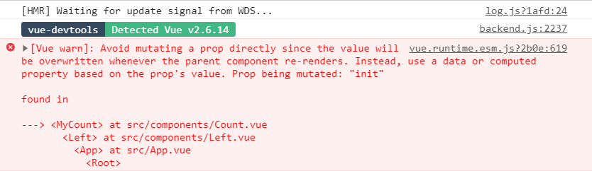

如需修改prop中的值，常用有以下两种方式：

1. prop 用来传递一个初始值；子组件希望将其作为一个本地的 prop 数据来使用。在这种情况下，最好定义一个本地的 data property 并将这个 prop 用作其初始值，本地的 data 值是可读可写：

```js
props: ['initialCounter'],
data: function () {
  return {
    counter: this.initialCounter
  }
}
```

2. prop 以一种原始的值传入组件，组件需要对其进行转换。在这种情况下，最好使用这个 prop 的值来定义一个计算属性：

```js
props: ['size'],
computed: {
  normalizedSize: function () {
    return this.size.trim().toLowerCase()
  }
}
```

> <font color=red>**注意：在 JavaScript 中对象和数组是引用类型，所以对于一个数组或对象类型的 prop 来说，在子组件中改变变更这个对象或数组本身将会影响到父组件的状态。**</font>

### 6.6. 组件的样式

#### 6.6.1. 组件之间的样式冲突问题

默认情况下，写在 vue <font color=red>**组件中的样式会全局生效**</font>，因此很容易造成多个组件之间的样式冲突问题。导致组件之间样式冲突的根本原因是：

1. 单页面应用程序中，所有组件的 DOM 结构，都是基于唯一的 index.html 页面进行呈现的
2. 每个组件中的样式，都会影响整个 index.html 页面中的 DOM 元素

#### 6.6.2. style 节点的 scoped 属性

vue 为 `<style>` 节点提供了 `scoped` 属性，从而防止组件之间的样式冲突问题。如下示例：

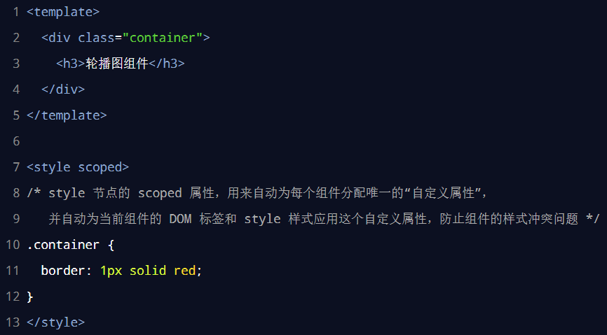

其中vue框架解决冲突的底层原理是：为每个组件分配唯一的自定义属性，在编写组件样式时，通过属性选择器来控制样式的作用域，如下示例：

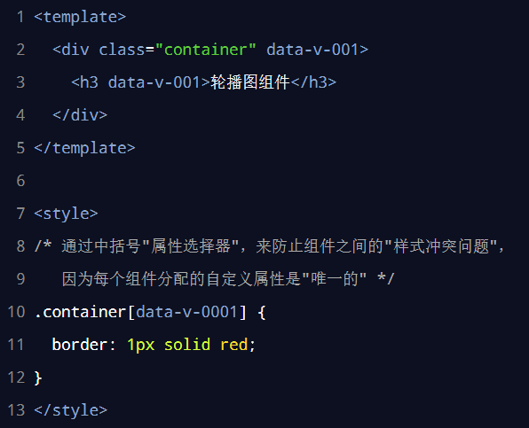

#### 6.6.3. 样式穿透 deep

如果给当前组件的 `<style>` 节点添加了 `scoped` 属性，则当前组件的样式对其子组件是不生效的。<font color=red>**如果想让某些样式对子组件生效，可以使用深度选择器**</font>。有如下几种定义方式：

1. 当 style 为 css 时的写法如下

```css
.a >>> .b {
  /* 样式定义 */
}
```

2. 当 style 使用 css 的预处理器(less、sass、scss)，则可以使用 `/deep/` 或者 `::v-deep`

- 第一种方式：使用 `/deep/`

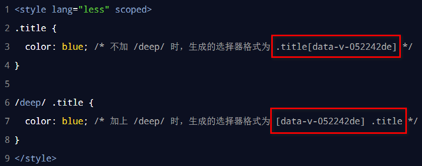

- 第二种方式：使用 `::v-deep`。<font color=red>**切记必须是双冒号**</font>

```scss
<style lang="scss" scoped>
.a{
  ::v-deep .b { 
    /* ... */ 
  }
} 
</style>
```

> 建议使用第二种方式定义，因为 `/deep/` 在某些时候会报错，而 `::v-deep` 更保险并且编译速度更快

### 6.7. 组件之间的数据共享

#### 6.7.1. 父组件通过 Prop 向子组件传递数据

`props` 是在组件上注册的一些自定义 attribute。当一个值传递给一个 prop attribute 的时候，它就变成了那个组件实例的一个 property。

一个组件默认可以拥有任意数量的 prop，任何值都可以传递给任何 prop。在组件实例中访问这个值，就像访问 data 中的值一样。

```js
Vue.component('blog-post', {
  props: ['title'],
  template: '<h3>{{ title }}</h3>'
})
```

```html
<blog-post title="My journey with Vue"></blog-post>
<blog-post title="Blogging with Vue"></blog-post>
<blog-post title="Why Vue is so fun"></blog-post>
```

也可以使用 `v-bind` 来动态传递 prop

```html
<blog-post
  v-for="post in posts"
  v-bind:key="post.id"
  v-bind:title="post.title"
></blog-post>
```

父组件向子组件传递数据，就可使用组件的props（自定义属性）来实现

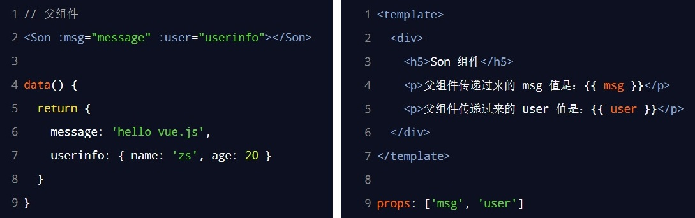

#### 6.7.2. 子组件向父组件传递数据

子组件向父组件传递数据使用自定义事件。示例代码如下：

- 定义子组件，关键点是通过 `$emit` 调用父组件绑定的自定义事件

```vue
<template>
  <div class="container">
    <h2>子组件</h2>
    <div>
      <p>
        <span>用户姓名:</span>
        <input type="text" v-model="user.name" />
      </p>
      <p>
        <span>用户年龄:</span>
        <input type="number" v-model.number="user.age" />
      </p>
      <p>
        <span>运动爱好:</span>
        <input
          type="checkbox"
          id="c1"
          value="basketball"
          v-model="user.sport"
        />
        <label for="c1">篮球</label>
        <input type="checkbox" id="c2" value="tennis" v-model="user.sport" />
        <label for="c2">网球</label>
        <input type="checkbox" id="c3" value="swimming" v-model="user.sport" />
        <label for="c3">游泳</label>
      </p>
      <p>
        <button @click="submit">点击向父组件传递表单对象</button>
      </p>
    </div>
  </div>
</template>

<script>
export default {
  name: 'DispatchComponent',
  // 组件的私有属性
  data() {
    return {
      user: {
        sport: [],
      },
    }
  },
  methods: {
    submit() {
      /*
        点击按钮，通过 $emit() 方法触发父组件绑定的自定义事件
          参数1: {string} eventName 自定义事件的名称
          参数2: [...args]  自定义事件调用的相关参数（多个）
      */
      this.$emit('getUser', this.user)
    },
  },
}
</script>

<style scoped>
.container {
  display: flex;
  flex-direction: column;
  justify-content: center;
  align-items: center;
  width: 80%;
  margin: 5px auto;
  border: 2px solid skyblue;
}
</style>
```

- 定义父组件，绑定自定义事件，通过自定义事件被调用时传递相应的参数

```vue
<template>
  <div class="container">
    <h1 style="text-align: center">我是父组件</h1>
    <hr />

    <div>获取从子组件传递过来的数据：{{ JSON.stringify(userFromChild) }}</div>

    <!-- 在子组件标签中绑定自定义事件 -->
    <DispatchComponent @getUser="getUser"></DispatchComponent>
  </div>
</template>

<script>
import DispatchComponent from '@/components/DispatchComponent'

export default {
  name: 'Child-pass-parent',
  components: {
    DispatchComponent,
  },
  data() {
    return {
      // 定义接受从子组件传递的数据
      userFromChild: {},
    }
  },
  methods: {
    // 绑定自定义事件相应方法
    getUser(user) {
      // 因为对象引用的关系，如果直接赋值给userFromChild，
      // 下次修改子组件里的内容，这边也会同时修改
      this.userFromChild = { ...user }
    },
  },
}
</script>

<style scoped>
.container {
  background-color: pink;
  border: 2px solid red;
}
.container > div {
  text-align: center;
}
</style>
```

#### 6.7.3. 组件之间的数据共享

vue组件非常常见的有父子组件通信，兄弟组件通信。而父子组件通信就很简单，父组件会通过 props 向下传数据给子组件，当子组件需要传递数据给父组件时，会通过 `$emit` 调用自定义事件传递数据给父组件。

在 vue2.x 中，兄弟组件之间数据共享的其中一种方案是 EventBus

##### 6.7.3.1. EventBus 的简介

EventBus 又称为事件总线。在Vue中可以使用 EventBus 来作为沟通桥梁的概念，就像是所有组件共用相同的事件中心，可以向该中心注册发送事件或接收事件，所以组件都可以上下平行地通知其他组件，但也就是太方便所以若使用不慎，就会造成难以维护的“灾难”，因此才**需要更完善的Vuex作为状态管理中心**，将通知的概念上升到共享状态层次。

##### 6.7.3.2. EventBus 的使用步骤

**总体步骤总结**：

1. 创建 `eventBus.js` 模块，并向外共享一个 `Vue` 的实例对象
2. 在数据发送方，调用 `bus.$emit('事件名称', 要发送的数据)` 方法触发自定义事件
3. 在数据接收方，调用 `bus.$on('事件名称', 事件处理函数)` 方法注册一个自定义事件

**一、初始化**

首先需要创建事件总线并将其导出，以便其它模块可以使用或者监听它。一般有两种方式来处理

第一种：新创建一个 `.js` 文件，比如 `event-bus.js`

```js
// event-bus.js
import Vue from 'vue'
export const EventBus = new Vue()
```

第二种：直接在项目中的 `main.js` 初始化 EventBus。注意，此方式初始化的EventBus是一个全局的事件总线

```js
// main.js
Vue.prototype.$EventBus = new Vue()
```

**二、发送事件**

通过`$emit`调用事件

```js
// 发送消息
EventBus.$emit(channel: string, callback(payload1,…))
```

示例：

```vue
<!-- A.vue -->
<template>
    <button @click="sendMsg()">-</button>
</template>

<script>
import { EventBus } from "../event-bus.js";
export default {
  methods: {
    sendMsg() {
      EventBus.$emit("aMsg", '来自A页面的消息');
    }
  }
};
</script>
```

**三、接收事件**

使用`.$on` 监听并接收事件

```js
// 监听接收消息
EventBus.$on(channel: string, callback(payload1,…))
```

示例：

```vue
<!-- IncrementCount.vue -->
<template>
  <p>{{msg}}</p>
</template>

<script>
import {
  EventBus
} from "../event-bus.js";
export default {
  data(){
    return {
      msg: ''
    }
  },
  mounted() {
    EventBus.$on("aMsg", (msg) => {
      // A发送来的消息
      this.msg = msg;
    });
  }
};
</script>
```

**移除事件监听者**

使用 `EventBus.$off('事件名')` 来移除应用内所有对此某个事件的监听。或者直接调用 `EventBus.$off()` 来移除所有事件频道，不需要添加任何参数 。

```js
import {
  eventBus
} from './event-bus.js'
EventBus.$off('aMsg', {})
```

##### 6.7.3.3. 案例

1. 定义 eventBus.js

```js
import Vue from 'vue'

export default new Vue()
```

2. 创建发送数据的组件

```vue
<template>
  <div class="container">
    <h2>子组件</h2>
    <div>
      <p>
        <span>用户姓名:</span>
        <input type="text" v-model="user.name" />
      </p>
      <p>
        <span>用户年龄:</span>
        <input type="number" v-model.number="user.age" />
      </p>
      <p>
        <span>运动爱好:</span>
        <input
          type="checkbox"
          id="c1"
          value="basketball"
          v-model="user.sport"
        />
        <label for="c1">篮球</label>
        <input type="checkbox" id="c2" value="tennis" v-model="user.sport" />
        <label for="c2">网球</label>
        <input type="checkbox" id="c3" value="swimming" v-model="user.sport" />
        <label for="c3">游泳</label>
      </p>
      <p>
        <button @click="submit">点击向父组件传递表单对象</button>
      </p>
    </div>
  </div>
</template>

<script>
export default {
  name: 'DispatchComponent',
  // 组件的私有属性
  data() {
    return {
      user: {
        sport: [],
      },
    }
  },
  methods: {
    submit() {
      /*
        点击按钮，通过 $emit() 方法触发父组件绑定的自定义事件
          参数1: {string} eventName 自定义事件的名称
          参数2: [...args]  自定义事件调用的相关参数（多个）
      */
      this.$emit('getUser', this.user)
    },
  },
}
</script>
```

3. 创建接口数据的组件

```vue
<template>
  <div class="container">
    <h2>子组件</h2>
    <div>
      <p>接收父组件传递的基本类型：{{ message }}</p>
      <p>接收父组件传递的对象类型：{{ JSON.stringify(user) }}</p>
    </div>
  </div>
</template>

<script>
export default {
  name: 'ReceiveComponent',
  // 组件自定义属性，用于接收调用方传递到本组件的数据
  props: {
    message: String,
    user: Object,
  },
  // 组件的私有属性
  data() {
    return {}
  },
}
</script>
```

4. 创建父组件，引入两个传递数据的组件

```vue
<template>
  <div class="container">
    <h1 style="text-align: center">我是父组件</h1>
    <hr />
    <div>
      <LeftComponent></LeftComponent>
      <RightComponent></RightComponent>
    </div>
  </div>
</template>

<script>
import LeftComponent from '@/components/LeftComponent'
import RightComponent from '@/components/RightComponent'

export default {
  name: 'component-pass-component',
  components: {
    LeftComponent,
    RightComponent,
  },
  data() {
    return {}
  },
  methods: {},
}
</script>
```

### 6.8. 动态组件

#### 6.8.1. 什么是动态组件

动态组件指的是动态切换组件的显示与隐藏，在不同组件之间进行动态切换

#### 6.8.2. 实现动态组件渲染

vue 提供了一个内置的 `<component>` 组件配合 `is` 属性来实现动态组件的渲染。

```html
<!-- 动态组件由 vm 实例的 `componentId` property 控制 -->
<component :is="componentId"></component>

<!-- 也能够渲染注册过的组件或 prop 传入的组件 -->
<component :is="$options.components.child"></component>
```

示例中的“`componentId`”可以包括，已注册组件的名字或一个组件的选项对象

#### 6.8.3. 在动态组件上使用 keep-alive

通过 `<component>` 组件配合 `is` 属性可以实现动态组件的渲染。当在这些组件之间切换的时候，有时可能会需要保持这些组件的状态，以避免反复重渲染导致的性能问题。

默认情况下，切换动态组件时无法保持组件的状态。此时可以使用 vue 内置的 `<keep-alive>` 组件保持动态组件的状态。

##### 6.8.3.1. 基础使用

`<keep-alive>` 内置组件主要用于保留组件状态或避免重新渲染。

参数 Props：

|   参数名   |                     描述                      |
| :-------: | -------------------------------------------- |
| `include` | 字符串或正则表达式。只有名称匹配的组件会被缓存     |
| `exclude` | 字符串或正则表达式。任何名称匹配的组件都不会被缓存 |
|   `max`   | 字符串或正则表达式。任何名称匹配的组件都不会被缓存 |

用法：

- `<keep-alive>` 包裹动态组件时，会缓存不活动的组件实例，而不是销毁它们。`<keep-alive>` 是一个抽象组件：它自身不会渲染一个 DOM 元素，也不会出现在组件的父组件链中。
- 当组件在 `<keep-alive>` 内被切换，它的 `activated` 和 `deactivated` 这两个生命周期钩子函数将会被对应执行。
- 2.1.0 版本新增的 `include` 和 `exclude` 属性允许组件有条件地缓存。二者都可以用逗号分隔字符串、正则表达式或一个数组来表示。匹配值首先检查组件自身的 `name` 选项，如果 `name` 选项不可用，则匹配它的局部注册名称 (父组件 `components` 选项的键值)。匿名组件不能被匹配。
- 2.5.0 版本新增的 `max` 属性，配置最多可以缓存多少组件实例。一旦这个数字达到了，在新实例被创建之前，已缓存组件中最久没有被访问的实例会被销毁掉。

> 注意事项：
>
> - 这个 `<keep-alive>` 要求被切换到的组件都有自己的名字，不论是通过组件的 `name` 选项还是局部/全局注册。
> - `<keep-alive>` 不会在函数式组件中正常工作，因为它们没有缓存实例。
> 在 2.2.0 及其更高版本中，`activated` 和 `deactivated` 将会在 `<keep-alive>` 树内的所有嵌套组件中触发。
> `<keep-alive>` 是用在其一个直属的子组件被开关的情形。如果在其中有 `v-for` 则不会工作。如果有上述的多个条件性的子元素，`<keep-alive>` 要求同时只有一个子元素被渲染。

##### 6.8.3.2. 使用示例

```html
<!-- 基本 -->
<keep-alive>
  <component :is="view"></component>
</keep-alive>

<!-- 多个条件判断的子组件 -->
<keep-alive>
  <comp-a v-if="a > 1"></comp-a>
  <comp-b v-else></comp-b>
</keep-alive>

<!-- 和 `<transition>` 一起使用 -->
<transition>
  <keep-alive>
    <component :is="view"></component>
  </keep-alive>
</transition>

<!-- 逗号分隔字符串 -->
<keep-alive include="a,b">
  <component :is="view"></component>
</keep-alive>

<!-- 正则表达式 (使用 `v-bind`) -->
<keep-alive :include="/a|b/">
  <component :is="view"></component>
</keep-alive>

<!-- 数组 (使用 `v-bind`) -->
<keep-alive :include="['a', 'b']">
  <component :is="view"></component>
</keep-alive>

<!-- 逗号分隔字符串 -->
<keep-alive include="a,b">
  <component :is="view"></component>
</keep-alive>

<!-- 正则表达式 (使用 `v-bind`) -->
<keep-alive :include="/a|b/">
  <component :is="view"></component>
</keep-alive>

<!-- 数组 (使用 `v-bind`) -->
<keep-alive :include="['a', 'b']">
  <component :is="view"></component>
</keep-alive>
```

### 6.9. 插槽

#### 6.9.1. 什么是插槽

插槽（Slot）是 vue 为组件的封装者提供的能力。允许开发者在封装组件时，把**不确定的、希望由用户指定的部分**定义为插槽。可以把插槽认为是组件封装期间，为用户预留的内容的**占位符**。

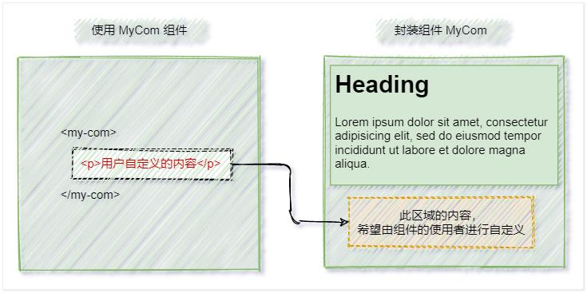

#### 6.9.2. slot 插槽

`<slot>` 是vue的内置组件，`<slot>` 元素作为组件模板之中的内容分发插槽。`<slot>` 元素自身将会在组件被调用时被替换成调用者指定的内容。

Props 属性：

- `name`：string类型，用于命名插槽。

#### 6.9.3. 插槽的基础用法

在使用组件的时候，可以和 HTML 元素一样，经常需要向一个组件传递内容，像这样：

```html
<Article>
  <!--
      如果在封装组件时没有预留任何 `<slot>` 插槽，则用户提供的任何自定义内容都会被丢弃。
      默认情况下，在使用组件的时候，提供的内容都会被填充到名字为 default 的插槽之中。
   -->
  这是文章的内容 | {{ author }}
</Article>
```

如果在封装组件时没有预留任何 `<slot>` 插槽，则用户提供的任何自定义内容都会被丢弃。通过 `<slot>` 元素，即可将组件元素体内的内容渲染到 `<slot>` 标签相应的位置

```html
<template>
  <div class="container">
    <h2>Article Component</h2>
    <!-- 文章的内容 -->
    <div class="content-box">
      <!--
          `<slot>` 是vue的内置组件，`<slot>` 元素作为组件模板之中的内容分发插槽。
          `<slot>` 元素自身将会在组件被调用时被替换成调用者指定的内容。
       -->
      <slot></slot>
    </div>
  </div>
</template>
```

当组件渲染的时候，`<slot></slot>` 将会被替换组件标签体的内容，插槽内可以包含任何模板代码，包括 HTML，甚至其它的组件

```html
<Article>
  <!--
      当组件渲染的时候，<slot></slot> 将会被替换组件标签体的内容，
      插槽内可以包含任何模板代码，包括 HTML，甚至其它的组件
   -->
  <h4 style="text-align: center">我是一个元素标签</h4>
  <ButtonCounter></ButtonCounter>
</Article>
```

#### 6.9.4. 编译作用域

可以在一个插槽中使用本组件的数据，如：

```html
<navigation-link url="/profile">
  Logged in as {{ user.name }}
</navigation-link>
```

该插槽跟模板的其它地方一样可以访问相同的实例 property (也就是相同的“作用域”)，而不能访问 `<navigation-link>` 的作用域。例如组件标签的 `url` 属性是无法访问的：

```html
<navigation-link url="/profile">
  Clicking here will send you to: {{ url }}
  <!--
    这里的 `url` 会是 undefined，因为其 (指该插槽的) 内容是传递给 <navigation-link> 的。
    而不是在 <navigation-link> 组件*内部*定义的。
  -->
</navigation-link>
```

> 记住一条规则：父级模板里的所有内容都是在父级作用域中编译的；子模板里的所有内容都是在子作用域中编译的。

#### 6.9.5. 后备内容

封装组件时，可以为预留的 `<slot>` 插槽提供后备内容（默认内容），它在没有为插槽提供任何内容被渲染。

默认内容直接定义在 `<slot>` 标签内即可

```html
<!-- 定义后备内容 -->
<button type="submit">
  <slot>Submit</slot>
</button>
```

示例：

```html
<!-- 父级组件中使用并且不提供任何插槽内容时 -->
<submit-button></submit-button>
<!-- 后备内容“Submit”将会被渲染 -->
<button type="submit">
  Submit
</button>

<!-- 如提供内容 -->
<submit-button>
  Save
</submit-button>
<!-- 这个提供的内容将会被渲染从而取代后备内容 -->
<button type="submit">
  Save
</button>
```

#### 6.9.6. 具名插槽

##### 6.9.6.1. 基础用法

当组件需要预留多个插槽节点时，`<slot>` 元素有一个特殊的 `name` 属性，这个属性可以用来定义额外的插槽。这种带有具体名称的插槽叫做“具名插槽”。

```html
<div class="container">
  <header>
    <slot name="header"></slot>
  </header>
  <main>
    <slot></slot>
  </main>
  <footer>
    <slot name="footer"></slot>
  </footer>
</div>
```

> 需要注意的是：<font color=violet>**一个不带 `name` 属性的 `<slot>` 插槽会带有隐含的名字“`default`”**</font>。

在向具名插槽提供内容的时候，可以在一个 `<template>` 元素上使用 `v-slot` 指令，并以 `v-slot` 的参数的形式指定相应渲染的插槽名称

```html
<NamedSlotComponent>
  <!--
      在向具名插槽提供内容的时候，可以在一个 <template> 元素上使用 v-slot 指令，
      并以 v-slot 的参数的形式指定相应渲染的插槽名称
   -->
  <template v-slot:title>
    <h3 style="text-align: center">我是一个标题</h3>
  </template>
  <!--
      <template> 元素中的所有内容都将会被传入相应的插槽。
      任何没有被包裹在带有 v-slot 的 <template> 中的内容都会被视为默认插槽的内容。
   -->
  <p>A paragraph for the main content.</p>
  <p>And another one.</p>
  <!--
      如果想代码看上去更明确一些，可以在一个 <template> 中，指定 v-slot:default，用于包裹默认插槽的内容
      <template v-slot:default>
        <p>A paragraph for the main content.</p>
        <p>And another one.</p>
      </template>
   -->
  <!--
      2.6.0 版本新增具名插槽的缩写，把参数之前的所有内容 (v-slot:) 替换为字符 #
   -->
  <template #footer>
    <ButtonCounter></ButtonCounter>
  </template>
</NamedSlotComponent>
```

如果想将渲染到默认插槽的区域内容看上去更明确一些，可以在一个 `<template>` 中，指定 `v-slot:default`，用于包裹默认插槽的内容

```html
<template v-slot:default>
  <p>A paragraph for the main content.</p>
  <p>And another one.</p>
</template>
```

> <font color=purple>**值得注意的是： `v-slot` 只能添加在 `<template>` 上**</font>

##### 6.9.6.2. 具名插槽的缩写

2.6.0 版本新增 `v-slot` 的缩写形式。即把参数之前的所有内容 (`v-slot:`) 替换为字符 `#`。如上例：`v-slot:footer` 可以被重写为 `#footer`

```html
<template #footer>
    <ButtonCounter></ButtonCounter>
</template>
```

和其它指令一样，该缩写只在其有参数的时候才可用。这意味着以下语法是无效的：

```html
<!-- 这样会触发一个警告 -->
<current-user #="{ user }">
  {{ user.firstName }}
</current-user>
```

如果希望使用缩写的话，必须要明确插槽名

```html
<current-user #default="{ user }">
  {{ user.firstName }}
</current-user>
```

#### 6.9.7. 作用域插槽

##### 6.9.7.1. 定义与基础使用

在封装组件的过程中，为了让组件的数据在父级的插槽内容中可用，可以将相应数据作为 `<slot>` 元素的一个属性绑定成 `props` 数据。让父组件的插槽内容能够访问子组件中才有的数据，这种带有 `props` 数据的 `<slot>` 叫做“作用域插槽”。

```html
<span>
  <slot v-bind:user="user">
    {{ user.lastName }}
  </slot>
</span>
```

绑定在 `<slot>` 元素上的 attribute 被称为**插槽 prop**。现在在父级作用域中，可以使用带值的 `v-slot` 来定义子组件提供的插槽 prop 的名字：

```html
<current-user>
  <template v-slot:default="slotProps">
    {{ slotProps.user.firstName }}
  </template>
</current-user>
```

> 注：插槽 prop 的对象命名可以使用任意名称

##### 6.9.7.2. 独占默认插槽的缩写语法

当被提供的内容只有默认插槽时，组件的标签才可以被当作插槽的模板来使用。

```html
<current-user v-slot:default="slotProps">
  {{ slotProps.user.firstName }}
</current-user>
```

如果未指明的内容对应默认插槽一样，`v-slot` 可以省略不写 `default` 参数，也会被假定对应默认插槽

```html
<current-user v-slot="slotProps">
  {{ slotProps.user.firstName }}
</current-user>
```

> **注意：默认插槽的缩写语法不能和具名插槽混用，因为它会导致作用域不明确**

只要出现多个插槽，则所有的插槽都需要使用完整的基于 `<template>` 的语法

```html
<current-user>
  <template v-slot:default="slotProps">
    {{ slotProps.user.firstName }}
  </template>

  <template v-slot:other="otherSlotProps">
    ...
  </template>
</current-user>
```

##### 6.9.7.3. 解构插槽 Prop

`v-slot` 的值实际上可以是任何能够作为函数定义中的参数的 JavaScript 表达式。即可以使用 ES2015 解构来传入具体的插槽 prop

```html
<current-user v-slot="{ user }">
  {{ user.firstName }}
</current-user>
```

同样可以解构 prop 并对属性进行重命名：

```html
<current-user v-slot="{ user: person }">
  {{ person.firstName }}
</current-user>
```

可以给解构 prop 的属性指定默认值，用于插槽 prop 是 undefined 的情形：

```html
<current-user v-slot="{ user = { firstName: 'Guest' } }">
  {{ user.firstName }}
</current-user>
```

#### 6.9.8. 动态插槽名

2.6.0 版本新增动态指令参数也可以用在 `v-slot` 上，来定义动态的插槽名：

```html
<base-layout>
  <template v-slot:[dynamicSlotName]>
    ...
  </template>
</base-layout>
```

## 7. 访问元素 & 组件

在绝大多数情况下，最好不要触达另一个组件实例内部或手动操作 DOM 元素。不过在一些情况下需要进行一些必要的操作。

### 7.1. 访问根实例

在每个 `new Vue` 实例的子组件中，其根实例可以通过 `$root` 进行访问。假如根实例如下：

```js
// Vue 根实例
new Vue({
  data: {
    foo: 1
  },
  computed: {
    bar: function () { /* ... */ }
  },
  methods: {
    baz: function () { /* ... */ }
  }
})
```

所有的子组件都可以将这个实例作为一个全局 `store` 来访问或使用。

```js
// 获取根组件的数据
this.$root.foo

// 写入根组件的数据
this.$root.foo = 2

// 访问根组件的计算属性
this.$root.bar

// 调用根组件的方法
this.$root.baz()
```

> 注意：对于 demo 或非常小型的有少量组件的应用来说，此方式访问根实例是很方便。不过这个模式扩展到中大型应用来说则不推荐，强烈推荐使用 `Vuex` 等来管理应用的状态。

### 7.2. 访问父级

和 `$root` 类似，`$parent` 可以用于一个子组件访问父组件的实例。它提供了一种机会，可以在后期随时触达父级组件，以替代将数据以 `prop` 的方式传入子组件的方式。

> *注：在绝大多数情况下，触达父级组件会使得应用更难调试和理解，尤其是当变更了父级组件的数据的时候，后面很难找出那个变更是从哪里发起的。针对需要向任意更深层级的组件提供上下文信息时推荐<font color=purple>依赖注入</font>*

### 7.3. 访问子组件实例或子元素

尽管存在 `prop` 和事件，有的时候仍可能需要在 JavaScript 里直接访问一个子组件或者 DOM 元素。

#### 7.3.1. 什么是 ref 引用

ref 用来不依赖其他 API 情况下，获取 DOM 元素或组件的引用。

每个 vue 的组件实例上，都包含一个 `$refs` 对象，里面存储着对应的 DOM 元素或组件的引用。默认情况下，组件的 `$refs` 指向一个空对象。

#### 7.3.2. 使用 ref 引用 DOM 元素

在 vue 组件中，也可以使用 `ref` 属性来访问内部的指定 DOM 元素

- 通过 `ref` 这个属性为 DOM 元素赋予一个 ID 引用。

```html
<input ref="input">
```

- 在组件中使用 `$refs` 来获取 DOM 元素，从而可以操作该元素

```js
// 通过 this.$refs.input 获取到原生 <input> 元素，并调用元素的 focus() 方法
this.$refs.input.focus()
```

#### 7.3.3. 使用 ref 引用组件实例

- 通过 `ref` 这个属性为子组件赋予一个 ID 引用。

```html
<base-input ref="usernameInput"></base-input>
```

- 然后在父组件中使用 `$refs` 来获取子组件实例，从而可以访问组件实例中的数据与方法

```js
// 通过 this.$refs.usernameInput 获取到 <base-input> 组件实例，并调用组件定义的 focus() 方法
this.$refs.usernameInput.focus()
```

#### 7.3.4. 注意事项

- 当 `ref` 和 `v-for` 一起使用的时候，得到的 `ref` 将会是一个包含了对应数据源的这些子组件的数组。
- `$refs` 只会在组件渲染完成之后生效，并且它们不是响应式的。一般仅应用在都是直接能操作的组件/元素上，应该避免在模板或计算属性中访问 `$refs`。

## 8. 异步更新队列 （vm.$nextTick）

**Vue 在更新 DOM 时是异步执行的**。vue 处理数据驱动视图的原理是：只要侦听到数据变化，Vue 将开启一个队列，并缓冲在同一事件循环中发生的所有数据变更。如果同一个 watcher 被多次触发，只会被推入到队列中一次。这种在缓冲时去除重复数据对于避免不必要的计算和 DOM 操作是非常重要的。然后，在下一个的事件循环“tick”中，Vue 刷新队列并执行实际 (已去重的) 工作。Vue 在内部对异步队列尝试使用原生的 `Promise.then`、`MutationObserver` 和 `setImmediate`，如果执行环境不支持，则会采用 `setTimeout(fn, 0)` 代替。

例如，当执行设置 `vm.someData = 'new value'`，该组件不会立即重新渲染。当刷新队列时，组件会在下一个事件循环“tick”中更新。如果有需要操作vue更新之后DOM结构，则可以在数据变化之后立即使用` Vue.nextTick(callback)`。这样回调函数将在 DOM 更新完成后被调用。

以上通俗可以理解为：组件实例的 `nextTick(callback)` 方法，会把 `callback` 回调推迟到下一个 DOM 更新周期之后执行。即等组件的 DOM 更新完成之后，再执行 `callback` 回调函数。从而能保证 `callback` 回调函数可以操作到最新的 DOM 元素。使用方法如下：

```vue
<template>
  <div class="container">
    <div v-if="inputVisible">
      <!-- 在标签元素定义 ref 属性，vue 将此属性值做为key，注册到组件实例中的 $refs 属性对象中 -->
      <input type="text" ref="ipt" @blur="inputBlur" />
    </div>
    <div v-else>
      <button @click="focus">点击显示文本输入框并取得焦点</button>
    </div>
  </div>
</template>

<script>
export default {
  name: 'vue-nexttick',
  data() {
    return {
      inputVisible: false,
    }
  },
  created() {},
  methods: {
    focus() {
      // 1. 显示文本框元素
      this.inputVisible = true

      /*
        2. 如果直接通过 $refs 获取文本框 dom 元素，调用 focus 方法获取焦点会报以下错误：
        Cannot read properties of undefined (reading 'focus')
        原因是 vue 更新 DOM 时是异步执行的，在获取元素时，此时页面还没有重新获取
      */
      console.log(this.$refs.ipt) // undefined
      // 需要通过 vm.$nextTick(callback) 来将回调延迟到下次 DOM 更新循环之后执行。
      // 即在修改数据之后立即使用它，然后等待 DOM 更新。
      this.$nextTick(() => this.$refs.ipt.focus())
    },
    inputBlur(e) {
      console.log(e)
      // 失去焦点后设置隐藏文本框
      this.inputVisible = false
    },
  },
}
</script>
```

因为 `$nextTick()` 返回一个 `Promise` 对象，所以可以使用新的 ES2017 `async`/`await` 语法完成相同的事情：

```js
methods: {
  updateMessage: async function () {
    this.message = '已更新'
    console.log(this.$el.textContent) // => '未更新'
    await this.$nextTick()
    console.log(this.$el.textContent) // => '已更新'
  }
}
```

## 9. 自定义指令

### 9.1. 自定义指令的注册

除了核心功能默认内置的指令 (`v-model` 和 `v-show`)，Vue 也允许注册自定义指令。

在 Vue2.0 中，代码复用和抽象的主要形式是组件。然而需要对普通 DOM 元素进行底层操作，这时候就会用到自定义指令。

#### 9.1.1. 注册局部自定义指令

如果想注册局部指令，在组件中 `directives` 的选项中定义

```js
export default {
  name: 'xxxx',
  data() {
    return {}
  },
  // 注册局部指令，在组件中 directives 的选项中定义：
  directives: {
    // 定义名为 focus 的指令，指向一个配置对象。vue会自动给指令增加前缀 “v-”
    focus: {
      /*
        只调用一次，指令第一次绑定到元素时调用。在这里可以进行一次性的初始化设置
          参数 el：指令所绑定的元素，可以用来直接操作 DOM
          参数 binding：一个对象，包括以下 property
              name：指令名，不包括 v- 前缀。
              value：指令的绑定值，例如：v-my-directive="1 + 1" 中，绑定值为 2。
              oldValue：指令绑定的前一个值，仅在 update 和 componentUpdated 钩子中可用。无论值是否改变都可用。
              expression：字符串形式的指令表达式。例如 v-my-directive="1 + 1" 中，表达式为 "1 + 1"。
              arg：传给指令的参数，可选。例如 v-my-directive:foo 中，参数为 "foo"。
              modifiers：一个包含修饰符的对象。例如：v-my-directive.foo.bar 中，修饰符对象为 { foo: true, bar: true }。
          参数 vnode：Vue 编译生成的虚拟节点。
          参数 oldVnode：上一个虚拟节点，仅在 update 和 componentUpdated 钩子中可用

        注意：除了 el 之外，其它参数都应该是只读的，切勿进行修改。如果需要在钩子之间共享数据，建议通过元素的 dataset 来进行。
      */
      bind(el, binding, vnode) {
      },
      /* 被绑定元素插入父节点时调用 (仅保证父节点存在，但不一定已被插入文档中) */
      inserted(el, binding, vnode) {
      },
      /*
        所在组件的 VNode 更新时调用，但是可能发生在其子 VNode 更新之前。
        指令的值可能发生了改变，也可能没有。但是你可以通过比较更新前后的值来忽略不必要的模板更新
      */
      update(el, binding, vnode, oldVnode) {
      },
      /* 指令所在组件的 VNode 及其子 VNode 全部更新后调用 */
      componentUpdated(el, binding, vnode, oldVnode) {
      },
      /* 只调用一次，指令与元素解绑时调用 */
      unbind(el, binding, vnode) {
      },
    },
  },
}
```

#### 9.1.2. 注册全局自定义指令

在创建 main.js 文件中，创建 vue 实例之前，通过 `Vue.directive` 方法注册全局自定义指令。

- 参数1：`{string} id` 指令的名称，不包含“`v-`”前缀
- 参数2：`{Function | Object} [definition]` 指令参数配置对象

```js
// 注册一个全局自定义指令 `v-my-directive`
Vue.directive('my-directive', {
  bind: function () {},
  inserted: function () {},
  update: function () {},
  componentUpdated: function () {},
  unbind: function () {}
})

// 注册 (指令函数)
Vue.directive('my-directive', function () {
  // 这里将会被 `bind` 和 `update` 调用
})

// getter，返回已注册的指令
var myDirective = Vue.directive('my-directive')
```

### 9.2. 指令的钩子函数与钩子函数参数

#### 9.2.1. 钩子函数

一个指令定义对象可以提供如下几个钩子函数 (均为可选)：

- `bind`：只调用一次，指令第一次绑定到元素时调用。在这里可以进行一次性的初始化设置
- `inserted`：被绑定元素插入父节点时调用 (仅保证父节点存在，但不一定已被插入文档中)
- `update`：所在组件的 VNode 更新时调用，**但是可能发生在其子 VNode 更新之前**。指令的值可能发生了改变，也可能没有。但是你可以通过比较更新前后的值来忽略不必要的模板更新
- `componentUpdated`：指令所在组件的 VNode **及其子 VNode** 全部更新后调用
- `unbind`：只调用一次，指令与元素解绑时调用

#### 9.2.2. 钩子函数

指令钩子函数会被传入以下参数：

- `el`：指令所绑定的元素，可以用来直接操作 DOM。
- `binding` ：一个对象，包含以下 property：
  - `name`：指令名，不包括 `v-` 前缀。
  - `value`：指令的绑定值，例如：`v-my-directive="1 + 1"` 中，绑定值为 `2`。
  - `oldValue`：指令绑定的前一个值，仅在 `update` 和 `componentUpdated` 钩子中可用。无论值是否改变都可用。
  - `expression`：字符串形式的指令表达式。例如 `v-my-directive="1 + 1"` 中，表达式为 `"1 + 1"`。
  - `arg`：传给指令的参数，可选。例如 `v-my-directive:foo` 中，参数为 `"foo"`。
  - `modifiers`：一个包含修饰符的对象。例如：`v-my-directive.foo.bar` 中，修饰符对象为 `{ foo: true, bar: true }`。
- `vnode`：Vue 编译生成的虚拟节点。可参考[VNode API](https://cn.vuejs.org/v2/api/#VNode-接口) 了解更多详情。
- `oldVnode`：上一个虚拟节点，仅在 `update` 和 `componentUpdated` 钩子中可用。

除了 `el` 之外，其它参数都应该是只读的，切勿进行修改。如果需要在钩子之间共享数据，建议通过元素的 `dataset` 来进行。

### 9.3. 函数简写

如果在指令的 `bind` 和 `update` 钩子函数中触发相关的逻辑行为，并且而不关心其它的钩子。则对象格式的自定义指令可以简写成函数格式：

```js
directives: {
  // 自定义指令修改背景颜色，bind 与 update 同样的处理逻辑
  /* 'change-color': {
    bind(el, binding, vnode) {
      //
      el.style.backgroundColor = binding.value
    },
    update(el, binding, vnode, oldVnode) {
      el.style.backgroundColor = binding.value
    },
  }, */
  /*
    如果在指令的 `bind` 和 `update` 钩子函数中触发相关的逻辑行为，
    并且而不关心其它的钩子。则对象格式的自定义指令可以简写成函数格式：
  */
  'change-color'(el, binding, vnode, oldVnode) {
    el.style.backgroundColor = binding.value
  },
},
```

