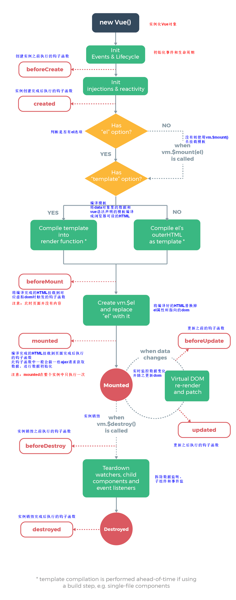

# Vue2.x 基础笔记

Vue 官网：https://cn.vuejs.org/

> 以下是vue的学习笔记，大部分内容引用官网

## 1. vue 简介

### 1.1. Vue.js 是什么

Vue (读音 /vjuː/，类似于 view) 是一套用于构建用户界面的<font color=red>**渐进式框架**</font>。


### 1.2. vue 的特性

vue 框架的特性，主要体现在如下两方面：

- <font color=red>**数据驱动视图**</font>
- <font color=red>**双向数据绑定**</font>

#### 1.2.1. 数据驱动视图

在使用了 vue 的页面中，vue 会<font color=red>**监听数据的变化**</font>，从而<font color=red>**自动重新渲染**</font>页面的结构。示意图如下：


数据驱动视图的优点是：当页面数据发生变化时，页面会自动重新渲染！

值得注意是：<font color=red>**数据驱动视图是单向的数据绑定**</font>。

#### 1.2.2. 双向数据绑定

在填写表单时，双向数据绑定可以辅助开发者在不操作 DOM 的前提下，自动把用户填写的内容同步到数据源中。示意图如下：


双向数据绑定的优点：开发者不再需要手动操作 DOM 元素，来获取表单元素最新的值！

### 1.3. Vue 底层原理

#### 1.3.1. MVVM 概念

MVVM 是 vue 实现**数据驱动视图**和**双向数据绑定**的核心原理。MVVM 指的是 Model、View 和 ViewModel，它把每个 HTML 页面都拆分成了这三个部分，如图所示：


- `Model`：表示当前页面渲染时所依赖的数据源。
- `View`：表示当前页面所渲染的 DOM 结构。
- `ViewModel`：表示 vue 的实例，它是 MVVM 的核心。

#### 1.3.2. MVVM 的工作原理

<font color=red>ViewModel 作为 MVVM 的核心</font>，是它把当前页面的数据源（Model）和页面的结构（View）连接在了一起。


- 当**数据源发生变化**时，会被 ViewModel 监听到，ViewModel 会根据最新的数据源**自动更新**页面的结构
- 当**表单元素的值发生变化**时，也会被 ViewModel 监听到，ViewModel 会把变化过后最新的值**自动同步**到 Model 数据源中

### 1.4. vue 版本介绍

当前（2021年），vue 共有 3 个大版本，其中：

- 2.x 版本 是目前企业级项目开发中的**主流版本**
- 3.x 版本 于 2020-09-19 发布，生态还不完善，尚未在企业级项目开发中普及和推广
- ~~1.x 版本~~ 几乎被淘汰，不再建议学习与使用

总结：

- 3.x 版本的 vue 是未来企业级项目开发的趋势
- 2.x 版本的 vue 在未来（1 ~ 2年内）会被逐渐淘汰

## 2. Vue 实例

### 2.1. 创建一个 Vue 实例

每个 Vue 应用都是通过用 Vue 函数创建一个新的 Vue 实例开始的：

```js
var vm = new Vue({
  // 选项
})
```

> 注：经常会使用 vm (ViewModel 的缩写) 这个变量名表示 Vue 实例。

当创建一个 Vue 实例时，可以传入一个**选项对象**。一个 Vue 应用由一个通过 `new Vue` 创建的**根 Vue 实例**，以及可选的嵌套的、可复用的组件树组成。

### 2.2. 数据与方法

当一个 Vue 实例被创建时，它将 `data` 对象中的所有的 property 加入到 Vue 的**响应式系统**中。当这些 property 的值发生改变时，视图将会产生“响应”，即匹配更新为新的值。

### 2.3. Vue 实例生命周期钩子

每个 Vue 实例在被创建时都要经过一系列的初始化过程。*如：需要设置数据监听、编译模板、将实例挂载到 DOM 并在数据变化时更新 DOM 等*。在这个过程中也会运行一些叫做**生命周期钩子的函数**，这给了用户在不同阶段添加自己的代码的机会。常见的生命周期钩子方法有：

- beforeCreate
- created
- beforeMount
- mounted
- beforeUpdate
- updated
- beforeDestroy
- destroyed

以上生命周期钩子函数，在实例生命周期的不同阶段被调用。<font color=red>**生命周期钩子的 `this` 上下文指向调用它的 Vue 实例**</font>。

> **特别注意**：不要在选项对象 property 或回调上使用箭头函数，比如 `created: () => console.log(this.a)` 或 `vm.$watch('a', newValue => this.myMethod())`。因为箭头函数并没有 `this`，`this` 会作为变量一直向上级词法作用域查找，直至找到为止，经常导致 `Uncaught TypeError: Cannot read property of undefined` 或 `Uncaught TypeError: this.myMethod is not a function` 之类的错误。

生命周期钩子使用示例。比如 `created` 钩子可以用来在一个实例被创建之后执行代码：

```js
new Vue({
  data: {
    a: 1
  },
  created: function () {
    // `this` 指向 vm 实例
    console.log('a is: ' + this.a)
  }
})
// => "a is: 1"
```


### 2.4. 生命周期图示



## 3. vue 的基本使用

### 3.1. Vue 快速入门案例

#### 3.1.1. 基本使用步骤

1. 导入 vue.js 的 script 脚本文件
2. 在页面中声明一个将要被 vue 所控制的 DOM 区域
3. 创建 vm 实例对象（vue 实例对象）


