# vue.js框架项目开发笔记

## 1. 创建工程化 VUE 项目的方式

vue 官方提供了两种快速创建工程化的 SPA 项目的方式：

1. 基于 vite 创建 SPA 项目
2. 基于 vue-cli 创建 SPA 项目

两种方式的区别：

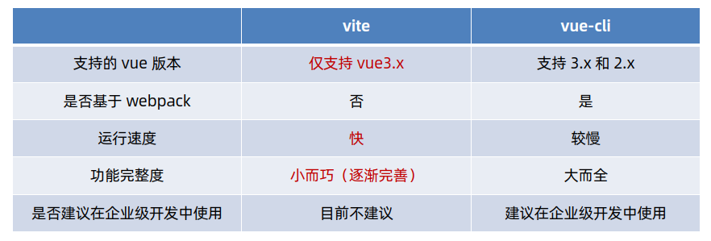

## 2. vue 脚手架工具(vue-cli)

### 2.1. 什么是 vue-cli

vue-cli 是 Vue.js 开发的标准工具。它简化了程序员基于 webpack 创建工程化的 Vue 项目的过程。

- 官网：https://cli.vuejs.org/
- 中文官网：https://cli.vuejs.org/zh/

> 关于旧版本
>
> Vue CLI 的包名称由 `vue-cli` 改成了 `@vue/cli`。 如果你已经全局安装了旧版本的 `vue-cli` (1.x 或 2.x)，你需要先通过 `npm uninstall vue-cli -g` 或 `yarn global remove vue-cli` 卸载它。

### 2.2. 安装命令

- vue-cli 是 npm 上的一个全局包。如果程序运行的环境（电脑）第一次使用vue的脚手架工具，需要运行以下命令，安装脚手架到本地

```bash
npm install -g @vue/cli
```

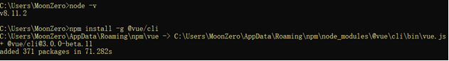

- 安装之后的地址（默认值）：

> 例子：C:\Users\MoonZero\AppData\Roaming\npm\node_modules\@vue\cli\bin
>
> 可以通过配置npm来设置全局安装的默认位置

可以用这个命令来检查其版本是否正确：

```shell
vue --version
```

如需升级全局的 Vue CLI 包，请运行：

```shell
npm update -g @vue/cli

# 或者
yarn global upgrade --latest @vue/cli
```

### 2.3. 创建模版

#### 2.3.1. 语法格式

> 注意:如果环境第一次使用CLI脚手架，必须进行了上一步操作后再可以创建模版

- 基于 vue-cli 快速生成工程化的 Vue 项目：

```bash
vue create 项目的名称
```

- 运行创建模版的命令后，需要设置

```
- ?Project name ---- 项目名称，init命令时也填了个project-name，如果无需更改，直接回车即可；
- ?Project description ---- 项目描述，按需填写。无需填写可以直接回车；
- ?Author ---- 作者
- ?Vue build ---- 构建模式，一般默认第一个；
- ?Install vue-router? ---- 是否安装vue-router。选Y。后边构建项目会用到。
- ?Use ESLint to lint yout code? ---- 格式校验，按需；
- ?Set up unit tests ---- 测试相关，按需；
- ?Setup e2e tests with Nightwatch? ---- 测试相关，按需；
- ?Should we run 'npm install' for you after the project has been created? ---- 按需，这里选Yes, use NPM。如果选No，后续在目标目录下执行npm install即可。
```

> 注：创建模版后，项目的位置可以移动

#### 2.3.2. 创建项目选择项解析

选择【Manuallly select features】

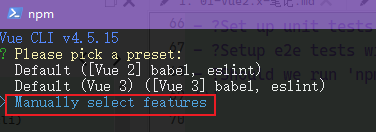

一般选择Babel、Router、Vuex、CSS Pre-processors，以上也可以按需选择，其他默认即可

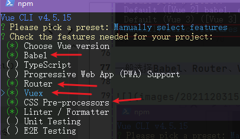

按需选择版本

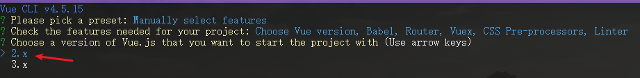

选择“N”，不使用 history 模式的路由

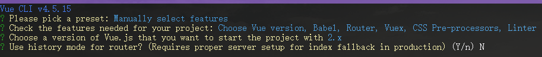

选择【Less】处理器

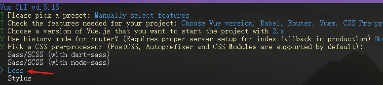

选择【ESLint + Standard config】，标准的 ESLint 的语法规范

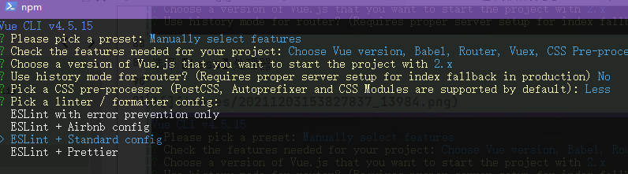

选择保存时进行语法格式检查

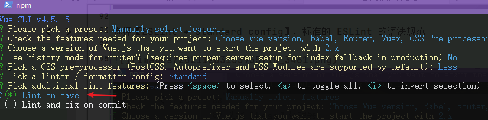

选择【In dedicated config files】，将Babel、ESLint等插件的配置项，放到独立的配置文件中

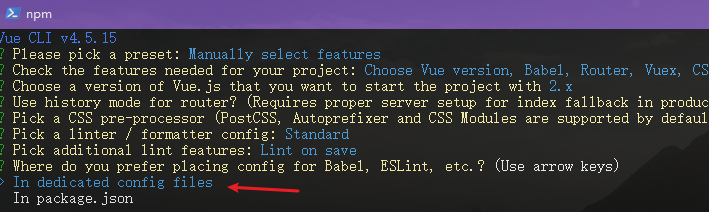

不保存当前配置

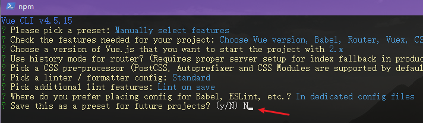

### 2.4. 项目安装与运行命令

> 注：如果创建时没有选择创建后执行运行【npm install】命令，需要手动进行安装

- 安装：`npm install`
- 运行项目：`npm run dev`

### 2.5. 安装依赖的命令

使用命令：`npm install 依赖的名字`。或者一次安装多个的命令：`npm install 依赖的名字1 依赖的名字2 ...`

如何安装在是devDependencies中，使用命令：`npm install 依赖的名字 --save-dev`

### 2.6. vue 项目的运行流程

在工程化的项目中，vue 要做的事情很单纯：通过 `main.js` 把 `App.vue` 渲染到 `index.html` 的指定区域中。核心文件说明如下：

- `App.vue` 用来编写待渲染的模板结构
- `index.html` 中需要预留一个 `el` 区域
- `main.js` 把 `App.vue` 渲染到了 `index.html` 所预留的区域中

## 3. vite 的基本使用

### 3.1. 创建 vite 的项目

按照顺序执行如下的命令，即可基于 vite 创建 vue 3.x 的工程化项目：

```bash
npm init vite-app 项目名称

cd 项目名称
npm install
npm run dev
```

### 3.2. vite 项目结构

使用 vite 创建的项目结构如下：

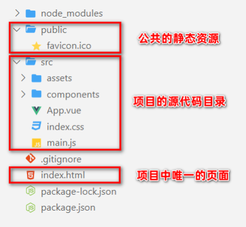

- `node_modules` 目录用来存放第三方依赖包
- `public` 是公共的静态资源目录
- `src` 是项目的源代码目录（程序员写的所有代码都要放在此目录下）
- `.gitignore` 是 Git 的忽略文件
- `index.html` 是 SPA 单页面应用程序中唯一的 HTML 页面
- `package.json` 是项目的包管理配置文件

在 src 这个项目源代码目录之下，包含了如下的文件和文件夹：

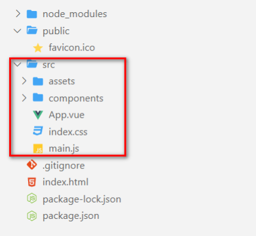

- `assets` 目录用来存放项目中所有的静态资源文件（css、fonts等）
- `components` 目录用来存放项目中所有的自定义组件
- `App.vue` 是项目的根组件
- `index.css` 是项目的全局样式表文件
- `main.js` 是整个项目的打包入口文件

### 3.3. vite 项目的运行流程

在工程化的项目中，vue 要做的事情很单纯：通过 main.js 把 App.vue 渲染到 index.html 的指定区域中。

其中：

1. App.vue 用来编写待渲染的模板结构

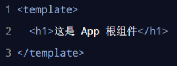

2. index.html 中需要预留一个 el 区域

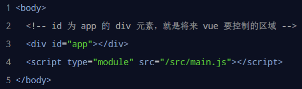

3. 按照 vue 3.x 的标准用法，在 main.js 把 App.vue 渲染到了 index.html 所预留的 el 区域中

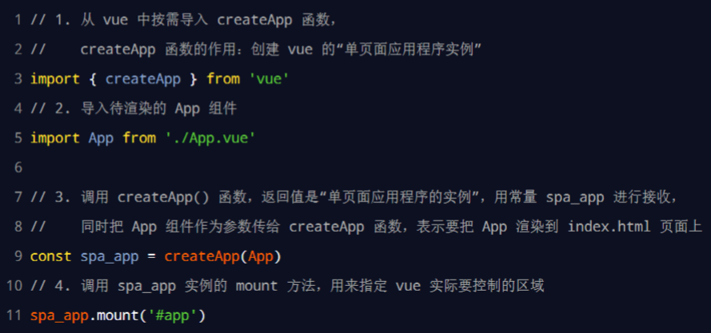

## 4. 项目的目录设计

### 4.1. 通常项目目录结构

一般项目的目录都会创建公用部分目录【common】，组件目录会按页面不能的组件分开目录

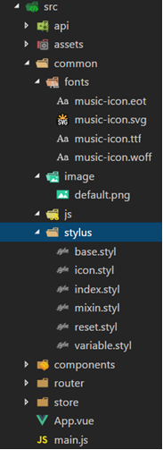

- 【api】：用来存放与后台的交互的文件
- 【common】：存放公共的内容
    - 【fonts】：自定义的文字样式
    - 【image】：项目的相关图片
    - 【js】：公共的js文件
    - 【stylus】：公共的样式
- 【components】：组件文件
- 【router】：配置路由的js文件
- 【store】：仓库文件

### 4.2. vue-cli 创建的 vue2 项目目录结构

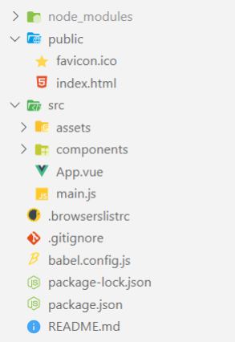

## 5. 项目的相关配置

### 5.1. 配置文件.eslintrc.js，检查eslin语法

- 配置检查eslin语法，设置rules属性里的'semi'属性
- .eslintrc.js文件中配置不检查一些语法规则，在rules属性中，将规则名称做为属性，设置为“0”即可

```js
...省略其他内容
rules: {
    // allow async-await
    'generator-star-spacing': 'off',
    // allow debugger during development
    'no-debugger': process.env.NODE_ENV === 'production' ? 'error' : 'off'
    'semi': ['error','always'],		// 配置用于检查eslin语法
    // .eslintrc.js文件中配置不检查一些语法规则，将规则名称做为属性，设置为“0”即可
    'indent': 0,
    'space-before-function-paren': 0,
    'no-trailing-spaces': 0
}
```

### 5.2. 部署时出现无法加载vue-style-loader

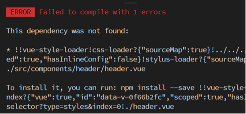

项目中如果使用stylus做为css预处理器，需要在建立好项目后安装stylus（此项目需要）。因为脚手架不会默认安装

使用命令安装（此项目需要）：`npm install stylus stylus-loader`
> 注：如果安装后没有看到生成依赖，再单独安装

安装完成后，在package.json配置文件中会出现相关的依赖，配置后可以使用stylus样式

```json
"devDependencies": {
    ...省略...
    "vue-style-loader": "^3.0.1",
    "stylus": "^0.54.5",
    "stylus-loader": "^3.0.2",
  }
```

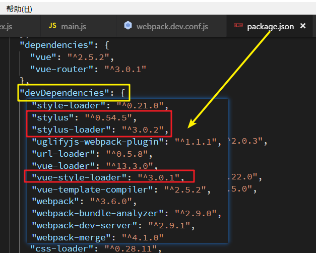

### 5.3. 设置相关路径的别名

如果配置后还出现错误

```cmd
This dependency was not found:
* common/stylus/index.styl in ./src/main.js
To install it, you can run: npm install --save common/stylus/index.styl
```

因为main.js文件中`import 'common/stylus/index.styl'`没有配置common的绝对路径的别名，webpack无法识别

解决方法是在`build\webpack.base.conf.js`，将 resolve添加别名，绑定绝对路径

```js
var path = require('path')

function resolve(dir) {
  return path.join(__dirname, '..', dir)
}

module.exports = {
  ......
  resolve: {
    extensions: ['.js', '.vue', '.json'],
    alias: {
      '@': resolve('src'),
      'common': resolve('src/common'),
      'components': resolve('src/components'),
      'base': resolve('src/base'),
      'api': resolve('src/api')
    }
  },
  ......
}
```

### 5.4. 项目开发需要新增的依赖

- "babel-runtime": "^6.26.0"
    - 会ES语法进行转义
-  "fastclick": "^1.0.6"
    - 消除在移动浏览器上触发click事件与一个物理Tap(敲击)之间的300延迟，提高程序的运行效率
- "babel-polyfill": "^6.26.0"
    - 对ES6的一些API进行转义
- "jsonp": "^0.2.1"
    - 用于抓取网络数据

## 6. axios 网络请求工具

### 6.1. 为什么要全局配置 axios

在实际项目开发中，几乎每个组件中都会用到 axios 发起数据请求。此时会遇到如下两个问题：

1. 每个组件中都需要导入 axios（代码臃肿）
2. 每次发请求都需要填写完整的请求路径（不利于后期的维护）

### 6.2. vue 项目配置全局的 axios

#### 6.2.1. vue3 的项目中全局配置 axios（有问题，待确认）

在 main.js 入口文件中，通过 `app.config.globalProperties` 全局挂载 `axios`

```js
/*
  1. 单独导入vue相关需要的函数或类，如：createApp 函数
      createApp 函数的作用是：创建 vue 的“单页面应用程序实例”
*/
import { createApp } from 'vue'
import axios from 'axios'

// 2. 导入待渲染的组件，如：App.vue
import App from './App.vue'

/*
  3. 调用 createApp 函数，创建 SPA 应用的实例，函数返回值是“单页面应用程序的实例”
      可以用一个常量进行接收，以为后续可以给vue实例增加注册其他插件
*/
const vueApp = createApp(App)

// 为 axios 配置请求的根路径
axios.defaults.baseURL = 'https://www.xxx.com'
/*
  将 axios 挂载为 vue 的全局自定义属性
  每个组件可以通过 this 直接访问到全局挂载的自定义属性
*/
vueApp.config.globalProperties.$http = axios

// 4. 调用 mount() 把 App 组件的模板结构，渲染到指定的 el 区域中，即指定 vue 实际要控制的区域
vueApp.mount('#app')
```

> TODO: 注：axios 0.24.0以上的版本，在配置时提示 axios 没有 `defaults.baseURL`的属性，问题待解决

#### 6.2.2. vue2 的项目中全局配置 axios

需要在 main.js 入口文件中，通过 Vue 构造函数的 `prototype` 原型对象全局配置 axios：

```js
import Vue from 'vue'
import App from './App'

import axios from 'axios'

// 全局配置 axios 的请求根路径
axios.defaults.baseURL = 'http://xxxxxxxx'
// 将 axios 挂载到 Vue.prototype 上，可以使每个 .vue 组件的实例通过 this.$http 来发起请求
Vue.prototype.$http = axios
// 不过通常不使用此种方式，一般都会封装一个专门发送http的js文件，然后在一些api文件中定义多种请求方法，
// 组件使用时引用不同的请求方法，从而达到 API 接口的复用

new Vue({
  render: h => h(App),
}).$mount('#app')
```

> 注：通常会将一些工具类库的配置按模块独立成一个文件


### 6.3. 使用axios发送post请求，后端@RequestBody无法接收参数

springboot会报错`Content type 'application/x-www-form-urlencoded;charset=UTF-8' not supported`。将`@RequestBody`换成`@RequestParam`就可以，这个暂时还搞不懂是什么回事？

```java
/* 多条件查询影片资源信息 */
@PostMapping("/findByCondition")
public PageResult<JavMain> findByCondition(@RequestBody Map<String, Object> params) {
    ......
}

// 改成以下方式
@PostMapping("/findByCondition")
public PageResult<JavMain> findByCondition(@RequestParam Map<String, Object> params) {
    ......
}
```

### 6.4. Axios 请求配置参数详解

#### 6.4.1. axios API

##### 6.4.1.1. axios 传递相关配置来创建请求

- `axios(config)`

```js
// 发送 POST 请求
axios({
  method: 'post',
  url: '/user/12345',
  data: {
    firstName: 'Fred',
    lastName: 'Flintstone'
  }
});
```

- `axios(url[, config])`

```js
// 发送 GET 请求（默认的方法）
axios('/user/12345');
```

##### 6.4.1.2. 为所有支持的请求方法提供了别名

- `axios.request(config)`
- `axios.get(url[, config])`
- `axios.delete(url[, config])`
- `axios.head(url[, config])`
- `axios.post(url[, data[, config]])`
- `axios.put(url[, data[, config]])`
- `axios.patch(url[, data[, config]])`

**注：在使用别名方法时， url、method、data这些属性都不必在配置中指定。**

##### 6.4.1.3. 处理并发请求的助手函数

- `axios.all(iterable)`
- `axios.spread(callback)`

#### 6.4.2. 创建axios实例（用来创建自定义请求）

可以使用自定义配置新建一个 axios 实例

```js
axios.create([config])
var instance = axios.create({
  baseURL: 'https://some-domain.com/api/',
  timeout: 1000,
  headers: {'X-Custom-Header': 'foobar'}
});
```

#### 6.4.3. 实例方法

以下是可用的实例方法。指定的配置将与实例的配置合并

- `axios#request(config)`
- `axios#get(url[, config])`
- `axios#delete(url[, config])`
- `axios#head(url[, config])`
- `axios#post(url[, data[, config]])`
- `axios#put(url[, data[, config]])`
- `axios#patch(url[, data[, config]])`

#### 6.4.4. 请求配置

这些是创建请求时可以用的配置选项。只有 url 是必需的。如果没有指定 method，请求将默认使用 get 方法。

```js
{
  // `url` 是用于请求的服务器 URL
  url: '/user',

  // `method` 是创建请求时使用的方法
  method: 'get', // 默认是 get

  // `baseURL` 将自动加在 `url` 前面，除非 `url` 是一个绝对 URL。
  // 它可以通过设置一个 `baseURL` 便于为 axios 实例的方法传递相对 URL
  baseURL: 'https://some-domain.com/api/',

  // `transformRequest` 允许在向服务器发送前，修改请求数据
  // 只能用在 'PUT', 'POST' 和 'PATCH' 这几个请求方法
  // 后面数组中的函数必须返回一个字符串，或 ArrayBuffer，或 Stream
  transformRequest: [function (data) {
    // 对 data 进行任意转换处理

    return data;
  }],

  // `transformResponse` 在传递给 then/catch 前，允许修改响应数据
  transformResponse: [function (data) {
    // 对 data 进行任意转换处理

    return data;
  }],

  // `headers` 是即将被发送的自定义请求头
  headers: {'X-Requested-With': 'XMLHttpRequest'},

  // `params` 是即将与请求一起发送的 URL 参数
  // 必须是一个无格式对象(plain object)或 URLSearchParams 对象
  params: {
    ID: 12345
  },

  // `paramsSerializer` 是一个负责 `params` 序列化的函数
  // (e.g. https://www.npmjs.com/package/qs, http://api.jquery.com/jquery.param/)
  paramsSerializer: function(params) {
    return Qs.stringify(params, {arrayFormat: 'brackets'})
  },

  // `data` 是作为请求主体被发送的数据
  // 只适用于这些请求方法 'PUT', 'POST', 和 'PATCH'
  // 在没有设置 `transformRequest` 时，必须是以下类型之一：
  // - string, plain object, ArrayBuffer, ArrayBufferView, URLSearchParams
  // - 浏览器专属：FormData, File, Blob
  // - Node 专属： Stream
  data: {
    firstName: 'Fred'
  },

  // `timeout` 指定请求超时的毫秒数(0 表示无超时时间)
  // 如果请求话费了超过 `timeout` 的时间，请求将被中断
  timeout: 1000,

  // `withCredentials` 表示跨域请求时是否需要使用凭证
  withCredentials: false, // 默认的

  // `adapter` 允许自定义处理请求，以使测试更轻松
  // 返回一个 promise 并应用一个有效的响应 (查阅 [response docs](#response-api)).
  adapter: function (config) {
    /* ... */
  },

  // `auth` 表示应该使用 HTTP 基础验证，并提供凭据
  // 这将设置一个 `Authorization` 头，覆写掉现有的任意使用 `headers` 设置的自定义 `Authorization`头
  auth: {
    username: 'janedoe',
    password: 's00pers3cret'
  },

  // `responseType` 表示服务器响应的数据类型，可以是 'arraybuffer', 'blob', 'document', 'json', 'text', 'stream'
  responseType: 'json', // 默认的

  // `xsrfCookieName` 是用作 xsrf token 的值的cookie的名称
  xsrfCookieName: 'XSRF-TOKEN', // default

  // `xsrfHeaderName` 是承载 xsrf token 的值的 HTTP 头的名称
  xsrfHeaderName: 'X-XSRF-TOKEN', // 默认的

  // `onUploadProgress` 允许为上传处理进度事件
  onUploadProgress: function (progressEvent) {
    // 对原生进度事件的处理
  },

  // `onDownloadProgress` 允许为下载处理进度事件
  onDownloadProgress: function (progressEvent) {
    // 对原生进度事件的处理
  },

  // `maxContentLength` 定义允许的响应内容的最大尺寸
  maxContentLength: 2000,

  // `validateStatus` 定义对于给定的HTTP 响应状态码是 resolve 或 reject  promise 。如果 `validateStatus` 返回 `true` (或者设置为 `null` 或 `undefined`)，promise 将被 resolve; 否则，promise 将被 rejecte
  validateStatus: function (status) {
    return status >= 200 && status < 300; // 默认的
  },
  // `maxRedirects` 定义在 node.js 中 follow 的最大重定向数目
  // 如果设置为0，将不会 follow 任何重定向
  maxRedirects: 5, // 默认的
  // `httpAgent` 和 `httpsAgent` 分别在 node.js 中用于定义在执行 http 和 https 时使用的自定义代理。允许像这样配置选项：
  // `keepAlive` 默认没有启用
  httpAgent: new http.Agent({ keepAlive: true }),
  httpsAgent: new https.Agent({ keepAlive: true }),
  // 'proxy' 定义代理服务器的主机名称和端口
  // `auth` 表示 HTTP 基础验证应当用于连接代理，并提供凭据
  // 这将会设置一个 `Proxy-Authorization` 头，覆写掉已有的通过使用 `header` 设置的自定义 `Proxy-Authorization` 头。
  proxy: {
    host: '127.0.0.1',
    port: 9000,
    auth: : {
      username: 'mikeymike',
      password: 'rapunz3l'
    }
  },
  // `cancelToken` 指定用于取消请求的 cancel token
  // （查看后面的 Cancellation 这节了解更多）
  cancelToken: new CancelToken(function (cancel) {
  })
}
```

#### 6.4.5. 响应结构

某个请求的响应包含以下信息

```js
{
  // `data` 由服务器提供的响应
  data: {},

  // `status` 来自服务器响应的 HTTP 状态码
  status: 200,

  // `statusText` 来自服务器响应的 HTTP 状态信息
  statusText: 'OK',

  // `headers` 服务器响应的头
  headers: {},

  // `config` 是为请求提供的配置信息
  config: {}
}
```

使用 `then` 时，将接收下面这样的响应

```js
axios.get('/user/12345')
  .then(function(response) {
    console.log(response.data);
    console.log(response.status);
    console.log(response.statusText);
    console.log(response.headers);
    console.log(response.config);
});
```

在使用 `catch` 时，或传递 `rejection` `callback` 作为 `then` 的第二个参数时，响应可以通过 `error` 对象可被使用

### 6.5. 配置的默认值

可以指定将被用在各个请求的配置默认值

#### 6.5.1. 全局的 axios 默认值

```js
axios.defaults.baseURL = 'https://api.example.com';
axios.defaults.headers.common['Authorization'] = AUTH_TOKEN;
axios.defaults.headers.post['Content-Type'] = 'application/x-www-form-urlencoded';
```

#### 6.5.2. 自定义实例默认值

```js
// 创建实例时设置配置的默认值
var instance = axios.create({
  baseURL: 'https://api.example.com'
});

// 在实例已创建后修改默认值
instance.defaults.headers.common['Authorization'] = AUTH_TOKEN;
```

#### 6.5.3. 配置的优先顺序

配置会以一个优先顺序进行合并。这个顺序是：在 lib/defaults.js 找到的库的默认值，然后是实例的 defaults 属性，最后是请求的 config 参数。后者将优先于前者。这里是一个例子：

```js
// 使用由库提供的配置的默认值来创建实例
// 此时超时配置的默认值是 `0`
var instance = axios.create();

// 覆写库的超时默认值
// 现在，在超时前，所有请求都会等待 2.5 秒
instance.defaults.timeout = 2500;

// 为已知需要花费很长时间的请求覆写超时设置
instance.get('/longRequest', {
  timeout: 5000
});
```

### 6.6. 拦截器

#### 6.6.1. 什么是拦截器

拦截器（英文：Interceptors）会在每次发起 ajax 请求和得到响应的时候自动被触发。

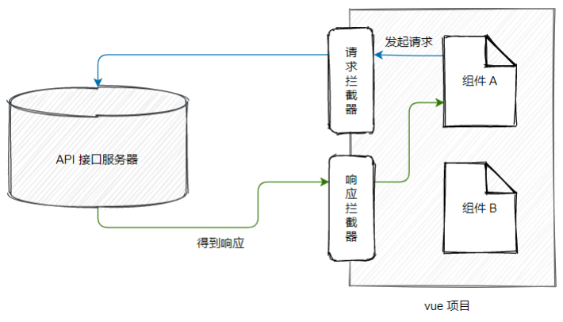

> 应用场景：Token 身份认证、请求时 Loading 效果、等等。。。

#### 6.6.2. 配置请求拦截器

在请求或响应被 `then` 或 `catch` 处理前拦截它们

```js
// 添加请求拦截器
axios.interceptors.request.use(function (config) {
    // 在发送请求之前做些什么
    return config;
  }, function (error) {
    // 对请求错误做些什么
    return Promise.reject(error);
  });
```

#### 6.6.3. 配置响应拦截器

```js
// 添加响应拦截器
axios.interceptors.response.use(function (response) {
    // 超出 2xx 范围的状态码都会触发该函数。
    // 对响应数据做点什么
    return response;
  }, function (error) {
    // 超出 2xx 范围的状态码都会触发该函数。
    // 对响应错误做点什么
    return Promise.reject(error);
  });
```

#### 6.6.4. 移除与添加拦截器

如果想在稍后移除拦截器，可以这样

```js
const myInterceptor = axios.interceptors.request.use(function () {/*...*/});
axios.interceptors.request.eject(myInterceptor);
```

可以为自定义 axios 实例添加拦截器

```js
const instance = axios.create();
instance.interceptors.request.use(function () {/*...*/});
```

### 6.7. 错误处理

```js
axios.get('/user/12345')
  .catch(function (error) {
    if (error.response) {
      // 请求成功发出且服务器也响应了状态码，但状态代码超出了 2xx 的范围
      console.log(error.response.data);
      console.log(error.response.status);
      console.log(error.response.headers);
    } else if (error.request) {
      // 请求已经成功发起，但没有收到响应
      // `error.request` 在浏览器中是 XMLHttpRequest 的实例，
      // 而在node.js中是 http.ClientRequest 的实例
      console.log(error.request);
    } else {
      // 发送请求时出了点问题
      console.log('Error', error.message);
    }
    console.log(error.config);
  });
```

可以使用 `validateStatus` 配置选项，自定义抛出错误的 HTTP 状态码的错误范围

```js
axios.get('/user/12345', {
  validateStatus: function (status) {
    return status < 500; // 状态码在大于或等于500时才会 reject
  }
})
```

使用 `toJSON` 可以获取更多关于HTTP错误的信息。

```js
axios.get('/user/12345')
  .catch(function (error) {
    console.log(error.toJSON());
  });
```

### 6.8. 自定义封装axios请求示例

#### 6.8.1. 示例1

```js
/* 封闭axios的请求，此封装方式后端可以使用@RequestBody注解对象接收参数 */
import axios from 'axios'
import store from '../store'
import { getToken } from '@/utils/auth'

export default function (url, method, payload) {
  // 判断是get请求还是post请求(请求时的参数名不一样)
  let data = method.toLocaleLowerCase() === 'get' ? 'params' : 'data'
  // 合并请求参数
  let params = {
    ...{
      token: getToken()
    },
    ...payload
  }
  // 处理url
  if (url.substring(0, 1) !== '/') {
    url = '/' + url
  }
  // 返回发送请求数据
  return axios({
    method: method,
    url: process.env.BASE_API + url,
    [data]: params
  }).then(response => {
    return Promise.resolve(response.data)
  }).catch(error => {
    return Promise.reject(error)
  })
}
```

#### 6.8.2. 示例2

在vue的后台管理开发中，应需求，需要对信息做一个校验，需要将参数传递两份过去，一份防止在body中，一份防止在formdata中，axios请求会默认将参数放在formdata中进行发送。

对前端而言其实都一样，无非就是参数的格式问题。

对后端而言

（form data）可以用request.getParameter(接收参数名)

（request payload）用request.getParameter是接收不到值，必须用输入流获取，得到字符串在转json

应需求有的接口是需要放在body中有的要放在formdata中，所以前端需要做一个灵活的处理，因为就算只是更改headers中的字段也会让人时时刻刻记得。所以最终将请求文件封装如下：

```js
/**
 * @description 配置网络请求
 */
import axios                from 'axios'
import { Message} from 'element-ui'
import router               from '../router/permission'
import Vue from 'vue'
import VueCookies from 'vue-cookies'
const moment = require('moment');
const Base64 = require('js-base64').Base64;
// loading框设置局部刷新，且所有请求完成后关闭loading框
var loading;
function startLoading() {
  loading = Vue.prototype.$loading({
    lock: true,
    text: "Loading...",
    target: document.querySelector('.loading-area')//设置加载动画区域
  });
}
function endLoading() {
  loading.close();
}
// 声明一个对象用于存储请求个数
var needLoadingRequestCount = 0;
function showFullScreenLoading() {
  if (needLoadingRequestCount === 0) {
    startLoading();
  }
  needLoadingRequestCount++;
};
function tryHideFullScreenLoading() {
  if (needLoadingRequestCount <= 0) return;
    needLoadingRequestCount--;
  if (needLoadingRequestCount === 0) {
    endLoading();
  }
};
// 请求拦截
axios.interceptors.request.use(config => {
  let token = "";
  showFullScreenLoading();
  if(VueCookies.isKey('userinfo')) { 
    const USERINFO = VueCookies.get('userinfo');
    if(config.method == 'get') {
      token = Base64.encode(USERINFO.token + '|' + moment().utc().format('YYY-MM-DD HH:mm:ss' + '|' + JSON.stringify(config.params)));
      config.params.hospitalId = USERINFO.hospitalId;
    } else {
      token = Base64.encode(USERINFO.token + '|' + moment().utc().format('YYY-MM-DD HH:mm:ss' + '|' + JSON.stringify(config.data)));
      config.data.hospitalId = USERINFO.hospitalId;
    }
    let TOKENSTART = token.slice(0,10),
        TOKENEND = token.slice(10);
    token = TOKENEND + TOKENSTART;
    config.headers['token'] = token;
  }
  return config;
}, err => {
  tryHideFullScreenLoading();
  Message.error({ message: '请求超时!' });
  return Promise.resolve(err);
})
// 响应拦截
axios.interceptors.response.use(res => {
  tryHideFullScreenLoading();
  switch(res.data.code) {
    case 200:
    return res.data.result;
    case 401:
    router.push('/login');
    VueCookies.remove('userinfo');
    return Promise.reject(res);
    case 201:
    Message.error({ message: res.data.msg });
    return Promise.reject(res);
    default :
    return Promise.reject(res);
  }
}, err => {
  tryHideFullScreenLoading();
  if(!err.response.status) {
    return false;
  }
  switch(err.response.status) {
    case 504:
    Message.error({ message: '服务器被吃了⊙﹏⊙∥' });
    break;
    case 404:
    Message.error({ message: '服务器被吃了⊙﹏⊙∥' });
    break;
    case 403:
    Message.error({ message: '权限不足,请联系管理员!' });
    break;
    default:
    return Promise.reject(err);
  }
})
axios.defaults.timeout = 300000;// 请求超时5fen
// RequestBody
export const postJsonRequest = (url, params) => {
  return axios({
    method: 'post',
    url: url,
    data: params,
    headers: {
      'Content-Type': 'application/json',
    },
  });
}
// formData
export const postRequest = (url, params) => {
  return axios({
    method: 'post',
    url: url,
    data: params,
    transformRequest: [function (data) {
      let ret = ''
      for (let it in data) {
        ret += encodeURIComponent(it) + '=' + encodeURIComponent(data[it]) + '&'
      }
      return ret
    }],
    headers: {
      'Content-Type': 'application/x-www-form-urlencoded'
    }
  });
}
export const getRequest = (url, data = '') => {
  return axios({
    method: 'get',
    params: data,
    url: url,
  });
}
```

Get请求的话是不需要进行设置的，因为get请求回默认将参数放在params中，post请求的话会有两个，所以这里post请求封装了两份。

## 7. proxy 跨域代理

如果项目的 API 接口没有开启 CORS 跨域资源共享，因此默认情况下，前端请求后端服务的接口无法请求成功！

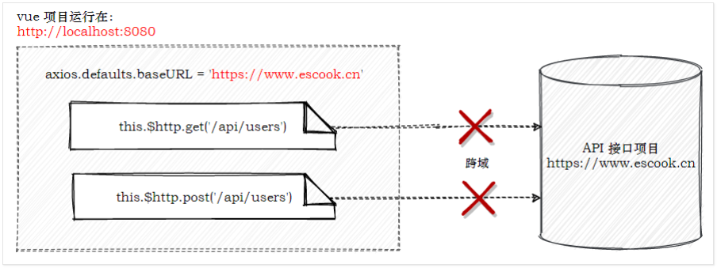

### 7.1. 通过代理解决接口的跨域问题

通过 vue-cli 创建的项目在遇到接口跨域问题时，可以通过代理的方式来解决：

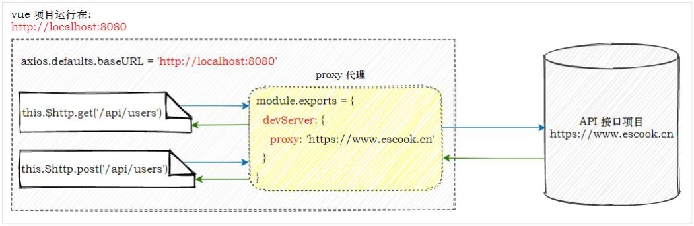

1. 把 `axios` 的请求根路径设置为 vue 项目的运行地址（接口请求不再跨域）
2. vue 项目发现请求的接口不存在，把请求转交给 `proxy` 代理
3. 代理把请求根路径替换为 `devServer.proxy` 属性的值，发起真正的数据请求
4. 代理把请求到的数据，转发给 `axios`

### 7.2. vue 项目中配置 proxy 代理

步骤1：在 main.js 入口文件中，把 axios 的请求根路径改造为当前 web 项目的根路径：

```js
import axios from 'axios'

// 全局配置 axios 的请求根路径
axios.defaults.baseURL = 'http://localhost:38080'
```

步骤2：在项目根目录下创建 vue.config.js 的配置文件，并声明如下的配置：

```js
module.exports = {
  devServer: {
    // 此配置在项目的开发调试阶段生效。
    // 会将所有未知请求（非匹配到静态文件的请求）代理转发到相应的域名。示例是：https://www.moon.com
    proxy: 'https://www.moon.com',
  },
}
```

> 注意：
>
> 1. `devServer.proxy` 提供的代理功能，仅在开发调试阶段生效
> 2. 项目上线发布时，依旧需要 API 接口服务器开启 CORS 跨域资源共享
> 3. 另外，如果是旧版本的vue-cli中，是在 `webpack.dev.conf.js` 文件中配置

# 扩展知识

## 1. 框架常用知识点

### 1.1. vue文件编写注意点

在编写vue与js文件时，字符串与引入的地址都使用单引号【'】

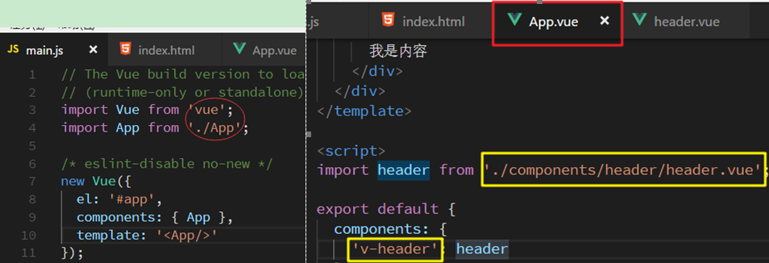

### 1.2. Vuex之理解Store的用法

Vuex就是提供一个仓库，Store仓库里面放了很多对象。其中state就是数据源存放地，对应于与一般Vue对象里面的data

在使用Vuex的时候通常会创建Store实例

```js
new Vuex.store({
	state: xxx,
	getters: xxx,
	mutations: xxx,
	actions: xxx
})
```

有很多子模块的时候还会使用到modules

1. Vuex的状态存储是响应式，当vue组件从store中读取状态时，若store中的状态发生变化，那么相应的组件也会相应得到高效更新
2. 不能直接修改store状态。改变store中的状态的唯一途径是显式地**提交(commit) mutation**

总结，Store类就是存储数据和管理数据方法的仓库，实现方式是将数据和方法已对象形式传入其实例中。**要注意一个应用或是项目中只能存在一个Store实例！！**

#### 1.2.1. vuex相关属性
vuex就像一个无形的仓库，公共的状态我们会抽离出来放进里面。vuex的核心主要包括以下几个部分

- state
    - state里面就是存放的我们上面所提到的状态
- mutations
    - mutations就是存放如何更改状态
- getters
    - getters就是从state中派生出状态，比如将state中的某个状态进行过滤然后获取新的状态。
- actions
    - actions就是mutation的加强版，它可以通过commit mutations中的方法来改变状态，最重要的是它可以进行异步操作。
- modules
    - modules顾名思义，就是当用这个容器来装这些状态还是显得混乱的时候，我们就可以把容器分成几块，把状态和管理规则分类来装。这和我们创建js模块是一个目的，让代码结构更清晰。

### 1.3. 使用sessionStorage解决vuex在页面刷新后数据被清除的问题
#### 1.3.1. 问题描述

JavaScript代码是运行在内存中，代码运行时的所有变量，函数，也都是保存在内存中的。

刷新页面后，之前申请的内存就被释放，重新加载脚本代码，变量重新赋值，所以这些数据需要储存在外部，如：Local Storage, Session Storage, IndexDB等。

#### 1.3.2. 解决方法

HTML5 提供了两种客户端存储数据的方法（以下的都由cookie完成的，但cookie不适合大量灵气的存储，因为它们由每个对服务器的请求来传递，这会让cookie速度很慢而且效率不高）

- localStorage - 没有时间限制的数据存储
- sessionStorage - 针对一个session的数据存储

这里使用sessionStorage，需要注意的是vuex中的变量是响应式的，而sessionStorage不是，当你改变vuex中的状态，组件会检测到改变，而sessionStorage就不会了，页面要重新刷新才可以看到改变，所以应让vuex中的状态从sessionStorage中得到，这样组件就可以响应式的变化

- code demo-mutations.js

```js
ADD_LOGIN_USER (state,data) { //登入，保存状态
    sessionStorage.setItem("username", data); //添加到sessionStorage
    sessionStorage.setItem("isLogin",true);
    state.username=data,  //同步的改变store中的状态
    state.isLogin=true
    },
    SIGN_OUT (state) { //退出，删除状态
    sessionStorage.removeItem("username"); //移除sessionStorage
    sessionStorage.removeItem("isLogin");
    state.username=''  //同步的改变story中的状态
    state.isLogin=false
}
```

- code demo-getters.js

```js
isLogin (state) {
    if (!state.isLogin) {
        state.isLogin=sessionStorage.getItem('isLogin'); //从sessionStorage中读取状态
        state.username=sessionStorage.getItem('username');
    }
    return state.username
}
```

总体的实现思路是让vuex中story的状态和sessionStorage保持一致（从sessionStorage取值）

#### 1.3.3. 补充

vuex存储和本地存储(localstorage、sessionstorage)的区别

1. 最重要的区别：vuex存储在内存，localstorage则以文件的方式存储在本地
2. 应用场景：vuex用于组件之间的传值，localstorage则主要用于不同页面之间的传值。
3. 永久性：当刷新页面时vuex存储的值会丢失，localstorage不会。

注：很多同学觉得用localstorage可以代替vuex, 对于不变的数据确实可以，但是当两个组件共用一个数据源（对象或数组）时，如果其中一个组件改变了该数据源，希望另一个组件响应该变化时，localstorage无法做到，原因就是区别1。

### 1.4. vue的package.json中dependencies和devDependencies区别
1. **dependencies**：应用能够正常运行所依赖的包。这种 dependencies 是最常见的，用户在使用 npm install 安装你的包时会自动安装这些依赖。
2. **devDependencies**：开发应用时所依赖的工具包。通常是一些开发、测试、打包工具，例如 webpack、ESLint、Mocha。应用正常运行并不依赖于这些包，用户在使用 npm install 安装你的包时也不会安装这些依赖。
3. **peerDependencies**：应用运行依赖的宿主包。最典型的就是插件，例如各种 jQuery 插件，这些插件本身不包含 jQeury，需要外部提供。用户使用 npm 1 或 2 时会自动安装这种依赖，npm 3 不会自动安装，会提示用户安装。
4. **bundledDependencies**：发布包时需要打包的依赖，似乎很少见。
5. **optionalDependencies**：可选的依赖包。此种依赖不是程序运行所必须的，但是安装后可能会有新功能，例如一个图片解码库，安装了 optionalDependencies 后会支持更多的格式。

从以上的定义可以看出，**dependencies 是程序运行依赖，devDependencies 一般是一些开发工具，peerDependencies 一般用于插件。**

### 1.5. VUE+Webpack 实现懒加载的三种方式

方式1：

```js
const hyh = resolve => {
    import ('@/components/index/hyh').then(module => {
        resolve(module)
    })
}

// 引入方式 就是正常的路由引入方式
const router = new Router({
    routes: [{
       path: '/hyh',
       component: hyh,
       name: 'hyh'
    }]
})
```

方式2：

```js
const router = new Router({
    routes: [{
       path: '/index',
       component: (resolve) => {
           require(['../components/index/index'], resolve) // 这里是你的模块 不用import去引入了
       }
    }]
})
```

方式3（推荐）：

```js
// r就是resolve
const list = r => require.ensure([], () => r(require('../components/list/list')), 'list');
// 路由也是正常的写法  这种是官方推荐的写的 按模块划分懒加载
const router = new Router({
    routes: [{
       path: '/list/blog',
       component: list,
       name: 'blog'
    }]
})
```

### 1.6. vue-cli为什么会用@来访问路径

使用vue-cli开发时，经常可以看到引用的路径里面，是@/xx/xx，那么@是表示什么？

这是在Webpack里面配置的一个路径别名

在build目录下的webpack.base.conf.js里面搜索alias，里面有一个配置好的别名@，指向的是src目录

```js
alias: {
  'vue$': 'vue/dist/vue.esm.js',
  '@': resolve('src'),
}
```

如果还想要自定义一些路径的别名，也可在这里配置

### 1.7. 取消ESLINT语法限制

因为eslint语法限制，每个import语句后面需要加“;”号，import的路径需要将.vue补全，如果需要取消这些语法限制

配置webpack.base.conf.js中配置

```js
 module: {
rules: [
  // 将此处消释或者删除，取消eslint语法限制
  // ...(config.dev.useEslint ? [createLintingRule()] : []),
  {
    test: /\.vue$/,
    loader: 'vue-loader',
    options: vueLoaderConfig
  },
```

## 2. 在vue中使用vue-echarts
### 2.1. 用 npm 与 vue-loader 基于 ES Module 引入（推荐用法）

```js
  // 引入vue-echarts
  import Vue from 'vue'
  import ECharts from 'vue-echarts/components/ECharts.vue'
  // 手动引入 ECharts 各模块来减小打包体积
  import 'echarts/lib/chart/bar'
  import 'echarts/lib/component/tooltip'

  // 注册组件后即可使用
  Vue.component('v-chart', ECharts)
  //在build/webpack.base.conf.js中修改成如下东西 {
    test: /\.js$/,
    loader: 'babel-loader',
    include: [
        resolve('src'),
        resolve('test'),
        resolve('node_modules/vue-echarts'),
        resolve('node_modules/resize-detector')
      ]
   }
   //在.vue文件中使用
　　<div class="left-bottom">
　　　　<div class="title">系统访问量</div>
　　　　<v-chart style="width: 100%;height: 13rem;position: absolute;top: -2%;" :options="line"></v-chart>
　　</div>
　　//配置
　　line: {
      ......
    }
```

这里之所以使用 require 而不是 import，是因为 require 可以直接从 node_modules 中查找，而 import 必须把路径写全。

### 2.2. 按需引入的模块列表见

```js
/*
* Licensed to the Apache Software Foundation (ASF) under one
* or more contributor license agreements.  See the NOTICE file
* distributed with this work for additional information
* regarding copyright ownership.  The ASF licenses this file
* to you under the Apache License, Version 2.0 (the
* "License"); you may not use this file except in compliance
* with the License.  You may obtain a copy of the License at
*
*   http://www.apache.org/licenses/LICENSE-2.0
*
* Unless required by applicable law or agreed to in writing,
* software distributed under the License is distributed on an
* "AS IS" BASIS, WITHOUT WARRANTIES OR CONDITIONS OF ANY
* KIND, either express or implied.  See the License for the
* specific language governing permissions and limitations
* under the License.
*/

var _echarts = require("./lib/echarts");

(function () {
  for (var key in _echarts) {
    if (_echarts == null || !_echarts.hasOwnProperty(key) || key === 'default' || key === '__esModule') return;
    exports[key] = _echarts[key];
  }
})();

var _export = require("./lib/export");

(function () {
  for (var key in _export) {
    if (_export == null || !_export.hasOwnProperty(key) || key === 'default' || key === '__esModule') return;
    exports[key] = _export[key];
  }
})();

require("./lib/component/dataset");
require("./lib/chart/line");
require("./lib/chart/bar");
require("./lib/chart/pie");
require("./lib/chart/scatter");
require("./lib/chart/radar");
require("./lib/chart/map");
require("./lib/chart/tree");
require("./lib/chart/treemap");
require("./lib/chart/graph");
require("./lib/chart/gauge");
require("./lib/chart/funnel");
require("./lib/chart/parallel");
require("./lib/chart/sankey");
require("./lib/chart/boxplot");
require("./lib/chart/candlestick");
require("./lib/chart/effectScatter");
require("./lib/chart/lines");
require("./lib/chart/heatmap");
require("./lib/chart/pictorialBar");
require("./lib/chart/themeRiver");
require("./lib/chart/sunburst");
require("./lib/chart/custom");
require("./lib/component/graphic");
require("./lib/component/grid");
require("./lib/component/legendScroll");
require("./lib/component/tooltip");
require("./lib/component/axisPointer");
require("./lib/component/polar");
require("./lib/component/geo");
require("./lib/component/parallel");
require("./lib/component/singleAxis");
require("./lib/component/brush");
require("./lib/component/calendar");
require("./lib/component/title");
require("./lib/component/dataZoom");
require("./lib/component/visualMap");
require("./lib/component/markPoint");
require("./lib/component/markLine");
require("./lib/component/markArea");
require("./lib/component/timeline");
require("./lib/component/toolbox");
require("zrender/lib/vml/vml");
require("zrender/lib/svg/svg");
```

## 3. 路由文件路径的拼接公共方法
### 3.1. 编写拼接路由文件公共方法js文件

创建`_import.js`文件（文件名随意命名）

```js
// 视图路径的拼接公共方法
module.exports = (file, path) => {
    if (!path) path = '需要指定的路径名（如：page）'
    return require(`../${path}/${file}.vue`)
}
```

### 3.2. 路由配置文件中调用

页面

```js
const _import = require('../_import');
export default [{
    path: '/wel',
    component: Layout,
    redirect: '/wel/index',
    children: [{
        path: 'index',
        name: '首页',
        component: _import('wel')    // 如果不输入path参数，则给它默认值，效果相当于../page/wel.vue
    }]
},
```

## 4. vue框架7个技术分享

### 4.1. 善用watch的immediate属性

例如有请求需要再也没初始化的时候就执行一次，然后监听他的变化，很多人这么写：

```vue
created(){
  this.fetchPostList()
},
watch: {
  searchInputValue(){
    this.fetchPostList()
  }
}
```

上面的这种写法我们可以完全如下写：

```vue
watch: {
  searchInputValue:{
    handler: 'fetchPostList',
    immediate: true
  }
}
```

### 4.2. 组件注册，值得借鉴

一般情况下，我们组件如下写：

```vue
import BaseButton from './baseButton'
import BaseIcon from './baseIcon'
import BaseInput from './baseInput'

export default {
 components: {
  BaseButton,
  BaseIcon,
  BaseInput
 }
}
<BaseInput v-model="searchText" @keydown.enter="search" />
<BaseButton @click="search"> <BaseIcon name="search"/></BaseButton>
```

步骤一般有三步。第一步，引入、第二步注册、第三步才是正式的使用。

这也是最常见和通用的写法。但是这种写法经典归经典，好多组件，要引入多次，注册多次，感觉很烦。

我们可以借助一下webpack，使用 require.context() 方法来创建自己的（模块）上下文，从而实现自动动态require组件。

思路是：在src文件夹下面main.js中，借助webpack动态将需要的基础组件统统打包进来。

代码如下：

```js
import Vue from 'vue'
import upperFirst from 'lodash/upperFirst'
import camelCase from 'lodash/camelCase'

// Require in a base component context
const requireComponent = require.context(
 ‘./components', false, /base-[\w-]+\.vue$/
)

requireComponent.keys().forEach(fileName => {
 // Get component config
 const componentConfig = requireComponent(fileName)

 // Get PascalCase name of component
 const componentName = upperFirst(
  camelCase(fileName.replace(/^\.\//, '').replace(/\.\w+$/, ''))
 )

 // Register component globally
 Vue.component(componentName, componentConfig.default || componentConfig)
})
```

这样我们引入组件只需要第三步就可以了：

```vue
<BaseInput v-model="searchText" @keydown.enter="search"/>
<BaseButton @click="search">
    <BaseIcon name="search"/>
</BaseButton>
```

### 4.3. 精简vuex的modules引入

对于vuex，我们输出store如下写：

```js
import auth from './modules/auth'
import posts from './modules/posts'
import comments from './modules/comments'
// ...

export default new Vuex.Store({
 modules: {
  auth,
  posts,
  comments,
  // ...
 }
})
```

要引入好多modules，然后再注册到Vuex.Store中~~

精简的做法和上面类似，也是运用 require.context()读取文件，代码如下：

```js
import camelCase from 'lodash/camelCase'
const requireModule = require.context('.', false, /\.js$/)
const modules = {}
requireModule.keys().forEach(fileName => {
 // Don't register this file as a Vuex module
 if (fileName === './index.js') return

 const moduleName = camelCase(
  fileName.replace(/(\.\/|\.js)/g, '')
 )
 modules[moduleName] = {
        namespaced: true,
        ...requireModule(fileName),
       }
})
export default modules
```

这样我们只需如下代码就可以了：

```js
import modules from './modules'
export default new Vuex.Store({
 modules
})
```

### 4.4. 路由的延迟加载

这一点，关于vue的引入，我之前在 vue项目重构技术要点和总结 中也提及过，可以通过require方式或者import()方式动态加载组件。

```vue
{
 path: '/admin',
 name: 'admin-dashboard',
 component:require('@views/admin').default
}
```

或者

```vue
{
 path: '/admin',
 name: 'admin-dashboard',
 component:() => import('@views/admin')
}
```

加载路由。

### 4.5. router key组件刷新

下面这个场景真的是伤透了很多程序员的心...先默认大家用的是Vue-router来实现路由的控制。 假设我们在写一个博客网站，需求是从/post-haorooms/a，跳转到/post-haorooms/b。然后我们惊人的发现，页面跳转后数据竟然没更新？！原因是vue-router"智能地"发现这是同一个组件，然后它就决定要复用这个组件，所以你在created函数里写的方法压根就没执行。通常的解决方案是监听$route的变化来初始化数据，如下：

```vue
data() {
 return {
  loading: false,
  error: null,
  post: null
 }
},
watch: {
 '$route': {
  handler: 'resetData',
  immediate: true
 }
},
methods: {
 resetData() {
  this.loading = false
  this.error = null
  this.post = null
  this.getPost(this.$route.params.id)
 },
 getPost(id){
 }
}
```

bug是解决了，可每次这么写也太不优雅了吧？秉持着能偷懒则偷懒的原则，我们希望代码这样写：

```vue
data() {
 return {
  loading: false,
  error: null,
  post: null
 }
},
created () {
 this.getPost(this.$route.params.id)
},
methods () {
 getPost(postId) {
  // ...
 }
}
```

解决方案：给router-view添加一个唯一的key，这样即使是公用组件，只要url变化了，就一定会重新创建这个组件。

```vue
<router-view :key="$route.fullpath"></router-view>
```

注：个人经验，这个一般应用在子路由里面，这样才可以不避免大量重绘，假设app.vue根目录添加这个属性，那么每次点击改变地址都会重绘，还是得不偿失的！

### 4.6. 唯一组件根元素

场景如下：

```
(Emitted value instead of an instance of Error)
 Error compiling template:
  <div></div>
  <div></div>
  -Component template should contain exactly one root element.
    If you are using v-if on multiple elements, use v-else-if
   to chain them instead.
```

模板中div只能有一个，不能如上面那么平行2个div。例如如下代码：

```vue
<template>
 <li v-for="route in routes" :key="route.name">
  <router-link :to="route">
   {{ route.title }}
  </router-link>
 </li>
</template>
```

会报错！我们可以用render函数来渲染

```js
functional: true,
render(h, { props }) {
 return props.routes.map(route =>
  <li key={route.name}>
   <router-link to={route}>
    {route.title}
   </router-link>
  </li>
 )
}
```

### 4.7. 组件包装、事件属性穿透问题

当我们写组件的时候，通常我们都需要从父组件传递一系列的props到子组件，同时父组件监听子组件emit过来的一系列事件。举例子：

```vue
//父组件
<BaseInput :value="value" label="密码" placeholder="请填写密码" @input="handleInput" @focus="handleFocus>
</BaseInput>

//子组件
<template>
 <label>
  {{ label }}
  <input :value="value" :placeholder="placeholder" @focus=$emit('focus', $event)"
         @input="$emit('input', $event.target.value)">
 </label>
</template>
```

这样写很不精简，很多属性和事件都是手动定义的，我们可以如下写：

```vue
<input :value="value" v-bind="$attrs" v-on="listeners">

computed: {
 listeners() {
  return {
   ...this.$listeners,
   input: event =>
    this.$emit('input', event.target.value)
  }
 }
}
```

`$attrs`包含了父作用域中不作为 prop 被识别 (且获取) 的特性绑定 (class 和 style 除外)。当一个组件没有声明任何 prop 时，这里会包含所有父作用域的绑定，并且可以通过 v-bind="$attrs" 传入内部组件。

`$listeners`包含了父作用域中的 (不含 .native 修饰器的) v-on 事件监听器。它可以通过 v-on="$listeners" 传入内部组件。

## 5. 路由懒加载

路由懒加载应该是写大一点的项目都会用的一个功能，只有在使用这个component的时候才会加载这个相应的组件，这样写大大减少了初始页面 js 的大小并且能更好的利用游览器的缓存。

```js
const Foo = resolve => require(['./Foo.vue'], resolve)
//或者
const Foo = () => import('./Foo');
```

在懒加载页面不多的情况下一切是那么的美好，但业务在不断地迭代，项目近百个路由，这时候使用路由懒加载在开发模式下就是一件痛苦的事情了，随手改一行代码热更新都是要6000ms+的，原来是路由懒加载搞得鬼，可能是异步加载导致webpack每次的cache失效了，所以每次的rebuild才会这么的慢。于是就封装了一个`_import()`的方法，只有在正式环境下才使用懒加载。这样解决了困扰多事的rebuild慢问题

```js
const _import = require('./_import_' + process.env.NODE_ENV);
const Foo = _import('Foo');
```

## 6. 跨域问题(前后端分离)

### 6.1. 跨域解决方法总结（最常用的两种方式）

- 常用的方式就是**cors**全称为 Cross Origin Resource Sharing（跨域资源共享）。对应前端来说和平时发请求写法上没有任何区别，工作量基本都在后端这里。每一次请求浏览器必须先以 OPTIONS 请求方式发送一个预请求，从而获知服务器端对跨源请求所支持 HTTP 方法。在确认服务器允许该跨源请求的情况下，以实际的 HTTP 请求方法发送那个真正的请求。推荐的原因是只要第一次配好了，之后不管有多少接口和项目复用就可以了，一劳永逸的解决了跨域问题，而且不管是开发环境还是测试环境都能方便的使用。
- 但总有后端觉得麻烦不想这么搞。那前端也是有解决方案的，在 dev 开发模式下可以下使用**webpack的proxy**使用也是很方便的看一下文档就会使用了，一些个人项目使用的该方法。但这种方法在生成环境是不适用的。在生产环境中需要使 用**Nginx反向代理**不管是 proxy 和 nginx 的原理都是一样的通过搭建一个中转服务器来转发请求规避跨域的问题。

总结：

| 开发环境 | 生产环境 |
| :-----: | :-----: |
|   cors   |  cors   |
|  proxy   |  nginx   |


### 6.2. 使用CORS方式

#### 6.2.1. 同源策略简介

同源策略[same origin policy]是浏览器的一个安全功能，不同源的客户端脚本在没有明确授权的情况下，不能读写对方资源。 同源策略是浏览器安全的基石。

##### 6.2.1.1. 什么是源

源[origin]就是协议、域名和端口号。例如：http://www.baidu.com:80这个URL。

##### 6.2.1.2. 什么是同源

若地址里面的协议、域名和端口号均相同则属于同源。

##### 6.2.1.3. 是否是同源的判断

例如判断下面的`URL`是否与 http://www.a.com/test/index.html 同源

- http://www.a.com/dir/page.html 同源
- http://www.child.a.com/test/index.html 不同源，域名不相同
- https://www.a.com/test/index.html 不同源，协议不相同
- http://www.a.com:8080/test/index.html 不同源，端口号不相同

##### 6.2.1.4. 哪些操作不受同源策略限制

1. 页面中的链接，重定向以及表单提交是不会受到同源策略限制的；
2. 跨域资源的引入是可以的。但是JS不能读写加载的内容。如嵌入到页面中的`<script src="..."></script>`，``，`<link>`，`<iframe>`等。

##### 6.2.1.5. 跨域

受前面所讲的浏览器同源策略的影响，不是同源的脚本不能操作其他源下面的对象。想要操作另一个源下的对象就需要跨域。 在同源策略的限制下，非同源的网站之间不能发送 AJAX 请求。

#### 6.2.2. Spring Boot 配置 CORS

##### 6.2.2.1. 使用`@CrossOrigin`注解实现

1. 如果想要对某一接口配置CORS，可以在方法上添加 `@CrossOrigin` 注解

```java
@CrossOrigin(origins = {"http://localhost:9000", "null"})
@RequestMapping(value = "/test", method = RequestMethod.GET)
public String greetings() {
    return "{\"project\":\"just a test\"}";
}
```

2. 如果想对一系列接口添加 CORS 配置，可以在类上添加注解，对该类声明所有接口都有效

```java
@CrossOrigin(origins = {"http://localhost:9000", "null"})
@RestController
@SpringBootApplication
public class SpringBootCorsTestApplication {
    ......
}
```

3. 如果想添加全局配置，则需要添加一个配置类

```java
@Configuration
public class WebMvcConfig extends WebMvcConfigurerAdapter {
    @Override
    public void addCorsMappings(CorsRegistry registry) {
        registry.addMapping("/**")
                .allowedOrigins("*")
                .allowedMethods("POST", "GET", "PUT", "OPTIONS", "DELETE")
                .maxAge(3600)
                .allowCredentials(true);
    }
}
```

4. 还可以通过添加 Filter 的方式，配置 CORS 规则，并手动指定对哪些接口有效

```java
@Bean
public FilterRegistrationBean corsFilter() {
    UrlBasedCorsConfigurationSource source = new UrlBasedCorsConfigurationSource();
    CorsConfiguration config = new CorsConfiguration();
    config.setAllowCredentials(true);   config.addAllowedOrigin("http://localhost:9000");
    config.addAllowedOrigin("null");
    config.addAllowedHeader("*");
    config.addAllowedMethod("*");
    source.registerCorsConfiguration("/**", config); // CORS 配置对所有接口都有效
    FilterRegistrationBean bean = newFilterRegistrationBean(new CorsFilter(source));
    bean.setOrder(0);
    return bean;
}
```

### 6.3. 其它跨域解决方法
#### 6.3.1. 修改浏览器配置解决跨域

以Google Chrome为例，右键点击浏览器快捷方式，在目标中输入下述代码即可解决（不推荐）。

```bash
"C:\ProgramFiles(x86)\Google\Chrome\Application\chrome.exe" --disable-web-security--user-data-dir
```

#### 6.3.2. 使用jsonp解决跨域

- JQuery中的正常AJAX请求代码片段

```js
$("#demo1").click(function(){
    $.ajax({
        url : 'http://www.tpadmin.top/Index/Test/crossDomain',
        data : {},
        type : 'get',
        success : function (res) {
            //No 'Access-Control-Allow-Origin' header is present on the requested resource. Origin 'http://127.0.0.1' is therefore not allowed access. 在执行时候报出的错误，这代表了跨域错误
            alert(res);
        }
    });
});
```

- JQuery中的使用JSONP的AJAX请求代码

```js
$("#demo2").click(function(){
    $.ajax({
        url : 'http://www.tpadmin.top/Index/Test/crossDomain',
        data : {},
        type : 'get',
        dataType : 'jsonp',
        success : function (res) {
            alert(res);
        }
    });
});
```

此时请求的网址自动变成了

```bash
http://www.xxx.com/Index/Test/crossDomain?callback=jQuery331015214102388989237_1534993962395&_=1534993962396
```

原来由于跨域访问的只限制xhr类型的请求（上文中已经说了），所以js中就利用了这一特点，让服务端不在返回的是一个JSON格式的数据，而是返回一段JS代码，将JSON的数据以参数的形式传递到这个函数中，而函数的名称就是callback参数的值，所以还需要修改服务端的代码才能使用（暂无代码片段）

但是JSONP存在着诸多限制，如：

- JSONP只支持GET请求。无法提交表单
- 它只支持跨域HTTP请求

## 7. 开发过程的问题

### 7.1. 使用 vue 实现拖拽效果

#### 7.1.1. 拖拽几个相关的概念

这两种获取鼠标坐标的方法，区别在于基于的对象不同：

- `pageX`和`pageY`获取的是鼠标指针距离文档（HTML）的左上角距离，不会随着滚动条滚动而改变；
- `clientX`和`clientY`获取的是鼠标指针距离可视窗口(不包括上面的地址栏和滑动条)的距离，会随着滚动条滚动而改变；
    1. `clientX` : 是用来获取鼠标点击的位置距离 当前窗口 左边的距离
    2. `clientY`: 是用来获取鼠标点击的位置距离 当前窗口 上边的距离
    3. `offsetWidth`: 用来获取当前拖拽元素 自身的宽度
    4. `offsetHeight`:用来获取当前拖拽元素 自身的高度
    5. `document.documentElement.clientHeight`：屏幕的可视高度
    6. `document.documentElement.clientWidth`：屏幕的可视高度

#### 7.1.2. 实现使用Vue.js的自定义指令功能简介

Vue支持自己开发一些使用方法类似内置指令（如v-show、v-for等）的自定义指令，通常用在一些对底层DOM操作的地方。简单介绍一下自定义指令的基本用法，并实现一个指令v-drag实现悬浮框拖动功能。

指令配置选项

指令配置选项其实是一个包含几个钩子函数的对象，每一个选项都是一个钩子函数，并且都是可选的钩子， 上例focus指令的'inserted'即为一个钩子函数。可选的钩子函数如下（摘自Vue官网）：

- bind：只调用一次，指令第一次绑定到元素时调用。在这里可以进行一次性的初始化设置。
- inserted：被绑定元素插入父节点时调用 (仅保证父节点存在，但不一定已被插入文档中)。
- update：所在组件的 VNode 更新时调用，但是可能发生在其子 VNode 更新之前。指令的值可能发生了改变，也可能没有。但是你可以通过比较更新前后的值来忽略不必要的模板更新 (详细的钩子函数参数见下)。
- componentUpdated：指令所在组件的 VNode及其子VNode全部更新后调用。
- unbind：只调用一次，指令与元素解绑时调用。

每个钩子函数都有相同的几个参数可用 (即 el、binding、vnode 和 oldVnode)，比如'focus'指令中就用到了el。它们的含义如下（摘自Vue官网）：

- el：指令所绑定的元素，可以用来直接操作 DOM 。
- binding：一个对象，包含以下属性：
    - name：指令名，不包括 v- 前缀。
    - value：指令的绑定值，例如：v-my-directive="1 + 1" 中，绑定值为 2。
    - oldValue：指令绑定的前一个值，仅在 update 和 componentUpdated 钩子中可用。无论值是否改变都可用。
    - expression：字符串形式的指令表达式。例如 v-my-directive="1 + 1" 中，表达式为 "1 + 1"。
    - arg：传给指令的参数，可选。例如 v-my-directive:foo 中，参数为 "foo"。
    - modifiers：一个包含修饰符的对象。例如：v-my-directive.foo.bar 中，修饰符对象为 { foo: true, bar: true }。
- vnode： Vue 编译生成的虚拟节点。
- oldVnode：上一个虚拟节点，仅在 update 和 componentUpdated 钩子中可用。

### 7.2. vue + element + Spring mvc 文件上传案例（网络资源）
#### 7.2.1. 需求

Vue+ElementUI+SpringMVC实现图片上传和table回显

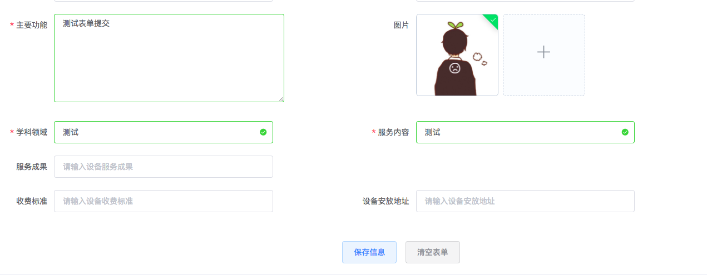

#### 7.2.2. 思路分析
##### 7.2.2.1. 图片上传和表单提交

要明白图片上传和表单提交是两个功能，其对应不同的接口，表单中并不是保存了这个图片，而仅仅是保存了储存图片的路径地址。需要分析以下几点：

1. 图片如何上传，什么时候上传？
    - 图片应该在点击upload上传组件的时候就触发了对应的事件，当选择了要上传的图片，点击确定的时候就请求了后端的接口保存了图片。也就是说你在浏览器中弹出的选择框中选择了要上传的图片，当点击确定的一瞬间就已将图片保存到了服务器上；而再点击提交表单的时候，储存在表单中的图片数据仅仅是刚才上传的图片存储地址。
2. 如何获取到已经上传的图片的储存地址？因为在浏览器上传选择框被确定选择的瞬间已经请求了后端接口保存了图片，我们该怎么知道图片在哪里储存呢？
    - 前端：比如使用了ElementUI提供的上传组件，其就存在一个上传成功的回调函数：on-success，这个回调函数被触发的时间点就是图片成功上传后的瞬间，就是要在这个回调函数触发的时候获取到图片储存的地址。
    - 后端：上面讲了获取地址，这个地址就是后端返回给前端的数据（JSON格式）。因为后端图片上传接口配置图片储存的地址，如果图片上传成功，就将图片储存的地址以JSON格式返回给前端。
3. 如何提交表单
    - 说如何提交表单，这就显得很简单了，因为上面我们已经完成了：1、图片成功上传；2、获取到了图片在服务器上的储存地址。利用Vue的双向绑定思想，在图片成功上传的回调函数`on-success`中获取到后端返回的图片储存地址，将这个地址赋值给Vue实例`data(){}`中定义的表单对象。这样在提交表单的时候仅需要将这个表单对象发送给后端，保存到数据库就行了。

##### 7.2.2.2. 图片在table的回显

想要将图片回显到table表格中其实很简单，前提只要你在数据库中保存了正确的图片储存地址；在table表格中我们仅需要在`<td>`列中新定义一列`<td></td>`即可完成图片回显。渲染table数据的时候循环给``中的src赋值数据库中保存的图片url即可。

#### 7.2.3. 后端实现
##### 7.2.3.1. 图片上传接口

这里将文件上传和下载接口单独抽离在一个Controller类中

```java
import com.instrument.entity.Result;

@RestController
public class UploadDownController {

    /**
     * 文件上传
     * @param picture
     * @param request
     * @return
     */
    @RequestMapping("/upload")
    public Result upload(@RequestParam("picture") MultipartFile picture, HttpServletRequest request) {

        //获取文件在服务器的储存位置
        String path = request.getSession().getServletContext().getRealPath("/upload");
        File filePath = new File(path);
        System.out.println("文件的保存路径：" + path);
        if (!filePath.exists() && !filePath.isDirectory()) {
            System.out.println("目录不存在，创建目录:" + filePath);
            filePath.mkdir();
        }

        //获取原始文件名称(包含格式)
        String originalFileName = picture.getOriginalFilename();
        System.out.println("原始文件名称：" + originalFileName);

        //获取文件类型，以最后一个`.`为标识
        String type = originalFileName.substring(originalFileName.lastIndexOf(".") + 1);
        System.out.println("文件类型：" + type);
        //获取文件名称（不包含格式）
        String name = originalFileName.substring(0, originalFileName.lastIndexOf("."));

        //设置文件新名称: 当前时间+文件名称（不包含格式）
        Date d = new Date();
        SimpleDateFormat sdf = new SimpleDateFormat("yyyyMMddHHmmss");
        String date = sdf.format(d);
        String fileName = date + name + "." + type;
        System.out.println("新文件名称：" + fileName);

        //在指定路径下创建一个文件
        File targetFile = new File(path, fileName);

        //将文件保存到服务器指定位置
        try {
            picture.transferTo(targetFile);
            System.out.println("上传成功");
            //将文件在服务器的存储路径返回
            return new Result(true,"/upload/" + fileName);
        } catch (IOException e) {
            System.out.println("上传失败");
            e.printStackTrace();
            return new Result(false, "上传失败");
        }
    }
}
```

为什么返回一个Result数据类型？

注意这个Result是我自己声明的一个实体类，用于封装返回的结果信息，配合@RestController注解实现将封装的信息以JSON格式return给前端，最后看下我定义的Result:

```java
public class Result implements Serializable {

    //判断结果
    private boolean success;
    //返回信息
    private String message;

    public Result(boolean success, String message) {
        this.success = success;
        this.message = message;
    }

    public boolean isSuccess() {
        return success;
    }

    setter/getter...
}
```

##### 7.2.3.2. 表单提交接口

表单提交，配合图片上传，仅仅是在实体类中多了一个字段存放图片的URL地址

```java
@RestController
@RequestMapping("/instrument")
public class InstrumentController {

    //注入
    @Autowired
    private InstrumentService instrumentService;

    /**
     * 添加
     *
     * @param instrument
     * @return
     */
    @RequestMapping("/save")
    public Result save(Instrument instrument) {
        if(instrument != null){
            try{
                instrumentService.save(instrument);
                return new Result(true,"添加成功");
            }catch (Exception e){
                e.printStackTrace();
            }
        }
        return new Result(false, "发生未知错误");
    }
}
```

为什么返回Result类型的数据？ 为了前端方便判断接口执行成功与否。因为前端使用的是HTML页面，想要从后端域对象中取数据显然就有点不现实了。

写Controller的时候定义了全局的`@RestController`注解，和`@Controller`注解的区别是，前者多了`@ResponseBod`y注解，这样整合Controller类返回的数据都将给自动转换成JSON格式。

#### 7.2.4. 前端实现
##### 7.2.4.1. 实现图片上传

配合ElementUI的上传组件，我们会这样定义(这是form表单中的一部分)：

```html
<el-form-item label="图片">
    <el-upload
               ref="upload"
               action="/upload.do"
               name="picture"
               list-type="picture-card"
               :limit="1"
               :file-list="fileList"
               :on-exceed="onExceed"
               :before-upload="beforeUpload"
               :on-preview="handlePreview"
               :on-success="handleSuccess"
               :on-remove="handleRemove">
        <i class="el-icon-plus"></i>
    </el-upload>
    <el-dialog :visible.sync="dialogVisible">
        
    </el-dialog>
</el-form-item>
```

注意，这里仅展示了文件上传的form-item，ElementUI的表单声明是：`<el-form>`注意表单中不需要指定`enctype="multipart/form-data"`这个参数，与我们普通的文件上传表单是不同的。

了解几个参数：

- `ref` ref是Vue原生参数，用来给组件注册引用信息。引用信息将会注册到父组件的$refs对象上，如果定义在普通的DOM元素上，那么$refs指向的就是DOM元素。
- `action` action表示此上传组件对应的上传接口，此时我们使用的是后端Controller定义的接口
- `name` name表示当前组件上传的文件字段名，需要和后端的上传接口字段名相同 。
- `list-type` 文件列表的类型，主要是文件列表的样式定义。这里是卡片化。
- `:limit` 最大允许上传的文件个数。file-list 上传的文件列表，这个参数用于在这个上传组件中回显图片，包含两个参数：name、url如果你想在这个文件上传组件中咱叔图片，赋值对应的参数即可显示，比如更新数据时，其表单样式完全和添加表单是相同的。但是table中回显图片是完全不需要用这个方式的。
- `:on-exceed` 上传文件超出个数时的钩子函数。
- `:before-upload` 上传文件前的钩子函数，参数为上传的文件，返回false，就停止上传。
- `:on-preview` 点击文件列表中已上传的文件时的钩子函数
- `:on-success` 文件上传成功的钩子函数
- `:on-remove` 文件列表移除时的钩子函数
- `:src` 图片上传的URL。

##### 7.2.4.2. js部分

```js
//设置全局表单提交格式
Vue.http.options.emulateJSON = true;

new Vue({
    el: '#app',
    data(){
        return{
            //文件上传的参数
            dialogImageUrl: '',
            dialogVisible: false,
            //图片列表（用于在上传组件中回显图片）
            fileList: [{name: '', url: ''}],
        }
    },
    methods(){
   		//文件上传成功的钩子函数
        handleSuccess(res, file) {
            this.$message({
                type: 'info',
                message: '图片上传成功',
                duration: 6000
            });
            if (file.response.success) {
                this.editor.picture = file.response.message; //将返回的文件储存路径赋值picture字段
            }
        },
        //删除文件之前的钩子函数
        handleRemove(file, fileList) {
            this.$message({
                type: 'info',
                message: '已删除原有图片',
                duration: 6000
            });
        },
        //点击列表中已上传的文件事的钩子函数
        handlePreview(file) {
        },
        //上传的文件个数超出设定时触发的函数
        onExceed(files, fileList) {
            this.$message({
                type: 'info',
                message: '最多只能上传一个图片',
                duration: 6000
            });
        },
        //文件上传前的前的钩子函数
        //参数是上传的文件，若返回false，或返回Primary且被reject，则停止上传
        beforeUpload(file) {
            const isJPG = file.type === 'image/jpeg';
            const isGIF = file.type === 'image/gif';
            const isPNG = file.type === 'image/png';
            const isBMP = file.type === 'image/bmp';
            const isLt2M = file.size / 1024 / 1024 < 2;

            if (!isJPG && !isGIF && !isPNG && !isBMP) {
                this.$message.error('上传图片必须是JPG/GIF/PNG/BMP 格式!');
            }
            if (!isLt2M) {
                this.$message.error('上传图片大小不能超过 2MB!');
            }
            return (isJPG || isBMP || isGIF || isPNG) && isLt2M;
        },
    }
});
```

解释如上的JS代码，主要是定义一些钩子函数，这里梳理一下逻辑：

1. 点击ElementUI的上传组件，浏览器自动弹出文件上传选择窗口，我们选择要上传的图片。
2. 选择好了要上传的图片，点击弹窗右下角的确定按钮触发JS中定义的钩子函数。
3. 首先触发的钩子函数是`beforeUpload(file)`函数，其中的参数file即代表当前上传的文件对象，`beforeUpload()`定义了对上传文件格式校验。如果不是允许的格式就弹出错误信息，并阻止文件上传，若我那件格式允许，则继续执行。
4. 通过了`beforeUpload()`函数的校验，文件开始调用后端接口将数据发送给后端。文件的字段名：`picture`，格式：`multipart/form-data`，虽然我们的表单没有定义`enctype="multipart/form-data"`属性，但是HTTP请求头会自动设置为`multipart/form-data`类型。

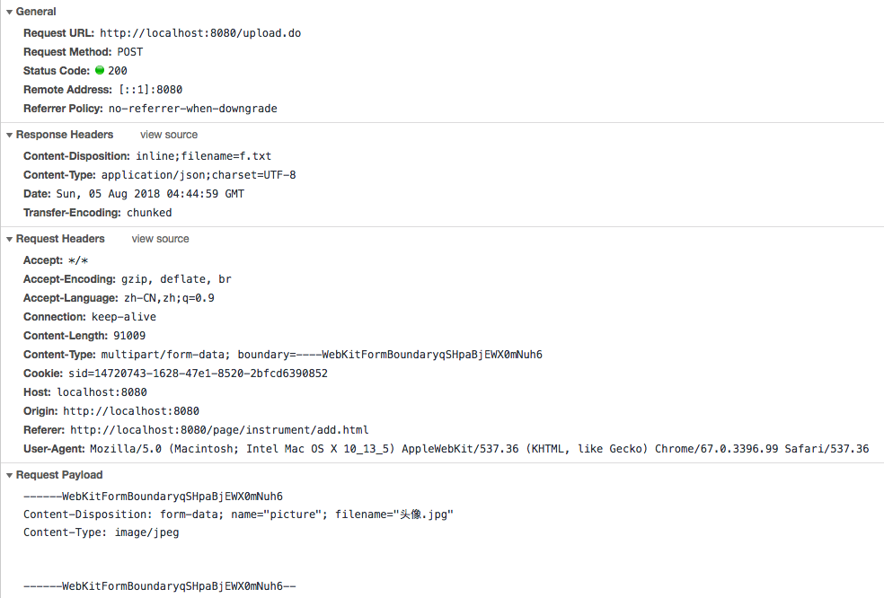

5. 如果后端逻辑没有错误，已经正常的将图片上传到服务器上了，可以在指定文件夹中查看到已上传的图片，那么此时JS中会自动调用`handleSuccess()`钩子函数，因为设置后端上传接口上传成功返回的数据是文件的保存路径：

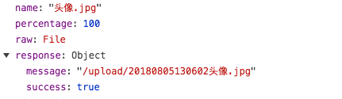

6. 如果我们再点击上传文件按钮，就会触发`onExceed()`函数，因为我们设置的limit最多上传一个。
7. 如果点击图片中的删除按钮，就会触发`handleRemove()`函数，并删除此图片。
8. 如果点击了已上传的文件列表，就会触发`handlePreview()`函数。

##### 7.2.4.3. 实现表单提交

表单提交就比较简单了，就是触发对应的click事件，触发其中定义的函数，将已在`data(){}`中定义的表单数据发送给后端接口：

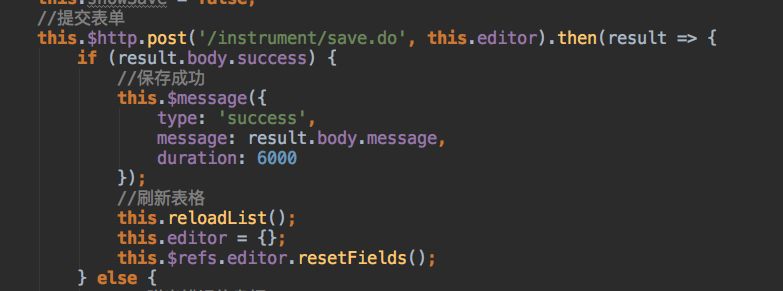

##### 7.2.4.4. 后端接口

```java
@RequestMapping("/save")
public Result save(Instrument instrument) {
    if(instrument != null){
        try{
            instrumentService.save(instrument);
            return new Result(true,"添加成功");
        }catch (Exception e){
            e.printStackTrace();
        }
    }
    return new Result(false, "发生未知错误");
}
```

#### 7.2.5. 实现table回显图片

table回显图片也是很简单的，仅需要在列中增加一列

```html
<el-table :data="instrument">
    <el-table-column label="图片" width="130">
        <template scope="scope">
            
        </template>
    </el-table-column>
    <el-table-column
         label="运行状态"
         width="80"
         prop="operatingStatus">
    </el-table-column>
</el-table>
```

因为使用Vue，根据其双向绑定的思想，再结合Element-UI提供渲染表格的方式是在<el-table>的:data中指定对应要渲染的数据即可。

注意 ElementUI渲染table的方式是：

1. `<el-table>`中定义:data；
2. `<el-table-column>`中定义`prop="data中的参数"`。但是因为我们要显示的是图片而不是文本数据，所以要在``中定义`:src="data中的变量"`即可实现渲染。

后端就是正常的查询数据库数据即可了

## 8. 图标字体制作

网站：`https://icomoon.io/` 可以上传自定义的图标字体

## 9. 参考资料

Vue.js高仿饿了么外卖App课程源码 `https://github.com/ustbhuangyi/vue-sell`

## 10. 相关框架

### 10.1. v-page：vue.js的分页组件

官网：https://terryz.gitee.io/vue/#/page

### 10.2. Element 基于 Vue 2.0 的桌面端组件库

官网：https://element.eleme.cn/#/zh-CN

### 10.3. iView 基于Vue.js的UI组件库

官网：http://v1.iviewui.com/

### 10.4. Mint UI 移动端组件库

官网：http://mint-ui.github.io/#!/zh-cn

### 10.5. Vant 移动端组件库

官网：https://vant-contrib.gitee.io/vant/#/zh-CN/

