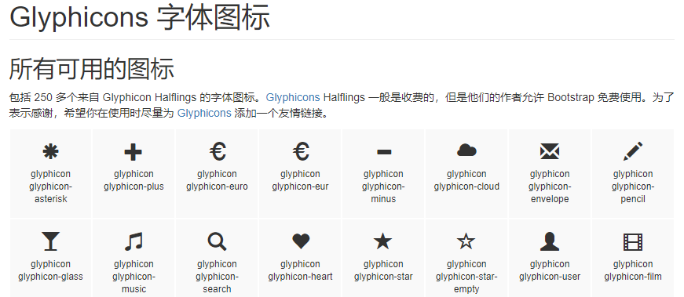
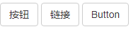
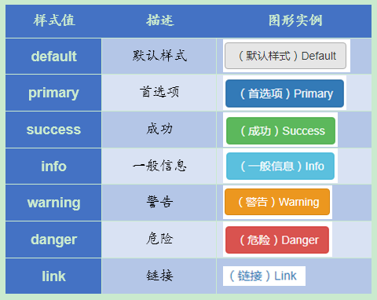
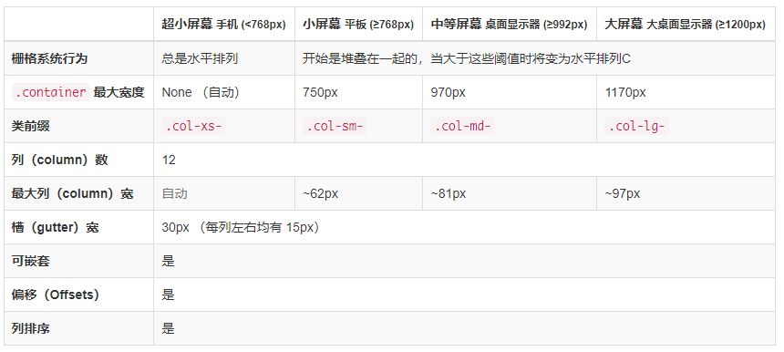
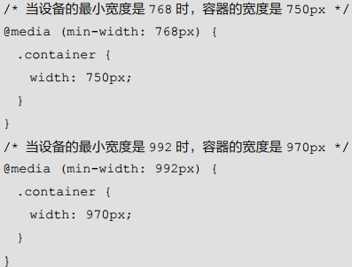
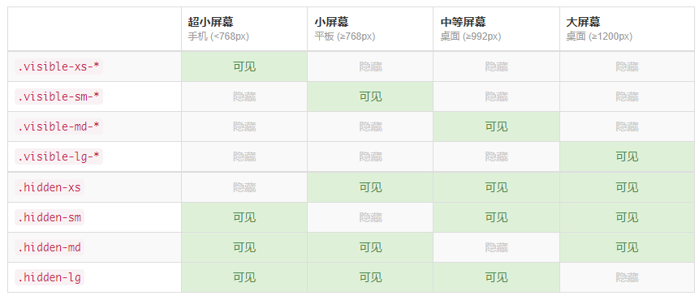
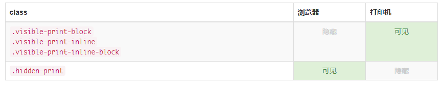
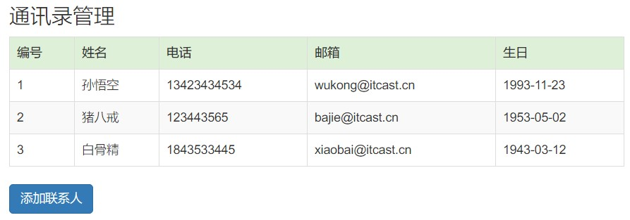
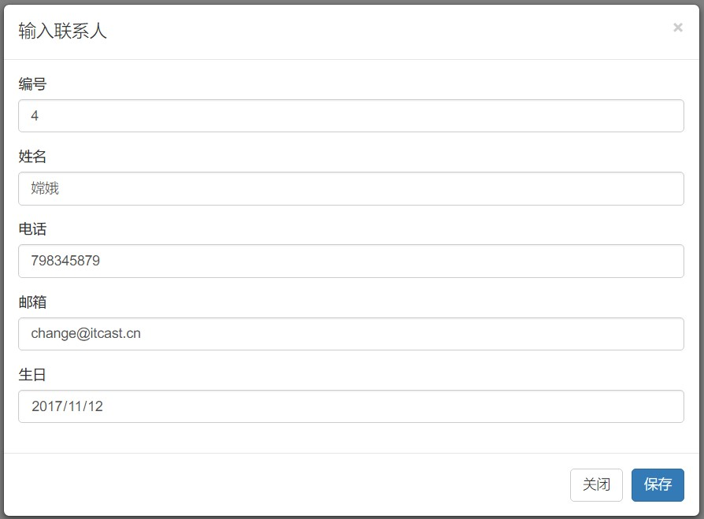
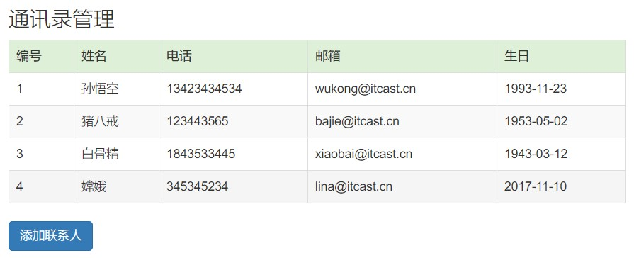

# Bootstrap 基础

## 1. Bootstrap 简介

### 1.1. 什么是 Bootstrap

- Bootstrap 来自 Twitter（推特），是目前最受欢迎的前端框架。它有一套比较完整的网页功能解决方案，而且控制权在框架本身，有预制样式库、组件和插件。使用者要按照框架所规定的某种规范进行开发。它简洁灵活，使得 Web 开发更加快捷。
- 前端框架：用于制作表示层，直接面向用户的这一层，已经定义好了大量的class类样式。直接使用这些类样式既可。还对HTML中所有的标签都进行了重新的样式定义。
- 基于技术：HTML、CSS 和 JavaScript。

### 1.2. 使用Bootstrap的优势

1. 移动设备优先，自Bootstrap3起，框架包含了贯穿于整个库的移动设备优先的样式。手机上只要有浏览器，开发的程序，既可以运行在电脑上，也可以运行在手机或平板电脑上。
2. 浏览器支持：支持几乎所有的主流的浏览器
3. 容易上手：标准化的html+css编码规范，只要有HTML和CSS的基础就可以学习这个框架。
4. 响应式设计：Bootstrap 的响应式 CSS 能够自适应于台式机、平板电脑和手机。可以根据设备的宽度来自动适配页面的宽度，对页面进行缩放。
5. 提供了一套简洁、直观、强悍的组件
6. 有自己的生态圈，不断的更新迭代
7. 让开发更简单，提高了开发的效率

四类屏幕：

- 微型设备xs 如：手机
- 小型设备sm	 如：平板
- 中型设备md	 如：电脑
- 大型设备lg 如：数字电视

### 1.3. 什么是响应式设计

- 传统的网页。如：手机版京东：https://m.jd.com 手机版淘宝：https://m.taobao.com
- 采用响应式设计。如：索尼：http://www.sony.com 苹果中国：http://www.apple.com.cn

概念：一个网站能够兼容多个终端，而不是为每个终端做一个特定的版本。响应式布局可以为不同终端的用户提供更加舒适的界面和更好的用户体验。

### 1.4. 版本

- 2.x.x：停止维护，兼容性好，代码不够简洁，功能不够完善。
- 3.x.x：目前使用最多，稳定，但是放弃了支持 IE6-IE7。对 IE8 支持但是界面效果不好，<font color=red>**偏向用于开发响应式布局、移动设备优先的 WEB 项目**</font>。
- 4.x.x：最新版，目前还不是很流行

## 2. Bootstrap 使用

框架的控制权在框架本身，使用者要按照框架所规定的某种规范进行开发。

### 2.1. Bootstrap 官网与下载

- 中文官网：http://www.bootcss.com/
    - 开发的时候，结合API帮助文档来开发。
- 官网：http://getbootstrap.com/
- ~~推荐使用：http://bootstrap.css88.com/~~

### 2.2. Bootstrap 框架内容

- 全局CSS：
    - 几乎已经将原本HTML中所有的标签的都重新定义了样式。
    - 设置全局 CSS 样式；基本的 HTML 元素均可以通过 class 设置样式并得到增强效果；
- 组件：
    - 无数可复用的组件，包括字体图标、下拉菜单、导航、警告框、弹出框等更多功能。
- JavaScript 插件：
    - jQuery 插件为 Bootstrap 的组件赋予了“生命”。（在Bootstrap5之后，移除jQuery依赖关系）

### 2.3. Bootstrap 项目环境的搭建（重点）

#### 2.3.1. Bootstrap 文件的目录结构

```
bootstrap/
├─ css/  Bootstrap已经写好的全局的CSS样式
│	├── bootstrap.css
│	├── bootstrap.min.css  在页面上导入文件，压缩版
│	├── bootstrap-theme.css
│	├── bootstrap-theme.min.css
├─ js/ jQuery的插件，可以实现更强功能，包括一些自定义的属性。
│	├── bootstrap.js
│	└── bootstrap.min.js  要导入的JS文件，基于jQuery，必须有jQuery支持
└─ fonts/ 自定义的图标，如果需要在网页中使用图标，就需要导入这些文件
	├── glyphicons-halflings-regular.eot
	├── glyphicons-halflings-regular.svg
	├── glyphicons-halflings-regular.ttf
	├── glyphicons-halflings-regular.woff
	├── glyphicons-halflings-regular.woff2
```

注：fonts目录下的字体图标。每个图标下的文字是它的类名，如果要显示这些图标，对元素设置这些类名即可。



#### 2.3.2. 创建Bootstrap文件的步骤

1. 创建文件夹结构
2. 创建 html 骨架结构，复制三个文件夹(css、fonts、js)的内容到项目目录下。（~~复制jQuery.js文件到项目中，建议使用1.9以上的版本~~【后面版本已移除】）

```html
<!--要求当前网页使用IE浏览器最高版本的内核来渲染-->
<meta http-equiv="X-UA-Compatible" content="IE=edge">
<!--视口的设置：视口的宽度和设备一致，默认的缩放比例和PC端一致，用户不能自行缩放-->
<meta name="viewport" content="width=device-width, initial-scale=1, user-scalable=0">
<!--[if lt IE 9]>
<!--解决ie9以下浏览器对html5新增标签的不识别，并导致CSS不起作用的问题-->
<script src="https://oss.maxcdn.com/html5shiv/3.7.2/html5shiv.min.js"></script>
<!--解决ie9以下浏览器对 css3 Media Query 的不识别 -->
<script src="https://oss.maxcdn.com/respond/1.4.2/respond.min.js"></script>
<![endif]-->
```

3. 引入相关样式文件

```html
<!-- Bootstrap 核心样式-->
<link rel="stylesheet" href="bootstrap/css/bootstrap.min.css">
```

4. 复制API文档“起步开始的模板”，代码复制到HTML中
    - 直接拿Bootstrap 预先定义好的样式来使用
    - 修改Bootstrap 原来的样式，注意权重问题
    - 学好Bootstrap 的关键在于知道它定义了哪些样式，以及这些样式能实现什么样的效果

#### 2.3.3. Bootstrap 文件导入及示例

<font color=red>**导入三个文件及模板的详细解释**</font>：

```html
<!--设置网页的编码-->
<meta charset="UTF-8">
<!--使用 IE 最新的浏览器的内核解析当前网页，只要符合 w3c 标准的浏览器都可以 -->
<meta http-equiv="X-UA-Compatible" content="IE=edge">
<!-- 响应式网页：viewport 视口，网页显示的宽度与设备宽度相同，初始缩放比是 1:1-->
<meta name="viewport" content="width=device-width, initial-scale=1">
<!-- 上述 3 个 meta 标签必须放在最前面，任何其他内容都必须跟随其后！ -->
<!-- 1. 导入 Bootstrap 中的 css 样式 -->
<link href="css/bootstrap.min.css" rel="stylesheet">
<!-- 2. 导入 jQuery，建议是 1.9 以上的版本 -->
<script src="js/jquery-2.1.0.min.js"></script>
<!-- 3. 导入 bootstrap 的 js 文件 -->
<script src="js/bootstrap.min.js"></script>
```

导入三个文件及模板示例：

```html
<!DOCTYPE html>
<html lang="zh-CN">
	<!--页面使用的语言和国家，语言是2个小写字母，国家是2个大写字母-->
	<head>
		<!--设置网页的编码-->
		<meta charset="UTF-8">
		<!--设置浏览器解析的模式，使用最新的渲染模式，目前主流浏览器都支持 -->
		<meta http-equiv="X-UA-Compatible" content="IE=edge">
		<!--
			响应式网页：viewport 视口，在浏览器中虚拟一个容器，用来显示网页的内容，会根据网页宽度自动进行适配
			width:默认的宽度与设备的宽度相同
			initial-scale:初始的缩放比1:1
		-->
		<meta name="viewport" content="width=device-width, initial-scale=1">
		<!-- 上述 3 个 meta 标签必须放在最前面，任何其他内容都必须跟随其后！ -->
		<title>Bootstrap模板</title>
		<!-- 1. 导入 Bootstrap 中的 css 样式 -->
		<link href="css/bootstrap.min.css" rel="stylesheet">
		<!-- 2. 导入 jQuery，建议是 1.9 以上的版本(已移除依赖) -->
		<!-- <script src="js/jquery-2.1.0.min.js"></script> -->
		<!-- 3. 导入 bootstrap 的 js 文件 -->
		<script src="js/bootstrap.min.js"></script>
	</head>
	<body>
		<h1>Bootstrap模板</h1>
	</body>
</html>
```

## 3. Bootstrap 全局 CSS 样式

Bootstrap 将设置全局的 CSS 样式。HTML 的基本元素均可以通过 class 设置样式并得到增强效果。还有先进的栅格系统。

### 3.1. 布局容器

Bootstrap 需要为页面内容和栅格系统包裹一个 `.container` 容器，它提供了两个作此用处的类。网页上所有的元素，都应该使用这2种容器，放在这两个容器内部

| 布局的两种容器的类样式名 |                                             说明                                              |
| :-------------------: | --------------------------------------------------------------------------------------------- |
|     `.container`      | 响应式布局的容器。有固定宽度的容器，是一个 div 的类样式<br />在不同屏幕分辨率下有不同的固定宽度        |
|  `.container-fluid`   | 流式布局容器，是一个 div 的类样式<br />容器的宽度始终是使用 100% 的方式显示，占据全部视口（viewport） |

> 宽度的划分：
>
> - 大屏 (`>=1200px`) 宽度定为 1170px
> - 中屏 (`>=992px`) 宽度定为 970px
> - 小屏 (`>=768px`) 宽度定为 750px
> - 超小屏 (100%)

### 3.2. 按钮

#### 3.2.1. 普通按钮

设置属性`class="btn btn-default"`

```html
<input type="button" id="" value="按钮" class="btn btn-default"/>
<a href="#" class="btn btn-default">链接</a>
<button class="btn btn-default">Button</button>
```



> <font color=red>**链接被作为按钮使用时的注意事项**</font>
>
> 如果 `<a>` 元素被作为按钮使用，并用于在当前页面触发某些功能，而不是用于链接其他页面或链接当前页面中的其他部分，必须设置 `role="button"` 属性。
>
> <font color=red>**跨浏览器展现**</font>。总结最佳实践是：强烈建议尽可能使用 `<button>` 元素来获得在各个浏览器上获得相匹配的绘制效果。

#### 3.2.2. 预定义样式的按钮

可以快速创建一个带有预定义样式的按钮，设置属性`class="btn btn-xxx"`



### 3.3. 表格

#### 3.3.1. 表格样式类

为任意 `<table>` 标签添加 `.table` 类可以为其赋予基本的样式

|        类名        |                                         表格的样式                                         |
| :----------------: | ----------------------------------------------------------------------------------------- |
|      `.table`      | 表格的基本实例                                                                             |
|  `.table-striped`  | 给 `<tbody>` 之内的每一行增加斑马条纹样式  如果不想给表头增加的话，将表头写到`<thead></thead>`中 |
| `.table-bordered`  | 让表格和其中的每个单元格增加边框                                                             |
|   `.table-hover`   | 让 `<tbody>` 中的每一行对鼠标悬停状态作出响应                                                |
| `.table-condensed` | 让表格更加紧凑，单元格中的内补（padding）均会减半                                             |

示例：

```html
<table class="table table-striped table-bordered table-hover">
```

#### 3.3.2. 状态类

通过这些状态类可以为行或单元格设置颜色。定义在`<tr>`或`<td>`标签中

|   Class    |                  描述                  |
| :--------: | -------------------------------------- |
| `.active`  | 鼠标悬停在行或单元格上时所设置的颜色(蓝色) |
| `.success` | 标识成功或积极的动作(绿色)               |
|  `.info`   | 标识普通的提示信息或动作(浅蓝色)          |
| `.warning` | 标识警告或需要用户注意(黄色)             |
| `.danger`  | 标识危险或潜在的带来负面影响的动作(红色)   |

```html
<tr class="success">……</tr>
<td class="active">……</td>
```

### 3.4. 表单

单独的表单控件会被自动赋予一些全局样式。

|  表单相关的样式   |                                                            效果                                                             |
| :-------------: | --------------------------------------------------------------------------------------------------------------------------- |
| `.form-control` | 所有设置了 `.form-control` 类的`<input>`、`<textarea>`和`<select>`元素都将被默认设置宽度属性为 `width: 100%`                     |
|  `.form-group`  | 将 label 元素和前面提到的控件包裹在 `.form-group` 中可以获得最好的排列。<br/>每个label包裹的文字是可以点击，可以让后面的文本框获取焦点 |

注：<font color=red>**`<div class="form-group"></div>`包裹相关于表单中的一项，包含一个`<label>`和一个文本框`<input>`**</font>

如果想点击文字选择选项设置label的for属性，值为文本框/单选框/复选框的id

```html
<input type="radio" id="a"/><label for="a">xxx</label>
```

`<div class="container">`标签中，可以设置最大`style="max-width:100px;"`，可以得到一个固定最大宽度的容器，会根据分辨率大小缩放。

### 3.5. 栅格系统（重点）

#### 3.5.1. 栅格系统组成

栅格系统英文为“grid systems”,也有人翻译为“网格系统”，它是指将页面布局划分为等宽的列，然后通过列数的定义来模块化页面布局。

Bootstrap 提供了一套响应式、移动设备优先的流式栅格系统，随着屏幕或视口（viewport）尺寸的增加，系统会自动分为<font color=red>**最多12列**</font>。

栅格系统用于通过一系列的行（row）与列（column）的组合来创建页面布局，内容就可以放入这些创建好的布局中。

**Bootstrap 栅格系统的特点**

- “行（row）”必须包含在 `.container` （固定宽度）或 `.container-fluid` （100% 宽度）中，以便为其赋予合适的排列（aligment）和内间距（padding）
- 通过“行（row）”在水平方向创建一组“列（column）”
- 内容应当放置于“列（column）”内，并且，只有“列（column）”可以作为行（row）”的直接子元素
- 栅格系统中的列是通过指定 1 到 12 的值来表示其跨越的范围。例如，三个等宽的列可以使用三个 `.col-xs-4` 来创建
- 如果一“行（row）”中包含了的“列（column）”大于 12，多余的“列（column）”所在的元素将被作为一个整体另起一行排列

#### 3.5.2. 基本写法

| 类似于表格 |                                         栅格系统                                          |
| :-------: | ---------------------------------------------------------------------------------------- |
|  `table`  | `.container`或`.container-fluid`                                                         |
|   `tr`    | `.row` 一行                                                                              |
|   `td`    | `.col-*-n`<br/>`*`：一种设备，中等分辨率设备(xs/sm/md/lg)<br/>`n`：表示占多少列(取值是：1-12) |

#### 3.5.3. 栅格选项参数

栅格系统用于通过一系列的行（row）与列（column）的组合来创建页面布局，你的内容就可以放入这些创建好的布局中。



- 按照不同屏幕划分为1~12 等份
- 行（row） 可以去除父容器作用15px的边距
- `xs-extra small`：超小； `sm-small`：小； `md-medium`：中等； `lg-large`：大；
- 列（column）大于 12，多余的“列（column）”所在的元素将被作为一个整体另起一行排列
- 每一列默认有左右15像素的 padding
- 可以同时为一列指定多个设备的类名，以便划分不同份数 例如 `class="col-md-4 col-sm-6"`

#### 3.5.4. 列嵌套

栅格系统内置的栅格系统将内容再次嵌套。简单理解就是一个列内再分成若干份小列。我们可以通过添加一个新的 `.row` 元素和一系列 `.col-sm-*` 元素到已经存在的 `.col-sm-*` 元素内。

```html
<!-- 列嵌套 -->
<div class="col-sm-4">
    <div class="row">
        <div class="col-sm-6">小列</div>
        <div class="col-sm-6">小列</div>
    </div>
</div>
```

#### 3.5.5. 列偏移

使用 `.col-md-offset-*` 类可以将列向右侧偏移。这些类实际是通过使用 `*` 选择器为当前元素增加了左侧的边距（margin）。

```html
<!-- 列偏移 -->
<div class="row">
    <div class="col-lg-4">1</div>
    <div class="col-lg-4 col-lg-offset-4">2</div>
</div>
```

#### 3.5.6. 列排序

通过使用 `.col-md-push-*` 和 `.col-md-pull-*` 类就可以很容易的改变列（column）的顺序。

```html
<!-- 列排序 -->
<div class="row">
    <div class="col-lg-4 col-lg-push-8">左侧</div>
    <div class="col-lg-8 col-lg-pull-4">右侧</div>
</div>
```

#### 3.5.7. 媒体查询 @media

打开文件：bootstrap.css，查找`@media`



从查询结果中了解，<font color=purple>当创建 div 的类样式名 container，会根据屏幕的大小发生变化</font>

#### 3.5.8. 响应式工具

为了加快对移动设备友好的页面开发工作，利用媒体查询功能，并使用这些工具类可以方便的针对不同设备展示或隐藏页面内容。

##### 3.5.8.1. 可用的类

通过单独或联合使用以下列出的类，可以针对不同屏幕尺寸隐藏或显示页面内容。



从 v3.2.0 版本起，形如 `.visible-*-*` 的类针对每种屏幕大小都有了三种变体，每个针对 CSS 中不同的 display 属性，列表如下：

|           类组            |      CSS `display`       |
| :-----------------------: | :----------------------: |
|    `.visible-*-block`     |    `display: block;`     |
|    `.visible-*-inline`    |    `display: inline;`    |
| `.visible-*-inline-block` | `display: inline-block;` |

因此，以超小屏幕（xs）为例，可用的 `.visible-*-*` 类是：`.visible-xs-block`、`.visible-xs-inline` 和 `.visible-xs-inline-block`。`.visible-xs`、`.visible-sm`、`.visible-md` 和 `.visible-lg` 类也同时存在。但是从 v3.2.0 版本开始不再建议使用。除了 `<table>` 相关的元素的特殊情况外，它们与 `.visible-*-block` 大体相同。

##### 3.5.8.2. 打印类

和常规的响应式类一样，使用下面的类可以针对打印机隐藏或显示某些内容。



`.visible-print` 类也是存在的，但是从 v3.2.0 版本开始不建议使用。它与 `.visible-print-block` 类大致相同，除了 `<table>` 相关元素的特殊情况外。

#### 3.5.9. 类样式小结

|        类样式名         |             作用             |
| :--------------------: | ---------------------------- |
|      `.container`      | 容器，有固定宽度，类似于table   |
|   `.container-fluid`   | 容器，占100%宽度              |
|         `.row`         | 表示一行(可以省略不写)          |
|      `.col-md-n`       | 中等：电脑，n：占几列，最多12列 |
|       `.col-xs-`       | 微型设备上占多少列，手机        |
|       `.col-sm-`       | 小型设备上占多少列，平板        |
|       `.col-md-`       | 中型设备上占多少列，电脑        |
|       `.col-lg`-       | 大型设备上占多少列，电视机      |
| `.hidden-lg/md/sm/xs`  | 在指定设备下隐藏，其它设备显示  |
| `.visible-lg/md/sm/xs` | 在指定设备下显示，其它设备隐藏  |

## 4. Bootstrap 组件

Bootstrap 自带了大量可复用的组件，包括字体图标、下拉菜单、导航、警告框、弹出框等更多功能。

### 4.1. 进度条

通过这些简单、灵活的进度条，为当前工作流程或动作提供实时反馈。需要将进度条放到`<div class="progress"></div>`中，语法格式如下：

```html
<div class="progress">
	<div class="进度条样式" role="progressbar" aria-valuenow="60" aria-valuemin="0" aria-valuemax="100" style="width: x%;">
		<span class="sr-only">60% Complete</span>
	</div>
</div>
```

progress-bar 进度条相关属性

- `role`：本身没有具体的功能，语义的作用，解释这个标签的功能
- `aria`：开头的属性，是给残障人士使用的
- `sr-only`：屏幕朗读

<font color=red>**一般只需要设置`class`和`style`就可以**</font>

|   进度条的类型   |                       类样式                        |
| :------------: | -------------------------------------------------- |
|      进度       | `.progress`                                        |
|    默认进度条    | `.progress-bar`                                    |
|  有文字的进度条  | 在`<div>`块内设置文字                                |
| 不同颜色的进度条 | `.progress-bar-success`(`info`/`warning`/`danger`) |
|  有条纹的进度条  | `.progress-bar-striped`                            |
|    有动画效果    | `.active`                                          |

> 注：还有一个堆叠效果，需要查Bootstrap离线文档或官网

### 4.2. 导航条

导航条是在您的应用或网站中作为导航页头的响应式基础组件。它们在移动设备上可以折叠（并且可开可关），且在视口（viewport）宽度增加时逐渐变为水平展开模式。组成如下：

1. 导航容器
2. 首选项和汉堡按钮(可以折叠的按钮)
3. 可折叠的菜单，表单或其它的内容

导航条 `<nav>` 标签其实就是一个 `<div>`

**导航条的可访问性**

务必使用 `<nav>` 元素，或者如果使用的是通用的 `<div>` 元素的话，务必为导航条设置 `role="navigation"` 属性，这样能够让使用辅助设备的用户明确知道这是一个导航区域。

|       类样式       |                           导航条的相关类型                           |
| :---------------: | ------------------------------------------------------------------ |
|     `.navbar`     | 类样式                                                             |
| `.navbar-default` | 默认样式。`.navbar-inverse` 代表反转的颜色，即黑色                    |
|      `.data`      | 开头的属性，一般不能删除，往往会激活一个事件，并且有相应的功能，否则就失效 |
|  `.data-target:`  | 汉堡按钮，对应下面的div的id                                          |
|    `.sr-only`     | 屏幕朗读(一般没有用，可以删除)                                        |

## 5. Bootstrap JavaScript 插件

JavaScript 插件可以单个引入（使用 Bootstrap 提供的单个 *.js 文件），或者一次性全部引入（使用 bootstrap.js 或压缩版的 bootstrap.min.js）。

### 5.1. 轮播图

轮播图组成部分：

- `data-ride`：默认是轮播时间是5秒一张图
- `data-interval`：改变速度的属性，值的单位是毫秒

指示器

- `data-slide-to`: 表示第几张图片
- `class="active"`: 默认开始的图片

图片部分，包裹里的每个div就是一张图片

```html
<div class="carousel-inner" role="listbox">
```

控制按钮，向左或向右

```html
<a class="left carousel-control" href="#carousel-example-generic" role="button" data-slide="prev">
```

## 6. BootStrap综合案例

### 6.1. 案例：各种动态进度条（开始/暂停/重置功能）

```html
<!DOCTYPE html>
<html>
	<head>
		<meta charset="UTF-8">
		<meta http-equiv="X-UA-Compatible" content="IE=edge">
		<meta name="viewport" content="width=device-width, initial-scale=1">
		<title>进度条模板</title>
		<link href="../css/bootstrap.min.css" rel="stylesheet">
		<script src="../js/jquery-2.1.0.min.js"></script>
		<script src="../js/bootstrap.min.js"></script>
		<title></title>
	</head>
	<body>
		<div class="container">
			<h3>基本进度条</h3>
			<div class="progress">
			  <div class="progress-bar" role="progressbar" aria-valuenow="60" aria-valuemin="0" aria-valuemax="100" style="width: 0%;">
			  </div>
			</div>

			<h3>不同颜色进度条</h3>
			<div class="progress">
				<div class="progress-bar progress-bar-success" style="width: 0%"></div>
			</div>

			<h3>有条纹的进度条</h3>
			<div class="progress">
				<div class="progress-bar progress-bar-success progress-bar-striped" style="width: 0%"></div>
			</div>

			<h3>带有提示标签的进度条</h3>
			<div class="progress">
				<div class="progress-bar progress-bar-warning progress-bar-striped active" style="width: 0%" id="last"></div>
			</div>
			<input type="button" id="begin" value="点击开始下载" class="btn btn-primary" />
			<input type="button" id="pause" value="点击暂停下载" class="btn btn-warning" />
			<input type="button" id="reset" value="重置" class="btn btn-danger" />
		</div>
	</body>
</html>

<script type="text/javascript">
	var num = 0;
	var time = 0;
	$("#begin").click(function(){
		// 点击后让按键不可用
		$("#begin").prop("disabled", true);
		time = setInterval(function(){
			// 先判断进度是否为0
			if(num < 100){
				// 改变进度条
				$("div[style]").css("width",(++num)+"%");
				// 改变进度条的进度提示
				$("#last").html(num + "%");
			}else{
				// 当num大于100时，清除计时器和恢复按键
				clearInterval(time);
				$("#begin").prop("disabled", false);
			}
		},200);
	});

	$("#pause").click(function(){
		// 暂停时清除计时器和恢复按键。
		clearInterval(time);
		$("#begin").prop("disabled", false);
	});

	$("#reset").click(function(){
		// 重置的同时调用一下暂停的事件，再将数值清零。
		$("#pause").click();
		$("div[style]").css("width","0%");
		num = 0;
	});
</script>
```

### 6.2. 案例：使用BootStrap模态框增加表格数字

如下图所示，使用Bootstrap做出如下表格。（*参考：全局css样式 -- 表格*）



点添加联系人的按钮，弹出如下的模态框。在同一个页面上制作如下模态框

> - 参考：JavaScript插件，模态框
> - 参考：全局CSS样式，表单




点保存添加一行，使用jQuery写代码完成

```html
<!DOCTYPE html>
<html lang="zh-CN">
	<head>
		<meta charset="UTF-8">
		<meta http-equiv="X-UA-Compatible" content="IE=edge">
		<meta name="viewport" content="width=device-width, initial-scale=1">
		<title>表格与模态框</title>
		<link href="css/bootstrap.min.css" rel="stylesheet">
		<script src="js/jquery-2.1.0.min.js"></script>
		<script src="js/bootstrap.min.js"></script>
	</head>
	<body>
		<!--创建BootStrap容器-->
		<div class="container">
			<!--创建表格-->
			<table class="table table-striped table-hover table-bordered">
				<tbody id="tb">
					<tr class="success">
						<th>编号</th>
						<th>姓名</th>
						<th>电话</th>
						<th>邮箱</th>
						<th>生日</th>
					</tr>
					<tr>
						<td>1</td>
						<td>孙悟空</td>
						<td>13423434534</td>
						<td>wukong@126.com</td>
						<td>1993-12-23</td>
					</tr>
					<tr>
						<td>2</td>
						<td>猪八戒</td>
						<td>123443565</td>
						<td>bajie@163.com</td>
						<td>1953-05-02</td>
					</tr>
					<tr>
						<td>3</td>
						<td>白骨精</td>
						<td>184353345</td>
						<td>xiaobai@qq.com</td>
						<td>1943-03-12</td>
					</tr>
				</tbody>
			</table>

			<!-- Button trigger modal 点击下面的按钮即可通过 JavaScript 启动一个模态框 -->
			<button type="button" id="b" class="btn btn-primary btn-lg" data-toggle="modal" data-target="#myModal">
				添加联系人
			</button>

			<!-- Modal（模态框） -->
			<div class="modal fade" id="myModal" tabindex="-1" role="dialog" aria-labelledby="myModalLabel">
			  <div class="modal-dialog" role="document">
			    <div class="modal-content">
			      <div class="modal-header">
			        <button type="button" class="close" data-dismiss="modal" aria-label="Close"><span aria-hidden="true">&times;</span></button>
			        <h4 class="modal-title" id="myModalLabel">输入联系人</h4>
			      </div>
			      <div class="modal-body">
			        <form class="form-group">
			        	<label for="id">编号</label>
			        	<input type="number" id="id" name="id" class="form-control" placeholder="请填写编号（数字）" />
			        </form>
			        <form class="form-group">
			        	<label for="name">姓名</label>
			        	<input type="text" id="name" name="name" class="form-control" placeholder="请填写中文姓名" />
			        </form>
			        <form class="form-group">
			        	<label for="tel">电话</label>
			        	<input type="number" id="tel" name="tel" class="form-control" placeholder="请填写联系电话" />
			        </form>
			        <form class="form-group">
			        	<label for="email">邮箱</label>
			        	<input type="email" id="email" name="email" class="form-control" placeholder="请填写联系邮箱" />
			        </form>
			        <form class="form-group">
			        	<label for="birthday">生日</label>
			        	<input type="date" id="birthday" name="birthday" class="form-control" placeholder="请填写联系邮箱" />
			        </form>
			      </div>
			      <div class="modal-footer">
			        <button type="button" id="close" class="btn btn-default" data-dismiss="modal">关闭</button>
			        <button type="button" id="save" class="btn btn-primary">保存</button>
			      </div>
			    </div>
			  </div>
			</div>
		</div>
	</body>
</html>

<script type="text/javascript">
	// 创建关闭按键的点击事件
	$("#close").click(function(){
		// 点击后将里面的内容清空
		$("form input").val("");
	});

    // 创建保存按键点击事件
	$("#save").click(function(){
		// 获取所有输入框的值
		var id = $("#id").val();
		var name = $("#name").val();
		var tel = $("#tel").val();
		var email = $("#email").val();
		var birthday = $("#birthday").val();

		$("<tr><td>"+id+"</td><td>"+name+"</td><td>"+tel+"</td><td>"+email+"</td><td>"+birthday+"</td></tr>").appendTo($("#tb"));
		// 保存后再调用关闭按键
		$("#close").click();
	});
</script>
```
