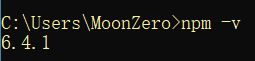
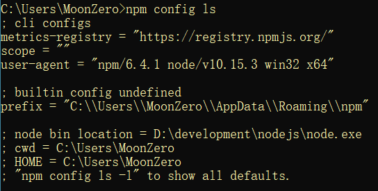
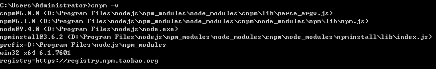
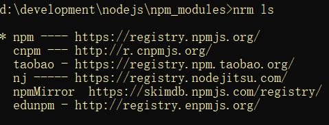

# 02-webpack 笔记

## 1. webpack介绍

- Webpack是一个前端资源的打包工具，它可以将js、image、css等资源当成一个模块进行打包。


从图中可以看出，Webpack 可以将js、css、png等多种静态资源 进行打包，使用webpack有什么好处呢？

1. 模块化开发

程序员在开发时可以分模块创建不同的js、 css等小文件方便开发，最后使用webpack将这些小文件打包成一个文件，减少了http的请求次数。

webpack可以实现按需打包，为了避免出现打包文件过大可以打包成多个文件。

2. 编译typescript、ES6等高级js语法

随着前端技术的强大，开发中可以使用javascript的很多高级版本，比如：typescript、ES6等，方便开发，webpack可以将打包文件转换成浏览器可识别的js语法。

3. CSS预编译

webpack允许在开发中使用Sass 和 Less等原生CSS的扩展技术，通过sass-loader、less-loader将Sass 和 Less的语法编译成浏览器可识别的css语法。

- webpack的缺点：
    1. 配置有些繁琐
    2. 文档不丰富

## 2. 安装webpack
### 2.1. 安装Node.js

webpack基于node.js运行，首先需要安装node.js

简单介绍node.js？

传统意义上的 JavaScript 运行在浏览器上，Chrome 使用的 JavaScript 引擎是 V8，Node.js 是一个运行在服务端的框架，它的底层就使用了 V8 引擎，这样就可以使用javascript去编写一些服务端的程序，这样也就实现了用javaScript去开发 Apache + PHP 以及 Java Servlet所开发的服务端功能，这样做的好处就是前端和后端都采用javascript，即开发一份js程序即可以运行在前端也可以运行的服务端，这样比一个应用使用多种语言在开发效率上要高，不过node.js属于新兴产品，一些公司也在尝试使用node.js完成一些业务领域，node.js基于V8引擎，基于事件驱动机制，在特定领域性能出色，比如用node.js实现消息推送、状态监控等的业务功能非常合适。

1. 下载对应系统的Node.js版本

下载网址：https://nodejs.org/en/download/。一般下载LTS版本，就是最稳定版本

2. 选安装目录进行安装

选择安装目录，安装完成检查PATH环境变量是否设置了node.js的路径。

3. 在命令提示符下输入命令测试是否安装成功

```shell
node -v
```

会显示当前node的版本

### 2.2. 安装NPM
#### 2.2.1. 自动安装NPM

npm全称Node Package Manager，他是node包管理和分发的工具，使用NPM可以对应用的依赖进行管理，NPM 的功能和服务端项目构建工具maven差不多，我们通过npm 可以很方便地下载js库，打包js文件。

node.js已经集成了npm工具，在命令提示符输入 `npm -v` 可查看当前npm版本



#### 2.2.2. 设置npm的包路径

包路径就是npm从远程下载的js包所存放的路径

使用 `npm config ls` 查询NPM管理包路径（NPM下载的依赖包所存放的路径）



NPM 默认的管理包路径在`C:/用户/[用户名]/AppData/Roaming/npm/node_meodules`，为了方便对依赖包管理，可以将管理包的路径设置在指定的位置，建议将安装目录设置在node.js的目录下，在node.js的安装目录下创建npm_modules和npm_cache，执行下边的命令

```shell
# 例如：安装node.js在D:\development\nodejs\下，打开cmd命令符窗口，执行命令如下：
npm config set prefix "D:\development\nodejs\npm_modules"
npm config set cache "D:\development\nodejs\npm_cache"
```

此时再使用 `npm config ls` 查询NPM管理包路径发现路径已更改


#### 2.2.3. 删除模块包

删除与安装相对应，也分为全局删除和本地删除

##### 2.2.3.1. 全局删除：

```shell
npm uninsatll <package-name> -g
```

##### 2.2.3.2. 本地删除：

对应的，本地删除也需要考虑是否再删除模块包的同时删除项目package.json中对应的信息，因此，利用npm本地删除模块包的命令也是三种，分别为：

```shell
npm uninstall <package-name>
# 删除模块包，对应模块包的信息不会从项目package.json文件中删除；

npm uninstall <package-name> --save
# 删除模块包，并且将对应的模块包信息从项目package.json的dependencies对象中删除；

npm uninstall <package-name> --save-dev
# 删除模块包，并且将对应的模块包信息从项目package.json的devDependencies对象中删除；
```

#### 2.2.4. 安装cnpm（可选）
##### 2.2.4.1. 连网环境安装cnpm

npm默认会去国外的镜像去下载js包，在开发中通常使用国内镜像，这里使用淘宝镜像。

使用npm下载资源会很慢，所以可以安装一个cnmp(淘宝镜像)来加快下载速度。

- 输入命令，进行全局安装淘宝镜像。

```shell
npm install -g cnpm --registry=https://registry.npm.taobao.org
```

- 安装后，可以使用以下命令来查看cnpm的版本

```shell
cnpm -v
```



- 输入`nrm ls`命令，查看镜像是否已经指向taobao。注：带“`*`”号的为目前使用的镜像



<font color="purple">**注：如果输入`nrm ls`提示无此命令，就是是因为nrm没有设置为全局变量，所以需要进入到nrm下载的路径下执行**</font>

- 使 `nrm use XXX` 切换镜像。如果nrm没有安装则需要进行全局安装
    - 输入命令 `npm install -g nrm`
    - 如果已经安装了cnpm，可以使用 `cnpm install -g nrm`

##### 2.2.4.2. 非连网环境安装cnpm

从本小节第3步开始就需要连网下载npm包，如果环境不能连网在课程的资料文件下有已经下载好的webpack相关包，下边是安装方法。

1. 配置环境变量

```
NODE_HOME = D:\Program Files\nodejs (node.js安装目录)
在PATH变量中添加：%NODE_HOME%;%NODE_HOME%\npm_modules;
```

2. 找到npm包路径

根据上边的安装说明npm包路径被设置到了node.js安装目录下的npm_modules目录。

可以使用npm config ls查看。

拷贝课程资料中的 npm_modules.zip到node.js安装目录，并解压npm_modules.zip覆盖本目录下的npm_modules文件夹。

3. 完成上边步骤测试

```shell
cnpm -v
```

### 2.3. 安装webpack


