# webpack 笔记

webpack 官网文档：https://www.webpackjs.com/concepts/

## 1. 前端工程化

- **模块化**（js 的模块化、css 的模块化、资源的模块化）
- **组件化**（复用现有的 UI 结构、样式、行为）
- **规范化**（目录结构的划分、编码规范化、接口规范化、文档规范化、 Git 分支管理）
- **自动化**（自动化构建、自动部署、自动化测试）

### 1.1. 什么是前端工程化

- 前端工程化指的是：在企业级的前端项目开发中，把前端开发所需的<font color=red>工具、技术、流程、经验等进行规范化、标准化</font>。
- 工程化的好处：前端开发自成体系，有一套<font color=red>标准的开发方案和流程</font>。

> 企业中的 Vue 项目和 React 项目，都是基于工程化的方式进行开发的。

### 1.2. 前端工程化的解决方案

早期的前端工程化解决方案：

- grunt（ https://www.gruntjs.net/ ）
- gulp（ https://www.gulpjs.com.cn/ ）

目前主流的前端工程化解决方案：

- webpack（ https://www.webpackjs.com/ ）
- parcel（ https://zh.parceljs.org/ ）

## 2. webpack介绍

### 2.1. 什么是 webpack

**概念**：Webpack 是一个前端资源的打包工具，它可以将js、image、css等资源当成一个模块进行打包。是前端项目工程化的具体解决方案。

**主要功能**：它提供了友好的前端模块化开发支持，以及代码压缩混淆、处理浏览器端 JavaScript 的兼容性、性能优化等强大的功能。

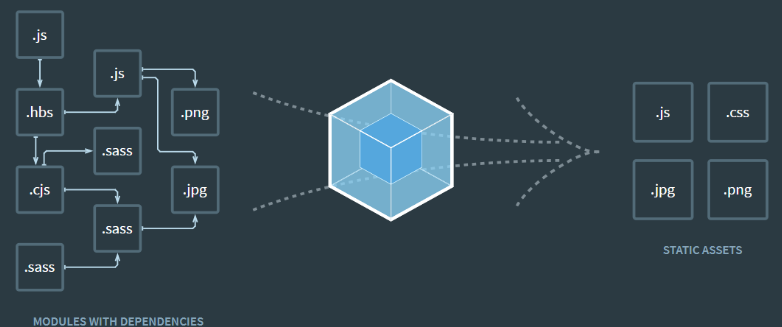

从图中可以看出，Webpack 可以将js、css、png等多种静态资源 进行打包，

### 2.2. webpack 优缺点

**webpack 的好处**

1. 模块化开发

程序员在开发时可以分模块创建不同的js、 css等小文件方便开发，最后使用webpack将这些小文件打包成一个文件，减少了http的请求次数。

webpack可以实现按需打包，为了避免出现打包文件过大可以打包成多个文件。

2. 编译typescript、ES6等高级js语法

随着前端技术的强大，开发中可以使用javascript的很多高级版本，比如：typescript、ES6等，方便开发，webpack可以将打包文件转换成浏览器可识别的js语法。

3. CSS预编译

webpack允许在开发中使用Sass 和 Less等原生CSS的扩展技术，通过sass-loader、less-loader将Sass 和 Less的语法编译成浏览器可识别的css语法。

- **webpack 的缺点**：

1. 配置有些繁琐
2. 文档不丰富

> 注意：目前 Vue，React 等前端项目，基本上都是基于 webpack 进行工程化开发的。

## 3. webpack 基础使用

### 3.1. 前提条件

在开始之前，请确保安装了 Node.js 的最新版本。使用 Node.js 最新的长期支持版本(LTS - Long Term Support)，是理想的起步。使用旧版本，你可能遇到各种问题，因为它们可能缺少 webpack 功能以及/或者缺少相关 package 包。

### 3.2. 安装 Node.js

webpack基于node.js运行，首先需要安装node.js

简单介绍node.js？

传统意义上的 JavaScript 运行在浏览器上，Chrome 使用的 JavaScript 引擎是 V8，Node.js 是一个运行在服务端的框架，它的底层就使用了 V8 引擎，这样就可以使用javascript去编写一些服务端的程序，这样也就实现了用javaScript去开发 Apache + PHP 以及 Java Servlet所开发的服务端功能，这样做的好处就是前端和后端都采用javascript，即开发一份js程序即可以运行在前端也可以运行的服务端，这样比一个应用使用多种语言在开发效率上要高，不过node.js属于新兴产品，一些公司也在尝试使用node.js完成一些业务领域，node.js基于V8引擎，基于事件驱动机制，在特定领域性能出色，比如用node.js实现消息推送、状态监控等的业务功能非常合适。

1. 下载对应系统的Node.js版本

下载网址：https://nodejs.org/en/download/。一般下载LTS版本，就是最稳定版本

2. 选安装目录进行安装

选择安装目录，安装完成检查PATH环境变量是否设置了node.js的路径。

3. 在命令提示符下输入命令测试是否安装成功

```shell
node -v
```

会显示当前node的版本

### 3.3. 安装 NPM

npm全称Node Package Manager，是node包管理和分发的工具，使用NPM可以对应用的依赖进行管理，NPM 的功能和服务端项目构建工具maven差不多，通过 npm 可以很方便地下载js库，打包js文件。

node.js已经集成了npm工具，在命令提示符输入 `npm -v` 可查看当前npm版本


#### 3.3.1. 删除模块包

删除与安装相对应，也分为全局删除和本地删除

##### 3.3.1.1. 全局删除

```shell
npm uninsatll <package-name> -g
```

##### 3.3.1.2. 本地删除

对应的，本地删除也需要考虑是否再删除模块包的同时删除项目package.json中对应的信息，因此，利用npm本地删除模块包的命令也是三种，分别为：

```shell
npm uninstall <package-name>
# 删除模块包，对应模块包的信息不会从项目package.json文件中删除；

npm uninstall <package-name> --save
# 删除模块包，并且将对应的模块包信息从项目package.json的dependencies对象中删除；

npm uninstall <package-name> --save-dev
# 删除模块包，并且将对应的模块包信息从项目package.json的devDependencies对象中删除；
```

#### 3.3.2. 安装 cnpm（可选）

##### 3.3.2.1. 连网环境安装 cnpm

npm默认会去国外的镜像去下载js包，在开发中通常使用国内镜像，这里使用淘宝镜像。

使用npm下载资源会很慢，所以可以安装一个cnmp(淘宝镜像)来加快下载速度。

- 输入命令，进行全局安装淘宝镜像。

```shell
npm install -g cnpm --registry=https://registry.npm.taobao.org
```

- 安装后，可以使用以下命令来查看cnpm的版本

```shell
cnpm -v
```


- 输入`nrm ls`命令，查看镜像是否已经指向taobao。注：带“`*`”号的为目前使用的镜像


<font color="purple">**注：如果输入`nrm ls`提示无此命令，就是是因为nrm没有设置为全局变量，所以需要进入到nrm下载的路径下执行**</font>

- 使 `nrm use XXX` 切换镜像。如果nrm没有安装则需要进行全局安装
    - 输入命令 `npm install -g nrm`
    - 如果已经安装了cnpm，可以使用 `cnpm install -g nrm`

##### 3.3.2.2. 非连网环境安装 cnpm

从本小节第3步开始就需要连网下载npm包，如果环境不能连网在课程的资料文件下有已经下载好的webpack相关包，下边是安装方法。

1. 配置环境变量

```
NODE_HOME = D:\Program Files\nodejs (node.js安装目录)
在PATH变量中添加：%NODE_HOME%;%NODE_HOME%\npm_modules;
```

2. 找到npm包路径

根据上边的安装说明npm包路径被设置到了node.js安装目录下的npm_modules目录。

可以使用npm config ls查看。

拷贝课程资料中的 npm_modules.zip到node.js安装目录，并解压npm_modules.zip覆盖本目录下的npm_modules文件夹。

3. 完成上边步骤测试

```shell
cnpm -v
```

### 3.4. 安装 webpack

#### 3.4.1. 本地安装

，安装 webpack 最新版本或特定版本。如果使用 webpack 4+ 版本，还需要安装 CLI。

```bash
# 安装最新版本
npm install --save-dev webpack
# 安装特定版本
npm install --save-dev webpack@<version>
# webpack 4+ 版本，还需要安装 CLI
npm install --save-dev webpack-cli
```

示例：进行项目目录位置，在终端运行如下的命令，安装 webpack 相关的两个包

```bash
npm install webpack@5.42.1 webpack-cli@4.7.2 -D
```

> 注：上例命令中的 `-D` 相当于 `--save-dev`

对于大多数项目，建议本地安装。这可以使在引入破坏式变更(breaking change)的依赖时，更容易分别升级项目。通常，webpack 通过运行一个或多个 `npm scripts`，会在本地 `node_modules` 目录中查找安装的 webpack，如下例：

```json
"scripts": {
    "start": "webpack --config webpack.config.js"
}
```

> 当在本地安装 webpack 后，能够从 `node_modules/.bin/webpack` 访问它的 bin 版本。

#### 3.4.2. 全局安装(不推荐)

以下的 NPM 安装方式，将使 webpack 在全局环境下可用：

```bash
npm install --global webpack
```

> 不推荐全局安装 webpack。这会将项目中的 webpack 锁定到指定版本，并且在使用不同的 webpack 版本的项目中，可能会导致构建失败。

### 3.5. 配置与启动 webpack

#### 3.5.1. webpack.config.js 文件的作用

`webpack.config.js` 是 webpack 的配置文件。webpack 在真正开始打包构建之前，会<font color=violet>先读取这个配置文件</font>，从而基于给定的配置，对项目进行打包。

注意：由于 webpack 是基于 node.js 开发出来的打包工具，因此在它的配置文件中，支持使用 node.js 相关的语法和模块进行 webpack 的个性化配置。

- 在项目根目录中，创建名为 `webpack.config.js` 的 webpack 配置文件，并初始化如下的基本配置

```js
// 使用 Node.js 中的导出语法，向外导出一个 webpack 的配置对象
module.exports = {
  // mode 代表 webpack 运行的模式，可选值有两个 development 和 production
  // 结论：开发时候一定要用 development，因为追求的是打包的速度，而不是体积；
  // 反过来，发布上线的时候一定能要用 production，因为上线追求的是体积小，而不是打包速度快！
  mode: 'development',
}
```

<font color=red>**注意：凡是修改了 webpack.config.js 配置文件，或修改了 package.json 配置文件，必须重启实时打包的服务器，否则最新的配置文件无法生效！**</font>

#### 3.5.2. 启动

- 在 `package.json` 的 scripts 节点下，新增 dev 脚本如下：

```json
"scripts": {
    "dev": "webpack", // script 节点下的脚本，可以通过 npm run 执行，例如：npm run dev
},
```

- 在终端中运行 `npm run dev` 命令，启动 webpack 进行项目的打包构建

## 4. webpack 的基本概念

从 webpack v4.0.0 开始，可以不用引入一个配置文件。然而，webpack 仍然还是高度可配置的。相应的配置包含四个核心概念：

- 入口(entry)
- 输出(output)
- loader
- 插件(plugins)

### 4.1. 入口(entry)

入口起点(entry point)指示 webpack 应该使用哪个模块，来作为构建其内部依赖图的开始。进入入口起点后，webpack 会找出有哪些模块和库是入口起点（直接和间接）依赖的。

可以通过在 webpack 配置中配置 entry 属性，来指定一个入口起点（或多个入口起点）。默认值为 `./src`。

```js
module.exports = {
  entry: './path/to/my/entry/file.js'
};
```

### 4.2. 出口(output)

output 属性告诉 webpack 在哪里输出它所创建的 bundles，以及如何命名这些文件，默认值为 `./dist`。基本上，整个应用程序结构，都会被编译到你指定的输出路径的文件夹中。你可以通过在配置中指定一个 output 字段，来配置这些处理过程：

```js
const path = require('path');

module.exports = {
  entry: './path/to/my/entry/file.js',
  output: {
    path: path.resolve(__dirname, 'dist'),
    filename: 'my-first-webpack.bundle.js'
  }
};
```

上例中，通过 `output.filename` 和 `output.path` 属性，来告诉 webpack bundle 的名称，以及想要 bundle 生成(emit)到哪里。

### 4.3. loader

loader 让 webpack 能够去处理那些非 JavaScript 文件（webpack 自身只理解 JavaScript）。loader 可以将所有类型的文件转换为 webpack 能够处理的有效模块，然后就可以利用 webpack 的打包能力，对它们进行处理。

> 注意，loader 能够 `import` 导入任何类型的模块（例如 `.css` 文件），这是 webpack 特有的功能，其他打包程序或任务执行器的可能并不支持。

```js
const path = require('path');

const config = {
  output: {
    filename: 'my-first-webpack.bundle.js'
  },
  module: {
    rules: [
      { test: /\.txt$/, use: 'raw-loader' }
    ]
  }
};

module.exports = config;
```

在 webpack 的配置中 loader 有两个目标：

- `test` 属性，用于标识出应该被对应的 loader 进行转换的某个或某些文件。
- `use` 属性，表示进行转换时，应该使用哪个 loader。

### 4.4. 插件(plugins)

loader 被用于转换某些类型的模块，而插件则可以用于执行范围更广的任务。插件的范围包括，从打包优化和压缩，一直到重新定义环境中的变量。插件接口功能极其强大，可以用来处理各种各样的任务。

想要使用一个插件，只需要 `require()` 它，然后把它添加到 `plugins` 数组中。多数插件可以通过选项(option)自定义。也可以在一个配置文件中因为不同目的而多次使用同一个插件，这时需要通过使用 new 操作符来创建它的一个实例。

```js
const HtmlWebpackPlugin = require('html-webpack-plugin'); // 通过 npm 安装
const webpack = require('webpack'); // 用于访问内置插件

const config = {
  module: {
    rules: [
      { test: /\.txt$/, use: 'raw-loader' }
    ]
  },
  plugins: [
    new HtmlWebpackPlugin({template: './src/index.html'})
  ]
};

module.exports = config;
```

### 4.5. 模式(mode)

通过选择 `development` 或 `production` 之中的一个，来设置 `mode` 参数，可以启用相应模式下的 webpack 内置的优化

```js
module.exports = {
  mode: 'production'
};
```

### 4.6. webpack 中的默认约定

在 webpack 4.x 和 5.x 的版本中，有如下的默认约定：

- 默认的打包入口文件为 `src -> index.js`
- 默认的输出文件路径为 `dist -> main.js`

> 注意：可以在 `webpack.config.js` 中修改打包的默认约定

## 5. 入口起点(entry points)

在 webpack 配置中有多种方式定义 `entry` 属性

### 5.1. 配置语法

#### 5.1.1. 单个入口（简写）语法

用法：`entry: string|Array<string>`

```js
// webpack.config.js
const config = {
  entry: './path/to/my/entry/file.js'
};

module.exports = config;
```

`entry` 属性的单个入口语法，是下面的简写：

```js
const config = {
  entry: {
    main: './path/to/my/entry/file.js'
  }
};
```

当向 `entry` 属性传入「文件路径(file path)数组」将创建“多个主入口(multi-main entry)”。在想要多个依赖文件一起注入，并且将它们的依赖导向(graph)到一个“chunk”时，传入数组的方式就很有用。

#### 5.1.2. 对象语法

用法：`entry: {[entryChunkName: string]: string|Array<string>}`

```js
// webpack.config.js
const config = {
  entry: {
    app: './src/app.js',
    vendors: './src/vendors.js'
  }
};
```

此配置方式应用程序中定义入口，是最可扩展的方式

> “可扩展的 webpack 配置”是指，可重用并且可以与其他配置组合使用。这是一种流行的技术，用于将关注点(concern)从环境(environment)、构建目标(build target)、运行时(runtime)中分离。然后使用专门的工具（如 webpack-merge）将它们合并。

### 5.2. 常见场景

#### 5.2.1. 分离 应用程序(app) 和 第三方库(vendor) 入口

```js
// webpack.config.js
const config = {
  entry: {
    app: './src/app.js',
    vendors: './src/vendors.js'
  }
};
```

以上配置表示 webpack 从 app.js 和 vendors.js 开始创建依赖图(dependency graph)。这些依赖图是彼此完全分离、互相独立的（每个 bundle 中都有一个 webpack 引导(bootstrap)）。这种方式比较常见于，只有一个入口起点（不包括 vendor）的单页应用程序(single page application)中。

#### 5.2.2. 多页面应用程序

```js
// webpack.config.js
const config = {
  entry: {
    pageOne: './src/pageOne/index.js',
    pageTwo: './src/pageTwo/index.js',
    pageThree: './src/pageThree/index.js'
  }
};
```

以上示例表示 webpack 需要 3 个独立分离的依赖图。在多页应用中，（译注：每当页面跳转时）服务器将为你获取一个新的 HTML 文档。页面重新加载新文档，并且资源被重新下载。

#### 5.2.3. 自定义打包的入口示例

在 `webpack.config.js` 配置文件中，通过 `entry` 节点指定打包的入口。

```js
const path = require('path') // 导入 node.js 中专门操作路径的模块

// 使用 Node.js 中的导出语法，向外导出一个 webpack 的配置对象
module.exports = {
  // entry: '指定要处理哪个文件'。打包入口文件的路径
  entry: path.join(__dirname, './src/index1.js'),
}
```

## 6. 输出(output)

配置 `output` 选项可以控制 webpack 如何向硬盘写入编译文件。<font color=red>**注意，即使可以存在多个入口起点，但只指定一个输出配置**</font>。

### 6.1. 配置用法

在 webpack 中配置 `output` 属性的最低要求是，将它的值设置为一个对象，包括以下两点：

- `filename`：用于输出文件的文件名。
- `path`：目标输出目录的绝对路径。

```js
// webpack.config.js
const config = {
  output: {
    filename: 'bundle.js',
    path: '/home/proj/public/assets'
  }
};

module.exports = config;
```

此配置将一个单独的 `bundle.js` 文件输出到 `/home/proj/public/assets` 目录中。

### 6.2. 多个入口起点

如果配置创建了多个单独的 "chunk"（例如，使用多个入口起点或使用像 CommonsChunkPlugin 这样的插件），则应该使用占位符(substitutions)来确保每个文件具有唯一的名称。

```js
// webpack.config.js
{
  entry: {
    app: './src/app.js',
    search: './src/search.js'
  },
  output: {
    filename: '[name].js',
    path: __dirname + '/dist'
  }
}
```

以上示例代表写入到硬盘：`./dist/app.js`, `./dist/search.js`

### 6.3. 自定义的打包的出口示例

在 `webpack.config.js` 配置文件中，通过 `output` 节点指定打包的出口

```js
// webpack.config.js
const path = require('path');

// 使用 Node.js 中的导出语法，向外导出一个 webpack 的配置对象
module.exports = {
  // 指定生成的文件要存放到哪里
  output: {
    // 输入文件的存放目录路径
    path: path.join(__dirname, 'dist'),
    // 输出生成的文件名
    filename: 'js/bundle.js'
  }
}
```

## 7. 模式(mode)

webpack 提供 `mode` 配置选项，告知 webpack 使用相应模式的内置优化。

### 7.1. 配置用法

配置文件中定义：

```js
module.exports = {
  mode: 'production'
};
```

通过命令 CLI 参数中传递

```bash
webpack --mode=production
```

### 7.2. mode 的可选值

|     选项      |                                                                                                            描述                                                                                                            |
| :-----------: | -------------------------------------------------------------------------------------------------------------------------------------------------------------------------------------------------------------------------- |
| `development` | 会将 `process.env.NODE_ENV` 的值设为 `development`。启用 NamedChunksPlugin 和 NamedModulesPlugin                                                                                                                             |
| `production`  | 会将 `process.env.NODE_ENV` 的值设为 `production`。启用 FlagDependencyUsagePlugin, FlagIncludedChunksPlugin, ModuleConcatenationPlugin, NoEmitOnErrorsPlugin, OccurrenceOrderPlugin, SideEffectsFlagPlugin 和 UglifyJsPlugin |

两个选值作用总结：

- development
    - 开发环境
    - 不会对打包生成的文件进行代码压缩和性能优化
    - <font color=red>**打包速度快**</font>，适合在开发阶段使用
- production
    - 生产环境
    - 会对打包生成的文件进行代码压缩和性能优化
    - <font color=red>**打包速度很慢**</font>，仅适合在项目发布阶段使用

### 7.3. 示例

`mode: development`

```js
// webpack.development.config.js
module.exports = {
+ mode: 'development'
- plugins: [
-   new webpack.NamedModulesPlugin(),
-   new webpack.DefinePlugin({ "process.env.NODE_ENV": JSON.stringify("development") }),
- ]
}
```

`mode: production`

```js
// webpack.production.config.js
module.exports = {
+  mode: 'production',
-  plugins: [
-    new UglifyJsPlugin(/* ... */),
-    new webpack.DefinePlugin({ "process.env.NODE_ENV": JSON.stringify("production") }),
-    new webpack.optimize.ModuleConcatenationPlugin(),
-    new webpack.NoEmitOnErrorsPlugin()
-  ]
}
```

## 8. 加载器(loader)

loader 用于对模块的源代码进行转换。loader 可以使你在 `import` 或"加载"模块时预处理文件。因此，loader 类似于其他构建工具中“任务(task)”，并提供了处理前端构建步骤的强大方法。loader 可以将文件从不同的语言（如 TypeScript）转换为 JavaScript，或将内联图像转换为 data URL。loader 甚至允许你直接在 JavaScript 模块中 `import` CSS文件！

### 8.1. loader 概述

在实际开发过程中，webpack 默认只能打包处理以 `.js` 后缀名结尾的模块。其他非 `.js` 后缀名结尾的模块，webpack 默认处理不了，需要调用 loader 加载器才可以正常打包，否则会报错！

loader 加载器的作用：<font color=red>**协助 webpack 打包处理特定的文件模块**</font>。常见的loader如：

- css-loader 可以打包处理 `.css` 相关的文件
- less-loader 可以打包处理 `.less` 相关的文件
- babel-loader 可以打包处理 webpack 无法处理的高级 JS 语法

### 8.2. loader 的调用过程

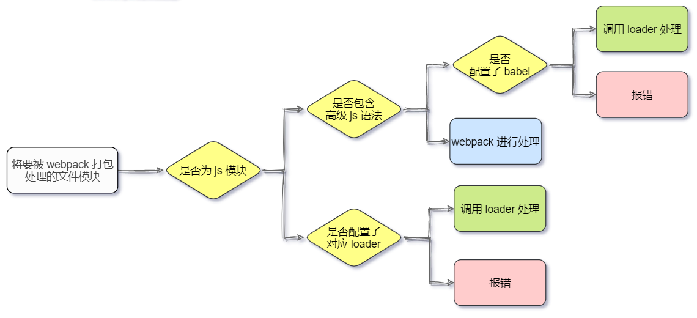

### 8.3. loader 特性

- loader 支持链式传递。能够对资源使用流水线(pipeline)。一组链式的 loader 将按照相反的顺序执行。loader 链中的第一个 loader 返回值给下一个 loader。在最后一个 loader，返回 webpack 所预期的 JavaScript。
- loader 可以是同步的，也可以是异步的。
- loader 运行在 Node.js 中，并且能够执行任何可能的操作。
- loader 接收查询参数。用于对 loader 传递配置。
- loader 也能够使用 `options` 对象进行配置。
- 除了使用 `package.json` 常见的 `main` 属性，还可以将普通的 `npm` 模块导出为 `loader`，做法是在 `package.json` 里定义一个 `loader` 字段。
- 插件(plugin)可以为 loader 带来更多特性。
- loader 能够产生额外的任意文件。

loader 通过（loader）预处理函数，为 JavaScript 生态系统提供了更多能力。 用户现在可以更加灵活地引入细粒度逻辑，例如压缩、打包、语言翻译和其他更多。

### 8.4. loader 的使用

有三种使用 loader 的方式：

- 配置（推荐）：在 webpack.config.js 文件中指定 loader。
- 内联：在每个 `import` 语句中显式指定 loader。
- CLI：在 `shell` 命令中指定它们。

#### 8.4.1. 配置方式（推荐）

`module.rules` 允许在 webpack 配置中指定多个 loader，同时可以对各个 loader 有个全局概览。示例如下：

```js
module: {
    rules: [
        {
            test: /\.css$/,
            use: [
                { loader: 'style-loader' },
                {
                    loader: 'css-loader',
                    options: {
                        modules: true
                    }
                }
            ]
        }
    ]
}
```

#### 8.4.2. 内联方式

可以在 `import` 语句或任何等效于 "import" 的方式中指定 loader。使用 `!` 将资源中的 loader 分开。分开的每个部分都相对于当前目录解析。

```js
import Styles from 'style-loader!css-loader?modules!./styles.css';
```

通过前置所有规则及使用 `!`，可以对应覆盖到配置中的任意 loader。选项可以传递查询参数，例如 `?key=value&foo=bar`，或者一个 JSON 对象，例如 `?{"key":"value","foo":"bar"}`

#### 8.4.3. CLI方式

通过 CLI 使用 loader：

```bash
webpack --module-bind jade-loader --module-bind 'css=style-loader!css-loader'
```

以上示例是对 `.jade` 文件使用 jade-loader，对 `.css` 文件使用 style-loader 和 css-loader。

### 8.5. 常用的loader

#### 8.5.1. 打包处理 css 文件

- 运行以下命令，安装处理 css 文件的 loader

```bash
npm i style-loader@3.0.0 css-loader@5.2.6 -D
```

- 在 webpack.config.js 的 `module -> rules` 数组中，添加 `loader` 规则如下

```js
module.exports = {
  ...
  module: { // 所有第三方文件模块的匹配规则
    // 定义了不同模块对应的 loader。文件后缀名的匹配规则
    rules: [
      // 定义处理 .css 文件的 loader
      { test: /\.css$/, use: ['style-loader', 'css-loader'] }
    ]
  },
  ...
}
```

其中，`test` 表示匹配的文件类型， `use` 表示对应要调用的 loader

> 注意：
>
> - `use` 数组中指定的 loader 顺序是固定的
> - 多个 loader 的调用顺序是：从后往前调用

#### 8.5.2. 打包处理 less 文件

- 运行以下命令，安装处理 less 文件的 loader

```bash
npm i less-loader@10.0.1 less@4.1.1 -D
```

- 在 webpack.config.js 的 `module -> rules` 数组中，添加 `loader` 规则如下

```js
module.exports = {
  ...
  module: { // 所有第三方文件模块的匹配规则
    // 定义了不同模块对应的 loader。文件后缀名的匹配规则
    rules: [
      // 定义处理 .css 文件的 loader
      { test: /\.css$/, use: ['style-loader', 'css-loader'] },
      // 处理 .less 文件的 loader
      { test: /\.less$/, use: ['style-loader', 'css-loader', 'less-loader'] }
    ]
  },
  ...
}
```

注意：上面示例的 less 是包含在 less-loader 中，添加规则只需要 less-loader 即可

#### 8.5.3. 打包处理样式表中与 url 路径相关的文件

- 运行以下命令，安装处理 url 路径相关的文件的 loader

```bash
npm i url-loader@4.1.1 file-loader@6.2.0 -D
```

- 在 webpack.config.js 的 `module -> rules` 数组中，添加 `loader` 规则如下

```js
module.exports = {
  ...
  module: { // 所有第三方文件模块的匹配规则
    // 定义了不同模块对应的 loader。文件后缀名的匹配规则
    rules: [
      // 处理图片文件的 loader
      // 如果需要调用的 loader 只有一个，则只传递一个字符串也行，如果有多个loader，则必须指定数组
      // 在配置 url-loader 时，可以在 ? 之后的增加 loader 的参数项。多个参数之间，使用 & 符号进行分隔
      { test: /\.jpg|png|gif$/, use: 'url-loader?limit=470&outputPath=images' }
    ]
  },
  ...
}
```

注：其中 `?` 之后的是 loader 的参数项，如多个参数之间，使用 `&` 符号进行分隔：

- `limit` 用来指定图片的大小，单位是字节（byte）
- 只有 `≤ limit` 大小的图片，才会被转为 base64 格式的图片

#### 8.5.4. 打包处理 js 文件中的高级语法

##### 8.5.4.1. 问题分析

webpack 只能打包处理一部分高级的 JavaScript 语法。对于那些 webpack 无法处理的高级 js 语法，需要借助于 babel-loader 进行打包处理。例如 webpack 无法处理下面的 JavaScript 代码：

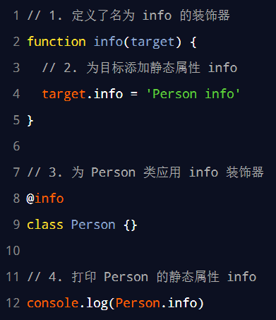

##### 8.5.4.2. 安装与配置

- 运行以下命令，安装处理高级 js 语法的 babel-loader 及对应的依赖包

```bash
npm i babel-loader@8.2.2 @babel/core@7.14.6 @babel/plugin-proposal-decorators@7.14.5 -D
```

- 在 webpack.config.js 的 `module -> rules` 数组中，添加 `loader` 规则如下

```js
module.exports = {
  ...
  module: { // 所有第三方文件模块的匹配规则
    // 定义了不同模块对应的 loader。文件后缀名的匹配规则
    rules: [
      // 使用 babel-loader 处理高级的 JS 语法
      // 在配置 babel-loader 的时候，程序员只需要把自己的代码进行转换即可；一定要排除 node_modules 目录中的 JS 文件
      // 因为第三方包中的 JS 兼容性，不需要程序员关心
      { test: /\.js$/, use: 'babel-loader', exclude: /node_modules/ }
    ]
  },
  ...
}
```

*注：在配置 babel-loader 时，只需要转换自身项目代码，要排除依赖第三方包，即（node_modules）*

- 在项目根目录下，创建名为 babel.config.js 的配置文件，定义 Babel 的配置项如下：

```js
module.exports = {
  // 声明 babel 可用的插件
  // 将来，webpack 在调用 babel-loader 的时候，会先加载 plugins 插件来使用
  plugins: [['@babel/plugin-proposal-decorators', { legacy: true }]]
}
```

> 详情请参考 Babel 的官网 https://babeljs.io/docs/en/babel-plugin-proposal-decorators

## 9. 插件(plugins)

插件是 webpack 的支柱功能。通过安装和配置第三方的插件，可以拓展 webpack 的能力。插件目的在于解决 loader 无法实现的其他事。

### 9.1. 配置语法

插件可以携带参数/选项，必须在 webpack 配置中，向 `plugins` 属性传入 `new` 实例

```js
// webpack.config.js
const HtmlWebpackPlugin = require('html-webpack-plugin'); // 通过 npm 安装
const webpack = require('webpack'); // 访问内置的插件
const path = require('path');

const config = {
  entry: './path/to/my/entry/file.js',
  output: {
    filename: 'my-first-webpack.bundle.js',
    path: path.resolve(__dirname, 'dist')
  },
  module: {
    rules: [
      {
        test: /\.(js|jsx)$/,
        use: 'babel-loader'
      }
    ]
  },
  plugins: [
    new webpack.optimize.UglifyJsPlugin(),
    new HtmlWebpackPlugin({template: './src/index.html'})
  ]
};

module.exports = config;
```

### 9.2. 常用插件 webpack-dev-server 热部署

webpack-dev-server 插件类似于 node.js 阶段用到的 nodemon 工具。每当修改了源代码，webpack 会自动进行项目的打包和构建

webpack-dev-server 可以让 webpack 监听项目源代码的变化，从而进行自动打包构建。

#### 9.2.1. 安装

运行如下的命令，即可在项目中安装 webpack-dev-server 插件：

```bash
npm install webpack-dev-server@3.11.2 -D
```

#### 9.2.2. 配置 devServer 节点

在 webpack.config.js 配置文件中，可以通过 `devServer` 节点对 webpack-dev-server 插件进行更多的配置

```js
devServer: {
    // 首次打包成功后，自动打开浏览器
    open: true,
    // 配置实时打包所使用的端口号。在 http 协议中，如果访问的服务端口号是 80，则可以被省略
    port: 80,
    // 指定实时打包运行所使用的的主机地址
    host: '127.0.0.1'
},
```

> *注意：修改了 webpack.config.js 配置文件，必须重启实时打包的服务器，否则最新的配置文件无法生效！*

#### 9.2.3. 启动插件

1. 修改 `package.json` -> `scripts` 中的 `dev` 命令如下：

```json
"scripts": {
    "dev": "webpack serve" // script 节点下的脚本，可以通过 npm run 执行
},
```

2. 再次运行 `npm run dev` 命令，重新进行项目的打包
3. 在浏览器中访问项目地址，查看自动打包效果

> <font color=red>**注意：webpack-dev-server 会启动一个实时打包的 http 服务器**</font>

#### 9.2.4. 打包生成的文件的存放位置

- 不配置 webpack-dev-server 的情况下，webpack 打包生成的文件，<font color=red>会存放到实际的物理磁盘上</font>
    - 严格遵守开发者在 `webpack.config.js` 中指定配置
    - 根据 output 节点指定路径进行存放
- 配置了 webpack-dev-server 之后，打包生成的文件<font color=red>存放到了内存中</font>
    - 不再根据 output 节点指定的路径，存放到实际的物理磁盘上
    - 提高了实时打包输出的性能，因为内存比物理磁盘速度快很多

#### 9.2.5. 生成到内存中的文件该如何访问

webpack-dev-server 生成到内存中的文件，默认放到了项目的根目录中，而且是虚拟的、不可见的。

- 可以直接用 `/` 表示项目根目录，后面跟上要访问的文件名称，即可访问内存中的文件
- 例如 `/bundle.js` 就表示要访问 webpack-dev-server 生成到内存中的 `bundle.js` 文件

### 9.3. 常用插件 html-webpack-plugin

html-webpack-plugin 是 webpack 中的 HTML 插件，可以通过此插件自定制 index.html 页面的内容。即会将 src 目录下的 index.html 首页，复制到项目根目录中一份！

#### 9.3.1. 安装

运行如下的命令，即可在项目中安装 html-webpack-plugin 插件：

```bash
npm install html-webpack-plugin@5.3.2 -D
```

#### 9.3.2. 配置

修改 webpack.config.js 配置文件

```js
// 1. 导入 html-webpack-plugin 这个插件，得到插件的构造函数
const HtmlPlugin = require('html-webpack-plugin')
// 2. new 构造函数，创建插件的实例对象
const htmlPlugin = new HtmlPlugin({
  // 指定要复制哪个页面
  template: './src/index.html',
  // 指定复制出来的文件名和存放路径
  filename: './index.html'
})

// 使用 Node.js 中的导出语法，向外导出一个 webpack 的配置对象
module.exports = {
  ...
  // 3. 插件的数组，将来 webpack 在运行时，会加载并调用这些插件
  plugins: [htmlPlugin], // 通过 plugins 节点，使 htmlPlugin 插件生效
  ...
}
```

#### 9.3.3. 插件的实现原理

1. 通过 html-webpack-plugin 插件复制到项目根目录中的 index.html 页面，也被放到了内存中
2. html-webpack-plugin 插件在生成的 index.html 页面，自动注入了打包的 bundle.js 文件

## 10. 打包发布

项目开发完成之后，需要使用 webpack 对项目进行打包发布，主要原因有以下两点：

1. 开发环境下，打包生成的文件存放于内存中，无法获取到最终打包生成的文件
2. 开发环境下，打包生成的文件不会进行代码压缩和性能优化

为了让项目能够在生产环境中高性能的运行，因此需要对项目进行打包发布。

### 10.1. 配置 webpack 的打包发布

在 package.json 文件的 `scripts` 节点下，新增 `build` 命令如下：

```json
"scripts": {
    "dev": "webpack serve",
    "build": "webpack --mode production"
},
```

说明：`--mode` 是一个参数项，用来指定 webpack 的运行模式。`production` 代表生产环境，会对打包生成的文件进行代码压缩和性能优化。通过 `--mode` 指定的参数项，会覆盖 webpack.config.js 中的 `mode` 选项。

> 打包的命令可随意命名，以上示例是使用`build`

### 10.2. 指定 JavaScript 文件统一生成到 js 目录中

在 webpack.config.js 配置文件的 `output` 节点中，进行如下的配置：

```js
// 指定生成的文件要存放到哪里
output: {
    // 存放的目录
    path: path.join(__dirname, 'dist'),
    // 指定生成的文件名，明确让 webpack 把生成的 bundle.js 文件存放到 dist 目录下的 js 子目录中
    filename: 'js/bundle.js'
}
```

### 10.3. 把图片文件统一生成到 image 目录中

修改 webpack.config.js 中的 `url-loader` 配置项，新增 `outputPath` 选项即可指定图片文件的输出路径：

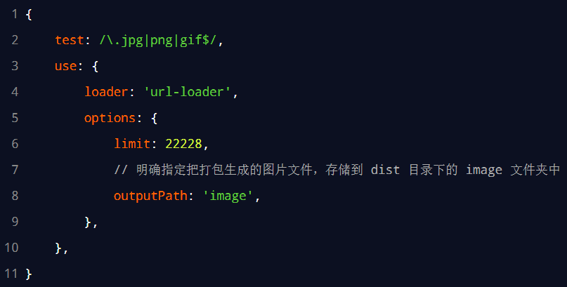

### 10.4. 自动清理 dist 目录下的旧文件

为了在每次打包发布时自动清理掉 dist 目录中的旧文件，可以安装并配置 clean-webpack-plugin 插件：

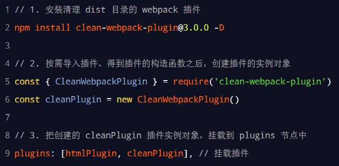

### 10.5. Source Map

#### 10.5.1. 生产环境遇到的问题

前端项目在投入生产环境之前，都需要对 JavaScript 源代码进行压缩，从而减小文件的体积，提高文件的加载效率。此时就不可避免的产生了另一个问题：对压缩之后的代码除错（debug）是一件极其困难的事情。因为压缩后的代码：

- 变量被替换成没有任何语义的名称
- 空行和注释被剔除

#### 10.5.2. Source Map 是什么

Source Map 就是一个信息文件，里面储存着位置信息。也就是说，Source Map 文件中存储着压缩后的代码，所对应的转换前的位置。

有了它，出错的时候，debug工具将直接显示原始代码，而不是转换后的代码，能够极大的方便后期的调试。

#### 10.5.3. webpack 开发环境下的 Source Map

**在开发环境下，webpack 默认启用了 Source Map 功能**。当程序运行出错时，可以直接在控制台提示错误行的位置，并定位到具体的源代码：

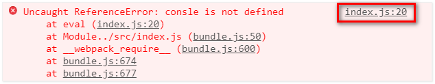

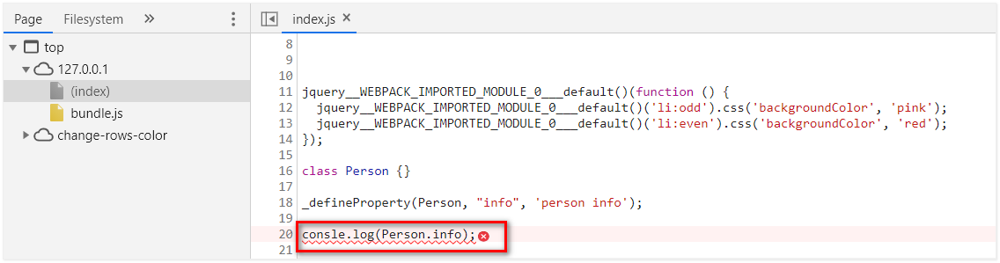

开发环境下默认生成的 Source Map，记录的是生成后的代码的位置。会导致运行时报错的行数与源代码的行数不一致的问题。示意图如下：

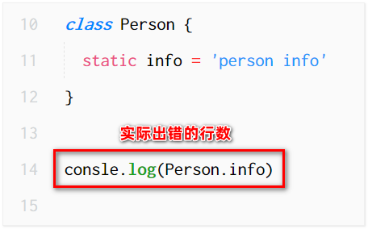

**配置开发环境下的 Source Map**

开发环境下，推荐在 webpack.config.js 中添加如下的配置，即可**保证运行时报错的行数与源代码的行数保持一致**：

```js
module.exports = {
    // 在开发调试阶段，建议都把 devtool 的值设置为 eval-source-map
    // 此选项生成的 Source Map 能保证运行时报错的行数与源代码的行数保持一致
    devtool: 'eval-source-map'
}
```

#### 10.5.4. webpack 生产环境下的 Source Map

在生产环境下，如果省略了 devtool 选项，则最终生成的文件中不包含 Source Map。这能够防止原始代码通过 Source Map 的形式暴露给别有所图之人。

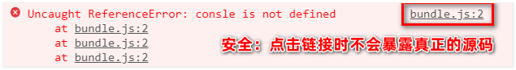

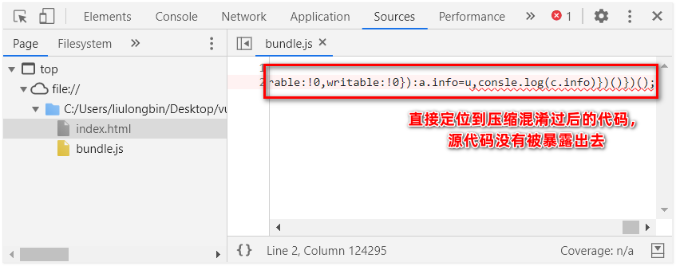

##### 10.5.4.1. 只定位行数不暴露源码

在生产环境下，如果只想定位报错的具体行数，且不想暴露源码。此时可以将 `devtool` 的值设置为 `nosources-source-map`。实际效果如图所示：

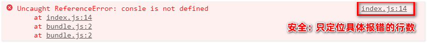


##### 10.5.4.2. 定位行数且暴露源码

在生产环境下，如果想在定位报错行数的同时，展示具体报错的源码。此时可以将 `devtool` 的值设置为 `source-map`。实际效果如图所示：


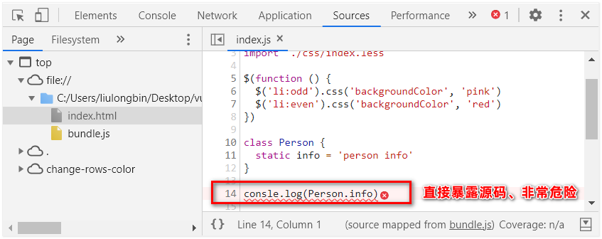

<font color=red>**使用此选项后：应该将服务器配置为，不允许普通用户访问 source map 文件！**</font>

#### 10.5.5. Source Map 的最佳实践

开发环境下：

- 建议把 `devtool` 的值设置为 `eval-source-map`
- 好处：可以精准定位到具体的错误行

生产环境下：

- 建议关闭 Source Map 或将 `devtool` 的值设置为 `nosources-source-map`
- 好处：防止源码泄露，提高网站的安全性
