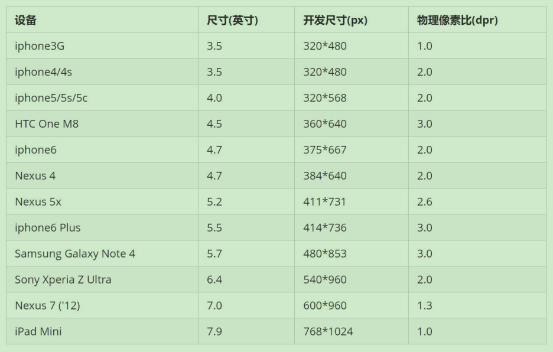
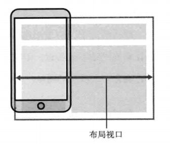
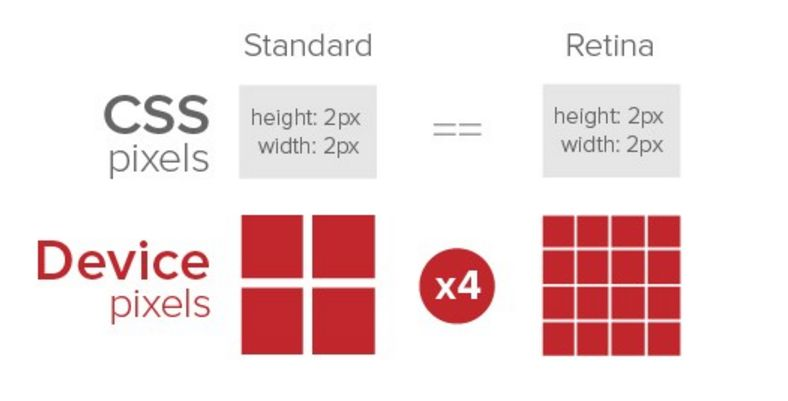
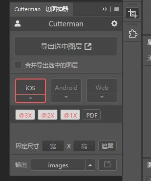

# 移动端Web基础笔记

## 1. 移动端开发基础

### 1.1. 浏览器现状

国内的几乎所有手机浏览器都是根据Webkit修改过来的内核，国内尚无自主研发的内核，就像国内的手机操作系统都是基于Android修改开发的一样。

<font color=red>**总结：兼容移动端主流浏览器，处理Webkit内核浏览器即可。**</font>

### 1.2. 手机屏幕现状

- 移动端设备屏幕尺寸非常多，碎片化严重
- Android设备有多种分辨率：480x800, 480x854, 540x960, 720x1280，1080x1920等，还有传说中的2K，4k屏
- 近年来iPhone的碎片化也加剧了，其设备的主要分辨率有：640x960, 640x1136, 750x1334, 1242x2208等
- 作为开发者无需关注这些分辨率，因为常用的尺寸单位是 px 。

### 1.3. 常见移动端屏幕尺寸



> 注：
>
> - 以上数据均参考自 https://material.io/devices/
> - 作为前端开发，不建议去纠结dp，dpi，pt，ppi等单位。

### 1.4. 移动端调试方法

- Chrome DevTools（谷歌浏览器）的模拟手机调试
- 搭建本地web服务器，手机和服务器一个局域网内，通过手机访问服务器
- 使用外网服务器，直接IP或域名访问

## 2. 视口

视口（viewport）就是浏览器显示页面内容的屏幕区域。**视口可以分为布局视口、视觉视口和理想视口**

### 2.1. 布局视口 (layout viewport)

- 一般移动设备的浏览器都默认设置了一个布局视口，用于解决早期的PC端页面在手机上显示的问题。
- IOS, Android基本都将这个视口分辨率设置为 980px，所以PC上的网页大多都能在手机上呈现，只不过元素看上去很小，一般默认可以通过手动缩放网页。



### 2.2. 视觉视口 (visual viewport)

- 是指用户正在看到的网站的区域。<font color=red>**注意：是网站的区域**</font>。
- 可以通过缩放去操作视觉视口，但不会影响布局视口，布局视口仍保持原来的宽度。


### 2.3. 理想视口 (ideal viewport)

- 为了使网站在移动端有最理想的浏览和阅读宽度而设定
- 理想视口，对设备来讲，是最理想的视口尺寸
- 需要手动添写meta视口标签通知浏览器操作
- meta视口标签的主要目的：布局视口的宽度应该与理想视口的宽度一致，简单理解就是设备有多宽，我们布局的视口就多宽

### 2.4. meta 视口标签

#### 2.4.1. 定义和用法

- `<meta>` 元素可提供有关页面的元信息（meta-information），比如针对搜索引擎和更新频度的描述和关键词。
- `<meta>` 标签位于文档的头部，不包含任何内容。`<meta>` 标签的属性定义了与文档相关联的名称/值对。

示例：

```html
<meta name="viewport" content="width=device-width, user-scalable=no,
      initial-scale=1.0, maximum-scale=1.0, minimum-scale=1.0">
```

> 注：
>
> - 在 HTML 中，`<meta>` 标签没有结束标签。
> - `<meta>` 标签永远位于 head 元素内部。
> - 元数据总是以名称/值的形式被成对传递的。

#### 2.4.2. 标签的属性

|   属性    |    值     |                      描述                       |
| :-------: | :-------: | ---------------------------------------------- |
| `content` | some_text | 定义与 http-equiv 或 name 属性相关的元信息（必需） |

content 属性相应的名称/值含义

|      属性       |                     解释说明                      |
| :-------------: | ------------------------------------------------ |
|     `width`     | 宽度设置的是viewport宽度，可以设置device-width特殊值 |
| `initial-scale` | 初始缩放比，大于0的数字                             |
| `maximum-scale` | 最大缩放比，大于0的数字                             |
| `minimum-scale` | 最小缩放比，大于0的数字                             |
| `user-scalable` | 用户是否可以缩放，yes或no（1或0）                   |

### 2.5. 标准的 viewport 设置

- 视口宽度和设备保持一致
- 视口的默认缩放比例1.0
- 不允许用户自行缩放
- 最大允许的缩放比例1.0
- 最小允许的缩放比例1.0

## 3. 二倍图

### 3.1. “物理像素”与“物理像素比”

- 物理像素点指的是屏幕显示的最小颗粒，是物理真实存在的。这是厂商在出厂时就设置好了。
- PC端页面，`1px` 等于1个物理像素的，但在移动端开发时候的 `1px` 不是一定等于1个物理像素的
- 1px 能显示的物理像素点的个数，称为**物理像素比**或**屏幕像素比**
- PC端和早前的手机屏幕/普通手机屏幕: `1 CSS像素 = 1 物理像素`的
- Retina（视网膜屏幕）是一种显示技术，可以将把更多的物理像素点压缩至一块屏幕里，从而达到更高的分辨率，并提高屏幕显示的细腻程度。



### 3.2. 多倍图

在标准的viewport设置中，使用倍图来提高图片质量，解决在高清设备中的模糊问题

> 对于一张 50px×50px 的图片，在手机 Retina 屏中打开，按照刚才的物理像素比会放大倍数，这样会造成图片模糊。通常使用二倍图，因为iPhone 6\7\8 的影响,但是现在还存在3倍图4倍图的情况，这个看实际开发项目的需求

### 3.3. 扩展 - 多倍图切图 cutterman

Photoshop的插件



## 4. 移动端技术解决方案

### 4.1. 移动端开发选择方案

1. 单独制作**移动端页面**（主流）。如京东商城手机版、淘宝触屏版、...
    - 通常情况下，网址域名前面加 m(mobile) 可以打开移动端。通过判断当前用户的设备，如果是移动设备时，打开页面则跳到移动端页面。
2. **响应式页面**兼容移动端（其次）。如三星手机官网、...
    - 通过判断屏幕宽度来改变样式，以适应不同终端。缺点：制作麻烦，需要花很大精力去调兼容性问题

总结：市场是常见的移动端开发有**单独制作移动端页面**和**响应式页面**两种方案，现在市场主流的选择还是单独制作移动端页面

### 4.2. 移动端浏览器

移动端浏览器基本以 webkit 内核为主，因此只需考虑webkit兼容性问题。同时浏览器的私有前缀也只需要考虑添加 webkit 即可

### 4.3. 移动端CSS初始化 normalize.css

移动端 CSS 初始化推荐使用 normalize.css

- Normalize.css：保护了有价值的默认值
- Normalize.css：修复了浏览器的bug
- Normalize.css：是模块化的
- Normalize.css：拥有详细的文档

官网地址： http://necolas.github.io/normalize.css/

### 4.4. 移动特殊样式处理

```css
xxx {
    /* CSS3盒子模型 */
    box-sizing: border-box;
    -webkit-box-sizing: border-box;
    /* 点击会出现高亮，需要清除清除 设置为transparent 完成透明 */
    -webkit-tap-highlight-color: transparent;
    /* 在移动端浏览器默认的外观在iOS上加上这个属性才能给按钮和输入框自定义样式 */
    -webkit-appearance: none;
    /* 禁用长按页面时的弹出菜单 */
    -webkit-touch-callout: none;
}
```

# 移动端常见布局

1. 单独制作移动端页面
    - 流式布局（百分比布局）
    - flex 弹性布局（强烈推荐）
    - less+rem+媒体查询布局
    - 混合布局
2. 响应式页面兼容移动端
    - 媒体查询
    - bootstarp

## 1. 流式布局（百分比布局）

### 1.1. 定义

- 流式布局，就是百分比布局，也称非固定像素布局。
- 通过盒子的宽度设置成百分比来根据屏幕的宽度来进行伸缩，不受固定像素的限制，内容向两侧填充。
- 流式布局方式是移动web开发使用的比较常见的布局方式。

如果只根据屏幕的大小去改变盒子的宽度（高度），那里面的内容就可能变得混乱，所以一般需要设置盒子的最大/最小的宽度（高度）

- `max-width`/`max-height` 最大宽/高度
- `min-width`/`min-height` 最小宽/高度

示例：

```html
<section>
    <div></div>
    <div></div>
</section>
```

```css
* {
    margin: 0;
    padding: 0;
}

section {
    width: 100%;
    max-width: 980px; /* 最大宽度 */
    min-width: 320px; /* 最小宽度 */
    margin: 0 auto;
}

section div {
    float: left;
    width: 50%;
    height: 400px;
}

section div:nth-child(1) {
    background-color: pink;
}

section div:nth-child(2) {
    background-color: purple;
}
```

### 1.2. 仿京东移动端首页案例

案例需求：模拟京东移动端首页。案例代码详见：`html-css-js-sample\css-composite-sample\H5-jd-portal`

#### 1.2.1. 确定技术选型

- 方案：采取单独制作移动页面方案
- 技术：布局采取流式布局

#### 1.2.2. 搭建项目目录结构

```
-- css        项目样式文件
-- images     项目图片
-- upload     项目图片
-- index.html  首页
```

#### 1.2.3. 设置视口标签以及引入初始化样式

```html
<!-- 设置视口标签 -->
<meta
    name="viewport"
    content="width=device-width, initial-scale=1.0, user-scalable=no, maximum-scale=1.0, minimum-scale=1.0"
/>

<!-- 引入css初始化文件 -->
<link rel="stylesheet" href="css/normalize.css" />
<!-- 引入首页的css -->
<link rel="stylesheet" href="css/index.css" />
```

#### 1.2.4. 常用初始化样式

```css
body {
    width: 100%;
    min-width: 320px;
    max-width: 640px;
    margin: 0 auto;
    font-size: 14px;
    font-family: -apple-system, Helvetica, sans-serif;
    color: #666;
    line-height: 1.5;
}
```

#### 1.2.5. 二倍精灵图做法

因为是二倍图的缘故，如果直接测量所需图标的位置是有问题的。正常的操作如下：

- 在firework里面把精灵图等比例缩放为原来的一半
- 之后根据大小测量坐标
- 注意代码里面`background-size`，设置精灵图原来宽度的一半

#### 1.2.6. 图片格式

**DPG图片压缩技术**

京东自主研发推出DPG图片压缩技术，经测试该技术，可直接节省用户近50%的浏览流量，极大的提升了用户的网页打开速度。能够兼容jpeg，实现全平台、全部浏览器的兼容支持，经过内部和外部上万张图片的人眼浏览测试后发现，压缩后的图片和webp的清晰度对比没有差距。

**webp 图片格式**

谷歌开发的一种旨在加快图片加载速度的图片格式。图片压缩体积大约只有JPEG的2/3，并能节省大量的服务器宽带资源和数据空间

## 2. flex 布局

flex 布局是一种"弹性布局"，特别适用于移动端

> 关于flex布局详见《CSS 基础知识》中的 [flex 伸缩布局](/03-前端资料/01-前端基础语法/02-CSS-01-基础知识?id=_8-伸缩布局css3)

## 3. rem适配布局

流式布局和flex布局主要针对于宽度布局，无法适配高度。如果需要随着屏幕大小变化，页面布局文字变化、元素高度和宽度等比例缩放，此时需要用到**rem适配布局**

### 3.1. rem 单位

rem (root em)是一个相对单位，类似于em，em是父元素字体大小。不同的是<font color=red>**rem的基准是相对于html元素的字体大小，与父元素无关**</font>。

rem的优势：父元素文字大小可能不一致，但是整个页面只有一个html，可以很好来控制整个页面的元素大小

比如，根元素（html）设置`font-size=12px;`，非根元素设置`width:2rem;`，则换成px表示就是24px。

```html
/* 根 html 为 12px */
html {
    font-size: 12px;
}
/* 此时 div 的字体大小就是 24px */
div {
    font-size: 2rem;
}
```

### 3.2. 媒体查询 (CSS3)

#### 3.2.1. 什么是媒体查询

媒体查询（Media Query）是CSS3新语法。

- 使用 `@media` 查询，可以针对不同的媒体类型定义不同的样式
- `@media` 可以针对不同的屏幕尺寸设置不同的样式
- 当在重置浏览器大小的过程中，页面也会根据浏览器的宽度和高度重新渲染页面
- 目前针对很多苹果手机、Android手机，平板等设备都用得到多媒体查询

#### 3.2.2. 语法规范

```css
@media mediatype and|not|only (media feature) {
    CSS-Code;
}
```

- `@media`：用于定义媒体查询的标识，注意`@`符号
- `mediatype`：媒体类型
- `and`、`not`、`only`：连接符
- `media feature`：媒体特性，必须有小括号包含


