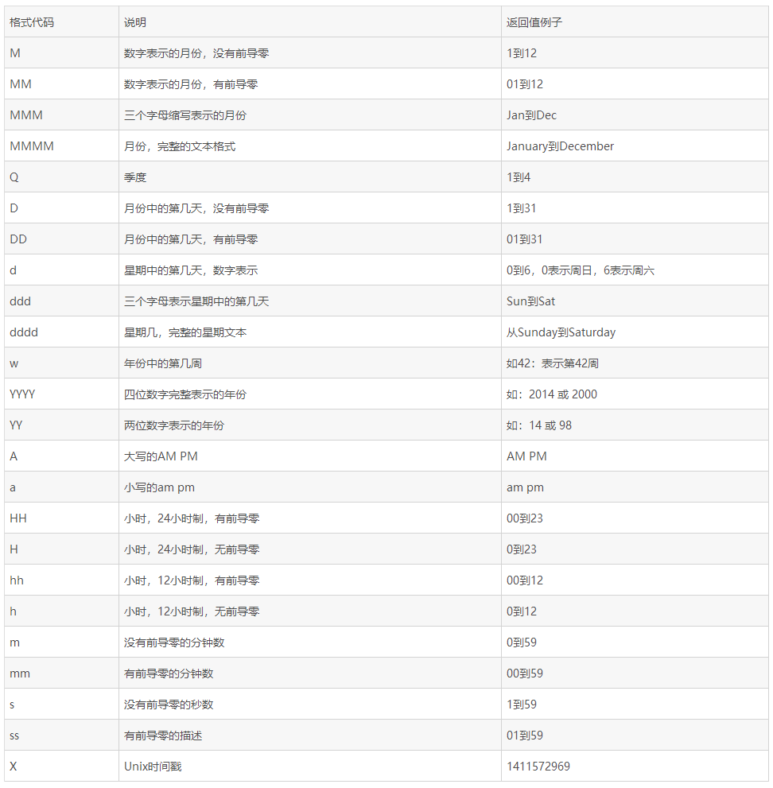

# Moment.js 轻量级时间工具库

- 官网：https://momentjs.com/
- 中文翻译版网址：http://momentjs.cn/

## 1. Moment.js常见用法总结

> Moment.js是一个轻量级的JavaScript时间库，它方便了日常开发中对时间的操作，提高了开发效率。

### 1.1. 获取时间

#### 1.1.1. Start of Time

- 语法

```js
moment().startOf(String)
```

- 获取今天0时0分0秒

```js
moment().startOf('day')
```

- 获取本周第一天(周日)0时0分0秒

```js
moment().startOf('week')
```

- 获取本周周一0时0分0秒

```js
moment().startOf('isoWeek')
```

- 获取当前月第一天0时0分0秒

```js
moment().startOf('month')
```

#### 1.1.2. End of Time

- 语法：

```js
moment().endOf(String)
```

- 获取今天23时59分59秒

```js
moment().endOf('day')
```

- 获取本周最后一天(周六)23时59分59秒

```js
moment().endOf('week')
```

- 获取本周周日23时59分59秒

```js
moment().endOf('isoWeek')
```

- 获取当前月最后一天23时59分59秒

```js
moment().endOf('month')
```

#### 1.1.3. Days in Month

- 语法

```js
moment().daysInMonth()
```

- 获取当前月的总天数

```js
moment().daysInMonth()
```

#### 1.1.4. Timestamp

- 获取时间戳(以秒为单位)

```js
moment().format('X') // 返回值为字符串类型
moment().unix() // 返回值为数值型
```

- 获取时间戳(以毫秒为单位)

```js
moment().format('x') // 返回值为字符串类型
moment().valueOf() // 返回值为数值型
```

#### 1.1.5. Get Time

- 获取年份

```js
moment().year()
moment().get('year')
```

- 获取月份

```js
moment().month() (0~11, 0: January, 11: December)
moment().get('month')
```

- 获取一个月中的某一天

```js
moment().date()
moment().get('date')
```

- 获取一个星期中的某一天

```js
moment().day() (0~6, 0: Sunday, 6: Saturday)
moment().weekday() (0~6, 0: Sunday, 6: Saturday)
moment().isoWeekday() (1~7, 1: Monday, 7: Sunday)
moment().get('day')
mment().get('weekday')
moment().get('isoWeekday')
```

- 获取小时

```js
moment().hours()
moment().get('hours')
```

- 获取分钟

```js
moment().minutes()
moment().get('minutes')
```

- 获取秒数

```js
moment().seconds()
moment().get('seconds')
```

- 获取当前的年月日时分秒

```js
moment().toArray() // [years, months, date, hours, minutes, seconds, milliseconds]
moment().toObject() // {years: xxxx, months: x, date: xx ...}
```

### 1.2. 设置时间

#### 1.2.1. Set Time

- 语法：

```js
moment().year(Number), moment().month(Number)...
moment().set(String, Int)
moment().set(Object)
```

- 设置年份

```js
moment().year(2019)
moment().set('year', 2019)
moment().set({year: 2019})
```

- 设置月份

```js
moment().month(11)    // (0~11, 0: January, 11: December)
moment().set('month', 11)
```

- 设置某个月中的某一天

```js
moment().date(15)
moment().set('date', 15)
```

- 设置某个星期中的某一天

```js
moment().weekday(0) // 设置日期为本周第一天（周日）
moment().isoWeekday(1) // 设置日期为本周周一
moment().set('weekday', 0)
moment().set('isoWeekday', 1)
```

- 设置小时

```js
moment().hours(12)
moment().set('hours', 12)
```

- 设置分钟

```js
moment().minutes(30)
moment().set('minutes', 30)
```

- 设置秒数

```js
moment().seconds(30)
moment().set('seconds', 30)
```

#### 1.2.2. Add Time

- 语法：

```js
moment().add(Number, String)
moment().add(Object)
```

- 设置年份

```js
moment().add(1, 'years')
moment().add({years: 1})
```

- 设置月份

```js
moment().add(1, 'months')
```

- 设置日期

```js
moment().add(1, 'days')
```

- 设置星期

```js
moment().add(1, 'weeks')
```

- 设置小时

```js
moment().add(1, 'hours')
```

- 设置分钟

```js
moment().add(1, 'minutes')
```

- 设置秒数

```js
moment().add(1, 'seconds')
```

#### 1.2.3. Subtract Time

- 语法：

```js
moment().subtract(Number, String)
moment().subtract(Object)
```

- 设置年份

```js
moment().subtract(1, 'years')
moment().subtract({years: 1})
```

- 设置月份

```js
moment().subtract(1, 'months')
```

- 设置日期

```js
moment().subtract(1, 'days')
```

- 设置星期

```js
moment().subtract(1, 'weeks')
```

- 设置小时

```js
moment().subtract(1, 'hours')
```

- 设置分钟

```js
moment().subtract(1, 'minutes')
```

- 设置秒数

```js
moment().subtract(1, 'seconds')
```

### 1.3. 格式化时间
#### 1.3.1. Format Time

- 语法：

```js
moment().format()
moment().format(String)
```

- 格式化年月日：'xxxx年xx月xx日'

```js
moment().format('YYYY年MM月DD日')
```

- 格式化年月日：'xxxx-xx-xx'

```js
moment().format('YYYY-MM-DD')
```

- 格式化时分秒(24小时制)：'xx时xx分xx秒'

```js
moment().format('HH时mm分ss秒')
```

- 格式化时分秒(12小时制)：'xx:xx:xx am/pm'

```js
moment().format('hh:mm:ss a')
```

- 格式化时间戳(以秒为单位)

```js
moment().format('X') // 返回值为字符串类型
```

- 格式化时间戳(以毫秒为单位)

```js
moment().format('x') // 返回值为字符串类型
```

### 1.4. 比较时间

#### 1.4.1. Difference

##### 1.4.1.1. 语法

```js
moment().diff(Moment|String|Number|Date|Array)
```

- 获取两个日期之间的时间差

```js
let start_date = moment().subtract(1, 'weeks')
let end_date = moment()

end_date.diff(start_date) // 返回毫秒数

end_date.diff(start_date, 'months') // 0
end_date.diff(start_date, 'weeks') // 1
end_date.diff(start_date, 'days') // 7
start_date.diff(end_date, 'days') // -7
```

##### 1.4.1.2. 案例

```js
// 一：计算小时之间的差
const date1 = moment('08:30', 'hh:mm');
const date2 = moment('18:00', 'hh:mm');
const date3 = date2.diff(date1, 'minute'); // 计算相差的分钟数
const h = Math.floor(date3 / 60); // 相差的小时数
const mm = date3 % 60; // 计算相差小时后余下的分钟数

// 二： 在标准日期格式下可以不指定日期的格式
const date1 = moment('2019-02-28 08:30:00');
const date2 = moment('2019-02-28 18:00:00');
const date3 = date2.diff(date1, 'minute'); // 计算相差的分钟数
const h = Math.floor(date3 / 60); // 相差的小时数
const mm = date3 % 60; // 计算相差小时后余下的分钟数
```

### 1.5. 转化为JavaScript原生Date对象

- 语法：

```js
moment().toDate()
new Date(moment())
```

- 将Moment时间转换为JavaScript原生Date对象

```js
let m = moment()
let nativeDate1 = m.toDate()
let nativeDate2 = new Date(m)

String(nativeDate1) === String(nativeDate2) // true
```

## 2. Moment.js的官网相关的格式的字符


