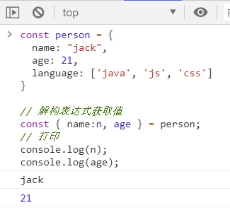
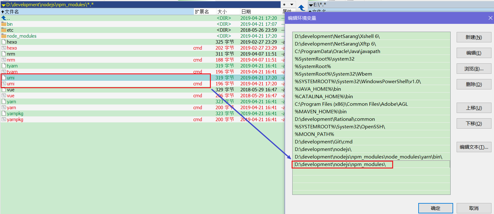

# JavaScript

## 1. JavaScript 语法( ECMA Script )

### 1.1. JavaScript 数据类型
#### 1.1.1. 5种基本数据类型

|   关键字   |                   数据类型                   |
| --------- | ------------------------------------------- |
| Number    | 数值型（整数和浮点数）                        |
| String    | 字符串类型(字符和字符串)，可以使用单引号或双引号 |
| Boolean   | 布尔类型(true/false)                         |
| Object    | 对象类型，对象类型格式：(定义对象，称为JSON对象<br/>(JavaScript Object Notation, JS对象标记)是一种轻量级的数据交换格式  |
| undefined | 未初始化的类型，如果一个变量没有赋值它的类型是不确定的                                            |

- Object 示例

```json
const obj = {
    name: "张三",
    age: 18
}
```

- **`null`与`undefined`的区别**
    - `null`: 其实是Object对象类型，这个对象只是没有值，为空
    - `undefined`：没有初始化的类型，并不知道是什么数据类型

#### 1.1.2. typeof操作符

- 作用：用于判断变量是什么数据类型
- 语法格式：`typeof(变量名)` 或者 `typeof 变量名`
- 返回值：返回这个变量的数据类型

Code Demo

```html
<!DOCTYPE html>
<html>
	<head>
		<meta charset="utf-8" />
		<title></title>
	</head>
	<body>
		<!--引用外部的js文件，文件代码以下面的代码一样，在引用的时候执行js中的代码-->
		<script src="js/test.js" type="text/javascript" charset="utf-8"></script>

		<hr />

		<script type="text/javascript">
			//整数
			var i = 10;

			//双精度
			var d = 3.14;

			//字符串和字符
			var str = "abc";
			var c = 'a';

			//布尔类型
			var b = true;

			//js创建对象方法
			var o = new Object();
			var o = {name:"xx", age:18};
			var u;
			var n = null;

			document.write("i的类型：" + typeof(i) + "<br/>");
			document.write("d的类型：" + typeof(d) + "<br/>");
			document.write("s的类型：" + typeof(str) + "<br/>");
			document.write("c的类型：" + typeof(c) + "<br/>");
			document.write("b的类型：" + typeof(b) + "<br/>");
			document.write("o的姓名：" + o.name + "年龄：" + o.age + "<br/>");
			document.write("o的类型：" + typeof(o) + "<br/>");
			document.write("u的类型：" + typeof(u) + "<br/>");
			document.write("n的类型：" + typeof(n) + "<br/>");
		</script>
	</body>
</html>
```

#### 1.1.3. 类型强制转换
##### 1.1.3.1. String强制转换为数字

- 可以用 `*1` 来转化为数字(实际上是调用`.valueOf`方法)。然后使用` Number.isNaN` 来判断是否为`NaN`，或者使用 `a!==a` 来判断是否为 `NaN`，因为 `NaN !== NaN`

```js
"32" * 1;  // 32
"ds" * 1;  // NaN
null * 1;  // 0
undefined * 1;  // NaN
1 * { valueOf: () => "3" };  // 3
```

- 常用：也可以使用 `+` 来转化字符串为数字

```js
+ "123"  // 123
+ "ds"  // NaN
+ ""    // 0
+ null  // 0
+ undefined  // NaN
+ { valueOf: () => "3" }  // 3
```

#### 1.1.4. 取整 `|0`

对一个数字 `|0` 可以取整，负数也同样适用，`num|0`

```js
const a = 1.3 | 0;  // 1
const b = -1.9 | 0; // -1
```

#### 1.1.5. 判断奇偶数 `&1`

对一个数字 `&1` 可以判断奇偶数，负数也同样适用，`num&1`

```js
const num = 3;
const b1 = !!(num & 1);  // true
const b2 = !!(num % 2);  // true
```

### 1.2. 双位运算符 `~~`

可以使用双位操作符来替代 `Math.floor()`。双否定位操作符的优势在于它执行相同的操作运行速度更快。

```js
Math.floor(4.9) === 4;  // true

// 简写为：
~~4.9 === 4;  // true
```

不过要注意，对整数来说 `~~` 运算结果与 `Math.floor()` 运算结果相同，而对于负数来说不相同：

```js
~~4.5;  // 4
Math.floor(4.5);  // 4

~~-4.5;  // -4
Math.floor(-4.5);  // -5
```

### 1.3. 短路运算符
#### 1.3.1. 常规用法 - 逻辑判断

逻辑与 `&&` 与逻辑或 `||` 是短路运算符。短路运算符就是从左到右的运算中前者满足要求，就不再执行后者了

- `&&` 为取假运算，从左到右依次判断，如果遇到一个假值，就返回假值，以后不再执行，否则返回最后一个真值
- `||` 为取真运算，从左到右依次判断，如果遇到一个真值，就返回真值，以后不再执行，否则返回最后一个假值

```js
let param1 = expr1 && expr2;
let param2 = expr1 || expr2;
```

#### 1.3.2. 其他用法

- 变量赋初值。如下例：如果variable1是真值就直接返回了，后面短路就不会被返回了，如果为假值，则会返回后面的 foo

```js
let variable1;
let variable2 = variable1 || "foo";
```

- 也可以用来进行简单的判断，取代冗长的if语句。如下例：如果 param 如果为真值则返回 `param.prop` 属性，否则返回 param 这个假值，这样在某些地方防止 param 为 `undefined` 的时候还取其属性造成报错。

```js
let variable = param && param.prop;
```


## 2. 数组对象Array

在JS中，数组等价于集合

### 2.1. 创建数组的方式
#### 2.1.1. 一维数组

1. 创建一个长度为0的数组

```js
var arr = new Array();
```

2. 创建一个长度为num的数组

```js
var arr = new Array(num);
```

3. 创建一个指定元素的数组

```js
var arr = new Array(x1,x2,x3……);
```

4. 使用中括号创建数组，指定数组中的每个元素

```js
var arr = [x1,x2,x3,……];
```

#### 2.1.2. 二维数组

```js
var arr = [[x,x,x],[x,x,x],[x,x],……];
```

- 值：`arr[0] = [x,x,x]`
- 使用嵌套循环遍历

#### 2.1.3. Array.of() 方法

`Array.of()`方法用于将一组值，转换为数组。这个方法的主要目的，是弥补数组构造函数`Array()`的不足。因为参数个数的不同，会导致`Array()`的行为有差异。

```js
/* new Array()的构造方法创建数组
 *    Array方法没有参数、一个参数、三个参数时，返回结果都不一样。
 *    只有当参数个数不少于 2 个时，Array()才会返回由参数组成的新数组。参数个数只有一个时，实际上是指定数组的长度。
 */
Array() // []
Array(3) // [, , ,]
Array(3, 11, 8) // [3, 11, 8]

// 使用Array.of()方法创建数组
Array.of(3, 11, 8) // [3,11,8]
Array.of(3) // [3]
Array.of(undefined)    // [ undefined ]
Array.of(3).length // 1
```

- `Array.of()`方法基本上可以用来替代`Array()`或`new Array()`，并且不存在由于参数不同而导致的重载。它的行为非常统一。
- `Array.of()`方法总是返回参数值组成的数组。如果没有参数，就返回一个空数组。

### 2.2. 数组中元素的类型

1. 数组中的元素类型可以各不相同
2. 数组的长度可以动态增长

```js
var arr = [1, 3, 2];
arr[2] = "hello";
arr[3] = new Date();
arr[5] = 99;
```

- 上面的案例最后的结果是：如果跳过增加，则数组也会自动在空的位置加上undefined
- 数组的长度是6
- 数组的内容是`[1, 3, "hello", 时间对象, undefined, 99]`

### 2.3. 数组的遍历
#### 2.3.1. for...of 循环

- 语法：`for(const item of array)`
- 作用：循环遍历数组所有元素项
- > 注：此方式可以随时使用`break`语句停止遍历

```js
const colors = ['blue', 'green', 'white'];

for (const color of colors) {
    console.log(color);
}
// 'blue'
// 'green'
// 'white'
```

#### 2.3.2. for 循环

- 语法：`for(let i; i < array.length; i++)`
- 作用：循环使用递增的索引变量的方式遍历数组所有元素项，index变量从0递增到`colors.length-1`
- > 注：此方式可以随时使用`break`语句停止遍历

```js
const colors = ['blue', 'green', 'white'];

for (let index = 0; index < colors.length; index++) {
    const color = colors[index];
    console.log(color);
}
// 'blue'
// 'green'
// 'white'
```

#### 2.3.3. forEach()方法

- 语法：`array.forEach(callback(item[, index[, array]]))`
    
    - 参数callback函数，该函数参数包括：当前遍历项（item）、索引（index）和数组本身（array）。
- 作用：forEach是Array新方法中最基本的一个，就是遍历，循环。对数组中的每一项元素调用callback函数，执行相关逻辑来遍历数组所有元素项
- forEach方法与map方法的区别是：forEach不返回值，只用来操作数据。
- > 注：`array.forEach()`迭代中，不能使用`break`来中断操作

```js
var arr = [1,2,3];
arr.forEach((item, index) => {
    console.log(item, index);
    // 也可以有其他的操作。
})
```

### 2.4. 数组的映射

#### 2.4.1. map()方法 - ES6新特性

- 语法：`map(callback(item[, index[, array]]))`
    
    - 参数callback函数，该函数参数包括：当前遍历项（item）、索引（index）和数组本身（array）。
- 作用：接收一个函数，将原数组中的所有元素用这个函数处理后，创建新的数组返回。
- > 注：`array.map()`创建一个新的映射数组，而不改变原始数组。

例：有一个字符串数组，将其转为int数组

```js
let arr = ['1', '20', '-5', '3'];
console.log(arr)

let newArr = arr.map(s => parseInt(s));
console.log(newArr)
```


#### 2.4.2. Array.from()方法

`Array.from()`方法就是将一个**类数组对象**或者**可遍历对象(包括ES6新增的数据结构Set和Map)**转换成一个真正的数组。

**类数组对象**，最基本的要求就是具有length属性的对象。

##### 2.4.2.1. 语法

```js
Array.from(arrayLike[, mapFunction[, thisArg]])
```

- arrayLike：必传参数，想要转换成数组的伪数组对象或可迭代对象。
- mapFunction：可选参数，`mapFunction(item，index){…}` 是在集合中的每个项目上调用的函数。返回的值将插入到新集合中。
- thisArg：可选参数，执行回调函数 mapFunction 时 this 对象。这个参数很少使用。

简单的示例

```js
const someNumbers = { '0': 10, '1': 15, length: 2 };
Array.from(someNumbers, value => value * 2); // => [20, 30]
```

> 注：
>
> - `Array.from()`创建一个新的映射数组，而不改变原始数组。
> - `Array.from()`更适合从类似数组的对象进行映射。

##### 2.4.2.2. 用法1：将类数组对象转换为真正数组

```js
let arrayLike = {
    0: 'tom',
    1: '65',
    2: '男',
    3: ['jane', 'john', 'Mary'],
    'length': 4
}

// ES5的写法
let arrEs5 = [].slice.call(arrayLike);

// ES6的写法
let arr = Array.from(arrayLike)
console.log(arr)    // ['tom', '65', '男', ['jane','john','Mary']]
```

```js
// 如果将上面代码中length属性去掉，将会是一个长度为0的空数组
let arrayLike = {
    'name': 'tom',
    'age': '65',
    'sex': '男',
    'friends': ['jane','john','Mary'],
}
let arr = Array.from(arrayLike)
console.log(arr)  // [ ]
```

```js
// 如果具有length属性，但是对象的属性名不再是数字类型的，而是其他字符串型的。输出结果是长度为4，元素均为undefined的数组
let arrayLike = {
    'name': 'tom',
    'age': '65',
    'sex': '男',
    'friends': ['jane','john','Mary'],
    length: 4
}
let arr = Array.from(arrayLike)
console.log(arr)  // [ undefined, undefined, undefined, undefined ]
```

- **总结，将一个类数组对象转换为一个真正的数组，必须具备以下条件：**
    1. 该类数组对象必须具有length属性，用于指定数组的长度。如果没有length属性，那么转换后的数组是一个空数组
    2. 该类数组对象的属性名必须为数值型或字符串型的数字
- ps: 该类数组对象的属性名可以加引号，也可以不加引号

##### 2.4.2.3. 用法2：将Set结构的数据转换为真正的数组

```js
let arr = [12,45,97,9797,564,134,45642]
let set = new Set(arr)
console.log(Array.from(set))  // [ 12, 45, 97, 9797, 564, 134, 45642 ]
```

Array.from还可以接受第二个参数，作用类似于数组的map方法，用来对每个元素进行处理，将处理后的值放入返回的数组。

```js
let arr = [12,45,97,9797,564,134,45642]
let set = new Set(arr)
console.log(Array.from(set, item => item + 1)) // [ 13, 46, 98, 9798, 565, 135, 45643 ]
```

##### 2.4.2.4. 用法3：将字符串转换为数组

```js
let str = 'hello world!';
console.log(Array.from(str)) // ["h", "e", "l", "l", "o", " ", "w", "o", "r", "l", "d", "!"]s
```

##### 2.4.2.5. Array.from参数是一个真正的数组

Array.from会返回一个一模一样的新数组

```js
console.log(Array.from([12,45,47,56,213,4654,154]))
```

### 2.5. 数据的简化
#### 2.5.1. reduce()方法 - ES6新特性

- 语法：`array.reduce(callback(accumulator, item[, index[, array]])[, initialValue])`
    - 接收一个函数callback（必须）和一个初始值initialValue（可选）
    - callback函数接收两个参数：
        - 第一个参数accumulator是上一次 reduce处理的结果
        - 第二个参数item是数组中要处理的下一个元素
- 作用：将数组进行处理返回一个值，可以理解为对数组的所有元素项进行累积操作
- 具体流程：`reduce()` 会从左到右依次把数组中的元素用reduce处理，并把处理的结果作为下次reduce的第一个参数。如果是第一次，会把前两个元素作为计算参数，或者把用户指定的初始值作为起始参数
- > 注：如果没有使用 initialValue 来设置初始值，则默认使用数组的第一个元素作为初始值。

```js
const arr = [1, 20, -5, 3];

/* 没有初始值 */
let result1 = arr.reduce((a, b) => a + b);        // 结果：19
let result2 = arr.reduce((a, b) => a * b);        // 结果：-300
/* 指定初始值 */
let result3 = arr.reduce((a, b) => a * b, 0);     // 结果：-0
let result4 = arr.reduce((a, b) => a * b, 1);     // 结果：-300
let result5 = arr.reduce((a, b) => a * b, -1);    // 结果：300
```

### 2.6. 数据的连接
#### 2.6.1. concat()方法

- 语法：`array.concat(array1[, array2, ...])`
- 作用：连接两个或更多的数组，或者给数组增加元素，并返回结果。一般用于数组的拼接和增加元素操作
- > 注：concat方法是创建一个新的数组，而不改变原来的数组

```js
const arr1 = [1, 2];
const arr2 = ['moon', 'hehe'];

const concatArray = arr1.concat(arr2);
console.log(concatArray); // 1, 2, moon, hehe
```

#### 2.6.2. 展开操作符(...)

- 语法：`[...array1, ...array2]`
- 作用：可以使用展开操作符与数组变量一起使用来连接数组，与`concat()`方法效果一样

```js
const arr1 = [1, 2];
const arr2 = ['moon', 'hehe'];

const concatArray = [...arr1, ...arr2];
console.log(concatArray); // 1, 2, moon, hehe
```

#### 2.6.3. join() 方法 - 将数组转成字符串

- 语法：`array.join(separator分隔符)`
- join方法正好与**字符串的方法`split(分隔符)`（方法将一个字符串切割成一个字符串数组）**相反，将数组通过分隔符，拼成一个字符串。

```js
var a3 = [1, 2, 3]
var str = a3.join("+")
// 输出结果："1+2+3"
```

#### 2.6.4. split() 方法 - 将字符串转成数组

- 语法：`array.split(separator分隔符)`
- 作用：将字符串，按指定的分隔符截取成数组，与join()方法相反

### 2.7. 过滤（获取）数组的部分数据
#### 2.7.1. slice() 方法

- 语法：`array.slice([fromIndex[，toIndex]])`
    - 可选参数fromIndex：截取的开始索引，默认值为0
    - 可选参数toIndex：截取结束索引（不包括），默认值为`array.length`
- 作用：返回数组的一个片段，该片段从fromIndex开始，以toIndex结尾（不包括toIndex本身）
- > **注意，此方法与splice() 方法很相似，但slice()方法是创建一个新数组，不会改变原数组的。**

```js
const names = ["moon", "abc", "kira", "N"]

const heroes = names.slice(0, 2)
const villains = names.splice(2)

console.log(heroes) // ["moon", "abc"]
console.log(villains) // ["kira", "N"]
```

#### 2.7.2. filter()方法

- 语法：`array.filter(predicate(item[, index[, array]]))`
    - 参数predicate函数，该函数参数包括：当前遍历项（item）、索引（index）和数组本身（array）。
- 作用：对数组进行筛选出符合条件的项，最终得到一个新的筛选后的数组

```js
var arr = [1, 2, 3, 4];
var newarr = arr.filter((item, idx) => {
    return item % 2 === 0;
})
```

> 注：`array.filter()` 创建一个新数组，而不改变原始数组

##### 2.7.2.1. 扩展：使用Boolean过滤数组中的所有假值

JS中的相关假值：`false`, `null`, `0`, `undefined`, `NaN`。可以使用Boolean构造函数来进行一次转换，快速将数组中假值过滤

```js
const compact = arr => arr.filter(Boolean);
compact([0, 1, false, 2, "", 3, "a", "e" * 23, NaN, "s", 34]);
// [ 1, 2, 3, 'a', 's', 34 ]
```


### 2.8. 数组的拷贝
#### 2.8.1. 方式1：使用展开操作符(...)

- 语法：`const clone = [...array]`
- 作用：复制一个新的数组
- > 注：`[...array]`是创建一个浅拷贝

```js
const colors = ['white', 'black', 'gray'];
const clone = [...colors];

console.log(clone); // => ['white', 'black', 'gray']
console.log(colors === clone); // => false
```

#### 2.8.2. 方式2：[].concat(array)

- 语法：`[].concat(array)`是另一种复制数组的方式
- > 注：`[].concat(array)`是创建一个浅拷贝。

```js
const colors = ['white', 'black', 'gray'];
const clone = [].concat(colors);

console.log(clone); // => ['white', 'black', 'gray']
console.log(colors === clone); // => false
```

#### 2.8.3. 方式3：slice()

- 语法：`array.slice()`，利用slice的参数默认值，进行数组的复制
- > `array.slice()` 创建一个浅拷贝。

```js
const colors = ['white', 'black', 'gray'];
const clone = colors.slice();

console.log(clone); // => ['white', 'black', 'gray']
console.log(colors === clone); // => false
```

### 2.9. 查找数组中元素
#### 2.9.1. includes()方法

- 语法：`Array.includes(itemToSearch[，fromIndex])`
    - 参数itemToSearch：数据包含的元素
    - 参数fromIndex（可选）：默认值为0，表示开始搜索的索引。
- 作用：返回一个布尔值，判断数组是否包含itemToSearch。如数组array包含itemToSearch，则返回true
- Array.includes可以使用在多重判断中

```js
// condition
function test(fruit) {
  if (fruit == 'apple' || fruit == 'strawberry') {
    console.log('red');
  }
}
```

- 如果多个判断条件，则用更多的`||`来拓展条件语句，此时可以使用(Array.includes)重写条件语句。

```js
function test(fruit) {
  const redFruits = ['apple', 'strawberry', 'cherry', 'cranberries'];

  if (redFruits.includes(fruit)) {
    console.log('red');
  }
}
```


#### 2.9.2. find() 和 findIndex() 方法

- 语法：`array.find/findIndex((value, index, arr) => {})`
- 函数参数都是一个查找的回调函数。
    - value：每一次迭代查找的数组元素
    - index：每一次迭代查找的数组元素索引
    - arr：被查找的数组。
- `find()`函数用来查找满足回调函数的**第一个目标元素**，找到就返回该元素，找不到返回undefined
- `findIndex()`函数也是查找目标元素，找到就返回元素的位置（索引），找不到就返回-1

```js
/* 1. 查找元素，返回找到的值，找不到返回undefined */
const arr1 = [1, 2, 3, 4, 5, 6, 7, 8, 9, 10, 11]
var ret1 = arr1.find((value, index, arr) => {
  return value > 4
})

var ret2 = arr1.find((value, index, arr) => {
  return value > 14
})
console.log('%s', ret1)    // 5
console.log('%s', ret2)    // undefined

/* 2. 查找元素，返回找到的index，找不到返回-1 */
var ret3 = arr1.findIndex((value, index, arr) => {
  return value > 4
})

var ret4 = arr1.findIndex((value, index, arr) => {
  return value > 14
})
console.log('%s', ret3)    // 4
console.log('%s', ret4)    // -1
```

#### 2.9.3. indexOf() 方法

- 语法：`array.indexOf(itemToSearch[, fromIndex])`
    - 参数itemToSearch：查找的元素
    - 可选参数fromIndex：表示开始搜索的索引，默认值为0
- 作用：返回array中第一个出现的itemToSearch的索引；如果找不到该项，则返回-1
- 注：`array.findIndex(predicate)`方法是使用predicate函数查找索引的替代方法

```js
const arr = ['a', 'b', 'c', 'd'];
const index = arr.indexOf('b');

console.log(index); // 1
```

#### 2.9.4. every() 方法

- 语法：`array.every(predicate(item[, index[, array]]))`
    - 参数predicate函数，该函数参数包括：当前遍历项（item）、索引（index）和数组本身（array）。
- `every()`是对数组中每一项运行给定函数，如果该函数对每一项返回true，则最终返回true。

```js
const fruits = [
    { name: 'apple', color: 'red' },
    { name: 'banana', color: 'yellow' },
    { name: 'grape', color: 'purple' }
];

// 传统处理方式
function test() {
  let isAllRed = true;

  // 条件：所有水果都是红色
  for (let f of fruits) {
    if (!isAllRed) break;
    isAllRed = (f.color == 'red');
  }

  console.log(isAllRed); // false
}

// 使用Array.every()方法判断所有元素都符合条件
function test() {
  const isAllRed = fruits.every(f => f.color == 'red');

  console.log(isAllRed); // false
}
```

#### 2.9.5. some() 方法

- 语法：`array.every(predicate(item[, index[, array]]))`
    - 参数predicate函数，该函数参数包括：当前遍历项（item）、索引（index）和数组本身（array）。
- `some()`是对数组中每一项运行给定函数，如果该函数对任一项返回true，则返回true。
- 使用`Array.some`判断部分元素符合条件

```js
const fruits = [
    { name: 'apple', color: 'red' },
    { name: 'banana', color: 'yellow' },
    { name: 'grape', color: 'purple' }
];

function test() {
  // 条件：任何一个水果是红色
  const isAnyRed = fruits.some(f => f.color == 'red');

  console.log(isAnyRed); // true
}
```

### 2.10. 数组的增删改操作
#### 2.10.1. push() 方法增加元素

- 语法：`array.push(item1 [...，itemN])`
- 作用：将一个或多个项追加到数组的末尾，并返回新的长度
- > 注：此方法会改变原数组

```js
const names = ['moon']
names.push('abc')
console.log(names) // ["moon", "abc"]
```

#### 2.10.2. unshift() 方法增加元素

- 语法：`array.unshift(item1[..., itemN])`
- 作用：将一个或多个项追加到数组的开头，并返回新的长度
- > 注：此方法会改变原数组

```js
const names = ['moon']
names.unshift('abc')
console.log(names) // ["abc", "moon"]
```

#### 2.10.3. 展开操作符(...)增加元素

- 通过组合展开操作符和数组变量，以不可变的方式在数组中插入项
- 在数组末尾追加一个项

```js
const names = ['moon', 'kira']
const names2 = [...names, 'N']
console.log(names2) // ["moon", "kira", "N"]
```

- 在数组的开头追加一个项

```js
const names = ['moon', 'kira']
const names2 = ['N', ...names]
console.log(names2) // ["N", "moon", "kira"]
```

- 在任何索引处插入元素

```js
const names = ['moon', 'kira']
const indexToInsert = 1
const names2 = [
  ...names.slice(0, indexToInsert),
  'newWord',
  ...names.slice(indexToInsert)
]
console.log(names2)  // ["moon", "newWord", "kira"]
```

#### 2.10.4. pop() 方法删除元素

- 语法：`array.pop()`
- 作用：从数组中删除最后一个元素，然后返回该元素
- 注：`array.pop()`方法会改变原数组

```js
const colors = ['blue', 'green', 'black'];
const lastColor = colors.pop();
console.log(lastColor); // => 'black'
console.log(colors); // => ['blue', 'green']
```

#### 2.10.5. shift() 方法删除元素

- 语法：`array.shift()`
- 作用：从数组中删除第一个元素，然后返回该元素
- 注：`array.shift()`方法会改变原数组，并具有O(n)复杂度。

```js
const colors = ['blue', 'green', 'black'];
const firstColor = colors.shift();
console.log(firstColor); // => 'blue'
console.log(colors); // => ['green', 'black']
```

#### 2.10.6. splice() 方法，对数组删除/替换/插入某一项

- 语法：`array.splice(index, len, [item, ...itemN])`
- 作用：返回增删改后的数组，**该方法会改变原始数组**
- 参数：splice有3个参数，它也可以用来替换/删除/添加数组内某一个或者几个值
    - `index`：数组开始下标，可选参数默认值为0
    - `len`: 替换/删除的长度，可选参数，默认值为`array.length`
    - `item`：替换的值，删除操作的时候，item为空

- 删除操作

```js
// 删除起始下标为1，长度为1的一个值(len设置1，如果为0，则数组不变)
var arr = ['a', 'b', 'c', 'd'];
arr.splice(1, 1);
console.log(arr); // ['a','c','d'];

// 删除起始下标为1，长度为2的一个值(len设置2)
var arr2 = ['a', 'b', 'c', 'd']
arr2.splice(1, 2);
console.log(arr2); // ['a','d']

// 清空数组
const colors = ['blue', 'green', 'black'];
colors.splice(0);
console.log(colors); // []
```

- 替换操作

```js
// 替换起始下标为1，长度为1的一个值为‘ttt'，len设置的1
var arr = ['a', 'b', 'c', 'd'];
arr.splice(1, 1, 'ttt');
console.log(arr);   // ['a','ttt','c','d']

var arr2 = ['a', 'b', 'c', 'd'];
arr2.splice(1, 2, 'ttt');
console.log(arr2); // ['a','ttt','d'] 替换起始下标为1，长度为2的两个值为‘ttt'，len设置的1
```

- 添加操作 -- len设置为0，item为添加的值

```js
var arr = ['a', 'b', 'c', 'd'];
arr.splice(1, 0, 'ttt');
console.log(arr); // ['a','ttt','b','c','d'] 表示在下标为1处添加一项'ttt'
```

- delete方法删除掉数组中的元素后，会把该下标出的值置为undefined,数组的长度不会变

```js
var arr = ['a', 'b', 'c', 'd'];
delete arr[1];
arr; // ["a", undefined × 1, "c", "d"] 中间出现两个逗号，数组长度不变，有一项为undefined
```

#### 2.10.7. 展开操作符号(...)

可以通过组合展开操作符和数据字面量以不可变的方式从数组中删除项

```js
const names = ['moon', 'kira', 'N', 'L+N']
const fromIndex = 1
const removeCount = 2

const newNames = [
   ...names.slice(0, fromIndex),
   ...names.slice(fromIndex + removeCount)
]

console.log(newNames) // ["moon", "L+N"]
```

#### 2.10.8. array.length 属性清空数组

- array.length是保存数组长度的属性。 除此之外，array.length是可写的。
- 如果写一个小于当前长度的`array.length = newLength`，多余的元素从数组中移除

```js
const colors = ['blue', 'green', 'black'];
colors.length = 0;
console.log(colors); // []
```

#### 2.10.9. fill() 方法填充数组

- 语法：`arr.fill(value, start, end)`
    - value：填充值
    - start：填充起始位置，可选参数，默认值为0
    - end：填充结束位置，可选参数，默认值为`array.length`，即实际结束位置是end-1
- 作用：`fill()`使用制定的元素填充数组，其实就是用默认内容初始化数组

```js
// 全部填充
['a', 'b', 'c'].fill(7)    // [7, 7, 7]

// 使用Array(length).fill(initial)来初始化特定长度和初始值的数组
new Array(3).fill(7)    // [7, 7, 7]

// 填充指定位置的元素
['a', 'b', 'c'].fill(7, 1, 2)    // ['a', 7, 'c']
```

#### 2.10.10. copyWithin() 方法

- 语法：`arr.copyWithin(target[, start[, end]])`
- 参数：
    - target（必需）：从该位置开始替换数据
    - start（可选）：从该位置开始读取数据，默认为0。如果为负值，表示倒数
    - end（可选）：到该位置前停止读取数据，默认等于数组长度。如果为负值，表示倒数

```js
let numbers = [1, 2, 3, 4, 5];

numbers.copyWithin(-2);
// [1, 2, 3, 1, 2]

numbers.copyWithin(0, 3);
// [4, 5, 3, 4, 5]

numbers.copyWithin(0, 3, 4);
// [4, 2, 3, 4, 5]

numbers.copyWithin(-2, -3, -1);
// [1, 2, 3, 3, 4]

[].copyWithin.call({length: 5, 3: 1}, 0, 3);
// {0: 1, 3: 1, length: 5}

// ES2015 Typed Arrays are subclasses of Array
var i32a = new Int32Array([1, 2, 3, 4, 5]);

i32a.copyWithin(0, 2);
// Int32Array [3, 4, 5, 4, 5]

// On platforms that are not yet ES2015 compliant:
[].copyWithin.call(new Int32Array([1, 2, 3, 4, 5]), 0, 3, 4);
// Int32Array [4, 2, 3, 4, 5]
```

### 2.11. 数组的扁平化
#### 2.11.1. flat() 方法

- 语法：`array.flat([depth])`
    
    - 参数depth：可选参数，默认值为1
- 作用：通过递归扁平属于数组的项直到一定深度来创建新数组
- > 注：`array.flat()` 创建一个新数组，而不会改变原始数组

```js
// arrays 包含数字和数字数组的混合。 arrays.flat()对数组进行扁平，使其仅包含数字。
const arrays = [0, [1, 3, 5], [2, 4, 6]];
const flatArray = arrays.flat();
console.log(flatArray); // [0, 1, 3, 5, 2, 4, 6]
```

### 2.12. 数组的排序
#### 2.12.1. sort()方法

- 语法：`array.sort([compare])`
    - 可选参数compare(a, b)是一个自定义排序顺的回调函数。如果按数字排序，需要指定排序的函数（类似java的比较器），如下是函数的比较规则：
        - 如果a小于b，在排序后的数组中a应该出现在b之前，就返回一个小于0的值。
        - 如果a等于b，就返回0。
        - 如果a大于b，就返回一个大于0的值。
- 作用：对数组进行排序，如果数组是数字，也是默认按字符串的排序方法进行排序
- > 注：`array.sort()` 会改变原数组。

```js
// 对数组 numbers 以升序对数字进行排序
const numbers = [4, 3, 1, 2];
numbers.sort();
console.log(numbers); // => [1, 2, 3, 4]

// 使用比较函数，让偶数排在奇数前面
const numbers = [4, 3, 1, 2];

function compare(n1, n2) {
  if (n1 % 2 === 0 && n2 % 2 !== 0) {
    return -1;
  }
  if (n1 % 2 !== 0 && n2 % 2 === 0) {
    return 1;
  }
  return 0;
}

numbers.sort(compare);
console.log(numbers); // => [4, 2, 3, 1]
```

#### 2.12.2. reverse()方法

- 对数组进行反转，直接操作数组本身

## 3. JavaScript 一些语法应用案例

### 3.1. 字符串转对象的三种方式
#### 3.1.1. 方式1：`JSON.parse(str)`

```js
// 定义一个对象字符串
var str = '{"error":1,"data":"用户不存在"}';
// 使用JSON.parse()
var obj = JSON.parse(str);
// 输出该对象
console.log(obj);
```

#### 3.1.2. 方式2：`eval("("+str+")")`

```js
// 定义一个对象字符串
var str = '{"error":1,"data":"用户不存在"}';
// 使用eval();
var obj = eval("(" + str + ")")
// 输出该对象
console.log(obj);
```

#### 3.1.3. 方式3：`(new Function("return " + str))()`

```js
// 定义一个对象字符串
var str = '{"error":1,"data":"用户不存在"}';
// 使用Function
var obj = (new Function("return " + str))();
// 输出该对象
console.log(obj);
```

### 3.2. 对象复制
#### 3.2.1. Object.assign：对象属性复制，浅拷贝

- 使用Object.assign方法可以浅克隆一个对象：

```js
let cloneObj = Object.assign({}, targetObj)
```

- 简单的深克隆可以使用`JSON.parse()`和`JSON.stringify()`，这两个api是解析json数据的，所以**只能解析除symbol外的原始类型及数组和对象**

```js
let cloneObj = JSON.parse(JSON.stringify(targetObj))
```

## 4. 其他

### 4.1. console对象使用
#### 4.1.1. 常用方法

1. console.log()

```js
// 用于输出普通信息，最常用
console.log("%c%s", "color:red;font-size:20px", "结果是：这样的哟");
```

2. console.info()

```js
// 用于输出提示性信息
console.info("%s", "color:red;这是结果哟");
```

3. console.error()

```js
// 用于输出错误信息
console.error("错误");
```

4. console.warn()
    - 用于输出警示信息
5. console.count()
    - 统计代码被执行的次数
6. console.assert()
    - 对输入的表达式进行断言，只有表达式为false时，才输出相应的信息到控制台
7. console.group()
    - 输出一组信息的开头
8. console.groupEnd()
    - 结束一组输出信息
9. console.dir()
    - 直接将该DOM结点以DOM树的结构进行输出，可以详细查对象的方法发展等等
10. console.time()
    - 计时开始
11. console.timeEnd()
    - 计时结束
12. console.profile() 和 console.profileEnd()
    - 一起使用来查看CPU使用相关信息
13. console.timeLine() 和 console.timeLineEnd()
    - 一起使用记录一段时间轴
14. console.trace()
    - 堆栈跟踪相关的调试

#### 4.1.2. 格式化符号

| **格式化符号** | **实现的功能**                       |
| :------------: | ------------------------------------ |
|      `%s`      | 格式化成字符串输出                   |
|  `%d` or `%i`  | 格式化成数值输出                     |
|      `%f`      | 格式化成浮点数输出                   |
|      `%o`      | 转化成展开的DOM元素输出              |
|      `%O`      | 转化成JavaScript对象输出             |
|      `%c`      | 把字符串按照你提供的样式格式化后输入 |

---

# ECMAScript 6(ES6)

现在使用主流的前端框架中，如ReactJS、Vue.js、angularjs等，都会使用到ES6的新特性

## 1. ES6 简介

ES6，是ECMAScript 6的简称，它是 JavaScript 语言的下一代标准，己于 2015 年 6 月正式发布。

它的目标是使JavaScript语言可以用于编写复杂的大型应用程序，成为企业级开发语言。

### 1.1. 什么是ECMAScript？（了解）

- web1.0时代：
    - 最初的网页以 HTML为主，是纯静态的网页。网页是只读的，信息流只能从服务的到客户端单向流通。**开发人员也只关心页面的样式和内容**即可。
- web2.0时代：
    - 1995 年，网景工程师Brendan Eich花了10天时间设计了JavaScript语言。
    - 1996 年，微软发布了JScript，其实是JavaScript的逆向工程实现。
    - 1997 年，为了统一各种不同script脚本语言，ECMA（欧洲计算机制造商协会）以JavaScript为基础，制定了ECMAscript 标准规范。JavaScript和JScript都是 ECMAScript 的标准实现者，随后各大浏览器厂商纷纷实现了ECMAScript 标准。

ECMAScript是浏览器脚本语言的规范，而各种我们熟知的js语言，如JavaScript则是规范的具体实现。

### 1.2. ECMAScript的快速发展

- 1998 年6月，ECMAScript 2.0 发布。
- 1999 年12月，ECMAScript 3.0 发布。这时，ECMAScript 规范本身也相对比较完善和稳定了
- 2007 年10月。。。。ECMAScript 4.0 草案发布。
    - 这次的新规范，历时颇久，规范的新内容也有了很多争议。在制定ES4的时候，是分成了两个工作组同时工作的。
    - 一边是以 Adobe, Mozilla, Opera 和 Google为主的 ECMAScript 4 工作组。
    - 一边是以 Microsoft 和 Yahoo 为主的 ECMAScript 3.1 工作组。
    - ECMAScript 4 的很多主张比较激进，改动较大。而 ECMAScript 3.1 则主张小幅更新。最终经过 TC39 的会议，决定将一部分不那么激进的改动保留发布为 ECMAScript 3.1，而ES4的内容，则延续到了后来的ECMAScript5和6版本中
- 2009 年12月，ECMAScript 5 发布。
- 2011 年6月，ECMAScript 5.1 发布。
- 2015 年6月，ECMAScript 6，也就是 ECMAScript 2015 发布了。 并且从 ECMAScript 6 开始，开始采用年号来做版本。即 ECMAScript 2015，就是ECMAScript6。
- 2016 年 6月，小幅修订的《ECMAScript 2016标准》 (简称 ES2016)如期发布， 这个版本可以看作是 ES6.1版，因为两者的差异非常小(只新增了数组实例的 includes 方法 和指数运算符)，基本上可以认为是同 一个标准 。
- 2017 年 6 月发布了ES2017 标准。

因此， ES6 既是一个历史名词，也是一个泛指，含义是 5.1 版本以后的 JavaScript 的下一代 标准，涵盖了 ES2015、ES2016、 ES2017 等，而 ES2015 则是正式名称，特指当年发布的正式 版本的语言标准 。

## 2. let 和 const 命令

之前`var`是写js定义变量。但`var`有一个问题，就是定义的变量可以在全局使用。例如：

```js
for (var i = 0; i < 5; i++) {
  console.log(i);
}
console.log("循环外：" + i)
```


可以看出，在循环外部也可以获取到变量`i`的值，显然变量`i`的作用域范围太大了，在做复杂页面时，会带来很大的问题。

### 2.1. let 关键字

`let` 所声明的变量，只在 `let` 命令所在的代码块内有效。例如：

```js
for (let i = 0; i < 5; i++) {
  console.log(i);
}
console.log("循环外：" + i)
```


这样，就把变量的`i`的作用域控制在了循环内部。

### 2.2. const 关键字
#### 2.2.1. 定义

`const` 声明的变量是常量，**不能被修改**，类似于java中`final`关键字

```js
const a = 1;
console.log("a = ", a);
// 给a重新赋值
a = 2;
console.log("a = ", a);
```


#### 2.2.2. 总结分析

1. 如果是定义是简单数据类型，是不能修改。简单理解是不能通过**“=”**来修改const修饰的变量，**即值不可变**
2. 对于数组、对象、函数、正则、Set、Map之类等引用类型的可以更改、删除属性，但**引用的地址不能改变**

## 3. 字符串扩展
### 3.1. ES6中为字符串扩展了几个新的API

- `includes()` ：返回布尔值，表示是否找到了参数字符串。
- `startsWith()` ：返回布尔值，表示参数字符串是否在原字符串的头部。
- `endsWith()` ：返回布尔值，表示参数字符串是否在原字符串的尾部。

```js
let str = "hello moon";
console.log(str, " 中是否包含了moon => ", str.includes("moon"));
console.log(str, " 中是否包含了sun => ", str.includes("sun"));
console.log(str, " 中是否以h开头 => ", str.startsWith("h"));
console.log(str, " 中是否以a开头 => ", str.startsWith("n"));
console.log(str, " 中是否以a结束 => ", str.endsWith("n"));
console.log(str, " 中是否以h结束 => ", str.endsWith("h"));
```


### 3.2. 字符串模板

ES6中提供了“**&#96;**”来作为字符串模板标记。在两个“**&#96;**”之间的部分都会被作为字符串的值，可以任意换行。

```js
let str = `
  hello
  moon
  zero
`;
console.log(str);
```


#### 3.2.1. `${}`占位符
模板字符串使用反引号 (&#96; &#96;) 来代替普通字符串中的用双引号和单引号。模板字符串可以包含特定语法（`${expression}`）的占位符。占位符中的表达式和周围的文本会一起传递给一个默认函数，该函数负责将所有的部分连接起来，如果一个模板字符串由表达式开头，则该字符串被称为带标签的模板字符串，该表达式通常是一个函数，它会在模板字符串处理后被调用，在输出最终结果前，你都可以通过该函数来对模板字符串进行操作处理。在模版字符串内使用反引号（&#96;）时，需要在它前面加转义符（`\`）

```js
// 在普通字符串中嵌入表达式，必须使用如下语法：
var a = 5;
var b = 10;
console.log('Fifteen is ' + (a + b) + ' and\nnot ' + (2 * a + b) + '.');
// "Fifteen is 15 and
// not 20."

// 现在通过模板字符串，我们可以使用一种更优雅的方式来表示：
var a = 5;
var b = 10;
console.log(`Fifteen is ${a + b} and
not ${2 * a + b}.`);
// "Fifteen is 15 and
// not 20."
```

## 4. 解构表达式

什么是解构？ -- ES6中允许按照一定模式从数组和对象中提取值，然后对变量进行赋值，这被称为解构 (Destructuring)。

### 4.1. 数组解构

之前获取数组中的值，只能通过角标（索引）。ES6可以使用以下方式获取值

```js
let arr = [1, 2, 3]
const [x, y, z] = arr; // x，y，z将与arr中的每个位置对应来取值
// 然后打印
console.log(x, y, z);

const [a] = arr; // 只匹配1个参数
console.log(a);
```


### 4.2. 对象解构
#### 4.2.1. 按属性名称获取对象中的值

解构表达式语法：`const { 属性名1, 属性名2, 属性名3, ...} = Object对象`

```js
const person = {
  name: "jack",
  age: 21,
  language: ['java', 'js', 'css']
}

// 解构表达式获取值
const { name, age, language } = person;
// 打印
console.log(name);
console.log(age);
console.log(language);
```


#### 4.2.2. 指定其他变量获取对象中的值

- 解构表达式语法：`const { 属性名1, 属性名2, 属性名3:赋值的变量名, ...} = Object对象`
    - 冒号前是对象中的属性名，冒号后面的是解构后要赋值给的变量。

```js
const person = {
  name: "jack",
  age: 21,
  language: ['java', 'js', 'css']
}

// 解构表达式获取值
const { name:n, age } = person;
// 打印
console.log(n);
console.log(age);
```



## 5. 函数优化

在ES6中，对函数的操作做了优化，使得在操作函数时更加的便捷

### 5.1. 函数参数默认值

在ES6以前，无法给一个函数参数设置默认值，只能采用变通写法。ES6后可以在函数参数直接定义默认值

```js
/*  *** ES6前，设置参数默认值  *** */
function add(a, b) {
  // 判断b是否为空，为空就给默认值1
  b = b || 1;
  return a + b;
}
// 传一个参数
console.log(add(10));

/*  *** ES6新特性，设置参数默认值  *** */
function add(a, b = 1) {
  return a + b;
}
// 传一个参数
console.log(add(10));
```

### 5.2. 箭头函数 (=>)

ES6 允许使用“箭头”（=>）定义函数

#### 5.2.1. 语法

```js
var 变量名 = 参数名 => 返回值
```

上面的箭头函数等同于：

```js
var 变量名 = function(参数) {
    return 返回值;
};
```

如果箭头函数的代码块部分多于一条语句，就要使用大括号将它们括起来，并且使用return语句返回。例：

```js
var sum = (num1, num2) => { return num1 + num2; }
```

由于大括号被解释为代码块，所以**如果箭头函数直接返回一个对象，必须在对象外面加上括号**。。例：

```js
var getTempItem = id => ({ id: id, name: "Temp" });
```

#### 5.2.2. 箭头函数有几个使用注意点

1. 函数体内的this对象，就是定义时所在的对象，而不是使用时所在的对象。
2. 不可以当作构造函数，也就是说，不可以使用new命令，否则会抛出一个错误。
3. 不可以使用arguments对象，该对象在函数体内不存在。如果要用，可以用Rest参数代替。
4. 不可以使用yield命令，因此箭头函数不能用作Generator函数。

**this指向的固定化**，并不是因为箭头函数内部有绑定this的机制，实际原因是箭头函数根本没有自己的this，导致内部的**this就是外层代码块的this**。正是因为它没有this，所以也就不能用作构造函数。

#### 5.2.3. 剪头函数-综合例子

- 一个参数时：

```js
var print = function (obj) {
  console.log(obj);
}
// 简写为：
var print2 = obj => console.log(obj);
```

- 多个参数：

```js
// 两个参数的情况：
var sum = function (a, b) {
  return a + b;
}
// 简写为：
var sum2 = (a, b) => a + b;
```

- 没有参数：

```js
// 没有参数时，需要通过()进行占位，代表参数部分
let sayHello = () => console.log("hello!");
sayHello();
```

- 代码不止一行，可以用 {} 括起来：

```js
var sum3 = (a, b) => {
  return a + b;
}
// 多行，没有返回值
let sayHello = () => {
  console.log("hello!");
  console.log("world!");
}
sayHello();
```

### 5.3. 对象的函数属性简写

```js
let person = {
  name: "jack",
  // 以前定义方式：
  eat: function (food) {
    console.log(this.name + "在吃" + food);
  },
  // 箭头函数版：
  eat2: food => console.log(person.name + "在吃" + food), // 这里拿不到this
  // 简写版：
  eat3(food) {
    console.log(this.name + "在吃" + food);
  }
}
```

*注：使用箭头函数时，里面不能使用this点属性取值*

### 5.4. 箭头函数结合解构表达式

```js
const person = {
  name: "jack",
  age: 21,
  language: ['java', 'js', 'css']
}

/* 原来的函数 */
function hello(person) {
  console.log("hello," + person.name)
}

/* 结合使用箭头函数和解构表达式 */
var hi = ({ name }) => console.log("hello," + name);
hi(person);
```

## 6. set 和 map 数据结构

ES6提供了Set和Map的数据结构。

### 6.1. set 数据结构

Set本质与数组类似。不同在于Set中只能保存不同元素，如果元素相同会被忽略。和java中的Set集合非常相似。

#### 6.1.1. 构造函数

```js
// Set 构造函数可以接收一个数组或空
let set = new Set();
set.add(1); // [1]

// 接收数组
let set2 = new Set([2, 3, 4, 5, 5]); // 得到结果[2,3,4,5]
```

#### 6.1.2. 相关方法

```js
let set = new Set();

set.add(1); // 添加
set.clear(); // 清空
set.delete(2); // 删除指定元素
set.has(2); // 判断是否存在
set.forEach(function () {}) // 遍历元素
set.size; // 元素个数。是属性，不是方法。
```

#### 6.1.3. 利用set数据结构进行数组去重

```js
const list = [1, 1, 2, 3, 6, 45, 8, 5, 4, 6, 5]
const uniqueList = [...new Set(list)]    // [1, 2, 3, 6, 45, 8, 5, 4]
```

### 6.2. map 数据结构

map本质是与Object类似的结构。不同在于，Object强制规定key只能是字符串。而Map结构的key可以是任意对象。即：

- object 是`<string, object>`集合
- map 是`<object, object>`集合

#### 6.2.1. 构造函数

```js
/* map 构造函数可以接收一个数组，数组中的元素是键值对数组 */
const map = new Map([
  ['key1', 'value1'],
  ['key2', 'value2'],
])

/* 传入一个set */
const set = new Set([
  ['key1', 'value1'],
  ['key2', 'value2'],
])
const map2 = new Map(set)

/* 传入其它map */
const map3 = new Map(map);
```

#### 6.2.2. 相关方法

```js
map.set(key, value); // 添加
map.clear(); // 清空
map.delete(key); // 删除指定元素
map.has(key); // 判断是否存在
map.forEach(function (key, value) {}) // 遍历元素
map.size; // 元素个数。是属性，不是方法
map.values() // 获取value的迭代器
map.keys() // 获取key的迭代器
map.entries() // 获取entry的迭代器

/* 迭代器for of用法： */
for (let key of map.keys()) {
  console.log(key);
}
/* 通过扩展运算符进行展开 */
console.log(...map.values());
```

## 7. 扩展运算符(...)

扩展运算符(spread)是三个点(**`...`**)， 将一个数组转为用逗号分隔的参数序列。

用法例子：

```js
console.log(...[1, 2, 3]); // 1 2 3
console.log(1, ...[2, 3, 4], 5); // 1 2 3 4 5

/* 解构数组，作为函数入参 */
function add(x, y) {
  return x + y;
}
var numbers = [1, 2];
console.log(add(...numbers)); // 3

/* 数组合并 */
let arr = [...[1, 2, 3], ...[4, 5, 6]];
console.log(arr); // [1, 2, 3, 4, 5, 6]

/* 与解构表达式结合 */
const [first, ...rest] = [1, 2, 3, 4, 5];
console.log(first, rest) // 1  [2, 3, 4, 5]

/* 将字符串转成数组 */
console.log([...'hello']) // ["h", "e", "l", "l", "o"]
```

## 8. Promise 对象
### 8.1. Promise简述

所谓Promise，简单说就是一个容器，里面保存着某个未来才会结束的事件（通常是一个异步操作）的结果。从语法上说，Promise 是一个对象，从它可以获取异步操作的消息。Promise 提供统一的 API，各种异步操作都可以用同样的方法进行处理。

可以通过Promise的构造函数来创建Promise对象，并在内部封装一个异步执行的结果。

### 8.2. Promise语法

```js
const promise = new Promise(function (resolve, reject) {
  // ... 执行异步操作
  if ( /* 异步操作成功 */ ) {
    resolve(value); // 调用resolve，代表Promise将返回成功的结果
  } else {
    reject(error); // 调用reject，代表Promise会返回失败结果
  }
});
```

在promise中就封装了一段异步执行的结果。如果想要等待异步执行完成，做一些事情，可以通过promise对象的then方法来实现接收resolve方法返回的结果。语法：

```js
promise.then(function (value) {
  // 异步执行成功后的回调
});
```

如果想要处理promise异步执行失败的事件，还可以跟上catch，实现接收reject方法返回的结果。语法：

```js
promise.then(function (value) {
  // 异步执行成功后的回调
}).catch(function (error) {
  // 异步执行失败后的回调
})
```

### 8.3. Promise使用示例

```js
const p = new Promise(function (resolve, reject) {
  // 这里我们用定时任务模拟异步
  setTimeout(() => {
    const num = Math.random();
    // 随机返回成功或失败
    if (num < 0.5) {
      resolve("成功！num:" + num)
    } else {
      reject("出错了！num:" + num)
    }
  }, 300)
})

console.log('异步请求开始!');
// 调用promise
p.then(function (msg) {
  console.log(msg);
}).catch(function (msg) {
  console.log(msg);
})
console.log('异步请求结束!');
```


## 9. Generator函数
### 9.1. Generator函数简介

- Generator函数是ES6提供的一种异步编程解决方案，语法行为与传统函数完全不同。
- Generator函数有两个特征: 一是function命令与函数名之间有一个星号；二是函数体内部使用yield吾句定义不同的内部状态。

用法：

```js
function* hello() {
    yield "hello";
    yield "world";
    return "done";
}
let h = hello();

console.log(h.next()); // {value: "hello", done: false}
console.log(h.next()); // {value: "world", done: false}
console.log(h.next()); // {value: "done", done: true}
console.log(h.next()); // {value: undefined, done: true}
```

上例说明，通过hello()返回的h对象，每调用一次next()方法返回一个对象，该对象包含了value值和done状态。直到遇到return关键字或者函数执行完毕，这个时候返回的状态为ture，表示已经执行结束了。

### 9.2. yield关键字简介

- yield是ES6的新关键字，使生成器函数执行暂停，yield关键字后面的表达式的值返回给生成器的调用者。它可以被认为是一个基于生成器的版本的return关键字。
- yield关键字实际返回一个IteratorResult（迭代器）对象，它有两个属性，value和done，分别代表返回值和是否完成。
- yield无法单独工作，需要配合generator(生成器)的其他函数，如next，懒汉式操作，展现强大的主动控制特性。

通过上面的案例说明：

> 1. 如果你看到某个函数中有yield，说明这个函数已经是个生成器了
> 2. yield可以用来加强控制，懒汉式加载
> 3. ~~调用函数指针和调用生成器是两码事~~（待研究！）
> 4. 需要next()函数配合使用，每次调用返回两个值：分别是value和done，代表迭代结果和是否完成
> 5. 函数next()是个迭代器对象，传参可以缺省，默认调用函数。

### 9.3. for...of循环

通过for...of可以循环遍历Generator函数返回的迭代器。用法如下：

```js
function* hello() {
    yield "hello";
    yield "world";
    return "done";
}
let h = hello();
for (let obj of h) {
    console.log(obj);
}
/**
 * 输出：
 *      hello
 *      world
 */
```

## 10. class（类）的基本语法

JavaScript 语言的传统方法是通过构造函数定义井生成新对象。ES6中引入了class的概念，通过class关键字自定义类。

### 10.1. 基本用法

```js
/* 定义类 */
class User {
  constructor(name, age = 20) { // 构造方法
    this.name = name; // 添加属性并且赋值
    this.age = age;
  }
  sayHello() { // 定义方法
    return "hello";
  }
  static isAdult(age) { // 静态方法
    if (age >= 18) {
      return "成年人";
    }
    return "未成年人";
  }
}
/* 创建类 */
let user = new User("张三");

// 测试
console.log(user); // User {name: "张三", age: 20}
console.log(user.sayHello()); // hello
console.log(User.isAdult(20)); // 成年人
```

### 10.2. 类的继承

```js
class User {
  constructor(name, age = 20) { // 构造方法
    this.name = name; // 添加属性并且赋值
    this.age = age;
  }
  sayHello() {
    return "hello"; // 定义方法
  }
  static isAdult(age) { // 静态方法
    if (age >= 18) {
      return "成年人";
    }
    return "未成年人";
  }
}

/* 继承 */
class ZhangSan extends User {
  constructor() {
    super("张三", 30); // 如果父类中的构造方法有参数，那么子类必须通过super调用父类的构造
    // 方法
    this.address = "上海"; // 设置子类中的属性，位置必须处于super下面
  }
}

// 测试
let zs = new ZhangSan();
console.log(zs.name, zs.address);   // 输出结果：张三 上海
console.log(zs.sayHello());         // 输出结果：hello
console.log(ZhangSan.isAdult(20));  // 输出结果：成年人
```

## 11. 模块化
### 11.1. 什么是模块化

- 模块化就是把代码进行拆分，方便重复利用。类似java中的导包：要使用一个包，必须先导包。
- 而JS中没有包的概念，换来的是模块。
- 模块功能主要由两个命令构成： `export` 和 `import` 。
    - `export` 命令用于规定模块的对外接口，
    - `import` 命令用于导入其他模块提供的功能。

### 11.2. ES6的模块化的基本规则或特点

1. 每一个模块只加载一次，每一个JS只执行一次，如果下次再去加载同目录下同文件，直接从内存中读取。一个模块就是一个单例，或者说就是一个对象；
2. 每一个模块内声明的变量都是局部变量，不会污染全局作用域；
3. 模块内部的变量或者函数可以通过export导出；
4. 一个模块可以导入别的模块

### 11.3. export 用法

比如定义一个js文件：Util.js，里面有一个Util类。使用`export`关键字导出该类

```js
class Util {
  static sum = (a, b) => a + b;
}
// 导出该类
export default Util;
```

### 11.4. import 用法

使用 `export` 命令定义了模块的对外接口以后，其他 JS 文件就可以通过 `import` 命令加载这个模块。

```js
/* 在Index.js文件中，导入Util类 */
import Util from './Util'
// 使用Util中的sum方法
console.log(Util.sum(1, 2));
```

### 11.5. ES6 中 export 及 export default 的区别

`export const` 与 `export default` 均可用于导出常量、函数、文件、模块等，可以在其它文件或模块中通过`import+(常量 | 函数 | 文件 | 模块名)`的方式将其导入，以便能够对其进行使用，但在一个文件或模块中，export、import可以有多个，export default仅有一个。

```js
// demo1.js
export const str = 'hello world'
export function f(a){
    return a+1
}

// demo2.js
import { str, f } from 'demo1' // 也可以分开写两次，导入的时候带花括号
```

```js
// demo1.js
export default const str = 'hello world'
// demo2.js
import str from 'demo1' // 导入的时候没有花括号
```

**总结：其中`export`和`export default`最大的区别就是export不限变量数可以一直写，而export default只输出一次 而且export导出的变量要使用时，必须使用`{}`来定义接收的变量，而`export default`不需要`{}`，只要import任意一个名字来接收对象即可。**

`export default`可以跟在非匿名函数之前，也可以跟在匿名函数之前，同时也可以是一个对象之前。

## 12. 修饰器(Decorator)

修饰器(Decorator)是一个函数，用来修改类的行为。ES2017 引入了这项功能，目前 Babel 转码器己经支持。

### 12.1. 使用方法

```js
@T // 通过@符号进行引用该方法，类似java中的注解
class User {
  constructor(name, age = 20) {
    this.name = name;
    this.age = age;
  }
}

function T(target) { // 定义一个普通的方法
  console.log(target); // target对象为修饰的目标对象，这里是User对象
  target.country = "中国"; // 为User类添加一个静态属性country
}
console.log(User.country); // 打印出country属性值
```

### 12.2. 运行出现报错


原因是，在ES6中，并没有支持该用法，在ES2017中才有，所以不能直接运行了，需要进行编码后再运行。

转码的意思是：将ES6或ES2017转为ES5执行。类似这样：

```js
// 转码前
input.map(item => item + 1);
// 转码后
input.map(function (item) {
  return item + 1;
})
```

### 12.3. 转码器

- Babel (babeljs.io) 是一个广为使用的 ES6 转码器，可以将 ES6 代码转为 ES5 代码，从而在浏览器或其他环境执行。
- Google 公司的 Traceur 转码器 (github.com/google/traceur-compiler)， 也可以将 ES6 代码转为ES5的代码。

这2款都是非常优秀的转码工具，后面的案例项目是使用阿里的开源企业级react框架：UmiJS。

#### 12.3.1. 了解UmiJS

官网： https://umijs.org/zh/

UmiJS 读音：（Omi）。其特点如下：

- 插件化
    - umi 的整个生命周期都是插件化的，甚至其内部实现就是由大量插件组成，比如 pwa、按需加载、一键切换 preact、一键兼容 ie9 等等，都是由插件实现。
- 开箱即用
    - 你只需一个 umi 依赖就可启动开发，无需安装 react、preact、webpack、react-router、babel、jest 等等。
- 约定式路由
    - 类 next.js 的约定式路由，无需再维护一份冗余的路由配置，支持权限、动态路由、嵌套路由等等。

#### 12.3.2. 部署安装

1. 确认是否安装node.js

```shell
# 首先，需要安装Node.js，安装完成后，通过node -v 命令查看其版本号
PS C:\Users\MoonZero> node -v
v10.15.3
```

2. ~~教程推荐使用yarn或者tyarn~~，测试使用不好用，下次时不需要安装此步骤

```shell
# 接下来，开始安装yarn，其中tyarn使用的是npm.taobao.org的源，速度要快一些
# 可以把yarn看做了优化了的npm
npm i yarn tyarn -g  # -g 是指全局安装
tyarn -v # 进行测试，如果能够正常输出版本信息则说明安装成功了
```

3. 安装umi

```shell
# 如果安装失败，是由于将yarn添加到环境变量中导致，参见http://www.easysb.cn/2017/06/115.html
# 下面开始安装umi（使用yarn安装不好用，直接使用npm安装）
npm install -g umi # 或者yarn global add umi 或者 tyarn global add umi
# 进行测试（如果使用umi命令时，提示无法找到该命令，是因为没有配置环境变量导致）
umi
```



#### 12.3.3. 快速入门

```shell
# 进入测试工程的文件夹中，通过初始化命令将生成package.json文件，它是 NodeJS 约定的用来存放项目的信息和配置等信息的文件。
npm init -y
# 通过umi命令创建index.js文件
umi g page index  # 可以看到在pages下创建好了index.js和index.css文件
```

将下面内存拷贝到index.js文件中进行测试

```js
@T //通过@符号进行引用该方法，类似java中的注解
class User {
  constructor(name, age = 20) {
    this.name = name;
    this.age = age;
  }
}

function T(target) { // 定义一个普通的方法
  console.log(target); // target对象为修饰的目标对象，这里是User对象
  target.country = "中国"; // 为User类添加一个静态属性country
}
console.log(User.country); // 打印出country属性值
```

```shell
# 通过命令行启动umi的后台服务,用于本地开发
umi dev
# 通过浏览器进行访问：http://localhost:8000/，查看效果
# 值得注意的是，这里访问的是umi的后台服务，不是idea提供的服务
```


查看编码后的js文件，可以看到，将上面写的代码进行的编码。


*注：转码器的使用，可以参考《在职加薪课程 --> 阶段四 --> 4-1 ES6新特性以及ReactJS入门 --> 16.ES6新特性之转码器（UmiJS入门）.mp4》*

# 其他

## 1. 收集的资料
### 1.1. 返回一个图形键盘

```js
(_=>[..."`1234567890-=~~QWERTYUIOP[]~ASDFGHJKL;'~~ZXCVBNM,./~"].map(x=>(o+=`/${b='_'.repeat(w=x<y?2:' 667699'[x=["BS","TAB","CAPS","ENTER"][p++]||'SHIFT',p])}|`,m+=y+(x+'    ').slice(0,w)+y+y,n+=y+b+y+y,l+=' __'+b)[73]&&(k.push(l,m,n,o),l='',m=n=o=y),m=n=o=y='|',p=l=k=[])&&k.join`
`)()
```

运行效果：


