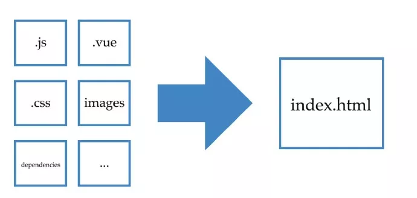

# Vue 项目架构设计与工程化实践

文中会讲述我从0~1搭建一个前后端分离的vue项目详细过程

Feature：

- 一套很实用的架构设计
- 通过 cli 工具生成新项目
- 通过 cli 工具初始化配置文件
- 编译源码与自动上传CDN
- Mock 数据
- 反向检测server api接口是否符合预期

前段时间我们导航在开发一款新的产品，名叫 快言，是一个主题词社区，具体这个产品是干什么的就不展开讲了，有兴趣的小伙伴可以点进去玩一玩~

这个项目的1.0乞丐版上线后，需要一个管理系统来管理这个产品，这个时候我手里快言项目的功能已经上线，暂时没有其他需要开发的功能，所以我跑去找我老大把后台这个项目给拿下了。

## 1. 技术选型

接到这个任务后，我首先考虑这个项目日后会变得非常复杂，功能会非常多。所以需要精心设计项目架构和开发流程，保证项目后期复杂度越来越高的时候，代码可维护性依然保持最初的状态

后台项目需要频繁的发送请求，操作dom，以及维护各种状态，所以我需要先为项目选择一款合适的mvvm框架，综合考虑最后项目框架选择使用 Vue，原因是：

- 上手简单，团队新人可以很容易就参与到这个项目中进行开发，对开发者水平要求较低（毕竟是团队项目，门槛低我觉得非常重要）
- 我个人本身对Vue还算比较熟悉，一年前2.0还没发布的时候阅读过vue 1.x的源码，对vue的原理有了解，项目开发中遇到的所有问题我都有信心能解决掉
- 调研了我们团队的成员，大部分都使用过vue，对vue多少都有过开发经验，并且之前团队内也用vue开发过一些项目

所以最终选择了Vue

## 2. 选择vue周边依赖（全家桶）

框架定了Vue 后，接下来我需要挑选一些vue套餐来帮助开发，我挑选的套餐有：

- vuex – 项目复杂后，使用vuex来管理状态必不可少
- element-ui – 基于vue2.0 的组件库，饿了么的这套组件库还挺好用的，功能也全
- vue-router – 单页应用必不可少需要使用前端路由（这种管理系统非常适合单页应用，系统经常需要频繁的切换页面，使用单页应用可以很快速的切换页面而且数据也是按需加载，不会重复加载依赖）
- axios – vue 官方推荐的http客户端
- vue-cli 的 webpack 模板，这套模板是功能最全的，有hot reload，linting，testing，css extraction 等功能

## 3. 架构设计

在开发这个项目前，我去参加了北京的首届 vueconf 大会，其中有一个主题是阴明讲的《掘金 Vue.js 2.0 后端渲染及重构实践》，讲了掘金重构后的架构设计，我觉得他们的架构设计的挺不错，所以参考掘金的架构，设计了一个更适合我们自己业务场景的架构

## 4. 整体架构图


## 5. 目录结构

```
├── README.md
├── build                   # build 脚本
├── config                  # prod/dev build config 文件
├── hera                    # 代码发布上线
├── index.html              # 最基础的网页
├── package.json
├── src                     # Vue.js 核心业务
│   ├── App.vue             # App Root Component
│   ├── api                 # 接入后端服务的基础 API
│   ├── assets              # 静态文件
│   ├── components          # 组件
│   ├── event-bus           # Event Bus 事件总线，类似 EventEmitter
│   ├── main.js             # Vue 入口文件
│   ├── router              # 路由
│   ├── service             # 服务
│   ├── store               # Vuex 状态管理
│   ├── util                # 通用 utility，directive, mixin 还有绑定到 Vue.prototype 的函数
│   └── view                # 各个页面
├── static                  # DevServer 静态文件
└── test                    # 测试
```

从目录结构上，可以发现我们的项目中没有后端代码，因为我们是纯前端工程，整个git仓库都是前端代码，包括后期发布上线都是前端项目独立上线，不依赖后端~

代码发布上线的时候会先进行编译，编译的结果是一个无任何依赖的html文件 index.html，然后把这个 index.html 发布到服务器上，在编译阶段所有的依赖，包括css，js，图片，字体等都会自动上传到cdn上，最后生成一个无任何依赖的纯html，大概是下面的样子：

```html
<!DOCTYPE html><html><head><meta charset=utf-8><title>快言管理后台</title><link rel=icon href=https://www.360.cn/favicon.ico><link href=http://s3.qhres.com/static/***.css rel=stylesheet></head><body><div id=app></div><script type=text/javascript src=http://s2.qhres.com/static/***.js></script><script type=text/javascript src=http://s8.qhres.com/static/***.js></script><script type=text/javascript src=http://s2.qhres.com/static/***.js></script></body></html>
```

### 5.1. 表现层

- store/ – Vuex 状态管理
- router/ – 前端路由
- view/ – 各个业务页面
- component/ – 通用组件

### 5.2. 业务层

- service/ – 处理服务端返回的数据（类似data format），例如 service 同时调用了不同的api，把不同的返回数据整合在一起在统一发送到 store 中

### 5.3. API 层

- api/ – 请求数据，Mock数据，反向校验后端api

### 5.4. util 层

- util/ – 存放项目全局的工具函数
- … 如果后期项目需要，例如需要写一些vue自定义的指令，可以在这个根据需要自行创建目录，也属于util层

### 5.5. 基础设施层

- init – 自动化初始化配置文件
- dev – 启动dev-server，hot-reload，http-proxy 等辅助开发
- deploy – 编译源码，静态文件上传cdn，生成html，发布上线

### 5.6. 全局事件机制

- event-bus/ – 主要用来处理特殊需求

关于这一层我想详细说一下，这一层最开始我觉得没什么用，并且这个东西很危险，新手操作不当很容易出bug，所以就没加，后来有一个需求正好用到了我才知道event-bus是用来干什么的

event-bus 我不推荐在业务中使用，在业务中使用这种全局的事件机制非常容易出bug，而且大部分需求通过vuex维护状态就能解决，那 event-bus 是用来干什么的呢？

用来处理特殊需求的，，，，那什么是特殊需求呢，我说一下我们在什么地方用到了event-bus

场景：

我们的项目是纯前端项目，又是个管理系统，所以登陆功能就比较神奇


上面是登陆的整体流程图，关于登陆前端需要做几个事情：

1. 监听所有api的响应，如果未登录后端会返回一个错误码
2. 如果后端返回一个未登录的错误码，前端需要跳转到公司统一的登陆中心去登陆，登陆成功后会跳转回当前地址并在url上携带sid
3. 监听所有路由，如果发现路由上带有sid，说明是从登陆中心跳过来的，用这个sid去请求一下用户信息
4. 登陆成功并拿到用户信息

经过上面一系列的登陆流程，最后的结果是登陆之后会拿到一个用户信息，这个获取用户信息的操作是在router里发起的执行，那么问题就来了，router中拿到了用户信息我希望把这个用户信息放到store里，因为在router中拿不到vue实例，无法直接操作vuex的方法，这个时候如果没有 event-bus 就很难操作。

所以通常 event-bus 我们都会用在表现层下面的其他层级（没有vue实例）之间通信，而且必须要很清楚自己在做什么

为什么 event-bus 很容易出问题？好像它就是一个普通的事件机制而已，为什么那么危险？

这是个好问题，我说一下我曾经遇到的一个问题。先描述一个很简单的业务场景：“进入一个页面然后加载列表，然后点击了翻页，重新拉取一下列表”

用event-bus来写的话是这样的：

```js
watch: {
    '$route' () {
        ​EventHub.$emit('word:refreshList')
    }
},
mounted () {
    EventBus.$on('word:refreshList', _ => {
        this.changeLoadingState(true)
          .then(this.fetchList)
          .then(this.changeLoadingState.bind(this, false))
          .catch(this.changeLoadingState.bind(this, false))
    })
    EventBus.$emit('word:refreshList')
}
```

watch 路由，点击翻页后触发事件重新拉取一下列表，

功能写完后测试了发现功能都好使，没什么问题就上线了

然后过了几天偶然一次发现怎么 network 里这么多重复的请求？点了一次翻页怎么发了这么多个 fetchList 的请求？？？什么情况？？？？

这里有一个新手很容易忽略的问题，即便是经验非常丰富的人也会在不注意的情况犯错，那就是生命周期不同步的问题，event-bus 的声明周期是全局的，只有在页面刷新的时候 event-bus 才会重置内部状态，而组件的声明周期相对来说就短了很多，所以上面的代码当我进入这个组件然后又销毁了这个组件然后又进入这个组件反复几次之后就会在 event-bus 中监听了很多个 word:refreshList 事件，每次触发事件实际都会有好多个函数在执行，所以才会在 network 中发现N多个相同的请求。

所以发现这个bug之后赶紧加了几行代码把这个问题修复了：

```js
destroyed () {
    EventHub.$off('word:refreshList')
}
```

自从出了这个问题之后，我就像与我一同开发后台的小伙伴说了这个事，建议所有业务需求最好不要在使用event-bus了，除非很清楚的知道自己正在干什么。

## 6. 发布上线

项目架构搭建好了之后已经可以开始写业务了，所以我每天的白天是在开发业务功能，晚上和周末的时间用来开发编译上线的功能

## 7. 编译源码

前面说了我们的项目是纯前端工程，所以期望是编译出一个无任何依赖的纯html文件



在使用 vue-cli 初始化项目的时候，官方的 webpack 模板会把webpack的配置都设置好，项目生成好了之后直接运行 npm run build 就可以编译源码，但是编译出来的html中依赖的js、css是本地的，所以我现在要做的事情就是想办法把这些编译后的静态文件上传cdn，然后把html中的本地地址替换成上传cdn之后的地址

项目是通过webpack插件 HtmlWebpackPlugin 来生成html的，所以我想这个插件应该会有接口来辅助我完成任务，所以我查看了这个插件的文档，发现这个插件会触发一些事件，我感觉这些事件应该可以帮助我完成任务，所以我写了demo来尝试一下各个事件都是干什么用的以及有什么区别，经过尝试发现了一个事件名叫 html-webpack-plugin-alter-asset-tags的事件可以帮助我完成任务，所以我写了下面这样的代码：

```js
var qcdn = require('@q/qcdn')

function CdnPlugin(options) {}

CdnPlugin.prototype.apply = function (compiler) {
  compiler.plugin('compilation', function (compilation) {
    compilation.plugin('html-webpack-plugin-alter-asset-tags', function (htmlPluginData, callback) {
      console.log('> Static file uploading cdn...')
      var bodys = htmlPluginData.body.map(upload(compilation, htmlPluginData, 'body')) var heads = htmlPluginData.head.map(upload(compilation, htmlPluginData, 'head')) Promise.all(heads.concat(bodys)).then(function (result) {
        console.log('> Static file upload cdn done!') callback(null, htmlPluginData)
      }).catch(callback)
    })
  })
}

var extMap = {
  script: {
    ext: 'js',
    src: 'src'
  },
  link: {
    ext: 'css',
    src: 'href'
  },
}

function upload(compilation, htmlPluginData, type) {
  return function (item, i) {
    if (!extMap[item.tagName]) return Promise.resolve()
    var source = compilation.assets[item.attributes[extMap[item.tagName].src].replace(/^(/) * /g,'')].source()
      return qcdn.content(source, extMap[item.tagName].ext).then(function qcdnDone(url) {
        htmlPluginData[type][i].attributes[extMap[item.tagName].src] = url
        return url
      })
    }
  }
}

module.exports = CdnPlugin
```

其实原理并不复杂，compilation.assets 里保存了文件内容，htmlPluginData 里保存了如何输出html， 所以从 compilation.assets 中读取到文件内容然后上传CDN，然后用上传后的CDN地址把htmlPluginData 中的本地地址替换掉就行了。

然后将这个插件添加到build/webpack.prod.conf.js配置文件中。

这里有个关键点是，html中的依赖和静态文件中的依赖是不同的处理方式。

什么意思呢，举个例子：

源码编译后生成了几个静态文件，把这些静态文件上传到cdn，然后用cdn地址替换掉html里的本地地址（就是上面CdnPlugin刚刚做的事情）

你以为完事了？ No！No！No！

CdnPlugin 只是把在html中引入的编译后的js，css上传了cdn，但是js，css中引入的图片或者字体等文件并没上传cdn

如果代码中引入了本地的某个图片或字体，编译后这些地址还是本地的，此时的html是有依赖的，是不纯的，如果只把html上线了，代码中依赖的这些图片和字体在服务器上找不到文件就会有问题

所以需要先把源码中依赖的静态文件（图片，字体等）上传到cdn，然后在把编译后的静态文件（js，css）上传cdn。

代码中依赖的静态文件例如图片，怎么上传cdn呢？

答案是用 loader 来实现，webpack 中的 loader 以我的理解它是一个filter，或者是中间件，总之就是 import 一个文件的时候，这个文件先通过loader 过滤一遍，把过滤后的结果返回，过滤的过程可以是 babel 这种编译代码，当然也可以是上传cdn，所以我写了下面这样的代码：

```js
var loaderUtils = require('loader-utils')
var qcdn = require('@q/qcdn')

module.exports = function (content) {
  this.cacheable && this.cacheable()
  var query = loaderUtils.getOptions(this) || {}

  if (query.disable) {
    var urlLoader = require('url-loader')
    return urlLoader.call(this, content)
  }
  var callback = this.async()
  var ext = loaderUtils.interpolateName(this, '[ext]', {
    content: content
  })

  qcdn.content(content, ext)​.then(function upload(url) {
    callback(null, 'module.exports = ' + JSON.stringify(url))
  })​.catch(callback)
}

module.exports.raw = true
```

其实就是把 content 上传CDN，然后把CDN地址抛出去

有了这个loader 之后，在 import 图片的时候，拿到的就是一个cdn的地址~

但是我不想在开发环境也上传cdn，我希望只有在生成环境才用这个loader，所以我设置了一个 disable 的选项，如果 disable 为 true，我使用 url-loader 来处理这个文件内容。

最后把loader也添加到配置文件中：

```js
rules: [
  ...,
  {
    test: /.(png|jpe?g|gif|svg)(?.*)?$/,
    loader: path.join(__dirname, 'cdn-loader'),
    options: {
      disable: !isProduction,
      limit: 10000,
      name: utils.assetsPath('img/[name].[hash:7].[ext]')
    }
  }
]
```

写好了 cdn-loader 和 cdn-plugin 之后，已经可以编译出一个无任何依赖的纯html，下一步就是把这个html文件发布上线

## 8. 发布上线

我们部门有自己的发布上线的工具叫 hera 可以把代码发布到docker机上进行编译，然后把编译后的纯html文件发布到事先配置好的服务器的指定目录中

编译的流程是先把代码发布到编译机上 -> 编译机启动 docker （docker可以保证编译环境相同） -> 在 docker 中执行 npm install 安装依赖 -> 执行 npm run build 编译 -> 把编译后的 html 发送到服务器

因为每次编译都需要安装依赖，速度非常慢，所以我们有一个 diffinstall 的逻辑，每次安装依赖都会进行一次 diff，把有缓存的直接用缓存copy到node_modules，没缓存的使用qnpm安装，之后会把这次新安装的依赖缓存一份。依赖缓存了之后每次安装依赖速度明显快了很多。

现在项目已经可以正常开发和上线啦~

## 9. api-proxy

虽然项目可以正常开发了，但我觉得还不够，我希望项目可以有 mock 数据的功能并且可以检查服务端返回的数据是否正确，可以避免因为接口返回数据不正确的问题debug好久。

所以我开发了一个简单的模块 api-proxy ，就是封装了一个http client，可以配置请求信息和Mock 规则，开启Mock的时候使用Mock规则生成Mock数据返回，不开启Mock的时候使用Mock规则来校验接口返回是否符合预期。

那么 api-proxy 怎样使用呢？

举个例子：

```
└── api
    └── log
        ├── index.js
        └── fetchLogs.js
```

```js
/*
 * /api/log/fetchLogs.js
 */
export default {
  options: {
    url: '/api/operatelog/list',
    method: 'GET'
  },
  rule: {
    'data': {
      'list|0-20': [{
        'id|3-7': '1',
        'path': '/log/opreate',
        'url': '/operate/log?id=3',
        'user': 'berwin'
      }],
      'pageData|7-8': {
        'cur': 1,
        'first': 1,
        'last': 1,
        'total_pages|0-999999': 1,
        'total_rows|0-999999': 1,
        'size|0-999999': 1
      }
    },
    'errno': 0,
    'msg': '操作日志列表'
  }
}

/*
 * /api/log/index.js
 */
import proxy from '../base.js'
import fetchLogs from './fetchLogs.js'

export default proxy.api({
  fetchLogs
})
```

使用：

```js
import log from '@/api/log'
log.fetchLogs(query).then(...)
```

考虑到特殊情况，也并不是强制必须这样使用，我还是抛出了一个 api方法来供开发者正常使用，例如：

```js
// 不使用api-proxy的api
import {
  api
} from './base'

export default {
  getUserInfo(sid) {
    return api.get('/api/user/getUserInfo', {
      params: {
        sid
      }
    })
  }
}
```

这个 api 就是 axios ，并没做什么特殊处理。

## 10. 初始化配置文件

项目开发中会用到一些配置文件，比如开发环境需要配置一个server地址用来设置api请求的server。开发环境的配置文件每个人都不一样，所以我在 .gitignore 中把这个dev.conf 屏蔽掉，并没有入到版本库中，所以就带来了一个问题，每次有新人进入到这个项目，在第一次搭建项目的时候，总是要手动创建一个 dev.conf 文件，我希望能自动创建配置文件

正巧之前我写了一个类似于 vue-cli 的工具 speike-cli，也是通过模板生成项目的一个工具，所以这一次正好派上用场，我把配置文件定义了一个模板，然后使用 speike 来生成了一个配置文件

```json
// package.json
{
    "scripts": {
        "init": "speike init ./config/init-tpl ./config/dev.conf"
    }
}
```


## 11. 初始化项目

这次该有的都有了，可以愉快的写码了，为了以后有类似的管理系统创建项目方便，我把这次精心设计的架构，编译逻辑等定制成了模板，日后可以直接使用speike 选择这个模板来生成项目。


## 12. 整理与总结

经过上面一系列做的事，最后整理一下项目工程化的生命周期


