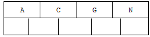
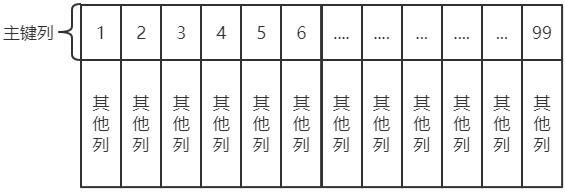

# MySQL 体系架构

## 1. 官方资料

- 下载地址：https://downloads.mysql.com/archives/community/
- 官方文档地址：
    - https://dev.mysql.com/doc/refman/5.7/en/
    - https://dev.mysql.com/doc/mysql-errors/5.7/en/

## 2. 数据库概述

### 2.1. 什么是数据库

用来存储数据的仓库

### 2.2. 存储数据的方式

- 数据存储在集合中
    - 优点：读写速度快
    - 缺点：不能永久存储
- 数据存储在文件中
    - 优点：可以永久存储
    - 缺点： 频繁的IO操作效率低，查询数据很不方便。
- 数据存储在数据库中
    - 优点：可以永久存储。查询速度快，查询数据很方便
    - 缺点：要使用SQL语言执行增删改查操作

### 2.3. 常见的数据库管理系统

- MYSQL
    - 开源免费的数据库，小型的数据库.已经被Oracle收购了.MySQL6.x版本也开始收费。
- Oracle
    - 收费的大型数据库，Oracle公司的产品。Oracle收购SUN公司，收购MYSQL。
- DB2
    - IBM公司的数据库产品,收费的。常应用在银行系统中.
- SQLServer
    - MicroSoft 公司收费的中型的数据库。C#、.net等语言常使用。
- SyBase
    - 已经淡出历史舞台。提供了一个非常专业数据建模的工具PowerDesigner。
- SQLite
    - 嵌入式的小型数据库，应用在手机端。

- Java相关的数据库：MYSQL，Oracle。
- 这里使用MySQL数据库。MySQL中可以有多个数据库，数据库是真正存储数据的地方。

## 3. SQL 的概念

- 结构化查询语言(Structured Query Language)简称 SQL，是一种数据库查询语言。
- 作用：用于存取数据、查询、更新和管理关系数据库系统。
- 关系型数据库：使用表格存储数据的数据库

### 3.1. 数据库服务器、数据库和表的关系

**一般在实际开发中，一个项目就对应一个数据库**

所谓数据库服务器，是指在机器上装了一个数据库管理程序，这个管理程序可以管理多个数据库，一般开发人员会针对每一个应用创建一个数据库。为保存应用中实体的数据，一般会在数据库创建多个表，以保存程序中实体的数据。

### 3.2. MySQL 数据库创建顺序与管理

- 创建的顺序
	- 创建数据库 --> 创建数据表 --> 存储数据
	- 一个数据库包含多个数据表
- 通过 SQL 语句对数据库(如：MySQL)进行管理。

### 3.3. 实体类与表的对应关系

1. 整个数据表可以看作为一个类
2. 数据表中的每一列代表具体类一个成员变量
3. 数据表的一行称之为一条纪录，对应一个类的对象

### 3.4. 数据库中的主要对象

1. 表(Table)：在数据库中存储数据记录的容器，一个表中包含多行数据记录。
2. 视图(View)：是从一个或多个表导出的虚拟表，视图本身并不存储数据。
3. 索引(index)：是对数据库表中一列或多列的值进行排序的一种结构，使用索引可快速访问数据库表中的特定信息，类似于书籍的目录。
4. 存储过程(Procedure)：一组为了完成特定功能的 SQL 语句集，存储在数据库中，经过第一次编译后再次调用不需要再次编译，用户通过指定存储过程的名字并给出参数来执行它。
5. 触发器(Trigger)：触发器是一种特殊类型的存储过程，它在指定的表中的数据发生变化时自动生效。唤醒调用触发器以响应 INSERT、UPDATE 或 DELETE 语句。

### 3.5. SQL 语言的分类

#### 3.5.1. 数据定义语言：简称DDL(Data Definition Language)

- 用来创建，修改，删除数据库中的各种对象：数据库，表，列等。
- 【关键字】创建：`create`，更改：`alter`，移除：`drop`等

#### 3.5.2. 数据操作语言：简称DML(Data Manipulation Language)

- 用来修改、删除、添加数据的语句。
- 【关键字】插入：`insert`、删除：`delete`、更新：`update`

#### 3.5.3. 数据控制语言：简称DCL(Data Control Language)

- 用来创建用户，分配用户权限、删除用户的语句，数据库的访问权限和安全级别。
- 【包含两条命令】`grant`：授权；`revoke`：撒回

#### 3.5.4. 数据查询语言：简称DQL(Data Query Language)

- 用来执行查询操作的语句。
- 【关键字】`select`，`show`，`from`，`where`等

## 4. MySQL 体系架构


从上图可以看出，MySQL 最上层是连接组件。<font color=red>**服务器层是由连接池、管理工具和服务、SQL 接口、解析器、优化器、缓存、存储引擎、文件系统组成**</font>

- 连接池：由于每次建立建立需要消耗很多时间，连接池的作用就是将这些连接缓存下来，下次可以直接用已经建立好的连接，提升服务器性能。
- 管理工具和服务：系统管理和控制工具，例如备份恢复、Mysql 复制、集群等
- SQL 接口：接受用户的 SQL 命令，并且返回用户需要查询的结果。比如 `select from xx` 语句就是调用 SQL Interface
- 解析器: SQL 命令传递到解析器的时候会被解析器验证和解析。解析器主要功能：
    - 将 SQL 语句分解成数据结构，并将这个结构传递到后续步骤，以后 SQL 语句的传递和处理就是基于这个结构的
    - 如果在分解构成中遇到错误，那么就说明这个 sql 语句是不合理的
- 优化器：查询优化器，SQL 语句在查询之前会使用查询优化器对查询进行优化
- 缓存器：查询缓存，如果查询缓存有命中的查询结果，查询语句就可以直接去查询缓存中取数据。这个缓存机制是由一系列小缓存组成的。比如表缓存，记录缓存，key 缓存，权限缓存等。
- 存储引擎：存储引擎是底层物理结构和实际文件读写的实现。MySQL 数据库其中一个特点就是其**插件式的表存储引擎**。
- 文件系统：即存储数据的地方

### 4.1. 连接层（待补充）


### 4.2. Server 层(SQL 处理层)（待补充）


### 4.3. 存储引擎层（待补充）

<font color=red>**需要注意的点：在MySQL中，存储引擎是针对表！！官方建议在同一个数据库中，尽量所有表都使用同一个存储引擎，否则会出现一些奇怪的问题。**</font>

## 5. 启动选项和参数

### 5.1. 配置参数文件

当 MySQL 实例启动时，数据库会先去读一个配置参数文件，用来寻找数据库的各种文件所在位置以及指定某些初始化参数。在默认情况下，MySQL 实例会在按一定的顺序中的指定位置读取配置，用户只需通过命令即可查看到相应的配置位置读取顺序。

```bash
mysql --help | grep my.cnf
```


> <font color=red>**注：都是后面配置文件中的配置项会覆盖前面配置文件中的相同的配置项**</font>

MySQL 实例可以不需要参数文件，这时所有的参数值取决于编译 MySQL 时指定的默认值和源代码中指定参数的默认值。MySQL 数据库的参数文件是以文本方式进行存储的。通过文本编辑软件即可进行参数的修改

### 5.2. 参数的查看和修改

在命令行中输入以下命令可查看数据库中的所有参数。

```sql
-- 查询数据库中的所有参数
SHOW VARIABLES;

-- 模糊查询数据库参数
SHOW VARIABLES LIKE '%xxx%';
```

> 从 MySQL 5.1 版本开始，还可以通过 information_schema 架构下的 `GLOBAL_VARIABLES` 视图来进行查找，推荐使用命令`show variables`，使用更为简单，且各版本的 MySQL 数据库都支持。

#### 5.2.1. MySQL 数据库中的参数的分类

从不同的角度来说，主要分成两类

- 从类型上：动态(dynamic)参数和静态(static)参数
    - 动态参数意味着可以在 MySQL 实例运行中进行更改
    - 静态参数说明在整个实例生命周期内都不得进行更改，即只读(read only)
- 从作用范围上：全局变量(GLOBAL)和会话变量(SESSION/LOCAL)
    - 全局变量（GLOBAL）影响服务器的整体操作。
    - 会话变量（SESSION/LOCAL）影响某个客户端连接的操作。

用 default_storage_engine 来作为示例说明，在服务器启动时会初始化一个名为 default_storage_engine，作用范围为 `GLOBAL` 的系统变量。之后每当有一个客户端连接到该服务器时，服务器都会单独为该客户端分配一个名为`default_storage_engine`，作用范围为`SESSION`的系统变量，该作用范围为`SESSION`的系统变量值按照当前作用范围为`GLOBAL`的同名系统变量值进行初始化。

#### 5.2.2. 动态参数值的修改

通过 `SET` 命令对动态的参数值进行修改。语法如下：

```bash
SET [global | session ] system_var_name= expr
SET [@@global. | @@session.] system_var_name= expr
```

示例：

```bash
SET read_ buffer_size=524288;
SET @@global.read_ buffer_size=524288;
```

### 5.3. MySQL官方手册（系统参数部分）

网址（5.7版本）：https://dev.mysql.com/doc/refman/5.7/en/server-system-variables.html

## 6. MySQL 数据目录结构分析

像 InnoDB、MyIASM 这样的存储引擎都是把表存储在磁盘上。

### 6.1. 数据目录的位置

通过以下命令可以查看当前MySql的存储数据的目录位置

```sql
-- 查询数据库的数据目录
show variables like 'datadir';
```


这个目录位置可以通过配置文件进行修改。

### 6.2. 数据目录的文件

**数据目录中包含创建的数据库、表、视图和触发器等用户数据**，除了这些用户数据，为了程序更好的运行，MySQL 也会创建一些其他的额外数据

#### 6.2.1. 数据库的存储

在使用 `CREATE DATABASE` 语句创建一个数据库时，MySQL会进行以下的处理：

1. 在数据目录下创建一个和数据库名同名的子目录（文件夹)
2. 在该与数据库名同名的子目录下创建一个名为`db.opt`的文件，这个文件中包含了该数据库的各种属性，例如该数据库的字符集和比较规则等等。


进入`datadir`数据目录查看，除了 `information_schema` 这个系统数据库（*比较特殊*）外，其他的数据库在数据目录下都有对应的子目录。

#### 6.2.2. 表的存储

MySQL数据库表的信息可以分成：

1. **表结构的定义**：是定义了表每列的数据类型、约束条件、索引、字符集等等信息。InnoDB 和 MyIASM 这两种存储引擎都在数据目录下对应的数据库子目录下创建了一个专门用于存储描述表结构信息的文件，其文件名是：`表名.frm`
2. **表中的数据**：就是实际每个表的存储的数据。而不同的存储引擎保存的文件格式、数量也不一样。

#### 6.2.3. InnoDB 表数据的存储

InnoDB 的数据会放在一个表空间或者文件空间（英文名: table space 或者 filespace)的概念，这个表空间是一个抽象的概念，它可以对应文件系统上一个或多个真实文件〈不同表空间对应的文件数量可能不同)。每一个表空间可以被划分为很多个页，表数据就存放在某个表空间下的某些页里。表空间有好几种类型。

- **系统表空间(system tablespace)**

系统表空间可以对应文件系统上一个或多个实际的文件，默认情况下，InnoDB 会在数据目录下创建一个名为 ibdata1(在数据目录下)、大小为 12M 的文件，这个文件就是对应的系纳表空间在文件系统上的表示。


此文件是自扩展文件，即存储空间不够用时，它会自己增加文件大小。如果想让系统表空间对应文件系统上多个实际文件，可以在 MySQL 启动时配置对应的文件路径以及它们的大小，也可以把系统表空间对应的文件路径不配置到数据目录下，甚至可以配置到单独的磁盘分区上

<font color=red>**需要注意的一点是：在一个 MySQL 服务器中，系统表空间只有一份。从 MySQL5.5.7 到 MySQL5.6.6 之间的各个版本中，表中的数据都会被默认存储到这个系统表空间。**</font>

- **独立表空间(file-per-table tablespace)**

在 MySQL5.6.6 以及之后的版本中，InnoB 并不会默认的把各个表的数据存储到系统表空间中，而是为<font color=red>**每一个表建立一个独立表空间**</font>，也就是说用户创建了多少个表，就有多少个独立表空间。

使用独立表空间来存储表数据的话，会在该表所属数据库对应的子目录下创建一个表示该独立表空间的文件，文件名和表名相同，文件的扩展名是`.ibd`，即：`表名.ibd`


如上例，`consult_content.ibd`文件就用来存储`consult_content`表中的数据和索引。也可以指定使用系统表空间还是独立表空间来存储数据，这个功能由启动参数`innodb_file_per_table`控制。配置示例如下：

```
[server]
innodb_file_per_table=0
```

上面的配置意思是：当`imodb_file_per table`的值为0时，代表使用系统表空间；当`innodb_file pertable`的值为1时，代表使用独立表空间。需要注意的是`inmodb_file_per_table`参数只对新建的表起作用，对于已经分配了表空间的表并不起作用。

- **其他类型的表空间**

随着 MySQL 的发展，除了上述两种老牌表空间之外，现在还新提出了一些不同类型的表空间，比如通用表空间(general tablespace)，undo 表空间(undotablespace)、临时表空间（temporary tablespace)等。

#### 6.2.4. MyIASM 表数据的存储

在 MyISAM 存储引擎表中的数据和索引是分开存放的。所以在文件系统中也是使用不同的文件来存储数据文件和索引文件。与 InnoDB 不同的是，MyISAM 并没有表空间的概念，表数据都存放到对应的数据库子目录下。

```sql
-- 创建不同的是，MyISAM的表
create table a_myisam(c1 int) engine=MyISAM;
```


如上例所示：`a_myisam.MYD`是表的数据文件；`a_myisam.MYI`是表的索引文件。

### 6.3. 日志文件

服务器运行过程中，会产生各种各样的日志，比如常规的查询日志、错误日志、二进制日志、redo日志、Undo日志等等，日志文件记录了影响 MySQL 数据库的各种类型活动。

MySQL常见的日志文件有：错误日志（error log）、慢查询日志（slow query log）、查询日志（query log）、二进制文件（bin log）。

#### 6.3.1. 错误日志

错误日志文件对 MySQL 的启动、运行、关闭过程进行了记录。遇到问题时应该首先查看该文件以便定位问题。该文件不仅记录了所有的错误信息，也记录一些警告信息或正确的信息。通过下面命令来查看错误日志文件的位置：

```sql
show variables like 'log_error';
```

日志文件名称：`主机名.err`

> 当 MySQL 不能正常启动时，第一个必须查找的文件应该就是错误日志文件

#### 6.3.2. 慢查询日志

慢查询日志可以帮助定位可能存在问题的 SQL 语句，从而进行 SQL 语句层面的优化。

日志文件名称：`主机名-slow.log`

#### 6.3.3. 查询日志

查询日志记录了所有对 MySQL 数据库请求的信息，无论这些请求是否正确的执行。

日志文件名称：`主机名.log`

从 MySQL 5.1 开始，可以将查询日志的记录放入 mysql 架构下的 `general_log` 表中

```sql
SELECT * FROM general_log;
```

#### 6.3.4. 二进制日志（binlog）

二进制日志记录了对 MySQL 数据库执行更改的所有操作，若操作本身没有导致数据库发生变化，该操作可能也会写入二进制文件。但是不包括 `select` 和 `show` 这类操作（因为这些操作对数据本身不会进行修改）

##### 6.3.4.1. 二进制日志的几种作用

- 恢复（recovery）：某些数据的恢复需要二进制日志，例如，在一个数据库全备文件恢复后，用户可以通过二进制文件进行 point-in-time 的恢复
- 复制（replication）：其原理与恢复类似，通过复制和执行二进制日志使一台远程的 MySQL 数据库（一般称为 slave 或 standby）与一台 MySQL 数据库（一般称为 master 或 primary）进行实时同步
- 审计（audit）：用户可以通过二进制日志中的信息来进行审计，判断是否有对数据库进行注入的攻击

##### 6.3.4.2. log-bin 参数

该参数用来控制是否开启二进制日志，默认为关闭。如果想要开启二进制日志的功能，可以在 MySQL 的配置文件中指定如下的格式：

```
-- 启用/设置二进制日志文件(name 可省略)
log-bin=name;
```

> 配置说明：
>
> “name”为二进制日志文件的名称。如果不提供 name，那么数据库会使用默认的日志文件名（文件名为主机名，后缀名为二进制日志的序列号），且文件保存在数据库所在的目录（datadir下）

配置以后，就会在数据目录下产生类似于：

bin_log.00001 即为二进制日志文件；bin_log.index 为二进制的索引文件，用来存储过往产生的二进制日志序号，通常情况下，不建议手动修改这个文件。

二进制日志文件在默认情况下并没有启动，需要手动指定参数来启动。开启这个选项会对 MySQL 的性能造成影响，但是性能损失十分有限。根据 MySQL 官方手册中的测试指明，开启二进制日志会使性能下降 1%。

### 6.4. 其他数据文件

MySQL数据目录除了以上的数据文件之外，还有运行程序的额外文件。*这些额外的文件可以在配置文件或者启动时另外指定存放目录*。主要包括这几种类型的文件：

- **服务器进程文件**：每运行一个 MySQL 服务器程序，都意味着启动一个进程。MySQL 服务器会把自己的进程 ID 写入到一个 pid 文件中。
- **socket文件**
- **默认/自动生成的 SSL 和 RSA 证书和密钥文件**


## 7. MySQL 中的系统库（了解扩展）（补充中...）

### 7.1. 系统库简介

MySQL 有几个系统数据库，这几个数据库包含了 MySQL 服务器运行过程中所需的一些信息以及一些运行状态信息

- **performance_schema**

这个数据库里主要保存 MySQL 服务器运行过程中的一些状态信息，算是对MySQL 服务器的一个性能监控。包括统计最近执行了哪些语句，在执行过程的每个阶段都花费了多长时间，内存的使用情况等等信息。

- **sys**

这个数据库主要是通过视图的形式把 information_schema 和 performance_schema 结合起来，让程序员可以更方便的了解 MySQL 服务器的一些性能信息。

- **information_schema**

这个数据库保存着 MySQL 服务器维护的所有其他数据库的信息，比如有哪些表、哪些视图、哪些触发器、哪些列、哪些索引。这些信息并不是真实的用户数据，而是一些描述性信息，有时候也称之为元数据。

- **mysql**

这个数据库核心，它存储了 MySQL 的用户账户和权限信息，一些存储过程、事件的定义信息，一些运行过程中产生的日志信息，一些帮助信息以及时区信息等。

#### 7.1.1. performance_schema 系统库

##### 7.1.1.1. 简介

MySQL 的 `performance_schema` 系统库是运行在较低级别的用于监控 MySQL Server 运行过程中的资源消耗、资源等待等情况的一个功能特性，有以下的特点：

- 

#### 7.1.2. sys 系统库


#### 7.1.3. information_schema 系统库


#### 7.1.4. mysql 系统库（名称为mysql）


# MySQL 数据库基础操作笔记

## 1. SQL 语句

### 1.1. MySQL 中的数据类型

详细的数据类型如下(了解，红色字体为常用数据类型)

<table>
  <tr>
    <th>分类</th>
    <th>类型名称</th>
    <th>说明</th>
  </tr>
  <tr>
    <td rowspan="5">整数类型</td>
    <td>tinyInt</td>
    <td>很小的整数（微整型占1字节），默认长度4</td>
  </tr>
  <tr>
    <td>smallint</td>
    <td>小的整型（占2字节），默认长度6</td>
  </tr>
  <tr>
    <td>mediumint</td>
    <td>中等大小的整数，默认长度9</td>
  </tr>
  <tr style="font-weight:bolder; color: red;">
    <td>int(integer)</td>
    <td>普通大小的整数（占4字节），默认长度11</td>
  </tr>
  <tr style="font-weight:bolder; color: red;">
    <td>bigint</td>
    <td>占用的8个字节，默认长度20</td>
  </tr>
  <tr>
    <td rowspan="3">小数类型</td>
    <td>float(m,d)</td>
    <td>单精度浮点型小数</td>
  </tr>
  <tr style="font-weight:bolder; color: red;">
    <td>double(m,d)</td>
    <td>双精度浮点型小数 d代表小数位数，m代表总位数 (整数位=m-d);<br/> 比如：DOUBLE(5.2)， 数值共5位，其中小数为2位。</td>
  </tr>
  <tr>
    <td>decimal(m,d）</td>
    <td>压缩严格的定点数，取值范围与double相同，但有效取值范围由M与D决定</td>
  </tr>
  <tr>
    <td rowspan="5">日期类型</td>
    <td>year</td>
    <td>YYYY 1901~2155</td>
  </tr>
  <tr>
    <td>time</td>
    <td>HH:MM:SS -838:59:59~838:59:59</td>
  </tr>
  <tr style="font-weight:bolder; color: red;">
    <td>date</td>
    <td>YYYY-MM-DD 1000-01-01~9999-12-3(只有年月日，没有时分秒)</td>
  </tr>
  <tr>
    <td>datetime</td>
    <td>YYYY-MM-DD HH:MM:SS 1000-01-01 00:00:00~ 9999-12-31 23:59:59</td>
  </tr>
  <tr>
    <td>timestamp</td>
    <td>YYYY-MM-DD HH:MM:SS 1970~01~01 00:00:01 UTC~2038-01-19 03:14:07UTC</td>
  </tr>
  <tr>
    <td>boolean类型</td>
    <td>boolean</td>
    <td>MYSQL保存BOOLEAN值时用1代表TRUE,0代表FALSE，boolean在MySQL里的类型为tinyint(1)</td>
  </tr>
  <tr>
    <td rowspan="12">文本、二进制类型</td>
    <td>CHAR(M)</td>
    <td>M为0~255之间的整数。CHAR(x),定长的字符串</td>
  </tr>
  <tr style="font-weight:bolder; color: red;">
    <td>VARCHAR(M)</td>
    <td>M为0~65535之间的整数。VARCHAR(x),可变长的字符串，注意数据不能超过X位数，</td>
  </tr>
  <tr>
    <td>TINYBLOB</td>
    <td>1个字节，取值：0-255</td>
  </tr>
  <tr style="font-weight:bolder; color: red;">
    <td>BLOB</td>
    <td>2个字节，取值：0-65535。二进制大对象。（图片、视频、音频）</td>
  </tr>
  <tr>
    <td>MEDIUMBLOB</td>
    <td>3个字节，取值：0-16M</td>
  </tr>
  <tr>
    <td>LONGBLOB</td>
    <td>4个字节，取值：0-4G</td>
  </tr>
  <tr>
    <td>TINYTEXT</td>
    <td>1个字节，取值：0-255</td>
  </tr>
  <tr>
    <td>TEXT</td>
    <td>2个字节，取值：0-65535</td>
  </tr>
  <tr>
    <td>MEDIUMTEXT</td>
    <td>3个字节，取值：0-16M</td>
  </tr>
  <tr>
    <td>LONGTEXT</td>
    <td>4个字节，取值：0-4G</td>
  </tr>
  <tr>
    <td>VARBINARY(M)</td>
    <td>允许长度0~M个字节的变长字节字符串</td>
  </tr>
  <tr>
    <td>BINARY(M)</td>
    <td>允许长度0~M个字节的定长字节字符串</td>
  </tr>
</table>

> 注：
>
> 1. char、varchar和text等字符串类型都可以存储路径，但使用“\”会被过滤，所以路径中用“/”或“\\”来代替，MySQL就会不会自动过滤路径的分隔字符，完整的表示路径  
> 2. 一般情况下，数据库中不直接存储图片和音频文件，而是存储图片与文件的路径。如果存储文件，则选择blob类型

### 1.2. 关于 Null 类型的特别说明

MySQL对Null值的处理，有以下三种：

1. NULL 值代表一个未确定的值，每个null都是独一无二。MySQL 认为任何和 NULL 值做比较的表达式的值都为 NULL，包括 `select null = null` 和 `select null != null;`


2. NULL 值在业务上就是代表没有，所有的 NULL 值和起来算一份
3. NULL 完全没有意义，所以在统计数量不会将其算进去

> 假设一个表中某个列 c1 的记录为(2, 1000, null, null)，在第一种情况下，表中 c1 的记录数为4，第二种表中 c1 的记录数为3，第三种表中 c1 的记录数为2。

MySQL 专门提供了一个 `innodb_stats_method` 的系统变量，专门针对统计索引列不重复值的数量时如何对待 NULL 值。此系统变量有三个候选值：

- `nulls_equal`：认为所有 NULL 值都是相等的。这个值也是 `innodb_stats_method` 的默认值。如果某个索引列中 NULL 值特别多的话，这种统计方式会让优化器认为某个列中平均一个值重复次数特别多，所以倾向于不使用索引进行访问。
- `nulls_unequal`：认为所有 NULL 值都是不相等的。如果某个索引列中 NULL 值特别多的话，这种统计方式会让优化器认为某个列中平均一个值重复次数特别少，所以倾向于使用索引进行访问。
- `nulls_ignored`：直接把 NULL 值忽略掉。

> 详见官网：https://dev.mysql.com/doc/refman/5.7/en/innodb-parameters.html#sysvar_innodb_stats_method
>
> 有迹象表明，在 MySQL5.7.22 以后的版本，对这个`innodb_stats_method`的修改不起作用，MySQL 把这个值在代码里写死为`nulls_equal`。也就是说 MySQL在进行索引列的数据统计行为又把 null 视为第二种情况（NULL 值在业务上就是代表没有，所有的 NULL 值和起来算一份），MySQL 对 Null 值的处理比较飘忽。所以总的来说，对于列的声明尽可能的不要允许为null。

### 1.3. MySQL 中的三种注释

- 单行注释
    - 格式：`# 注释内容` (MySQL特有)
    - 格式：`-- 注释内容` （所有数据库共有的）
- 多行注释
    - 格式：`/* 注释内容 */`

## 2. MySQL 数据库的管理

### 2.1. 查看数据库

#### 2.1.1. 查看数据库命令

```sql
show databases;
```

- 查看所有数据库信息，分号结束。sql 语句就会发送给 MySQL 服务器端执行

```sql
show create database 数据库名;
```

- 查看某个数据库在定义时的信息
- eg: `show create database day21_1;`

#### 2.1.2. mysql默认4个初始数据库的作用

- 【information_schema】：MySQL 元数据，一些基础的数据。
- 【MySQL】：MySQL 配置数据库，配置信息。其中 user 表用于管理 MySQL 用户和密码、权限信息。
- 【performance_schema】：MySQL 性能监控信息数据库，如：每条语句的执行情况。
- 【test】：测试数据库。

### 2.2. 创建数据库

```sql
create database 数据库名;
```
- 使用默认的字符集创建数据库
- 创建数据库，数据库中数据的编码采用的是**安装数据库时指定的默认编码UTF-8**
- eg: `create database db1;`

```sql
create database 数据库名 default character set 字符集;
```

- 使用指定字符创建数据库;
- eg: `create database db2 default character set utf8;` (**注意：不是utf-8**)

### 2.3. 删除数据库

```sql
drop database 数据库名;
```

- eg：`drop database day21_2;`

**注：删除没有确认信息，做删除处理时需要小心**

### 2.4. 修改数据库默认字符集

```sql
alter database 数据库名 default character set 字符集;
```

- 修改数据库默认字符集

### 2.5. 查看正在使用的数据库

```sql
select database();
```

- 查看正在使用的数据库(这个命令一般在DOS下操作才需要使用)

### 2.6. 校对规则（了解）

- character set：指定数据库默认的字符集
- collate：校对规则

**什么是校对规则(比较和排序规则)？**

它是一组规则，负责决定某一字符集下的字符进行比较和排序的结果。如：a,B,c,D，如果使用 utf-8 的编码，按照普通的字母顺序，而且不区分大小写。如果想使用字母的二进制比较和排序，则可以修改它的校对规则。

> - utf8_general_ci：按照普通的字母顺序，而且不区分大小写（比如：a B c D）
> - utf8_bin：按照二进制排序（比如：A 排在 a 前面，B D a c）

**查看字符集和校对规则:**

> 注意：SQL 语句中的字符串一般都是单引号括起。
> 
> - `show character set;`
> - `show collation like 'utf8\_%';` -- 显示所有 utf-8
> - `show collation like 'gbk%';` -- 显示所有 GBK

指定数据库的默认字符集为 gbk 和校对规则 gbk_chinese_ci

> eg: `create database db4 default character set gbk collate gbk_chinese_ci;`

## 3. MySQL 表的管理
### 3.1. 查看表结构
#### 3.1.1. 选择操作的数据库

- 语法：`use 数据库名;`
- 作用：选择数据库

#### 3.1.2. 查看数据库所有表格清单

- 语法：`show tables;`
- 作用：查看当前数据库中的所有表，显示表格的清单

#### 3.1.3. 查看数据库指定表格

- 语法：`show create table 表名;`
- 作用：以sql格式返回，查看指定表格的结构


- 语法：`desc 表名;`
- 作用：以表格格式返回，查看指定表格的结构


#### 3.1.4. 查询当前数据库的引擎

- 语法：`show table status from 查询的数据库名称;`
- 作用：查询当前数据库下所有表的状态与信息，包括表的引擎（Enginez）

### 3.2. 创建表

**创建表格式**

```sql
create table 表名(
	字段名 数据类型(长度) [完整性约束条件],
	……………
	列名n 数据类型(长度) 约束
	[UNIQUE | FULLTEXT | SPATIAL] INDEX | KEY [索引名](字段名1 [(长度)] [ASC | DESC])
);
-- 注：最后一个定义属性后不能有“,”

-- ************************
UNIQUE：可选。表示索引为唯一性索引。
FULLTEXT；可选。表示索引为全文索引。
SPATIAL：可选。表示索引为空间索引。
	如果不指定索引类型，则为普通索引
INDEX和KEY：用于指定字段为索引，两者选择其中之一就可以了，作用是一样的。
索引名：可选。给创建的索引取一个新名称。
字段名1：指定索引对应的字段的名称，该字段必须是前面定义好的字段。
长度：可选。指索引的长度，必须是字符串类型才可以使用。
ASC：可选。表示升序排列。
DESC：可选。表示降序排列。
```

例：

```sql
-- 创建分类表
CREATE TABLE sort (
	sid INT,            -- 分类ID
	sname VARCHAR(100)  -- 分类名称
);
```

**关于整型长度的说明**

如果在建表时不指定字段 int 类型的长度时，系统则默认生成长度为 11 的字段。11 也是 int 类型的最大长度，其中第一位表示符号+或者-，后面十位表示数字。 如果指定了长度，该字段其实也是长度为 11 的字段，因为只要是 int 类型，系统都分配了长度 11 位。**在插入数据时，只要不超出int类型的最大范围即可**

### 3.3. 复制表

- `create table 新表名 like 旧表名;`
    - 创建一个新表，复制旧表的结构(**没有内容，只有表结构**)

<font color="purple">使用子查询可以复制整个表</font>

- `create table 新表名 as (select * from 要复制的表名);`

### 3.4. 删除表

- `drop table 表名1,表名2,表名3,……;`
    - 删除一个表格
    - eg: `drop table sort;`
    - 删除多个表格，用逗号分隔可以删除多张表
    - eg: `drop table s1, s2, s3;`

### 3.5. 修改表

#### 3.5.1. 添加字段 add

- `alter table 表名 add字段名1 数据类型(长度) 约束, add 字段名2数据类型(长度) 约束, ……;`
    - 给指定表格添加一个字段
    - eg: `alter table student add gender varchar(2);`
    - 给指定表格添加多个字段，**每个字段都需要有add**
    - eg: `alter table student add a int, add b int;`

#### 3.5.2. 修改字段类型(长度)或约束 modify

- `alter table 表名 modify 字段名 修改后的类型(长度) 约束;`
    - 修改指定表格中的指定字段的类型(长度)或约束
    - eg: atler table student modify gender varchar(2);
			ALTER TABLE sort MODIFY sname VARCHAR(50) NOT NULL;添加约束

#### 3.5.3. 修改字段名称 change

- `alter table 表名 change 旧字段名 新字段名 类型(长度) 约束;`
    - 将指定表格中的旧字段名改成新字段名，类型(长度)可变，约束可变
    - eg: `alter table student change gender sex varchar(2);`

#### 3.5.4. 删除字段 drop

- `alter table 表名 drop 字段名1, drop 字段名2,……;`
    - 删除指定表格中的字段（**可以多个，每个字段前都要加drop**）
    - eg: `alter table student drop a, drop b;`

#### 3.5.5. 修改表名 rename

- 格式1：`alter table 旧表名 rename 新表名;`
    - 将指定的表格名称修改成新表格名称
    - eg: `alter table student rename stu;`
- 格式2：`rename table 旧表名 to 新表名;`
    - eg: `rename table sutdent to stu;`

#### 3.5.6. 修改表的字符集

- 修改指定表格的字符集

```sql
alter table 表名 character set 新字符集;
```

- 示例：

```sql
alter table student character set gbk;
```

#### 3.5.7. 表建立索引

- 给指定的表建立索引

```sql
alter table 表名 add index(字段名);
```

## 4. MySQL 数据的管理与操作

### 4.1. 插入数据 insert

#### 4.1.1. 插入所有列

- `insert into 表名 values (值1, 值2, 值3 ……), (值1, 值2, 值3 ……), (值1, 值2, 值3 ……)……;`
    - 向表中插入所有列
    - eg: `INSERT [INTO] student VALUES(1,’NewBoy’,20,'广州人','男');`、
    - 注：上面的`INTO`可以省略，也可以一次向表中插多个所有列。

- **注意事项：**
    1. 插入的数据应与字段的数据类型相同
    2. 数据的大小应在列的规定范围内，例如：不能将一个长度为 80 的字符串加入到长度为 40 的列中。
    3. 在 values 中列出的数据位置必须与被加入的列的排列位置相对应。
    4. **字符和日期型数据应包含在单引号中。双引号也可以但不推荐**。
    5. 不指定列或使用 null，表示插入空值。

#### 4.1.2. 插入部分列

- `insert into 表 (列名1,列名2,列名3..) values (值1,值2,值3..), (值1,值2,值3..),……;`
    - 向表中插入某些列，也可以一次插入多个列
    - eg: `INSERT INTO student(id,NAME,age,remark) VALUES(3,'jacky',27,'佛山人');`
    - 注意事项：**列名和值的顺序、数量、数据类型要保持一致**

### 4.2. insert 高级插入数据语法
#### 4.2.1. `INSERT ... ON DUPLICATE KEY` 数据存在时更新操作，不存在时进行插入操作

`INSERT ... ON DUPLICATE KEY UPDATE`这个语法的目的是为了解决重复性，当数据库中存在某个记录时，执行这条语句会更新它，而不存在这条记录时，会插入它。

相当于先判断一条记录是否存在，存在则`update`，否则`insert`。其全语法是：

`INSERT INTO tablename(field1,field2, field3, ...) VALUES(value1, value2, value3, ...) ON DUPLICATE KEY UPDATE field1=value1,field2=value2, field3=value3, ...;`

*注：tablename是表名，field1，field2，field3等是字段名称，value1，value2，value3等是字段值。*

- 问题：这条语句判断该条记录是否存在的标准是什么？
- 规则：*如果你插入的记录导致一个UNIQUE索引或者primary key(主键)出现重复，那么就会认为该条记录存在，则执行update语句而不是insert语句，反之，则执行insert语句而不是更新语句。所以`ON DUPLICATE KEY UPDATE`是不能写where条件的*

特别需要注意的是：**如果行作为新记录被插入，则受影响行的值为1；如果原有的记录被更新，则受影响行的值为2，如果更新的数据和已有的数据一模一样，则受影响的行数是0，这意味着不会去更新，也就是说即使插入的表有的时间戳是自动记录最后一次的更新时间，这个时间戳也不会变动。**

例：

```sql
CREATE TABLE `t_stock_chg` (
	`f_market` varchar(64) NOT NULL COMMENT '市场',
	`f_stockID` varchar(10) NOT NULL DEFAULT '' COMMENT '股票代码',
	`f_updatetime` timestamp NOT NULL DEFAULT CURRENT_TIMESTAMP ON UPDATE CURRENT_TIMESTAMP COMMENT '插入时间戳',
	`f_name` varchar(16) DEFAULT NULL COMMENT '股票名称',
	PRIMARY KEY (`f_market`,`f_stockID`)
) ENGINE=InnoDB DEFAULT CHARSET=utf8
```

*注：这里的字段f_updatetime每次在更新数据时会自动更新，但是如果记录中存在某条数据，后来又更新它，而更新的数据和原数据一模一样，那么这个字段也不会更新，仍然是上一次的时间。此时`INSERT ... ON DUPLICATE KEY UPDATE`影响行数是0*。

#### 4.2.2. replace into 插入数据

`replace into` 跟 `insert` 功能类似，不同点在于：`replace into`首先尝试插入数据到表中

1. 如果发现表中已经有此行数据（根据主键或者唯一索引判断）则先删除此行数据，然后插入新的数据。
2. 如果表中没有此行数据，直接插入新数据。

要注意的是：**插入数据的表必须有主键或者是唯一索引！**否则的话，`replace into`会直接插入数据，这将导致表中出现重复的数据。

MySQL replace into 有三种形式：

1. `replace into tbl_name(col_name, ...) values(...)`
	- 第一种形式类似于insert into的用法
2. `replace into tbl_name(col_name, ...) select ...`
	- 第二种replace select的用法也类似于insert select，这种用法并不一定要求列名匹配，事实上，MYSQL甚至不关心select返回的列名，它需要的是列的位置。例如，`replace into tb1(name, title, mood) select rname, rtitle, rmood from tb2;`
	- 这个例子使用replace into从tb2中将所有数据导入tb1中
3. `replace into tbl_name set col_name=value, ...`
	- 第三种replace set用法类似于update set用法，使用一个例如“`SET col_name = col_name + 1`”的赋值，则对位于右侧的列名称的引用会被作为`DEFAULT(col_name)`处理。因此，该赋值相当于`SET col_name = DEFAULT(col_name) + 1`。

前两种形式用的多些。其中“into”关键字可以省略，不过最好加上“into”，这样意思更加直观。另外，对于那些没有给予值的列，MySQL将自动为这些列赋上默认值。

#### 4.2.3. insert ignore into 插入数据

`INSERT IGNORE` 与 `INSERT INTO` 的区别就是`INSERT IGNORE`会忽略数据库中已经存在的数据，如果数据库没有数据，就插入新的数据；如果有数据的话就跳过这条数据（即执行这条插入语句时不会报错，只有警告，数据实际没有插入）。这样就可以保留数据库中已经存在数据，达到在间隙中插入数据的目的。

例子

```sql
-- 先执行INSERT INTO，执行成功
INSERT INTO test(id, NAME, age) VALUES (1, 'aa', 18);
-- 再次执行该语句，肯定会报错。如下：
-- 查询：insert into test(id, name, age) values (1, 'aa', 18)
-- 错误代码： 1062
-- Duplicate entry '1' for key 'PRIMARY'

-- 执行INSERT IGNORE
INSERT IGNORE INTO test(id, NAME, age) VALUES (1, 'aa', 18);
-- 结果并没有报错，只是给出一个警告：
-- 查询：INSERT ignore INTO test(id, NAME, age) VALUES (1, 'aa', 18)
-- 共 0 行受到影响， 1 个警告

-- 换个主键id，重新执行INSERT IGNORE语句，执行成功：
INSERT IGNORE INTO test(id, NAME, age) VALUES (2, 'aa', 18);
```

*结论：执行INSERT时，如果不想报错(语法错误除外)，就用INSERT IGNORE，其它情况两者一样*

### 4.3. 修改数据 update
#### 4.3.1. 语法格式与关键字

- **关键字**
    - `UPDATE`：语法可以用新值更新原有表行中的各列。
    - `SET`：子句指示要修改哪些列和要给予哪些值。
    - `WHERE`：子句指定应更新哪些行。如没有 WHERE 子句，则更新所有的行

#### 4.3.2. 修改所有的记录

- 格式1：`update 表名 set 列名1=值,列名2=值,……;`
    - 更新所有行的数据（**谨慎使用**）
    - eg: `UPDATE student SET gender='男';`

#### 4.3.3. 修改符合某些条件的一（多）个列数据（用的较多）

- 格式2：`update 表名 set 列名1=值,列名2=值,…… where 条件;`
    - 根据条件修改信息
    - eg: `UPDATE student SET age=28,remark='韶关人' WHERE id=2;`

### 4.4. 删除数据 delete
#### 4.4.1. 删除表中的所有数据( delete )

- `delete from 表名;`
    - 删除表的所有记录，相当清空表的内容
    - eg: `delete from student;`
    - **注意事项：**
        1. 自增长约束：**只删除表中的数据，不会影响表中的自增长约束，即auto_increment 还会在原来基础上增加**
        2. 回滚：使用 delete 删除的数据，通过事务可以回滚。
        3. where 子句：可以使用 where 子句

#### 4.4.2. 删除部分行数据

- `delete from 表名 where 条件;`
    - 删除符合条件的行内容
    - eg: `delete from student where id=3;`
    - **注：删除语句不能使用别名，如：`delete from student s where s.id=3;`会报语法错误。如果使用别名，正确的语法是：`delete s from student s where s.id=3;`**

#### 4.4.3. 删除所有数据( truncate )

- `truncate table 表名;`
    - 删除表的所有数据，相当于重新创建一个表，后面不能带条件(`where/having`)
    - eg: `truncate table student;`
    - **注意事项：**
        1. 自增长约束：**既能删除表的数据，也能够把表的自增长约束置为0**
        2. 回滚：使用 truncate 删除的数据，不能回滚！
        3. 后面不能带条件

#### 4.4.4. MySQL 中的 delete 和 truncate 的区别？

- **delete**
    - 删除所有数据时，不会影响自增长的值
    - 可以通过事务回滚数据
- **truncate**
    - 删除数据时，先直接drop表，然后新建一张表，自增长的值从默认值开始
    - 不可以通过事务回滚数据

## 5. MySQL 数据查询
### 5.1. 数据查询语法总格式

mysql查询数据有两种方式

1. 普通的`select`用法，格式如下:

```sql
select distinct |top 数字[percent]
	字段as常量,
	包含字段表达式,
	函数(Sum,max),
	常量
from
	表或结果集
where
	条件： 逻辑|空值|多条件|模糊|范围
group by
	字段
having
	筛选条件
order by
	字段 desc | asc
limit 开始索引, 每页大小
```

**sql的执行顺序：`from -> where -> group by -> having -> select -> order by`**

2. `select into`通常用来把旧表数据插入到新表中，格式如下:

```sql
select
	字段等
into 表名
from
	数据源
	其他子句
```

### 5.2. 查询数据 select（查询不会改变原表的数据）
#### 5.2.1. 查询所有列

- `select * from 表名;`
    - eg: `SELECT * FROM student;`

#### 5.2.2. 查询指定列

- `select 列名1, 列名2, ……… from 表名;`
    - eg: `SELECT NAME,gender FROM student;`

#### 5.2.3. 查询时指定列的别名

- `select 列名1 as 别名1, 列名2 as 别名2,…… from 表名;`
    - eg: `SELECT NAME AS '姓名',gender AS '性别' FROM student;`
        - AS 可以省略
        - `SELECT NAME '姓名',gender '性别' FROM student;`

#### 5.2.4. 合并列查询

- `select *,(数值类型的列名1+数值类型的列名2+……) as 别名 from 表名;`
    - eg: `SELECT *, (math+english) 总成绩 FROM student;`
        - **注意： 必须是数值类型**
        - `SELECT *, (math+NAME) 总成绩 FROM student;`
        - **注意：和数值以外合并没有意义，合并后也是输出数据类型的值**
        - `SELECT uname,salary,(salary*12) AS '年薪' FROM users;`
        - 查询所有员工的薪资,年薪,以及姓名，也可以选择列后直接进行算术运算

#### 5.2.5. 查询时添加常量列

- `select *,'添加的内容' as 别名 from 表名;`
    - 使用`''`后，单引号里的内容就当成常量列，在查询时新增一列到原表。
    - eg: `SELECT *, 'JavaEE 就业班' AS '班级' FROM student;`

```shell
+----+------+------+------+---------+--------+
| ID | NAME | AGE  | MATH | ENGLISH |  班级   |
+----+------+------+------+---------+--------+
| 1  | 张三  | 17   | 88   |  98     | JavaEE |
+----+------+------+------+---------+--------+
| 2  | 李四  | 19   | 99   |  86     | JavaEE |
+----+------+------+------+---------+--------+
| 2  | jack | 30   | 78   |  83     | JavaEE |
+----+------+------+------+---------+--------+
```

#### 5.2.6. 去除重复数据

- `select distinct 列名 from 表名;`
    - 根据某一列的内容去掉重复的值，只保留其中一个内容。
    - eg: `SELECT DISTINCT address FROM student;`
- `select distinct 列名1,列名2,…… from 表名;`
    - 根据多列的内容去掉重复的值，要多个列的内容同时一致才去掉。
    - eg: `SELECT DISTINCT(address) FROM student;`

### 5.3. 条件查询 where

- where语句表条件过滤。满足条件操作，不满足不操作，多用于数据的查询与修改。
- 格式：`select 字段 from 表名 where 条件;`

#### 5.3.1. 比较运算符

- 比较运算符
    - `>  <  <=   >=   =  <>`：大于、小于、大于(小于)等于、不等于
    - `BETWEEN ...AND...`：显示在某一区间的值(包头包尾)
    - `IN(set)`：显示在in列表中的值，例：in(100,200)
    - `LIKE 通配符`：模糊查询，Like语句中有两个通配符：
        - `%`：用来匹配多个字符；例`first_name like 'a%';`
        - `_`：用来匹配一个字符。例`first_name like 'a_';`
    - `IS NULL`：判断是否为空
        - `is null;`：判断为空
        - `is not null;`：判断不为空
- 逻辑运算符
    - `and`：多个条件同时成立
    - `or`：多个条件任一成立
    - `not`：不成立，例：`where not(salary>100);`

**注：mysql中用`<>`与`!=`都是可以的，但sqlserver中不识别`!=`，所以建议用`<>`；但是`!=`在sql2000中用到，则是语法错误，不兼容的**

#### 5.3.2. 逻辑条件

- `& and`：与
- `|| or`：或

```sql
SELECT * FROM student WHERE id=3 AND gender='男';
SELECT * FROM student WHERE id=3 OR gender='男';
```

#### 5.3.3. 比较条件

- `>=`：大于等于
- `<=`：小于等于

```sql
SELECT * FROM student WHERE math>=80 AND math<=88;
-- 等价于上面
SELECT * FROM student WHERE math BETWEEN 80 AND 88; -- (包前包后)
```

#### 5.3.4. 判空条件

- 判断是否为空串：
    - `=''`: 是空串
    - `<>''`: 不是空串
- 判断是否为空：
    - `is null`：是null
    - `is not null`：不是null
- **null 和 空字符串的区别：**
    - null： 没有数据。判断 null：`is null`，判断不为 null：`is not null`
    - 空字符： 有数据，数据就是空字符串。判断空字符： `=''`；判断不为空字符串： `<>''`（注意：这里不是用`==`）

```sql
SELECT * FROM student WHERE address IS NULL;
SELECT * FROM student WHERE address='';
SELECT * FROM student WHERE address IS NULL OR address='';
SELECT * FROM student WHERE address IS NOT NULL AND address<>'';
```

#### 5.3.5. 模糊查询：like

- `%`：表示匹配多个任意字符(0到多个)
- `_`：表示匹配一个任意字符
- 语法：`select * from 表名 where 列名like 条件;`

```sql
-- 查询姓张的学生
SELECT * FROM student WHERE NAME LIKE '张%';
-- 查询姓名中包含'张'字的学生
SELECT * FROM student WHERE NAME LIKE '%张%';
-- 查询姓张，且姓名只有两个字的学生
SELECT * FROM student WHERE NAME LIKE '张__';
```

#### 5.3.6. 模糊查询：in

- `select * from 表名 where 列名 in (条件1,条件2,……);`

```sql
SELECT * FROM student WHERE id IN (1,3); -- 这种效率更高
SELECT * FROM student WHERE id=1 OR id=3; -- 等价于上面的sql
```

### 5.4. 排序查询 order by

- Order by 语句的作用
    - 根据指定的列内容排序
    - 排序的列可以是表中的列名，也可以是 select	 语句后指定的列名。
- 相关关键字：
    - `asc`：顺序（正序：数值：从小到大，字符串：字符 a-z）默认
    - `desc`：倒序（正序：数值：从大到小，字符串：字符 z-a）
- 注：
    - **order by 子句应位于 select 语句的结尾。**
    - **order by 后面指定的列名或别名必须存在，否则查询出错。**

#### 5.4.1. 以表中的列名排序

- 语法：`select * from 表名 order by 列名(别名) asc/desc;`
    - 按表中的列名排序，如果不写(asc/desc)则默认是顺序

```sql
-- 1) 对数学成绩从小到大排序后输出。
SELECT * FROM student ORDER BY math;
-- 2) 对总分按从高到低的顺序输出
SELECT *, (math+english) AS 总分 FROM student ORDER BY 总分 DESC;
```

#### 5.4.2. 以 select 语句后指定的列名排序

- 语法：`select *,(列名1+列名2+……) as 别名 from 表名 order by 别名 asc/desc;`
    - 按新的列名排序，如果出现where条件查询，则 ORDER	BY 子句应位于 SELECT 语句的结尾。

```sql
-- 3) 姓张的学生成绩从小到大排序输出
SELECT *, (math+english) AS 总分 FROM student WHERE NAME LIKE '张%' ORDER BY 总分;
```

### 5.5. 聚合查询

- 语法：`select 聚合函数名称(数值列名) from 表名;`
    - 按聚合函数的结果来查询，列必须是数值列，如果不是数值列，则结果为0，注意：聚合函数，会排除 null 值的数据
- 常用的聚合函数：
    - SUM：求和函数
    - AVG：平均函数
    - MAX：最大值函数
    - MIN：最小值函数
    - COUNT：统计数量函数

```sql
-- 1. 需求： 查询所有学生 english 的总分
SELECT SUM(english) FROM student;
-- 2. 需求： 查询所有学生 english 的平均分
SELECT AVG(english) FROM student;
-- 3. 需求：查询最高的 english 分数
SELECT MAX(english) FROM student;
-- 4. 需求：查询最低的 english 分数
SELECT MIN(english) FROM student;
-- 5. 需求： 一共几个学生
SELECT COUNT(*) FROM student;    -- 推荐使用
SELECT COUNT(id) FROM student;   -- 效率会比 count(*)效率稍高
-- 注意： 聚合函数，如果列的值 为null，会排除 null 值的数据
SELECT COUNT(address) FROM student;
```

### 5.6. 分页查询 limit

- 语法：`select * from 表名 limit 起始行号，查询行数。`
- 作用：用来分页查询数据
- 注：
    - **起始行数是从 0 开始**
    - **如果分页同时要进行排序，limit语句要放在order by的后面。**

```sql
SELECT * FROM student;
-- 需求： 查询第 1,2 条数据（第 1 页数据）
SELECT * FROM student LIMIT 0,2;
-- 需求： 查询第 3,4 条数据（第 2 页数据）
SELECT * FROM student LIMIT 2,2;
-- 需求： 查询第 5,6 条数据（第 3 页数据）
SELECT * FROM student LIMIT 4,2;
```

**总结分页计算规律：**

- 0,2,4,这是等差数列
- `startIndex = (curPage-1)*pageSize`
- 转变：分页实现的前提pageSize每页多少条,curPage当前页，startIndex查询的起始号

### 5.7. 分组查询 group by
#### 5.7.1. group by 语法规则

- 语法：`group by 属性名 [having 条件表述式][with rollup]`
    - group by 关键字可以将查询结果按某个字段或多个字段进行分组。字段中值相等的为一组。
    - “属性名”是指按照该字段的值进行分组
    - “having 条件表述式”用来限制分组后的显示内容，满足条件表达式的结果将显示
    - “with rollup”关键字将会在所有记录的最后加上一条记录。该记录是上面所有记录的总和

#### 5.7.2. 分组查询

- 语法：`select * from 表名 group by 列名;`
    - 按照指定的列对象数据进行分组。通常与聚合函数（`COUNT()`、`SUM()`、`AVG()`、`MAX()`、`MIN()`）一起使用。如果 `group by` 不与上述函数一起使用，那么查询结果就是字段聚会的分组情况，字段中取值相同记录为一组，但只显示该组的第一条记录（这种使用意义不大）

```sql
-- 在分组查询的同时，统计人数。
SELECT gender,COUNT(*) '人数' FROM student GROUP BY gender;
```

**注：如果两个表关联，使用分组的话。group by 后面需要写上两个表的分组的列名，要以理解为，这样操作可以保持两个表的行数一致。**

```sql
SELECT
	m.courseid, c.`NAME`, round(avg(m.score)) avgscore
FROM
	t_mark m,
	t_course c
WHERE
	m.courseid = c.id
GROUP BY
	m.courseid,
	c.`NAME`
```

##### 5.7.2.1. GROUP_CONCAT()函数

- GROUP_CONCAT()函数会把每个分组中指定字段值都显示出现

```sql
SELECT t.spec_id, GROUP_CONCAT(t.option_name) FROM tb_specification_option t GROUP BY t.spec_id;
```

表数据：


查询结果：


#### 5.7.3. 分组筛选(having)

- `having` 关键字作用：用来对分组信息进行过滤，用法与where一样。
- 语法格式：`select * from 表名 group by 列名 having 筛选条件;`

```sql
SELECT address,COUNT(address) '人数' FROM student GROUP BY address;
SELECT address,COUNT(address) '人数' FROM student GROUP BY address HAVING COUNT(address)>2;
```

#### 5.7.4. where 和 having 的区别

- where是对行记录进行筛选过滤，where后面**不能跟聚合函数**的(如:`count(*)`)
- having是对组信息进行筛选过滤，having后面**可以跟聚合函数**的。(如:`count(*)`)

#### 5.7.5. `with rollup` 关键字

在所有记录的最后加上一条记录。该记录是上面所有记录的总和

```shell
mysql> SELECT sex, COUNT(sex) FROM employee GROUP BY sex WITH ROLLUP;
+------+------------+
| sex  | COUNT(sex) |
+------+------------+
| 女   | 1          |
| 男   | 3          |
| NULL | 4          |
+------+----------- +
3 row in set (0.00 sec)

mysql> SELECT sex, GROUP_CONCAT(name) FROM employee GROUP BY sex WITH ROLLUP;
+------+--------------------+
| sex  | GROUP_CONCAT(name) |
+------+--------------------+
| 女   | 李四                |
| 男   | 张三,王五,Aric       |
| NULL | 李四,张三,王五,Aric  |
+------+--------------------+
3 row in set (0.02 sec)
```

最后一条记录是上面记录的总和

### 5.8. DOS 命令行下汉字乱码的问题（了解）
#### 5.8.1. 查看字符集

- 语法：`show variables like 'character%';`
    - `show variables` 显示所有的全局变量，`%`代表通配符


#### 5.8.2. 修改字符集

DOS命令行默认的字符集是GBK，而数据库的字符集是UTF-8，要将数据库中下列三项的字符集也改成GBK。在命令行插入数据之前输入: `set names gbk;` 则等同于

```sql
set character_set_connection=gbk; -- 设置数据库连接使用的字符集
set character_set_results=gbk; -- 设置查询结果的字符集
set character_set_client=gbk; -- 设置客户端的字符集
```


注：上面只改变了本次运行时的数据库局部的字符集，重启后也会变回原来的模式。

## 6. 自关联

### 6.1. 自关联概述

一张表，自关联一对多，数据表的外键列引用自身的主键列，自关联一般针对多级关系的使用

> 省 --> 市 --> 区(县) --> 镇(街道)
> 老板 --> 总经理 --> 部门经理 --> 主管 --> 组长 --> 员工

### 6.2. 自关联格式

**创建表同时自关联主外键：**

```sql
create table 表名(
	主键名 int primary key auto_increment,
	其他列,
	外键名(parent_主键名，一般这么写) int,
	constraint foreign key(parent_主键名) references 表名(主键名);
);
```

**创建表后再关联主外键的格式：**

```sql
alter table 表名 add constraint foreign key(主键名) references 表名(parent_主键名);
```

**注：最顶层的 parent_id 是 null**


```sql
-- Code Dome:一张表，自关联一对多
CREATE TABLE AREA(
	id int PRIMARY KEY auto_increment,
	NAME VARCHAR(50),
	description VARCHAR(100),
	parent_id int
);

-- 自关联一对多
ALTER TABLE AREA ADD CONSTRAINT FOREIGN KEY (parent_id) REFERENCES AREA(id);
```

## 7. 连接查询

### 7.1. 多表连接查询

#### 7.1.1. 多表连接查询概述

- 单表查询：从一张表中查询数据
- 多表查询：从多张有关联的表中查询数据。

#### 7.1.2. 多表连接类型

- 交叉连接查询
- 内连接查询
- 左(内)连接查询
- 右(外)连接查询
- 全表连接查询（MySql 不支持，Oracle 支持）

#### 7.1.3. 多表连接查询的步骤

1. 首先确定要查询的数据有哪些
2. 再确定要查询的数据来自哪些表
3. 最后确定表之间的连接条件

**多表连接查询必须使用表名(或表别名).列名才进行查询，因为需要区分该列是属于哪个表的，一旦设置了别名后，就必须用别名.列名，用原来表名.列名会报错。**

### 7.2. 交叉连接查询（笛卡尔积）

#### 7.2.1. 交叉查询概述

- 当查询记录数等于多个表的记录数乘积时，该查询则称为交叉查询。
- 交叉查询的结果称为笛卡尔积，即多张表记录的乘积
- 在实际开发中，笛卡尔积的结果一般没有任何意义，一般都会在笛卡尔积基础上加上过滤条件，得出的结果才会有意义。

#### 7.2.2. 交叉查询格式

- 语法格式：`select 表名1.*,表名2.*,…… from 表名1,表名2,…… where 控制条件;`
    - 这种查询会产生笛卡尔积，就是两个表的所有记录的乘积
    - eg: `SELECT e.*, d.* FROM employee e, dept d;`

图例：有 2 张表，1 张 R、1 张 S

- R 表有 ABC 三列，表中有三条记录。

|  A   |  B   |  C   |
| :--: | :--: | :--: |
|  a1  |  b1  |  c1  |
|  a2  |  b2  |  c2  |
|  a3  |  b3  |  c3  |

- S 表有 CD 两列，表中有三条记录。

|  C   |  D   |
| :--: | :--: |
|  c1  |  d1  |
|  c2  |  d2  |
|  c4  |  d3  |

- **交叉连接(笛卡尔积):` select r.*,s.* from r,s;`**

|  A   |  B   |  C   |  C   |  D   |
| :--: | :--: | :--: | :--: | :--: |
|  a1  |  b1  |  c1  |  c1  |  d1  |
|  a2  |  b2  |  c2  |  c1  |  d1  |
|  a3  |  b3  |  c3  |  c1  |  d1  |
|  a1  |  b1  |  c1  |  c2  |  d2  |
|  a2  |  b2  |  c2  |  c2  |  d2  |
|  a3  |  b3  |  c3  |  c2  |  d2  |
|  a1  |  b1  |  c1  |  c4  |  d3  |
|  a2  |  b2  |  c2  |  c4  |  d3  |
|  a3  |  b3  |  c3  |  c4  |  d3  |

### 7.3. 左(外)连接( left join …… on )

#### 7.3.1. 左外连接概述

- **定义**：用左表的记录去匹配右表的记录，如果条件满足，则右边显示右表的记录；否则右表显示 null。**（左表和右表取决于定义在实际语句的位置）**
- **格式**：`left outer join …… on ……`（outer 可以省略）
- **特点**：左边的表的记录一定会全部显示完整
- **驱动表**：选取语句左侧的表

#### 7.3.2. 左外连接格式

- 语法格式

```sql
SELECT * FROM 表1 LEFT [OUTER] JOIN 表2 ON 连接条件 [WHERE 普通过滤条件];
```

> 其中中括号里的`OUTER`关键字是可以省略的。

- 示例

```sql
select s.sname,c.sub from student s left join class c on s.class_id=c.cid;
```

图例：**左连接：`select r.*,s.* from r left join s on r.c=s.c;`**

|  A   |  B   |  C   |  C   |  D   |
| :--: | :--: | :--: | :--: | :--: |
|  a1  |  b1  |  c1  |  c1  |  d1  |
|  a2  |  b2  |  c2  |  c2  |  d2  |
|  a3  |  b3  |  c3  |      | null |

### 7.4. 右(外)连接( right join …… on )

#### 7.4.1. 右外连接概述（outer 可以省略）

- **定义**：用右表的记录去匹配左表的记录，如果条件满足，则左边显示左表的记录；否则左边显示 null。**（左表和右表取决于定义在实际语句的位置）**
- **格式**：`right outer join …… on ……`（outer 可以省略）
- **特点**：如果右外连接，右边的表的记录一定会全部显示完整
- **驱动表**：选取语句右侧的表

#### 7.4.2. 右外连接格式

- 语法格式：

```sql
SELECT * FROM 表1 RIGHT [OUTER] JOIN 表2 ON 连接条件 [WHERE 普通过滤条件];
```

> 其中中括号里的`OUTER`关键字是可以省略的。

- 示例：

```sql
select s.sname,c.sub from student s right join class c on s.class_id=c.cid;
```

图例：**右外连接：`select r.*,s.* from r right join s on r.c=s.c;`**

|  A   |  B   |  C  |  C  |  D  |
| :--: | :--: | :-: | :-: | :-: |
|  a1  |  b1  | c1  | c1  | d1  |
|  a2  |  b2  | c2  | c2  | d2  |
| null | null |     | c4  | d3  |

### 7.5. 内连接查询( inner join …… on )

#### 7.5.1. 内连接概述

- 只有满足连接条件的记录才会被查询出来，实际开发使用频率最高
- 连接条件：主表的主键与从表的外键值进行相等匹配查询

#### 7.5.2. 内连接语法格式

```sql
SELECT * FROM 表1 [INNER | CROSS] JOIN 表2 [ON 连接条件] [WHERE 普通过滤条件];
```

#### 7.5.3. 内连接查询的分类

- 隐式内连接：使用where语句(在笛卡尔积的基础上使用)
- 显式内连接：使用语法格式 `inner join …… on`（inner 可以省略）

在 MySQL 中，下边这几种内连接的写法都是等价的：

```sql
SELECT * FROM t1 JOIN t2;
SELECT * FROM t1 INNER JOIN t2;
SELECT * FROM t1 CROSS JOIN t2;
-- 上边的这些写法和直接把需要连接的表名放到 FROM 语句之后，用逗号,分隔开的写法是等价的
SELECT * FROM t1, t2;
```

> <font color=red>**注：在内连接查询中，`on`子语句与`where`子语句的作用是一样的。**</font>

#### 7.5.4. 内连接的驱动表与被驱动表

对于内连接来说，由于凡是不符合`ON`子句或`WHERE`子句中的条件的记录都会被过滤掉，其实也就相当于从两表连接的笛卡尔积中过滤了不符合条件的记录，所以对于内连接来说，驱动表和被驱动表是可以互换的，并不会影响最后的查询结果。

但是对于外连接来说，由于驱动表中的记录即使在被驱动表中找不到符合`ON`子句条件的记录时也要将其加入到结果集，所以此时驱动表和被驱动表的关系就很重要了，也就是说左外连接和右外连接的驱动表和被驱动表不能轻易互换。

#### 7.5.5. 显式内连接：使用 `inner join ... on`

- 显式内连接格式：

```sql
select 表名1.*,表名2.* from 表名1 inner join 表名2 on 表名1.列名=表名2.列名;
```

- 显式内连接，上面的列名分别是主从表的主键与从键，表名后面可以跟表别名，通常用表的首字母，后面使用**表别名.列名**

```sql
select s.sname,c.sub from student s inner join class c on s.class_id=c.cid;
```

图例：**内连接：`select r.*,s.* from r inner join s on r.c=s.c;`**

|  A   |  B   |  C   |  C   |  D   |
| :--: | :--: | :--: | :--: | :--: |
|  a1  |  b1  |  c1  |  c1  |  d1  |
|  a2  |  b2  |  c2  |  c2  |  d2  |

#### 7.5.6. 隐式内连接：使用 where 子句（笛卡尔积再过滤）

- 隐式内连接格式：`select表名1.*,表名2.* from 表名1,表名2 where 表名1.列名=表名2.列名;`
    - 隐式内连接，上面的列名分别是主从表的主键与从键，表名后面可以跟表别名，通常用表的首字母，后面使用**表别名.列名**

```sql
select s.sname,c.sub from student s,class c where s.class_id=c.cid;
```

#### 7.5.7. 扩展：内连接3个以上数据表

- **INNER JOIN 连接三个数据表的用法：**

```sql
-- 方式1：
SELECT
	*
FROM
	表1
INNER JOIN 表2
INNER JOIN 表3 ON 表1.字段号 = 表2.字段号
AND 表1.字段号 = 表3.字段号;

-- 方式2：
SELECT
	*
FROM
	(表1 INNER JOIN 表2 ON 表1.字段号 = 表2.字段号)
INNER JOIN 表3 ON 表1.字段号 = 表3.字段号;

-- 以上两种写法一样的效果。
```

- **INNER JOIN 连接四个数据表的用法：**

```sql
SELECT
	*
FROM
	表1
INNER JOIN 表2
INNER JOIN 表3
INNER JOIN 表4 ON 表1.字段号 = 表2.字段号
AND 表1.字段号 = 表3.字段号
AND Member.字段号 = 表4.字段号;
```

- **INNER JOIN 连接五个数据表的用法：**

```sql
SELECT
	*
FROM
	表1
INNER JOIN 表2
INNER JOIN 表3
INNER JOIN 表4
INNER JOIN 表5 ON 表1.字段号 = 表2.字段号
AND 表1.字段号 = 表3.字段号
AND Member.字段号 = 表4.字段号
AND Member.字段号 = 表5.字段号;
```

*上面的表号根据实际情况确定，连接六个数据表的用法，根据上面类推*

**注意事项：**

- **如果连接n张表，其连接条件就是n-1个。**
- **使用内连接前，搞清楚需要输出那些字段，字段在那些表中，各自表的主外键的关系。**
- 在建立数据表时，如果一个表与多个表联接，那么这一个表中的字段必须是“数字”数据类型，而多个表中的相同字段必须是主键，而且是“自动编号”数据类型。否则，很难联接成功。

### 7.6. 连接查询的过滤条件写法小结

在连接查询中，过滤条件分为两种`on`与`where`，根据过滤条件使用的不同的关键字有不同的语义

- **WHERE 子句中的过滤条件**：不论是内连接还是外连接，凡是不符合 `WHERE` 子句中的过滤条件的记录都不会被加入最后的结果集。
- **ON 子句中的过滤条件**：
    - 对于外连接的驱动表的记录来说，如果无法在被驱动表中找到匹配`ON`子句中的过滤条件的记录，那么该记录仍然会被加入到结果集中，对应的被驱动表记录的各个字段使用`NULL`值填充。
    - 对于内连接来说，MySQL 会把它和`WHERE`子句一样对待，也就是说：内连接中的`WHERE`子句和`ON`子句是等价的。

<font color=red>*一般情况下，都把只涉及单表的过滤条件放到`WHERE`子句中，把涉及两表的过滤条件都放到`ON`子句中，也一般把放到`ON`子句中的过滤条件也称之为连接条件。*</font>

### 7.7. 全表连接的结果（MySql 不支持，Oracle 支持、了解）

```sql
select r.*,s.* from r full join s on r.c=s.c
```

|  A   |  B   |  C   |  C   |  D   |
| :--: | :--: | :--: | :--: | :--: |
|  a1  |  b1  |  c1  |  c1  |  d1  |
|  a2  |  b2  |  c2  |  c2  |  d2  |
|  a3  |  b3  |  c3  |      | null |
| null | null |      |  c4  |  d3  |

### 7.8. SQL 的各种 join 用法(网上资料)

下图展示了 LEFT JOIN、RIGHT JOIN、INNER JOIN、OUTER JOIN 相关的 7 种用法


#### 7.8.1. INNER JOIN（内连接）


```sql
SELECT
	< select_list >
FROM
	Table_A A
INNER JOIN Table_B B ON A. KEY = B. KEY
```

#### 7.8.2. LEFT JOIN（左连接）


```sql
SELECT
	< select_list >
FROM
	Table_A A
LEFT JOIN Table_B B ON A. KEY = B. KEY
```

#### 7.8.3. RIGHT JOIN（右连接）


```sql
SELECT
	< select_list >
FROM
	Table_A A
RIGHT JOIN Table_B B ON A. KEY = B. KEY
```

#### 7.8.4. OUTER JOIN（外连接）


```sql
SELECT
	< select_list >
FROM
	Table_A A
FULL OUTER JOIN Table_B B ON A. KEY = B. KEY
```

#### 7.8.5. LEFT JOIN EXCLUDING INNER JOIN（左连接-内连接）


```sql
SELECT
	< select_list >
FROM
	Table_A A
LEFT JOIN Table_B B ON A. KEY = B. KEY
WHERE
	B. KEY IS NULL
```

#### 7.8.6. RIGHT JOIN EXCLUDING INNER JOIN（右连接-内连接）


```sql
SELECT
	< select_list >
FROM
	Table_A A
RIGHT JOIN Table_B B ON A. KEY = B. KEY
WHERE
	A. KEY IS NULL
```

#### 7.8.7. OUTER JOIN EXCLUDING INNER JOIN（外连接-内连接）


```sql
SELECT
	< select_list >
FROM
	Table_A A
FULL OUTER JOIN Table_B B ON A. KEY = B. KEY
WHERE
	A. KEY IS NULL
OR B. KEY IS NULL
```

### 7.9. 自连接

#### 7.9.1. 自连接的概念

- 一张表自己连接自己，不是表连接的一种。
- 本质还是使用到内连接或左连接或右连接。

#### 7.9.2. 自连接的格式

1. 先创建自关联表
2. 使用内连接(左连接、右连接)

```sql
-- 自连接
-- 创建新员工表emp(员工工号,员工姓名,上级编号)
CREATE TABLE emp (
	id INT PRIMARY KEY,
	NAME VARCHAR (20),
	parent_id INT, -- 上级id
	CONSTRAINT FOREIGN KEY (parent_id) REFERENCES emp (id)
);

-- 使用显式内连接
SELECT
	e. NAME 员工姓名,
	b. NAME 上司姓名
FROM
	emp e
INNER JOIN emp b ON e.parent_id = b.id;

-- 连接条件
-- 查询员工姓名和对应的上司姓名，没有上司的员工姓名也要显示出来。
-- 左外连接
SELECT
	e. NAME 员工姓名,
	b. NAME 上司姓名
FROM
	emp e
LEFT JOIN emp b ON e.parent_id = b.id;  -- 连接条件
```

## 8. 子查询

### 8.1. 子查询概述

- 一条 SQL 语句(子查询)的查询结果做为另一条查询语句(父查询)的条件或查询结果，这种操作则称为子查询。
- 多条 SQL 语句嵌套使用，内部的 SQL 查询语句称为子查询。
- 在一个查询语句 A 里的某个位置也可以有另一个查询语句 B，这个出现在 A 语句的某个位置中的查询 B 就被称为**子查询**，A 也被称之为**外层查询**。子查询可以在一个外层查询的各种位置出现

### 8.2. 子查询语法使用位置

#### 8.2.1. SELECT 子句

出现在`select`语句中

```sql
SELECT (SELECT col FROM table LIMIT 1);
```

#### 8.2.2. FROM 子句

出现在`from`子句中，可以把子查询的查询结果当作是一个表，但这种表与正常的创建的表不一样，MySQL 把这种由子查询结果集组成的表称之为**派生表**。

```sql
SELECT m, n FROM (SELECT m2 + 1 AS m, n2 AS n FROM table2 WHERE m2 > 2) AS t;
```

#### 8.2.3. WHERE 或 ON 子句

子查询可放在外层查询的`WHERE`子句或者`ON`子句中

```sql
SELECT * FROM table1 WHERE m1 IN (SELECT m2 FROM table2);
```

> 示例查询表明想要将`(SELECT m2 FROM table2)`这个子查询的结果作为外层查询的`IN`语句参数，整个查询语句逻辑是找table1表中的某些记录，这些记录的 m1 列的值能在 table2 表的 m2 列找到匹配的值。


#### 8.2.4. ORDER BY 子句、GROUP BY 子句

子查询也可以出现ORDER BY 子句、GROUP BY 子句中。虽然语法支持，但没有意义。

### 8.3. 按返回的结果集区分子查询类型

子查询本身也算是一个查询，所以可以按照它们返回的不同结果集类型，可以把这些子查询分为不同的类型：

#### 8.3.1. 标量子查询

只返回一个单一值的子查询称之为标量子查询。这些标量子查询可以作为一个单一值或者表达式的一部分出现在查询语句的各个地方。父查询可以使用 `=`、 `<`、 `>` 等比较运算符

```sql
SELECT (SELECT m1 FROM e1 LIMIT 1);
SELECT * FROM e1 WHERE m1 = (SELECT MIN(m2) FROM e2);
```

```sql
-- 先查询平均工资的值（单行子查询）
SELECT
	AVG(salary)
FROM
	employee;

-- 再使用父查询判断小于平均值的员工
SELECT
	NAME 姓名, salary 工资
FROM
	employee
WHERE
	salary < (
		SELECT
			AVG(salary)
		FROM
			employee
	);
```

#### 8.3.2. 单行（多列）子查询

返回一条记录的子查询，不过这条记录需要包含多个列（只包含一个列就成了标量子查询了）

```sql
SELECT * FROM e1 WHERE (m1, n1) = (SELECT m2, n2 FROM e2 LIMIT 1);
```

> sql语句的含义就是要从 e1 表中找一些记录，这些记录的 m1 和 n1 列分别等于子查询结果中的m2 和 n2 列。

#### 8.3.3. 单列（多行）子查询

多行子查询查询结果是多行单列的值，类似于一个数组（只包含一条记录就成了标量子查询了）。父查询使用 in 关键字的使用结果

```sql
-- 3) 查询大于 5000 的员工，来至于哪些部门，输出部门的名字
-- 先查询大于5000的员工名单（多行子查询）
SELECT
	NAME 姓名
FROM
	employee
WHERE
	salary > 5000;

-- 查询大于5000的员工的部门名字
SELECT
	d. NAME 部门名称
FROM
	dept d
WHERE
	d.id IN (
		SELECT
			e.dept_id
		FROM
			employee e
		WHERE
			salary > 5000
	);

-- 第2种方法使用内连接
SELECT
	e. NAME 员工姓名, e.salary 工资, d. NAME 部门名称
FROM
	employee e
INNER JOIN dept d ON e.dept_id = d.id
AND e.salary > 5000;

-- 4) 查询开发部与财务部所有的员工信息，分别使用子查询和表连接实现
-- 使用多行子查询。查询开发部与财务部的部门ID
SELECT
	d.id
FROM
	dept d
WHERE
	d. NAME IN ('开发部', '财务部');

-- 使用多行子查询
SELECT
	*
FROM
	employee e
WHERE
	e.dept_id IN (
		SELECT
			d.id
		FROM
			dept d
		WHERE
			d. NAME IN ('开发部', '财务部')
	);

-- 使用表连接查询
SELECT
	e.*, d. NAME
FROM
	employee e
INNER JOIN dept d ON e.dept_id = d.id
WHERE
	d. NAME IN ('开发部', '财务部');
```

**注：需要注意，如果在子查询定义过的别名，出了括号后，父查询就无法使用该别名，需要自己重新定义一个别名，如下例：**

```sql
-- 先找到上过关羽课的学生id，当子查询结果，再查找不在结果内的学生
SELECT
	s.sid 学号, s.sname 姓名
FROM
	stu s
WHERE
	s.sid NOT IN (
		SELECT
			s.sid
		FROM
			stu s
		INNER JOIN stu_cou sc
		INNER JOIN course c
		INNER JOIN teacher t ON s.sid = sc.sid
		AND sc.cid = c.cid
		AND c.cid = t.cid
		WHERE
			t.tname = '关羽'
	);
```

#### 8.3.4. 表（多行多列）子查询

表子查询返回结果是一个多行多列的值，类似于一张虚拟表。不能用于 where 条件，用于 select 子句中做为子表。

```sql
SELECT * FROM e1 WHERE (m1, n1) IN (SELECT m2, n2 FROM e2);
```

**注意事项：如果子查询和表连接可以同时实现结果时，子查询的效率低于表连接查询，优先考虑使用表连接。**

```sql
-- 5) 查询 2011 年以后入职的员工信息和部门信息，分别使用子查询和表连接实现
-- 使用多列子查询。查询2011年后入职人员的全部信息
SELECT
	*
FROM
	employee e
WHERE
	e.join_date > '2011-01-01';

-- 使用多列子查询
SELECT
	e.*, d. NAME
FROM
	dept d,
	(
		SELECT
			*
		FROM
			employee e
		WHERE
			e.join_date > '2011-01-01'
	) e
WHERE
	d.id = e.dept_id;

-- 使用内连接查询
SELECT
	e.*, d. NAME
FROM
	employee e
INNER JOIN dept d ON e.dept_id = d.id
WHERE
	e.join_date > '2011-01-01';
```

### 8.4. 按与外层查询关系来区分子查询类型

#### 8.4.1. 不相关子查询

如果子查询可以单独运行出结果，而不依赖于外层查询的值，就可以把这个子查询称之为不相关子查询。*上面示例基本上都是不相关子查询*

#### 8.4.2. 相关子查询

如果子查询的执行需要依赖于外层查询的值，就可以把这个子查询称之为相关子查询。

```sql
SELECT * FROM e1 WHERE m1 IN (SELECT m2 FROM e2 WHERE n1 = n2);
```

> 其中子查询`(SELECT m2 FROM e2 WHERE n1 = n2)`的查询条件n1是外层查询的列。也就是说子查询的执行需要依赖于外层查询的值，所以这个子查询就是一个相关子查询。

### 8.5. `[NOT] IN/ANY/SOME/ALL` 子查询

对于列子查询和表子查询来说，它们的结果集中包含很多条记录，这些记录相当于是一个集合，所以就不能单纯的和另外一个操作数使用操作符来组成布尔表达式了，MySQL 通过下面的语法来支持某个操作数和一个集合组成一个布尔表达式：

#### 8.5.1. IN 或者 NOT IN

语法格式：

```sql
操作数 [NOT] IN (子查询);
```

用来判断某个操作数在不在由子查询结果集组成的集合中

```sql
SELECT * FROM e1 WHERE (m1, n1) IN (SELECT m2, n2 FROM e2);
```

#### 8.5.2. ANY/SOME（ANY 和 SOME 是同义词）

语法格式：

```sql
操作数 比较符 ANY/SOME(子查询);
```

只要子查询结果集中存在某个值和给定的操作数做比较操作，比较结果为`TRUE`，那么整个表达式的结果就为`TRUE`，否则整个表达式的结果就为`FALSE`

```sql
SELECT * FROM e1 WHERE m1 > ANY(SELECT m2 FROM e2);
```

查询示例的意思就是，对于 e1 表的某条记录的 m1 列的值来说，如果子查询(SELECT m2 FROM e2)的结果集中存在一个小于 m1 列的值，那么整个布尔表达式的值就是 TRUE，否则为 FALSE，也就是说只要 m1 列的值大于子查询结果集中最小的值，整个表达式的结果就是TRUE，所以上边的查询本质上等价于这个查询：

```sql
SELECT * FROM e1 WHERE m1 > (SELECT MIN(m2) FROM e2);
```

另外，`=ANY`相当于判断子查询结果集中是否存在某个值和给定的操作数相等，它的含义和`IN`是相同的。

#### 8.5.3. ALL

语法格式：

```sql
操作数 比较操作 ALL(子查询)
```

子查询结果集中所有的值和给定的操作数做比较操作比较结果为TRUE，那么整个表达式的结果就为TRUE，否则整个表达式的结果就为FALSE。

```sql
SELECT * FROM e1 WHERE m1 > ALL(SELECT m2 FROM e2);
```

查询示例的意思就是，对于 e1 表的某条记录的 m1 列的值来说，如果子查询`(SELECT m2 FROM e2)`的结果集中的所有值都小于 m1 列的值，那么整个布尔表达式的值就是 TRUE，否则为 FALSE，也就是说只要 m1 列的值大于子查询结果集中最大的值，整个表达式的结果就是 TRUE，所以上边的查询本质上等价于这个查询：

```sql
SELECT * FROM e1 WHERE m1 > (SELECT MAX(m2) FROM e2);
```

#### 8.5.4. EXISTS 子查询

如果仅仅需要判断子查询的结果集中是否有记录，而不在乎它的记录具体值，可以使用把 `EXISTS` 或者 `NOT EXISTS` 放在子查询语句前边

```sql
SELECT * FROM e1 WHERE EXISTS (SELECT 1 FROM e2);
```

对于子查询`(SELECT 1 FROM e2)`来说，如果并不关心这个子查询最后到底查询出的结果是什么，所以查询列表里填`*`、某个列名，或者其他内容都无所谓，真正关心的是子查询的结果集中是否存在记录。也就是说只要`(SELECT 1 FROM e2)`这个查询中有记录，那么整个`EXISTS`表达式的结果就为TRUE。

### 8.6. 子查询的注意事项

- 子查询语句一定要使用括号括起来，否则无法确定子查询语句什么时候结束。
- 在`SELECT`子句中的子查询必须是标量子查询，如果子查询结果集中有多个列或者多个行，都不允许放在`SELECT`子句中，在想要得到标量子查询或者行子查询，但又不能保证子查询的结果集只有一条记录时，应该使用`LIMIT 1`语句来限制记录数量。
- 对于`[NOT] IN/ANY/SOME/ALL`子查询来说，子查询中不允许有`LIMIT`语句，而且这类子查询中`ORDER BY`子句、`DISTINCT`语句、没有聚集函数以及`HAVING`子句的`GROUP BY`子句没有什么意义。因为子查询的结果其实就相当于一个集合，集合里的值排不排序等一点儿都不重要。
- 不允许在一条语句中增删改某个表的记录时同时还对该表进行子查询。

# MySQL 约束与多表关系操作

## 1. DCL语句使用(了解)

### 1.1. DCL概述

用于创建用户，删除用户，给用户分配权限等

### 1.2. 2、常用操作

#### 1.2.1. 创建用户

- 语句格式：`create user 用户名@xxx identified by '密码';`
    - 其中xxx表示创建的用户使用的IP地址，可以设置为localhost(代表本机)或者`'%'`（代表允许所有IP地址登录）

#### 1.2.2. 用户授权

- 创建用户之后，可以使用新用户进行登录，查看数据库只有系统自带的数据库，想要操作自己创建的数据库还需要root用户对新用户进行授权
- 语句格式：
    - `grant 权限1,权限2,........,权限n on 数据库名.* to 用户名@IP;`
        - 将数据库的n个权限授予用户。
    - `grant all on 数据库名.* to 用户名@IP;`
        - 将操作数据库的所有的权限授予用户。

#### 1.2.3. 撤销权限

- 当需要限制新用户操作数据库的权限时,root用户可以撤销已授予用户的某些权限
- 语句格式：`revoke 权限1,权限2,........,权限n on 数据库名.* from 用户名@IP;`
    - 例如：`revoke delete on day21.* from pkxing@IP;`

#### 1.2.4. 删除用户

语法：`drop user 用户名@'%';`

## 2. 数据库的备份与恢复
### 2.1. dos命令行备份与恢复
#### 2.1.1. 备份数据库（导出数据库中所有的表和数据）

语法格式：`mysqldump –u用户名 –p密码 数据库名 > 备份到的文件路径`

#### 2.1.2. 还原数据库（导入）

- 方式1：在 Windows 命令行中使用 mysql 命令

    - 语法格式：`mysql -u用户名 -p密码 数据库名 < 文件的路径`
- 方式2：在 MySQL 命令行中使用 source 命令把 sql 文件导入到当前数据库中
    - 语法格式：

        ```sql
        use 数据库名;
		source 导入文件的路径;
        ```

	- **注：这种方式要先选择数据库**

### 2.2. SQLyog工具备份与恢复
#### 2.2.1. SQL备份（导出）

选中数据库，右键 --> “备份/导出” --> 以SQL转储文件备份数据库，指定导出路径，保存成 `.sql` 文件即可。

#### 2.2.2. SQL恢复（导入）

数据库列表区域右键“从 SQL 转储文件导入数据库”， 指定要执行的 SQL 文件，执行即可

## 3. 数据的约束

### 3.1. 数据约束概述

#### 3.1.1. 数据约束的作用

对数据进行进一步的限制，保证数据表中的数据的有效性，完整性，准确性

#### 3.1.2. 约束种类

1. 默认约束
2. 唯一约束
3. 非空约束
4. 主键约束
5. 外键约束
6. 检查约束(MySQL 不支持，Oracle 支持)

#### 3.1.3. 约束添加时机

- 创建表结构的同时添加约束（推荐）
- 创建完表结构之后添加（不推荐）
    - 如果创建完之后再添加约束，可能会添加失败。因为已有的数据可能不符合即将要添加的约束。

### 3.2. 默认值约束 ( default )

- 默认约束：如果这个字段没有输入任何的值，则数据库使用默认的值，称为默认约束
- 语法格式：`列名 类型(长度) default 默认值`

```sql
-- 创建一个学生表 s1，字段：(编号，姓名，地址（默认值是：广州)），插入 2 条记录，地址使用默认值。
create table st1 (
	id int,
	name varchar(10),
	-- 默认值
	address varchar(20) default '广州'
)
-- 写法一：只插入前面 2 列，第 3 列不写
insert into st1 (id,name) values (10, '猪八戒');
select * from st1;
-- 写法二：VALUES 前面的列名不写
insert into st1 values (20, '猪九戒',default);
-- 使用自己的值
insert into st1 values (10, '小猪', '珠海');
-- 如果第 3 列使用 NULL 的常量，会不会插入默认值呢？
insert into st1 values (10, '小猪', null);
```

### 3.3. 非空约束 ( not null )

#### 3.3.1. 定义与语法

- 非空约束：约束某一列的值不能为null，**必须有值，但可以插入空字符**。
- 语法格式：`列名 类型(长度) not null`

```sql
-- 示例：创建表学生表 s2，字段(id，name, gender)，其中姓名不能为 null
create table s2 (
	id int,
	name varchar(10) not null, -- 非空
	gender char(1) default '男'
)
-- 不赋值：第 2 列不写 Column 'name' cannot be null
insert into s2 (id,name,gender) values (1,null,'女');
insert into s2 (id,gender) values (1,'女');
select * from s2;
```

#### 3.3.2. Mysql 允许null 与 default值

分为下面4种情况：

1. 允许null，指定default值。
2. 允许null，不指定default，这个时候可认为default值就是null
3. 不允许null，指定default值，不能指定default值为null，否则报错 Invalid default value for xxx
4. 不允许null，不指定default值。这种情况，Insert的时候，必须指定值。否则报错 Field xxx doesn't have a default value

### 3.4. 唯一约束 ( unique )

- 唯一约束：约束某一列的数据不允许出现重复值
- 语法格式：`列名 类型(长度) unique`

**注意事项：**

- **可以出现多个null，因为null是表示没有任何内容，就没有重复的说法**
- **不可以出现多个空字符，因为空字符也是有内容，所以不能同时出现多个空字符**

```sql
-- 创建学生表 s3，列(id,name)，学生姓名这一列设置成唯一约束，即不能出现同名的学生。
create table s3 (
	id int,
	name varchar(10) unique -- 唯一约束
);
insert into s3 values (1,'Jack');
select * from s3;
-- 插入相同的名字： Duplicate entry 'Jack' for key 'name'
insert into s3 values (2,'Jack');
-- 问：出现多个 null 的时候会怎样？因为 null 是没有值，所以不存在重复的问题。
insert into s3 values(3,null);
insert into s3 values(4,null);
```

### 3.5. 主键约束 ( primary key )
#### 3.5.1. 主键约束

- 用于唯一标识一条记录。
- 每一张表都应该有主键用来唯一标识记录，只能有一个主键。

#### 3.5.2. 主键设计原则

- 主键列一般是选择对用户没有任何意义的数据。只是用于开发时标识当前记录。
- 主键列的值一般是由数据库或计算机生成。

#### 3.5.3. 主键特点

- 非空、唯一、主键一般不修改
- **关键字：**
    - `primary key` **保证列的数据非空，唯一**
    - `primary key auto_increment` **让主键列数据，实现自动增长**

#### 3.5.4. 创建主键

语法格式：`列名 类型(长度) primary key`	或  `primary key(列名)`

1. 在创建表时创建主键，在字段后面加上 primary key

```sql
create table tablename(
	id int primary key,
	.......
)
```

2. 在创建表时创建主键，在表创建的最后来指定主键

```sql
create table tablename(
	id int，
	.......，
	primary key(id)
)
```

#### 3.5.5. 删除主键

- 语法格式：`alter table 表名 drop primary key;`
- 作用：删除指定表格的主键

```sql
alter table sort drop primary key;
```

#### 3.5.6. 主键自动增长

- 一般主键是自增长的字段，不需要指定。
- 实现添加自增长语句，主键字段后加auto_increment(只适用MySQL)

```sql
-- 创建分类表
CREATE TABLE sort (
	sid INT PRIMARY KEY auto_increment,  -- 分类ID
	sname VARCHAR(100)     -- 分类名称
);
```

### 3.6. 自增长字段 ( auto_increment )

#### 3.6.1. 自增长约束

- 让某一列的值每次在当前的基础上加1，起始值默认是1。
- **定义自增长约束的格式**：`列名 数值类型(长度) auto_increment`
- **修改自增长起始值格式**：`alter table 表名 AUTO_INCREMENT = 新的起始值;`

#### 3.6.2. 零填充

- 如果某一数值列的值不满指定的位数，则前面使用零填充
- 关键字：`zerofill`
- 定义位置：在数据类型的后面，作用如果数据的位数是4位，则使用0进行填充整个4位。
- 定义零填充格式：`列名 数值类型(长度) zerofill`

### 3.7. 外键约束
#### 3.7.1. 外键约束

- 为了避免大量重复的数据出现，数据冗余。就需要使用到外键约束。
- 从表的某一列值(外键列)和主表的主键值相关关联，外键列的值必须来源于主表的主键值
- 主表：约束别人，表结构不变
- 副表/从表：被别人约束

**注：定义外键的时候，外键的约束比较和主键完全一致才能成功关联**

- 外键约束语法格式1(创建表时定义)：`constraint foreign key(外键名) references 主表(主键名);`
- 外键约束语法格式2(创建表后再定义)：`alter table 表名 add constraint foreign key(外键名) references 主表(主键名);`

- **外键约束设计插入数据的顺序**：	先插入主表、再插入副表
- **外键约束设计更新数据的顺序**：	先修改从表的外键数据，再修改主表的主键数据。
- **外键约束设计删除数据的顺序**：	先修改从表的外键数据，再修改主表的主键数据。

```sql
create table employee(
	id int primary key auto_increment,
	emp_name varchar(20),
	dept_id int, -- 部门 id
	-- 定义一个外键
	constraint employee_dept_fk foreign key(dept_id) references dept(id)
	-- 声明 外键名称 外键(员工表中的列) 引用 部门表(部门表 id 主键)
)
-- ******** 或者： *********
create table employee (
	id int primary key auto_increment,
	emp_name varchar(10),
	dept_id int, -- 这里有逗号，没有 constraint 和名字
	foreign key (dept_id) references dept(id)
	-- 外键，关联部门表(部门表的主键)
)
```

#### 3.7.2. 级联操作

- 定义：在修改和删除主表的主键值时，同时更新或删除从表的外键值，称为级联操作。
- **级联更新**：更新主表的主键值时自动更新从表的相关的外键值
    - 关键字：`on update cascade`
- **级联删除**：删除主表的主键的记录时自动删除从表中的相关的数据
    - 关键字：`on delete cascade`
    - **实际开发中，级联删除不常用，需要谨慎使用**
- 定义外键级联操作(更新和删除)格式：

```sql
constraint foreign key(外键名) references 主表(主键名) on update cascade on delete cascade;
```

## 4. 表与表的关系
### 4.1. 一对一(1:1)

- 在实际的开发中应用不多，因为一对一可以创建成一张表。
- 有两种建表原则：
    1. 外键唯一：主表的主键和从表的外键（唯一），形成主外键关系，外键唯一，这其实是一种特殊的多对一的关系。
        - 注：如果是外键唯一这种方式，则需要外键的约束条件和主表的主键一致
    2. 外键是主键：主表的主键和从表的主键，形成主外键关系

```sql
-- 一对一关系： 外键唯一
-- 简历表
create table jl(
	id int primary key,
	content varchar(200)
);
-- 学生表
create table s7(
	id int primary key,
	name varchar(20),
	jl_id int unique, -- 外键唯一
	constraint foreign key(jl_id) references jl(id)
);

-- 一对一关系：主键又是外键
-- 简历表：主表
create table jl(
	id int primary key,
	content varchar(200)
);
-- 学生表：从表
create table s7(
	id int primary key,
	name varchar(20),
	constraint foreign key(id) references jl(id)
);
```

### 4.2. 一对多(1:n)(重点)

- 常见实例：客户和订单，分类和商品，部门和员工。
- 一对多建表原则
    - 在从表(多方)创建一个字段，字段作为外键指向主表(一方)的主键。

```sql
-- 创建学科表格 主表
create table class(
	cid int,
	sub varchar(10) not null unique
)
-- 创建表完成之后添加主键
alter table class modify cid int primary key;

-- 创建学生表格 从表
create table student(
	sid int primary key auto_increment,
	sname varchar(10) not null,
	gender varchar(2) not null,
	class_id int,
	constraint foreign key(class_id) references class(cid) on update cascade
);

-- 创建后查看表清单
show tables;
desc class;
desc student;

-- 插入数据
insert into class values(001, 'java'), (002, 'iso'),(003, 'php');
select * from class;
insert into student(sname, gender, class_id) values
	('敌法师','男',2),
	('主宰','男',1),
	('痛苦女王','女',3),
	('露娜','女',1);
select * from student;
```

- 1:n表关系图：


### 4.3. 多对多(n:n)

- 常见实例：学生和课程、用户和角色。
- 多对多关系建表原则
    - 需要创建第三张表，中间表中至少两个字段，这两个字段分别作为外键指向各自一方的主键。
- 多对多设计的关系表的关键：
    - 单独设置一张关系表(设置为联合主键)
- 语法例子：`constraint primary key(s_id, c_id)`

```sql
create table goods(
	gid int primary key auto_increment,
	gname varchar(20) not null unique
);

-- 插入商品
insert into goods(gname) values ('椅子'),('床'),('桌子'),
		('苹果'),('香蕉'),('汽水'),('饼干');

-- 查看商品表
select * from goods;

-- 创建购买人表 主表
create table person(
	pid int primary key auto_increment,
	pname varchar(10) not null,
	age int not null
);

-- 插入购买人信息
insert into person(pname, age) values ('剑圣',28),('敌法师',26),('痛苦女王',23),
	('西门吹水',34),('潘银莲',21),('东施',23);

-- 查看购买人表
select * from person;

-- 创建关系表 从表
create table person_goods(
	p_id int,
	g_id int,
	constraint primary key (p_id,g_id),
	constraint foreign key(p_id) references person(pid),
	constraint foreign key(g_id) references goods(gid)
);

insert into person_goods values (1,2),(1,6),(2,4),(3,4),(3,5),(4,6),(5,7),(6,6),(5,6);

-- 查看关系表
select * from person_goods;

-- 修改关系表数据
delete from person_goods where p_id=2 and g_id=4;
update person_goods set p_id=2 where p_id=5 and g_id=6;
```

- n:n表关系图：


```sql
/*
  关卡2训练案例2
   1:完成学员 student 和 老师 teacher 表和课程表的设计
   2:多对多设计原则,引入中间表.
   操作步骤
	1: 完成学员和老师,课程以及中间表设计
	2: 使用 sql 脚本完成中间表设计以及联合主键,外键的引入.
	3: 录入相关数据.
*/
-- 创建学生表 stu
create table stu(
	sid int(4) zerofill primary key auto_increment,
	sname varchar(6) not null,
	age int
);
-- 创建老师表
create table teacher(
	tid int(4) zerofill primary key auto_increment,
	tname varchar(6) not null,
	age int
);
-- 创建课程表course
create table course(
	cid int(2) zerofill primary key auto_increment,
	cname varchar(20) not null unique
);

-- 创建关系表
create table stu_tea_cou(
	sid int(4) zerofill,
	tid int(4) zerofill,
	cid int(2) zerofill,
	-- 定义联合主键
	constraint primary key(sid,tid,cid),
	-- 定义主键对应各个表的主键
	constraint foreign key(sid) references stu(sid),
	constraint foreign key(tid) references teacher(tid),
	constraint foreign key(cid) references course(cid)
);

-- 使用内连接查询全部学生内容
-- SELECT * FROM ((表1 INNER JOIN 表2 ON 表1.字段号=表2.字段号)
-- 	INNER JOIN 表3 ON 表1.字段号=表3.字段号) INNER JOIN 表4 ON Member.字段号=表4.字段号;
select stu.*,course.cname as '学科名',stu_tea_cou.score as '得分',teacher.tname as '老师' from ((stu inner join stu_tea_cou on stu.sid=stu_tea_cou.sid)
	inner join course on course.cid=stu_tea_cou.cid)
	inner join teacher on teacher.tid=stu_tea_cou.tid;
```

- n:n表关系图（三个）


# 事务和事务的隔离级别

## 1. 事务管理的概念

在实际的业务开发中，有些业务操作要多次访问数据库。一个业务要发送多条 SQL 语句给数据库执行。需要将多次访问数据库的操作视为一个整体来执行，要么全部执行成功。要么全部执行失败。

事务就是数据库管理系统（DBMS）执行过程中的一个逻辑单位（不可再进行分割），由一个有限的数据库操作序列构成（多个 DML 语句，`select` 语句不包含事务），要不全部成功，要不全部不成功。如果其中有一条 SQL 语句执行失败，那么之前已经成功的SQL语句都要进行事务的回滚（撤销）。

## 2. 事务特性

事务应该具有4个属性：原子性、一致性、隔离性、持久性。这四个属性通常称为 ACID 特性。

### 2.1. 原子性（Atomicity）

原子性：事务操作中的所有SQL语句不可再分割，要么全部执行成功，要么全部执行失败。对于一个事务来说，不能只执行其中的一部分操作。

```
示例：
A卡扣除500元
B卡增加500元
在整个事务操作中，A卡与B卡要同时成功或者同时失败，不能只出现扣除或者只出现增加的情况
```

### 2.2. 一致性（Consistency）

一致性：事务将数据库从一种一致性转换到另外一种一致性状态，事务开始之前和事务结束之后的数据要保持一致。

```
示例：
A卡扣除500元
B卡增加500元
在整个事务操作前后，A卡与B卡的总和前后一致
```

### 2.3. 隔离性（Isolation）

多个事务的操作是互不干扰的，一个事务的执行不能被其他事务干扰。即一个事务内部的操作及使用的数据对并发的其他事务是隔离的，并发执行的各个事务之间不能互相干扰。

```
示例：
A卡余额为1200元、B卡余额为300元
A卡两次转入B卡，分别都是500元
从理论上完成以上两次转账后，A卡余额为200元，B卡的余额为1300元

如果将A卡两次转入B卡的操作分别称为T1和T2，在现实世界中T1和T2应该是没有关系的两次操作，但在真实的数据库操作中，可能会出现T1与T2的操作是交替执行的。
此时，T1与T2都先读取了A卡的余额，然后T1基于原来A卡的余额去减操作并分别更新A、B卡，而T2因为某些原因，读取余额后等待了一段时间才继续操作，此时T2的减操作还是基于A卡最原来的余额。所以两次减操作后，其实相当于A卡只减了一次，而B卡却加了两次。
```


> 对于现实世界中状态转换对应的某些数据库操作来说，不仅要保证这些操作以原子性的方式执行完成，而且要保证其它的状态转换不会影响到本次状态转换，这个规则被称之为隔离性。

### 2.4. 持久性（Durability）

事务一旦提交，则其所做的修改就会永久保存到数据库中，是不可逆的。此时即使系统崩溃，已经提交的修改数据也不会丢失。

## 3. 事务隔离级别

### 3.1. 事务并发引发的3个问题

MySQL 是一个客户端/服务器架构的软件，对于同一个服务器来说，可以有若干个客户端与之连接，每个客户端与服务器连接上之后，就可以称之为一个会话（Session）。每个客户端都可以在自己的会话中向服务器发出请求语句，一个请求语句可能是某个事务的一部分，也就是对于服务器来说可能同时处理多个事务。

事务有一个称之为隔离性的特性，理论上在某个事务对某个数据进行访问时，其他事务应该进行排队，当该事务提交之后，其他事务才可以继续访问这个数据，这样的话并发事务的执行就变成了串行化执行。但是对串行化执行性能影响太大，既想保持事务的一定的隔离性，又想让服务器在处理访问同一数据的多个事务时性能尽量高些，当舍弃隔离性的时候，可能会带来以下一些数据问题。

#### 3.1.1. 脏读

一个事务读取到了另一个事务中修改但未提交的数据。

#### 3.1.2. 不可重复读

一个事务多次读取的数据内容不一致。要求是同一个事务中多次读取时数据，结果都应该是一致的。一般是由于另一个事务 `update` 语句修改数据后并提交后引发。

#### 3.1.3. 幻读

一个事务中多次查询的数据的记录数不一致。要求在一个事务多次读取的数据的数量是一致的，一般是由另一个事务的 `insert` 或 `delete` 引发。

> 有一点值得注意：
>
> 如果事务2是删除了符合的记录而不是插入新记录，事务1之后再根据相同的条件读取的记录变少了，这种现象算不算幻读呢？
>
> 在SQL92标准中，这个上面的示例是属于幻读，但在 MySQL 中规定这种现象不属于“幻读”，而是被归纳到“不可重复读”，幻读强调的是一个事务按照某个相同条件多次读取记录时，后读取时读到了之前没有读到的记录。

### 3.2. 隔离级别的作用

隔离级别就用来解决并发访问存在的问题。隔离级别越低，越严重的问题就越可能发生。在 SQL 标准中设立了4个隔离级别。

> 并发事务问题按严重性排序：`脏读 > 不可重复读 > 幻读`

#### 3.2.1. SQL92标准的隔离级别分类

| 级别 |   名字   |     隔离级别      | 脏读  | 不可重复读 | 幻读  |                 概述                 |
| :--: | -------- | ---------------- | :---: | :-------: | :---: | ------------------------------------ |
|  1   | 读未提交 | read uncommitted | **√** |   **√**   | **√** | 一个事务读取到了另一个事务未提交的数据。 |
|  2   | 读已提交 | read committed   |   ×   |   **√**   | **√** | 一个事务读取到另一个事务已经提交的数据。 |
|  3   | 可重复读 | repeatable read  |   ×   |     ×     | **√** | 同一个事务中多次读取数据内容一致。       |
|  4   | 串行化   | serializable     |   ×   |     ×     |   ×   | 同时只能有一个事务执行。相当于单线程     |

> 注：√ 代表存在的问题。**一般只要求使用到级别3可重复读即可**
>
> <font color=red>**MySQL的隔离级别与SQL92标准有点差别，MySQL的可重复读级别基本上已经解决了“幻读”的问题**</font>

#### 3.2.2. 常用数据库支持与默认的隔离级别

不同的数据库厂商对 SQL 标准中规定的四种隔离级别支持不一样。

- Oracle 就只支持 READ COMMITTED 和 SERIALIZABLE 隔离级别。
- MySQL 虽然支持 4 种隔离级别，但与 SQL 标准中所规定的各级隔离级别允许发生的问题却有些出入，MySQL 在 REPEATABLE READ 隔离级别下，是可以禁止幻读问题的发生的。

不同数据库厂商默认的隔离级别

- MySQL: 可重复读（REPEATABLE READ）
- Qracle、SQL Server: 读已提交（READ COMMITTED）

#### 3.2.3. 设置事务的隔离级别

修改事务的隔离级别的命令：

```sql
SET [GLOBAL|SESSION] TRANSACTION ISOLATION LEVEL level;
```

其中的`level`可选值有4个：`REPEATABLE READ`、`READ COMMITTED`、`READ UNCOMMITTED`、`SERIALIZABLE`

设置事务的隔离级别的语句中，在`SET`关键字后可以放置`GLOBAL`关键字、`SESSION`关键字或者什么都不放，这样会对不同范围的事务产生不同的影响，具体如下：

- **使用 `GLOBAL` 关键字（在全局范围影响）**：

```sql
-- 示例：只对执行完该语句之后产生的会话起作用。当前已经存在的会话无效。
SET GLOBAL TRANSACTION ISOLATION LEVEL SERIALIZABLE;
```

- **使用 `SESSION` 关键字（在会话范围影响）**：

```sql
-- 对当前会话的所有后续的事务有效。该语句可以在已经开启的事务中间执行，但不会影响当前正在执行的事务。如果在事务之间执行，则对后续的事务有效。
SET SESSION TRANSACTION ISOLATION LEVEL SERIALIZABLE;
```

- **上述两个关键字都不用（只对执行语句后的下一个事务产生影响）**：

```sql
-- 只对当前会话中下一个即将开启的事务有效。下一个事务执行完后，后续事务将恢复到之前的隔离级别。该语句不能在已经开启的事务中间执行，会报错的。
SET TRANSACTION ISOLATION LEVEL SERIALIZABLE;
```

- **在服务器启动时想改变事务的默认隔离级别，修改启动参数`transaction-isolation`的值。**

```
# 默认隔离级别就从原来的REPEATABLE READ 变成了 SERIALIZABLE。
--transaction-isolation=SERIALIZABLE
```

#### 3.2.4. MySQL数据库查看当前事务的隔离级别的命令

想要查看当前会话默认的隔离级别可以通过查看系统变量`transaction_isolation`的值

```sql
-- 传统写法
SHOW VARIABLES LIKE 'transaction_isolation';

-- 简便的写法：5.7.20版本后
SELECT @@transaction_isolation;

-- 简便的写法：在 MySQL 5.7.20 的版本中引入来替换tx_isolation的，以前的版本将上述用到系统变量transaction_isolation 的地方替换为 tx_isolation。
SELECT @@tx_isolation;
```

## 4. MySQL 事务操作

### 4.1. 事务基础语法

- 开启事务。<font color=red>**注意：开了一个新的事务，之前的事务会自动提交**</font>

```sql
start transaction;
```

- 提交事务，一旦事务提交了，无法通过回滚撤消

```sql
commit;
```

- 回滚事务

```sql
rollback;
```

### 4.2. 保存点

如果你开启了一个事务，执行了很多语句，忽然发现某条语句有点问题，使用 `ROLLBACK` 语句来让数据库状态恢复到事务执行之前的样子，然后一切从头再来，但是可能根据业务和数据的变化，不需要全部回滚。所以 MySQL 里提出了一个保存点（英文：savepoint）的概念，就是在事务对应的数据库语句中打几个点，在调用 `ROLLBACK` 语句时可以指定会滚到哪个点，而不是回到最初的原点。

#### 4.2.1. 基础语法

定义保存点的语法如下：

```sql
SAVEPOINT 保存点名称;
```

当想回滚到某个保存点时，可以使用下边这个语句（下边语句中的单词WORK 和 SAVEPOINT 是可有可无的）：

```sql
ROLLBACK TO [SAVEPOINT] 保存点名称;
```

删除某个保存点语句：

```sql
RELEASE SAVEPOINT 保存点名称;
```

> *注：很少会使用，通常在存储过程中有可能会用到*

#### 4.2.2. 保存点示例

```sql
-- 自动提交事务是开启的
show variables like '%autocommit%';
set autocommit=0;
insert into testdemo values(5,5,5);
savepoint order_exp;
insert into testdemo values(6,6,6);
savepoint order_exp_2;
insert into testdemo values(7,7,7);
savepoint s3;
select * from testdemo;
rollback to savepoint order_exp_2;
rollback;
```

## 5. 事务提交模式分类

### 5.1. 自动提交模式（MySQL 默认）

MySQL 默认是每一条 DML(增删改)语句都是一个单独的事务，每条语句都会自动开启一个事务，执行完毕后自动提交事务。

### 5.2. 显示提交模式

- 开启事务方式1：
    - MySQL中全局变量`autocommit`默认值是1，自动提交事务
    - 执行sql语句`set @@autocommit = 0;`（0 关闭，1 开启），禁止自动提交事务。关闭自动提交后，需求手动提交事务
    - 查询当前事务的提交方式参数值：`select @@autocommit;`
- 开启事务方式2：
    - 自动开启事务：`start transaction;`
    - 一旦开启事务，接下来的所有的SQL语句都是在同一个事务中，直到提交或回滚，该事务才会结束。
- 提交事务：当所有的SQL语句成功执行后提交
- 回滚事务：当某一条SQL语句执行失败则进行回滚。

### 5.3. 隐式提交模式

当使用`START TRANSACTION`或者`BEGIN`语句开启了一个事务，或者把系统变量`autocommit`的值设置为`OFF`时，事务就不会进行自动提交，但是如果期间输入了某些语句之后就会MySQL会自动将事务提交，像输入了`COMMIT`语句一样，这种因为某些特殊的语句而导致事务提交的情况称为隐式提交。

#### 5.3.1. 执行DDL语句

执行了定义或修改数据库对象的数据定义语言（DDL），所谓的数据库对象，指的就是数据库、表、视图、存储过程等等这些东西。当使用`CREATE`、`ALTER`、`DROP`等语句去修改数据库对象时，就会隐式的提交前边语句所属于的事务

```sql
BEGIN;
SELECT ... # 事务中的一条语句
UPDATE ... # 事务中的一条语句
... # 事务中的其它语句
CREATE TABLE ... # 此语句会隐式的提交前边语句所属于的事务
```

#### 5.3.2. 隐式使用或修改 mysql 数据库中的表

当使用 `ALTER USER`、`CREATE USER`、`DROP USER`、`GRANT`、`RENAME USER`、`REVOKE`、`SET PASSWORD`等语句时也会隐式的提交前边语句所属于的事务。

#### 5.3.3. 事务控制或关于锁定的语句

- 在一个会话里，一个事务还没提交或者回滚时又使用 `START TRANSACTION` 或者 `BEGIN` 语句开启了另一个事务时，会隐式的提交上一个事务。

```sql
BEGIN;
SELECT ... # 事务中的一条语句
UPDATE ... # 事务中的一条语句
... # 事务中的其它语句
BEGIN; # 此语句会隐式的提交前边语句所属于的事务
```

- 当前的`autocommit`系统变量的值为`OFF`，然后手动把它修改为`ON`时，也会隐式的提交前边语句所属的事务。
- 使用`LOCK TABLES`、`UNLOCK TABLES` 等关于锁定的语句也会隐式的提交前边语句所属的事务。

#### 5.3.4. 加载数据的语句

使用 `LOAD DATA` 语句来批量往数据库中导入数据时，也会隐式的提交前边语句所属的事务。

#### 5.3.5. 关于 MySQL 复制的一些语句

使用`START SLAVE`、`STOP SLAVE`、`RESET SLAVE`、`CHANGE MASTER TO`等语句时也会隐式的提交前边语句所属的事务。

#### 5.3.6. 其它的相关语句

使用`ANALYZE TABLE`、`CACHE INDEX`、`CHECK TABLE`、`FLUSH`、`LOAD INDEX INTOCACHE`、`OPTIMIZE TABLE`、`REPAIR TABLE、RESET`等语句也会隐式的提交前边语句所属的事务。

# 数据库索引

## 1. 索引概述

### 1.1. 什么是索引

MySQL官方对索引的定义为：索引（index）是帮助MySQL高效获取数据的数据结构（有序）。在数据之外，数据库系统还维护者满足特定查找算法的**数据结构**，这些数据结构以某种方式引用（指向）数据， 这样就可以在这些数据结构上实现高级查找算法，**这种数据结构就是索引**。如下面的示意图所示：

- <font color=red>**索引的本质是：一种数据结构**</font>
- <font color=red>**索引的作用是：高效获取数据**</font>


左边是数据表，一共有两列七条记录，最左边的是数据记录的物理地址（注意逻辑上相邻的记录在磁盘上也并不是一定物理相邻的）。为了加快Col2的查找，可以维护一个右边所示的二叉查找树，<font color=red>**每个节点分别包含索引键值和一个指向对应数据记录物理地址的指针**</font>，这样就可以运用二叉查找快速获取到相应数据。

一般来说索引本身也很大，不可能全部存储在内存中，因此索引往往以索引文件的形式存储在磁盘上。索引是数据库中用来提高性能的最常用的工具。

### 1.2. 索引的优势

1. 类似于书籍的目录索引，提高数据检索的效率，降低数据库的IO成本。
2. 通过索引列对数据进行排序，降低数据排序的成本，降低CPU的消耗。

### 1.3. 索引的代价（劣势）

#### 1.3.1. 空间上的代价

每建立一个索引都要为它建立一棵 B+树，每一棵 B+树的每一个节点都是一个数据页，一个页默认会占用 16KB 的存储空间，一棵很大的 B+树由许多数据页组成会占据很多的存储空间。

实际上索引也是一张表，该表中保存了主键与索引字段，并指向实体类的记录，所以索引列也是要占用空间的。

#### 1.3.2. 时间上的代价

虽然索引大大提高了查询效率，同时却也降低更新表的速度，如对表进行INSERT、UPDATE、DELETE等操作。因为更新表时，MySQL 不仅要保存数据，还要保存索引文件因每次更新添加了索引列的字段，都会调整因为更新所带来的键值变化后的索引信息，即需要修改各个B+树索引。

B+树每层节点都是按照索引列的值从小到大的顺序排序而组成了双向链表。不论是叶子节点中的记录，还是非叶子内节点中的记录都是按照索引列的值从小到大的顺序而形成了一个单向链表。而增、删、改操作可能会对节点和记录的排序造成破坏，所以存储引擎需要额外的时间进行一些记录移位，页面分裂、页面回收的操作来维护好节点和记录的排序。如果我们建了许多索引，每个索引对应的 B+树都要进行相关的维护操作，这必然会对性能造成影响。

## 2. 索引的基础语法

InnoDB 和 MyISAM 会自动为主键或者声明为`UNIQUE`的列去自动建立B+树索引。如要给表中其他列创建索引则需要通过sql语句去指定

### 2.1. 查看索引

```sql
SHOW INDEX FROM table_name\G
```

### 2.2. 创建/修改索引

- 建表同时创建索引

```sql
CREATE TALBE 表名 (
    各种列的信息 ··· ,
    [KEY|INDEX] 索引名 (需要被索引的单个列或多个列)
)
```
- 单独创建索引

```sql
CREATE [UNIQUE] INDEX indexName ON mytable(columnname(length));
```

- 修改索引

```sql
ALTER TABLE 表名 ADD [UNIQUE] INDEX [indexName] ON (columnname(length));
```

### 2.3. 删除索引

```sql
-- 方式一
DROP INDEX [indexName] ON mytable;

-- 方式二
ALTER TABLE 表名 DROP [INDEX|KEY] 索引名;
```

## 3. 索引结构

索引是在MySQL的存储引擎层中实现的，而不是在服务器层实现的。所以每种存储引擎的索引都不一定完全相同，也不是所有的存储引擎都支持所有的索引类型的。MySQL目前提供了以下4种索引：

- **B-TREE 索引**：最常见的索引类型，大部分索引都支持B树索引。
- **HASH 索引**：只有Memory引擎支持，使用场景简单。
- **R-tree 索引（空间索引）**：空间索引是MyISAM引擎的一个特殊索引类型，主要用于地理空间数据类型，通常使用较少，不做特别介绍。
- **Full-text（全文索引）**：全文索引也是MyISAM的一个特殊索引类型，主要用于全文索引，InnoDB从Mysql5.6版本开始支持全文索引。

<center><b>MyISAM、InnoDB、Memory三种存储引擎对各种索引类型的支持</b></center>

|    索引     |   InnoDB引擎   | MyISAM引擎 | Memory引擎 |
| ---------- | -------------- | --------- | --------- |
| BTREE索引   | 支持            | 支持       | 支持       |
| HASH 索引   | 不支持          | 不支持     | 支持       |
| R-tree 索引 | 不支持          | 支持       | 不支持     |
| Full-text   | 5.6版本之后支持 | 支持       | 不支持     |

注：平常所说的索引，如果没有特别指明，都是指B+树（多路搜索树，并不一定是二叉的）结构组织的索引。其中**聚集索引、复合索引、前缀索引、唯一索引默认都是使用 B+tree 索引，统称为索引**

### 3.1. BTREE 结构

BTree又叫多路平衡搜索树，一颗m叉的BTree特性如下：

- 树中每个节点最多包含m个孩子。
- 除根节点与叶子节点外，每个节点至少有`[ceil(m/2)]`个孩子。
- 若根节点不是叶子节点，则至少有两个孩子。
- 所有的叶子节点都在同一层。
- 每个非叶子节点由n个key与n+1个指针组成，其中`[ceil(m/2)-1] <= n <= m-1`

以5叉BTree为例，由key的数量（即是`key=5`）根据公式`[ceil(m/2)-1] <= n <= m-1`推导可得知，所以`2 <= n <=4`。当`n>4`时，中间节点分裂到父节点，两边节点分裂。

插入 C N G A H E K Q M F W L T Z D P R X Y S 数据为例，其演变过程如下：

1. 插入前4个字母 C N G A



2. 插入H，`n>4`，中间元素G字母向上分裂到新的节点


3. 插入E，K，Q不需要分裂


4. 插入M，中间元素M字母向上分裂到父节点G


5. 插入F，W，L，T不需要分裂


6. 插入Z，中间元素T向上分裂到父节点中


7. 插入D，中间元素D向上分裂到父节点中。然后插入P，R，X，Y不需要分裂


8. 最后插入S，NPQR节点`n>5`，中间节点Q向上分裂，但分裂后父节点DGMT的`n>5`，中间节点M向上分裂


到此，该BTREE树就已经构建完成了，BTREE树和二叉树相比，查询数据的效率更高，因为对于相同的数据量来说，BTREE的层级结构比二叉树小，因此搜索速度快。

### 3.2. B+TREE 结构

B+Tree为BTree的变种，B+Tree与BTree的区别为：

1. n叉B+Tree最多含有n个key，而BTree最多含有n-1个key
2. B+Tree的叶子节点保存所有的key信息，依key大小顺序排列
3. 所有的非叶子节点都可以看作是key的索引部分


由于B+Tree只有叶子节点保存key信息，查询任何key都要从root节点走到叶子节点。所以B+Tree的查询效率更加稳定

### 3.3. MySQL中的B+Tree

MySql索引数据结构对经典的B+Tree进行了优化。在原B+Tree的基础上，增加一个指向相邻叶子节点的链表指针，就形成了带有顺序指针的B+Tree，提高区间访问的性能。

MySQL中的 B+Tree 索引结构示意图：


<font color=red>**特别注意，一个索引对应一个B+Tree**</font>

### 3.4. 磁盘和B+树的关系

关系型数据库都选择了B+树数据结构，这个和磁盘的特性有着非常大的关系。

#### 3.4.1. 磁盘结构


盘片被划分成一系列同心环，圆心是盘片中心，每个同心环叫做一个磁道，所有半径相同的磁道组成一个柱面。磁道被沿半径线划分成一个个小的段，每个段叫做一个扇区，每个扇区是磁盘的最小存储单元也是最小读写单元。现在磁盘扇区一般是 512 个字节~4k 个字节。

磁盘上数据必须用一个三维地址唯一标示：柱面号、盘面号、扇区号。读/写磁盘上某一指定数据需要下面步骤：

1. 首先移动臂根据柱面号使磁头移动到所需要的柱面上，这一过程被称为定位或查找。
2. 所有磁头都定位到磁道上后，这时根据盘面号来确定指定盘面上的具体磁道。
3. 盘面确定以后，盘片开始旋转，将指定块号的磁道段移动至磁头下。

经过上面步骤，指定数据的存储位置就被找到。这时就可以开始读/写操作。磁盘读取依靠的是机械运动，分为寻道时间、旋转延迟、传输时间三个部分，这三个部分耗时相加就是一次磁盘 IO 的时间，一般大概 9ms 左右。

为了提高效率，要尽量减少磁盘 I/O。为此，磁盘往往不是严格按需读取，而是每次都会预读，即使只需要一个字节，磁盘也会从这个位置开始，顺序向后读取一定长度的数据放入内存，这个称之为**预读**。这样做的理论依据是计算机科学中著名的局部性原理：**当一个数据被用到时，其附近的数据也通常会马上被使用。程序运行期间所需要的数据通常比较集中**。

磁盘顺序读取的效率很高（不需要寻道时间，只需很少的旋转时间）。

- 机械磁盘的顺序读的效率是随机读的 40 到 400 倍。顺序写是随机写的 10 到 100 倍
- SSD 盘顺序读写的效率是随机读写的 7 到 10 倍

#### 3.4.2. B+树结构在磁盘的存储

预读的长度一般为页（page）的整倍数。页是计算机管理存储器的逻辑块，硬件及操作系统往往将主存和磁盘存储区分割为连续的大小相等的块，每个存储块称为一页，页大小通常为 4k 当然也有 16K 的，主存和磁盘以页为单位交换数据。

按照磁盘的这种性质，如果是一个页存放一个 B+树的节点，自然是可以存很多的数据的，比如 InnoDB 里，默认定义的 B+树的节点大小是 16KB，这就是说，假如一个 Key 是 8 个字节，那么一个节点可以存放大约 1000 个 Key，意味着 B+数可以有 1000 个分叉。同时 InnoDB 每一次磁盘 I/O，读取的都是 16KB 的整数倍的数据。也就是说 InnoDB 在节点的读写上是可以充分利用磁盘顺序 IO 的高速读写特性。

按照 B+树逻辑结构来说，在叶子节点一层，所有记录的主键按照从小到大的顺序排列，并且形成了一个双向链表。同一层的非叶子节点也互相串联，形成了一个双向链表。那么在实际读写的时候，很大的概率相邻的节点会放在相邻的页上，又可以充分利用磁盘顺序 I/O 的高速读写特性。所以<font color=red>**对 MySQL 优化的一大方向就是尽可能的多让数据顺序读写，少让数据随机读写**</font>。

### 3.5. B+树作用与索引总结

- 在块设备上，通过 B+树可以有效的存储数据；
- 所有记录都存储在叶子节点上，非叶子(non-leaf)存储索引(keys)信息；而且记录按照索引列的值由小到大排好了序。
- B+树含有非常高的扇出（fanout），通常超过 100，在查找一个记录时，可以有效的减少 IO 操作；

> Tips:
>
> - 扇出 是每个索引节点(Non-LeafPage)指向每个叶子节点(LeafPage)的指针；
> - 扇出数 = 索引节点(Non-LeafPage)可存储的最大关键字个数 + 1

## 4. 索引分类

1. **单值索引**：即一个索引只包含单个列，一个表可以有多个单列索引
2. **唯一索引**：索引列的值必须唯一，但允许有空值
3. **复合索引**：即一个索引包含多个列

## 5. InnoDB 中的索引

InnoDB 中的索引也是按照 B+树来组织的。

### 5.1. 聚集索引/聚簇索引

InnoDB 中使用了聚集索引，就是将表的主键用来构造一棵 B+树，并且将整张表的行记录数据存放在该 B+树的叶子节点中。<font color=red>**索引即数据，数据即索引。由于聚集索引是利用表的主键构建的，所以每张表只能拥有一个聚集索引。**</font>



聚集索引的叶子节点就是数据页，数据页上存放的是完整的每行记录。聚集索引的优点如下：

1. 通过过聚集索引能获取完整的整行数据。
2. 对于主键的排序查找和范围查找速度非常快。

如果表没有定义主键，MySQL 会使用唯一性索引建立聚集索引。如果也没有唯一性索引，MySQL 也会创建一个隐含列 RowID 来做主键，然后用这个主键来建立聚集索引。

### 5.2. 辅助索引/二级索引

#### 5.2.1. 索引结构

聚簇索引只能在搜索条件是主键值时才能发挥作用，因为B+树中的数据都是按照主键进行排序的。如果以别的列作为搜索条件时，通常会给这些列建立索引，这些索引被称为辅助索引/二级索引。

辅助索引(Secondary Index，也称二级索引、非聚集索引)，叶子节点并不包含行记录的全部数据。叶子节点除了包含键值以外，每个叶子节点中的索引行中还包含了一个书签(bookmark)。该书签用来告诉 InnoDB 存储引擎哪里可以找到与索引相对应的行数据。因此 InnoDB 存储引擎的辅助索引的书签就是相应行数据的聚集索引键。


辅助索引的存在并不影响数据在聚集索引中的组织，因此每张表上可以有多个辅助索引。

#### 5.2.2. 回表

当通过辅助索引来寻找数据时，InnoDB 存储引擎会遍历辅助索引并通过叶级别的指针获得指向主键索引的主键，然后再通过主键索引（聚集索引）来找到一个完整的行记录。这个过程也被称为回表。


> 根据辅助索引的值查询一条完整的用户记录需要使用到 2 棵 B+树 ----> 一次辅助索引，一次聚集索引。

辅助索引叶子节点不会像聚集索引一样，不会将完整的行记录放到叶子节点中。虽然如果将完整行记录放到叶子节点是可以不用回表，但相当于每建立一棵 B+树都需要把所有的记录再都拷贝一份，太过占用存储空间。而且每次对数据的变化要在所有包含数据的索引中全部都修改一次，性能也非常低下。

回表的记录越少，性能提升就越高，需要回表的记录越多，使用二级索引的性能就越低，甚至让某些查询宁愿使用全表扫描也不使用二级索引。至于采取何种扫描方式是由查询优化器决定。查询优化器会事先对表中的记录计算一些统计数据，然后再利用这些统计数据根据查询的条件来计算一下需要回表的记录数，需要回表的记录数越多，就越倾向于使用全表扫描，反之倾向于使用二级索引+回表的方式。

### 5.3. 联合索引/复合索引

构建索引可以包含多个字段，将表上的多个列组合起来进行索引，称之为联合索引或者复合索引。

<font color=red>**值得注意的是：联合索引只会建立1棵B+树；而对多个列分别建立索引（辅助索引）则会分别以每个列则建立B+树，有几个列就有几个B+树**</font>


联合索引的结构是按定义时的列的顺序，逐个排序建立索引。如`index(note,b)`在索引构建如下：

1. 先把各个记录按照 note 列进行排序
2. 在记录的 note 列相同的情况下，采用 b 列进行排序
3. 最终叶子节点存储聚集索引的主键列

### 5.4. 覆盖索引/索引覆盖

InnoDB 存储引擎支持覆盖索引(covering index，或称索引覆盖)，即从辅助索引中就可以得到查询的记录，而不需要查询聚集索引中的记录。使用覆盖索引的一个好处是辅助索引不包含整行记录的所有信息，故其大小要远小于聚集索引，因此可以减少大量的 IO 操作。<font color=red>**注意：覆盖索引并不是索引类型的一种**</font>。


### 5.5. 自适应哈希索引

B+树的查找次数，取决于 B+树的高度，在生产环境中，B+树的高度一般为 3~4 层，故需要 3~4 次的 IO 查询。

InnoDB 存储引擎内部自己去监控索引表，如果监控到某个索引经常用，那么就认为是热数据，然后内部自己创建一个 hash 索引，称之为自适应哈希索引( Adaptive Hash Index,AHI)，创建以后，如果下次又查询到这个索引，那么直接通过 hash 算法推导出记录的地址，直接一次就能查到数据，比重复去B+tree 索引中查询三四次节点的效率高了不少。

InnoDB 存储引擎使用的哈希函数采用除法散列方式，其冲突机制采用链表方式。注意，对于自适应哈希索引仅是数据库自身创建并使用的，用户并不能对其进行干预。查询当前自适应哈希索引的使用状况的命令如下：

```sql
show engine innodb status\G;
```


哈希索引只能用来搜索等值的查询，如`SELECT* FROM table WHERE indexcol=xxx`。而对于其他查找类型，如范围查找，是不能使用哈希索引。

> 由于 AHI 是由 InnoDB 存储引擎控制的，因此这里的信息只供我们参考。不过我们可以通过观察 SHOW ENGINE INNODB STATUS 的结果及参数 innodb_adaptive_hash_index 来考虑是禁用或启动此特性，默认 AHI 为开启状态。
>
> 什么时候需要禁用呢？如果发现监视索引查找和维护哈希索引结构的额外开销远远超过了自适应哈希索引带来的性能提升就需要关闭这个功能。
>
> 同时在 MySQL 5.7 中，自适应哈希索引搜索系统被分区。每个索引都绑定到一个特定的分区，每个分区都由一个单独的 latch 锁保护。分区由innodb_adaptive_hash_index_parts 配置选项控制 。在早期版本中，自适应哈希索引搜索系统受到单个 latch 锁的保护，这可能成为繁重工作负载下的争用点。innodb_adaptive_hash_index_parts 默认情况下，该 选项设置为 8。最大设置为 512。禁用或启动此特性和调整分区个数是 DBA 的工作，我们了解即可。

### 5.6. 全文检索之倒排索引

全文检索（Full-Text Search）：是将存储于数据库中的整本书或整篇文章中的任意内容信息查找出来的技术。它可以根据需要获得全文中有关章、节、段、句、词等信息，也可以进行各种统计和分析。比较熟知的如 Elasticsearch、Solr 等就是全文检索引擎，底层都是基于 Apache Lucene 的。

倒排索引就是，将文档中包含的关键字全部提取处理，然后再将关键字和文档之间的对应关系保存起来，最后再对关键字本身做索引排序。用户在检索某一个关键字是，先对关键字的索引进行查找，再通过关键字与文档的对应关系找到所在文档。

> *注：具体如何使用 InnoDB 存储引擎的全文检索，查阅相关官方文档或者书籍*

## 6. 索引在查询中使用的原理

1. <font color=red>**一个索引对应一个B+树，索引让查询可以快速定位和扫描到需要的数据记录上，加快查询的速度。**</font>
2. <font color=red>**一个`select`查询语句在执行过程中一般最多能使用一个二级索引，即使在`where`条件中用了多个二级索引。**</font>

### 6.1. 扫描区间(待补充)

对于某个查询来说，最简单粗暴的执行方案就是扫描表中的所有记录，判断每一条记录是否符合搜索条件。如果符合，就将其发送到客户端，否则就跳过该记录。这就是**全表扫描**。


### 6.2. 范围区间扫描


## 7. MyISAM 中的索引（了解）

MyISAM 存储引擎中的索引方案，虽然也使用树形结构，但是却将索引和数据分开存储的。


MyISAM 将表中的记录按照记录的插入顺序单独存储在一个文件中，称之为数据文件。这个文件并不划分为若干个数据页，有多少记录就往这个文件中存多少条记录。可以通过行号而快速访问到一条记录。

由于在插入数据的时候并没有刻意按照主键大小排序，所以并不能在这些数据上使用二分法进行查找。

使用 MyISAM 存储引擎的表会把索引信息另外存储到一个称为索引文件的另一个文件中。MyISAM 会单独为表的主键创建一个索引，只不过在索引的叶子节点中存储的不是完整的用户记录，而是主键值+行号的组合。也就是先通过索引找到对应的行号，再通过行号去找对应的记录。*这一点和 InnoDB 是完全不相同的，在 InnoDB 存储引擎中，只需要根据主键值对聚簇索引进行一次查找就能找到对应的记录*，而**在 MyISAM 中却需要进行一次回表操作，意味着 MyISAM 中建立的索引相当于全部都是二级索引**。

如有需要，也可以对其它的列分别建立索引或者建立联合索引，原理和 InnoDB 中的索引差不多，不过在叶子节点处存储的是相应的列+行号。这些索引也全部都是二级索引。

## 8. 索引其他相关

### 8.1. 复合主键

复合主键是指表的主键含有一个以上的字段组成，不使用无业务含义的自增id作为主键。

举个例子，在表中创建了一个ID字段，自动增长，并设为主键，这个是没有问题的，因为“主键是唯一的索引”，ID自动增长保证了唯一性，所以可以。

此时，再创建一个字段name，类型为varchar，也设置为主键，就会发现，在表的多行中是可以填写相同的name值的

**当表中只有一个主键时，它是唯一的索引；当表中有多个主键时，称为复合主键，复合主键联合保证唯一索引。某几个主键字段值出现重复是没有问题的，只要不是有多条记录的所有主键值完全一样，就不算重复。**

### 8.2. 联合主键

联合主键就是多个主键联合形成一个主键组合

联合主键的意义：用2个字段(或者多个字段)来确定一条记录，说明，这2个字段都不是唯一的，2个字段可以分别重复。***联合就在于主键A跟主键B形成的联合主键是唯一的。***

# MySQL 数据库进阶知识笔记

## 1. MySQL 数据库运行流程图


## 2. MySQL 的执行原理

### 2.1. 单表访问之索引合并

MySQL 在一般情况下执行一个查询时最多只会用到单个二级索引，但存在有特殊情况，在这些特殊情况下也可能在一个查询中使用到多个二级索引，MySQL 中这种使用到多个索引来完成一次查询的执行方法称之为：索引合并（index merge），具体的索引合并算法有以下的3种：

#### 2.1.1. 并集（Intersection）合并

某个查询可以使用多个二级索引，将从多个二级索引中查询到的结果取交集。

```sql
SELECT * FROM table WHERE index1 = 'a' AND index2 = 'b';
```

假设这个查询使用 Intersection 合并的方式执行的话，那执行过程是：

- 从`index1`相应的二级索引对应的B+树中取出`index1 = 'a'`的相关记录。
- 从`index2`相应的二级索引对应的B+树中取出`index2 = 'b'`的相关记录。

因为二级索引的组成结构都是由索引列+主键构成，所以可以计算出这两个结果集中主键的交集。然后再根据这个主键的交集去进行回表操作，也就是从聚簇索引中把指定的主键的完整行记录返回。

【问题】：不同的查询方式的执行成本比较

- **只读取一个二级索引的成本**：按照某个搜索条件读取一个二级索引，根据从该二级索引得到的主键值进行回表操作，然后再过滤其他的搜索条件
- **读取多个二级索引之后取交集成本**：按照不同的搜索条件分别读取不同的二级索引，将从多个二级索引得到的主键值取交集，然后进行回表操作

【解释】：虽然读取多个二级索引比读取一个二级索引消耗性能，但是大部分情况下读取二级索引的操作是顺序I/O，而回表操作是随机I/O，所以如果只读取一个二级索引时需要回表的记录数特别多，而读取多个二级索引之后取交集的记录数非常少，当节省的因为回表而造成的性能损耗比访问多个二级索引带来的性能损耗更高时，读取多个二级索引后取交集比只读取一个二级索引的成本更低。

MySQL 在以下特定的情况下才可能会使用到 Intersection 索引合并

##### 2.1.1.1. 情况一：等值匹配

- 二级索引列是等值匹配的情况
- 对于联合索引来说，在联合索引中的每个列都必须等值匹配，不能出现只匹配部分列的情况。

满足以上的情况，才可能会使用到索引合并

##### 2.1.1.2. 情况二：主键列可以是范围匹配

```sql
SELECT * FROM 表 WHERE 主键列 > 100 AND 索引列 = 'a';
```

对于 InnoDB 的二级索引来说，记录先是按照索引列进行排序，如果该二级索引是一个联合索引，那么会按照联合索引中的各个列依次排序。而二级索引的用户记录是由索引列 + 主键构成的，二级索引列的值相同的记录可能会有好多条，这些索引列的值相同的记录又是按照主键的值进行排序的

<font color=red>**之所以在二级索引列都是等值匹配的情况下才可能使用Intersection 索引合并，是因为在这种情况下根据二级索引查询出的结果集是按照主键值排序的**</font>。因为各个二级索引中查询的到的结果集按主键排好序，取交集的过程比较容易。按照有序的主键值去回表取记录有个专有名词，叫：Rowid Ordered Retrieval，简称 ROR。

如果从各个二级索引中查询出的结果集并不是按照主键排序的话，那就要先把结果集中的主键值排序完再来做上边的那个过程，就比较耗时了。

<font color=red>****不仅是多个二级索引之间可以采用 Intersection 索引合并，索引合并也可以有聚簇索引。在搜索条件中有主键的范围匹配的情况下也可以使用 Intersection 索引合并索引合并</font>。如上例，通过二级索引查询到相应的主键值集合，因为主键已经排序，所以很容易就匹配主键范围条件，取最终的结果集

##### 2.1.1.3. 索引并集合并小结

上边的情况一和情况二只是发生 Intersection 索引合并的必要条件，不是充分条件。也就是说即使情况一、情况二成立，也不一定发生 Intersection索引合并，这得看优化器的具体分析。优化器只有在单独根据搜索条件从某个二级索引中获取的记录数太多，导致回表开销太大，而通过 Intersection 索引合并后需要回表的记录数大大减少时才会使用 Intersection 索引合并。

#### 2.1.2. Union 合并

查询时经常会把既符合某个搜索条件的记录取出来，也把符合另外的某个搜索条件的记录取出来，然后这些不同的搜索条件之间是`OR`关系。有时候`OR`关系的不同搜索条件会使用到不同的索引，如：

```sql
SELECT * FROM 表 WHERE 索引列1 = 'a' OR 索引列2 = 'b';
```

Union 是并集的意思，适用于使用不同索引的搜索条件之间使用`OR`连接起来的情况。与 Intersection 索引合并类似，MySQL 在某些特定的情况下才可能会使用到 Union 索引合并：

##### 2.1.2.1. 情况一：等值匹配

分析与Intersection 合并同理

##### 2.1.2.2. 情况二：主键列可以是范围匹配

分析与 Intersection 合并同理

##### 2.1.2.3. 情况三：使用 Intersection 索引合并的搜索条件

此情况是，搜索条件的某些部分使用 Intersection 索引合并的方式得到的主键集合和其他方式得到的主键集合取交集。比如：

```sql
SELECT * FROM order_exp WHERE insert_time = 'a' AND order_status = 'b' AND expire_time = 'c' OR (order_no = 'a' AND expire_time = 'b');
```

优化器可能采用这样的方式来执行这个查询：

- 先按照搜索条件 order_no = 'a' AND expire_time = 'b'从索引 idx_order_no 和 idx_expire_time 中使用 Intersection 索引合并的方式得到一个主键集合。
- 再按照搜索条件 insert_time = 'a' AND order_status = 'b' AND expire_time = 'c' 从联合索引 u_idx_day_status 中得到另一个主键集合。
- 采用 Union 索引合并的方式把上述两个主键集合取并集，然后进行回表操作，将结果返回给客户端。

##### 2.1.2.4. 索引并集合并小结

查询条件符合了以上情况也不一定就会采用 Union 索引合并，也得看优化器的具体分析。优化器只有在单独根据搜索条件从某个二级索引中获取的记录数比较少，通过 Union 索引合并后进行访问的代价比全表扫描更小时才会使用Union 索引合并。

#### 2.1.3. Sort-Union 合并

Union 索引合并的使用条件必须保证各个二级索引列在进行等值匹配的条件下才可能被用到。有一些情况：

```sql
SELECT * FROM 表 WHERE 索引列1 < 'a' OR 索引列2 > 'z';
```

- 先根据索引列1从二级索引中获取到记录，并将记录上的主键进行排序
- 同样操作索引列2
- 两个二级索引主键值都是排好序后，后续的操作和 Union 索引合并方式就一样了

上述这种先按照二级索引记录的主键值进行排序，之后按照 Union 索引合并方式执行的方式称之为 Sort-Union 索引合并，很显然，这种 Sort-Union 索引合并比单纯的 Union 索引合并多了一步对二级索引记录的主键值排序的过程。

#### 2.1.4. 联合索引替代 Intersection 索引合并

在使用 Intersection 索引合并的方式来处理的查询语句，是因为查询条件的列分别是索引，并且是各个单独的B+树。可以直接将其各个二级索引合并成一个联合索引

### 2.2. 连接查询的实现原理

> 连接查询的基础知识详见前面《连接查询》的章节

#### 2.2.1. 嵌套循环连接（Nested-Loop Join）

- 两表连接查询：驱动表只会被访问一次，但被驱动表具体访问次数取决于对驱动表执行单表查询后的结果集中的记录条数。
- 内连接查询：选取哪个表为驱动表都没关系
- 外连接查询：驱动表是固定的，也就是说左（外）连接的驱动表就是左边的那个表，右（外）连接的驱动表就是右边的那个表。
- 3个表连接查询：那么首先两表连接得到的结果集作为新的驱动表，然后第三个表作为被驱动表

从上面可以看出，连接查询这个过程就像是一个嵌套的循环，所以这种驱动表只访问一次，但被驱动表却可能被多次访问，访问次数取决于对驱动表执行单表查询后的结果集中的记录条数的连接执行方式称之为嵌套循环连接（Nested-Loop Join），这是最简单，也是最笨拙的一种连接查询算法，时间复杂度是`O(N*M*L)`。

#### 2.2.2. 使用索引加快连接速度

被驱动表其实就相当于一次单表查询，假设查询驱动表后的结果集中有N条记录，根据嵌套循环连接算法需要对被驱动表查询N次。

```sql
SELECT * FROM e1, e2 WHERE e1.m1 > 1 AND e1.m1 = e2.m2 AND e2.n2 < 'd';
```

如上示例，如果给被驱动表的连接列（即上例的m2列）建立索引，因为m2列的条件是等值查找，所以可能使用到`ref`类型的访问方法； 如果m2列是e2表的主键或者唯一二级索引列，那么使用`e2.m2 = 常数值`这样的条件从 e2 表中查找记录的过程的代价就是常数级别的。在单表中使用主键值或者唯一二级索引列的值进行等值查找的方式称之为`const`，而 MySQL 把在连接查询中对被驱动表使用主键值或者唯一二级索引列的值进行等值查找的查询执行方式称之为：`eq_ref`。

如果连接查询条件列与其他条件列都存在索引，需要从所有索引中选一个代价更低的去执行对被驱动表的查询。当然，建立了索引不一定使用索引，只有在二级索引+回表的代价比全表扫描的代价更低时才会使用索引。

有时候连接查询的查询列表和过滤条件中可能只涉及被驱动表的部分列，而这些列都是某个索引的一部分，这种情况下即使不能使用`eq_ref`、`ref`、`ref_or_null`或者`range`这些访问方法执行对被驱动表的查询的话，也可以使用索引扫描，也就是index(索引覆盖)的访问方法来查询被驱动表。

#### 2.2.3. 基于块的嵌套循环连接（Block Nested-Loop Join）

扫描一个表的过程其实是先把这个表从磁盘上加载到内存中，然后从内存中比较匹配条件是否满足。当表数据量很大的时候，每次访问被驱动表，被驱动表的记录会被加载到内存中，在内存中的每一条记录只会和驱动表结果集的一条记录做匹配，之后就会被从内存中清除掉。然后再从驱动表结果集中拿出另一条记录，再一次把被驱动表的记录加载到内存中一遍，驱动表结果集中有多少条记录，就得把被驱动表从磁盘上加载到内存中多少次。这个 I/O 代价就非常大了，所以需想办法：尽量减少访问被驱动表的次数。

MySQL 提出了一个 join buffer 的概念，join buffer 就是执行连接查询前申请的一块固定大小的内存，先把若干条驱动表结果集中的记录装在这个 join buffer 中，然后**开始扫描被驱动表，每一条被驱动表的记录一次性和 join buffer 中的多条驱动表记录做匹配，**因为匹配的过程都是在内存中完成的，所以这样可以显著减少被驱动表的 I/O 代价。使用 join buffer 的过程如下图所示：


其中最好的情况是 join buffer 足够大，能容纳驱动表结果集中的所有记录。这种加入了 join buffer 的嵌套循环连接算法称之为**基于块的嵌套连接（Block Nested-Loop Join）算法**。

这个 join buffer 的大小是可以通过启动参数或者系统变量`join_buffer_size`进行配置，默认大小为 262144 字节（也就是 256KB），最小可以设置为 128 字节。

```sql
show variables like 'join_buffer_size' ;
```


对于优化被驱动表的查询来说，最好是为被驱动表加上效率高的索引，如果实在不能使用索引，并且自己的机器的内存也比较大可以尝试调大`join_buffer_size`的值来对连接查询进行优化。

需要注意的是，驱动表的记录并不是所有列都会被放到 join buffer 中，只有查询列表中的列和过滤条件中的列才会被放到 join buffer 中，所以最好不要把`*`作为查询列表，只将需要的列放到查询列表就好了，这样还可以在 join buffer 中放置更多的记录。

## 3. MySQL 的查询重写规则（了解）

### 3.1. 条件化简

查询语句的搜索条件本质上是一个表达式，MySQL 的查询优化器会简化这些表达式。

#### 3.1.1. 移除不必要的括号

表达式里有许多无用的括号，如：

```sql
((a = 5 AND b = c) OR ((a > c) AND (c < 5)))
```

优化器会把那些用不到的括号移除

```sql
(a = 5 and b = c) OR (a > c AND c < 5)
```

#### 3.1.2. 常量传递（constant_propagation）

当表达式是某个列和某个常量做等值匹配（`a=5`），当这个表达式和其他涉及列a的表达式使用`AND`连接起来时，可以将其他表达式中的a的值替换为5

```sql
a = 5 AND b > a
-- 替换成
a = 5 AND b > 5

-- 多个列之间存在等值匹配的关系
a = b and b = c and c = 5
-- 替换成
a = 5 and b = 5 and c = 5
```

#### 3.1.3. 移除没用的条件（trivial_condition_removal）

对于一些永远为`TRUE`或者`FALSE`的表达式，优化器会将其移除。

```sql
(a < 1 and b = b) OR (a = 6 OR 5 != 5)
-- 简化后
(a < 1 and TRUE) OR (a = 6 OR FALSE)
-- 最终的表达式
a < 1 OR a = 6
```

#### 3.1.4. 表达式计算

在查询开始执行之前，如果表达式中只包含常量的话，它的值会被先计算出来。

```sql
a = 5 + 1
-- 简化
a = 6
```

需要注意的是，如果某个列并不是以单独的形式作为表达式的操作数时，比如出现在函数中，出现在某个更复杂表达式中，优化器是不会尝试对这些表达式进行化简的。如：

```sql
ABS(a) > 5
-a < -8
```

所以只有搜索条件中索引列和常数使用某些运算符连接起来才可能使用到索引，以上会示例可能会使索引失效

#### 3.1.5. 常量表检测

使用主键等值匹配或者唯一二级索引列等值匹配作为搜索条件来查询某个表。MySQL把通过这两种方式查询的表称之为常量表（英文名：constant tables）。

```sql
SELECT * FROM table1 INNER JOIN table2
    ON table1.column1 = table2.column2
    WHERE table1.primary_key = 1;
```

优化器在分析以上查询语句时，先首先执行常量表查询，然后把查询中涉及到该表的条件全部替换成常数，最后再分析其余表的查询成本。所以这个查询可以使用主键和常量值的等值匹配来查询 table1 表，也就是在这个查询中 table1 表相当于常量表，在分析对 table2 表的查询成本之前，就会执行对 table1 表的查询，并把查询中涉及 table1 表的条件都替换掉，也就是上边的语句会被转换成：

```sql
SELECT table1 表记录的各个字段的常量值, table2.* 
FROM table1 INNER JOIN table2 ON table1 表 column1 列的常量值 = table2.column2;
```

### 3.2. 外连接消除

外连接和内连接的本质区别就是：对于外连接的驱动表的记录来说，如果无法在被驱动表中找到匹配`ON`子句中的过滤条件的记录，那么该记录仍然会被加入到结果集中，对应的被驱动表记录的各个字段使用`NULL`值填充；而内连接的驱动表的记录如果无法在被驱动表中找到匹配`ON`子句中的过滤条件的记录，那么该记录会被舍弃。

只要在搜索条件中指定关于被驱动表相关列的值不为`NULL`，那么外连接中在被驱动表中找不到符合`ON`子句条件的驱动表记录也就被排除出最后的结果集了，也就是说：在这种情况下：外连接和内连接也就没有什么区别了！

```sql
SELECT * FROM e1 LEFT JOIN e2 ON e1.m1 = e2.m2 WHERE e2.n2 IS NOT NULL;
-- 或者
SELECT * FROM e1 LEFT JOIN e2 ON e1.m1 = e2.m2 WHERE e2.m2 = 2;
```

这种在外连接查询中，指定的`WHERE`子句中包含被驱动表中的列不为 NULL 值的条件称之为空值拒绝（英文名：reject-NULL）。在被驱动表的`WHERE`子句符合空值拒绝的条件后，外连接和内连接可以相互转换。这种转换带来的好处就是查询优化器可以通过评估表的不同连接顺序的成本，选出成本最低的那种连接顺序来执行查询。

### 3.3. 子查询优化（TODO mark: 待补充）

#### 3.3.1. 子查询的执行方式

#### 3.3.2. 标量子查询、行子查询的执行方式

#### 3.3.3. MySQL 对 IN 子查询的优化

#### 3.3.4. 物化表转连接


## 4. MySQL 存储过程

### 4.1. 游标的使用取每行记录(多字段)

```sql
delimiter $
create PROCEDURE phoneDeal()

BEGIN
	DECLARE  id varchar(64);   -- id
	DECLARE  phone1  varchar(16); -- phone
	DECLARE  password1  varchar(32); -- 密码
	DECLARE  name1 varchar(64);   -- id
	-- 遍历数据结束标志
	DECLARE done INT DEFAULT FALSE;
	-- 游标
	DECLARE cur_account CURSOR FOR select phone,password,name from account_temp;
	-- 将结束标志绑定到游标
	DECLARE CONTINUE HANDLER FOR NOT FOUND SET done = TRUE;

	-- 打开游标
	OPEN  cur_account;
	-- 遍历
	read_loop: LOOP
		-- 取值 取多个字段
		FETCH  NEXT from cur_account INTO phone1,password1,name1;
			IF done THEN
				LEAVE read_loop;
			END IF;
		-- 你自己想做的操作
		insert into account(id,phone,password,name) value(UUID(),phone1,password1,CONCAT(name1,'的家长'));
	END LOOP;
	CLOSE cur_account;
END $
```

***注意：delimiter关键字后面必须有空格，否则在某些环境或某些情况下使用shell脚本调用执行会出现问题***

## 5. MySQL 函数

### 5.1. select user() 语句

- `user()` 这个函数，是取得当前登陆的用户。
- 在存储过程中使用，获取值。

```sql
select user() into 变量名;
```

### 5.2. 字符串截取相关函数

MySQL 字符串截取函数：`left()`, `right()`, `substring()`, `substring_index()`, `mid()`, `substr()`。其中，`mid()`, `substr()` 等价于 `substring()` 函数

#### 5.2.1. 从左开始截取字符串

- 语法：`left（str, length）`
    - 参数str：被截取字段
    - 参数length：截取长度

```sql
select left（content,200） as abstract from my_content_t
```

#### 5.2.2. 从右开始截取字符串

- 语法：`right（str, length）`
	- 参数str：被截取字段
    - 参数length：截取长度

```sql
select right（content,200） as abstract from my_content_t
```

#### 5.2.3. 截取字符串

- 语法1：`substring（str, pos）`
    - 参数str：被截取字段
    - 参数pos：从第几位开始截取
- 语法2：`substring（str, pos, length）`
    - 参数str：被截取字段
    - 参数pos：从第几位开始截取
    - 参数length：截取长度

```sql
select substring（content,5） as abstract from my_content_t
select substring（content,5,200） as abstract from my_content_t
```

**注：如果位数是负数 如-5则是从后倒数位数，到字符串结束或截取的长度**

#### 5.2.4. 按关键字截取字符串

- 语法：`substring_index（str, delim, count）`
    - 参数str：被截取字段
    - 参数delim：关键字（分隔符）
    - 参数count：关键字出现的次数

```sql
select substring_index（"blog.jb51.net", ".", 2） as abstract from my_content_t
```

注：如果在字符串中找不到 delim 参数指定的值，就返回整个字符串，count是正数时，是截取第几次出现的关键字**前**的字符；count是负数时，是截取第几次出现的关键字**后**的字符

```sql
-- str=www.baidu.com
substring_index(str, '.', 1)
-- 结果是：www
substring_index(str, '.', 2)
-- 结果是：www.baidu

/*
    也就是说，如果count是正数，那么就是从左往右数，第N个分隔符的左边的全部内容
    相反，如果是负数，那么就是从右边开始数，第N个分隔符右边的所有内容，如：
*/
substring_index(str, '.', -2)
-- 结果为：baidu.com

/*
    如果要中间的的baidu？则有两个方向：
    从右数第二个分隔符的右边全部，再从左数的第一个分隔符的左边：
/*
substring_index(substring_index(str, '.', -2), ‘.’, 1);
```

### 5.3. last_insert_id() 查询最后插入的数据的id

此函数可以获得刚插入的数据的id值，这个是session 级的，并发没有问题。

```sql
insert xxxxx....;
select last_insert_id() into 变量名;
-- 上面语句可以将最近插入的数据id赋值给变量，后面可以进行对应的逻辑处理
```

### 5.4. LPAD()、RPAD()对字段内容补位(补零为例)

语法：`LPAD/RPAD(需要补充的原数据, 补充后字符的总位数, 补充的内容)`

#### 5.4.1. 前补内容(LPAD)

```sql
select LPAD(uid, 8, 0),username from uc_members where uid = '100015'
-- 结果：uid: 00100015   username:guxiaochuan
```

#### 5.4.2. 后补内容(RPAD)

```sql
select RPAD(uid, 8, 0),username from uc_members where uid = '100015'
-- 结果：uid: 10001500   username:guxiaochuan
```

### 5.5. length()函数获取某个字段数据长度

- length：是计算字段的长度一个汉字是算三个字符,一个数字或字母算一个字符
- `CHAR_LENGTH(str)`：返回值为字符串str 的长度，长度的单位为字符。一个多字节字符算作一个单字符。对于一个包含五个二字节字符集, LENGTH()返回值为 10,而CHAR_LENGTH()的返回值为5。
- `CHARACTER_LENGTH(str)`：CHARACTER_LENGTH()是CHAR_LENGTH()的同义词。
- `BIT_LENGTH(str)`：返回2进制长度.

```sql
SELECT * FROM admin WHERE LENGTH(username) < 6
```

### 5.6. 查询某一个字段是否包含中文字符（使用到length函数）

在使用mysql时候，某些字段会存储中文字符，或是包含中文字符的串，查询出来的方法是：

```sql
SELECT col FROM table WHERE length(col) != char_length(col)
```

- 此现实原理：当字符集为UTF-8，并且字符为中文时，length() 和 char_length() 两个方法返回的结果是不相同的。
    - `length()`：计算字段的长度，一个汉字算3个字符，一个数字或者字母按1个字符
    - `char_length()`：计算字段的长度，不论是汉字、数字还是字母，均按1个字符来算

### 5.7. 插入当前时间的函数

- `NOW()`函数以'YYYY-MM-DD HH:MM:SS'返回当前的日期时间，可以直接存到DATETIME字段中。
- `CURDATE()`以'YYYY-MM-DD'的格式返回今天的日期，可以直接存到DATE字段中。
- `CURTIME()`以'HH:MM:SS'的格式返回当前的时间，可以直接存到TIME字段中。

```sql
insert into tablename (fieldname) values (now())
```

### 5.8. 将小数转换成百分比格式

- `TRUNCATE(X, D)`
    - 作用：返回被舍去至小数点后D位的数字X
    - 若D 的值为 0, 则结果不带有小数点或不带有小数部分。
    - 可以将D设为负数,若要截去(归零) X小数点左起第D位开始后面所有低位的值.

```sql
concat(truncate(royalties * 100,2),'%')
```

*注：concat()为mysql的系统函数，连接两个字符串*

### 5.9. 将数值转成金额格式

- `FORMAT(X, D)`
    - 作用：将number X设置为格式 '#,###,###.##'，以四舍五入的方式保留到小数点后D位，而返回结果为一个字符串。

```sql
select Format(123456789.12345, 2) A;
```

注：使用mysql format函数的时候数字超过以前之后得到的查询结果会以逗号分割，此时如果你程序接收还是数字类型将会转换异常。所以如果你的就收属性是数字类型那么就使用这两个个函数

```sql
select cast(字段, decimal(12,2)) AS aa
convert(字段, decimal(12,2)) AS bb
```

*经测试，如果FORMAT函数的参数X如果数据库表字段类型是Bigint或者其他数字类型，内容长度超过17位是不会出现精度丢失；如果参数X是字符类型（varchar）的话，使用FORMAT函数后，超出17位后会进行四舍五入，精度丢失。*

### 5.10. `case... when ... end` 控制流程函数

- 语法：

```sql
CASE value WHEN [compare-value] THEN result [WHEN [compare-value] THEN result ...] [ELSE result] END CASE WHEN [condition] THEN result [WHEN [condition] THEN result ...] [ELSE result] END
```

- 说明：
    - 在第一个方案的返回结果中，value=compare-value。而第二个方案的返回结果是第一种情况的真实结果。如果没有匹配的结果值，则返回结果为ELSE后的结果，如果没有ELSE 部分，则返回值为 NULL。
    - 一个CASE表达式的默认返回值类型是任何返回值的相容集合类型，但具体情况视其所在语境而定。如果用在字符串语境中，则返回结果味字符串。如果用在数字语境中，则返回结果为十进制值、实值或整数值。

### 5.11. RAND()函数
#### 5.11.1. RAND()与RAND(N)

- 作用：返回一个随机浮点值 v ，范围在 0 到1 之间 (即其范围为 0 ≤ v ≤ 1.0)。若已指定一个整数参数 N ，则它被用作种子值，用来产生重复序列。
- 注：在ORDER BY语句中，不能使用一个带有RAND()值的列，原因是 ORDER BY 会计算列的多重时间。然而，可按照如下的随机顺序检索数据行：

```sql
SELECT * FROM tbl_name ORDER BY RAND();
```

`ORDER BY RAND()`同 LIMIT 的结合从一组列中选择随机样本很有用：

#### 5.11.2. ROUND(X)与ROUND(X,D)

- 返回参数X，其值接近于最近似的整数。在有两个参数的情况下，返回 X ，其值保留到小数点后D位，而第D位的保留方式为四舍五入。若要接保留X值小数点左边的D 位，可将 D 设为负值。
- MYSQL的随机抽取实现方法。如：要从tablename表中随机提取一条记录，一般的写法就是：`SELECT * FROM tablename ORDER BY RAND() LIMIT 1`
- 此方式效率不高，不推荐使用。

### 5.12. 将字符串按指定的分隔符转成多行数据

SQL案例：

```sql
-- 查询影片与主演（如果出演者Id定义为“A00001,A00002,..”这种形式，则前端查询列表则需要以下语句才能查询到对应的出演者信息）
SELECT * FROM jav_actor ta WHERE ta.id in (
SELECT
	SUBSTRING_INDEX(SUBSTRING_INDEX(t.actor_ids, ',', b.help_topic_id + 1), ',', -1)
FROM
	jav_main t
JOIN mysql.help_topic b ON b.help_topic_id < (
	LENGTH(t.actor_ids) - LENGTH(REPLACE(t.actor_ids, ',', '')) + 1
) WHERE t.id = '124');
```

on条件后面`(length(t.actor_ids) - length(replace(t.actor_ids,',',''))+1)`这个语法是得到被逗号分隔的字段一共有几个。为什么后面加1？可以这样理解，就是如果有3个逗号（分隔符），那个转换的内容就必然有4个，即确认了要转成的行数

提示：mysql.help_topic这张表只用到了它的help_topic_id，可以看到这个help_topic_id是从0开始一直连续的，join这张表只是为了确定数据行数。现在假设mysql.help_topic只有5条数据，那么最多可转成5行数据，若果现在主演的名字有6个就不能用mysql.help_topic这张表了。由此看出我们完全可以找其他表来替代mysql.help_topic，只要满足表的id是连续的，且数据条数超过了你要转换的行数即可。

## 6. 分区表(了解)

> 此知识点只需要了解，实际项目的应用极少

### 6.1. 简介

分区是指根据一定的规则，数据库把一个表分解成多个更小的、更容易管理的部分。就访问数据库的应用而言，逻辑上只有一个表或一个索引，但是实际上这个表可能由数 10 个物理分区对象组成，每个分区都是一个独立的对象，可以独自处理，可以作为表的一部分进行处理。

分区表是一个独立的逻辑表，但是底层由多个物理子表组成。实现分区的代码实际上是对一组底层表的的封装。对分区表的请求，都会转化成对存储引擎的接口调用。**分区对于 SQL 层来说是一个完全封装底层实现的黑盒子，对应用是透明的**。

从底层的文件系统可以看出，每一个分区表都有一个使用`#`分隔命名的表文件。

MySQL 在创建表时使用`PARTITION BY`子句定义每个分区存放的数据。在执行查询的时候，优化器根据分区定义过滤那些数据不在的分区，这样查询就无须扫描所有分区。

分区的一个主要目的是将数据按照一个较粗的粒度分在不同的表中。另外，也方便一次批量删除整个分区的数据。分区表作用如下：

- 表非常大以至于无法全部都放在内存中，或者只在表的最后部分有热点数据，其他均是历史数据。
- 分区表的数据更容易维护。例如，想批量删除大量数据可以使用清除整个分区的方式。另外，还可以对一个独立分区进行优化、检查、修复等操作。
- 分区表的数据可以分布在不同的物理设备上，从而高效地利用多个硬件设备。可以使用分区表来避免某些特殊的瓶颈，例如 InnoDB 的单个索引的互斥访问、ext3 文件系统的 inode 锁竞争等。
- 如果需要,还可以备份和恢复独立的分区,这在非常大的数据集的场景下效果非常好。

分区表的限制：

- 一个表最多只能有 1024 个分区
- 如果分区字段中有主键或者唯一索引的列，那么所有主键列和唯一索引列都必须包含进来
- 分区表中无法使用外键约束

### 6.2. 分区表的原理

分区表由多个相关的底层表实现，这些底层表也是由句柄对象（Handlerobject)表示，所以也可以直接访问各个分区。存储引擎管理分区的各个底层表和管理普通表一样（所有的底层表都必须使用相同的存储引擎)，分区表的索引只是在各个底层表上各自加上一个完全相同的索引。从存储引擎的角度来看，底层表和一个普通表没有任何不同，存储引擎也无须知道这是一个普通表还是一个分区表的一部分。分区表上的操作按照下面的操作逻辑进行:

虽然每个操作都会“先打开并锁住所有的底层表”，但这并不是说分区表在处理过程中是锁住全表的。如果存储引擎能够自己实现行级锁，例如 InnoDB，则会在分区层释放对应表锁。这个加锁和解锁过程与普通 InnoDB 上的查询类似。

### 6.3. 分区表的类型

#### 6.3.1. MySQL 支持的分区表

- RANGE 分区：基于属于一个给定连续区间的列值，把多行分配给分区。
- LIST 分区：类似于按 RANGE 分区，区别在于 LIST 分区是基于列值匹配一个离散值集合中的某个值来进行选择。
- HASH 分区：基于用户定义的表达式的返回值来进行选择的分区，该表达式使用将要插入到表中的这些行的列值进行计算。这个函数可以包含 MySQL 中有效的、产生非负整数值的任何表达式。
- KEY 分区：类似于按 HASH 分区，区别在于 KEY 分区只支持计算一列或多列，且 MySQL 服务器提供其自身的哈希函数。必须有一列或多列包含整数值。
- 复合分区/子分区：目前只支持 RANGE 和 LIST 的子分区，且子分区的类型只能为 HASH 和 KEY。

#### 6.3.2. 分区的基本语法

- RANGE 分区

```sql
CREATE TABLE test (
    order_date DATETIME NOT NULL,
）ENGINE=InnoDB
PARTITION BY RANGE(YEAR(order_date))(
PARTITION p_0 VALUES LESS THAN (2010) ,
PARTITION p_1 VALUES LESS THAN (2011),
PARTITION p_2 VALUES LESS THAN (2012),
PARTITION p_other VALUES LESS THAN MAXVALUE);
```

- LIST 分区(类似枚举)

```sql
CREATE TABLE h2 (
    c1 INT,
    c2 INT
PARTITION BY LIST(c1) (
PARTITION p0 VALUES IN (1, 4, 7),
PARTITION p1 VALUES IN (2, 5, 8));
```

- range 和 List 都是整数类型分区，其实 range 和 List 也支持非整数分区，但是要结合 COLUMN 分区，支持整形、日期、字符串

```sql
CREATE TABLE emp_date(
    id INT NOT NULL,
    ename VARCHAR (30),
    hired DATE NOT NULL DEFAULT '1970-01-01',
    separated DATE NOT NULL DEFAULT '9999-12-31',
    job VARCHAR(30) NOT NULL,
    store_id INT NOT NULL)
PARTITION BY RANGE COLUMNS (separated)(
PARTITION pO VALUES LESS THAN ('1996-01-01'),
PARTITION p1 VALUES LESS THAN ('2001-01-01'),
PARTITION p2 VALUES LESS THAN ('2006-01-01'));

CREATE TABLE expenses (
    expense_date DATE NOT NULL,
    category VARCHAR(30),
    amount DECIMAL (10,3)
)
PARTITION BY LIST COLUMNS (category)(
PARTITION p0 VALUES IN ('a','b') ,
PARTITION p1 VALUES IN('c','d'),
PARTITION p2 VALUES IN('e','f'),
PARTITION p3 VALUES IN('g'),
PARTITION p4 VALUES IN('h'));

-- 在结合 COLUMN 分区时还支持多列
CREATE TABLE rc3(
    a INT,
    b INT)
PARTITION BY RANGE COLUMNS(a,b)(
PARTITION p01 VALUES LESS THAN (0,10),
PARTITION p02 VALUES LESS THAN (10,10),
PARTITION p03 VALUES LESS THAN (10,20),
PARTITION p04 VALUES LESS THAN (10,35),
PARTITION p05 VALUES LESS THAN (10,MAXVALUE),
PARTITION p06 VALUES LESS THAN (MAXVALUE,MAXVALUE));
```

- Hash 分区

```sql
CREATE TABLE emp (
    id INT NOT NULL,
    ename VARCHAR(30),
    hired DATE NOT NULL DEFAULT '1970-01-01'
    separated DATENOT NULL DEFAULT '9999-12-31',
    job VARCHAR(30) NOT NULL,
    store_id INT NOT NULL
)
PARTITION BY HASH (store_id) PARTITIONS 4;
```

> 以上示例创建了一个基于 store_id 列 HASH 分区的表，表被分成了 4 个分区，如果我们插入的记录`store_id=234`，则 `234 mod 4 = 2`，这条记录就会保存到第二个分区。虽然在HASH()中直接使用的 store_id 列，但是 MySQL 是允许基于某列值返回一个整数值的表达式或者 MySQL 中有效的任何函数或者其他表达式都是可以的。

- key分区

```sql
- 创建了一个基于 job 字段进行 Key 分区的表，表被分成了 4 个分区。KEY ()里只允许出现表中的字段。
CREATE TABLE emp (
    id INT NOT NULL,
    ename VARCHAR(30),
    hired DATE NOT NULL DEFAULT '1970-01-01'
    separated DATENOT NULL DEFAULT '9999-12-31',
    job VARCHAR(30) NOT NULL,
    store_id INT NOT NULL
)
PARTITION BY KEY (job) PARTITIONS 4;
```

### 6.4. 不建议使用 mysql 分区表

在实际互联网项目中，MySQL分区表用的极少，更多的是分库分表。

分库分表除了支持 MySQL 分区表的水平切分以外，还支持垂直切分，把一个很大的库（表）的数据分到几个库（表）中，每个库（表）的结构都相同，但他们可能分布在不同的 mysql 实例，甚至不同的物理机器上，以达到降低单库（表）数据量，提高访问性能的目的。两者对比如下：

- 分区表，分区键设计不太灵活，如果不走分区键，很容易出现全表锁
- 一旦数据量并发量上来，如果在分区表实施关联，就是一个灾难
- 分库分表，使用者来掌控业务场景与访问模式，可控。分区表，由 mysql 本身来实现，不太可控
- 分区表无论怎么分，都是在一台机器上，天然就有性能的上限

## 7. MySQL 其他知识

### 7.1. MySQL中Decimal类型和Float Double等区别

MySQL中存在float,double等非标准数据类型，也有decimal这种标准数据类型。

其区别在于，float，double等非标准类型，在DB中保存的是近似值，而Decimal则以字符串的形式保存数值。

float，double类型是可以存浮点数（即小数类型），但是float有个坏处，当你给定的数据是整数的时候，那么它就以整数给你处理。这样我们在存取货币值的时候自然遇到问题，我的default值为：0.00而实际存储是0，同样我存取货币为12.00，实际存储是12。

mysql提供了1个数据类型：decimal，这种数据类型可以轻松解决上面的问题：decimal类型被 MySQL 以同样的类型实现，这在 SQL92 标准中是允许的。他们用于保存对准确精度有重要要求的值，例如与金钱有关的数据。

### 7.2. 数据库锁表
#### 7.2.1. 锁表的原因分析

1. 锁表发生在insert、update、delete 中
2. 锁表的原理是 数据库使用独占式封锁机制，当执行上面的语句时，对表进行锁住，直到发生commit 或者 回滚 或者退出数据库用户
3. 锁表的原因：
	- 第一、 A程序执行了对 tableA 的 insert ，并还未 commit时，B程序也对tableA 进行insert 则此时会发生资源正忙的异常 就是锁表
	- 第二、锁表常发生于并发而不是并行（并行时，一个线程操作数据库时，另一个线程是不能操作数据库的，cpu 和i/o 分配原则）
4. 减少锁表的概率：
	1. 减少insert 、update 、delete 语句执行 到 commit 之间的时间。具体点批量执行改为单个执行、优化sql自身的非执行速度
	2. 如果异常对事物进行回滚

#### 7.2.2. 如何判断数据库表已经锁表

查询语法：`select * from v$locked_object;`

可以获得被锁的对象的object_id及产生锁的会话sid。

### 7.3. MySQL数据库的伪表DUAL

与Oracle数据库的伪表DUAL一样的用法
