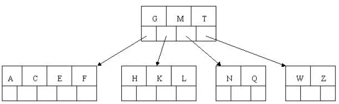
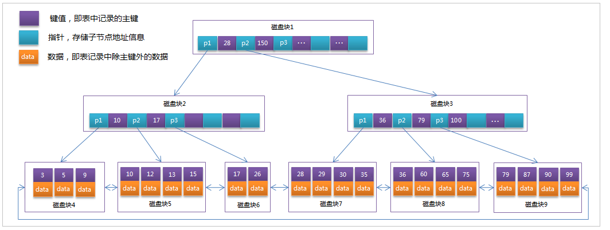

# MySQL 数据库基础笔记

## 1. 数据库概述

### 1.1. 什么是数据库

用来存储数据的仓库

### 1.2. 存储数据的方式

- 数据存储在集合中
    - 优点：读写速度快
    - 缺点：不能永久存储
- 数据存储在文件中
    - 优点：可以永久存储
    - 缺点： 频繁的IO操作效率低，查询数据很不方便。
- 数据存储在数据库中
    - 优点：可以永久存储。查询速度快，查询数据很方便
    - 缺点：要使用SQL语言执行增删改查操作

### 1.3. 常见的数据库管理系统

- MYSQL
    - 开源免费的数据库，小型的数据库.已经被Oracle收购了.MySQL6.x版本也开始收费。
- Oracle
    - 收费的大型数据库，Oracle公司的产品。Oracle收购SUN公司，收购MYSQL。
- DB2
    - IBM公司的数据库产品,收费的。常应用在银行系统中.
- SQLServer
    - MicroSoft 公司收费的中型的数据库。C#、.net等语言常使用。
- SyBase
    - 已经淡出历史舞台。提供了一个非常专业数据建模的工具PowerDesigner。
- SQLite
    - 嵌入式的小型数据库，应用在手机端。

- Java相关的数据库：MYSQL，Oracle。
- 这里使用MySQL数据库。MySQL中可以有多个数据库，数据库是真正存储数据的地方。

## 2. SQL 的概念

- 结构化查询语言(Structured Query Language)简称 SQL，是一种数据库查询语言。
- 作用：用于存取数据、查询、更新和管理关系数据库系统。
- 关系型数据库：使用表格存储数据的数据库

### 2.1. 数据库服务器、数据库和表的关系

**一般在实际开发中，一个项目就对应一个数据库**

所谓数据库服务器，是指在机器上装了一个数据库管理程序，这个管理程序可以管理多个数据库，一般开发人员会针对每一个应用创建一个数据库。为保存应用中实体的数据，一般会在数据库创建多个表，以保存程序中实体的数据。

### 2.2. MySQL 数据库的结构

- 创建的顺序
	- 创建数据库 --> 创建数据表 --> 存储数据
	- 一个数据库包含多个数据表
- 通过 SQL 语句对 MySQL 数据库进行管理。

### 2.3. 实体类与表的对应关系

1. 整个数据表可以看作为一个类
2. 数据表中的每一列代表具体类一个成员变量
3. 数据表的一行称之为一条纪录，对应一个类的对象

### 2.4. 数据库中的主要对象

1. 表(Table)：在数据库中存储数据记录的容器，一个表中包含多行数据记录。
2. 视图(View)：是从一个或多个表导出的虚拟表，视图本身并不存储数据。
3. 索引(index)：是对数据库表中一列或多列的值进行排序的一种结构，使用索引可快速访问数据库表中的特定信息，类似于书籍的目录。
4. 存储过程(Procedure)：一组为了完成特定功能的 SQL 语句集，存储在数据库中，经过第一次编译后再次调用不需要再次编译，用户通过指定存储过程的名字并给出参数来执行它。
5. 触发器(Trigger)：触发器是一种特殊类型的存储过程，它在指定的表中的数据发生变化时自动生效。唤醒调用触发器以响应 INSERT、UPDATE 或 DELETE 语句。

## 3. SQL 语句

### 3.1. SQL 语言的分类

- **数据定义语言：简称DDL(Data Definition Language)**
    - 用来创建，修改，删除数据库中的各种对象：数据库，表，列等。
    - 【关键字】创建：create，更改：alter，移除：drop等
- **数据操作语言：简称DML(Data Manipulation Language)**
    - 用来修改、删除、添加数据的语句。
    - 【关键字】插入：insert、删除：delete、更新：update
- **数据控制语言：简称DCL(Data Control Language)**
    - 用来创建用户，分配用户权限、删除用户的语句，数据库的访问权限和安全级别。
    - 【包含两条命令】grant：授权；revoke：撒回
- **数据查询语言：简称DQL(Data Query Language)**
    - 用来执行查询操作的语句。
    - 【关键字】select，show，from，where等

### 3.2. 2、SQL 通用语法

#### 3.2.1. SQL语句规范

- **SQL语句可以单行或多行书写，以分号结尾**
- 可使用空格和缩进来增强语句的可读性
- 同样可以使用`/**/`的方式完成注释

#### 3.2.2. 表名规范

- MySQL数据库的**SQL语句不区分大小写，建议关键字使用大写，自定义的使用小写**，例如：

```sql
SELECT * FROM user;
```

- 表名使用**单数**形式。如：员工表使用 EMPLOYEE，而不要使用 EMPLOYEES
- 采用有意义的名字，一般不超过三个英文单词，单词之间使用**下划线**分隔

#### 3.2.3. 字段名规范

字段名称不能包含数据类型，不能使用关键字。

#### 3.2.4. 标准SQL语言没有规范以下功能

- ID自示增长
- 分页
- 函数
- 编程语言
- 服务端的数据软件

### 3.3. MySQL 中的数据类型

详细的数据类型如下(了解，红色字体为常用数据类型)

<table>
  <tr>
    <th>分类</th>
    <th>类型名称</th>
    <th>说明</th>
  </tr>
  <tr>
    <td rowspan="5">整数类型</td>
    <td>tinyInt</td>
    <td>很小的整数（微整型占1字节），默认长度4</td>
  </tr>
  <tr>
    <td>smallint</td>
    <td>小的整型（占2字节），默认长度6</td>
  </tr>
  <tr>
    <td>mediumint</td>
    <td>中等大小的整数，默认长度9</td>
  </tr>
  <tr style="font-weight:bolder; color: red;">
    <td>int(integer)</td>
    <td>普通大小的整数（占4字节），默认长度11</td>
  </tr>
  <tr style="font-weight:bolder; color: red;">
    <td>bigint</td>
    <td>占用的8个字节，默认长度20</td>
  </tr>
  <tr>
    <td rowspan="3">小数类型</td>
    <td>float(m,d)</td>
    <td>单精度浮点型小数</td>
  </tr>
  <tr style="font-weight:bolder; color: red;">
    <td>double(m,d)</td>
    <td>双精度浮点型小数 d代表小数位数，m代表总位数 (整数位=m-d);<br/> 比如：DOUBLE(5.2)， 数值共5位，其中小数为2位。</td>
  </tr>
  <tr>
    <td>decimal(m,d）</td>
    <td>压缩严格的定点数，取值范围与double相同，但有效取值范围由M与D决定</td>
  </tr>
  <tr>
    <td rowspan="5">日期类型</td>
    <td>year</td>
    <td>YYYY 1901~2155</td>
  </tr>
  <tr>
    <td>time</td>
    <td>HH:MM:SS -838:59:59~838:59:59</td>
  </tr>
  <tr style="font-weight:bolder; color: red;">
    <td>date</td>
    <td>YYYY-MM-DD 1000-01-01~9999-12-3(只有年月日，没有时分秒)</td>
  </tr>
  <tr>
    <td>datetime</td>
    <td>YYYY-MM-DD HH:MM:SS 1000-01-01 00:00:00~ 9999-12-31 23:59:59</td>
  </tr>
  <tr>
    <td>timestamp</td>
    <td>YYYY-MM-DD HH:MM:SS 1970~01~01 00:00:01 UTC~2038-01-19 03:14:07UTC</td>
  </tr>
  <tr>
    <td>boolean类型</td>
    <td>boolean</td>
    <td>MYSQL保存BOOLEAN值时用1代表TRUE,0代表FALSE，boolean在MySQL里的类型为tinyint(1)</td>
  </tr>
  <tr>
    <td rowspan="12">文本、二进制类型</td>
    <td>CHAR(M)</td>
    <td>M为0~255之间的整数。CHAR(x),定长的字符串</td>
  </tr>
  <tr style="font-weight:bolder; color: red;">
    <td>VARCHAR(M)</td>
    <td>M为0~65535之间的整数。VARCHAR(x),可变长的字符串，注意数据不能超过X位数，</td>
  </tr>
  <tr>
    <td>TINYBLOB</td>
    <td>1个字节，取值：0-255</td>
  </tr>
  <tr style="font-weight:bolder; color: red;">
    <td>BLOB</td>
    <td>2个字节，取值：0-65535。二进制大对象。（图片、视频、音频）</td>
  </tr>
  <tr>
    <td>MEDIUMBLOB</td>
    <td>3个字节，取值：0-16M</td>
  </tr>
  <tr>
    <td>LONGBLOB</td>
    <td>4个字节，取值：0-4G</td>
  </tr>
  <tr>
    <td>TINYTEXT</td>
    <td>1个字节，取值：0-255</td>
  </tr>
  <tr>
    <td>TEXT</td>
    <td>2个字节，取值：0-65535</td>
  </tr>
  <tr>
    <td>MEDIUMTEXT</td>
    <td>3个字节，取值：0-16M</td>
  </tr>
  <tr>
    <td>LONGTEXT</td>
    <td>4个字节，取值：0-4G</td>
  </tr>
  <tr>
    <td>VARBINARY(M)</td>
    <td>允许长度0~M个字节的变长字节字符串</td>
  </tr>
  <tr>
    <td>BINARY(M)</td>
    <td>允许长度0~M个字节的定长字节字符串</td>
  </tr>
</table>

> 注：  
> 1. char、varchar和text等字符串类型都可以存储路径，但使用“\”会被过滤，所以路径中用“/”或“\\”来代替，MySQL就会不会自动过滤路径的分隔字符，完整的表示路径  
> 2. 一般情况下，数据库中不直接存储图片和音频文件，而是存储图片与文件的路径。如果存储文件，则选择blob类型

### 3.4. MySQL 中的三种注释

- 单行注释
    - 格式：`# 注释内容` (MySQL特有)
    - 格式：`-- 注释内容` （所有数据库共有的）
- 多行注释
    - 格式：`/* 注释内容 */`

## 4. MySQL 数据库的管理

### 4.1. 查看数据库

#### 4.1.1. 查看数据库命令

```sql
show databases;
```

- 查看所有数据库信息，分号结束。sql 语句就会发送给 MySQL 服务器端执行

```sql
show create database 数据库名;
```

- 查看某个数据库在定义时的信息
- eg: `show create database day21_1;`

#### 4.1.2. mysql默认4个初始数据库的作用

- 【information_schema】：MySQL 元数据，一些基础的数据。
- 【MySQL】：MySQL 配置数据库，配置信息。其中 user 表用于管理 MySQL 用户和密码、权限信息。
- 【performance_schema】：MySQL 性能监控信息数据库，如：每条语句的执行情况。
- 【test】：测试数据库。

### 4.2. 创建数据库

```sql
create database 数据库名;
```
- 使用默认的字符集创建数据库
- 创建数据库，数据库中数据的编码采用的是**安装数据库时指定的默认编码UTF-8**
- eg: `create database db1;`

```sql
create database 数据库名 default character set 字符集;
```

- 使用指定字符创建数据库;
- eg: `create database db2 default character set utf8;` (**注意：不是utf-8**)

### 4.3. 删除数据库

```sql
drop database 数据库名;
```

- eg：`drop database day21_2;`

**注：删除没有确认信息，做删除处理时需要小心**

### 4.4. 修改数据库默认字符集

```sql
alter database 数据库名 default character set 字符集;
```

- 修改数据库默认字符集

### 4.5. 查看正在使用的数据库

```sql
select database();
```

- 查看正在使用的数据库(这个命令一般在DOS下操作才需要使用)

### 4.6. 校对规则（了解）

- character set：指定数据库默认的字符集
- collate：校对规则

**什么是校对规则(比较和排序规则)？**

它是一组规则，负责决定某一字符集下的字符进行比较和排序的结果。如：a,B,c,D，如果使用 utf-8 的编码，按照普通的字母顺序，而且不区分大小写。如果想使用字母的二进制比较和排序，则可以修改它的校对规则。

> utf8_general_ci  
>     按照普通的字母顺序，而且不区分大小写（比如：a B c D）  
> utf8_bin  
>     按照二进制排序（比如：A 排在 a 前面，B D a c）

**查看字符集和校对规则:**

> 注意：SQL 语句中的字符串一般都是单引号括起。  
>     `show character set;`  
>     `show collation like 'utf8\_%';` -- 显示所有 utf-8  
>     `show collation like 'gbk%';` -- 显示所有 GBK

指定数据库的默认字符集为 gbk 和校对规则 gbk_chinese_ci

> eg: `create database db4 default character set gbk collate gbk_chinese_ci;`

## 5. MySQL 表的管理
### 5.1. 查看表结构
#### 5.1.1. 选择操作的数据库

- 语法：`use 数据库名;`
- 作用：选择数据库

#### 5.1.2. 查看数据库所有表格清单

- 语法：`show tables;`
- 作用：查看当前数据库中的所有表，显示表格的清单

#### 5.1.3. 查看数据库指定表格

- 语法：`show create table 表名;`
- 作用：以sql格式返回，查看指定表格的结构


- 语法：`desc 表名;`
- 作用：以表格格式返回，查看指定表格的结构


#### 5.1.4. 查询当前数据库的引擎

- 语法：`show table status from 查询的数据库名称;`
- 作用：查询当前数据库下所有表的状态与信息，包括表的引擎（Enginez）

### 5.2. 创建表

**创建表格式**

```sql
create table 表名(
	字段名 数据类型(长度) [完整性约束条件],
	……………
	列名n 数据类型(长度) 约束
	[UNIQUE | FULLTEXT | SPATIAL] INDEX | KEY [索引名](字段名1 [(长度)] [ASC | DESC])
);
-- 注：最后一个定义属性后不能有“,”

-- ************************
UNIQUE：可选。表示索引为唯一性索引。
FULLTEXT；可选。表示索引为全文索引。
SPATIAL：可选。表示索引为空间索引。
	如果不指定索引类型，则为普通索引
INDEX和KEY：用于指定字段为索引，两者选择其中之一就可以了，作用是一样的。
索引名：可选。给创建的索引取一个新名称。
字段名1：指定索引对应的字段的名称，该字段必须是前面定义好的字段。
长度：可选。指索引的长度，必须是字符串类型才可以使用。
ASC：可选。表示升序排列。
DESC：可选。表示降序排列。
```

例：

```sql
-- 创建分类表
CREATE TABLE sort (
	sid INT,            -- 分类ID
	sname VARCHAR(100)  -- 分类名称
);
```

**关于整型长度的说明**

如果在建表时不指定字段 int 类型的长度时，系统则默认生成长度为 11 的字段。11 也是 int 类型的最大长度，其中第一位表示符号+或者-，后面十位表示数字。 如果指定了长度，该字段其实也是长度为 11 的字段，因为只要是 int 类型，系统都分配了长度 11 位。**在插入数据时，只要不超出int类型的最大范围即可**

### 5.3. 复制表

- `create table 新表名 like 旧表名;`
    - 创建一个新表，复制旧表的结构(**没有内容，只有表结构**)

<font color="purple">使用子查询可以复制整个表</font>

- `create table 新表名 as (select * from 要复制的表名);`

### 5.4. 删除表

- `drop table 表名1,表名2,表名3,……;`
    - 删除一个表格
    - eg: `drop table sort;`
    - 删除多个表格，用逗号分隔可以删除多张表
    - eg: `drop table s1, s2, s3;`

### 5.5. 修改表
#### 5.5.1. 添加字段 add

- `alter table 表名 add字段名1 数据类型(长度) 约束, add 字段名2数据类型(长度) 约束, ……;`
    - 给指定表格添加一个字段
    - eg: `alter table student add gender varchar(2);`
    - 给指定表格添加多个字段，**每个字段都需要有add**
    - eg: `alter table student add a int, add b int;`

#### 5.5.2. 修改字段类型(长度)或约束 modify

- `alter table 表名 modify 字段名 修改后的类型(长度) 约束;`
    - 修改指定表格中的指定字段的类型(长度)或约束
    - eg: atler table student modify gender varchar(2);
			ALTER TABLE sort MODIFY sname VARCHAR(50) NOT NULL;添加约束

#### 5.5.3. 修改字段名称 change

- `alter table 表名 change 旧字段名 新字段名 类型(长度) 约束;`
    - 将指定表格中的旧字段名改成新字段名，类型(长度)可变，约束可变
    - eg: `alter table student change gender sex varchar(2);`

#### 5.5.4. 删除字段 drop

- `alter table 表名 drop 字段名1, drop 字段名2,……;`
    - 删除指定表格中的字段（**可以多个，每个字段前都要加drop**）
    - eg: `alter table student drop a, drop b;`

#### 5.5.5. 修改表名 rename

- 格式1：`alter table 旧表名 rename 新表名;`
    - 将指定的表格名称修改成新表格名称
    - eg: `alter table student rename stu;`
- 格式2：`rename table 旧表名 to 新表名;`
    - eg: `rename table sutdent to stu;`

#### 5.5.6. 修改表的字符集

- `alter table 表名 character set 新字符集;`
    - 修改指定表格的字符集
    - eg: `alter table student character set gbk;`

#### 5.5.7. 给数据库的表建立索引

- `alter table 表名 add index(字段名);`
    - 给指定的表建立索引

## 6. MySQL 数据的管理与操作
### 6.1. 插入数据 insert
#### 6.1.1. 插入所有列

- `insert into 表名 values (值1, 值2, 值3 ……), (值1, 值2, 值3 ……), (值1, 值2, 值3 ……)……;`
    - 向表中插入所有列
    - eg: `INSERT [INTO] student VALUES(1,’NewBoy’,20,'广州人','男');`、
    - 注：上面的`INTO`可以省略，也可以一次向表中插多个所有列。

- **注意事项：**
    1. 插入的数据应与字段的数据类型相同
    2. 数据的大小应在列的规定范围内，例如：不能将一个长度为 80 的字符串加入到长度为 40 的列中。
    3. 在 values 中列出的数据位置必须与被加入的列的排列位置相对应。
    4. **字符和日期型数据应包含在单引号中。双引号也可以但不推荐**。
    5. 不指定列或使用 null，表示插入空值。

#### 6.1.2. 插入部分列

- `insert into 表 (列名1,列名2,列名3..) values (值1,值2,值3..), (值1,值2,值3..),……;`
    - 向表中插入某些列，也可以一次插入多个列
    - eg: `INSERT INTO student(id,NAME,age,remark) VALUES(3,'jacky',27,'佛山人');`
    - 注意事项：**列名和值的顺序、数量、数据类型要保持一致**

### 6.2. insert 高级插入数据语法
#### 6.2.1. `INSERT ... ON DUPLICATE KEY` 数据存在时更新操作，不存在时进行插入操作

`INSERT ... ON DUPLICATE KEY UPDATE`这个语法的目的是为了解决重复性，当数据库中存在某个记录时，执行这条语句会更新它，而不存在这条记录时，会插入它。

相当于先判断一条记录是否存在，存在则`update`，否则`insert`。其全语法是：

`INSERT INTO tablename(field1,field2, field3, ...) VALUES(value1, value2, value3, ...) ON DUPLICATE KEY UPDATE field1=value1,field2=value2, field3=value3, ...;`

*注：tablename是表名，field1，field2，field3等是字段名称，value1，value2，value3等是字段值。*

- 问题：这条语句判断该条记录是否存在的标准是什么？
- 规则：*如果你插入的记录导致一个UNIQUE索引或者primary key(主键)出现重复，那么就会认为该条记录存在，则执行update语句而不是insert语句，反之，则执行insert语句而不是更新语句。所以`ON DUPLICATE KEY UPDATE`是不能写where条件的*

特别需要注意的是：**如果行作为新记录被插入，则受影响行的值为1；如果原有的记录被更新，则受影响行的值为2，如果更新的数据和已有的数据一模一样，则受影响的行数是0，这意味着不会去更新，也就是说即使插入的表有的时间戳是自动记录最后一次的更新时间，这个时间戳也不会变动。**

例：

```sql
CREATE TABLE `t_stock_chg` (
	`f_market` varchar(64) NOT NULL COMMENT '市场',
	`f_stockID` varchar(10) NOT NULL DEFAULT '' COMMENT '股票代码',
	`f_updatetime` timestamp NOT NULL DEFAULT CURRENT_TIMESTAMP ON UPDATE CURRENT_TIMESTAMP COMMENT '插入时间戳',
	`f_name` varchar(16) DEFAULT NULL COMMENT '股票名称',
	PRIMARY KEY (`f_market`,`f_stockID`)
) ENGINE=InnoDB DEFAULT CHARSET=utf8
```

*注：这里的字段f_updatetime每次在更新数据时会自动更新，但是如果记录中存在某条数据，后来又更新它，而更新的数据和原数据一模一样，那么这个字段也不会更新，仍然是上一次的时间。此时`INSERT ... ON DUPLICATE KEY UPDATE`影响行数是0*。

#### 6.2.2. replace into 插入数据

`replace into` 跟 `insert` 功能类似，不同点在于：`replace into`首先尝试插入数据到表中

1. 如果发现表中已经有此行数据（根据主键或者唯一索引判断）则先删除此行数据，然后插入新的数据。
2. 如果表中没有此行数据，直接插入新数据。

要注意的是：**插入数据的表必须有主键或者是唯一索引！**否则的话，`replace into`会直接插入数据，这将导致表中出现重复的数据。

MySQL replace into 有三种形式：

1. `replace into tbl_name(col_name, ...) values(...)`
	- 第一种形式类似于insert into的用法
2. `replace into tbl_name(col_name, ...) select ...`
	- 第二种replace select的用法也类似于insert select，这种用法并不一定要求列名匹配，事实上，MYSQL甚至不关心select返回的列名，它需要的是列的位置。例如，`replace into tb1(name, title, mood) select rname, rtitle, rmood from tb2;`
	- 这个例子使用replace into从tb2中将所有数据导入tb1中
3. `replace into tbl_name set col_name=value, ...`
	- 第三种replace set用法类似于update set用法，使用一个例如“`SET col_name = col_name + 1`”的赋值，则对位于右侧的列名称的引用会被作为`DEFAULT(col_name)`处理。因此，该赋值相当于`SET col_name = DEFAULT(col_name) + 1`。

前两种形式用的多些。其中“into”关键字可以省略，不过最好加上“into”，这样意思更加直观。另外，对于那些没有给予值的列，MySQL将自动为这些列赋上默认值。

#### 6.2.3. insert ignore into 插入数据

`INSERT IGNORE` 与 `INSERT INTO` 的区别就是`INSERT IGNORE`会忽略数据库中已经存在的数据，如果数据库没有数据，就插入新的数据；如果有数据的话就跳过这条数据（即执行这条插入语句时不会报错，只有警告，数据实际没有插入）。这样就可以保留数据库中已经存在数据，达到在间隙中插入数据的目的。

例子

```sql
-- 先执行INSERT INTO，执行成功
INSERT INTO test(id, NAME, age) VALUES (1, 'aa', 18);
-- 再次执行该语句，肯定会报错。如下：
-- 查询：insert into test(id, name, age) values (1, 'aa', 18)
-- 错误代码： 1062
-- Duplicate entry '1' for key 'PRIMARY'

-- 执行INSERT IGNORE
INSERT IGNORE INTO test(id, NAME, age) VALUES (1, 'aa', 18);
-- 结果并没有报错，只是给出一个警告：
-- 查询：INSERT ignore INTO test(id, NAME, age) VALUES (1, 'aa', 18)
-- 共 0 行受到影响， 1 个警告

-- 换个主键id，重新执行INSERT IGNORE语句，执行成功：
INSERT IGNORE INTO test(id, NAME, age) VALUES (2, 'aa', 18);
```

*结论：执行INSERT时，如果不想报错(语法错误除外)，就用INSERT IGNORE，其它情况两者一样*

### 6.3. 修改数据 update
#### 6.3.1. 语法格式与关键字

- **关键字**
    - `UPDATE`：语法可以用新值更新原有表行中的各列。
    - `SET`：子句指示要修改哪些列和要给予哪些值。
    - `WHERE`：子句指定应更新哪些行。如没有 WHERE 子句，则更新所有的行

#### 6.3.2. 修改所有的记录

- 格式1：`update 表名 set 列名1=值,列名2=值,……;`
    - 更新所有行的数据（**谨慎使用**）
    - eg: `UPDATE student SET gender='男';`

#### 6.3.3. 修改符合某些条件的一（多）个列数据（用的较多）

- 格式2：`update 表名 set 列名1=值,列名2=值,…… where 条件;`
    - 根据条件修改信息
    - eg: `UPDATE student SET age=28,remark='韶关人' WHERE id=2;`

### 6.4. 删除数据 delete
#### 6.4.1. 删除表中的所有数据( delete )

- `delete from 表名;`
    - 删除表的所有记录，相当清空表的内容
    - eg: `delete from student;`
    - **注意事项：**
        1. 自增长约束：**只删除表中的数据，不会影响表中的自增长约束，即auto_increment 还会在原来基础上增加**
        2. 回滚：使用 delete 删除的数据，通过事务可以回滚。
        3. where 子句：可以使用 where 子句

#### 6.4.2. 删除部分行数据

- `delete from 表名 where 条件;`
    - 删除符合条件的行内容
    - eg: `delete from student where id=3;`
    - **注：删除语句不能使用别名，如：`delete from student s where s.id=3;`会报语法错误。如果使用别名，正确的语法是：`delete s from student s where s.id=3;`**

#### 6.4.3. 删除所有数据( truncate )

- `truncate table 表名;`
    - 删除表的所有数据，相当于重新创建一个表，后面不能带条件(`where/having`)
    - eg: `truncate table student;`
    - **注意事项：**
        1. 自增长约束：**既能删除表的数据，也能够把表的自增长约束置为0**
        2. 回滚：使用 truncate 删除的数据，不能回滚！
        3. 后面不能带条件

#### 6.4.4. MySQL 中的 delete 和 truncate 的区别？

- **delete**
    - 删除所有数据时，不会影响自增长的值
    - 可以通过事务回滚数据
- **truncate**
    - 删除数据时，先直接drop表，然后新建一张表，自增长的值从默认值开始
    - 不可以通过事务回滚数据

## 7. MySQL 数据查询
### 7.1. 数据查询语法总格式

mysql查询数据有两种方式

1. 普通的`select`用法，格式如下:

```sql
select distinct |top 数字[percent]
	字段as常量,
	包含字段表达式,
	函数(Sum,max),
	常量
from
	表或结果集
where
	条件： 逻辑|空值|多条件|模糊|范围
group by
	字段
having
	筛选条件
order by
	字段 desc | asc
limit 开始索引, 每页大小
```

**sql的执行顺序：`from -> where -> group by -> having -> select -> order by`**

2. `select into`通常用来把旧表数据插入到新表中，格式如下:

```sql
select
	字段等
into 表名
from
	数据源
	其他子句
```

### 7.2. 查询数据 select（查询不会改变原表的数据）
#### 7.2.1. 查询所有列

- `select * from 表名;`
    - eg: `SELECT * FROM student;`

#### 7.2.2. 查询指定列

- `select 列名1, 列名2, ……… from 表名;`
    - eg: `SELECT NAME,gender FROM student;`

#### 7.2.3. 查询时指定列的别名

- `select 列名1 as 别名1, 列名2 as 别名2,…… from 表名;`
    - eg: `SELECT NAME AS '姓名',gender AS '性别' FROM student;`
        - AS 可以省略
        - `SELECT NAME '姓名',gender '性别' FROM student;`

#### 7.2.4. 合并列查询

- `select *,(数值类型的列名1+数值类型的列名2+……) as 别名 from 表名;`
    - eg: `SELECT *, (math+english) 总成绩 FROM student;`
        - **注意： 必须是数值类型**
        - `SELECT *, (math+NAME) 总成绩 FROM student;`
        - **注意：和数值以外合并没有意义，合并后也是输出数据类型的值**
        - `SELECT uname,salary,(salary*12) AS '年薪' FROM users;`
        - 查询所有员工的薪资,年薪,以及姓名，也可以选择列后直接进行算术运算

#### 7.2.5. 查询时添加常量列

- `select *,'添加的内容' as 别名 from 表名;`
    - 使用`''`后，单引号里的内容就当成常量列，在查询时新增一列到原表。
    - eg: `SELECT *, 'JavaEE 就业班' AS '班级' FROM student;`

```shell
+----+------+------+------+---------+--------+
| ID | NAME | AGE  | MATH | ENGLISH |  班级   |
+----+------+------+------+---------+--------+
| 1  | 张三  | 17   | 88   |  98     | JavaEE |
+----+------+------+------+---------+--------+
| 2  | 李四  | 19   | 99   |  86     | JavaEE |
+----+------+------+------+---------+--------+
| 2  | jack | 30   | 78   |  83     | JavaEE |
+----+------+------+------+---------+--------+
```

#### 7.2.6. 去除重复数据

- `select distinct 列名 from 表名;`
    - 根据某一列的内容去掉重复的值，只保留其中一个内容。
    - eg: `SELECT DISTINCT address FROM student;`
- `select distinct 列名1,列名2,…… from 表名;`
    - 根据多列的内容去掉重复的值，要多个列的内容同时一致才去掉。
    - eg: `SELECT DISTINCT(address) FROM student;`

### 7.3. 条件查询 where

- where语句表条件过滤。满足条件操作，不满足不操作，多用于数据的查询与修改。
- 格式：`select 字段 from 表名 where 条件;`

#### 7.3.1. 比较运算符

- 比较运算符
    - `>  <  <=   >=   =  <>`：大于、小于、大于(小于)等于、不等于
    - `BETWEEN ...AND...`：显示在某一区间的值(包头包尾)
    - `IN(set)`：显示在in列表中的值，例：in(100,200)
    - `LIKE 通配符`：模糊查询，Like语句中有两个通配符：
        - `%`：用来匹配多个字符；例`first_name like 'a%';`
        - `_`：用来匹配一个字符。例`first_name like 'a_';`
    - `IS NULL`：判断是否为空
        - `is null;`：判断为空
        - `is not null;`：判断不为空
- 逻辑运算符
    - `and`：多个条件同时成立
    - `or`：多个条件任一成立
    - `not`：不成立，例：`where not(salary>100);`

**注：mysql中用`<>`与`!=`都是可以的，但sqlserver中不识别`!=`，所以建议用`<>`；但是`!=`在sql2000中用到，则是语法错误，不兼容的**

#### 7.3.2. 逻辑条件

- `& and`：与
- `|| or`：或

```sql
SELECT * FROM student WHERE id=3 AND gender='男';
SELECT * FROM student WHERE id=3 OR gender='男';
```

#### 7.3.3. 比较条件

- `>=`：大于等于
- `<=`：小于等于

```sql
SELECT * FROM student WHERE math>=80 AND math<=88;
-- 等价于上面
SELECT * FROM student WHERE math BETWEEN 80 AND 88; -- (包前包后)
```

#### 7.3.4. 判空条件

- 判断是否为空串：
    - `=''`: 是空串
    - `<>''`: 不是空串
- 判断是否为空：
    - `is null`：是null
    - `is not null`：不是null
- **null 和 空字符串的区别：**
    - null： 没有数据。判断 null：`is null`，判断不为 null：`is not null`
    - 空字符： 有数据，数据就是空字符串。判断空字符： `=''`；判断不为空字符串： `<>''`（注意：这里不是用`==`）

```sql
SELECT * FROM student WHERE address IS NULL;
SELECT * FROM student WHERE address='';
SELECT * FROM student WHERE address IS NULL OR address='';
SELECT * FROM student WHERE address IS NOT NULL AND address<>'';
```

#### 7.3.5. 模糊查询：like

- `%`：表示匹配多个任意字符(0到多个)
- `_`：表示匹配一个任意字符
- 语法：`select * from 表名 where 列名like 条件;`

```sql
-- 查询姓张的学生
SELECT * FROM student WHERE NAME LIKE '张%';
-- 查询姓名中包含'张'字的学生
SELECT * FROM student WHERE NAME LIKE '%张%';
-- 查询姓张，且姓名只有两个字的学生
SELECT * FROM student WHERE NAME LIKE '张__';
```

#### 7.3.6. 模糊查询：in

- `select * from 表名 where 列名 in (条件1,条件2,……);`

```sql
SELECT * FROM student WHERE id IN (1,3); -- 这种效率更高
SELECT * FROM student WHERE id=1 OR id=3; -- 等价于上面的sql
```

### 7.4. 排序查询 order by

- Order by 语句的作用
    - 根据指定的列内容排序
    - 排序的列可以是表中的列名，也可以是 select	 语句后指定的列名。
- 相关关键字：
    - `asc`：顺序（正序：数值：从小到大，字符串：字符 a-z）默认
    - `desc`：倒序（正序：数值：从大到小，字符串：字符 z-a）
- 注：
    - **order by 子句应位于 select 语句的结尾。**
    - **order by 后面指定的列名或别名必须存在，否则查询出错。**

#### 7.4.1. 以表中的列名排序

- 语法：`select * from 表名 order by 列名(别名) asc/desc;`
    - 按表中的列名排序，如果不写(asc/desc)则默认是顺序

```sql
-- 1) 对数学成绩从小到大排序后输出。
SELECT * FROM student ORDER BY math;
-- 2) 对总分按从高到低的顺序输出
SELECT *, (math+english) AS 总分 FROM student ORDER BY 总分 DESC;
```

#### 7.4.2. 以 select 语句后指定的列名排序

- 语法：`select *,(列名1+列名2+……) as 别名 from 表名 order by 别名 asc/desc;`
    - 按新的列名排序，如果出现where条件查询，则 ORDER	BY 子句应位于 SELECT 语句的结尾。

```sql
-- 3) 姓张的学生成绩从小到大排序输出
SELECT *, (math+english) AS 总分 FROM student WHERE NAME LIKE '张%' ORDER BY 总分;
```

### 7.5. 聚合查询

- 语法：`select 聚合函数名称(数值列名) from 表名;`
    - 按聚合函数的结果来查询，列必须是数值列，如果不是数值列，则结果为0，注意：聚合函数，会排除 null 值的数据
- 常用的聚合函数：
    - SUM：求和函数
    - AVG：平均函数
    - MAX：最大值函数
    - MIN：最小值函数
    - COUNT：统计数量函数

```sql
-- 1. 需求： 查询所有学生 english 的总分
SELECT SUM(english) FROM student;
-- 2. 需求： 查询所有学生 english 的平均分
SELECT AVG(english) FROM student;
-- 3. 需求：查询最高的 english 分数
SELECT MAX(english) FROM student;
-- 4. 需求：查询最低的 english 分数
SELECT MIN(english) FROM student;
-- 5. 需求： 一共几个学生
SELECT COUNT(*) FROM student;    -- 推荐使用
SELECT COUNT(id) FROM student;   -- 效率会比 count(*)效率稍高
-- 注意： 聚合函数，如果列的值 为null，会排除 null 值的数据
SELECT COUNT(address) FROM student;
```

### 7.6. 分页查询 limit

- 语法：`select * from 表名 limit 起始行号，查询行数。`
- 作用：用来分页查询数据
- 注：
    - **起始行数是从 0 开始**
    - **如果分页同时要进行排序，limit语句要放在order by的后面。**

```sql
SELECT * FROM student;
-- 需求： 查询第 1,2 条数据（第 1 页数据）
SELECT * FROM student LIMIT 0,2;
-- 需求： 查询第 3,4 条数据（第 2 页数据）
SELECT * FROM student LIMIT 2,2;
-- 需求： 查询第 5,6 条数据（第 3 页数据）
SELECT * FROM student LIMIT 4,2;
```

**总结分页计算规律：**

- 0,2,4,这是等差数列
- `startIndex = (curPage-1)*pageSize`
- 转变：分页实现的前提pageSize每页多少条,curPage当前页，startIndex查询的起始号

### 7.7. 分组查询 group by
#### 7.7.1. group by 语法规则

- 语法：`group by 属性名 [having 条件表述式][with rollup]`
    - group by 关键字可以将查询结果按某个字段或多个字段进行分组。字段中值相等的为一组。
    - “属性名”是指按照该字段的值进行分组
    - “having 条件表述式”用来限制分组后的显示内容，满足条件表达式的结果将显示
    - “with rollup”关键字将会在所有记录的最后加上一条记录。该记录是上面所有记录的总和

#### 7.7.2. 分组查询

- 语法：`select * from 表名 group by 列名;`
    - 按照指定的列对象数据进行分组。通常与聚合函数（`COUNT()`、`SUM()`、`AVG()`、`MAX()`、`MIN()`）一起使用。如果 `group by` 不与上述函数一起使用，那么查询结果就是字段聚会的分组情况，字段中取值相同记录为一组，但只显示该组的第一条记录（这种使用意义不大）

```sql
-- 在分组查询的同时，统计人数。
SELECT gender,COUNT(*) '人数' FROM student GROUP BY gender;
```

**注：如果两个表关联，使用分组的话。group by 后面需要写上两个表的分组的列名，要以理解为，这样操作可以保持两个表的行数一致。**

```sql
SELECT
	m.courseid, c.`NAME`, round(avg(m.score)) avgscore
FROM
	t_mark m,
	t_course c
WHERE
	m.courseid = c.id
GROUP BY
	m.courseid,
	c.`NAME`
```

##### 7.7.2.1. GROUP_CONCAT()函数

- GROUP_CONCAT()函数会把每个分组中指定字段值都显示出现

```sql
SELECT t.spec_id, GROUP_CONCAT(t.option_name) FROM tb_specification_option t GROUP BY t.spec_id;
```

表数据：


查询结果：


#### 7.7.3. 分组筛选(having)

- `having` 关键字作用：用来对分组信息进行过滤，用法与where一样。
- 语法格式：`select * from 表名 group by 列名 having 筛选条件;`

```sql
SELECT address,COUNT(address) '人数' FROM student GROUP BY address;
SELECT address,COUNT(address) '人数' FROM student GROUP BY address HAVING COUNT(address)>2;
```

#### 7.7.4. where 和 having 的区别

- where是对行记录进行筛选过滤，where后面**不能跟聚合函数**的(如:`count(*)`)
- having是对组信息进行筛选过滤，having后面**可以跟聚合函数**的。(如:`count(*)`)

#### 7.7.5. `with rollup` 关键字

在所有记录的最后加上一条记录。该记录是上面所有记录的总和

```shell
mysql> SELECT sex, COUNT(sex) FROM employee GROUP BY sex WITH ROLLUP;
+------+------------+
| sex  | COUNT(sex) |
+------+------------+
| 女   | 1          |
| 男   | 3          |
| NULL | 4          |
+------+----------- +
3 row in set (0.00 sec)

mysql> SELECT sex, GROUP_CONCAT(name) FROM employee GROUP BY sex WITH ROLLUP;
+------+--------------------+
| sex  | GROUP_CONCAT(name) |
+------+--------------------+
| 女   | 李四                |
| 男   | 张三,王五,Aric       |
| NULL | 李四,张三,王五,Aric  |
+------+--------------------+
3 row in set (0.02 sec)
```

最后一条记录是上面记录的总和

### 7.8. DOS 命令行下汉字乱码的问题（了解）
#### 7.8.1. 查看字符集

- 语法：`show variables like 'character%';`
    - `show variables` 显示所有的全局变量，`%`代表通配符


#### 7.8.2. 修改字符集

DOS命令行默认的字符集是GBK，而数据库的字符集是UTF-8，要将数据库中下列三项的字符集也改成GBK。在命令行插入数据之前输入: `set names gbk;` 则等同于

```sql
set character_set_connection=gbk; -- 设置数据库连接使用的字符集
set character_set_results=gbk; -- 设置查询结果的字符集
set character_set_client=gbk; -- 设置客户端的字符集
```


注：上面只改变了本次运行时的数据库局部的字符集，重启后也会变回原来的模式。

---

# MySQL 约束与多表关系操作
## 1. DCL语句使用(了解)
### 1.1. DCL概述

用于创建用户，删除用户，给用户分配权限等

### 1.2. 2、常用操作
#### 1.2.1. 创建用户

- 语句格式：`create user 用户名@xxx identified by '密码';`
    - 其中xxx表示创建的用户使用的IP地址，可以设置为localhost(代表本机)或者`'%'`（代表允许所有IP地址登录）

#### 1.2.2. 用户授权

- 创建用户之后，可以使用新用户进行登录，查看数据库只有系统自带的数据库，想要操作自己创建的数据库还需要root用户对新用户进行授权
- 语句格式：
    - `grant 权限1,权限2,........,权限n on 数据库名.* to 用户名@IP;`
        - 将数据库的n个权限授予用户。
    - `grant all on 数据库名.* to 用户名@IP;`
        - 将操作数据库的所有的权限授予用户。

#### 1.2.3. 撤销权限

- 当需要限制新用户操作数据库的权限时,root用户可以撤销已授予用户的某些权限
- 语句格式：`revoke 权限1,权限2,........,权限n on 数据库名.* from 用户名@IP;`
    - 例如：`revoke delete on day21.* from pkxing@IP;`

#### 1.2.4. 删除用户

语法：`drop user 用户名@'%';`

## 2. 数据库的备份与恢复
### 2.1. dos命令行备份与恢复
#### 2.1.1. 备份数据库（导出数据库中所有的表和数据）

语法格式：`mysqldump –u用户名 –p密码 数据库名 > 备份到的文件路径`

#### 2.1.2. 还原数据库（导入）

- 方式1：在 Windows 命令行中使用 mysql 命令

    - 语法格式：`mysql -u用户名 -p密码 数据库名 < 文件的路径`
- 方式2：在 MySQL 命令行中使用 source 命令把 sql 文件导入到当前数据库中
    - 语法格式：

        ```sql
        use 数据库名;
		source 导入文件的路径;
        ```

	- **注：这种方式要先选择数据库**

### 2.2. SQLyog工具备份与恢复
#### 2.2.1. SQL备份（导出）

选中数据库，右键 --> “备份/导出” --> 以SQL转储文件备份数据库，指定导出路径，保存成 `.sql` 文件即可。

#### 2.2.2. SQL恢复（导入）

数据库列表区域右键“从 SQL 转储文件导入数据库”， 指定要执行的 SQL 文件，执行即可

## 3. 数据的约束

### 3.1. 数据约束概述

#### 3.1.1. 数据约束的作用

对数据进行进一步的限制，保证数据表中的数据的有效性，完整性，准确性

#### 3.1.2. 约束种类

1. 默认约束
2. 唯一约束
3. 非空约束
4. 主键约束
5. 外键约束
6. 检查约束(MySQL 不支持，Oracle 支持)

#### 3.1.3. 约束添加时机

- 创建表结构的同时添加约束（推荐）
- 创建完表结构之后添加（不推荐）
    - 如果创建完之后再添加约束，可能会添加失败。因为已有的数据可能不符合即将要添加的约束。

### 3.2. 默认值约束 ( default )

- 默认约束：如果这个字段没有输入任何的值，则数据库使用默认的值，称为默认约束
- 语法格式：`列名 类型(长度) default 默认值`

```sql
-- 创建一个学生表 s1，字段：(编号，姓名，地址（默认值是：广州)），插入 2 条记录，地址使用默认值。
create table st1 (
	id int,
	name varchar(10),
	-- 默认值
	address varchar(20) default '广州'
)
-- 写法一：只插入前面 2 列，第 3 列不写
insert into st1 (id,name) values (10, '猪八戒');
select * from st1;
-- 写法二：VALUES 前面的列名不写
insert into st1 values (20, '猪九戒',default);
-- 使用自己的值
insert into st1 values (10, '小猪', '珠海');
-- 如果第 3 列使用 NULL 的常量，会不会插入默认值呢？
insert into st1 values (10, '小猪', null);
```

### 3.3. 非空约束 ( not null )

#### 3.3.1. 定义与语法

- 非空约束：约束某一列的值不能为null，**必须有值，但可以插入空字符**。
- 语法格式：`列名 类型(长度) not null`

```sql
-- 示例：创建表学生表 s2，字段(id，name, gender)，其中姓名不能为 null
create table s2 (
	id int,
	name varchar(10) not null, -- 非空
	gender char(1) default '男'
)
-- 不赋值：第 2 列不写 Column 'name' cannot be null
insert into s2 (id,name,gender) values (1,null,'女');
insert into s2 (id,gender) values (1,'女');
select * from s2;
```

#### 3.3.2. Mysql 允许null 与 default值

分为下面4种情况：

1. 允许null，指定default值。
2. 允许null，不指定default，这个时候可认为default值就是null
3. 不允许null，指定default值，不能指定default值为null，否则报错 Invalid default value for xxx
4. 不允许null，不指定default值。这种情况，Insert的时候，必须指定值。否则报错 Field xxx doesn't have a default value

### 3.4. 唯一约束 ( unique )

- 唯一约束：约束某一列的数据不允许出现重复值
- 语法格式：`列名 类型(长度) unique`

**注意事项：**

- **可以出现多个null，因为null是表示没有任何内容，就没有重复的说法**
- **不可以出现多个空字符，因为空字符也是有内容，所以不能同时出现多个空字符**

```sql
-- 创建学生表 s3，列(id,name)，学生姓名这一列设置成唯一约束，即不能出现同名的学生。
create table s3 (
	id int,
	name varchar(10) unique -- 唯一约束
);
insert into s3 values (1,'Jack');
select * from s3;
-- 插入相同的名字： Duplicate entry 'Jack' for key 'name'
insert into s3 values (2,'Jack');
-- 问：出现多个 null 的时候会怎样？因为 null 是没有值，所以不存在重复的问题。
insert into s3 values(3,null);
insert into s3 values(4,null);
```

### 3.5. 主键约束 ( primary key )
#### 3.5.1. 主键约束

- 用于唯一标识一条记录。
- 每一张表都应该有主键用来唯一标识记录，只能有一个主键。

#### 3.5.2. 主键设计原则

- 主键列一般是选择对用户没有任何意义的数据。只是用于开发时标识当前记录。
- 主键列的值一般是由数据库或计算机生成。

#### 3.5.3. 主键特点

- 非空、唯一、主键一般不修改
- **关键字：**
    - `primary key` **保证列的数据非空，唯一**
    - `primary key auto_increment` **让主键列数据，实现自动增长**

#### 3.5.4. 创建主键

语法格式：`列名 类型(长度) primary key`	或  `primary key(列名)`

1. 在创建表时创建主键，在字段后面加上 primary key

```sql
create table tablename(
	id int primary key,
	.......
)
```

2. 在创建表时创建主键，在表创建的最后来指定主键

```sql
create table tablename(
	id int，
	.......，
	primary key(id)
)
```

#### 3.5.5. 删除主键

- 语法格式：`alter table 表名 drop primary key;`
- 作用：删除指定表格的主键

```sql
alter table sort drop primary key;
```

#### 3.5.6. 主键自动增长

- 一般主键是自增长的字段，不需要指定。
- 实现添加自增长语句，主键字段后加auto_increment(只适用MySQL)

```sql
-- 创建分类表
CREATE TABLE sort (
	sid INT PRIMARY KEY auto_increment,  -- 分类ID
	sname VARCHAR(100)     -- 分类名称
);
```

### 3.6. 自增长字段 ( auto_increment )

#### 3.6.1. 自增长约束

- 让某一列的值每次在当前的基础上加1，起始值默认是1。
- **定义自增长约束的格式**：`列名 数值类型(长度) auto_increment`
- **修改自增长起始值格式**：`alter table 表名 AUTO_INCREMENT = 新的起始值;`

#### 3.6.2. 零填充

- 如果某一数值列的值不满指定的位数，则前面使用零填充
- 关键字：`zerofill`
- 定义位置：在数据类型的后面，作用如果数据的位数是4位，则使用0进行填充整个4位。
- 定义零填充格式：`列名 数值类型(长度) zerofill`

### 3.7. 外键约束
#### 3.7.1. 外键约束

- 为了避免大量重复的数据出现，数据冗余。就需要使用到外键约束。
- 从表的某一列值(外键列)和主表的主键值相关关联，外键列的值必须来源于主表的主键值
- 主表：约束别人，表结构不变
- 副表/从表：被别人约束

**注：定义外键的时候，外键的约束比较和主键完全一致才能成功关联**

- 外键约束语法格式1(创建表时定义)：`constraint foreign key(外键名) references 主表(主键名);`
- 外键约束语法格式2(创建表后再定义)：`alter table 表名 add constraint foreign key(外键名) references 主表(主键名);`

- **外键约束设计插入数据的顺序**：	先插入主表、再插入副表
- **外键约束设计更新数据的顺序**：	先修改从表的外键数据，再修改主表的主键数据。
- **外键约束设计删除数据的顺序**：	先修改从表的外键数据，再修改主表的主键数据。

```sql
create table employee(
	id int primary key auto_increment,
	emp_name varchar(20),
	dept_id int, -- 部门 id
	-- 定义一个外键
	constraint employee_dept_fk foreign key(dept_id) references dept(id)
	-- 声明 外键名称 外键(员工表中的列) 引用 部门表(部门表 id 主键)
)
-- ******** 或者： *********
create table employee (
	id int primary key auto_increment,
	emp_name varchar(10),
	dept_id int, -- 这里有逗号，没有 constraint 和名字
	foreign key (dept_id) references dept(id)
	-- 外键，关联部门表(部门表的主键)
)
```

#### 3.7.2. 级联操作

- 定义：在修改和删除主表的主键值时，同时更新或删除从表的外键值，称为级联操作。
- **级联更新**：更新主表的主键值时自动更新从表的相关的外键值
    - 关键字：`on update cascade`
- **级联删除**：删除主表的主键的记录时自动删除从表中的相关的数据
    - 关键字：`on delete cascade`
    - **实际开发中，级联删除不常用，需要谨慎使用**
- 定义外键级联操作(更新和删除)格式：

```sql
constraint foreign key(外键名) references 主表(主键名) on update cascade on delete cascade;
```

## 4. 表与表的关系
### 4.1. 一对一(1:1)

- 在实际的开发中应用不多，因为一对一可以创建成一张表。
- 有两种建表原则：
    1. 外键唯一：主表的主键和从表的外键（唯一），形成主外键关系，外键唯一，这其实是一种特殊的多对一的关系。
        - 注：如果是外键唯一这种方式，则需要外键的约束条件和主表的主键一致
    2. 外键是主键：主表的主键和从表的主键，形成主外键关系

```sql
-- 一对一关系： 外键唯一
-- 简历表
create table jl(
	id int primary key,
	content varchar(200)
);
-- 学生表
create table s7(
	id int primary key,
	name varchar(20),
	jl_id int unique, -- 外键唯一
	constraint foreign key(jl_id) references jl(id)
);

-- 一对一关系：主键又是外键
-- 简历表：主表
create table jl(
	id int primary key,
	content varchar(200)
);
-- 学生表：从表
create table s7(
	id int primary key,
	name varchar(20),
	constraint foreign key(id) references jl(id)
);
```

### 4.2. 一对多(1:n)(重点)

- 常见实例：客户和订单，分类和商品，部门和员工。
- 一对多建表原则
    - 在从表(多方)创建一个字段，字段作为外键指向主表(一方)的主键。

```sql
-- 创建学科表格 主表
create table class(
	cid int,
	sub varchar(10) not null unique
)
-- 创建表完成之后添加主键
alter table class modify cid int primary key;

-- 创建学生表格 从表
create table student(
	sid int primary key auto_increment,
	sname varchar(10) not null,
	gender varchar(2) not null,
	class_id int,
	constraint foreign key(class_id) references class(cid) on update cascade
);

-- 创建后查看表清单
show tables;
desc class;
desc student;

-- 插入数据
insert into class values(001, 'java'), (002, 'iso'),(003, 'php');
select * from class;
insert into student(sname, gender, class_id) values
	('敌法师','男',2),
	('主宰','男',1),
	('痛苦女王','女',3),
	('露娜','女',1);
select * from student;
```

- 1:n表关系图：


### 4.3. 多对多(n:n)

- 常见实例：学生和课程、用户和角色。
- 多对多关系建表原则
    - 需要创建第三张表，中间表中至少两个字段，这两个字段分别作为外键指向各自一方的主键。
- 多对多设计的关系表的关键：
    - 单独设置一张关系表(设置为联合主键)
- 语法例子：`constraint primary key(s_id, c_id)`

```sql
create table goods(
	gid int primary key auto_increment,
	gname varchar(20) not null unique
);

-- 插入商品
insert into goods(gname) values ('椅子'),('床'),('桌子'),
		('苹果'),('香蕉'),('汽水'),('饼干');

-- 查看商品表
select * from goods;

-- 创建购买人表 主表
create table person(
	pid int primary key auto_increment,
	pname varchar(10) not null,
	age int not null
);

-- 插入购买人信息
insert into person(pname, age) values ('剑圣',28),('敌法师',26),('痛苦女王',23),
	('西门吹水',34),('潘银莲',21),('东施',23);

-- 查看购买人表
select * from person;

-- 创建关系表 从表
create table person_goods(
	p_id int,
	g_id int,
	constraint primary key (p_id,g_id),
	constraint foreign key(p_id) references person(pid),
	constraint foreign key(g_id) references goods(gid)
);

insert into person_goods values (1,2),(1,6),(2,4),(3,4),(3,5),(4,6),(5,7),(6,6),(5,6);

-- 查看关系表
select * from person_goods;

-- 修改关系表数据
delete from person_goods where p_id=2 and g_id=4;
update person_goods set p_id=2 where p_id=5 and g_id=6;
```

- n:n表关系图：


```sql
/*
  关卡2训练案例2
   1:完成学员 student 和 老师 teacher 表和课程表的设计
   2:多对多设计原则,引入中间表.
   操作步骤
	1: 完成学员和老师,课程以及中间表设计
	2: 使用 sql 脚本完成中间表设计以及联合主键,外键的引入.
	3: 录入相关数据.
*/
-- 创建学生表 stu
create table stu(
	sid int(4) zerofill primary key auto_increment,
	sname varchar(6) not null,
	age int
);
-- 创建老师表
create table teacher(
	tid int(4) zerofill primary key auto_increment,
	tname varchar(6) not null,
	age int
);
-- 创建课程表course
create table course(
	cid int(2) zerofill primary key auto_increment,
	cname varchar(20) not null unique
);

-- 创建关系表
create table stu_tea_cou(
	sid int(4) zerofill,
	tid int(4) zerofill,
	cid int(2) zerofill,
	-- 定义联合主键
	constraint primary key(sid,tid,cid),
	-- 定义主键对应各个表的主键
	constraint foreign key(sid) references stu(sid),
	constraint foreign key(tid) references teacher(tid),
	constraint foreign key(cid) references course(cid)
);

-- 使用内连接查询全部学生内容
-- SELECT * FROM ((表1 INNER JOIN 表2 ON 表1.字段号=表2.字段号)
-- 	INNER JOIN 表3 ON 表1.字段号=表3.字段号) INNER JOIN 表4 ON Member.字段号=表4.字段号;
select stu.*,course.cname as '学科名',stu_tea_cou.score as '得分',teacher.tname as '老师' from ((stu inner join stu_tea_cou on stu.sid=stu_tea_cou.sid)
	inner join course on course.cid=stu_tea_cou.cid)
	inner join teacher on teacher.tid=stu_tea_cou.tid;
```

- n:n表关系图（三个）


# 数据库索引

## 1. 索引概述

### 1.1. 什么是索引

MySQL官方对索引的定义为：索引（index）是帮助MySQL高效获取数据的数据结构（有序）。在数据之外，数据库系统还维护者满足特定查找算法的**数据结构**，这些数据结构以某种方式引用（指向）数据， 这样就可以在这些数据结构上实现高级查找算法，**这种数据结构就是索引**。如下面的示意图所示：


左边是数据表，一共有两列七条记录，最左边的是数据记录的物理地址（注意逻辑上相邻的记录在磁盘上也并不是一定物理相邻的）。为了加快Col2的查找，可以维护一个右边所示的二叉查找树，<font color=red>**每个节点分别包含索引键值和一个指向对应数据记录物理地址的指针**</font>，这样就可以运用二叉查找快速获取到相应数据。

一般来说索引本身也很大，不可能全部存储在内存中，因此索引往往以索引文件的形式存储在磁盘上。索引是数据库中用来提高性能的最常用的工具。

### 1.2. 索引的优劣势

优势：

1. 类似于书籍的目录索引，提高数据检索的效率，降低数据库的IO成本。
2. 通过索引列对数据进行排序，降低数据排序的成本，降低CPU的消耗。

劣势：

1. 实际上索引也是一张表，该表中保存了主键与索引字段，并指向实体类的记录，所以索引列也是要占用空间的。
2. 虽然索引大大提高了查询效率，同时却也降低更新表的速度，如对表进行INSERT、UPDATE、DELETE等操作。因为更新表时，MySQL 不仅要保存数据，还要保存索引文件因每次更新添加了索引列的字段，都会调整因为更新所带来的键值变化后的索引信息。

## 2. 索引结构

索引是在MySQL的存储引擎层中实现的，而不是在服务器层实现的。所以每种存储引擎的索引都不一定完全相同，也不是所有的存储引擎都支持所有的索引类型的。MySQL目前提供了以下4种索引：

- **B-TREE 索引**：最常见的索引类型，大部分索引都支持B树索引。
- **HASH 索引**：只有Memory引擎支持，使用场景简单。
- **R-tree 索引（空间索引）**：空间索引是MyISAM引擎的一个特殊索引类型，主要用于地理空间数据类型，通常使用较少，不做特别介绍。
- **Full-text（全文索引）**：全文索引也是MyISAM的一个特殊索引类型，主要用于全文索引，InnoDB从Mysql5.6版本开始支持全文索引。

<center><b>MyISAM、InnoDB、Memory三种存储引擎对各种索引类型的支持</b></center>

|    索引     |   InnoDB引擎   | MyISAM引擎 | Memory引擎 |
| ---------- | -------------- | --------- | --------- |
| BTREE索引   | 支持            | 支持       | 支持       |
| HASH 索引   | 不支持          | 不支持     | 支持       |
| R-tree 索引 | 不支持          | 支持       | 不支持     |
| Full-text   | 5.6版本之后支持 | 支持       | 不支持     |

注：平常所说的索引，如果没有特别指明，都是指B+树（多路搜索树，并不一定是二叉的）结构组织的索引。其中**聚集索引、复合索引、前缀索引、唯一索引默认都是使用 B+tree 索引，统称为索引**

### 2.1. BTREE 结构

BTree又叫多路平衡搜索树，一颗m叉的BTree特性如下：

- 树中每个节点最多包含m个孩子。
- 除根节点与叶子节点外，每个节点至少有`[ceil(m/2)]`个孩子。
- 若根节点不是叶子节点，则至少有两个孩子。
- 所有的叶子节点都在同一层。
- 每个非叶子节点由n个key与n+1个指针组成，其中`[ceil(m/2)-1] <= n <= m-1`

以5叉BTree为例，由key的数量（即是`key=5`）根据公式`[ceil(m/2)-1] <= n <= m-1`推导可得知，所以`2 <= n <=4`。当`n>4`时，中间节点分裂到父节点，两边节点分裂。

插入 C N G A H E K Q M F W L T Z D P R X Y S 数据为例，其演变过程如下：

1. 插入前4个字母 C N G A


2. 插入H，`n>4`，中间元素G字母向上分裂到新的节点


3. 插入E，K，Q不需要分裂


4. 插入M，中间元素M字母向上分裂到父节点G


5. 插入F，W，L，T不需要分裂


6. 插入Z，中间元素T向上分裂到父节点中



7. 插入D，中间元素D向上分裂到父节点中。然后插入P，R，X，Y不需要分裂


8. 最后插入S，NPQR节点`n>5`，中间节点Q向上分裂，但分裂后父节点DGMT的`n>5`，中间节点M向上分裂


到此，该BTREE树就已经构建完成了，BTREE树和二叉树相比，查询数据的效率更高，因为对于相同的数据量来说，BTREE的层级结构比二叉树小，因此搜索速度快。

### 2.2. B+TREE 结构

B+Tree为BTree的变种，B+Tree与BTree的区别为：

1. n叉B+Tree最多含有n个key，而BTree最多含有n-1个key
2. B+Tree的叶子节点保存所有的key信息，依key大小顺序排列
3. 所有的非叶子节点都可以看作是key的索引部分


由于B+Tree只有叶子节点保存key信息，查询任何key都要从root节点走到叶子节点。所以B+Tree的查询效率更加稳定

### 2.3. MySQL中的B+Tree

MySql索引数据结构对经典的B+Tree进行了优化。在原B+Tree的基础上，增加一个指向相邻叶子节点的链表指针，就形成了带有顺序指针的B+Tree，提高区间访问的性能。

MySQL中的 B+Tree 索引结构示意图：



## 3. 索引分类

1. **单值索引**：即一个索引只包含单个列，一个表可以有多个单列索引
2. **唯一索引**：索引列的值必须唯一，但允许有空值
3. **复合索引**：即一个索引包含多个列


# MySQL 数据库多表查询

## 1. 自关联

### 1.1. 自关联概述

一张表，自关联一对多，数据表的外键列引用自身的主键列，自关联一般针对多级关系的使用

> 省 --> 市 --> 区(县) --> 镇(街道)  
> 老板 --> 总经理 --> 部门经理 --> 主管 --> 组长 --> 员工

### 1.2. 自关联格式

**创建表同时自关联主外键：**

```sql
create table 表名(
	主键名 int primary key auto_increment,
	其他列,
	外键名(parent_主键名，一般这么写) int,
	constraint foreign key(parent_主键名) references 表名(主键名);
);
```

**创建表后再关联主外键的格式：**

```sql
alter table 表名 add constraint foreign key(主键名) references 表名(parent_主键名);
```

**注：最顶层的 parent_id 是 null**


```sql
-- Code Dome:一张表，自关联一对多
CREATE TABLE AREA(
	id int PRIMARY KEY auto_increment,
	NAME VARCHAR(50),
	description VARCHAR(100),
	parent_id int
);

-- 自关联一对多
ALTER TABLE AREA ADD CONSTRAINT FOREIGN KEY (parent_id) REFERENCES AREA(id);
```

## 2. 多表连接查询
### 2.1. 多表连接查询概述

- 单表查询：从一张表中查询数据
- 多表查询：从多张有关联的表中查询数据。

### 2.2. 多表连接类型

- 交叉连接查询
- 内连接查询
- 左(内)连接查询
- 右(外)连接查询
- 全表连接查询（MySql 不支持，Oracle 支持）

### 2.3. 多表连接查询的步骤

1. 首先确定要查询的数据有哪些
2. 再确定要查询的数据来自哪些表
3. 最后确定表之间的连接条件

**多表连接查询必须使用表名(或表别名).列名才进行查询，因为需要区分该列是属于哪个表的，一旦设置了别名后，就必须用别名.列名，用原来表名.列名会报错。**

## 3. 交叉连接查询（笛卡尔积）
### 3.1. 交叉查询概述

- 当查询记录数等于多个表的记录数乘积时，该查询则称为交叉查询。
- 交叉查询的结果称为笛卡尔积，即多张表记录的乘积
- 在实际开发中，笛卡尔积的结果一般没有任何意义，一般都会在笛卡尔积基础上加上过滤条件，得出的结果才会有意义。

### 3.2. 交叉查询格式

- 语法格式：`select 表名1.*,表名2.*,…… from 表名1,表名2,…… where 控制条件;`
    - 这种查询会产生笛卡尔积，就是两个表的所有记录的乘积
    - eg: `SELECT e.*, d.* FROM employee e, dept d;`

图例：有 2 张表，1 张 R、1 张 S

- R 表有 ABC 三列，表中有三条记录。

|  A   |  B   |  C   |
| :--: | :--: | :--: |
|  a1  |  b1  |  c1  |
|  a2  |  b2  |  c2  |
|  a3  |  b3  |  c3  |

- S 表有 CD 两列，表中有三条记录。

|  C   |  D   |
| :--: | :--: |
|  c1  |  d1  |
|  c2  |  d2  |
|  c4  |  d3  |

- **交叉连接(笛卡尔积):` select r.*,s.* from r,s;`**

|  A   |  B   |  C   |  C   |  D   |
| :--: | :--: | :--: | :--: | :--: |
|  a1  |  b1  |  c1  |  c1  |  d1  |
|  a2  |  b2  |  c2  |  c1  |  d1  |
|  a3  |  b3  |  c3  |  c1  |  d1  |
|  a1  |  b1  |  c1  |  c2  |  d2  |
|  a2  |  b2  |  c2  |  c2  |  d2  |
|  a3  |  b3  |  c3  |  c2  |  d2  |
|  a1  |  b1  |  c1  |  c4  |  d3  |
|  a2  |  b2  |  c2  |  c4  |  d3  |
|  a3  |  b3  |  c3  |  c4  |  d3  |

## 4. 内连接查询( inner join …… on )
### 4.1. 内连接概述

- 只有满足连接条件的记录才会被查询出来，实际开发使用频率最高
- 连接条件：主表的主键与从表的外键值进行相等匹配查询

**内连接查询的分类**

- 隐式内连接：使用where语句(在笛卡尔积的基础上使用)
- 显式内连接：使用语法格式 `inner join …… on`（inner 可以省略）

### 4.2. 显式内连接：使用 `inner join ... on`

- 显式内连接格式：`select 表名1.*,表名2.* from 表名1 inner join 表名2 on 表名1.列名=表名2.列名;`
    - 显式内连接，上面的列名分别是主从表的主键与从键，表名后面可以跟表别名，通常用表的首字母，后面使用**表别名.列名**

```sql
select s.sname,c.sub from student s inner join class c on s.class_id=c.cid;
```

图例：**内连接：`select r.*,s.* from r inner join s on r.c=s.c;`**

|  A   |  B   |  C   |  C   |  D   |
| :--: | :--: | :--: | :--: | :--: |
|  a1  |  b1  |  c1  |  c1  |  d1  |
|  a2  |  b2  |  c2  |  c2  |  d2  |

### 4.3. 隐式内连接：使用 where 子句（笛卡尔积再过滤）

- 隐式内连接格式：`select表名1.*,表名2.* from 表名1,表名2 where 表名1.列名=表名2.列名;`
    - 隐式内连接，上面的列名分别是主从表的主键与从键，表名后面可以跟表别名，通常用表的首字母，后面使用**表别名.列名**

```sql
select s.sname,c.sub from student s,class c where s.class_id=c.cid;
```

### 4.4. 【扩展】内连接3个以上数据表

- **INNER JOIN 连接三个数据表的用法：**

```sql
-- 方式1：
SELECT
	*
FROM
	表1
INNER JOIN 表2
INNER JOIN 表3 ON 表1.字段号 = 表2.字段号
AND 表1.字段号 = 表3.字段号;

-- 方式2：
SELECT
	*
FROM
	(表1 INNER JOIN 表2 ON 表1.字段号 = 表2.字段号)
INNER JOIN 表3 ON 表1.字段号 = 表3.字段号;

-- 以上两种写法一样的效果。
```

- **INNER JOIN 连接四个数据表的用法：**

```sql
SELECT
	*
FROM
	表1
INNER JOIN 表2
INNER JOIN 表3
INNER JOIN 表4 ON 表1.字段号 = 表2.字段号
AND 表1.字段号 = 表3.字段号
AND Member.字段号 = 表4.字段号;
```

- **INNER JOIN 连接五个数据表的用法：**

```sql
SELECT
	*
FROM
	表1
INNER JOIN 表2
INNER JOIN 表3
INNER JOIN 表4
INNER JOIN 表5 ON 表1.字段号 = 表2.字段号
AND 表1.字段号 = 表3.字段号
AND Member.字段号 = 表4.字段号
AND Member.字段号 = 表5.字段号;
```

*上面的表号根据实际情况确定，连接六个数据表的用法，根据上面类推*

**注意事项：**

- **如果连接n张表，其连接条件就是n-1个。**
- **使用内连接前，搞清楚需要输出那些字段，字段在那些表中，各自表的主外键的关系。**
- 在建立数据表时，如果一个表与多个表联接，那么这一个表中的字段必须是“数字”数据类型，而多个表中的相同字段必须是主键，而且是“自动编号”数据类型。否则，很难联接成功。

## 5. 左(外)连接( left join …… on )
### 5.1. 左外连接概述

- **定义**：用左表的记录去匹配右表的记录，如果条件满足，则右边显示右表的记录；否则右表显示 null。**（左表和右表取决于定义在实际语句的位置）**
- **格式**：`left outer join …… on ……`（outer 可以省略）
- **特点**：左边的表的记录一定会全部显示完整

### 5.2. 左外连接格式

语法格式：`select 表名1.*,表名2.* from 表名1 left join 表名2 on 表名1.列名=表名2.列名;`

```sql
select s.sname,c.sub from student s left join class c on s.class_id=c.cid;
```

图例：**左连接：`select r.*,s.* from r left join s on r.c=s.c;`**

|  A   |  B   |  C   |  C   |  D   |
| :--: | :--: | :--: | :--: | :--: |
|  a1  |  b1  |  c1  |  c1  |  d1  |
|  a2  |  b2  |  c2  |  c2  |  d2  |
|  a3  |  b3  |  c3  |      | null |

## 6. 右(外)连接( right join …… on )
### 6.1. 右外连接概述（outer 可以省略）

- **定义**：用右表的记录去匹配左表的记录，如果条件满足，则左边显示左表的记录；否则左边显示 null。**（左表和右表取决于定义在实际语句的位置）**
- **格式**：`right outer join …… on ……`（outer 可以省略）
- **特点**：如果右外连接，右边的表的记录一定会全部显示完整

### 6.2. 右外连接格式

语法格式：`select 表名1.*,表名2.* from 表名1 right join 表名2 on 表名1.列名=表名2.列名;`

```sql
select s.sname,c.sub from student s right join class c on s.class_id=c.cid;
```

图例：**右外连接：`select r.*,s.* from r right join s on r.c=s.c;`**

|  A   |  B   |  C   |  C   |  D   |
| :--: | :--: | :--: | :--: | :--: |
|  a1  |  b1  |  c1  |  c1  |  d1  |
|  a2  |  b2  |  c2  |  c2  |  d2  |
| null | null |      |  c4  |  d3  |

## 7. 全表连接的结果（MySql 不支持，Oracle 支持、了解）

```sql
select r.*,s.* from r full join s on r.c=s.c
```

|  A   |  B   |  C   |  C   |  D   |
| :--: | :--: | :--: | :--: | :--: |
|  a1  |  b1  |  c1  |  c1  |  d1  |
|  a2  |  b2  |  c2  |  c2  |  d2  |
|  a3  |  b3  |  c3  |      | null |
| null | null |      |  c4  |  d3  |

## 8. SQL 的各种 join 用法(网上资料)

下图展示了 LEFT JOIN、RIGHT JOIN、INNER JOIN、OUTER JOIN 相关的 7 种用法


### 8.1. INNER JOIN（内连接）


```sql
SELECT
	< select_list >
FROM
	Table_A A
INNER JOIN Table_B B ON A. KEY = B. KEY
```

### 8.2. LEFT JOIN（左连接）


```sql
SELECT
	< select_list >
FROM
	Table_A A
LEFT JOIN Table_B B ON A. KEY = B. KEY
```

### 8.3. RIGHT JOIN（右连接）


```sql
SELECT
	< select_list >
FROM
	Table_A A
RIGHT JOIN Table_B B ON A. KEY = B. KEY
```

### 8.4. OUTER JOIN（外连接）


```sql
SELECT
	< select_list >
FROM
	Table_A A
FULL OUTER JOIN Table_B B ON A. KEY = B. KEY
```

### 8.5. LEFT JOIN EXCLUDING INNER JOIN（左连接-内连接）


```sql
SELECT
	< select_list >
FROM
	Table_A A
LEFT JOIN Table_B B ON A. KEY = B. KEY
WHERE
	B. KEY IS NULL
```

### 8.6. RIGHT JOIN EXCLUDING INNER JOIN（右连接-内连接）


```sql
SELECT
	< select_list >
FROM
	Table_A A
RIGHT JOIN Table_B B ON A. KEY = B. KEY
WHERE
	A. KEY IS NULL
```

### 8.7. OUTER JOIN EXCLUDING INNER JOIN（外连接-内连接）


```sql
SELECT
	< select_list >
FROM
	Table_A A
FULL OUTER JOIN Table_B B ON A. KEY = B. KEY
WHERE
	A. KEY IS NULL
OR B. KEY IS NULL
```

## 9. 自连接
### 9.1. 自连接的概念

- 一张表自己连接自己，不是表连接的一种。
- 本质还是使用到内连接或左连接或右连接。

### 9.2. 自连接的格式

1. 先创建自关联表
2. 使用内连接(左连接、右连接)

```sql
-- 自连接
-- 创建新员工表emp(员工工号,员工姓名,上级编号)
CREATE TABLE emp (
	id INT PRIMARY KEY,
	NAME VARCHAR (20),
	parent_id INT, -- 上级id
	CONSTRAINT FOREIGN KEY (parent_id) REFERENCES emp (id)
);

-- 使用显式内连接
SELECT
	e. NAME 员工姓名,
	b. NAME 上司姓名
FROM
	emp e
INNER JOIN emp b ON e.parent_id = b.id;

-- 连接条件
-- 查询员工姓名和对应的上司姓名，没有上司的员工姓名也要显示出来。
-- 左外连接
SELECT
	e. NAME 员工姓名,
	b. NAME 上司姓名
FROM
	emp e
LEFT JOIN emp b ON e.parent_id = b.id;  -- 连接条件
```

## 10. 子查询
### 10.1. 子查询概述

- 一条 SQL 语句(子查询)的查询结果做为另一条查询语句(父查询)的条件或查询结果，这种操作则称为子查询。
- 多条 SQL 语句嵌套使用，内部的 SQL 查询语句称为子查询。

### 10.2. 子查询的注意事项

子查询语句一定要使用括号括起来，否则无法确定子查询语句什么时候结束。

### 10.3. 子查询三种分类
#### 10.3.1. 单行子查询

- 查询结果是一个单行单列的值。
- 父查询可以使用 `=`、 `<`、 `>` 等比较运算符

```sql
-- 先查询平均工资的值（单行子查询）
SELECT
	AVG(salary)
FROM
	employee;

-- 再使用父查询判断小于平均值的员工
SELECT
	NAME 姓名, salary 工资
FROM
	employee
WHERE
	salary < (
		SELECT
			AVG(salary)
		FROM
			employee
	);
```

#### 10.3.2. 多行子查询

- 多行子查询查询结果是多行单列的值，类似于一个数组
- 父查询使用 in 关键字的使用结果

```sql
-- 3) 查询大于 5000 的员工，来至于哪些部门，输出部门的名字
-- 先查询大于5000的员工名单（多行子查询）
SELECT
	NAME 姓名
FROM
	employee
WHERE
	salary > 5000;

-- 查询大于5000的员工的部门名字
SELECT
	d. NAME 部门名称
FROM
	dept d
WHERE
	d.id IN (
		SELECT
			e.dept_id
		FROM
			employee e
		WHERE
			salary > 5000
	);

-- 第2种方法使用内连接
SELECT
	e. NAME 员工姓名, e.salary 工资, d. NAME 部门名称
FROM
	employee e
INNER JOIN dept d ON e.dept_id = d.id
AND e.salary > 5000;

-- 4) 查询开发部与财务部所有的员工信息，分别使用子查询和表连接实现
-- 使用多行子查询。查询开发部与财务部的部门ID
SELECT
	d.id
FROM
	dept d
WHERE
	d. NAME IN ('开发部', '财务部');

-- 使用多行子查询
SELECT
	*
FROM
	employee e
WHERE
	e.dept_id IN (
		SELECT
			d.id
		FROM
			dept d
		WHERE
			d. NAME IN ('开发部', '财务部')
	);

-- 使用表连接查询
SELECT
	e.*, d. NAME
FROM
	employee e
INNER JOIN dept d ON e.dept_id = d.id
WHERE
	d. NAME IN ('开发部', '财务部');
```

**注：需要注意，如果在子查询定义过的别名，出了括号后，父查询就无法使用该别名，需要自己重新定义一个别名，如下例：**

```sql
-- 先找到上过关羽课的学生id，当子查询结果，再查找不在结果内的学生
SELECT
	s.sid 学号, s.sname 姓名
FROM
	stu s
WHERE
	s.sid NOT IN (
		SELECT
			s.sid
		FROM
			stu s
		INNER JOIN stu_cou sc
		INNER JOIN course c
		INNER JOIN teacher t ON s.sid = sc.sid
		AND sc.cid = c.cid
		AND c.cid = t.cid
		WHERE
			t.tname = '关羽'
	);
```

#### 10.3.3. 多列子查询

- 多列子查询返回结果是一个多行多列的值，类似于一张虚拟表。
- 不能用于 where 条件，用于 select 子句中做为子表

**注意事项：如果子查询和表连接可以同时实现结果时，子查询的效率低于表连接查询，优先考虑使用表连接。**

```sql
-- 5) 查询 2011 年以后入职的员工信息和部门信息，分别使用子查询和表连接实现
-- 使用多列子查询。查询2011年后入职人员的全部信息
SELECT
	*
FROM
	employee e
WHERE
	e.join_date > '2011-01-01';

-- 使用多列子查询
SELECT
	e.*, d. NAME
FROM
	dept d,
	(
		SELECT
			*
		FROM
			employee e
		WHERE
			e.join_date > '2011-01-01'
	) e
WHERE
	d.id = e.dept_id;

-- 使用内连接查询
SELECT
	e.*, d. NAME
FROM
	employee e
INNER JOIN dept d ON e.dept_id = d.id
WHERE
	e.join_date > '2011-01-01';
```

# MySQL 数据库进阶知识笔记

## 1. MySQL 数据库运行流程图


## 2. MySQL 存储过程
### 2.1. 游标的使用取每行记录(多字段)

```sql
delimiter $
create PROCEDURE phoneDeal()

BEGIN
	DECLARE  id varchar(64);   -- id
	DECLARE  phone1  varchar(16); -- phone
	DECLARE  password1  varchar(32); -- 密码
	DECLARE  name1 varchar(64);   -- id
	-- 遍历数据结束标志
	DECLARE done INT DEFAULT FALSE;
	-- 游标
	DECLARE cur_account CURSOR FOR select phone,password,name from account_temp;
	-- 将结束标志绑定到游标
	DECLARE CONTINUE HANDLER FOR NOT FOUND SET done = TRUE;

	-- 打开游标
	OPEN  cur_account;
	-- 遍历
	read_loop: LOOP
		-- 取值 取多个字段
		FETCH  NEXT from cur_account INTO phone1,password1,name1;
			IF done THEN
				LEAVE read_loop;
			END IF;
		-- 你自己想做的操作
		insert into account(id,phone,password,name) value(UUID(),phone1,password1,CONCAT(name1,'的家长'));
	END LOOP;
	CLOSE cur_account;
END $
```

***注意：delimiter关键字后面必须有空格，否则在某些环境或某些情况下使用shell脚本调用执行会出现问题***

## 3. MySQL 函数
### 3.1. select user() 语句

- `user()` 这个函数，是取得当前登陆的用户。
- 在存储过程中使用，获取值。

```sql
select user() into 变量名;
```

### 3.2. 字符串截取相关函数

MySQL 字符串截取函数：`left()`, `right()`, `substring()`, `substring_index()`, `mid()`, `substr()`。其中，`mid()`, `substr()` 等价于 `substring()` 函数

#### 3.2.1. 从左开始截取字符串

- 语法：`left（str, length）`
    - 参数str：被截取字段
    - 参数length：截取长度

```sql
select left（content,200） as abstract from my_content_t
```

#### 3.2.2. 从右开始截取字符串

- 语法：`right（str, length）`
	- 参数str：被截取字段
    - 参数length：截取长度

```sql
select right（content,200） as abstract from my_content_t
```

#### 3.2.3. 截取字符串

- 语法1：`substring（str, pos）`
    - 参数str：被截取字段
    - 参数pos：从第几位开始截取
- 语法2：`substring（str, pos, length）`
    - 参数str：被截取字段
    - 参数pos：从第几位开始截取
    - 参数length：截取长度

```sql
select substring（content,5） as abstract from my_content_t
select substring（content,5,200） as abstract from my_content_t
```

**注：如果位数是负数 如-5则是从后倒数位数，到字符串结束或截取的长度**

#### 3.2.4. 按关键字截取字符串

- 语法：`substring_index（str, delim, count）`
    - 参数str：被截取字段
    - 参数delim：关键字（分隔符）
    - 参数count：关键字出现的次数

```sql
select substring_index（"blog.jb51.net", ".", 2） as abstract from my_content_t
```

注：如果在字符串中找不到 delim 参数指定的值，就返回整个字符串，count是正数时，是截取第几次出现的关键字**前**的字符；count是负数时，是截取第几次出现的关键字**后**的字符

```sql
-- str=www.baidu.com
substring_index(str, '.', 1)
-- 结果是：www
substring_index(str, '.', 2)
-- 结果是：www.baidu

/*
    也就是说，如果count是正数，那么就是从左往右数，第N个分隔符的左边的全部内容
    相反，如果是负数，那么就是从右边开始数，第N个分隔符右边的所有内容，如：
*/
substring_index(str, '.', -2)
-- 结果为：baidu.com

/*
    如果要中间的的baidu？则有两个方向：
    从右数第二个分隔符的右边全部，再从左数的第一个分隔符的左边：
/*
substring_index(substring_index(str, '.', -2), ‘.’, 1);
```

### 3.3. last_insert_id() 查询最后插入的数据的id

此函数可以获得刚插入的数据的id值，这个是session 级的，并发没有问题。

```sql
insert xxxxx....;
select last_insert_id() into 变量名;
-- 上面语句可以将最近插入的数据id赋值给变量，后面可以进行对应的逻辑处理
```

### 3.4. LPAD()、RPAD()对字段内容补位(补零为例)

语法：`LPAD/RPAD(需要补充的原数据, 补充后字符的总位数, 补充的内容)`

#### 3.4.1. 前补内容(LPAD)

```sql
select LPAD(uid, 8, 0),username from uc_members where uid = '100015'
-- 结果：uid: 00100015   username:guxiaochuan
```

#### 3.4.2. 后补内容(RPAD)

```sql
select RPAD(uid, 8, 0),username from uc_members where uid = '100015'
-- 结果：uid: 10001500   username:guxiaochuan
```

### 3.5. length()函数获取某个字段数据长度

- length：是计算字段的长度一个汉字是算三个字符,一个数字或字母算一个字符
- `CHAR_LENGTH(str)`：返回值为字符串str 的长度，长度的单位为字符。一个多字节字符算作一个单字符。对于一个包含五个二字节字符集, LENGTH()返回值为 10,而CHAR_LENGTH()的返回值为5。
- `CHARACTER_LENGTH(str)`：CHARACTER_LENGTH()是CHAR_LENGTH()的同义词。
- `BIT_LENGTH(str)`：返回2进制长度.

```sql
SELECT * FROM admin WHERE LENGTH(username) < 6
```

### 3.6. 查询某一个字段是否包含中文字符（使用到length函数）

在使用mysql时候，某些字段会存储中文字符，或是包含中文字符的串，查询出来的方法是：

```sql
SELECT col FROM table WHERE length(col) != char_length(col)
```

- 此现实原理：当字符集为UTF-8，并且字符为中文时，length() 和 char_length() 两个方法返回的结果是不相同的。
    - `length()`：计算字段的长度，一个汉字算3个字符，一个数字或者字母按1个字符
    - `char_length()`：计算字段的长度，不论是汉字、数字还是字母，均按1个字符来算

### 3.7. 插入当前时间的函数

- `NOW()`函数以'YYYY-MM-DD HH:MM:SS'返回当前的日期时间，可以直接存到DATETIME字段中。
- `CURDATE()`以'YYYY-MM-DD'的格式返回今天的日期，可以直接存到DATE字段中。
- `CURTIME()`以'HH:MM:SS'的格式返回当前的时间，可以直接存到TIME字段中。

```sql
insert into tablename (fieldname) values (now())
```

### 3.8. 将小数转换成百分比格式

- `TRUNCATE(X, D)`
    - 作用：返回被舍去至小数点后D位的数字X
    - 若D 的值为 0, 则结果不带有小数点或不带有小数部分。
    - 可以将D设为负数,若要截去(归零) X小数点左起第D位开始后面所有低位的值.

```sql
concat(truncate(royalties * 100,2),'%')
```

*注：concat()为mysql的系统函数，连接两个字符串*

### 3.9. 将数值转成金额格式

- `FORMAT(X, D)`
    - 作用：将number X设置为格式 '#,###,###.##'，以四舍五入的方式保留到小数点后D位，而返回结果为一个字符串。

```sql
select Format(123456789.12345, 2) A;
```

注：使用mysql format函数的时候数字超过以前之后得到的查询结果会以逗号分割，此时如果你程序接收还是数字类型将会转换异常。所以如果你的就收属性是数字类型那么就使用这两个个函数

```sql
select cast(字段, decimal(12,2)) AS aa
convert(字段, decimal(12,2)) AS bb
```

*经测试，如果FORMAT函数的参数X如果数据库表字段类型是Bigint或者其他数字类型，内容长度超过17位是不会出现精度丢失；如果参数X是字符类型（varchar）的话，使用FORMAT函数后，超出17位后会进行四舍五入，精度丢失。*

### 3.10. `case... when ... end` 控制流程函数

- 语法：

```sql
CASE value WHEN [compare-value] THEN result [WHEN [compare-value] THEN result ...] [ELSE result] END CASE WHEN [condition] THEN result [WHEN [condition] THEN result ...] [ELSE result] END
```

- 说明：
    - 在第一个方案的返回结果中，value=compare-value。而第二个方案的返回结果是第一种情况的真实结果。如果没有匹配的结果值，则返回结果为ELSE后的结果，如果没有ELSE 部分，则返回值为 NULL。
    - 一个CASE表达式的默认返回值类型是任何返回值的相容集合类型，但具体情况视其所在语境而定。如果用在字符串语境中，则返回结果味字符串。如果用在数字语境中，则返回结果为十进制值、实值或整数值。

### 3.11. RAND()函数
#### 3.11.1. RAND()与RAND(N)

- 作用：返回一个随机浮点值 v ，范围在 0 到1 之间 (即其范围为 0 ≤ v ≤ 1.0)。若已指定一个整数参数 N ，则它被用作种子值，用来产生重复序列。
- 注：在ORDER BY语句中，不能使用一个带有RAND()值的列，原因是 ORDER BY 会计算列的多重时间。然而，可按照如下的随机顺序检索数据行：

```sql
SELECT * FROM tbl_name ORDER BY RAND();
```

`ORDER BY RAND()`同 LIMIT 的结合从一组列中选择随机样本很有用：

#### 3.11.2. ROUND(X)与ROUND(X,D)

- 返回参数X，其值接近于最近似的整数。在有两个参数的情况下，返回 X ，其值保留到小数点后D位，而第D位的保留方式为四舍五入。若要接保留X值小数点左边的D 位，可将 D 设为负值。
- MYSQL的随机抽取实现方法。如：要从tablename表中随机提取一条记录，一般的写法就是：`SELECT * FROM tablename ORDER BY RAND() LIMIT 1`
- 此方式效率不高，不推荐使用。

### 3.12. 将字符串按指定的分隔符转成多行数据

SQL案例：

```sql
-- 查询影片与主演（如果出演者Id定义为“A00001,A00002,..”这种形式，则前端查询列表则需要以下语句才能查询到对应的出演者信息）
SELECT * FROM jav_actor ta WHERE ta.id in (
SELECT
	SUBSTRING_INDEX(SUBSTRING_INDEX(t.actor_ids, ',', b.help_topic_id + 1), ',', -1)
FROM
	jav_main t
JOIN mysql.help_topic b ON b.help_topic_id < (
	LENGTH(t.actor_ids) - LENGTH(REPLACE(t.actor_ids, ',', '')) + 1
) WHERE t.id = '124');
```

on条件后面`(length(t.actor_ids) - length(replace(t.actor_ids,',',''))+1)`这个语法是得到被逗号分隔的字段一共有几个。为什么后面加1？可以这样理解，就是如果有3个逗号（分隔符），那个转换的内容就必然有4个，即确认了要转成的行数

提示：mysql.help_topic这张表只用到了它的help_topic_id，可以看到这个help_topic_id是从0开始一直连续的，join这张表只是为了确定数据行数。现在假设mysql.help_topic只有5条数据，那么最多可转成5行数据，若果现在主演的名字有6个就不能用mysql.help_topic这张表了。由此看出我们完全可以找其他表来替代mysql.help_topic，只要满足表的id是连续的，且数据条数超过了你要转换的行数即可。

## 4. MySQL 其他知识
### 4.1. 复合主键

复合主键是指表的主键含有一个以上的字段组成，不使用无业务含义的自增id作为主键。

举个例子，在表中创建了一个ID字段，自动增长，并设为主键，这个是没有问题的，因为“主键是唯一的索引”，ID自动增长保证了唯一性，所以可以。

此时，再创建一个字段name，类型为varchar，也设置为主键，就会发现，在表的多行中是可以填写相同的name值的

**当表中只有一个主键时，它是唯一的索引；当表中有多个主键时，称为复合主键，复合主键联合保证唯一索引。某几个主键字段值出现重复是没有问题的，只要不是有多条记录的所有主键值完全一样，就不算重复。**

### 4.2. 联合主键

联合主键就是多个主键联合形成一个主键组合

联合主键的意义：用2个字段(或者多个字段)来确定一条记录，说明，这2个字段都不是唯一的，2个字段可以分别重复。***联合就在于主键A跟主键B形成的联合主键是唯一的。***

### 4.3. MySQL中Decimal类型和Float Double等区别

MySQL中存在float,double等非标准数据类型，也有decimal这种标准数据类型。

其区别在于，float，double等非标准类型，在DB中保存的是近似值，而Decimal则以字符串的形式保存数值。

float，double类型是可以存浮点数（即小数类型），但是float有个坏处，当你给定的数据是整数的时候，那么它就以整数给你处理。这样我们在存取货币值的时候自然遇到问题，我的default值为：0.00而实际存储是0，同样我存取货币为12.00，实际存储是12。

mysql提供了1个数据类型：decimal，这种数据类型可以轻松解决上面的问题：decimal类型被 MySQL 以同样的类型实现，这在 SQL92 标准中是允许的。他们用于保存对准确精度有重要要求的值，例如与金钱有关的数据。

### 4.4. 数据库锁表
#### 4.4.1. 锁表的原因分析

1. 锁表发生在insert、update、delete 中
2. 锁表的原理是 数据库使用独占式封锁机制，当执行上面的语句时，对表进行锁住，直到发生commit 或者 回滚 或者退出数据库用户
3. 锁表的原因：
	- 第一、 A程序执行了对 tableA 的 insert ，并还未 commit时，B程序也对tableA 进行insert 则此时会发生资源正忙的异常 就是锁表
	- 第二、锁表常发生于并发而不是并行（并行时，一个线程操作数据库时，另一个线程是不能操作数据库的，cpu 和i/o 分配原则）
4. 减少锁表的概率：
	1. 减少insert 、update 、delete 语句执行 到 commit 之间的时间。具体点批量执行改为单个执行、优化sql自身的非执行速度
	2. 如果异常对事物进行回滚

#### 4.4.2. 如何判断数据库表已经锁表

查询语法：`select * from v$locked_object;`

可以获得被锁的对象的object_id及产生锁的会话sid。

### 4.5. MySQL数据库的伪表DUAL

与Oracle数据库的伪表DUAL一样的用法

---

# 数据库设计
## 1. 数据库设计步骤

1. 收集信息：与该系统有关人员进行交流、座谈，充分了解用户需求，理解数据库需要完成的任务
2. 标识实体（Entity）：标识数据库要管理的关键对象或实体，实体一般是名词
3. 标识每个实体的属性（Attribute）
4. 标识实体之间的关系（Relationship）

## 2. 数据规范化
### 2.1. 什么是范式(NF)

一套用来设计数据库的规则。

好的数据库设计对数据的存储性能和后期的程序开发，都会产生重要的影响。建立科学的，规范的数据库就需要满足一些规则来优化数据的设计和存储。在关系型数据库中这些规则就称为范式。

### 2.2. 范式分类

目前关系数据库有六种范式：第一范式（1NF）、第二范式（2NF）、第三范式（3NF）、巴斯-科德范式（BCNF）、第四范式(4NF）和第五范式（5NF，又称完美范式）。

满足最低要求的范式是第一范式（1NF）。在第一范式的基础上进一步满足更多规范要求的称为第二范式（2NF），其余范式以次类推。**一般说来，数据库只需满足第三范式(3NF）就行了**。

### 2.3. 第一范式

- 第一范式是数据库设计最基本的要求。
- 要求数据库表的每一列都是不可再分割的原子性数据项。
- **第一范式每一列不可再拆分，称为原子性**。

不能是集合、数组、记录等非原子数据项。即实体中的某个属性有多个值时，必须拆分为不同的属性。在符合第一范式（1NF）表中每个列的值只能是表的一个属性或一个属性的一部分。

### 2.4. 第二范式

要先满足第一范式前提下，表中必须有主键，其他非主键列要完全依赖于主键，而不能只依赖于一部分。

简单来说，**一张表只描述一件事情**。

第二范式（2NF）要求数据库表中的每个实例或记录必须可以被唯一地区分。选取一个能区分每个实体的属性或属性组，作为实体的唯一标识。例如在员工表中的身份证号码即可实现每个员工的区分，该身份证号码即为候选键，任何一个候选键都可以被选作主键。在找不到候选键时，可额外增加属性以实现区分。

第二范式（2NF）要求实体的属性完全依赖于主关键字。所谓完全依赖是指不能存在仅依赖主关键字一部分的属性。如果存在，那么这个属性和主关键字的这一部分应该分离出来形成一个新的实体，新实体与原实体之间是一对多的关系。为实现区分通常需要为表加上一个列，以存储各个实例的唯一标识。**简而言之，第二范式就是在第一范式的基础上属性完全依赖于主键**。

### 2.5. 第三范式

**在满足第二范式的前提下，表中的每一列都直接依赖于主键，而不是通过其它的列来间接依赖于主键（不存在传递依赖）**。

所谓传递依赖是指如果存在“A(主键字段) --> B(非主键字段) --> C(非主键字段)”的决定关系，则C依赖A。

**第三范式（3NF）是第二范式（2NF）的一个子集，即满足第三范式（3NF）必须满足第二范式（2NF）。**

例如：存在一个部门信息表，其中每个部门有部门编号（dept_id）、部门名称、部门简介等信息。那么在员工信息表中列出部门编号后就不能再将部门名称、部门简介等与部门有关的信息再加入员工信息表中。如果不存在部门信息表，则根据第三范式（3NF）也应该构建它，否则就会有大量的数据冗余。

**简而言之，第三范式就是属性不依赖于其它非主键属性，也就是在满足 2NF 的基础上，任何非主属性不得传递依赖于主属性**。

像：a --> b --> c  属性之间含有这样的关系，是不符合第三范式的。

## 3. 数据库设计小结

三大范式只是一般设计数据库的基本理念，可以建立冗余较小、结构合理的数据库。

如果有特殊情况，当然要特殊对待，数据库设计最重要的是看需求跟性能，需求 > 性能 > 表结构。所以不能一味的去追求范式建立数据库。

- 1NF:字段不可分;
- 2NF:有主键，非主键字段依赖主键;
- 3NF:非主键字段不能相互依赖;
- 解释:
    - 1NF:原子性 字段不可再分;
    - 2NF:唯一性 一个表只说明一个事物;
    - 3NF:每列都与主键有直接关系，不存在传递依赖;

## 4. 数据库设计 - 数据库，数据表和字段等的命名总结
### 4.1. 数据库命名规则

根据项目的实际意思来命名。

### 4.2. 数据表命名规则

1. 数据表的命名大部分都是以名词的复数形式并且都为小写；
2. 尽量使用前缀"table_"；
3. 如果数据表的表名是由多个单词组成，则尽量用下划线连接起来；但是不要超过30个字符，一旦超过30个字符，则使用缩写来缩短表名的长度；
4. 具备统一前缀，对相关功能的表应当使用相同前缀，如acl_xxx，house_xxx,ppc_xxx；其中前缀通常为这个表的模块或依赖主实体对象的名字，通常来讲表名为：业务_动作_类型，或是业务_类型；
5. 数据表必须有主键，且建议均使用auto_increment的id作为主键（与业务无关）,和业务相关的要做为唯一索引；


### 4.3. 字段命名规则

1. 首先命名字段尽量采用小写，并且是采用有意义的单词；
2. 使用前缀，前缀尽量用表的"前四个字母+下划线组成"；
3. 如果字段名由多个单词组成，则使用下划线来进行连接，一旦超过30个字符，则用缩写来缩短字段名的长度；

### 4.4. 视图命名规则

1. 尽量使用前缀"view_"；
2. 如果创建的视图牵扯多张数据表，则一定列出所有表名，如果长度超过30个字符时可以简化表名，中间用下划线来连接；

### 4.5. 主键命名规则

1. 主键用"pk_"开头，后面跟上该主键所在的表名；
2. 不能超过30个字符，尽量使用小写英文单词；

# 其他

## 1. 官方资料

- 下载地址：https://downloads.mysql.com/archives/community/
- 官方文档地址：
    - https://dev.mysql.com/doc/refman/5.7/en/
    - https://dev.mysql.com/doc/mysql-errors/5.7/en/

