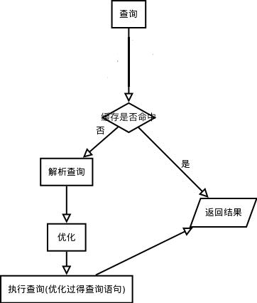
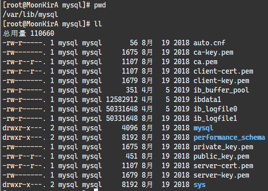

# MySQL数据库-体系架构

## 1. 数据库概述

### 1.1. 数据库相关概念

数据库（DB）是一个以某种组织方式存储在磁盘上的数据的集合。简单理解就是用来存储数据的仓库。

- 数据库 DataBase（DB）：存储数据的仓库，数据是有组织的进行存储
- 数据库管理系统 DataBase Management System (DBMS)：操纵和管理数据库的大型软件
- SQL (Structured Query Language)：操作关系型数据库的编程语言，定义了一套操作关系型数据库统一标准

### 1.2. 存储数据的方式

数据存储在集合中

- 优点：读写速度快
- 缺点：不能永久存储

数据存储在文件中

- 优点：可以永久存储
- 缺点： 频繁的IO操作效率低，查询数据很不方便。

数据存储在数据库中

- 优点：可以永久存储。查询速度快，查询数据很方便
- 缺点：要使用SQL语言执行增删改查操作

### 1.3. 常见的数据库管理系统

- MySQL：开源免费的中小型数据库，后来Sun公司收购了MySQL，而Oracle又收购了Sun公司。从 MySQL 6.x 版本开始推出了收费版本，但也提供了免费的社区版本。
- Oracle：收费的大型数据库，Oracle 公司的产品。Oracle 收购 SUN 公司，收购 MYSQL。
- DB2：IBM公司的大型数据库产品，收费的。常应用在银行系统中.
- SQL Server：MicroSoft 公司收费的中型的数据库。C#、.net 等语言常使用。
- PostgreSQL：开源免费的功能最强大的中小型开源数据库
- SyBase：已经淡出历史舞台。提供了一个非常专业数据建模的工具PowerDesigner。
- SQLite：嵌入式的微型数据库，应用在手机端。Android 内置的数据库采用的就是该数据库。
- MariaDB：开源免费的中小型数据库。是 MySQL 数据库的另外一个分支、另外一个衍生产品，与 MySQL 数据库有很好的兼容性。

Java 目前应用最多的数据库是：MYSQL，Oracle。不论使用以上哪一个关系型数据库，最终在操作时，都是使用 SQL 语言来进行统一操作，因为 SQL 语言，是操作关系型数据库的**统一标准**。所以学习MySQL，同样可以应用到别的关系型数据库，如：Oracle、DB2、SQLServer。

## 2. MySQL 数据库概述

MySQL 官网：https://www.mysql.com/

官方文档：

- https://dev.mysql.com/doc/refman/5.7/en/
- https://dev.mysql.com/doc/mysql-errors/5.7/en/

### 2.1. 相关版本说明

MySQL官方提供了两种不同的版本：

- 社区版本（MySQL Community Server）：免费， MySQL不提供任何技术支持
- 商业版本（MySQL Enterprise Edition）：收费，可以使用30天，官方提供技术支持

### 2.2. MySQL 安装

MySQL 下载地址：https://downloads.mysql.com/archives/community/

此部分内容详见[《MySQL安装与部署》文档](/04-数据库/01-MySQL/03-MySQL安装与部署)

### 2.3. MySQL 数据库特点

- MySQL数据库是用C和C++语言编写的，以保证源码的可移植性
- 支持多个操作系统例如：Windows、Linux、Mac OS等等
- 支持多线程，可以充分的利用CPU资源
- 为多种编程语言提供API，包括C语言，Java，PHP。Python语言等
- MySQL优化了SQL算法，有效的提高了查询速度
- MySQL开放源代码且无版权制约，自主性强、使用成本低。
- MySQL历史悠久、社区及用户非常活跃，遇到问题，可以很快获取到帮助。

## 3. MySQL 体系架构


从上图可以看出，MySQL 最上层是连接组件。<font color=red>**服务器层是由连接池、管理工具和服务、SQL 接口、解析器、优化器、缓存、存储引擎、文件系统组成**</font>

- 连接池：由于每次建立建立需要消耗很多时间，连接池的作用就是将这些连接缓存下来，下次可以直接用已经建立好的连接，提升服务器性能。
- 管理工具和服务：系统管理和控制工具，例如备份恢复、Mysql 复制、集群等
- SQL 接口：接受用户的 SQL 命令，并且返回用户需要查询的结果。比如 `select from xx` 语句就是调用 SQL Interface
- 解析器: SQL 命令传递到解析器的时候会被解析器验证和解析。解析器主要功能：
    - 将 SQL 语句分解成数据结构，并将这个结构传递到后续步骤，以后 SQL 语句的传递和处理就是基于这个结构的
    - 如果在分解构成中遇到错误，那么就说明这个 sql 语句是不合理的
- 优化器：查询优化器，SQL 语句在查询之前会使用查询优化器对查询进行优化
- 缓存器：查询缓存，如果查询缓存有命中的查询结果，查询语句就可以直接去查询缓存中取数据。这个缓存机制是由一系列小缓存组成的。比如表缓存，记录缓存，key 缓存，权限缓存等。
- 存储引擎：存储引擎是底层物理结构和实际文件读写的实现。MySQL 数据库其中一个特点就是其**插件式的表存储引擎**。
- 文件系统：即存储数据的地方

### 3.1. 连接层


最上层是一些客户端和链接服务，包含本地 sock 通信和大多数基于客户端/服务端工具实现的类似于 TCP/IP 的通信。主要完成一些类似于连接处理、授权认证、及相关的安全方案。在该层上引入了线程池的概念，为通过认证安全接入的客户端提供线程。同样在该层上可以实现基于 SSL 的安全链接。

当 MySQL 启动（MySQL 服务器就是一个进程），等待客户端连接，每一个客户端连接请求，服务器都会新建一个线程处理（如果是线程池的话，则是分配一个空的线程），每个线程独立，拥有各自的内存处理空间。通过查询系统参数`max_connections`可以知道服务器最大的连接数。

```sql
mysql> show VARIABLES like '%max_connections%';
+-----------------+-------+
| Variable_name   | Value |
+-----------------+-------+
| max_connections | 151   |
+-----------------+-------+
1 row in set (0.02 sec)
```


连接到服务器，服务器也会为安全接入的每个客户端验证它所具有的操作权限。即用户名、IP、密码验证，一旦连接成功，还要验证是否具有执行某个特定查询的权限（例如，是否允许客户端对某个数据库某个表的某个操作）

### 3.2. Server 层(SQL 处理层)

#### 3.2.1. Server 层功能作用



第二层架构（Server 层）主要完成大多数的核心服务功能，如 SQL 接口，并完成缓存的查询，SQL 语句的解析和优化，部分内置函数的执行，所有跨存储引擎的功能（所谓跨存储引擎就是说每个引擎都需提供的功能（引擎需对外提供接口））如：存储过程、函数、触发器、视图等。该层具体的操作如下：

1. 如果是查询语句（`select`语句），首先会查询缓存是否已有相应结果，有则返回结果，无则进行下一步（如果不是查询语句，同样调到下一步）
2. 解析查询，创建一个内部数据结构（解析树），这个解析树主要用来SQL语句的语义与语法解析；
3. 优化 SQL 语句：例如重写查询，决定表的读取顺序，以及选择需要的索引等。这一阶段用户是可以查询的，查询服务器优化器是如何进行优化的，便于用户重构查询和修改相关配置，达到最优化。这一阶段还涉及到存储引擎，优化器会询问存储引擎，比如某个操作的开销信息、是否对特定索引有查询优化等。

#### 3.2.2. 缓存

相关缓存的参数查询：

```sql
-- 默认不开启
show variables like '%query_cache_type%';
-- 默认值 1M
show variables like '%query_cache_size%';
```

**QC（query cache） 严格要求 2 次 SQL 请求要完全一样，包括 SQL 语句，连接的数据库、协议版本、字符集等因素都会影响**。

```sql
-- 会报错,query_cache_type 只能配置在 my.cnf 文件中
SET GLOBAL query_cache_type = 1;
```

`query_cache_type`只能配置在 my.cnf 文件中，这大大限制了 qc 的作用。在生产环境建议不开启，除非经常有 sql 完全一模一样的查询。

从 8.0 开始，MySQL 不再使用查询缓存。MySQL 的工程团队发现启用缓存的好处并不多。

- 首先，查询缓存的效果取决于缓存的命中率，只有命中缓存的查询效果才能有改善，因此无法预测其性能。
- 其次，查询缓存的另一个大问题是它受到单个互斥锁的保护。在具有多个内核的服务器上，大量查询会导致大量的互斥锁争用。

通过基准测试发现，大多数工作负载最好禁用查询缓存(5.6 的默认设置)：按照官方所说的：造成的问题比它解决问题要多的多，弊大于利就直接砍掉了

### 3.3. 存储引擎层

MySQL 数据库区别于其他数据库的最重要的一个特点就是其插件式的表存储引擎。MySQL 插件式的存储引擎架构提供了一系列标准的管理和服务支持，这些标准与存储引擎本身无关，可能是每个数据库系统本身都必需的，如 SQL 分析器和优化器等，而存储引擎是底层物理结构和实际文件读写的实现，服务器通过API和存储引擎进行通信。

每个存储引擎开发者可以按照自己的意愿来进行开发。不同的存储引擎具有不同的功能，这样使用者也可以根据自己的需要，来选取合适的存储引擎。**数据库中的索引是在存储引擎层实现的**。

插件式存储引擎的好处是，每个存储引擎都有各自的特点，能够根据具体的应用建立不同存储引擎表。由于 MySQL 数据库的开源特性，用户可以根据 MySQL预定义的存储引擎接口编写自己的存储引擎。若用户对某一种存储引擎的性能或功能不满意，可以通过修改源码来得到想要的特性，

> Notes: <font color=red>**MySQL 的核心就是存储引擎。值得注意的是：在MySQL中，存储引擎是针对表！！官方建议在同一个数据库中，尽量所有表都使用同一个存储引擎，否则会出现一些奇怪的问题。**</font>

存储引擎可以分为 MySQL 官方存储引擎和第三方存储引擎

#### 3.3.1. MySQL 官方引擎概要

##### 3.3.1.1. InnoDB 存储引擎

InnoDB 是 MySQL 的默认事务型存储引擎，有行级锁定和外键约束。也是最重要、使用最广泛的存储引擎。它被设计用来处理大量的短期(short-lived)事务，短期事务大部分情况是正常提交的，很少会被回滚。InnoDB 的性能和自动崩溃恢复特性，使得它在非事务型存储的需求中也很流行。

在 MySQL 5.5 之后，InnoDB 是默认的 MySQL 存储引擎。

特点：

- DML操作遵循ACID模型，支持事务；
- 行级锁，提高并发访问性能；
- 支持外键FOREIGN KEY约束，保证数据的完整性和正确性；

##### 3.3.1.2. MyISAM 存储引擎

在 MySQL 5.1 及之前的版本，MyISAM 是默认的存储引擎。MyISAM 提供了大量的特性，包括全文索引、压缩、空间函数（GIS）等，但 MyISAM 不支持事务和行级锁，而且有一个毫无疑问的缺陷就是崩溃后无法安全恢复。但有插入数据快，空间和内存使用比较低等优点。

尽管MyISAM引擎不支持事务、不支持崩溃后的安全恢复，但它绝不是一无是处的。对于只读的数据，或者表比较小、可以忍受修复（repair）操作，则依然可以继续使用 MyISAM（但请不要默认使用 MyISAM，而是应当默认使用 InnoDB)。但是 MyISAM 对整张表加锁，而不是针对行。读取时会对需要读到的所有表加共享锁，写入时则对表加排他锁。MyISAM 很容易因为表锁的问题导致典型的的性能问题。

##### 3.3.1.3. Mrg_MyISAM

Merge 存储引擎，是一组 MyIsam 的组合，也就是说，他将 MyIsam 引擎的多个表聚合起来，但是他的内部没有数据，真正的数据依然是 MyIsam 引擎的表中，但是可以直接进行查询、删除更新等操作。

##### 3.3.1.4. Archive 引擎

Archive 存储引擎只支持 `INSERT` 和 `SELECT` 操作，在 MySQL 5.1 之前也不支持索引。Archive 引擎会缓存所有的写并利用 zlib 对插入的行进行压缩，所以比MyISAM 表的磁盘 I/O 更少。但是每次 `SELECT` 查询都需要执行全表扫描。所以Archive表适合日志和数据采集类应用，这类应用做数据分析时往往需要全表扫描。或者在一些需要更快速的 `INSERT` 操作的场合下也可以使用。Archive 引擎不是一个事务型的引擎，而是一个针对高速插入和压缩做了优化的简单引擎。

##### 3.3.1.5. Blackhole 引擎

Blackhole 引擎没有实现任何的存储机制，它会丢弃所有插入的数据，不做任何存储，Select 语句的内容永远是空。但是服务器会记录 Blackhole 表的日志，所以可以用于复制数据到备份数据库，或者只是简单地记录到日志。这种特殊的存储引擎可以在一些特殊的复制架构和日志审核时发挥作用。但这种引擎在应用方式上有很多问题，因此并不推荐。其使用场景有：

1. 验证 dump file 语法的正确性
2. 以使用 blackhole 引擎来检测 binlog 功能所需要的额外负载

```sql
CREATE TABLE `Blackhole` (
	`id` BIGINT (20) UNSIGNED NOT NULL,
	`fname` VARCHAR (100) NOT NULL,
	`lname` VARCHAR (100) NOT NULL,
	`age` TINYINT (3) UNSIGNED NOT NULL,
	`sex` TINYINT (1) UNSIGNED NOT NULL,
	PRIMARY KEY (`id`)
) ENGINE = Blackhole DEFAULT CHARSET = utf8
```

##### 3.3.1.6. CSV 引擎

CSV 引擎可以将普通的 CSV 文件(逗号分割值的文件）作为 MySQL 的表来处理，但这种表不支持索引。CSV 引擎可以在数据库运行时拷入或者拷出文件。可以将 Excel 等的数据存储为 CSV 文件，然后复制到 MySQL 数据目录下，就能在MySQL 中打开使用。同样，如果将数据写入到一个 CSV 引擎表，其他的外部程序也能立即从表的数据文件中读取 CSV 格式的数据。因此 CSV 引擎可以作为一种数据交换的机制，非常有用。

##### 3.3.1.7. Federated 引擎

Federated 引擎是访问其他 MySQL 服务器的一个代理，它会创建一个到远程MySQL 服务器的客户端连接，并将查询传输到远程服务器执行，然后提取或者发送需要的数据。最初设计该存储引擎是为了和企业级数据库如 Microsoft SQL Server 和 Oracle 的类似特性竞争的，可以说更多的是一种市场行为。尽管该引擎看起来提供了一种很好的跨服务器的灵活性，但也经常带来问题，因此默认是禁用的。

##### 3.3.1.8. Memory 引擎

MEMORY存储引擎的所有数据都在内存中，数据的处理速度快，但安全性不高。

如果需要快速地访问数据，并且这些数据不会被修改，重启以后丢失也没有关系，那么使用 Memory 表(以前也叫做 HEAP 表）是非常有用的。Memory 表至少比 MyISAM 表要快一个数量级，因为每个基于 MEMORY 存储引擎的表实际对应一个磁盘文件。该文件的文件名与表名相同，类型为 frm 类型。该文件中只存储表的结构。而其数据文件，都是存储在内存中，这样有利于数据的快速处理，提高整个表的效率，不需要进行磁盘 I/O。所以 Memory 表的结构在重启以后还会保留，但数据会丢失。Memroy 表在很多场景可以发挥好的作用:

- 用于查找(lookup）或者映射(mapping）表，例如将邮编和州名映射的表。
- 用于缓存周期性聚合数据(periodically aggregated data)的结果。
- 用于保存数据分析中产生的中间数据。

Memory 表支持 Hash 索引，因此查找操作非常快。虽然 Memory 表的速度非常快，但还是无法取代传统的基于磁盘的表。Memroy 表是表级锁，因此并发写入的性能较低。它不支持 BLOB 或 TEXT 类型的列，并且每行的长度是固定的，所以即使指定了 VARCHAR 列，实际存储时也会转换成 CHAR，这可能导致部分内存的浪费。

##### 3.3.1.9. NDB 集群引擎

使用 MySQL 服务器、NDB 集群存储引擎，以及分布式的、share-nothing 的、容灾的、高可用的 NDB 数据库的组合，被称为 MySQL 集群（(MySQL Cluster)。

#### 3.3.2. 值得了解的第三方引擎

##### 3.3.2.1. Percona 的 XtraDB 存储引擎

基于 InnoDB 引擎的一个改进版本，已经包含在 Percona Server 和 MariaDB 中，它的改进点主要集中在性能、可测量性和操作灵活性方面。XtraDB 可以作为 InnoDB 的一个完全的替代产品，甚至可以兼容地读写 InnoDB 的数据文件，并支持 InnoDB 的所有查询。

##### 3.3.2.2. TokuDB 引擎

使用了一种新的叫做分形树(Fractal Trees)的索引数据结构。该结构是缓存无关的，因此即使其大小超过内存性能也不会下降，也就没有内存生命周期和碎片的问题。TokuDB 是一种大数据（Big Data)存储引擎，因为其拥有很高的压缩比，可以在很大的数据量上创建大量索引。现在该引擎也被 Percona 公司收购。

Tips：分形树，是一种写优化的磁盘索引数据结构。在一般情况下，分形树的写操作（Insert/Update/Delete）性能比较好，同时它还能保证读操作近似于B+树的读性能。据测试结果显示，TokuDB分形树的写性能优于 InnoDB 的 B+树，读性能略低于 B+树。分形树核心思想是利用节点的 MessageBuffer 缓存更新操作，充分利用数据局部性原理，将随机写转换为顺序写，这样极大的提高了随机写的效率。

##### 3.3.2.3. Infobright

MySQL 默认是面向行的，每一行的数据是一起存储的，服务器的查询也是以行为单位处理的。而在大数据量处理时，面向列的方式可能效率更高，比如 HBASE 就是面向列存储的。

Infobright 是最有名的面向列的存储引擎。在非常大的数据量（数十 TB)时，该引擎工作良好。Infobright 是为数据分析和数据仓库应用设计的。数据高度压缩，按照块进行排序，每个块都对应有一组元数据。在处理查询时，访问元数据可决定跳过该块，甚至可能只需要元数据即可满足查询的需求。但该引擎不支持索引，不过在这么大的数据量级，即使有索引也很难发挥作用，而且块结构也是一种准索引 (quasi-index)。Infobright 需要对 MySQL 服务器做定制，因为一些地方需要修改以适应面向列存储的需要。如果查询无法在存储层使用面向列的模式执行，则需要在服务器层转换成按行处理，这个过程会很慢。Infobright 有社区版和商业版两个版本。

#### 3.3.3. 指定表的存储引擎

在创建表的时候，通过`engine`关键字指定存储引擎。语法结构如下：

```sql
create table xxx(...) engine=存储引擎名称;
```

#### 3.3.4. 表的存储引擎转换

有很多种方法可以将表的存储引擎转换成另外一种引擎。每种方法都有其优点和缺点。常用的有三种方法：

##### 3.3.4.1. ALTER TABLE

将表从一个引擎修改为另一个引擎最简单的办法是使用 `ALTER TABLE` 语句。

```sql
ALTER TABLE mytable ENGINE = InnoDB;
```

上面语句将 mytable 的引擎修改为 InnoDB。该语法可以适用任何存储引擎。但需要执行很长时间，在实现上，MySQL 会按行将数据从原表复制到一张新的表中，在复制期间可能会消耗系统所有的I/O 能力，同时原表上会加上读锁。所以，在繁忙的表上执行此操作要特别小心。如果转换表的存储引擎，将会失去和原引擎相关的所有特性。

##### 3.3.4.2. 导出与导入

还可以使用 mysqldump 工具将数据导出到文件，然后修改文件中 `CREATE TABLE` 语句的存储引擎选项，注意同时修改表名，因为同一个数据库中不能存在相同的表名，即使它们使用的是不同的存储引擎。

##### 3.3.4.3. CREATE 和 SELECT

先创建一个新的存储引擎的表，然后利用 `INSERT…SELECT` 语法来导数据:

```sql
CREATE TABLE innodb_table LIKE myisam_table;
ALTER TABLE innodb_table ENGINE=InnoDB;
INSERT INTO innodb_table SELECT * FROM myisam_table;
```

如果数据量很大，则可以考虑做分批处理，针对每一段数据执行事务提交操作。

#### 3.3.5. 检查 MySQL 的引擎

- 查询 MySQL 已提供哪些存储引擎

```sql
mysql> show engines;
+--------------------+---------+----------------------------------------------------------------+--------------+------+------------+
| Engine             | Support | Comment                                                        | Transactions | XA   | Savepoints |
+--------------------+---------+----------------------------------------------------------------+--------------+------+------------+
| InnoDB             | DEFAULT | Supports transactions, row-level locking, and foreign keys     | YES          | YES  | YES        |
| MRG_MYISAM         | YES     | Collection of identical MyISAM tables                          | NO           | NO   | NO         |
| MEMORY             | YES     | Hash based, stored in memory, useful for temporary tables      | NO           | NO   | NO         |
| BLACKHOLE          | YES     | /dev/null storage engine (anything you write to it disappears) | NO           | NO   | NO         |
| MyISAM             | YES     | MyISAM storage engine                                          | NO           | NO   | NO         |
| CSV                | YES     | CSV storage engine                                             | NO           | NO   | NO         |
| ARCHIVE            | YES     | Archive storage engine                                         | NO           | NO   | NO         |
| PERFORMANCE_SCHEMA | YES     | Performance Schema                                             | NO           | NO   | NO         |
| FEDERATED          | NO      | Federated MySQL storage engine                                 | NULL         | NULL | NULL       |
+--------------------+---------+----------------------------------------------------------------+--------------+------+------------+
9 rows in set (0.03 sec)
```

- 查询 MySQL 当前默认的存储引擎

```sql
mysql> show variables like '%storage_engine%';
+----------------------------------+--------+
| Variable_name                    | Value  |
+----------------------------------+--------+
| default_storage_engine           | InnoDB |
| default_tmp_storage_engine       | InnoDB |
| disabled_storage_engines         |        |
| internal_tmp_disk_storage_engine | InnoDB |
+----------------------------------+--------+
4 rows in set (0.04 sec)
```

#### 3.3.6. MyISAM、InnoDB 与 Memory 比较


|     功能     |     InnoDB      | MyISAM |    Memory    |
| ----------- | :-------------: | :----: | :----------: |
| 存储限制     |      64TB       | 256TB  | 依赖RAM的大小 |
| 事务         |        √        |   -    |      -       |
| 锁机制       |    行锁/表锁     |  表锁   |     表锁      |
| B+tree索引   |        √        |   √    |      √       |
| Hash索引     |        -        |   -    |      √       |
| 全文索引     | √(5.6版本后支持) |   √    |      -       |
| 集群索引     |        √        |   -    |      -       |
| 数据索引     |        √        |   -    |      √       |
| 数据压缩     |        -        |   √    |      -       |
| 空间使用率   |        高        |   低    |      -       |
| 内存使用     |        高        |   低    |     中等      |
| 批量插入速度 |        低        |   高    |     高        |
| 支持外键     |        √        |   -    |      -       |

#### 3.3.7. 选择合适的引擎

大部分情况下，InnoDB 都是正确的选择，所以在 MySQL 5.5 版本将 InnoDB 作为默认的存储引擎了。对于如何选择存储引擎，可以简单地归纳为一句话：“除非需要用到某些 InnoDB 不具备的特性，并且没有其他办法可以替代，否则都应该优先选择 InnoDB 引擎”。比如，MySQL 中只有 MyISAM 支持地理空间搜索。

如果不需要用到 InnoDB 的特性，同时其他引擎的特性能够更好地满足需求，也可以考虑一下其他存储引擎。举个例子，如果不在乎可扩展能力和并发能力，也不在乎崩溃后的数据丢失问题，却对 InnoDB 的空间占用过多比较敏感，这种场合下选择 MyISAM 就比较合适。

小结如下：

- InnoDB：是 Mysql 的默认存储引擎，支持事务、外键。如果应用对事务的完整性有比较高的要求，在并发条件下要求数据的一致性，数据操作除了插入和查询之外，还包含很多的更新、删除操作，那么 InnoDB 存储引擎是比较合适的选择。
- MyISAM：如果应用是以读操作和插入操作为主，只有很少的更新和删除操作，并且对事务的完整性、并发性要求不是很高，那么选择这个存储引擎是非常合适的。
- MEMORY：将所有数据保存在内存中，访问速度快，通常用于临时表及缓存。MEMORY 的缺陷就是对表的大小有限制，太大的表无法缓存在内存中，而且无法保障数据的安全性。

<font color=red>**建议不要混合使用多种存储引擎**</font>，否则可能带来一系列复杂的问题，以及一些潜在的 bug 和边界问题。存储引擎层和服务器层的交互已经比较复杂，更不用说混合多个存储引擎了。至少，混合存储对一致性备份和服务器参数配置都带来了一些困难。

### 3.4. MySQL 数据库运行流程图


## 4. 启动选项和参数

### 4.1. 配置参数文件

当 MySQL 实例启动时，数据库会先去读一个配置参数文件，用来寻找数据库的各种文件所在位置以及指定某些初始化参数。在默认情况下，MySQL 实例会在按一定的顺序中的指定位置读取配置，用户只需通过命令即可查看到相应的配置位置读取顺序。

```bash
mysql --help | grep my.cnf
```


> <font color=red>**注：都是后面配置文件中的配置项会覆盖前面配置文件中的相同的配置项**</font>

MySQL 实例可以不需要参数文件，这时所有的参数值取决于编译 MySQL 时指定的默认值和源代码中指定参数的默认值。MySQL 数据库的参数文件是以文本方式进行存储的。通过文本编辑软件即可进行参数的修改

### 4.2. 参数的查看和修改

在命令行中输入以下命令可查看数据库中的所有参数。

```sql
-- 查询数据库中的所有参数
SHOW VARIABLES;

-- 模糊查询数据库参数
SHOW VARIABLES LIKE '%xxx%';
```

> 从 MySQL 5.1 版本开始，还可以通过 information_schema 架构下的 `GLOBAL_VARIABLES` 视图来进行查找，推荐使用命令`show variables`，使用更为简单，且各版本的 MySQL 数据库都支持。

#### 4.2.1. MySQL 数据库中的参数的分类

从不同的角度来说，主要分成两类

从类型上：动态(dynamic)参数和静态(static)参数

- 动态参数意味着可以在 MySQL 实例运行中进行更改
- 静态参数说明在整个实例生命周期内都不得进行更改，即只读(read only)

从作用范围上：全局变量(GLOBAL)和会话变量(SESSION/LOCAL)

- 全局变量（GLOBAL）影响服务器的整体操作。
- 会话变量（SESSION/LOCAL）影响某个客户端连接的操作。

用 default_storage_engine 来作为示例说明，在服务器启动时会初始化一个名为 default_storage_engine，作用范围为 `GLOBAL` 的系统变量。之后每当有一个客户端连接到该服务器时，服务器都会单独为该客户端分配一个名为`default_storage_engine`，作用范围为`SESSION`的系统变量，该作用范围为`SESSION`的系统变量值按照当前作用范围为`GLOBAL`的同名系统变量值进行初始化。

#### 4.2.2. 动态参数值的修改

通过 `SET` 命令对动态的参数值进行修改。语法如下：

```bash
SET [global | session ] system_var_name= expr
SET [@@global. | @@session.] system_var_name= expr
```

示例：

```bash
SET read_ buffer_size=524288;
SET @@global.read_ buffer_size=524288;
```

### 4.3. MySQL官方手册（系统参数部分）

官方文档（5.7版本）地址：https://dev.mysql.com/doc/refman/5.7/en/server-system-variables.html

## 5. MySQL 数据目录结构分析

像 InnoDB、MyIASM 这样的存储引擎都是把表存储在磁盘上。

### 5.1. 数据目录的位置

通过以下命令可以查看当前 MySql 数据库存储数据的目录位置

```sql
mysql> show variables like 'datadir';
+---------------+----------------+
| Variable_name | Value          |
+---------------+----------------+
| datadir       | /var/lib/mysql |
+---------------+----------------+
1 row in set (0.04 sec)
```

> Notes: 存储目录位置可以通过配置文件进行修改。

### 5.2. 数据目录的文件

**数据目录中包含创建的数据库、表、视图和触发器等用户数据**，除了这些用户数据，为了程序更好的运行，MySQL 也会创建一些其他的额外数据

#### 5.2.1. 数据库的存储

在使用 `CREATE DATABASE` 语句创建一个数据库时，MySQL会进行以下的处理：

1. 在数据目录下创建一个和数据库名同名的子目录（文件夹)
2. 在该与数据库名同名的子目录下创建一个名为`db.opt`的文件，这个文件中包含了该数据库的各种属性，例如该数据库的字符集和比较规则等等。



进入`datadir`数据目录查看，除了 `information_schema` 这个系统数据库（*比较特殊*）外，其他的数据库在数据目录下都有对应的子目录。

#### 5.2.2. 表的存储

MySQL数据库表的信息可以分成：

1. **表结构的定义**：是定义了表每列的数据类型、约束条件、索引、字符集等等信息。InnoDB 和 MyIASM 这两种存储引擎都在数据目录下对应的数据库子目录下创建了一个专门用于存储描述表结构信息的文件，其文件名是：`表名.frm`
2. **表中的数据**：就是实际每个表的存储的数据。而不同的存储引擎保存的文件格式、数量也不一样。

#### 5.2.3. InnoDB 表数据的存储

InnoDB 的数据会放在一个表空间或者文件空间（英文名: table space 或者 filespace)的概念，这个表空间是一个抽象的概念，它可以对应文件系统上一个或多个真实文件〈不同表空间对应的文件数量可能不同)。每一个表空间可以被划分为很多个页，表数据就存放在某个表空间下的某些页里。表空间有好几种类型。

- **系统表空间(system tablespace)**

系统表空间可以对应文件系统上一个或多个实际的文件，默认情况下，InnoDB 会在数据目录下创建一个名为 ibdata1(在数据目录下)、大小为 12M 的文件，这个文件就是对应的系纳表空间在文件系统上的表示。


此文件是自扩展文件，即存储空间不够用时，它会自己增加文件大小。如果想让系统表空间对应文件系统上多个实际文件，可以在 MySQL 启动时配置对应的文件路径以及它们的大小，也可以把系统表空间对应的文件路径不配置到数据目录下，甚至可以配置到单独的磁盘分区上

<font color=red>**需要注意的一点是：在一个 MySQL 服务器中，系统表空间只有一份。从 MySQL5.5.7 到 MySQL5.6.6 之间的各个版本中，表中的数据都会被默认存储到这个系统表空间。**</font>

- **独立表空间(file-per-table tablespace)**

在 MySQL5.6.6 以及之后的版本中，InnoB 并不会默认的把各个表的数据存储到系统表空间中，而是为<font color=red>**每一个表建立一个独立表空间**</font>，也就是说用户创建了多少个表，就有多少个独立表空间。

使用独立表空间来存储表数据的话，会在该表所属数据库对应的子目录下创建一个表示该独立表空间的文件，文件名和表名相同，文件的扩展名是`.ibd`，即：`表名.ibd`


如上例，`consult_content.ibd`文件就用来存储`consult_content`表中的数据和索引。也可以指定使用系统表空间还是独立表空间来存储数据，这个功能由启动参数`innodb_file_per_table`控制。配置示例如下：

```
[server]
innodb_file_per_table=0
```

上面的配置意思是：当`imodb_file_per table`的值为0时，代表使用系统表空间；当`innodb_file pertable`的值为1时，代表使用独立表空间。需要注意的是`inmodb_file_per_table`参数只对新建的表起作用，对于已经分配了表空间的表并不起作用。

可以直接通过命令查询：

```sql
mysql> show variables like 'innodb_file_per_table';
+-----------------------+-------+
| Variable_name         | Value |
+-----------------------+-------+
| innodb_file_per_table | ON    |
+-----------------------+-------+
1 row in set (0.04 sec)
```

- **其他类型的表空间**

随着 MySQL 的发展，除了上述两种老牌表空间之外，现在还新提出了一些不同类型的表空间，比如通用表空间(general tablespace)，undo 表空间(undotablespace)、临时表空间（temporary tablespace)等。

#### 5.2.4. InnoDB 逻辑存储结构


- 表空间：InnoDB 存储引擎逻辑结构的最高层，ibd 文件其实就是表空间文件，在表空间中可以包含多个 Segment 段。
- 段：表空间是由各个段组成的， 常见的段有数据段、索引段、回滚段等。InnoDB 中对于段的管理，都是引擎自身完成，不需要人为对其控制，一个段中包含多个区。
- 区：是表空间的单元结构，每个区的大小为 1M。 默认情况下，InnoDB 存储引擎页大小为16K，即一个区中一共有64个连续的页。
- 页：是组成区的最小单元，页也是 InnoDB 存储引擎磁盘管理的最小单元，每个页的大小默认为 16KB。为了保证页的连续性，InnoDB 存储引擎每次从磁盘申请 4-5 个区。
- 行：InnoDB 存储引擎是面向行的，也就是说数据是按行进行存放的，在每一行中除了定义表时所指定的字段以外，还包含两个隐藏字段

#### 5.2.5. MyIASM 表数据的存储

在 MyISAM 存储引擎表中的数据和索引是分开存放的。所以在文件系统中也是使用不同的文件来存储数据文件和索引文件。与 InnoDB 不同的是，MyISAM 并没有表空间的概念，表数据都存放到对应的数据库子目录下。

```sql
-- 创建不同的是，MyISAM的表
create table a_myisam(c1 int) engine=MyISAM;
```


如上例所示：`a_myisam.MYD`是表的数据文件；`a_myisam.MYI`是表的索引文件。

### 5.3. 日志文件

服务器运行过程中，会产生各种各样的日志，比如常规的查询日志、错误日志、二进制日志、redo日志、Undo日志等等，日志文件记录了影响 MySQL 数据库的各种类型活动。

MySQL常见的日志文件有：错误日志（error log）、慢查询日志（slow query log）、查询日志（query log）、二进制文件（bin log）。

#### 5.3.1. 错误日志

错误日志文件对 MySQL 的启动、运行、关闭过程进行了记录。遇到问题时应该首先查看该文件以便定位问题。该文件不仅记录了所有的错误信息，也记录一些警告信息或正确的信息。通过下面命令来查看错误日志文件的位置：

```sql
show variables like 'log_error';
```

默认日志文件名称：`主机名.err`

> 当 MySQL 不能正常启动时，第一个必须查找的文件应该就是错误日志文件

#### 5.3.2. 慢查询日志

慢查询日志可以帮助定位可能存在问题的 SQL 语句，从而进行 SQL 语句层面的优化。

慢查询日志记录了所有执行时间超过参数 `long_query_time` 设置值并且扫描记录数不小于 `min_examined_row_limit` 的所有的SQL语句的日志。`long_query_time` 默认为 10 秒，最小为 0， 精度可以到微秒。

慢查询日志相关配置

```properties
# 该参数用来控制慢查询日志是否开启，可取值：1|0，1 代表开启， 0 代表关闭
slow_query_log=1

 # 该参数用来指定慢查询日志的文件名。日志文件名称：`主机名-slow.log`
slow_query_log_file=slow_query.log

# 该选项用来配置查询的时间限制，超过这个时间将认为值慢查询，将需要进行日志记录，默认10s
long_query_time=10
```

#### 5.3.3. 查询日志

查询日志记录了所有对 MySQL 数据库请求的信息，无论这些请求是否正确的执行。*而二进制日志不包含查询数据的SQL语句*。

默认情况下， 查询日志是未开启的。如果需要开启查询日志，可以设置以下配置：

```properties
# 该选项用来开启查询日志，可选值：0|1；0代表关闭，1代表开启
general_log=1

# 设置日志的文件名，如果没有指定， 默认日志文件名称：主机名.log
general_log_file=file_name
```

查看 MySQL 是否开启了查询日志

```sql
show variables like 'general_log';
```

从 MySQL 5.1 开始，可以将查询日志的记录放入 mysql 架构下的 `general_log` 表中

```sql
SELECT * FROM general_log;
```

#### 5.3.4. 二进制日志（binlog）

二进制日志记录了对 MySQL 数据库执行更改的所有操作，若操作本身没有导致数据库发生变化，该操作可能也会写入二进制文件。但是不包括 `select` 和 `show` 这类操作（因为这些操作对数据本身不会进行修改）

##### 5.3.4.1. 二进制日志的几种作用

- 恢复（recovery）：某些数据的恢复需要二进制日志，例如，在一个数据库全备文件恢复后，用户可以通过二进制文件进行 point-in-time 的恢复
- 复制（replication）：其原理与恢复类似，通过复制和执行二进制日志使一台远程的 MySQL 数据库（一般称为 slave 或 standby）与一台 MySQL 数据库（一般称为 master 或 primary）进行实时同步
- 审计（audit）：用户可以通过二进制日志中的信息来进行审计，判断是否有对数据库进行注入的攻击

##### 5.3.4.2. log-bin 参数

该参数用来控制是否开启二进制日志，默认为关闭。如果想要开启二进制日志的功能，可以在 MySQL 的配置文件中指定如下的格式：

```properties
# 启用/设置二进制日志文件(name 可省略)
log-bin=name;
```

> 配置说明：
>
> “name”为二进制日志文件的名称。如果不提供 name，那么数据库会使用默认的日志文件名（文件名为主机名，后缀名为二进制日志的序列号），且文件保存在数据库所在的目录（datadir下）

配置以后，就会在数据目录下产生类似于：

bin_log.00001 即为二进制日志文件；bin_log.index 为二进制的索引文件，用来存储过往产生的二进制日志序号，通常情况下，不建议手动修改这个文件。

二进制日志文件在默认情况下并没有启动，需要手动指定参数来启动。开启这个选项会对 MySQL 的性能造成影响，但是性能损失十分有限。根据 MySQL 官方手册中的测试指明，开启二进制日志会使性能下降 1%。

##### 5.3.4.3. 日志格式

查看binlog日志的格式

```sql
show variables like 'binlog_format';
```

**STATEMENT**

该日志格式在日志文件中记录的都是SQL语句（statement），每一条对数据进行修改的SQL都会记录在日志文件中，通过Mysql提供的mysqlbinlog工具，可以清晰的查看到每条语句的文本。主从复制的时候，从库（slave）会将日志解析为原文本，并在从库重新执行一次。

**ROW**

该日志格式在日志文件中记录的是每一行的数据变更，而不是记录SQL语句。比如执行SQL语句：`update tb_book set status='1'`，如果是STATEMENT 日志格式，在日志中会记录一行SQL文件；如果是ROW，由于是对全表进行更新，也就是每一行记录都会发生变更，ROW 格式的日志中会记录每一行的数据变更。

**MIXED**

混合了STATEMENT 和 ROW两种格式。

##### 5.3.4.4. 查询日记

```sql
-- 查看所有日志
show binlog events;

-- 查看最新的日志
show master status;
```

##### 5.3.4.5. 清空所有binlog日志

语法：

```sql
-- 清空所有的 binlog 日志文件
reset master
```

### 5.4. 其他数据文件

MySQL数据目录除了以上的数据文件之外，还有运行程序的额外文件。*这些额外的文件可以在配置文件或者启动时另外指定存放目录*。主要包括这几种类型的文件：

- **服务器进程文件**：每运行一个 MySQL 服务器程序，都意味着启动一个进程。MySQL 服务器会把自己的进程 ID 写入到一个 pid 文件中。
- **socket文件**
- **默认/自动生成的 SSL 和 RSA 证书和密钥文件**


## 6. MySQL 中的系统库（了解扩展）（TODO mark: 补充中...）

### 6.1. MySQL默认4个系统库简介

#### 6.1.1. mysql默认4个初始数据库的作用

MySQL 有几个系统数据库，这几个数据库包含了 MySQL 服务器运行过程中所需的一些信息以及一些运行状态信息

- **performance_schema**

这个数据库里主要保存 MySQL 服务器运行过程中的一些状态信息，算是对MySQL 服务器的一个性能监控信息数据库。包括统计最近执行了哪些语句，在执行过程的每个阶段都花费了多长时间，内存的使用情况等等信息。

- **information_schema**

这个数据库保存着 MySQL 服务器维护的所有其他数据库的信息，比如有哪些表、哪些视图、哪些触发器、哪些列、哪些索引。这些信息并不是真实的用户数据，而是一些描述性信息，有时候也称之为元数据。

- **sys**

这个数据库主要是通过视图的形式把 information_schema 和 performance_schema 结合起来，让程序员可以更方便的了解 MySQL 服务器的一些性能信息。

- **mysql**

这个数据库核心，它存储了 MySQL 的用户账户和权限信息，一些存储过程、事件的定义信息，一些运行过程中产生的日志信息，一些帮助信息以及时区信息等。

-**test**

测试数据库。

#### 6.1.2. performance_schema 系统库

##### 6.1.2.1. 简介

MySQL 的 `performance_schema` 系统库是运行在较低级别的用于监控 MySQL Server 运行过程中的资源消耗、资源等待等情况的一个功能特性，有以下的特点：


#### 6.1.3. sys 系统库


#### 6.1.4. information_schema 系统库


#### 6.1.5. mysql 系统库（名称为mysql）

