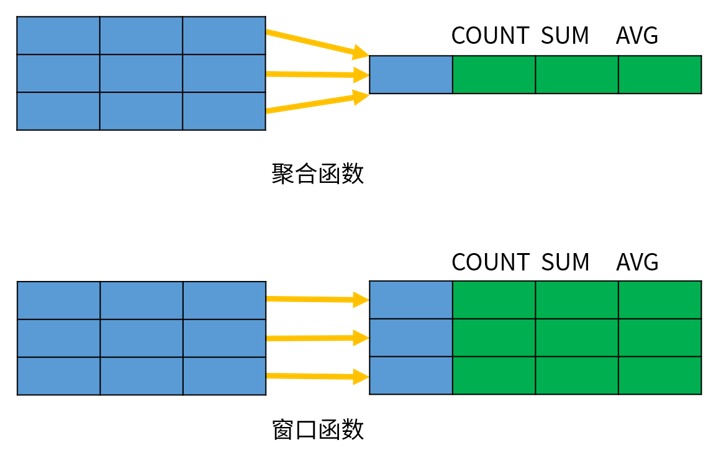
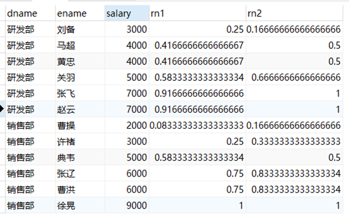
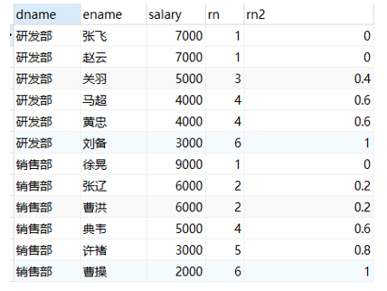
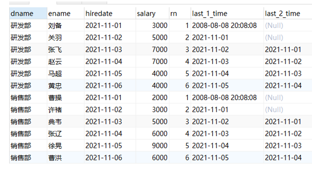
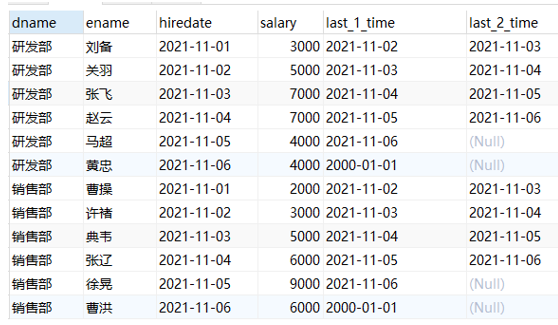
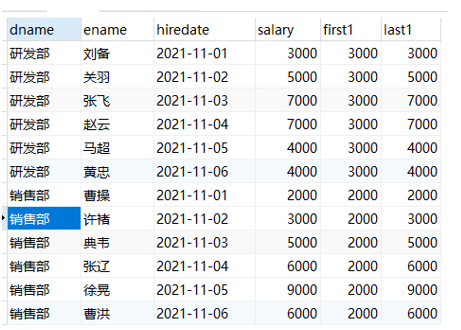
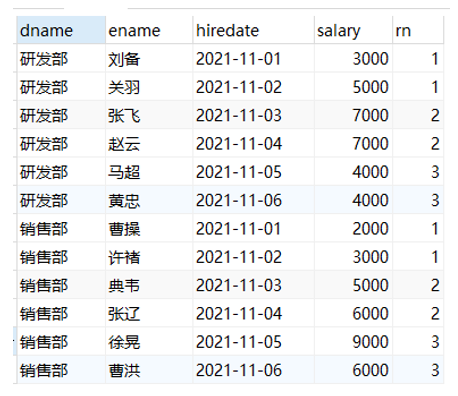

# MySQL数据库-SQL基础

## 1. SQL 的概念

- 结构化查询语言(Structured Query Language)简称 SQL，是结构化查询语言，用于一种访问和处理数据库的标准的计算机语言。
- 作用：用于存取数据、查询、更新和管理关系数据库系统。
- 关系型数据库：使用表格存储数据的数据库

### 1.1. SQL 特点

- 具有综合统一性，不同数据库的支持的SQL稍有不同
- 非过程化语言
- 语言简捷，用户容易接受
- 以一种语法结构提供两种使用方式

### 1.2. SQL 语法特点

- SQL 对关键字的大小写不敏感
- SQL语句可以以单行或者多行书写，以分号结束

### 1.3. SQL和数据库管理系统的关系

- SQL是一种用于操作数据库的语言，SQL适用于所有关系型数据库。
- MySQL、Oracle、SQLServer是一个数据库软件，这些数据库软件支持标准SQL，也就是通过SQL可以使用这些软件，不过每一个数据库系统会在标准SQL的基础上扩展自己的SQL语法。
- 大部分的NoSQL数据库有自己的操作语言，对SQL支持的并不好。

### 1.4. 数据库服务器、数据库和表的关系

**一般在实际开发中，一个项目就对应一个数据库**

所谓数据库服务器，是指在机器上装了一个数据库管理程序，这个管理程序可以管理多个数据库，一般开发人员会针对每一个应用创建一个数据库。为保存应用中实体的数据，一般会在数据库创建多个表，以保存程序中实体的数据。

### 1.5. MySQL 数据库创建顺序与管理

- 创建的顺序
	- 创建数据库 --> 创建数据表 --> 存储数据
	- 一个数据库包含多个数据表
- 通过 SQL 语句对数据库(如：MySQL)进行管理。

### 1.6. 实体类与表的对应关系

1. 整个数据表可以看作为一个类
2. 数据表中的每一列代表具体类一个成员变量
3. 数据表的一行称之为一条纪录，对应一个类的对象

### 1.7. 数据库中的主要对象

1. 表(Table)：在数据库中存储数据记录的容器，一个表中包含多行数据记录。
2. 视图(View)：是从一个或多个表导出的虚拟表，视图本身并不存储数据。
3. 索引(index)：是对数据库表中一列或多列的值进行排序的一种结构，使用索引可快速访问数据库表中的特定信息，类似于书籍的目录。
4. 存储过程(Procedure)：一组为了完成特定功能的 SQL 语句集，存储在数据库中，经过第一次编译后再次调用不需要再次编译，用户通过指定存储过程的名字并给出参数来执行它。
5. 触发器(Trigger)：触发器是一种特殊类型的存储过程，它在指定的表中的数据发生变化时自动生效。唤醒调用触发器以响应 INSERT、UPDATE 或 DELETE 语句。

### 1.8. SQL 语言的分类

#### 1.8.1. 数据定义语言：简称DDL(Data Definition Language)

- 用来创建，修改，删除数据库中的各种对象：数据库，表，列等。
- 【关键字】创建：`create`，更改：`alter`，移除：`drop`等

#### 1.8.2. 数据操作语言：简称DML(Data Manipulation Language)

- 用来修改、删除、添加数据的语句。
- 【关键字】插入：`insert`、删除：`delete`、更新：`update`

#### 1.8.3. 数据控制语言：简称DCL(Data Control Language)

- 用来创建用户，分配用户权限、删除用户的语句，数据库的访问权限和安全级别。
- 【包含两条命令】`grant`：授权；`revoke`：撒回

#### 1.8.4. 数据查询语言：简称DQL(Data Query Language)

- 用来执行查询操作的语句。
- 【关键字】`select`，`show`，`from`，`where`等

## 2. SQL 语句

### 2.1. MySQL 中的数据类型

详细的数据类型如下(红色字体为常用数据类型)

#### 2.1.1. 数值类型

|       类型       | 大小(byte) |                                                            说明                                                             |
| :--------------: | :--------: | -------------------------------------------------------------------------------------------------------------------------- |
|    `TINYINT`     |     1      | <font color=red>很小的整数型，默认长度4</font>                                                                                |
|    `SMALLINT`    |     2      | 小的整型，默认长度6                                                                                                          |
|   `MEDIUMINT`    |     3      | 中等大小的整数，默认长度9                                                                                                     |
| `INT`或`INTEGER` |     4      | <font color=red>普通大小的整数（占4字节），默认长度11</font>                                                                   |
|     `bigint`     |     8      | 占用的8个字节，默认长度20                                                                                                     |
|   `float(m,d)`   |     4      | 单精度浮点型小数                                                                                                             |
|  `double(m,d)`   |     8      | <font color=red>双精度浮点型小数 d代表小数位数，m代表总位数 (整数位=m-d);<br/>比如：DOUBLE(5.2)， 数值共5位，其中小数为2位。</font> |
|  `decimal(m,d)`  |            | <font color=red>压缩严格的定点数，取值范围与double相同，但有效取值范围由M与D决定</font>                                           |


#### 2.1.2. 字符串类型

|      类型      | 大小(byte) |                                说明                                 |
| :------------: | :--------: | ------------------------------------------------------------------- |
|   `CHAR(M)`    |   0-255    | CHAR(x),定长的字符串                                                 |
|  `VARCHAR(M)`  |  0-65535   | <font color=red>VARCHAR(x)，可变长的字符串，注意数据不能超过X位数</font> |
|   `TINYBLOB`   |   0-255    | 不超过 255 个字符的二进制字符串                                        |
|     `BLOB`     |  0-65535   | <font color=red>二进制形式的长文本数据。（图片、视频、音频）</font>     |
|  `MEDIUMBLOB`  |   0-16M    | 二进制形式的中等长度文本数据                                           |
|   `LONGBLOB`   |    0-4G    | 二进制形式的长文本数据                                                |
|   `TINYTEXT`   |   0-255    | 短文本字符串                                                         |
|     `TEXT`     |  0-65535   | 长文本数据                                                           |
|  `MEDIUMTEXT`  |   0-16M    | 中等长度文本数据                                                      |
|   `LONGTEXT`   |    0-4G    | 极大文本数据                                                         |
| `VARBINARY(M)` |            | 允许长度0~M个字节的变长字节字符串                                      |
|  `BINARY(M)`   |            | 允许长度0~M个字节的定长字节字符串                                      |

#### 2.1.3. 日期类型

|    类型     | 大小(byte) |                      范围                      |        格式         |                        说明                        |
| :---------: | :--------: | ---------------------------------------------- | ------------------- | -------------------------------------------------- |
|   `YEAR`    |     1      | 1901~2155                                      | YYYY                | 年份值                                              |
|   `TIME`    |     3      | -838:59:59~838:59:59                           | HH:MM:SS            | 时间值或持续时间                                     |
|   `DATE`    |     3      | 1000-01-01~9999-12-31                          | YYYY-MM-DD          | <font color=red>日期值(只有年月日，没有时分秒)</font> |
| `DATETIME`  |     8      | 1000-01-01 00:00:00~ 9999-12-31 23:59:59       | YYYY-MM-DD HH:MM:SS | <font color=red>混合日期和时间值</font>              |
| `TIMESTAMP` |     4      | 1970~01~01 00:00:01 UTC~2038-01-19 03:14:07UTC | YYYYMMDD HHMMSS     | <font color=red>混合日期和时间值，时间戳</font>       |

#### 2.1.4. 其他类型


#### 2.1.5. 注意事项

1. `char`、`varchar`和`text`等字符串类型都可以存储路径，但使用“`\`”会被过滤，所以路径中用“`/`”或“`\\`”来代替，MySQL就会不会自动过滤路径的分隔字符，完整的表示路径
2. 一般情况下，数据库中不直接存储图片和音频文件，而是存储图片与文件的路径。如果存储文件，则选择`blob`类型

### 2.2. 关于 Null 类型的特别说明

MySQL对Null值的处理，有以下三种：

1. NULL 值代表一个未确定的值，每个null都是独一无二。MySQL 认为任何和 NULL 值做比较的表达式的值都为 NULL，包括 `select null = null` 和 `select null != null;`


2. NULL 值在业务上就是代表没有，所有的 NULL 值和起来算一份
3. NULL 完全没有意义，所以在统计数量不会将其算进去

> 假设一个表中某个列 c1 的记录为(2, 1000, null, null)，在第一种情况下，表中 c1 的记录数为4，第二种表中 c1 的记录数为3，第三种表中 c1 的记录数为2。

MySQL 专门提供了一个 `innodb_stats_method` 的系统变量，专门针对统计索引列不重复值的数量时如何对待 NULL 值。此系统变量有三个候选值：

- `nulls_equal`：认为所有 NULL 值都是相等的。这个值也是 `innodb_stats_method` 的默认值。如果某个索引列中 NULL 值特别多的话，这种统计方式会让优化器认为某个列中平均一个值重复次数特别多，所以倾向于不使用索引进行访问。
- `nulls_unequal`：认为所有 NULL 值都是不相等的。如果某个索引列中 NULL 值特别多的话，这种统计方式会让优化器认为某个列中平均一个值重复次数特别少，所以倾向于使用索引进行访问。
- `nulls_ignored`：直接把 NULL 值忽略掉。

> 详见官网：https://dev.mysql.com/doc/refman/5.7/en/innodb-parameters.html#sysvar_innodb_stats_method
>
> 有迹象表明，在 MySQL5.7.22 以后的版本，对这个`innodb_stats_method`的修改不起作用，MySQL 把这个值在代码里写死为`nulls_equal`。也就是说 MySQL在进行索引列的数据统计行为又把 null 视为第二种情况（NULL 值在业务上就是代表没有，所有的 NULL 值和起来算一份），MySQL 对 Null 值的处理比较飘忽。所以总的来说，对于列的声明尽可能的不要允许为null。

### 2.3. MySQL 中的三种注释

- 单行注释(MySQL特有)，“`#`”号后可以不加空格

```sql
# 注释内容
```

- 单行注释（所有数据库共有的），“`--`”后必须加一个空格

```sql
-- 注释内容
```

- 多行注释

```sql
/*
  多行注释内容
*/
```

## 3. MySQL 数据库的管理（DDL）

### 3.1. 查看数据库

```sql
show databases;
```

- 查看所有数据库信息，分号结束。sql 语句就会发送给 MySQL 服务器端执行

### 3.2. 查看数据库定义

```sql
show create database 数据库名;
```

- 查看某个数据库在定义时的信息

```sql
show create database day21_1;
```

### 3.3. 创建数据库

```sql
create database 数据库名;
```
- 使用默认的字符集创建数据库
- 创建数据库，数据库中数据的编码采用的是**安装数据库时指定的默认编码UTF-8**
- eg: `create database db1;`

```sql
create database 数据库名 default character set 字符集;
```

- 使用指定字符创建数据库;
- eg: `create database db2 default character set utf8;` (**注意：不是utf-8**)

```sql
CREATE DATABASE IF NOT EXISTS 数据库名;
```

- 当指定的名称的数据库不存在时，才创建该数据库

### 3.4. 删除数据库

```sql
drop database 数据库名;
```

- eg：`drop database day21_2;`

**注：删除没有确认信息，做删除处理时需要小心**

### 3.5. 修改数据库默认字符集

```sql
alter database 数据库名 default character set 字符集;
```

- 修改数据库默认字符集

### 3.6. 查看正在使用的数据库

```sql
select database();
```

- 查看正在使用的数据库(这个命令一般在DOS下操作才需要使用)

### 3.7. 切换 (选择要操作的) 数据库

```sql
use 数据库名称;
```

- 切换到指定的数据库

### 3.8. 校对规则（了解）

- character set：指定数据库默认的字符集
- collate：校对规则

**什么是校对规则(比较和排序规则)？**

它是一组规则，负责决定某一字符集下的字符进行比较和排序的结果。如：a,B,c,D，如果使用 utf-8 的编码，按照普通的字母顺序，而且不区分大小写。如果想使用字母的二进制比较和排序，则可以修改它的校对规则。

> - utf8_general_ci：按照普通的字母顺序，而且不区分大小写（比如：a B c D）
> - utf8_bin：按照二进制排序（比如：A 排在 a 前面，B D a c）

**查看字符集和校对规则:**

> 注意：SQL 语句中的字符串一般都是单引号括起。
>
> - `show character set;`
> - `show collation like 'utf8\_%';` -- 显示所有 utf-8
> - `show collation like 'gbk%';` -- 显示所有 GBK

指定数据库的默认字符集为 gbk 和校对规则 gbk_chinese_ci

> eg: `create database db4 default character set gbk collate gbk_chinese_ci;`

## 4. MySQL 表的管理（DDL）

### 4.1. 查看表结构

#### 4.1.1. 查看数据库所有表格清单

```sql
show tables;
```

作用：查看当前数据库中的所有表，显示表格的清单

#### 4.1.2. 查看数据库指定表格

```sql
show create table 表名;
```

作用：以sql格式返回，查看指定表格的结构


```sql
desc 表名;
```

作用：以表格格式返回，查看指定表格的结构


#### 4.1.3. 查询当前数据库的引擎

```sql
show table status from 查询的数据库名称;
```

作用：查询当前数据库下所有表的状态与信息，包括表的引擎（Enginez）

### 4.2. 创建表

**创建表完整语法格式：**

```sql
CREATE [TEMPORARY] TABLE [IF NOT EXISTS] tbl_name (
	字段名 数据类型(长度) [完整性约束条件],
	……………
	列名n 数据类型(长度) 约束
	[UNIQUE | FULLTEXT | SPATIAL] INDEX | KEY [索引名](字段名1 [(长度)] [ASC | DESC])
);
-- 注：最后一个定义属性后不能有“,”

-- ************************
UNIQUE：可选。表示索引为唯一性索引。
FULLTEXT；可选。表示索引为全文索引。
SPATIAL：可选。表示索引为空间索引。
	如果不指定索引类型，则为普通索引
INDEX和KEY：用于指定字段为索引，两者选择其中之一就可以了，作用是一样的。
索引名：可选。给创建的索引取一个新名称。
字段名1：指定索引对应的字段的名称，该字段必须是前面定义好的字段。
长度：可选。指索引的长度，必须是字符串类型才可以使用。
ASC：可选。表示升序排列。
DESC：可选。表示降序排列。
```

例：

```sql
-- 创建分类表
CREATE TABLE sort (
	sid INT,            -- 分类ID
	sname VARCHAR(100)  -- 分类名称
);
```

**关于整型长度的说明**

如果在建表时不指定字段 `int` 类型的长度时，系统则默认生成长度为 11 的字段。11 也是 `int` 类型的最大长度，其中第一位表示符号+或者-，后面十位表示数字。 如果指定了长度，该字段其实也是长度为 11 的字段，因为只要是 `int` 类型，系统都分配了长度 11 位。**在插入数据时，只要不超出`int`类型的最大范围即可**

> 注意事项：
>
> 1. 创建表之前，都需要先使用 `use 数据库名` 指定数据库
> 2. 创建表，可以将表名写成 `数据库名.表名`，这样就指定了在哪个数据库下创建表

### 4.3. 复制表

创建一个新表，复制旧表的结构(**没有内容，只有表结构**)

```sql
create table 新表名 like 旧表名;
```

<font color="purple">使用子查询可以复制整个表</font>

```sql
create table 新表名 as (select * from 要复制的表名);
```

### 4.4. 删除表

删除表语法：

```sql
drop table 表名1,表名2,表名3,……;
```

示例：

```sql
-- 删除一个表格
drop table sort;

-- 删除多个表格，用逗号分隔可以删除多张表
drop table s1, s2, s3;
```

### 4.5. 修改表结构

#### 4.5.1. 添加字段 add

给指定的表添加字段的语法：

```sql
alter table 表名 add 字段名1 数据类型(长度) 约束, add 字段名2 数据类型(长度) 约束, ……;
```

示例：

```sql
-- 给指定表格添加一个字段
alter table student add gender varchar(2);

-- 给指定表格添加多个字段，每个字段都需要有add
alter table student add a int, add b int;
```

#### 4.5.2. 修改字段类型(长度)或约束 modify

修改指定表格中的指定字段的类型(长度)或约束，语法：

```sql
alter table 表名 modify 字段名 修改后的类型(长度) 约束;
```

示例：

```sql
-- 修改字段长度
atler table student modify gender varchar(2);

-- 修改字段约束
ALTER TABLE sort MODIFY sname VARCHAR(50) NOT NULL;
```

#### 4.5.3. 修改字段名称 change

将指定表格中的旧字段名改成新字段名，类型(长度)与约束也是可以同步修改。语法：

```sql
alter table 表名 change 旧字段名 新字段名 类型(长度) 约束;
```

示例：

```sql
alter table student change gender sex varchar(2);
```

#### 4.5.4. 删除字段 drop

删除指定表中的字段。**可以多个，每个字段前都要加 `drop` 关键字**）

```sql
alter table 表名 drop 字段名1, drop 字段名2, ……;
```

示例

```sql
alter table student drop a, drop b;
```

#### 4.5.5. 修改表名 rename

将指定的表格名称修改成新表格名称。有两种语法格式：

```sql
-- 格式1:
alter table 旧表名 rename 新表名;

-- 格式2:
rename table 旧表名 to 新表名;
```

示例：

```sql
alter table student rename stu;

rename table sutdent to stu;
```

#### 4.5.6. 修改表的字符集

修改指定表格的字符集

```sql
alter table 表名 character set 新字符集;
```

示例：

```sql
alter table student character set gbk;
```

#### 4.5.7. 表建立索引

给指定的表建立索引

```sql
alter table 表名 add index(字段名);
```

## 5. MySQL 数据的管理与操作 （DML）

### 5.1. 插入数据 insert

#### 5.1.1. 基础插入语法 insert into

- 向表中插入一条数据（可以多条），指定所有列的值，语法：

```sql
INSERT [INTO] 表名 VALUES (值1, 值2, 值3 ……), (值1, 值2, 值3 ……), (值1, 值2, 值3 ……)……;
```

- 向表中插入一条数据（可以多条），指定部分列的值，语法：

```sql
INSERT [INTO] 表 (列名1, 列名2, 列名3..) VALUES (值1, 值2, 值3..), (值1, 值2, 值3..),……;
```

> 注意事项：
>
> 1. 语句中的 `INTO` 可以省略
> 2. 可以一次向表中插多个所有列，每行数据使用逗号分隔
> 2. **列名和值的顺序、数量、数据类型要保持一致**

示例：

```sql
-- 向 student 表中插入所有列
INSERT INTO  VALUES(1, 'NewBoy', 20, '广州人', '男');

-- 向表中插入某些列，也可以一次插入多个列
INSERT INTO student(id,NAME,age,remark) VALUES(3,'jacky',27,'佛山人');
```

**注意事项：**

1. 插入的数据应与字段的数据类型相同
2. 数据的大小应在列的规定范围内，例如：不能将一个长度为 80 的字符串加入到长度为 40 的列中。
3. 在 `values` 中列出的数据位置必须与被加入的列的排列位置相对应。
4. **字符和日期型数据应包含在单引号中。双引号也可以但不推荐**。
5. 不指定列或使用 `null`，表示插入空值。

#### 5.1.2. INSERT INTO SELECT 语句

将一张表的数据导入到另一张表中，可以使用 `INSERT INTO SELECT` 语句。语法：

```sql
insert into Table2(field1,field2,…) select value1,value2,… from Table1;

-- 或者
insert into Table2 select * from Table1;
```

> 注：上述语法要求保证目标表`Table2`必须存在。


#### 5.1.3. 高级语法 - INSERT ... ON DUPLICATE KEY 数据存在时更新操作，不存在时进行插入操作

`INSERT ... ON DUPLICATE KEY UPDATE`这个语法的目的是为了解决重复性，当数据库中存在某个记录时，执行这条语句会更新它，而不存在这条记录时，会插入它。

相当于先判断一条记录是否存在，存在则`update`，否则`insert`。其全语法是：

```sql
INSERT INTO tablename ( field1, field2, field3,...)
VALUES
	( value1, value2, value3,...)
ON DUPLICATE KEY UPDATE field1 = value1,
	field2 = value2,
	field3 = value3,
	...;
```

*注：tablename是表名，field1，field2，field3等是字段名称，value1，value2，value3等是字段值。*

- 问题：这条语句判断该条记录是否存在的标准是什么？
- 规则：*如果你插入的记录导致一个UNIQUE索引或者primary key(主键)出现重复，那么就会认为该条记录存在，则执行update语句而不是insert语句，反之，则执行insert语句而不是更新语句。所以`ON DUPLICATE KEY UPDATE`是不能写where条件的*

特别需要注意的是：**如果行作为新记录被插入，则受影响行的值为1；如果原有的记录被更新，则受影响行的值为2，如果更新的数据和已有的数据一模一样，则受影响的行数是0，这意味着不会去更新，也就是说即使插入的表有的时间戳是自动记录最后一次的更新时间，这个时间戳也不会变动。**

例：

```sql
CREATE TABLE `t_stock_chg` (
	`f_market` varchar(64) NOT NULL COMMENT '市场',
	`f_stockID` varchar(10) NOT NULL DEFAULT '' COMMENT '股票代码',
	`f_updatetime` timestamp NOT NULL DEFAULT CURRENT_TIMESTAMP ON UPDATE CURRENT_TIMESTAMP COMMENT '插入时间戳',
	`f_name` varchar(16) DEFAULT NULL COMMENT '股票名称',
	PRIMARY KEY (`f_market`,`f_stockID`)
) ENGINE=InnoDB DEFAULT CHARSET=utf8
```

*注：这里的字段f_updatetime每次在更新数据时会自动更新，但是如果记录中存在某条数据，后来又更新它，而更新的数据和原数据一模一样，那么这个字段也不会更新，仍然是上一次的时间。此时`INSERT ... ON DUPLICATE KEY UPDATE`影响行数是0*。

#### 5.1.4. 高级语法 - replace into 插入数据

`replace into` 跟 `insert` 功能类似，不同点在于：`replace into`首先尝试插入数据到表中

1. 如果发现表中已经有此行数据（根据主键或者唯一索引判断）则先删除此行数据，然后插入新的数据。
2. 如果表中没有此行数据，直接插入新数据。

要注意的是：**插入数据的表必须有主键或者是唯一索引！**否则的话，`replace into`会直接插入数据，这将导致表中出现重复的数据。

MySQL replace into 有三种形式：

1. `replace into tbl_name(col_name, ...) values(...)`
	- 第一种形式类似于insert into的用法
2. `replace into tbl_name(col_name, ...) select ...`
	- 第二种replace select的用法也类似于insert select，这种用法并不一定要求列名匹配，事实上，MYSQL甚至不关心select返回的列名，它需要的是列的位置。例如，`replace into tb1(name, title, mood) select rname, rtitle, rmood from tb2;`
	- 这个例子使用replace into从tb2中将所有数据导入tb1中
3. `replace into tbl_name set col_name=value, ...`
	- 第三种replace set用法类似于update set用法，使用一个例如“`SET col_name = col_name + 1`”的赋值，则对位于右侧的列名称的引用会被作为`DEFAULT(col_name)`处理。因此，该赋值相当于`SET col_name = DEFAULT(col_name) + 1`。

前两种形式用的多些。其中“into”关键字可以省略，不过最好加上“into”，这样意思更加直观。另外，对于那些没有给予值的列，MySQL将自动为这些列赋上默认值。

#### 5.1.5. 高级语法 - insert ignore into 插入数据

`INSERT IGNORE` 与 `INSERT INTO` 的区别就是`INSERT IGNORE`会忽略数据库中已经存在的数据，如果数据库没有数据，就插入新的数据；如果有数据的话就跳过这条数据（即执行这条插入语句时不会报错，只有警告，数据实际没有插入）。这样就可以保留数据库中已经存在数据，达到在间隙中插入数据的目的。

例子

```sql
-- 先执行INSERT INTO，执行成功
INSERT INTO test(id, NAME, age) VALUES (1, 'aa', 18);
-- 再次执行该语句，肯定会报错。如下：
-- 查询：insert into test(id, name, age) values (1, 'aa', 18)
-- 错误代码： 1062
-- Duplicate entry '1' for key 'PRIMARY'

-- 执行INSERT IGNORE
INSERT IGNORE INTO test(id, NAME, age) VALUES (1, 'aa', 18);
-- 结果并没有报错，只是给出一个警告：
-- 查询：INSERT ignore INTO test(id, NAME, age) VALUES (1, 'aa', 18)
-- 共 0 行受到影响， 1 个警告

-- 换个主键id，重新执行INSERT IGNORE语句，执行成功：
INSERT IGNORE INTO test(id, NAME, age) VALUES (2, 'aa', 18);
```

*结论：执行INSERT时，如果不想报错(语法错误除外)，就用INSERT IGNORE，其它情况两者一样*

### 5.2. 修改数据 update

- 更新所有行的数据（**谨慎使用**），语法

```sql
update 表名 set 列名1=值, 列名2=值,……;
```

- 根据条件修改符合某些条件的一（多）个列数据，语法：

```sql
update 表名 set 列名1=值,列名2=值,…… where 条件;
```

**语法的关键字：**

- `UPDATE`：语法可以用新值更新原有表行中的各列。
- `SET`：子句指示要修改哪些列和要给予哪些值。
- `WHERE`：子句指定应更新哪些行。如没有 `WHERE` 子句，则更新所有的行

示例：

```sql
-- 更新所有行数据
UPDATE student SET gender='男';

-- 修改id为2的行数据
UPDATE student SET age=28,remark='韶关人' WHERE id=2;
```

### 5.3. 删除数据 delete

- 删除表的所有记录，相当清空表的内容

```sql
delete from 表名;
```

- 删除部分符合条件的行数据，

```sql
delete from 表名 where 条件;
```

示例：

```sql
-- 删除整表
delete from student;

-- 删除id为3的记录
delete from student where id=3;
```

- **注意事项：**
1. 自增长约束：**只删除表中的数据，不会影响表中的自增长约束，即 `auto_increment` 的字段还会在原来基础上增加**
2. 使用 `delete` 删除的数据，通过事务是可以回滚。
3. 使用 `where` 子句准备指定删除内容。**正常情况下，严禁执行不带`where`条件的删除语句**
4. 删除语句不能使用别名，如：`delete from student s where s.id=3;`会报语法错误。如果使用别名，正确的语法是：`delete s from student s where s.id=3;`

### 5.4. 删除所有数据 truncate

- 删除表的所有数据，与`delete` 不一样的是，`truncate` 相当于先 `drop` 删除原表后，再重新创建一个表，后面不能带条件(`where/having`)

```sql
truncate [table] 表名;
```

示例：

```sql
truncate table student;
```

- **注意事项：**
1. **既能删除表的数据，也能够把表的自增长约束重置为0**
2. 使用 `truncate` 删除的数据，不能进行回滚！
3. 语句后面不能带条件
4. 语句中的 `table` 关键字可以省略

### 5.5. MySQL 中的 delete 和 truncate 的区别？

- **`delete`**
    - 删除所有数据时，不会影响自增长的值
    - 可以通过事务回滚数据
- **`truncate`**
    - 删除数据时，先直接`drop`表，然后新建一张表，自增长的值从默认值开始
    - 不可以通过事务回滚数据

## 6. MySQL 数据查询（DQL）

数据库管理系统一个重要功能就是数据查询，数据查询不应只是简单返回数据库中存储的数据，还应该根据需要对数据进行筛选以及确定数据以什么样的格式显示。

### 6.1. 数据查询语法总格式

mysql查询数据有两种方式

1. 普通的`select`用法，格式如下:

```sql
select [all|distinct] |top 数字[percent]
	字段as常量,
	包含字段表达式,
	函数(Sum,max),
	常量
from
	表或结果集
where
	条件： 逻辑|空值|多条件|模糊|范围
group by
	字段
having
	筛选条件
order by
	字段 desc | asc
limit 开始索引, 每页大小
```

**sql的执行顺序：`from -> where -> group by -> having -> select -> order by`**

2. `select into`通常用来把旧表数据插入到新表中，格式如下:

```sql
select
	字段等
into 表名
from
	数据源
	其他子句
```

### 6.2. 查询数据 select（查询不会改变原表的数据）

#### 6.2.1. 查询所有列

```sql
SELECT * FROM 表名;
```

示例：

```sql
-- 查询 student 表所有数据
SELECT * FROM student;
```

#### 6.2.2. 查询指定列

```sql
select 列名1, 列名2, ……… from 表名;
```

示例：

```sql
-- 查询 student 表的 NAME、gender 列
SELECT NAME,gender FROM student;
```

#### 6.2.3. 查询时指定列的别名

```sql
select 列名1 as 别名1, 列名2 as 别名2,…… from 表名;
```

> `as` 关键字可以省略

示例：

```sql
SELECT NAME AS '姓名',gender AS '性别' FROM student;

-- AS 可以省略
SELECT NAME '姓名',gender '性别' FROM student;
```

#### 6.2.4. 合并列查询

```sql
select *,(数值类型的列名1+数值类型的列名2+……) as 别名 from 表名;
```

注意：

- 合并列必须是数值类型
- 合并非数值类型是没有意义，合并后也是输出数据类型的值

```sql
SELECT *, (math+english) '总成绩' FROM student;
-- 合并非数值类型
SELECT *, (math+NAME) '总成绩' FROM student;

-- 查询所有员工的薪资,年薪,以及姓名，也可以选择列后直接进行算术运算
SELECT uname,salary,(salary*12) AS '年薪' FROM users;
```

#### 6.2.5. 查询时添加常量列

- `select *,'添加的内容' as 别名 from 表名;`
    - 使用`''`后，单引号里的内容就当成常量列，在查询时新增一列到原表。
    - eg: `SELECT *, 'JavaEE 就业班' AS '班级' FROM student;`

```shell
+----+------+------+------+---------+--------+
| ID | NAME | AGE  | MATH | ENGLISH |  班级   |
+----+------+------+------+---------+--------+
| 1  | 张三  | 17   | 88   |  98     | JavaEE |
+----+------+------+------+---------+--------+
| 2  | 李四  | 19   | 99   |  86     | JavaEE |
+----+------+------+------+---------+--------+
| 2  | jack | 30   | 78   |  83     | JavaEE |
+----+------+------+------+---------+--------+
```

#### 6.2.6. 去除重复数据

- `select distinct 列名 from 表名;`
    - 根据某一列的内容去掉重复的值，只保留其中一个内容。
    - eg: `SELECT DISTINCT address FROM student;`
- `select distinct 列名1,列名2,…… from 表名;`
    - 根据多列的内容去掉重复的值，要多个列的内容同时一致才去掉。
    - eg: `SELECT DISTINCT(address) FROM student;`

### 6.3. 条件查询 where

#### 6.3.1. 基础语法

where语句表条件过滤。满足条件操作，不满足不操作，多用于数据的查询与修改。

```sql
select 字段 from 表名 where 条件;
```

#### 6.3.2. MySQL支持4种运算符

- 算术运算符
- 比较运算符
- 逻辑运算符
- 位运算符

#### 6.3.3. 算术运算符

|  算术运算符   |       说明       |
| :----------: | ---------------- |
|     `+`      | 加法运算          |
|     `-`      | 减法运算          |
|     `*`      | 乘法运算          |
| `/` 或 `DIV` | 除法运算，返回商   |
| `%` 或 `MOD` | 求余运算，返回余数 |

```sql
-- 将每件商品的价格加10
select name,price + 10 as new_price from product;
-- 将所有商品的价格上调10%
select pname,price * 1.1 as new_price from product;
```

#### 6.3.4. 比较运算符

|       比较运算符       |                                            说明                                             |
| :-------------------: | ------------------------------------------------------------------------------------------ |
|          `=`          | 等于                                                                                        |
|     `<`  和  `<=`     | 小于和小于等于                                                                               |
|     `>`  和  `>=`     | 大于和大于等于                                                                               |
|         `<=>`         | 安全的等于，两个操作码均为 NULL 时，其所得值为1；而当一个操作码为NULL时，其所得值为0               |
|      `<>` 或`!=`      | 不等于                                                                                      |
| `IS NULL` 或 `ISNULL` | 判断一个值是否为  NULL                                                                       |
|     `IS NOT NULL`     | 判断一个值是否不为  NULL                                                                     |
|        `LEAST`        | 当有两个或多个参数时，返回最小值                                                               |
|      `GREATEST`       | 当有两个或多个参数时，返回最大值                                                               |
|  `BETWEEN .. AND ..`  | 判断一个值是否落在两个值之间，显示在某一区间的值(包头包尾)                                        |
|         `IN`          | 判断一个值是 IN 列表中的任意一个值                                                             |
|       `NOT IN`        | 判断一个值不是 IN 列表中的任意一个值                                                           |
|        `LIKE`         | 通配符匹配。模糊查询，Like语句中有两个通配符：<br/>`%`：用来匹配多个字符<br/> `_`：用来匹配一个字符 |
|       `REGEXP`        | 正则表达式匹配                                                                               |

> **注：mysql中用`<>`与`!=`都是可以的，但sqlserver中不识别`!=`，所以建议用`<>`；但是`!=`在sql2000中用到，则是语法错误，不兼容的**

示例：

```sql
-- 查询 math 字段值在 [80, 88] 区间的记录
SELECT * FROM student WHERE math>=80 AND math<=88;
-- 等价于上面
SELECT * FROM student WHERE math BETWEEN 80 AND 88; -- (包前包后)

-- 使用least求最小值
select least(10, 20, 30); -- 10
select least(10, null , 30); -- 当比较值中有一个null值，则直接返回null

-- 使用greatest求最大值
select greatest(10, 20, 30);
select greatest(10, null, 30); -- 当比较值中有一个null值，则直接返回null
```

##### 6.3.4.1. null 和空字符串的比较运算

**null 和 空字符串的区别：**

- `null`：没有数据。
- 空字符：有数据，数据就是空字符串。

**判断是否为空串**：

- `= ''`: 是空串。（注意：这里不是用`==`）
- `<> ''`: 不是空串

**判断是否为空(`null`)**：

- `is null`：判断是null
- `is not null`：判断不是null

```sql
SELECT * FROM student WHERE address IS NULL;
SELECT * FROM student WHERE address='';
SELECT * FROM student WHERE address IS NULL OR address='';
SELECT * FROM student WHERE address IS NOT NULL AND address<>'';
```

##### 6.3.4.2. 模糊查询：like

相关字符的含义：

- `%`：表示匹配多个任意字符(0到多个)
- `_`：表示匹配一个任意字符

语法：

```sql
select * from 表名 where 列名like 条件;
```

示例：

```sql
-- 查询姓张的学生
SELECT * FROM student WHERE NAME LIKE '张%';
-- 查询姓名中包含'张'字的学生
SELECT * FROM student WHERE NAME LIKE '%张%';
-- 查询姓张，且姓名只有两个字的学生
SELECT * FROM student WHERE NAME LIKE '张__';
```

##### 6.3.4.3. 模糊查询：in

语法：

```sql
select * from 表名 where 列名 in (条件1,条件2,……);
```

示例：

```sql
SELECT * FROM student WHERE id IN (1,3); -- 这种效率更高
SELECT * FROM student WHERE id=1 OR id=3; -- 等价于上面的sql
```


#### 6.3.5. 逻辑运算符

|    逻辑运算符    |          说明          |
| :-------------: | --------------------- |
| `NOT` 或者 `!`  | 逻辑非，条件不成立      |
| `AND` 或者 `&&` | 逻辑与，多个条件同时成立 |
| `OR` 或者 `||`  | 逻辑或，多个条件任一成立 |
|      `XOR`      | 逻辑异或               |

示例：

```sql
SELECT * FROM student WHERE id=3 AND gender='男';
SELECT * FROM student WHERE id=3 OR gender='男';
```

#### 6.3.6. 位运算符(了解)

| 位运算符 |         说明         |
| :-----: | -------------------- |
|   `|`   | 按位或               |
|   `&`   | 按位与               |
|   `^`   | 按位异或             |
|  `<<`   | 按位左移             |
|  `>>`   | 按位右移             |
|   `~`   | 按位取反，反转所有比特 |

位运算符是在二进制数上进行计算的运算符。位运算会先将操作数变成二进制数，进行位运算。然后再将计算结果从二进制数变回十进制数。

```sql
select 3&5; -- 位与
select 3|5; -- 位或
select 3^5; -- 位异或
select 3>>1; -- 位左移
select 3<<1; -- 位右移
select ~3;   -- 位取反
```

### 6.4. 排序查询 order by

`order by` 语句的作用是根据指定的列内容排序，排序的列可以是表中的列名，也可以是 `select` 语句后指定的列名。

```sql
select
 字段名1，字段名2，……
from 表名
order by 字段名1 [asc|desc]，字段名2[asc|desc]……
```

关键字解释：

- `asc`：顺序（正序：数值：从小到大，字符串：字符 a-z）。不指定时默认`asc**`
- `desc`：倒序（正序：数值：从大到小，字符串：字符 z-a）

排序查询特点

- **order by 子句应位于 select 语句的结尾**。LIMIT子句除外
- order by用于子句中可以支持单个字段，多个字段，表达式，函数，别名
- **order by 后面指定的列名或别名必须存在，否则查询出错。**

示例：

```sql
-- 1.使用价格排序(降序)
select * from product order by price desc;
-- 2.在价格排序(降序)的基础上，以分类排序(降序)
select * from product order by price desc,category_id asc;
-- 3.显示商品的价格(去重复)，并排序(降序)
select distinct price from product order by price desc;
```

#### 6.4.1. 以表中的列名排序

按表中的列名排序，如果不写(`asc`/`desc`)则默认是顺序(`asc`)

```sql
select * from 表名 order by 列名(别名) asc/desc;
```

示例：

```sql
-- 1) 对数学成绩从小到大排序后输出。
SELECT * FROM student ORDER BY math;
-- 2) 对总分按从高到低的顺序输出
SELECT *, (math+english) AS 总分 FROM student ORDER BY 总分 DESC;
```

#### 6.4.2. 以 select 语句后指定的列名排序

按新的列名排序，如果出现`where`条件查询，则 `ORDER BY` 子句应位于 `SELECT` 语句的结尾。

```sql
select *,(列名1+列名2+……) as 别名 from 表名 order by 别名 asc/desc;
```

示例：

```sql
-- 3) 姓张的学生成绩从小到大排序输出
SELECT *, (math+english) AS 总分 FROM student WHERE NAME LIKE '张%' ORDER BY 总分;
```

### 6.5. 聚合查询

#### 6.5.1. 定义与语法

聚合函数查询是纵向查询，它是对一列的值进行计算，然后返回一个单一的值；<font color=red>**注意：聚合函数会排除空值(`null`)的数据**</font>。语法：

```sql
select 聚合函数名称(数值列名) from 表名;
```

> 按聚合函数的结果来查询，列必须是数值列（`COUNT`函数除外），如果不是数值列，则结果为0

#### 6.5.2. 常用的聚合函数

|  聚合函数  |                             作用                              |
| :-------: | ------------------------------------------------------------ |
| `count()` | 统计指定列不为NULL的记录行数；                                  |
|  `sum()`  | 计算指定列的数值和，如果指定列类型不是数值类型，那么计算结果为0     |
|  `max()`  | 计算指定列的最大值，如果指定列是字符串类型，那么使用字符串排序运算； |
|  `min()`  | 计算指定列的最小值，如果指定列是字符串类型，那么使用字符串排序运算； |
|  `avg()`  | 计算指定列的平均值，如果指定列类型不是数值类型，那么计算结果为0     |

#### 6.5.3. 示例

```sql
-- 1. 需求： 查询所有学生 english 的总分
SELECT SUM(english) FROM student;
-- 2. 需求： 查询所有学生 english 的平均分
SELECT AVG(english) FROM student;
-- 3. 需求：查询最高的 english 分数
SELECT MAX(english) FROM student;
-- 4. 需求：查询最低的 english 分数
SELECT MIN(english) FROM student;
-- 5. 需求： 一共几个学生
SELECT COUNT(*) FROM student;    -- 推荐使用
SELECT COUNT(id) FROM student;   -- 效率会比 count(*)效率稍高
-- 注意： 聚合函数，如果列的值 为null，会排除 null 值的数据
SELECT COUNT(address) FROM student;

-- 1 查询商品的总条数
select count(*) from product;
-- 2 查询价格大于200商品的总条数
select count(*) from product where price > 200;
-- 3 查询分类为'c001'的所有商品的总和
select sum(price) from product where category_id = 'c001';
-- 4 查询商品的最大价格
select max(price) from product;
-- 5 查询商品的最小价格
select min(price) from product;
-- 6 查询分类为'c002'所有商品的平均价格
select avg(price) from product where category_id = 'c002';
```

#### 6.5.4. 聚合查询对 NULL 值的处理

- `count` 函数对 `null` 值的处理輓是，如果`count`函数的参数为星号（`*`），则统计所有记录的个数。而如果参数为某字段，不统计含`null`值的记录个数。
- `sum` 和 `avg` 函数是忽略 `null` 值的存在，就好象该条记录不存在一样。
- `max` 和 `min` 函数也同样忽略 `null` 值的存在。

### 6.6. 分页查询 limit

`limit` 关键字，用于分页查询数据。语法：

```sql
-- 方式1: 显示前n条
select * from 表名 limit n;
-- 方式2: 分页显示，从第m条索引开始，查询n条数据
select * from 表名 limit m, n;
```

参数解析：

- `m`：整数，表示从第几条索引开始，计算公式：`(当前页-1)*每页显示条数`
- `n`：整数，表示查询多少条数据


注意事项：

- **起始行数是从 0 开始**
- **如果分页同时要进行排序，limit语句要放在order by的后面。**

示例：

```sql
SELECT * FROM student;
-- 需求： 查询第 1,2 条数据（第 1 页数据）
SELECT * FROM student LIMIT 0,2;
-- 需求： 查询第 3,4 条数据（第 2 页数据）
SELECT * FROM student LIMIT 2,2;
-- 需求： 查询第 5,6 条数据（第 3 页数据）
SELECT * FROM student LIMIT 4,2;
```

**总结分页计算规律：**

- 0,2,4,这是等差数列
- `startIndex = (curPage-1)*pageSize`
- 转变：分页实现的前提pageSize每页多少条,curPage当前页，startIndex查询的起始号

### 6.7. 分组查询 group by

#### 6.7.1. 语法规则

`group by` 关键字可以将查询结果按某个字段或多个字段进行分组。字段中值相等的为一组。语法：

```sql
select 字段1,字段2… from 表名 group by 分组字段名 [having 条件表达式][with rollup];
```

- “分组字段名”是指按照该字段的值进行分组
- “`having 条件表达式`”用来限制分组后的显示内容，满足条件表达式的结果将显示
- “`with rollup`”关键字将会在所有记录的最后加上一条记录。该记录是上面所有记录的总和

> 注意：
>
> 如果要进行分组的话，则 `SELECT` 子句之后，只能出现分组的字段和统计函数，其他的字段不能出现：
> 按照指定的列对象数据进行分组。通常与聚合函数（`COUNT()`、`SUM()`、`AVG()`、`MAX()`、`MIN()`）一起使用。如果 `group by` 不与上述函数一起使用，那么查询结果就是字段聚会的分组情况，字段中取值相同记录为一组，但只显示该组的第一条记录（这种使用意义不大）

示例：

```sql
-- 在分组查询的同时，统计人数。
SELECT gender,COUNT(*) '人数' FROM student GROUP BY gender;
```

**注：如果两个表关联，使用分组的话。group by 后面需要写上两个表的分组的列名，要以理解为，这样操作可以保持两个表的行数一致。**

```sql
SELECT
	m.courseid, c.`NAME`, round(avg(m.score)) avgscore
FROM
	t_mark m,
	t_course c
WHERE
	m.courseid = c.id
GROUP BY
	m.courseid,
	c.`NAME`
```

#### 6.7.2. 分组条件筛选 (having)

- `having` 关键字作用：用来对分组信息进行过滤，用法与`where`一样。
- 分组之后对统计结果进行筛选的话必须使用 `having`，不能使用 `where`
- `where` 子句用来筛选 `FROM` 子句中指定的操作所产生的行；`group by` 子句用来分组 `WHERE` 子句的输出；`having` 子句用来从分组的结果中筛选行

```sql
select * from 表名 group by 列名 having 筛选条件;
```

示例：

```sql
SELECT address,COUNT(address) '人数' FROM student GROUP BY address;
SELECT address,COUNT(address) '人数' FROM student GROUP BY address HAVING COUNT(address)>2;

-- 2.统计各个分类商品的个数,且只显示个数大于4的信息
select category_id ,count(*) from product group by category_id having count(*) > 1;
```

#### 6.7.3. where 和 having 的区别

- where是对行记录进行筛选过滤，where后面**不能跟聚合函数**的(如:`count(*)`)
- having是对组信息进行筛选过滤，having后面**可以跟聚合函数**的。(如:`count(*)`)

#### 6.7.4. `with rollup` 关键字

在所有记录的最后加上一条记录。该记录是上面所有记录的总和

```shell
mysql> SELECT sex, COUNT(sex) FROM employee GROUP BY sex WITH ROLLUP;
+------+------------+
| sex  | COUNT(sex) |
+------+------------+
| 女   | 1          |
| 男   | 3          |
| NULL | 4          |
+------+----------- +
3 row in set (0.00 sec)

mysql> SELECT sex, GROUP_CONCAT(name) FROM employee GROUP BY sex WITH ROLLUP;
+------+--------------------+
| sex  | GROUP_CONCAT(name) |
+------+--------------------+
| 女   | 李四                |
| 男   | 张三,王五,Aric       |
| NULL | 李四,张三,王五,Aric  |
+------+--------------------+
3 row in set (0.02 sec)
```

最后一条记录是上面记录的总和

### 6.8. 正则表达式

正则表达式(regular expression)描述了一种字符串匹配的规则，正则表达式本身就是一个字符串，使用这个字符串来描述、用来定义匹配规则，匹配一系列符合某个句法规则的字符串。在开发中，正则表达式通常被用来检索、替换那些符合某个规则的文本。

MySQL通过 `REGEXP` 关键字支持正则表达式进行字符串匹配。

#### 6.8.1. 语法规则

|    模式    |                                                描述                                                |
| :--------: | -------------------------------------------------------------------------------------------------- |
|    `^`     | 匹配输入字符串的开始位置。                                                                            |
|    `$`     | 匹配输入字符串的结束位置。                                                                            |
|    `.`     | 匹配除 "`\n`" 之外的任何单个字符。                                                                    |
|  `[...]`   | 字符集合。匹配所包含的任意一个字符。例如，'`[abc]`' 可以匹配  "plain" 中的  'a'。                        |
|  `[^...]`  | 负值字符集合。匹配未包含的任意字符。例如，'`[^abc]`' 可以匹配  "plain" 中的 'p'。                        |
| `p1|p2|p3` | 匹配 p1 或 p2 或 p3。例如，'`z|food`' 能匹配 "z" 或 "food"。'`(z|f)ood`' 则匹配 "zood" 或  "food"。   |
|    `*`     | 匹配前面的子表达式零次或多次。例如，`zo*` 能匹配 "z" 以及 "zoo"。`*` 等价于`{0,}`。                     |
|    `+`     | 匹配前面的子表达式一次或多次。例如，'`zo+`' 能匹配   "zo" 以及 "zoo"，但不能匹配 "z"。`+` 等价于 `{1,}`。 |
|   `{n}`    | n 是一个非负整数。匹配确定的 n 次。例如，'`o{2}`' 不能匹配 "Bob" 中的 'o'，但是能匹配 "food" 中的两个 o。 |
|  `{n,m}`   | m 和 n 均为非负整数，其中`n <= m`。最少匹配 n 次且最多匹配 m 次。                                       |

#### 6.8.2. 示例

```sql
-- ^ 在字符串开始处进行匹配
SELECT  'abc' REGEXP '^a';

-- $ 在字符串末尾开始匹配
SELECT  'abc' REGEXP 'a$';
SELECT  'abc' REGEXP 'c$’;

-- . 匹配任意字符
SELECT  'abc' REGEXP '.b';
SELECT  'abc' REGEXP '.c';
SELECT  'abc' REGEXP 'a.';

-- [...] 匹配括号内的任意单个字符
SELECT  'abc' REGEXP '[xyz]';
SELECT  'abc' REGEXP '[xaz]';

-- [^...] 注意^符合只有在[]内才是取反的意思，在别的地方都是表示开始处匹配
SELECT  'a' REGEXP '[^abc]';
SELECT  'x' REGEXP '[^abc]';
SELECT  'abc' REGEXP '[^a]';

-- a* 匹配0个或多个a,包括空字符串。 可以作为占位符使用.有没有指定字符都可以匹配到数据
SELECT 'stab' REGEXP '.ta*b';
SELECT 'stb' REGEXP '.ta*b';
SELECT '' REGEXP 'a*';

-- a+  匹配1个或者多个a,但是不包括空字符
SELECT 'stab' REGEXP '.ta+b';
SELECT 'stb' REGEXP '.ta+b';

-- a?  匹配0个或者1个a
SELECT 'stb' REGEXP '.ta?b';
SELECT 'stab' REGEXP '.ta?b';
SELECT 'staab' REGEXP '.ta?b';

-- a1|a2  匹配a1或者a2，
SELECT 'a' REGEXP 'a|b';
SELECT 'b' REGEXP 'a|b';
SELECT 'b' REGEXP '^(a|b)';
SELECT 'a' REGEXP '^(a|b)';
SELECT 'c' REGEXP '^(a|b)';

-- a{m} 匹配m个a
SELECT 'auuuuc' REGEXP 'au{4}c';
SELECT 'auuuuc' REGEXP 'au{3}c';

-- a{m,n} 匹配m到n个a,包含m和n
SELECT 'auuuuc' REGEXP 'au{3,5}c';
SELECT 'auuuuc' REGEXP 'au{4,5}c';
SELECT 'auuuuc' REGEXP 'au{5,10}c';

-- (abc) abc作为一个序列匹配，不用括号括起来都是用单个字符去匹配，如果要把多个字符作为一个整体去匹配就需要用到括号，所以括号适合上面的所有情况。
SELECT 'xababy' REGEXP 'x(abab)y';
SELECT 'xababy' REGEXP 'x(ab)*y';
SELECT 'xababy' REGEXP 'x(ab){1,2}y';
```

## 7. MySQL 的多表操作

实际开发中，一个项目通常需要很多张表才能完成，且这些表的数据之间存在一定的关系。

### 7.1. 多表关系

MySQL多表之间的关系可以概括为：一对一、一对多/多对一关系，多对多

#### 7.1.1. 一对一(1:1)

在实际的开发中应用不多，因为一对一可以创建成一张表。有两种建表原则：

1. 外键唯一：主表的主键和从表的外键（唯一），形成主外键关系，外键唯一，这其实是一种特殊的多对一的关系。
    - 注：如果是外键唯一这种方式，则需要外键的约束条件和主表的主键一致
2. 外键是主键：主表的主键和从表的主键，形成主外键关系

```sql
-- 一对一关系： 外键唯一
-- 简历表
create table jl(
	id int primary key,
	content varchar(200)
);
-- 学生表
create table s7(
	id int primary key,
	name varchar(20),
	jl_id int unique, -- 外键唯一
	constraint foreign key(jl_id) references jl(id)
);

-- 一对一关系：主键又是外键
-- 简历表：主表
create table jl(
	id int primary key,
	content varchar(200)
);
-- 学生表：从表
create table s7(
	id int primary key,
	name varchar(20),
	constraint foreign key(id) references jl(id)
);
```

#### 7.1.2. 一对多(1:n)(重点)

- 常见实例：客户和订单，分类和商品，部门和员工。
- 一对多建表原则
    - 在从表(多方)创建一个字段，字段作为外键指向主表(一方)的主键。

```sql
-- 创建学科表格 主表
create table class(
	cid int,
	sub varchar(10) not null unique
)
-- 创建表完成之后添加主键
alter table class modify cid int primary key;

-- 创建学生表格 从表
create table student(
	sid int primary key auto_increment,
	sname varchar(10) not null,
	gender varchar(2) not null,
	class_id int,
	constraint foreign key(class_id) references class(cid) on update cascade
);

-- 创建后查看表清单
show tables;
desc class;
desc student;

-- 插入数据
insert into class values(001, 'java'), (002, 'iso'),(003, 'php');
select * from class;
insert into student(sname, gender, class_id) values
	('敌法师','男',2),
	('主宰','男',1),
	('痛苦女王','女',3),
	('露娜','女',1);
select * from student;
```

- 1:n表关系图：


#### 7.1.3. 多对多(n:n)

- 常见实例：学生和课程、用户和角色。
- 多对多关系建表原则
    - 需要创建第三张表，中间表中至少两个字段，这两个字段分别作为外键指向各自一方的主键。
- 多对多设计的关系表的关键：
    - 单独设置一张关系表(设置为联合主键)
- 语法例子

```sql
constraint primary key(s_id, c_id)
```

示例：

```sql
create table goods(
	gid int primary key auto_increment,
	gname varchar(20) not null unique
);

-- 插入商品
insert into goods(gname) values ('椅子'),('床'),('桌子'),
		('苹果'),('香蕉'),('汽水'),('饼干');

-- 查看商品表
select * from goods;

-- 创建购买人表 主表
create table person(
	pid int primary key auto_increment,
	pname varchar(10) not null,
	age int not null
);

-- 插入购买人信息
insert into person(pname, age) values ('剑圣',28),('敌法师',26),('痛苦女王',23),
	('西门吹水',34),('潘银莲',21),('东施',23);

-- 查看购买人表
select * from person;

-- 创建关系表 从表
create table person_goods(
	p_id int,
	g_id int,
	constraint primary key (p_id,g_id),
	constraint foreign key(p_id) references person(pid),
	constraint foreign key(g_id) references goods(gid)
);

insert into person_goods values (1,2),(1,6),(2,4),(3,4),(3,5),(4,6),(5,7),(6,6),(5,6);

-- 查看关系表
select * from person_goods;

-- 修改关系表数据
delete from person_goods where p_id=2 and g_id=4;
update person_goods set p_id=2 where p_id=5 and g_id=6;
```

- n:n表关系图：


```sql
/*
  关卡2训练案例2
   1:完成学员 student 和 老师 teacher 表和课程表的设计
   2:多对多设计原则,引入中间表.
   操作步骤
	1: 完成学员和老师,课程以及中间表设计
	2: 使用 sql 脚本完成中间表设计以及联合主键,外键的引入.
	3: 录入相关数据.
*/
-- 创建学生表 stu
create table stu(
	sid int(4) zerofill primary key auto_increment,
	sname varchar(6) not null,
	age int
);
-- 创建老师表
create table teacher(
	tid int(4) zerofill primary key auto_increment,
	tname varchar(6) not null,
	age int
);
-- 创建课程表course
create table course(
	cid int(2) zerofill primary key auto_increment,
	cname varchar(20) not null unique
);

-- 创建关系表
create table stu_tea_cou(
	sid int(4) zerofill,
	tid int(4) zerofill,
	cid int(2) zerofill,
	-- 定义联合主键
	constraint primary key(sid,tid,cid),
	-- 定义主键对应各个表的主键
	constraint foreign key(sid) references stu(sid),
	constraint foreign key(tid) references teacher(tid),
	constraint foreign key(cid) references course(cid)
);

-- 使用内连接查询全部学生内容
-- SELECT * FROM ((表1 INNER JOIN 表2 ON 表1.字段号=表2.字段号)
-- 	INNER JOIN 表3 ON 表1.字段号=表3.字段号) INNER JOIN 表4 ON Member.字段号=表4.字段号;
select stu.*,course.cname as '学科名',stu_tea_cou.score as '得分',teacher.tname as '老师' from ((stu inner join stu_tea_cou on stu.sid=stu_tea_cou.sid)
	inner join course on course.cid=stu_tea_cou.cid)
	inner join teacher on teacher.tid=stu_tea_cou.tid;
```

- n:n表关系图（三个）


### 7.2. 多表连接查询

#### 7.2.1. 多表连接查询概述

- 单表查询：从一张表中查询数据
- 多表查询：从多张有关联的表中查询数据。

#### 7.2.2. 多表连接类型

- 交叉连接查询[产生笛卡尔积，了解]
- 内连接查询
- 左右(外)连接查询
- 子查询
- 表自关联
- 全表连接查询（MySql 不支持，Oracle 支持）

#### 7.2.3. 多表连接查询的步骤

1. 首先确定要查询的数据有哪些
2. 再确定要查询的数据来自哪些表
3. 最后确定表之间的连接条件

**多表连接查询必须使用表名(或表别名).列名才进行查询，因为需要区分该列是属于哪个表的，一旦设置了别名后，就必须用别名.列名，用原来表名.列名会报错。**

### 7.3. 交叉连接查询（笛卡尔积）

#### 7.3.1. 交叉查询概述

- 当查询记录数等于多个表的记录数乘积时，该查询则称为交叉查询。
- 交叉查询的结果称为笛卡尔积，即多张表记录的乘积
- 在实际开发中，笛卡尔积的结果一般没有任何意义，一般都会在笛卡尔积基础上加上过滤条件，得出的结果才会有意义。

#### 7.3.2. 交叉查询格式

这种查询会产生笛卡尔积，就是两个表的所有记录的乘积。语法格式：

```sql
select 表名1.*,表名2.*,…… from 表名1,表名2,…… where 控制条件;
```

示例：

```sql
SELECT e.*, d.* FROM employee e, dept d;
```

图例：有 2 张表，1 张 R、1 张 S

- R 表有 ABC 三列，表中有三条记录。

|  A   |  B   |  C   |
| :--: | :--: | :--: |
|  a1  |  b1  |  c1  |
|  a2  |  b2  |  c2  |
|  a3  |  b3  |  c3  |

- S 表有 CD 两列，表中有三条记录。

|  C   |  D   |
| :--: | :--: |
|  c1  |  d1  |
|  c2  |  d2  |
|  c4  |  d3  |

- **交叉连接(笛卡尔积):` select r.*,s.* from r,s;`**

|  A   |  B   |  C   |  C   |  D   |
| :--: | :--: | :--: | :--: | :--: |
|  a1  |  b1  |  c1  |  c1  |  d1  |
|  a2  |  b2  |  c2  |  c1  |  d1  |
|  a3  |  b3  |  c3  |  c1  |  d1  |
|  a1  |  b1  |  c1  |  c2  |  d2  |
|  a2  |  b2  |  c2  |  c2  |  d2  |
|  a3  |  b3  |  c3  |  c2  |  d2  |
|  a1  |  b1  |  c1  |  c4  |  d3  |
|  a2  |  b2  |  c2  |  c4  |  d3  |
|  a3  |  b3  |  c3  |  c4  |  d3  |

### 7.4. 内连接查询( inner join …… on )

#### 7.4.1. 内连接概述

- 只有满足连接条件的记录才会被查询出来，实际开发使用频率最高
- 连接条件：主表的主键与从表的外键值进行相等匹配查询

#### 7.4.2. 内连接语法格式

```sql
SELECT * FROM 表1 [INNER | CROSS] JOIN 表2 [ON 连接条件] [WHERE 普通过滤条件];
```

#### 7.4.3. 内连接查询的分类

- 隐式内连接：使用where语句(在笛卡尔积的基础上使用)
- 显式内连接：使用语法格式 `inner join …… on`（inner 可以省略）

在 MySQL 中，下边这几种内连接的写法都是等价的：

```sql
SELECT * FROM t1 JOIN t2;
SELECT * FROM t1 INNER JOIN t2;
SELECT * FROM t1 CROSS JOIN t2;
-- 上边的这些写法和直接把需要连接的表名放到 FROM 语句之后，用逗号,分隔开的写法是等价的
SELECT * FROM t1, t2;
```

> <font color=red>**注：在内连接查询中，`on`子语句与`where`子语句的作用是一样的。**</font>

#### 7.4.4. 内连接的驱动表与被驱动表

对于内连接来说，由于凡是不符合`ON`子句或`WHERE`子句中的条件的记录都会被过滤掉，其实也就相当于从两表连接的笛卡尔积中过滤了不符合条件的记录，所以对于内连接来说，驱动表和被驱动表是可以互换的，并不会影响最后的查询结果。

但是对于外连接来说，由于驱动表中的记录即使在被驱动表中找不到符合`ON`子句条件的记录时也要将其加入到结果集，所以此时驱动表和被驱动表的关系就很重要了，也就是说左外连接和右外连接的驱动表和被驱动表不能轻易互换。

#### 7.4.5. 显式内连接：使用 inner join ... on

- 显式内连接格式：

```sql
select 表名1.*,表名2.* from 表名1 inner join 表名2 on 表名1.列名=表名2.列名;
```

- 显式内连接，上面的列名分别是主从表的主键与从键，表名后面可以跟表别名，通常用表的首字母，后面使用**表别名.列名**

```sql
select s.sname,c.sub from student s inner join class c on s.class_id=c.cid;
```

图例：**内连接：`select r.*,s.* from r inner join s on r.c=s.c;`**

|  A   |  B   |  C   |  C   |  D   |
| :--: | :--: | :--: | :--: | :--: |
|  a1  |  b1  |  c1  |  c1  |  d1  |
|  a2  |  b2  |  c2  |  c2  |  d2  |

#### 7.4.6. 隐式内连接：使用 where 子句（笛卡尔积再过滤）

隐式内连接格式：

```sql
select 表名1.*,表名2.* from 表名1,表名2 where 表名1.列名=表名2.列名;
```

隐式内连接，上面的列名分别是主从表的主键与从键，表名后面可以跟表别名，通常用表的首字母，后面使用**表别名.列名**

```sql
select s.sname,c.sub from student s,class c where s.class_id=c.cid;
```

#### 7.4.7. 扩展：内连接3个以上数据表

- **INNER JOIN 连接三个数据表的用法：**

```sql
-- 方式1：
SELECT
	*
FROM
	表1
INNER JOIN 表2
INNER JOIN 表3 ON 表1.字段号 = 表2.字段号
AND 表1.字段号 = 表3.字段号;

-- 方式2：
SELECT
	*
FROM
	(表1 INNER JOIN 表2 ON 表1.字段号 = 表2.字段号)
INNER JOIN 表3 ON 表1.字段号 = 表3.字段号;

-- 以上两种写法一样的效果。
```

- **INNER JOIN 连接四个数据表的用法：**

```sql
SELECT
	*
FROM
	表1
INNER JOIN 表2
INNER JOIN 表3
INNER JOIN 表4 ON 表1.字段号 = 表2.字段号
AND 表1.字段号 = 表3.字段号
AND 表1.字段号 = 表4.字段号;
```

- **INNER JOIN 连接五个数据表的用法：**

```sql
SELECT
	*
FROM
	表1
INNER JOIN 表2
INNER JOIN 表3
INNER JOIN 表4
INNER JOIN 表5 ON 表1.字段号 = 表2.字段号
AND 表1.字段号 = 表3.字段号
AND 表1.字段号 = 表4.字段号
AND 表1.字段号 = 表5.字段号;
```

*上面的表号根据实际情况确定，连接六个数据表的用法，根据上面类推*

**注意事项：**

- **如果连接n张表，其连接条件就是n-1个。**
- **使用内连接前，搞清楚需要输出那些字段，字段在那些表中，各自表的主外键的关系。**
- 在建立数据表时，如果一个表与多个表联接，那么这一个表中的字段必须是“数字”数据类型，而多个表中的相同字段必须是主键，而且是“自动编号”数据类型。否则，很难联接成功。

### 7.5. 左(外)连接( left join …… on )

#### 7.5.1. 左外连接概述

- **定义**：用左表的记录去匹配右表的记录，如果条件满足，则右边显示右表的记录；否则右表显示 `null`。**（左表和右表取决于定义在实际语句的位置）**
- **格式**：`left outer join …… on ……`（`outer` 可以省略）
- **特点**：左边的表的记录一定会全部显示完整
- **驱动表**：选取语句左侧的表

#### 7.5.2. 左外连接格式

- 语法格式

```sql
SELECT * FROM 表1 LEFT [OUTER] JOIN 表2 ON 连接条件 [WHERE 普通过滤条件];
```

> 其中中括号里的`OUTER`关键字是可以省略的。

- 示例

```sql
select s.sname,c.sub from student s left join class c on s.class_id=c.cid;
```

图例：**左连接：`select r.*,s.* from r left join s on r.c=s.c;`**

|  A   |  B   |  C   |  C   |  D   |
| :--: | :--: | :--: | :--: | :--: |
|  a1  |  b1  |  c1  |  c1  |  d1  |
|  a2  |  b2  |  c2  |  c2  |  d2  |
|  a3  |  b3  |  c3  |      | null |

### 7.6. 右(外)连接( right join …… on )

#### 7.6.1. 右外连接概述（outer 可以省略）

- **定义**：用右表的记录去匹配左表的记录，如果条件满足，则左边显示左表的记录；否则左边显示 null。**（左表和右表取决于定义在实际语句的位置）**
- **格式**：`right outer join …… on ……`（outer 可以省略）
- **特点**：如果右外连接，右边的表的记录一定会全部显示完整
- **驱动表**：选取语句右侧的表

#### 7.6.2. 右外连接格式

- 语法格式：

```sql
SELECT * FROM 表1 RIGHT [OUTER] JOIN 表2 ON 连接条件 [WHERE 普通过滤条件];
```

> 其中中括号里的`OUTER`关键字是可以省略的。

- 示例：

```sql
select s.sname,c.sub from student s right join class c on s.class_id=c.cid;
```

图例：**右外连接：`select r.*,s.* from r right join s on r.c=s.c;`**

|  A   |  B   |  C  |  C  |  D  |
| :--: | :--: | :-: | :-: | :-: |
|  a1  |  b1  | c1  | c1  | d1  |
|  a2  |  b2  | c2  | c2  | d2  |
| null | null |     | c4  | d3  |

### 7.7. 连接查询的过滤条件写法小结

在连接查询中，过滤条件分为两种`on`与`where`，根据过滤条件使用的不同的关键字有不同的语义

- **WHERE 子句中的过滤条件**：不论是内连接还是外连接，凡是不符合 `WHERE` 子句中的过滤条件的记录都不会被加入最后的结果集。
- **ON 子句中的过滤条件**：
    - 对于外连接的驱动表的记录来说，如果无法在被驱动表中找到匹配`ON`子句中的过滤条件的记录，那么该记录仍然会被加入到结果集中，对应的被驱动表记录的各个字段使用`NULL`值填充。
    - 对于内连接来说，MySQL 会把它和`WHERE`子句一样对待，也就是说：内连接中的`WHERE`子句和`ON`子句是等价的。

<font color=red>*一般情况下，都把只涉及单表的过滤条件放到`WHERE`子句中，把涉及两表的过滤条件都放到`ON`子句中，也一般把放到`ON`子句中的过滤条件也称之为连接条件。*</font>

### 7.8. 全表连接的结果（MySql 不支持，Oracle 支持、了解）

#### 7.8.1. full join 语法定义

```sql
select r.*,s.* from r full join s on r.c=s.c
```

|  A   |  B   |  C   |  C   |  D   |
| :--: | :--: | :--: | :--: | :--: |
|  a1  |  b1  |  c1  |  c1  |  d1  |
|  a2  |  b2  |  c2  |  c2  |  d2  |
|  a3  |  b3  |  c3  |      | null |
| null | null |      |  c4  |  d3  |

#### 7.8.2. 使用 union 关键字实现全表连接查询

语法格式：

```sql
select * from 表1 left outer join 表2 on 表1.字段名 = 表2.字段名
union
select * from 表2 right outer join 表1 on 表2.字段名 = 表1.字段名;
```

> 注：`union` 关键字会去掉两个结果集的重复记录

#### 7.8.3. union 与 union all 区别

- `union all`：直接合并多个结果集，不会去除重复记录。
- `union`：合并多个结果集，去除重复，所以执行效率会较差。

### 7.9. SQL 的各种 join 用法(网上资料)

下图展示了 LEFT JOIN、RIGHT JOIN、INNER JOIN、OUTER JOIN 相关的 7 种用法


#### 7.9.1. INNER JOIN（内连接）


```sql
SELECT
	< select_list >
FROM
	Table_A A
INNER JOIN Table_B B ON A. KEY = B. KEY
```

#### 7.9.2. LEFT JOIN（左连接）


```sql
SELECT
	< select_list >
FROM
	Table_A A
LEFT JOIN Table_B B ON A. KEY = B. KEY
```

#### 7.9.3. RIGHT JOIN（右连接）


```sql
SELECT
	< select_list >
FROM
	Table_A A
RIGHT JOIN Table_B B ON A. KEY = B. KEY
```

#### 7.9.4. OUTER JOIN（外连接）


```sql
SELECT
	< select_list >
FROM
	Table_A A
FULL OUTER JOIN Table_B B ON A. KEY = B. KEY
```

#### 7.9.5. LEFT JOIN EXCLUDING INNER JOIN（左连接-内连接）


```sql
SELECT
	< select_list >
FROM
	Table_A A
LEFT JOIN Table_B B ON A. KEY = B. KEY
WHERE
	B. KEY IS NULL
```

#### 7.9.6. RIGHT JOIN EXCLUDING INNER JOIN（右连接-内连接）


```sql
SELECT
	< select_list >
FROM
	Table_A A
RIGHT JOIN Table_B B ON A. KEY = B. KEY
WHERE
	A. KEY IS NULL
```

#### 7.9.7. OUTER JOIN EXCLUDING INNER JOIN（外连接-内连接）


```sql
SELECT
	< select_list >
FROM
	Table_A A
FULL OUTER JOIN Table_B B ON A. KEY = B. KEY
WHERE
	A. KEY IS NULL
OR B. KEY IS NULL
```

### 7.10. 自关联查询

#### 7.10.1. 自关联表概述

一张表，自关联一对多，数据表的外键列引用自身的主键列，自关联一般针对多级关系的使用

> 省 --> 市 --> 区(县) --> 镇(街道)
>
> 老板 --> 总经理 --> 部门经理 --> 主管 --> 组长 --> 员工

#### 7.10.2. 自关联表格式（创建外键）

**创建表同时自关联主外键：**

```sql
create table 表名(
	主键名 int primary key auto_increment,
	其他列,
	外键名(parent_主键名，一般这么写) int,
	constraint foreign key(parent_主键名) references 表名(主键名);
);
```

**创建表后再关联主外键的格式：**

```sql
alter table 表名 add constraint foreign key(主键名) references 表名(parent_主键名);
```

**注：最顶层的 parent_id 是 null**


```sql
-- Code Dome:一张表，自关联一对多
CREATE TABLE AREA(
	id int PRIMARY KEY auto_increment,
	NAME VARCHAR(50),
	description VARCHAR(100),
	parent_id int
);

-- 自关联一对多
ALTER TABLE AREA ADD CONSTRAINT FOREIGN KEY (parent_id) REFERENCES AREA(id);
```

#### 7.10.3. 自连接查询的概念

自连接查询：在数据查询时需要进行对表自身进行关联查询，即一张表自己和自己关联，一张表当成多张表来用。

> 注意：
>
> - 自连接查询，本质还是使用到内连接或左连接或右连接。
> - <font color=red>**自连接查询其实不需要依赖自关联表的外键约束的创建，无自关联外键约束也是可以进行自连接查询**</font>
> - <font color=red>**注意自关联时表必须给表起别名。**</font>

#### 7.10.4. 自连接查询的格式

1. 先创建自关联表
2. 使用内连接(左连接、右连接)

```sql
-- 自连接
-- 创建新员工表emp(员工工号,员工姓名,上级编号)
CREATE TABLE emp (
	id INT PRIMARY KEY,
	NAME VARCHAR (20),
	parent_id INT, -- 上级id
	CONSTRAINT FOREIGN KEY (parent_id) REFERENCES emp (id)
);

-- 使用显式内连接
SELECT
	e.NAME 员工姓名,
	b.NAME 上司姓名
FROM
	emp e
INNER JOIN emp b ON e.parent_id = b.id;

-- 连接条件
-- 查询员工姓名和对应的上司姓名，没有上司的员工姓名也要显示出来。
-- 左外连接
SELECT
	e. NAME 员工姓名,
	b. NAME 上司姓名
FROM
	emp e
LEFT JOIN emp b ON e.parent_id = b.id;  -- 连接条件
```

## 8. 子查询

### 8.1. 子查询概述

- 一条 SQL 语句(子查询)的查询结果做为另一条查询语句(父查询)的条件或查询结果，这种操作则称为子查询。
- 多条 SQL 语句嵌套使用，内部的 SQL 查询语句称为子查询。
- 在一个查询语句 A 里的某个位置也可以有另一个查询语句 B，这个出现在 A 语句的某个位置中的查询 B 就被称为**子查询**，A 也被称之为**外层查询**。子查询可以在一个外层查询的各种位置出现

简单理解就是*包含select嵌套的查询*。

子查询可以返回的数据类型一共分为四种：

- 单行单列：返回的是一个具体列的内容，可以理解为一个单值数据；
- 单行多列：返回一行数据中多个列的内容；
- 多行单列：返回多行记录之中同一列的内容，相当于给出了一个操作范围；
- 多行多列：查询返回的结果是一张临时表

### 8.2. 子查询语法使用位置

#### 8.2.1. SELECT 子句

出现在`select`语句中

```sql
SELECT (SELECT col FROM table LIMIT 1);
```

#### 8.2.2. FROM 子句

出现在`from`子句中，可以把子查询的查询结果当作是一个表，但这种表与正常的创建的表不一样，MySQL 把这种由子查询结果集组成的表称之为**派生表**。

```sql
SELECT m, n FROM (SELECT m2 + 1 AS m, n2 AS n FROM table2 WHERE m2 > 2) AS t;
```

#### 8.2.3. WHERE 或 ON 子句

子查询可放在外层查询的`WHERE`子句或者`ON`子句中

```sql
SELECT * FROM table1 WHERE m1 IN (SELECT m2 FROM table2);
```

> 示例查询表明想要将`(SELECT m2 FROM table2)`这个子查询的结果作为外层查询的`IN`语句参数，整个查询语句逻辑是找table1表中的某些记录，这些记录的 m1 列的值能在 table2 表的 m2 列找到匹配的值。

#### 8.2.4. ORDER BY 子句、GROUP BY 子句

子查询也可以出现ORDER BY 子句、GROUP BY 子句中。虽然语法支持，但没有意义。

### 8.3. 按返回的结果集区分子查询类型

子查询本身也算是一个查询，所以可以按照它们返回的不同结果集类型，可以把这些子查询分为不同的类型：

#### 8.3.1. 标量子查询

只返回一个单一值的子查询称之为标量子查询。这些标量子查询可以作为一个单一值或者表达式的一部分出现在查询语句的各个地方。父查询可以使用 `=`、 `<`、 `>` 等比较运算符

```sql
SELECT (SELECT m1 FROM e1 LIMIT 1);
SELECT * FROM e1 WHERE m1 = (SELECT MIN(m2) FROM e2);
```

```sql
-- 先查询平均工资的值（单行子查询）
SELECT
	AVG(salary)
FROM
	employee;

-- 再使用父查询判断小于平均值的员工
SELECT
	NAME 姓名, salary 工资
FROM
	employee
WHERE
	salary < (
		SELECT
			AVG(salary)
		FROM
			employee
	);
```

#### 8.3.2. 单行（多列）子查询

返回一条记录的子查询，不过这条记录需要包含多个列（只包含一个列就成了标量子查询了）

```sql
SELECT * FROM e1 WHERE (m1, n1) = (SELECT m2, n2 FROM e2 LIMIT 1);
```

> sql语句的含义就是要从 e1 表中找一些记录，这些记录的 m1 和 n1 列分别等于子查询结果中的m2 和 n2 列。

#### 8.3.3. 单列（多行）子查询

多行子查询查询结果是多行单列的值，类似于一个数组（只包含一条记录就成了标量子查询了）。父查询使用 `in` 关键字的使用结果

```sql
-- 3) 查询大于 5000 的员工，来至于哪些部门，输出部门的名字
-- 先查询大于5000的员工名单（多行子查询）
SELECT
	NAME 姓名
FROM
	employee
WHERE
	salary > 5000;

-- 查询大于5000的员工的部门名字
SELECT
	d. NAME 部门名称
FROM
	dept d
WHERE
	d.id IN (
		SELECT
			e.dept_id
		FROM
			employee e
		WHERE
			salary > 5000
	);

-- 第2种方法使用内连接
SELECT
	e. NAME 员工姓名, e.salary 工资, d. NAME 部门名称
FROM
	employee e
INNER JOIN dept d ON e.dept_id = d.id
AND e.salary > 5000;

-- 4) 查询开发部与财务部所有的员工信息，分别使用子查询和表连接实现
-- 使用多行子查询。查询开发部与财务部的部门ID
SELECT
	d.id
FROM
	dept d
WHERE
	d. NAME IN ('开发部', '财务部');

-- 使用多行子查询
SELECT
	*
FROM
	employee e
WHERE
	e.dept_id IN (
		SELECT
			d.id
		FROM
			dept d
		WHERE
			d. NAME IN ('开发部', '财务部')
	);

-- 使用表连接查询
SELECT
	e.*, d. NAME
FROM
	employee e
INNER JOIN dept d ON e.dept_id = d.id
WHERE
	d. NAME IN ('开发部', '财务部');
```

**注：需要注意，如果在子查询定义过的别名，出了括号后，父查询就无法使用该别名，需要自己重新定义一个别名，如下例：**

```sql
-- 先找到上过关羽课的学生id，当子查询结果，再查找不在结果内的学生
SELECT
	s.sid 学号, s.sname 姓名
FROM
	stu s
WHERE
	s.sid NOT IN (
		SELECT
			s.sid
		FROM
			stu s
		INNER JOIN stu_cou sc
		INNER JOIN course c
		INNER JOIN teacher t ON s.sid = sc.sid
		AND sc.cid = c.cid
		AND c.cid = t.cid
		WHERE
			t.tname = '关羽'
	);
```

#### 8.3.4. 表（多行多列）子查询

表子查询返回结果是一个多行多列的值，类似于一张虚拟表。不能用于 where 条件，用于 select 子句中做为子表。

```sql
SELECT * FROM e1 WHERE (m1, n1) IN (SELECT m2, n2 FROM e2);
```

**注意事项：如果子查询和表连接可以同时实现结果时，子查询的效率低于表连接查询，优先考虑使用表连接。**

```sql
-- 5) 查询 2011 年以后入职的员工信息和部门信息，分别使用子查询和表连接实现
-- 使用多列子查询。查询2011年后入职人员的全部信息
SELECT
	*
FROM
	employee e
WHERE
	e.join_date > '2011-01-01';

-- 使用多列子查询
SELECT
	e.*, d. NAME
FROM
	dept d,
	(
		SELECT
			*
		FROM
			employee e
		WHERE
			e.join_date > '2011-01-01'
	) e
WHERE
	d.id = e.dept_id;

-- 使用内连接查询
SELECT
	e.*, d. NAME
FROM
	employee e
INNER JOIN dept d ON e.dept_id = d.id
WHERE
	e.join_date > '2011-01-01';
```

### 8.4. 按与外层查询关系来区分子查询类型

#### 8.4.1. 不相关子查询

如果子查询可以单独运行出结果，而不依赖于外层查询的值，就可以把这个子查询称之为不相关子查询。*上面示例基本上都是不相关子查询*

#### 8.4.2. 相关子查询

如果子查询的执行需要依赖于外层查询的值，就可以把这个子查询称之为相关子查询。

```sql
SELECT * FROM e1 WHERE m1 IN (SELECT m2 FROM e2 WHERE n1 = n2);
```

> 其中子查询`(SELECT m2 FROM e2 WHERE n1 = n2)`的查询条件n1是外层查询的列。也就是说子查询的执行需要依赖于外层查询的值，所以这个子查询就是一个相关子查询。

### 8.5. `[NOT] IN/ANY/SOME/ALL/EXISTS` 子查询

对于列子查询和表子查询来说，它们的结果集中包含很多条记录，这些记录相当于是一个集合，所以就不能单纯的和另外一个操作数使用操作符来组成布尔表达式了，MySQL 通过下面的语法来支持某个操作数和一个集合组成一个布尔表达式：

- `ALL` 关键字
- `ANY` 关键字
- `SOME` 关键字
- `IN`/`NOT IN` 关键字
- `EXISTS` 关键字

#### 8.5.1. IN 或者 NOT IN

语法格式：

```sql
select * from 表 where 字段名 [NOT] IN (子查询);
```

用来判断某个操作数在不在由子查询结果集组成的集合中

```sql
SELECT * FROM e1 WHERE (m1, n1) IN (SELECT m2, n2 FROM e2);
```

#### 8.5.2. ANY/SOME（ANY 和 SOME 是同义词）

语法格式：

```sql
select * from 表 where 字段名 比较操作符 ANY/SOME(子查询);
```

- `ANY`/`SOME` 关键字的作用是，只要子查询结果集中存在某个值和给定的操作数做比较操作，比较结果为`TRUE`，那么整个表达式的结果就为`TRUE`，否则整个表达式的结果就为`FALSE`
- `ANY`/`SOME` 可以与`=`、`>`、`>=`、`<`、`<=`、`<>`结合是来使用，分别表示等于、大于、大于等于、小于、小于等于、不等于其中的其中的任何一个数据。
- 表示制定列中的值要大于子查询中的任意一个值，即必须要大于子查询集中的最小值。同理可以推出其它的比较运算符的情况。
- `SOME`和`ANY`的作用一样，`SOME`可以理解为`ANY`的别名

示例：

```sql
SELECT * FROM e1 WHERE m1 > ANY(SELECT m2 FROM e2);
```

查询示例的意思就是，对于 e1 表的某条记录的 m1 列的值来说，如果子查询(SELECT m2 FROM e2)的结果集中存在一个小于 m1 列的值，那么整个布尔表达式的值就是 TRUE，否则为 FALSE，也就是说只要 m1 列的值大于子查询结果集中最小的值，整个表达式的结果就是TRUE，所以上边的查询本质上等价于这个查询：

```sql
SELECT * FROM e1 WHERE m1 > (SELECT MIN(m2) FROM e2);
```

另外，`=ANY`相当于判断子查询结果集中是否存在某个值和给定的操作数相等，它的含义和`IN`是相同的。

#### 8.5.3. ALL

语法格式：

```sql
select * from 表 where 字段名 比较操作符 ALL(子查询);
```

- `ALL`关键字作用是，子查询结果集中所有的值和给定的操作数做比较操作比较结果为TRUE，那么整个表达式的结果就为TRUE，否则整个表达式的结果就为FALSE。
- `ALL` 可以与`=`、`>`、`>=`、`<`、`<=`、`<>`结合是来使用，分别表示等于、大于、大于等于、小于、小于等于、不等于其中的其中的所有数据。
- `ALL` 表示指定列中的值必须要大于子查询集的每一个值，即必须要大于子查询集的最大值；如果是小于号即小于子查询集的最小值。同理可以推出其它的比较运算符的情况。

示例：

```sql
SELECT * FROM e1 WHERE m1 > ALL(SELECT m2 FROM e2);
```

查询示例的意思就是，对于 e1 表的某条记录的 m1 列的值来说，如果子查询`(SELECT m2 FROM e2)`的结果集中的所有值都小于 m1 列的值，那么整个布尔表达式的值就是 TRUE，否则为 FALSE，也就是说只要 m1 列的值大于子查询结果集中最大的值，整个表达式的结果就是 TRUE，所以上边的查询本质上等价于这个查询：

```sql
SELECT * FROM e1 WHERE m1 > (SELECT MAX(m2) FROM e2);
```

#### 8.5.4. EXISTS 子查询

语法：

```sql
select * from 表 where exists(子查询语句);
```

如果仅仅需要判断子查询的结果集中是否有记录，而不在乎它的记录具体值，可以使用把 `EXISTS` 或者 `NOT EXISTS` 放在子查询语句前边

- 该子查询如果“有数据结果”(至少返回一行数据)， 则该`EXISTS()`的结果为“`true`”，外层查询执行
- 该子查询如果“没有数据结果”（没有任何数据返回），则该`EXISTS()`的结果为“`false`”，外层查询不执行
- `EXISTS`后面的子查询不返回任何实际数据，只返回真或假，当返回真时 `where` 条件成立

> 注意，`EXISTS` 关键字，比 `IN` 关键字的运算效率高，因此，在实际开发中，特别是大数据量时，推荐使用 `EXISTS` 关键字

```sql
SELECT * FROM e1 WHERE EXISTS (SELECT 1 FROM e2);

-- 查询公司是否有大于60岁的员工，有则输出
select * from emp3 a where exists(select * from emp3 b where a.age > 60);

-- 查询有所属部门的员工信息
select * from emp3 a where exists(select * from dept3 b where a.dept_id = b.deptno);
```

对于子查询`(SELECT 1 FROM e2)`来说，如果并不关心这个子查询最后到底查询出的结果是什么，所以查询列表里填`*`、某个列名，或者其他内容都无所谓，真正关心的是子查询的结果集中是否存在记录。也就是说只要`(SELECT 1 FROM e2)`这个查询中有记录，那么整个`EXISTS`表达式的结果就为TRUE。

### 8.6. 子查询的注意事项

- 子查询语句一定要使用括号括起来，否则无法确定子查询语句什么时候结束。
- 在`SELECT`子句中的子查询必须是标量子查询，如果子查询结果集中有多个列或者多个行，都不允许放在`SELECT`子句中，在想要得到标量子查询或者行子查询，但又不能保证子查询的结果集只有一条记录时，应该使用`LIMIT 1`语句来限制记录数量。
- 对于`[NOT] IN/ANY/SOME/ALL`子查询来说，子查询中不允许有`LIMIT`语句，而且这类子查询中`ORDER BY`子句、`DISTINCT`语句、没有聚集函数以及`HAVING`子句的`GROUP BY`子句没有什么意义。因为子查询的结果其实就相当于一个集合，集合里的值排不排序等一点儿都不重要。
- 不允许在一条语句中增删改某个表的记录时同时还对该表进行子查询。

## 9. DCL语句使用(了解)

### 9.1. DCL概述

用于创建用户，删除用户，给用户分配权限等

### 9.2. 2、常用操作

#### 9.2.1. 创建用户

语法：

```sql
create user 用户名@xxx identified by '密码';
```

其中xxx表示创建的用户使用的IP地址，可以设置为localhost(代表本机)或者`'%'`（代表允许所有IP地址登录）

#### 9.2.2. 用户授权

创建用户之后，可以使用新用户进行登录，查看数据库只有系统自带的数据库，想要操作自己创建的数据库还需要root用户对新用户进行授权。语法：

```sql
grant 权限1,权限2,...,权限n on 数据库名.* to 用户名@IP;
```

将数据库的n个权限授予用户。

```sql
grant all on 数据库名.* to 用户名@IP;
```

将操作数据库的所有的权限授予用户。

#### 9.2.3. 撤销权限

当需要限制新用户操作数据库的权限时,root用户可以撤销已授予用户的某些权限。语法：

```sql
revoke 权限1,权限2,........,权限n on 数据库名.* from 用户名@IP;
```

示例：

```sql
revoke delete on day21.* from pkxing@IP;
```

#### 9.2.4. 删除用户

```sql
drop user 用户名@'%';
```

## 10. 数据库的备份与恢复

### 10.1. dos命令行备份与恢复

#### 10.1.1. 备份数据库（导出数据库中所有的表和数据）

语法格式：`mysqldump –u用户名 –p密码 数据库名 > 备份到的文件路径`

#### 10.1.2. 还原数据库（导入）

- 方式1：在 Windows 命令行中使用 mysql 命令

    - 语法格式：`mysql -u用户名 -p密码 数据库名 < 文件的路径`
- 方式2：在 MySQL 命令行中使用 source 命令把 sql 文件导入到当前数据库中
    - 语法格式：

        ```sql
        use 数据库名;
		source 导入文件的路径;
        ```

	- **注：这种方式要先选择数据库**

### 10.2. SQLyog工具备份与恢复
#### 10.2.1. SQL备份（导出）

选中数据库，右键 --> “备份/导出” --> 以SQL转储文件备份数据库，指定导出路径，保存成 `.sql` 文件即可。

#### 10.2.2. SQL恢复（导入）

数据库列表区域右键“从 SQL 转储文件导入数据库”， 指定要执行的 SQL 文件，执行即可

## 11. 数据的约束

### 11.1. 数据约束概述

#### 11.1.1. 数据约束的作用

约束（constraint），实质就是对表中数据的进行限制，表在设计和创建的时候加入约束的目的就是为了保证表中的记录完整性、有效性和准确性

#### 11.1.2. 约束种类

- 默认约束(`default`)
- 主键约束(`primary key`) 简称：PK
- 自增长约束(`auto_increment`)
- 非空约束(`not null`)
- 唯一性约束(`unique`)
- 零填充约束(`zerofill`)
- 外键约束(`foreign key`) 简称：FK

> 扩展：还有一种叫“检查约束”，但 MySQL 不支持，Oracle 支持

#### 11.1.3. 约束添加时机

- 创建表结构的同时添加约束（推荐）
- 创建完表结构之后添加（不推荐）。如果创建完之后再添加约束，可能会添加失败。因为已有的数据可能不符合即将要添加的约束。

### 11.2. 默认值约束 (default)

默认约束，如果这个字段没有输入任何的值，则数据库使用默认的值

#### 11.2.1. 定义与语法

- 在创建表时，指定默认约束，关键字：`default`

```sql
create table 表名 (
  列名 数据类型(长度) default 默认值,
  ....
);
```

- 创建表后，修改字段的默认约束

```sql
alter table 表名 modify 字段名 数据类型(长度) default 默认值;
```

```sql
-- 创建一个学生表 s1，字段：(编号，姓名，地址（默认值是：广州)），插入 2 条记录，地址使用默认值。
create table st1 (
	id int,
	name varchar(10),
	-- 默认值
	address varchar(20) default '广州'
)
-- 写法一：只插入前面 2 列，第 3 列不写
insert into st1 (id,name) values (10, '猪八戒');
select * from st1;
-- 写法二：VALUES 前面的列名不写
insert into st1 values (20, '猪九戒',default);
-- 使用自己的值
insert into st1 values (10, '小猪', '珠海');
-- 如果第 3 列使用 NULL 的常量，会不会插入默认值呢？
insert into st1 values (10, '小猪', null);
```

#### 11.2.2. 删除默认约束

删除默认约束只需要将默认值修改为`null`即可

```sql
alter table 表名 modify column 字段名 数据类型(长度) default null;
```

### 11.3. 非空约束 (not null)

#### 11.3.1. 定义非空约束

非空约束：约束某一列的值不能为空(`null`)，**必须有值，但可以插入空字符**。对于使用了非空约束的字段，如果用户在添加数据时没有指定值，数据库系统就会报错。

- 在创建表时，指定非空约束，关键字：`not null`

```sql
create table 表名 (
  列名 数据类型(长度) not null,
  ....
);
```

- 创建表后，修改字段为非空约束

```sql
alter table 表名 modify 字段 数据类型(长度) not null;
```

示例：

```sql
-- 示例：创建表学生表 s2，字段(id，name, gender)，其中姓名不能为 null
create table s2 (
	id int,
	name varchar(10) not null, -- 非空
	gender char(1) default '男'
)
-- 不赋值：第 2 列不写 Column 'name' cannot be null
insert into s2 (id,name,gender) values (1,null,'女');
insert into s2 (id,gender) values (1,'女');
select * from s2;
```

#### 11.3.2. 删除非空约束

删除非空约束，其实就是使用`alter`关键字修改字段的约束，去掉`not null`即可

#### 11.3.3. Mysql 允许 null 与 default 值

分为下面4种情况：

1. 允许`null`，指定`default`值。
2. 允许`null`，不指定`default`，这个时候可认为`default`值就是`null`
3. 不允许`null`，指定`default`值，不能指定`default`值为`null`，否则报错 `Invalid default value for xxx`
4. 不允许`null`，不指定`default`值。这种情况，新增的时候，必须指定值。否则报错 `Field xxx doesn't have a default value`

### 11.4. 唯一约束 (unique)

#### 11.4.1. 定义与语法

唯一约束，是指所有记录中某一列的数据不允许出现重复值

- 在创建表时，指定唯一约束，关键字：`unique`

```sql
create table 表名 (
  列名 数据类型(长度) unique,
  ....
);
```

- 创建表后，修改字段为唯一约束

```sql
alter table 表名 add constraint 约束名 unique(列名);
```


```sql
-- 创建学生表 s3，列(id,name)，学生姓名这一列设置成唯一约束，即不能出现同名的学生。
create table s3 (
	id int,
	name varchar(10) unique -- 唯一约束
);
insert into s3 values (1,'Jack');
select * from s3;
-- 插入相同的名字： Duplicate entry 'Jack' for key 'name'
insert into s3 values (2,'Jack');
-- 问：出现多个 null 的时候会怎样？因为 null 是没有值，所以不存在重复的问题。
insert into s3 values(3,null);
insert into s3 values(4,null);
```

#### 11.4.2. 删除唯一约束

删除唯一约束的语法：

```sql
alter table 表名 drop index 唯一约束名;
```

> 注：如果创建唯一约束时没有指定名称，则字段名就是唯一约束名称。

#### 11.4.3. 注意事项

- 可以出现多个`null`，因为`null`是表示没有任何内容，就没有重复的说法
- 不可以出现多个空字符，因为空字符也是有内容，所以不能同时出现多个空字符

### 11.5. 主键约束 (primary key)

#### 11.5.1. 概念

- MySQL主键约束是一个列或者多个列的组合，用于唯一标识表中的一条数据，方便在RDBMS中尽快的找到某一行。
- 每一张表都最多只能允许有一个主键。
- 主键约束相当于“唯一约束 + 非空约束”的组合，主键约束列不允许重复，也不允许出现空值。
- 当创建主键的约束时，系统默认会在所在的列和列组合上建立对应的唯一索引。
- 主键约束的关键字是：
    - `primary key`：**保证列的数据非空，唯一**
    - `primary key auto_increment`：**让主键列数据，实现自动增长**

**主键设计原则**

- 主键列一般是选择对用户没有任何意义的数据。只是用于开发时标识当前记录。
- 主键列的值一般是由数据库或计算机生成。
- 主键值生成后，一般不建议修改

#### 11.5.2. 创建单列主键

创建单列主键有两种方式，一种是在定义字段的同时指定主键，一种是定义完字段之后指定主键

- 在创建表时创建主键，在字段后面加上 `primary key`，语法格式：

```sql
create table tablename(
	列名 数据类型(长度) primary key,
	.......
)
```

- 在创建表时创建主键，在表创建的最后来指定主键，语法格式：

```sql
create table tablename(
	.......,
	constraint 主键名称 primary key(列名)
)
```

> 注：上面语法中 `constraint 主键名称` 是可以省略

#### 11.5.3. 添加多列主键(联合主键）

联合主键，是由一张表中多个字段组成的。注意事项：

- 当主键是由多个字段组成时，不能直接在字段名后面声明主键约束。
- 一张表只能有一个主键，联合主键只算是一个主键。即有联合主键后，不能再创建单列主键
- 创建联合主键后，相关每个列的值都不能空

```sql
create table 表名(
   ...,
   constraint 主键名称 primary key (字段1, 字段2, …, 字段n)
);
```

> 注：上面语法中 `constraint 主键名称` 是可以省略

#### 11.5.4. 通过修改表结构添加主键

主键约束不仅可以在创建表的同时创建，也可以在修改表结构时添加。

```sql
alter table 表名 add primary key(字段1, 字段2, ....);
```

#### 11.5.5. 删除主键

一个表中不需要主键约束时，可以从表中将其删除。删除指定表格的主键语法：

```sql
alter table 表名 drop primary key;
```

示例：

```sql
-- 删除 sort 表的主键
alter table sort drop primary key;
```

> 注：因为表只有一个主键，所以删除时不需要指定主键名

#### 11.5.6. 设置主键自动增长

在 MySQL 中，当主键定义为自增长后，由数据库系统根据定义自动赋值。每增加一条记录，主键会自动以相同的步长进行增长。

- 一般主键是自增长的字段，不需要指定。
- 实现添加自增长语句，主键字段后加 `auto_increment` 关键字(只适用MySQL)

```sql
-- 创建分类表
CREATE TABLE sort (
	sid INT PRIMARY KEY auto_increment,  -- 分类ID
	sname VARCHAR(100)     -- 分类名称
);
```

### 11.6. 自增长字段 ( auto_increment )

#### 11.6.1. 自增长约束

- 创建表时，指定自增长约束的语法：

```sql
create table 表名(
  列名 数值类型(长度) primary key auto_increment,
  ....
);
```

- 创建表时，指定自增长字段初始值的语法：

```sql
create table 表名 (
  字段名 int primary key auto_increment,
  ....
) auto_increment = 初始值;
```

- 创建表后，修改自增长起始值：

```sql
alter table 表名 AUTO_INCREMENT = 新的起始值;
```

#### 11.6.2. 自增长约束特点

- 默认情况下，`auto_increment` 的初始值是 1，每新增一条记录，字段值自动加 1。
- 一个表中只能有一个字段使用 `auto_increment` 约束，且该字段必须有唯一索引，以避免序号重复（即为主键或主键的一部分）。
- `auto_increment` 约束的字段必须具备 `NOT NULL` 属性。
- `auto_increment` 约束的字段只能是整数类型（`TINYINT`、`SMALLINT`、`INT`、`BIGINT` 等。
- `auto_increment` 约束字段的最大值受该字段的数据类型约束，如果达到上限，`auto_increment` 就会失效。

#### 11.6.3. delete 和 truncate 删除后自增列的变化

- `delete` 数据之后自动增长从断点开始
- `truncate` 数据之后自动增长从默认起始值开始

### 11.7. 零填充

如果某一数值列的值不满指定的位数，可以设置在列的值前面使用零填充。在数据类型的后面使用 `zerofill` 关键字：

```sql
create table 表名 (
  列名 数值类型(长度) zerofill,
  ....
);
```

作用如果数据的位数是4位，则使用0进行填充整个4位。

> 注：当使用 `zerofill` 时，默认会自动加`unsigned`（无符号）属性，使用`unsigned`属性后，数值范围是原值的2倍，例如，有符号为-128~+127，无符号为0~256。

### 11.8. 外键约束

#### 11.8.1. 定义

MySQL 外键约束（FOREIGN KEY）是表的一个特殊字段，经常与主键约束一起使用。对于两个具有关联关系的表而言，相关联字段中主键所在的表就是主表（父表），外键所在的表就是从表（子表）。

外键用来建立主表与从表的关联关系，为两个表的数据建立连接，约束两个表中数据的一致性和完整性。

#### 11.8.2. 特点

定义一个外键时，需要遵守下列规则：

- 为了避免大量重复的数据出现，数据冗余。就需要使用到外键约束。
- 从表的某一列值(外键列)和主表的主键值相关关联，外键列的值必须来源于主表的主键值
- 主表：约束别人，表结构不变；副表/从表：被别人约束
- 主表必须已经存在于数据库中，或者是当前正在创建的表。
- 主表必须定义主键。
- 主键不能包含空值，但允许在外键中出现空值。也就是说，只要外键的每个非空值出现在指定的主键中，这 个外键的内容就是正确的。
- 在主表的表名后面指定列名或列名的组合。这个列或列的组合必须是主表的主键或候选键。
- 外键中列的数目必须和主表的主键中列的数目相同。
- 外键中列的数据类型必须和主表主键中对应列的数据类型相同。

**注：定义外键的时候，外键的约束比较和主键完全一致才能成功关联**

#### 11.8.3. 外键约束语法格式1(创建表时定义)

在 `create table` 语句中，通过 `foreign key` 关键字来指定外键，具体的语法格式如下：

```sql
constraint [外键名] foreign key(外键列名1, 外键列名2, ....) references 主表(主键列名1, 主键名列2, ...);
```

示例：

```sql
create table employee(
	id int primary key auto_increment,
	emp_name varchar(20),
	dept_id int, -- 部门 id
	-- 定义一个外键
	constraint employee_dept_fk foreign key(dept_id) references dept(id)
	-- 声明 外键名称 外键(员工表中的列) 引用 部门表(部门表 id 主键)
)
-- ******** 或者： *********
create table employee (
	id int primary key auto_increment,
	emp_name varchar(10),
	dept_id int, -- 这里有逗号，没有 constraint 和名字
	foreign key (dept_id) references dept(id)
	-- 外键，关联部门表(部门表的主键)
)
```

#### 11.8.4. 外键约束语法格式2(创建表后再定义)

外键约束也可以在修改表时添加，但是添加外键约束的前提是：从表中外键列中的数据必须与主表中主键列中的数据一致或者是没有数据。

```sql
alter table 表名 add constraint foreign key(外键名) references 主表(主键名);
```

示例：

```sql
-- 创建部门表
create table if not exists dept2(
  deptno varchar(20) primary key ,  -- 部门号
  name varchar(20) -- 部门名字
);
-- 创建员工表
create table if not exists emp2(
  eid varchar(20) primary key , -- 员工编号
  ename varchar(20), -- 员工名字
  age int,  -- 员工年龄
  dept_id varchar(20)  -- 员工所属部门

);
-- 创建外键约束
alter table emp2 add constraint dept_id_fk foreign key(dept_id) references dept2 (deptno);
```

#### 11.8.5. 在外键约束下的数据操作

- **外键约束设计插入数据的顺序**：先插入主表、再插入副表
- **外键约束设计更新数据的顺序**：先修改从表的外键数据，再修改主表的主键数据。
- **外键约束设计删除数据的顺序**：先修改从表的外键数据，再修改主表的主键数据。

#### 11.8.6. 删除外键约束

当一个表中不需要外键约束时，就需要从表中将其删除。外键一旦删除，就会解除主表和从表间的关联关系。语法：

```sql
alter table 表名 drop foreign key 外键约束名;
```

示例：

```sql
alter table emp2 drop foreign key dept_id_fk;
```

#### 11.8.7. 级联操作

- 定义：在修改和删除主表的主键值时，同时更新或删除从表的外键值，称为级联操作。
- **级联更新**：更新主表的主键值时自动更新从表的相关的外键值
    - 关键字：`on update cascade`
- **级联删除**：删除主表的主键的记录时自动删除从表中的相关的数据
    - 关键字：`on delete cascade`
    - **实际开发中，级联删除不常用，需要谨慎使用**
- 定义外键级联操作(更新和删除)格式：

```sql
constraint foreign key(外键名) references 主表(主键名) on update cascade on delete cascade;
```

## 12. 函数

### 12.1. 概述

在MySQL中，为了提高代码重用性和隐藏实现细节，MySQL提供了很多函数。函数可以理解为封装好的模板代码。

在MySQL中，内置函数的非常多，主要可以分为以下几类:

- 聚合函数
- 数学函数
- 字符串函数
- 日期函数
- 控制流函数
- 窗口函数

### 12.2. 聚合函数

#### 12.2.1. GROUP_CONCAT() 函数

`GROUP_CONCAT()`首先根据`group by`指定的列进行分组，并且用分隔符分隔，将同一个分组中的非NULL的值连接起来，返回一个字符串结果。语法：

```sql
group_concat([distinct] 字段名 [order by 排序字段 asc/desc] [separator '分隔符'])
```

参数说明：

- 使用 `distinct` 可以排除重复值
- 如果需要对结果中的值进行排序，可以使用 `order by` 子句
- `separator` 是一个字符串值，指定返回结果拼接的分隔符，默认为逗号

示例：

```sql
SELECT t.spec_id, GROUP_CONCAT(t.option_name) FROM tb_specification_option t GROUP BY t.spec_id;

-- 将所有员工的名字合并成一行
select group_concat(emp_name) from emp;
-- 指定分隔符合并
select department,group_concat(emp_name separator ';' ) from emp group by department;
-- 指定排序方式和分隔符
select department,group_concat(emp_name order by salary desc separator ';' ) from emp group by department;
```

表数据：


查询结果：


### 12.3. 数学函数

MySQL中，数学函数如果发生错误，都会返回 `NULL`

#### 12.3.1. ABS

```sql
ABS(X)
```

返回 X 的绝对值。

```sql
SELECT ABS(2); -- 返回 2
SELECT ABS(-32); -- 返回 32
```

#### 12.3.2. CEIL

```sql
CEIL(X)
-- 或者
CEILING(X)
```

返回大于或等于 x 的最小整数

```sql
SELECT CEILING(1.23); -- 返回 2
SELECT CEIL(-1.23); -- 返回 -1
```

#### 12.3.3. FLOOR

```sql
FLOOR(X)
```

返回不大于X的最大整数值

```sql
SELECT FLOOR(1.23); -- 返回 1
SELECT FLOOR(-1.23); -- 返回 -2
```

#### 12.3.4. GREATEST

```sql
GREATEST(value1, value2,...)
```

当有2或多个参数时，返回值列表中最大值

```sql
SELECT GREATEST(34.0,3.0,5.0,767.0); -- 返回 767.0
SELECT GREATEST('B','A','C'); -- 返回 C
```

#### 12.3.5. LEAST

```sql
LEAST(value1, value2,...)
```

在有两个或多个参数的情况下， 返回值为最小(最小值)参数

- 假如返回值被用在一个 INTEGER 语境中，或是所有参数均为整数值，则将其作为整数值进行比较。
- 假如返回值被用在一个 REAL 语境中，或所有参数均为实值，则将其作为实值进行比较。
- 假如任意一个参数是一个区分大小写的字符串，则将参数按照区分大小写的字符串进行比较。
- 在其它情况下，将参数作为区分大小写的字符串进行比较

```sql
SELECT LEAST(2,0); -- 返回 0
SELECT LEAST(34.0,3.0,5.0,767.0); -- 返回 3.0
SELECT LEAST('B','A','C'); -- 返回 'A'
```

#### 12.3.6. MAX / MIN

```sql
-- 获取最大值
MAX([DISTINCT] expr)
-- 获取最小值
MIN([DISTINCT] expr)
```

返回字段 expression 中的最大值/最小值。

- `MIN()` 和 `MAX()` 的取值可以是一个字符串参数，返回的是最小或最大字符串值
- `DISTINCT`关键词可以被用来查找 expr 的不同值的最小或最大值，可以省略不写
- 若找不到匹配的行，`MIN()`和`MAX()`返回 `NULL`

```sql
SELECT student_name, MIN(test_score), MAX(test_score)
    FROM student
    GROUP BY student_name;
```

#### 12.3.7. MOD

```sql
MOD(N,M)
-- 等价于
N % M
-- 等价于
N MOD M
```

模操作。返回 N 被 M 除后的余数。

```sql
SELECT MOD(234, 10); -- 返回 4
SELECT 253 % 7; -- 返回 1
SELECT MOD(29,9); -- 返回 2
SELECT 29 MOD 9; -- 返回 2
```

#### 12.3.8. PI

```sql
PI()
```

返回圆周率(3.141593)，默认的显示小数位数是7位

```sql
SELECT PI(); -- 返回 3.141593
```

#### 12.3.9. POW

```sql
POW(X,Y)
-- 或者
POWER(X,Y)
```

返回 X 的 Y 次方的结果值。

```sql
SELECT POW(2,2); -- 返回 4
SELECT POW(2,-2); -- 返回 0.25
```

#### 12.3.10. RAND

```sql
RAND()
-- 指定一个整数参数 N ，则它被用作种子值，用来产生重复序列。
RAND(N)
```

返回 0 到 1 的随机数。

```sql
SELECT RAND(); -- 返回 0.9233482386203 (随便)
SELECT RAND(20); -- 返回 0.15888261251047
```

#### 12.3.11. ROUND

```sql
ROUND(X)
ROUND(X,D)
```

返回离 x 最近的整数（遵循四舍五入）。有两个参数的情况时，返回 X ，其值保留到小数点后D位，而第D位的保留方式为四舍五入。若要接保留X值小数点左边的D 位，可将 D 设为负值。

```sql
SELECT ROUND(-1.23); -- 返回 -1
SELECT ROUND(1.58); -- 返回 2
SELECT ROUND(1.298, 1); -- 返回 1.3
SELECT ROUND(23.298, -1); -- 返回 20
```

#### 12.3.12. TRUNCATE

```sql
TRUNCATE(X,D)
```

返回数值 X 保留到小数点后 D 位的值。若D 的值为 0，则结果不带有小数点或不带有小数部分。可以将D设为负数，若要截去(归零) X小数点左起第D位开始后面所有低位的值。（与 `ROUND` 最大的区别是不会进行四舍五入）

```sql
SELECT TRUNCATE(1.223,1); -- 返回 1.2
SELECT TRUNCATE(1.999,0); -- 返回 1
SELECT TRUNCATE(-1.999,1); -- 返回 -1.9
SELECT TRUNCATE(122,-2); -- 返回 100
```

### 12.4. 字符串函数

#### 12.4.1. CHAR_LENGTH/CHARACTER_LENGTH

```sql
CHAR_LENGTH(str)
-- 或
CHARACTER_LENGTH(str)
```

返回值为字符串 str 的长度，长度的单位为字符。

```sql
SELECT CHAR_LENGTH("RUNOOB") -- 返回 6
SELECT CHARACTER_LENGTH("RUNOOB") -- 返回 6
```

#### 12.4.2. CONCAT

```sql
CONCAT(str1, str2,...)
```

将参数列表中的字符串合并为一个字符串。如有任何一个参数为NULL ，则返回值为 NULL。

```sql
SELECT CONCAT('My', 'S', 'QL'); -- 返回 'MySQL'
SELECT CONCAT('My', NULL, 'QL'); -- 返回 NULL
SELECT CONCAT(14.3); -- 返回 '14.3'
```

#### 12.4.3. CONCAT_WS

```sql
CONCAT_WS(separator, str1, str2,...)
```

与`CONCAT`函数一样，用于拼接字符串，第一个参数是指定分隔符。分隔符的位置放在要连接的两个字符串之间。分隔符可以是一个字符串，也可以是其它参数。如果分隔符为 NULL，则结果为 NULL。

```sql
SELECT CONCAT_WS(',','First name','Second name','Last Name'); -- 返回  'First name,Second name,Last Name'
SELECT CONCAT_WS(',','First name',NULL,'Last Name'); -- 返回 'First name,Last Name'
SELECT CONCAT_WS(NULL,'First name','Second name','Last Name'); -- 返回 NULL
```

#### 12.4.4. FIELD

```sql
FIELD(str, str1, str2, str3,...)
```

返回第一个字符串 str 在字符串列表(str1,str2,str3...)中的位置。在找不到 str 的情况下，返回值为0。

```sql
SELECT FIELD('ej', 'Hej', 'ej', 'Heja', 'hej', 'foo'); -- 返回 2
SELECT FIELD('fo', 'Hej', 'ej', 'Heja', 'hej', 'foo'); -- 返回 0
```

#### 12.4.5. LTRIM

```sql
LTRIM(str)
```

去掉字符串 str 开始处的空格

```sql
SELECT LTRIM('  barbar'); -- 返回 'barbar'
```

#### 12.4.6. RTRIM

```sql
RTRIM(str)
```

去掉字符串 str 结尾处的空格。

```sql
SELECT RTRIM('barbar   '); -- 返回 'barbar'
```

#### 12.4.7. TRIM

```sql
TRIM(str)
```

去掉字符串 str 开始和结尾处的空格

```sql
SELECT TRIM('  bar   '); -- 返回 'bar'
SELECT TRIM(LEADING 'x' FROM 'xxxbarxxx'); -- 返回 'barxxx'
SELECT TRIM(BOTH 'x' FROM 'xxxbarxxx'); -- 返回 'bar'
SELECT TRIM(TRAILING 'xyz' FROM 'barxxyz'); -- 返回 'barx'
```

#### 12.4.8. SUBSTRING / SUBSTR / MID

```sql
SUBSTRING(str, pos, len)
-- 或
SUBSTR(str, pos, len)
-- 或
MID(str, pos, len)
```

返回从字符串 str 的 pos 位置截取长度为 len 的子字符串。

```sql
SELECT SUBSTRING('Quadratically',5); -- 返回 'ratically'
SELECT SUBSTRING('foobarbar' FROM 4); -- 返回 'barbar'
SELECT SUBSTRING('Quadratically',5,6); -- 返回 'ratica'
SELECT SUBSTRING('Sakila', -3); -- 返回 'ila'
SELECT SUBSTRING('Sakila', -5, 3); -- 返回 'aki'
SELECT SUBSTRING('Sakila' FROM -4 FOR 2); -- 返回 'ki'
```

#### 12.4.9. POSITION

```sql
POSITION(substr IN str)
```

从字符串 str 中获取 substr 的第一次出现的位置。如若 substr 不在 str 中，则返回值为0。

```sql
SELECT POSITION('b' in 'abc'); -- 返回 2
SELECT POSITION('e' in 'abc'); -- 返回 0
```

#### 12.4.10. REPLACE

```sql
REPLACE(str, from_str, to_str)
```

将字符串 str 中的字符串 to_str 替代成字符串 from_str，并返回

```sql
SELECT REPLACE('www.mysql.com', 'w', 'Ww'); -- 返回 'WwWwWw.mysql.com'
```

#### 12.4.11. REVERSE

```sql
REVERSE(str)
```

返回字符串 str 的反转顺序

```sql
SELECT REVERSE('abc'); -- 返回 'cba'
```

#### 12.4.12. RIGHT

```sql
RIGHT(str,len)
```

返回字符串 str 的后 len 个字符

```sql
SELECT RIGHT('foobarbar', 4); -- 返回 'rbar'
```

#### 12.4.13. STRCMP

```sql
STRCMP(expr1, expr2)
```

比较字符串 expr1 和 expr2，如果 expr1 与 expr2 相等返回0，如果 expr1 > expr2 返回 1，如果 expr1 < expr2 返回 -1

```sql
SELECT STRCMP('text', 'text2'); -- 返回 -1
SELECT STRCMP('text2', 'text'); -- 返回 1
SELECT STRCMP('text', 'text'); -- 返回 0
```

#### 12.4.14. UCASE / UPPER

```sql
UPPER(str)
-- 或
UCASE(str)
```

将字符串 str 所有字母转换为大写

```sql
SELECT UPPER('Hej'); -- 返回 'HEJ'
```

#### 12.4.15. LCASE / LOWER

```sql
LOWER(str)
-- 或
LCASE(str)
```

将字符串 str 的所有字母变成小写字母

```sql
SELECT LOWER('QUADRATICALLY'); -- 返回 'quadratically'
```

### 12.5. 日期函数（使用时再整理）

#### 12.5.1. NOW

```sql
NOW()
```

返回当前日期和时间值，其格式为 'YYYY-MM-DD HH:MM:SS' 或YYYYMMDDHHMMSS

```sql
```

### 12.6. 控制流程函数

#### 12.6.1. IF

```sql
IF(expr1, expr2, expr3)
```

如果expr1为true，则返回expr2，否则返回expr3

```sql
SELECT IF(1>2,2,3); -- 返回 3
SELECT IF(1<2,'yes ','no'); -- 返回 'yes'
SELECT IF(STRCMP('test','test1'),'no','yes'); -- 返回 'no'
```

#### 12.6.2. IFNULL

```sql
IFNULL(expr1, expr2)
```

`IFNULL` 函数作用是，假如 `expr1` 不为 `NULL`，则返回值为 `expr1`，否则其返回值为 `expr2`。`IFNULL()` 函数的返回值是数字或是字符串取决于实际的sql

```sql
SELECT IFNULL(1, 0); -- 返回 1
SELECT IFNULL(NULL, 10); -- 返回 10
SELECT IFNULL(1/0, 10); -- 返回 10
SELECT IFNULL(1/0, 'yes'); -- 返回 'yes'
```

#### 12.6.3. ISNULL

```sql
ISNULL(expr)
```

如 expr 为 `NULL`，那么 `ISNULL()` 的返回值为 1，否则返回值为 0。

```sql
SELECT ISNULL(1+1); -- 返回 0
SELECT ISNULL(1/0); -- 返回 1
```

#### 12.6.4. NULLIF

```sql
NULLIF(expr1, expr2)
-- 效果等价于
CASE WHEN expr1 = expr2 THEN NULL ELSE expr1 END
```

如果 expr1 = expr2，则返回 NULL，否则返回 expr1。等价于下面的：

```sql
SELECT NULLIF(1,1); -- 返回 NULL
SELECT NULLIF(1,2); -- 返回 1
```

#### 12.6.5. case when 语句

```sql
方式1:
CASE value
    WHEN compare-value1 THEN result1
    [WHEN compare-value2 THEN result2]
   ...
    [WHEN compare-valueN THEN resultN]
    [ELSE result]
END

-- 方式2:
CASE
    WHEN [condition1] THEN result1
    [WHEN [condition2] THEN result2]
    ...
    [WHEN [conditionN] THEN resultN]
    [ELSE result]
END
```

`CASE` 表示函数开始，`END` 表示函数结束。

- 方式1中，如果 value = compare-value1，则返回result1，如果 value = compare-value2，则返回result2，....
- 方式2中，如果 condition1 成立，则返回result1，如果 condition2 成立，则返回result2，....

如果没有匹配的结果值，则返回结果为 `ELSE` 后的结果，如果没有 `ELSE` 部分，则返回值为 `NULL`。而当有一个成立条件之后，后面的就不再执行了。

```sql
SELECT CASE 1 WHEN 1 THEN 'one'
    WHEN 2 THEN 'two' ELSE 'more' END; -- 返回 'one'
SELECT CASE WHEN 1>0 THEN 'true' ELSE 'false' END; -- 返回 'true'
SELECT CASE BINARY 'B'
    WHEN 'a' THEN 1 WHEN 'b' THEN 2 END; -- 返回 NULL

-- 方式1：值比较方式
SELECT
	*,
    CASE
    	payType
    	WHEN 1 THEN '微信支付'
    	WHEN 2 THEN '支付宝支付'
    	WHEN 3 THEN '银行卡支付'
    	ELSE '其他支付方式'
    END AS payTypeStr
FROM
	orders;
-- 方式2：条件表达式
SELECT
	*,
    CASE
    	WHEN payType = 1 THEN '微信支付'
    	WHEN payType = 2 THEN '支付宝支付'
    	WHEN payType = 3 THEN '银行卡支付'
    	ELSE '其他支付方式'
    END AS payTypeStr
FROM
	orders;
```

### 12.7. 窗口函数（8.0版本新增）

#### 12.7.1. 简述

MySQL 8.0 新增窗口函数，窗口函数又被称为开窗函数，与Oracle 窗口函数类似，属于MySQL的一大特点。非聚合窗口函数是相对于聚合函数来说的。

- 聚合函数是对一组数据计算后返回单个值（即分组）
- 非聚合函数一次只会处理一行数据。
- 窗口聚合函数在行记录上计算某个字段的结果时，可将窗口范围内的数据输入到聚合函数中，并不改变行数。



#### 12.7.2. 窗口函数分类


另外还有开窗聚合函数: `SUM`, `AVG`, `MIN`, `MAX`

#### 12.7.3. 窗口函数定义语法(通用)

**语法结构**：

```sql
window_function (expr) OVER (
  PARTITION BY ...
  ORDER BY ...
  frame_clause
)
```

**参数解析**：

- `window_function` 是窗口函数的名称；
- `expr` 是函数的参数，有些函数不需要参数；
- `OVER` 子句包含三个选项：
    - `PARTITION BY`：分区选项。用于将数据行拆分成多个分区（组），它的作用类似于`GROUP BY`分组。如果省略了 `PARTITION BY`，所有的数据作为一个组进行计算
    - `ORDER BY`：排序选项。用于指定分区内的排序方式，与 `ORDER BY` 子句的作用类似
    - `frame_clause`：窗口大小选项。用于在当前分区内指定一个计算窗口，也就是一个与当前行相关的数据子集。

#### 12.7.4. 序号函数（ROW_NUMBER,RANK,DENSE_RANK）

序号函数有三个：`ROW_NUMBER()`、`RANK()`、`DENSE_RANK()`，可以用来实现分组排序，并添加序号。

**语法格式**：

```sql
row_number()|rank()|dense_rank() over (
  partition by ...
  order by ...
)
```

示例：

```sql
SELECT
	dname, ename, salary,
	-- row_number() 按指定的列表排序并添加序号，相同的值也按顺序给序号
	row_number() over ( PARTITION BY dname ORDER BY salary DESC ) AS 'rn1',
	-- rank() 按指定的列表排序并添加序号，相同的值给相同的序号，后面的值接相同序号的个数+1 继续给序号
	rank() over ( PARTITION BY dname ORDER BY salary DESC ) AS 'rn2',
	-- dense_rank() 按指定的列表排序并添加序号，相同的值给相同的序号，后面的值按序号+1 继续给序号
	dense_rank() over ( PARTITION BY dname ORDER BY salary DESC ) AS 'rn3'
FROM
	employee;
```


使用子查询的方式，获取分组的前3的记录

```sql
SELECT
	*
FROM
	( SELECT
		dname, ename, salary,
		dense_rank() over ( PARTITION BY dname ORDER BY salary DESC ) AS rn
	  FROM
		employee ) t
WHERE
	t.rn <= 3;
```


不加`partition by`表示全局排序

```sql
select
    dname, ename, salary,
    dense_rank() over(order by salary desc) as rn
from
    employee;
```


#### 12.7.5. 开窗聚合函数（SUM,AVG,MIN,MAX）

在窗口中每条记录动态地应用聚合函数 `SUM()`、`AVG()`、`MAX()`、`MIN()`、`COUNT()`，可以动态计算在指定的窗口内的各种聚合函数值。

示例：

```sql
SELECT
	dname, ename, salary,
	sum( salary ) over ( PARTITION BY dname ORDER BY hiredate ) AS pv1
FROM
	employee;

SELECT
	dname, ename, salary,
	sum( salary ) over ( PARTITION BY dname ORDER BY hiredate rows BETWEEN unbounded preceding AND current ROW ) AS c1
FROM
	employee;

SELECT
	dname, ename, salary,
	sum( salary ) over ( PARTITION BY dname ORDER BY hiredate rows BETWEEN 3 preceding AND current ROW ) AS c1
FROM
	employee;

SELECT
	dname, ename, salary,
	sum( salary ) over ( PARTITION BY dname ORDER BY hiredate rows BETWEEN 3 preceding AND 1 following ) AS c1
FROM
	employee;

SELECT
	dname, ename, salary,
	sum( salary ) over ( PARTITION BY dname ORDER BY hiredate rows BETWEEN current ROW AND unbounded following ) AS c1
FROM
	employee;
```

#### 12.7.6. 分布函数（CUME_DIST,PERCENT_RANK）

##### 12.7.6.1. CUME_DIST

`CUME_DIST` 函数用途：分组内小于、等于当前(rank值的行数/分组内总行数)

示例应用场景：查询小于等于当前薪资（salary）的比例

```sql
/*
	rn1: 没有partition,所有数据均为1组，总行数为12，
     第一行：小于等于3000的行数为3，因此，3/12=0.25
     第二行：小于等于4000的行数为5，因此，5/12=0.4166666666666667
	rn2: 按照部门分组，dname='研发部'的行数为6,
     第一行：研发部小于等于3000的行数为1，因此，1/6=0.16666666666666666
*/
SELECT
	dname, ename, salary,
	cume_dist() over ( ORDER BY salary ) AS rn1,-- 没有partition语句 所有的数据位于一组
	cume_dist() over ( PARTITION BY dept ORDER BY salary ) AS rn2
FROM
	employee;
```



##### 12.7.6.2. PERCENT_RANK

`PERCENT_RANK` 函数用途：每行按照公式 `(rank-1) / (rows-1)` 进行计算。其中，`rank`为`RANK()`函数产生的序号，`rows`为当前窗口的记录总行数。

> 此函数很少应用场景

```sql
/*
 rn2:
  第一行: (1 - 1) / (6 - 1) = 0
  第二行: (1 - 1) / (6 - 1) = 0
  第三行: (3 - 1) / (6 - 1) = 0.4
*/
SELECT
	dname, ename, salary,
	rank() over ( PARTITION BY dname ORDER BY salary DESC ) AS rn,
	percent_rank() over ( PARTITION BY dname ORDER BY salary DESC ) AS rn2
FROM
	employee;
```



#### 12.7.7. 前后函数（LAG,LEAD）

前后函数用途：返回位于当前行的前 n 行（`LAG(expr, n)`）或后 n 行（`LEAD(expr, n)`）的 `expr` 的值

示例应用场景：查询前1名同学的成绩和当前同学成绩的差值

```sql
-- lag 函数的用法
/*
last_1_time: 指定了往上第1行的值，default为'2000-01-01'
							 第一行，往上1行为null,因此取默认值 '2000-01-01'
							 第二行，往上1行值为第一行值，2021-11-01
							 第三行，往上1行值为第二行值，2021-11-02
last_2_time: 指定了往上第2行的值，为指定默认值
							 第一行，往上2行为null
							 第二行，往上2行为null
							 第四行，往上2行为第二行值，2021-11-01
							 第七行，往上2行为第五行值，2021-11-02
*/
SELECT
	dname, ename, hiredate, salary,
	lag( hiredate, 1, '2000-01-01' ) over ( PARTITION BY dname ORDER BY hiredate ) AS last_1_time,
	lag( hiredate, 2 ) over ( PARTITION BY dname ORDER BY hiredate ) AS last_2_time
FROM
	employee;
```



```sql
-- lead 函数的用法
SELECT
	dname, ename, hiredate, salary,
	lead( hiredate, 1, '2000-01-01' ) over ( PARTITION BY dname ORDER BY hiredate ) AS last_1_time,
	lead( hiredate, 2 ) over ( PARTITION BY dname ORDER BY hiredate ) AS last_2_time
FROM
	employee;
```



#### 12.7.8. 头尾函数（FIRST_VALUE,LAST_VALUE）

头尾函数用途：返回第一个（`FIRST_VALUE(expr)`）或最后一个（`LAST_VALUE(expr)`）`expr` 的值

示例应用场景：截止到当前，按照日期排序查询第1个入职和最后1个入职员工的薪资

```sql
-- 注意,  如果不指定ORDER BY，则进行排序混乱，会出现错误的结果
SELECT
	dname, ename, hiredate, salary,
	first_value( salary ) over ( PARTITION BY dname ORDER BY hiredate ) AS FIRST,
	last_value( salary ) over ( PARTITION BY dname ORDER BY hiredate ) AS last
FROM
	employee;
```



#### 12.7.9. 其他函数（NTH_VALUE,NTILE）

##### 12.7.9.1. NTH_VALUE

`NTH_VALUE(expr,n)` 函数用途：返回窗口中第n个expr的值。expr可以是表达式，也可以是列名

示例应用场景：截止到当前薪资，显示每个员工的薪资中排名第2或者第3的薪资

```sql
SELECT
	dname, ename, hiredate, salary,
	nth_value( salary, 2 ) over ( PARTITION BY dname ORDER BY hiredate ) AS second_score,
	nth_value( salary, 3 ) over ( PARTITION BY dname ORDER BY hiredate ) AS third_score
FROM
	employee
```


##### 12.7.9.2. NTILE

`NTILE(n)` 函数用途：将分区中的有序数据分为n个等级，记录等级数

应用场景：将每个部门员工按照入职日期分成3组

```sql
SELECT
	dname, ename, hiredate, salary,
	ntile( 3 ) over ( PARTITION BY dname ORDER BY hiredate ) AS rn
FROM
	employee;
```



## 13. MySQL 的视图

### 13.1. 简述

视图（view）是一个虚拟表，非真实存在，其本质是根据SQL语句获取动态的数据集，并为其命名，用户使用时只需使用视图名称即可获取结果集，并可以将其当作表来使用。

数据库中只存放了视图的定义，而并没有存放视图中的数据。这些数据存放在原来的表中。

使用视图查询数据时，数据库系统会从原来的表中取出对应的数据。因此，视图中的数据是依赖于原来的表中的数据的。一旦表中的数据发生改变，显示在视图中的数据也会发生改变。

### 13.2. 视图的作用

- 简化代码，可以把重复使用的查询封装成视图重复使用，同时可以使复杂的查询易于理解和使用。
- 安全原因，如果一张表中有很多数据，很多信息不希望让所有人看到，此时可以使用视图视，如：社会保险基金表，可以用视图只显示姓名，地址，而不显示社会保险号和工资数等，可以对不同的用户，设定不同的视图。

### 13.3. 视图的创建语法

```sql
create [or replace] [algorithm = {undefined | merge | temptable}]
view view_name [(column_list)]
as select_statement
[with [cascaded | local] check option]
```

参数说明：

- `algorithm`：可选项，表示视图选择的算法。
- `view_name`：表示要创建的视图名称。
- `column_list`：可选项，指定视图中各个属性的名词，默认情况下与 `SELECT` 语句中的查询的属性相同。
- `select_statement`：表示一个完整的查询语句，将查询记录导入视图中。
- `[with [cascaded | local] check option]`：可选项，表示更新视图时要保证在该视图的权限范围之内。

示例：

```sql
-- 创建视图测试相关的表与数据
CREATE OR REPLACE VIEW view1_emp
AS
	SELECT
		ename,
		job
	FROM
		emp;

-- 查看表和视图，通过以下命令，可以区分开真实的表与视图
SHOW FULL TABLES;
```

### 13.4. 修改视图

修改视图是指修改数据库中已存在的表的定义。当基本表的某些字段发生改变时，可以通过修改视图来保持视图和基本表之间一致。MySQL中通过 `CREATE OR REPLACE VIEW` 语句和 `ALTER VIEW` 语句来修改视图。语法：

```sql
alter view 视图名 as select语句;
```

示例：

```sql
ALTER VIEW view1_emp
AS
	SELECT
		a.deptno,a.dname,a.loc,b.ename,b.sal
	FROM
		dept a,
		emp b
	WHERE
		a.deptno = b.deptno;
```

### 13.5. 更新视图

某些视图是可更新的。也就是说，可以在 `UPDATE`、`DELETE` 或 `INSERT` 等语句中使用它们，以更新基表的内容。对于可更新的视图，在视图中的行和基表中的行之间必须具有一对一的关系。

如果视图包含下述结构中的任何一种，那么它就是不可更新的：

- 聚合函数（SUM(), MIN(), MAX(), COUNT()等）
- DISTINCT
- GROUP BY
- HAVING
- UNION 或 UNION ALL
- 位于选择列表中的子查询
- JOIN
- FROM 子句中的不可更新视图
- WHERE 子句中的子查询，引用 FROM 子句中的表。
- 仅引用文字值（在该情况下，没有要更新的基本表）

> <font color=red>**视图中虽然可以更新数据，但是有很多的限制。一般情况下，最好将视图作为查询数据的虚拟表，而不要通过视图更新数据。因为，使用视图更新数据时，如果没有全面考虑在视图中更新数据的限制，就可能会造成数据更新失败。**</font>

示例：

```sql
--  ---------更新视图-------
create or replace view view1_emp
as
select ename,job from emp;

update view1_emp set ename = '周瑜' where ename = '鲁肃';  -- 可以修改
insert into view1_emp values('孙权','文员');  -- 不可以插入

-- ----------视图包含聚合函数不可更新--------------
create or replace view view2_emp
as
select count(*) cnt from emp;

insert into view2_emp values(100);
update view2_emp set cnt = 100;

-- ----------视图包含distinct不可更新---------
create or replace view view3_emp
as
select distinct job from emp;

insert into view3_emp values('财务');

-- ----------视图包含goup by 、having不可更新------------------
create or replace view view4_emp
as
select deptno ,count(*) cnt from emp group by deptno having  cnt > 2;

insert into view4_emp values(30,100);

-- ----------------视图包含union或者union all不可更新----------------
create or replace view view5_emp
as
select empno,ename from emp where empno <= 1005
union
select empno,ename from emp where empno > 1005;

insert into view5_emp values(1015,'韦小宝');

-- -------------------视图包含子查询不可更新--------------------
create or replace view view6_emp
as
select empno,ename,sal from emp where sal = (select max(sal) from emp);

insert into view6_emp values(1015,'韦小宝',30000);

-- ----------------------视图包含join不可更新-----------------
create or replace view view7_emp
as
select dname,ename,sal from emp a join  dept b  on a.deptno = b.deptno;

insert into view7_emp(dname,ename,sal) values('行政部','韦小宝',30000);

-- --------------------视图包含常量文字值不可更新-------------------
create or replace view view8_emp
as
select '行政部' dname,'杨过'  ename;

insert into view8_emp values('行政部','韦小宝');
```

### 13.6. 重命名视图

语法：

```sql
rename table 视图名 to 新视图名;
```

示例：

```sql
rename table view1_emp to my_view1;
```

### 13.7. 删除视图

语法：

```sql
drop view 视图名[, 视图名, ...];
```

> <font color=red>**注：删除视图时，只能删除视图的定义，不会删除数据。**</font>

示例：

```sql
drop view if exists view_student;
```

## 14. 存储过程

### 14.1. 简述

MySQL 5.0 版本开始支持存储过程。存储过程就是一组SQL语句集，功能强大，可以实现一些比较复杂的逻辑功能，类似于JAVA语言中的方法；

**存储过程就是数据库 SQL 语言层面的代码封装与重用。**

**特性**：

- 有输入输出参数，可以声明变量，有 if/else, case, while 等控制语句，通过编写存储过程，可以实现复杂的逻辑功能；
- 函数的普遍特性：模块化，封装，代码复用；
- 速度快，只有首次执行需经过编译和优化步骤，后续被调用可以直接执行，省去以上步骤；

### 14.2. 存储过程创建语法定义

创建语法：

```sql
delimiter 自定义结束符号
create procedure 储存名称([ in, out, inout ] 参数名 数据类型...)
begin
  sql语句
end 自定义的结束符合
delimiter ;
```

示例：

```sql
delimiter $$
create procedure proc01()
begin
  select empno,ename from emp;
end  $$
delimiter ;

-- 调用存储过程
call proc01();
```

<font color=red>**特别注意：在语法中，变量声明、游标声明、handler声明是必须按照先后顺序书写的，否则创建存储过程出错。**</font>

### 14.3. 局部变量定义

#### 14.3.1. 变量定义语法

用户可以自定义局部变量，在 begin/end 块内有效。声明变量语法：

```sql
declare var_name type [default var_value];
```

参数说明：

- `var_name`：变量名称
- `var_value`：指定默认值（非必须）

示例：

```sql
declare nickname varchar(32);

-- 示例
delimiter $$
create procedure proc02()
begin
    declare var_name01 varchar(20) default 'aaa';  -- 定义局部变量
    set var_name01 = 'MooN';
    select var_name01;
end $$
delimiter ;
-- 调用存储过程
call proc02();
```

#### 14.3.2. 变量赋值语法

MySQL 中还可以使用 `SELECT..INTO` 语句为变量赋值。其基本语法如下：

```sql
select
    col_name [...] into var_name[,...]
from
    table_name
where condition;
```

参数说明：

- `col_name` 参数表示查询的字段名称
- `var_name` 参数是变量的名称
- `table_name` 参数指表的名称
- `condition` 参数指查询条件

> <font color=purple>注意：当将查询结果赋值给变量时，该查询语句的返回结果只能是单行单列。</font>

示例：

```sql
delimiter $$
create procedure proc03()
begin
  declare my_ename varchar(20) ;
  select ename into my_ename from emp where empno=1001;
  select my_ename;
end $$
delimiter ;
-- 调用存储过程
call proc03();
```

### 14.4. 用户（会话）变量定义

用户自定义变量，当前会话（连接）有效。*类比java的成员变量 *。不需要提前声明，使用即声明。语法：

```sql
@变量名称
```

示例：

```sql
delimiter $$
create procedure proc04()
begin
    set @var_name01 = 'ZS'; -- 设置用户自定义会话变量
end $$
delimiter ;
call proc04() ;
select @var_name01; -- 可以看到结果
```

### 14.5. 存储过程的参数

- `in` 输入参数：该值传到存储过程的过程里面去，在存储过程中修改该参数的值不能被返回
- `out` 输出参数：该值可在存储过程内部被改变，并向外输出
- `inout` 输入输出参数：既能输入一个值又能传出来一个值

#### 14.5.1. in 类型参数

`in` 类型表示传入存储过程的参数，可以传入数值或者变量，即使传入变量，并不会更改变量的值，可以内部更改，仅仅作用在函数范围内。

示例：

```sql
-- 封装有参数的存储过程，传入员工编号，查找员工信息
delimiter $$
create procedure dec_param01(in param_empno varchar(20))
begin
        select * from emp where empno = param_empno;
end $$

delimiter ;
call dec_param01('1001');

-- 封装有参数的存储过程，可以通过传入部门名和薪资，查询指定部门，并且薪资大于指定值的员工信息
delimiter $$
create procedure dec_param0x(in dname varchar(50), in sal decimal(7,2))
begin
        select * from dept a, emp b where b.sal > sal and a.dname = dname;
end $$

delimiter ;
call dec_param0x('学工部',20000);
```

#### 14.5.2. out 类型参数

`out` 类型的参数表示从存储过程内部传值给调用者

示例：

```sql
-- ---------传出参数：out---------------------------------
use mysql7_procedure;
-- 封装有参数的存储过程，传入员工编号，返回员工名字
delimiter $$
create procedure proc08(in empno int , out out_ename varchar(50))
begin
  select ename into out_ename from emp where emp.empno = empno;
end $$
delimiter ;

call proc08(1001, @o_ename);
select @o_ename;

-- 封装有参数的存储过程，传入员工编号，返回员工名字和薪资
delimiter $$
create procedure proc09(in empno int, out out_ename varchar(50), out out_sal decimal(7,2))
begin
  select ename,sal into out_ename,out_sal from emp where emp.empno = empno;
end $$
delimiter ;

call proc09(1001, @o_dname,@o_sal);
select @o_dname;
select @o_sal;
```

#### 14.5.3. inout 类型参数

`inout` 类型表示从外部传入的参数经过修改后可以返回的变量，既可以使用传入变量的值也可以修改变量的值（即使函数执行完）

示例：

```sql
-- 传入员工名，拼接部门号，传入薪资，求出年薪
delimiter $$
create procedure proc10(inout inout_ename varchar(50), inout inout_sal int)
begin
  select  concat(deptno,"_",inout_ename) into inout_ename from emp where ename = inout_ename;
  set inout_sal = inout_sal * 12;
end $$
delimiter ;
set @inout_ename = '关羽';
set @inout_sal = 3000;

call proc10(@inout_ename, @inout_sal) ;
select @inout_ename ;
select @inout_sal ;
```

### 14.6. 流程控制 - if 条件判断

`IF` 语句包含多个条件判断，根据结果为 `TRUE`、`FALSE` 执行语句，与编程语言中的`if`、`else if`、`else` 语法类似，其语法格式如下：

```sql
if search_condition_1 then statement_list_1
    [elseif search_condition_2 then statement_list_2]
    ...
    [else statement_list_n]
end if
```

示例：

```sql
-- 判断存储流程输入
delimiter $$
create procedure proc_12_if(in score int)
begin
  if score < 60
      then
          select '不及格';
    elseif  score < 80
      then
          select '及格' ;
    elseif score >= 80 and score < 90
       then
           select '良好';
  elseif score >= 90 and score <= 100
       then
           select '优秀';
     else
       select '成绩错误';
  end if;
end $$
delimiter ;
-- 调用
call proc_12_if(80);

-- 查询数据
delimiter $$
create procedure proc12_if(in in_ename varchar(50))
begin
    declare result varchar(20);
    declare var_sal decimal(7,2);
        select sal into var_sal from emp where ename = in_ename;
    if var_sal < 10000
        then set result = '试用薪资';
    elseif var_sal < 30000
        then set result = '转正薪资';
    else
        set result = '元老薪资';
    end if;
    select result;
end$$
delimiter ;
-- 调用
call proc12_if('庞统');
```

### 14.7. 流程控制 - case 条件判断

`CASE` 是另一个条件判断的语句，类似于编程语言中的switch语法。语法结构如下：

```sql
-- 语法1（类比java的switch）：
case case_value
    when when_value then statement_list
    [when when_value then statement_list]
    ...
    [else statement_list]
end case

-- 语法2：
case
    when search_condition then statement_list
    [when search_condition then statement_list]
    ...
    [else statement_list]
end case
```

说明：

- 语法1：当 `case_value = when_value` 时，执行相应的 `statement_list` 逻辑
- 语法2：当 `search_condition` 为 `true` 时，执行相应的 `statement_list` 逻辑

示例：

```sql
-- 语法1
delimiter $$
create procedure proc14_case(in pay_type int)
begin
  case pay_type
      when 1 then select '微信支付';
      when 2 then select '支付宝支付';
      when 3 then select '银行卡支付';
      else select '其他方式支付';
	end case ;
end $$
delimiter ;
-- 调用
call proc14_case(2);
call proc14_case(4);

-- 语法2
delimiter $$
create procedure proc_15_case(in score int)
begin
  case
    when score < 60 then select '不及格';
    when score < 80 then select '及格';
    when score >= 80 and score < 90 then select '良好';
    when score >= 90 and score <= 100 then select '优秀';
    else select '成绩错误';
  end case;
end $$
delimiter ;
-- 调用
call proc_15_case(88);
```

### 14.8. 流程控制 - 循环

#### 14.8.1. 简述

- 循环是一段在程序中只出现一次，但可能会连续运行多次的代码。
- 循环中的代码会运行特定的次数，或者是运行到特定条件成立时结束循环


**存储过程的循环分类**：

- while
- repeat
- loop

**循环控制（结束/跳过）**：

- `leave` 类似于java语言的 `break`，跳出，结束当前所在的循环
- `iterate` 类似于java语言的 `continue`，继续，结束本次循环，继续下一次

#### 14.8.2. while 循环

语法格式：

```sql
[标签名:]
WHILE
    循环条件
DO
    循环体;
END WHILE [标签名];
```

注：以上标签名可以省略。标签名一般在`leave`结束与`iterate`跳过循环时使用

示例：

```sql
-- -------存储过程-while
delimiter $$
create procedure proc16_while1(in insertcount int)
begin
    declare i int default 1;
    label:while i<=insertcount do
        insert into user(uid,username,`password`) values(i,concat('user-',i),'123456');
        set i=i+1;
    end while label;
end $$
delimiter ;

call proc16_while(10);

-- -------存储过程-while + leave
delimiter $$
create procedure proc16_while2(in insertcount int)
begin
    declare i int default 1;
    label:while i<=insertcount do
        insert into user(uid,username,`password`) values(i,concat('user-',i),'123456');
        if i=5 then leave label;
        end if;
        set i=i+1;
    end while label;
end $$
delimiter ;

call proc16_while2(10);

-- -------存储过程-while+iterate
delimiter $$
create procedure proc16_while3(in insertcount int)
begin
    declare i int default 1;
    label:while i<=insertcount do
        set i=i+1;
        if i=5 then iterate label;
        end if;
        insert into user(uid,username,`password`) values(i,concat('user-',i),'123456');
    end while label;
end $$
delimiter ;
call proc16_while3(10);
```

#### 14.8.3. repeat 循环

语法格式：

```sql
[标签名:]
REPEAT
    循环体;
    UNTIL 条件表达式
END REPEAT [标签名];
```

示例：

```sql
-- -------存储过程-循环控制-repeat
delimiter $$
create procedure proc18_repeat(in insertCount int)
begin
     declare i int default 1;
     label:repeat
         insert into user(uid, username, password) values(i,concat('user-',i),'123456');
         set i = i + 1;
         until  i  > insertCount
     end repeat label;
     select '循环结束';
end $$
delimiter ;

call proc18_repeat(100);
```

#### 14.8.4. loop 循环

语法格式：

```sql
[标签:]
LOOP
    循环体;
	IF
        条件表达式
	THEN
		LEAVE [标签];
	END IF;
END LOOP;
```

示例：

```sql
-- -------存储过程-循环控制-loop
delimiter $$
create procedure proc19_loop(in insertCount int)
begin
     declare i int default 1;
     label:loop
         insert into user(uid, username, password) values(i,concat('user-',i),'123456');
         set i = i + 1;
         if i > 5
          then
           leave label;
         end if;
     end loop label;
     select '循环结束';
end $$
delimiter ;

call proc19_loop(10);
```

### 14.9. 游标

游标(cursor)是用来存储查询结果集的数据类型，在存储过程和函数中可以使用游标对结果集进行循环的处理，相当于指针，指向一行一行数据。游标的使用包括游标的声明、`OPEN`、`FETCH` 和 `CLOSE`

```sql
-- 声明语法
declare cursor_name cursor for select_statement
-- 打开语法
open cursor_name
-- 取值语法
fetch cursor_name into var_name [, var_name] ...
-- 关闭语法
close cursor_name
```

参数说明：

- `cursor_name`：游标的名称
- `select_statement`：查询数据表返回的结果集
- `var_name`：游标循环结果集每一行数据时，赋值的变量

示例：

```sql
use mysql7_procedure;
delimiter $$
create procedure proc20_cursor(in in_dname varchar(50))
begin
 -- 定义局部变量
 declare var_empno varchar(50);
 declare var_ename varchar(50);
 declare var_sal  decimal(7,2);

 -- 声明游标
 declare my_cursor cursor for
  select empno , ename, sal
    from  dept a ,emp b
    where a.deptno = b.deptno and a.dname = in_dname;

    -- 打开游标
  open my_cursor;
  -- 通过游标获取每一行数据
  label:loop
        fetch my_cursor into var_empno, var_ename, var_sal;
        select var_empno, var_ename, var_sal;
    end loop label;

    -- 关闭游标
    close my_cursor;
end

-- 调用存储过程
call proc20_cursor('销售部');
```

### 14.10. 异常处理 - HANDLER 句柄

#### 14.10.1. 语法定义

MySql存储过程也提供了对异常处理的功能：通过定义 `HANDLER` 来完成异常声明的实现。

> 官方文档：https://dev.mysql.com/doc/refman/5.7/en/declare-handler.html

语法格式：

```sql
DECLARE handler_action HANDLER
    FOR condition_value [, condition_value] ...
    statement

-- handler_action 取值
handler_action: {
    CONTINUE -- 继续执行剩余的代码
  | EXIT     -- 直接终止程序
  | UNDO     -- 不支持
}
-- condition_value 取值
condition_value: {
    mysql_error_code
  | SQLSTATE [VALUE] sqlstate_value
  | condition_name
  | SQLWARNING
  | NOT FOUND
  | SQLEXCEPTION
}
```

#### 14.10.2. 存储过程中使用 handler

示例：

```sql
delimiter $$
create procedure proc20_cursor(in in_dname varchar(50))
begin
		-- 定义局部变量
    declare var_empno int;
    declare var_ename varchar(50);
    declare var_sal decimal(7,2);

    declare flag int default 1; -- ---------------------

    -- 声明游标
    declare my_cursor cursor for
        select empno,ename,sal
        from dept a, emp b
        where a.deptno = b.deptno and a.dname = in_dname;

    -- 定义句柄，当数据未发现时将标记位设置为0
    declare continue handler for NOT FOUND set flag = 0;
    -- 打开游标
    open my_cursor;
    -- 通过游标获取值
    label:loop
        fetch my_cursor into var_empno, var_ename,var_sal;
        -- 判断标志位
        if flag = 1 then
            select var_empno, var_ename,var_sal;
        else
            leave label;
        end if;
    end loop label;

    -- 关闭游标
    close my_cursor;
end $$;
delimiter ;

call proc21_cursor_handler('销售部');
```

### 14.11. 存储过程综合示例

```sql
/*
	创建下个月的每天对应的表user_2021_11_01、user_2021_11_02、...

	需求描述：
		我们需要用某个表记录很多数据，比如记录某某用户的搜索、购买行为(注意，此处是假设用数据库保存)，
		当每天记录较多时，如果把所有数据都记录到一张表中太庞大，需要分表，我们的要求是，每天一张表，存当天的统计数据，
		就要求提前生产这些表——每月月底创建下一个月每天的表！
*/
-- 思路：循环构建表名 user_2021_11_01 到 user_2020_11_30；并执行create语句。
drop procedure if exists proc22_demo;
delimiter $$
create procedure proc22_demo()
begin
    declare next_year int;
    declare next_month int;
    declare next_month_day int;

    declare next_month_str char(2);
    declare next_month_day_str char(2);

    -- 处理每天的表名
    declare table_name_str char(10);

    declare t_index int default 1;
    -- declare create_table_sql varchar(200);
    -- 获取下个月的年份
    set next_year = year(date_add(now(),INTERVAL 1 month));
    -- 获取下个月是几月
    set next_month = month(date_add(now(),INTERVAL 1 month));
    -- 下个月最后一天是几号
    set next_month_day = dayofmonth(LAST_DAY(date_add(now(),INTERVAL 1 month)));

    if next_month < 10
        then set next_month_str = concat('0',next_month);
    else
        set next_month_str = concat('',next_month);
    end if;


    while t_index <= next_month_day do
        if (t_index < 10)
            then set next_month_day_str = concat('0',t_index);
        else
            set next_month_day_str = concat('',t_index);
        end if;
				-- 2021_11_01
        set table_name_str = concat(next_year,'_',next_month_str,'_',next_month_day_str);
        -- 拼接create sql语句
        set @create_table_sql = concat(
                    'create table user_',
                    table_name_str,
                    '(`uid` INT ,`ename` varchar(50) ,`information` varchar(50)) COLLATE=\'utf8_general_ci\' ENGINE=InnoDB');
        -- FROM后面不能使用局部变量！
        prepare create_table_stmt FROM @create_table_sql;
        execute create_table_stmt;
        DEALLOCATE prepare create_table_stmt;

        set t_index = t_index + 1;

    end while;
end $$
delimiter ;

call proc22_demo();
```

## 15. 存储函数

### 15.1. 概述

MySQL存储函数（自定义函数），函数一般用于计算和返回一个值，可以将经常需要使用的计算或功能写成一个函数。存储函数和存储过程一样，都是在数据库中定义一些 SQL 语句的集合。

### 15.2. 存储函数与存储过程的区别

1. 存储函数有且只有一个返回值，而存储过程可以有多个返回值，也可以没有返回值。
2. 存储函数只能有输入参数，而且不能带`in`, 而存储过程可以有多个`in`,`out`,`inout`参数。
3. 存储过程中的语句功能更强大，存储过程可以实现很复杂的业务逻辑，而函数有很多限制，如不能在函数中使用`insert`,`update`,`delete`,`create`等语句；
4. 存储函数只完成查询的工作，可接受输入参数并返回一个结果，也就是函数实现的功能针对性比较强。
5. 存储过程可以调用存储函数。但函数不能调用存储过程。
6. 存储过程一般是作为一个独立的部分来执行(`call`调用)。而函数可以作为查询语句的一个部分来调用.

### 15.3. 创建语法

在MySQL中，创建存储函数使用 `create function` 关键字，其基本形式如下：

```sql
create function func_name ([param_name type[,...]])
returns type
	[characteristic ...]
begin
    routine_body
end;
```

参数说明：

- `func_name`：存储函数的名称。
- `param_name type`：可选项，指定存储函数的参数。`type`参数用于指定存储函数的参数类型，该类型可以是MySQL数据库中所有支持的类型。
- `RETURNS type`：指定返回值的类型。
- `characteristic`：可选项，指定存储函数的特性。
- `routine_body`：SQL代码内容。

示例：

```sql
-- 创建存储函数-没有输输入参数
drop function if exists myfunc1_emp;

delimiter $$
create function myfunc1_emp() returns int
begin
  declare cnt int default 0;
    select count(*) into  cnt from emp;
  return cnt;
end $$
delimiter ;
-- 调用存储函数
select myfunc1_emp();

-- 创建存储过程-有输入参数
drop function if exists myfunc2_emp;

delimiter $$
create function myfunc2_emp(in_empno int) returns varchar(50)
begin
    declare out_name varchar(50);
    select ename into out_name from emp where  empno = in_empno;
    return out_name;
end $$
delimiter ;

select myfunc2_emp(1008);
```

> 注意：如果创建时出现错误，执行以下命令
>
> ```sql
> set global log_bin_trust_function_creators=TRUE; -- 信任子程序的创建者
> ```

## 16. 触发器

### 16.1. 概述

触发器，就是一种特殊的存储过程。触发器和存储过程一样是一个能够完成特定功能、存储在数据库服务器上的SQL片段，但是触发器无需调用，当对数据库表中的数据执行DML操作时自动触发这个SQL片段的执行，无需手动调用。

**在MySQL中，只有执行`insert`,`delete`,`update`操作时才能触发触发器的执行**。

触发器的这种特性可以协助应用在数据库端确保数据的完整性，日志记录，数据校验等操作 。

使用别名 `OLD` 和 `NEW` 来引用触发器中发生变化的记录内容，这与其他的数据库是相似的。现在触发器还只支持行级触发，不支持语句级触发

### 16.2. 触发器的特性

1. 什么条件会触发：I、D、U
2. 什么时候触发：在增删改前或者后
3. 触发频率：针对每一行执行
4. 触发器定义在表上，附着在表上


### 16.3. 创建触发器的语法

- 创建只有一个执行语句的触发器

```sql
CREATE TRIGGER 触发器名 BEFORE | AFTER 触发事件
ON 表名 FOR EACH ROW
执行语句;
```

- 创建有多个执行语句的触发器

```sql
CREATE TRIGGER 触发器名 BEFORE | AFTER 触发事件
ON 表名 FOR EACH ROW
BEGIN
	执行语句列表
END;
```

参数说明：

- 触发事件：取值：`insert` | `update` | `delete`


示例：

```sql
-- 如果触发器存在，则先删除
drop trigger if  exists trigger_test1;
-- 创建触发器trigger_test1
create trigger trigger_test1
after insert on user -- 触发时机：当添加user表数据时触发
for each row
    insert into user_logs values(NULL,now(), '有新用户注册');

-- 添加数据，触发器自动执行并添加日志代码
insert into user values(1,'张三','123456');

-- 如果触发器trigger_test2存在，则先删除
drop trigger if exists trigger_test2;
-- 创建触发器trigger_test2
delimiter $$
create trigger trigger_test2
after update on user  -- 触发时机：当修改user表数据时触发
for each row -- 每一行
begin
    insert into user_logs values(NULL,now(), '用户修改发生了修改');
end $$

delimiter ;

-- 添加数据，触发器自动执行并添加日志代码
update user set password = '888888' where uid = 1;
```

### 16.4. 操作关键字 (NEW|OLD)

MySQL 中定义了 `NEW` 和 `OLD`，用来表示触发器的所在表中，触发了触发器的那一行数据，来引用触发器中发生变化的记录内容。

|    触发器类型     |             触发器类型`NEW` 和 `OLD` 的使用             |
| :--------------: | ----------------------------------------------------- |
| `INSERT` 型触发器 | `NEW` 表示将要或者已经新增的数据                         |
| `UPDATE` 型触发器 | `OLD` 表示修改之前的数据，`NEW` 表示将要或已经修改后的数据 |
| `DELETE` 型触发器 | `OLD` 表示将要或者已经删除的数据                         |

使用方法：

- `NEW.columnName`：获取新增数据某一列的值，`columnName`为相应数据表某一列名

示例：

```sql
create trigger trigger_test3 after insert
on user for each row
insert into user_logs values(NULL,now(),concat('有新用户添加，信息为:',NEW.uid,NEW.username,NEW.password));

-- 测试
insert into user values(4,'赵六','123456');
```

### 16.5. 查看触发器

语法：

```sql
show triggers;
```

### 16.6. 删除触发器

语法：

```sql
drop trigger [if exists] trigger_name;
```

示例：

```sql
drop trigger if exists trigger_test1;
```

### 16.7. 触发器注意事项

1. MYSQL 中触发器中不能对本表进行 `insert`, `update`, `delete` 操作，以免递归循环触发
2. 尽量少使用触发器，假设触发器触发每次执行1s，insert table 500条数据，那么就需要触发500次触发器，光是触发器执行的时间就花费了500s，而insert 500条数据一共是1s，那么这个insert的效率就非常低了。
3. 触发器是针对每一行的；对增删改非常频繁的表上切记不要使用触发器，因为它会非常消耗资源。

# MySQL 扩展内容

## 1. DOS 命令行下汉字乱码的问题（了解）

### 1.1. 查看字符集

语法：

```sql
show variables like 'character%';
```

参数解释：

- `show variables` 显示所有的全局变量
- `%` 代表通配符


### 1.2. 修改字符集

DOS命令行默认的字符集是GBK，而数据库的字符集是UTF-8，要将数据库中下列三项的字符集也改成GBK。在命令行插入数据之前输入: `set names gbk;` 则等同于

```sql
set character_set_connection=gbk; -- 设置数据库连接使用的字符集
set character_set_results=gbk; -- 设置查询结果的字符集
set character_set_client=gbk; -- 设置客户端的字符集
```


注：上面只改变了本次运行时的数据库局部的字符集，重启后也会变回原来的模式。

## 2. 系统变量

### 2.1. 简介

系统变量又分为**全局变量**与**会话变量**

- 全局变量在MYSQL启动的时候由服务器自动将它们初始化为默认值，这些默认值可以通过更改`my.ini`这个文件来更改。
- 会话变量在每次建立一个新的连接的时候，由MYSQL来初始化。MYSQL会将当前所有全局变量的值复制一份。来做为会话变量。也就是说，如果在建立会话以后，没有手动更改过会话变量与全局变量的值，那所有这些变量的值都是一样的。

全局变量与会话变量的区别就在于，对全局变量的修改会影响到整个服务器，但是对会话变量的修改，只会影响到当前的会话（也就是当前的数据库连接）。

有些系统变量的值是可以利用语句来动态进行更改的，但是有些系统变量的值却是只读的，对于那些可以更改的系统变量，可以利用`set`语句进行更改。

### 2.2. 系统变量-全局变量

由系统提供，在整个数据库有效。

语法格式：

```sql
@@global.全局变量名称
```

示例：

```sql
-- 查看全局变量
show global variables;
-- 查看某全局变量
select @@global.auto_increment_increment;
-- 修改全局变量的值
set global sort_buffer_size = 40000;
set @@global.sort_buffer_size = 40000;
```

### 2.3. 系统变量-会话变量

由系统提供，当前会话（连接）有效

语法格式：

```sql
@@session.会话变量名称
```

示例：

```sql
-- 查看会话变量
show session variables;
-- 查看某会话变量
select @@session.auto_increment_increment;
-- 修改会话变量的值
set session sort_buffer_size = 50000;
set @@session.sort_buffer_size = 50000;
```
