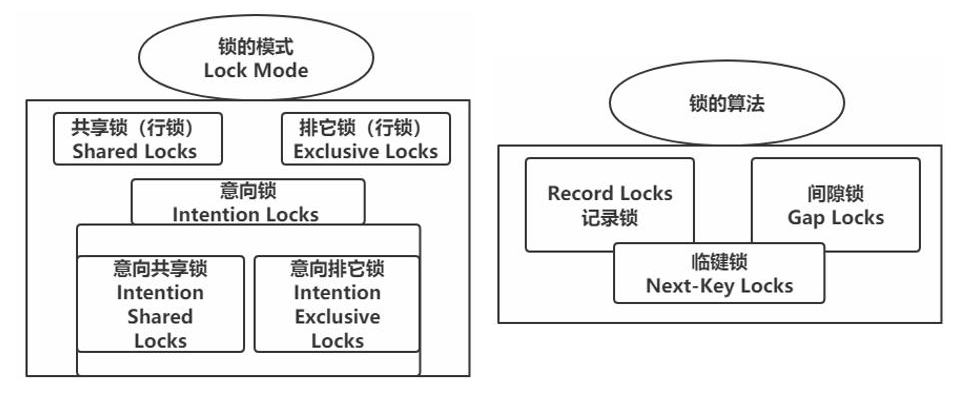

# MySQL数据库-锁

## 1. MySQL 中的锁

按照 MySQL 官方的说法，InnoDB 中锁可以分为：

- Shared and Exclusive Locks
- Intention Locks
- Record Locks
- Gap Locks
- Next-Key Locks
- Insert Intention Locks
- AUTO-INC Locks
- Predicate Locks for Spatial Indexes

> 官网说明：https://dev.mysql.com/doc/refman/5.7/en/innodb-locking.html



## 2. 解决并发事务问题

事务并发执行时可能带来的各种问题，最大的一个难点是：一方面要最大程度地利用数据库的并发访问，另外一方面还要确保每个用户能以一致的方式读取和修改数据，尤其是一个事务进行读取操作，另一个同时进行改动操作的情况下。

各个数据库厂商对 SQL 标准的支持都可能不一样，与 SQL 标准不同的一点就是，MySQL 在 REPEATABLE READ 隔离级别实际上就基本解决了幻读问题。解决脏读、不可重复读、幻读这些问题有两种可选的解决方案：

### 2.1. 方案一：读操作 MVCC，写操作进行加锁

MVCC 就是通过生成一个 ReadView，然后通过 ReadView 找到符合条件的记录版本（历史版本是由 undo 日志构建的），其实就像是在生成 ReadView 的那个时刻做了一个快照，查询语句只能读到在生成 ReadView 之前已提交事务所做的更改，在生成 ReadView 之前未提交的事务或者之后才开启的事务所做的更改是看不到的。而写操作肯定针对的是最新版本的记录，读记录的历史版本和改动记录的最新版本本身并不冲突，也就是采用MVCC 时，读-写操作并不冲突。

普通的 SELECT 语句在 READ COMMITTED 和 REPEATABLE READ 隔离级别下会使用到 MVCC 读取记录。

- 在 READ COMMITTED 隔离级别下，一个事务在执行过程中每次执行 SELECT 操作时都会生成一个 ReadView，ReadView 的存在本身就保证了事务不可以读取到未提交的事务所做的更改，也就是避免了脏读现象；
- 在 REPEATABLE READ 隔离级别下，一个事务在执行过程中只有第一次执行 SELECT 操作才会生成一个 ReadView，之后的 SELECT 操作都复用这个 ReadView，这样也就避免了不可重复读和很大程度上避免了幻读的问题。

### 2.2. 一致性读（Consistent Reads）/快照读

事务利用 MVCC 进行的读取操作称之为一致性读（一致性无锁读，也称之为快照读）。所有普通的 SELECT 语句（plain SELECT，指不加锁的 select 语句在非串行化事务隔离级别下）在 READ COMMITTED、REPEATABLE READ 隔离级别下都算是一致性读。

一致性读并不会对表中的任何记录做加锁操作，其他事务可以自由的对表中的记录做改动。采用 MVCC 方式的话，读-写操作彼此并不冲突，性能更高，采用加锁方式的话，读-写操作彼此需要排队执行，影响性能。

### 2.3. 方案二：读、写操作都采用加锁的方式

- 脏读的产生是因为当前事务读取了另一个未提交事务写的一条记录，如果另一个事务在写记录的时候就给这条记录加锁，那么当前事务就无法继续读取该记录了，所以也就不会有脏读问题的产生了。
- 不可重复读的产生是因为当前事务先读取一条记录，另外一个事务对该记录做了改动之后并提交之后，当前事务再次读取时会获得不同的值，如果在当前事务读取记录时就给该记录加锁，那么另一个事务就无法修改该记录，也不会发生不可重复读的情况
- 幻读问题的产生是因为当前事务读取了一个范围的记录，然后另外的事务向该范围内插入了新记录，当前事务再次读取该范围的记录时发现了新插入的新记录，把新插入的那些记录称之为幻影记录。采用加锁的方式解决幻读问题就有不太容易了，因为当前事务在第一次读取记录时那些幻影记录并不存在，所以读取的时候加锁就有点麻烦

## 3. 锁定读（Locking Reads）/LBCC

锁定读（Locking Reads）也称当前读，读取的是最新版本，并且对读取的记录加锁，阻塞其他事务同时改动相同记录，避免出现安全问题。以下的情况是当前读：

- select lock in share mode (共享锁)
- select for update (排他锁)
- update (排他锁)
- insert (排他锁)
- delete (排他锁)
- 串行化事务隔离级别

当前读这种实现方式，也可以称之为 LBCC（基于锁的并发控制，Lock-Based Concurrency Control）

### 3.1. 共享锁和独占锁

使用加锁时，既要允许读-读情况不受影响，又要使写-写、读-写或写-读情况中的操作相互阻塞，MySQL 中的锁可以分成：

- 共享锁，英文名：Shared Locks，简称 S 锁。在事务要读取一条记录时，需要先获取该记录的 S 锁。
- 独占锁（排他锁），英文名：Exclusive Locks，简称 X 锁。在事务要改动一条记录时，需要先获取该记录的 X 锁。

> 假如事务 E1 首先获取了一条记录的 S 锁之后，事务 E2 接着也要访问这条记录：
>
> 1. 如果事务 E2 想要再获取一个记录的 S 锁，那么事务 E2 也会获得该锁，也就意味着事务 E1 和 E2 在该记录上同时持有 S 锁。
> 2. 如果事务 E2 想要再获取一个记录的 X 锁，那么此操作会被阻塞，直到事务E1 提交之后将 S 锁释放掉。
> 3. 如果事务 E1 首先获取了一条记录的 X 锁之后，那么不管事务 E2 接着想获取该记录的 S 锁还是 X 锁都会被阻塞，直到事务 E1 提交。

**总结：S 锁和 S 锁是兼容的，S 锁和 X 锁是不兼容的，X 锁和 X 锁也是不兼容的**

### 3.2. 锁定读的 SELECT 语句

- 对读取的记录加 S 锁的语法格式：

```sql
SELECT... LOCK IN SHARE MODE;
```

就是在普通的 SELECT 语句后边加 LOCK IN SHARE MODE，如果当前事务执行了该语句，那么它会为读取到的记录加 S 锁，这样允许别的事务继续获取这些记录的 S 锁（比如别的事务也使用`SELECT ... LOCK IN SHARE MODE`语句来读取这些记录），但是不能获取这些记录的 X 锁（比如使用`SELECT ... FOR UPDATE`语句来读取这些记录，或者直接修改这些记录）。如果别的事务想要获取这些记录的 X 锁，那么它们会阻塞，直到当前事务提交之后将这些记录上的 S 锁释放掉。

- 对读取的记录加 X 锁的语法格式：

```sql
SELECT... FOR UPDATE;
```

普通的 SELECT 语句后边加`FOR UPDATE`，如果当前事务执行了该语句，那么它会为读取到的记录加 X 锁，这样既不允许别的事务获取这些记录的 S 锁（比方说别的事务使用`SELECT ... LOCK IN SHARE MODE`语句来读取这些记录），也不允许获取这些记录的 X 锁（比如说使用`SELECT... FOR UPDATE`语句来读取这些记录，或者直接修改这些记录）。如果别的事务想要获取这些记录的 S 锁或者 X 锁，那么它们会阻塞，直到当前事务提交之后将这些记录上的 X 锁释放掉。

### 3.3. 写操作的锁

#### 3.3.1. DELETE 操作

对一条记录做 DELETE 操作的过程，先在B+树中定位到这条记录的位置，然后获取一下这条记录的X锁，然后再执行 delete mark 操作。可以把这个定位待删除记录在B+树中位置的过程看成是一个获取X锁的锁定读。

#### 3.3.2. INSERT 操作

一般情况下，新插入一条记录的操作并不加锁，InnoDB 通过一种称之为隐式锁来保护这条新插入的记录在本事务提交前不被别的事务访问。也有特殊情况下 INSERT 操作也是会获取锁

#### 3.3.3. UPDATE 操作

对一条记录做 UPDATE 操作时分为三种情况：

- 如果未修改该记录的键值并且被更新的列占用的存储空间在修改前后未发生变化，则先在 B+树中定位到这条记录的位置，然后再获取一下记录的 X 锁，最后在原记录的位置进行修改操作。可以把这个定位待修改记录在B+树中位置的过程看成是一个获取 X 锁的锁定读。
- 如果未修改该记录的键值并且至少有一个被更新的列占用的存储空间在修改前后发生变化，则先在B+树中定位到这条记录的位置，然后获取一下记录的X锁，将该记录彻底删除掉（就是把记录彻底移入垃圾链表），最后再插入一条新记录。这个定位待修改记录在B+树中位置的过程看成是一个获取 X 锁的锁定读，新插入的记录由 INSERT 操作提供的隐式锁进行保护。
- 如果修改了该记录的键值，则相当于在原记录上做 DELETE 操作之后再来一次 INSERT 操作，加锁操作就需要按照 DELETE 和 INSERT 的规则进行了。

## 4. 锁的粒度

- 对一条记录加锁，称之为行级锁或者行锁，这种锁的粒度比较细。
- 对一个表加锁，称之为表级锁或者表锁，这种锁的粒度比较粗。

给表加的锁也可以分为共享锁（S 锁）和独占锁（X 锁）

### 4.1. 表锁与行锁的比较

- 锁定粒度：表锁 > 行锁
- 加锁效率：表锁 > 行锁
- 冲突概率：表锁 > 行锁
- 并发性能：表锁 < 行锁

### 4.2. 表的S锁与X锁

**如果一个事务给表加了 S 锁**

- 别的事务可以继续获得该表的 S 锁
- 别的事务可以继续获得该表中的某些记录的 S 锁
- 别的事务不可以继续获得该表的 X 锁
- 别的事务不可以继续获得该表中的某些记录的 X 锁

**如果一个事务给表加了 X 锁（意味着该事务要独占这个表）**

- 别的事务不可以继续获得该表的 S 锁
- 别的事务不可以继续获得该表中的某些记录的 S 锁
- 别的事务不可以继续获得该表的 X 锁
- 别的事务不可以继续获得该表中的某些记录的 X 锁

## 5. 意向锁

在对表上锁的时候，如果需要获取是否有行被上锁，那就需要依次扫描整个表，这种处理方式的效率太慢。所以 InnoDB 提出了一种意向锁（英文名：Intention Locks）：

- **意向共享锁**，英文名：Intention Shared Lock，简称 IS 锁。当事务准备在某条记录上加 S 锁时，需要先在表级别加一个 IS 锁。
- **意向独占锁**，英文名：Intention Exclusive Lock，简称 IX 锁。当事务准备在某条记录上加 X 锁时，需要先在表级别加一个 IX 锁。

总结：IS、IX 锁是表级锁，它们的提出仅仅为了在加表级别的 S 锁和 X 锁时可以快速判断表中的记录是否被上锁，以避免用遍历的方式来查看表中有没有上锁的记录。就是说其实 IS 锁和 IX 锁是兼容的，IX 锁和 IX 锁是兼容的。表级别的各种锁的兼容性如下：

|     |   X   |  IX   |   S   |  IS   |
| --- | ----- | ----- | ----- | ----- |
| X   | 不兼容 | 不兼容 | 不兼容 | 不兼容 |
| IX  | 不兼容 |       | 不兼容 |       |
| S   | 不兼容 | 不兼容 |       |       |
| IS  | 不兼容 |       |       |       |

锁的组合性：

|     |  X  | IX  |  S  | IS  |
| --- | --- | --- | --- | --- |
| 表锁 | √   | √   | √   | √   |
| 行锁 | √   |     | √   |     |

## 6. MySQL 中的行锁和表锁

MySQL 支持多种存储引擎，不同存储引擎对锁的支持也是不一样

### 6.1. InnoDB 存储引擎中的锁

InnoDB 存储引擎既支持表锁，也支持行锁。表锁实现简单，占用资源较少，粒度很粗，性能较差；行锁粒度更细，可以实现更精准的并发控制。

#### 6.1.1. InnoDB 中的表级锁


### 6.2. 其他存储引擎中的锁

对于 MyISAM、MEMORY、MERGE 这些存储引擎来说，它们只支持表级锁，而且这些引擎并不支持事务，所以使用这些存储引擎的锁一般都是针对当前会话而言。

因为使用 MyISAM、MEMORY、MERGE 这些存储引擎的表在同一时刻只允许一个会话对表进行写操作，所以这些存储引擎实际上最好用在只读，或者大部分都是读操作，或者单用户的情景下。另外，在 MyISAM 存储引擎中有一个称之为 Concurrent Inserts 的特性，支持在对 MyISAM 表读取时同时插入记录，这样可以提升一些插入速度。

> 其他存储引擎的锁具体的细节参考官方文档


## 7. 数据库锁表

### 7.1. 锁表的原因分析

1. 锁表发生在insert、update、delete 中
2. 锁表的原理是 数据库使用独占式封锁机制，当执行上面的语句时，对表进行锁住，直到发生commit 或者 回滚 或者退出数据库用户
3. 锁表的原因：
	- 第一、 A程序执行了对 tableA 的 insert ，并还未 commit时，B程序也对tableA 进行insert 则此时会发生资源正忙的异常 就是锁表
	- 第二、锁表常发生于并发而不是并行（并行时，一个线程操作数据库时，另一个线程是不能操作数据库的，cpu 和i/o 分配原则）
4. 减少锁表的概率：
	1. 减少insert 、update 、delete 语句执行 到 commit 之间的时间。具体点批量执行改为单个执行、优化sql自身的非执行速度
	2. 如果异常对事物进行回滚

### 7.2. 如何判断数据库表已经锁表

查询语法：`select * from v$locked_object;`

可以获得被锁的对象的object_id及产生锁的会话sid。
