# MySQL 数据库设计规范

## 1. 数据库表设计

良好的表结构设计是高性能的基石，应该根据系统将要执行的业务查询来设计，这往往需要权衡各种因素。糟糕的表结构设计，直接影响到数据库的性能，并需要花费大量不必要的优化时间，往往还没有什么效果。

在数据库表设计上有个很重要的设计准则，称为范式设计。

## 2. 数据库设计步骤

1. 收集信息：与该系统有关人员进行交流、座谈，充分了解用户需求，理解数据库需要完成的任务
2. 标识实体（Entity）：标识数据库要管理的关键对象或实体，实体一般是名词
3. 标识每个实体的属性（Attribute）
4. 标识实体之间的关系（Relationship）

## 3. 数据库表设计规范化

### 3.1. 什么是范式(NF)

范式来自英文 Normal Form，简称 NF，是一套用来设计数据库的规则，在关系型数据库中这些规则就称为范式。好的数据库设计对数据的存储性能和后期的程序开发，都会产生重要的影响。建立科学的，规范的数据库就需要满足一些规则来优化数据的设计和存储。

要想设计—个好的关系，必须使关系满足一定的约束条件，此约束已经形成了规范，分成几个等级，一级比一级要求得严格。满足这些规范的数据库是简洁的、结构明晰的，同时，不会发生插入(insert)、删除(delete)和更新(update)操作异常。

### 3.2. 范式分类

目前关系数据库有六种范式：第一范式（1NF）、第二范式（2NF）、第三范式（3NF）、巴斯-科德范式（BCNF）、第四范式(4NF）和第五范式（5NF，又称完美范式）。

满足最低要求的范式是第一范式（1NF）。在第一范式的基础上进一步满足更多规范要求的称为第二范式（2NF），其余范式以次类推。**一般说来，数据库只需满足第三范式(3NF）就行了**。

### 3.3. 第一范式(1NF)

- 第一范式是数据库设计最基本的要求。
- 要求数据库表的每一列都是不可再分割的原子性数据项。
- **第一范式每一列不可再拆分，称为原子性**。

不能是集合、数组、记录等非原子数据项。即实体中的某个属性有多个值时，必须拆分为不同的属性。在符合第一范式（1NF）表中每个列的值只能是表的一个属性或一个属性的一部分。

### 3.4. 第二范式(2NF)

要先满足第一范式前提下，表中必须有主键，其他非主键列要完全依赖于主键，而不能只依赖于一部分。简单来说，**一张表只描述一件事情**。

第二范式（2NF）要求数据库表中的每个实例或记录必须可以被唯一地区分。选取一个能区分每个实体的属性或属性组，作为实体的唯一标识。例如在员工表中的身份证号码即可实现每个员工的区分，该身份证号码即为候选键，任何一个候选键都可以被选作主键。在找不到候选键时，可额外增加属性以实现区分。

第二范式（2NF）要求实体的属性完全依赖于主关键字。所谓完全依赖是指不能存在仅依赖主关键字一部分的属性。如果存在，那么这个属性和主关键字的这一部分应该分离出来形成一个新的实体，新实体与原实体之间是一对多的关系。为实现区分通常需要为表加上一个列，以存储各个实例的唯一标识。**简而言之，第二范式就是在第一范式的基础上属性完全依赖于主键**。

### 3.5. 第三范式(3NF)

**在满足第二范式的前提下，表中的每一列都直接依赖于主键，而不是通过其它的列来间接依赖于主键（不存在传递依赖）**。

所谓传递依赖是指如果存在“A(主键字段) -> B(非主键字段) -> C(非主键字段)”的决定关系，则C依赖A。

**第三范式（3NF）是第二范式（2NF）的一个子集，即满足第三范式（3NF）必须满足第二范式（2NF）。**

例如：存在一个部门信息表，其中每个部门有部门编号（dept_id）、部门名称、部门简介等信息。那么在员工信息表中列出部门编号后就不能再将部门名称、部门简介等与部门有关的信息再加入员工信息表中。如果不存在部门信息表，则根据第三范式（3NF）也应该构建它，否则就会有大量的数据冗余。

**简而言之，第三范式就是属性不依赖于其它非主键属性，也就是在满足 2NF 的基础上，任何非主属性不得传递依赖于主属性**。

像：a -> b -> c  属性之间含有这样的关系，是不符合第三范式的。

### 3.6. 范式说明

真正的数据库范式定义上，相当难懂，比如第二范式（2NF）的定义“若某关系 R 属于第一范式，且每一个非主属性完全函数依赖于任何一个候选码，则关系 R 属于第二范式。”，这里面有着大堆专业术语的堆叠，比如“函数依赖”、“码”、“非主属性”、与“完全函数依赖”等等，而且有完备的公式定义，深入研究可参考书籍：《数据库系统概念（第5版）》

## 4. 反范式设计

### 4.1. 反范式化设计概念

反范式化就是为了性能和读取效率得考虑，而适当得对数据库设计范式得要求进行违反，允许存在少量得冗余。即反范式化就是使用空间来换取时间。

### 4.2. 反范式实际应用示例

#### 4.2.1. 性能提升-缓存和汇总

最常见的反范式化数据的方法是复制或者缓存，在不同的表中存储相同的特定列。

缓存衍生值也是有用的。如果需要显示每个用户发了多少消息，可以每次执行一个对用户发送消息进行`count`的子查询来计算并显示它，也可以在`user`表用户中建一个消息发送数目的专门列，每当用户发新消息时更新这个值。

有需要时创建一张完全独立的汇总表或缓存表也是提升性能的好办法。“缓存表”来表示存储那些可以比较简单地从其他表获取（但是每次获取的速度比较慢）数据的表（例如，逻辑上冗余的数据)。而“汇总表”时,则保存的是使用`GROUP BY`语句聚合数据的表。

在使用缓存表和汇总表时，有个关键点是如何维护缓存表和汇总表中的数据，常用的有两种方式，实时维护数据和定期重建，这个取决于应用程序，不过一般来说，缓存表用实时维护数据更多点，往往在一个事务中同时更新数据本表和缓存表，汇总表则用定期重建更多，使用定时任务对汇总表进行更新。

#### 4.2.2. 性能提升-计数器表

比如网站点击数、用户的朋友数、文件下载次数等。对于高并发下的处理，首先可以创建一张独立的表存储计数器，这样可使计数器表小且快，并且可以使用一些更高级的技巧。

比如假设有一个计数器表，只有一行数据，记录网站的点击次数，网站的每次点击都会导致对计数器进行更新，问题在于，对于任何想要更新这一行的事务来说，这条记录上都有一个全局的互斥锁(mutex)。这会使得这些事务只能串行执行，会严重限制系统的并发能力。

**改进方案：可以将计数器保存在多行中，每次随机选择一行进行更新。在具体实现上，可以增加一个槽（slot)字段，然后预先在这张表增加 100 行或者更多数据，当对计数器更新时，选择一个随机的槽（slot)进行更新即可**。

<font color=red>**这种解决思路其实就是写热点的分散，在 JDK 的 JDK1.8 中新的原子类`LongAdder`也是这种处理方式**</font>，而在实际的缓冲中间件Redis等的使用、架构设计中，可以采用这种写热点的分散的方式，当然架构设计中对于写热点还有削峰填谷的处理方式，这种在 MySQL 的实现中也有体现

#### 4.2.3. 反范式设计-分库分表中的查询

例如，用户购买了商品，需要将交易记录保存下来，那么如果按照买家的纬度分表，则每个买家的交易记录都被保存在同一表中，这样可以很快、很方便地査到某个买家的购买情况，但是某个商品被购买的交易数据很有可能分布在多张表中，査找起来比较麻烦。反之，按照商品维度分表，则可以很方便地査找到该商品的购买情况，但若要査找到买家的交易记录，则会比较麻烦

常见的解决方式如下：

1. 在多个分片表查询后合并数据集，这种方式的效率很低
2. 记录两份数据，一份按照买家纬度分表，一份按照商品维度分表
3. 通过搜索引擎解决，但如果实时性要求很高，就需要实现实时搜索

在某电商交易平台下，可能有买家査询自己在某一时间段的订单，也可能有卖家査询自已在某一时间段的订单，如果使用了分库分表方案，则这两个需求是难以满足的

因此通用的解决方案是，在交易生成时生成一份按照买家分片的数据副本和一份按照卖家分片的数据副本，查询时分别满足之前的两个需求，因此，查询的数据和交易的数据可能是分别存储的，并从不同的系统提供接口

## 5. 数据库设计小结

三大范式只是一般设计数据库的基本理念，可以建立冗余较小、结构合理的数据库。

如果有特殊情况，当然要特殊对待，<font color=red>**数据库设计最重要的是看需求跟性能，需求 > 性能 > 表结构**</font>。所以不能一味的去追求范式建立数据库。

- 1NF:字段不可分（*原子性 字段不可再分*）;
- 2NF:有主键，非主键字段依赖主键（*唯一性 一个表只说明一个事物*）;
- 3NF:非主键字段不能相互依赖（*每列都与主键有直接关系，不存在传递依赖*）;

**范式化设计优点**：

- 范式化的更新操作通常比反范式化要快
- 当数据较好地范式化时，就只有很少或者没有重复数据，所以只需要修改更少的数据
- 范式化的表通常更小，可以更好地放在内存里，所以执行操作会更快
- 很少有多余的数据意味着检索列表数据时更少需要`DISTINCT`或者`GROUP BY`语句。在非范式化的结构中必须使用`DISTINCT`或者`GROUP BY`才能获得一份唯一的列表，但是如果是一张单独的表，很可能则只需要简单的查询这张表就行了

**范式化设计缺点**：

- 通常需要关联表查询。稍微复杂一些的查询语句在符合范式的表上都可能需要至少一次关联，也许更多
- 可能使一些索引策略无效

**反范式化设计优点**：

- 反范式设计可以减少表的关联
- 可以更好的进行索引优化

**反范式化设计缺点**：

- 存在数据冗余及数据维护异常
- 对数据的修改需要更多的成本

## 6. 数据库设计 - 数据库，数据表和字段等的命名总结

### 6.1. 数据库命名规则

根据项目的实际意思来命名。

### 6.2. 数据表命名规则

1. 数据表的命名大部分都是以名词的复数形式并且都为小写；
2. 尽量使用前缀"table_"；
3. 如果数据表的表名是由多个单词组成，则尽量用下划线连接起来；但是不要超过30个字符，一旦超过30个字符，则使用缩写来缩短表名的长度；
4. 具备统一前缀，对相关功能的表应当使用相同前缀，如acl_xxx，house_xxx,ppc_xxx；其中前缀通常为这个表的模块或依赖主实体对象的名字，通常来讲表名为：业务_动作_类型，或是业务_类型；
5. 数据表必须有主键，且建议均使用auto_increment的id作为主键（与业务无关），和业务相关的要做为唯一索引；


### 6.3. 字段命名规则

1. 首先命名字段尽量采用小写，并且是采用有意义的单词；
2. 使用前缀，前缀尽量用表的"前四个字母+下划线组成"；
3. 如果字段名由多个单词组成，则使用下划线来进行连接，一旦超过30个字符，则用缩写来缩短字段名的长度；

### 6.4. 视图命名规则

1. 尽量使用前缀"view_"；
2. 如果创建的视图牵扯多张数据表，则一定列出所有表名，如果长度超过30个字符时可以简化表名，中间用下划线来连接；

### 6.5. 主键命名规则

1. 主键用"pk_"开头，后面跟上该主键所在的表名；
2. 不能超过30个字符，尽量使用小写英文单词；


## 7. MySQL数据库规范

### 7.1. 标准SQL语言没有规范以下功能

- ID自示增长
- 分页
- 函数
- 编程语言
- 服务端的数据软件

### 7.2. 数据库命令规范

1. 所有数据库对象名称必须使用小写字母并用下划线分割；
2. 所有数据库对象名称禁止使用mysql保留关键字（如果表名中包含关键字查询时，需要将其用单引号括起来）；
3. 数据库对象的命名要能做到见名识意，并且最后不要超过32个字符；
4. 临时库表必须以tmp_为前缀并以日期为后缀，备份表必须以bak_为前缀并以日期(时间戳)为后缀；
5. 所有存储相同数据的列名和列类型必须一致（一般作为关联列，如果查询时关联列类型不一致会自动进行数据类型隐式转换，会造成列上的索 引失效，导致查询效率降低）。

### 7.3. SQL语句规范

- **SQL语句可以单行或多行书写，以分号结尾**
- 可使用空格和缩进来增强语句的可读性
- 同样可以使用`/**/`的方式完成注释
- MySQL数据库的**SQL语句不区分大小写，建议关键字使用大写，自定义的使用小写**，例如：

```sql
SELECT * FROM user;
```

### 7.4. 命名规范

- 数据库、表、字段的命名要遵守可读性原则，尽可能少使用或者不使用缩写
- 表名、字段名必须使用小写字母或数字，禁止出现数字开头，禁止两个下划线中间只出现数字。
    - 说明：MySQL在Windows下不区分大小写，但在Linux下默认是区分大小写。因此，数据库名、表名、字段名，都不允许出现任何大写字母，避免节外生枝。
- 表名使用**单数**形式。如：员工表使用 EMPLOYEE，而不要使用 EMPLOYEES
- 采用有意义的名字，一般不超过三个英文单词，单词之间使用**下划线**分隔
- 数据库、表、字段的命名禁用保留字，如`desc`、`range`、`match`之类
- 对象的名字应该能够描述它所表示的对象。
    - 表的名称应该能够体现表中存储的数据内容，最好是遵循“`业务名称_表的作用`”；
    - 对于存储过程存储过程应该能够体现存储过程的功能。
    - 库名与应用名称尽量一致。
- 主键索引名为`pk_字段名`；唯一索引名为`uk_字段名`；普通索引名则为`idx_字段名`
- 表达是与否概念的字段，应该使用`is_xxx`的方式命名，数据类型是`unsigned tinyint`（1 表示是，0 表示否）。

### 7.5. 数据库基本设计规范

1. **所有表必须使用Innodb存储引擎**
- 没有特殊要求（即Innodb无法满足的功能如：列存储，存储空间数据等）的情况下，所有表必须使用Innodb存储引擎（mysql5.5之前默认使用Myisam，5.6以后默认的为Innodb）Innodb 支持事务，支持行级锁，更好的恢复性，高并发下性能更好。
2. **数据库和表的字符集统一使用UTF8**
- 兼容性更好，统一字符集可以避免由于字符集转换产生的乱码，不同的字符集进行比较前需要进行转换会造成索引失效。
3. **所有表和字段都需要添加注释**
- 使用comment从句添加表和列的备注 从一开始就进行数据字典的维护。
4. **尽量控制单表数据量的大小，建议控制在500万以内**
- 500万并不是MySQL数据库的限制，过大会造成修改表结构，备份，恢复都会有很大的问题。
- 可以用历史数据归档（应用于日志数据），分库分表（应用于业务数据）等手段来控制数据量大小。
5. **谨慎使用MySQL分区表**
- 分区表在物理上表现为多个文件，在逻辑上表现为一个表，谨慎选择分区键，跨分区查询效率可能更低 建议采用物理分表的方式管理大数据。
6. **尽量做到冷热数据分离，减小表的宽度**
- MySQL限制每个表最多存储4096列，并且每一行数据的大小不能超过65535字节 减少磁盘IO，保证热数据的内存缓存命中率（表越宽，把表装载进内存缓冲池时所占用的内存也就越大，也会消耗更多的IO） 更有效的利用缓存，避免读入无用的冷数据 经常一起使用的列放到一个表中（避免更多的关联操作）。
7. **禁止在表中建立预留字段**
- 预留字段的命名很难做到见名识义 预留字段无法确认存储的数据类型，所以无法选择合适的类型 对预留字段类型的修改，会对表进行锁定。
8. **禁止在数据库中存储图片，文件等大的二进制数据**
- 通常文件很大，会短时间内造成数据量快速增长，数据库进行数据库读取时，通常会进行大量的随机IO操作，文件很大时，IO操作很耗时，通常存储于文件服务器，数据库只存储文件地址信息。
9. **禁止在线上做数据库压力测试**
10. **禁止从开发环境，测试环境直接连接生成环境数据库**

### 7.6. 数据库表字段类型设计规范

#### 7.6.1. 基本原则

##### 7.6.1.1. 优先选择符合存储需要的最小的数据类型（更小的通常更好）

原因：列的字段越大，建立索引时所需要的空间也就越大，这样一页中所能存储的索引节点的数量也就越少也越少，在遍历时所需要的IO次数也就越多， 索引的性能也就越差。

**一些优化的示例**：

- **将字符串转换成数字类型存储，如：将IP地址转换成整形数据**。mysql提供了两个方法来处理ip地址：
    - `inet_aton`：把ip转为无符号整形（4-8位）
    - `inet_ntoa`：把整型的ip转成地址
    - 插入数据前，先用`inet_aton`把ip地址转为整型，可以节省空间。显示数据时，使用`inet_ntoa`把整型的ip地址转为地址显示即可。
- **对于非负型的数据（如自增ID、整型IP）来说，要优先使用无符号整型来存储**。因为，无符号相对于有符号可以多出一倍的存储空间
    - **VARCHAR(N)中的N代表的是字符数，而不是字节数**
    - 使用UTF8存储255个汉字`Varchar(255)=765`个字节。过大的长度会消耗更多的内存

##### 7.6.1.2. 简单的数据类型更好

简单数据类型的操作通常需要更少的CPU周期。例如：

- 整型比字符操作代价更低，因为字符集和校对规则(排序规则)使字符比较比整型比较更复杂。
- 应该使用 MySQL 内建的类型而不是字符串来存储日期和时间

##### 7.6.1.3. 尽量避免 NULL

**尽可能把所有列定义为NOT NULL**。原因如下：

- 索引NULL列需要额外的空间来保存，所以要占用更多的空间；
- 进行比较和计算时要对NULL值做特别的处理。

#### 7.6.2. 整数类型（int）

MySQL存储整数的数据类型如下表：

|   整数类型   | 存储空间（位） | 字节数 |
| :---------: | :----------: | :---: |
|  `TINYINT`  |      8       |   1   |
| `SMALLINT`  |      16      |   2   |
| `MEDIUMINT` |      24      |   3   |
|    `INT`    |      32      |   4   |
|  `BIGINT`   |      64      |   8   |

同时整数类型有可选的 `UNSIGNED` 属性，表示不允许负值可以使正数的上限提高一倍。如：`TINYINT UNSIGNED`可以存储的范围是`0~255`，而`TINYINT`的存储范围是`-128~127`。

**有符号和无符号类型使用相同的存储空间，并具有相同的性能**，因此可以根据实际情况选择合适的类型。

<font color=red>**MySQL 可以为整数类型指定宽度，例如`INT(11)`，对大多数应用这是没有意义的，它不会限制值的合法范围，只是规定了MySQL的一些交互工具（例如 MySQL命令行客户端)用来显示字符的个数。对于存储和计算来说，`INT(1)`和`INT(20)`是相同的。**</font>

<font color=red>**在整数字段类型选择上，遵循着更小的通常更好的原则，在业务许可的情况下，尽量选择位数小的**</font>

#### 7.6.3. 实数类型

实数是带有小数部分的数字。MySQL 既支持精确浮点类型的存储`DECIMAL`类型，也支持不精确浮点类型存储`FLOAT`和`DOUBLE`类型。

- <font color=red>**DECIMAL 类型用于存储精确的小数，本质上 MySQL 是以字符串形式存放的**</font>。所以CPU不支持对`DECIMAL`类型的直接计算，而MySQL会实现了`DECIMAL`的高精度计算。相对而言，CPU 直接支持原生浮点计算，所以浮点运算明显更快。
- 浮点类型在存储同样范围的值时，通常比`DECIMAL`使用更少的空间。`FLOAT`使用4个字节存储，`DOUBLE`使用8个字节，所以`DOUBLE`比`FLOAT`有更高的精度和更大的范围。

> 浮点和 `DECIMAL` 类型都可以指定精度。对于 `DECIMAL` 列，可以指定小数点前后所允许的最大位数。这会影响列的空间消耗。MySQL 5.0 和更高版本将数字打包保存到一个二进制字符串中（每 4 个字节存 9 个数字)。例如，`DECIMAL(18,9`)小数点两边将各存储 9 个数字，一共使用 9 个字节：小数点前的数字用 4 个字节，小数点后的数字用 4 个字节，小数点本身占 1 个字节。

**一般涉及财务相关的金额类数据必须使用`decimal`类型**。因为`Decimal`类型为精准浮点数，在计算时不会丢失精度。占用空间由定义的宽度决定，每4个字节可以存储9位数字，并且小数点要占用一个字节。可用于存储比`bigint`更大的整型数据。MySQL 5.0 和更高版本中的`DECIMAL`类型允许最多65个数字。在精度不敏感和需要快速运算的时候，选择`FLOAT`和`DOUBLE`。

实际项目运用中，如果在数据量比较大的而且要求精度时，可以考虑使用`BIGINT`代替`DECIMAL`，将需要存储的货币单位根据小数的位数乘以相应的倍数即可。假设要存储财务数据精确到万分之一分，则可以把所有金额乘以一百万，然后将结果存储在`BIGINT`里，这样可以同时避免浮点存储计算不精确和`DECIMAL`精确计算代价高的问题。

#### 7.6.4. 字段串类型

MySQL 支持多种字符串类型，包括`VARCHAR`和`CHAR`类型、`BLOB`和`TEXT`类型、`ENUM`（枚举）和`SET`类型。

##### 7.6.4.1. VARCHAR 和 CHAR 类型

VARCHAR 和 CHAR 是两种最主要的字符串类型。

**VARCHAR**

VARCHAR 类型用于存储可变长字符串，它比定长类型更节省空间，因为它仅使用必要的空间（例如，越短的字符串使用越少的空间)。

在内部实现上，VARCHAR 需要使用 1 或 2 个额外字节记录字符串的长度，如果列的最大长度小于或等于 255 字节，则只使用 1 个字节表示，否则使用 2 个字节。

VARCHAR 节省了存储空间，所以对性能也有帮助。但是，由于行是变长的，在 UPDATE 时新值比旧值长时，使行变得比原来更长，这就肯能导致需要做额外的工作。如果一个行占用的空间增长，并且在页内没有更多的空间可以存储，在这种情况下，MyISAM 会将行拆成不同的片段存储，InnoDB 则需要分裂页来使行可以放进页内。

**CHAR**

CHAR 类型是定长的，MySQL 总是根据定义的字符串长度分配足够的空间。当存储 CHAR 值时，MySQL 会删除所有的末尾空格，CHAR 值会根据需要采用空格进行填充以方便比较。

**适合使用VARCHAR的情况**

- 字符串列的最大长度比平均长度大很多。
- 列的更新很少；
- 使用了像 UTF-8 这样复杂的字符集，每个字符都使用不同的字节数进行存储。

**适合使用CHAR的情况**

- 适合存储很短的字符串，或者所有值定长或都接近同一个长度。如存储密码MD5值，因为它是定长的
- 适合长度非常短的列。如`CHAR(1)`来存储只有 Y 和 N 的值，如果采用单字节字符集只需要一个字节，但是`VARCHAR(1)`却需要两个字节，因为还有一个记录长度的额外字节。

> 使用`VARCHAR(5)`和`VARCHAR(200)`存储'hello'在磁盘空间上开销是一样的。应该使用更短的列。最好的策略是只分配真正需要的空间。因为更长的列会消耗更多的内存，MySQL 通常会分配固定大小的内存块来保存内部值。尤其是使用内存临时表进行排序或操作时会特别糟糕。

##### 7.6.4.2. BLOB 和 TEXT 类型

BLOB 和 TEXT 都是为存储很大的数据而设计的字符串数据类型，分别采用二进制和字符方式存储。与其他类型不同，MySQL 把每个 BLOB 和 TEXT 值当作一个独立的对象处理，存储引擎在存储时通常会做特殊处理。*当 BLOB 和 TEXT 值太大时，InnoDB 会使用专门的“外部”存储区域来进行存储，此时每个值在行内需要 1~4 个字节存储一个指针，然后在外部存储区域存储实际的值。*

BLOB 和 TEXT 之间的区别是 BLOB 类型存储的是二进制数据，没有排序规则或字符集，而 TEXT 类型有字符集和排序规则。

**`BLOB`和`TEXT`类型使用规范**

- `BLOB`和`TEXT`值会引起一些性能问题，所以尽量避免使用`BLOB`和`TEXT`类型。最常见的TEXT类型可以存储64k的数据。
- 如必须使用此两种类型，**建议把 BLOB 或 TEXT 的列分离到单独的表中**。
    - Mysql内存临时表不支持TEXT、BLOB这样的大数据类型，如果查询中包含这样的数据，在排序等操作时，就不能使用内存临时表，必须使用磁盘临时表进行。
    - 而且对于这种数据，Mysql还是要进行二次查询，会使sql性能变得很差，但是不是说一定不能使用这样的数据类型。
- 在不必要的时候避免检索大型的 BLOB 或 TEXT 值。避免在包含此两种类型的表使用`select *`查询，导致网络上传输大量的值。建议可以搜索索引列，决定需要的哪些数据行，然后从符合条件的数据行中检索 BLOB 或 TEXT 值；
- 可以使用合成的(Synthetic)索引来提高大文本字段(BLOB 或 TEXT)的查询性能。合成索引就是根据大文本字段的内容建立一个散列值，并把这个值存储在单独的数据列中，接下来就可以通过检索散列值找到数据行。<font color=violet>注意这种技术只能用于精确匹配的查询（散列值对于类似“`<`”或“`>=`”等范围搜索操作符是没有用处的)</font>。
- **TEXT或BLOB类型只能使用前缀索引**。因为MySQL对索引字段长度是有限制的，所以TEXT类型只能使用前缀索引，并且TEXT列上是不能有默认值的。

#### 7.6.5. ENUM类型

枚举列可以把一些不重复的字符串存储成一个预定义的集合。MySQL 在存储枚举时非常紧凑，会根据列表值的数量压缩到一个或者两个字节中，MySQL 在内部会将每个值在列表中的位置保存为整数，这样的话可以让表的大小大为缩小。

```sql
CREATE TABLE enum_test(e ENUM(' fish', 'apple', 'dog') NOT NULL);
INSERT INTO enum_test(e) VALUES('fish'),('dog'),('apple');
```

**枚举类型的使用规范**：

- **一般是避免使用ENUM类型**。因为修改`ENUM`值需要使用`ALTER`语句；`ENUM`类型的`ORDER BY`操作效率低，需要额外操作
- **必要时可使用枚举代替字符串**。如果表中的字段的取值是固定几个字符串，可以使用枚举列代替常用的字符串类型。
- **禁止使用数值作为ENUM的枚举值**。因为枚举列实际存储为整数，而不是字符串，所以不要使用数字作为`ENUM`枚举常量，这种双重性很容易导致混乱，例如`ENUN('1','2''3')`。
- 枚举字段是按照内部存储的整数而不是定义的字符串进行排序的，所以**尽量按照需要的顺序来定义枚举列**。

#### 7.6.6. 日期和时间类型

MySQL 可以使用许多类型来保存日期和时间值，分别是：`DATETIME`、`DATE`、`TIMESTAMP`、`YEAR`、`TIME`。MySQL 能存储的最小时间粒度为秒。

大部分时间类型都没有替代品，因此没有什么是最佳选择的问题。唯一就是`DATETIME`和`TIMESTAMP`比较相似，需要做些适当的选择

- TIMESTAMP（占用空间是4个字节），存储的时间范围`1970-01-01 00:00:01 ~ 2038-01-19 03:14:07`。TIMESTAMP显示的值也依赖于时区。从空间效率来说，TIMETAMP 比 DATETIME 更高。
- DATETIME（占用空间是8个字节），存储的时间范围从 1001 年到 9999 年，精度为秒。它把日期和时间封装到格式为 `YYYYMMDDHHMMSS` 的整数中，与时区无关。

**日期时间类型使用规范**：

- TIMESTAMP 占用4字节和INT相同，但比INT可读性高。超出TIMESTAMP取值范围的使用DATETIME类型存储。
- 如果需要存储比秒更小粒度的日期和时间值，MySQL目前没有提供合适的数据类型，但是可以使用自定义的存储格式：可以使用 `BIGINT` 类型存储微秒级别的时间截，或者使用 `DOUBLE` 存储秒之后的小数部分。
- **不应该用字符串存储日期型的数据**。
    - **缺点1：无法用日期函数进行计算和比较**
    - **缺点2：用字符串存储日期要占用更多的空间**

#### 7.6.7. 其他规范

- **字段名称不能包含数据类型，不能使用关键字**

### 7.7. 索引设计规范

#### 7.7.1. 索引的数量

**限制每张表上的索引数量，建议单张表索引不超过5个**

- 索引并不是越多越好！索引可以提高效率同样可以降低效率。
- 索引可以增加查询效率，但同样也会降低插入和更新的效率，甚至有些情况下会降低查询效率。
- 因为mysql优化器在选择如何优化查询时，会根据统一信息，对每一个可以用到的索引来进行评估，以生成出一个最好的执行计划，如果同时有很多个索引都可以用于查询，就会增加mysql优化器生成执行计划的时间，同样会降低查询性能。

#### 7.7.2. 禁止给表中的每一列都建立单独的索引

- 5.6版本之前，一个sql只能使用到一个表中的一个索引，5.6以后，虽然有了合并索引的优化方式，但是还是远远没有使用一个联合索引的查询方式好。

#### 7.7.3. 每个Innodb表必须有个主键

- Innodb是一种索引组织表：数据的存储的逻辑顺序和索引的顺序是相同的。
- 每个表都可以有多个索引，但是表的存储顺序只能有一种 Innodb是按照主键索引的顺序来组织表的。
- 不要使用更新频繁的列作为主键，不适用多列主键（相当于联合索引） 不要使用UUID、MD5、HASH、字符串列作为主键（无法保证数据的顺序增长）。
- 主键建议使用自增ID值。

### 7.8. 数据库SQL开发规范

1. **建议使用预编译语句进行数据库操作**
    - 预编译语句可以重复使用这些计划，减少SQL编译所需要的时间，还可以解决动态SQL所带来的SQL注入的问题 只传参数，比传递SQL语句更高效 相同语句可以一次解析，多次使用，提高处理效率。
2. **避免数据类型的隐式转换**
    - 隐式转换会导致索引失效。如：select name,phone from customer where id = '111';
3. **充分利用表上已经存在的索引**
    - 避免使用双%号的查询条件。
        - 如a like '%123%'，（如果无前置%,只有后置%，是可以用到列上的索引的）
    - 一个SQL只能利用到复合索引中的一列进行范围查询
        - 如：有 a,b,c列的联合索引，在查询条件中有a列的范围查询，则在b,c列上的索引将不会被用到，在定义联合索引时，如果a列要用到范围查找的话，就要把a列放到联合索引的右侧。
        - 使用left join或 not exists来优化not in操作，因为not in 也通常会使用索引失效。
4. **数据库设计时，应该要对以后扩展进行考虑**
5. **程序连接不同的数据库使用不同的账号，进制跨库查询**
    - 为数据库迁移和分库分表留出余地
    - 降低业务耦合度
    - 避免权限过大而产生的安全风险
6. **禁止使用 `SELECT *` 必须使用 `SELECT <字段列表>` 查询**
    - **原因：**
        - 消耗更多的CPU和IO以网络带宽资源
        - 无法使用覆盖索引
        - 可减少表结构变更带来的影响
7. **禁止使用不含字段列表的INSERT语句**
    - 如：insert into values ('a','b','c');
    - 应使用insert into t(c1,c2,c3) values ('a','b','c');
8. **避免使用子查询，可以把子查询优化为join操作**
    - 通常子查询在in子句中，且子查询中为简单SQL(不包含union、group by、order by、limit从句)时，才可以把子查询转化为关联查询进行优化。
    - 子查询性能差的原因：
        - 子查询的结果集无法使用索引，通常子查询的结果集会被存储到临时表中，不论是内存临时表还是磁盘临时表都不会存在索引，所以查询性能 会受到一定的影响；
        - 特别是对于返回结果集比较大的子查询，其对查询性能的影响也就越大；
        - 由于子查询会产生大量的临时表也没有索引，所以会消耗过多的CPU和IO资源，产生大量的慢查询。
9. **避免使用JOIN关联太多的表**
    - 对于Mysql来说，是存在关联缓存的，缓存的大小可以由join_buffer_size参数进行设置。
    - 在Mysql中，对于同一个SQL多关联（join）一个表，就会多分配一个关联缓存，如果在一个SQL中关联的表越多，所占用的内存也就越大。
    - 如果程序中大量的使用了多表关联的操作，同时join_buffer_size设置的也不合理的情况下，就容易造成服务器内存溢出的情况，就会影响到服务器数据库性能的稳定性。
    - 同时对于关联操作来说，会产生临时表操作，影响查询效率Mysql最多允许关联61个表，建议不超过5个。
10. **减少同数据库的交互次数**
    - 数据库更适合处理批量操作 合并多个相同的操作到一起，可以提高处理效率
11. **对应同一列进行or判断时，使用in代替or**
    - in的值不要超过500个in操作可以更有效的利用索引，or大多数情况下很少能利用到索引。
12. **禁止使用`order by rand()`进行随机排序**
    - 会把表中所有符合条件的数据装载到内存中，然后在内存中对所有数据根据随机生成的值进行排序，并且可能会对每一行都生成一个随机值，如果满足条件的数据集非常大，就会消耗大量的CPU和IO及内存资源。
    - 推荐在程序中获取一个随机值，然后从数据库中获取数据的方式。
13. **WHERE从句中禁止对列进行函数转换和计算**
    - 对列进行函数转换或计算时会导致无法使用索引。
    - 不推荐：`where date(create_time)='20190101'`
    - 推荐：`where create_time >= '20190101 and create_time < '20190102'`
14. **在明显不会有重复值时使用UNION ALL而不是UNION**
    - UNION会把两个结果集的所有数据放到临时表中后再进行去重操作
    - UNION ALL不会再对结果集进行去重操作
15. **拆分复杂的大SQL为多个小SQL**
    - 大SQL：逻辑上比较复杂，需要占用大量CPU进行计算的SQL
    - MySQL：一个SQL只能使用一个CPU进行计算
    - SQL拆分后可以通过并行执行来提高处理效率

### 7.9. 数据库操作行为规范

1. **超100万行的批量写（UPDATE、DELETE、INSERT）操作，要分批多次进行操作**
    - **大批量操作可能会造成严重的主从延迟**
        - 主从环境中，大批量操作可能会造成严重的主从延迟，大批量的写操作一般都需要执行一定长的时间，而只有当主库上执行完成后，才会在其他从库上执行，所以会造成主库与从库长时间的延迟情况
    - **binlog日志为row格式时会产生大量的日志**
        - 大批量写操作会产生大量日志，特别是对于row格式二进制数据而言，由于在row格式中会记录每一行数据的修改，我们一次修改的数据越多，产生的日志量也就会越多，日志的传输和恢复所需要的时间也就越长，这也是造成主从延迟的一个原因。
    - **避免产生大事务操作**
        - 大批量修改数据，一定是在一个事务中进行的，这就会造成表中大批量数据进行锁定，从而导致大量的阻塞，阻塞会对MySQL的性能产生非常大的影响。
        - 特别是长时间的阻塞会占满所有数据库的可用连接，这会使生产环境中的其他应用无法连接到数据库，因此一定要注意大批量写操作要进行分批。
2. **对于大表使用pt-online-schema-change修改表结构**
    - **避免大表修改产生的主从延迟**
    - **避免在对表字段进行修改时进行锁表**
        - 对大表数据结构的修改一定要谨慎，会造成严重的锁表操作，尤其是生产环境，是不能容忍的。
        - pt-online-schema-change它会首先建立一个与原表结构相同的新表，并且在新表上进行表结构的修改，然后再把原表中的数据复制到新表中，并在原表中增加一些触发器。
        - 把原表中新增的数据也复制到新表中，在行所有数据复制完成之后，把新表命名成原表，并把原来的表删除掉。
        - 把原来一个DDL操作，分解成多个小的批次进行。
3. **禁止为程序使用的账号赋予super权限**
    - 当达到最大连接数限制时，还运行1个有super权限的用户连接super权限只能留给DBA处理问题的账号使用。
4. **对于程序连接数据库账号，遵循权限最小原则**
    - 程序使用数据库账号只能在一个DB下使用，不准跨库 程序使用的账号原则上不准有drop权限。

# MySQL 数据库性能优化

## 1. MySQL数据库优化准备工作

### 1.1. 慢查询的定义与作用


### 1.2. 开启慢查询日志

当查询超过一定的时间没有返回结果的时候，才会记录到慢查询日志中。**默认不开启**，采样的时候手工开启。可以帮助找出执行慢的sql语句

- 查看慢SQL日志是否启用（on表示启用）

```sql
show variables like 'slow_query_log';
```

- 查看执行慢于多少秒的SQL会记录到日志文件中

```sql
show variables like 'long_query_time';
```

- 使用模糊搜索，查看所有含有query的变量信息

```sql
show variables like '%query%';
```

### 1.3. 开启慢查询日志方式1 - 修改mysql配置参数

mysql配置文件名称是：`my.ini`（Linux系统下的文件名为`my.cnf`）

window下可以通过打开【服务】，右键点击mysql服务，查询【属性】。里面有`--defaults-file="D:\development\MySQL\MySQL Server 5.5\my.ini"`，可以打到mysql配置文件的位置


修改配置文件，**1代表on，0做表off**。(*注：如果mysql5.5版本，配置文件是没有慢日志的配置，而5.7版本的配置文件里是默认有慢日志的配置。所以5.5需要自己手动增加*)：

```ini
[mysqld]
# ====== 5.5版本需要手动增加，5.7以上版本默认有慢日志配置 ======

log_slow_queries=ON
# 是否开启慢查询日志
slow_query_log=ON
# 指定保存路径及文件名，默认为数据文件目录
slow_query_log_file="slow-query.log"
# 指定多少秒返回查询结果为慢查询
long_query_time=2
# 记录所有没有使用到索引的查询语句
log_queries_not_using_indexes=ON
# 记录那些由于查找了多于1000次而引发的慢查询
min_examined_row_limit=1000
# 记录那些慢的optimize table, analyze table和alter table语句
log_slow_admin_statements=1
# 记录由slave所产生的慢查询
log_slow_slave_statements=1

# The TCP/IP Port the MySQL Server will listen on
port=3306
```

修改配置文件后需要重启mysql服务才能生效

### 1.4. 开启慢查询日志方式2 - 命令行修改慢查询配置

**命令行修改配置方式不需要重启即可生效，但如果重启之后会自动失效**。因为mysql数据库每次启动，都是读取本身的my.ini配置文件，以配置文件的参数为准

```sql
set global slow_query_log=1;
set global slow_query_log_file="slow-query.log";
set global long_query_time=2;
set global log_queries_not_using_indexes=1;
set global min_examined_row_limit=1000;
set global log_slow_admin_statements=1;
set global log_slow_slave_statements=1;
```

如果需要修改其他参数，可以通过以下命令查阅

```sql
show variables like '%query%';
show variables like '%slow%';
```

### 1.5. 慢日志格式

一条完整的日志包括：时间、主机信息、执行信息、执行时间、执行内容

```log
# User@Host: root[root] @ localhost [127.0.0.1]
# Query_time: 0.011991  Lock_time: 0.000000 Rows_sent: 10374  Rows_examined: 14376
SET timestamp=1554258810;
SELECT t.id,t.actor_ids FROM jav_main t WHERE t.actor_ids LIKE '%,%';
```

### 1.6. 查询缓存
#### 1.6.1. 查询缓存状态

Query Cache会缓存select查询，安装mysql时默认是开启。但是如果对表进行了insert, update, delete, truncate, alter table, drop table, or drop database等操作时，之前的缓存会无效并且删除。这样一定程度上会影响数据库的性能。

所以对一些频繁变动表的情况开启缓存是不明智的。还有一种情况是在测试数据库性能的时候也需要关闭缓存，避免缓存对于测试数据的影响

查询缓存的启用状态，query_cache_type字段是on的时候，代表开启缓存

```sql
show variables like '%cache%';
```

#### 1.6.2. 关闭缓存

关闭缓存有两种方式：一种是临时关闭，一种是永久关闭

1. 临时关闭，直接在命令行执行

```sql
-- 一般建议缓存的大小为32M (33554432)
set global query_cache_size=0;
-- 如果配置文件中为关闭缓存的话，不能通过命令开启缓存
set global query_cache_type=0;
```

2. 永久关闭，修改配置文件my.cnf(my.ini)，添加以下配置

```ini
# 设置缓存的大小
query_cache_size=0
# 设置关闭缓存
query_cache_type=0
```

#### 1.6.3. `sql_no_cache`关键字禁用缓存

可以使用`sql_no_cache`关键字在sql语句中直接禁用缓存。如：

```sql
-- 指定当前查询不使用缓存
select sql_no_cache count(*) from test_table;
-- 指定当前查询使用缓存（其实不需要加此关键字，因为默认缓存已经开启了）
select sql_cache count(*) from test_table;
```

### 1.7. 分析工具(了解)
#### 1.7.1. Mysqldumpslow

mysqldumpslow 是 mysql 自带的用来分析慢查询的工具，基于 perl 开发。

Windows 下需要下载安装 perl 编译器，下载地址：http://pan.baidu.com/s/1i3GLKAp

参考：https://www.cnblogs.com/moss_tan_jun/p/8025504.html

#### 1.7.2. Mysqlsla

Mysqlsla 是 daniel-nichter 用 perl 写的一个脚本，专门用于处理分析 Mysql 的日志而存在。通过 Mysql 的日志主要分为：General log，slow log，binary log 三种。通过 query 日志，可以分析业务的逻辑，业务特点。通过 slow log，可以找到服务器的瓶颈。通过 binary log，可以恢复数据。Mysqlsla 可以处理其中的任意日志。

参考：https://yq.aliyun.com/articles/59260

#### 1.7.3. pt-query-digest

pt-query-digest 是用于分析 mysql 慢查询的一个工具，它可以分析 binlog、General log、slowlog，也可以通过 SHOWPROCESSLIST 或者通过 tcpdump 抓取的 MySQL 协议数据来进行分析。可以把分析结果输出到文件中，分析过程是先对查询语句的条件进行参数化，然后对参数化以后的查询进行分组统计，统计出各查询的执行时间、次数、占比等，可以借助分析结果找出问题进行优化。

参考：https://blog.csdn.net/seteor/article/details/24017913

## 2. 数据库引擎（选择）

### 2.1. InnoDB 存储引擎

InnoDB 是一个事务型的存储引擎，有行级锁定和外键约束。

### 2.2. MyISAM 存储引擎

MyISAM存储引擎的插入数据快，空间和内存使用比较低。

### 2.3. MEMORY 存储引擎

MEMORY存储引擎的所有数据都在内存中，数据的处理速度快，但安全性不高。

### 2.4. Blackhole 黑洞引擎
#### 2.4.1. 定义

任何写入到此引擎的数据均会被丢弃掉，不做实际存储；Select 语句的内容永远是空。他会丢弃所有的插入的数据，服务器会记录下 Blackhole 表的日志，所以可以用于复制数据到备份数据库。

#### 2.4.2. 使用场景

1. 验证 dump file 语法的正确性
2. 以使用 blackhole 引擎来检测 binlog 功能所需要的额外负载

```sql
CREATE TABLE `Blackhole` (
	`id` BIGINT (20) UNSIGNED NOT NULL,
	`fname` VARCHAR (100) NOT NULL,
	`lname` VARCHAR (100) NOT NULL,
	`age` TINYINT (3) UNSIGNED NOT NULL,
	`sex` TINYINT (1) UNSIGNED NOT NULL,
	PRIMARY KEY (`id`)
) ENGINE = Blackhole DEFAULT CHARSET = utf8
```

### 2.5. Innodb 对比 myIsam

参考资料【\2019.03.20-博学谷-MySQL数据库性能优化\mySQL数据库性能优化-讲义.pdf】

## 3. SQL语句优化

### 3.1. EXPLAIN 执行计划

#### 3.1.1. explain简介

一条查询语句在经过 MySQL 查询优化器的各种基于成本和规则的优化会后生成一个所谓的执行计划，这个执行计划展示了接下来具体执行查询的方式，比如多表连接的顺序是什么，对于每个表采用什么访问方法来具体执行查询等等。

MySQL数据库的`explain`关键字显示了MySQL如何使用索引来处理select语句以及连接表，`explain`可以帮助分析 select 语句，知道查询效率低下的原因，从而改进查询语句，让查询优化器能够更好的工作。总体来说，通过`EXPLAIN`关键字可以：

- 表的读取顺序
- 数据读取操作的操作类型
- 哪些索引可以使用
- 哪些索引被实际使用
- 表之间的引用
- 每张表有多少行被优化器查询

#### 3.1.2. 执行计划的语法

在SQL查询语句前加上`EXPLAIN`关键字即可。 **`EXPLAIN`后面即是要分析的SQL语句**。示例如下：

```sql
EXPLAIN SELECT * FROM order_exp;
```

得到结果：

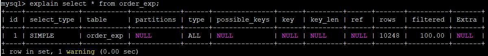

> 除了以`SELECT`开头的查询语句，其余的`DELETE`、`INSERT`、`REPLACE`以及`UPDATE` 语句前边都可以加上`EXPLAIN`，用来查看这些语句的执行计划

#### 3.1.3. 字段类型汇总表

|     字段      |                                    说明                                     |
| :-----------: | --------------------------------------------------------------------------- |
|      id       | 查询中执行 select 子句或操作表的顺序，每个`SELECT`关键字都对应一个唯一的id        |
|  select_type  | 所使用的SELECT查询类型，*常见类型详见各列说明章节*                               |
|     table     | 所使用的的数据表的名字                                                        |
|  partitions   | 匹配的分区信息                                                                |
|     type      | 表示 MySQL 在表中找到所需行的方式，又称“访问类型”。*取值与优劣排序详见各列说明章节* |
| possible_keys | 可能使用哪个索引在表中找到记录                                                 |
|      key      | 实际使用的索引                                                                |
|    key_len    | 索引中使用的字节数长度                                                        |
|      ref      | 当使用索引列等值查询时，显示哪个与索引列进行等值匹配的对象信息被使用了              |
|     rows      | 估算的找到所需的记录所需要读取的行数                                            |
|   filtered    | 通过条件过滤出后剩余行数的百分比估计值                                          |
|     extra     | 包含不适合在其他列中显示但十分重要的额外信息                                     |

#### 3.1.4. id 列

选定的执行计划中查询的序列号。**表示查询中执行select子句或操作表的顺序，id值越大优先级越高，越先被执行。id相同，执行顺序由上至下**。

##### 3.1.4.1. 单 SELECT 关键字


##### 3.1.4.2. 连接查询

对于连接查询来说，一个`SELECT`关键字后边的`FROM`子句中可以跟随多个表，所以在连接查询的执行计划中，每个表都会对应一条记录，但是这些记录的id 值都是相同的

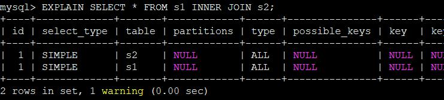

##### 3.1.4.3. 包含子查询

对于包含子查的查询语句来说，就可能涉及多个`SELECT`关键字，所以在包含子查询的查询语句的执行计划中，每个`SELECT`关键字都会对应一个唯一的id值

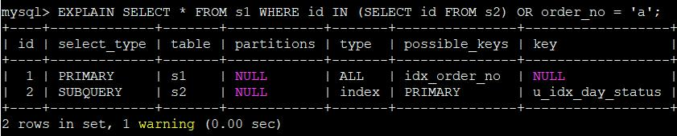

需要特别注意，查询优化器可能对涉及子查询的查询语句进行重写，从而转换为连接查询。所以如果想知道查询优化器对某个包含子查询的语句是否进行了重写，直接查看执行计划即可

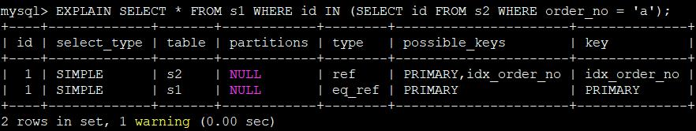

> 虽然示例的查询语句是一个子查询，但是执行计划中 s1 和 s2 表对应的记录的 id 值全部是 1，这就表明了查询优化器将子查询转换为了连接查询

##### 3.1.4.4. 包含 UNION 子句

包含`UNION`子句的查询语句，`UNION`子句会把多个查询的结果集合并起来并对结果集中的记录进行去重。MySQL使用的是内部的临时表来实现去重。在查询计划中，在内部创建了一个名为`<union1,2>`的临时表（就是执行计划第三条记录的 table 列的名称)，id 为 NULL 表明这个临时表是为了合并两个查询的结果集而创建的

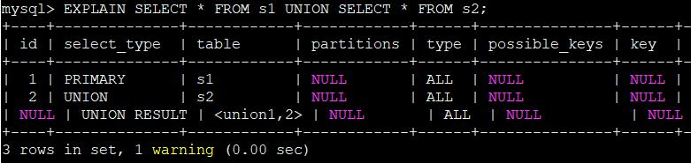

跟`UNION`对比起来，`UNION ALL`就不需要为最终的结果集进行去重，它只是单纯的把多个查询的结果集中的记录合并成一个并返回给用户，所以也就不需要使用临时表。所以在包含`UNION ALL`子句的查询的执行计划中，就没有那个id为NULL的记录

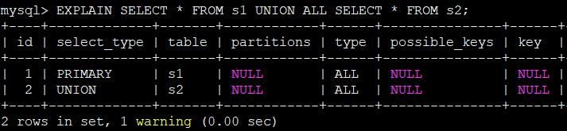

#### 3.1.5. select_type 列

表示所使用select查询类型，MySQL 为每一个`SELECT`关键字代表的小查询都定义了一个称之为`select_type`的属性，意思是我们只要知道了某个小查询的`select_type`属性，就知道了这个小查询在整个大查询中扮演了一个什么角色。常见类型汇总表如下：

|         类型         |                                                                                                       说明                                                                                                       |
| :------------------: | --------------------------------------------------------------------------------------------------------------------------------------------------------------------------------------------------------------- |
|        SIMPLE        | 简单的select查询，SQL中不包含子查询或者UNION。                                                                                                                                                                      |
|       PRIMARY        | 最外层的select查询，查询中包含复杂的子查询部分，最外层查询被标记为PRIMARY                                                                                                                                              |
|        UNION         | UNION 中的第二个或随后的select查询，不依赖于外部查询的结果集                                                                                                                                                         |
|     UNION RESULT     | 从 UNION 表获取结果集的SELECT查询被标记为 UNION RESULT                                                                                                                                                             |
|       SUBQUERY       | 子查询中的第一个 select 查询，不依赖于外部查询的结果集                                                                                                                                                               |
|   DEPENDENT UNION    | UNION 中的第二个或随后的select查询，依赖于外部查询的结果集                                                                                                                                                           |
|  DEPENDENT SUBQUERY  | 子查询中的第一个 select 查询，依赖于外部查询的结果集                                                                                                                                                                 |
|       DERIVED        | DERIVED（衍生）用来表示包含在 from 子句中的子查询的 select。若UNION 包含在 FROM 子句的子查询中，外层 SELECT 将被标记为 DERIVED。mysql 会递归执行并将结果放到一个临时表中。服务器内部称为"派生表"，因为该临时表是从子查询中派生出来 |
|     MATERIALIZED     | 物化子查询                                                                                                                                                                                                       |
| UNCACHEABLE SUBQUERY | 结果集不能被缓存的子查询，必须重新为外层查询的每一行进行评估，极少出现                                                                                                                                                  |
|  UNCACHEABLE UNION   | UNION 中的第二个或随后的select查询，属于不可缓存的子查询，极少出现                                                                                                                                                    |
|      DEPENDENT       | 意味着 select 依赖于外层查询中发现的数据                                                                                                                                                                            |
|     UNCACHEABLE      | 意味着 select 中的某些特性阻止结果被缓存于一个 item_cache中                                                                                                                                                          |

##### 3.1.5.1. SIMPLE 类型

简单的 select 查询，查询中不包含子查询或者 UNION


连接查询也算是 SIMPLE 类型

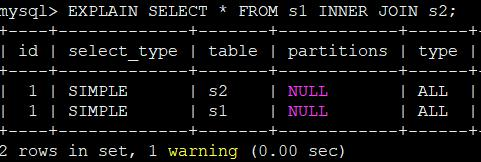

##### 3.1.5.2. PRIMARY 类型

对于包含`UNION`、`UNION ALL`或者子查询的大查询来说，它是由几个小查询组成的，其中最左边的那个查询的`select_type`值就是`PRIMARY`


##### 3.1.5.3. UNION 类型

对于包含`UNION`或者`UNION ALL`的大查询来说，它是由几个小查询组成的，其中除了最左边的那个小查询以外，其余的查询的`select_type`值就是`UNION`。（*参考上面`PRIMARY`的示例*）

##### 3.1.5.4. UNION RESULT 类型

MySQL 选择使用临时表来完成`UNION`查询的去重工作，针对该临时表的查询的`select_type`就是`UNION RESULT`。（*参考上面`PRIMARY`的示例*）

##### 3.1.5.5. SUBQUERY 类型

如果包含子查询的查询语句不能够转为对应的`semi-join`的形式，并且该子查询是不相关子查询，并且查询优化器决定采用将该子查询物化的方案来执行该子查询时，该子查询的第一个`SELECT`关键字代表的那个查询的`select_type`就是`SUBQUERY`


需要注意的是，由于`select_type`为`SUBQUERY`的子查询由于会被物化，所以只需要执行一遍

> 涉及相关名词解释：
>
> - **semi-join**：半连接优化技术，本质上是把子查询上拉到父查询中，与父查询的表做 join 操作。关键词是“上拉”。对于子查询，其子查询部分相对于父表的每个符合条件的元组，都要把子查询执行一轮。效率低下。用半连接操作优化子查询，是把子查询上拉到父查询中，这样子查询的表和父查询中的表是并列关系，父表的每个符合条件的元组，只需要在子表中找符合条件的元组即可。简单来说，就是通过将子查询上拉对父查询中的数据进行筛选，以使获取到最少量的足以对父查询记录进行筛选的信息就足够了。
> - **子查询物化**：子查询的结果通常缓存在内存或临时表中。
> - **关联/相关子查询**：子查询的执行依赖于外部查询。多数情况下是子查询的`WHERE`子句中引用了外部查询的表。自然“非关联/相关子查询”的执行则不依赖与外部的查询。

##### 3.1.5.6. DEPENDENT UNION、DEPENDENT SUBQUERY 类型

在包含`UNION`或者`UNION ALL`的大查询中，如果各个小查询都依赖于外层查询的话，那除了最左边的那个小查询之外，其余的小查询的`select_type`的值就是`DEPENDENT UNION`。例如以下查询：

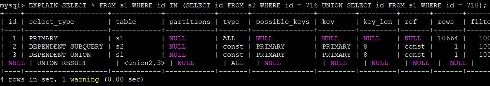

> 示例查询比较复杂，大查询里包含了一个子查询，子查询里又是由`UNION`连起来的两个小查询。从执行计划中可以看出来，`SELECT id FROM s2 WHERE id = 716`这个小查询由于是子查询中第一个查询，所以它的`select_type`是`OEPENDENTSUBOUERY`，而`SELECT id FROM s1 WHERE id = 718`这个查询的`select_type`就是`DEPENDENT UNION`。

MySQL优化器对`IN`操作符的优化会将`IN`中的非关联子查询优化成一个关联子查询。我们可以在执行上面那个执行计划后，马上执行`show warnings\G`，可以看到MySQL对SQL语句的大致改写情况：

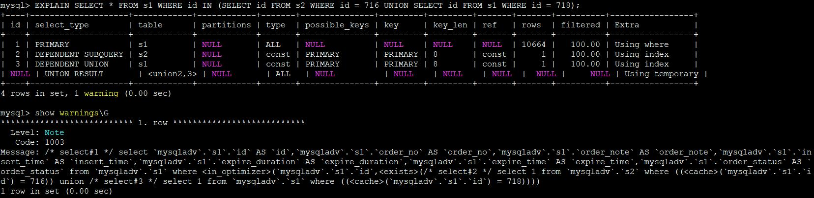

##### 3.1.5.7. DERIVED 类型

对于采用物化的方式执行的包含派生表的查询，该派生表对应的子查询的`select_type`就是`DERIVED`

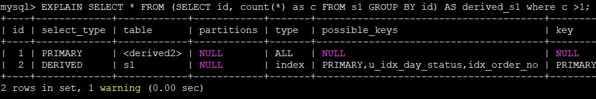

上面示例id为2的记录就代表子查询的执行方式，该子查询是以物化的方式执行的。id 为 1 的记录代表外层查询，注意到它的 table 列显示的是`<derived2>`，表示该查询是针对将派生表物化之后的表进行查询的。

##### 3.1.5.8. MATERIALIZED 类型

当查询优化器在执行包含子查询的语句时，选择将子查询物化之后与外层查询进行连接查询时，该子查询对应的`select_type` 属性就是`MATERIALIZED`，例如以下查询：

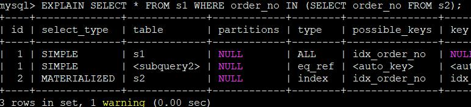

执行计划的id值为2的第三条记录，说明查询优化器是要把子查询先转换成物化表。

执行计划的前两条记录的id值都为1，说明这两条记录对应的表进行连接查询，需要注意的是第二条记录的`table`列的值是`<subquery2>`，说明该表其实就是id为2对应的子查询执行之后产生的物化表，然后将 s1和该物化表进行连接查询

##### 3.1.5.9. UNCACHEABLE SUBQUERY、UNCACHEABLE UNION 类型

极少出现，示例如下：

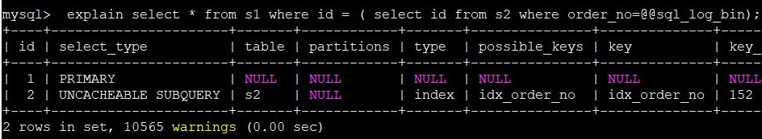

#### 3.1.6. table 列

不论我们的查询语句有多复杂，里边包含了多少个表，到最后也是需要对每个表进行单表访问。MySQL 规定 EXPLAIN 语句输出的每条记录都对应着某个单表的访问方法，该条记录的 table 列代表着该表的表名，是显示这一行的数据所使用的数据表的名字，是按被读取的先后顺序排列。

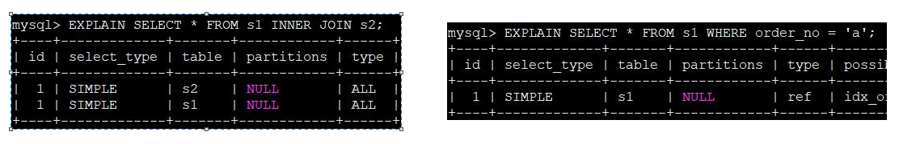

> 由示例可以看出：只涉及对 s1 表的单表查询，所以 EXPLAIN 输出中只有一条记录，其中的 table 列的值是 s1，而连接查询的执行计划中有两条记录，这两条记录的table列分别是 s1 和 s2。

#### 3.1.7. partitions 列

和分区表有关，一般情况下查询语句的执行计划的`partitions`列的值都是`NULL`。

#### 3.1.8. type 列

显示连接使用了何种类型。**此列是分析执行计划重要的指标**，连接类型结果值从最好到最差的排序如下：

`NULL > system > const > eq_ref > ref > fulltext > ref_or_null > index_merge > unique_subquery > index_subquery > range > index >ALL`

> 出现比较多的是 `system > const > eq_ref > ref > range > index > ALL`
>
> <font color=red>**一般来说，保证查询至少达到range级别，最好能达到ref级别**</font>。

type 列常见的类型汇总表：

|       类型        |                                                                                                                           说明                                                                                                                           |
| :---------------: | ------------------------------------------------------------------------------------------------------------------------------------------------------------------------------------------------------------------------------------------------------- |
|       `all`       | full table scan，mysql将遍历全表以找到匹配的行；全表扫描从磁盘中获取数据百万级别的数据ALL类型的数据尽量优化                                                                                                                                                       |
|      `index`      | Full index scan，扫描遍历索引树(扫描全表的索引，从索引中获取数据)。index和all的区别在于index类型只遍历索引                                                                                                                                                       |
|      `range`      | 索引范围扫描，对索引的扫描开始于某一点，返回匹配值的行，只检索给定范围的行，使用一个索引来选着行。key列显示使用了哪个索引。一般在WHERE语句中出现`between`、`<`、`>`、`in`等查询，这种给定范围扫描比全表扫描要好。因为它只需要开始于索引的某一点，而结束于另一点，不用扫描全部索引。 |
| `index_subquery`  | 该联接类型类似于unique_subquery。可以替换IN子查询，但只适合下列形式的子查询中的非唯一索引：`value IN (SELECT key_column FROM single_table WHERE some_expr)`                                                                                                      |
| `unique_subquery` | 该类型替换了下面形式的`IN`子查询的 ref: `value IN (SELECT primary_key FROM single_table WHERE some_expr) `。unique_subquery是一个索引查找函数，可以完全替换子查询，效率更高。                                                                                     |
|   `index_merge`   | 该联接类型表示使用了索引合并优化方法                                                                                                                                                                                                                        |
|   `ref_or_null`   | 该联接类型如同ref，但是添加了MySQL可以专门搜索包含NULL值的行                                                                                                                                                                                                  |
|    `fulltext`     | 全文索引                                                                                                                                                                                                                                                 |
|       `ref`       | 非唯一性索引扫描，返回匹配某个单独值的所有行，常见于使用非唯一索引即唯一索引的非唯一前缀进行查找；本质上是一种索引访问，它返回所有匹配某个单独值的行，就是说它可能会找到多条符合条件的数据，所以他是查找与扫描的混合体。                                                        |
|     `eq_ref`      | 唯一性索引扫描，对于每个索引键，表中只有一条记录与之匹配，常用于主键或者唯一索引扫描                                                                                                                                                                              |
|      `const`      | 当mysql对某查询某部分进行优化，并转为一个常量时，使用这些访问类型。通过索引一次查到数据，该类型主要用于比较primary key或者unique索引，因为只匹配一行数据，所以很快；如果将主键置于WHERE语句后面，Mysql就能将该查询转换为一个常量。                                            |
|     `system`      | 表只有一条记录(等于系统表)，这是const类型的特例，平时业务中不会出现                                                                                                                                                                                            |
|      `NULL`       | MySQL 在优化过程中分解语句，执行时甚至不用访问表或索引，例如从一个索引列里选取最小值可以通过单独索引查找完成                                                                                                                                                        |

##### 3.1.8.1. system 类型

当表中只有一条记录并且该表使用的存储引擎的统计数据是精确的，那么对该表的访问方式就是`system`级别。比如MyISAM、Memory之类：

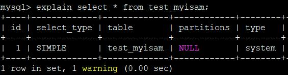

> <font color=red>**注意：只有在MyISAM这种存储引擎中，才会精确统计数据，如果改成使用InnoDB存储引擎，因为该引擎的统计非精确的，所以使用`select * from table`的话，会进行全表扫描（即`all`类型）**</font>

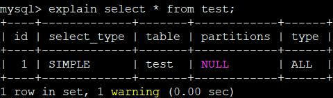

##### 3.1.8.2. const 类型（待补充）

当根据主键或者唯一二级索引列与常数进行等值匹配时，对单表的访问方法就是`const`

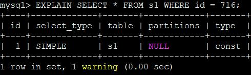


##### 3.1.8.3. eq_ref 类型（待补充）


注意：对于唯一二级索引来说，<font color=red>**查询该列包含为NULL值的情况比较特殊，在MySQL中认为每一个`null`都是独一无二的，并且会将所有为null值的行数据索引的叶子结点的最前面**</font>。而唯一二级索引列并不限制 NULL 值的数量，所以可能会访问到多条记录，也就是说`is null`不可以使用`const`类型访问方法来执行。

#### 3.1.9. possible_keys列

指显示可能应用在这张表中的索引。如果为空，没有可能的索引。可以为相关的域从WHERE语句中选择一个合适的语句

#### 3.1.10. key列

指实际使用的索引。如果为NULL，则没有使用索引。很少的情况下，MYSQL会选择优化不足的索引。这种情况下，可以在SELECT语句中使用USE INDEX（indexname）来强制使用一个索引或者用IGNORE INDEX（indexname）来强制MYSQL忽略索引

#### 3.1.11. key_len列

表示索引中使用的字节数，可通过该列计算查询中使用的索引长度。在不损失精确性的情况下，长度越短越好。key_len显示的值为索引字段的最大可能长度，并非实际使用长度，即key_len是根据表定义计算而得，不是通过表内检索出来的。

#### 3.1.12. ref列

显示索引的哪一列被使用了，有时候是一个常量。表示哪些列或常量被用于查找索引列上的值，可能值为：库.表.字段、常量、null

#### 3.1.13. rows列

MYSQL认为必须检查的用来返回请求数据的行数。根据表统计信息及索引选用的情况，大致估算找到所需记录需要读取的行数。

#### 3.1.14. filtered列

显示了通过条件过滤出的行数的百分比估计值。

#### 3.1.15. Extra列

关于MYSQL如何解析查询的额外信息，包含不适合在其他列中显示但十分重要的额外信息。可以看到的坏的例子是Using temporary和Using filesort，意思MYSQL根本不能使用索引，结果是检索会很慢。

1. `Using filesort`(文件排序)：mysql无法按照表内既定的索引顺序进行读取，称为“文件排序”。

```shell
mysql> explain select order_number from tb_order order by order_money;
+----+-------------+----------+------+---------------+------+---------+------+------+----------------+
| id | select_type | table    | type | possible_keys | key  | key_len | ref  | rows | Extra          |
+----+-------------+----------+------+---------------+------+---------+------+------+----------------+
| 1  | SIMPLE      | tb_order | ALL  | NULL          | NULL | NULL    | NULL |  1   | Using filesort |
+----+-------------+----------+------+---------------+------+---------+------+------+----------------+
1 row in set (0.00 sec)
```

说明：order_number是表内的一个唯一索引列，但是order by没有使用该索引列排序，所以mysql使用不得不另起一列进行排序。

2. `Using temporary`：Mysql使用了临时表保存中间结果，常见于排序`order by`和分组查询`group by`。

```shell
mysql> explain select order_number from tb_order group by order_money;
+----+-------------+----------+------+---------------+------+---------+------+------+---------------------------------+
| id | select_type | table    | type | possible_keys | key  | key_len | ref  | rows | Extra                           |
+----+-------------+----------+------+---------------+------+---------+------+------+---------------------------------+
| 1  | SIMPLE      | tb_order | ALL  | NULL          | NULL | NULL    | NULL |  1   | Using temporary; Using filesort |
+----+-------------+----------+------+---------------+------+---------+------+------+---------------------------------+
1 row in set (0.00 sec)
```

3. `Using index`：表示相应的select 操作使用了覆盖索引，避免访问了表的数据行，效率不错。
    - 如果同时出现Using where ，表明索引被用来执行索引键值的查找。
    - 如果没有同时出现using where 表明索引用来读取数据而非执行查找动作。

```shell
mysql> explain select order_number from tb_order group by order_number;
+----+-------------+----------+-------+--------------------+--------------------+---------+------+------+-------------+
| id | select_type | table    | type  | possible_keys      | key                | key_len | ref  | rows | Extra       |
+----+-------------+----------+-------+--------------------+--------------------+---------+------+------+-------------+
| 1  | SIMPLE      | tb_order | index | index_order_number | index_order_number | 99      | NULL |  1   | Using index |
+----+-------------+----------+-------+--------------------+--------------------+---------+------+------+-------------+
1 row in set (0.00 sec)
```

4. Using where: 表示 mysql 服务器将在存储引擎检索行后再进行过滤。许多where条件里涉及索引中的列，当（并且如果）它读取索引时，就能被存储引擎检验，因此不是所有带 where 字句的查询都会显示"Using where"。有时"Using where"的出现就是一个暗示：查询可受益与不同的索引。
5. Using join buffer ：改值强调了在获取连接条件时没有使用索引，并且需要连接缓冲区来存储中间结果。如果出现了这个值，那应该注意，根据查询的具体情况可能需要添加索引来改进能。
6. impossible where ：这个值强调了 where 语句会导致没有符合条件的行。
7. select tables optimized away：这个值意味着仅通过使用索引，优化器可能仅从聚合函数结果中返回一行
8. Index merges：当 MySQL 决定要在一个给定的表上使用超过一个索引的时候，就会出现以下格式中的一个，详细说明使用的索引以及合并的类型
    - `Using sort_union(...)`
    - `Using union(...)`
    - `Using intersect(...)`

### 3.2. SQL编写规范

1.	SQL语句中优先使用in代替or。in是范围查找，MySQL内部会对in的列表值进行排序后查找，比or效率更高
2.	如果查询结果集不需要去重、排序，应使用UNION ALL代替UNION
3.	将查询条件中的or关键字转换为UNION ALL，从应用层面处理UNION ALL中的重复数据
4.	需要使用随机数查询时，不应使用order by rand()。order by rand()会为表增加一个伪列，然后用rand()函数为每一行数据计算出rand()值，然后再基于该行排序，这通常都会生成磁盘上的临时表，因此效率非常低。**建议先使用rand()函数获得随机的主键值，然后通过主键获取数据**
5.	优先采用批量SQL语句，减少与数据库交互次数。如：

```sql
insert ... on duplicate key update
replace into
insert ignore
insert into values(), (), ...
```

6.	insert 和 update 等语句中以及select嵌套语句的最里面层，应使用明确的字段名，避免使用“*”。这样可减少网络带宽消耗，有效利用覆盖索引（如有），表结构变更对程序基本无影响
7.	使用group by 的时候，如果确认不需要排序，应使用order by null，避免多余的排序。因为group by默认会进行排序
8.	进行数据比较时，如果两边的数据类型不一致，应在一方加上类型转换的函数，避免隐式类型转换。日期类型是特例，包换DATE、TIME、DATETIME。
    - 如：`select e.username from employee e where e.birthday >= '1999-12-12 11:11:11'`
9.	限制表连接操作所涉及的表的个数。参与表连接的表数量不宜超过3个，**若有超过3个表连接的需求，建议从应用层面进行优化**
10.	限制嵌套查询的层数。过多的嵌套层数，会使用查询语句的复杂度大幅增加而影响执行效率，查询语句的嵌套层数不应该多于3层

### 3.3. MySQL数据导入性能优化

1.	对于有主键的表，导入前将数据按照主键的顺序排序，可以有效提高导入数据的效率
2.	导入数据前通过`set unique_checks=0`，关闭唯一性校验，可以提高导入效率，导入完成后再用`set unique_checks=1`打开
3.	通过`set autocommit=0`，关闭自动提交，可以提高导入效率
4.	insert语句采用`INSERT INTO VALUES(), (), ...`的方式，一条件语句插入多条数据（但需要注意SQL语句长度限制【max_allowed_packet参数，大基线默认32M】），可以幅度提高导入的效率
5.	使用工具导入（如：load data），比通过sql语句方式提速20倍
6.	使用`insert delayed ...`异步插入的方式（先写入内存），mysql可以进行合并写入，提高性能（注意：如果mysql数据库设备宕机，会丢失数据）
7.	对于要先查询是否有记录，有记录就update，没有记录则insert，最好采用下面的语法执行，减少sql交互

```sql
insert ... on duplicate key update
replace into
insert ignore
```

### 3.4. SQL语法优化的总结

1. 使用`EXPLAIN`关键字去查看执行计划
    - `type`列，连接类型。一个好的SQL语句至少要达到range级别。杜绝出现all级别。
    - `key`列，使用到的索引名。如果没有选择索引，值是NULL。可以采取强制索引方式。
    - `key_len`列，索引长度。
    - `rows`列，扫描行数。该值是个预估值。
    - `extra`列，详细说明。注意，常见的不太友好的值，如下：Using filesort，Using temporary。
2. 比较运算符能用`=`就不用`<>`，因为`=`增加了索引的使用几率。
2. 如果确定只有一条查询结果，则使用`LIMIT 1`。可以避免全表扫描，找到对应结果后就不会再继续扫描了。使EXPLAIN中type列达到const类型
3. 为列选择合适的数据类型。能用TINYINT就不用SMALLINT，能用SMALLINT就不用INT
4. 将大的`DELETE`、`UPDATE`、`INSERT`查询变成多个小查询。一个执行几十行、几百行数据的sql尽量优化成多个小的sql
5. 如果结果集允许重复或者保证两个结果集不出现重复时，使用`UNION ALL`代替`UNION`，因为`UNION ALL`不去重，效率高于`UNION`
6. 尽量避免使用`SELECT *`，因为它会进行全表扫描，不能有效利用索引，增大了数据库服务器的负担，以及它与应用程序客户端之间的网络IO开销
7. `WHERE`子句、`JOIN`子句、`ORDER BY`的列里面的列尽量使用索引。根据实际情况进行调整，因为有时索引太多也会降低性能

## 4. 高性能的索引优化策略

索引可以快速的定位表中的某条记录。如果查询时不使用索引，查询语句将查询表中的所有字段，查询速度会很慢；如果使用索引进行查询，查询语句只查询索引字段，可以减少查询的记录数，提高查询速度。

### 4.1. 常见索引列建议

- **出现在SELECT、UPDATE、DELETE语句的WHERE从句中的列**
- **包含在ORDER BY、GROUP BY、DISTINCT中的字段**
    - 并不要将符合1和2中的字段的列都建立一个索引，通常将1、2中的字段建立联合索引效果更好
- **多表join的关联列**

### 4.2. 索引列的类型尽量小

类型大小指的就是该类型表示的数据范围的大小。原因如下：

- 数据类型越小，在查询时进行的比较操作越快（CPU 层次)
- 数据类型越小，索引占用的存储空间就越少，在一个数据页内就可以放下更多的记录，从而减少磁盘/0 带来的性能损耗，也就意味着可以把更多的数据页缓存在内存中，从而加快读写效率。

此建议对于表的主键来说更加适用，因为不仅是聚簇索引中会存储主键值，其他所有的二级索引的节点处都会存储一份记录的主键值，如果主键适用更小的数据类型，也就意味着节省更多的存储空间和更高效的I/0。

### 4.3. 如何选择索引列的顺序

建立索引的目的是：希望通过索引进行数据查找，减少随机IO，增加查询性能 ，索引能过滤出越少的数据，则从磁盘中读入的数据也就越少。

- **区分度最高的放在联合索引的最左侧（区分度=列中不同值的数量/列的总行数）；**
- **尽量把字段长度小的列放在联合索引的最左侧（因为字段长度越小，一页能存储的数据量越大，IO性能也就越好）；**
- **使用最频繁的列放到联合索引的左侧（这样可以比较少的建立一些索引）。**

### 4.4. 避免建立冗余索引和重复索引

因为这样会增加查询优化器生成执行计划的时间。

- **重复索引示例：primary key(id)、index(id)、unique index(id)**
- **冗余索引示例：index(a,b,c)、index(a,b)、index(a)**

### 4.5. 优先考虑覆盖索引

**对于频繁的查询优先考虑使用覆盖索引。**

**覆盖索引：**就是包含了所有查询字段(where,select,ordery by,group by包含的字段)的索引。

**覆盖索引的好处：**

- **避免Innodb表进行索引的二次查询**

Innodb是以聚集索引的顺序来存储的，对于Innodb来说，二级索引在叶子节点中所保存的是行的主键信息。

如果是用二级索引查询数据的话，在查找到相应的键值后，还要通过主键进行二次查询才能获取我们真实所需要的数据。而在覆盖索引中，二级索引的键值中可以获取所有的数据，避免了对主键的二次查询 ，减少了IO操作，提升了查询效率。

- **可以把随机IO变成顺序IO加快查询效率**

由于覆盖索引是按键值的顺序存储的，对于IO密集型的范围查找来说，对比随机从磁盘读取每一行的数据IO要少的多，因此利用覆盖索引在访问时也可以把磁盘的随机读取的IO转变成索引查找的顺序IO。

### 4.6. 索引SET规范

**尽量避免使用外键约束**

- 不建议使用外键约束（foreign key），但一定要在表与表之间的关联键上建立索引；
- 外键可用于保证数据的参照完整性，但建议在业务端实现；
- 外键会影响父表和子表的写操作从而降低性能。

### 4.7. 查询语句中使用LIKE关键字

在查询语句中使用`LIKE`关键字进行查询时，如果匹配字符串的第一个字符为“`%`”时，索引不会被使用。如果“`%`”不是在第一个位置，索引就会被使用。

### 4.8. 查询语句中使用多列索引

多列索引是在表的多个字段上创建一个索引。只有查询条件中使用了这些字段中第一个字段时，索引才会被使用；如果查询条件中使用多列索引中的第二个字段时，索引将会失效。

### 4.9. 查询语句中使用OR关键字

查询语句只有`OR`关键字时，如果`OR`前后的两个条件的列都是索引时，查询中将使用索引；如果`OR`前后有一个条件的列不是索引，查询中将不使用索引。

### 4.10. 优化子查询

子查询的执行效率不高。子查询时，MySQL需要为内层查询语句的查询结果建立一个临时表。然后外层查询语句再临时表中查询记录。查询完毕后，MySQL需要撤销这些临时表。所以子查询的速度会受到一定的影响。如果查询的数据量比较大，影响速度就会随之增大。在MySQL中可以使用连接查询来代替子查询，连接查询不需要建立临时表，其速度比子查询要快。


## 5. 主从复制、读写分离


## 6. 数据库分库分表


