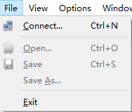

# MongoDB 安装与使用

## 1. MongoDB 官网下载地址

MongoDB 的下载地址：

- https://www.mongodb.com/try/download
- http://dl.mongodb.org/dl/win32/x86_64

下载的安装包也有两种形式，一种是一键安装的 msi 文件，还有一种是解压缩就能使用的 zip 文件，哪种形式均可

## 2. MongoDB（windows 版）安装与使用

### 2.1. msi 安装

运行 mongodb-win32-x86_64-2008plus-ssl-4.0.8-signed.msi 安装


直接默认即可，点击next


取消勾选，不安装图形化工具，否则时间非常非常长。


### 2.2. zip 解压安装

下载 zip 包后，解压即可。与安装版一样，其中 bin 目录包含了所有 mongodb 的可执行命令。mongodb 在运行时需要指定一个数据存储的目录，所以创建一个数据存储目录，通常放置在安装目录中，此处创建 data 的目录用来存储数据。解压缩与创建完毕后会得到如下文件：


### 2.3. 安装过程可能出现的问题

在 win7 系统安装 mongodb 需要 vc++ 运行库，如果没有则会提示“无法启动此程序，因为计算机中丢失“VCRUNTIME140.dll”。上网查找安装


在浏览器中搜索提示缺少的名称对应的文件，并下载，将下载的文件拷贝到 windows 安装目录的 system32 目录下，然后在命令行中执行 `regsvr32` 命令注册此文件。根据下载的文件名不同，执行命令前更改对应名称。

```bash
regsvr32 vcruntime140_1.dll
```

### 2.4. 启动 MongoDB

#### 2.4.1. 进入MongoDB的安装目录，创建相关文件

有几个文件夹具体如下（如果安装的版本没有，则手动创建）

- 数据库路径（data目录）
- 日志路径（log目录）
- 日志文件（log目录下，创建mongo.log文件）


#### 2.4.2. 创建配置文件mongo.conf

增加如下内容

```conf
# 数据库路径
dbpath=D:\development\MongoDB\Server\4.0\data
# 日志输出文件路径
logpath=D:\development\MongoDB\Server\4.0\log\mongo.log
# 错误日志采用追加模式
logappend=true
# 启用日志文件，默认启用
journal=true
# 这个选项可以过滤掉一些无用的日志信息，若需要调试使用请设置为false
quiet=true
# 端口号 默认为27017
port=27017
```

#### 2.4.3. 安装 MongoDB服务

打开 CMD 命令窗口，进入MongoDB 的安装位置的 bin 目录中

```bash
cd /d D:\xxxx\MongoDB\Server\4.0\bin
```

执行 `bin/mongod.exe`，并指定以下参数

- `--install` 参数选项，表示安装服务
- `--config` 参数选项，用于指定之前创建的配置文件。

```shell
mongod.exe --config "D:\development\MongoDB\Server\4.0\mongo.conf" --install
```

> 注：如果不创建上面的配置文件，在启动服务器时，也可以通过参数 `--dbpath` 指定数据存储位置，可以根据需要自行设置数据存储路径。默认服务端口 27017

```bash
mongod.exe --dbpath=..\data\db
```

#### 2.4.4. 启动 MongoDB 服务（需要使用管理员打开）

```shell
# 使用显示名称
net start "MongoDB Server"
# 或者使用服务名称
net start MongoDB
```

#### 2.4.5. 关闭 MongoDB 服务（需要使用管理员打开）

```shell
# 使用显示名称
net stop "MongoDB Server"
# 或者使用服务名称
net start MongoDB
```

#### 2.4.6. 移除 MongoDB 服务

```shell
"d:\MongoDB\Server\3.4\bin\mongod.exe" --remove
```

#### 2.4.7. 测试是否启动成功

启动 mongodb 服务，命令执行后，浏览器中输入 http://127.0.0.1:27017 看到如下界面即说明启动成功


#### 2.4.8. 启动客户端

也可以通过 bin 目录下的 mongo.exe 连接 mongodb

```bash
mongo --host=127.0.0.1 --port=27017
```

## 3. MongoDB（docker版）安装与启动

### 3.1. 查看可用的 MongoDB 版本

访问 MongoDB 镜像库地址： https://hub.docker.com/_/mongo?tab=tags&page=1。

### 3.2. 安装dokcer版本MongoDB

- 创建MongoDB容器

```bash
# 搜索镜像
docker search mongo
# 拉取镜像
docker pull mongo:4.0.18
# 查看本地的镜像
docker images

# 创建容器运行挂载的目录
mkdir -pv /usr/local/software/mongodb/data/db
mkdir -pv /usr/local/software/mongodb/log

# 运行容器。--auth：需要密码才能访问容器服务。
docker run -id --name mongo -v /usr/local/software/mongodb/data/db:/usr/local/software/mongodb/data/db -v /usr/local/software/mongodb/log:/usr/local/software/mongodb/log -p 27017:27017 mongo:4.0.18 --auth
```

- 查看容器运行情况

```bash
docker ps -a
```


### 3.3. 进入容器

- 连接容器

```bash
# 登陆容器
docker exec -it mongo /bin/bash
```


- 修改配置文件

```bash
# docker版本的mongoDb配置文件位置 /etc/mongod.conf.orig
cd /etc
# 更新源
apt-get update
# 安装 vim(因为容器没有vim)
apt-get install vim
# 修改mongoDb的配置文件
vim /etc/mongod.conf.orig
```

**修改注意点**

```
1.确保注释掉`# bindIp: 127.0.0.1` 或者改成`bindIp: 0.0.0.0` 即可开启远程连接
2.开启权限认证
security：
  authorization: enabled # 注意缩进，参照其他的值来改，若是缩进不对可能导致后面服务不能重启
```

> 注：以下配置文件的格式是v4.0版本以后的配置


- 重启容器

```bash
docker restart mongo
```

### 3.4. 进入mongoDB

- 启动容器之后，使用admin进入

```bash
docker exec -it mongo mongo admin
```

- 创建管理员用户

```bash
# 切换数据库
use admin
# 创建一个名为 root，密码为 123 的用户。
db.createUser({ user:'root',pwd:'123',roles:[ { role:'root', db: 'admin'}]});
# 尝试使用上面创建的用户信息进行连接。
db.auth('root', '123')
# 退出
exit
```


- 开放27017端口

```bash
firewall-cmd --zone=public --add-port=27017/tcp --permanent
```

### 3.5. 测试docker容器是否已经对外开放服务


### 3.6. 使用Navicat连接测试（连接有问题，暂未解决）


如果连接时报以下错误


- 出错的原因：操作系统开启了ipv6支持，但是mongodb未开启ipv6支持
- 解决办法有2个内
1. 删除操作系统中ipv6解析（注意是mongoDB容器的系统中的hosts）

删除`/etc/hosts`中 `::1 localhost` 这一行的内容


2. 开启mongod的ipv6支持，修改参数如下：

```
A、
    ./bin/mongod --filePermissions 0777 --ipv6
B、
    filePermissions=0777
    ipv6=true
```

> <font color="red">**注：按网上的方法暂时无法解决，但使用studio3t是可以连接**</font>


## 4. studio3t 客户端使用

studio3t 是 mongodb 优秀的客户端工具。官方网站：https://studio3t.com/

- 下载安装后运行程序，创建一个新连接：


- 填写连接信息：


- 修改字体：默认Studio3t的字体太小，需要修改字体。点击菜单：Edit --> Preferences


## 5. Robot3t 客户端使用

Robot3t 是一款绿色软件，无需安装，解压缩即可。解压缩完毕后进入安装目录双击 robot3t.exe 即可使用。


打开软件首先要连接 MongoDB 服务器，选择【File】菜单，选择【Connect...】



进入连接管理界面后，选择左上角的【Create】链接，创建新的连接设置


如果输入设置值即可连接（默认不修改即可连接本机 27017 端口）


连接成功后在命令输入区域输入命令即可操作 MongoDB

- 创建数据库：在左侧菜单中使用右键创建，输入数据库名称即可
- 创建集合：在 Collections 上使用右键创建，输入集合名称即可，集合等同于数据库中的表的作用
- 新增文档：文档是一种类似 json 格式的数据，初学者可以先把数据理解为就是 json 数据
