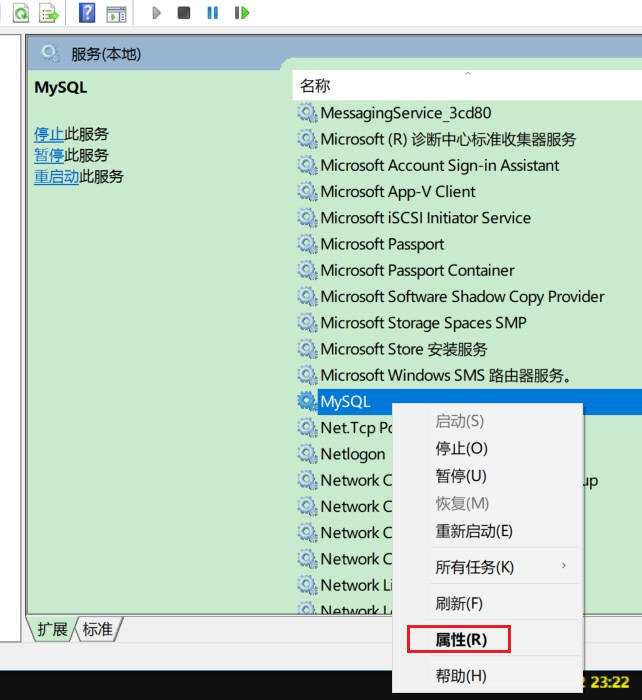
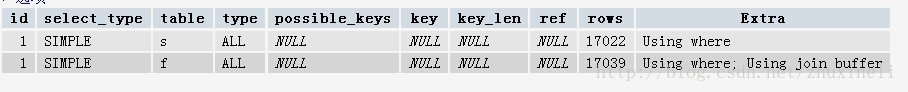

# MySQL 数据库规范与性能优化

## 1. MySQL数据库规范
### 1.1. 数据库命令规范

1. 所有数据库对象名称必须使用小写字母并用下划线分割；
2. 所有数据库对象名称禁止使用mysql保留关键字（如果表名中包含关键字查询时，需要将其用单引号括起来）；
3. 数据库对象的命名要能做到见名识意，并且最后不要超过32个字符；
4. 临时库表必须以tmp_为前缀并以日期为后缀，备份表必须以bak_为前缀并以日期(时间戳)为后缀；
5. 所有存储相同数据的列名和列类型必须一致（一般作为关联列，如果查询时关联列类型不一致会自动进行数据类型隐式转换，会造成列上的索 引失效，导致查询效率降低）。

### 1.2. 数据库基本设计规范

1. **所有表必须使用Innodb存储引擎**
    - 没有特殊要求（即Innodb无法满足的功能如：列存储，存储空间数据等）的情况下，所有表必须使用Innodb存储引擎（mysql5.5之前默认使用Myisam，5.6以后默认的为Innodb）Innodb 支持事务，支持行级锁，更好的恢复性，高并发下性能更好。
2. **数据库和表的字符集统一使用UTF8**
    - 兼容性更好，统一字符集可以避免由于字符集转换产生的乱码，不同的字符集进行比较前需要进行转换会造成索引失效。
3. **所有表和字段都需要添加注释**
    - 使用comment从句添加表和列的备注 从一开始就进行数据字典的维护。
4. **尽量控制单表数据量的大小，建议控制在500万以内**
    - 500万并不是MySQL数据库的限制，过大会造成修改表结构，备份，恢复都会有很大的问题。
    - 可以用历史数据归档（应用于日志数据），分库分表（应用于业务数据）等手段来控制数据量大小。
5. **谨慎使用MySQL分区表**
    - 分区表在物理上表现为多个文件，在逻辑上表现为一个表，谨慎选择分区键，跨分区查询效率可能更低 建议采用物理分表的方式管理大数据。
6. **尽量做到冷热数据分离，减小表的宽度**
    - MySQL限制每个表最多存储4096列，并且每一行数据的大小不能超过65535字节 减少磁盘IO,保证热数据的内存缓存命中率（表越宽，把表装载进内存缓冲池时所占用的内存也就越大,也会消耗更多的IO） 更有效的利用缓存，避免读入无用的冷数据 经常一起使用的列放到一个表中（避免更多的关联操作）。
7. **禁止在表中建立预留字段**
    - 预留字段的命名很难做到见名识义 预留字段无法确认存储的数据类型，所以无法选择合适的类型 对预留字段类型的修改，会对表进行锁定。
8. **禁止在数据库中存储图片，文件等大的二进制数据**
    - 通常文件很大，会短时间内造成数据量快速增长，数据库进行数据库读取时，通常会进行大量的随机IO操作，文件很大时，IO操作很耗时，通常存储于文件服务器，数据库只存储文件地址信息。
9. **禁止在线上做数据库压力测试**
10. **禁止从开发环境，测试环境直接连接生成环境数据库**

### 1.3. 数据库字段设计规范

1. **优先选择符合存储需要的最小的数据类型**
    - **原因**
        - 列的字段越大，建立索引时所需要的空间也就越大，这样一页中所能存储的索引节点的数量也就越少也越少，在遍历时所需要的IO次数也就越多， 索引的性能也就越差。
    - **方法**
        1. **将字符串转换成数字类型存储，如：将IP地址转换成整形数据。**
            - mysql提供了两个方法来处理ip地址：
            - `inet_aton 把ip转为无符号整形（4-8位）`
            - `inet_ntoa 把整型的ip转成地址`
            - 插入数据前，先用inet_aton把ip地址转为整型，可以节省空间。显示数据时，使用inet_ntoa把整型的ip地址转为地址显示即可。
        2. **对于非负型的数据（如自增ID、整型IP）来说，要优先使用无符号整型来存储**
            - 因为：无符号相对于有符号可以多出一倍的存储空间
            - **VARCHAR(N)中的N代表的是字符数，而不是字节数**
            - 使用UTF8存储255个汉字 Varchar(255)=765个字节。过大的长度会消耗更多的内存
2. **避免使用TEXT、BLOB数据类型，最常见的TEXT类型可以存储64k的数据**
    - **建议把BLOB或是TEXT列分离到单独的扩展表中**
        - Mysql内存临时表不支持TEXT、BLOB这样的大数据类型，如果查询中包含这样的数据，在排序等操作时，就不能使用内存临时表，必须使用磁盘临时表进行。
        - 而且对于这种数据，Mysql还是要进行二次查询，会使sql性能变得很差，但是不是说一定不能使用这样的数据类型。
        - 如果一定要使用，建议把BLOB或是TEXT列分离到单独的扩展表中，查询时一定不要使用select * 而只需要取出必要的列，不需要TEXT列的数据时不要对该列进行查询。
    - **TEXT或BLOB类型只能使用前缀索引**
        - 因为MySQL对索引字段长度是有限制的，所以TEXT类型只能使用前缀索引，并且TEXT列上是不能有默认值的。
3. **避免使用ENUM类型**
    - 修改ENUM值需要使用ALTER语句
    - ENUM类型的ORDER BY操作效率低，需要额外操作
    - 禁止使用数值作为ENUM的枚举值
4. **尽可能把所有列定义为NOT NULL**
    - 原因：
        - 索引NULL列需要额外的空间来保存，所以要占用更多的空间；
        - 进行比较和计算时要对NULL值做特别的处理。
5. **使用TIMESTAMP（4个字节）或DATETIME类型（8个字节）存储时间**
    - TIMESTAMP 存储的时间范围 1970-01-01 00:00:01 ~ 2038-01-19-03:14:07。
    - TIMESTAMP 占用4字节和INT相同，但比INT可读性高。超出TIMESTAMP取值范围的使用DATETIME类型存储。
    - 经常会有人用字符串存储日期型的数据（不正确的做法）：
        - **缺点1：无法用日期函数进行计算和比较**
        - **缺点2：用字符串存储日期要占用更多的空间**
6. **同财务相关的金额类数据必须使用decimal类型**
    - **非精准浮点：float、double**
    - **精准浮点：decimal**
    - Decimal类型为精准浮点数，在计算时不会丢失精度。占用空间由定义的宽度决定，每4个字节可以存储9位数字，并且小数点要占用一个字节。可用于存储比bigint更大的整型数据。

### 1.4. 索引设计规范

1. **限制每张表上的索引数量，建议单张表索引不超过5个**
    - 索引并不是越多越好！索引可以提高效率同样可以降低效率。
    - 索引可以增加查询效率，但同样也会降低插入和更新的效率，甚至有些情况下会降低查询效率。
    - 因为mysql优化器在选择如何优化查询时，会根据统一信息，对每一个可以用到的索引来进行评估，以生成出一个最好的执行计划，如果同时有很多个索引都可以用于查询，就会增加mysql优化器生成执行计划的时间，同样会降低查询性能。
2. **禁止给表中的每一列都建立单独的索引**
    - 5.6版本之前，一个sql只能使用到一个表中的一个索引，5.6以后，虽然有了合并索引的优化方式，但是还是远远没有使用一个联合索引的查询方式好。
3. **每个Innodb表必须有个主键**
    - Innodb是一种索引组织表：数据的存储的逻辑顺序和索引的顺序是相同的。
    - 每个表都可以有多个索引，但是表的存储顺序只能有一种 Innodb是按照主键索引的顺序来组织表的。
    - 不要使用更新频繁的列作为主键，不适用多列主键（相当于联合索引） 不要使用UUID、MD5、HASH、字符串列作为主键（无法保证数据的顺序增长）。
    - 主键建议使用自增ID值。

### 1.5. 常见索引列建议

- **出现在SELECT、UPDATE、DELETE语句的WHERE从句中的列**
- **包含在ORDER BY、GROUP BY、DISTINCT中的字段**
    - 并不要将符合1和2中的字段的列都建立一个索引，通常将1、2中的字段建立联合索引效果更好
- **多表join的关联列**

### 1.6. 如何选择索引列的顺序

建立索引的目的是：希望通过索引进行数据查找，减少随机IO，增加查询性能 ，索引能过滤出越少的数据，则从磁盘中读入的数据也就越少。

- **区分度最高的放在联合索引的最左侧（区分度=列中不同值的数量/列的总行数）；**
- **尽量把字段长度小的列放在联合索引的最左侧（因为字段长度越小，一页能存储的数据量越大，IO性能也就越好）；**
- **使用最频繁的列放到联合索引的左侧（这样可以比较少的建立一些索引）。**

### 1.7. 避免建立冗余索引和重复索引

因为这样会增加查询优化器生成执行计划的时间。

- **重复索引示例：primary key(id)、index(id)、unique index(id)**
- **冗余索引示例：index(a,b,c)、index(a,b)、index(a)**

### 1.8. 优先考虑覆盖索引

**对于频繁的查询优先考虑使用覆盖索引。**

**覆盖索引：**就是包含了所有查询字段(where,select,ordery by,group by包含的字段)的索引。

**覆盖索引的好处：**

- **避免Innodb表进行索引的二次查询**

Innodb是以聚集索引的顺序来存储的，对于Innodb来说，二级索引在叶子节点中所保存的是行的主键信息。

如果是用二级索引查询数据的话，在查找到相应的键值后，还要通过主键进行二次查询才能获取我们真实所需要的数据。而在覆盖索引中，二级索引的键值中可以获取所有的数据，避免了对主键的二次查询 ，减少了IO操作，提升了查询效率。

- **可以把随机IO变成顺序IO加快查询效率**

由于覆盖索引是按键值的顺序存储的，对于IO密集型的范围查找来说，对比随机从磁盘读取每一行的数据IO要少的多，因此利用覆盖索引在访问时也可以把磁盘的随机读取的IO转变成索引查找的顺序IO。

### 1.9. 索引SET规范

**尽量避免使用外键约束**

- 不建议使用外键约束（foreign key），但一定要在表与表之间的关联键上建立索引；
- 外键可用于保证数据的参照完整性，但建议在业务端实现；
- 外键会影响父表和子表的写操作从而降低性能。

### 1.10. 数据库SQL开发规范

1. **建议使用预编译语句进行数据库操作**
    - 预编译语句可以重复使用这些计划，减少SQL编译所需要的时间，还可以解决动态SQL所带来的SQL注入的问题 只传参数，比传递SQL语句更高效 相同语句可以一次解析，多次使用，提高处理效率。
2. **避免数据类型的隐式转换**
    - 隐式转换会导致索引失效。如：select name,phone from customer where id = '111';
3. **充分利用表上已经存在的索引**
    - 避免使用双%号的查询条件。
        - 如a like '%123%'，（如果无前置%,只有后置%，是可以用到列上的索引的）
    - 一个SQL只能利用到复合索引中的一列进行范围查询
        - 如：有 a,b,c列的联合索引，在查询条件中有a列的范围查询，则在b,c列上的索引将不会被用到，在定义联合索引时，如果a列要用到范围查找的话，就要把a列放到联合索引的右侧。
        - 使用left join或 not exists来优化not in操作，因为not in 也通常会使用索引失效。
4. **数据库设计时，应该要对以后扩展进行考虑**
5. **程序连接不同的数据库使用不同的账号，进制跨库查询**
    - 为数据库迁移和分库分表留出余地
    - 降低业务耦合度
    - 避免权限过大而产生的安全风险
6. **禁止使用 `SELECT *` 必须使用 `SELECT <字段列表>` 查询**
    - **原因：**
        - 消耗更多的CPU和IO以网络带宽资源
        - 无法使用覆盖索引
        - 可减少表结构变更带来的影响
7. **禁止使用不含字段列表的INSERT语句**
    - 如：insert into values ('a','b','c');
    - 应使用insert into t(c1,c2,c3) values ('a','b','c');
8. **避免使用子查询，可以把子查询优化为join操作**
    - 通常子查询在in子句中，且子查询中为简单SQL(不包含union、group by、order by、limit从句)时，才可以把子查询转化为关联查询进行优化。
    - 子查询性能差的原因：
        - 子查询的结果集无法使用索引，通常子查询的结果集会被存储到临时表中，不论是内存临时表还是磁盘临时表都不会存在索引，所以查询性能 会受到一定的影响；
        - 特别是对于返回结果集比较大的子查询，其对查询性能的影响也就越大；
        - 由于子查询会产生大量的临时表也没有索引，所以会消耗过多的CPU和IO资源，产生大量的慢查询。
9. **避免使用JOIN关联太多的表**
    - 对于Mysql来说，是存在关联缓存的，缓存的大小可以由join_buffer_size参数进行设置。
    - 在Mysql中，对于同一个SQL多关联（join）一个表，就会多分配一个关联缓存，如果在一个SQL中关联的表越多，所占用的内存也就越大。
    - 如果程序中大量的使用了多表关联的操作，同时join_buffer_size设置的也不合理的情况下，就容易造成服务器内存溢出的情况，就会影响到服务器数据库性能的稳定性。
    - 同时对于关联操作来说，会产生临时表操作，影响查询效率Mysql最多允许关联61个表，建议不超过5个。
10. **减少同数据库的交互次数**
    - 数据库更适合处理批量操作 合并多个相同的操作到一起，可以提高处理效率
11. **对应同一列进行or判断时，使用in代替or**
    - in的值不要超过500个in操作可以更有效的利用索引，or大多数情况下很少能利用到索引。
12. **禁止使用`order by rand()`进行随机排序**
    - 会把表中所有符合条件的数据装载到内存中，然后在内存中对所有数据根据随机生成的值进行排序，并且可能会对每一行都生成一个随机值，如果满足条件的数据集非常大，就会消耗大量的CPU和IO及内存资源。
    - 推荐在程序中获取一个随机值，然后从数据库中获取数据的方式。
13. **WHERE从句中禁止对列进行函数转换和计算**
    - 对列进行函数转换或计算时会导致无法使用索引。
    - 不推荐：`where date(create_time)='20190101'`
    - 推荐：`where create_time >= '20190101 and create_time < '20190102'`
14. **在明显不会有重复值时使用UNION ALL而不是UNION**
    - UNION会把两个结果集的所有数据放到临时表中后再进行去重操作
    - UNION ALL不会再对结果集进行去重操作
15. **拆分复杂的大SQL为多个小SQL**
    - 大SQL：逻辑上比较复杂，需要占用大量CPU进行计算的SQL
    - MySQL：一个SQL只能使用一个CPU进行计算
    - SQL拆分后可以通过并行执行来提高处理效率

### 1.11. 数据库操作行为规范

1. **超100万行的批量写（UPDATE、DELETE、INSERT）操作，要分批多次进行操作**
    - **大批量操作可能会造成严重的主从延迟**
        - 主从环境中，大批量操作可能会造成严重的主从延迟，大批量的写操作一般都需要执行一定长的时间，而只有当主库上执行完成后，才会在其他从库上执行，所以会造成主库与从库长时间的延迟情况
    - **binlog日志为row格式时会产生大量的日志**
        - 大批量写操作会产生大量日志，特别是对于row格式二进制数据而言，由于在row格式中会记录每一行数据的修改，我们一次修改的数据越多，产生的日志量也就会越多，日志的传输和恢复所需要的时间也就越长，这也是造成主从延迟的一个原因。
    - **避免产生大事务操作**
        - 大批量修改数据，一定是在一个事务中进行的，这就会造成表中大批量数据进行锁定，从而导致大量的阻塞，阻塞会对MySQL的性能产生非常大的影响。
        - 特别是长时间的阻塞会占满所有数据库的可用连接，这会使生产环境中的其他应用无法连接到数据库，因此一定要注意大批量写操作要进行分批。
2. **对于大表使用pt-online-schema-change修改表结构**
    - **避免大表修改产生的主从延迟**
    - **避免在对表字段进行修改时进行锁表**
        - 对大表数据结构的修改一定要谨慎，会造成严重的锁表操作，尤其是生产环境，是不能容忍的。
        - pt-online-schema-change它会首先建立一个与原表结构相同的新表，并且在新表上进行表结构的修改，然后再把原表中的数据复制到新表中，并在原表中增加一些触发器。
        - 把原表中新增的数据也复制到新表中，在行所有数据复制完成之后，把新表命名成原表，并把原来的表删除掉。
        - 把原来一个DDL操作，分解成多个小的批次进行。
3. **禁止为程序使用的账号赋予super权限**
    - 当达到最大连接数限制时，还运行1个有super权限的用户连接super权限只能留给DBA处理问题的账号使用。
4. **对于程序连接数据库账号，遵循权限最小原则**
    - 程序使用数据库账号只能在一个DB下使用，不准跨库 程序使用的账号原则上不准有drop权限。

---

## 2. MySQL数据库优化准备工作
### 2.1. 开启慢查询日志

当查询超过一定的时间没有返回结果的时候，才会记录到慢查询日志中。**默认不开启**，采样的时候手工开启。可以帮助找出执行慢的sql语句

- 查看慢SQL日志是否启用（on表示启用）

```sql
show variables like 'slow_query_log';
```

- 查看执行慢于多少秒的SQL会记录到日志文件中

```sql
show variables like 'long_query_time';
```

- 使用模糊搜索，查看所有含有query的变量信息

```sql
show variables like '%query%';
```

### 2.2. 开启慢查询日志方式1 - 修改mysql配置参数

mysql配置文件名称是：`my.ini`（Linux系统下的文件名为`my.cnf`）

window下可以通过打开【服务】，右键点击mysql服务，查询【属性】。里面有`--defaults-file="D:\development\MySQL\MySQL Server 5.5\my.ini"`，可以打到mysql配置文件的位置




修改配置文件，**1代表on，0做表off**。(*注：如果mysql5.5版本，配置文件是没有慢日志的配置，而5.7版本的配置文件里是默认有慢日志的配置。所以5.5需要自己手动增加*)：

```ini
[mysqld]
# ====== 5.5版本需要手动增加，5.7以上版本默认有慢日志配置 ======

log_slow_queries=ON
# 是否开启慢查询日志
slow_query_log=ON
# 指定保存路径及文件名，默认为数据文件目录
slow_query_log_file="slow-query.log"
# 指定多少秒返回查询结果为慢查询
long_query_time=2
# 记录所有没有使用到索引的查询语句
log_queries_not_using_indexes=ON
# 记录那些由于查找了多于1000次而引发的慢查询
min_examined_row_limit=1000
# 记录那些慢的optimize table, analyze table和alter table语句
log_slow_admin_statements=1
# 记录由slave所产生的慢查询
log_slow_slave_statements=1

# The TCP/IP Port the MySQL Server will listen on
port=3306
```

修改配置文件后需要重启mysql服务才能生效

### 2.3. 开启慢查询日志方式2 - 命令行修改慢查询配置

**命令行修改配置方式不需要重启即可生效，但如果重启之后会自动失效**。因为mysql数据库每次启动，都是读取本身的my.ini配置文件，以配置文件的参数为准

```sql
set global slow_query_log=1;
set global slow_query_log_file="slow-query.log";
set global long_query_time=2;
set global log_queries_not_using_indexes=1;
set global min_examined_row_limit=1000;
set global log_slow_admin_statements=1;
set global log_slow_slave_statements=1;
```

如果需要修改其他参数，可以通过以下命令查阅

```sql
show variables like '%query%';
show variables like '%slow%';
```

### 2.4. 慢日志格式

一条完整的日志包括：时间、主机信息、执行信息、执行时间、执行内容

```log
# User@Host: root[root] @ localhost [127.0.0.1]
# Query_time: 0.011991  Lock_time: 0.000000 Rows_sent: 10374  Rows_examined: 14376
SET timestamp=1554258810;
SELECT t.id,t.actor_ids FROM jav_main t WHERE t.actor_ids LIKE '%,%';
```

### 2.5. 查询缓存
#### 2.5.1. 查询缓存状态

Query Cache会缓存select查询，安装mysql时默认是开启。但是如果对表进行了insert, update, delete, truncate, alter table, drop table, or drop database等操作时，之前的缓存会无效并且删除。这样一定程度上会影响数据库的性能。

所以对一些频繁变动表的情况开启缓存是不明智的。还有一种情况是在测试数据库性能的时候也需要关闭缓存，避免缓存对于测试数据的影响

查询缓存的启用状态，query_cache_type字段是on的时候，代表开启缓存

```sql
show variables like '%cache%';
```

#### 2.5.2. 关闭缓存

关闭缓存有两种方式：一种是临时关闭，一种是永久关闭

1. 临时关闭，直接在命令行执行

```sql
-- 一般建议缓存的大小为32M (33554432)
set global query_cache_size=0;
-- 如果配置文件中为关闭缓存的话，不能通过命令开启缓存
set global query_cache_type=0;
```

2. 永久关闭，修改配置文件my.cnf(my.ini)，添加以下配置

```ini
# 设置缓存的大小
query_cache_size=0
# 设置关闭缓存
query_cache_type=0
```

#### 2.5.3. `sql_no_cache`关键字禁用缓存

可以使用`sql_no_cache`关键字在sql语句中直接禁用缓存。如：

```sql
-- 指定当前查询不使用缓存
select sql_no_cache count(*) from test_table;
-- 指定当前查询使用缓存（其实不需要加此关键字，因为默认缓存已经开启了）
select sql_cache count(*) from test_table;
```

### 2.6. 分析工具(了解)
#### 2.6.1. Mysqldumpslow

mysqldumpslow 是 mysql 自带的用来分析慢查询的工具，基于 perl 开发。

Windows 下需要下载安装 perl 编译器，下载地址：http://pan.baidu.com/s/1i3GLKAp

参考：https://www.cnblogs.com/moss_tan_jun/p/8025504.html

#### 2.6.2. Mysqlsla

Mysqlsla 是 daniel-nichter 用 perl 写的一个脚本，专门用于处理分析 Mysql 的日志而存在。通过 Mysql 的日志主要分为：General log，slow log，binary log 三种。通过 query 日志，可以分析业务的逻辑，业务特点。通过 slow log，可以找到服务器的瓶颈。通过 binary log，可以恢复数据。Mysqlsla 可以处理其中的任意日志。

参考：https://yq.aliyun.com/articles/59260

#### 2.6.3. pt-query-digest

pt-query-digest 是用于分析 mysql 慢查询的一个工具，它可以分析 binlog、General log、slowlog，也可以通过 SHOWPROCESSLIST 或者通过 tcpdump 抓取的 MySQL 协议数据来进行分析。可以把分析结果输出到文件中，分析过程是先对查询语句的条件进行参数化，然后对参数化以后的查询进行分组统计，统计出各查询的执行时间、次数、占比等，可以借助分析结果找出问题进行优化。

参考：https://blog.csdn.net/seteor/article/details/24017913

---

## 3. 数据库引擎（选择）
### 3.1. InnoDB 存储引擎

InnoDB 是一个事务型的存储引擎，有行级锁定和外键约束。

### 3.2. MyISAM 存储引擎

MyISAM存储引擎的插入数据快，空间和内存使用比较低。

### 3.3. MEMORY 存储引擎

MEMORY存储引擎的所有数据都在内存中，数据的处理速度快，但安全性不高。

### 3.4. Blackhole 黑洞引擎
#### 3.4.1. 定义

任何写入到此引擎的数据均会被丢弃掉，不做实际存储；Select 语句的内容永远是空。他会丢弃所有的插入的数据，服务器会记录下 Blackhole 表的日志，所以可以用于复制数据到备份数据库。

#### 3.4.2. 使用场景

1. 验证 dump file 语法的正确性
2. 以使用 blackhole 引擎来检测 binlog 功能所需要的额外负载

```sql
CREATE TABLE `Blackhole` (
	`id` BIGINT (20) UNSIGNED NOT NULL,
	`fname` VARCHAR (100) NOT NULL,
	`lname` VARCHAR (100) NOT NULL,
	`age` TINYINT (3) UNSIGNED NOT NULL,
	`sex` TINYINT (1) UNSIGNED NOT NULL,
	PRIMARY KEY (`id`)
) ENGINE = Blackhole DEFAULT CHARSET = utf8
```

### 3.5. Innodb 对比 myIsam

参考资料【\2019.03.20-博学谷-MySQL数据库性能优化\mySQL数据库性能优化-讲义.pdf】

---

## 4. SQL语句优化
### 4.1. EXPLAIN 执行计划
#### 4.1.1. explain简介

MySQL数据库的`explain`关键字显示了MySQL如何使用索引来处理select语句以及连接表，`explain`可以帮助分析 select 语句，知道查询效率低下的原因，从而改进查询语句，让查询优化器能够更好的工作。例如：

```sql
EXPLAIN SELECT
	s.uid,s.username,s.NAME,f.email,f.mobile,
	f.phone,f.postalcode,f.address
FROM
	uchome_space AS s,
	uchome_spacefield AS f
WHERE
	1 = 1
AND s.groupid = 0
AND s.uid = f.uid
```

得到结果：



#### 4.1.2. 字段类型汇总表

|     字段      | 说明                                                         |
| :-----------: | ------------------------------------------------------------ |
|      id       | 查询中执行 select 子句或操作表的顺序                         |
|  Select_type  | 所使用的 SELECT 查询类型，包括以下常见类型：SIMPLE、 PRIMARY、SUBQUERY、UNION、DERIVED、UNION RESULT、DEPENDENT、UNCACHEABLE |
|     table     | 所使用的的数据表的名字                                       |
|     type      | 表示 MySQL 在表中找到所需行的方式，又称“访问类型”。取值按优劣排序为 NULL > system > const > eq_ref > ref > fulltext > ref_or_null > index_merge > unique_subquery > index_subquery > range > index > ALL |
| Possible_keys | 可能使用哪个索引在表中找到记录                               |
|      key      | 实际使用的索引                                               |
|    key_len    | 索引中使用的字节数                                           |
|      ref      | 显示索引的哪一列被使用了                                     |
|     rows      | 估算的找到所需的记录所需要读取的行数                         |
|   filtered    | 通过条件过滤出的行数的百分比估计值                           |
|     extra     | 包含不适合在其他列中显示但十分重要的额外信息                 |

#### 4.1.3. id列

选定的执行计划中查询的序列号。表示查询中执行select子句或操作表的顺序，id值越大优先级越高，越先被执行。id相同，执行顺序由上至下。

#### 4.1.4. select_type列

表示所使用select查询类型，包括以下常见类型：

| select_type 查询类型 | 说明                                                         |
| :------------------: | :----------------------------------------------------------- |
|        SIMPLE        | 简单的 select 查询，SQL中不包含子查询或者UNION。             |
|       PRIMARY        | 最外层的 select 查询，查询中包含复杂的子查询部分，最外层查询被标记为PRIMARY |
|        UNION         | UNION 中的第二个或随后的 select 查询，不依赖于外部查询的结果集 |
|   DEPENDENT UNION    | UNION 中的第二个或随后的 select 查询，依赖于外部查询的结果集 |
|       SUBQUERY       | 子查询中的第一个 select 查询，不依赖于外部查询的结果集       |
|  DEPENDENT SUBQUERY  | 子查询中的第一个 select 查询，依赖于外部查询的结果集         |
|       DERIVED        | DERIVED（衍生）用来表示包含在 from 子句中的子查询的 select。若UNION 包含在 FROM 子句的子查询中，外层 SELECT 将被标记为 DERIVED。mysql 会递归执行并将结果放到一个临时表中。服务器内部称为"派生表"，因为该临时表是从子查询中派生出来 |
| UNCACHEABLE SUBQUERY | 结果集不能被缓存的子查询，必须重新为外层查询的每一行进行评估。 |
|  UNCACHEABLE UNION   | UNION 中的第二个或随后的 select 查询，属于不可缓存的子查询   |
|     UNION RESULT     | 从 UNION 表获取结果的 SELECT 被标记为 UNION RESULT           |
|      DEPENDENT       | 意味着 select 依赖于外层查询中发现的数据                     |
|     UNCACHEABLE      | 意味着 select 中的某些特性阻止结果被缓存于一个 item_cache中  |

#### 4.1.5. table列

显示这一行的数据所使用的数据表的名字，是按被读取的先后顺序排列。

#### 4.1.6. type列

显示连接使用了何种类型。**这是重要的列**，从最好到最差的连接类型为 `NULL > system > const > eq_ref > ref > fulltext > ref_or_null > index_merge > unique_subquery > index_subquery > range > index >ALL`。**一般来说，保证查询至少达到range级别，最好能达到ref**。以下标红的是常见的类型：

- **`all`**：full table scan，mysql将遍历全表以找到匹配的行；全表扫描从磁盘中获取数据百万级别的数据ALL类型的数据尽量优化。
- **`index`**：Full index scan，扫描遍历索引树(扫描全表的索引，从索引中获取数据)。index 和 all的区别在于index类型只遍历索引；
- **`range`**：索引范围扫描，对索引的扫描开始于某一点，返回匹配值的行，只检索给定范围的行，使用一个索引来选着行。key列显示使用了哪个索引。一般在WHERE语句中出现`between`、`<`、`>`、`in`等查询，这种给定范围扫描比全表扫描要好。因为它只需要开始于索引的某一点，而结束于另一点，不用扫描全部索引。
- `ref_or_null`：该联接类型如同ref，但是添加了 MySQL 可以专门搜索包含 NULL 值的行
- `index_merge`：该联接类型表示使用了索引合并优化方法
- `unique_subquery`：该类型替换了下面形式的 IN 子查询的 ref: `value IN (SELECT primary_key FROM single_table WHERE some_expr) `。unique_subquery是一个索引查找函数，可以完全替换子查询，效率更高。
- `index_subquery`：该联接类型类似于unique_subquery。可以替换IN子查询，但只适合下列形式的子查询中的非唯一索引：`value IN (SELECT key_column FROM single_table WHERE some_expr)`
- **`ref`**：非唯一性索引扫描，返回匹配某个单独值的所有行，常见于使用非唯一索引即唯一索引的非唯一前缀进行查找；本质上是一种索引访问，它返回所有匹配某个单独值的行，就是说它可能会找到多条符合条件的数据，所以他是查找与扫描的混合体。
- **`eq_ref`**：唯一性索引扫描，对于每个索引键，表中只有一条记录与之匹配，常用于主键或者唯一索引扫描；
- **`const`**：当mysql对某查询某部分进行优化，并转为一个常量时，使用这些访问类型。通过索引一次查到数据，该类型主要用于比较primary key 或者unique 索引，因为只匹配一行数据，所以很快；如果将主键置于WHERE语句后面，Mysql就能将该查询转换为一个常量。
- **`system`**：表只有一条记录(等于系统表)，这是const类型的特例，平时业务中不会出现。
- `NULL`：MySQL 在优化过程中分解语句，执行时甚至不用访问表或索引，例如从一个索引列里选取最小值可以通过单独索引查找完成。

#### 4.1.7. possible_keys列

指显示可能应用在这张表中的索引。如果为空，没有可能的索引。可以为相关的域从WHERE语句中选择一个合适的语句

#### 4.1.8. key列

指实际使用的索引。如果为NULL，则没有使用索引。很少的情况下，MYSQL会选择优化不足的索引。这种情况下，可以在SELECT语句中使用USE INDEX（indexname）来强制使用一个索引或者用IGNORE INDEX（indexname）来强制MYSQL忽略索引

#### 4.1.9. key_len列

表示索引中使用的字节数，可通过该列计算查询中使用的索引长度。在不损失精确性的情况下，长度越短越好。key_len显示的值为索引字段的最大可能长度，并非实际使用长度，即key_len是根据表定义计算而得，不是通过表内检索出来的。

#### 4.1.10. ref列

显示索引的哪一列被使用了，有时候是一个常量。表示哪些列或常量被用于查找索引列上的值，可能值为：库.表.字段、常量、null

#### 4.1.11. rows列

MYSQL认为必须检查的用来返回请求数据的行数。根据表统计信息及索引选用的情况，大致估算找到所需记录需要读取的行数。

#### 4.1.12. filtered列

显示了通过条件过滤出的行数的百分比估计值。

#### 4.1.13. Extra列

关于MYSQL如何解析查询的额外信息，包含不适合在其他列中显示但十分重要的额外信息。可以看到的坏的例子是Using temporary和Using filesort，意思MYSQL根本不能使用索引，结果是检索会很慢。

1. `Using filesort`(文件排序)：mysql无法按照表内既定的索引顺序进行读取，称为“文件排序”。

```shell
mysql> explain select order_number from tb_order order by order_money;
+----+-------------+----------+------+---------------+------+---------+------+------+----------------+
| id | select_type | table    | type | possible_keys | key  | key_len | ref  | rows | Extra          |
+----+-------------+----------+------+---------------+------+---------+------+------+----------------+
| 1  | SIMPLE      | tb_order | ALL  | NULL          | NULL | NULL    | NULL |  1   | Using filesort |
+----+-------------+----------+------+---------------+------+---------+------+------+----------------+
1 row in set (0.00 sec)
```

说明：order_number是表内的一个唯一索引列，但是order by没有使用该索引列排序，所以mysql使用不得不另起一列进行排序。

2. `Using temporary`：Mysql使用了临时表保存中间结果，常见于排序`order by`和分组查询`group by`。

```shell
mysql> explain select order_number from tb_order group by order_money;
+----+-------------+----------+------+---------------+------+---------+------+------+---------------------------------+
| id | select_type | table    | type | possible_keys | key  | key_len | ref  | rows | Extra                           |
+----+-------------+----------+------+---------------+------+---------+------+------+---------------------------------+
| 1  | SIMPLE      | tb_order | ALL  | NULL          | NULL | NULL    | NULL |  1   | Using temporary; Using filesort |
+----+-------------+----------+------+---------------+------+---------+------+------+---------------------------------+
1 row in set (0.00 sec)
```

3. `Using index`：表示相应的select 操作使用了覆盖索引，避免访问了表的数据行，效率不错。
    - 如果同时出现Using where ，表明索引被用来执行索引键值的查找。
    - 如果没有同时出现using where 表明索引用来读取数据而非执行查找动作。

```shell
mysql> explain select order_number from tb_order group by order_number;
+----+-------------+----------+-------+--------------------+--------------------+---------+------+------+-------------+
| id | select_type | table    | type  | possible_keys      | key                | key_len | ref  | rows | Extra       |
+----+-------------+----------+-------+--------------------+--------------------+---------+------+------+-------------+
| 1  | SIMPLE      | tb_order | index | index_order_number | index_order_number | 99      | NULL |  1   | Using index |
+----+-------------+----------+-------+--------------------+--------------------+---------+------+------+-------------+
1 row in set (0.00 sec)
```

4. Using where: 表示 mysql 服务器将在存储引擎检索行后再进行过滤。许多where条件里涉及索引中的列，当（并且如果）它读取索引时，就能被存储引擎检验，因此不是所有带 where 字句的查询都会显示"Using where"。有时"Using where"的出现就是一个暗示：查询可受益与不同的索引。
5. Using join buffer ：改值强调了在获取连接条件时没有使用索引，并且需要连接缓冲区来存储中间结果。如果出现了这个值，那应该注意，根据查询的具体情况可能需要添加索引来改进能。
6. impossible where ：这个值强调了 where 语句会导致没有符合条件的行。
7. select tables optimized away：这个值意味着仅通过使用索引，优化器可能仅从聚合函数结果中返回一行
8. Index merges：当 MySQL 决定要在一个给定的表上使用超过一个索引的时候，就会出现以下格式中的一个，详细说明使用的索引以及合并的类型
    - `Using sort_union(...)`
    - `Using union(...)`
    - `Using intersect(...)`

### 4.2. SQL编写规范

1.	SQL语句中优先使用in代替or。in是范围查找，MySQL内部会对in的列表值进行排序后查找，比or效率更高
2.	如果查询结果集不需要去重、排序，应使用UNION ALL代替UNION
3.	将查询条件中的or关键字转换为UNION ALL，从应用层面处理UNION ALL中的重复数据
4.	需要使用随机数查询时，不应使用order by rand()。order by rand()会为表增加一个伪列，然后用rand()函数为每一行数据计算出rand()值，然后再基于该行排序，这通常都会生成磁盘上的临时表，因此效率非常低。**建议先使用rand()函数获得随机的主键值，然后通过主键获取数据**
5.	优先采用批量SQL语句，减少与数据库交互次数。如：

```sql
insert ... on duplicate key update
replace into
insert ignore
insert into values(), (), ...
```

6.	insert 和 update 等语句中以及select嵌套语句的最里面层，应使用明确的字段名，避免使用“*”。这样可减少网络带宽消耗，有效利用覆盖索引（如有），表结构变更对程序基本无影响
7.	使用group by 的时候，如果确认不需要排序，应使用order by null，避免多余的排序。因为group by默认会进行排序
8.	进行数据比较时，如果两边的数据类型不一致，应在一方加上类型转换的函数，避免隐式类型转换。日期类型是特例，包换DATE、TIME、DATETIME。
    - 如：`select e.username from employee e where e.birthday >= '1999-12-12 11:11:11'`
9.	限制表连接操作所涉及的表的个数。参与表连接的表数量不宜超过3个，**若有超过3个表连接的需求，建议从应用层面进行优化**
10.	限制嵌套查询的层数。过多的嵌套层数，会使用查询语句的复杂度大幅增加而影响执行效率，查询语句的嵌套层数不应该多于3层

### 4.3. MySQL数据导入性能优化

1.	对于有主键的表，导入前将数据按照主键的顺序排序，可以有效提高导入数据的效率
2.	导入数据前通过`set unique_checks=0`，关闭唯一性校验，可以提高导入效率，导入完成后再用`set unique_checks=1`打开
3.	通过`set autocommit=0`，关闭自动提交，可以提高导入效率
4.	insert语句采用`INSERT INTO VALUES(), (), ...`的方式，一条件语句插入多条数据（但需要注意SQL语句长度限制【max_allowed_packet参数，大基线默认32M】），可以幅度提高导入的效率
5.	使用工具导入（如：load data），比通过sql语句方式提速20倍
6.	使用`insert delayed ...`异步插入的方式（先写入内存），mysql可以进行合并写入，提高性能（注意：如果mysql数据库设备宕机，会丢失数据）
7.	对于要先查询是否有记录，有记录就update，没有记录则insert，最好采用下面的语法执行，减少sql交互

```sql
insert ... on duplicate key update
replace into
insert ignore
```

### 4.4. SQL语法优化的总结

1. 使用`EXPLAIN`关键字去查看执行计划
    - `type`列，连接类型。一个好的SQL语句至少要达到range级别。杜绝出现all级别。
    - `key`列，使用到的索引名。如果没有选择索引，值是NULL。可以采取强制索引方式。
    - `key_len`列，索引长度。
    - `rows`列，扫描行数。该值是个预估值。
    - `extra`列，详细说明。注意，常见的不太友好的值，如下：Using filesort，Using temporary。
2. 比较运算符能用`=`就不用`<>`，因为`=`增加了索引的使用几率。
2. 如果确定只有一条查询结果，则使用`LIMIT 1`。可以避免全表扫描，找到对应结果后就不会再继续扫描了。使EXPLAIN中type列达到const类型
3. 为列选择合适的数据类型。能用TINYINT就不用SMALLINT，能用SMALLINT就不用INT
4. 将大的`DELETE`、`UPDATE`、`INSERT`查询变成多个小查询。一个执行几十行、几百行数据的sql尽量优化成多个小的sql
5. 如果结果集允许重复或者保证两个结果集不出现重复时，使用`UNION ALL`代替`UNION`，因为`UNION ALL`不去重，效率高于`UNION`
6. 尽量避免使用`SELECT *`，因为它会进行全表扫描，不能有效利用索引，增大了数据库服务器的负担，以及它与应用程序客户端之间的网络IO开销
7. `WHERE`子句、`JOIN`子句、`ORDER BY`的列里面的列尽量使用索引。根据实际情况进行调整，因为有时索引太多也会降低性能

---

## 5. 索引优化

索引可以快速的定位表中的某条记录。如果查询时不使用索引，查询语句将查询表中的所有字段，查询速度会很慢；如果使用索引进行查询，查询语句只查询索引字段，可以减少查询的记录数，提高查询速度

### 5.1. 查询语句中使用LIKE关键字

在查询语句中使用LIKE关键字进行查询时，如果匹配字符串的第一个字符为“%”时，索引不会被使用。如果“%”不是在第一个位置，索引就会被使用。

### 5.2. 查询语句中使用多列索引

多列索引是在表的多个字段上创建一个索引。只有查询条件中使用了这些字段中第一个字段时，索引才会被使用；如果查询条件中使用多列索引中的第二个字段时，索引将会失效。

### 5.3. 查询语句中使用OR关键字

查询语句只有OR关键字时，如果OR前后的两个条件的列都是索引时，查询中将使用索引；如果OR前后有一个条件的列不是索引，查询中将不使用索引。

### 5.4. 优化子查询

子查询的执行效率不高。子查询时，MySQL需要为内层查询语句的查询结果建立一个临时表。然后外层查询语句再临时表中查询记录。查询完毕后，MySQL需要撤销这些临时表。所以子查询的速度会受到一定的影响。如果查询的数据量比较大，影响速度就会随之增大。在MySQL中可以使用连接查询来代替子查询，连接查询不需要建立临时表，其速度比子查询要快。


## 6. 主从复制、读写分离


## 7. 数据库分库分表


