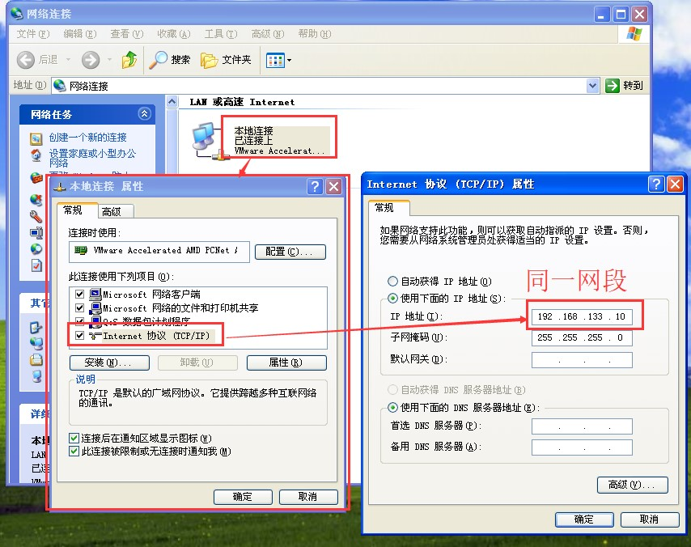
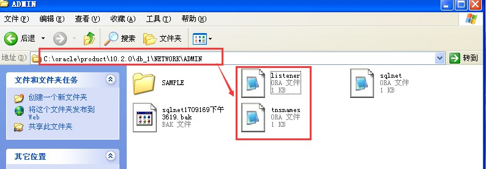
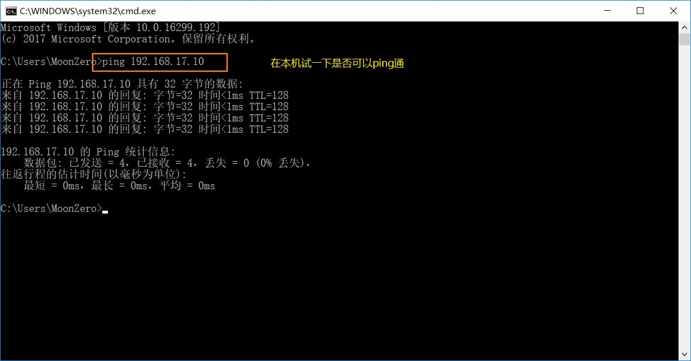

# Oracle 基础笔记

## 1. Oracle 的基本概念

ORACLE 数据库系统是美国 ORACLE 公司（甲骨文）提供的以分布式数据库为核心的一组软件产品，是目前最流行的客户/服务器(CLIENT/SERVER)或 B/S 体系结构的数据库之一。

**Oracle默认的端口号是：1521**

### 1.1. 在虚拟机中安装Oracle

在安装完成前将scott和hr的两个账号解锁，可以设置新口令，如果使用默认的口令是:tiger

在虚拟机中验证Oracle是否安装成功

1. 打开“运行”，输入cmd，进行命令行。输入sqlplus system/口令密码
2. 登陆成功后可以查询Oracle里面的表格测试一下


### 1.2. 虚拟网卡设置

本机和虚拟机之间能相互访问，它们的 IP 段必须相同，配置方式如下

1. 为虚拟机添加虚拟网卡


2. 开启修改权限，点击下图的“更改设置”


3. 点击添加网络


4. 添加后会自动分配子网IP，不用修改。点击应用、确定


5. 添加完成后本机的网络上会多出一个网络适配器，根据虚拟机中的子网IP设置此IP地址


6. 自定义虚拟机的网络适配器，自定义为刚才手动添加的那个网络适配器


7. 回到XP虚拟机中设置IP，记得要与上述中的虚拟网络设置成同一网段的即可，比如我们设置为192.168.133.10



8. 修改Oracle的两个核心文件，进入虚拟机找到Oracle的安装目录

      
    - 打开listener.ora把红色框的内容改为我们刚才设置的虚拟机的ip地址: 192.168.133.10  
    
    - 打开tnsname.ora把红色框的内容改为虚拟机的IP: 192.168.133.10  
    

9. 重启Oracle的两个服务


配置好测试一下是否ping通



### 1.3. PLSQL Developer 客户端工具的安装

参考文档：G:\Java编程工具资料\数据库\Oracle数据库安装视频教程\02、测试sqlplus客户端连接服务器.doc

命令行输入

```shell
sqlplus system/moon@192.168.17.10:1521/orcl
```

- 格式：`sqlplus system/密码@远程IP:1521/orcl`
- 注：moon是自己设置的口令密码，**orcl是安装oracle时填写的全局数据库名！！！！！**


### 1.4. 安装 PLSQL Developer 客户端

参考文档：G:\Java编程工具资料\数据库\Oracle数据库安装视频教程\03、安装PLSQL并测试连接.doc

### 1.5. 中文乱码的处理

1. 查看服务器端编码

```sql
select userenv('language') from dual;
-- 实际查到的结果为：AMERICAN_AMERICA.ZHS16GBK
```

2. 执行语句 `select * from V$NLS_PARAMETERS`
    - 查看第一行中PARAMETER项中为NLS_LANGUAGE对应的VALUE项中是否和第一步得到的值一样。如果不是，需要设置环境变量。
    - 否则PLSQL客户端使用的编码和服务器端编码不一致，插入中文时就会出现乱码。
3. 设置环境变量
    - 计算机 --> 属性 --> 高级系统设置 --> 环境变量 --> 新建
    - 设置变量名：`NLS_LANG`
    - 变量值：第1步查到的值: `AMERICAN_AMERICA.ZHS16GBK`
4. 重新启动PLSQL，插入数据正常

### 1.6. 本次安装oracle相关信息

- system口令：moon
- SCOTT的口令:123456
- HR的口令:123456
- oracle连接的虚拟网络
    - 子网IP:192.168.187.0	；子网掩码:255.255.255.0
    - win10设置VMware Network Adapter VMnet5：
        - 子网IP:192.168.187.1；子网掩码:255.255.255.0
    - 虚拟机XP系统设置
        - 子网IP:192.168.187.10；子网掩码:255.255.255.0

## 2. Oracle 数据库的体系结构

- 数据库：一个操作系统只有一个oracle数据库
- 实例：数据库的后台的一系列进程，一个计算机只有一个实例
- 数据文件（dbf）：数据库软件操作的
- 表空间：一个表空间可以有多个数据文件，但是一个数据文件只属于一个表空间
- 用户：用户操作表空间

### 2.1. 数据库：database

Oracle 数据库是数据的物理存储。这就包括（数据文件 ORA 或者 DBF、控制文件、联机日志、参数文件）。其实 Oracle 数据库的概念和其它数据库不一样，**一个操作系统只有一个oracle数据库**。可以看作是 Oracle 就只有一个大数据库

### 2.2. 实例：Oracle Instance

**一个计算机只有一个Oracle实例**

一个 Oracle 实例（Oracle Instance）有一系列的后台进程（Backguound Processes)和内存结构（Memory Structures)组成。一个数据库可以有 n 个实例。

### 2.3. 数据文件（dbf）

数据文件(.dbf)，由数据库软件操作的

数据文件是数据库的物理存储单位。数据库的数据是存储在表空间中的，真正是在某一个或者多个数据文件中。而一个表空间可以由一个或多个数据文件组成，一个数据文件只能属于一个表空间。一旦数据文件被加入到某个表空间后，就不能删除这个文件，**如果要删除某个数据文件，只能删除其所属于的表空间才行**。

### 2.4. 表空间

表空间是 Oracle 对物理数据库上相关数据文件（ORA 或者 DBF 文件）的逻辑映射。一个数据库在逻辑上被划分成一到若干个表空间，每个表空间包含了在逻辑上相关联的一组结构。每个数据库至少有一个表空间(称之为 system 表空间)。 	每个表空间由同一磁盘上的一个或多个文件组成，这些文件叫数据文件(datafile)。**一个数据文件只能属于一个表空间**

### 2.5. 用户

用户是在实例下建立的。不同实例中可以建相同名字的用户

注：表的数据，是有用户放入某一个表空间的，而这个表空间会随机把这些表数据放到一个或者多个数据文件中

由于 oracle 的数据库不是普通的概念，oracle 是有用户和表空间对数据进行管理和存放的。但是表不是有表空间去查询的，而是由用户去查的。因为不同用户可以在同一个表空间建立同一个名字的表！这里区分就是用户了！

### 2.6. SCOTT 用户和 HR 用户

SCOTT 与 HR 就是初始的普通用户，这些用户下面都默认存在了表结构。scott用户与hr用户的表结构：


### 2.7. Oracle 语法注意事项
#### 2.7.1. Oracle语句大小写问题

oracle中分为两种情况，单纯的sql语句不区分大小写，但是如果查询某个字符的话就需要区分大小写。

1. 如以下情况，是不区分大小写的，查询结果都是一致的：

```sql
select * from emp;
SELECT * FROM EMP;
```

2. 如在emp表中查询ename为"SMITH"（不含引号）的信息，就必须注意大小写：

```sql
select * from emp where ename='SMITH';
```

#### 2.7.2. dual 伪表

***dual：是oracle提供的一张伪表，用于补全sql语法***

```sql
select upper('abc');  // 执行会报错
select upper('abc') from dual;  // 这样才可以执行
```

#### 2.7.3. oracle完整的sql语法

```sql
select *|指定的列名
	from 表名
	where 条件
	group by 分组
	having 条件
	order by 排序
```


---

# Oracle 其他知识
## 1. 系统表user_tables/all_tables/dba_tables

- user_tables、all_tables、dba_tables关系：
    - user_tables：可查询当前用户的表；
    - all_tables：可查询所有的(当前用户有权限)表；（只要对某个表有任何权限，即可在此视图中看到表的相关信息）
    - dba_tables：可查询包括系统表在内的所有表。需要DBA权限才能查询
- 以上3个视图中，user_tables的范围最小，all_tables看到的东西稍多一些，而dba_tables看到最多的信息

## 2. 数据库锁表

`for update`：会对所查询到得结果集进行加锁，不允许其他程序修改
`for update nowait`：也会对所查询到得结果集进行加锁，别的线程对结果集进行操作时会报错ORA-00054，提示：内容是资源正忙，但指定以 NOWAIT 方式获取资源。
`select t.*,t.rowid from 表名`：用ROWID来定位记录是最快的，比索引还快，不加锁查询。不会锁表

